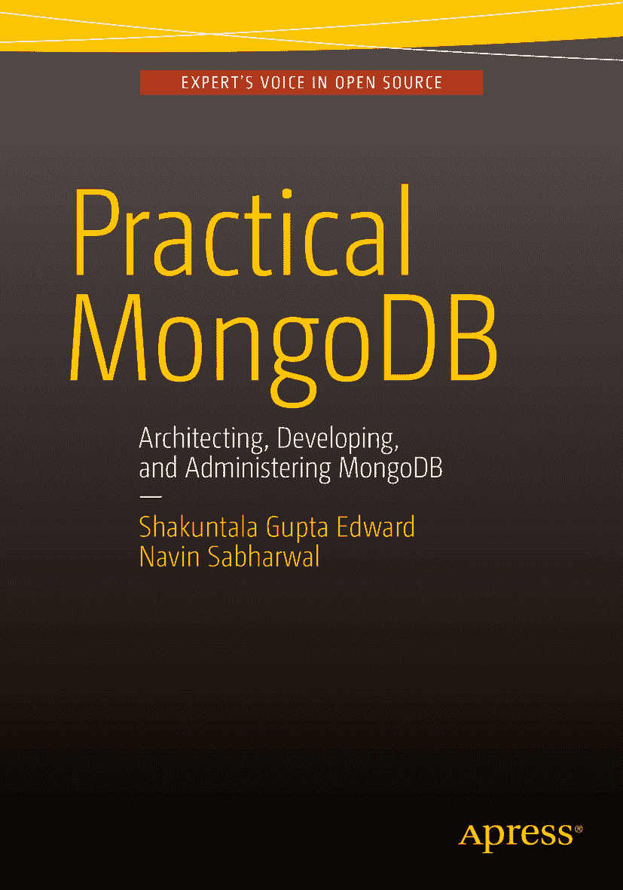

Shakuntala Gupta Edward 和 Navin Sabharwal 合著 《MongoDB 实战：架构设计、开发与管理》 第 1 版 2015 年

作者在本作品中引用的任何源代码或其他补充材料，读者均可访问 [`www.apress.com`](http://www.apress.com) 获取。有关如何查找本书源代码的详细信息，请访问 [`www.apress.com/source-code/`](http://www.apress.com/source-code/)。

ISBN 978-1-4842-0648-5
e-ISBN 978-1-4842-0647-8
DOI 10.1007/978-1-4842-0647-8
美国国会图书馆控制编号: 2015959699

© Shakuntala Gupta Edward, Navin Sabharwal 2015

《MongoDB 实战：架构设计、开发与管理》

Managing Director: Welmoed Spahr
Acquisitions Editor: Celestin Suresh John
Developmental Editor: Douglas Pundick
Technical Reviewer: Gopala Manchukunda
Editorial Board: Steve Anglin, Mark Beckner, Ewan Buckingham, Gary Cornell, Louise Corrigan, James DeWolf, Jonathan Gennick, Robert Hutchinson, Celestin Suresh John, Michelle Lowman, James Markham, Susan McDermott, Matthew Moodie, Jeffrey Pepper, Douglas Pundick, Ben Renow-Clarke, Gwenan Spearing, Matt Wade, Steve Weiss
Coordinating Editor: Rita Fernando
Copy Editor: Mary Behr
Compositor: SPi Global
Indexer: SPi Global

有关翻译事宜，请发送电子邮件至 `rights@apress.com`，或访问 [`www.apress.com`](http://www.apress.com)。

Apress 和 friends of ED 的图书可批量购买用于学术、企业或推广用途。大多数图书也提供电子书版本和许可。欲了解更多信息，请参阅我们的批量销售-电子书许可专页 [`www.apress.com/bulk-sales`](http://www.apress.com/bulk-sales)。

本书中可能出现标准的 Apress 商标名称、标识和图像。我们并非在每次使用商标名称、标识和图像时都附上商标符号，而是仅以编辑方式并为商标所有者利益而使用这些名称、标识和图像，无侵犯商标权之意。本书中对商品名称、商标、服务标识及类似术语的使用，即使未特别标识，也不应被视为表达了它们是否受专有权约束的意见。

尽管本书中的建议和信息在出版时被认为是真实和准确的，但作者、编辑或出版商均不对可能出现的任何错误或遗漏承担任何法律责任。出版商对本出版物所含材料不作任何明示或暗示的担保。本书使用无酸纸印刷。

本书通过 Springer Science+Business Media New York（地址：233 Spring Street, 6th Floor, New York, NY 10013，电话：1-800-SPRINGER，传真：(201) 348-4505，电子邮件：orders-ny@springer-sbm.com，或访问 www.springeronline.com）向全球图书贸易发行。

Apress Media, LLC 是一家加利福尼亚州有限责任公司，其唯一成员（所有者）是 Springer Science + Business Media Finance Inc (SSBM Finance Inc)。SSBM Finance Inc 是一家特拉华州公司。

献给那些让我的生命有价值、将我塑造成今日之我的人们，以及指引我人生每一步的上帝。
—Shakuntala Gupta Edward

献给我所爱的人和我所信仰的上帝。
—Navin Sabharwal

## 前言

数据仓库作为一个行业，已经存在了相当多年。关系数据库用于存储数据已有数十年历史，而 `SQL` 一直是与 `RDBMS` 交互的事实上的标准语言。随着社交网络、物联网以及互联网上海量非结构化数据的出现，数据存储、处理和分析的需求呈爆炸式增长。传统的 `RDBMS` 系统和存储技术并非为处理如此庞大且多样的数据而设计。

由此诞生了大数据技术，这些技术如今为各种互联网规模的公司及其海量数据提供动力。Facebook、Twitter、Google 和 Yahoo 等公司正在利用大数据技术，提供支持数百万用户的互联网规模的产品和服务。

本书将帮助读者理解大数据技术、其出现背景及必要性，然后我们将从技术角度深入探讨如何使用 `MongoDB` 架构解决方案。本书将使读者能够理解大数据技术适用的关键用例，并为他们提供指导，说明应在何处谨慎使用大数据技术，或将其与传统的 `RDBMS` 技术结合以提供可行的解决方案。

除了架构之外，本书还旨在提供关于学习 `MongoDB` 并使用 `MongoDB` 创建应用程序和解决方案的逐步指南。

我们真诚地希望读者能像我们享受撰写本书一样，享受阅读本书的乐趣。

### 关于本书

本书：

*   充当指南，帮助读者掌握大数据技术中的各种流行术语，并深入了解大数据的各个方面。
*   充当指南，帮助人们理解 `NoSQL` 和基于文档的数据库，以及它们与传统关系数据库的不同之处。
*   深入探讨使用 `MongoDB` 架构解决方案，同时也提供了关于 `MongoDB` 作为工具的局限性信息。
*   系统地涵盖了 `MongoDB` 的架构、开发、管理和数据模型。
*   引用示例，以使用户能够轻松上手该技术。

### 本书所需环境

`MongoDB` 支持最流行的平台。

请从 `MongoDB` 下载页面 ([`http://www.mongodb.org/downloads/`](http://www.mongodb.org/downloads/)) 下载最新的稳定生产版本 `MongoDB`。

在本书中，我们重点介绍了在 64 位 `Windows` 平台上使用 `MongoDB`，并在一些地方引用了如何在运行 `Linux` 的系统上操作 `MongoDB` 的参考。

我们将使用 64 位 `Windows 2008 R2` 和 `LINUX` 作为安装过程的示例。

### 本书读者对象

本书将对程序员、大数据架构师、应用架构师、技术爱好者、学生、解决方案专家以及那些希望为自己的需求选择正确大数据产品的人士产生兴趣。

本书涵盖了大数据、`NOSQL` 以及关于 `MongoDB` 架构和开发的详细信息。因此，它适用于在 `MongoDB` 上工作的开发人员、架构师和运维团队的用例。

## 致谢

特别感谢为本书创作提供帮助的 Rajeev Pratap Singh 和 Amit Agrawal（帮助提供代码片段），以及 Dheeraj Raghav（在本书设计方面提供了创意投入）。

万分感谢 Stuti Awasthi，她是本书的发起者和灵感来源。

作者谨向大数据技术的创造者和开源社区致谢，感谢他们提供了如此强大的工具和技术用于编码，并使得能够轻松快速地解决实际业务问题的产品和解决方案成为可能。

