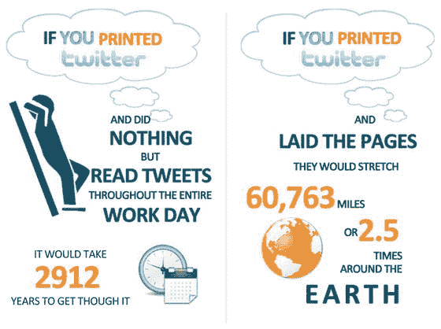
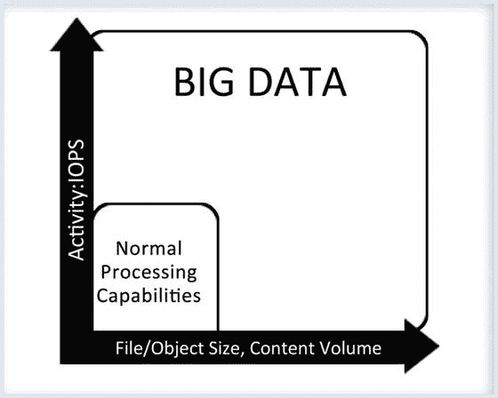
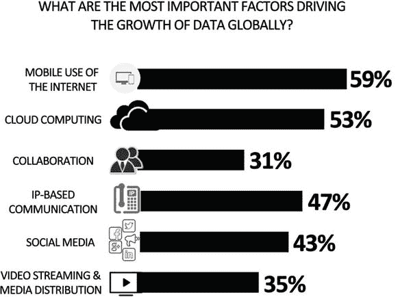
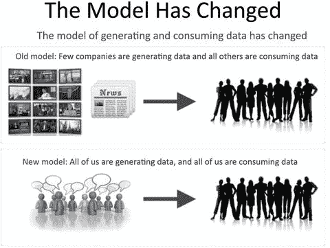
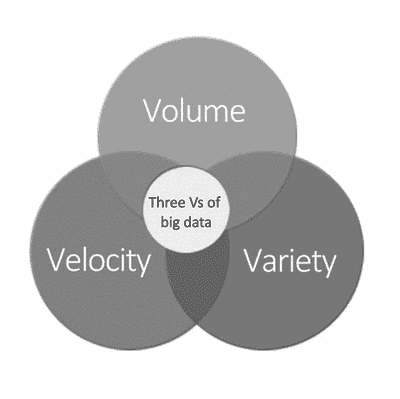
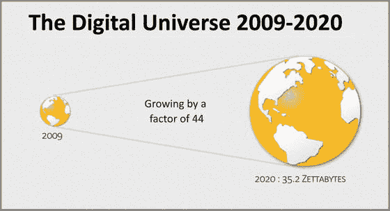
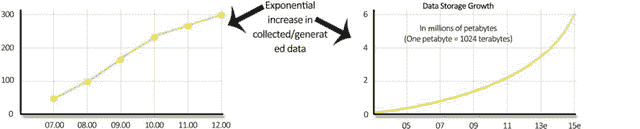
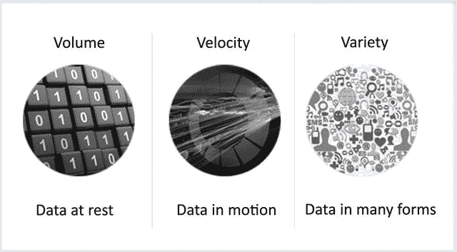

# 1. 大数据

> “大数据是一个用于描述具有巨大体量、以多样结构产生且生成速度极快的数据的术语。这类数据对传统用于存储和处理数据的 `RDBMS` 系统构成了挑战。大数据正在为处理和存储数据的新方法铺平道路。”

在本章中，我们将讨论大数据的基础知识、来源和挑战。我们将向你介绍大数据的三个 V（体量、速度、多样性），以及传统技术在处理大数据时面临的限制。

## 1.1 入门介绍

大数据，连同云计算、社交网络、分析和移动性，是当今信息技术领域的热门词汇。互联网和面向大众的电子设备的可用性每天都在增加。具体而言，智能手机、社交网站以及其他生成数据的设备（如平板电脑和传感器）正在引发数据的爆炸式增长。数据从各种来源以多种格式生成，例如视频、文本、语音、日志文件和图像。高清（`HD`）视频的一秒钟产生的数据量是一整页文本的 2000 倍。

考虑以下 Facebook 公司网站上报告的统计数据：

2015 年 6 月的日均活跃用户数为 9.68 亿。2015 年 6 月的移动日均活跃用户数为 8.44 亿。
截至 2015 年 6 月 30 日，月活跃用户数为 14.9 亿。移动月活跃用户数为 13.1 亿。
截至 2013 年 5 月，每日产生的“赞”数量为 45 亿，比 2012 年 8 月增长了 67%。

图 1-1 描绘了 Twitter 的统计数据。

**图 1-1.** 如果你打印出 Twitter……

这是另一个例子：考虑像看电影这样一个简单事件可能产生的数据量。你从在电影评论网站上搜索电影开始，阅读关于该电影的评论，并发布问题。你可能会在 Twitter 上发推文或在 Facebook 上发布去看电影的照片。在前往影院的途中，你的 `GPS` 系统会追踪你的路线并生成数据。

你明白了吧：智能手机、社交网站和其他媒体正在为企业制造数据洪流，以供其处理和存储。当数据规模对典型软件工具捕获、处理、存储和管理数据的能力构成挑战时，我们手上就有了大数据。图 1-2 以图形方式定义了大数据。

**图 1-2.** 大数据的定义

## 1.2 大数据

大数据是指具有高体量、高速生成且种类繁多的数据。让我们看一些关于大数据的事实和数字。

### 1.2.1 关于大数据的事实

世界各地的各种研究团队对正在生成的数据量进行了分析。例如，`IDC` 的分析显示，单一年份（2007 年）产生的数字数据量大于全球的总存储容量，这意味着无法存储所有正在生成的数据。此外，数据生成的速度将很快超过数据存储容量扩张的速度。

以下部分涵盖了 `MGI`（麦肯锡全球研究院）于 2011 年 5 月发布的报告（`www.mckinsey.com/insights/business_technology/big_data_the_next_frontier_for_innovation`）中的见解。该研究指出，大数据的商业和经济可能性及其更广泛的影响是企业领导者和政策制定者必须应对的重要问题。

#### 1.2.1.1 大数据规模因行业而异

大数据的增长是每个行业都观察到的现象。`MGI` 估计，2010 年全球企业使用了超过 7 艾字节的增量磁盘驱动器数据存储容量；有趣的是，其中近 80%似乎是在其他地方存储的数据的副本。`MGI` 还估计，到 2009 年，美国经济中几乎所有行业每家公司的平均存储数据至少达到 200 太字节，而许多行业的平均存储数据超过 1 拍字节。

一些行业的数据密集度远高于其他行业；在这里，数据密集度指的是该行业公司/企业间积累的平均数据量，意味着它们有更多潜力从大数据中获取价值。

金融服务行业，包括银行、投资和证券服务，高度以交易为导向；法规也要求它们存储数据。分析显示，它们平均每个公司存储的数字数据最多。

通信和媒体公司、公用事业公司以及政府机构或组织也存储了大量数字数据，这似乎反映了这些实体具有高业务量和多媒体数据的事实。

离散型和流程型制造业的字节存储总量最高。然而，这些行业在数据密集度方面的排名要低得多，因为它们分散在大量公司中。

#### 1.2.1.2 大数据类型因行业而异

`MGI` 的研究还显示，存储的数据类型也因行业而异。例如，零售和批发、政府行政部分以及金融服务都产生了大量的文本和数字数据，包括客户数据、交易信息以及数学建模和仿真。制造业、医疗保健、媒体和通信等行业负责更高比例的多媒体数据。在医疗保健领域，以 X 光、CT 和其他扫描形式存在的图像数据主导了数据存储量。

就大数据的地理分布而言，目前北美和欧洲占全球总量的 70%。得益于云计算，在一个地区生成的数据可以存储在另一个国家的数据中心。因此，拥有重要云服务和托管服务提供商的国家往往拥有较高的数据存储量。

## 1.3 大数据来源

在本节中，我们将探讨导致数据规模不断增长的主要因素。图 1-3 描绘了主要的贡献来源。

*图 1-3. 数据来源*

正如 MGI 报告所强调的，这些数据的主要来源包括：

*   **企业**：它们现在以更精细的粒度收集数据，为每笔交易附加更多细节，以理解消费者行为。
*   **多媒体使用量在各行业的增长**：例如医疗保健、产品公司等。
*   **社交媒体网站的日益普及**：如 Facebook、Twitter 等。
*   **智能手机的快速普及**：这使得用户能够积极使用社交媒体网站和其他互联网应用。
*   **传感器和设备在日常世界中的使用增加**：这些设备通过网络连接到计算资源。

MGI 报告还预测，诸如传感器这类机器对机器设备（也称为**物联网**，或**IoT**）的数量在未来五年内将以每年超过 30%的速度增长。

因此，数据的增长速率在提高，其多样性也在增加。此外，数据生成的模式已经从少数公司生成数据、其他方消费数据，转变为**每个人都在生成数据，每个人都在消费数据**。这源于消费级 IT 和互联网技术的渗透，以及像社交媒体这样的趋势。图 1-4 描绘了数据生成模式的转变。

*图 1-4. 数据模式*

## 1.4 大数据的三个 V

我们将大数据定义为具有三个 V 的数据：**Volume（容量）**、**Velocity（速度）** 和 **Variety（多样性）**，如图 1-5 所示。让我们来了解一下这三个 V。对于组织和 IT 领导者而言，关注这些方面势在必行。

*图 1-5. 大数据的三个 V。“大”并不仅仅指容量*

### 1.4.1 容量

大数据中的容量指的是数据的规模。如前面章节所讨论的，多种因素导致了大数据规模的增长：随着业务变得更加交易导向，我们看到交易数量不断增加；更多设备接入互联网，这也增加了数据量；互联网使用量增加；以及内容的数字化程度提升。图 1-6 描绘了自 2009 年以来数字宇宙的增长。

*图 1-6. 数字宇宙规模*

在当今场景下，数据不仅来自企业内部；它也基于与扩展企业和客户的交易而产生。这要求企业对客户数据进行广泛的维护。**PB（拍字节）** 级规模如今已变得司空见惯。图 1-7 描绘了数据的增长率。

*图 1-7. 增长率*

如此庞大的数据量是大数据技术面临的最大挑战。以及时且成本效益高的方式存储、处理并使数据可访问所需的存储和处理能力是巨大的。

### 1.4.2 多样性

来自各种设备和来源生成的数据没有固定的格式或结构。与文本、CSV 或 RDBMS 数据相比，数据可以来自文本文件、日志文件、流媒体视频、照片、仪表读数、股票行情数据、PDF、音频以及各种其他非结构化格式。

如今，对数据结构的控制是不存在的。新的数据来源和结构正在以极快的速度被创造出来。因此，责任落在了技术上，需要找到一种解决方案来分析和可视化存在的大量多样的数据。例如，为了为通勤者提供替代路线，一个交通分析应用程序需要来自数百万智能手机和传感器的实时数据馈送，以提供关于交通状况和替代路线的准确分析。

### 1.4.3 速度

大数据中的速度指的是数据生成的速度，以及它需要被处理的速度。如果数据不能以所需的速度处理，它就会失去其重要性。由于数据流来自社交媒体网站、传感器、行情指示器、计量和监控设备，对于组织来说，在数据移动时和静止时都快速处理数据至关重要（见图 1-8）。快速反应和处理以应对数据的速度，是大数据技术面临的又一挑战。

*图 1-8. 数据的三个层面*

实时洞察在许多大数据用例中至关重要。例如，一个算法交易系统从市场和像 Twitter 这样的社交媒体网站获取实时数据输入，以做出股票交易决策。处理这些数据的任何延迟都可能意味着在股票交易中损失数百万美元的机会。

每当讨论大数据时，都会提到第四个 V。第四个 V 是**Veracity（真实性）**，这意味着并非所有数据都是重要的，因此必须识别哪些数据能提供有意义的洞察，哪些应该被忽略。

## 1.5 大数据的使用

本节将重点介绍利用大数据为组织创造价值的方法。在我们深入探讨如何让大数据为组织所用之前，让我们首先看看为什么大数据很重要。

大数据是一个全新的数据源；它是你在博客上发文、点赞产品或旅行时生成的数据。以前，这种极其细致的信息并未被捕获。现在它被捕获了，拥抱此类数据的组织可以追求创新、提高敏捷性并增加其盈利能力。

大数据可以通过多种方式为任何组织创造价值。正如 MGI 报告所列出的，这可以大致分为五种大数据使用方式。

### 1.5.1 可见性

及时地将数据提供给相关利益相关者，可以创造巨大的价值。让我们用一个例子来理解这一点。假设一家制造公司的研发、工程和制造部门地理位置分散。如果这些部门之间的数据可以访问并能随时整合，那么它不仅可以减少搜索和处理时间，还有助于根据当前需求提高产品质量。

### 1.5.2 发现与分析信息

大数据的大部分价值来自于当从外部来源收集的数据可以与组织的内部数据合并时。组织正在捕获关于库存、员工和客户的详细数据。通过利用所有这些数据，他们可以发现并分析新的信息和模式；结果，这些信息和知识可以用来改进流程和绩效。

### 1.5.3 细分与定制

大数据使组织能够创建量身定制的产品和服务，以满足特定的细分需求。这也可以用于社会领域，以精确划分人群并针对特定需求定向投放福利计划。基于各种参数的客户细分有助于开展定向营销活动，并调整产品以满足客户需求。

### 1.5.4 辅助决策制定

大数据可以显著降低风险、改进决策制定并揭示有价值的洞察。信用卡处理中的自动欺诈警报系统和库存的自动微调，都是基于大数据分析来辅助或自动化决策制定的系统实例。

### 1.5.5 创新

大数据为新产品和服务形式的创新提供了可能。它也为现有产品和服务的创新提供了支持，以覆盖更广泛的人群。制造商利用为实际产品收集的数据，不仅可以创新创造下一代产品，还可以创新销售方案。

例如，可以分析来自机器和车辆的实时数据，为维护计划提供见解；可以监控机器的磨损情况，以制造更具弹性的机器；可以监控燃油消耗，从而提高发动机效率。实时交通信息已经通过为通勤者提供替代路线的选择，使他们的生活更加便捷。

因此，大数据不仅仅是数据的规模。它的机遇在于从不断增长的数据池中发现有意义的见解。它帮助组织做出更明智的决策，从而使其更加敏捷。它不仅为组织提供了通过明智决策来加强现有业务的机会，还有助于识别新的机会。

## 1.6 大数据挑战

大数据也带来了一些挑战。在本节中，我们将重点介绍其中的几个。

### 1.6.1 政策与程序

随着越来越多的数据被收集、数字化并在全球范围内传输，政策和合规性问题变得越来越重要。数据隐私、安全、知识产权和保护对组织至关重要。

遵守各种法定和法律要求对数据处理提出了挑战。数据所有权和相关责任问题是大数据案例中需要处理的重要法律方面。

此外，许多大数据项目利用了公共云计算提供者的可扩展性功能。这对合规性提出了挑战。

关于谁拥有数据、数据的公平使用如何定义、谁对数据的准确性和保密性负责等政策问题也需要得到解答。

### 1.6.2 数据访问

为消费目的访问数据对大数据项目来说是一个挑战。部分数据可能对第三方可用，而获得访问权限可能是一个法律或合同上的挑战。

关于产品或服务的数据可能分布在 Facebook、Twitter 动态、评论和博客上，那么产品所有者如何从各种提供商拥有的不同来源访问这些数据呢？

同样，需要将访问大数据的合同条款和经济激励措施联系起来，以使消费者能够获得数据。

### 1.6.3 技术与技巧

必须利用专门为满足大数据需求而构建的新工具和技术，而不是试图通过遗留系统来解决上述问题。一方面，遗留系统不足以处理大数据，另一方面，缺乏掌握新技术经验丰富的资源，这是任何大数据项目都必须应对的挑战。

## 1.7 遗留系统与大数据

在本节中，我们将讨论组织在使用遗留系统管理大数据时面临的挑战。

### 1.7.1 大数据的结构

遗留系统旨在处理结构化数据，其中定义了包含列的表格。存储在列中的数据格式也是已知的。

然而，大数据是具有多种结构的数据。它基本上是诸如图像、视频、日志等非结构化数据。

由于大数据可能是非结构化的，而遗留系统是为了通过基于各种列中保存的特定数据类型的索引等技术执行快速查询和分析而创建的，因此无法用于保存或处理大数据。

### 1.7.2 数据存储

遗留系统使用大型服务器以及 NAS 和 SAN 系统来存储数据。随着数据增加，服务器大小和后端存储大小也必须增加。传统的遗留系统通常采用向上扩展模型，需要不断向一台服务器添加更多的计算、内存和存储资源，以满足日益增长的数据需求。因此，处理时间呈指数级增长，这违背了大数据的另一个重要要求，即速度。

### 1.7.3 数据处理

遗留系统中的算法被设计为处理诸如字符串和整数等结构化数据。它们还受到数据大小的限制。因此，遗留系统无法处理非结构化数据的处理、海量数据的处理以及所需执行处理的高速要求。

因此，为了从大数据中获取价值，我们需要在存储、计算和检索领域部署更新的技术，并且需要用于分析数据的新技术。

## 1.8 大数据技术

你已经了解了什么是大数据。在本节中，我们将简要了解哪些技术可以处理这个庞大的数据源。所讨论的技术需要高效地接受和处理不同类型的数据。

使组织能够充分利用其大数据的最新技术进步包括以下方面：

*   专门为大型非结构化数据设计的新存储和处理技术
*   并行处理
*   集群
*   大型网格环境
*   高连接性和高吞吐量
*   云计算和横向扩展架构

越来越多的技术正在利用这些技术进步。在本书中，我们将讨论 `MongoDB`，它是可用于存储和处理大数据的技术之一。

## 1.9 小结

在本章中，你了解了大数据。你研究了产生大数据的各种来源，以及大数据的用途和带来的挑战。你还了解了为什么需要更新的技术来存储和处理大数据。

在接下来的章节中，你将了解一些帮助组织管理大数据并使其能够从大数据中获取有意义见解的技术。

