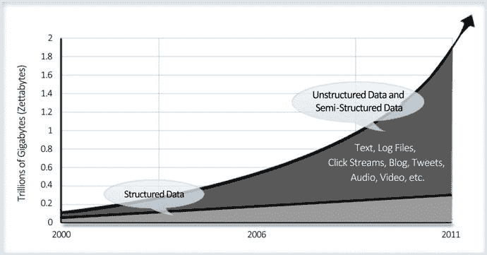
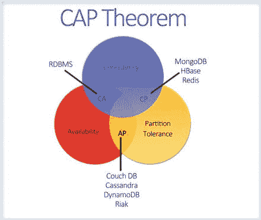

# 2. NoSQL

> “NoSQL 是一种设计互联网规模数据库解决方案的新方法。它不是一种产品或技术，而是一个术语，定义了一组不基于传统 RDBMS 原则的数据库技术。”

在本章中，我们将介绍 `NoSQL` 的定义和基础知识。我们将向你介绍 `CAP` 定理，并讨论 `NRW` 表示法。我们将比较 `ACID` 和 `BASE` 方法，并通过比较 `NoSQL` 和 `SQL` 数据库技术来结束本章。

## 2.1 SQL

RDBMS 的想法源于 E.F. Codd 于 1970 年发表的题为《大型共享数据库的关系数据模型》的白皮书。用于查询 RDBMS 系统的语言是 `SQL`（结构化查询语言）。

RDBMS 系统非常适合存储在列和行中的结构化数据，可以使用 `SQL` 进行查询。RDBMS 系统基于 `ACID` 事务的概念。`ACID` 代表原子性、一致性、隔离性和持久性，其中：

*   原子性意味着事务的所有更改要么完全应用，要么完全不应用。
*   一致性意味着事务应用后数据处于一致状态。这意味着事务提交后，获取特定数据的查询将看到相同的结果。
*   隔离性意味着应用于同一数据集的事务彼此独立。因此，一个事务不会干扰另一个事务。
*   持久性意味着更改在系统中是永久的，不会因任何故障而丢失。

## 2.2 NoSQL

NoSQL 是一个用于指代非关系型数据库的术语。因此，它涵盖了大多数不基于传统 RDBMS（关系型数据库管理系统）原则、用于处理互联网规模大数据集的存储系统。

正如前一章所讨论的，大数据正对传统的数据存储和处理方式（如 RDBMS 系统）构成挑战。因此，我们看到 NoSQL 数据库的兴起，它们被设计用来在时间和成本约束内处理这种海量且多样的数据。

因此，NoSQL 数据库是从处理大数据的需求中演化而来的；传统 RDBMS 技术无法提供充分的解决方案。图 2-1 展示了多年来非结构化/半结构化数据与结构化数据相比的增长情况。

图 2-1. 结构化 vs. 非结构化/半结构化数据

以下是一些适合使用 NoSQL 数据库的大数据用例示例：

*   社交网络图谱：谁与谁连接？在社交网络站点上，谁的帖子应该显示在用户的墙或主页上？
*   检索：搜索所有包含特定关键词的相关页面，并根据关键词在页面中出现的次数进行排序。

### 2.2.1 定义

NoSQL 没有正式的定义。它代表了一种与 RDBMS 根本不同的持久化/数据存储机制。但如果必须定义 NoSQL，那就是：NoSQL 是指不遵循 RDBMS 原理的数据存储系统的总称。

> 注意
>
> 该术语最初用于表示“如果你想扩展，就不要使用 SQL”。后来被重新定义为“不仅仅是 SQL”，这意味着除了 SQL 之外，还存在其他互补的数据库解决方案。

### 2.2.2 NoSQL 简史

1998 年，Carlo Strozzi 创造了 NoSQL 这个术语。他用这个术语来标识他的数据库，因为该数据库没有 SQL 接口。该术语在 2009 年初重新出现，当时 Eric Evans（Rackspace 的一名员工）在一个关于开源分布式数据库的活动中使用这个术语，来指代那些非关系型、不遵循关系数据库 ACID 特性的分布式数据库。

## 2.3 ACID vs. BASE

在介绍中，我们提到传统的 RDBMS 应用程序一直专注于 ACID 事务。无论这些特性看起来多么必不可少，它们与面向 Web 规模的应用程序的可用性和性能要求是相当不兼容的。

举个例子，假设你有一个像 OLX 这样的公司，它销售诸如未使用的家居用品（旧家具、车辆等）之类的产品，并使用 RDBMS 作为其数据库。让我们考虑两种场景。

第一种场景：我们看一个用户正在购买产品的电子商务购物网站。在交易过程中，用户锁定了数据库的一部分（库存），其他所有用户都必须等待，直到锁定该部分的用户完成交易。

第二种场景：应用程序最终可能使用缓存数据甚至未锁定的记录，从而导致不一致。在这种情况下，两个用户可能最终都会购买该产品，而实际库存已为零。

系统可能会变慢，影响可扩展性和用户体验。

与传统 RDBMS 系统的 ACID 方法相反，NoSQL 使用一种通常称为 BASE 的方法来解决问题。在解释 BASE 之前，让我们先探索 CAP 定理的概念。

### 2.3.1 CAP 定理（Brewer 定理）

Eric Brewer 在 2000 年概述了 CAP 定理。这是一个重要的概念，处理分布式数据库的开发人员和架构师需要很好地理解。该定理指出，在分布式环境中设计应用程序时，存在三个基本需求，即一致性（Consistency）、可用性（Availability）和分区容错性（Partition tolerance）。

*   **一致性**意味着在任何改变数据的操作执行后，数据保持一致，并且所有访问应用程序的用户或客户端都能看到相同的更新数据。
*   **可用性**意味着系统始终可用。
*   **分区容错性**意味着即使系统被划分为无法相互通信的服务器组，系统仍将继续运行。

CAP 定理指出，在任何时间点，分布式系统只能满足上述三个保证中的两个（图 2-2）。

图 2-2. CAP 定理

### 2.3.2 BASE

Eric Brewer 创造了 BASE 这个缩写。BASE 可以解释为：

*   **基本可用（Basically Available）** 意味着系统在 CAP 定理的范围内是可用的。
*   **软状态（Soft state）** 表示即使没有向系统提供输入，状态也会随时间变化。这符合最终一致性。
*   **最终一致性（Eventual consistency）** 意味着系统将在长期内达到一致性，前提是在此期间没有向系统发送输入。

因此，BASE 与 RDBMS ACID 事务形成对比。

你已经看到 NoSQL 数据库是最终一致的，但最终一致性的实现可能因不同的 NoSQL 数据库而异。

NRW 是用于描述最终一致性模型如何在 NoSQL 数据库中实现的表示法，其中：

*   `N` 是数据库维护的数据副本数量。
*   `R` 是应用程序在返回读取请求输出之前需要引用的副本数量。
*   `W` 是在写入操作被标记为成功完成之前需要写入的数据副本数量。

使用这些表示法配置，数据库实现了最终一致性模型。

一致性可以在读写操作级别实现。

*   **写入操作**
    *   `N=W` 意味着写入操作在将控制权返回给客户端并标记写入操作成功之前，将更新所有数据副本。这与传统 RDBMS 数据库在实现同步复制时的工作方式类似。此设置将减慢写入性能。
    *   如果写入性能是一个问题，这意味着你希望写入操作快速发生，你可以设置 `W=1`，`R=N`。这意味着写入将只更新一个副本并标记写入成功，但每当用户发出读取请求时，它将读取所有副本以返回结果。如果任何一个副本未更新，它将确保该副本被更新，然后读取才会成功。此实现将减慢读取性能。
    *   因此，大多数 NoSQL 实现使用 `N>W>1`。这意味着需要成功更新多于一个节点，但并非所有节点都需要同时更新。
*   **读取操作**
    *   如果 `R` 设置为 1，读取操作将读取任何一个数据副本，这可能是过时的。如果 `R>1`，则读取多个副本，并将读取最新值。但是，这可能会减慢读取操作。
    *   使用 `N<W+R` 总能确保读取操作检索到最新值。这是因为写入副本和读取副本的总数总是大于实际副本数，确保至少一个读取副本具有最新版本。这就是**法定人数装配**。

表 2-1 比较了 ACID 和 BASE。

表 2-1. ACID vs. BASE

| ACID | BASE |
| --- | --- |
| 原子性 | 基本可用 |
| 一致性 | 最终一致性 |
| 隔离性 | 软状态 |
| 持久性 | |

## 2.4 NoSQL 的优势与劣势

在本节中，你将了解 NoSQL 数据库的优势和劣势。

### 2.4.1 NoSQL 的优势

我们来谈谈 `NoSQL` 数据库的优势。

*   高可扩展性：当交易速率和快速响应要求增加时，这种纵向扩展的方法会失败。与此相反，新一代的 `NoSQL` 数据库被设计为可以横向扩展（即使用低端商用服务器进行水平扩展）。
*   可管理性与维护性：`NoSQL` 数据库主要设计为自动修复、分布式数据和更简单的数据模型协同工作，从而降低了管理和维护的复杂度。
*   低成本：`NoSQL` 数据库通常设计为在一组廉价的商用服务器集群上运行，使用户能够以低成本存储和处理更多数据。
*   灵活的数据模型：`NoSQL` 数据库拥有非常灵活的数据模型，使其能够处理任何类型的数据；它们不遵循僵化的 `RDBMS` 数据模型。因此，任何涉及更新数据库模式的应用程序变更都可以轻松实现。

### 2.4.2 NoSQL 的劣势

除了上述优势之外，在开始使用这些平台开发应用程序之前，你还需要意识到许多障碍。

*   成熟度：大多数 `NoSQL` 数据库都是预生产版本，一些关键功能仍有待实现。因此，在决定使用某个 `NoSQL` 数据库时，你应该仔细分析该产品，确保其功能已完全实现，而非仍在待办事项列表中。
*   支持：支持是你需要考虑的一个限制因素。大多数 `NoSQL` 数据库来自开源的初创公司。因此，与企业软件公司相比，其支持非常有限，并且可能缺乏全球覆盖范围或支持资源。
*   有限的查询能力：由于 `NoSQL` 数据库通常是为了满足网络级应用程序的扩展需求而开发的，它们提供的查询能力有限。一个简单的查询需求可能也需要大量的编程专业知识。
*   管理：尽管 `NoSQL` 旨在提供无需管理的解决方案，但安装和维护该方案仍然需要技能和精力。
*   专业性：由于 `NoSQL` 是一个不断发展的领域，开发者和管理员群体中对该技术的专业知识仍然有限。

尽管 `NoSQL` 正日益成为数据库领域的重要组成部分，但你需要了解这些产品的局限性和优势，以便为 `NoSQL` 数据库平台做出正确的选择。

### 2.5 SQL 与 NoSQL 数据库

现在你已经了解了 `NoSQL` 数据库的详细信息。尽管 `NoSQL` 作为一种数据库解决方案正日益被采纳，但它并非用来取代 `SQL` 或 `RDBMS` 数据库。在本节中，你将了解 `SQL` 和 `NoSQL` 数据库之间的差异。

让我们快速回顾一下 `RDBMS` 系统。`RDBMS` 系统已经盛行了大约 30 年，即使现在，它们仍然是解决方案架构师为应用程序进行数据存储的默认选择。如果我们列举几个 `RDBMS` 系统的优点，首先也是最重要的就是 `SQL` 的使用，这是一种用于数据处理的丰富的声明式查询语言，用户很容易理解。此外，`RDBMS` 系统为事务提供 `ACID` 支持，这在许多领域（如银行应用）是必不可少的。

然而，`RDBMS` 系统最大的缺点是在处理模式变更和随着数据增长而扩展的问题上存在困难。随着数据量的增加，读/写性能会下降。你会在 `RDBMS` 系统中遇到扩展问题，因为它们大多被设计为纵向扩展，而非横向扩展。

与 `SQL RDBMS` 数据库相比，`NoSQL` 推广了数据存储，它们摆脱了 `RDBMS` 的范式。

让我们谈谈技术场景以及它们在 `RDBMS` 与 `NoSQL` 中的比较：

*   **模式灵活性**：这对于未来的轻松增强以及与外部应用程序（出站或入站）的集成至关重要。关系型数据库管理系统（RDBMS）在设计上相当不灵活。添加列是绝对不行的，尤其是当表中已有一些数据时。原因涉及默认值、索引和性能影响。很多时候，你最终不得不创建新表，并通过引入跨表关系来增加复杂性。
*   **复杂查询**：传统的表设计导致开发者编写复杂的 `JOIN` 查询，这些查询不仅难以实现和维护，而且执行时会消耗大量的数据库资源。
*   **数据更新**：跨表更新数据可能是更复杂的场景之一，特别是当它们是事务的一部分时。请注意，长时间保持事务打开会损害性能。你还必须规划将更新传播到系统中的多个节点。如果系统不支持多主架构或同时写入多个节点，则存在节点故障以及整个应用程序转为只读模式的风险。
*   **可扩展性**：通常可能需要的可伸缩性仅针对读取操作。然而，随着操作的增长，有多个因素会影响这种速度。需要提出的一些关键问题是：
    *   在物理数据库实例之间同步数据需要多长时间？
    *   在数据中心之间同步数据需要多长时间？
    *   同步数据需要多少带宽？
    *   数据交换是否经过优化？
    *   任何更新在服务器之间同步时的延迟是多少？通常，记录会在更新期间被锁定。

NoSQL 解决方案为上述大多数挑战提供了解决方案。现在让我们看看 NoSQL 如何应对上面提到的每个技术问题。

*   **模式灵活性**：列式数据库将数据存储为列，这与 RDBMS 中的行存储相反。这允许根据需要动态添加一列或多列的灵活性。同样，允许存储半结构化数据的文档存储也是不错的选择。
*   **复杂查询**：NoSQL 数据库不支持关系或外键。没有复杂的查询。没有 `JOIN` 语句。这是一个缺点吗？如何跨表查询？这无疑是一个功能上的缺陷。要跨表查询，必须执行多个查询。数据库是一个共享资源，被多个应用服务器使用，必须尽快释放。可选方案包括简化要执行的查询、缓存数据以及在应用层执行复杂操作的组合。许多数据库提供内置的实体级缓存。这意味着当访问一条记录时，数据库可能会自动透明地缓存它。为了性能和扩展性，缓存可能是内存分布式缓存。
*   **数据更新**：跨物理实例的数据更新和同步是难以解决的工程问题。数据中心内节点间的同步与跨多个数据中心的同步有不同的要求。人们希望延迟最好在几毫秒或几十毫秒之内。NoSQL 解决方案提供了强大的同步选项。例如，`MongoDB` 允许跨节点并发更新、带冲突解决的同步，并最终在可接受的时间内（通常是几毫秒）实现数据中心间的一致性。因此，`MongoDB` 没有隔离的概念。请注意，由于管理事务的复杂性可能被移出数据库，应用程序将不得不付出一些额外的努力。一个例子是在实现事务时使用两阶段提交（[`http://docs.mongodb.org/manual/tutorial/perform-two-phase-commits/`](http://docs.mongodb.org/manual/tutorial/perform-two-phase-commits/)）。大量数据库提供多版本并发控制（`MCC`）来实现事务一致性。正如 eBay 的技术研究员 Dan Pritchett（[`www.addsimplicity.com/`](http://www.addsimplicity.com/)）所说，`eBay.com` 不使用事务。请注意，`PayPal` 确实使用事务。
*   **可扩展性**：由于显而易见的原因，`NoSQL` 解决方案提供了更大的可扩展性。许多面向事务的 RDBMS 所需的复杂性，在不符合 `ACID` 的 `NoSQL` 数据库中并不存在。有趣的是，由于 `NoSQL` 不提供跨表引用，并且没有 `JOIN` 查询，而且你无法编写单个查询来整理来自多个表的数据，一个简单而合乎逻辑的解决方案是——有时——在表之间复制数据。在某些场景下，将信息嵌入到主实体中——特别是一对一映射的情况下——可能是个好主意。

表 2-2 对比了 `SQL` 和 `NoSQL` 技术。

表 2-2. SQL 与 NoSQL 对比

|   | SQL 数据库 | NoSQL 数据库 |
| --- | --- | --- |
| **类型** | 所有类型都支持 SQL 标准。 | 存在多种类型，如文档存储、键值存储、列数据库等。 |
| **开发历史** | 开发于 1970 年代。 | 开发于 2000 年代。 |
| **示例** | `SQL Server`, `Oracle`, `MySQL`。 | `MongoDB`, `HBase`, `Cassandra`。 |
| **数据存储模型** | 数据以行和列的形式存储在表中，每列都有特定类型。表通常根据规范化原则创建。使用联接（`Join`）从多个表中检索数据。 | 数据模型取决于数据库类型。例如，对于键值存储，数据存储为键值对。在基于文档的数据库中，数据存储为文档。与 RDBMS 的刚性表模型相比，数据模型是灵活的。 |
| **模式** | 固定的结构和模式，因此对模式的任何更改都涉及修改数据库。 | 动态模式，可以通过扩展或修改当前模式来容纳新的数据类型或结构。可以动态添加新字段。 |
| **可扩展性** | 采用纵向扩展（`Scale up`）方法；这意味着随着负载增加，需要购买更大、更昂贵的服务器来容纳数据。 | 采用横向扩展（`Scale out`）方法；这意味着将数据负载分布到廉价的商用服务器上。 |
| **支持事务** | 支持 `ACID` 和事务。 | 支持分区和可用性，但在事务上有所妥协。事务存在于某些级别，如数据库级别或文档级别。 |
| **一致性** | 强一致性。 | 取决于具体产品。少数提供强一致性，而另一些提供最终一致性。 |
| **支持** | 提供高水平的企业级支持。 | 开源模型。通过第三方或构建开源产品的公司获得支持。 |
| **成熟度** | 已经存在很长时间。 | 其中一些是成熟的；其他的仍在发展中。 |
| **查询能力** | 通过易于使用的图形用户界面（`GUI`）提供。 | 查询可能需要编程专业知识和知识。重点在于功能和编程接口，而非用户界面（`UI`）。 |
| **专业知识** | 拥有庞大的开发者社区，他们一直在利用 `SQL` 语言和 `RDBMS` 概念来架构和开发应用程序。 | 在这些开源工具上工作的开发者社区较小。 |

## 2.6 NoSQL 数据库的类别

在本节中，你将快速浏览 NoSQL 领域。你会了解 NoSQL 数据库新兴的类别。表 2-3 展示了 NoSQL 领域中的部分项目，包括其类型和各类别中的代表产品。

表 2-3：NoSQL 类别

| 类别 | 简要描述 | 例如 |
| --- | --- | --- |
| 文档型 | 数据以文档形式存储。例如，`{Name=“Test User”, Address=“Address1”, Age:8}` | MongoDB |
| XML 数据库 | 使用 XML 存储数据。 | MarkLogic |
| 图数据库 | 数据存储为节点集合，节点通过边连接。节点可类比为编程语言中的对象。 | GraphDB |
| 键值存储 | 将数据存储为键值对。 | Cassandra， Redis， memcached |

NoSQL 数据库根据数据的存储方式进行分类。由于需要从海量数据（通常是准实时）中提供精选信息，NoSQL 大多采用水平结构。它们针对大规模的插入和检索操作进行了优化，并内置了复制和聚类能力。

表 2-4 简要对比了各类 NoSQL 数据库的功能特性。

表 2-4：功能比较

| 功能 | 列式 | 文档存储 | 键值存储 | 图 |
| --- | --- | --- | --- | --- |
| 类表模式支持（列） | 是 | 否 | 否 | 是 |
| 完整更新/获取 | 是 | 是 | 是 | 是 |
| 部分更新/获取 | 是 | 是 | 是 | 否 |
| 按值查询/过滤 | 是 | 是 | 否 | 是 |
| 跨行聚合 | 是 | 否 | 否 | 否 |
| 实体间关系 | 否 | 否 | 否 | 是 |
| 跨实体视图支持 | 否 | 是 | 否 | 否 |
| 批量获取 | 是 | 是 | 是 | 是 |
| 批量更新 | 是 | 是 | 是 | 否 |

在考虑 NoSQL 项目时，重要的是你感兴趣的功能集。在决定使用某个 NoSQL 产品时，首先需要仔细理解问题需求，然后应参考他人使用该产品解决类似问题的经验。请记住，NoSQL 仍在不断发展成熟，这将使你能够从同行和先前的部署中学习，从而做出更好的选择。

此外，你还需要考虑以下问题：
*   需要处理的数据有多大？
*   读写操作可接受的吞吐量是多少？
*   系统中如何实现一致性？
*   系统需要支持高写入性能还是高读取性能？
*   可维护性和管理难度如何？
*   需要查询什么？
*   使用 NoSQL 的好处是什么？

我们建议你从小而重要的场景开始，并尽可能考虑混合方法。

## 2.7 小结

在本章中，你学习了 NoSQL。现在你应该理解了什么是 NoSQL 以及它与 SQL 的不同之处。你还了解了 NoSQL 的各类别。

在接下来的章节中，你将深入了解 MongoDB，这是一个基于文档的 NoSQL 数据库。

