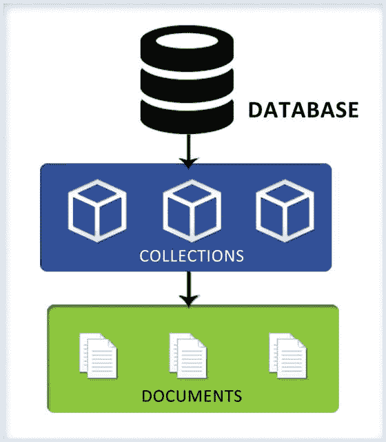

# 4. MongoDB 数据模型

> “MongoDB 旨在处理文档，无需预定义列或数据类型（与关系型数据库不同），这使得其数据模型极其灵活。”

在本章中，你将学习 MongoDB 的数据模型。你还将了解灵活模式（或称多态模式）的含义，以及为何它是 MongoDB 数据模型设计中的一个重要考量。

### 3.2.2 非关系型方法

传统的 `RDBMS` 平台通过纵向扩展（scale-up）方式提供可扩展性，这需要更快的服务器来提升性能。`RDBMS` 系统中存在的以下问题，促使了 `MongoDB` 及其他 `NoSQL` 数据库被设计成如今的形式：

*   为了进行横向扩展，`RDBMS` 数据库需要将分布在两个或多个系统中的数据关联起来才能返回结果。这在 `RDBMS` 系统中难以实现，因为它们的设计前提是所有数据需一起参与计算。因此，数据必须在单一位置进行处理。
*   在多活（Active-Active）服务器的情况下，当两台服务器都接收来自多源的更新时，判定哪个更新是正确的存在挑战。
*   当应用程序尝试从第二台服务器读取数据，而信息已在第一台服务器上更新但尚未同步到第二台时，返回的信息可能是陈旧的。

`MongoDB` 团队决定采用非关系型方法来解决这些问题。如前所述，`MongoDB` 将其数据存储在 `BSON` 文档中，所有相关数据都存放在一起，这意味着所有内容都位于一处。`MongoDB` 中的查询基于文档中的键，因此文档可以分布在多个服务器上。查询每个服务器意味着它将检查自身的文档集合并返回结果。这实现了线性可扩展性和性能提升。

`MongoDB` 采用主从复制，其中主节点接受写入请求。如果需要提升写入性能，则可以使用分片（sharding）；它将数据分布在多台机器上，并使这些机器能够更新数据集的不同部分。分片在 `MongoDB` 中是自动的；随着更多机器的加入，数据会被自动分配。

### 3.2.3 基于 JSON 的文档存储

`MongoDB` 使用基于 `JSON`（JavaScript 对象表示法）的文档存储数据。`JSON`/`BSON` 提供无模式模型，在数据库设计方面提供了灵活性。与 `RDBMS` 不同，可以无缝地对模式进行更改。

这种设计还通过在内部将相关数据分组存放并使其易于搜索来实现高性能。

一个 `JSON` 文档包含实际数据，可与 `SQL` 中的一行相比较。然而，与 `RDBMS` 行相比，文档可以具有动态模式。这意味着同一集合中的文档可以有不同的字段或结构，或者公共字段可以包含不同类型的数据。

文档以键值对的形式包含数据。让我们通过一个例子来理解：

```json
{
    "Name": "ABC",
    "Phone": ["1111111",
              "222222"
             ],
    "Fax":
}
```

如前所述，键值成对出现。文档中某个键的值可以留空。在上面的例子中，文档有三个键，分别是 "Name"、"Phone" 和 "Fax"。"Fax" 键没有值。

## 3.2.4 性能与功能权衡

为了使 `MongoDB` 具有高性能和高速，`RDBMS` 系统中常见的一些功能在 `MongoDB` 中并未提供。`MongoDB` 是面向文档的 `DBMS`，数据以文档形式存储。它不支持 `JOIN` 操作，也没有完全通用的事务。然而，它确实提供二级索引支持，允许用户使用查询文档进行查询，并在单文档级别提供原子更新支持。它提供副本集，这是一种具有自动故障转移的主从复制形式，并且具有内置的水平扩展能力。

### 3.2.5 任意位置运行数据库

一个主要的设计考量是能够从任何地方运行数据库，这意味着它应该能够在服务器、`VM`（虚拟机）上运行，甚至可以在云上通过按使用付费的服务运行。实现 `MongoDB` 所用的语言是 `C++`，这使得 `MongoDB` 能够实现这一目标。`10gen` 网站为不同的 `OS` 平台提供二进制文件，使 `MongoDB` 几乎能在任何类型的机器上运行。

## 3.3 SQL 比较

以下是 `MongoDB` 与 `SQL` 的不同之处。

`MongoDB` 使用文档存储数据，提供灵活的模式（同一集合中的文档可以有不同的字段）。这使得用户能够存储嵌套或多值字段，例如数组、哈希等。相比之下，`RDBMS` 系统提供固定模式，其中某一列的值应具有相似的数据类型。而且，在单元格中存储数组或嵌套值是不可能的。

`MongoDB` 不支持像 `SQL` 中那样的 `JOIN` 操作。但是，它允许用户将所有相关数据一起存储在单个文档中，从而在边缘避免了使用 `JOIN`。它提供了一种变通方法来解决这个问题。我们将在后续章节中更详细地讨论这一点。

`MongoDB` 不以与 `SQL` 相同的方式支持事务。但是，它保证文档级别的原子性。此外，它使用隔离操作符来隔离影响多个文档的写入操作，但不为多文档写入操作提供“全有或全无”的原子性。

## 3.4 总结

在本章中，你了解了 `MongoDB`、其历史以及 `MongoDB` 系统设计的简要详情。在接下来的章节中，你将学习更多关于 `MongoDB` 数据模型的知识。

**脚注**

1 The Register, Cade Metz, “MongoDB 之父：我的孩子胜过 Google BigTable”，[`www.theregister.co.uk/2011/05/25/the_once_and_future_mongodb/`](http://www.theregister.co.uk/2011/05/25/the_once_and_future_mongodb/))，2011 年 5 月 25 日。


## 4.1 数据模型

在上一章中，你了解到 MongoDB 是一个基于文档的数据库系统，其中的文档可以拥有灵活的模式。这意味着同一集合中的文档可以拥有不同（或相同）的字段集合。这让你在处理数据时更具灵活性。

本章，你将探索 MongoDB 的灵活数据模型。在需要之处，我们会演示其与关系数据库管理系统（RDBMS）方法的不同之处。

一个 MongoDB 部署可以包含多个数据库。每个数据库是一组集合的集合。集合类似于 SQL 中的表的概念；然而，它们是无模式的。每个集合可以包含多个文档。可以将文档视为 SQL 中的一行。图 4-1 描述了 MongoDB 的数据库模型。



图 4-1.

MongoDB 数据库模型

在 RDBMS 系统中，由于表结构和每列的数据类型是固定的，你只能在列中添加特定数据类型的数据。在 MongoDB 中，集合是文档的集合，其中数据以键值对的形式存储。

让我们通过一个例子来理解数据如何在文档中存储。下面的文档保存了用户的姓名和电话号码：

`{"Name": "ABC", "Phone": ["1111111", "222222" ] }`

动态模式意味着同一集合中的文档可以拥有相同或不同的字段集合或结构，甚至相同的字段在不同文档中可以存储不同类型的值。数据在集合文档中的存储方式没有严格的限制。

让我们看一个 `Region` 集合的例子：

`{ "R_ID" : "REG001", "Name" : "United States" }`

`{ "R_ID" :1234, "Name" : "New York", "Country" : "United States" }`

在这段代码中，`Region` 集合中有两个文档。尽管两个文档属于同一个集合，但它们的结构不同：第二个文档多了一个国家信息字段。实际上，如果你观察 "`R_ID`" 字段，它在第一个文档中存储的是 `STRING` 值，而在第二个文档中是数字。

因此，一个集合的文档可以拥有完全不同的模式。将文档存储在一个特定集合中还是使用多个集合，这取决于应用程序的设计。

### 4.1.1 `JSON` 和 `BSON`

MongoDB 是一个基于文档的数据库。它使用二进制 JSON（Binary JSON）来存储数据。

在本节中，你将了解 `JSON` 和二进制 JSON（`BSON`）。`JSON` 代表 JavaScript 对象表示法。它是当今现代 Web（与 `XML` 一起）用于数据交换的标准。该格式既对人友好，也对机器可读。它不仅是交换数据的好方法，也是存储数据的好方式。

`JSON` 支持所有基本数据类型（如字符串、数字、布尔值和数组）。

以下代码展示了一个 `JSON` 文档的样子：

```
{
    "_id" : 1,
    "name" : { "first" : "John", "last" : "Doe" },
    "publications" : [
        {
            "title" : "First Book",
            "year" : 1989,
            "publisher" : "publisher1"
        },
        { "title" : "Second Book",
            "year" : 1999,
            "publisher" : "publisher2"
        }
    ]
}
```

`JSON` 让你将所有相关信息保持在一个地方，这提供了出色的性能。它还使得更新文档能够独立进行。它是无模式的。

#### 4.1.1.1 二进制 `JSON` (`BSON`)

MongoDB 以二进制编码格式存储 `JSON` 文档。这被称为 `BSON`。`BSON` 数据模型是 `JSON` 数据模型的扩展形式。

MongoDB 对 `BSON` 文档的实现速度快、可遍历性高且轻量级。它支持在其他数组内嵌套数组和对象，并且使 MongoDB 能够深入对象内部以构建索引并根据查询表达式匹配对象，这些操作既适用于顶级 `BSON` 键，也适用于嵌套的 `BSON` 键。

### 4.1.2 标识符 (`_id`)

你已经了解到 MongoDB 将数据存储在文档中。文档由键值对组成。虽然文档可以比作 RDBMS 中的一行，但与行不同，文档具有灵活的模式。键（Key）只是一个标签，可以大致比作 RDBMS 中的列名。键用于从文档中查询数据。因此，就像 RDBMS 主键（用于唯一标识每一行）一样，你需要一个键来唯一标识集合中的每个文档。在 MongoDB 中，这被称为 `_id`。

如果你没有为某个键显式指定任何值，MongoDB 会自动生成一个唯一值并分配给它。这个键值是不可变的，并且可以是除数组之外的任何数据类型。

### 4.1.3 定容量集合

你现在对集合和文档已经很熟悉了。让我们谈谈一种特殊类型的集合，称为定容量集合。

MongoDB 有一个限制集合容量的概念。这意味着它按照插入顺序存储集合中的文档。当集合达到其大小限制时，文档将按照 `FIFO`（先进先出）顺序从集合中移除。这意味着最近插入最少的文档将首先被移除。

这对于需要自动维护插入顺序，并且在达到固定大小后需要删除记录的用例来说非常有用。其中一个用例是日志文件，它们会在达到一定大小后自动截断。

**注意**

MongoDB 本身使用定容量集合来维护其复制日志。定容量集合保证按插入顺序保留数据，因此按插入顺序检索数据的查询可以快速返回结果，并且不需要索引。不允许进行更改文档大小的更新。

## 4.1.2 多态模式

由于你已经熟悉了 MongoDB 数据结构的无模式特性，现在让我们来探讨多态模式及其用例。

多态模式是指一个集合包含不同类型或模式的文档。这种模式的一个好例子是名为 `Users` 的集合。一些用户文档可能包含额外的传真号码或电子邮件地址，而另一些可能只有电话号码，但所有这些文档都共存于同一个 `Users` 集合中。这种模式通常被称为多态模式。

在本章的这一部分，你将探索使用多态模式的各种原因。


### 4.2.1 面向对象编程

面向对象编程使你能够通过继承让类共享数据和行为。它还允许你在父类中定义函数，这些函数可以在子类中被重写，从而在不同的上下文中发挥不同的作用。换句话说，你可以使用相同的函数名来操作子类和父类，尽管底层的实现可能有所不同。这个特性被称为多态。

在这种情况下，需求是能够拥有一个模式，使得所有相关的对象集或层次结构中的对象可以一起适配，并且能够以相同的方式被检索。

让我们考虑一个例子。假设你有一个应用程序，允许用户上传和分享不同类型的内容，如 HTML 页面、文档、图像、视频等。尽管上述许多内容类型之间有许多共同的字段（如名称、ID、作者、上传日期和时间），但并非所有字段都是相同的。例如，在图像的情况下，你有一个保存图像内容的二进制字段，而 HTML 页面则有一个保存 HTML 内容的大型文本字段。

在这种情况下，可以使用 MongoDB 的多态模式，其中所有内容节点类型都存储在同一个集合中，例如`LoadContent`，并且每个文档只包含相关的字段。

```json
// "文档集合" - "HTMLPage" 文档
{
    _id: 1,
    title: "Hello",
    type: "HTMLpage",
    text: "<html>Hi..Welcome to my world</html>"
}
...
// 文档集合也有一个 "Picture" 文档
{
    _id: 3,
    title: "Family Photo",
    type: "JPEG",
    sizeInMB: 10
}
```

这种模式不仅使你能够将具有不同结构的相关数据存储在同一个集合中，还简化了查询。同一个集合既可以用于查询公共字段（例如获取特定日期和时间上传的所有内容），也可以用于查询特定字段（例如查找大小超过 X MB 的图像）。

因此，面向对象编程是使用多态模式有意义的用例之一。

### 4.2.2 模式演进

当你使用数据库时，最重要的考虑因素之一是模式演进（即模式更改对运行中应用程序的影响）。设计应尽可能减少对应用程序的影响，意味着没有或最少的停机时间、没有或极少的代码更改等。

通常，模式演进通过执行迁移脚本来实现，该脚本将数据库模式从旧版本升级到新版本。如果数据库未处于生产环境，脚本可以简单地删除并重新创建数据库。然而，如果数据库处于生产环境并包含实时数据，迁移脚本将很复杂，因为数据需要被保留。脚本应考虑到这一点。虽然 MongoDB 提供了一个`Update`选项，可用于更新集合中所有文档的结构（如果有新增字段），但想象一下，如果你的集合中有成千上万个文档，这样做会产生什么影响。这将非常缓慢，并对底层应用程序的性能产生负面影响。实现这一点的一种方法是，将新结构添加到集合中新增的文档中，然后在应用程序仍在运行时，逐步在后台迁移集合。这是拥有多态模式具有优势的众多用例之一。

例如，假设你正在处理一个`Tickets`集合，其中包含工单详细信息的文档，如下所示：

```json
// "Ticket1" 文档 (存储在 "Tickets" 集合中)
{
    _id: 1,
    Priority: "High",
    type: "Incident",
    text: "Printer not working"
}
```

在某个时候，应用程序团队决定在工单文档结构中引入一个“简短描述”字段，因此最好的选择是在新的工单文档中引入这个新字段。在应用程序内，你嵌入一段代码来处理检索“旧式”文档（没有简短描述字段）和“新式”文档（有简短描述字段）。旧式文档可以逐渐迁移到新式文档。迁移完成后，如果需要，可以更新代码以移除为处理缺失字段而嵌入的代码片段。

## 4.3 小结

在本章中，你学习了 MongoDB 数据模型。你还了解了标识符和固定集合。本章最后，你理解了灵活模式的优势。

在下一章中，你将开始使用 MongoDB。你将进行 MongoDB 的安装和配置。

