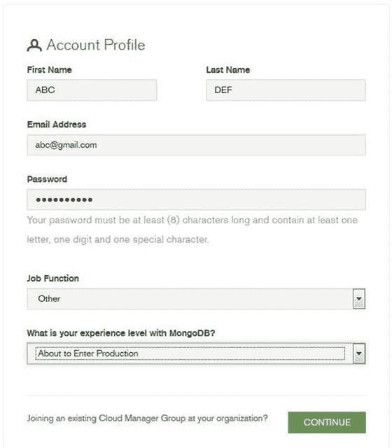
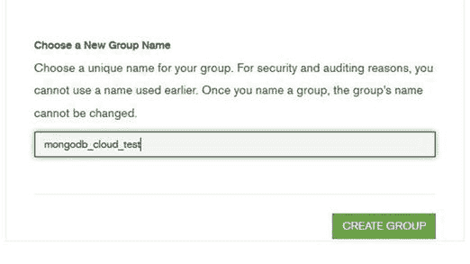
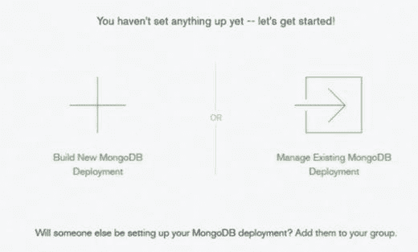
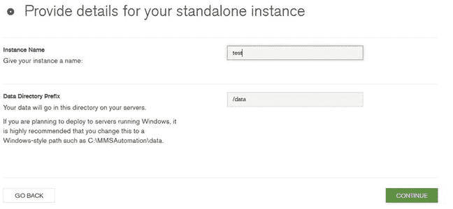
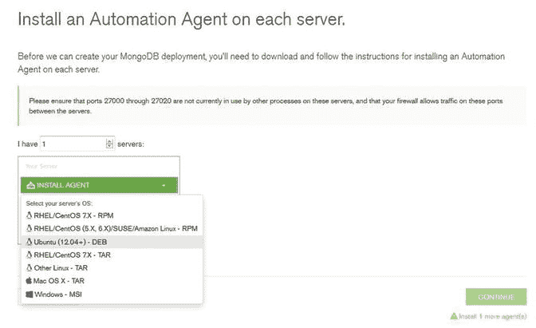
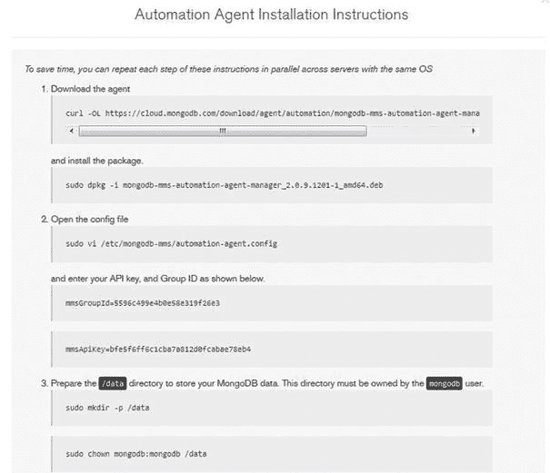
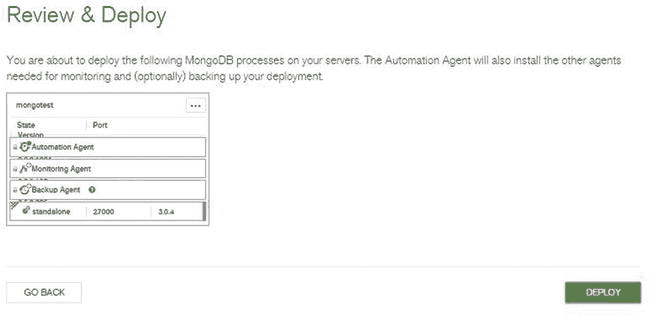

# 5.7.1 使用身份验证与授权

身份验证用于核实用户的身份，而授权则决定用户在通过身份验证的数据库上可执行操作的权限级别。

这意味着，用户只有在使用拥有该数据库访问权限的凭据登录后，才能访问数据库。这便禁用了对数据库的匿名访问。在用户通过身份验证后，可使用授权来确保用户仅拥有完成当前任务所需的最小访问权限。

身份验证与授权都存在于每个数据库级别。用户存在于单个逻辑数据库的上下文中。

用户信息存储在名为 `system.users` 的集合中，该集合位于 `admin` 数据库中。此集合维护着身份验证所需的凭据，其中存储了用户 ID、密码、以及创建该用户所关联的数据库，还有用于授权用户的权限信息。

MongoDB 采用基于角色的方法进行授权（例如 `read`、`readWrite`、`readAnyDatabase` 等角色）。如果需要，用户管理员可以创建自定义角色。

`system.users` 集合中的每个权限文档用于存储每个用户的角色。同一个文档也维护着已通过身份验证的用户的凭据。

`system.users` 集合中文档示例如下：

```
{
    _id : "practicaldb.Shaks",
    user : "Shaks",
    db : "practicaldb",
    credentials : {.......},
    roles : [
        { role: "read", db: "practicaldb" },
        { role: "readWrite", db: "MyDB" }
    ],
    ......
}
```

此文档告诉我们，用户 `Shaks` 关联于数据库 `practicaldb`，它在 `practicaldb` 数据库中拥有 `read` 角色，在 `MyDB` 数据库中拥有一个 `readWrite` 角色。请注意，用户名及其关联的数据库在 MongoDB 中唯一标识一个用户，因此，如果你有两个同名的用户，但他们关联于不同的数据库，那么他们将被视为两个不同的用户。所以，一个用户可以在不同的数据库上拥有具有不同授权级别的多个角色。

可用的角色包括：

*   `read`: 提供对指定数据库所有集合的只读访问权限。
*   `readWrite`: 提供对指定数据库内任何集合的读写访问权限。
*   `dbAdmin`: 使用户能够在指定数据库内执行管理操作，例如使用 `ensureIndex`、`dropIndexes`、`reIndex`、`indexStats` 进行索引管理，重命名集合，创建集合等。
*   `userAdmin`: 使用户能够对指定数据库的 `system.users` 集合执行 `readWrite` 操作。它还允许更改现有用户的权限或创建新用户。这实质上是该指定数据库的 `SuperUser`（超级用户）角色。
*   `clusterAdmin`: 此角色使用户有权访问可更改或显示整个系统信息的管理操作。`clusterAdmin` 仅适用于 `admin` 数据库。
*   `readAnyDatabase`: 此角色使用户能够读取 MongoDB 环境中的任何数据库。
*   `readWriteAnyDatabase`: 此角色与 `readWrite` 类似，但适用于所有数据库。
*   `userAdminAnyDatabase`: 此角色与 `userAdmin` 角色类似，但适用于所有数据库。
*   `dbAdminAnyDatabase`: 此角色与 `dbAdmin` 相同，但适用于所有数据库。
*   从版本 2.6 开始，用户管理员还可以创建用户自定义角色，以遵循最小特权原则，在集合级别和命令级别提供访问权限。用户自定义角色的作用域限定于其创建的数据库，并由数据库和角色名称的组合唯一标识。所有用户定义的角色都存储在 `system.roles` 集合中。

## 5.7.1.1 启用身份验证

身份验证默认是禁用的，因此请使用 `--auth` 来启用它。在启动 `mongod` 时，使用 `mongod --auth`。在启用身份验证之前，你需要至少有一个 `admin` 用户。如上所述，`admin` 用户是负责创建和管理其他用户的用户。

建议在生产部署中，此类用户应专门用于管理用户，而不应承担任何其他角色。在 MongoDB 部署中，该用户是需要创建的第一个用户；系统的其他用户可以由该用户创建。

`admin` 用户可以在启用身份验证之前创建，也可以在启用之后创建。

在此示例中，你将首先创建 `admin` 用户，然后启用 `auth` 设置。以下步骤应在 Windows 平台上执行。

使用默认设置启动 `mongod`：

```
C:\>C:\practicalmongodb\bin\mongod.exe
C:\practicalmongodb\bin\mongod.exe --help for help and startup options
2015-07-03T23:11:10.716-0700 I CONTROL Hotfix KB2731284 or later update is installed, no need to zero out data files
2015-07-03T23:11:10.716-0700 I JOURNAL [initandlisten] journal dir=C:\data\db\journal
...................................................
2015-07-03T23:11:10.763-0700 I CONTROL [initandlisten] MongoDB starting : pid=2776 port=27017 dbpath=C:\data\db\ 64-bit host=ANOC9
2015-07-03T23:11:10.763-0700 I CONTROL [initandlisten] targetMinOS: Windows 7/Windows Server 2008 R2
2015-07-03T23:11:10.763-0700 I CONTROL [initandlisten] db version v3.0.4
2015-07-03T23:11:10.764-0700 I CONTROL [initandlisten] OpenSSL version: OpenSSL 1.0.1j-fips 19 Mar 2015
2015-07-03T23:11:10.764-0700 I CONTROL [initandlisten] build info: windows sys. getwindowsversion(major=6, minor=1, build=7601, platform=2, service_pack='Service Pack 1') BOOST_LIB_VERSION=1_49
2015-07-03T23:11:10.771-0700 I NETWORK [initandlisten] waiting for connections on port 27017
```

#### 5.7.1.2 创建管理员用户

以管理员身份运行另一个命令提示符实例，并执行 `mongo` 应用程序：

```
C:\> C:\practicalmongodb\bin\mongo.exe
MongoDB shell version: 3.0.4
connecting to: test
>
```

### 切换到管理数据库

请注意，`admin` 数据库是一个特权数据库，用户需要访问它才能执行某些管理命令，例如创建管理员用户。

```
> db = db.getSiblingDB('admin')
```


## 管理员

用户需要使用以下任一角色创建：`userAdminAnyDatabase` 或 `userAdmin`：
```
>db.createUser({user: "AdminUser", pwd: "password", roles:["userAdminAnyDatabase"]})
Successfully added user: { "user" : "AdminUser", "roles" : [ "userAdminAnyDatabase" ] }
```

接下来，使用此用户进行身份验证。使用 `auth` 设置重启 `mongod`：
```
C:\>C:\practicalmongodb\bin\mongod.exe -auth
C:\practicalmongodb\bin\mongod.exe --help for help and startup options
2015-07-03T23:11:10.716-0700 I CONTROL Hotfix KB2731284 or later update is installed, no need to zero out data files
2015-07-03T23:11:10.716-0700 I JOURNAL [initandlisten] journal dir=C:\data\db\journal
...................................................
2015-07-03T23:11:10.763-0700 I CONTROL [initandlisten] MongoDB starting : pid=2776 port=27017 dbpath=C:\data\db\ 64-bit host=ANOC9
2015-07-03T23:11:10.763-0700 I CONTROL [initandlisten] targetMinOS: Windows 7/Windows Server 2008 R2
2015-07-03T23:11:10.763-0700 I CONTROL [initandlisten] db version v3.0.4
2015-07-03T23:11:10.764-0700 I CONTROL [initandlisten] OpenSSL version: OpenSSL 1.0.1j-fips 19 Mar 2015
2015-07-03T23:11:10.764-0700 I CONTROL [initandlisten] build info: windows sys. getwindowsversion(major=6, minor=1, build=7601, platform=2, service_pack='Service Pack 1') BOOST_LIB_VERSION=1_49
2015-07-03T23:11:10.771-0700 I NETWORK [initandlisten] waiting for connections on port 27017
```

启动 `mongo` 控制台，并使用上面创建的 `AdminUser` 用户针对 `admin` 数据库进行身份验证：
```
C:\>c:\practicalmongodb\bin\mongo.exe
MongoDB shell version: 3.0.4
connecting to: test
>use admin
switched to db admin
>db.auth("AdminUser", "password")
1
>
```

#### 5.7.1.3 创建用户并启用授权

在本节中，您将创建一个用户并为新创建的用户分配一个角色。您已经使用管理员用户进行了身份验证，如下所示：
```
C:\>c:\practicalmongodb\bin\mongo.exe
MongoDB shell version: 3.0.4
connecting to: test
>use admin
switched to db admin
>db.auth("AdminUser", "password")
1
>
```

切换到 `Product` 数据库，创建用户 `Alice` 并授予其对产品数据库的读取访问权限，如下所示：
```
>use product
switched to db product
>db.createUser({user: "Alice"
... , pwd:"Moon1234"
... , roles: ["read"]
... }
... )
Successfully added user: { "user" : "Alice", "roles" : [ "read" ] }
```

接下来，验证用户对该数据库是否只有只读访问权限：
```
>db
product
>show users
{
	"_id" : "product.Alice",
	"user" : "Alice",
	"db" : "product",
	"roles" : [
		{
			"role" : "read",
			"db" : "product"
		}
	]
}
```

接下来，连接到一个新的 `mongo` 控制台，以 `Alice` 身份登录到 `Products` 数据库，以发出只读命令：
```
C:\>c:\practicalmongodb\bin\mongo.exe -u Alice -p Moon1234 product
2015-07-03T23:11:10.716-0700 I CONTROL Hotfix KB2731284 or later update is installed, no need to zero-out data files
MongoDB shell version: 3.0.4
connecting to: products
Post successful authentication the following entry will be seen on the mongod console.
2015-07-03T23:11:26.742-0700 I ACCESS [conn2] Successfully authenticated as principal Alice on product
```

### 5.7.2 控制网络访问

默认情况下，`mongod` 和 `mongos` 会绑定到系统上所有可用的 IP 地址。在本节中，您将了解用于限制网络暴露的配置选项。下面的代码在 Windows 平台上执行：
```
C:\>c:\practicalmongodb\bin\mongod.exe --bind_ip 127.0.0.1 --port 27017 --rest
2015-07-03T00:33:49.929-0700 I CONTROL Hotfix KB2731284 or later update is installed, no need to zero out data files
2015-07-03T00:33:49.946-0700 I JOURNAL [initandlisten] journal dir=C:\data\db\journal
2015-07-03T00:33:49.980-0700 I CONTROL [initandlisten] MongoDB starting : pid=1144 port=27017 dbpath=C:\data\db\ 64-bit host=ANOC9
2015-07-03T00:33:49.980-0700 I CONTROL [initandlisten] targetMinOS: Windows 7/Windows Server 2008 R2
2015-07-03T00:33:49.980-0700 I CONTROL [initandlisten] db version v3.0.4
2015-07-03T00:33:49.980-0700 I CONTROL [initandlisten] OpenSSL version: OpenSSL1.0.1j-fips 19 Mar 2015
2015-07-03T00:33:49.980-0700 I CONTROL [initandlisten] build info: windows sys.getwindowsversion(major=6, minor=1, build=7601, platform=2, service_pack='Service Pack 1') BOOST_LIB_VERSION=1_49
2015-07-03T00:33:49.981-0700 I CONTROL [initandlisten] allocator: system
2015-07-03T00:33:49.981-0700 I CONTROL [initandlisten] options: { net: { bindIp: "127.0.0.1", http: { RESTInterfaceEnabled: true, enabled: true }, port: 27017} }
2015-07-03T00:33:49.990-0700 I NETWORK [initandlisten] waiting for connections on port 27017
2015-07-03T00:33:49.990-0700 I NETWORK [websvr] admin web console waiting for connections on port 28017
2015-07-03T00:34:22.277-0700 I NETWORK [initandlisten] connection accepted from 127.0.0.1:49164 #1 (1 connection now open)
```

您已使用 `--bind_ip` 启动了服务器，其中一个值设置为 `127.0.0.1`，即本地主机接口。

`--bind_ip` 限制了程序将监听的传入连接的网络接口。可以指定逗号分隔的 IP 地址。在您的例子中，您已限制 `mongod` 仅监听本地主机接口。

当 `mongod` 实例启动时，默认情况下它会在端口 `27017` 上等待任何传入连接。您可以使用 `–port` 更改此设置。

仅仅更改端口并不能大大降低风险。为了完全保护环境，您需要仅允许受信任的客户端使用防火墙设置连接到该端口。

更改此端口也会更改 HTTP 状态接口端口，该端口默认为 `28017`。该端口在 X+1000 的端口上可用，其中 X 代表连接端口。

此网页公开了诊断和监视信息，包括操作数据、各种日志以及有关数据库实例的状态报告。它提供了可用于管理目的的管理级统计信息。默认情况下，此页面是只读的；要使其完全交互，您将使用 `REST` 设置。此配置使页面完全交互，帮助管理员排查任何性能问题。应仅允许受信任的客户端使用防火墙访问此端口。

建议在生产环境中禁用 HTTP 状态页面以及 `REST` 配置。

#### 5.7.2.1 使用防火墙

防火墙用于控制网络内的访问。它们可用于允许从特定 IP 地址访问特定 IP 端口，或阻止来自任何不受信任主机的任何访问。它们可用于为您的 `mongod` 实例创建受信任的环境，您可以在其中指定哪些 IP 地址或主机可以连接到 `mongod` 的哪些端口或接口。

在 Windows 平台上，使用 `netsh` 配置端口 `27017` 的传入流量：
```
C:\>netsh advfirewall firewall add rule name="Open mongod port 27017" dir=in action=allow protocol=TCP localport=27017
Ok.
C:\>
```

此代码表示允许端口 `27017` 上的所有传入流量，因此任何应用程序服务器都可以连接到 `mongod`。

#### 5.7.2.2 加密数据

您已经看到 MongoDB 将其所有数据存储在数据目录中，在 Windows 中默认为 `C:\data\db`，在 Linux 中为 `/data/db`。文件以未加密的形式存储在目录中，因为 Mongo 中没有提供自动加密文件的方法。任何具有文件系统访问权限的攻击者都可以读取文件中存储的数据。应用程序有责任确保在将敏感信息写入数据库之前对其进行加密。

此外，应实施操作系统级别的机制，如文件系统级加密和权限，以防止对文件的未授权访问。


#### 5.7.2.3 加密通信

`mongod` 与客户端（例如 `mongo shell`）之间的通信通常需要加密。在本节设置中，您将了解如何通过配置 SSL，为上述安装增加一层安全性，使得 `mongod` 与 `mongo shell`（客户端）之间的通信使用 SSL 证书和密钥进行。

建议在服务器与客户端的通信中使用 SSL。

从 3.0 版本开始，大多数 MongoDB 发行版现已内置对 SSL 的支持。以下命令在 Windows 平台上执行。

第一步是生成包含公钥证书和私钥的 `.pem` 文件。MongoDB 可以使用自签名证书或由证书颁发机构颁发的有效证书。

在本书中，您将使用以下命令生成自签名证书和私钥。

根据 MongoDB 发行版和 Windows 平台的要求，安装 OpenSSL 和 Microsoft Visual C++ 2008 可再发行组件。在本书中，您安装的是 64 位版本。

运行以下命令创建公钥证书和私钥：
```
C:\> cd c:\OpenSSL-Win64\bin
C:\OpenSSL-Win64\bin\>openssl
```
这将打开 OpenSSL shell，您需要在其中输入以下命令：
```
OpenSSL>req -new -x509 -days 365 -nodes -out C:\practicalmongodb\mongodb-cert.crt -keyout C:\practicalmongodb\mongodb-cert.key
```
上述步骤生成名为 `mongodb-cert.key` 的证书密钥，并将其放置在 `C:\practicalmongodb` 文件夹中。

接下来，您需要将证书和私钥连接到 `.pem` 文件中。为此，在命令提示符下运行以下命令：
```
C:\> more C:\practicalmongodb\mongodb-cert.key > temp
C:\> copy \b temp C:\practicalmongodb\mongodb-cert.crt > C:\practicalmongodb\mongodb.pem
```

现在您有了一个 `.pem` 文件。在启动 `mongod` 时使用以下运行时选项：
```
C:\> C:\practicalmongodb\bin\mongod –sslMode requireSSL --sslPEMKeyFile C:\practicalmongodb\mongodb.pem
```

```
2015-07-03T03:45:33.248-0700 I CONTROL Hotfix KB2731284 or later update is installed, no need to zero-out data files
2015-07-03T02:54:30.630-0700 I JOURNAL [initandlisten] journal dir=C:\data\db\journal
2015-07-03T02:54:30.670-0700 I CONTROL [initandlisten] MongoDB starting : pid=2816 port=27017 dbpath=C:\data\db\ 64-bit host=ANOC9
2015-07-03T02:54:30.670-0700 I CONTROL [initandlisten] targetMinOS: Windows 7/Windows Server 2008 R2
2015-07-03T02:54:30.670-0700 I CONTROL [initandlisten] db version v3.0.4
2015-07-03T02:54:30.670-0700 I CONTROL [initandlisten] OpenSSL version: OpenSSL1.0.1j-fips 19 Mar 2015
2015-07-03T02:54:30.670-0700 I CONTROL [initandlisten] build info: windows sys. getwindowsversion(major=6, minor=1, build=7601, platform=2, service_pack='Service Pack 1') BOOST_LIB_VERSION=1_49
2015-07-03T02:54:30.671-0700 I CONTROL [initandlisten] allocator: system
2015-07-03T02:54:30.671-0700 I CONTROL [initandlisten] options: { net: { ssl: { PEMKeyFile: "c:\practicalmongodb\mongodb.pem", mode: "requireSSL" } } }
2015-07-03T02:54:30.680-0700 I NETWORK [initandlisten] waiting for connections on port 27017 ssl
2015-07-03T03:33:43.708-0700 I NETWORK [initandlisten] connection accepted from 127.0.0.1:49194 #2 (1 connection now open)
```

> **注意**
> 在生产环境中不推荐使用自签名证书，除非是在受信任的网络中，因为这会使您容易受到中间人攻击。

接下来，您将使用 `mongo shell` 连接到上面的 `mongod`。当您使用 `–ssl` 选项运行 `mongo` 时，您需要指定 `–sslAllowInvalidCertificates` 或 `–sslCAFile`。让我们使用 `–sslAllowInvalidCertificates`。

打开终端窗口并输入以下内容：
```
C:\> 
C:\practicalmongodb\bin>mongo --ssl --sslAllowInvalidCertificates
```

```
2015-07-03T02:30:10.774-0700 I CONTROL Hotfix KB2731284 or later update is installed, no need to zero-out data files
MongoDB shell version: 3.0.4
connecting to: test
```


## 5.8 使用 MongoDB Cloud Manager 进行配置

在本章开始时，你学习了如何在 Windows 和 Linux 上安装和配置 MongoDB。在本章的这一部分，你将了解如何使用 MongoDB Cloud Manager。

MongoDB Cloud Manager 是数据库开发者内置的监控解决方案。在 2.6 版本之前，MongoDB Cloud Manager（以前称为 MongoDB 监控服务或 MMS）仅用于监控和管理 MongoDB。从 2.6 版本开始，MongoDB Cloud Manager 引入了重大增强功能，包括备份、时间点恢复和自动化功能，使得操作 MongoDB 比以往更加简单。自动化功能为管理员提供了强大的能力，只需几次点击即可快速创建、升级、扩展或关闭 MongoDB 实例。

在本书的这一部分，你将了解如何开始使用 MongoDB Cloud Manager。你将使用 MongoDB Cloud Manager 在 AWS 上部署一个独立的 MongoDB 实例。

当你开始使用 MongoDB Cloud Manager 时，它会要求在每个服务器上安装一个自动化代理，MongoDB Cloud Manager 随后使用该代理与服务器通信。

为了开始配置，你首先需要在 MongoDB Cloud Manager 上创建你的个人资料。

输入以下 URL：`https://cloud.mongodb.com`。根据你是否有账户，点击“登录”或“免费注册”按钮。

由于你是第一次开始，请点击“免费注册”按钮。这将带你到图 5-1 所描绘的页面。



图 5-1. 账户个人资料

你将创建一个新的个人资料。不过，MongoDB 提供了一个加入现有 Cloud Manager 组的选项。

输入所有相关详细信息，如图 5-1 所示，然后点击“继续”。这将带你到提供公司信息的页面。完成个人资料和公司信息后，接受条款并点击“创建账户”按钮。这样就完成了个人资料的创建。下一步是创建一个组（图 5-2）。



图 5-2. 创建组

为组提供一个唯一的名称，然后点击“创建组”。接下来是部署选择页面，如图 5-3 所示，在这里你可以选择构建新部署或管理现有部署。



图 5-3. 部署

选择构建新部署。接下来，系统将提示你选择构建部署的位置（即本地、AWS 或其他远程环境）。在此示例中，选择 AWS。点击“在 AWS 中部署”选项，将引导你在自行配置和使用 Cloud Manager 配置之间进行选择。

选择“我将配置”选项，这意味着你将使用已在 AWS 上为你配置的机器。

下一个屏幕提供了部署类型的选项（即独立实例、副本集或分片集群）。你正在执行独立部署，因此点击“创建独立实例”框。这将带你到如图 5-4 所示的屏幕。



图 5-4. 独立实例的详细信息

提供实例名称和数据目录前缀，然后点击“继续”。接下来是如图 5-5 所示的屏幕，它提示你在每个服务器上安装自动化代理。



图 5-5. 安装自动化代理

此屏幕有一个用于指定服务器数量的选项。在此示例中，你指定 1。

接下来，你需要指定平台。选择 Ubuntu。然后会出现如图 5-6 所示的屏幕。



图 5-6. 自动化代理安装说明

按照步骤操作。

在你实施启动代理的步骤之前，你需要确保所有相关端口都是开放的（443、4949、27000 到 27018）。

一旦所有步骤完成，点击“验证代理”按钮。验证后，如果一切工作正常，你将看到一个“继续”按钮。

当你点击“继续”时，你将进入如图 5-7 所示的“审查和部署”页面，在这里你可以看到所有将要部署的进程。在这里，自动化代理会下载并安装监控和备份代理。



图 5-7. 审查和部署

点击“部署”按钮将带你到部署页面，部署更改状态为“进行中”。当安装完成时，部署状态将变为“目标状态”，已配置的服务器将出现在拓扑视图中。

如果你的部署支持 SSL 或使用任何身份验证机制，你需要手动下载并安装监控代理。

为了检查所有代理是否正常工作，你可以点击控制台上的“管理”选项卡。

Cloud Manager 可以在任何连接到互联网的服务器上部署 MongoDB 副本集、分片集群和独立实例。服务器只需要能够向 Cloud Manager 发起出站 TCP 连接。

## 5.9 小结

在本章中，你学习了如何在 Windows 和 Linux 平台上安装 MongoDB。你还研究了一些确保数据库安全使用所必需的重要配置。你通过使用 MongoDB Cloud Manager 进行配置结束了本章。

在下一章中，你将开始学习 MongoDB Shell。

