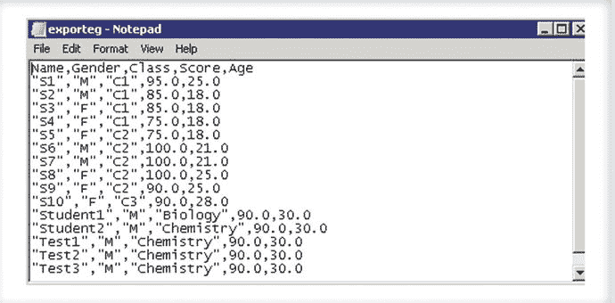

# 6. 使用 MongoDB Shell

> “mongo shell 是 MongoDB 标准发行版的一部分。它提供了一个 JavaScript 环境，可以完全访问该语言和标准函数。它为 MongoDB 数据库提供了完整的接口。”

在本章中，你将学习 mongo shell 的基础知识以及如何使用它来管理 MongoDB 文档。在深入研究创建与数据库交互的应用程序之前，理解 MongoDB shell 的工作原理非常重要。

要感受 MongoDB 数据库，没有比从 MongoDB shell 开始更好的方法了。MongoDB shell 的介绍分为三个部分，以便读者更容易掌握和实践这些概念。

第一部分涵盖了数据库的基本功能，包括基本的 CRUD 操作符。下一部分涵盖高级查询。本章的最后一部分解释了存储和检索数据的两种方式：嵌入和引用。


## 6.1 基础查询

本节将简要讨论 CRUD 操作（创建、读取、更新和删除）。通过基本示例和练习，你将学习如何在 MongoDB 中执行这些操作。同时，你也会了解查询在 MongoDB 中是如何执行的。

与用于查询的传统 SQL 不同，MongoDB 使用其自身的类 JSON 查询语言从存储的数据中检索信息。

如第 5 章所述，成功安装 MongoDB 后，你需要导航到目录 `C:\practicalmongodb\bin\`。此文件夹包含运行 MongoDB 所需的所有可执行文件。

通过执行 `mongo` 可执行文件可以启动 MongoDB shell。

第一步始终是启动数据库服务器。打开命令提示符（以管理员身份运行）并发出命令 `CD \`。

接下来，运行命令 `C:\practicalmongodb\bin\mongod.exe`。（如果安装在其他文件夹，路径将相应更改。本章示例的安装位置为 `C:\practicalmongodb` 文件夹。）这将启动数据库服务器。

```
C:\>c:\practicalmongodb\bin\mongod.exe

2015-07-06T02:29:24.501-0700 I CONTROL Hotfix KB2731284 or later update is insalled, no need to zero-out data files

2015-07-06T02:29:24.522-0700 I JOURNAL [initandlisten] journal dir=c:\data\db\ournal

....................................................

2015-07-06T02:29:24.575-0700 I CONTROL [initandlisten] MongoDB starting : pid=384 port=27017 dbpath=c:\data\db\ 64-bit host=ANC09

2015-07-06T02:29:24.575-0700 I CONTROL [initandlisten] targetMinOS: Windows 7/windows Server 2008 R2

2015-07-06T02:29:24.575-0700 I CONTROL [initandlisten] db version v3.0.4

2015-07-06T02:29:24.575-0700 I CONTROL [initandlisten] OpenSSL version: OpenSSL1.0.1j-fips 19 Mar 2015

2015-07-06T02:29:24.575-0700 I CONTROL [initandlisten] build info: windows sys getwindowsversion(major=6, minor=1, build=7601, platform=2, service_pack='Service Pack 1') BOOST_LIB_VERSION=1_49

2015-07-06T02:29:24.575-0700 I CONTROL [initandlisten] allocator: system

2015-07-06T02:29:24.575-0700 I CONTROL [initandlisten] options: {}

2015-07-06T02:29:24.584-0700 I NETWORK [initandlisten] waiting for connections on port 27017
```

MongoDB 默认在本地主机接口的 27017 端口监听任何传入连接。

现在数据库服务器已启动，你可以开始使用 mongo shell 向服务器发出命令。

在深入了解 mongo shell 之前，让我们先简要了解一下如何使用导入/导出工具将数据导入和导出 MongoDB 数据库。

首先，创建一个 CSV 文件来保存学生记录，结构如下：
`姓名、性别、班级、成绩、年龄。`

CSV 的示例数据如图 6-1 所示。



图 6-1. 示例 CSV 文件

接下来，将数据从 MongoDB 数据库导入到一个新集合中，以了解导入工具的工作原理。

以管理员身份运行命令提示符。以下命令用于获取 `import` 命令的帮助信息：

```
C:\>c:\practicalmongodb\bin\mongoimport.exe --help

Import CSV, TSV or JSON data into MongoDB.

When importing JSON documents, each document must be a separate line of the input file.

Example:
mongoimport --host myhost --db my_cms --collection docs < mydocfile.json
....

C:\>
```

发出以下命令，将数据从文件 `exporteg.csv` 导入到 `MyDB` 数据库中名为 `importeg` 的新集合：

```
C:\>c:\practicalmongodb\bin\mongoimport.exe --host localhost --db mydb --collection importeg --type csv --file c:\exporteg.csv --headerline

2015-07-06T01:53:23.537-0700 connected to: localhost
2015-07-06T01:53:23.608-0700 imported 15 documents
```

为了验证集合是否已创建以及数据是否已导入，你需要使用 mongo shell 连接到数据库（本例中是 `localhost`），并发出命令来验证集合是否存在。

要启动 mongo shell，请以管理员身份运行命令提示符，发出命令 `C:\PracticalMongoDB\bin\mongo.exe`（路径将根据安装文件夹而变化；本例中文件夹是 `C:\PracticalMongoDB\`），然后按 Enter 键。

这默认连接到在端口 27017 上监听的 `localhost` 数据库服务器。

```
C:\>c:\practicalmongodb\bin\mongo.exe

MongoDB shell version: 3.0.4
connecting to: test

> use mydb
switched to db mydb

> show collections
importeg
system.indexes

> db.importeg.find()
{ "_id" : ObjectId("5450af58c770b7161eefd31d"), "Name" : "S1", "Gender" : "M", "Class" : "C1", "Score" : 95, "Age" : 25 }
.......
{ "_id" : ObjectId("5450af59c770b7161eefd31e"), "Name" : "S2", "Gender" : "M", "Class" : "C1", "Score" : 85, "Age" : 18 }

>
```

简而言之，你在这里所做的是：

1.  连接到 mongo shell。
2.  切换到你的数据库，本例中是 `MyDB`。
3.  使用 `show collections` 检查 `MyDB` 数据库中存在的集合。
4.  使用导入工具检查导入集合的计数。
5.  最后，执行 `find()` 命令以检查新集合中的数据。

要连接到不同的主机和端口，可以在命令中使用 `–host` 和 `–port`。

如图 6-1 所示，默认情况下使用数据库 `test` 作为上下文。

在任何时间点，执行 `db` 命令将显示 shell 当前连接到的数据库：

```
> db
test
>
```

要显示所有数据库名称，可以运行 `show dbs` 命令。执行此命令将列出已连接服务器的所有数据库。

```
> show dbs
```

在任何时刻，都可以使用 `help()` 命令获取帮助。

```
> help
    db.help()                    help on db methods
    db.mycoll.help()             help on collection methods
    sh.help()                    sharding helpers
    rs.help()                    replica set helpers
    help admin                   administrative help
    help connect                 connecting to a db help
    help keys                    key shortcuts
    help misc                    misc things to know
    help mr                      mapreduce
    show dbs                    show database names
    show collections            show collections in current database
    show users                  show users in current database
    ..........
    exit                        quit the mongo shell
```

如上所示，如果你需要关于 `db` 或 `collection` 任何方法的帮助，可以使用 `db.help()` 或 `db.<CollectionName>.help()`。例如，如果你需要关于 `db` 命令的帮助，请执行 `db.help()`。

```
> db.help()
DB methods:
    db.addUser(userDocument)
    ...
    db.shutdownServer()
    db.stats()
    db.version()            current version of the server
>
```

到目前为止，你一直在使用默认的 `test` 数据库。可以使用命令 `use <newdbname>` 切换到新数据库。

```
> use mydb
switched to db mydb
```

在你开始探索之前，让我们先简要了解一下 MongoDB 术语和概念，它们对应于 SQL 的术语和概念。这总结在表 6-1 中。

表 6-1. SQL 与 MongoDB 术语对照

| SQL | MongoDB |
| --- | --- |
| 数据库 | 数据库 |
| 表 | 集合 |
| 行 | 文档 |
| 列 | 字段 |
| 索引 | 索引 |
| 表内连接 | 嵌入和引用 |
| 主键：可指定一列或一组列 | 主键：自动设置为 _id 字段 |

让我们开始探索 MongoDB 中的查询选项。切换到 `MYDBPOC` 数据库。

```
> use mydbpoc
switched to db mydbpoc
>
```

这将上下文从 `test` 切换到了 `MYDBPOC`。可以使用 `db` 命令确认这一点。

```
> db
mydbpoc
>
```


