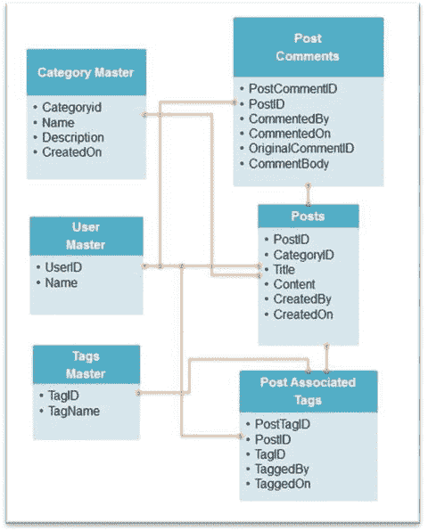

# 6.3 设计应用程序的数据模型

本节将探讨如何为应用程序设计数据模型。MongoDB 数据库为设计数据模型提供了两种选项：用户可以将相关对象嵌入彼此之中，或者通过 ID 引用彼此。本节将探索这些选项。

为了理解这些选项，你将设计一个博客应用程序并演示这两种选项的用法。

一个典型的博客应用程序包含以下场景：
- 人们发布关于不同主题的博客。除了主题分类外，还可以使用不同的标签。例如，如果分类是政治，帖子谈论的是某位政治家，那么该政治家的名字可以作为标签添加到帖子中。这有助于用户快速找到与其兴趣相关的帖子，并将相关帖子链接在一起。
- 查看博客的人可以对博客文章发表评论。

## 6.3.1 关系数据建模与范式化

在深入 MongoDB 的方法之前，让我们先简要了解一下如何在 SQL 等关系数据库中进行建模。

在关系数据库中，数据建模通常通过定义表开始，并逐渐消除数据冗余以达到范式形式。

#### 6.3.1.1 什么是范式形式？

在关系数据库中，范式形式通常从根据应用程序需求创建表开始，然后逐步消除冗余以达到最高范式形式，也称为第三范式或 `3NF`。为了更好地理解这一点，让我们以表格形式展示博客应用程序的初始数据，如图 6-2 所示。


**图 6-2. 博客应用程序初始数据**

这些数据实际上处于第一范式形式。你会有大量冗余，因为一篇文章可能有多个评论，也可能关联多个标签。冗余的问题在于它引入了不一致的可能性，即相同数据的不同副本可能具有不同的值。为了消除这种冗余，你需要通过将数据拆分为多个表来进一步范式化数据。在此步骤中，你必须识别一个键列来唯一标识表中的每一行，以便在表之间创建链接。使用 `3NF` 范式对上述场景建模后，将得到如图 6-3 所示的 RDBMs 图。



**图 6-3. RDBMS 图**

在这种情况下，你得到了一个没有冗余的数据模型，允许你更新它而无需担心更新多行。特别是，你不再需要担心数据模型中的不一致问题。

#### 6.3.1.2 范式形式的问题

如前所述，范式化的好处是它允许轻松更新且无任何冗余（即有助于保持数据一致性）。更新用户名意味着更新 `Users` 表中的名称。

然而，当你试图取回数据时，问题就出现了。例如，要查找特定用户发布的所有帖子相关的标签和评论，关系数据库程序员会使用 `JOIN`。通过使用 `JOIN`，数据库会根据应用程序屏幕设计返回所有数据，但真正的问题在于数据库执行什么操作来获得该结果集。

通常，任何 `RDBMS` 都从磁盘读取并执行寻道，这占用了读取一行所花费的 99% 以上的时间。当涉及磁盘访问时，随机寻道是最大的障碍。这一点在此上下文中如此重要的原因是，`JOIN` 通常需要随机寻道。`JOIN` 操作是关系数据库中最昂贵的操作之一。此外，如果你最终需要将数据库扩展到多台服务器，还会引入生成分布式 `JOIN` 的问题，这是一个复杂且通常很慢的操作。

**第一步是定义 `map` 函数，该函数循环遍历集合中的文档，并以 `{"Class": Score}` 的格式返回输出，例如 `{"C1":95}`。第二步对班级进行分组并计算该班级分数的平均值。第三步组合结果；它定义了需要应用 `map` 和 `reduce` 函数的集合，最后定义了存储输出的位置，在本例中是一个名为 `MR_ClassAvg_1` 的新集合。**

**最后一步，你使用 `find` 来检查输出结果。**

第一步是定义 `map` 函数，该函数循环遍历集合中的文档，并以 `{"Class": Score}` 的格式返回输出，例如 `{"C1":95}`。第二步对班级进行分组并计算该班级分数的平均值。第三步组合结果；它定义了需要应用 `map` 和 `reduce` 函数的集合，最后定义了存储输出的位置，在本例中是一个名为 `MR_ClassAvg_1` 的新集合。

最后一步，你使用 `find` 来检查输出结果。


### 6.3.2 MongoDB 文档数据模型方法

如你所知，在 MongoDB 中，数据存储在文档里。对我们应用设计者而言幸运的是，这为模式设计开启了新的可能性。不幸的是，这也使我们的模式设计过程变得复杂。现在，当面对一个模式设计问题时，不再像关系型数据库那样有一条固定的规范化数据库设计路径。在 MongoDB 中，模式设计取决于你想要解决的问题。

如果你必须使用 MongoDB 文档模型来建模上述内容，你可能会将博客数据存储在如下文档中：

```json
{
  "_id" : ObjectId("509d27069cc1ae293b36928d"),
  "title" : "示例标题",
  "body" : "示例文本。",
  "tags" : [
    "标签 1",
    "标签 2",
    "标签 3",
    "标签 4"
  ],
  "created_date" : ISODate("2015-07-06T12:41:39.110Z"),
  "author" : "作者 1",
  "category_id" : ObjectId("509d29709cc1ae293b369295"),
  "comments" : [
    {
      "subject" : "示例评论",
      "body" : "评论内容",
      "author " : "作者 2",
      "created_date":ISODate("2015-07-06T13:34:23.929Z")
    }
  ]
}
```

如你所见，你已将评论和标签仅嵌入在一个文档中。或者，你也可以通过使用 `_id` 字段引用来对模型进行一定程度的“规范化”：

```json
// 作者文档：
{
  "_id": ObjectId("509d280e9cc1ae293b36928e "),
  "name": "作者 1",
}
```

```json
// 标签文档：
{
  "_id": ObjectId("509d35349cc1ae293b369299"),
  "TagName": "标签 1",
  .....
}
```

```json
// 评论文档：
{
  "_id": ObjectId("509d359a9cc1ae293b3692a0"),
  "Author": ObjectId("508d27069cc1ae293b36928d"),
  .......
  "created_date" : ISODate("2015-07-06T13:34:59.336Z")
}
```

```json
//分类文档
{
  "_id": ObjectId("509d29709cc1ae293b369295"),
  "Category": "分类 1"
  ......
}
```

```json
//文章文档
{
  "_id" : ObjectId("509d27069cc1ae293b36928d"),
  "title" : "示例标题",
  "body" : "示例文本。",
  "tags" : [ ObjectId("509d35349cc1ae293b369299"),
  ObjectId("509d35349cc1ae293b36929c")
  ],
  "created_date" : ISODate("2015-07-06T13:41:39.110Z"),
  "author_id" : ObjectId("509d280e9cc1ae293b36928e"),
  "category_id" : ObjectId("509d29709cc1ae293b369295"),
  "comments" : [
    ObjectId("509d359a9cc1ae293b3692a0"),
  ]
}
```

本章剩余部分将致力于确定哪种方案适用于你的场景（即，是使用引用还是嵌入）。

#### 6.3.2.1 嵌入

在本节中，你将了解嵌入是否会带来性能上的积极影响。当你需要获取一组数据并将其显示在屏幕上时（例如一个显示博客相关评论的页面），嵌入可能很有用；在这种情况下，评论可以嵌入在博客文档中。

这种方法的益处在于，由于 MongoDB 在磁盘上连续存储文档，所有相关数据只需一次查找即可获取。

除此之外，由于不支持 JOIN，如果你在这种情况下使用引用，应用程序可能会执行类似以下的步骤来获取与博客相关的评论数据：

1.  从博客文档中获取关联的 `comments_id`。
2.  根据第一步中找到的 `comments_id` 获取评论文档。

如果你采用这种引用方式，不仅数据库需要进行多次查找来定位你的数据，而且由于现在需要两次往返数据库才能检索数据，还会引入额外的延迟。

如果应用程序经常同时访问评论数据和博客数据，那么将评论嵌入到博客文档中几乎肯定会对性能产生积极影响。

另一个倾向于嵌入的考虑因素是希望写入数据时具有原子性和隔离性。MongoDB 设计时未包含多文档事务。在 MongoDB 中，操作的原子性仅在单个文档级别提供，因此需要原子性地一起更新的数据必须放置在同一个文档中。

当你更新数据库中的数据时，你必须确保你的更新要么完全成功，要么完全失败，永远不会出现“部分成功”的情况，并且没有其他数据库读取者会看到不完整的写入操作。

#### 6.3.2.2 引用

你已经了解到，在许多情况下，**嵌入式**方法能提供最佳性能，同时它还能保证数据一致性。然而，在某些情况下，更**规范化**的模型在 MongoDB 中表现更佳。

采用多个集合并添加引用的一个原因是，它能在查询数据时提供更大的灵活性。让我们以上面提到的博客示例来理解这一点。

你已经看到了如何使用嵌入式模式，这在需要在同一个页面上展示所有数据时（即显示博客文章及其所有相关评论的页面）效果非常好。

现在假设你有一个需求：搜索特定用户发表的评论。使用嵌入式模式的查询如下所示：

`db.posts.find({'comments.author': 'author2'},{'comments': 1})`

那么，此查询的结果将是以下形式的文档：

```json
{
"_id" : ObjectId("509d27069cc1ae293b36928d"),
"comments" : [ {
"subject" : "Sample Comment 1 ",
"body" : "Comment1 Body.",
"author_id" : "author2",
"created_date" : ISODate("2015-07-06T13:34:23.929Z")}...]
}
{
"_id" : ObjectId("509d27069cc1ae293b36928d"),
"comments" : [
{
"subject" : "Sample Comment 2",
"body" : "Comments Body.",
"author_id" : "author2",
"created_date" : ISODate("2015-07-06T13:34:23.929Z")
}...]
}
```

这种方法的主要缺点是，你会获取到比实际需要多得多的数据。特别是，你无法只请求 `author2` 的评论；你必须请求 `author2` 评论过的博客文章，而这些文章也包含了所有其他评论。这些数据需要在应用代码中进行进一步筛选。

另一方面，假设你决定使用规范化模式。在这种情况下，你将拥有三个文档集合："作者"、"文章"和"评论"。

"作者"文档将包含作者的特有内容，如 `姓名`、`年龄`、`性别` 等；"文章"文档将包含文章的特有细节，如文章创建时间、文章作者、实际内容和文章主题。

"评论"文档将包含对文章的评论，如 `评论日期`、评论创建者和评论文本。如下图所示：

```json
// 作者文档：
{
"_id": ObjectId("508d280e9cc1ae293b36928e "),
"name": "Jenny",
..........
}
```

```json
// 文章文档
{
"_id" : ObjectId("508d27069cc1ae293b36928d"),....................
}
```

```json
// 评论文档：
{
"_id": ObjectId("508d359a9cc1ae293b3692a0"),
"Author": ObjectId("508d27069cc1ae293b36928d"),
"created_date" : ISODate("2015-07-06T13:34:59.336Z"),
"Post_id": ObjectId("508d27069cc1ae293b36928d"),
..........
}
```

在这种场景下，查找由 "`author2`" 发表的评论的查询，可以通过对评论集合进行一个简单的 `find()` 操作来完成：

`db.comments.find({"author": "author2"})`

总的来说，如果你的应用程序的查询模式是已知的，并且数据往往只以一种方式访问，那么嵌入式方法就很有效。反之，如果你的应用程序可能以多种不同方式查询数据，或者你无法预料数据可能被查询的模式，那么更“规范化”的方法可能更好。

例如，在上述规范化模式中，你将能够使用 `limit`、`skip` 操作符对评论进行排序或返回更受限的评论集合。而在嵌入式情况下，你只能按照评论在文章中的存储顺序检索所有评论。

另一个可能促使你使用文档引用的因素是存在**一对多**关系时。

例如，一个拥有大量读者互动的流行博客，可能对某篇文章有数百甚至数千条评论。在这种情况下，嵌入式会带来显著的负面影响：

*   对读取性能的影响：随着文档尺寸增大，它会占用更多内存。内存的问题在于，MongoDB 数据库会将频繁访问的文档缓存在内存中，文档越大，它们能放入内存的概率就越低。这将导致检索文档时发生更多页面错误，进而引发随机磁盘 I/O，进一步拖慢性能。
*   对更新性能的影响：随着尺寸增大，当对此类文档执行追加数据的更新操作时，MongoDB 最终需要将文档移动到有更多可用空间的区域。当这种移动发生时，会显著降低更新性能。

除此之外，MongoDB 文档有 `16MB` 的硬性大小限制。虽然这一点需要注意，但通常在你达到 `16MB` 的大小限制之前，就会因为内存压力和文档复制而遇到问题。

促使使用文档引用的最后一个因素是存在**多对多**或 `M:N` 关系的情况。

例如，在上述例子中，有标签。每个博客可以有多个标签，每个标签也可以关联到多个博客条目。

实现博客-标签 `M:N` 关系的一种方法是拥有以下三个集合：

*   `Tags` 集合，用于存储标签详情
*   `Blogs` 集合，用于存储博客详情
*   第三个集合，称为 `标签到博客映射`，用于映射标签和博客之间的关系

这种方法与关系数据库中的类似，但这会对应用程序的性能产生负面影响，因为查询最终会进行大量应用层面的“连接”操作。

或者，你可以使用嵌入式模型，在博客文档中嵌入标签，但这会导致数据重复。尽管这会在一定程度上简化读取操作，但它会增加更新操作的复杂性，因为在更新一个标签详情时，用户需要确保该更新后的标签在其嵌入到的所有其他博客文档中都得到更新。

因此，对于多对多连接，通常采用折中方案是最好的：嵌入一个 `_id` 值列表，而不是完整的文档：

```json
// 标签文档：
{
"_id": ObjectId("508d35349cc1ae293b369299"),
"TagName": "Tag1",
..........
}
```

```json
// 添加了标签 ID 作为引用的文章文档
// 文章文档
{ "_id" : ObjectId("508d27069cc1ae293b36928d"),
"tags" : [
ObjectId("509d35349cc1ae293b369299"),
ObjectId("509d35349cc1ae293b36929a"),
ObjectId("509d35349cc1ae293b36929b"),
ObjectId("509d35349cc1ae293b36929c")
],....................................
}
```

虽然查询会稍微复杂一些，但你不再需要担心在所有地方更新一个标签了。

总而言之，MongoDB 中的模式设计是你需要做出的最早期决策之一，它取决于应用程序的需求和查询模式。

正如你所见，当你需要同时访问数据或需要进行原子更新时，嵌入式方法会产生积极影响。然而，如果你在查询时需要更大的灵活性，或者你有**多对多**关系，使用引用是一个不错的选择。

最终，决策取决于你应用程序的访问模式，在 MongoDB 中没有硬性规定。在下一节中，你将学习各种数据建模的考量因素。


#### 6.3.2.3 数据建模的决策

这涉及到决定如何组织文档以实现有效的数据建模。一个关键的决策点是需要嵌入数据还是使用数据引用（即决定采用嵌入还是引用）。

这一点通过一个例子可以更好地说明。假设你有一个书评网站，其中包含作者、书籍以及带有线程式评论的回复。

当前的问题是如何组织集合。这个决策取决于每本书预期的评论数量以及读操作与写操作的执行频率。

#### 6.3.2.4 操作考虑因素

除了元素之间的交互方式（即以嵌入方式存储文档还是使用引用）之外，在为应用程序设计数据模型时，许多其他操作因素也至关重要。这些因素将在以下各节中介绍。

#### 数据生命周期管理

如果你的应用程序拥有需要在数据库中仅保留有限时间段的数据集，则需要使用此功能。

假设你需要将评论和回复相关的数据保留一个月。可以考虑使用此功能。

这是通过使用集合的 `Time to Live (TTL)` 功能实现的。集合的 `TTL` 功能确保文档在指定时间后过期。

此外，如果应用程序要求仅处理最近插入的文档，使用固定集合（`capped collections`）将有助于优化性能。

## 索引

可以创建索引以支持常用查询，从而提高性能。默认情况下，`MongoDB` 会在 `_id` 字段上创建索引。

创建索引时需要考虑以下几点：

*   每个索引至少需要 8KB 的数据空间。
*   对于写操作，添加索引会对性能产生一些负面影响。因此，对于写操作频繁的集合，索引可能代价高昂，因为每次插入时都必须将键添加到所有索引中。
*   索引对于读操作频繁的集合（例如读写操作比例高的情况）是有益的。未建立索引的读操作不受索引影响。

### 分片

设计应用程序模型时的一个重要因素是是否对数据进行分区。这在 `MongoDB` 中是通过分片实现的。

分片也被称为数据分区。在 `MongoDB` 中，一个集合被分区，其文档分布在称为分片（`shards`）的机器集群上。这对性能有显著影响。我们将在第 `tk` 章更详细地讨论分片。

#### 大量集合

使用多个集合与在单个集合中存储数据的设计考虑如下：

*   选择多个集合存储数据不会带来性能损失。
*   为不同类型的数据使用不同的集合可以提高高吞吐量批处理应用程序的性能。

当你设计拥有大量集合的模型时，需要考虑以下行为：

*   每个集合都伴随一定的最小开销（几千字节）。
*   每个索引（包括 `_id` 索引）至少需要 8KB 的数据空间。

你现在知道，每个数据库的元数据都存储在 `<database>.ns` 文件中。每个集合和索引在命名空间文件中都有自己的条目，因此在决定实施大量集合时，你需要考虑 `limits_on_the_size_of_namespace` 文件的限制。

#### 文档增长

少数更新操作，例如向数组中推送元素、添加新字段等，可能导致文档大小增加，进而可能导致文档从一个槽位移动到另一个槽位以适应文档。这种文档重定位的过程既消耗资源又耗时。尽管 `MongoDB` 提供了填充（`padding`）以最小化重定位的发生，但你可能需要手动处理文档增长问题。

## 6.4 本章小结

在本章中，你学习了基本的 `CRUD` 操作以及高级查询功能。你还研究了存储和检索数据的两种方式：嵌入和引用。

在下一章中，你将学习 `MongoDB` 架构、其核心组件和特性。

