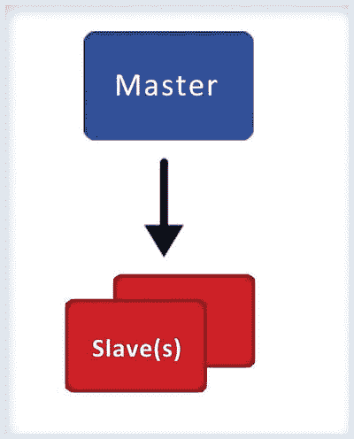
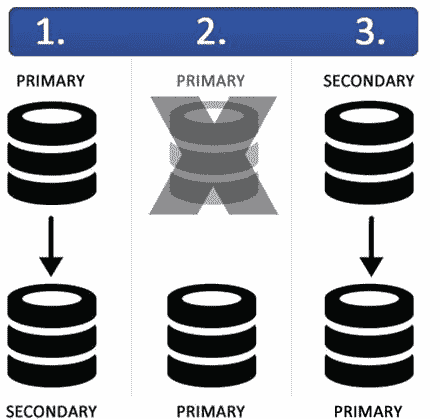

# 7. MongoDB 架构

> “`MongoDB` 架构涵盖了 `MongoDB` 的深度架构概念。”

在本章中，你将学习 `MongoDB` 架构，特别是核心进程和工具、独立部署、分片概念、复制概念和生产部署。

## 7.1 核心进程

`MongoDB` 软件包中的核心组件是

*   `mongod`，即核心数据库进程
*   `mongos`，即分片集群的控制器和查询路由器
*   `mongo`，即交互式 `MongoDB` shell

这些组件作为应用程序位于 `bin` 文件夹下。让我们详细讨论这些组件。

### 7.1.1 mongod

`MongoDB` 系统中的主要守护进程是 `mongod`。该守护进程处理所有数据请求，管理数据格式，并执行后台管理操作。

当不带任何参数运行 `mongod` 时，它会连接到默认数据目录（即 `C:\data\db` 或 `/data/db`）和默认端口 `27017`，并在该端口监听套接字连接。

在启动 `mongod` 进程之前，确保数据目录存在并且你对该目录具有写权限非常重要。

如果目录不存在或你对该目录没有写权限，此进程的启动将失败。如果默认端口 `27017` 不可用，服务器将无法启动。

`mongod` 还有一个 `HTTP` 服务器，它监听比默认端口高 `1000` 的端口。因此，如果你使用默认端口 `27017` 启动 `mongod`，则 `HTTP` 服务器将位于端口 `28017`，并可通过 URL `http://localhost:28017` 访问。这个基本的 `HTTP` 服务器提供有关数据库的管理信息。

### 7.1.2 mongo

`mongo` 为开发者提供了一个交互式 `JavaScript` 接口，用于直接在数据库上测试查询和操作，并为系统管理员管理数据库。所有这些都通过命令行完成。当启动 `mongo` shell 时，它将连接到名为 `test` 的默认数据库。此数据库连接值被分配给全局变量 `db`。

作为开发者或管理员，你需要在第一次连接后将数据库从 `test` 更改为你的数据库。你可以通过使用 `<databasename>.` 来实现这一点。

### 7.1.3 mongos

`mongos` 用于 `MongoDB` 分片。它充当路由服务，处理来自应用层的查询，并确定请求的数据在分片集群中的位置。

我们将在分片部分更详细地讨论 `mongos`。现在，你可以将 `mongos` 视为将查询路由到持有数据的正确服务器的进程。


## 7.2 MongoDB 工具

除了核心服务外，MongoDB 安装包还附带多种可用的工具：

*   `mongodump`：此工具是有效备份策略的一部分。它创建数据库内容的二进制导出。
*   `mongorestore`：使用 `mongorestore` 工具，将由 `mongodump` 工具创建的二进制数据库转储导入到新的或现有的数据库中。
*   `bsondump`：此工具将 BSON 文件转换为人类可读的格式，如 JSON 和 CSV。例如，此工具可用于读取 `mongodump` 生成的输出文件。
*   `mongoimport`, `mongoexport`：`mongoimport` 提供了一种将 [JSON](http://docs.mongodb.org/manual/reference/glossary/#term-json)、[CSV](http://docs.mongodb.org/manual/reference/glossary/#term-csv) 或 [TSV](http://docs.mongodb.org/manual/reference/glossary/#term-tsv) 格式的数据导入到 `mongod` 实例的方法。`mongoexport` 提供了一种将数据从 `mongod` 实例导出为 JSON、CSV 或 TSV 格式的方法。
*   `mongostat`, `mongotop`, `mongosniff`：这些工具提供与 `mongod` 实例当前操作相关的诊断信息。

## 7.3 独立部署

独立部署用于开发目的；它不确保任何数据冗余，也不确保在故障情况下的恢复。因此不建议在生产环境中使用。独立部署包含以下组件：一个单一的 `mongod` 和一个连接到该 `mongod` 的客户端，如图 7-1 所示。


图 7-1. 独立部署

MongoDB 使用分片和复制，通过分发和复制数据来提供高可用性系统。在接下来的章节中，您将了解分片和复制。之后，您将了解推荐的生产部署架构。

## 7.4 复制

在独立部署中，如果 `mongod` 不可用，您将面临丢失所有数据的风险，这在生产环境中是不可接受的。复制用于防止此类数据丢失。

复制通过在不同节点上复制数据来提供数据冗余，从而在节点故障时保护数据。复制在 MongoDB 部署中提供高可用性。

复制还简化了某些管理任务，例如可以将备份等常规任务卸载到副本，从而释放主副本以处理重要的应用程序请求。

在某些情况下，它还可以通过使客户端能够从数据的不同副本来读取，从而帮助扩展读取能力。

在本节中，您将学习复制在 MongoDB 中的工作原理及其各种组件。MongoDB 支持两种类型的复制：传统的主/从复制和副本集。

### 7.4.1 主/从复制

在 MongoDB 中，传统的主/从复制是可用的，但仅建议用于超过 50 个节点的复制。首选的复制方法是副本集，我们稍后会解释。在这种类型的复制中，有一个主节点和多个从节点，它们从主节点复制数据。这种复制方式的唯一优点是集群中从节点的数量没有限制。然而，成千上万的从节点会使主节点负担过重，因此在实际场景中，最好拥有少于一打的从节点。此外，这种类型的复制不会自动进行故障转移，并且提供的冗余较少。

在基本的主/从设置中，您有两种类型的 `mongod` 实例：一个实例处于主模式，其余处于从模式，如图 7-2 所示。由于从节点是从主节点复制数据，所有从节点都需要知道主节点的地址。


图 7-2. 主/从复制

主节点维护一个固定集合 (`oplog`)，该集合存储对数据库进行的逻辑写入的有序历史记录。

从节点使用此 `oplog` 集合复制数据。由于 `oplog` 是一个固定集合，如果从节点的状态远远落后于主节点的状态，从节点可能会失去同步。在这种情况下，复制将停止，需要人工干预才能重新建立复制。

从节点失去同步主要有两个原因：

*   从节点关闭或停止，并在稍后重新启动。在此期间，`oplog` 可能已删除需要应用于从节点的操作日志。
*   从节点执行来自主节点的更新的速度较慢。

### 7.4.2 副本集

副本集是传统主从复制的一种复杂形式，是 MongoDB 部署中推荐的方法。

副本集基本上是一种主从复制类型，但它们提供自动故障转移。副本集有一个主节点，在副本集上下文中称为 `primary`，多个从节点，称为 `secondary`；但是，与主从复制不同，副本集中没有固定节点是 `primary`。

如果副本集中的主节点发生故障，会自动将其中一个从节点提升为主节点。客户端开始连接到新的主节点，数据和应用程序都将保持可用。在副本集 中，此故障转移以自动化方式发生。我们稍后将详细解释此过程如何发生。

主节点通过选举机制选出。如果主节点发生故障，将选出的节点将被选为主节点。

图 7-3 展示了双成员副本集故障转移的过程。让我们讨论一下双成员副本集在故障转移期间发生的各个步骤。

1.  主节点宕机，从节点被提升为主节点。
2.  原主节点恢复，它充当从节点，并成为次级节点。


图 7-3. 双成员副本集故障转移

需要注意的要点是：

*   副本集是 `mongod` 的集群，它们之间进行复制并确保自动故障转移。
*   在副本集中，一个 `mongod` 将是主成员，其他将是次级成员。
*   主成员由副本集的成员选举产生。所有写入都定向到主成员，而次级成员使用 `oplog` 异步地从主成员复制。
*   次级成员的数据集反映了主成员的数据集，使其能够在当前主节点不可用时被提升为主节点。

副本集复制对成员数量有限制。在 3.0 版本之前，限制是 12 个成员，但在 3.0 版本中已更改为 50 个。因此，现在副本集复制最多只能有 50 个成员，并且在任何给定时间点，在一个 50 个成员的副本集中，只有 7 个可以参与投票。我们将详细解释副本集中的投票概念。

从 3.0 版本开始，副本集成员可以使用不同的存储引擎。例如，次级成员可能使用 `WiredTiger` 存储引擎，而主成员可能使用 `MMAPv1` 引擎。在接下来的章节中，您将了解 MongoDB 提供的不同存储引擎。


#### 7.4.2.1 主节点与副节点

在深入了解副本集的功能之前，我们先看看副本集可以包含的成员类型。成员主要有两种类型：主节点（primary members）和副节点（secondary members）。

*   **主节点**：一个副本集只能有一个主节点，由副本集中的投票节点选举产生。任何优先级（priority）设置为 1 的节点都有资格被选为主节点。客户端的所有写操作都会被定向到主节点，然后复制到副节点。
*   **副节点**：普通的副节点保存数据的副本。副节点可以参与投票，并且在当前主节点故障时，也有资格被提升为主节点。

除此之外，副本集还可以拥有其他类型的副节点。

#### 7.4.2.2 副节点的类型

**优先级 0 成员** 是维护主节点数据副本但永远不会在故障转移中成为主节点的副节点。除此之外，它们的功能与普通副节点相同，可以参与投票并可以接受读请求。优先级 0 成员通过将其 `priority` 设置为 0 来创建。

这类成员在以下情况下特别有用：

*   它们可以作为冷备（cold standby）。
*   在硬件配置或地理分布不同的副本集中，这种配置确保只有符合条件的成员才能被选为主节点。
*   在跨越多个数据中心、存在网络分区的副本集中，这种配置有助于确保主数据中心拥有合格的主节点。这用于确保故障转移快速完成。

**隐藏成员** 是从客户端应用中隐藏的优先级为 0 的成员。像优先级 0 成员一样，该成员也维护主节点数据的副本，不能成为主节点，并可以参与投票。但与优先级 0 成员不同，它不能服务任何读请求或接收除复制所需之外的任何流量。可以通过将 `hidden` 属性设置为 `true` 来将节点设置为隐藏成员。在副本集中，这些成员可以专门用于报告需求或备份。

**延迟成员** 是从主节点的 `oplog` 复制数据时存在延迟的副节点。这有助于从人为错误中恢复，例如意外删除的数据库或由不成功的应用程序升级引起的错误。

在决定延迟时间时，请考虑您的维护窗口大小和 `oplog` 的大小。延迟时间应大于或等于维护窗口，并且 `oplog` 的大小应设置得足够大，以确保在复制过程中不会丢失任何操作。

请注意，由于延迟成员的数据不是最新的，因此应将其 `priority` 设置为 0，使其无法成为主节点。此外，`hidden` 属性也应设置为 `true`，以避免任何读请求。

**仲裁节点** 是不保存主节点数据副本的副节点，因此它们永远不能成为主节点。它们仅用作参与[投票](http://docs.mongodb.org/manual/core/replication/#replica-set-elections)的成员。这使得副本集能够拥有奇数个节点，而不会产生数据复制带来的复制成本。

**无投票权成员** 持有主节点的数据副本，它们可以接受客户端的读操作，也可以成为主节点，但它们在选举中不能投票。

可以通过将成员的 `votes` 设置为 0 来禁用其投票能力。默认情况下，每个成员都有一票。假设你有一个包含七个成员的副本集。在 `mongo` shell 中使用以下命令，将第四、第五和第六个成员的投票数设置为 0：

```
cfg_1 = rs.conf()
cfg_1.members[3].votes = 0
cfg_1.members[4].votes = 0
cfg_1.members[5].votes = 0
rs.reconfig(cfg_1)
```

尽管此设置允许第四、第五和第六个成员被选为主节点，但在投票时，它们的投票不会被计入。它们成为无投票权成员，这意味着它们可以参选，但自己不能投票。

如何在本章后面部分介绍成员的配置。

#### 7.4.2.3 选举

在本节中，你将了解选举主节点的过程。为了被选中，一个服务器不仅需要获得多数票，还需要获得总票数的多数票。

假设有 X 台服务器，每台服务器有 1 票，那么一台服务器要成为主节点，至少需要 `[(X/2) + 1]` 票。

如果一台服务器获得了所需的票数或更多，它就会成为主节点。

故障的主节点仍然是副本集的成员；当它恢复后，在再次获得多数票之前，它将充当副节点。

这种投票系统的复杂之处在于，你不能只让两个节点分别作为主节点和副节点。在这种情况下，总共有两票，要成为主节点，一个节点需要获得多数票，在这种情况下就是两票。如果其中一台服务器宕机，另一台服务器最终将获得两票中的一票，永远无法晋升为主节点，因此它将保持副节点状态。

在发生网络分区的情况下，主节点将失去多数票，因为它只有一票，将被降级为副节点；而充当副节点的节点在缺乏多数票的情况下也将保持副节点状态。最终，在两台服务器重新连接之前，你将得到两个副节点。

副本集有多种方法来避免这种情况。最简单的方法是使用仲裁节点来帮助解决此类冲突。仲裁节点非常轻量级，只是一个投票者，因此它甚至可以运行在其中一台服务器上。

现在让我们看看使用仲裁节点后，上述场景将如何变化。首先考虑网络分区场景。如果你有一个主节点、一个副节点和一个仲裁节点，每个节点有一票，总共三票。如果发生网络分区，主节点和仲裁节点在一个数据中心，副节点在另一个数据中心，主节点将保持主节点状态，因为它仍然拥有多数票。

如果主节点发生故障且没有网络分区，副节点可以被提升为主节点，因为它将获得两票（副节点 + 仲裁节点）。

这种三服务器设置提供了一个健壮的故障转移部署。


