# MongoDB 选举过程详解

本节将详细解释选举是如何发生的。

假设你有一个包含以下三个成员的副本集：`A1`、`B1` 和 `C1`。每个成员每隔几秒与其他成员交换一次心跳请求。成员会对此类请求响应其当前状态信息。`A1` 向 `B1` 和 `C1` 发送心跳请求。`B1` 和 `C1` 响应它们的当前状态信息，例如它们所处的状态（`primary` 或 `secondary`）、当前时钟时间、是否有资格被提升为 `primary` 等。`A1` 接收到所有这些信息并更新其副本集“地图”，该地图维护着诸如成员状态变更、成员宕机或恢复以及往返时间等信息。

在更新 `A1` 的地图变化时，它会根据其状态检查几个事项：

*   `A1` 要做的第一件事是运行完整性检查，它将检查对几个问题的回答，例如：`A1` 是否认为自己已经是 `primary`？另一个成员是否认为它是 `primary`？`A1` 是否没有资格参加选举？如果它无法回答任何基本问题，`A1` 将继续按兵不动；否则，它将进行选举过程：
    *   `A1` 向副本集的其他成员（在此例中为 `B1` 和 `C1`）发送消息，说“我打算成为 `primary`。请建议”。
    *   当 `B1` 和 `C1` 收到消息时，它们将检查其周围的视图。它们将运行一长串完整性检查，例如：是否有其他节点可以成为 `primary`？`A1` 是否拥有最新的数据，或者是否有其他节点拥有最新的数据？如果所有检查看起来都正常，它们会发送一个“继续”消息；但是，如果任何检查失败，则会发送“停止选举”消息。
    *   如果任何成员发送“停止选举”回复，选举将被取消，`A1` 保持为 `secondary` 成员。
    *   如果从所有成员那里都收到了“继续”，`A1` 将进入选举过程的最后阶段。
*   在第二（最后）阶段：
    *   `A1` 重新发送声明其候选人身份的消息给其余成员。
    *   成员 `B1` 和 `C1` 进行最终检查，以确保所有答案仍然像以前一样成立。
    *   如果是，`A1` 被允许获取其选举锁，这将阻止其投票能力 30 秒，并发回一票。
    *   如果任何检查未能成立，则发送否决票。
    *   如果收到任何否决票，选举停止。
    *   如果无人否决且 `A1` 获得多数票，它就成为 `primary`。

*   如果 `A1` 是 `secondary` 且地图没有改变，它将偶尔检查是否应该选举自己。

*   **降级**：当 `A1` 经历降级时会存在问题。默认情况下，在 MongoDB 中，写操作是“发射后不管”的（即客户端发出写操作但不等待响应）。如果应用程序在 `primary` 降级时执行默认写操作，它将永远无法意识到写操作实际上没有发生，并可能最终丢失数据。因此，建议使用安全写操作。在这种情况下，当 `primary` 降级时，它会关闭所有客户端连接，这将导致客户端出现套接字错误。客户端库然后需要重新检查新的 `primary` 是谁，从而避免丢失其写操作数据。

*   如果 `A1` 是 `primary` 并且其中一个成员宕机，那么它将确保自己仍然能够连接到副本集的大多数成员。如果无法做到，它将自己降级到 `secondary` 状态。

选举受到优先级设置的影响。优先级为 `0` 的成员永远不能成为 `primary`。

#### 7.4.2.4 数据复制过程

让我们看看数据复制是如何工作的。副本集的成员持续复制数据。每个成员，包括 `primary` 成员，都维护一个 `oplog`。`oplog` 是一个 capped collection（固定集合），成员在其中维护在数据集上执行的所有操作的记录。

`secondary` 成员复制 `primary` 成员的 `oplog`，并以异步方式应用所有操作。

#### Oplog

Oplog 代表操作日志。`oplog` 是一个 capped collection，其中记录了所有修改数据的操作。

`oplog` 维护在一个特殊的数据库中，即 `local` 数据库的 `oplog.$main` 集合中。每个操作都维护为一个文档，其中每个文档对应在主服务器上执行的一个操作。该文档包含各种键，包括以下键：

*   `ts`：存储操作执行时的时间戳。它是一个内部类型，由一个 4 字节的时间戳和一个 4 字节的递增计数器组成。
*   `op`：存储有关所执行操作类型的信息。该值存储为 1 字节代码（例如，对于插入操作，它将存储为“I”）。
*   `ns`：此键存储执行操作的集合命名空间。
*   `o`：此键指定执行的操作。在插入的情况下，这将存储要插入的文档。

只有更改数据的操作才会保留在 `oplog` 中，因为它是确保 `secondary` 节点数据与 `primary` 节点数据同步的机制。

存储在 `oplog` 中的操作会被转换，以保持它们的幂等性，这意味着即使它在 `secondary` 上应用多次，`secondary` 节点的数据也将保持一致。由于 `oplog` 是一个 capped collection，随着每次新操作的添加，最旧的操作会自动移出。这样做是为了确保其增长不会超过预设的界限，即 `oplog` 的大小。

根据操作系统的不同，每当副本集成员首次启动时，MongoDB 都会创建一个默认大小的 `oplog`。

默认情况下，在 MongoDB 中，Windows 和 64 位 Linux 实例上，可用的空闲空间或 5% 用于 `oplog`。如果大小低于 1GB，则 MongoDB 会分配 1GB 的空间。

虽然默认大小在大多数情况下已足够，但你可以在启动服务器时使用 `–oplogsize` 选项来指定以 MB 为单位的 `oplog` 大小。

如果你有以下工作负载，可能需要重新考虑 `oplog` 大小：

*   同时更新多个文档：由于操作需要被转换为幂等操作，此场景最终可能需要大量的 `oplog` 空间。
*   删除和插入以相同的速率发生，涉及相同数量的数据：在此场景中，虽然数据库大小不会增加，但将操作转换为幂等操作可能导致更大的 `oplog`。
*   大量的原地更新：虽然这些更新不会改变数据库大小，但将更新记录为 `oplog` 中的幂等操作可能导致更大的 `oplog`。

#### 初始同步与复制

初始同步在成员处于以下两种情况之一时执行：

1.  节点首次启动（即它是一个新节点且没有数据）。
2.  节点变得陈旧，其中 `primary` 已覆盖了 `oplog` 且该节点尚未复制数据。在这种情况下，数据将被移除。

在这两种情况下，初始同步涉及以下步骤：

1.  首先，克隆所有数据库。
2.  使用源节点的 `oplog`，将更改应用到其数据集。
3.  最后，在所有集合上构建索引。

初始同步之后，副本集成员持续复制更改以保持最新状态。

大多数同步发生在 `primary` 上，但可以启用链式复制，其中同步仅从 `secondary` 进行（即，同步目标根据其他成员复制的 `ping` 时间和状态而改变）。


#### 副本集中的同步与故障转移

#### 同步 – 正常操作

在正常操作中， secondary 节点会选择一个成员来同步其数据，然后从所选源的 `oplog` 集合 (`local.oplog.rs`) 中拉取操作记录。

一旦获取到操作（op）， secondary 节点会执行以下步骤：

它首先将该操作应用到自己的数据副本上。然后，将该操作写入其本地的 `oplog`。操作一旦写入 `oplog`，它就会请求下一个操作。

假设它在步骤 1 和步骤 2 之间崩溃，然后又恢复了。在这种情况下，它会假定该操作尚未执行，并将重新应用它。

由于 `oplog` 中的操作是幂等的，同一个操作可以应用任意多次，每次得到的结果文档都是相同的。

*   假设你有以下文档 `{I:11}`
*   在主节点上对其执行了一个递增操作，例如 `{$inc:{I:1}}`
*   在这种情况下，以下内容将被存储在主节点的 `oplog` 中：`{I:12}`。

这将被 secondary 节点复制。因此，即使日志被应用多次，该值也保持不变。

#### 启动过程

当一个节点启动时，它会检查其本地集合以找出 `lastOpTimeWritten`。这是应用到该 secondary 节点的最新操作的时间。

以下 shell 辅助函数可用于在 shell 中查找最新的操作：

```
> rs.debug.getLastOpWritten()
```

输出返回一个名为 `ts` 的字段，它描述了最后一次操作的时间。

如果一个成员启动并找到了 `ts` 条目，它就会通过选择一个同步目标来开始，并像正常操作一样开始同步。但是，如果没有找到条目，该节点将开始初始同步过程。

#### 从谁同步？

在本节中，您将了解如何选择同步源。截至 2.0 版本，服务器会根据平均 ping 时间自动从“最近”的节点同步。

当您启动一个新节点时，它会向所有节点发送心跳并监控响应时间。根据接收到的数据，然后使用以下算法决定要同步的成员：

```
对每个健康成员循环执行：
    如果状态是 Primary
        将该成员加入可能的同步目标集合
    如果该成员的 lastOpTimeWritten 大于本地的 lastOpTimeWritten
        将该成员加入可能的同步目标集合
设置 sync_from = MIN (到同步目标集合成员的 PING TIME)
```

注意：“健康成员”可以被认为是“正常”的主节点或 secondary 节点。

在 2.0 版本中，延迟节点是否被包含在“健康”节点中曾有争议。从 2.2 版本开始，延迟节点和隐藏节点被排除在“健康”节点之外。

运行以下命令将显示被选为同步源的服务器：

```
db.adminCommand({replSetGetStatus:1})
```

输出字段 `syncingTo` 仅存在于 secondary 节点上，提供了它正在从中同步的节点信息。

#### 使写入操作与链式从节点协同工作

您已经看到，上述选择同步源的算法意味着从节点链式同步是半自动的。当一个服务器启动时，它很可能会选择同一数据中心内的服务器进行同步，从而减少 WAN 流量。

然而，这永远不会导致循环，因为节点只会从 `lastOpTimeWritten` 值比自己新的 secondary 节点同步。您永远不会陷入 N1 正在从 N2 同步，而 N2 又在从 N1 同步的情况。它总是要么 N1 从 N2 同步，要么 N2 从 N1 同步。

在本节中，您将看到 `w`（写入操作）如何与从节点链式同步协同工作。如果 N1 正在从 N2 同步，而 N2 又在从 N3 同步，在这种情况下，N3 如何知道 N1 同步到了哪一点。

当 N1 开始从 N2 同步时，会发送一个特殊的“握手”消息，通知 N2 它将从其 `oplog` 同步。由于 N2 不是主节点，它会将该消息转发给它正在从中同步的节点（即，它假装成 N1 打开一个到 N3 的连接）。完成上述步骤后，N2 与 N3 之间建立了两个连接：一个用于它自己，另一个用于 N1。

每当 N1 向 N2 发出操作请求时，N2 会从其 `oplog` 中发送该操作，并在 N1 的链路上向 N3 转发一个虚拟请求，如图 7-4 所示。

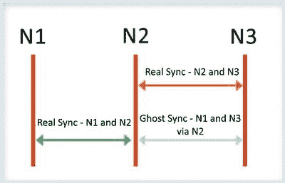
图 7-4. 通过链式从节点进行写入

尽管这最小化了网络流量，但它增加了写入操作到达所有成员所需的绝对时间。

#### 故障转移

在本节中，您将了解如何处理副本集中的主节点和 secondary 节点故障转移。副本集的所有成员都相互连接。如图 7-5 所示，它们彼此交换心跳消息。

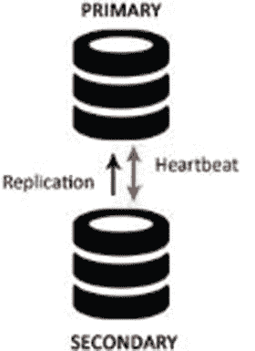
图 7-5. 心跳消息交换

因此，一个心跳丢失的节点被视为已崩溃。

#### 如果节点是 Secondary 节点

如果该节点是 secondary 节点，它将被从副本集的成员资格中移除。未来，当它恢复时，可以重新加入。一旦重新加入，它需要更新最新的更改。

如果宕机时间较短，它会连接到主节点并赶上最新的更新。但是，如果宕机时间较长，该 secondary 服务器将需要与主节点重新同步，删除其所有数据，并像新服务器一样执行初始同步。

#### 如果节点是 Primary 节点

如果该节点是主节点，在这种情况下，如果原始副本集的大多数成员能够相互连接，这些节点将根据副本集的自动故障转移能力选举出一个新的主节点。

任何无法联系到主节点的节点都将发起选举过程。

新的主节点由副本集中的大多数节点选举产生。仲裁器可用于在诸如网络分区将参与节点分成两半且无法达成多数的情况下打破平局。

优先级最高的节点将成为新的主节点。如果您有多个优先级相同的节点，则可以使用数据的新鲜度来打破平局。

主节点使用心跳来跟踪有多少节点对它可见。如果可见节点数量低于多数，主节点会自动回退到 secondary 状态。这种情况可防止主节点在网络分区隔离时继续运行。


#### 7.4.2.6 回滚

在主节点变更的场景中，新主节点上的数据被假定为系统中最新的数据。当旧的主节点重新加入时，其上发生的任何操作都将被回滚。然后，它将与新主节点进行同步。

回滚操作会撤销所有未在副本集中复制的写操作。这样做是为了维护副本集中数据库的一致性。

当连接到新主节点时，所有节点都会经历一个重新同步的过程以确保回滚完成。节点会查找在新主节点上不存在的操作，然后查询新主节点以返回受这些操作影响的文档的最新副本。节点处于重新同步过程中，被称为正在恢复；在此过程完成之前，它们不具备参与主节点选举的资格。

这种情况很少发生，如果发生，通常是由于存在复制滞后的网络分区，导致从节点无法跟上旧主节点上的操作吞吐量。

需要注意的是，如果写操作在主节点下台之前已经复制到其他成员，并且这些成员可以被副本集中的大多数节点访问，则不会发生回滚。

回滚数据会被写入一个[BSON](http://docs.mongodb.org/manual/reference/glossary/#term-bson)文件，文件名格式如`<database>.<collection>.<timestamp>.bson`，存放在数据库的[`dbpath`](http://docs.mongodb.org/manual/reference/configuration-options/#dbpath%23dbpath)目录中。

管理员可以决定忽略或应用回滚数据。应用回滚数据只能在所有节点与新主节点同步并回滚到一致状态后开始。

可以使用`Bsondump`读取回滚文件的内容，然后需要使用`mongorestore`手动应用到新主节点上。

对于 MongoDB，没有自动处理回滚情况的方法。因此，需要手动干预来应用回滚数据。在应用回滚时，至关重要的是确保这些数据被复制到所有或至少部分成员中，以便在发生任何故障转移时可以避免回滚。

#### 7.4.2.7 一致性

你已经看到副本集成员通过读取`oplog`不断在彼此之间复制数据。数据的一致性是如何维护的呢？在本节中，你将了解 MongoDB 如何确保你始终能访问到一致的数据。

在 MongoDB 中，虽然读操作可以被路由到从节点，但写操作总是被路由到主节点，这消除了两个节点同时尝试更新同一数据集的情况。主节点上的数据集始终是一致的。

如果读请求被路由到主节点，它将始终看到最新的更改，这意味着读操作总是与最后的写操作保持一致。

但是，如果应用程序更改了读取偏好以从从节点读取，则用户有可能看不到最新的更改或看到之前的状态。这是因为写操作在从节点上是异步复制的。

这种行为被描述为最终一致性，这意味着尽管从节点的状态与主节点状态不一致，但随着时间的推移，它最终会变得一致。

没有办法保证从从节点的读取是一致的，除非通过发出写关注点来确保写操作在所有成员上成功后，操作才被实际标记为成功。我们稍后将讨论写关注点。

#### 7.4.2.8 可能的复制部署架构

你选择部署副本集的架构会影响其能力和容量。在本节中，你将了解在决定架构时需要意识到的几个策略。我们还将讨论部署架构。

**奇数个成员**：这样做是为了确保选举主节点时不会出现平票。如果节点数是偶数，则可以使用一个仲裁器来确保参与选举的总节点数为奇数，如图 7-6 所示。

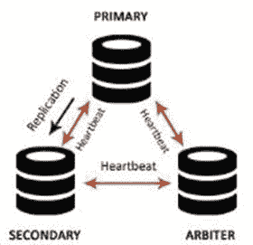

**图 7-6. 包含主节点、从节点和仲裁器的成员副本集**

副本集容错能力是指即使有指定数量的成员宕机，副本集仍有足够成员可以选举出主节点。表 7-1 说明了副本集中成员数量与其容错能力之间的关系。在决定成员数量时应考虑容错能力。

**表 7-1. 副本集容错能力**

| 成员数量 | 选举主节点所需的多数 | 容错能力 |
| :--- | :--- | :--- |
| 3 | 2 | 1 |
| 4 | 3 | 1 |
| 5 | 3 | 2 |
| 6 | 4 | 2 |

如果应用程序有特定的专用需求，例如报告或备份，则可以考虑将延迟成员或隐藏成员作为副本集的一部分，如图 7-7 所示。

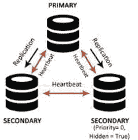

**图 7-7. 包含主节点、从节点和隐藏成员的成员副本集**

如果应用程序读操作密集，读请求可以分布在多个从节点上。随着需求增加，可以添加更多节点以增加数据副本；这对提高读取吞吐量有积极影响。

成员应进行地理分布，以应对主数据中心故障。如图 7-8 所示，那些位于主数据中心之外不同地理位置的成员，其优先级可以设置为 0，这样它们就不能被选为主节点，只能作为备用节点。

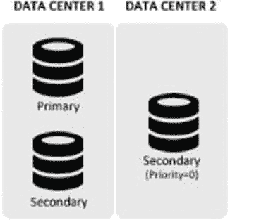

**图 7-8. 包含主节点、从节点和一个跨数据中心分布的优先级为 0 成员的成员副本集**

当副本集成员分布在不同数据中心时，网络分区可能导致数据中心之间无法通信。为了确保在网络分区情况下仍能形成多数，它会将大多数成员保持在一个位置。


#### 7.4.2.9 扩展读取操作

尽管从节点的主要目的是确保在主节点发生故障时数据仍然可用，但它们还有其他有效的使用场景。它们可以被专门用于执行备份操作、数据处理任务，或者用于扩展读取操作。扩展读取操作的一种方式是向从节点发出读取查询；这样做可以减轻主节点上的负载。

当使用从节点来扩展读取操作时，你需要考虑的一个重要点是：在 MongoDB 中，复制是异步的。这意味着，如果在主节点数据上执行了任何写入或更新操作，从节点的数据将暂时过时。如果所讨论的应用程序是读取密集型的，并且通过网络访问，且不需要最新的数据，那么可以使用从节点来扩展读取，以提供良好的读取吞吐量。尽管默认情况下读取请求会被路由到主节点，但可以通过指定**读取偏好**将请求分配到从节点上。图 7-9 描绘了默认的读取偏好。

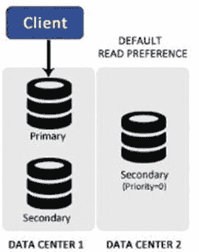

图 7-9. 默认读取偏好

以下是理想的应用场景，在这些场景中，将读取路由到从节点可以显著提高读取吞吐量，并有助于降低延迟：

地理分布的应用程序：在这种情况下，你可以拥有一个跨地理区域分布的副本集。读取偏好应设置为从**最近的**从节点读取。这有助于减少通过网络读取时引起的延迟，从而提高读取性能。参见图 7-10。

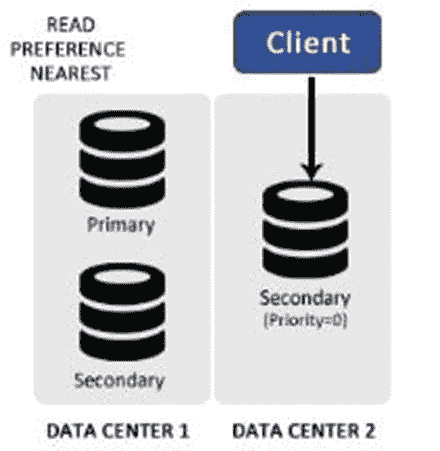

图 7-10. 读取偏好 – 最近节点

如果应用程序总是需要最新的数据，它会使用`primaryPreferred`选项。在正常情况下，它总是从主节点读取，但在紧急情况下（如主节点不可用）会将读取路由到从节点。这在发生故障转移时很有用。参见图 7-11。

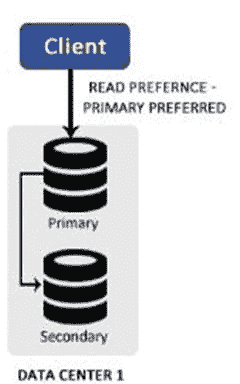

图 7-11. 读取偏好 – primaryPreferred

如果你有一个支持两种类型操作的应用程序，第一种操作是主要的负载，涉及读取并对数据进行某些处理，而第二种操作是使用数据生成报告。在这种情况下，你可以将报告读取操作定向到从节点。

MongoDB 支持以下读取偏好模式：

*   `primary`：这是默认模式。所有读取请求都被路由到主节点。
*   `primaryPreferred`：在正常情况下从主节点读取，但在紧急情况（如主节点不可用）下，从从节点读取。
*   `secondary`：从从节点成员读取。
*   `secondaryPreferred`：从从节点成员读取。如果从节点不可用，则从主节点读取。
*   `nearest`：从最近的副本集成员读取。

除了扩展读取之外，使用从节点的第二个理想用例是卸载密集的处理、聚合和管理任务，以避免降低主节点的性能。可以在从节点上执行阻塞操作，而不会影响主节点的性能。

#### 7.4.2.10 应用程序写关注点

当客户端应用程序与 MongoDB 交互时，它通常不知道数据库是独立部署还是部署为副本集。然而，在处理副本集时，客户端应该了解**写关注点**和**读关注点**。

由于副本集会复制数据并将其存储在多个节点上，这两个关注点使客户端应用程序能够在执行读写操作时灵活地在节点间强制数据一致性。

使用写关注点使应用程序能够从 MongoDB 获取成功或失败的响应。

在 MongoDB 的副本集部署中使用时，写关注点会从服务器向应用程序发送确认，表明写入已在主节点成功。然而，可以对此进行配置，使得写关注点仅在写入被复制到所有维护数据的节点后才返回成功。

在实际场景中，这并不可行，因为它会降低写入性能。理想情况下，客户端可以使用写关注点确保数据在主节点之外，还被复制到至少一个其他节点，这样即使主节点下台，数据也不会丢失。

写关注点返回一个指示错误或无错误的对象。

`w` 选项确保写入已被复制到指定数量的成员。可以指定一个数字或`majority`（多数）作为`w`选项的值。

如果指定了一个数字，写入在复制到该数量的节点后才会返回成功。如果指定了`majority`，写入在复制到多数成员后才会返回结果。

图 7-12 展示了使用`w: 2`时写入如何发生。

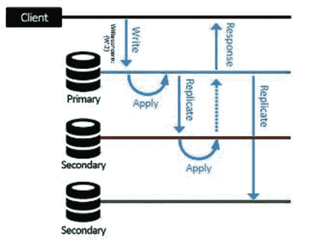

图 7-12. writeConcern

如果在指定数字时，该数字大于实际持有数据的节点数，命令将一直等待，直到有足够多的成员可用。为了避免这种无限期的等待时间，应同时使用`w`和`wtimeout`，这将确保只等待指定的时间段，如果写入在该时间内未成功，则会超时。

#### 写关注点下写入如何发生

为了确保写入的数据至少存在于两个成员上，可以发出以下命令：

```
>db.testprod.insert({i:”test”, q: 50, t: “B”}, {writeConcern: {w:2}})
```

为了理解此命令将如何执行，假设你有两个成员，一个名为 primary，另一个名为 secondary，并且它正在从 primary 同步其数据。

但是，primary 如何知道 secondary 同步到了哪个点？由于 secondary 会查询 primary 的 oplog 以应用操作结果，如果 secondary 请求一个在时间`t`写入的操作，对 primary 而言，这意味着 secondary 已经复制了所有在`t`之前写入的操作。

以下是写关注点采取的步骤：

1.  写操作被定向到主节点。
2.  该操作被写入主节点的 oplog，其中`ts`表示操作时间。
3.  发出了一个`w: 2`，因此写操作需要在被标记为成功之前被写入另一个服务器。
4.  从节点查询主节点的 oplog 以获取该操作，并应用该操作。
5.  接下来，从节点向主节点发送请求，请求`ts`大于`t`的操作。
6.  此时，主节点发送更新，表明直到`t`的操作已被从节点应用，因为它正在请求`{ts: {$gt: t}}`的操作。
7.  `writeConcern`发现写入已在主节点和从节点上发生，满足了`w: 2`的条件，于是命令返回成功。


### 7.4.3 实现高级副本集集群

在了解了副本集的架构和内部工作原理之后，我们现在将重点关注副本集的管理和使用。你将聚焦于以下方面：

设置副本集。
移除服务器。
添加服务器。
添加仲裁者。
检查状态。
强制重新选举主节点。
使用 Web 界面检查副本集的状态。

以下示例假设有一个名为 `testset` 的副本集，其配置如表 7-2 所示。

表 7-2. 副本集配置

| 成员 | 守护进程 | 主机:端口 | 数据文件路径 |
| --- | --- | --- | --- |
| Active_Member_1 | Mongod | [hostname]:27021 | C:\db1\active1\data |
| Active_Member_2 | Mongod | [hostname]:27022 | C:\db1\active2\data |
| Passive_Member_1 | Mongod | [hostname]:27023 | C:\db1\passive1\data |

上表中使用的主机名可以通过以下命令查出：
```shell
C:\>hostname
ANOC9
C:\>
```
在后续示例中，需要将 `[hostname]` 替换为 `hostname` 命令在你的系统上返回的值。在我们的例子中，返回的值是 `ANOC9`，将在以下示例中使用。

在以下实现中使用默认的 (`MMAPv1`) 存储引擎。

#### 7.4.3.1 设置副本集

为了启动并运行副本集，你需要使所有活动成员都启动并运行。

第一步是启动第一个活动成员。打开一个终端窗口并创建 `data` 目录：
```shell
C:\>mkdir C:\db1\active1\data
C:\>
```

连接到 `mongod`：
```shell
c:\practicalmongodb\bin>mongod --dbpath C:\db1\active1\data --port 27021 --replSet testset/ANOC9:27021 –rest
2015-07-13T23:48:40.543-0700 I CONTROL ** WARNING: --rest is specified without --httpinterface,
2015-07-13T23:48:40.543-0700 I CONTROL ** enabling http interface
2015-07-13T23:48:40.543-0700 I CONTROL Hotfix KB2731284 or later update is installed, no need to zero-out data files
2015-07-13T23:48:40.563-0700 I JOURNAL [initandlisten] journal dir=C:\db1\active1\data\journal
2015-07-13T23:48:40.564-0700 I JOURNAL [initandlisten] recover : no journal files present, no recovery needed
..................................... port=27021 dbpath=C:\db1\active1\data 64-bit host=ANOC9
2015-07-13T23:48:40.614-0700 I CONTROL [initandlisten] targetMinOS: Windows 7/Windows Server 2008 R2
2015-07-13T23:48:40.615-0700 I CONTROL [initandlisten] db version v3.0.4
```

如你所见，`–replSet` 选项指定了该实例要加入的副本集名称以及该集合中另一成员的名称，在上面的例子中是 `Active_Member_2`。

尽管你在上面的示例中只指定了一个成员，但可以通过指定逗号分隔的地址来提供多个成员，像这样：
```shell
mongod –dbpath C:\db1\active1\data –port 27021 –replset testset/[hostname]:27022,[hostname]:27023 --rest
```

下一步，你启动第二个活动成员并在新的终端窗口中为其创建 `data` 目录。
```shell
C:\>mkdir C:\db1\active2\data
C:\>
```

连接到 `mongod`：
```shell
c:\ practicalmongodb \bin>mongod --dbpath C:\db1\active2\data --port 27022 –replSet testset/ANOC9:27021 –rest
2015-07-13T00:39:11.599-0700 I CONTROL ** WARNING: --rest is specified without --httpinterface,
2015-07-13T00:39:11.599-0700 I CONTROL ** enabling http interface
2015-07-13T00:39:11.604-0700 I CONTROL Hotfix KB2731284 or later update is installed, no need to zero-out data files
2015-07-13T00:39:11.615-0700 I JOURNAL [initandlisten] journal dir=C:\db1\active2\data\journal
2015-07-13T00:39:11.615-0700 I JOURNAL [initandlisten] recover : no journal files present, no recovery needed
2015-07-13T00:39:11.664-0700 I JOURNAL [durability] Durability thread started
2015-07-13T00:39:11.664-0700 I JOURNAL [journal writer] Journal writer thread started rs.initiate() in the shell -- if that is not already done
```

最后，你需要启动被动成员。打开一个单独的窗口并为被动成员创建 `data` 目录。
```shell
C:\>mkdir C:\db1\passive1\data
C:\>
```

连接到 `mongod`：
```shell
c:\ practicalmongodb \bin>mongod --dbpath C:\db1\passive1\data --port 27023 --replSet testset/ ANOC9:27021 –rest
2015-07-13T05:11:43.746-0700 I CONTROL Hotfix KB2731284 or later update is installed, no need to zero-out data files
2015-07-13T05:11:43.757-0700 I JOURNAL [initandlisten] journal dir=C:\db1\passive1\data\journal
2015-07-13T05:11:43.808-0700 I CONTROL [initandlisten] MongoDB starting : pid=620 port=27019 dbpath=C:\db1\passive1\data 64-bit host= ANOC9
......................................................................................
2015-07-13T05:11:43.812-0700 I CONTROL [initandlisten] options: { net: { http:
{ RESTInterfaceEnabled: true, enabled: true }, port: 27019 }, replication: { re
lSet: "testset/ ANOC9:27017" }, storage: { dbPath: "C:\db1\passive1\data" }
```

在前面的示例中，使用了 `--rest` 选项来在端口 +1000 上激活一个 REST 接口。激活 REST 使你能够使用 Web 界面检查副本集状态。

完成以上步骤后，你就有三台服务器启动并运行，并且它们相互通信；然而，副本集仍未初始化。在下一步中，你将初始化副本集并指示每个成员其职责和角色。

为了初始化副本集，你需要连接到其中一台服务器。在这个例子中，是运行在端口 `27021` 上的第一台服务器。

打开一个新的命令提示符并连接到第一台服务器的 `mongo` 接口：
```shell
C:\>cd c:\practicalmongodb\bin
c:\practicalmongodb\bin>mongo ANOC9 --port 27021
MongoDB shell version: 3.0.4
connecting to: ANOC9:27021/test
>
```

接下来，切换到 `admin` 数据库。
```shell
> use admin
switched to db admin
>
```

接着，设置一个配置数据结构，其中指明了各服务器的角色：
```javascript
>cfg = {
... _id: 'testset',
... members: [
... {_id:0, host: 'ANOC9:27021'},
... {_id:1, host: 'ANOC9:27022'},
... {_id:2, host: 'ANOC9:27023', priority:0}
... ]
... }
{ "_id" : "testset",
"members" : [
{
"_id" : 0,
"host" : "ANOC9:27021"
},
..........
{
"_id" : 2,
"host" : "ANOC9:27023",
"priority" : 0
} ]}>
```
通过这一步，副本集结构就配置好了。

你在定义被动成员的角色时使用了 `0` 优先级。这意味着该成员不能被提升为主节点。

下一个命令初始化副本集：
```javascript
> rs.initiate(cfg)
{ "ok" : 1}
```

现在让我们查看副本集状态，以验证其是否已正确设置：
```javascript
testset:PRIMARY> rs.status()
{
"set" : "testset",
"date" : ISODate("2015-07-13T04:32:46.222Z")
"myState" : 1,
"members" : [
{
"_id" : 0,
...........................
testset:PRIMARY>
```
输出表明一切正常。副本集现已成功配置并初始化。

让我们看看如何确定主节点。为此，连接到任何成员并执行以下命令来验证主节点：
```javascript
testset:PRIMARY> db.isMaster()
{
"setName" : "testset",
"setVersion" : 1,
"ismaster" : true,
"primary" : " ANOC9:27021",
"me" : "ANOC9:27021",
...........................................
"localTime" : ISODate("2015-07-13T04:36:52.365Z"),
.........................................................
"ok" : 1
}testset:PRIMARY>
```


### 7.4.3 MongoDB 副本集

#### 7.4.3.2 移除服务器

在此示例中，你将从副本集中移除一个活跃的次成员。首先，连接到该次成员的 mongo 实例。打开一个新的命令提示符，如下所示：

```
C:\>cd c:\practicalmongodb\bin
c:\practicalmongodb\bin>mongo ANOC9 --port 27022
MongoDB shell version: 3.0.4
connecting to: 127.0.0.1:27022/ANOC9
testset:SECONDARY>
```

发出以下命令以关闭该实例：

```
testset:SECONDARY> use admin
switched to db admin
testset:SECONDARY> db.shutdownServer()
2015-07-13T21:48:59.009-0700 I NETWORK DBClientCursor::init call() failed server should be down...
```

接下来，你需要连接到主成员的 mongo 控制台并执行以下命令以移除该成员：

```
testset:PRIMARY> use admin
switched to db admin
testset:PRIMARY> rs.remove("ANOC9:27022")
{ "ok" : 1 }
testset:PRIMARY>
```

为了验证该成员是否已被移除，你可以发出 `rs.status()` 命令。

#### 7.4.3.3 添加服务器

接下来，你将向副本集添加一个新的活跃成员。与其他成员一样，首先打开一个新的命令提示符并创建 `data` 目录：

```
C:\>mkdir C:\db1\active3\data
C:\>
```

然后，使用以下命令启动 `mongod`：

```
c:\practicalmongodb\bin>mongod --dbpath C:\db1\active3\data --port 27024 --replSet testset/ANOC9:27021 --rest
..........
```

新的 `mongod` 已经运行，现在你需要将其添加到副本集。为此，连接到主成员的 mongo 控制台：

```
C:\>c:\practicalmongodb\bin\mongo.exe --port 27021
MongoDB shell version: 3.0.4
connecting to: 127.0.0.1:27021/test
testset:PRIMARY>
```

接着，切换到 `admin` 数据库：

```
testset:PRIMARY> use admin
switched to db admin
testset:PRIMARY>
```

最后，需要发出以下命令将新的 `mongod` 添加到副本集：

```
testset:PRIMARY> rs.add("ANOC9:27024")
{ "ok" : 1 }
```

可以检查副本集状态，以验证新的活跃成员是否已添加成功，使用 `rs.status()` 命令。

#### 7.4.3.4 向副本集添加仲裁器

在此示例中，你将向副本集添加一个仲裁器成员。与其他成员一样，首先为 MongoDB 实例创建 `data` 目录：

```
C:\>mkdir c:\db1\arbiter\data
C:\>
```

然后，使用以下命令启动 `mongod`：

```
c:\practicalmongodb\bin>mongod --dbpath c:\db1\arbiter\data --port 30000 --replSet testset/ANOC9:27021 --rest
2015-07-13T22:05:10.205-0700 I CONTROL [initandlisten] MongoDB starting : pid=3700 port=30000 dbpath=c:\db1\arbiter\data 64-bit host=ANOC9
..........................................................
```

连接到主成员的 mongo 控制台，切换到 `admin` 数据库，并将新创建的 `mongod` 作为仲裁器添加到副本集：

```
C:\>c:\practicalmongodb\bin\mongo.exe --port 27021
MongoDB shell version: 3.0.4
connecting to: 127.0.0.1:27021/test
testset:PRIMARY> use admin
switched to db admin
testset:PRIMARY> rs.addArb("ANOC9:30000")
{ "ok" : 1 }
testset:PRIMARY>
```

可以使用 `rs.status()` 命令来验证此步骤是否成功。

#### 7.4.3.5 使用 `rs.status()` 检查状态

在上面的示例中，我们一直使用 `rs.status()` 来检查副本集状态。在本节中，你将了解这个命令的具体内容。

它使你能够检查你所连接控制台对应的成员的状态，并查看其在副本集中的角色。

以下命令从主成员的 mongo 控制台发出：

```
testset:PRIMARY> rs.status()
{
"set" : "testset",
"date" : ISODate("2015-07-13T22:15:46.222Z")
"myState" : 1,
"members" : 
{
"_id" : 0,
...........................
"ok" : 1
testset:PRIMARY>
```

`myState` 字段的值表示成员的状态，它可以具有表 7-3 中所示的值。

表 7-3. 副本集状态

| myState | 描述 |
| --- | --- |
| 0 | 阶段 1，正在启动 |
| 1 | 主成员 |
| 2 | 次成员 |
| 3 | 恢复状态 |
| 4 | 致命错误状态 |
| 5 | 阶段 2，正在启动 |
| 6 | 未知状态 |
| 7 | 仲裁器成员 |
| 8 | 宕机或不可达 |
| 9 | 当次成员在从主成员转变后回滚写入操作时，会进入此状态。 |
| 10 | 当成员从副本集中移除时进入此状态。 |

因此，上面的命令返回的 `myState` 值为 1，这表明这是主成员。

#### 7.4.3.6 强制新选举

可以使用 `rs.stepDown()` 命令强制当前主服务器降级。这将强制开始选举新的主成员。

此命令在以下场景中很有用：

*   当你模拟主节点故障的影响，强制集群进行故障转移时。这可以让你测试应用程序在此类场景下的响应。
*   当主服务器需要离线时。这可能是为了维护活动、升级或调查服务器。
*   当需要针对数据结构运行诊断过程时。

以下是在 `testset` 副本集上运行该命令的输出：

```
testset:PRIMARY> rs.stepDown()
2015-07-13T22:52:32.000-0700 I NETWORK DBClientCursor::init call() failed
2015-07-13T22:52:32.005-0700 E QUERY Error: error doing query: failed
2015-07-13T22:52:32.009-0700 I NETWORK trying reconnect to 127.0.0.1:27021 (127.0.0.1) failed
2015-07-13T22:52:32.011-0700 I NETWORK reconnect 127.0.0.1:27021 (127.0.0.1) ok testset:SECONDARY>
```

命令执行后，提示符从 `testset:PRIMARY` 变为 `testset:SECONDARY`。

可以使用 `rs.status()` 来检查 `stepDown()` 是否成功。

请注意，它返回的 `myState` 值现在是 2，这意味着“成员正作为次成员运行”。

#### 7.4.3.7 使用 Web 界面检查副本集状态

MongoDB 维护一个基于 Web 的控制台，用于查看系统状态。在你的示例中，可以通过 `http://localhost:28021` 访问该控制台。

默认情况下，Web 界面的端口号设置为 X+1000，其中 X 是 `mongod` 实例的端口号。在本章的示例中，由于主实例端口为 27021，因此 Web 界面位于端口 28021。

图 7-13 显示了一个指向副本集状态的链接。单击该链接将转到图 7-14 所示的副本集仪表板。

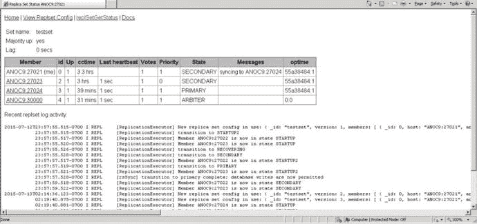

图 7-14. 副本集状态报告


## 7.5 分片

你在上一节中已经看到，MongoDB 如何使用**副本集**来复制数据，以防范各种意外情况，并分发读取负载以提高读取效率。

MongoDB 广泛使用内存来实现低延迟的数据库操作。当比较从内存读取数据与从磁盘读取数据的速度时，从内存读取大约比从磁盘读取快 100,000 倍。

在 MongoDB 中，理想情况下，**工作集**应完全容纳在内存中。工作集由最常访问的数据和索引组成。

当 MongoDB 访问不在内存中的数据时，会发生**页面错误**。如果有空闲内存可用，操作系统会直接将请求的页面加载到内存中；然而，在没有空闲内存的情况下，内存中的页面会被写入磁盘，然后请求的页面才会被加载到内存中，这会拖慢进程。少数操作可能会意外地将工作集的大部分从内存中清除，从而对性能产生不利影响。一个例子是扫描数据库中所有文档的查询，如果其大小超过了服务器内存。这会导致文档被加载到内存中，并将工作集置换到磁盘上。

确保你在项目的模式设计阶段为查询定义了适当的索引覆盖范围，将最大程度地降低发生这种情况的风险。MongoDB 的 `explain` 操作可用于提供有关你的查询计划和所用索引的信息。

MongoDB 的 `serverStatus` 命令返回一个 `workingSet` 文档，该文档提供了实例工作集大小的估计值。运维团队可以跟踪实例在给定时间段内访问了多少页面，以及工作集中最旧文档和最新文档之间的时间间隔。通过跟踪所有这些指标，可以检测到工作集何时将达到当前内存限制，从而可以采取主动措施确保系统得到良好扩展以应对这种情况。

在 MongoDB 中，扩展是通过**水平扩展**数据（即在多台通用服务器之间对数据进行分区）来处理的，这也称为**分片**（水平扩展）。

分片通过将数据集水平划分到多台服务器上来应对扩展以支持大型数据集和高吞吐量的挑战，每台服务器负责处理其那部分数据，没有哪一台服务器会负担过重。这些服务器也称为**分片**。

每个分片都是一个独立的数据库。所有分片共同组成一个逻辑数据库。

分片减少了每个分片需要处理的操作数量。例如，当插入数据时，只需要访问负责存储这些记录的分片。

随着集群的增长，每个分片需要处理的进程会减少，因为分片所保存的数据子集变小了。这导致了吞吐量和容量的水平提升。

假设你有一个大小为 1TB 的数据库。如果分片数量为 4，那么每个分片将处理大约 265GB 的数据，而如果将分片数量增加到 40，则每个分片仅需保存 25GB 的数据。

图 7-15 描绘了一个被分片的集合在三个分片上分布时的样子。

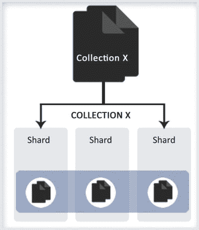

图 7-15.

跨三个分片的分片集合

尽管分片是一个引人注目且强大的特性，但它对基础设施有显著要求，并且增加了整个部署的复杂性。因此，你需要了解在哪些情况下可以考虑使用分片。

在以下情况下使用分片：

*   数据集的大小非常庞大，并且已经开始挑战单个系统的能力。
*   由于 MongoDB 使用内存来快速获取数据，当活动工作集的限制即将达到时，进行水平扩展就变得很重要。
*   如果应用程序是写密集型的，可以使用分片将写入分散到多台服务器上。

### 7.5.1 分片组件

接下来你将了解在 MongoDB 中实现分片所需的组件。分片功能在 MongoDB 中通过**分片集群**启用。

分片集群的组件如下：

*   `分片`
*   `mongos`
*   `配置服务器`

分片是实际存储数据的组件。对于分片集群，它保存数据的一个子集，可以是一个 `mongod` 实例或一个**副本集**。所有分片的数据组合在一起构成了分片集群的完整数据集。

分片是按集合启用的，因此可能存在未分片的集合。在每个分片集群中，都有一个**主分片**，除了分片集合的数据外，所有未分片的集合也放置在此处。

部署分片集群时，默认情况下第一个分片成为主分片，尽管这是可配置的。见图 7-16。

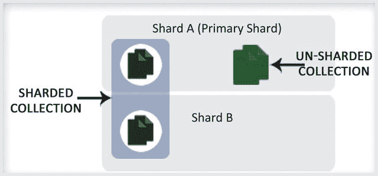

图 7-16.

主分片

`配置服务器` 是特殊的 `mongod` 实例，它们保存分片集群的**元数据**。此元数据描述了分片系统的状态和组织结构。

配置服务器为单个分片集群存储数据。为了使集群正常运行，`配置服务器` 必须可用。

一个 `配置服务器` 可能导致集群的**单点故障**。对于生产环境部署，建议至少使用三个 `配置服务器`，这样即使一个 `配置服务器` 无法访问，集群也能继续运行。

`配置服务器` 将数据存储在 `config` 数据库中，该数据库能够将客户端请求路由到相应的数据。此数据库不应被更新。

MongoDB 仅在数据分布发生变化以进行集群平衡时，才会向 `配置服务器` 写入数据。

`mongos` 充当**路由器**。它们负责将应用程序的读写请求路由到各个分片。

与 MongoDB 数据库交互的应用程序无需关心数据在分片内部的存储方式。对于它们来说，这是透明的，因为它们只与 `mongos` 交互。然后，`mongos` 将读写操作路由到各个分片。

`mongos` 会缓存来自 `配置服务器` 的元数据，这样对于每个读写请求，它们就不会过度加重 `配置服务器` 的负担。

然而，在以下情况下，数据是从 `配置服务器` 读取的：

*   现有的 `mongos` 已重新启动，或者新的 `mongos` 首次启动。
*   **块迁移**。我们将在后面详细解释 `chunk migration`。

### 7.5.2 数据分发过程

接下来你将了解在启用了分片的集合中，数据如何在分片之间分发。在 MongoDB 中，数据是在**集合级别**进行分片或分发的。集合通过 `shard key` 进行分区。

#### 7.5.2.1 分片键

集合中所有文档中存在的任何已索引的单字段或复合字段都可以作为 `shard key`。你指定这个字段作为依据来分发集合的文档。在内部，MongoDB 根据该字段的值将文档划分成**块**，并将这些块分发到各个分片。

MongoDB 通过两种方式启用数据分发：`基于范围的分区` 和 `基于哈希的分区`。


#### 基于范围的分区

在基于范围的分区中，分片键值被划分为多个范围。假设你考虑一个 `timestamp` 字段作为分片键。在这种分区方式中，值被视为从最小值到最大值的一条直线，其中最小值是起始时期（例如，1970 年 1 月 1 日），最大值是结束时期（例如，9999 年 12 月 31 日）。集合中的每个文档都将仅具有此范围内的某个时间戳值，它将代表这条线上的某个点。

根据可用分片的数量，这条线将被划分为多个范围，文档将根据这些范围进行分发。

在此分区方案中，如图 7-17 所示，分片键值相近的文档很可能落在同一个分片上。这可以显著提高范围查询的性能。

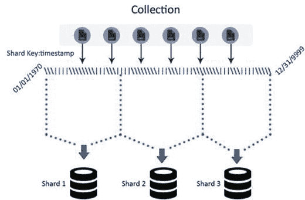
**图 7-17. 基于范围的分区**

然而，其缺点在于它可能导致数据分布不均，使某个分片过载，最终可能接收大部分请求，而其他分片负载不足，因此系统无法正常扩展。

#### 基于哈希的分区

在基于哈希的分区中，数据是根据分片字段的哈希值进行分布的。如果选择这种方式，与基于范围的分区相比，它将导致更随机的分布。

分片键相近的文档不太可能属于同一个块。例如，对于基于 `_id` 字段哈希的范围，将会有一条哈希值直线，这条直线将再次根据分片数量进行分区。根据哈希值，文档将分布在任一分片中。参见图 7-18。

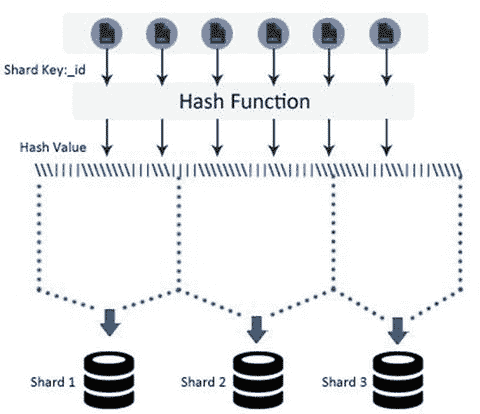
**图 7-18. 基于哈希的分区**

与基于范围的分区相比，这确保了数据均匀分布，但这是以高效的范围查询为代价的。

#### 块

数据以块的形式在分片之间移动。分片键范围被进一步划分为子范围，这些子范围也被称为块。参见图 7-19。

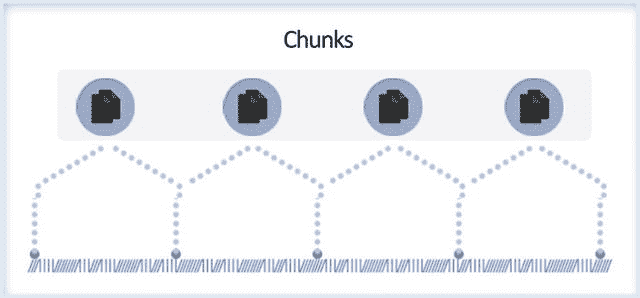
**图 7-19. 块**

对于一个分片集群，`64MB` 是默认的块大小。在大多数情况下，这是一个适合进行块拆分和迁移的大小。

让我们通过一个例子来讨论分片和块的执行过程。假设你有一个博客文章集合，它基于 `date` 字段进行分片。这意味着集合将根据 `date` 字段的值进行拆分。我们进一步假设你有三个分片。在此场景中，数据可能在分片上分布如下：

*   分片 #1：时间开始至 2009 年 7 月
*   分片 #2：2009 年 8 月至 2009 年 12 月
*   分片 #3：2010 年 1 月至时间结束

为了检索从 2010 年 1 月 1 日到今天的文档，查询被发送到 `mongos`。

在此场景中：
1.  客户端查询 `mongos`。
2.  `mongos` 知道哪些分片拥有数据，因此它将查询发送给分片 #3。
3.  分片 #3 执行查询并将结果返回给 `mongos`。
4.  `mongos` 合并从各个分片（在此情况下仅为分片 #3）接收的数据，并将最终结果返回给客户端。

应用程序不需要感知分片。它可以像查询普通的 `mongod` 一样查询 `mongos`。

让我们考虑另一个场景，你插入一个新文档。新文档具有今天的日期。事件序列如下：
1.  文档被发送到 `mongos`。
2.  `mongos` 检查日期，并基于此将文档发送给分片 #3。
3.  分片 #3 插入文档。

从客户端的角度来看，这再次与单服务器设置相同。

#### 配置服务器在上述场景中的作用

考虑一个场景，你开始收到数百万个日期为 2009 年 9 月的文档的插入请求。在这种情况下，分片 #2 开始变得过载。

一旦配置服务器意识到分片 #2 变得太大，它就会介入。它将拆分该分片上的数据并开始将其迁移到其他分片。迁移完成后，它将更新后的状态发送给 `mongos`。因此现在，分片 #2 拥有 2009 年 8 月到 2009 年 9 月 18 日的数据，而分片 #3 包含 2009 年 9 月 19 日到时间结束的数据。

当向集群添加新分片时，由配置服务器负责决定如何处理它。数据可能需要立即迁移到新分片，或者新分片可能需要保留一段时间。总之，配置服务器是大脑。每当有任何数据被移动时，配置服务器都会让 `mongos` 知道最终配置，以便 `mongos` 可以继续进行正确的路由。

## 7.5.3 数据平衡过程

接下来你将了解如何保持集群的平衡（即 MongoDB 如何确保所有分片负载均等）。

新数据的添加或现有数据的修改，或服务器的添加或移除，都可能导致数据分布不平衡，这意味着要么一个分片因块过多而过载，其他分片的块数量较少，要么可能导致某个块的大小显著大于其他块。

MongoDB 通过以下后台进程确保平衡：
*   块拆分
*   平衡器

#### 7.5.3.1 块拆分

块拆分是确保块保持指定大小的进程之一。如你所见，选择了一个分片键并用于标识文档将如何跨分片分布。文档进一步被分组为 `64MB` 的块（默认且可配置），并根据其托管的范围存储在分片中。

如果由于插入或更新操作导致块的大小发生变化并超过默认块大小，则该块将被 `mongos` 拆分为两个更小的块。参见图 7-20。

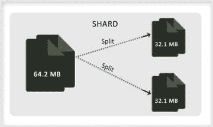
**图 7-20. 块拆分**

此过程使分片内的块保持指定大小或小于该大小（即它确保块为配置的大小）。

插入和更新操作会触发拆分。拆分操作会导致配置服务器中的数据被修改，因为元数据被更新了。虽然拆分不会导致数据迁移，但此操作可能导致集群不平衡，其中一个分片拥有比另一个分片更多的块。


#### 7.5.3.2 平衡器

平衡器是一个后台进程，用于确保所有分片负载均衡或处于平衡状态。此进程管理块（chunk）的迁移。

块的拆分可能导致不平衡。文档的增加或删除也可能导致集群不平衡。在集群不平衡时，会使用平衡器（balancer）来均匀分布数据。

当一个分片比其他分片拥有更多块时，MongoDB 会自动在各分片间平衡这些块。此过程对应用程序和用户是透明的。

集群中的任何 `mongos` 都可以启动平衡器进程。它们通过获取配置服务器（config server）上配置数据库（config database）的锁来实现，因为平衡器涉及将块从一个分片迁移到另一个分片，这可能导致元数据变更，进而需要更改配置服务器上的数据库。平衡器进程对数据库性能可能产生巨大影响，因此它可以配置为仅在达到迁移阈值（migration threshold）时才开始迁移。迁移阈值是分片上最大块数与最小块数之差。阈值如表 7-4 所示。

表 7-4：迁移阈值

| 块数量 | 迁移阈值 |
| :--- | :--- |
| < 20 | 2 |
| 21-80 | 4 |
| >80 | 8 |

或者，也可以将其安排在不会影响生产流量的时间段内运行。

平衡器一次迁移一个块（参见图 7-21），并遵循以下步骤：

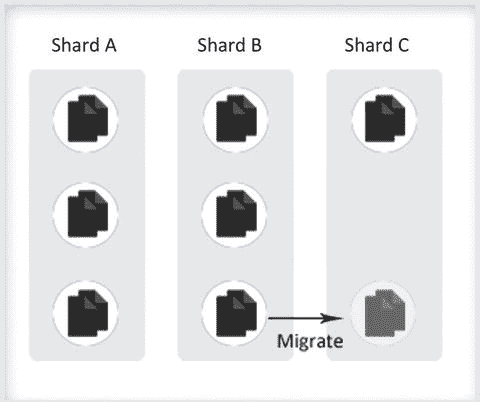

1.  将 `moveChunk` 命令发送到源分片。
2.  源分片启动一个内部的 `moveChunk` 命令，在该命令中创建块内文档的副本并将其排入队列。在此期间，由于配置数据库尚未更改，且源分片仍负责处理该块上的任何读/写请求，因此 `mongos` 将针对该块的任何操作都路由到源分片。
3.  目标分片开始从源接收数据的副本。
4.  一旦目标分片接收到块中的所有文档，就会启动同步过程，以确保迁移期间发生的所有数据变更都在目标分片上更新。
5.  同步完成后，下一步是在配置数据库中更新元数据，记录块的新位置。此活动由目标分片完成，它连接到配置数据库并执行必要的更新。
6.  成功完成上述所有步骤后，源分片上维护的文档副本将被删除。

如果在此期间平衡器需要从源分片进行额外的块迁移，它可以开始新的迁移，而无需等待当前迁移的删除步骤完成。

如果在迁移过程中出现任何错误，平衡器会中止该过程，将块留在原始分片上。成功完成后，MongoDB 会从原始分片中删除块数据。

分片的增加或删除也可能导致集群不平衡。添加新分片时，会立即开始向该分片迁移数据。但是，集群达到平衡需要时间。

当移除一个分片时，平衡器确保数据被迁移到其他分片，并更新元数据信息。完成这两项活动后，该分片才会被安全移除。

## 7.5.4 操作

接下来，我们将了解如何在分片集群上执行读和写操作。如前所述，配置服务器维护集群元数据。这些数据存储在配置数据库（config database）中。`mongos` 使用配置数据库的这些数据来为应用程序的读和写请求提供服务。

`mongos` 实例会缓存这些数据，然后用于将写和读操作路由到各个分片。这样配置服务器就不会负担过重。

`mongos` 仅在以下情况下从配置服务器读取：
*   `mongos` 首次启动时
*   现有的 `mongos` 重启后
*   块迁移后，`mongos` 需要用新的集群元数据更新其缓存的元数据时

每当发出任何操作时，`mongos` 需要做的第一步是确定哪些分片将服务于该请求。由于分片键（shard key）用于在分片集群中分布数据，如果操作使用了分片键字段，那么就可以据此定位到特定的分片。

假设分片键是 `employeeid`，可能会发生以下情况：
*   如果 `find` 查询包含 `employeeid` 字段，那么为了满足查询，`mongos` 将只定位到特定的分片。
*   如果单个更新操作使用 `employeeid` 来更新文档，请求将被路由到保存该员工数据的分片。

但是，如果操作没有使用分片键，那么请求将被广播到所有分片。通常，多更新或删除操作会针对整个集群。

在查询数据时，可能存在一些场景，除了识别分片并从它们获取数据外，`mongos` 可能需要在将最终输出发送给客户端之前，对从各个分片返回的数据进行处理。

假设一个应用程序发出了一个带有 `sort()` 的 `find()` 请求。在这种情况下，`mongos` 会将 `$orderby` 选项传递给各个分片。分片将从它们的数据集中获取数据，并按排序顺序发送结果。一旦 `mongos` 收到所有分片的排序数据，它会对整个数据执行增量归并排序（incremental merge sort），然后将最终输出返回给客户端。

与 `sort` 类似的是聚合函数，例如 `limit()`、`skip()` 等，这些函数要求 `mongos` 在从分片接收数据之后、向客户端返回最终结果集之前执行操作。

`mongos` 消耗的系统资源极少，并且没有持久状态。因此，如果应用程序的需求是简单的 `find()` 查询，并且这些查询可以完全由分片满足，无需在 `mongos` 层面进行操作，那么你可以将 `mongos` 运行在与你的应用程序服务器相同的系统上。

### 7.5.5 实现分片

在本节中，你将学习在 Windows 平台的一台机器上配置分片。

我们将通过仅使用两个分片来保持示例简单。在此配置中，你将使用表 7-5 中列出的服务。

表 7-5：分片集群配置

| 组件 | 类型 | 端口 | 数据文件路径 |
| :--- | :--- | :--- | :--- |
| 分片控制器 | Mongos | 27021 | - |
| 配置服务器 | Mongod | 27022 | C:\db1\config\data |
| 分片 0 | Mongod | 27023 | C:\db1\shard1\data |
| 分片 1 | Mongod | 27024 | C:\db1\shard2\data |

你将重点关注以下内容：
*   设置一个分片集群。
*   创建一个数据库和集合，并在该集合上启用分片。
*   使用导入命令将数据加载到分片集合中。
*   在分片间分发数据。
*   向集群中添加和移除分片，并检查数据如何自动重新分布。


#### 7.5.5.1 设置分片集群

要设置集群，第一步是设置配置服务器。在新的终端窗口中输入以下代码，为配置服务器创建 `data` 目录并启动 `mongod`：

```
C:\> mkdir C:\db1\config\data

C:\>CD C:\practicalmongodb\bin

C:\ practicalmongodb\bin>mongod --port 27022 --dbpath C:\db1\config\data --configsvr

2015-07-13T23:02:41.982-0700 I JOURNAL [journal writer] Journal writer thread started

2015-07-13T23:02:41.984-0700 I CONTROL [initandlisten] MongoDB starting : pid=3084 port=27022 dbpath=C:\db1\config\data master=1 64-bit host=ANOC9

......................................

2015-07-13T23:02:42.066-0700 I REPL [initandlisten] ******

2015-07-13T03:02:42.067-0700 I NETWORK [initandlisten] waiting for connections on port 27022
```

接下来，启动 `mongos`。在新的终端窗口中输入：

```
C:\>cd c:\practicalmongodb\bin

c:\practicalmongodb\bin>mongos --configdb localhost:27022 --port 27021 --chunkSize 1

2015-07-13T23:06:07.246-0700 W SHARDING running with 1 config server should be done only for testing purposes and is not recommended for production

...............................................................

2015-07-13T23:09:07.464-0700 I SHARDING [Balancer] distributed lock 'balancer/ ANOC9:27021:1429783567:41' unlocked
```

现在，分片控制器（即 `mongos`）已启动并运行。

如果切换到启动了配置服务器的窗口，你会发现分片服务器已注册到配置服务器。

在此示例中，你使用了 1MB 的块大小。请注意，在真实场景中这并不理想，因为它小于 4MB（文档的最大大小）。然而，这仅用于演示目的，因为它无需加载大量数据就能创建必要数量的块。除非另有指定，`chunkSize` 默认为 128MB。

接下来，启动分片服务器 Shard0 和 Shard1。

打开一个新的终端窗口。为第一个分片创建 `data` 目录并启动 `mongod`：

```
C:\>mkdir C:\db1\shard0\data

C:\>cd c:\practicalmongodb\bin

c:\practicalmongodb\bin>mongod --port 27023 --dbpath c:\db1\shard0\data –shardsvr

2015-07-13T23:14:58.076-0700 I CONTROL [initandlisten] MongoDB starting : pid=1996 port=27023 dbpath=c:\db1\shard0\data 64-bit host=ANOC9

..................................................................

2015-07-13T23:14:58.158-0700 I NETWORK [initandlisten] waiting for connections on port 27023
```

打开一个新的终端窗口。为第二个分片创建 `data` 目录并启动 `mongod`：

```
C:\>mkdir c:\db1\shard1\data

C:\>cd c:\practicalmongodb\bin

c:\practicalmongodb\bin>mongod --port 27024 --dbpath C:\db1\shard1\data --shardsvr

2015-07-13T23:17:01.704-0700 I CONTROL [initandlisten] MongoDB starting : pid=3672 port=27024 dbpath=C:\db1\shard1\data 64-bit host=ANOC9

2015-07-13T23:17:01.704-0700 I NETWORK [initandlisten] waiting for connections on port 27024
```

到以上步骤结束时，所有与设置相关的服务器都已启动并运行。下一步是将分片信息添加到分片控制器。

尽管 `mongos` 实际上不是一个完整的实例，但它对应用程序而言表现为一个完整的 MongoDB 实例。可以使用 `mongo` shell 连接到 `mongos` 来执行任何操作。

打开 `mongos` 的 `mongo` 控制台：

```
C:\>cd c:\practicalmongodb\bin

c:\ practicalmongodb\bin>mongo localhost:27021

MongoDB shell version: 3.0.4

connecting to: localhost:27021/test

mongos>
```

切换到 `admin` 数据库：

```
mongos> use admin

switched to db admin

mongos>
```

通过运行以下命令添加分片信息：

```
mongos> db.runCommand({addshard:"localhost:27023",allowLocal:true})

{ "shardAdded" : "shard0000", "ok" : 1 }

mongos> db.runCommand({addshard:"localhost:27024",allowLocal:true})

{ "shardAdded" : "shard0001", "ok" : 1 }

mongos>
```

这会激活两个分片服务器。

下一个命令检查分片：

```
mongos> db.runCommand({listshards:1})

{

"shards" : [

{

"_id" : "shard0000",

"host" : "localhost:27023"

}, {

"_id" : "shard0001",

"host" : "localhost:27024"

}

], "ok" : 1}
```

#### 7.5.5.2 创建数据库和分片集合

为了继续此示例，你将创建一个名为 `testdb` 的数据库和一个名为 `testcollection` 的集合，并将基于键 `testkey` 对其进行分片。

连接到 `mongos` 控制台并执行以下命令以获取数据库：

```
mongos> testdb=db.getSisterDB("testdb")

testdb
```

接下来，为 `testdb` 在数据库级别启用分片：

```
mongos> db.runCommand({enableSharding system: "testdb"})

{ "ok" : 1 }

mongos>
```

接下来，指定需要分片的集合以及该集合将基于哪个键进行分片：

```
mongos> db.runCommand({shardcollection: "testdb.testcollection", key: {testkey:1}})

{ "collectionsharded" : "testdb.testcollection", "ok" : 1 }

mongos>
```

完成以上步骤后，你现在拥有一个所有组件都已启动并运行的分片集群。你已经创建了一个数据库并启用了集合分片。

接下来，将数据导入集合，以便检查分片上的数据分布。

你将使用 `import` 命令将数据加载到 `testcollection` 中。连接到一个新的终端窗口并执行：

```
C:\>cd C:\practicalmongodb\bin

C:\practicalmongodb\bin>mongoimport --host ANOC9 --port 27021 --db testdb --collection testcollection --type csv --file c:\mongoimport.csv –-headerline

2015-07-13T23:17:39.101-0700 connected to: ANOC9:27021

2015-07-13T23:17:42.298-0700 [##############..........] testdb.testcollection 1.1 MB/1.9 MB (59.6%)

2015-07-13T23:17:44.781-0700 imported 100000 documents
```

`mongoimport.csv` 文件包含两个字段。第一个是 `testkey`，它是一个随机生成的数字。第二个字段是文本字段；它用于确保文档占据足够数量的块，从而使使用分片机制变得可行。

这会在集合中插入 100,000 个对象。

为了验证记录是否已插入，连接到 `mongos` 的 `mongo` 控制台并发出以下命令：

```
C:\Windows\system32>cd c:\practicalmongodb\bin

c:\practicalmongodb\bin>mongo localhost:27021

MongoDB shell version: 3.0.4

connecting to: localhost:27021/test

mongos> use testdb

switched to db testdb

mongos> db.testcollection.count()

100000

mongos>
```

接下来，连接到两个分片（Shard0 和 Shard1）的控制台，并查看数据是如何分布的。打开一个新的终端窗口并连接到 Shard0 的控制台：

```
C:\>cd C:\practicalmongodb\bin

C:\ practicalmongodb\bin>mongo localhost:27023

MongoDB shell version: 3.0.4

connecting to: localhost:27023/test
```

切换到 `testdb` 并发出 `count()` 命令以检查该分片上的文档数量：

```
> use testdb

switched to db testdb

> db.testcollection.count()

57998
```

接下来，打开一个新的终端窗口，连接到 Shard1 的控制台，并按照上述步骤操作（即切换到 `testdb` 并检查 `testcollection` 集合的计数）：

```
C:\>cd c:\practicalmongodb\bin

c:\practicalmongodb\bin>mongo localhost:27024

MongoDB shell version: 3.0.4

connecting to: localhost:27024/test

> use testdb

switched to db testdb

> db.testcollection.count()

42002

>
```

当你运行上述命令一段时间后，可能会看到每个分片上的文档数量存在差异。当文档加载时，所有块都由 `mongos` 放置在一个分片上。随后，通过将块均匀地分布在所有分片上来重新平衡分片集。


#### 7.5.5.3 添加新分片

你已经设置好了一个分片集群，也已经对一个集合进行了分片，并查看了数据是如何在分片间分布的。接下来，你将向集群添加一个新分片，以便负载能更分散一些。

你将重复上述步骤。首先，在一个新的终端窗口中为新分片创建一个数据目录：

```
c:\>mkdir c:\db1\shard2\data
```

然后，在端口 27025 上启动 `mongod`：

```
c:\>cd c:\practicalmongodb\bin
c:\ practicalmongodb\bin>mongod --port 27025 --dbpath C:\db1\shard2\data --shardsvr
```

```
2015-07-13T23:25:49.103-0700 I CONTROL [initandlisten] MongoDB starting : pid=3744 port=27025 dbpath=C:\db1\shard2\data 64-bit host=ANOC9
................................
2015-07-13T23:25:49.183-0700 I NETWORK [initandlisten] waiting for connections on port 27025
```

接下来，新的分片服务器将被添加到分片集群中。为了配置它，在一个新的终端窗口中打开 `mongos` 的 mongo 控制台：

```
C:\>cd c:\practicalmongodb\bin
c:\practicalmongodb\bin>mongo localhost:27021
MongoDB shell version: 3.0.4
connecting to: localhost:27021/test
mongos>
```

切换到 `admin` 数据库并运行 `addshard` 命令。此命令将分片服务器添加到分片集群。

```
mongos> use admin
switched to db admin
mongos> db.runCommand({addshard: "localhost:27025", allowlocal: true})
{ "shardAdded" : "shard0002", "ok" : 1 }
mongos>
```

为了验证添加是否成功，运行 `listshards` 命令：

```
mongos> db.runCommand({listshards:1})
{
"shards" : [
{
"_id" : "shard0000",
"host" : "localhost:27023"
},
{
"_id" : "shard0001",
"host" : "localhost:27024"
},
{
"_id" : "shard0002",
"host" : "localhost:27025"
}
],
"ok" : 1
}
```

接下来，检查 `testcollection` 数据是如何分布的。在新的终端窗口中连接到新分片的控制台：

```
C:\>cd c:\practicalmongodb\bin
c:\practicalmongodb\bin>mongo localhost:27025
MongoDB shell version: 3.0.4
connecting to: localhost:27025/test
```

切换到 `testdb` 并检查该分片上列出的集合：

```
> use testdb
switched to db testdb
> show collections
system.indexes
testcollection
```

执行三次 `testcollection.count` 命令：

```
> db.testcollection.count()
6928
> db.testcollection.count()
12928
> db.testcollection.count()
16928
```

有趣的是，集合中的项目数量在缓慢上升。`mongos` 正在重新平衡集群。

随着时间的推移，数据块将从分片服务器 Shard0 和 Shard1 迁移到新添加的分片服务器 Shard2，以便数据均匀分布在所有服务器上。此过程完成后，配置服务器元数据将被更新。这是一个自动过程，即使 `testcollection` 没有新增数据也会发生。这是在确定数据块大小时需要考虑的重要因素之一。

如果 `chunkSize` 的值非常大，最终会导致数据分布不太均匀。当 `chunkSize` 较小时，数据分布会更均匀。

#### 7.5.5.4 移除分片

在下面的例子中，你将看到如何移除一个分片服务器。在此示例中，你将移除你在上面示例中添加的服务器。

为了启动该过程，你需要登录到 `mongos` 控制台，切换到 `admin` 数据库，并执行以下命令以从分片集群中移除该分片：

```
C:\>cd c:\practicalmongodb\bin
c:\practicalmongodb\bin>mongo localhost:27021
MongoDB shell version: 3.0.4
connecting to: localhost:27021/test
mongos> use admin
switched to db admin
mongos> db.runCommand({removeShard: "localhost:27025"})
{
"msg" : "draining started successfully",
"state" : "started",
"shard" : "shard0002",
"ok" : 1
}
mongos>
```

如你所见，`removeShard` 命令返回了一条消息。其中一个消息字段是 `state`，它指示了进程状态。消息还表明排空过程已开始，这由 `msg` 字段指示。

你可以重新发出 `removeShard` 命令来检查进度：

```
mongos> db.runCommand({removeShard: "localhost:27025"})
{
"msg" : "draining ongoing",
"state" : "ongoing",
"remaining" : {
"chunks" : NumberLong(2),
"dbs" : NumberLong(0)
},
"ok" : 1
}
mongos>
```

响应告诉你仍需从该服务器排空的数据块和数据库的数量。如果你重新发出命令且进程已终止，命令的输出将显示相应状态。

```
mongos> db.runCommand({removeShard: "localhost:27025"})
{
"msg" : "removeshard completed successfully",
"state" : "completed",
"shard" : "shard0002",
"ok" : 1
}
mongos>
```

你可以使用 `listshards` 来验证 `removeShard` 是否成功。

如你所见，数据已成功迁移到其他分片，因此你可以删除存储文件并终止 Shard2 的 `mongod` 进程。

这种无需停机即可修改分片集群的能力是 MongoDB 的关键组件之一，使其能够支持高可用、高可扩展性的大容量数据存储。

#### 7.5.5.5 列出分片集群状态

`printShardingStatus()` 命令提供了大量关于分片系统内部的洞察。

```
mongos> db.printShardingStatus()
--- Sharding Status ---
sharding version: {
"_id" : 1,
"version" : 3,
"minCompatibleVersion" : 5,
"currentVersion" : 6,
"clusterId" : ObjectId("52fb7a8647e47c5884749a1a")
}
shards:
{ "_id" : "shard0000", "host" : "localhost:27023" }
{ "_id" : "shard0001", "host" : "localhost:27024" }
balancer:
Currently enabled: yes
Currently running: no
Failed balancer rounds in last 5 attempts: 0
Migration Results for the last 24 hours:
17 : Success
databases:
{ "_id" : "admin", "partitioned" : false, "primary" : "config" }
{ "_id" : "testdb", "partitioned" : true, "primary" : "shard0000" }
...............
```

输出列出了以下内容：
*   分片集群的所有分片服务器
*   每个分片数据库/集合的配置
*   分片数据集的所有数据块

从上述命令中可以获得的重要信息是与每个数据块关联的分片键范围。这还显示了特定数据块存储在何处（在哪台分片服务器上）。该输出可用于分析分片服务器的键和数据块分布情况。

### 7.5.6 控制集合分布（基于标签的分片）

在上一节中，你了解了数据分布是如何发生的。在本节中，你将学习基于标签的分片。此功能在 2.2.0 版本中引入。

标签赋予了操作员控制哪些集合进入哪个分片的能力。

为了理解基于标签的分片，让我们设置一个分片集群。你将使用上面创建的分片集群。对于此示例，你需要三个分片，因此你将再次向集群添加 Shard2。


#### 7.5.6.1 先决条件

你将首先启动集群。重申一下，请遵循以下步骤。

启动配置服务器。在一个新的终端窗口中（如果尚未运行）输入以下命令：
```
C:\> mkdir C:\db1\config\data
C:\>cd c:\practicalmongodb\bin
C:\practicalmongodb\bin>mongod --port 27022 --dbpath C:\db\config\data --configsvr
```

启动 mongos。在一个新的终端窗口中（如果尚未运行）输入以下命令：
```
C:\>cd c:\practicalmongodb\bin
c:\practicalmongodb\bin>mongos --configdb localhost:27022 --port 27021
```

接下来你将启动分片服务器。

启动 Shard0。在一个新的终端窗口中（如果尚未运行）输入以下命令：
```
C:\>cd c:\practicalmongodb\bin
c:\practicalmongodb\bin>mongod --port 27023 --dbpath c:\db1\shard0\data --shardsvr
```

启动 Shard1。在一个新的终端窗口中（如果尚未运行）输入以下命令：
```
C:\>cd c:\practicalmongodb\bin
C:\practicalmongodb\bin>mongod --port 27024 --dbpath c:\db1\shard1\data –shardsvr
```

启动 Shard2。在一个新的终端窗口中（如果尚未运行）输入以下命令：
```
C:\>cd c:\practicalmongodb\bin
c:\practicalmongodb\bin>mongod --port 27025 --dbpath c:\db1\shard2\data –shardsvr
```

由于你在前面的示例中已将 Shard2 从分片集群中移除，现在必须将 Shard2 添加回分片集群，因为本示例需要三个分片。

为此，你需要连接到 mongos。输入以下命令：
```
C:\Windows\system32>cd c:\practicalmongodb\bin
c:\practicalmongodb\bin>mongo localhost:27021
MongoDB shell version: 3.0.4
connecting to: localhost:27021/test
mongos>
```

在将分片添加到集群之前，你需要删除 `testdb` 数据库：
```
mongos> use testdb
switched to db testdb
mongos> db.dropDatabase()
{ "dropped" : "testdb", "ok" : 1 }
mongos>
```

接下来，使用以下步骤添加 Shard2 分片：
```
mongos> use admin
switched to db admin
mongos> db.runCommand({addshard: "localhost:27025", allowlocal: true})
{ "shardAdded" : "shard0002", "ok" : 1 }
mongos>
```

如果在未删除 `testdb` 数据库的情况下尝试添加被移除的分片，将会出现以下错误：
```
mongos>db.runCommand({addshard: "localhost:27025", allowlocal: true})
{
"ok" : 0,
"errmsg" : "can't add shard localhost:27025 because a local database 'testdb' exists in another shard0000:localhost:27023"}
```

为了确保三个分片都存在于集群中，请运行以下命令：
```
mongos> db.runCommand({listshards:1})
{
"shards" : [
{
"_id" : "shard0000",
"host" : "localhost:27023"
}, {
"_id" : "shard0001",
"host" : "localhost:27024"
}, {
"_id" : "shard0002",
"host" : "localhost:27025"
}
], "ok" : 1}
```

#### 7.5.6.2 标记

完成上述步骤后，你的分片集群（包含一个配置服务器、三个分片和一个 mongos）已启动并运行。接下来，在一个新的终端窗口中，连接到端口 `30999` 上的 mongos 和配置数据库 `27022`：
```
C:\ >cd c:\practicalmongodb\bin
c:\ practicalmongodb\bin>mongos --port 30999 --configdb localhost:27022
2015-07-13T23:24:39.674-0700 W SHARDING running with 1 config server should be done only for testing purposes and is not recommended for production
...................................
2015-07-13T23:24:39.931-0700 I SHARDING [Balancer] distributed lock 'balancer /ANOC9:30999: 1429851279:41' unlocked..
```

接下来，启动一个新的终端窗口，连接到 mongos，并在集合上启用分片：
```
C:\ >cd c:\practicalmongodb\bin
c:\practicalmongodb\bin>mongo localhost:27021
MongoDB shell version: 3.0.4
connecting to: localhost:27021/test
mongos> show dbs
admin (empty)
config 0.016GB
testdb 0.078GB
mongos> conn=new Mongo("localhost:30999")
connection to localhost:30999
mongos> db=conn.getDB("movies")
movies
mongos> sh.enableSharding("movies")
{ "ok" : 1 }
mongos> sh.shardCollection("movies.drama", {originality:1})
{ "collectionsharded" : "movies.hindi", "ok" : 1 }
mongos> sh.shardCollection("movies.action", {distribution:1})
{ "collectionsharded" : "movies.action", "ok" : 1 }
mongos> sh.shardCollection("movies.comedy", {collections:1})
{ "collectionsharded" : "movies.comedy", "ok" : 1 }
mongos>
```

步骤如下：
1.  连接到 mongos 控制台。
2.  查看连接到在端口 `30999` 上运行的 mongos 实例的数据库。
3.  获取对 `movies` 数据库的引用。
4.  对 `movies` 数据库启用分片。
5.  使用分片键 `originality` 对 `movies.drama` 集合进行分片。
6.  使用分片键 `distribution` 对 `movies.action` 集合进行分片。
7.  使用分片键 `collections` 对 `movies.comedy` 集合进行分片。

接下来，使用以下命令序列在集合中插入一些数据：
```
mongos>for(var i=0;i<100000;i++){db.drama.insert({originality:Math.random(), count:i, time:new Date()});}
mongos>for(var i=0;i<100000;i++){db.action.insert({distribution:Math.random(),
count:i, time:new Date()});}
mongos>for(var i=0;i<100000;i++) {db.comedy.insert({collections:Math.random(), count:i, time:new Date()});}
mongos>
```

完成上述步骤后，你拥有了三个分片和三个已启用分片的集合。接下来你将看到数据是如何分布在各个分片上的。

切换到配置数据库：
```
mongos> use config
switched to db config
mongos>
```

你可以使用 `chunks.find` 来查看数据块是如何分布的：
```
mongos> db.chunks.find({ns:"movies.drama"}, {shard:1, _id:0}).sort({shard:1})
{ "shard" : "shard0000" }
{ "shard" : "shard0000" }
{ "shard" : "shard0000" }
{ "shard" : "shard0000" }
{ "shard" : "shard0001" }
{ "shard" : "shard0001" }
{ "shard" : "shard0001" }
{ "shard" : "shard0002" }
{ "shard" : "shard0002" }
{ "shard" : "shard0002" }
mongos> db.chunks.find({ns:"movies.action"}, {shard:1, _id:0}).sort({shard:1})
{ "shard" : "shard0000" }
{ "shard" : "shard0000" }
{ "shard" : "shard0000" }
{ "shard" : "shard0000" }
{ "shard" : "shard0000" }
{ "shard" : "shard0001" }
{ "shard" : "shard0001" }
{ "shard" : "shard0001" }
{ "shard" : "shard0001" }
{ "shard" : "shard0002" }
{ "shard" : "shard0002" }
{ "shard" : "shard0002" }
{ "shard" : "shard0002" }
mongos> db.chunks.find({ns:"movies.comedy"}, {shard:1, _id:0}).sort({shard:1})
{ "shard" : "shard0000" }
{ "shard" : "shard0000" }
{ "shard" : "shard0000" }
{ "shard" : "shard0000" }
{ "shard" : "shard0001" }
{ "shard" : "shard0001" }
{ "shard" : "shard0001" }
{ "shard" : "shard0002" }
{ "shard" : "shard0002" }
{ "shard" : "shard0002" }
mongos>
```

如你所见，数据块相当均匀地分布在各个分片之间。参见图 7-22。

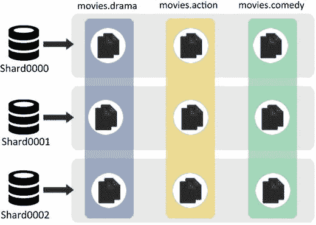

图 7-22.


#### 无标签的分布

接下来，你将使用标签来分离集合。这样做的目的是让每个分片对应一个集合（即你的目标是实现表 7-6 中显示的块分布）。

**表 7-6。**

| 集合块 | 所在分片 |
| --- | --- |
| `movies.drama` | `Shard0000` |
| `movies.action` | `Shard0001` |
| `movies.comedy` | `Shard0002` |

标签描述了分片的属性，可以是任何东西。因此，你可以将一个分片标记为 "slow" 或 "fast"，或 "rack space" 或 "west coast"。

在下面的例子中，你将为每个分片添加属于各个集合的标签：

```
mongos> sh.addShardTag("shard0000", "dramas")
mongos> sh.addShardTag("shard0001", "actions")
mongos> sh.addShardTag("shard0002", "comedies")
mongos>
```

这表示以下含义：

*   将标记为 "dramas" 的块放在 `shard0000` 上。
*   将标记为 "actions" 的块放在 `shard0001` 上。
*   将标记为 "comedies" 的块放在 `shard0002` 上。

接下来，你将创建相应的规则来标记集合块。

规则 1：在 `movies.drama` 集合中创建的所有块都将被标记为 "dramas"：

```
mongos> sh.addTagRange("movies.drama", {originality:MinKey}, {originality:MaxKey}, "dramas")
mongos>
```

该规则使用了 `MinKey`（表示负无穷大）和 `MaxKey`（表示正无穷大）。因此，上面的规则意味着将 `movies.drama` 集合的所有块标记为 "dramas"。

类似地，你将为另外两个集合制定规则。

规则 2：在 `movies.action` 集合中创建的所有块都将被标记为 "actions"。

```
mongos> sh.addTagRange("movies.action", {distribution:MinKey}, {distribution:MaxKey}, "actions")
mongos>
```

规则 3：在 `movies.comedy` 集合中创建的所有块都将被标记为 "comedies"。

```
mongos> sh.addTagRange("movies.comedy", {collection:MinKey}, {collection:MaxKey}, "comedies")
mongos>
```

你需要等待集群重新平衡，以便根据上面定义的标签和规则来分布块。如前所述，块分布是一个自动过程，因此一段时间后，块将自动重新分布以实现你所做的更改。

接下来，执行 `chunks.find` 来检查块的组织情况：

```
mongos> use config
switched to db config
mongos> db.chunks.find({ns:"movies.drama"}, {shard:1, _id:0}).sort({shard:1})
{ "shard" : "shard0000" }
{ "shard" : "shard0000" }
{ "shard" : "shard0000" }
{ "shard" : "shard0000" }
{ "shard" : "shard0000" }
{ "shard" : "shard0000" }
{ "shard" : "shard0000" }
{ "shard" : "shard0000" }
{ "shard" : "shard0000" }
{ "shard" : "shard0000" }
mongos> db.chunks.find({ns:"movies.action"}, {shard:1, _id:0}).sort({shard:1})
{ "shard" : "shard0001" }
{ "shard" : "shard0001" }
{ "shard" : "shard0001" }
{ "shard" : "shard0001" }
{ "shard" : "shard0001" }
{ "shard" : "shard0001" }
{ "shard" : "shard0001" }
{ "shard" : "shard0001" }
{ "shard" : "shard0001" }
{ "shard" : "shard0001" }
{ "shard" : "shard0001" }
{ "shard" : "shard0001" }
{ "shard" : "shard0001" }
mongos> db.chunks.find({ns:"movies.comedy"}, {shard:1, _id:0}).sort({shard:1})
{ "shard" : "shard0002" }
{ "shard" : "shard0002" }
{ "shard" : "shard0002" }
{ "shard" : "shard0002" }
{ "shard" : "shard0002" }
{ "shard" : "shard0002" }
{ "shard" : "shard0002" }
{ "shard" : "shard0002" }
{ "shard" : "shard0002" }
{ "shard" : "shard0002" }
mongos>
```

因此，集合块已经根据定义的标签和规则重新分布（见图 7-23）。

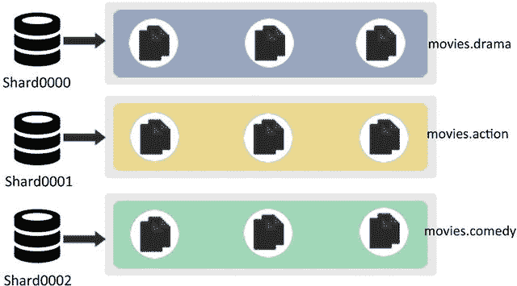

**图 7-23。**

#### 通过标签扩展

接下来，你将了解如何通过标签进行扩展。让我们改变场景。假设 `movies.action` 集合的数据需要两台服务器。由于你只有三个分片，这意味着另外两个集合的数据需要移动到一个分片上。

在这个场景中，你将更改分片的标签。你将把 "comedies" 标签添加到 `Shard0`，并从 `Shard2` 上移除该标签，并进一步将 "actions" 标签添加到 `Shard2`。

这意味着标记为 "comedies" 的块将移动到 `Shard0`，而标记为 "actions" 的块将分散到 `Shard2`。

你首先将 `movies.comedy` 集合的块移动到 `Shard0`，并从 `Shard2` 上移除：

```
mongos> sh.addShardTag("shard0000","comedies")
mongos> sh.removeShardTag("shard0002","comedies")
```

接下来，你将 "actions" 标签添加到 `Shard2`，以便 `movies.action` 的块也分散到 `Shard2` 上：

```
mongos> sh.addShardTag("shard0002","actions")
```

一段时间后重新执行 find 命令，将显示以下结果：

```
mongos> db.chunks.find({ns:"movies.drama"}, {shard:1, _id:0}).sort({shard:1})
{ "shard" : "shard0000" }
{ "shard" : "shard0000" }
{ "shard" : "shard0000" }
{ "shard" : "shard0000" }
{ "shard" : "shard0000" }
{ "shard" : "shard0000" }
{ "shard" : "shard0000" }
{ "shard" : "shard0000" }
{ "shard" : "shard0000" }
{ "shard" : "shard0000" }
mongos> db.chunks.find({ns:"movies.action"}, {shard:1, _id:0}).sort({shard:1})
{ "shard" : "shard0001" }
{ "shard" : "shard0001" }
{ "shard" : "shard0001" }
{ "shard" : "shard0001" }
{ "shard" : "shard0001" }
{ "shard" : "shard0001" }
{ "shard" : "shard0001" }
{ "shard" : "shard0002" }
{ "shard" : "shard0002" }
{ "shard" : "shard0002" }
{ "shard" : "shard0002" }
{ "shard" : "shard0002" }
{ "shard" : "shard0002" }
mongos> db.chunks.find({ns:"movies.comedy"}, {shard:1, _id:0}).sort({shard:1})
{ "shard" : "shard0000" }
{ "shard" : "shard0000" }
{ "shard" : "shard0000" }
{ "shard" : "shard0000" }
{ "shard" : "shard0000" }
{ "shard" : "shard0000" }
{ "shard" : "shard0000" }
{ "shard" : "shard0000" }
{ "shard" : "shard0000" }
{ "shard" : "shard0000" }
mongos>
```

块已经根据所做的更改重新分布（见图 7-24）。

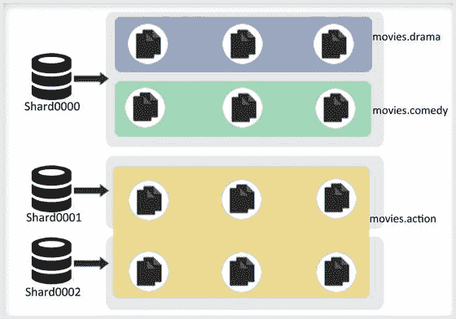

**图 7-24。**

#### 多重标签

你可以为分片关联多个标签。让我们为分片添加两个不同的标签。

假设你想根据磁盘来分布写入。你有一个分片使用机械硬盘，另一个使用 SSD（固态硬盘）。你希望将 50% 的写入重定向到带有 SSD 的分片，其余的重定向到带有机械硬盘的分片。

首先，根据这些属性给分片打标签：

```
mongos> sh.addShardTag("shard0001", "spinning")
mongos> sh.addShardTag("shard0002", "ssd")
mongos>
```

让我们进一步假设，你有一个 `movies.action` 集合的 `distribution` 字段，你将用它作为分片键。`distribution` 字段的值在 0 到 1 之间。接下来，你想说：“如果 `distribution` < .5，发送到机械硬盘。如果 `distribution` >= .5，发送到 SSD。” 因此你定义如下规则：

```
mongos> sh.addTagRange("movies.action", {distribution:MinKey} ,{distribution:.5} ,"spinning")
mongos> sh.addTagRange("movies.action" ,{distribution:.5} ,{distribution:MaxKey},"ssd")
mongos>
```

现在，`distribution` < .5 的文档将被写入机械硬盘分片，而其他文档将被写入 SSD 磁盘分片。

通过标签控制，你可以控制每个新添加的服务器将承担的负载类型。

