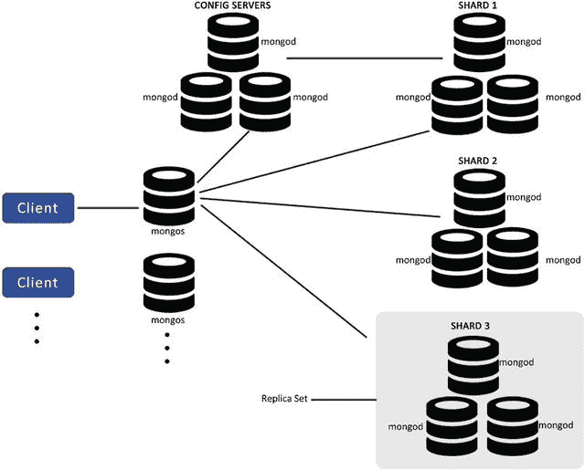
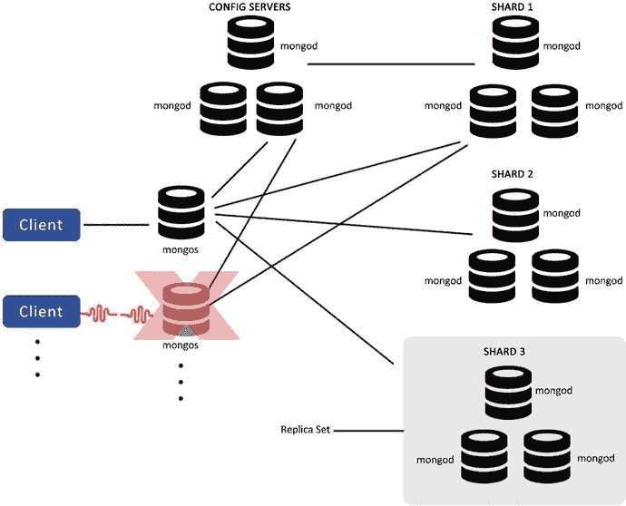
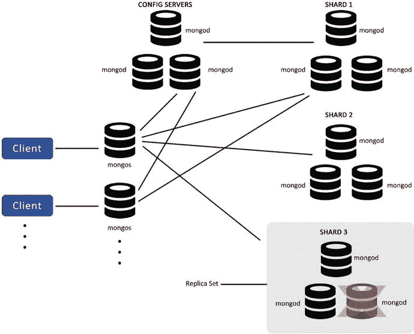
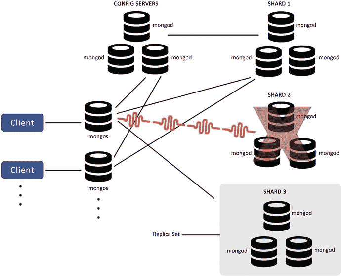
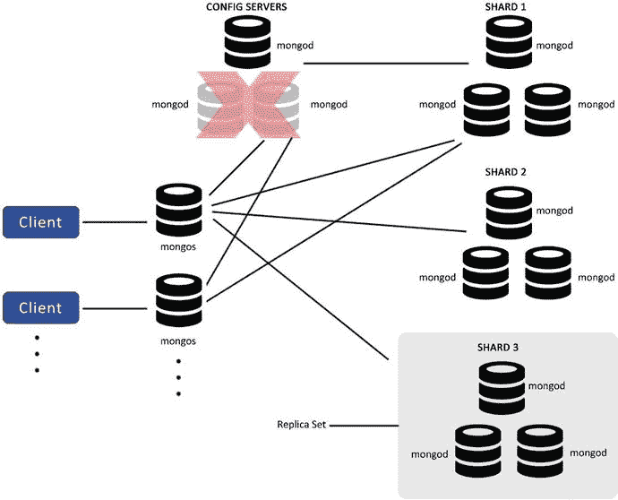

# 在分片环境中导入数据时的注意事项

导入数据时需要牢记以下几点。


### 7.5.7 准备工作

#### 7.5.7.1 预分裂数据

与其让 MongoDB 决定如何创建分片块，你可以使用以下命令告诉 MongoDB 具体如何操作：

```
db.runCommand( { split : "practicalmongodb.mycollection" , middle : { shardkey : value } } );
```

之后，你还可以指定哪些分片块分配到哪个节点。

要做到这些，你需要了解即将导入数据库的数据特性。这也取决于你想要解决的应用场景以及应用程序如何读取数据。在决定分片块的放置位置时，请考虑数据局部性等因素。

#### 7.5.7.2 决定分片块大小

在决定分片块大小时，需要牢记以下几点：

如果分片块尺寸过小，数据虽能均匀分布，但会导致更频繁的迁移，这在 `mongos` 层面是一项昂贵的操作。如果尺寸过大，则会减少迁移次数，降低 `mongos` 层面的开销，但会导致数据分布不均。

#### 7.5.7.3 选择一个好的分片键

为分片集群中的节点选择一个好的分片键以实现良好的数据分布至关重要。

### 7.5.8 分片监控

除了对其他 MongoDB 实例进行的常规监控和分析外，分片集群还需要额外的监控，以确保其所有操作正常运行，并且数据在节点间有效分布。本节将介绍为确保分片集群正常运行应进行的监控。

### 7.5.9 监控配置服务器

配置服务器存储了分片集群的元数据。`mongos` 会缓存这些数据并将请求路由到相应的分片。如果配置服务器宕机但 `mongos` 实例仍在运行，分片集群不会立即受到影响，并且会在一段时间内保持可用。然而，你将无法执行像分片块迁移或启动新 `mongos` 这样的操作。长期来看，配置服务器的不可用会严重影响集群的可用性。为确保集群保持平衡和可用，你应该监控配置服务器。

#### 7.5.9.1 监控分片状态、平衡与分片块分布

为了实现最有效的分片集群部署，需要分片块在分片之间均匀分布。如前所述，这是由 MongoDB 通过后台进程自动完成的。你需要监控分片状态以确保该进程有效工作。为此，你可以在 `mongos` 的 mongo shell 中使用 `db.printShardingStatus()` 或 `sh.status()` 命令。

#### 7.5.9.2 监控锁状态

在几乎所有情况下，平衡器在完成其进程后会自动释放锁，但你需要检查数据库的锁状态，以确保没有持久锁，因为这会阻碍未来的平衡操作，从而影响集群的可用性。在 `mongos` 的 mongo shell 中执行以下命令来检查锁状态：

```
use config
db.locks.find()
```

## 7.6 生产集群架构

本节将介绍生产集群架构。为了便于理解，我们考虑一个社交网络应用程序的非常通用的用例：用户可以创建自己的朋友圈，并在群组内分享评论或图片。用户也可以评论或点赞好友的评论或图片。用户在地理上是分布式的。

应用程序的需求是：所有评论需在各地理区域立即可用；数据应冗余，以防用户的评论、帖子和图片丢失；并且应具备高可用性。因此，应用程序的生产集群应包含以下组件：

*   至少两个 [`mongos`](http://docs.mongodb.org/manual/reference/mongos/#mongos%23mongos) 实例，但可以根据需要部署更多。
*   三个 [`config servers`](http://docs.mongodb.org/manual/administration/sharded-clusters/#sharding-config-server)，每个位于独立的系统上。
*   两个或更多个 [`replica sets`](http://docs.mongodb.org/manual/reference/glossary/#term-replica-set) 作为 [`shards`](http://docs.mongodb.org/manual/reference/glossary/#term-shard)。副本集分布在不同的地理区域，读关注设置为 `nearest`。参见图 7-25。


图 7-25. 生产集群架构

现在，让我们看看 MongoDB 生产部署中可能出现的故障场景及其对环境的影响。

### 7.6.1 场景一

`mongos` 变得不可用：承载已宕机 `mongos` 的应用服务器将无法与集群通信，但这不会导致任何数据丢失，因为 `mongos` 本身不维护任何数据。`mongos` 可以重启，在重启过程中，它会与配置服务器同步以缓存集群元数据，应用程序通常可以恢复正常操作（图 7-26）。


图 7-26. `mongos` 变得不可用

### 7.6.2 场景二

分片中某个副本集的一个 `mongod` 变得不可用：由于你使用了副本集来提供高可用性，因此没有数据丢失。如果是主节点宕机，则会选举出新的主节点；如果是辅助节点宕机，则它会断开连接，其余功能继续正常运行（图 7-27）。


图 7-27. 副本集中一个 `mongod` 不可用

唯一的区别是数据的副本数量减少了，使得系统略微变弱，因此你应该并行检查该 `mongod` 是否可恢复。如果可以，应尽快恢复并重启；如果不可恢复，你需要尽快创建一个新的副本集来替换它。

### 7.6.3 场景三

如果一个分片变得不可用：在此场景下，该分片上的数据将不可用，但其他分片仍然可用，因此不会阻止应用程序运行。应用程序可以继续其读/写操作；但是，必须在应用层处理部分结果的问题。同时，应尽快尝试恢复该分片（图 7-28）。


图 7-28. 分片不可用

### 7.6.4 场景四

三个配置服务器中只有一个可用：在此场景下，集群将变为只读，但不会服务于任何可能导致集群结构变更（例如，分片块迁移或分片块拆分）的操作，从而导致元数据变更。应尽快更换配置服务器，因为如果所有配置服务器都不可用，将导致集群无法操作（图 7-29）。


图 7-29. 只有一个配置服务器可用

## 7.7 总结

在本章中，你学习了核心进程与工具、独立部署、分片概念、复制概念以及生产部署。你还了解了如何实现高可用性（HA）。

在下一章中，你将了解数据在底层的存储方式、写操作如何通过日志实现、`GridFS` 的用途以及 MongoDB 中可用的不同类型的索引。


