# 8. MongoDB 详解

> “《MongoDB 详解》涵盖了 MongoDB 内部工作机制的深入概念。”

在本章中，你将学习数据如何在 MongoDB 中存储，以及写入操作如何通过日志机制发生。最后，你将了解 GridFS 以及 MongoDB 中可用的不同类型的索引。

## 8.1 数据存储引擎

在上一章中，你了解了作为 MongoDB 一部分部署的核心服务；你也了解了副本集和分片。在本节中，我们将讨论数据存储引擎。

### MMAP

MongoDB 默认使用 MMAP 作为其存储引擎。该引擎与内存映射文件协同工作。内存映射文件是操作系统使用`mmap()`系统调用放置在内存中的数据文件。`mmap`是操作系统的一项功能，可将磁盘上的文件映射到虚拟内存。

虚拟内存不等同于物理内存。虚拟内存是计算机硬盘上与物理 RAM 结合使用的空间。

MongoDB 使用内存映射文件进行任何数据交互或数据管理活动。当访问文档时，数据文件会被内存映射到内存中。MongoDB 允许操作系统控制内存映射并分配最大量的 RAM。这样做可以最大限度地减少 MongoDB 层面的工作和编码。缓存基于 LRU（最近最少使用）行为完成，其中最近最少使用的文件会从工作集移出到磁盘，为新的、最近和频繁使用的页面腾出空间。

然而，这种方法有其自身的缺点。例如，MongoDB 无法控制将哪些数据保留在内存中，哪些数据移除。因此，每次服务器重启都会导致缺页中断，因为每次访问的页面在工作集中都不可用，从而导致数据检索时间较长。

MongoDB 也无法控制优先处理内存中的内容。在紧急情况下，它可以指定哪些内容需要保留在缓存中，哪些可以被移除。例如，如果对一个未建立索引的大集合执行读取操作，可能会导致将整个集合加载到内存中，这可能导致其他集合的重要索引等内容被从 RAM 中清除。这种控制缺失也可能导致当任何 MongoDB 外部进程试图访问大部分内存时，分配给 MongoDB 的缓存缩小；这最终将导致 MongoDB 响应变慢。

#### 可插拔存储引擎 API

随着 3.0 版本的发布，MongoDB 附带了可插拔存储引擎 API，使你能够根据工作负载、应用程序需求和可用基础设施在存储引擎之间进行选择。

可插拔存储引擎层的愿景是拥有一个数据模型、一种查询语言和一组运维关注点，但底层却有许多针对不同用例优化的存储引擎选项，如图 8-1 所示。

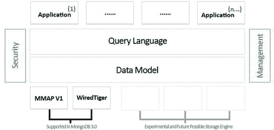

**图 8-1.** 可插拔存储引擎 API

可插拔存储引擎功能在部署方面也提供了灵活性，多种类型的存储引擎可以在同一部署中共存。

MongoDB 3.0 版本附带两个存储引擎。

默认的`MMAPv1`是先前版本中使用的 MMAP 引擎的改进版本。更新后的 MongoDB `MMAPv1`存储引擎实现了集合级别的并发控制。该存储引擎擅长处理高容量读取、插入和就地更新的工作负载。

#### WiredTiger

新的`WiredTiger`存储引擎由 Berkeley DB 的架构师开发，后者是世界上部署最广泛的嵌入式数据管理软件。`WiredTiger`在现代多 CPU 架构上具有良好的扩展性。它的设计旨在利用具有多核 CPU 和更多 RAM 的现代硬件。

`WiredTiger`以压缩格式在磁盘上存储数据。根据所使用的压缩算法，压缩可以将数据大小减少高达 70%（仅磁盘），索引大小减少高达 50%（磁盘和内存两者）。除了减少存储空间外，压缩还通过从磁盘读取更少的位来实现更高的 I/O 可扩展性。它在提高硬件利用率、降低存储成本和提供更可预测的性能方面具有显著优势。

#### 压缩算法

可选择使用以下压缩算法：

*   `Snappy`是默认算法，用于文档和日志。它以较低的 CPU 开销提供良好的压缩比。根据数据类型，压缩比大约在 70%左右。
*   `zlib`提供极佳的压缩比，但代价是额外的 CPU 开销。
*   前缀压缩是索引默认使用的算法，可将索引存储的内存占用减少约 50%（取决于工作负载），并为频繁访问的文档释放更多工作集空间。

管理员可以修改所有集合和索引的默认压缩设置。在创建集合和索引时，也可以按每个集合和每个索引配置压缩。

`WiredTiger`还提供细粒度的文档级并发。写入操作不再被其他写入操作阻塞，除非它们访问的是同一个文档。因此，它支持读写器对集合中文档的并发访问。客户端可以在写入操作进行时读取文档，并且多个线程可以同时修改集合中的不同文档。因此，它擅长处理写入密集型工作负载（写入性能提升 7-10 倍）。

更高的并发性也推动了基础设施的简化。应用程序可以充分利用可用的服务器资源，简化了满足性能 SLA 所需的架构。使用先前 MongoDB 代的较粗粒度数据库级锁定时，用户通常必须实施分片才能扩展因单个数据库写入锁而停滞的工作负载，即使主机系统中仍有足够的内存、I/O 带宽和磁盘容量。细粒度并发实现的更高系统利用率减少了这种开销，消除了不必要的成本和管理负担。

该存储引擎让你可以在每个集合、每个索引级别决定压缩什么、不压缩什么。

`WiredTiger`存储引擎仅适用于 64 位 MongoDB。

`WiredTiger`通过其缓存管理数据。`WiredTiger`存储引擎通过允许你配置为`WiredTiger`缓存分配多少 RAM 来提供对内存的更多控制，默认为 1GB 或可用内存的 50%，以较大者为准。

接下来，你将简要了解数据如何在磁盘上存储。


## 8.2 数据文件（与 MMAPv1 相关）

首先，让我们检查一下数据文件。如你所见，在核心服务下，`mongod`使用的默认数据目录是`/data/db/`。

在此目录中，每个数据库都有独立的文件。每个数据库有一个`.ns`文件和多个具有单调递增数字扩展名的数据文件。

例如，如果你创建一个名为`mydbpoc`的数据库，它将存储在以下文件中：`mydbpoc.ns`、`mydbpoc.1`、`mydbpoc.2`等，如图 8-2 所示。

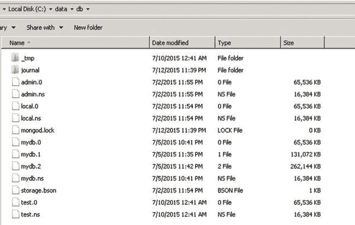

图 8-2. 数据文件

对于数据库的每个新的数字数据文件，其大小将是前一个数字数据文件大小的两倍。文件大小的上限为 2GB。如果文件大小达到 2GB，所有后续的数字文件将保持 2GB 大小。这是设计如此。这种行为确保了小型数据库不会在磁盘上浪费太多空间，并且大型数据库大部分保持在磁盘上的连续区域中。

请注意，为了确保一致的性能，MongoDB 会预分配数据文件。预分配在后台进行，并且每次数据文件被填满时启动。这意味着 MongoDB 服务器总是试图为每个数据库保留一个额外的空数据文件，以避免在文件分配时被阻塞。

如果磁盘上存在多个小型数据库，使用`storage.mmapv1.smallFiles`选项将减小这些文件的大小。

接下来，你将看到数据实际上是如何在底层存储的。双向链表是用于存储数据的关键数据结构。

### 8.2.1 命名空间 (.ns 文件)

在数据文件中，数据空间被划分为命名空间，其中命名空间可以对应一个集合或一个索引。

这些命名空间的元数据存储在`.ns`文件中。如果你检查数据目录，你会找到一个名为`[数据库名].ns`的文件。

用于存储元数据的`.ns`文件大小为 16MB。这个文件可以被视为一个大的哈希表，它被划分为大约 1KB 大小的小存储桶。

每个存储桶存储特定于命名空间的元数据（图 8-3）。


图 8-3. 命名空间数据结构

#### 8.2.1.1 集合命名空间

如图 8-4 所示，集合命名空间存储桶包含元数据，例如：

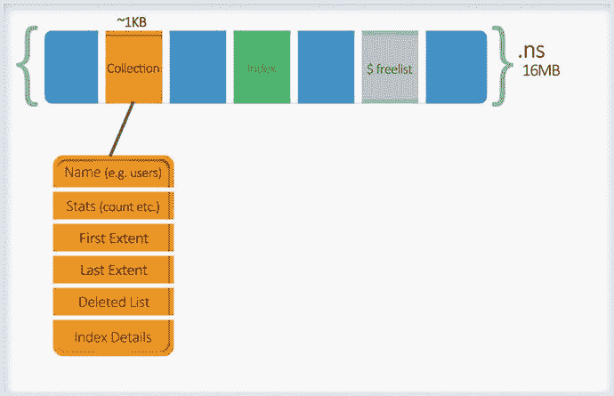

图 8-4. 集合命名空间详情

-   集合的名称
-   关于集合的一些统计信息，如计数、大小等。（这就是为什么每当对集合发出计数时，它都能快速响应。）
-   索引详细信息，因此它可以维护到每个已创建索引的链接
-   一个删除列表
-   一个存储范围详情的双向链表（它存储指向第一个和最后一个范围的指针）

##### Extent (范围)

Extent 指的是数据文件中的一组数据记录，因此一组 extent 构成了命名空间的完整数据。一个 extent 使用磁盘位置来引用数据实际驻留的磁盘位置。它由两部分组成：文件号和偏移量。

文件号指定它指向的数据文件（0、1 等）。

偏移量是文件中的位置（你需要深入文件多远来查找数据）。偏移量大小为 4KB。因此，偏移量的最大值可达 2³¹-1，这是数据文件可以增长到的最大文件大小（2048MB 或 2GB）。

如图 8-5 所示，一个 extent 数据结构由以下部分组成：

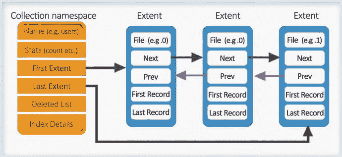

图 8-5. Extent

-   磁盘上的位置，即它指向的文件号。
-   由于 extent 作为双向链表元素存储，它有一个指针指向前一个和下一个 extent。
-   一旦有了它所引用的文件号，该文件内它指向的数据记录组进一步存储为双向链表。因此，它维护一个指针指向它指向的数据块的第一条数据记录和最后一条数据记录，这些记录不过是文件内的偏移量（数据存储在文件中的深度）。

##### 数据记录 (Data Record)

接下来你将查看数据记录结构。该数据结构包含以下详情：

-   由于数据记录结构是 extent 双向链表的一个元素，它存储前一个和后一个记录的信息。
-   它有带头部的长度。
-   数据块。

数据块可以有一个 BTree Bucket（如果是索引命名空间）或一个 BSON 对象。你稍后将研究 BTree 结构。

BSON 对象对应于集合的实际数据。BSON 对象的大小不必与数据块相同。默认使用 2 次幂大小分配，以便每个文档都存储在一个包含文档和额外空间或填充的空间中。这个设计决策有助于避免当更新导致对象大小变化时，对象从一个块移动到另一个块。

MongoDB 支持多种分配策略，这些策略决定了如何为文档添加填充（图 8-6）。由于原地更新比重新定位更高效，所有填充策略都用额外的空间换取更高的效率和更少的碎片。不同的策略支持不同的工作负载。例如，完全匹配分配对于具有仅插入工作负载且大小固定且从不变化的集合是理想的，而 2 次幂分配对于插入/更新/删除工作负载是高效的。

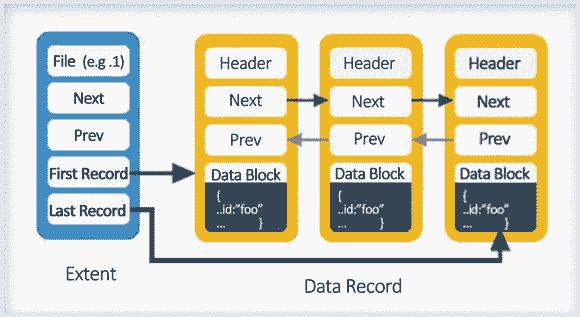

图 8-6. 记录数据结构

##### 删除列表 (Deleted List)

删除列表存储已删除或移动的 extent 的详细信息（当更新导致大小变化，数据无法在分配的空间中容纳时发生移动）。

记录的大小决定了空闲 extent 需要放置在哪个存储桶中。基本上，这些是分桶的单链表。当需要一个新的 extent 来容纳命名空间的数据时，它会首先搜索空闲列表以检查是否有任何合适大小的 extent 可用。

##### 总结

因此，你可以假设数据文件（具有数字扩展名的文件）被划分为不同的集合命名空间，其中命名空间的 extent 指定了从属于该集合的数据文件中的数据范围。

理解了数据是如何存储的，现在让我们看看`db.users.find()`是如何工作的。

它将首先检查`mydbpoc.ns`文件以访问`users`命名空间，并找出它指向的第一个 extent。它将跟随第一个 extent 链接到第一条记录，然后跟随下一条记录指针，它将读取第一个 extent 的数据记录，直到达到最后一条记录。然后它将跟随下一个 extent 指针以类似的方式读取其数据记录。遵循这个模式，直到读取最后一个 extent 的数据记录。

#### 8.2.1.2 $freelist (空闲列表)

`.ns`文件有一个名为`$freelist`的特殊命名空间，用于 extent。`$freelist`跟踪不再使用的 extent，例如已删除的索引或集合的 extent。


#### 8.2.1.3 索引结构：B 树

现在我们来看看索引是如何存储的。`B 树`（BTree）结构被用于存储索引。一个`B 树`如图 8-7 所示。


*图 8-7. B 树*

在`B 树`的标准实现中，每当一个新的键被插入`B 树`时，默认行为如图 8-8 所示。

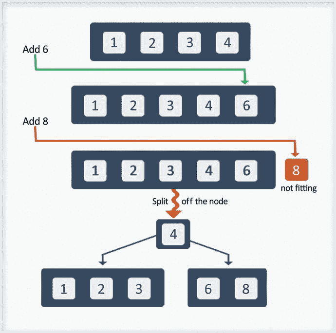
*图 8-8. B 树标准实现*

MongoDB 实现`B 树`的方式略有不同。
在上述场景中，如果你的键是诸如`时间戳`（Timestamp）、`对象 ID`（ObjectID）或一个递增的数字，那么数据桶将总是半满的，导致大量空间浪费。

为了克服这一点，MongoDB 对其稍作了修改。每当它识别到索引键是一个递增的键时，它不会进行 50/50 分裂，而是进行 90/10 分裂，如图 8-9 所示。


*图 8-9. MongoDB B 树的 90/10 分裂*

图 8-10 展示了数据桶的结构。`B 树`的每个数据桶大小为 8KB。

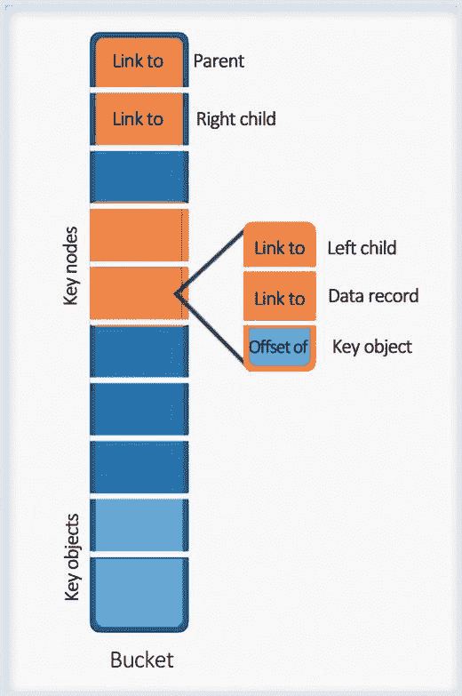
*图 8-10. B 树数据桶数据结构*

数据桶包含以下部分：

-   指向父节点的指针
-   指向右子节点的指针
-   指向键节点的指针
-   一个键对象列表（这些对象大小不一且以无序方式存储；这些对象实际上是索引键的值）

##### 键节点

键节点是固定大小的节点，并以排序方式存储。它们便于在`B 树`的不同节点之间轻松地进行分裂和移动元素。
一个键节点包含以下内容：

-   指向左子节点的指针
-   索引键所属的数据记录
-   键偏移量（键对象的偏移量，基本上告诉了该键的值存储在数据桶中的什么位置）

## 8.3 数据文件（与 WiredTiger 相关）

在本节中，你将了解当使用`WiredTiger`存储引擎启动`mongod`时，数据目录的内容。
当选择的存储选项是`WiredTiger`时，数据、日志和索引在磁盘上是压缩存储的。压缩是基于启动`mongod`时指定的压缩算法完成的。

`Snappy`是默认的压缩选项。
在数据目录下，有对应于每个集合和索引的单独压缩`wt`文件。日志在数据目录下有自己的文件夹。

压缩文件实际上是在数据插入集合时创建的（文件在写入时分配，没有预分配）。
例如，如果你创建一个名为`users`的集合，它将被存储在`collection-0—2259994602858926461`文件中，相关的索引将被存储在`index-1—2259994602858926461`、`index-2—2259994602858926461`等文件中。

除了集合和索引的压缩文件外，还有一个`_mdb_catalog`文件，用于存储将集合和索引映射到数据目录中文件的元数据。在上面的例子中，它将存储集合`users`到`wt`文件`collection-0—2259994602858926461`的映射。参见图 8-11。

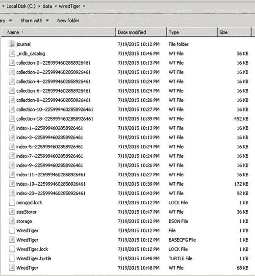
*图 8-11. WiredTiger 数据文件夹*

可以为存储索引指定单独的卷。
在指定`DBPath`时，你需要确保该目录对应于启动`mongod`时使用`–storageEngine`选项指定的存储引擎。如果`dbpath`包含由使用`–storageEngine`选项指定的存储引擎之外的其他引擎创建的文件，`mongod`将无法启动。因此，如果在`DBPath`中找到了`MMAPv1`文件，那么`WT`（WiredTiger）将无法启动。

在内部，`WiredTiger`使用传统的`B+树`结构来存储和管理数据，但相似之处仅限于此。与`B+树`不同，它不支持就地更新。
`WiredTiger`缓存用于对数据的任何读/写操作。缓存中的树结构针对内存访问进行了优化。

## 8.4 读与写

你将简要了解读和写是如何发生的。如前所述，当 MongoDB 更新和从`DB`读取时，它实际上是在对内存进行读写。
如果在 MongoDB `MMAPv1`存储引擎中，一个修改操作使得记录大小增长到超过为其分配的空间，那么整个记录将被移动到一个带有额外填充字节的更大空间中。默认情况下，MongoDB 使用 2 的幂次大小分配，以便 MongoDB 中的每个文档都存储在一个包含文档本身和额外空间（填充）的记录中。填充允许文档在更新后增长，同时最小化重新分配的可能性。记录一旦被移动，原来占用的空间将被释放，并将作为不同大小的空闲列表进行跟踪。如前所述，这就是`.ns`文件中的`$freelist`命名空间。

在`MMAPv1`存储引擎中，随着对象被删除、修改或创建，随时间推移会产生碎片，这将影响性能。应执行`compact`命令，将碎片化的数据移动到连续的空间中。

每隔 60 秒，`RAM`中的文件会被刷新到磁盘。为了防止在断电时数据丢失，默认情况下是开启日志记录来运行的。日志的行为取决于所配置的存储引擎。
`MMAPv1`日志文件每 100ms 刷新到磁盘一次，如果发生断电，它用于将数据库恢复到一致状态。

在`WiredTiger`中，缓存中的数据以针对内存访问优化的`B+树`结构存储。缓存维护一个与索引关联的磁盘上页面映像，用于识别所请求的数据在页面中的实际位置（参见图 8-12）。


*图 8-12. WiredTiger 缓存*

`WiredTiger`中的写操作从不进行就地更新。
每当向`WiredTiger`发出一个操作时，它在内部会被分解成多个事务，其中每个事务都在一个内存中快照的上下文中工作。该快照是事务开始之前已提交版本的快照。写入者可以与读取者并发地创建新版本。

写操作不更改页面；相反，更新被叠加在页面之上。使用`跳表`（skipList）数据结构来维护所有的更新，其中最新的更新位于顶部。因此，每当用户读/写数据时，索引会检查是否存在`跳表`。如果不存在`跳表`，则从磁盘上的页面映像返回数据。如果存在`跳表`，则将列表头部的数据返回给线程，然后线程更新数据。一旦执行提交，更新后的数据将被添加到列表头部，并相应地调整指针。这样，多个用户可以并发访问数据而不会发生任何冲突。只有当多个线程试图更新同一条记录时才会发生冲突。在这种情况下，一个更新成功，另一个并发更新需要重试。

由于更新导致的树结构的任何更改，例如页面大小增加时的分裂、重定位等，稍后由后台进程进行调和。这解释了`WiredTiger`引擎快速写操作的原因；数据整理的任务留给了后台进程。参见图 8-13。

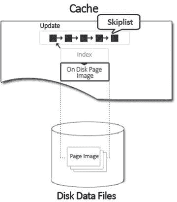
*图 8-13. 跳表*


### WiredTiger 与 MongoDB 存储机制

WiredTiger 采用 MVCC 方法来实现并发控制，即维护数据的多个版本。它确保每个尝试访问数据的线程都能看到最一致的数据版本。正如你所见，写操作并非就地执行；相反，它们被追加到 **skipList** 数据结构的顶部，最新的更新位于最上方。访问数据的线程获取最新副本，并在提交前持续使用该副本。一旦提交，更新就会被追加到列表顶部，之后任何访问该数据的线程都将看到该最新更新。

这使得多个线程能够并发访问相同数据，而无需任何锁定或争用。这也使得写入者能够与读者并发地创建新版本。冲突仅在多个线程尝试更新同一条记录时发生。在这种情况下，一个更新成功，另一个并发更新则需要重试。

图 8-14 展示了 MVCC 的实际运作。

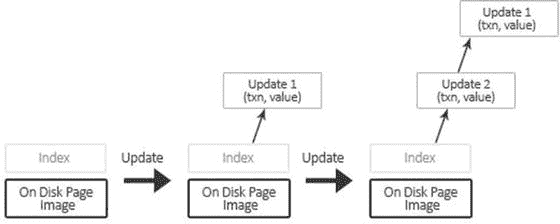

图 8-14. 更新进行中

`WiredTiger` 日志确保写操作在检查点之间持久化到磁盘。`WiredTiger` 默认每 60 秒或写入 2GB 数据后使用检查点将数据刷新到磁盘。因此，在默认情况下，如果未启用日志记录，`WiredTiger` 可能会丢失最多 60 秒的写入，尽管如果使用复制来保证持久性，这种丢失的风险通常会小得多。`WiredTiger` 事务日志并非在发生不干净关机时保持数据文件处于一致状态所必需的，因此在不启用日志记录的情况下运行是安全的，尽管为了确保耐久性，应配置“副本安全”的写关注点。`WiredTiger` 存储引擎的另一个特性是能够压缩磁盘上的日志，从而减少存储空间。

## 8.5 如何使用日志记录写入数据

在本节中，你将简要了解使用日志记录如何执行写操作。

`MongoDB` 磁盘写入是惰性的，这意味着如果一秒钟内有 1000 次增量操作，它只会被写入一次。物理写入发生在操作之后的几秒钟。

你现在将看到更新在 `mongod` 中实际是如何发生的。

如你所知，在 `MongoDB` 系统中，`mongod` 是主要的守护进程。因此，磁盘上有数据文件和日志文件。见图 8-15。


图 8-15. mongod

当 `mongod` 启动时，数据文件被映射到一个**共享视图**。换句话说，数据文件被映射到一个虚拟地址空间。见图 8-16。

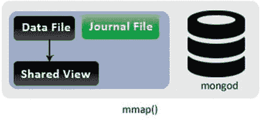

图 8-16. 映射到共享视图

基本上，操作系统识别到你的数据文件在磁盘上是 2000 字节，因此将其映射到内存地址 1,000,000 – 1,002,000。请注意，数据在访问之前不会实际加载；操作系统只是映射它并保持它。

到目前为止，你仍然有文件在备份内存。因此，内存中的任何更改都将由操作系统刷新到底层文件。

这是在未启用日志记录时 `mongod` 的工作方式。每 60 秒，内存中的更改会被操作系统刷新。

在这种情况下，让我们看看启用日志记录后的写入。启用日志记录后，`mongod` 会进行第二次映射到一个**私有视图**。

这就是为什么启用日志记录后，`mongod` 使用的虚拟内存量会加倍。见图 8-17。

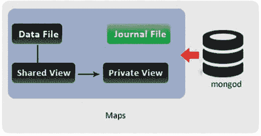

图 8-17. 映射到私有视图

你可以在图 8-17 中看到数据文件如何不直接连接到私有视图，因此更改不会由操作系统从私有视图刷新到磁盘。

让我们看看启动写操作时发生的事件序列。当启动写操作时，首先它写入私有视图（图 8-18）。

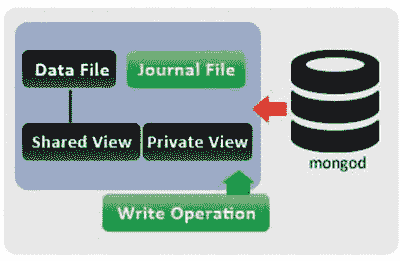

图 8-18. 启动的写操作

接下来，更改被写入日志文件，追加文件更改的简要描述（图 8-19）。

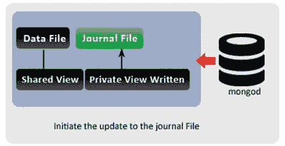

图 8-19. 更新日志文件

日志在收到更改时不断追加更改描述。如果此时 `mongod` 失败，即使数据文件尚未修改，日志也可以重放所有更改，从而使此时的写入安全。

日志现在将在共享视图上重放记录的更改（图 8-20）。

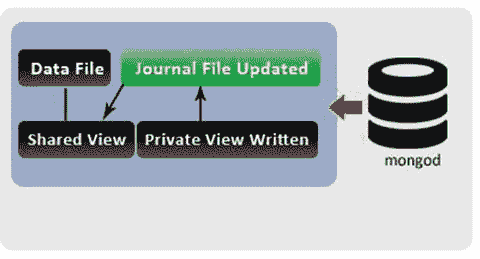

图 8-20. 更新共享视图

最后，更改以非常快的速度写入磁盘。默认情况下，`mongod` 每 60 秒请求操作系统执行此操作（图 8-21）。

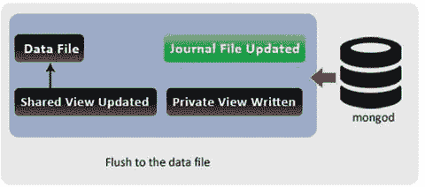

图 8-21. 更新数据文件

在最后一步中，`mongod` 将共享视图重新映射到私有视图。这样做是为了防止私有视图变得过于“脏”（图 8-22）。

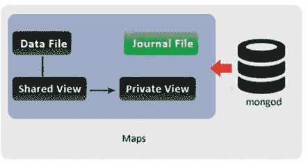

图 8-22. 重新映射

## 8.6 GridFS – MongoDB 文件系统

你已经了解了底层机制。你看到 `MongoDB` 将数据存储在 `BSON` 文档中。`BSON` 文档有 16MB 的文档大小限制。

`GridFS` 是 `MongoDB` 用于处理超出 `BSON` 文档大小限制的大文件的规范。本节将简要介绍 `GridFS`。

这里的“规范”意味着它本身并不是 `MongoDB` 的一个特性，因此 `MongoDB` 中没有实现它的代码。它只是规定了应如何处理大文件。`PHP`、`Python` 等语言驱动程序实现了这个规范，并向该驱动程序的用户公开一个 `API`，使他们能够在 `MongoDB` 中存储/检索大文件。


### 8.6.1 GridFS 的设计原理

根据设计，一个 MongoDB 文档（即 BSON 对象）不能大于 16MB。这样做是为了保持最佳性能，而且这个大小也完全满足我们的需求。例如，4MB 的空间可能足以存储一段音频剪辑或一张个人资料图片。然而，如果需求是存储高质量的音频或视频剪辑，甚至是大于几百兆字节的文件，MongoDB 通过使用 GridFS 为你提供了保障。

GridFS 规定了一种将大文件分割存储到多个文档中的机制。实现它的语言驱动程序（例如 PHP 驱动程序）会在底层负责存储文件的分割（或在检索文件时合并被分割的块）。使用该驱动程序的开发人员无需了解这些内部细节。这样，GridFS 允许开发人员以一种透明且高效的方式存储和操作文件。

GridFS 使用两个集合来存储文件。一个集合维护文件的元数据，另一个集合则通过将文件数据分割成称为“块”的小片段来存储文件数据。这意味着文件被分割成更小的块，每个块作为一个独立的文档存储。默认情况下，块的大小限制为 255KB。

这种方法不仅使数据存储具有可扩展性且易于管理，而且在检索文件的特定部分时，也使得范围查询更易于使用。

在 GridFS 中查询文件时，会根据客户端的需要重新组装块。这也为用户提供了访问文件任意部分的能力。例如，用户可以直接跳到视频文件的中间位置。

GridFS 规范在文件大小超过 MongoDB BSON 文档默认的 16MB 限制时非常有用。它也用于存储那些你无需将整个文件加载到内存中就需要访问的文件。

### 8.6.2 GridFS 的内部机制

GridFS 是一个用于存储文件的轻量级规范。

MongoDB 服务器端并不会对 GridFS 请求进行“特殊处理”。所有工作都是在客户端完成的。

GridFS 使你能够通过将大文件分割成更小的块，并将每个块作为独立文档存储的方式来存储大文件。除了这些块之外，还有一个包含文件元数据的文档。利用这些元数据信息，这些块被组合在一起，形成完整的文件。

由于 MongoDB 支持在文档中存储二进制数据，因此块的存储开销可以保持在最低水平。

GridFS 用于存储大文件的两个集合默认命名为 `fs.files` 和 `fs.chunks`，尽管你可以选择一个不同于 `fs` 的桶名称。

块默认存储在 `fs.chunks` 集合中。如果需要，可以覆盖此设置。因此，所有数据都包含在 `fs.chunks` 集合中。

块集合中各个文档的结构非常简单：

```json
{
  "_id" : ObjectId("..."),
  "n" : 0,
  "data" : BinData("..."),
  "files_id" : ObjectId("...")
}
```

块文档包含以下重要键：

*   `"_id"`：这是唯一标识符。
*   `"files_id"`：这是包含该块相关元数据的文档的唯一标识符。
*   `"n"`：这基本上表示该块在原始文件中的位置。
*   `"data"`：这是构成该块的实际二进制数据。

`fs.files` 集合存储每个文件的元数据。该集合中的每个文档代表 GridFS 中的一个文件。除了通用的元数据信息外，该集合的每个文档还可以包含它所代表文件特有的自定义元数据。

以下是 GridFS 规范强制要求的键：

*   `_id`：这是文件的唯一标识符。
*   `length`：这描述了构成文件完整内容的总字节数。
*   `chunkSize`：这是文件的块大小，以字节为单位。默认是 255KB，但如果需要可以调整。
*   `uploadDate`：这是文件存储到 GridFS 中的时间戳。
*   `md5`：这在服务器端生成，是文件内容的 md5 校验和。MongoDB 服务器通过使用 `filemd5` 命令生成其值，该命令计算已上传块的 md5 校验和。这意味着用户可以检查此值以确保文件已正确上传。

一个典型的 `fs.files` 文档如下所示（另见图 8-23）：

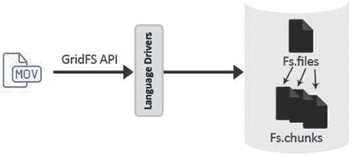

图 8-23. GridFS

```json
{
  "_id" : ObjectId("..."),
  "length" : data_number,
  "chunkSize" : data_number,
  "uploadDate" : data_date,
  "md5" : data_string
}
```

### 8.6.3 使用 GridFS

在本节中，你将使用 PyMongo 驱动程序来了解如何开始使用 GridFS。

#### 添加对文件系统的引用

首先需要的是对 GridFS 文件系统的引用：

```python
>>> import pymongo
>>> import gridfs
>>> myconn = pymongo.Connection()
>>> mydb = myconn.gridfstest
>>> myfs = gridfs.GridFS(db)
```

#### write( )

接下来，你将执行一个基本的写入操作：

```python
>>> with myfs.new_file() as myfp:
...     myfp.write('This is my new sample file. It is just grand!')
```

#### find( )

使用 mongo shell，让我们看看底层集合中存储了什么：

```python
>>> list(mydb.myfs.files.find())
[{u'length': 38, u'_id': ObjectId('52fdd6189cd2fd08288d5f5c'), u'uploadDate': datetime.datetime(2014, 11, 4, 4, 20, 41, 800000), u'md5': u'332de5ca08b73218a8777da69293576a', u'chunkSize': 262144}]
>>> list(mydb.myfs.chunks.find())
[{u'files_id': ObjectId('52fdd6189cd2fd08288d5f5c'), u'_id': ObjectId('52fdd6189cd2fd08288d5f5d'), u'data': Binary('This is my new sample file. It is just grand!', 0), u'n': 0}]
```

#### 强制分割文件

让我们强制分割文件。这可以通过在创建文件时指定一个较小的 `chunkSize` 来实现，如下所示：

```python
>>> with myfs.new_file(chunkSize=10) as myfp:
...     myfp.write('This is second file. I am assuming it will be split into various chunks')
...
>>> myfp
<gridfs.grid_file.GridIn object at 0x0000000002AC79B0>
>>> myfp._id
ObjectId('52fdd76e9cd2fd08288d5f5e')
>>> list(mydb.myfs.chunks.find(dict(files_id=myfp._id)))
.............
ObjectId('52fdd76e9cd2fd08288d5f65'), u'data': Binary('s', 0), u'n': 6}]
```

#### read( )

你现在知道了文件在数据库中实际是如何存储的。接下来，使用客户端驱动程序，你将读取该文件：

```python
>>> with myfs.get(myfp._id) as myfp_read:
...     print myfp_read.read()
...
"This is second file. I am assuming it will be split into various chunks."
```

用户根本不需要意识到块的存在。你需要使用客户端暴露的 API 来从 GridFS 读写文件。


#### 将 GridFS 更像文件系统一样对待

`new_file()` - 在 GridFS 中创建新文件

你可以将任意数量的关键字参数传递给 `new_file()`。这些参数将被添加到 `fs.files` 文档中：

```
>>> with myfs.new_file(
...     filename='practicalfile.txt',
...     content_type='text/plain',
...     my_other_attribute=42) as myfp:
...     myfp.write('My New file')
...
>>> myfp
<gridfs.grid_file.GridIn object at 0x0000000002AC7AC8>
>>> db.myfs.files.find_one(dict(_id=myfp._id))
{u'contentType': u'text/plain', u'chunkSize': 262144, u'my_other_attribute': 42, u'filename': u'practicalfile.txt', u'length': 8, u'uploadDate': datetime.datetime(2014, 11, 4, 9, 1, 32, 800000), u'_id': ObjectId('52fdd8db9cd2fd08288d5f66'), u'md5': u'681e10aecbafd7dd385fa51798ca0fd6'}
>>>
```

文件可以通过文件名被覆盖。由于 GridFS 使用 `_id` 来索引文件，旧文件并不会被移除，只是会维护一个文件版本。

```
>>> with myfs.new_file(filename='practicalfile.txt', content_type='text/plain') as myfp:
...     myfp.write('Overwriting the "My New file"')
...
```

`get_version()` / `get_last_version()`

在上述情况下，可以使用 `get_version` 或 `get_last_version` 来通过文件名检索文件。

```
>>> myfs.get_last_version('practicalfile.txt').read()
'Overwriting the "My New file"'
>>> myfs.get_version('practicalfile.txt',0).read()
'My New file'
```

你也可以列出 GridFS 中的文件：

```
>>> myfs.list()
[u'practicalfile.txt', u'practicalfile2.txt']
```

`delete()`

文件也可以被删除：

```
>>> myfp = myfs.get_last_version('practicalfile.txt')
>>> myfs.delete(myfp._id)
>>> myfs.list()
[u'practicalfile.txt', u'practicalfile2.txt']
>>> myfs.get_last_version('practicalfile.txt').read()
'My New file'
>>>
```

请注意，只有一个版本的 `practicalfile.txt` 被删除了。你的文件系统中仍然存在一个名为 `practicalfile.txt` 的文件。

`exists()` 和 `put()`

接下来，你将使用 `exists()` 来检查文件是否存在，并使用 `put()` 将一个短文件快速写入 GridFS：

```
>>> myfs.exists(myfp._id)
False
>>> myfs.exists(filename='practicalfile.txt')
True
>>> myfs.exists({'filename':'practicalfile.txt'}) # equivalent to above
True
>>> myfs.put('The red fish', filename='typingtest.txt')
ObjectId('52fddbc69cd2fd08288d5f6a')
>>> myfs.get_last_version('typingtest.txt').read()
'The red fish'
>>>
```

## 索引

在本书的这一部分，你将简要探讨 MongoDB 上下文中的索引是什么。随后，我们将重点介绍 MongoDB 中可用的各种索引类型，最后总结索引的行为和限制。

索引是一种加快读取操作的数据结构。通俗地讲，它类似于书籍的索引，你可以通过在索引中查找章节并直接跳转到页码来找到任何章节，而无需扫描整本书来找到该章节——如果没有索引，情况就会是那样。

类似地，索引定义在字段上，可以帮助以更好、更高效的方式搜索信息。

与其他数据库一样，在 MongoDB 中也以类似方式看待索引（它用于加速 `find()` 操作）。你运行的查询类型有助于为数据库创建高效的索引。例如，如果大多数查询使用日期字段，那么在日期字段上创建索引将是有益的。确定哪个索引对你的查询最优可能很棘手，但值得一试，因为如果没有合适的索引，原本需要几分钟的查询在有正确索引的情况下可以瞬间返回结果。

在 MongoDB 中，可以在文档的任何字段或子字段上创建索引。在了解 MongoDB 中可以创建的各种索引类型之前，让我们先列出索引的一些核心特性：

*   索引是在每个集合级别定义的。对于每个集合，都有不同的索引集合。
*   与 SQL 索引类似，MongoDB 索引也可以在单个字段或字段集上创建。
*   在 SQL 中，虽然索引提高了查询性能，但每次写入操作都会产生开销。因此在创建任何索引之前，请考虑查询的类型、频率、工作负载的大小以及插入负载，同时结合应用程序需求。
*   所有 MongoDB 索引都使用 BTree 数据结构。
*   每个使用更新操作的查询只使用一个索引，这由查询优化器决定。这可以通过使用 `hint` 来覆盖。
*   如果所有字段都是索引的一部分，无论该字段是用于查询还是用于投影，都说该查询被索引覆盖。
*   覆盖索引可以最大化 MongoDB 的性能和吞吐量，因为查询可以仅使用索引就得到满足，无需将完整文档加载到内存中。
*   只有当创建索引所依据的字段被更改时，索引才会更新。并非所有对文档的更新操作都会导致索引更改。只有当相关字段受到影响时，它才会被更改。

### 索引类型

在本节中，你将了解 MongoDB 中可用的不同类型的索引。

#### `_id` 索引

这是在 `_id` 字段上创建的默认索引。此索引无法被删除。


### 8.7.1.2 二级索引

在 MongoDB 中，所有用户使用 `ensureIndex()` 创建的索引都被称为二级索引。

这些索引可以创建在文档或子文档的任何字段上。让我们考虑以下文档：
```json
{"_id": ObjectId(...), "name": "Practical User", "address": {"zipcode": 201301, "state": "UP"}}
```
在此文档中，可以在 `name` 字段上创建索引，也可以在 `state` 字段上创建索引。

这些索引也可以创建在保存子文档的字段上。如果你考虑上面那个 `address` 字段保存了子文档的文档，那么也可以在 `address` 字段上创建索引。

这些索引可以创建在单个字段上，也可以创建在一组字段上。当在一组字段上创建时，它也被称为复合索引。为了进一步解释，让我们考虑一个 `products` 集合，它保存了以下格式的文档：
```json
{ "_id": ObjectId(...),"category": ["food", "grocery"], "item": "Apple", "location": "16th Floor Store", "arrival": Date(...)}
```
如果大多数查询都使用 `item` 和 `location` 字段，那么可以创建如下的复合索引：
```javascript
db.products.ensureIndex ({"item": 1, "location": 1})
```
除了引用复合索引所有字段的查询外，上面的复合索引还支持使用任何索引前缀的查询（即，它也可以支持仅使用 `item` 字段的查询）。

如果在保存数组作为其值的字段上创建索引，则会使用多键索引来分别索引数组的每个值。考虑以下文档：
```json
{ "_id" : ObjectId("..."),"tags" : [ "food", "hot", "pizza", "may" ] }
```
在 `tags` 上的索引是一个多键索引，它将包含以下条目：
```json
{ tags: "food" }
{ tags: "hot" }
{ tags: "pizza" }
{ tags: "may" }
```
也可以创建多键复合索引。但是，在任何时候，复合索引中只能有一个字段是数组类型。如果你创建了一个 `{a1: 1, b1: 1}` 的复合索引，则允许的文档如下：
```json
{a1: [1, 2], b1: 1}
{a1: 1, b1: [1, 2]}
```
以下文档是不允许的；实际上，MongoDB 甚至无法插入此文档：
```json
{a1: [21, 22], b1: [11, 12]}
```
如果尝试插入这样的文档，插入将被拒绝并产生以下错误结果：“cannot index parallel arrays”。

接下来，你将了解在创建索引时可能有用的各个选项/属性。

#### 带键排序的索引

MongoDB 索引维护对字段的引用。引用以升序或降序维护。这是通过在创建索引时为键指定一个数字来完成的。该数字表示索引方向。可能的选项是 1 和 -1，其中 1 表示升序，-1 表示降序。

在单键索引中，这可能不太重要；然而，在复合索引中，方向非常重要。

考虑一个包含 `username` 和 `timestamp` 的 `Events` 集合。你的查询是返回按 `username` 排序，然后最近的事件在前的事件。将使用以下索引：
```javascript
db.events.ensureIndex({ "username" : 1, "timestamp" : -1 })
```
此索引包含按以下方式排序的文档的引用：

首先按 `username` 字段升序排列。然后，对于每个 `username`，按 `timestamp` 字段降序排列。

#### 唯一索引

创建索引时，你需要确保索引字段中存储的值的唯一性。在这种情况下，你可以创建 `Unique` 属性设置为 true 的索引（默认为 false）。

假设你想在 `userid` 字段上创建一个 `unique_index`。可以运行以下命令来创建唯一索引：
```javascript
db.payroll.ensureIndex( { "userid": 1 }, { unique: true } )
```
此命令确保 `user_id` 字段中的值是唯一的。关于唯一性约束，你需要注意以下几点：

*   如果唯一约束用于复合索引，则在该场景下，唯一性会在值的组合上强制执行。
*   如果未为唯一索引的字段指定值，则存储一个空值。
*   在任何时候，只允许一个文档没有唯一值。

#### dropDups

如果你在已包含文档的集合上创建唯一索引，创建可能会失败，因为你可能有一些文档在索引字段中包含重复值。在这种情况下，可以使用 `dropDups` 选项来强制创建唯一索引。其工作原理是保留键值的第一次出现，并删除所有后续值。默认情况下 `dropDups` 为 false。

#### 稀疏索引

稀疏索引是一种索引，它只保存集合中那些在索引所创建的字段上存在的文档的条目。如果你想在 `User` 集合的 `LastName` 字段上创建稀疏索引，可以发出以下命令：
```javascript
db.User.ensureIndex( { "LastName": 1 }, { sparse: true } )
```
此索引将包含如下文档：
```json
{FirstName: Test, LastName: User}
```
或
```json
{FirstName: Test2, LastName: }
```
但是，以下文档不会成为稀疏索引的一部分：
```json
{FirstName: Test1}
```
该索引被称为稀疏的，因为它只包含带有索引字段的文档，而缺失该字段的文档则被忽略。由于这种特性，稀疏索引可以显著节省空间。

相比之下，非稀疏索引包含所有文档，无论索引字段是否在文档中可用。如果字段缺失，则存储空值。

#### TTL 索引（生存时间）

在 2.2 版本中引入了一个新的索引属性，它使你能够在指定时间段过后自动从集合中删除文档。此属性非常适合日志、会话信息和机器生成的事件数据等场景，这些数据只需要在有限的时间内保持持久性。

如果你想在集合 `logs` 上设置一小时的 TTL，可以使用以下命令：
```javascript
db.Logs.ensureIndex( { "Sample_Time": 1 }, { expireAfterSeconds: 3600} )
```
但是，你需要注意以下限制：

*   创建索引的字段必须仅为日期类型。在上面的例子中，`sample_time` 字段必须保存日期值。
*   它不支持复合索引。
*   如果被索引的字段包含一个带有多个日期的数组，则当数组中的最小日期与过期阈值匹配时，文档过期。
*   无法在已有索引的字段上创建它。
*   此索引无法在固定大小集合上创建。
*   TTL 索引使用后台任务过期数据，该任务每分钟运行一次以删除过期的文档。因此，你无法保证过期文档不再存在于集合中。

#### 地理空间索引

随着智能手机的普及，查询当前位置附近的事物变得非常普遍。为了支持此类基于位置的查询，MongoDB 提供了地理空间索引。

要创建地理空间索引，文档中必须存在以下形式之一的坐标对：

*   一个包含两个元素的数组
*   或一个包含两个键的嵌入式文档（键名可以是任意的）。

以下是有效示例：
```json
{ "userloc" : [ 0, 90 ] }
{ "loc" : { "x" : 30, "y" : -30 } }
{ "loc" : { "latitude" : -30, "longitude" : 180 } }
{"loc" : {"a1" : 0, "b1" : 1}}
```
以下命令可用于在 `userloc` 字段上创建地理空间索引：
```javascript
db.userplaces.ensureIndex( { userloc : "2d" } )
```
地理空间索引默认假设值范围从 -180 到 180。如果需要更改此范围，可以与 `ensureIndex` 一起指定，如下所示：


`db.userplaces.ensureIndex({"userloc" : "2d"}, {"min" : -1000, "max" : 1000})`

任何字段值超出最大值和最小值的文档都将被拒绝。你还可以创建复合地理空间索引。

让我们通过一个例子来理解这个索引是如何工作的。假设你有以下类型的文档：

```json
{"loc":[0,100], "desc":"coffeeshop"}
{"loc":[0,1], "desc":"pizzashop"}
```

如果用户的查询是找到她位置附近的所有咖啡店，那么以下复合索引可以提供帮助：

`db.ensureIndex({"userloc" : "2d", "desc" : 1})`

#### 干草堆索引

干草堆索引是基于桶的地理空间索引（也称为地理空间干草堆索引）。它们对于需要在很小区域内查找位置并需要沿另一个维度进行过滤的查询非常有用，例如查找坐标在 10 英里范围内且`type`字段值为`restaurant`的文档。

在定义索引时，必须指定`bucketSize`参数，因为它决定了干草堆索引的粒度。例如，

`db.userplaces.ensureIndex({ userpos : "geoHaystack", type : 1 }, { bucketSize : 1 })`

此示例创建了一个索引，其中纬度或经度 1 个单位范围内的键存储在同一个桶中。你还可以在索引中包含一个额外的类别，这意味着在查找位置信息的同时也会查找该信息。

如果你的用例通常是搜索"附近"的位置（即"25 英里内的餐厅"），`haystack`索引会更高效。

对于额外的索引字段（例如类别），可以在每个桶内找到并计数匹配项。

相反，如果你正在搜索"最近的餐厅"并希望不考虑距离返回结果，普通的`2d`索引会更高效。

目前（截至 MongoDB 2.2.0），干草堆索引有一些限制：

*   干草堆索引中只能包含一个额外字段。
*   额外的索引字段必须是单个值，不能是数组。
*   不支持空的经度/纬度值。

除了上述类型外，版本 2.4 还引入了一种支持在集合上进行文本搜索的新索引类型。

在 2.6 版本中，文本搜索功能脱离了之前的测试版，成为一项内置功能。它包括诸如支持 15 种语言搜索等选项，以及一个可用于在电子商务网站上按产品或颜色设置分面导航的聚合选项。

### 8.7.1.3 索引交叉

索引交叉是在版本 2.6 中引入的，它允许交叉使用多个索引来满足一个查询。进一步解释一下，让我们考虑一个`products`集合，它保存以下格式的文档：

```json
{ "_id": ObjectId(...),"category": ["food", "grocery"], "item": "Apple", "location": "16th Floor Store", "arrival": Date(...)}.
```

再假设该集合有以下两个索引：

```json
{ "item": 1 }.
{ "location": 1 }.
```

上述两个索引的交叉可用于以下查询：

`db.products.find ({"item": "xyz", "location": "abc"})`

你可以运行`explain()`来确定上述查询是否使用了索引交叉。`explain`输出将包含以下阶段之一：`AND_SORTED`或`AND_HASH`。进行索引交叉时，可以使用整个索引或仅使用索引前缀。

你接下来需要了解此索引交叉功能如何影响复合索引的创建。

创建复合索引时，索引中列出的键的顺序以及排序顺序（升序和降序）都很重要。因此，复合索引可能无法支持不包含索引前缀或键排序顺序不同的查询。

为了进一步解释，让我们考虑一个`products`集合，它有以下复合索引：

`db.products.ensureIndex ({"item": 1, "location": 1})`

除了引用复合索引所有字段的查询外，上述复合索引还可以支持使用任何索引前缀的查询（它也可以支持仅使用`item`字段的查询）。但它无法支持仅使用`location`字段或使用排序顺序不同的`item`键的查询。

相反，如果你创建两个单独的索引，一个在`item`上，另一个在`location`上，这两个索引可以单独或通过交叉来支持上述四种查询。因此，选择创建复合索引还是依赖索引交叉，取决于系统的需求。

请注意，当`sort()`操作需要一个与查询谓词完全分开的索引时，索引交叉将不适用。

例如，假设对于`products`集合，你有以下索引：

```json
{ "item": 1 }.
{ "location": 1 }.
{ "location": 1, "arrival_date":-1 }.
{ "arrival_date": -1 }.
```

对于以下查询，不会使用索引交叉：

`db.products.find( { item: "xyz"} ).sort( { location: 1 } )`

也就是说，MongoDB 不会使用`{ item: 1 }`索引进行查询，也不会使用单独的`{ location: 1 }`或`{ location: 1, arrival_date: -1 }`索引进行排序。

然而，对于以下查询可以使用索引交叉，因为索引`{location: 1,arrival_date: -1 }`可以满足部分查询谓词：

`db.products.find( { item: { "xyz"} , location: "A" } ).sort( { arrival_date: -1 } )`

### 8.7.2 行为与限制

最后，以下是你需要注意的一些行为和限制：

*   一个集合中可能不允许有超过[64 个索引](http://docs.mongodb.org/manual/reference/limits/#limit-number-of-indexes-per-collection)。
*   索引键不能大于[1024 字节](http://docs.mongodb.org/manual/reference/limits/#limit-index-size)。
*   如果文档的字段值大于此大小，则无法为该文档创建索引。
*   以下命令可用于查询因过大而无法索引的文档：

    `db.practicalCollection.find({<key>: <too large to index>}).hint({$natural: 1})`

*   索引名称（包括[命名空间](http://docs.mongodb.org/manual/reference/glossary/#term-namespace)）必须小于[128 个字符](http://docs.mongodb.org/manual/reference/limits/#limit-index-name-length)。
*   插入/更新速度在一定程度上会受到索引的影响。
*   不要维护未使用或将来不会使用的索引。
*   由于[`$or`](http://docs.mongodb.org/manual/reference/operator/or/#_S_or%23%24or)查询的每个子句是并行执行的，每个子句可以使用不同的索引。
*   使用[`sort()`](http://docs.mongodb.org/manual/reference/method/cursor.sort/#cursor.sort%23cursor.sort)方法和[`$or`](http://docs.mongodb.org/manual/reference/operator/or/#_S_or%23%24or)运算符的查询将无法使用[`$or`](http://docs.mongodb.org/manual/reference/operator/or/#_S_or%23%24or)字段上的索引。
*   使用`$or`运算符的查询不受第二种[地理空间查询](http://docs.mongodb.org/manual/core/geospatial-indexes/)支持。

## 8.8 本章小结

在本章中，你了解了数据在底层是如何存储的，以及如何通过日志记录实现写入。你还学习了 GridFS 以及 MongoDB 中可用的不同类型的索引。

在下一章中，你将从管理视角来审视 MongoDB。

