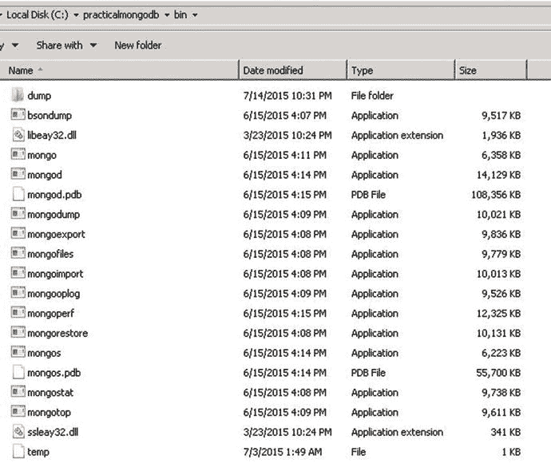

# 9. 管理 MongoDB

> “管理 MongoDB 不同于管理传统的关系型数据库管理系统。虽然大多数管理任务并非必需或由系统自动完成，但仍有一些任务需要人工干预。”

在本章中，你将了解用于备份与恢复、导入与导出数据、管理服务器以及监控数据库实例的基本管理操作流程。


## 9.1 管理工具

在您开始进行管理任务之前，这里快速概览一下可用的工具。由于 MongoDB 没有图形用户界面风格的管理界面，大多数管理任务都是通过命令行`mongo` shell 完成的。不过，也有一些作为独立社区项目提供的用户界面。

### 9.1.1 `mongo`

`mongo` shell 是 MongoDB 发行版的一部分。它是一个用于 MongoDB 数据库的交互式 JavaScript shell。它为管理员和开发人员提供了一个强大的界面，可以直接与数据库测试查询和操作。

在之前的章节中，您已经了解了使用 shell 进行开发。在本章中，您将学习如何使用 shell 执行系统管理任务。

### 9.1.2 第三方管理工具

有许多可用于 MongoDB 的第三方工具。大多数工具是基于 Web 的。

10gen 在 MongoDB 网站上维护了一个支持 MongoDB 的所有第三方管理工具列表：[`https://docs.mongodb.org/ecosystem/tools/administration-interfaces/`](https://docs.mongodb.org/ecosystem/tools/administration-interfaces/)。

## 9.2 备份与恢复

备份是最重要的管理任务之一。它确保数据安全，并在任何紧急情况下可以恢复。

如果数据无法恢复，备份就毫无用处。因此，在进行备份后，管理员需要确保备份是可用的格式，并且捕获了数据的一致状态。

管理员需要学习的第一项技能是如何进行备份和恢复。

### 9.2.1 数据文件备份

备份数据库最简单的方法是将数据复制到数据目录文件夹中。

所有 MongoDB 数据都存储在一个数据目录中，默认情况下是`C:\data\db`（在 Windows 中）或`/data/db`（在 LINUX 中）。可以在启动`mongod`时使用`–dbpath`选项将默认路径更改为其他目录。

数据目录的内容是存储在 MongoDB 数据库中数据的完整映像。因此，进行 MongoDB 备份就是简单地复制数据目录文件夹的全部内容。

通常，在 MongoDB 运行时复制数据目录内容是不安全的。一个选择是在复制数据目录内容之前关闭 MongoDB 服务器。

如果服务器被正常关闭，数据目录的内容就代表了 MongoDB 数据的安全快照，因此可以在服务器再次启动之前复制它。

虽然这是一种安全有效的备份方式，但它并不理想，因为它需要停机时间。

接下来，您将讨论不需要停机时间的备份技术。

### 9.2.2 `mongodump` 和 `mongorestore`

`mongodump`是作为 MongoDB 发行版一部分提供的 MongoDB 备份工具。它作为一个常规客户端工作，通过查询 MongoDB 实例并将所有读取的文档写入磁盘。

让我们执行一次备份，然后将其恢复，以验证备份是否可用且格式一致。

以下代码片段来自在 Windows 平台上运行这些工具。MongoDB 服务器运行在`localhost`实例上。

打开一个终端窗口并输入以下命令：

```
C:\> cd c:\practicalmongodb\bin
c:\practicalmongodb\bin> mongod --rest
2015-07-15T22:26:47.288-0700 I CONTROL [initandlisten] MongoDB starting : pid=3820 port=27017 dbpath=c:\data\db\ 64-bit host=ANOC9
.....................................................................................
2015-07-15T22:28:23.563-0700 I NETWORK [websvr] admin web console waiting for connections on port 28017
```

为了运行`mongodump`，在一个新的终端窗口中执行以下命令：

```
C:\> cd c:\practicalmongodb\bin
c:\practicalmongodb\bin> mongodump
2015-07-15T22:29:41.538-0700 writing admin.system.indexes to dump\admin\system.indexes.bson
................................
2015-07-14T22:29:46.720-0700 writing mydbproc.users to dump\mydbproc\users.bson
c:\practicalmongodb\bin>
```

这将整个数据库转储到`bin`文件夹目录下的`dump`文件夹中，如图 9-1 所示。


*图 9-1. dump 文件夹*

`mongodump`工具默认连接到数据库的`localhost`接口和默认端口。

接下来，它会获取每个数据库和集合的相关数据文件，并将其存储到一个预定义的文件夹结构中，默认为`./dump/[databasename]/[collectionname].bson`。

数据以`.bson`格式保存，这与 MongoDB 内部用于存储数据的格式类似。

如果目录中已有内容，除非转储包含同名文件，否则这些内容将保持不变。例如，如果转储包含文件`c1.bson`和`c2.bson`，而输出目录已有文件`c3.bson`和`c1.bson`，那么`mongodump`将用其`c1.bson`文件替换文件夹中的`c1.bson`文件，并复制`c2.bson`文件，但不会删除或更改`c3.bson`文件。

您应确保目录在用于`mongodump`之前是空的，除非您有覆盖备份数据的需求。

#### 9.2.2.1 单数据库备份

在上面的例子中，您使用默认设置执行了`mongodump`，它会转储 MongoDB 数据库服务器上的所有数据库。

在现实场景中，您会在单个服务器上运行多个应用数据库，每个数据库对备份策略有不同的要求。

在`mongodump`工具中指定`–d`参数将允许您按数据库进行备份。

```
c:\practicalmongodb\bin> mongodump -d mydbpoc
2015-07-14T22:37:49.088-0700 writing mydbproc.mapreducecount1 to dump\mydbproc\ mapreducecount1.bson
......................
2015-07-14T22:37:54.217-0700 writing mydbproc.users metadata to dump\mydbproc\users.metadata.json
2015-07-14T22:37:54.218-0700 done dumping mydbproc.users
c:\practicalmongodb\bin>
```

从 MongoDB-2.6 开始，数据库管理员必须拥有`admin`数据库的访问权限，才能备份给定数据库的用户和用户定义的角色，因为 MongoDB 仅将这些信息存储在`admin`数据库中。

#### 9.2.2.2 集合级别备份

每个数据库中有两种类型的数据：变化很少的数据，例如您维护用户、其角色以及任何应用相关配置的配置数据；以及变化频繁的数据，例如事件数据（在监控应用中）、帖子数据（在博客应用中）等。

因此，备份要求也不同。例如，完整数据库可以每周备份一次，而快速变化的集合则需要每小时备份一次。

在`mongodump`工具中指定`–c`参数，使用户能够单独为指定集合实施备份。

```
c:\practicalmongodb\bin> mongodump -d mydbpoc -c users
2015-07-14T22:41:19.850-0700 writing mydbproc.users to dump\mydbproc\users.bson
2015-07-14T22:41:30.710-0700 writing mydbproc.users metadata to dump\mydbproc\users.metadata.json
...........................................................
2015-07-14T22:41:30.712-0700 done dumping mydbproc.users
c:\practicalmongodb\bin>
```

如果未指定数据要转储到的文件夹，默认情况下，它会将数据转储到当前工作目录中名为`dump`的目录中，在本例中为`c:\practicalmongodb\bin`。

#### 9.2.2.3 `mongodump` –帮助

您已经了解了执行`mongodump`的基础知识。除了上面提到的选项，`mongodump`还提供了其他选项，让您可以根据需求定制备份。与所有其他工具一样，使用`–help`选项执行该工具将提供所有可用选项的列表。


## 9.2.2 mongorestore

如前所述，管理员**必须**确保备份以一致且可用的格式进行。因此，下一步是使用 `mongorestore` 将数据转储还原回去。

此实用程序将把数据库还原到执行转储时的状态。在 3.0 版本之前，甚至允许在不启动 `mongod`/`mongos` 的情况下运行该命令。从 3.0 版本开始，如果在启动 `mongod`/`mongos` 之前执行该命令，将显示以下错误：

```
c:\> cd c:\practicalmongodb\bin
c:\ practicalmongodb\bin> mongorestore
2015-07-15T22:43:07.365-0700 using default 'dump' directory
2015-07-15T22:43:17.545-0700 Failed: error connecting to db server: no reachable servers
```

在运行 `mongorestore` 命令之前，您必须先运行 `mongod`/`mongos` 实例。

```
c:\> cd c:\practicalmongodb\bin
c:\ practicalmongodb\bin> mongod --rest
2015-07-15T22:43:25.765-0700 I CONTROL [initandlisten] MongoDB starting : pid=3820 port=27017 dbpath=c:\data\db\ 64-bit host=ANOC9
.....................................................................................
2015-07-15T22:43:25.865-0700 I NETWORK [websvr] admin web console waiting for connections on port 28017
c:\ practicalmongodb\bin> mongorestore
2015-07-15T22:44:09.786-0700 using default 'dump' directory
2015-07-15T22:44:09.792-0700 building a list of dbs and collections to restore from dump dir
...................................
2015-07-15T22:44:09.732-0700 restoring indexes for collection mydbproc.users from metadata
2015-07-15T22:44:09.864-0700 finished restoring mydbproc.users
c:\practicalmongodb\bin>
```

这会将数据**追加**到现有数据的末尾。

要覆盖此默认行为，应在上面的代码片段中使用 `–drop`。

`–drop` 命令指示 `mongorestore` 实用程序，它需要删除前述数据库中的所有集合和数据，然后将转储数据还原回数据库。

如果未使用 `–drop`，则命令会将数据追加到现有数据的末尾。

请注意，从 3.0 版本开始，`mongorestore` 命令还可以接受来自标准输入的输入。

#### 9.2.2.5 还原单个数据库

正如你在备份部分所看到的，备份策略可以在单个数据库级别指定。你可以通过使用 `–d` 选项运行 `mongodump` 来备份单个数据库。

同样，你可以向 `mongorestore` 指定 `–d` 选项来还原单个数据库。

```
c:\ practicalmongodb\bin> mongorestore -d mydbpocc:\practicalmongodb\bin\dump\mydbproc -drop
2015-07-14T22:47:01.155-0700 building a list of collections to restore from C :\practicalmongodb\bin\dump\mydbproc dir
2015-07-14T22:47:01.156-0700 reading metadata file from C :\practicalmongodb\bin\dump\mydbproc \users.metadata.json
..........................................................................
2015-07-14T22:50:09.732-0700 restoring indexes for collection mydbproc.users from metadata
2015-07-14T22:50:09.864-0700 finished restoring mydbproc.users
c:\practicalmongodb\bin>
```

#### 9.2.2.6 还原单个集合

与 `mongodump` 可以使用 `–c` 选项指定集合级备份类似，你也可以通过将 `–c` 选项与 `mongorestore` 实用程序结合使用来还原单个集合。

```
c:\ practicalmongodb\bin> mongorestore -d mydbpoc -c users C:\ practicalmongodb\bin\dum\mydb\user.bson -drop
2015-07-14T22:52:14.732-0700 restoring indexes for collection mydbproc.users from metadata
2015-07-14T22:52:14.864-0700 finished restoring mydbproc.users
c:\practicalmongodb\bin>
```

### 9.2.2.7 Mongorestore –Help

`mongorestore` 也具有多个选项，可以使用 `–help` 选项查看。也可参考以下网站：[`docs.mongodb.org/manual/core/backups/`](http://docs.mongodb.org/manual/core/backups/)。

## 9.2.3 fsync 和 Lock

尽管上述两种方法（`mongodump` 和 `mongorestore`）使你能够在无需停机的情况下进行数据库备份，但它们不提供获取*时间点*数据视图的能力。

你已经了解了如何通过复制数据文件来备份，但这需要在复制数据前关闭服务器，这在生产环境中是不可行的。

MongoDB 的 `fsync` 命令允许你在运行 MongoDB 时不更改任何数据的情况下复制数据目录的内容。

`fsync` 命令会强制所有挂起的写入刷新到磁盘。可选地，它会持有一个锁，以在服务器解锁前阻止进一步的写入。此锁使得 `fsync` 命令适用于备份。

要从 shell 运行该命令，请在新的终端窗口中连接到 `mongo` 控制台。

```
c:\practicalmongodb\bin> mongo
MongoDB shell version: 3.0.4
connecting to: test
>
```

接下来，切换到 admin 并发出 `runCommand` 以执行 `fsync`：

```
> use admin
switched to db admin
> db.runCommand({"fsync":1, "lock":1})
{
"info" : "now locked against writes, use db.fsyncUnlock() to unlock",
"seeAlso" : "http://dochub.mongodb.org/core/fsynccommand",
"ok" : 1
}
>
```

此时，服务器已锁定以进行任何写入，确保数据目录代表一致、时间点的数据快照。数据目录的内容可以安全地复制用作数据库备份。

在备份活动完成后，必须解锁数据库。为此，请发出以下命令：

```
> db.$cmd.sys.unlock.findOne()
{ "ok" : 1, "info" : "unlock completed" }
>
```

`currentOp` 命令可用于检查数据库锁是否已释放。

```
> db.currentOp()
{ "inprog" : [ ] }
(解锁请求首次发出后可能需要片刻。)
```

`fsync` 命令使你能够在不停机且不牺牲备份的时间点性质的情况下进行备份。但是，会存在写入的短暂阻塞（也称为短暂的写入停机时间）。

从 3.0 版本开始，当使用 WiredTiger 时，`fsync` 不能保证数据文件不会更改。因此，它不能用于确保创建备份时的一致性。

接下来，你将了解从库备份。这是唯一一种能够在没有任何类型停机的情况下获取时间点快照的备份技术。

## 9.2.4 从库备份

从库备份是 MongoDB 中推荐的数据备份方式。从库存储的数据副本几乎总是与主库同步，并且从库的可用性或性能通常不是问题。你可以在从库而非主库上应用前面讨论的任何技术：关闭、带锁的 `fsync`，或转储和还原。

## 9.3 导入和导出

当你尝试将应用程序从一个环境迁移到另一个环境时，通常需要导入数据或导出数据。


