# MongoDB 工具与服务器管理

### 9.3.1 `mongoimport`

MongoDB 提供了 `mongoimport` 工具，允许你将数据批量加载到数据库的集合中。它从文件中读取数据并批量加载到集合。

这些方法不适合生产环境。

`mongoimport` 支持以下三种文件格式：

*   JSON：在此格式中，每行一个 JSON 块，代表一个文档。
*   CSV：这是一个逗号分隔的文件。
*   TSV：TSV 文件与 CSV 文件相同；唯一的区别是它使用制表符作为分隔符。

使用 `–help` 与 `mongoimport` 将提供该工具所有可用的选项。

`mongoimport` 非常简单。大多数时候你会用到以下选项：

*   `-h` 或 `–host`：指定需要恢复数据的 `mongod` 主机名。如果未指定该选项，命令将默认连接到在 `localhost` 的 `27017` 端口上运行的 `mongod`。可选地，可以指定端口号以连接到在不同端口上运行的 `mongod`。
*   `-d` 或 `–db`：指定需要导入数据的数据库。
*   `-c` 或 `–collection`：指定需要上传数据的集合。
*   `--type`：这是文件类型（即 CSV、TSV 或 JSON）。
*   `--file`：这是需要导入数据的文件路径。
*   `--drop`：如果设置了此选项，它将删除集合并从导入的数据中重新创建集合。否则，数据将附加到集合末尾。
*   `--headerLine`：仅用于 CSV 或 TSV 文件，用于指示第一行是标题行。

以下命令将数据从 CSV 文件导入到 `localhost` 上的 `testimport` 集合：

```
c:\practicalmongodb\bin> mongoimport --host localhost --db mydbpoc --collection testimport --type csv –file c:\exporteg.csv –-headerline
2015-07-14T22:54:08.407-0700 connected to: localhost
2015-07-14T22:54:08.483-0700 imported 15 documents
c:\ practicalmongodb\bin>
```

### 9.3.2 `mongoexport`

与 `mongoimport` 工具类似，MongoDB 提供了 `mongoexport` 工具，用于从 MongoDB 数据库导出数据。顾名思义，此工具从现有的 MongoDB 集合中导出文件。

使用 `–help` 显示 `mongoexport` 工具的可用选项。以下是你最常使用的选项：

*   `-q`：用于指定查询，该查询将返回需要导出的记录作为输出。这类似于在 `db.CollectionName.find()` 函数中指定的、用于检索符合选择条件的记录的查询。如果未指定查询，则导出所有文档。
*   `-f`：用于指定需要从选定文档中导出的字段。

以下命令将数据从 `Users` 集合导出到 CSV 文件：

```
c:\practicalmongodb\bin> mongoexport -d mydbpoc -c myusers -f _id,Age –type=csv > myusers.csv
2015-07-14T22:54:48.604-0700 connected to: 127.0.0.1
2015-07-14T22:54:48.604-0700 exported 22 records
c:\practicalmongodb\bin>
```

## 9.4 管理服务器

在本节中，你将了解作为系统管理员需要了解的各种选项。

### 9.4.1 启动服务器

本节介绍如何启动服务器。之前，你通过运行 `mongod.exe` 来使用 `mongo` shell 启动服务器。

MongoDB 服务器可以通过在 Windows 中以管理员身份打开命令提示符或在 Linux 系统中打开终端窗口，并键入以下命令来手动启动：

```
C:\>cd c:\practicalmongodb\bin
c:\ practicalmongodb\bin>mongod
mongod --help for help and startup options
.........................................
```

此窗口将显示所有与 `mongod` 建立的连接。它还显示可用于监控服务器的信息。

如果未指定配置，MongoDB 将使用默认数据库路径 `C:\data\db`（在 Windows 上）和 `/data/db`（在 Linux 上）启动，并使用默认端口 `27017` 和 `27018` 绑定到 `localhost`。

键入 `^C` 将干净地关闭服务器。

MongoDB 提供了两种指定用于启动服务器的配置参数的方法。

第一种是使用命令行选项指定（参考第 tk 章）。

第二种方法是加载配置文件。可以通过编辑文件然后重新启动服务器来更改服务器配置。

### 9.4.2 停止服务器

服务器可以通过在 `mongod` 控制台中按 `CTRL+C` 来关闭。或者，你可以使用 `mongo` 控制台中的 `shutdownServer` 命令。

打开终端窗口，并连接到 `mongo` 控制台。

```
C:\> cd c:\practicalmongodb\bin
c:\practicalmongodb\bin> mongo
MongoDB shell version: 3.0.4
connecting to: test
>
```

切换到 `admin` 数据库并发出 `shutdownServer` 命令：

```
> use admin
switched to db admin
> db.shutdownServer()
2015-07-14T22:57:20.413-0700 I NETWORK DBClientCursor::init call() failed server should be down...
2015-07-14T22:57:20.418-0700 I NETWORK trying reconnect to 127.0.0.1:27017
2015-07-14T22:57:21.413-0700 I NETWORK 127.0.0.1:27017 failed couldn't connect to server 127.0.0.1:27017
>
```

如果你检查在上一步中启动服务器的 `mongod` 控制台，你将看到服务器已成功关闭。

```
.......................
2015-07-14T22:57:30.259-0700 I COMMAND [conn1] terminating, shutdown command received
2015-07-14T22:57:30.260-0700 I CONTROL [conn1] now exiting
.................................................
2015-07-14T22:57:30.380-0700 I STORAGE [conn1] shutdown: removing fs lock...
2015-07-14T22:57:30.380-0700 I CONTROL [conn1] dbexit: rc: 0
```

### 9.4.3 查看日志文件

默认情况下，MongoDB 的所有日志输出都写入 `stdout`，但可以通过在启动服务器时指定配置中的 `logpath` 选项来更改，将输出重定向到文件。

日志文件内容可用于识别问题，例如可能指示某些数据问题或连接问题的异常。


### 9.4.4 服务器状态

`db.ServerStatus()` 是 MongoDB 提供的一个简单方法，用于检查服务器状态，例如连接数、运行时间等。服务器状态命令的输出取决于操作系统平台、MongoDB 版本、使用的存储引擎以及配置类型（如独立实例、副本集和分片集群）。

从 3.0 版本开始，输出中删除了以下部分：`workingSet`、`indexCounters` 和 `recordStats`。

要使用 MMAPv1 存储引擎检查服务器状态，请连接到 mongo 控制台，切换到 admin 数据库，然后执行 `db.serverStatus()` 命令。

```
c:\practicalmongodb\bin> mongo
MongoDB shell version: 3.0.4
connecting to: test
> use admin
switched to db admin
> db.serverStatus()
host" : "ANOC9",
"version" : "3.0.4",
"process" : "mongod",
"pid" : NumberLong(1748),
"uptime" : 14,
"uptimeMillis" : NumberLong(14395),
"uptimeEstimate" : 13,
"localTime" : ISODate("2015-07-14T22:58:44.532Z"),
"asserts" : {
"regular" : 0,
"warning" : 0,
"msg" : 0,
"user" : 1,
"rollovers" : 0
},
.........................................................
```

上述 `serverStatus` 输出还将包含一个 "backgroundflushing" 部分，其中显示 MongoDB 使用 MMAPv1 作为存储引擎将数据刷新到磁盘的相应进程报告。

"opcounters" 和 "asserts" 部分提供了可用于分析任何问题的有用信息。

"opcounters" 部分显示了每种类型的操作数。为了发现问题，你应该建立这些操作的基线。如果计数器开始偏离基线，则表明存在问题，需要采取措施使其恢复正常状态。

"asserts" 部分描述了发生的客户端和服务器警告或异常的数量。如果你发现此类异常和警告增加，就需要仔细检查日志文件，以确定是否有问题正在发展。`asserts` 数量的增加也可能表明数据存在问题，在这种情况下，应使用 MongoDB 的 `validate` 函数来检查数据是否未损坏。

接下来，让我们使用 WiredTiger 存储引擎启动服务器，看看 `serverStatus` 输出。

```
c:\practicalmongodb\bin> mongod –storageEngine wiredTiger
2015-07-14T22:51:05.965-0700 I CONTROL Hotfix KB2731284 or later update is installed, no need to zero-out data files
2015-07-29T22:51:05.965-0700 I STORAGE [initandlisten] wiredtiger_open config: create,cache_size=1G,session_max=20000,eviction=(threads_max=4),statistics=(fast),log=(enabled=true,archive=true,path=journal,compressor=snappy),file_manager=(close_idle_time=100000),checkpoint=(wait=60,log_size=2GB),statistics_log=(wait=0)
..................................................
```

要检查服务器状态，请连接到 mongo 控制台，切换到 admin 数据库，然后执行 `db.serverStatus()` 命令。

```
c:\practicalmongodb\bin> mongo
MongoDB shell version: 3.0.4
connecting to: test
> use admin
switched to db admin
> db.serverStatus()
"wiredTiger" : {
"uri" : "statistics:",
"LSM" : {
"...........................................................,
"tree maintenance operations scheduled":0,
............................................................,
},
"async" : {
"number of allocation state races":0,
"number of operation slots viewed for allocation":0,
"current work queue length" : 0,
"number of flush calls" : 0,
"number of times operation allocation failed":0,
"maximum work queue length" : 0,
............................................................,
},
"block-manager" : {
"mapped bytes read" : 0,
"bytes read" : 966656,
"bytes written" : 253952,
...................................,
"blocks written" : 45
},
............................................................,
```

正如你所看到的，当使用 WiredTiger 存储引擎启动时，服务器状态输出有一个名为 `wiredTiger` 统计信息的新部分。

### 9.4.5 识别与修复 MongoDB

在本节中，你将了解如何修复损坏的数据库。

如果你遇到如下错误：

*   数据库服务器拒绝启动，并指出数据文件已损坏
*   日志文件或 `db.serverStatus()` 命令中出现 `asserts`
*   查询结果出现奇怪或意外的情况

这意味着数据库已损坏，必须运行修复程序以恢复数据库。

在开始修复之前，你需要做的第一件事是使服务器离线（如果尚未离线）。你可以使用上述提到的任一选项。在此示例中，在 `mongod` 控制台中键入 `^C`，这将关闭服务器。

接下来，使用 `–repair` 选项启动 `mongod`，如下所示：

```
c:\practicalmongodb\bin> mongod --repair
2015-07-14T22:58:31.171-0700 I CONTROL Hotfix KB2731284 or later update is installed, no need to zero-out data files
2015-07-14T22:58:31.173-0700 I CONTROL [initandlisten] MongoDB starting : pid=3996 port=27017 dbpath=c:\data\db\ 64-bit host=ANOC9
2015-07-14T22:58:31.174-0700 I CONTROL [initandlisten] db version v3.0.4
.....................................
2015-07-14T22:58:31.447-0700 I STORAGE [initandlisten] shutdown: removing fs lock...
2015-07-14T22:58:31.449-0700 I CONTROL [initandlisten] dbexit: rc: 0
c:\ practicalmongodb\bin>
```

这将修复 `mongod`。如果你查看输出，会发现该实用程序正在修复的各种差异。修复过程结束后，它会退出。

修复过程完成后，可以像正常一样启动服务器，然后使用最新的数据库备份来恢复丢失的数据。

有时，你可能会注意到在修复大型数据库时，驱动器磁盘空间不足。这是因为 MongoDB 需要在与数据文件相同的驱动器上创建文件的临时副本。要解决此问题，在修复数据库时，应使用 `–repairpath` 参数指定在修复过程中可以创建临时文件的驱动器。


## 9.4.6 识别和修复集合级数据

有时你可能需要验证集合是否保存了有效的数据并拥有有效的索引。针对这种情况，MongoDB 提供了 `validate()` 方法来验证指定集合的内容。

以下示例验证 `Users` 集合的数据：

```
c:\practicalmongodb\bin> mongo

MongoDB shell version: 3.0.4

connecting to: test

> use mydbpoc

switched to db mydbpoc

> db.myusers.validate()

{

"ns" : "mydbpoc.myusers",

"firstExtent" : "1:4322000 ns:mydbpoc.myusers",

"lastExtent" : "1:4322000 ns:mydbpoc.myusers",

"...............

"valid" : true,

"errors" : [ ],

"warning" : "Some checks omitted for speed. use {full:true} option to do more thorough scan.",

"ok" : 1

}
```

默认情况下，`validate()` 选项会同时检查数据文件和相关联的索引。提供集合统计数据有助于识别数据文件或索引是否存在问题。

如果运行 `validate()` 表明索引已损坏，那么可以使用 `reIndex` 来重建集合的索引。这会删除并重建集合的所有索引。

以下命令重建 `Users` 集合的索引：

```
> use mydbpoc

switched to db mydbpoc

> db.myusers.reIndex()

{

"nIndexesWas" : 1,

"msg" : "indexes dropped for collection",

"nIndexes" : 1,

"indexes" : [

{

"key" : {

"_id" : 1

},

"ns" : "mydbpoc.myusers",

"name" : "_id_"

}

],

"ok" : 1

}

>
```

如果集合的数据文件已损坏，那么运行 `–repair` 选项是修复所有数据文件的最佳方式。

## 9.5 监控 MongoDB

作为 MongoDB 服务器管理员，监控系统的性能和健康状况非常重要。在本节中，你将学习监控系统的方法。

### 9.5.1 mongostat

`mongostat` 是 MongoDB 发行版的一部分。该工具提供服务器的简单统计信息；虽然不全面，但它提供了一个很好的概览。以下显示了本地主机的统计信息。打开终端窗口并执行以下命令：

```
c:\> cd c:\practicalmongodb\bin

c:\practicalmongodb\bin> mongostat
```

前六列显示了 `mongod` 服务器处理各种操作的速率。除这些列外，以下列也值得一提，在诊断问题时可能有用：

*   `Conn`：此指标表示连接到 `mongod` 实例的数量。这里的值高可能表明应用程序未释放或关闭连接，这意味着应用程序虽然发出了打开连接的操作，但在操作完成后未关闭连接。

从 3.0 版本开始，`mongostat` 也可以使用选项 `–json` 以 JSON 格式返回其响应。

```
c:\> cd c:\practicalmongodb\bin

c:\practicalmongodb\bin> mongostat –json

{"ANOC9":{"ar|aw":"0|0","command":"1|0","conn":"1","delete":"*0","faults":"1","flushes":"0","getmore":"0","host":"ANOC9","insert":"*0","locked":"", "mapped":"560.0M","netIn":"79b","netOut":"10k","non mapped":"","qr|qw":"0|0","query":"*0","res":"153.0M","time":"05:16:17","update":"*0","vsize":"1.2G"}}
```

### 9.5.2 mongod Web 界面

每当启动 `mongod` 时，它默认会创建一个 Web 端口，该端口号比 `mongod` 用于监听连接的端口号高 1000。默认情况下，HTTP 端口是 28017。

可以通过 Web 浏览器访问这个 `mongod` Web 界面，它会显示大部分统计信息。如果 `mongod` 运行在 `localhost` 上并在端口 27017 监听连接，则可以使用以下 URL 访问 HTTP 状态页面：`http://localhost:28017`。页面如图 9-2 所示。

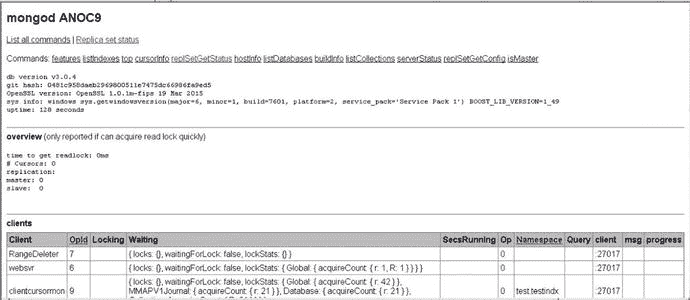

图 9-2. Web 界面

### 9.5.3 第三方插件

除了此工具外，还有各种适用于 MongoDB 的第三方适配器，它们允许你使用常见的开源或商业监控系统，如 `cacti`、`Ganglia` 等。在其网站上，10gen 维护了一个页面，分享有关可用 MongoDB 监控接口的最新信息。

要获取最新的第三方插件列表，请访问 [`www.mongodb.org/display/DOCS/Monitoring+and+Diagnostics`](http://www.mongodb.org/display/DOCS/Monitoring+and+Diagnostics)。

### 9.5.4 MongoDB Cloud Manager

除了上述用于监控和备份的工具和技术外，还有 MongoDB Cloud Manager（前身为 MMS – MongoDB Monitoring Services）。它由开发 MongoDB 的团队开发，并且免费使用（30 天试用许可）。与上面讨论的技术相比，MongoDB Cloud Manager 提供了用户界面以及日志和性能详情，并以图形和图表的形式呈现。

MongoDB Cloud Manager 图表是交互式的，允许用户设置自定义日期范围，如图 9-3 所示。

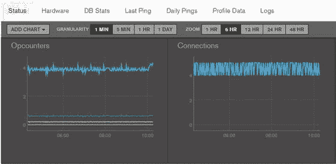

图 9-3. 设置自定义日期范围

Cloud Manager 的另一个巧妙功能是在发生不同事件时使用电子邮件和短信告警的能力。如图 9-4 所示。

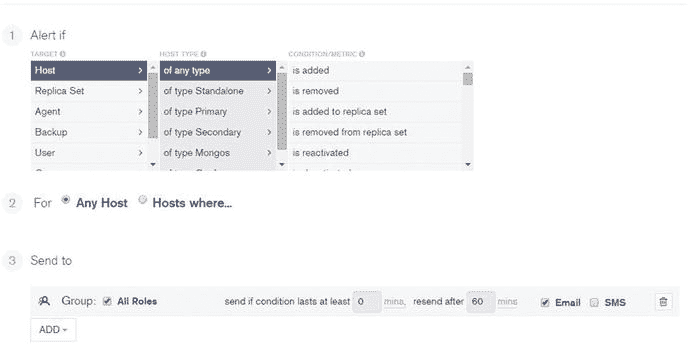

图 9-4. 电子邮件和短信告警

Cloud Manager 不仅提供图表和告警，还允许你查看按响应时间排序的慢查询。你可以轻松地在一个地方查看查询的执行情况。图 9-5 显示了绘制查询性能的图表。

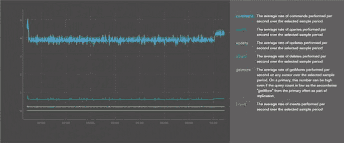

图 9-5. 查询响应时间

Cloud Manager 允许你执行以下操作：

*   自动化你的 MongoDB 部署（MongoDB 节点、集群的配置以及现有部署的升级）
*   通过持续备份保护你的数据
*   通过 AWS 集成提供任意拓扑
*   在仪表板中监控性能
*   执行操作任务，例如增加容量

对于 AWS 用户，它提供直接集成，因此可以在不离开 Cloud Manager 的情况下在 AWS 上启动 MongoDB。你已在第 tk 章中了解了如何使用 AWS 进行配置。

Cloud Manager 还有助于你发现系统中的低效之处并进行修正以实现平稳运行。

它使用你安装的代理收集和报告指标。Cloud Manager 提供了对 MongoDB 系统健康状况的快速概览，并帮助你确定性能问题的根本原因。

接下来，你将了解任何性能调查都应使用的关键指标。在此过程中，你还将了解这些指标组合的含义。


#### 9.5.4.1 指标

您将主要关注以下关键指标；这些指标在调查性能问题时起着关键作用。它们能即时概览 MongoDB 系统内部发生的情况，以及哪些系统资源（即 CPU、RAM 或磁盘）是瓶颈。

-   `页面错误`
-   `操作计数器`
-   `锁百分比`
-   `队列`
-   `CPU 时间`（`I/O 等待` 和 `用户时间`）

要查看下图所示的图表，您可以点击 `部署` 部分下的 `部署` 链接。选择已配置为由 Cloud Manager 监控的 MongoDB 实例。接下来，从 `管理图表` 部分选择所需的图表。

`页面错误` 显示系统中每秒发生的平均页面错误次数。图 9-6 显示了页面错误图。

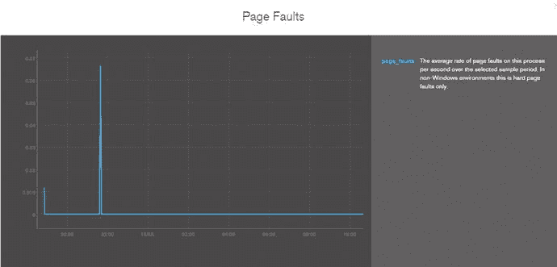

图 9-6. `页面错误`

`操作计数器` 显示系统上每秒执行操作的平均次数。参见图 9-7。

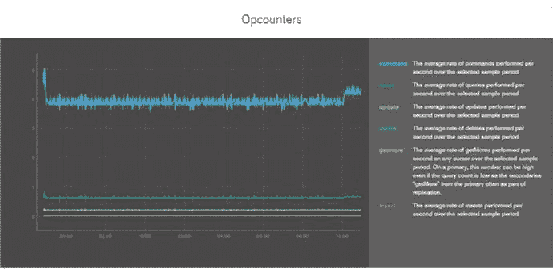

图 9-7. `操作计数器`

在 `页面错误` 与 `操作计数器` 的比率中，页面错误取决于系统上执行的操作以及当前内存中的内容。因此，每秒页面错误次数与每秒 `操作计数器` 的比率可以相当准确地反映磁盘 I/O 需求。参见图 9-8。

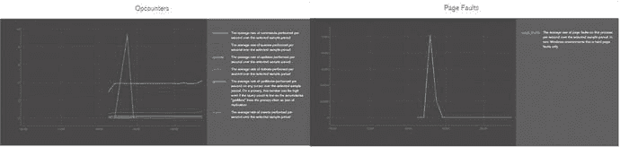

图 9-8. `页面错误` 与 `操作计数器` 比率

如果该比率是：

-   < 1，则归类为低磁盘 I/O。
-   接近 1，则归类为常规磁盘 I/O。
-   > 1，则归类为高磁盘 I/O。

`队列` 图显示了在任何给定时间等待锁释放的操作计数。参见图 9-9。

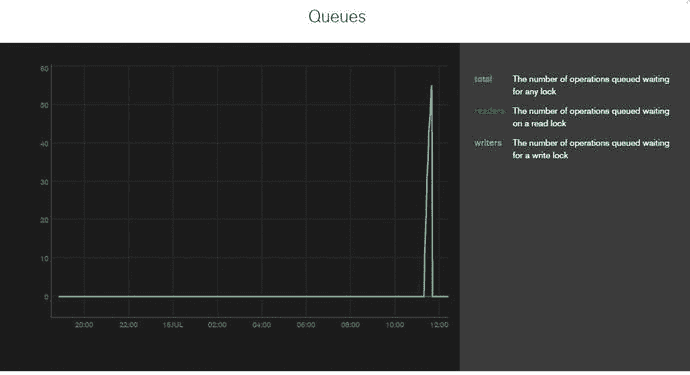

图 9-9. `队列`

`CPU 时间`（`I/O 等待` 和 `用户时间`）图显示了 CPU 核心如何分配其周期。参见图 9-10。

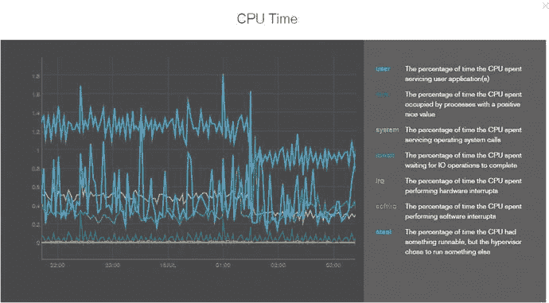

图 9-10. `CPU 时间`

`I/O 等待` 表示 CPU 等待其他资源（如磁盘或网络）所花费的时间。参见图 9-11。

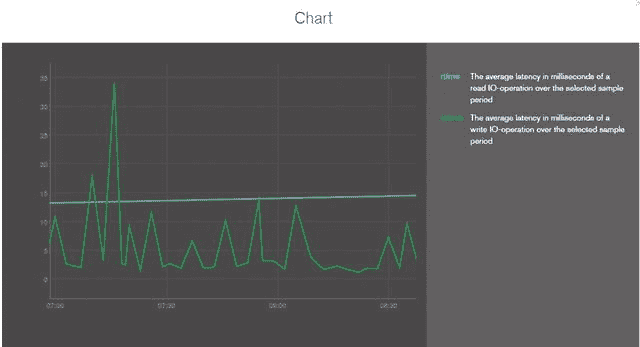

图 9-11. `I/O 等待`

`用户时间` 表示执行计算所花费的时间，例如文档更新、更新和重新平衡索引、选择或排序查询结果，或运行聚合框架命令、`Map/Reduce` 或服务器端 JavaScript。参见图 9-12。

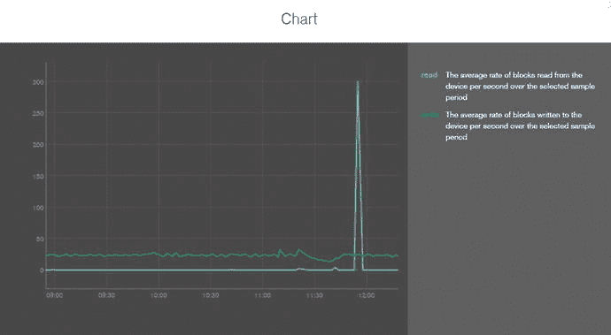

图 9-12. `用户时间`

要查看 `CPU 时间` 图表，您需要安装 `munin`。

这些关键指标及其组合应用于调查任何性能问题。

## 9.6 总结

在本章中，您了解了如何使用作为 MongoDB 发行版一部分打包的各种实用程序来管理和维护系统。

您了解了作为管理员必须了解的主要操作，以便详细理解这些实用程序。请通读参考资料。在下一章中，您将研究 MongoDB 的用例，并探讨哪些情况下 MongoDB 不是一个好的选择。

