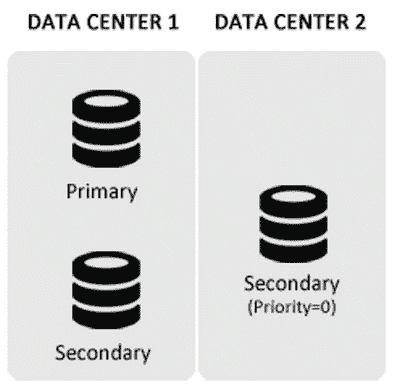

# 12. MongoDB 最佳实践

> “入门 MongoDB 很容易，但一旦开始开发应用程序，您会遇到各种场景，此时可能需要最佳实践来实现特定用例。”

在之前的章节中，您已经熟悉了 MongoDB。本章旨在概述已知的问题并借鉴其他用户的经验，同时提供各种“操作指南”，帮助您顺利使用 MongoDB。

如您所知，MongoDB 以文档方式工作，使用 RAM 存储数据以提升性能，并使用复制和分片来进一步提供数据安全性和可扩展性。

本章将涵盖您应该注意的提示，从部署策略到增强查询，再到数据安全与一致性，以及监控。

## 12.1 部署

在决定部署策略时，请牢记以下提示，以便正确完成硬件规模评估。这些提示也将帮助您决定是否使用分片和复制。

*   **数据集大小**：最重要的一点是确定当前和预期的数据集大小。这不仅能让您为单个物理节点选择资源，也有助于规划分片方案（如果有）。
*   **数据重要性**：第二重要的是确定数据的重要性，以评估数据的重要程度以及您对任何数据丢失或数据延迟（尤其是在复制情况下）的容忍度。
*   **内存规模**：下一步是确定内存需求，并相应地处理 RAM。与其他面向数据的应用程序一样，当整个数据集可以驻留在内存中时，MongoDB 的工作效果最佳，从而避免任何磁盘 I/O。页面错误表明您可能超出了可用部署的内存，应考虑增加它。页面错误是一个可以通过监控工具（如 MongoDB Cloud Manager）衡量的指标。如果可能，您应始终选择内存大于工作集大小的平台。如果大小超过单个节点的内存，您应考虑使用分片，以便可以增加可用内存量。这可以最大化整个部署的性能。
*   **磁盘类型**：如果速度不是主要关注点，或者数据集大于任何内存策略所能支持的大小，那么选择适当的磁盘类型就非常重要。IOPS（每秒输入/输出操作次数）是选择磁盘类型的关键；IOPS 越高，MongoDB 性能越好。如果可能，应使用本地磁盘，因为网络存储可能导致性能低下和延迟高。还建议在创建磁盘阵列时（在可能的情况下）使用 RAID 10。
*   **CPU**：如果您预计要使用 map reduce，那么时钟速度和可用处理器将成为重要的考虑因素。当您运行一个 `mongod` 且大部分数据在内存中时，时钟速度也会对整体性能产生重大影响。在您希望最大化每秒操作数的情况下，您必须考虑在部署策略中包含具有高时钟/总线速度的 CPU。
*   如果高可用性是要求之一，则使用复制。在任何 MongoDB 部署中，设置一个至少包含三个节点的副本集应该是标准做法。2x1 部署是具有三个节点的最常见的复制配置，其中有两个节点在一个数据中心，一个备用节点在辅助数据中心，如图 12-1 所示。

    
    *图 12-1. MongoDB 2*1 部署*

### 12.1.1 MongoDB 网站提供的硬件建议

以下内容仅旨在为 MongoDB 部署提供高层指导。实际的硬件配置取决于您的数据、可用性要求、查询、性能标准和所选硬件组件的能力。

*   **内存**：由于 MongoDB 广泛使用内存以获得更好的性能，内存越多，性能越好。
*   **存储**：MongoDB 可以使用 SSD（固态硬盘）或本地连接存储。由于 MongoDB 的磁盘访问模式不具有顺序特性，使用 SSD 可以让客户体验到显著的性能提升。使用 SSD 的另一个好处是，如果工作集不再适合内存，它们可以提供性能的平缓下降。大多数 MongoDB 部署应使用 RAID-10。当使用 WiredTiger 存储引擎时，由于性能问题，强烈建议使用 XFS 文件系统。另外，不要使用大页面，因为 MongoDB 在默认虚拟内存页面下表现更好。
*   **CPU**：由于使用 MMAPv1 存储引擎的 MongoDB 很少遇到需要大量核心的工作负载，因此优选使用具有较快速时钟速度的服务器，而不是核心较多但时钟速度较慢的服务器。然而，WiredTiger 存储引擎是 CPU 密集型的，因此使用具有多个核心的服务器将提供显著的性能改进。

### 12.1.2 需要注意的几点

总结本节，为 MongoDB 选择硬件时，请考虑以下重要点：

更快的 CPU 时钟速度和更多的 RAM 对生产力很重要。由于 MongoDB 不执行大量计算，增加核心数量有帮助，但使用 MMAPv1 存储引擎时不会提供高水平的边际回报。使用 SATA SSD 和 PCI（Peripheral Component Interconnect）提供了良好的性价比和良好结果。将资金用于商用 SATA 机械硬盘更有效。**NUMA 硬件上的 MongoDB**：此点仅适用于在 Linux 中运行的 `mongod`，不适用于在 Windows 或其他类 Unix 系统上运行的实例。NUMA（非统一内存访问）和 MongoDB 不能很好地协同工作，因此在 NUMA 硬件上运行 MongoDB 时，您需要为 MongoDB 禁用 NUMA 并使用交叉内存策略运行，因为 NUMA 会导致 MongoDB 出现许多操作问题，包括一段时间内的性能缓慢或高处理器使用率。


## 12.2 编码

一旦获得硬件，在编写数据库代码时请考虑以下建议：

### 数据模型选择

首要的一点是，根据给定的应用需求思考要使用的数据模型，并决定采用嵌入、引用还是两者混合的方式。更多相关内容，请参阅第 tk 章。在快速性能和保证即时一致性之间需要做出权衡，因此请根据您的应用程序来决定。

### 避免文档无限增长

应避免导致文档大小无限增长的应用程序模式。在 MongoDB 中，单个 BSON 文档的最大尺寸为 16MB。应避免使文档以无界方式增长的应用程序模式。例如，应用程序不应以导致文档显著增大的方式更新文档。当文档大小超过分配的大小时，MongoDB 将重新定位该文档。这个过程不仅耗时，而且资源密集，并可能不必要地减慢其他数据库操作。此外，它还可能导致存储空间利用效率低下。请注意，上述限制适用于 MMAPv1 存储引擎。使用 WiredTiger 时，每次更新都会重写文档。

例如，考虑一个博客应用程序。在此应用中，很难估计一篇博客文章会收到多少回复。应用程序被设定为仅向用户显示一部分评论，比如最近的评论或前 10 条评论。在这种情况下，与其创建一个将博客文章和用户响应维护为单个文档的嵌入模型，您应该创建一个引用模型，其中每个响应或响应组作为单独的文档维护，然后在这些文档中添加对博客文章的引用。通过这种方式，可以控制文档的无限增长——如果遵循第一种嵌入数据的模式，这种增长就会发生。

### 为未来设计文档

您也可以为未来设计文档。尽管 MongoDB 提供了根据需要向文档中追加新字段的选项，但这有一个缺点。当引入新字段时，可能会出现文档无法容纳在当前可用空间中的情况，导致 MongoDB 为文档寻找新空间并将其移动过去，这可能需要时间。因此，如果您了解文档结构，无论当时是否有数据可用，最好一开始就创建所有字段。如上所述，空间将被分配给文档，当有值时只需进行更新。这样做，MongoDB 就不必寻找空间；它只需更新输入的值，这样速度要快得多。

### 预设文档大小

在适用的情况下，也可以创建具有预期大小的文档。这一点也是为了确保为文档分配足够的空间，任何进一步的增长都不会导致为寻找空间而四处转移。这可以通过使用一个“垃圾”字段来实现，该字段在最初插入文档时包含一个预期大小的字符串，然后立即取消设置该字段：
```javascript
> mydbcol.insert({"_id" : ObjectID(..),......, "tempField" : stringOfAnticipatedSize})
> mydbcol.update({"_id" : ...}, {"$unset" : {"tempField" : 1}})
```

### 子文档 vs 数组

当您知道并且将始终知道要访问的字段名称时，应始终使用子文档。否则，请使用数组。

### 存储计算结果

如果您想查询的信息必须经过计算而未明确存在于文档中，最佳选择是在文档中使该信息明确。由于 MongoDB 旨在仅存储和检索数据，它本身不执行任何计算。任何琐碎的计算都被推送到客户端，从而导致性能问题。

### 避免使用 `$Where`

另外，尽可能避免使用 `$Where`，因为它是一个极其耗时且资源密集的操作。

### 使用正确的数据类型

在设计文档时使用正确的数据类型。例如，数字应仅存储为数字数据类型，而不是字符串数据类型。使用字符串存储数据会占用更多空间，并对可以对数据执行的操作产生影响。

### 字符串大小写敏感性

另一件需要注意的事情是，MongoDB 中的字符串是区分大小写的。因此，搜索 `"practicalMongoDB"` 将找不到 `"Practicalmongodb"`。因此，在进行字符串搜索时，您可以执行以下操作之一：
*   以规范化大小写格式存储数据。
*   搜索时使用带有 `/I` 的正则表达式。
*   在聚合框架中使用 `$toUpper` 或 `$toLower`。

### 自定义 _id 主键

使用您自己的唯一键作为 `_id` 将节省一点空间，并且如果您计划对该键建立索引，这将很有用。但是，在决定使用自己的键作为 `_id` 时，需要牢记以下几点：
*   您必须确保该键的唯一性。
*   同时，请考虑键的插入顺序，因为插入顺序将决定维护此索引需要使用多少 RAM。

### 只返回需要的字段

按需检索字段。当每秒需要满足成百上千个请求时，只获取所需字段无疑是有利的。

### 使用 GridFS

仅当数据大于单个文档所能容纳的大小或太大而无法在客户端一次性加载时（例如视频），才使用 GridFS 存储。任何将流式传输给客户端的数据都是 GridFS 的良好候选。

### 使用 TTL 自动删除文档

使用 TTL（生存时间）删除文档。如果集合中的文档需要在预定义的时间段后被删除，则可以使用 TTL 功能在文档达到预定义的存在时间后自动删除。

假设您有一个集合，其中存储了包含用户与系统交互详细信息的文档。这些文档有一个名为 `lastActivity` 的日期字段，用于跟踪用户与系统的交互。假设您有一个需求，要求只保留用户会话一小时。在这种情况下，您可以为 `lastActivity` 字段设置 TTL 为 3600 秒。一个后台线程将自动运行，检查并删除闲置超过 3600 秒的文档。

### 使用固定集合

如果您需要基于插入顺序的高吞吐量，请使用固定集合。在某些情况下，根据数据大小，您需要在系统中维护一个数据的滚动窗口。例如，固定集合可用于存储高容量系统的日志信息，以快速检索最新的日志条目。

### 注意数据一致性

请注意，如果不加以注意，MongoDB 的灵活模式可能导致数据不一致。例如，复制数据（嵌入文档）的能力，如果未正确更新，可能导致数据不一致，等等。因此，检查数据一致性非常重要。

### 处理异常与故障转移

尽管 MongoDB 可以处理无缝故障转移，但根据良好的编码实践，应用程序应编写得当，以处理任何异常并优雅地应对这种情况。


## 12.3 应用程序响应时间优化

一旦开始开发应用程序，最重要的需求之一就是拥有可接受的响应时间。换句话说，应用程序应该能够即时响应。你可以使用以下技巧进行优化：

*   尽可能避免磁盘访问和页面错误。主动估算应用程序需要处理的数据集大小，并增加内存以避免页面错误和磁盘读取。此外，以应用程序主要访问内存中可用数据的方式来编程，这样页面错误就会很少发生。
*   在查询字段上创建索引。如果你在正在执行的筛选器上创建索引，索引在内存中的存储方式将减少内存消耗，从而对查询产生积极影响。
*   如果应用程序涉及的查询返回的字段数相对于完整文档结构较少，则创建覆盖索引。
*   使用一个能被最多查询利用的复合索引也能节省内存，因为只需加载一个索引，而非多个。
*   在正则表达式中使用尾部通配符以获取关联索引的好处。
*   尝试创建能大幅减少待选文档范围的索引。对“性别”字段的索引就不如对“电话号码”字段的索引有益。
*   索引并非总是好的。你需要平衡所用索引的最佳数量。虽然你应该为支持查询创建索引，但也应记住删除不再使用的索引，因为每个索引都会为插入/更新操作带来成本。如果一个索引未被使用却仍然存在，它可能对数据库的整体容量产生不利影响。这对于写入密集型的工作负载尤其重要。
*   文档应设计为层次化结构，将相关事物分组在一起，并在适用的地方描绘为层级关系。这将使 MongoDB 能够找到所需信息，而无需扫描整个文档。
*   应用 AND 操作符时，应始终从结果集小的查询开始，再到结果集大的查询，因为这将导致查询的文档数量较少。如果你知道最具限制性的条件，该条件应放在最前面。
*   使用 OR 查询时，应从结果集大的查询转向结果集小的查询，因为这将限制后续查询的搜索空间。
*   工作集应能完全放入内存。
*   对于写入密集型和 I/O 密集型应用程序，使用 WiredTiger 存储引擎，因为它支持在块级别和索引级别进行压缩。

## 12.4 数据安全性

你已经学习了在决定部署方案时需要考虑的事项；也了解了一些提升性能的重要技巧。现在，让我们看看一些关于数据安全性和一致性的建议：

*   **复制**和**日志**是为数据安全提供的两种方法。通常建议在生产环境中使用复制功能，而不是在单台服务器上运行。并且，你应该让至少一台服务器启用日志。当无法启用复制且只能在单台服务器上运行时，日志记录可提供数据安全保障。第 `tk` 章解释了启用日志时写入操作的工作原理。
*   在服务器崩溃的情况下，`修复`应是恢复数据的最后手段。尽管运行修复后数据库可能未损坏，但它可能不会包含所有数据。
*   在复制环境中，将 `W` 设置为安全写入的大多数节点。这是为了确保写入被复制到副本集的大多数成员。虽然这会减慢写入操作的速度，但写入操作是安全的。
*   在发出命令时，始终为 `w` 参数指定 `wtimeout`，以避免无限期的等待时间。
*   MongoDB 应始终在受信任的环境中运行，并制定规则以阻止所有未知系统、机器或网络的访问。

## 12.5 管理

以下是一些管理技巧：

*   对持久化服务器进行**即时时间点备份**。要备份启用了日志的数据库，你可以进行文件系统快照，或者执行正常的 `fsync+lock` 然后转储。请注意，你不能在没有 `fsync` 和锁定的情况下直接复制所有文件，因为复制操作不是瞬间完成的。
*   `修复`应用作压缩数据库的手段，因为它基本上执行一次 `mongodump` 然后 `mongorestore`，从而创建数据的干净副本，并在此过程中移除数据文件中的任何空“空洞”。
*   MongoDB 提供了**数据库探查器**。它会记录所有数据库操作的细粒度信息。可以将其设置为记录所有事件的信息，或者仅记录持续时间超过可配置阈值（默认为 100 毫秒）的事件。

注意：探查器数据存储在一个**固定集合**中。与解析日志文件相比，查询此集合可能更容易。

*   可以使用 `explain` 计划来查看查询是如何被解析的。这涉及诸如使用了哪个索引、返回了多少文档、索引是否覆盖了查询、扫描了多少索引条目以及查询返回结果所花费的时间（以毫秒为单位）等信息。当查询在不到 1 毫秒内解析完成时，`explain` 计划会显示 `0`。当你调用 `explain` 计划时，它会丢弃旧的执行计划，并启动测试可用索引的过程，以确保使用最佳的执行计划。

## 12.6 复制延迟

**复制延迟**是监控副本集背后的主要管理问题。给定从节点的复制延迟是指操作在主节点写入的时间与该操作在从节点上复制完成的时间之间的差值。通常，复制延迟会自行恢复并且是暂时的。然而，如果延迟持续很高且不断上升，系统可能存在问题。你可能最终需要关闭系统直到问题解决，或者可能需要手动干预来协调不一致，甚至可能不得不在数据过时的情况下继续运行系统。

可以使用以下命令确定副本集当前的复制延迟：

```
testset:PRIMARY> rs.printSlaveReplicationInfo()
```

此外，你可以使用 `rs.printReplicationInfo()` 命令来补全信息：

```
testset:PRIMARY> rs.printReplicationInfo()
```

也可以使用 MongoDB Cloud Manager 来查看近期和历史的复制延迟信息。复制延迟图可从每个从节点的 `Status` 选项卡获取。

以下是一些有助于减少此时间的技巧：

*   在写入负载很重的场景中，从节点的处理能力应与主节点相当，以便能够跟上主节点，并以相同的速率应用写入操作。同时，应有足够的网络带宽，以便能以与操作创建相同的速率从主节点获取这些操作。
*   调整应用程序的写关注级别。
*   如果从节点用于构建索引，可以计划在主节点写入活动较少时进行。
*   如果从节点用于进行备份，请考虑在不阻塞的情况下进行备份。
*   检查复制错误。运行 `rs.status()` 并检查 `errmsg` 字段。此外，可以检查从节点的日志文件中是否有任何错误消息。

## 12.7 分片

当数据不再适合存储在单个节点上时，可以使用**分片**来确保数据在集群中均匀分布，并且操作不会因资源限制而受到影响。

*   选择一个好的**分片键**。
*   在生产部署中，你必须使用三台配置服务器以提供冗余。
*   在集合达到 256GB 之前进行分片。

## 12.8 监控

MongoDB 系统需要进行主动监控，以便检测异常行为，从而可以采取必要措施来解决问题。有几种工具可用于监控 MongoDB 部署。

MongoDB 开发者提供了一项名为 `MongoDB Cloud Manager` 的免费托管监控服务。`MongoDB Cloud Manager` 提供整个集群指标的仪表板视图。或者，你也可以使用 `nagios`、`SNMP` 或 `munin` 来构建自己的工具。

MongoDB 还提供了多种工具，如 `mongostat` 和 `mongotop`，以深入了解性能状况。使用监控服务时，应密切关注以下指标：

*   `操作计数器 (Op counters)`：包括插入、删除、读取、更新和游标使用情况。
*   `常驻内存 (Resident memory)`：必须时刻关注分配的内存。此计数器值应始终低于物理内存。如果内存耗尽，由于页面错误和索引未命中，你会经历性能下降。
*   `工作集大小 (Working set size)`：为了获得良好的性能，活跃的工作集应能完全装入内存，因此需要密切关注工作集。你可以优化查询以使工作集适应内存，或者在工作集预计会增加时增大内存。
*   `队列 (Queues)`：在 MongoDB 3.0 版本之前，使用读写器锁来实现并发读取，而写入则使用独占访问锁。在这种情况下，你可能会遇到队列积压在单个写入器之后的情况，其中可能包含读写查询。除了锁百分比，还需要监控队列指标。如果队列和锁百分比呈上升趋势，则意味着数据库内部存在争用。将操作改为批处理模式或更改数据模型可以对并发性产生显著的积极影响。从 3.0 版本开始，引入了集合级锁（在 `MMAPv1` 存储引擎中）和文档级锁（在 `WiredTiger` 存储引擎中）。这提高了并发性，不再需要在数据库级别使用独占访问的写锁。因此，从这个版本开始，你只需要度量 `队列 (Queue)` 指标。
*   每当应用程序出现小故障时，CRUD 行为、索引模式和索引可以帮助你更好地理解应用程序的流程。
*   建议针对全尺寸数据库（例如生产数据库副本）运行整个性能测试，因为处理实际数据时，性能特征往往会更加明显。这也可以让你避免在处理实际性能数据库时可能出现的意外问题。

## 12.9 总结

在本章中，我们提供了多种“如何做”的指南，以帮助你在 MongoDB 的旅程中前行。


