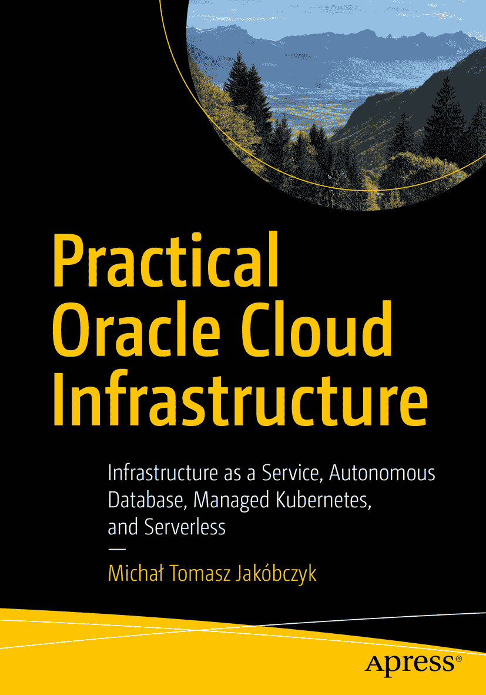

# 实战 Oracle Cloud Infrastructure

ISBN 978-1-4842-5505-6
e-ISBN 978-1-4842-5506-3
[`doi.org/10.1007/978-1-4842-5506-3`](https://doi.org/10.1007/978-1-4842-5506-3)
© Michał Tomasz Jakóbczyk 2020

本作品受版权保护。出版商保留所有权利，无论是材料的全部还是部分，特别是翻译、转载、插图重用、朗诵、广播、缩微胶片或其他任何物理方式的复制，以及信息存储和检索、电子改编、计算机软件，或目前已知或未来开发的类似或不同方法的传播权利。本书中可能出现商标名称、标识和图像。我们并非在每次出现商标名称、标识和图像时都使用商标符号，而是仅以编辑方式使用这些名称、标识和图像，旨在为商标所有者谋利，绝无侵犯商标权之意。本书中使用的商品名称、商标、服务标识及类似术语，即使未特别标识，也不应被视作表达其是否受专有权约束的意见。尽管本书中的建议和信息在出版时被认为是真实准确的，但作者、编辑或出版商均不对任何可能存在的错误或遗漏承担法律责任。出版商对本出版物所含材料不作任何明示或暗示的保证。

本书在全球图书贸易中由 Springer Science+Business Media New York 发行，地址：233 Spring Street, 6th Floor, New York, NY 10013。电话：1-800-SPRINGER，传真：(201) 348-4505，电子邮件：orders-ny@springer-sbm.com，或访问网站 www.springeronline.com。Apress Media, LLC 是一家加利福尼亚州的有限责任公司，其唯一成员（所有者）是 Springer Science + Business Media Finance Inc (SSBM Finance Inc)。SSBM Finance Inc 是一家特拉华州的公司。

*献给我的家人、朋友和同事*

