# 1. Oracle Cloud Infrastructure 简介

技术在不断演进，如今已成为我们日常生活的基石之一。计算机化、数字化和互联网将我们带入了身处的`信息时代`。如今，几乎所有类型的业务都离不开信息技术来生存和发展。软件被用于服务于各种各样的业务、技术和工业流程，而硬件则用于运行软件、存储数据并提供互联互通。

在这个信息时代，我们使用技术的方式经历了数次转折点。其中之一是`开源`运动的出现和传播，它激发了全球社区以前所未有的速度构建新的工具、平台和应用程序。源代码的自由分发和透明性使得通过创建衍生作品和复用现有组件来更快地交付解决方案成为可能。最初被视为黑客文化一部分和利基市场的事物，最终被企业和大型组织所采纳。

面向业务的`云计算`的到来是另一个转折点。这一次，变革的主题是对硬件和软件系统进行整体感知和使用的方式。本章将逐步解释这一论断，并作为你的指南，介绍与云计算相关的最重要概念。此外，它还将向你介绍 Oracle Cloud Infrastructure，这是 Oracle 的基础设施即服务（`IaaS`）公有云平台，提供计算、存储和网络功能。它还托管各种平台即服务（`PaaS`）能力，例如全托管的 Oracle 自动数据库、容器编排引擎、无服务器计算等。

## 云计算的特性

如今，运营企业涉及流程自动化。单个业务流程可以由计划的活动、用户交互、数据转换、外部系统调用甚至机器控制组成。它通常涉及许多我们称为`软件`的计算机程序。软件运行在硬件上——至少在理论上是这样。

### 硬件与虚拟资源

与软件相反，硬件占用物理空间，需要适当的冷却和可靠的电源供应。在传统模式中，小型企业将其后端设备放置在通常位于现场的服务器机房中。对于中型和大型公司，他们的本地服务器机房用作网络连接点，连接到运行生产后端系统的远程数据中心。该组织仍然管理自己的设备，但在专业的第三方数据中心（该中心也服务其他客户）租用服务器空间、供电容量和网络资源（如公共 IP 地址、网络吞吐量、专线）。这被称为数据中心`托管`模式。或者，一个组织可以投资建设完全自有的数据中心，这通常会带来最大的成本。总而言之，传统模式涉及相对较大的`资本支出`，包括用于购买和维护设备等固定资产的资金。

真正重要的不是硬件本身，而是应用程序可用的计算能力、存储和网络`资源`。总之，软件需要以高效的方式处理其业务逻辑；将其数据持久化到可靠、故障安全的存储中；并连接到它必须与之交互的任何外部系统。通常，软件是在虚拟化硬件还是专用物理硬件上运行并不重要。事实上，许多不相关的计算机程序可以在启动于同一物理机架服务器上的各个虚拟机中执行。

从管理角度来看，将硬件实体（如 CPU、内存或存储）以某种方式与物理硬件解耦，表示为汇集在一起并准备好分配给多个应用程序和系统使用的计算实例的`虚拟硬件资源`，这样要方便得多。这些应用程序和系统属于各种项目和不同租户（云账户）。图 1-1 通过图示展示了这一概念。

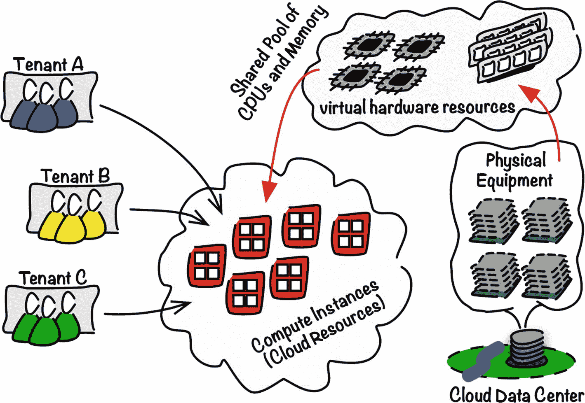

图 1-1：虚拟资源与硬件

### 云计算的定义

有些人错误地认为云计算和公有云是一回事。事实并非如此。你可以使用自己的硬件基础设施来采用`云计算方法`。让我们看看我最喜欢的两个定义。

美国国家标准与技术研究院（`NIST`）提出了一个定义，在我看来，它突显了云计算的本质。

> `云计算`*是一种模型，用于实现对* ***共享资源池中*** *可配置计算***资源***（例如，网络、服务器、存储、应用程序和服务）的泛在、便捷、按需的网络访问，这些资源能够* ***以最小的管理 effort 或服务提供商交互快速配置和释放***。*该云模型由五个基本特征、三种服务模型和四种部署模型组成。*¹

`Gartner` 是一家著名的研究和咨询公司，提出了另一个定义，指出了两个进一步的特征（强调为后加）。

> *`Gartner`将云计算定义为一种计算风格，其中* ***可扩展且弹性的 IT 启用能力作为服务*** *通过互联网技术交付。*²

在共享池中可用的 IT 资源的快速配置是云计算的基本属性之一。这种`快速配置`通过缩短任何不必要的等待时间来提高生产力，通过底层自动化的可重复性消除可能的错误，并最终实现成本节约。不再使用的资源可能返回到`共享池`，这允许其他项目重复使用它们，从而优化整体资源分配。由资源可扩展性提供的`弹性`是优化资源使用的关键因素。此外，它可以通过允许计算机系统对意外故障做出反应并改变性能足迹来帮助提高稳健性。紧密相关的资源类型，例如计算、网络、不同类型的存储等，被分组在一起并作为 Web 服务提供。图 1-2 说明了云计算的关键特性。

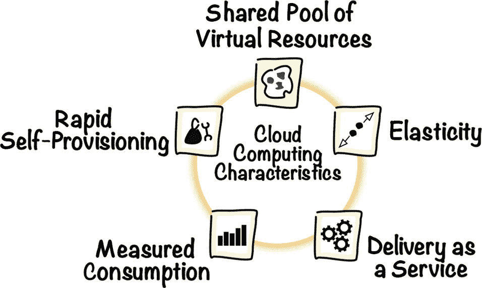

图 1-2：云计算关键特性

接下来的章节将更详细地描述这些特性。但首先让我们更仔细地看看`provisioning`这个词的实际含义。

### 配置

牛津词典将动词`to provision`定义为“为使用而提供或供应某物的动作”。嗯，`action`（动作）这个词听起来可能有点过于细化。在现实世界中，提供资源总是与某种过程相关联。

## 传统配置流程

对于一个现有的数据中心站点，基础设施配置流程通常始于一个经过评审和批准的请求，该请求最终会成为订单。在这初始步骤之前，会进行相关的容量规划工作，以确定数据中心扩建部分真正需要的设备和软件。如果我们库存中有所有请求的硬件组件和软件许可证，那我们很幸运。订单履行就可以开始了。我们需要获取硬件组件；在资产目录中登记每一个组件，通常包括它们的关联信息；然后安装、配置、连接它们，并启用它们以供使用。

如果我们仍然需要采购设备，情况可能会稍微复杂一些。首先，采购本身可能需要多级审批，这会花费更多时间。其次，配置流程还涉及采购活动。除非我们的公司使用了自动化的从采购到付款解决方案，否则所有步骤，如选择供应商、根据政策核对合同、下订单、提交会计发票和处理付款，都会涉及大量冗长的人工活动。总而言之，这需要花钱并且可能耗费大量时间。

现在设想一下，我们负责管理一个供公司内部使用的小型数据中心的资源。如果要求我们尽快为其中一个开发团队启动一个全新的环境，会发生什么？如果我们遵循传统方法，漫长的流程就会启动。首先，我们会客气地请我们的同事进行容量规划以评估他们的需求，并填写将成为审批对象的请求。一旦收集到所有审批，我们会检查设备是否有库存，并为缺失的组件启动采购子流程。除非我们使用了集成良好的从采购到付款的业务软件，否则采购子流程本身可能需要大量时间，最终采购订单才能履行。图 1-3 使用标准的`BPMN`来概述传统配置流程。

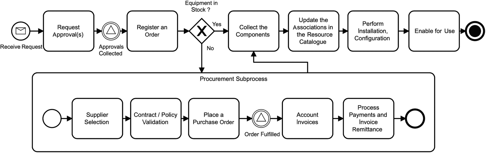

图 1-3：传统配置流程

## 快速自配置流程

在云计算的世界里，`配置`这个词经常在启动新的资源实例时遇到，指的是你的虚拟资源所处的状态。来自`NIST`的定义强调在最少的服务提供商交互下实现快速配置。这就是关键。最少的服务提供商交互意味着无需提交工单并等待管理员团队为你半手动地设置资源。相反，这个过程是全自动的，一旦你触发实例启动，订单将根据你的权限和配额（也称为`服务限制`）进行验证，然后传递给快速配置引擎。该引擎将使用各种配置文件和模板来启动和配置资源。图 1-4 概述了自配置流程。

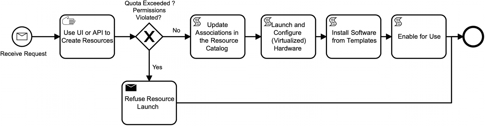

图 1-4：快速自配置

实际上，我们可以说脚本化配置并非新事物。这在几年间已成为标准，并且每年都越来越受欢迎。例如，我们可以选择`Ansible`，并利用其基于剧本的无代理自动化来并行在多个服务器上安装软件栈。这样，我们不仅加快了速度，还允许自动化在多台机器上执行相同的任务，降低了出错风险。这已经是许多管理员完成日常任务的方式。你自动化的程度越高，花在可重复任务上的时间就越少。绝大多数操作员仍然将其自动化范围限制在软件栈的部署上。硬件似乎仍然需要相当程度的手动处理。嗯，你仍然需要将线缆插入交换机或启动一台新机器，不是吗？而快速自配置，则需要对硬件和软件组件都实现完整的端到端自动化。然而，硬件配置自动化似乎并不容易。尽管使用`预启动执行环境`进行远程裸机启动是完全可行的，但我们如今越来越依赖于虚拟化的资源池。虚拟化使得快速资源配置变得容易得多。

## 弹性与可扩展性

一个`弹性`物体在被拉伸（或挤压）后能够自行恢复到原来的形状。因此，这样的物体对环境变化具有很强的适应性。如果一个 Web 应用程序能够处理意外的入站流量请求高峰，那么它可以被认为是高度适应性强或弹性的。如果一个后端数据仓库提取-转换-加载引擎能够应对突然的、异常大量的传入数据负载，那么它也被认为是非常弹性或适应性强的。

计算机系统的弹性可以通过底层资源的`可扩展性`来实现。对于一个现代的、无状态的 Web 应用程序，可以通过在额外的虚拟机上启动容器来增加暴露 API 并封装其请求处理实现逻辑的容器数量。这个操作会扩大集群的整体计算能力。换句话说，通过向集群中添加更多相同大小的主机实例来运行更多的应用程序容器，从而提高整个系统的吞吐量。这被称为`水平扩展`。对于后端的`ETL`引擎，可以增加用于暂存区的连接块存储单元的总容量。换句话说，我们会为每台机器添加更多的硬件资源，例如块卷，而保持机器数量不变。这被称为`垂直扩展`。图 1-5 展示了这两种资源扩展类型。

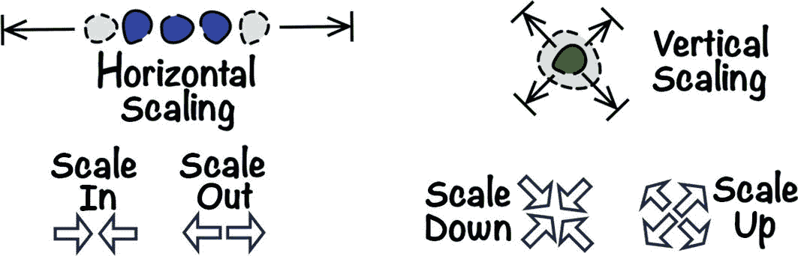

图 1-5：垂直和水平可扩展性

如果我们只考虑软件架构，`垂直扩展`乍一看通常被认为更容易、更有吸引力。如果你将应用程序迁移到一台拥有更多 CPU 的更强大的机器上，或者只是在现有应用程序主机上扩展内存，软件会立即或在快速重启后识别到新的硬件资源。在大多数情况下，不需要重新配置应用程序。然而，这种方法有一个主要痛点。你无法无限地扩展单台机器。硬件可用性总是有限制的，因为物理机甚至虚拟化资源池都有其极限。

`水平扩展`确实看起来似乎是无限的。理论上，我们可以通过添加新机器来无限地扩展集群。水平扩展的这个关键优势是以所需的集群管理为代价的。分布式计算机系统必须以一种可以向外扩展的方式专门设计。它们必须能够处理作为集群节点的机器之间的同步和复制。

如果一个计算机系统所使用的资源能够根据变化的需求动态分配和释放，使其性能始终保持稳定，那么这个系统才是真正弹性的。在实践中，这种`自动扩展`只有通过水平扩展才能实现。

## 交付即服务

如果你参考 Gartner 的定义，你会发现 IT 能力被表述为一种服务来交付。要理解其含义，以及它如何与在共享资源池中快速供应资源的理念相契合，让我们从共享资源池的概念开始。

购买计算机硬件这类商品与资本性支出相关。理论上，如果一个项目团队需要一台新服务器，他们可以购买一台。这样的投资会产生一笔开支，必须在项目预算中予以考虑并妥善核算。然而，这并非一种灵活的方式。因为拥有资产，项目团队必须负责维护该资产的整个生命周期直至其退役。一个高度专业化的任务团队通常既没有相关人员，也没有时间来做这件事。

有时，你需要一组额外的机器只是为了执行一项有时间限制的特定任务。例如，你可能需要每季度仅在几周内，在一个专用环境中进行负载与性能或验收测试。如果你购买了设备，它可能在其他时间都处于闲置状态，除非你能设法将其归还给其他项目团队可用的资源池。`共享资源池`中的所有资源，都可以仅在真正需要时以按量使用的方式被利用，从而最大限度地减少其空闲时间。项目团队将不再拥有任何硬件，而是根据资源的计量使用情况从其成本中心收费。从项目团队的角度来看，这不过是一项产生运营性支出的服务。此外，不拥有硬件意味着无需进行资产管理，或者使资产管理变得更为容易。

用于支撑虚拟云资源的共享资源池的硬件，仍然会产生成本，通常由负责维护它的实体承担。这些成本最终会分摊到使用了这些虚拟资源的项目团队。为了根据每个云消费者的实际使用情况进行成本分摊，必须对虚拟资源的消耗进行计量。

对于一个大型组织而言，将`自助式`服务作为其流程的核心部分可以节省大量精力，并消除不必要的等待时间。它提升了项目团队和被赋能的个人的工作效率，让他们能够自主处理事务。项目团队将能够自行供应所需的各种类型资源（计算、存储、网络等），以自动化方式扩展资源直至系统性能满足要求，并在资源不再使用时立即将其归还至资源池。只有当资源池管理系统提供了一个用于监管资源的界面时，自助式服务才成为可能。项目团队，即`服务消费者`，通过应用程序编程接口（`API`）来供应、管理和监控资源。

## API

在早期，`API`通常被理解为一组封装起来以便在库中复用的编程语言函数。程序员会在代码中通过函数头来调用这些函数。随后，计算机程序的二进制文件会链接到一个动态链接库（`.dll`或`.so`）来执行`API`函数的实现。随着计算机系统变得越来越分布式和互联，`API`获得了另一层含义，这次与远程过程调用和 Web 服务相关。两种用于 Web 服务的生产级`API`风格是简单对象访问协议（`SOAP`）和具象状态传输（`REST`）。让我们简要探讨一下它们。

### SOAP API

简单对象访问协议是一个成熟的标准，它定义了一个基于角色的、多节点分布式处理模型，包括初始发送方、可选的中间方和最终接收方。消息交换操作及其有效载荷结构在合约中定义。有效载荷通常采用严格模式的`XML`格式，确保消息格式符合合约。基于`SOAP`的 Web 服务合约在 Web 服务描述语言（`WSDL`）文件中定义。当前版本（`SOAP 1.2`）于 2007 年被 W3C 在一份名为 W3C 推荐标准的文件中标准化。该协议的初始草案作为`SOAP 1.1`于 2000 年在一份 W3C 注释中提交供讨论。在`SOAP`中，重点在于自定义操作和严格模式的`XML`数据交换。`API`使用定义良好的`WSDL`格式进行设计。`SOAP`被设计为与传输方式无关。两种最主要的传输方式是`HTTP`和 Java 消息服务（`JMS`）。清单 1-1 展示了一个通过`HTTP`传输发送的`SOAP`请求的简化示例。

```
POST /crm/shipmentService HTTP/1.1
Host: 192.168.10.15:8081
Content-Type: text/xml;charset=UTF-8
SOAPAction: "http://example.com/crm/shipments/search"

WAW
FRA
2018-06-25
2018-06-28

清单 1-1
HTTP 传输中的 SOAP 请求示例
```

### REST API

`REST`代表具象状态传输，自 2000 年以来一直是一个计算机科学术语。它由罗伊·菲尔丁在其关于基于网络的软件架构的博士论文中提出。罗伊写道：

> `REST`中信息的关键抽象是`资源`。任何可以被命名的信息都可以是一个资源：一份文档或图片、一项临时性服务（例如“洛杉矶今日天气”）、其他资源的集合、一个非虚拟对象（例如一个人），等等。⁴

当代的`RESTful`服务专注于资源生命周期事件（创建、更新、删除和读取访问），这些事件由相应的`HTTP`方法（`PUT`、`POST`、`DELETE`、`GET`）表示。最自然的资源是业务实体，如发货单、发票或销售线索。然而，没有任何类似实体意义的业务流程，例如订单履行、工时表提交，甚至像高级搜索这样的非功能性流程，也可以被表示为`REST`资源。这样，我们就可以触发（通常使用`HTTP POST`）和跟踪（通常使用`HTTP GET`）这些流程。有趣的是，在`REST`中，我们通常避免使用“合约”这个词，而只是谈论“API 设计”。与`SOAP`及其`WSDL`合约相反，定义`REST API`的方式不止一种。最初缺乏官方标准，促使了一种自由市场式的竞争，以寻找设计`API`的最流行方式。首个（某种程度上是间接的）尝试为`REST API`设计引入标准的是 Web 应用描述语言（`WADL`），其规范⁵于 2009 年由 Sun Microsystems 提交给 W3C。两年后，Swagger 套件诞生，并与 RAML 和 API Blueprint 一起主导了`API`设计领域。2015 年，OpenAPI 倡议在 Linux 基金会诞生，其目标是创建和维护终极的`API`设计标准。这个标准被称为 OpenAPI⁶，它基于 Swagger。

用于`REST API`的最流行的有效载荷格式是 JavaScript 对象表示法（`JSON`），但在请求或响应正文中使用`XML`或纯文本也没有任何问题。对于某些资源生命周期事件，完全依赖`HTTP`状态码而无需任何有效载荷是合理的。清单 1-2 展示了一个调用负责高级搜索的非功能性流程资源的示例。有效载荷携带了以`JSON`格式序列化的搜索条件。`URL`定义了执行搜索操作所针对的资源。

```
POST /crm/search/shipments HTTP/1.1
Host: 192.168.10.15:8081
Content-Type: application/json;charset=UTF-8
Accept: application/json
{
"route": {
"origin":"WAW",
"destination":"FRA"
},
"postingPeriod": {
"from": "2018-06-25",
"to": "2018-06-28"
}
}
清单 1-2
REST 调用示例
```


结构清晰、基于契约、面向企业但有些臃肿的 SOAP API，正逐渐被轻量且相当自然的 REST API 所取代。确实，绝大多数用例都可以通过 REST API 实现，其成本远低于 SOAP。此外，REST 无疑是中小企业新项目、软件即服务（SaaS）API、物联网边缘以及大规模容器驱动的后端系统的首选。各种 API 网关以及 API 管理平台都将 REST 定位为 API 管理环境下的默认风格。这些套件通常仍然支持 SOAP，仅仅是因为其部署广泛，并且将在企业中继续使用一段时间，特别是在后端采用企业服务总线（`ESB`）的传统面向服务架构部署中。然而，API 演进的未来并不止于 REST API。值得关注的是`GraphQL`，可以说它构建于 REST 之上，引入了面向查询的 API 概念，兼具灵活性与轻量级的特点。图 1-6 展示了 API 的演进历程。

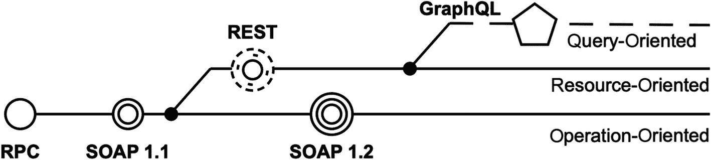
图 1-6：API 的演进

`gRPC`则采取了略有不同的演进方向。从设计上讲，这种远程过程调用（`RPC`）框架旨在实现机器可读且与编程语言无关。你通常使用协议缓冲区来定义 API，这种方式比在 SOAP 中使用`WSDL/XSD`更紧凑地同时指定服务和数据结构。有许多代码生成器可以获取这些定义，并为客户端和服务器生成各种编程语言的代码桩。`gRPC`非常适合高性能消息传递，这归功于其线路上使用的紧凑二进制格式以及`HTTP/2`特性集。其采用仍处于相对早期阶段，主要关注内部 API，但我们可能会达到这样一个节点：部分面向公众的 API 逐渐迁移到`gRPC`。这可能从涉及流式传输或低功耗物联网设备的 API 开始。

## 云管理平面

API 为何重要？如果我们想将云计算应用于自己的硬件，就需要一个系统来管理资源池、实现快速自服务供应，并允许虚拟机水平扩展。这样的系统，我们称之为`云管理平面`，必须提供一个可供项目团队自助使用的 API。REST 风格非常适合云计算，因为云能力（我们将在下一节讨论）可以轻松地被视为一等 REST 资源。当你管理云资源时，很少直接进行 API 调用。通常，API 是通过 Web 控制台、针对各种语言的软件开发工具包（`SDK`）、命令行界面或类似`Terraform`的基础设施即代码软件来使用的。在所有这些情况下，API 调用都是在后台构建和发送的。你只需提供所需的输入即可。图 1-7 概述了消费 Oracle Cloud Infrastructure（`OCI`）API 的各种方式。更多相关内容将在第 3 章中介绍。

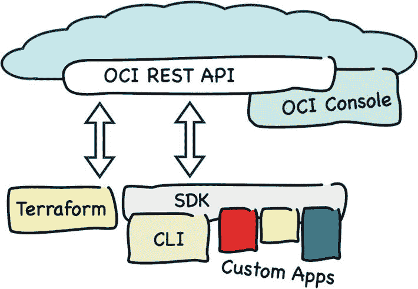
图 1-7：云管理平面 API 生态系统

到目前为止，参考我最喜欢的两个云计算定义，我们已经探讨了云计算的关键特性。我们分析了快速自服务供应与传统供应模型的区别。接着，我们简要讨论了如何通过可扩展性来实现弹性。最后，我们了解了现代 API 在将资源作为服务交付方面所起的关键作用。现在，让我们来探索每个基础设施云必须提供的四种核心 IT 能力。

## 核心云能力

在云中，你使用虚拟的`云资源`来构建解决方案，这些资源类似于为软件运行提供物理平台的硬件设备。云资源有不同的类型。有些云资源类型旨在严格与其他类型的云资源结合使用。例如，`路由规则表`是一种云资源类型，它始终存在于`虚拟云网络`云资源中。它们与少数其他云资源类型一起，被视为同一个`云能力`的一部分，这个术语更常被称为一个独立的`云服务`。单个云资源类型如何组合在一起，取决于特定云提供商的选择。通常，无论云提供商是全球性的还是小众的，你都会看到四种核心云能力通常被引用为云服务。

*   计算
*   网络
*   存储
*   身份与访问管理

这四种核心云计算能力提供的资源，在后台通常被用作构建块，以交付进一步的基础设施和平台能力，例如：

*   容器编排
*   托管数据库
*   无服务器计算

现在，我们将简要了解这四种核心云计算能力。


### 计算

执行程序和处理信息通常被视为计算活动，并被认为是运行在当代云计算平台上的解决方案最重要的两项任务。执行这些活动的一种方式是在虚拟主机上运行软件，这些虚拟主机也被称为*计算实例*。您可以将这些实例想象成运行在数据中心、由特定云提供商管理的计算机。您可以单独或使用实例池分组来配置这些实例。您可以建立安全外壳（SSH）或远程桌面（RDP）连接来远程管理它们或它们托管的软件。

云中的绝大多数计算实例都是*虚拟机*（VM）。属于不同云租户（账户）的多个虚拟机可能运行在同一台物理服务器上。这被称为*多租户*。多个租户最终共享相同的物理设备，甚至在不知情的情况下，以利用共享经济的原理。使用虚拟机使云提供商更容易在共享池中向客户提供更精细的计算资源。需要更高性能计算（HPC）或使用与虚拟化配合不佳的系统的更苛刻客户，通常更愿意在不涉及多租户和虚拟机监控程序的专用主机上部署他们的解决方案。因此，他们选择*裸金属*（BM）计算实例，这类实例不使用任何虚拟机监控程序，并且在使用期间专用于单个云账户。需要在此阶段说明的是，并非所有云提供商都支持裸金属机器。Oracle Cloud Infrastructure 支持。图 1-8 说明了虚拟机和裸金属机器之间的区别。


**图 1-8**

裸金属机器 vs. 虚拟机

在配置实例之前，无论它是虚拟机还是裸金属机器，您都需要做出两个基本选择。计算实例的初始配置通常通过选择以下内容完成：

*   硬件配置文件

*   预装软件

*硬件配置文件*定义了为新配置的计算实例提供的元素，例如 CPU 核心数、内存大小或安装基础软件的主块存储设备上的磁盘空间。配置文件的选择将决定实例是在虚拟机上运行还是在专用的裸金属主机上运行。每个云提供商通常都提供广泛的硬件配置文件供您为计划启动的实例选择。根据云提供商的不同，您可能会遇到硬件配置文件的不同名称，例如：

*   Shape

*   Flavor

*   Instance type

*   Size

Oracle Cloud Infrastructure 计算使用 *shape* 作为计算实例的硬件配置文件名称。

*预装软件堆栈*通常被称为*镜像*。首先，它必须包含一个操作系统。云提供商倾向于只提供少数几个操作系统发行版，但这些选项通常足以满足您的需求。一些大型云提供商甚至可能提供基于流行发行版的、他们自己的品牌 Linux 版本。在使用品牌化、供应商提供的操作系统发行版运行的计算实例上部署您的云解决方案，通常可以让您受益于对操作系统问题和故障的专业支持。为了在您的架构和基础设施脚本中应用重用原则，您可能会使用在操作系统之上附带一些额外预装软件的镜像。例如，您可以使用一个已经包含预装 HTTP 服务器、CI/CD 工具链、您选择的应用程序运行时，甚至是一个可直接启动的应用程序节点的镜像来启动您的实例。您从哪里获得这类镜像呢？一种选择是直接从您的云提供商或构建和维护此类镜像的合作伙伴公司获取。通常，来自这两个来源的一些镜像会提供在由您的提供商维护的名为云*市场*的位置。另一种选择是完全自行构建*自定义镜像*。这种方法让您能够控制镜像的构建方式。您可以通过手动操作（一次性活动）或自动化整个过程来创建自定义镜像。对于后者，您需要编写一个脚本：使用特定的操作系统镜像启动一个临时的计算实例，安装您选择的软件，基于该计算实例创建一个新的自定义镜像，最后终止这个临时实例。这项任务可以使用一个名为 **HashiCorp Packer** 的开源工具及其 **Oracle Builder (oracle-oci)** 组件来执行。这项初期努力将会得到回报，特别是如果您遵循这样的策略：始终使用最新的软件版本重新配置计算实例，而不是在最初使用旧版本软件构建的实例上增量应用补丁。

在计算能力的背景下，水平扩展通常意味着随着计算能力需求的增长或缩小而改变计算实例的数量。更准确地说，整个扩展过程更侧重于托管在这些实例上的应用程序节点。由于应用程序节点之间的相似性，计算实例通常基于相同的带有预装软件和相同启动脚本集的自定义镜像。镜像和启动脚本的组合，再加上关于实例形状（硬件配置文件）或 SSH 密钥的少量其他配置选择，可以具体化为另一种称为*实例配置*的云资源。然后，这种资源可用于启动和管理称为*实例池*的可扩展实例组。

如您所见，计算能力旨在提供资源，让您能够以类似于使用物理计算机的方式运行您的软件。与数据处理密切相关的一个方面是存储这些数据。我们现在将讨论存储。


### 存储

如果无法持久化保存输入和结果，任何计算处理都将失去意义。不同类型的数据遵循不同的生命周期，最终导致需求各异。接下来将介绍多种云资源类型，它们被用于满足不同的存储目标。如果我们暂时跳过更上层的数据库存储，就可以讨论`存储能力`。我们通常将这种能力分解为三组存储资源类型。

*   对象存储
*   块存储
*   文件存储

#### 对象存储

*对象存储*旨在存储任意数量、任意类型的数据，并提供冗余、完整性、数据加密和多种访问方式。文件等数据实体被视为独立的`对象`，它们被分组在一个类似文件夹的层级结构中，称为`桶`。访问策略保护着存储的对象，决定谁可以访问它们以及允许执行哪些操作。数据在静态时被加密，冗余副本分布在所选区域内的各个数据中心。我们通常根据访问频率区分两种类型的对象存储。

*   标准`对象存储`，提供即时、快速的数据访问。
*   `归档存储`，以更便宜的方式保存数据，代价是需要等待数小时或更长时间才能检索数据。

通过使用生命周期策略，可以将很少访问的对象移动到归档存储等生命周期方面实现自动化。你通常会在对象存储桶中持久化保存哪些类型的数据？这类数据的范围很广，从应用程序日志、数据库备份，到作为内容分发网络一部分存储的数据，再到需要安全存储较长时间以符合法规要求的大型业务数据归档。

#### 块存储

*块存储*与对象存储相反，在计算能力的背景下扮演着辅助角色，尽管我们将块卷、卷组或备份策略等资源归类为存储能力。这里主要的云资源类型是`块卷`。你可以将其视为一个具有自身生命周期的非易失性存储盘，但它只有与虚拟机或裸机等计算实例一起使用才有意义。实际上，在配置新的块卷时，并不会发生什么特别的事情。一个新的块卷的生命始于你将其附加到计算实例、创建文件系统并挂载它的那一刻。从这一刻起，你就可以将该卷用作计算实例的附加磁盘。事实上，根据你在实例上托管的应用程序，你可能会将所有应用程序数据存储在此卷上，而不是使用每个计算实例从一开始就有的启动卷。当然，如果你正在设计一个新的云解决方案，你可能会选择另一种类型的云资源，例如对象存储或托管数据库来存储应用程序数据。然而，你仍然会发现许多不同类型的应用程序，尤其是传统应用程序，使用可附加的块存储卷会获益更多。

进一步说，我们可以区分块存储卷附加到计算实例的两种方式。

*   通过 IP 网络远程附加。
*   直接附加到物理机器。

服务器与远程附加卷之间的互连性通常使用`互联网小型计算机系统接口（iSCSI）协议`来处理，该协议在 RFC7143 中标准化。

> `小型计算机系统接口（SCSI）`是用于与 I/O 设备（尤其是存储设备）通信的一系列流行协议。(…) iSCSI 协议(…)描述了一种通过 TCP/IP 传输 SCSI 数据包的方法。⁷

直接附加到物理机器的存储卷极大地受益于磁盘操作不涉及任何网络通信这一事实。结合基于闪存的固态硬盘（SSD）设备和非易失性内存快速（NVMe）协议（该协议通过多个 I/O 命令队列增强了块访问并发性），我们获得了惊人的性能，以每秒输入/输出操作数（IOPS）衡量。尽管如此，这种设置对可以附加到实例的存储卷数量施加了限制。

根据使用模式，一些块卷，特别是那些用作持久数据存储的卷，应该定期备份。时间点备份通常称为`快照`。这些中间状态可以是完全备份或增量备份。后者跟踪自上次备份或卷创建以来的更改。策略可用于驱动自动、按计划的卷备份创建。在未挂载卷上拍摄的快照称为`冷备份`。在这种情况下，在备份操作进行期间，该卷无法使用。对仍在使用中的卷拍摄快照称为`热备份`。在大多数情况下，块卷备份会持久化保存到高可用的对象存储中。你可以对归档的快照做什么？通常有几种选项，例如恢复卷、克隆到或移动到不同的云区域。

本章前面我们提到了垂直扩展和水平扩展的含义和作用。如果你考虑`垂直扩展`，你会发现两种适用于块卷的模式。首先，你应该能够通过增加其大小来垂直扩展块卷。其次，将所有应用程序数据存储在远程附加的块卷上，使得用具有更多 CPU 或内存的更强大配置的新计算实例替换旧实例变得相对容易，因为你只需要将卷重新附加到新实例。这个操作可以被视为对计算实例进行垂直扩展。

最后，我想提到一点，块卷可以选择以只读方式附加。如果你只是想附加一个卷来浏览文件系统，确保不会意外写入任何内容，这种可能性非常方便。

#### 文件存储

块存储设备通常设计为一次只能附加到一个计算实例，而`文件存储`则旨在支持多个计算实例之间面向文件的数据交换。当这些传统系统利用基于文件共享状态的活动-被动高可用性时，这一点尤其有用。共享文件存储能力可以使用网络文件系统（NFS）协议实现，该协议由 Sun Microsystems 于 1989 年在 RFC1094 中引入。

> `Sun 网络文件系统（NFS）协议`提供跨网络对共享文件的透明远程访问。NFS 协议设计为可跨不同机器、操作系统、网络架构和传输协议移植。(…) NFS 假定文件系统是分层的，目录是除底层文件外的所有级别。⁸

自推出以来，该协议已从版本 3（1995 年的 RFC1813）发展到版本 4（2015 年的 RFC7530）。或者，一些提供商使用通用互联网文件服务（CIFS）的后继者，即服务器消息块（SMB）协议，来提供相同的共享文件存储能力。


从用户的角度来看，共享文件系统的挂载方式与块卷上的文件系统类似。但底层机制完全不同，并且根据所选协议的不同，我们可能会遇到一些限制或面临更高的复杂性。基于共享文件系统设计解决方案时，通常需要关注正确的权限检查和并发文件访问问题。这在很大程度上取决于所使用的操作系统和网络协议。例如，网络文件系统 4 (`NFS4`) 引入了原生文件锁定机制，而基于 `NFS3` 的解决方案则必须依赖额外的网络锁管理器。

在设计新的云解决方案或计划将现有传统系统从本地环境进行“搬迁式迁移”到云端时，你很可能会混合使用本节概述的三种存储类型。在讨论了计算和存储能力之后，我们将转向第三大核心云计算能力，即提供虚拟网络资源。

### 网络

在多层或分布式架构中，软件解决方案通常由多种类型的应用节点组成，这些节点通过以下方式与其他节点协作：

*   通过 Web 接口（也称为 `APIs`）暴露其服务
*   远程消费其他服务提供的功能
*   维持与组成集群的其他节点的连接
*   访问外部依赖项，例如数据库或消息代理

用于提供 `虚拟网络` 的云资源，如网络、子网、路由表、安全规则或不同类型的网关，在概念上可能与传统的基于硬件网络的构建块相似。然而，它们在配置方式上得到了极大简化。软件定义网络 (`SDN`) 在云计算中扮演着重要角色。云基础设施可被视为一种支持 `SDN` 的基础设施，它让你能够创建和终止名为 `虚拟云网络` (`VCN`) 的隔离虚拟覆盖网络，将其细分为 `子网`，并用于为你的计算实例和其他云资源部署各种网络模式。以下被视为网络能力一部分的云资源：

*   `虚拟云网络及其子网`
*   `预留的公共 IP 地址`
*   `安全列表和安全规则`
*   `各种类型的网关`
*   `路由表和路由规则`
*   `负载均衡器`
*   `用于提供 VPN 功能的虚拟设备`
*   `DNS 区域`
*   `Web 应用程序防火墙 (WAF) 策略`

精心规划虚拟网络是为你的云基础设施交付健壮安全模型，并同样保护你的基于云解决方案的关键部分。通常，设计过程从创建一个 `虚拟云网络` 并分配一个将在该网络内使用的私有 `IP 地址` 范围开始。通常，单个云账户可以包含多个 `VCN`，其中一些完全隔离，而另一些则相互连接。为了使你的基础设施组织良好，你将在另一种称为 `VCN 子网` 的云资源内配置计算实例。`VCN 子网` 本质上上是在特定 `虚拟云网络` 上进行逻辑细分的产物。你配置的每个计算实例都必须通过一种称为 `虚拟网卡` (`vNIC`) 的云资源分配给一个或多个 `子网`。连接到 `公共子网` 的 `vNIC` 可以分配一个 `公共 IP 地址`，从而可以从互联网访问。云提供商拥有 `公共 IP 地址` 池。通常，`公共子网` 中的计算实例可以使用从这些池中动态分配的 `公共 IP 地址`。当计算实例终止时，该实例使用的 `公共 IP 地址` 将返回到池中，以后可以附加到完全不同的计算实例，甚至是另一个云客户拥有的实例。如果你需要对 `公共 IP 地址` 进行更多控制，可以受益于一种称为 `预留公共 IP 地址` 的云资源。`预留地址` 始终分配给你的云账户，无论它是否分配给实例，并且允许你在实例之间重新分配它。指定为 `私有子网` 的子网禁止其中的实例附加 `公共 IP 地址`。`安全列表` 存储 `安全规则`，这些规则在数据包到达计算实例之前增加了一层软件定义防火墙的强制执行。这些 `安全规则` 的基本作用是验证给定 `IP 地址` 和端口的流量是否确实允许通过。另一方面，`路由规则` 用于正确引导 `VCN` 出站流量，并允许数据包到达其下一跳，这通常是某种 `网关`，例如互联网网关、服务网关或对等网关。各种 `网关`、`路由规则`、`安全规则` 和 `私有子网` 的正确组合将使你能够严格监督网络，并只允许预期的流量进出这些 `子网`。`负载均衡器` 用于将传入流量均匀分配到分组到所谓后端集中的实例。它们使你能够为基础设施引入高可用性以实现容错，或者将应用程序集群横向扩展以实现增加的请求处理吞吐量。某些云解决方案可能需要访问传统本地网络中可用的系统和数据。要将你的 `虚拟云网络` 与数据中心内的私有网络连接，你可以使用 `IPSec VPN`（通过公共互联网隧道传输流量），或者利用专用私有连接（在 Oracle Cloud 中称为 `FastConnect`）。在后一种情况下，你的本地数据中心将直接连接到特定的 Oracle Cloud 数据中心，或者通过最近的 `FastConnect 连接合作伙伴` 连接，该合作伙伴维护与 Oracle Cloud 数据中心的物理连接。无论 `IPSec VPN` 还是 `FastConnect`，你都必须创建一个称为 `动态路由网关` (`DRG`) 的云资源，将其附加到你选择的 `VCN`，并通过创建新的 `路由规则` 来更改 `VCN` `路由表`。该 `路由规则` 将把 `DRG` 设置为寻址到你本地网络段所用 `IP 地址` 范围的出站流量的目的地。`DNS 区域` 允许你在 Oracle Cloud `DNS` 服务器中维护你拥有的 Web 域，并详细管理域区域，例如创建自定义 `DNS` 记录。为了完善你的云网络工具包，可以利用 `Web 应用程序防火墙` (`WAF`) 来保护面向互联网的应用程序端点免受恶意和不必要的入站流量攻击。`WAF` 拥有超过 200 条预定义规则，只需选择性地进行配置和启用。你将在 `DNS` 中管理的域名记录重定向到 `WAF` 端点。如果流量符合为特定端点启用的 `WAF` 策略，流量将被放行以到达应用程序端点。

云资源是各种管理操作的对象，这些操作只能由经过认证和授权的用户执行。这引导我们进入下一节，了解第四大云计算能力共同解决的安全主题。


### 身份与访问管理

`身份与访问管理`指的是一套工具和原则，让你能够定义并管理谁可以访问和管理你的云租户，主要通过配置、变更和终止云资源来实现。发出云管理平面 API 调用或使用管理控制台，只能由一个成功认证的`用户`完成。通常，云提供商实现两种类型的云用户。

*   本地定义的用户

*   从外部身份提供者检索的用户

较小的组织和初创公司可能会使用本地定义的用户，而那些已经在某种身份提供者中维护其用户层级的大型组织，则更愿意将其租户与此提供者进行联合。什么是`身份提供者`？它是一个存储和管理人类用户、系统用户以及用户组生命周期的系统。此外，`身份提供者`通常提供可被其他系统及其`身份与访问管理`服务使用的认证服务。将你的云租户与外部身份提供者联合，意味着你将重用`身份提供者`中已有的身份数据。简而言之，在`身份提供者`中定义的用户将被你的云租户`身份与访问管理`所识别。用户本身实际上能做的事情非常有限，除非他们被分配到适当的`用户组`。授权是验证特定用户允许对某些云资源执行何种操作的功能，它通过`策略`来强制执行。一个`策略`决定哪个`用户组`被允许对一组云资源执行哪种类型的操作，这些资源可以位于整个租户中，也可以位于单个` compartment `中。`Compartment`是 Oracle Cloud Infrastructure 特有的概念，让你能够隔离云租户中存在的不同云资源。这样，单个云账户就可以用来托管多个完全独立且互不关联的项目。`OCI`允许你创建`compartment`的层级结构。第 4 章将更详细地介绍`compartment`。

当你设计一个新的基于云的解决方案，或者在将现有系统迁移到云端之前对其进行重新架构时，你可能会决定，托管在选定计算实例上的某些应用程序必须能够发出`API`调用，以对其他云资源执行特定任务。这可以通过为`动态组`创建`策略`来实现，这些动态组根据匹配规则动态地汇集了`实例主体`。`实例主体`本质上是计算实例的身份。

在本节中，我们讨论了云计算的四大核心能力以及它们通常包含的云资源。如果你还记得本章开头我引用的第一个云计算定义，你可能会好奇那四种部署模型是什么。我们将在下一节中探讨它们。

### 部署模型

我已经说过，有些人错误地认为云计算和`公共云`是一样的。然而，正是`公共云`，公众、媒体和`IT`专业人士在讨论云计算时最常提及。这个术语到底是什么意思呢？让我们来看看三种主要的部署模型。

*   私有云

*   公共云

*   混合云

第一种非常直接。如果你和你的管理员同事们重新组织并完全自动化了你们服务于虚拟化硬件资源的方式——这些资源维护在共享池中，并作为自助服务提供给组织内的不同项目团队——那么你就构建了一个`私有云`，并且可能也改变了你组织的`IT`文化。恭喜你。不过，这是一项繁琐且昂贵的任务，因为你需要重新架构你的硬件和虚拟化层，购买或构建自己的云控制平面，并雇佣更多管理员来监控已成为你`私有云`的所有这些资源和服务。另一个主要缺点是，你的组织仍然拥有所有这些设备，这导致资本支出增加。嗯，并非所有人都乐意接受与硬件设备生命周期相关的这些重大支出，尤其是在非技术行业。投资并维护一个`私有云`对于一个规模庞大、成熟且以技术为核心的公共部门组织或企业来说可能是令人满意的。绝大多数组织更愿意避免拥有太多（如果有的话）硬件。相反，如果可能的话，他们选择将所有与任何类型数据中心维护相关的成本外包出去。

`公共云`以与组织内部业务网络中的`私有云`大致相同的方式，将各种计算能力作为服务提供。区别在于受众，或者更准确地说，在于`公共云`所提供的服务的消费者是谁。一个典型的`公共云`提供商在全球一个或多个地理位置维护（自有或托管）数据中心，拥有硬件，并负责整体维护、运营、安全和服务的可用性。服务消费者可能是个人、公司、非营利组织、初创公司，甚至政府机构，他们使用安全的`API`来自助快速配置、扩展和管理云资源，这些资源最终使用的是该`公共云`提供商在一个或多个数据中心拥有的硬件。

为`混合云`提供一个精确的定义不会像前两种部署模型那样容易。为简单起见，对`混合云`最主流的理解是，使用一个或多个与本地运行的`私有云`紧密集成和互连的`公共云`提供商。我不会在本书中详细阐述`混合云`架构，因为这个主题本身在业界的看法上仍有其不确定性，并且比乍看起来要复杂得多。

大规模消费`公共云`引发了一个重要问题，即仅依赖单一`公共云`提供商所带来的昂贵供应商锁定风险。如果我们所有的解决方案都专门设计和基于单一的`公共云`，我们就容易受到服务费用潜在上涨的影响，且没有应急计划。在供应商锁定的背景下，还需考虑其他风险，例如理论上可能发生的突然、短时间通知的服务弃用，这可能迫使进行一次快速且昂贵的迁移项目。这些担忧催生了应用于`公共云`消费的`多云`模式理念。这种模式假定我们订阅了由多个`公共云`提供商提供的基础设施和平台服务。此外，我们以一种可以在任何我们的云租户中运行的方式来设计应用程序和工作负载。像`Kubernetes`这样的现代容器平台帮助我们使这种方法成为现实。我们将在第 8 章讨论 Oracle Kubernetes Engine。

本章开头概述的云计算特性以及前面简要讨论的核心能力适用于每一种云，无论其部署模型和服务模型是什么。让我们来看看可用的三种服务模型。

### 服务模型

责任在云提供者和云服务消费者之间划分。换句话说，云账户所有者的责任取决于服务类型。在此背景下，我们使用三种广为人知的云计算*服务模型*对云服务进行分类。

*   基础设施即服务（`IaaS`）
*   平台即服务（`PaaS`）
*   软件即服务（`SaaS`）

四大核心云计算能力（计算、存储、网络和`IAM`）被认为是称为*基础设施即服务*的最基本服务模型的一部分。该模型使你能够对云解决方案所托管的虚拟机等单个（通常是底层）元素拥有最大的控制权。使用从架构角度易于概念映射到我们习惯使用的硬件基础设施的云资源，使得你能够以类似于处理物理硬件的方式来规划云基础设施。你无需担心电源供应、冷却或本地数据中心实施的物理安全等问题。然而，你仍需负责网络配置（虚拟防火墙安全规则、路由、`VPN`设置等）、操作系统管理（尤其是更新）以及存储能力的某些方面（逻辑上附加新的块卷、创建文件系统、挂载共享文件系统等）。更大的灵活性伴随着更多的责任。

如果你想专注于设计和实现云软件，并跳过所有与运行时管理相关的方面，你可能会选择受管数据库或受管容器引擎等云资源。这类云资源属于称为*平台即服务*的服务模型，因为它为你提供了一个受管平台，所有平台管理任务（例如打补丁或管理底层硬件资源）均由云提供者完成。你的任务是部署已构建的解决方案并扩展平台实例以满足性能期望。你可能会遇到多种类型的`PaaS`服务，例如：

*   应用运行时引擎
*   容器编排引擎
*   数据和应用集成平台
*   `API`管理平台
*   关系型和`NoSQL`数据库
*   消息传递解决方案
*   大数据分析及商业智能平台

各种`IaaS`和`PaaS`云资源在很多情况下是互补的。你可以想象使用托管应用程序的虚拟机（这些应用程序不仅使用对象存储，还使用受管数据库和某种消息云服务）来构建云解决方案。

第三种服务模型，*软件即服务*，核心在于使用软件。在这种模式下，几乎没有构建东西的责任。`SaaS`应用程序旨在支持你的业务流程、存储流程相关数据（如客户主数据），并让你自动化业务上下文所需的各种数据导入和导出。多个租户（云消费者）通常使用相同的应用程序集群和物理数据存储，但他们的数据和访问彼此隔离。作为`SaaS`消费者，你无需安装任何东西。你通常从设置租户开始，创建或联合用户，分配适当的访问权限，执行一些启动配置，并上传初始数据集（如你的主数据以及你希望在新系统中看到的历史交易）。事实上，`SaaS`应用程序类型的列表似乎无穷无尽。以下是一些例子：

*   面向公众的电子邮件服务或办公套件
*   不同公司使用的客户关系管理
*   与云企业资源规划服务套件集成的大型企业绩效管理

随着公司将更多业务流程迁移到云端，你最终可能会拥有来自不同云提供者的多样化云应用程序。因此，你将需要集成这些应用程序以实现它们之间的顺畅数据交换。否则，你的流程将无法运行。这就是为什么包含`SaaS`应用程序的云架构通常也包含一个或多个`PaaS`平台。

在本节开头，我指出了不同类型的云服务涉及云消费者和云提供者之间划分的不同责任。接下来，我简要解释了三种服务模型如何变化。图 1-9 以单一表格概览的形式展示了这些差异。

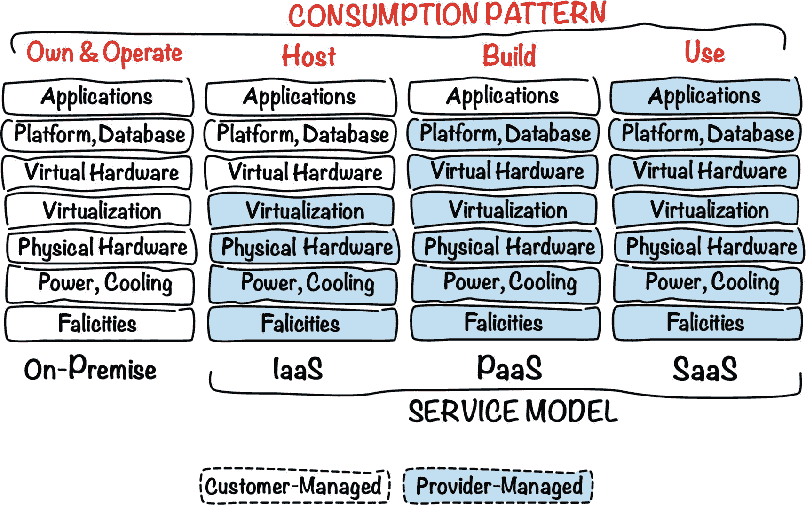

**图 1-9**
服务模型与消费模式

下一节，我们将讨论与成本相关的事项。

### 成本

一位智者曾言，天下没有免费的午餐。无论你是仅为自身组织运行私有云，还是更常见的，使用公共云服务，总得有人为底层的设备、维护、供电、冷却和数据中心设施买单。

从云服务提供商的角度来看，精确计量云服务的消耗量，并根据项目团队和云账户所有者的实际使用情况进行收费至关重要。用于跟踪云服务消耗的`指标`类型通常取决于云资源的种类。例如，整体计算实例的消耗量可以通过在所选的计费周期（如一个日历月）内，由运行中的实例所使用的 CPU 总小时数来衡量。网络能力的使用指标可能基于超出某个阈值的出站数据流量的 GB 数。对象存储的利用率则可以根据存储数据的 GB 数以及发送到对象存储 API 的请求数量来计算。

现在，让我们快速了解一下公共云提供商提供的两种最常见的定价选项。在软件项目的早期阶段，你的团队通常会使用多个开发和测试环境。这类环境往往会通过增减云资源的数量和大小而不断变化。云服务的使用量每个月可能差异很大，因此，预测未来的消耗量可能比较困难。`按需付费`是这种情况下很适用的定价选项。基于指标的度量，你和你的云提供商可以准确知道计费周期结束时的消耗水平和你将承担的成本。这种定价选项还允许一件事，对于某些概念验证或研发活动尤其重要。具体来说，并非每一次创新尝试或仅仅构建一个新的云解决方案都能成功，或在长期内找到愿意为其买单的合理受众。按需付费定价没有任何承诺义务。如果你愿意，你可以随时终止所有云资源，从而有效停止任何进一步的费用。

第二种定价模型基于年度甚至更长期的`承诺`。你承诺每月将在云服务上花费约定的金额。如果你的花费低于你声明的金额，损失由你承担。如果花费超过，`超额费用`就会生效，并可能基于按需付费定价模型产生额外费用。乍一看，这种模式没有意义，因为它缺乏第一种模式的灵活性。然而，你（或者更确切地说，你的组织）承诺每月在云服务上花费固定金额这一事实，使你通常有资格享受（通常幅度显著的）`折扣价格`。这种定价选项似乎非常适合稳定的生产环境，在那里你已经知道了平均月消耗量。或者，一旦你能够说项目突然关闭的风险较低，并且可以预测未来的消耗量，你也可以决定将开发和测试环境从按需付费定价切换到基于承诺的定价。图 1-10 展示了按需付费（PAYG）选项与享受 20%折扣的基于承诺选项之间的成本比较。


图 1-10

按需付费 vs. 基于承诺的计划

至此，你应该对云计算有了相当一致且高层次的理解。是时候向你介绍本书的主体：Oracle Cloud Infrastructure。

## Oracle Cloud Infrastructure

`Oracle Cloud Infrastructure` (OCI) 是 Oracle 向公众、小型企业、非营利组织、政府机构和大型企业提供的基础设施即服务公共云服务套件。OCI 提供了广泛的云资源，满足核心云能力，如计算、网络、各类存储以及身份与访问管理。此外，OCI 还具备一系列构建在 OCI IaaS 层之上的集成平台即服务云服务。这些服务包括但不限于两种完全托管的 Oracle 数据库，称为自治事务处理（ATP）和自治数据仓库（ADW），使用开源 Kubernetes 引擎进行托管容器编排，以及集成的 Docker 容器注册表。此外，OCI 生态系统还提供了丰富的多样化模板选择，这些模板使用名为 Terraform 的开源供应工具来部署系统，例如各种 NoSQL 数据库、数据集成平台和数据科学工作台。

Oracle Cloud Infrastructure 源自范围较小的 Oracle 裸金属云服务（BMCS），该服务由位于西雅图的 Oracle 团队构建，团队成员是经验丰富的云专业人士，来自其他公共云提供商、独立软件供应商和开源生态系统等不同背景。

### 区域

几十年来，Oracle 一直是数据库系统和业务应用的全球领导者。此外，如今其信息技术解决方案组合还包括中间件平台、集成工具、商业智能和分析产品等。自收购 Sun Microsystems 以来，Oracle 还成为了 Java 生态系统的守护者。目前，Oracle 正致力于通过向`Oracle Cloud Infrastructure`（有时被称为第二代云基础设施）添加更多高级功能、将其 PaaS 服务迁移至`OCI`，以及通过新建数据中心`区域`来地理性地扩展其全球版图，从而完成公司向云端的转型，如图 1-11 所示。你可以在 [`https://cloud.oracle.com/regions`](https://cloud.oracle.com/regions) 找到最新的地图。

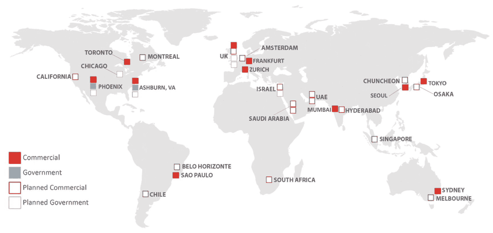

图 1-11：Oracle Cloud Infrastructure 区域

每个 `Oracle Cloud Infrastructure` *区域*由一个或多个地理位置邻近的*可用性域*组成，每个可用性域又由一个或多个数据中心构成。单个 `区域` 内的 `可用性域` 通过低延迟、高带宽的链路互连，但在物理上仍然是隔离的，以帮助抵御突发的自然灾害，或者更常见的——设备故障的连锁反应。两个 `可用性域` 同时故障的可能性相当小，因此，为了实现真正高可用的架构，设计云解决方案时，将云资源复制到两个甚至三个 `可用性域` 应该就足够了。

注意：新引入的 `区域` 可能永久或仅在初始阶段提供单个 `可用性域`。

对于不太关键的系统，可以分布在单个 `可用性域` 内的两个或三个*故障域*中。这是什么意思呢？单个 `可用性域` 内的硬件可以被划分为物理隔离的设备单元，称为*故障域*。通过这种方式，单个硬件单元内的电源故障或设备故障连锁反应可能被隔离，不会影响其他单元。在一个 `故障域` 中配置的实例，不太可能受到源自不同 `故障域` 的技术问题的影响。尽管如此，如果可能的话，为了使你的云解决方案能够在意外情况下生存并持续运行，建议依赖 `可用性域`。图 1-12 展示了 `区域`、`可用性域` 和 `故障域` 之间的关系。

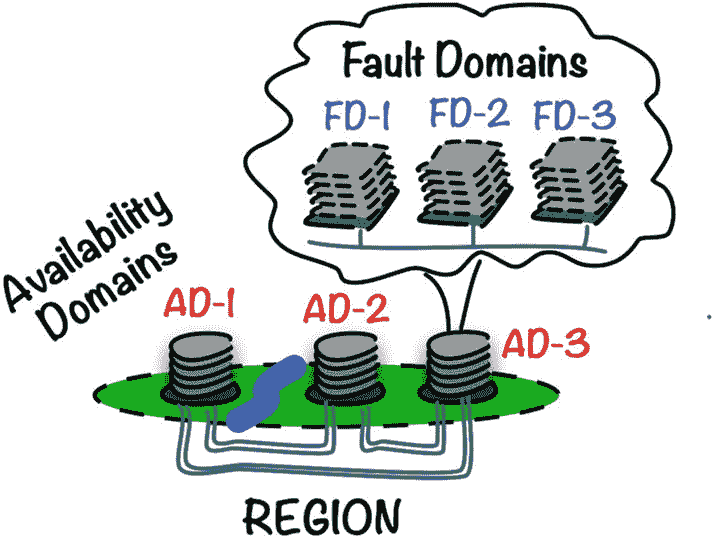

图 1-12：区域、可用性域和故障域

我们能在 `Oracle Cloud Infrastructure` 上运行什么样的工作负载？让我们进入下一节来回答这个问题。

### 工作负载

当你考虑迁移现有解决方案或在云端构建一个全新的服务时，你应该首先审视你将在云中处理和存储的数据。根据你所处的地理区域和法律管辖区，你通常会有法定义务遵守各种数据保护法案。实际上，在开始阶段，你应该比为云解决方案规划的应用架构更加关注这个方面。

从纯粹的技术角度来看，只要能够成功组合出一套足够的云基础设施资源，这些资源共同构成你所开发的云解决方案的骨干，那么我们就可以说这种应用或*工作负载*确实得到了 `Oracle Cloud Infrastructure` 的支持。如果我们被要求列举几种可以在 `OCI` 上运行的典型系统类型，我们可以列出以下应用：

*   **多层 Web 应用**，使用在公共和私有虚拟云网络子网中配置的虚拟机或强大的专用裸机主机启动。通过适当混合使用公共和私有子网，你可以为每个应用层保持精确的隔离。
*   分布式、面向微服务的**基于容器的系统**，运行在名为 `Oracle Kubernetes Engine` 的托管 Kubernetes 容器引擎上。
*   **数据库承载的工作流**，无论是事务型还是分析型，均由功能完备、市场领先、完全托管的关系数据库管理系统——`Oracle Autonomous Database` 提供支持。
*   **高性能计算**（HPC），支持渲染、工程仿真或大数据工作负载等任务。
*   各种**传统应用**，从其早期的本地环境直接迁移（lift-and-shifted）而来，并部署在镜像了本地硬件设置的云基础设施中。
*   **无服务器**工作负载，使用基于开源 `Fn Project` 的 `Oracle Functions`。
*   或者任何其他需要**额外的、峰值处理能力**的场景，这些能力超出了你当前基础设施所能提供的范围。

最后但同样重要的是，独立专业人士也可以通过订阅自己的云租户而受益。个人开发者可以考虑使用基于云的计算实例来完成部分工作，而不是使用十几个虚拟机，以此替代笨重的、本地托管的虚拟机。再举一个例子，在云端配置一个由多个工作节点组成的托管 Kubernetes 引擎，比在笔记本电脑本地托管的一组虚拟机上进行配置要快得多。

### 服务

到目前为止，我们在本章讨论的每一项核心云能力，都是对相关云资源类型的逻辑分组。例如，计算能力可以通过计算实例、实例池或计算镜像等云资源来提供。从命名角度来看，`Oracle Cloud Infrastructure` 将云资源类型组织为*服务*。在本节中，我们将简要概述并描述这些 `服务` 及其最常见的云资源类型。我已将它们汇总在表 1-1 中。

表 1-1：Oracle Cloud Infrastructure 服务


| 服务 | 已选的云资源类型 |
| --- | --- |
| 计算 | `计算实例`为在云中运行软件提供算力。它们基于`镜像`，镜像为实例指定了预装的软件栈。实例使用`形状`来确定分配的虚拟硬件配置。实例可以独立配置，也可以使用`节点池`进行池化。节点池基于一个`实例配置`创建，该配置可被视为一个扩展的实例定义。`虚拟网卡附件`云资源将特定的计算实例连接到一个虚拟网卡。虚拟网卡在所选的虚拟云网络子网中创建，并将实例连接到虚拟云网络。 |
| 网络 | `虚拟云网络`是一个在 Oracle Cloud Infrastructure 区域内创建的软件定义的私有网络。它可以跨越多个可用性域。您可将其细分为一个或多个`子网`。流量根据在`路由表`中创建的路由规则进行路由，该表被一个或多个子网引用。通过`互联网网关`启用对互联网的访问，您可将其指定为路由规则目标。`NAT 网关`允许私有子网中的实例建立到互联网的出站连接。一个子网可以引用一个或多个安全列表，这些列表由有状态和无状态的`安全规则`组成。这些规则有效地为特定子网提供了一层额外的虚拟防火墙。一个连接到`公网 IP`云资源的实例，只要所执行的安全规则允许特定流量，即可直接从互联网访问。 |
| 块卷 | `引导卷`承载计算镜像，提供根文件系统，并用于启动计算实例。实例可以额外连接`块卷`以增加可用的总块存储量。可以为这两种卷创建时间点的`卷备份`。备份可以是增量的或完全的，并且可选择由自动化的`卷备份策略`驱动。 |
| 对象存储 | 任何类型的数据实体都作为`对象`存储在称为`存储桶`的虚拟容器中，存储桶通常用于对相关对象进行分组。经过认证和授权的 OCI 用户，或使用短时效的`预认证请求`可以访问这些对象。存储桶可以创建为仅`归档`存储，这将降低存储成本，但会使对象在下载前增加一些等待时间。此外，可以采用`生命周期策略规则`，在给定时间段过后删除或归档对象。 |
| 文件存储 | 可以在所选子网中创建共享文件存储`文件系统`。您使用`挂载目标`云资源提供的详细信息将计算实例附加到特定的文件系统，该资源存在于文件系统云资源内。您可以使用称为`快照`的时间点视图为共享文件系统实现备份机制。 |
| IAM | ` compartments`用于隔离通常属于托管在单个云租户下的不同项目的云资源。您可以在本地定义云`用户`，或者将租户与外部身份提供商联合。`策略`由策略语句组成，这些语句授予`用户组`对云资源的各种访问权限。`动态组`允许匹配的计算实例发出该组允许的 API 调用。 |
| 负载均衡 | `负载均衡器`根据选定的分配算法，将传入流量分发到在`后端集合`中注册的实例。 |
| 数据库 | 需要支持写入密集型、高吞吐量和事务密集型操作的 OLTP 应用程序可以利用`自治事务处理`。支持数据仓库和商业智能系统的 OLAP 工作负载旨在使用`自治数据仓库`。这两种云资源类型的实例都为您提供完全托管的 Oracle 数据库体验。 |
| 容器注册表 | 每个云账户都附带一个关联的容器镜像注册表，您可以在其中使用公共和私有`仓库`存储 Docker 镜像。 |
| 容器引擎 | Kubernetes 容器引擎让您能够启动完全托管的 Kubernetes`集群`，其关联的`节点池`中的工作节点作为计算实例进行配置。 |
| 无服务器 | 开源 Fn 项目的`函数`可以部署到托管的 Oracle Functions 服务中进行无服务器计算。 |
| DNS | 您拥有的域名可以重定向到一个 DNS`区域`，在该区域中可以创建自定义 DNS`记录`。 |
| Web 应用程序防火墙 (WAF) | 可以使用一组预定义的`WAF 策略`来保护面向互联网的应用程序端点，防止潜在恶意和不需要的入站流量，这些策略范围从简单的验证码或地理位置过滤器到更复杂的流量模式。 |

表 1-1 旨在通过描述按 Oracle Cloud Infrastructure 服务分组的已选云资源类型，为您提供一个高层次的概览。尽管如此，目前已有更多云资源类型可用，而且我们应期待未来会有更多资源类型出现。

一些云资源，如虚拟云网络或 IAM 用户，是免费的。其他的，例如计算实例、数据库实例或负载均衡器，则会产生与消耗相关的费用。让我们更仔细地看看账单情况。


### 计费

在前面章节的“成本”部分，我提到了云资源消耗通常是如何衡量的，以及使用任何公共云提供商时通常会遇到的两种定价选项。

*   按需付费定价

*   基于承诺的定价

Oracle Cloud Infrastructure (OCI) 确实提供了按需付费的定价选项。这是你自行创建新云租户时的默认定价选项。消耗的衡量基于不同的指标，具体取决于特定的云资源类型。每月末，你的信用卡会被扣款，你最终会收到一张发票。就这么简单。这个选项非常适合评估阶段、原型设计，或者当你根本无法或不想对未来的常规服务消耗做出任何预估时。没有承诺意味着你可以完全灵活地随时扩大或缩小你的消耗，而无需为未使用的额度付费。

我刚刚提到了“`credits`”（额度）这个词。通过讨论 Oracle 如何提供基于承诺的定价，我们将会了解到为什么使用这个词。2018 年，Oracle 宣布了“`universal credits`”（通用额度）作为与其这类消耗购买模式相关的术语。一个对自身常规云服务消耗有信心的客户可以与 Oracle 达成协议，进而以折扣价购买一定数量的通用额度。在撰写本文时，最短的承诺期为 12 个月。折扣可能很可观，但这取决于承诺期限和购买的额度数量。通用额度可用于任何类型的 Oracle Cloud Infrastructure 设置以及大量的各种 PaaS 服务。在撰写本文时，这种模式使得在同一协议下完全改变消耗模式成为可能。例如，你可以将应用程序从构建在大量虚拟机上的多层架构，迁移到运行在 Oracle Kubernetes Engine 上、由更少但更强大的裸机主机支持 worker 节点的基于微服务的系统。在此更改之后，你的额度将仅由与你新设置相关的资源消耗。

注意

与所有类型的商业活动一样，定价模式可能迅速变化；因此，请参考官方文件或销售代表以获取最新的定价选项。你可以在 [`https://cloud.oracle.com/pricing/options`](https://cloud.oracle.com/pricing/options) 找到更多详细信息。

已经在使用 Oracle Database 的公司和组织，通过选择“`bring-your-own-license`”（BYOL，自带许可证）选项，可能有资格进一步降低其基于云的 Oracle Database 成本。首先，你必须确保你当前的本地许可证符合此选项。如果确认，要利用更低的费用，你只需在 OCI 控制台中预置任何 Oracle Cloud Infrastructure 上可用的 Oracle Database 类型的新实例时，勾选相应的框或传递必需的 API 请求参数。

可视化各种云资源产生的成本最方便的方法，是使用 OCI 控制台中的账单视图，如图 1-13 所示。你可以使用筛选器来查看选定时间段内的费用。

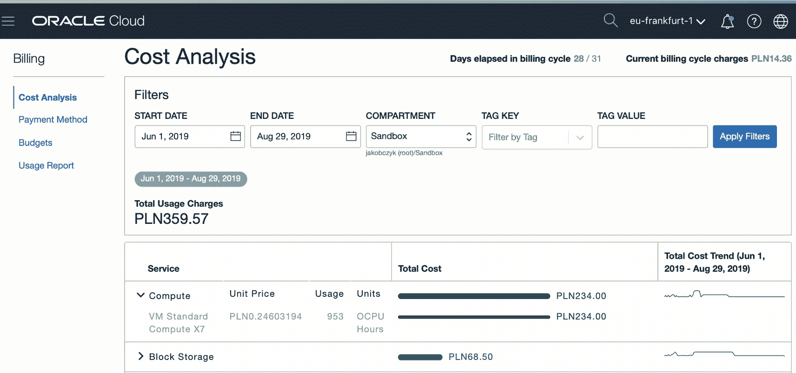

图 1-13

在 OCI 控制台中查看账单

无论你的云账户适用哪种定价选项，你或你的租户管理员可能都希望看到消耗的云资源在`aggregated cost split`（成本聚合拆分）中按每个业务部门或项目的划分情况。Oracle Cloud Infrastructure 提供了两种可以帮助你使成本拆分可见的工具：`compartments`（ compartment）和`cost-tracking tags`（成本跟踪标签）。你将在第 4 章中了解 compartment，我们将更仔细地研究如何组织项目层次结构。使用多个 compartment 并将成本跟踪标签附加到云资源上，将使你能够在 OCI 控制台的账单视图中应用额外的筛选器。

### 支持

在某个时间点，你不可避免地会发现自己需要一些帮助。首先，你可能对云服务有疑问，但在文档中找不到直接答案。你甚至可能发现一些必须被解释并在确认后解决的云服务问题。然而，你的第一个服务请求很可能与“`increasing service limits`”（增加服务限额）有关。

什么是服务限额？我会说它是云提供商用来监督各类云资源的最大可能消耗量并避免任何潜在危险超额订阅的一种手段。如果这听起来有点模糊，让我举个例子来说明它对云消费者的实际影响。想象一个假设的情况：在某个区域的第一个可用性域中，恰好有 1,000 台每台配备 52 个 CPU 的裸机。如果它们全部都在使用中，其中一些运行着虚拟机，另一些则专用于单个租户，这时一个新客户试图预置另一个计算实例，会发生什么？嗯，预置过程很可能会失败，因为 CPU 池中缺少物理 CPU。为避免这种情况，云提供商会跟踪授予每个客户对每种云资源的服务限额。例如，你的云账户可能设置的服务限额是，在特定的可用性域（AD）内，你最多只能预置 30 个 1 CPU 的虚拟机、10 个 2 CPU 的虚拟机和 1 台 52 CPU 的裸机。这样，云提供商就能知道你可以自服务预置多达 40 个虚拟机，总共消耗 50 个 CPU，以及一台额外的、需要 52 个 CPU 的裸机。通过将所有云账户的服务限额相加，云提供商能够了解特定 AD 中的物理资源是否能够满足所有可能被预置的虚拟云资源的需求，并采取相应措施。

在预置你的目标架构之前，你需要确保你的服务限额允许你创建想要使用的云资源。使用试用账户开始时，标准的服务限额设置得非常低，因此你可能很快就会发现自己需要增加其中一些限额。虽然任务本身是由支持团队完成的，但你的责任是创建一个新的服务请求，并提供需要增加的具体内容详情。你可以在 OCI 控制台中完成此操作，如图 1-14 所示。

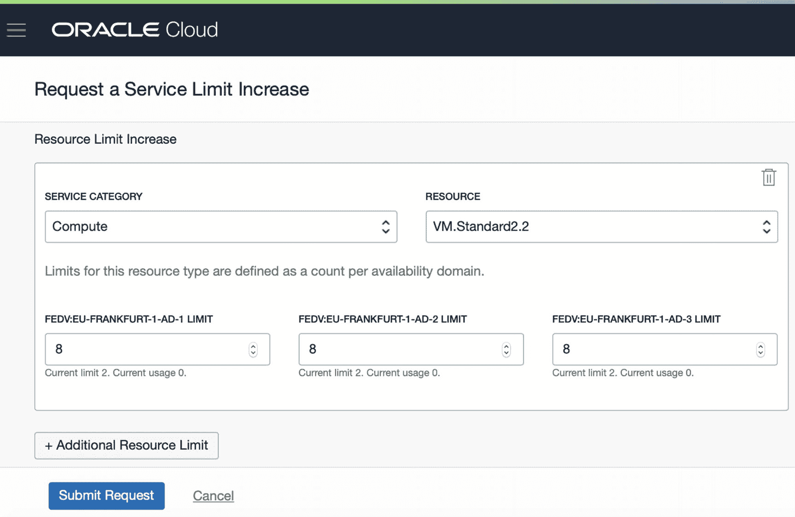

图 1-14

在 OCI 控制台中增加服务限额

其他类型的服务请求必须通过 Oracle Cloud 支持门户网站提交。你可以在 [`https://support.oracle.com`](https://support.oracle.com) 找到它。请记住，在登录之前或之后选择“Cloud Support portal”选项。


## SLA

无论是软件还是硬件，都可能在最意想不到的时刻发生故障。在云计算领域也是如此。支撑公共云平台的数据中心内，软件或硬件的故障可能导致已部署的云解决方案出现严重问题，包括服务不可用、交易中断、业务流程暂停以及数据损坏。云服务提供商会尽最大努力消除云服务故障的风险或减轻其潜在后果。其中一些提供商使用*服务级别协议*（SLA）来书面正式承诺其托管的各种云资源的可用性、可管理性或性能。例如，在撰写本文时，Oracle 保证一个计算区域的可用时间至少为 99.99%，一个可用性域的可用时间至少为 99.95%。如果未达到这些阈值，Oracle 将发放一定数量的服务积分作为补偿。服务积分的数量取决于多个因素，例如在未满足特定 SLA 的当月您的云消耗量、未满足的 SLA 类型以及未满足 SLA 的程度（以百分比表示）。服务积分可以在未来的某个计费周期中用作额外积分，用于支付云资源消耗，从而有效地降低您的按需付费费用或承诺计划下可能的超额费用。

> 注意
>
> SLA 及其规则可能瞬息万变；因此，请参阅官方文档或联系销售代表。您可以在 [`https://www.oracle.com/cloud/iaas/sla.html`](https://www.oracle.com/cloud/iaas/sla.html) 找到更多详细信息。

让我们看一个简化的例子。请注意，在您阅读本文时，规则甚至整个过程可能已经改变，因此请将此视为对云 SLA 主题的介绍。图 1-15 说明了我们将要讨论的场景。

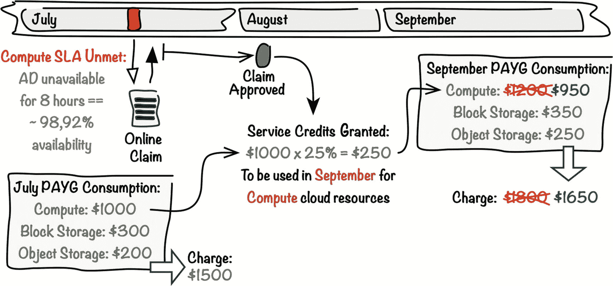

图 1-15

云 SLA 示例

您在一个按需付费的云租户中运行一个应用程序。该应用程序节点在多个虚拟机上运行，这些虚拟机以容错方式部署并分散在一个可用性域内的两个不同故障域中。计算实例使用块存储作为其启动卷。此外，该应用程序将业务相关数据持久化存储在对象存储桶中。假设有一个 SLA 保证一个可用性域（AD）在每个日历月中的可用时间至少为 99.95%。如果未达到此阈值，表 1-2 列出了适用的服务积分。

表 1-2

服务积分级别

| AD 可用性 | 服务积分 |
| --- | --- |
| 99.00%–99.95% | 10% |
| 低于 99.00% | 25% |

“AD 的可用性”到底意味着什么？在撰写本文时，如果您在特定可用性域内至少两个故障域中运行的计算实例无法建立外部连接，则认为该 AD 不可用。回到我们的例子，假设您在七月份有 8 小时无法连接到您的应用程序实例。您收集日志作为证据，将其附加到在线索赔中，并提交索赔以待批准。Oracle 在八月初批准了该索赔，并根据以下两个事实向您发放了价值 250 美元的服务积分：

*   您七月份与计算相关的消耗产生了 1000 美元的费用。
*   七月份该 AD 的可用时间低于 99.00%。

现在，您应该能够在九月份将计算云资源的成本降低 250 美元。再次提醒，请记住这只是一个说明某些 SLA 运作方式的例子。在撰写本文时，规则和 SLA 阈值可能完全不同，因此请参阅官方的 SLA 文档。

本章为您提供了大量的入门信息。现在，如果您还没有注册试用云账户，是时候注册了。

## 试用

开始使用 Oracle Cloud 的最佳方式是注册一个新的*试用云账户*。在撰写本文时，试用账户提供价值 300 美元的积分，有效期为 30 天。要注册 Oracle Cloud 试用，请访问 [`https://oracle.com/cloud`](https://oracle.com/cloud)，点击“Try Oracle Cloud Free Tier”按钮，然后点击“Start for Free”。将显示图 1-16 所示的屏幕。

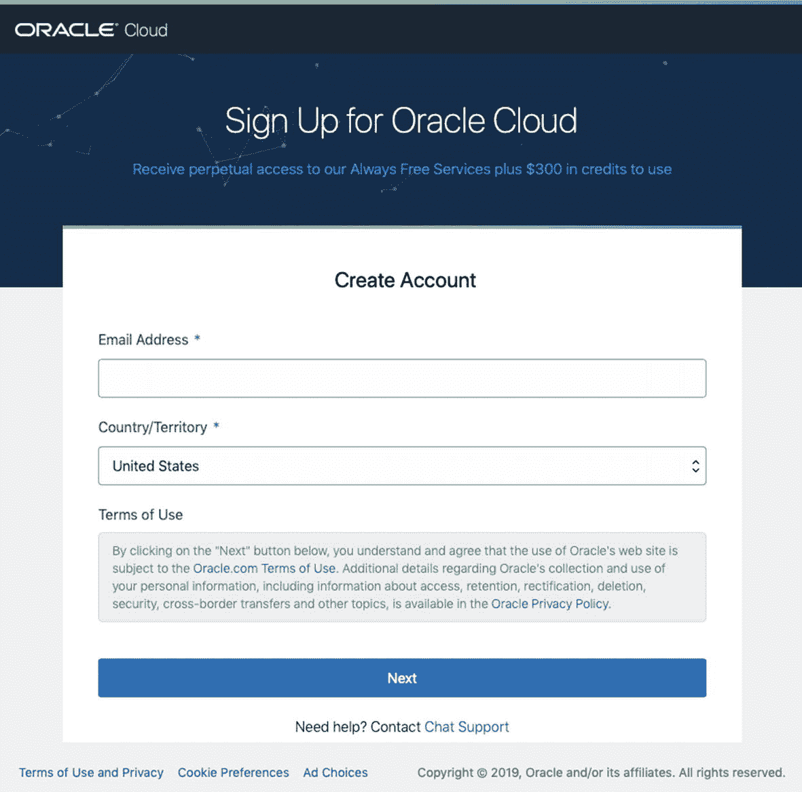

图 1-16

注册 Oracle Cloud

填写表格并通过发送到您手机号码的验证码验证身份通常需要几分钟时间。您还需要提供信用卡详细信息。这将使您能够在 30 天的评估期结束时，顺利地将试用账户升级为标准的按需付费账户（当然，如果您决定这样做的话）。此外，您可以尝试联系您所在地区的 Oracle 销售代表，协商为您的试用提供更多积分和更长的评估时间。

区分您使用的是试用账户还是常规付费账户的最简单方法是查看 OCI 控制台顶部的栏。在 OCI 控制台顶部会有一个窄的紫白色栏，显示相关信息。您的新云账户需要几分钟时间来完全初始化。在此期间，您将看到一个橙色栏通知您，如图 1-17 所示。


图 1-17

OCI 控制台中的试用账户信息栏

要关注您正在进行的服务消耗，您可以观察 OCI 控制台中的计费小部件。试用租户将显示类似图 1-18 的内容。计费小部件中的信息每天更新一次。

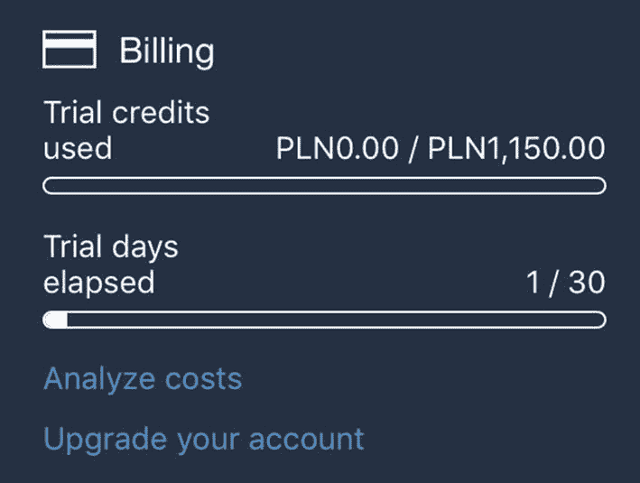

图 1-18

在 OCI 控制台中查看试用云账户账单摘要

请记住，在试用期内，选定的服务会获得额外折扣。这为您提供了更多时间来测试那些比其他服务稍贵一些的服务。


## 摘要

在本章的介绍中，您通过查看硬件和虚拟资源开始了您的云计算之旅。紧接着，我与您分享了我最喜欢的两个云计算定义，我们简要讨论了云计算的特性。接下来，我们更详细地探讨了每一个特性。然后，我们介绍了传统硬件资源供给与快速自供给之间的区别，弹性与可扩展性，以及“即服务”交付模式的含义。作为下一步，我们快速了解了**API**的重要性和类型。随后，涵盖了四个核心云计算能力（计算、存储、网络、**IAM**）。之后，您阅读了关于云部署模型和服务模型的内容。接着，我们花了一些时间讨论与成本相关的事项，如指标、消费衡量以及两种定价选项：按需付费和基于承诺的计划。在本介绍性章节的第二部分，我向您介绍了**Oracle Cloud Infrastructure** (**OCI**)。您了解了区域、可用性域和故障域。随后，我们列举了您可能在**OCI**上运行的几种典型工作负载类型。下一节专门介绍了**OCI**服务及其所包含的云资源类型。之后，我谈到了**OCI**上可用的定价选项、计费、支持的作用和服务级别协议。最后，我概述了您可以注册试用账户的方式，以便在 30 天内免费测试**OCI**。

下一章将教您如何使用**Oracle Cloud Infrastructure**控制台构建您的第一个基于云的解决方案。基本概念将在过程中进行解释。为了正确学习它们，我们将采取详细的方式，避免使用可能加快速度的**OCI**控制台向导。别担心；从第 3 章开始，您将像在日常使用**OCI**时一样使用自动化功能。如果您使用的是试用账户，则不会产生任何费用。

## 注释

1.  [`https://csrc.nist.gov/publications/detail/sp/800-145/final`](https://csrc.nist.gov/publications/detail/sp/800-145/final)
2.  Gartner，IT 术语表，云计算。 [`https://www.gartner.com/it-glossary/cloud-computing`](https://www.gartner.com/it-glossary/cloud-computing)
3.  [`www.ics.uci.edu/~fielding/pubs/dissertation/rest_arch_style.htm`](http://www.ics.uci.edu/%257Efielding/pubs/dissertation/rest_arch_style.htm)
4.  [`www.w3.org/Submission/wadl`](http://www.w3.org/Submission/wadl)
5.  [`https://github.com/OAI/OpenAPI-Specification/blob/master/versions/3.0.0.md`](https://github.com/OAI/OpenAPI-Specification/blob/master/versions/3.0.0.md)
6.  [`https://tools.ietf.org/html/rfc7143`](https://tools.ietf.org/html/rfc7143)
7.  [`https://tools.ietf.org/html/rfc1094`](https://tools.ietf.org/html/rfc1094)
8.  [`https://cloud.oracle.com/regions`](https://cloud.oracle.com/regions)

