# 2. 构建您的第一个云应用程序

本章展示了如何创建一个简单的云基础架构，并在负载均衡器后运行两个自定义 REST API 实例。本章中展示的 API 实现将作为一个示例。主要目标是指导您从头开始构建您的第一个基于云的解决方案。随后，在本书的课程中，您还将学习如何配置自动扩展的实例池、将应用程序部署到**Oracle Kubernetes Engine**的**Docker**容器中，以及在**Oracle Functions**上执行无服务器函数。然而，在此阶段，让我们专注于基础，使用标准的虚拟机。

有多种方式可以与**Oracle Cloud Infrastructure**的云管理平面进行通信。在本章中，我们使用`OCI 控制台`，这是一个用于管理`OCI 资源`的 Web 浏览器界面。此方法仅适用于希望演示特定功能或尝试对您而言是新功能的情况。在现实世界中，您要么使用动态的、过程化的命令行界面（`CLI`）来自动化整个供给过程，要么使用声明式的`Terraform`驱动的基础架构描述符来管理基础架构即代码。自动化是第三章的主要主题。此外，本书所有剩余章节中的绝大多数演练都展示了云自动化的实际应用。

## 规划基础架构

在本节中，我们将查看即将交付的云应用程序，并规划我们所需的云资源。

### 云账户

在继续之前，您需要拥有一个可用的云账户。您可能会使用试用账户或标准的按需付费账户。试用账户将允许您免费完成本书中的所有演练。如果您拥有付费账户，您只需要记得终止（换句话说，删除）作为学习过程一部分构建的每个资源，以免产生费用。

> 提示
>
> 如何创建一个新的试用账户？请参阅上一章的“试用”部分。

对于你们中的一些人，可能还有另一个选择。如果您所在的公司拥有有效的`OCI`订阅，您可以考虑询问您的同事（云管理员）创建一个专用的`compartment`（例如，名为`Sandbox`），您可以在其中完成本书的练习。然而，本书中描述并在动手练习中创建的一些云资源确实需要租户所有者访问级别；因此，强烈建议您注册自己的试用账户。


### 项目隔离区

组织使用单个云账户（也称为*云租户*）来托管多个有时不相关且隔离的项目，这并不罕见。不同的云提供商提供了各种方法来分离不相关的资源。Oracle Cloud Infrastructure 通过*隔离区*和*标签*来实现这一点。意识到这一点有助于规划，因为你可以轻松地将整个解决方案格局划分为更小、更细粒度、独立管理的架构片段，每个片段中的组件更少。这样，同一个云账户就可以用来托管众多项目的多个开发、测试和生产环境。图 2-1 简要说明了这一概念。

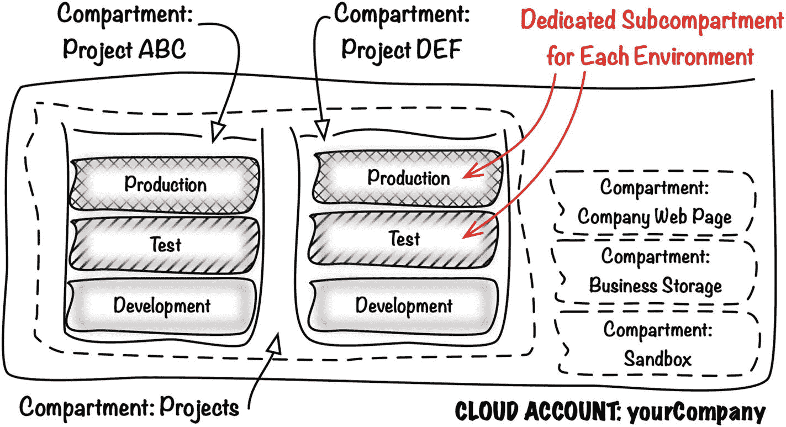

图 2-1
使用 OCI 隔离区隔离项目

如图 2-1 所示，隔离区可以位于其他隔离区内部，从而形成一个完整的层级结构。最顶层的隔离区称为*根隔离区*，你创建或默认存在的所有隔离区都是它的后代。如图 2-2 所示。

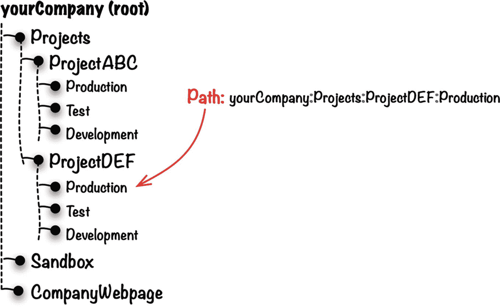

图 2-2
隔离区的层级结构

为每个项目传统地划分为三个标准环境（开发、测试和生产）不一定是最优选择。我甚至可以说这可能导致治理问题，因为生产隔离区仍然是项目隔离区的子级。在第 4 章中，你将学习另一种对生产更友好的隔离区组合策略，该策略将顶层项目与系统隔离区分开。

从技术上讲，根隔离区并不是一个隔离区。每个 Oracle Cloud Infrastructure 资源都有一个类型。除了根隔离区是`tenancy`类型外，所有隔离区都是`compartment`类型。如果现阶段还不清楚，请不要担心。你唯一需要记住的是：不要直接在根隔离区中创建资源。这在技术上是可行的，但不一定是好的实践。

是时候做出第一个架构决策了。你需要决定将本章即将构建的示例解决方案放置在哪个隔离区中。如果你不知道，我来帮你。就让它成为`Sandbox`这个新的隔离区吧。我们几分钟后就会创建它。现在请继续阅读。

### 应用程序设计

我们即将创建的云解决方案提供了一个简单的通用唯一标识符生成服务。每次客户端调用 API，都会收到一个新的唯一标识符。简而言之，UUID 是一个固定大小、不可变的标识符，它通过某种算法创建，该算法保证无论是否由多个生成器在同一台或不同机器上同时运行，创建重复标识符的概率都微乎其微。依赖 UUID 的应用程序在设计上不需要任何中央标识符管理。你可以在 RFC4122 中找到关于 UUID 的更多细节。

图 2-3 展示了一个 UUID 的示例。


图 2-3
UUID

该实现将由两个独立的计算节点组成，它们在后端托管相同的、无状态的 UUID 生成逻辑，暴露一个简单的 REST API，并在每次请求时以 JSON 格式返回新生成的 UUID（`uuid`对象）和计算节点名称（`generator`对象），如清单 2-1 所示。

```
{
"uuid": "8cf04d96-30c8-45f5-a2b5-c0ae68f58c4e",
"generator":"web1"
}
```

清单 2-1
API 响应

请求被均匀地分配到两个 API 节点上的端点，因为我们在它们前面放置了一个负载均衡器，并依赖简单的轮询策略。尽管这是一个简单的演示场景，我们仍将把每个节点部署在不同的可用性域中，以创建一个高可用的解决方案。这种设计增加了我们的云服务在单个数据中心灾难中存活的机会。总结一下，一个*可用性域*可以看作是一个单一的数据中心，它使用高带宽链路与同一区域内的其他可用性域互连，从而提供低延迟。多个可用性域同时发生故障或被摧毁的可能性非常低。图 2-4 展示了解决方案组件的示意图及其如何映射到物理数据中心。

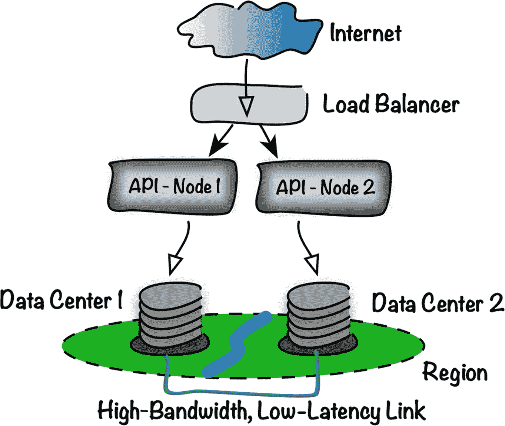

图 2-4
应用程序组件

**提示**

如果你的主页区域只提供一个可用性域，你仍然可以通过订阅另一个提供多个可用性域的区域来完成本章及后续所有章节的实践练习。你可以在 OCI 控制台中执行此操作。只需转到菜单 ➤ 管理 ➤ 区域管理，然后在其中一个提供三个可用性域的区域旁边单击“订阅”按钮。订阅新区域可能需要片刻时间。之后，你需要在 OCI 控制台的右上角选择活动区域。


## 实现 API 服务器与云基础设施设计

是时候仔细看看实现了。我选择使用 Flask 来实现 API 服务器，这是一个面向 Web 的 Python 微框架。我确信你已经听说过 Python 编程语言。它于 20 世纪 90 年代初推出，尤其是在过去十年中，其受欢迎程度迅速增长。Python 被认为是一种通用语言，广泛应用于 Web 开发、数据科学、机器学习、云生态系统，甚至物联网（IoT）等各个领域。它被归类为一种多范式、解释型的语言，具有动态类型和称为*垃圾回收*（`garbage collection`）的自动内存管理。支持多种编程范式意味着你可以选择自己喜欢的编码方式，无论是过程式、面向对象还是函数式。解释型语言不需要在执行前预编译成机器代码，而是直接在解释器上运行。这简化了交付流程，但会带来性能下降。动态类型和自动内存管理提高了编程效率，使语言更易于使用。另一方面，Flask 是一个 Web 开发微框架，主要侧重于处理 HTTP 请求并发送正确渲染的 HTTP 响应。它完全兼容 WSGI。WSGI 在 PEP3333 中定义，代表 Web 服务网关接口（Web Service Gateway Interface），这是 Python 生态系统的一个标准，指定了 Web 服务器和 Web 框架之间的接口。为方便起见，Flask 自带一个嵌入式 Web 服务器，非常适合开发目的。

清单 2-2 展示了一个 UUID 服务的实现。你不需要对这段代码做任何事。所有事情都将在云实例首次启动时自动发生。怎么做？继续阅读即可。

> **提示**
>
> 尽管你不需要对这段代码做任何事，但它仍可在本书的 Git 仓库中找到，路径为 `chapter02/uuid-service/app.py`。

```python
import flask
import uuid
import os
import socket
import logging
app = flask.Flask(__name__)
@app.route('/identifiers', methods=['GET'])
def identifiers():
    generator_name = os.getenv('UUID_GENERATOR_NAME', socket.gethostname())
    generator_uuid = uuid.uuid4()
    app.logger.info('Generator: [%s] UUID: [%s]', generator_name, generator_uuid)
    rsp = flask.jsonify(uuid=generator_uuid, generator=generator_name)
    rsp.status_code = 200
    rsp.headers['Content-Type'] = 'application/json'
    return rsp
@app.before_first_request
def setup_logging():
    logging.getLogger('werkzeug').disabled = True
    app.logger.removeHandler(flask.logging.default_handler)
    handler = logging.StreamHandler()
    handler.setFormatter(logging.Formatter('%(asctime)s - %(levelname)s - %(message)s'))
    app.logger.addHandler(handler)
    app.logger.setLevel(logging.INFO)
```
*清单 2-2 UUID 服务实现*

为了将重点放在本书的主题上，我将避免逐行解释实现细节。你应该理解的是，这个应用程序将所有通过 `/identifiers` URL 发送的 GET 请求路由到 `identifiers()` 处理函数。该函数通过组合一个新生成的 UUID 和 `generator` 的名称来准备响应。后者被设置为主机名，除非存在 `UUID_GENERATOR_NAME` 环境变量。响应以 JSON 格式发送，如下所示：

```json
{
  "generator": "uuid1",
  "uuid": "e22b5858-e70f-46ab-bd16-0da3d55aca73"
}
```

现在，让我们回到正题，开始定义所需的 Oracle Cloud Infrastructure 资源，以便能够创建它们。

### API 服务器实现

#### Cloud Infrastructure

根据我们在上一节简要讨论的概念设计，我们知道将需要两个位于两个不同可用性域（availability domain）中的计算实例，它们位于一个高可用负载均衡器后面。负载均衡器将使用一个公共 IP，以便可以从互联网访问。我们将创建一些其他辅助基础设施资源，以确保云设计的完整性。

然而，事情要分轻重缓首。我们首先设计资源所在虚拟网络的布局。*虚拟云网络*（`VCN`）可以被视为一个虚拟的、私有的网络，它提供一个连续的 IPv4 地址块。建议选择通常被认为是私有的 IPv4 地址块。RFC1918 定义了这些地址。如果你想遵循此准则，请从以下地址范围中选择任何子集：

*   `192.168.0.0/16`
*   `172.16.0.0/12`
*   `10.0.0.0/8`

对于我们的云解决方案，我们将使用这个范围：`192.168.1.0/24`。

一个 VCN 被细分为一个或多个*子网*。属于同一个 VCN 的子网的 IP 地址范围必须在父 VCN 的 IP 地址范围内，并且不能与其他子网重叠。你在 Oracle Cloud Infrastructure 中运行的每个计算实例都将附加到特定的 VCN 子网。这是通过一个称为 `vNIC` 的虚拟网络接口卡完成的。

让我们决定一下云网络的布局。图 2-5 展示了我们的云解决方案的 VCN 地址空间，以及划分为子网的地址范围。

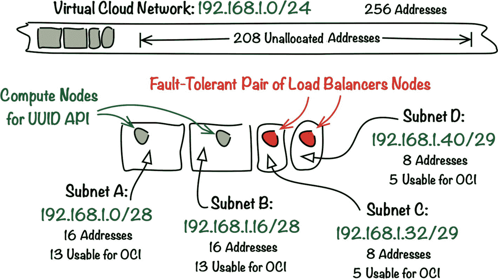
*图 2-5 虚拟云网络地址范围布局*

如图 2-5 所示，我们将使用四个子网。

*   子网 A 用于托管 UUID API 的第一个计算节点
*   子网 B 用于托管 UUID API 的第二个计算节点
*   子网 C 用于第一个负载均衡器节点
*   子网 D 用于第二个负载均衡器节点

换句话说，我们将在子网 A 和 B 中启动的两个计算实例上运行 UUID API 应用程序。一对负载均衡器节点将在子网 C 和 D 中运行。为了实现容错：

*   子网 A 和 C 将在第一个可用性域中创建。
*   子网 B 和 D 将在第二个可用性域中创建。

如果你查阅官方的 OCI 文档、白皮书或项目架构文档，你会发现 OCI 资源（计算实例、负载均衡器、网络资源等）通常使用遵循相同风格并重用一套标准图标的图表来呈现。我现在将首次使用 Oracle Cloud Infrastructure 拓扑符号。图 2-6 展示了我们将在本章中构建的云基础设施拓扑。

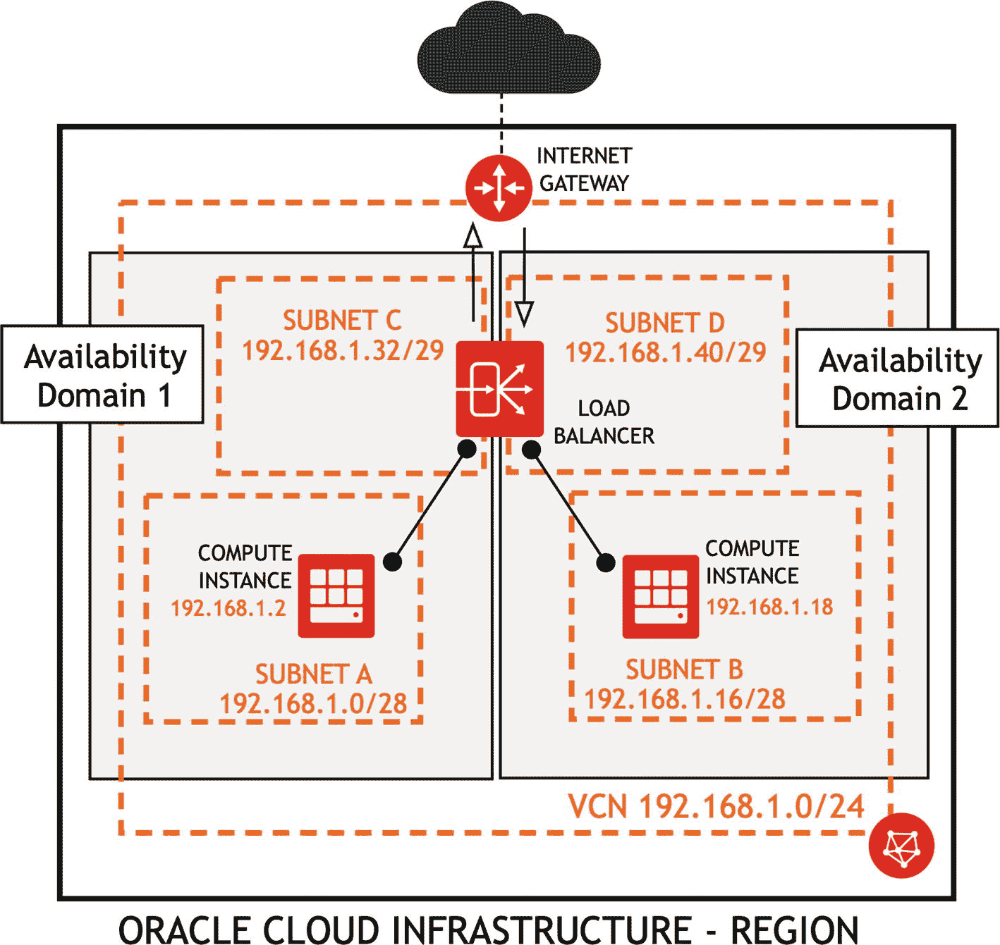
*图 2-6 云基础设施架构*

> **提示**
>
> Oracle 发布了一套可重用的图形资产，每个人都可以在其架构文档中使用。你可以在 [`https://bit.ly/2rfLk3V`](https://bit.ly/2rfLk3V) 找到它们。

在这个阶段，我们对云网络布局有了相当清晰的构想。现在，让我们对计算实例做几个选择。

*`规格`* 是基于给定配置文件（`shape`）的计算实例所提供的硬件资源（CPU 核心、可用内存）的配置文件。Oracle Cloud Infrastructure 提供两个系列的计算实例配置。

*   **裸机主机**（`Bare-metal hosts`）：专用、单租户硬件，无管理程序（`hypervisor`）
*   **虚拟机**（`Virtual machines`）：通用目的、多租户硬件，有管理程序（`hypervisor`）


一些软件，如即时通讯平台、企业应用服务器或数据库引擎，据报道在专用的物理硬件上运行时更为稳定高效，无需涉及管理程序（hypervisor）虚拟化。你可以将它们托管在数量更少、性能更强的裸机主机上。而在所有其他通用用例中，你可能会使用更多虚拟机来利用水平扩展。

注意

裸机计算形态家族深深植根于 Oracle Cloud Infrastructure（OCI）的起源。OCI 实际上源自一个名为 Oracle Bare Metal Cloud Service、面向裸机的云服务而演变而来。

在此，我仅列举几个在撰写本文时提供的、随机选择的形态：

*   `VM.Standard2.1` 是最小的标准虚拟机形态，配备 1 个 `OCPU` 和 15GB 内存。它基于 X7 平台，这基本上意味着它使用的是 Intel Xeon Skylake 处理器。
*   `VM.Standard2.8` 是另一个标准虚拟机形态的例子，提供 8 个 `OCPU` 和 120GB 内存。
*   `BM.Standard2.52` 是一个标准的裸机形态，利用 52 个 `OCPU` 和 768GB 内存。
*   `BM.Standard.E2.64` 是一个使用 AMD EPYC 处理器的裸机形态，配备 64 个 `OCPU` 和 512GB 内存。
*   `BM.DenseIO2.52` 是一个专为大数据项目中存在的 I/O 密集型工作负载设计的裸机形态。它配备了本地附加的 SSD NVMe 驱动器，提供 51.2TB 的存储容量。
*   `BM.GPU3.8` 是一个旨在为机器学习流程和高性能计算（HPC）软件提供动力的裸机形态。除了 52 个 `OCPU` 和 768GB 内存外，其真正能力来自于八个 Nvidia Tesla V100 GPU。

在上面的列表中，我使用了一个新的缩写。一个 `Oracle 计算单元` (`OCPU`) 是一个逻辑术语，也是计算相关计费的最重要度量单位。你通常按 1 `OCPU`/小时付费。换句话说，一个运行 8 个 `OCPU` 的实例一小时所产生的计算相关成本，与一个仅运行 1 个 `OCPU` 的实例运行八小时的成本相同。

对于基于 Intel 的形态，单个 `OCPU` 对应于一个物理 Intel Xeon 核心。由于超线程技术，操作系统实际上为每个物理 CPU 核心看到两个虚拟核心。总结一下，一个基于 Intel 的 `OCPU` 意味着一个物理 CPU 核心和两个近乎并行执行线程的能力，有时也称为 vCPU。

你可以很容易地猜到，我们关于计算实例的第一个选择是为将托管 UUID 服务应用程序的节点选择一个形态。我们将使用可用的最小虚拟机：`VM.Standard2.1`。

一个 `镜像`（image）是一个模板，它指定了操作系统以及在实例启动期间必须预安装的任何附加软件。一个 `镜像` 用于初始化计算实例使用的新启动卷。启动卷与其计算实例保持关联，直到终止。启动卷可以看作是实例使用的主要存储，主要用于其操作系统和软件。

Oracle 提供的镜像会定期更新并获得新版本。然而，一旦你启动了一个实例，安排定期系统更新就成为你的责任。

在撰写本文时，Oracle Cloud Infrastructure 提供四种类型的基础操作系统镜像，包含以下操作系统：

*   Oracle Linux
*   CentOS
*   Ubuntu
*   Windows Server

在你的日常工作中，你最终可能会创建许多自定义镜像，这些镜像在所选基础镜像上添加了所需的软件、服务或计划脚本。也可以导入并非基于可用基础镜像构建的自定义镜像。在这种情况下，你将在虚拟机形态上使用准虚拟化（paravirtualization）或模拟（emulation）。然而，创建自定义镜像最简单的方法是依赖 Oracle 提供的基础镜像。

那么，再做一个决定如何？我们将使用最新的 Oracle Linux 基础镜像：`Oracle Linux 7.6`。你可能会在未来使用 `Oracle Linux 7` 的较新次版本。

注意

虽然截图将显示 `Oracle Linux 7.6`，但本章的练习还使用了 `Oracle Linux 7.7` 镜像进行了额外测试。

我们现在将转向规划过程的最后一步。

#### 服务限额

你可能想知道，如果太多租户（云客户）在同一区域同时启动大量最强大的裸机形态会发生什么。即使在最大的数据中心中，这些机器的数量也肯定是有限的，不是吗？嗯，当然，确实是有限的。这正是服务限额（也称为 `配额`）这个巧妙想法的用武之地。

每个云账户都有一组服务限额，定义了允许同时运行多少何种类型的资源。如果你发现当前的限额无法满足你的需求，只需提交一个服务请求，就可以申请提高限额。这有助于 Oracle 规划和优化数据中心容量。简单而明智，不是吗？

提示

你可以在 OCI 控制台中随时验证你的使用情况与当前云账户的服务限额。只需转到 `菜单 ➤ 治理 ➤ 限额、配额和使用情况`。

在启动新的云项目之前，验证并酌情增加服务限额，应包含在你规划阶段的检查清单中。

我们在本章中正在构建的示例云解决方案将包括以下 OCI 资源：

*   一个 VCN
*   两个 `VM.Standard2.1` 计算实例
*   一个负载均衡器（100Mbps）
*   一个自定义镜像
*   可忽略不计的块存储大小

如果你使用的是一个新的试用账户并且尚未创建任何资源，你可以相当确定你的默认试用账户服务限额不会被违反。

如果你使用的是一个已包含一些 OCI 资源的付费账户，请转到 OCI 控制台中的 `菜单 ➤ 治理 ➤ 限额、配额和使用情况`，并检查是否可以添加我刚刚列出的资源。如果你的 OCI IAM 用户无权查看服务限额，你可能还需要向你的云管理员询问具体数字。

到目前为止我们所做的工作是纯粹的规划，并辅以一些基础的 Oracle Cloud Infrastructure 概念讨论。我们从审视应用程序开始，并将其映射到我们需要的云资源。我们已准备好配置这些资源。


## 配置基础设施

我们现在将为运行应用程序配置所需的云资源，这些资源我们在上一节中已讨论过。我会尽可能简化这个示例。这就是为什么我首先将介绍如何在单个节点上部署 UUID 服务。稍后，我们将添加负载均衡和容错能力。在这里，我将向您展示手动操作的方式。我这么说是什么意思呢？我们将使用`Oracle Cloud Infrastructure Console`管理所有资源。您可能记得，我提到过这种方法仅适用于希望演示特定功能或试验对您来说是新特性的情况。生产就绪的适当自动化将在第 3 章中介绍。现在，让我们开始吧！

请登录到`Oracle Cloud Infrastructure (OCI) Console`。图 2-7 展示了`OCI Console`的主登陆页面。

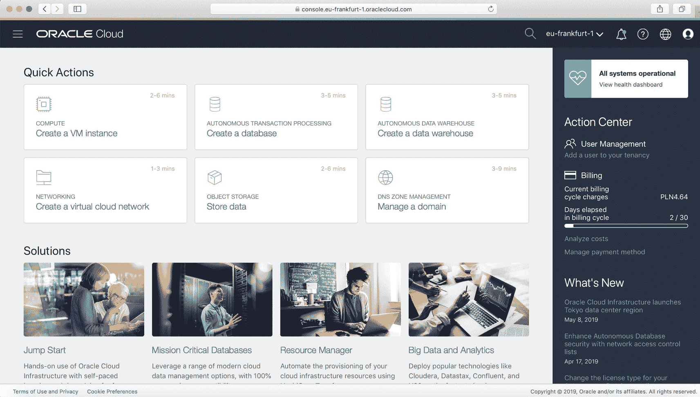

图 2-7: `Oracle Cloud Infrastructure Console`

在`OCI Console`的右上角，您将看到您的活动区域。如图 2-7 所示，在我的情况下，是德国中部区域 (`eu-frankfurt-1`)。正如我之前提到的，一些区域可能只包含一个可用性域。本书中的练习已在德国中部 (`eu-frankfurt-1`) 区域测试，并假定您所在的区域存在三个可用性域。在撰写本文时，这些区域如下：

*   德国中部 (`eu-frankfurt-1`)
*   英国南部 (`uk-london-1`)
*   美国东部 (`us-ashburn-1`)
*   美国西部 (`us-phoenix-1`)

一个云账户可以拥有和管理多个区域的资源。您只需激活额外的区域即可。为此，请按照以下步骤操作：

1.  转到`Menu ➤ Administration ➤ Region Management`。
2.  在“资源”菜单中点击`Infrastructure Regions`。
3.  在区域名称旁边点击`Subscribe To This Region`。

订阅新区域是一个异步操作，可能需要几分钟时间。在某个时间点，刷新`OCI Console`后，您应该能够在`OCI Console`的右上角选择区域。

**注意**：在进行本书包含的练习之前，请确保您正在一个具有三个可用性域的区域中工作。如果需要，请毫不犹豫地订阅一个额外的区域。

您可能想知道如何在像以下这样的单 AD 区域中实现容错：

*   澳大利亚东部 (`ap-sydney-1`)
*   巴西东部 (`sa-saopaulo-1`)
*   加拿大东南部 (`ca-toronto-1`)
*   印度西部 (`ap-mumbai-1`)
*   日本东部 (`ap-tokyo-1`)
*   韩国中部 (`ap-seoul-1`)
*   瑞士北部 (`eu-zurich-1`)

可以同时采用两种方案。首先，您可能还记得，每个 AD 都带有三个故障域，如前一章所述。故障域是物理隔离的设备单元，具有独立的电源和冷却系统。这样，两个故障域同时失效的可能性就降低了。更关键的系统可以跨多个区域分布。例如，在东京运行活动系统站点时，您可以在首尔维护一个被动系统站点，以实现灾难恢复 (`DR`)。

### 隔离区 (Compartment)

我们需要选择一个隔离区，我们的第一个云应用程序将在其中运行。隔离区是隔离不相关`OCI`资源的主要手段。通过这种方式，它们可以用来分隔不同的项目。从形式上讲，它们属于`IAM`服务。除非您已有用于学习的现有隔离区，否则建议您创建一个新的隔离区，以隔离我们在第 2 章练习中配置的资源。请按照以下步骤操作：

1.  转到`Menu ➤ Identity ➤ Compartments`。
2.  点击`Create Compartment`。
3.  名称输入`Sandbox`。
4.  提供一些描述。
5.  点击`Create Compartment`。

新的隔离区应该几乎立即创建。您可能需要刷新页面，除非您能看到新创建的隔离区的新记录，如图 2-8 所示。


图 2-8: 在`OCI Console`中查看隔离区

从现在开始，每次您在控制台中创建新的`OCI`资源时，都需要确保在`Compartment`组合框中选择了适当的隔离区，如图 2-9 所示。

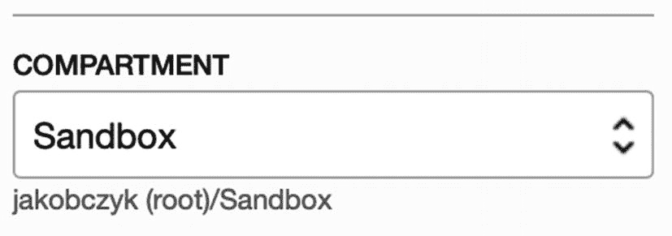

图 2-9: 在`OCI Console`中选择活动的隔离区

随着我们越来越接近使用`CLI`和`Terraform`自动化`Oracle Cloud Infrastructure`，您将看到我们引用目标隔离区不是通过其名称，而是使用其`Oracle 云标识符 (OCID)`。

每个`OCI`资源，包括您的租户，都由一个不可变的、多部分的、由`Oracle`分配的、具有严格语法的密钥唯一标识，该密钥称为`Oracle 云标识符`，缩写为`OCID`。资源标识符结构是严格的。目前，它总是以`oc1`开头，表示当前且唯一的`OCID`版本。第二个元素更重要，因为它显示了资源类型。在撰写本文时，第三个元素始终设置为`oc1`。第四个元素表示区域。最后，最后一个元素对于每个`OCI`资源都是唯一的。图 2-10 说明了`OCID`结构。

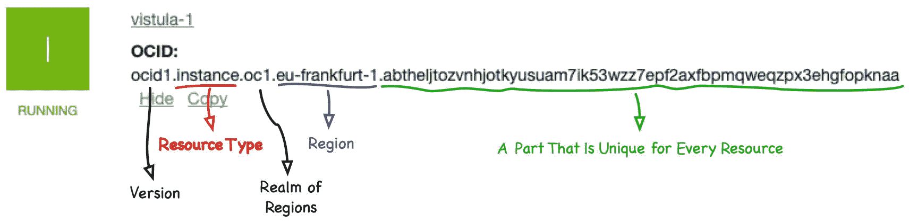

图 2-10: `OCID`


### 虚拟云网络

顾名思义，*虚拟云网络*（VCN）是一个专属于你的云租户的私有虚拟网络。然而，在你设计和管理 VCN 的方式上，它又与你可能接触或学习过的知名传统物理 IP 网络有几分相似。

以下是如何使用 OCI 控制台创建新的 VCN：

1.  导航至菜单 ➤ 网络 ➤ 虚拟云网络。
2.  确保已选择`Sandbox`隔离区。在左侧稍靠下的位置，你会找到“范围”部分，其中包含一个用于选择活动隔离区名称的组合框。
3.  点击“创建虚拟云网络”。
4.  为新的 VCN 提供一个可选的显示名称（`uuid-vcn`）。
5.  选择“仅创建虚拟云网络”。
6.  提供 CIDR 块（`192.168.1.0/24`）。
7.  勾选“DNS 解析”复选框，并保留 DNS 标签的默认值。
8.  点击“创建虚拟云网络”以配置该 VCN。

图 2-11 展示了 OCI 控制台的 VCN 创建向导。

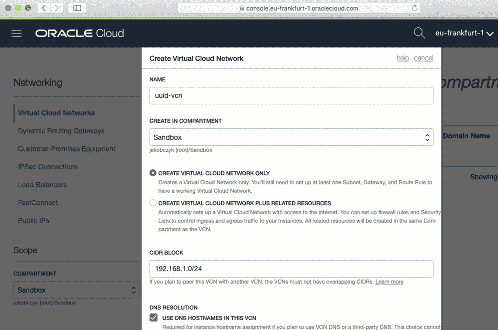

图 2-11
创建新的虚拟云网络

在向导底部，你可能发现了一些与标签相关的字段。你将在第[5]章(#478313_1_En_5_Chapter.xhtml)学习关于标签的知识。

我们决定创建一个 VCN，因为接下来我将向你展示如何创建所有（或调整现有的）必需的子资源，例如互联网网关、路由规则、安全规则和子网。这样，你将理解这些组件是如何协同工作的。

**提示**

如果你需要为简单的云环境制作原型，可以使用“网络快速入门”向导。OCI 控制台不仅会创建一个 VCN，还会添加最常见的子资源，如互联网网关、路由规则和子网。当你想快速测试某些功能且不需要特殊的 VCN 设置时，这会很有帮助。

### 互联网网关

*互联网网关*是一种虚拟路由器，它为公共子网中的计算实例提供与互联网的连接。它必须在路由规则中被定义为目标；否则，计算实例将不知道将其出站数据包发送到哪里。让我们从配置一个新的互联网网关开始。以下是使用 OCI 控制台进行操作的步骤：

1.  导航至菜单 ➤ 网络 ➤ 虚拟云网络。
2.  确保已选择`Sandbox`隔离区。
3.  点击你的 VCN 名称。
4.  在“资源”菜单中点击“互联网网关”。
5.  选择“创建互联网网关”。
6.  提供一个可选的显示名称（`uuid-igw`）。
7.  点击“创建互联网网关”。

图 2-12 展示了 OCI 控制台的互联网网关创建向导。

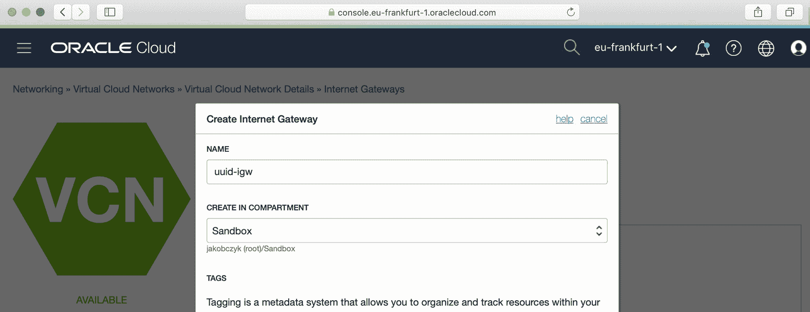

图 2-12
创建新的互联网网关

### 路由表

如果我说*路由表*存储了 VCN 的路由规则，这不会令人意外。一条路由规则定义了如何引导那些注定要离开 VCN 的出站流量。在我们的例子中，我们必须定义一条规则，以正确引导所有发送到不属于 VCN 地址范围的 IP 地址的数据包。用 IPv4 的术语来说，`0.0.0.0/0`表示所有地址，这将是我们用于路由规则目标 CIDR 块的值。我们还将把刚刚配置的互联网网关设置为这条规则的目标。

VCN 默认自带一个空的路由表资源。以下是使用 OCI 控制台向现有的默认路由表添加新路由规则的方法：

1.  导航至菜单 ➤ 网络 ➤ 虚拟云网络。
2.  确保已选择`Sandbox`隔离区。
3.  点击你的 VCN 名称。
4.  在“资源”菜单中点击“路由表”。
5.  点击默认路由表的名称。
6.  点击“添加路由规则”。
7.  在“目标类型”选择框中选择“互联网网关”。
8.  在“目标 CIDR 块”中填入`0.0.0.0/0`。
9.  在“目标互联网网关”中选择`uuid-igw`。
10.  点击“添加路由规则”。

图 2-13 展示了 OCI 控制台中的“添加路由规则”屏幕。

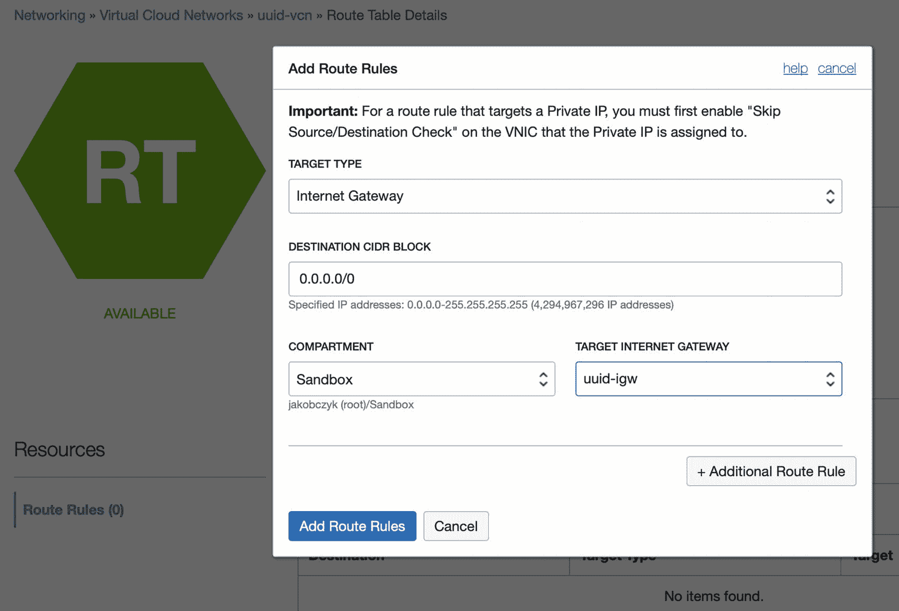

图 2-13
OCI 控制台中的编辑路由规则屏幕


### 安全列表

我们已经处理了虚拟网络、虚拟路由器和虚拟路由表。现在是时候添加一些安全措施了。每个 VCN 子网都必须至少有一个 `security list`（安全列表），它是一组安全规则的集合。你可以将这些规则视为虚拟防火墙的附加层，独立于你在每个单独计算实例上控制的操作系统防火墙。在请求到达计算实例的虚拟网络接口之前，会强制执行安全规则。

根据流量方向，有两种类型的安全规则：
*   `Ingress`（入站规则），验证进入 VCN 的入站流量。
*   `Egress`（出站规则），验证从 VCN 出去的出站流量。

VCN 附带一个默认的 `security list` 资源，其中包含一些基本规则，允许入站 SSH 和基本的 ICMP 流量以及所有出站流量。我们仍然需要添加一条规则，允许在 UUID 服务端口 (`5000`) 上的入站流量。以下是使用 OCI 控制台向现有安全列表添加新安全规则的方法：

1.  转到 Menu ➤ Networking ➤ Virtual Cloud Networks。
2.  确保选中 `Sandbox` 隔间。
3.  点击你的 VCN 名称。
4.  在 Resources 菜单中点击 `Security Lists`（安全列表）。
5.  点击默认安全列表的名称。
6.  在 Resources 菜单中选择 `Ingress Rules`（入站规则）。
7.  点击 `Add Ingress Rule`（添加入站规则）。
8.  提供所需的值：
    1.  在 Source CIDR 中填入 `0.0.0.0/0`。
    2.  在 Destination Port Range 中填入 `5000`。
9.  点击 `Add Ingress Rules`（添加入站规则）。

图 2-14 展示了我们正在添加的新入站安全规则。

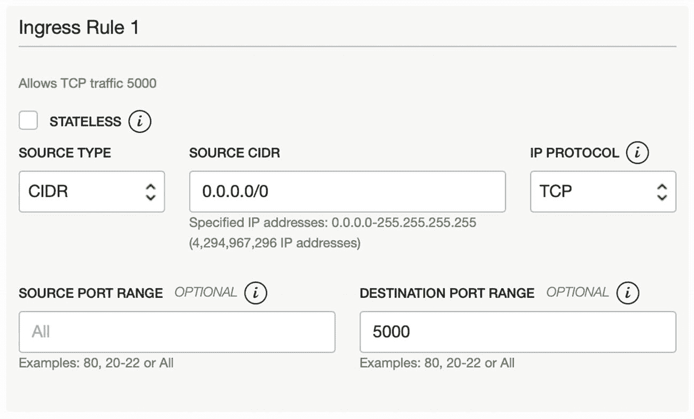
图 2-14
OCI 控制台中的入站安全规则

你可能想知道 Stateless 标签旁边的小复选框到底是什么意思。我们留空了这个复选框。结果，我们添加的新入站规则是一个 `stateful rule`（有状态规则）。每次通过这条有状态的入站规则接受端口 `5000` 上的入站流量（请求）时，相应的出站流量（回复）会自动放行，无需强制执行其他出站规则。如果你决定使用 `stateless rule`（无状态规则），你将还需要在相反方向创建另一条无状态规则来验证相关流量。

有状态规则听起来像是完美的解决方案。那么为什么我们仍然要使用无状态规则呢？嗯，有状态规则需要连接跟踪，这会消耗资源并引入一些延迟。此外，每个计算实例在单个时刻可跟踪的连接数是有限制的。这就是黄金法则所说：如果你能够将你的安全规则设计为无状态规则，那就这样做。

图 2-15 展示了修订后的默认安全列表中现有的入站安全规则。

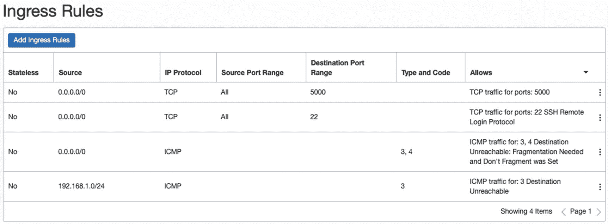
图 2-15
在 OCI 控制台中查看入站安全规则

图 2-16 展示了默认安全列表中现有的出站安全规则。

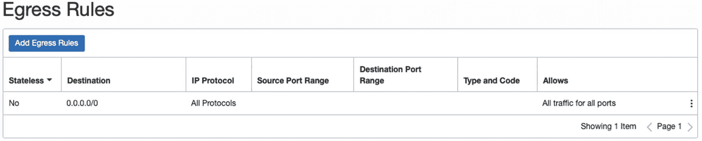
图 2-16
在 OCI 控制台中查看出站安全规则

到目前为止，我们已经配置了一个新的 VCN，启动了一个 Internet 网关，添加了一条新的路由规则以通过 Internet 网关引导出站流量，并创建了一条有状态的入站安全规则以允许端口 `5000` 上的所有传入 TCP 连接。接下来，我们将创建一个新的子网并配置一个新的虚拟机。

### 子网

一个 VCN 被划分为一个或多个 `subnets`（子网）。我们将计算实例，或者更准确地说，它们的 `vNICs`（虚拟网络接口），附加到子网。你可能还记得，在定义新的 VCN 时，我们没有对可用性域做任何选择。而子网是你可以在你选择的某一个可用性域中明确创建的。所有在特定子网中创建的计算实例最终都必须在创建该子网的可用性域中运行。或者，也可以创建跨越给定区域中所有可用性域的子网。这种子网让你能够以更灵活的方式启动实例，推迟为实例选择可用性域。你将在第 6 章中了解更多相关信息。目前，我们将坚持使用绑定到单个可用性域的子网。以下是使用 OCI 控制台创建新的 VCN 子网的方法：

1.  转到 Menu ➤ Networking ➤ Virtual Cloud Networks。
2.  确保选中 `Sandbox` 隔间。
3.  点击你的 VCN 名称。
4.  在 Resources 菜单中点击 `Subnets`（子网）。
5.  点击 `Create Subnet`（创建子网）。
6.  提供所需的值：
    1.  填入 `a-net` 作为显示名称。
    2.  选择 `Availability Domain-specific Subnet Type`（可用性域特定子网类型）。
    3.  在你的区域中选择第一个可用性域（后缀为 AD-1）。
    4.  填入 `192.168.1.0/28` 作为 CIDR 块。
    5.  确保选择了默认路由表。
    6.  选择 `Public Subnet`（公共子网）选项。
    7.  勾选 `Use DNS Hostnames in this subnet`（在此子网中使用 DNS 主机名）。
    8.  使用简短的单字符标签 `a` 作为子网的 DNS 标签。
    9.  确保选择了默认 DHCP Options 设置。
    10. 确保选择了默认安全列表。
7.  点击 `Create Subnet`（创建子网）。

图 2-17 展示了 OCI 控制台 VCN 子网创建向导。

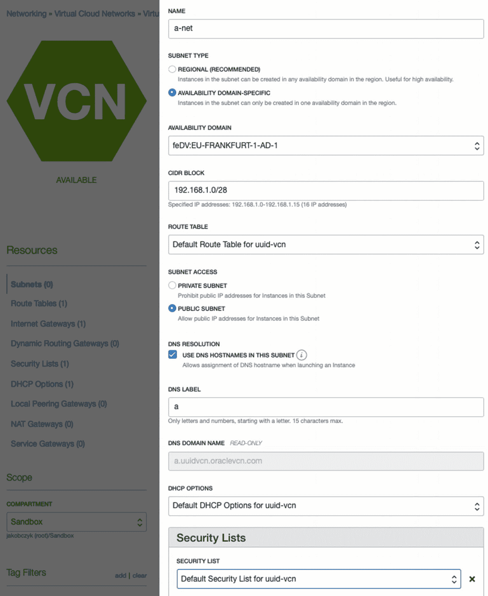
图 2-17
在 OCI 控制台中创建 VCN 子网向导

有两种类型的子网：
*   `A public subnet`（公共子网）允许你为在此子网中配置的计算实例分配公共 IP 地址。你仍然可以在公共子网中创建没有公共 IP 地址的计算实例。
*   `A private subnet`（私有子网）不允许你为在此子网中配置的计算实例分配公共 IP 地址。这些实例可以使用不同的方式与 Internet 和其他网络通信。你将在第 6 章中了解更多相关信息。


### 计算实例

现在，我们该在 Oracle Cloud Infrastructure 中配置第一个计算实例了。在本章前面描述的规划阶段，我们决定使用最小的虚拟机规格，即 `VM.Standard2.1`。我们还选择使用可用的最新版 Oracle Linux 7。在撰写本文时，这是 Oracle Linux 7.6，但您也可能会看到更新的次版本。目前，您的学习 compartment 中应该没有任何计算实例。图 2-18 显示了 OCI 控制台中“实例”视图的空列表。

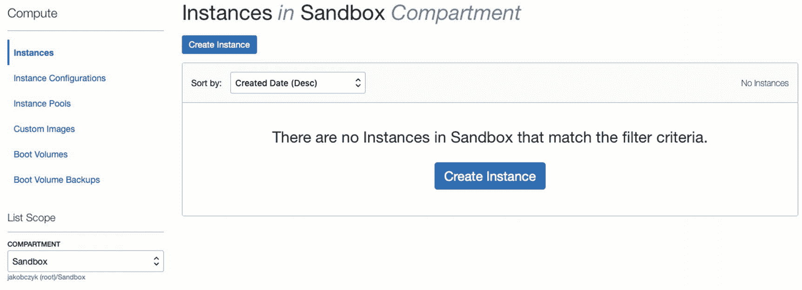

图 2-18：查看 OCI 控制台实例

即使您自动化了某个基于云的虚拟机的整个启动过程，您可能仍然希望能够远程连接到该主机的命令行。对于基于 Linux 的机器（如 Oracle Linux），我们将使用 SSH 公钥认证。如果您主要使用的是基于 Windows 的主机，这可能是您第一次听说 SSH。其原理相当简单。您生成一对相关的文件，即所谓的密钥。一个叫做私钥，另一个叫做公钥。您将公钥上传到云中的一个或多个 Linux 机器。为了验证您的远程终端连接，您需要私钥。OCI 控制台中的计算实例创建向导为我们提供了上传公钥的机会。

**注意**

本书中的代码片段已在 macOS 和 Windows Subsystem for Linux 上测试过。此外，所有命令都应适用于主流的 Linux 发行版。如果您使用 Windows 且不想使用 Windows Subsystem for Linux，您随时可以在虚拟机上运行 Linux。而且，大多数代码片段也可能在 Windows 的 Git Bash 中运行。

如果您想使用 RSA 算法创建新的 SSH 密钥对，只需执行此命令：

```
$ ssh-keygen -t rsa -b 2048 -C michal@vm -f ~/oci_id_rsa
```

您可以选择使用密码保护您的私钥。每次使用私钥时，系统都会提示您输入密码。将生成两个文件：

*   `oci_id_rsa`，这是私钥。
*   `oci_id_rsa.pub`，这是公钥。在 OCI 控制台中创建实例时，您将上传此文件。

图 2-19 展示了 SSH 密钥对的创建过程。

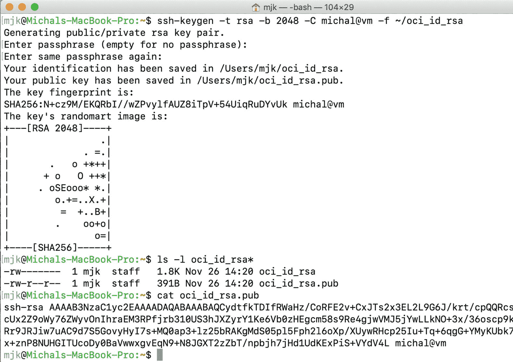

图 2-19：创建 SSH 密钥对

我们希望我们的 Oracle Linux 计算实例在机器启动并运行后，能够立即服务于 UUID 服务客户端。我们不希望执行任何手动安装或配置。我们将利用基础操作系统镜像中已预装在计算实例上的 `cloud-init` 包。`cloud-init` 的作用是在云实例首次启动时执行早期初始化。您的角色是在实例创建期间，以一种支持的格式上传一个 `用户数据` 文件。清单 2-3 展示了 `cloud-config` YAML 格式的 `cloud-init` 用户数据。您可以在 `git/chapter02/cloud-init` 目录中找到 `cloud-config` 文件。

```yaml
#cloud-config
yum_repos:
  ol7_developer_EPEL:
    name: Oracle Linux $releasever Developement Packages ($basearch)
    baseurl: http://yum.oracle.com/repo/OracleLinux/OL7/developer_EPEL/$basearch/
    enabled: true
    gpgcheck: true
    gpgkey: file:///etc/pki/rpm-gpg/RPM-GPG-KEY-oracle
package_upgrade: true
packages:
  - tree
  - wget
  - python36
  - python36-pip
write_files:
  - content: |
      [Unit]
      Description = Launching UUID Service API
      After = network.target
      [Service]
      Environment=FLASK_APP=/home/opc/uuidservice/app.py
      Environment=LC_ALL=en_US.utf8
      Environment=LANG=en_US.utf8
      ExecStart = /home/opc/uuidservice/venv/bin/flask run --host=0.0.0.0
      User = opc
      [Install]
      WantedBy = multi-user.target
    path: /etc/systemd/system/uuidservice.service
runcmd:
  - [ "mkdir", "-p", "/home/opc/uuidservice/venv" ]
  - [ "chown", "opc:opc", "/home/opc/uuidservice" ]
  - [ "python3", "-m", "venv", "/home/opc/uuidservice/venv" ]
  - [ "/home/opc/uuidservice/venv/bin/python3", "-m", "pip", "install", "--upgrade", "pip" ]
  - [ "/home/opc/uuidservice/venv/bin/python3", "-m", "pip", "install", "flask" ]
  - [ "wget", "-qO", "/home/opc/uuidservice/app.py", "https://raw.githubusercontent.com/mtjakobczyk/oci-book/master/chapter02/uuid-service/app.py " ]
  - [ "firewall-offline-cmd", "--add-port=5000/tcp" ]
  - [ "systemctl", "restart", "firewalld" ]
  - [ "ln", "-s", "/etc/systemd/system/uuidservice.service", "/etc/systemd/system/multi-user.target.wants/uuidservice.service" ]
  - [ "systemctl", "enable", "uuidservice.service" ]
  - [ "systemctl", "start", "uuidservice.service" ]
final_message: "UUID Service API node is running, after $UPTIME seconds"
```

清单 2-3： `vm.config.yaml`

稍后，您将把这个文件上传到 OCI 控制台实例创建向导。首先，让我们了解一下它的作用。如果您仔细查看清单 2-3，会发现它由六个命名节组成。

*   `yum_repos` 定义一个将要添加到 Yum 的新仓库。
*   `package_upgrade` 触发系统范围的包更新。
*   `packages` 列出了将在机器上安装的新包。
*   `write_files` 在给定路径使用提供的内容创建一个新文件。
*   `runcmd` 按提供的顺序执行命令。
*   `final_message` 在处理完成时打印一条消息。

但是，我们的云配置具体做了什么呢？首先，它将 Oracle Linux EPEL 仓库添加到 Yum。该仓库包含我们运行基于 Python 的 UUID 服务所需的 Python 3。`cloud-init` 将执行系统范围的包升级，并不仅安装 Python 3，还安装 `wget` 和 `tree` 实用程序。另一个有趣的部分是 `write_files` 节，在我们的案例中，它创建了一个新的 systemd 单元文件。文件内容的创建方式使得 UUID 服务能够作为 systemd 服务运行。通过这种方式，我们能够遵循一种在 Linux 中将应用程序作为操作系统服务运行的标准化方法。最后但同样重要的是，`runcmd` 节运行一系列命令。首先，为新的 Python 虚拟环境创建目录，然后使用 Python 3 的 `venv` 模块生成虚拟环境本身。接下来，在虚拟环境内部，我们升级 Python 包安装器 (`pip`) 并用它来安装 Flask。随后的步骤使用 `wget` 实用程序从本书相关的 GitHub 仓库下载 UUID 服务代码，并在操作系统防火墙中开放 5000 端口。最后三个命令有效地链接、启用并启动了 systemd 服务。这样，UUID 服务就作为一个操作系统服务运行，并在每次重启时自动启动。

您可能想知道为什么命令被指定为数组。`cloud-init` 有两种运行命令的方式。如果命令像这样包装在数组中，它将通过操作系统调用直接作为一个新进程执行：

```yaml
runcmd:
  - [ "mkdir", "-p", "/home/opc/uuidservice/venv" ]
```


如果简单地写成这样的字符串，命令会先被写入一个文件，然后传递给操作系统 shell 进行处理：

```
runcmd:
- mkdir -p /home/opc/uuidservice/venv
```

虽然从性能角度来看，前一种方式可能被认为稍快一些，但只有后一种方式允许你使用管道组合多个命令，像这样：

```
runcmd:
- 'echo $(date) | tee /home/opc/datemarker'
```

在同一个 `runcmd` 部分混合使用这两种风格是可以的。

**提示**
与其直接从清单 2-3 复制用户数据文件，我建议你从我的 GitHub 账户克隆与本书关联的 Git 仓库，并使用在 `oci-book/chapter02/cloud-init` 找到的 cloud-init 用户数据文件。这样，如果将来有变动，你将能享受始终最新的代码。

现在，请准备好我们刚刚讨论的两个文件。
- 公共 SSH 密钥
- UUID 服务的用户数据文件

我们已经准备好启动实例了。以下是你如何使用 OCI 控制台创建新的计算实例：

1.  转到菜单 ➤ 计算 ➤ 实例。
2.  确保选择了 `Sandbox` 隔离区。
3.  点击创建实例。
4.  将你的实例命名为 **uuid-1**。
5.  点击显示计算形状、网络和存储选项。
6.  将映像源设置为最新的 Oracle Linux 基础映像，例如 Oracle Linux 7.6 或更新版本。
7.  提供所需详细信息：
    1.  选择你所在区域的第一个可用性域。
    2.  将实例类型设置为虚拟机。
    3.  选择 `VM.Standard2.1` 作为你的实例计算形状。
8.  在“配置网络”部分，如图 2-22 所示：
    1.  确保选择了你新建的 a-net 子网。
    2.  勾选“分配公有 IP 地址”。
9.  在“添加 SSH 密钥”部分：
    1.  选择新生成的公钥（`oci_id_rsa.pub`），如图 2-21 所示。
10. 点击“显示高级选项”。
11. 在高级选项下的“管理”选项卡上，如图 2-23 所示：
    1.  选择清单 2-3 中显示的用户数据文件。你总能在我的 GitHub 账户的 [`https://raw.githubusercontent.com/mtjakobczyk/oci-book/master/chapter02/cloud-init/vm.config.yaml`](https://raw.githubusercontent.com/mtjakobczyk/oci-book/master/chapter02/cloud-init/vm.config.yaml) 找到用户数据文件的最新版本。
12. 在高级选项下的“网络”选项卡上，如图 2-24 所示：
    1.  将私有 IP 地址设置为 **192.168.1.2**。
    2.  将主机名设置为 **uuid1**。
13. 点击“创建”。

图 2-20 显示了 OCI 控制台中的实例创建视图。

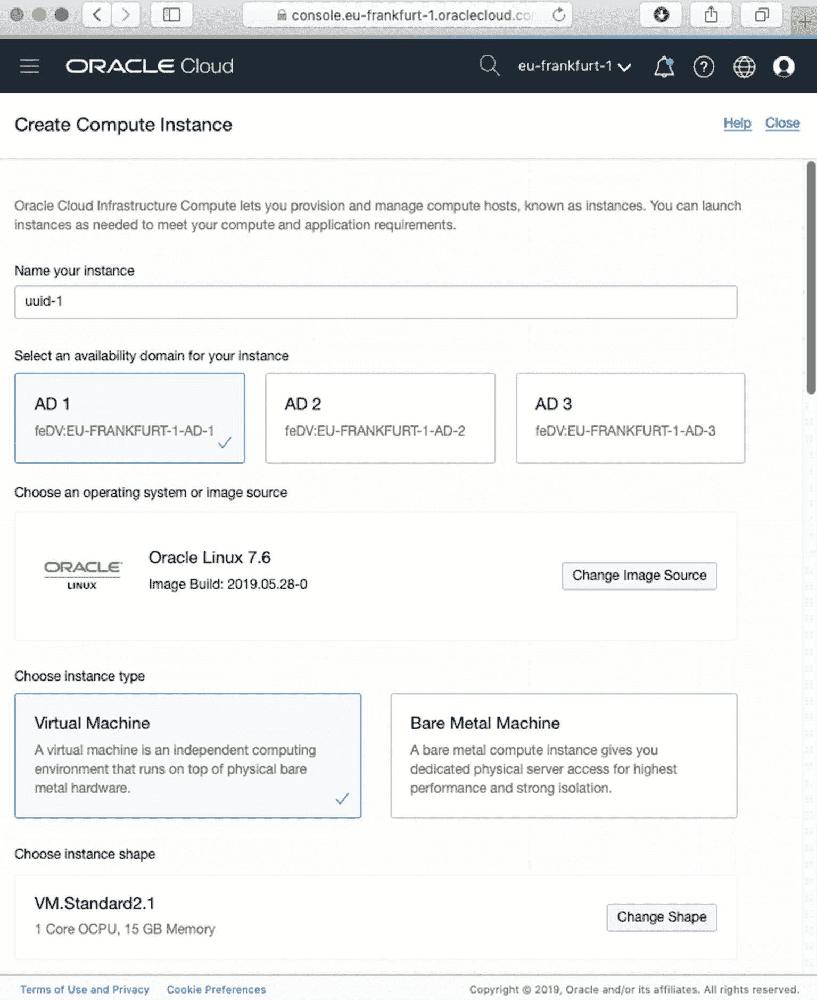
*图 2-20. 在 OCI 控制台中创建新的计算实例*

图 2-21 显示了 OCI 控制台实例创建向导中的 SSH 密钥上传部分。

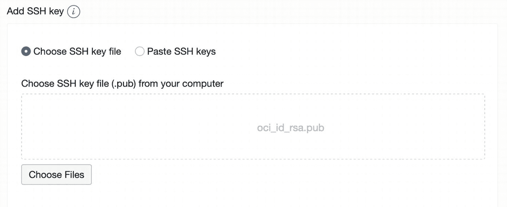
*图 2-21. 在实例创建向导中上传 SSH 公钥*

图 2-22 显示了 OCI 控制台实例创建向导中的网络配置部分。

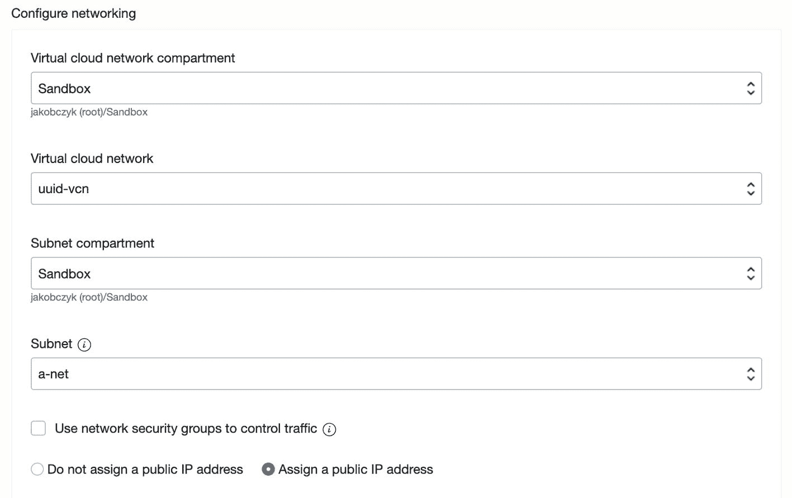
*图 2-22. 在实例创建向导中配置网络*

图 2-23 显示了 OCI 控制台实例创建向导中的用户数据上传部分。

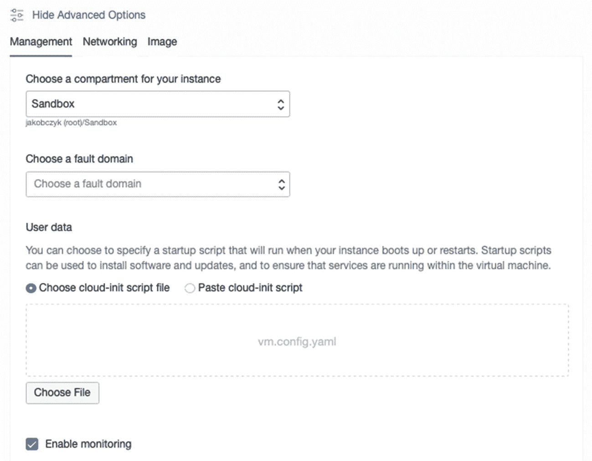
*图 2-23. 在 OCI 控制台实例创建向导中上传用户数据*

图 2-24 显示了 OCI 控制台实例创建向导中的高级网络配置部分。

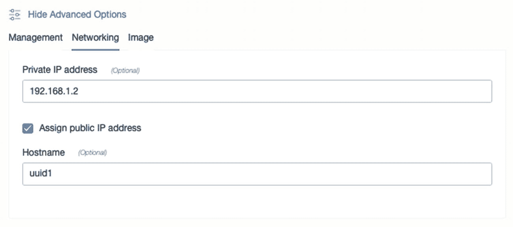
*图 2-24. 在实例创建向导中配置高级网络*

配置此计算形状和基础映像通常需要大约一分钟。我们已勾选了“分配公有 IP 地址”复选框；因此，附加到你实例上的主虚拟网络接口卡（vNIC）将从 Oracle Cloud 的公有 IPv4 地址池中获得一个分配的公有 IP 地址。只要子网的安全列表规则允许特定流量，你就可以使用此 IP 地址连接到实例。私有 IP 地址在虚拟云网络（VCN）内使用，以实现计算实例之间的本地通信。

图 2-25 显示了 OCI 控制台中的计算实例配置过程。

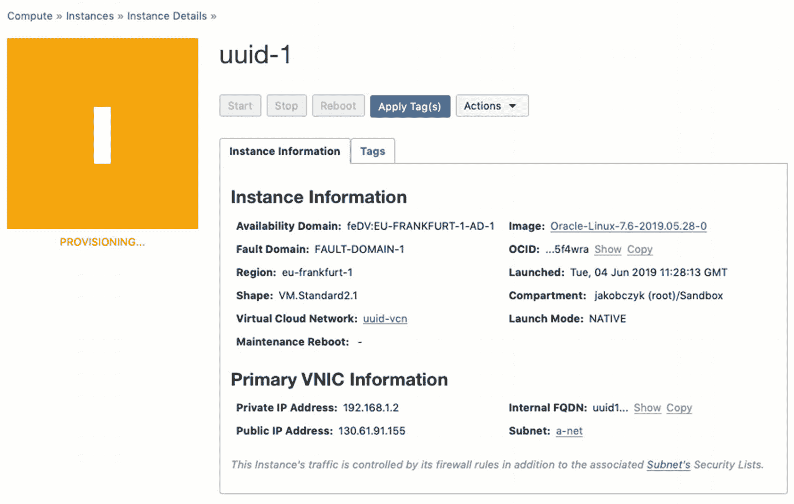
*图 2-25. OCI 控制台中的计算实例配置*

图 2-26 显示了 OCI 控制台中正在运行的计算实例。

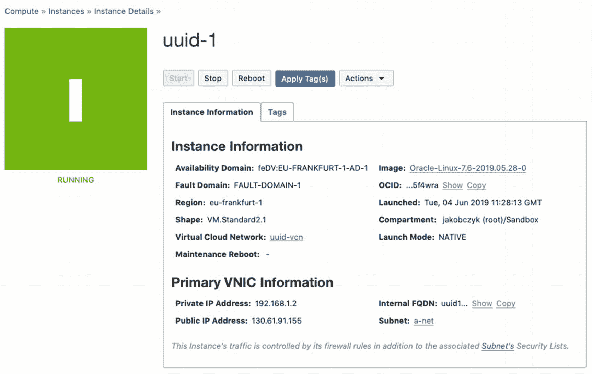
*图 2-26. 在 OCI 控制台中查看正在运行的计算实例*

## 测试应用程序

云解决方案通常被设计和自动化，使得无需在终端中手动运行任何额外的初始化脚本。你从一开始就使用自定义映像和包含初始化指令的用户数据相结合的方式，以开箱即用的状态部署你的解决方案。这也适用于我们的 UUID 服务。一旦实例的启动过程完成并且 `cloud-init` 执行了所有用户数据指令，API 就启动并运行了。

### SSH 连接

不过，让我在这里破个例。我想带你看看实例内部，而使用操作系统 shell 是再好不过的方式了。让我们使用 `ssh` 远程连接到 `uuid-1` 计算实例。你可以在实例详情中找到实例的公有 IP，如图 2-26 所示。在我的例子中，它是 `130.61.91.155`。尽管你将使用基于密钥的认证，但仍然需要指定你建立连接所用的用户名。对于 Oracle Linux 和 CentOS，请使用 `opc` 用户名。对于 Ubuntu，请使用 `ubuntu` 用户名。

```
$ UUID1_INSTANCE=130.61.91.155
$ ssh -i ~/oci_id_rsa opc@$UUID1_INSTANCE
```

还有一件事，如果你在看到实例状态从“配置中”变为“运行中”后无法立即连接到终端，请不要惊讶。即使实例被称为“运行中”，启动 SSH 守护进程可能还需要几秒钟时间。

**提示**
如果你使用的是 Windows，我建议使用 Windows Subsystem for Linux、Linux 客户机虚拟机或 Git Bash，以获得与使用 UNIX 平台相同的 `ssh` 体验。

图 2-27 显示了如何连接到远程计算实例。

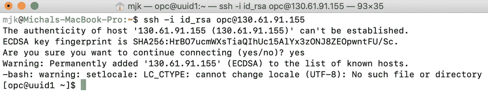
*图 2-27. 通过 SSH 连接到计算实例*

恭喜，你刚刚进入了云空间。


### 等待 cloud-init

在采取任何操作之前，我们首先要确认用户数据指令是否已执行完毕。在清单 2-3 的底部，你会看到 `final message`。顾名思义，这是 cloud-init 处理的最后一条指令。图 2-28 展示了在日志（`/var/log/cloud-init.log`）中找到该消息（"UUID Service API node is running"）的最简单方法。一些 cloud-init 指令可能需要较长时间，特别是当它们从远程仓库下载或更新软件时。在我们的案例中，完成所有初始化步骤花了四分钟。这意味着什么？如果你看不到这条消息，就需要再等待一会儿。你可以使用 `tail -f` 命令，通过观察 `/var/log/cloud-init.log` 文件来监看进度。根据正在更新的软件包数量，此操作可能持续几分钟。在日志中看到此消息之前，请不要继续下一步，如图 2-28 所示。

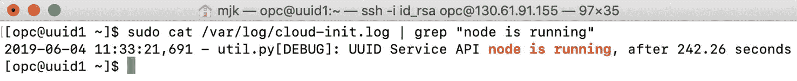

图 2-28

通过 SSH 连接到计算实例

```
[opc@uuid1]$ sudo cat /var/log/cloud-init.log | grep "node is running"
```

我们的服务真的在运行吗？眼见为实。你可以运行此命令来再次检查 systemd 服务状态：

```
[opc@uuid1]$ sudo systemctl status uuidservice.service
```

图 2-29 显示了预期的输出。

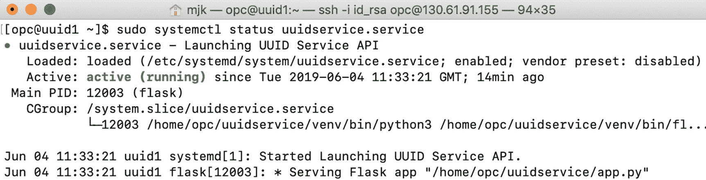

图 2-29

UUID 服务的预期 systemd 服务状态

服务真的在监听端口 5000 吗？用这个命令检查：

```
[opc@uuid1]$ ss -nltp
```

图 2-30 显示了预期的输出。

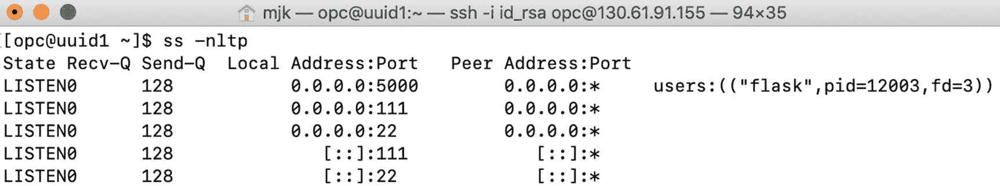

图 2-30

查看 UUID 服务监听连接的端口

看起来我们的第一个云应用程序确实正在运行。

### 开放端口

在未来云项目中需要排查的典型问题通常与 VCN 安全规则和操作系统防火墙规则相关。仅仅为计算实例所连接的子网使用的安全列表添加一条 VCN 安全规则是不够的。你还需要在操作系统防火墙中打开所需的端口。如果我们查看上传到 `uuid-1` 实例的用户数据，你会清楚地看到我们添加了一条打开端口 5000 的规则。你可以在实例的 shell 中运行此命令来确认规则已创建：

```
[opc@uuid1]$ sudo firewall-cmd --list-ports
```

图 2-31 显示了预期的输出。


图 2-31

列出 uuid-1 上的开放端口

现在，你可以通过执行 `exit` 命令断开与实例的连接。

### API 测试

终于到了！是时候执行一个简单的冒烟测试，看看 UUID 服务是否真的在云中可用。我们正在处理一个 REST API，它只包含一个资源 `identifiers`，并且只支持一种方法 `GET`。这再简单不过了。在我们的首次尝试中，将使用 `curl` 命令。它在 Mac/Linux 控制台、Windows Subsystem for Linux 和 Windows 的 GitBash 上都可用。请断开与云实例的连接，并发出以下命令，根据你的实例所附加的公网 IP 进行调整：

```
$ curl -is $UUID1_INSTANCE:5000/identifiers
```

你应该会看到类似图 2-32 的内容。除了 IP 地址，`uuid` 元素会有所不同，因为按定义它应该是唯一的，不是吗？

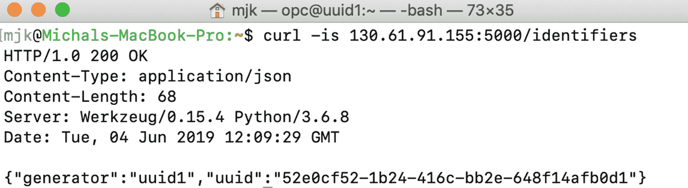

图 2-32

使用 curl 测试 UUID 服务 API

如果你更喜欢像 Postman 这样的图形化工具，你会看到类似图 2-33 的内容。

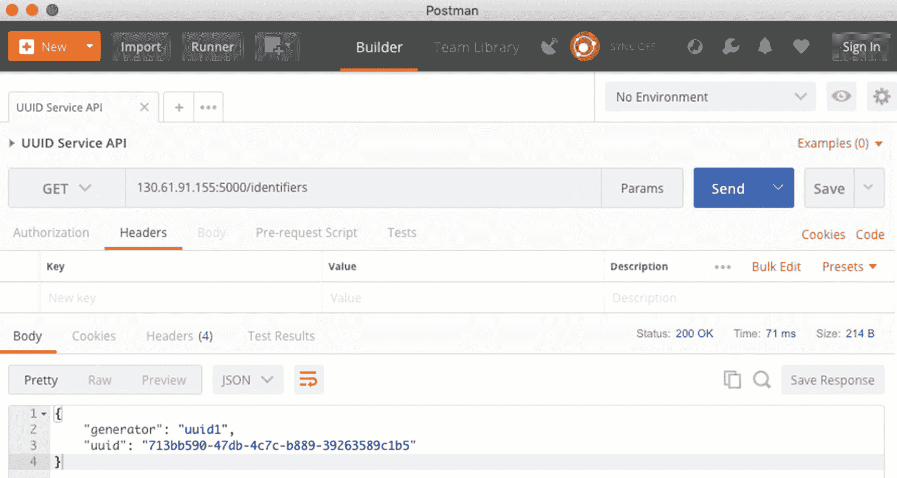

图 2-33

使用 Postman 测试 UUID API

干得好！你已经达到了应用程序运行并成功测试的阶段。总结一下，我们设法配置了一个带有互联网网关的新 VCN，创建了一个新的公有子网，并添加了一条新的路由规则以通过互联网网关引导出站流量，以及一条安全规则以允许到任何应用此规则的计算实例上端口 5000 的入站 TCP 流量。在首次启动时，计算实例下载了所有必需的软件包，创建了 Python 虚拟环境，从 GitHub 下载了 UUID 服务代码，并为应用程序安装了一个新的 systemd 服务。图 2-34 展示了我们所构建内容的基础设施示意图。

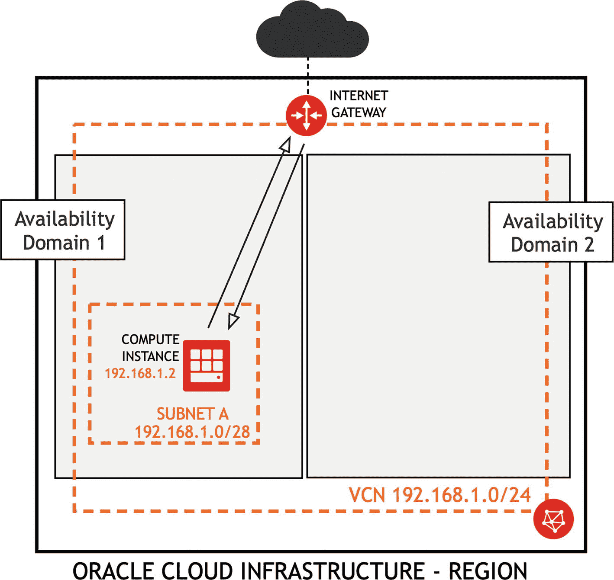

图 2-34

单 UUID 服务 API 节点基础设施示意图

在下一节中，你将手动横向扩展 API。这意味着什么？你将在另一个可用性域中创建第二个实例，并在两个实例之上创建一个负载均衡器。这样，设置将具备容错能力。

### 横向扩展

*横向扩展*一个应用程序意味着添加更多通常是相同类型的实例。这是描述水平扩展的另一个术语。你想要扩展应用程序的原因有两个：

*   提高处理吞吐能力
*   增加容错能力

单个实例永远不足以提供可靠的云 API。然而，仍然可能出问题，摧毁你孤立的应用程序节点。如果你有多个执行相同职责的节点，并且分布在各个数据中心，那么即使单个数据中心发生故障，你也可能永远不会经历完全停机。此外，如果你有更多相同类型的实例，就可以并行处理更多的请求。事情就这么简单。

图 2-35 展示了水平扩展。


图 2-35

水平扩展应用程序

基本的云概念之一是自动伸缩。*自动伸缩* 发生在云控制平面根据变化的指标（如请求数或 CPU 利用率）动态地通过添加或移除实例节点来水平扩展应用程序时。我们将在本书后面更详细地讨论自动伸缩。在本节中，我将向你展示如何使用自定义镜像手动扩展应用程序。


### 自定义镜像

一个`image`（镜像）是一个模板，指定了操作系统以及在实例启动期间必须预安装的任何附加软件。Oracle Cloud Infrastructure 附带了一些包含不同操作系统的基础镜像。您可以基于选定的操作系统镜像配置一个实例，安装您选择的软件，执行一些额外的配置，并基于此实例创建一个新的`custom image`（自定义镜像）。通过这种方式，您将能够重用您的自定义软件栈配置来启动其他计算实例。

如果您有一个正在运行的计算实例，您可以基于该实例创建一个新的自定义镜像。图 2-36 显示了您可以在计算实例上执行的操作。其中之一是“创建自定义镜像”。

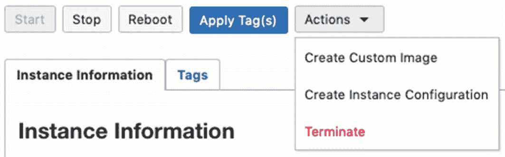

图 2-36

可用的计算实例操作

以下是您如何基于现有的计算实例创建新的自定义镜像：

1.  转到`Menu ➤ Compute ➤ Instances`（菜单 ➤ 计算 ➤ 实例）。
2.  确保选择了`Sandbox` compartment（ compartment）。
3.  单击我们的计算实例的名称。
4.  单击`Actions ➤ Create Custom Image`（操作 ➤ 创建自定义镜像）以打开自定义镜像向导。
5.  为您的新自定义镜像提供一个名称。
6.  单击`Create Custom Image`（创建自定义镜像）。

    Tip 考虑在您的自定义镜像名称后附加用于创建该自定义镜像的原始镜像的名称。

图 2-37 显示了 OCI 控制台中的自定义镜像创建向导。

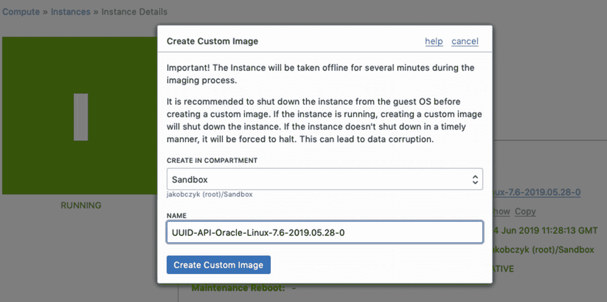

图 2-37

在 OCI 控制台中查看自定义镜像创建向导

如果您决定基于某个特定的计算实例创建自定义镜像，在构建镜像期间，该实例将被离线。镜像创建完成后，计算实例将再次启动。

图 2-38 显示了在创建镜像时，作为新自定义镜像基础的计算实例。

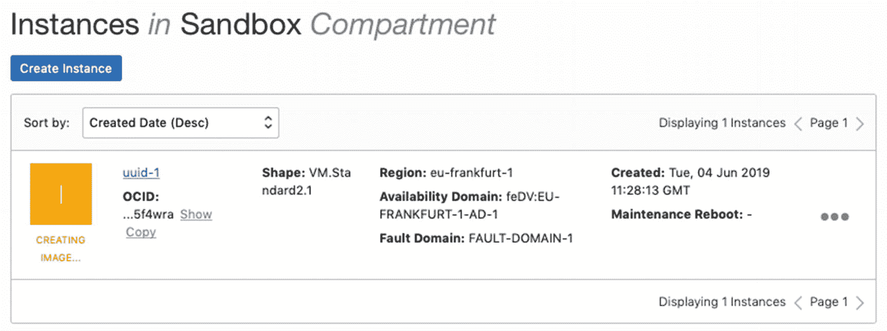

图 2-38

在 OCI 控制台实例列表中创建自定义镜像

图 2-39 显示了正在创建中的新自定义镜像。

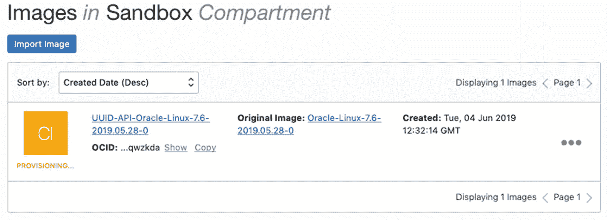

图 2-39

在 OCI 控制台镜像列表中创建自定义镜像

我们将使用新创建的自定义镜像来启动第二个运行 UUID 服务 API 的实例。为了实现容错，我们将在不同的可用性域中部署第二个节点。让我们按照计划在第二个可用性域中创建一个新的子网。

### 不同可用性域中的子网

我们将遵循几节前创建第一个子网时的相同步骤顺序。为了简单起见，我们将重用第一个子网正在使用的相同路由表和安全列表。

以下是您如何使用 OCI 控制台创建一个新的 VCN 子网：

1.  转到`Menu ➤ Networking ➤ Virtual Cloud Networks`（菜单 ➤ 网络 ➤ 虚拟云网络）。
2.  确保选择了`Sandbox` compartment（ compartment）。
3.  单击您的 VCN 的名称。
4.  在“资源”菜单中单击`Subnets`（子网）。
5.  单击`Create Subnet`（创建子网）。
6.  提供所需的值：
    1.  输入`b-net`作为显示名称。
    2.  选择“可用性域特定子网类型”。
    3.  在您的区域中选择第二个可用性域（后缀为 AD-2）。
    4.  填入`192.168.1.16/28`作为 CIDR 块。
    5.  确保选择了默认路由表。
    6.  选择“公共子网”选项。
    7.  选择“在此子网中使用 DNS 主机名”。
    8.  使用一个字符的简短标签`b`作为 DNS 标签。
    9.  确保选择了默认 DHCP 选项设置。
    10. 确保选择了默认安全列表。
7.  单击`Create`（创建）。

在此阶段，您应该能够在两个不同的可用性域中看到两个子网，如图 2-40 所示。请注意，每个子网都位于不同的可用性域中。

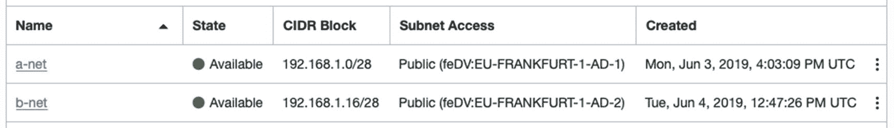

图 2-40

在 OCI 控制台中显示的两个不同可用性域中的两个子网

现在，我们将在这个新创建的子网中创建第二个 UUID 服务 API 实例。


## 第二个计算实例

第二个计算实例将运行与第一个计算实例上相同的 systemd 服务。这次，我们不会上传任何用户数据，因为所有内容都已配置在我们从第一个计算实例创建的镜像中。图 2-41 展示了镜像选择屏幕以及此次你需要做出的选择。

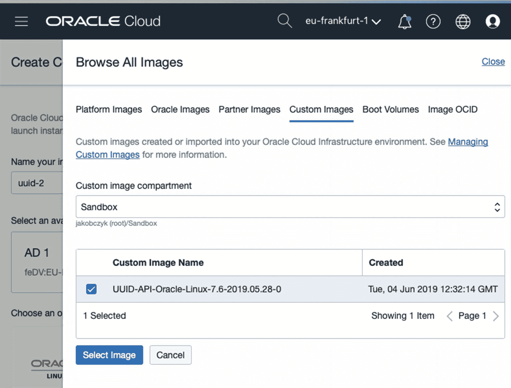
*图 2-41：在 OCI 控制台中选择自定义镜像*

以下是使用 OCI 控制台创建第二个计算实例的步骤：

1.  导航到 `菜单 ➤ 计算 ➤ 实例`。
2.  确保已选择 `Sandbox` 隔区。
3.  点击 `创建实例`。
4.  提供所需详细信息：
    1.  将实例命名为 `uuid-2`。
    2.  选择您区域中的第二个可用性域。
    3.  将镜像源设置为新创建的自定义镜像；在我的例子中，其名称以 `UUID-API-Oracle-Linux-` 开头。
    4.  将实例类型设置为 `虚拟机`。
    5.  选择 `VM.Standard2.1` 作为您的实例形状。
5.  在 `配置网络` 部分：
    1.  确保选择了新的 `b-net` 子网。
    2.  选择 `分配公网 IP 地址`。
6.  在 `添加 SSH 密钥` 部分：
    1.  选择公钥（`oci_id_rsa.pub`），如图 2-21 所示。
7.  点击 `显示高级选项`。
8.  在 `高级选项` 下的 `网络` 选项卡中，如图 2-24 所示：
    1.  将 `私有 IP 地址` 设置为 `192.168.1.18`。
    2.  将 `主机名` 设置为 `uuid2`。
9.  点击 `创建`。

**注意** 在这种情况下，无需上传 `cloud-config` 用户数据。自定义镜像已预装了 UUID API 服务，因为它是在 `uuid-1` 计算实例的基础上创建的。请将 `用户数据` 部分留空。

图 2-42 展示了 OCI 控制台中的实例创建视图。请注意，这次我们使用的是第二个可用性域和自定义镜像。

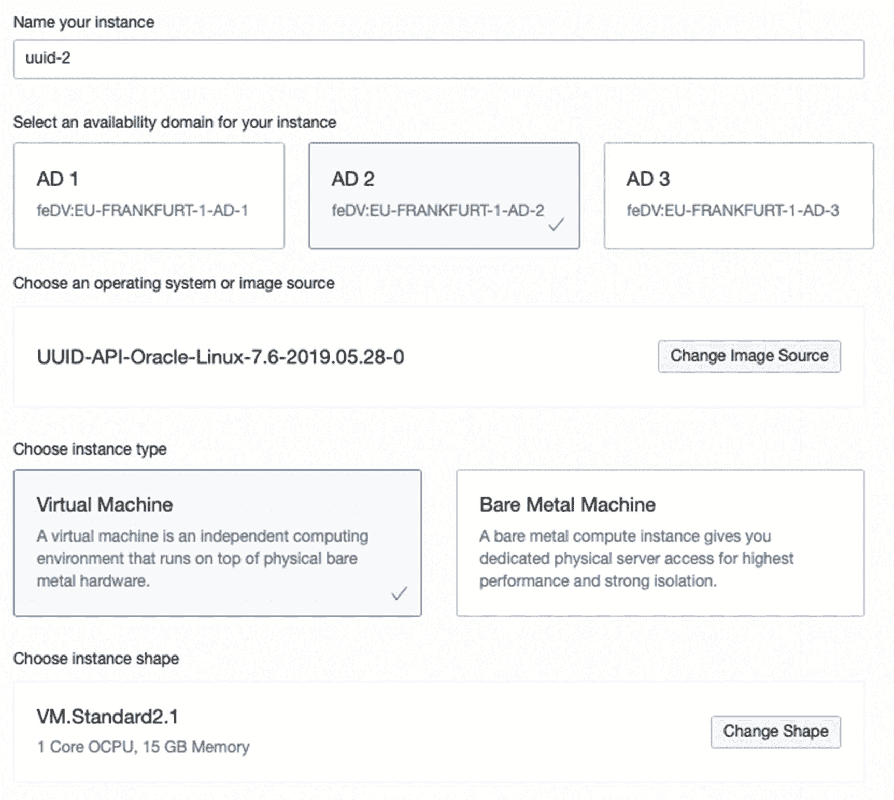
*图 2-42：在 OCI 控制台中创建第二个计算实例*

图 2-43 展示了高级网络配置部分。

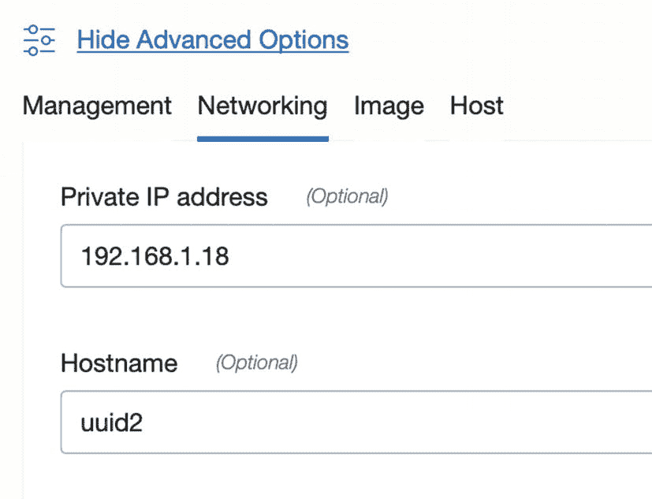
*图 2-43：在 OCI 控制台实例创建向导中配置高级网络*

一旦您在 OCI 控制台的实例创建向导中点击 `Create` 按钮确认了第二个实例的参数选择，配置过程就会开始。这次，UUID 服务将通过自定义镜像预先安装好，并且没有涉及长时间运行的用户数据。因此，第二个实例应该启动得更快。让我们等待直到看到实例正在运行，如图 2-44 所示。

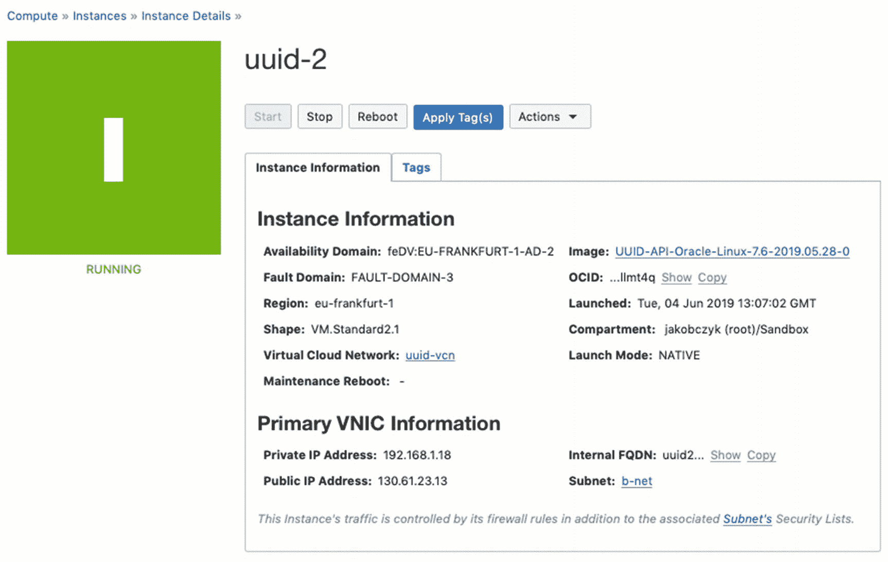
*图 2-44：在 OCI 控制台中查看正在运行的第二个计算实例*

您现在可以在两个节点上测试 API。请记得替换公网 IP 地址，并在两种情况下都使用分配给您的实例的地址。

```bash
$ UUID2_INSTANCE=130.61.23.13
$ curl $UUID1_INSTANCE:5000/identifiers
{
"generator":"uuid1",
"uuid":"bc85b59f-cf0f-4035-a730-c25111db00ec"
}
$ curl $UUID2_INSTANCE:5000/identifiers
{
"generator":"uuid2",
"uuid":"6eca06e0-65f2-444b-acb8-b9c46741dc72"
}
```

图 2-45 显示两个实例均可操作。

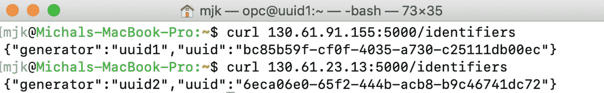
*图 2-45：测试 UUID 服务 API 的两个节点*

在本节中，我们部署并测试了运行我们应用程序的第二个节点。图 2-46 使用 Oracle Cloud Infrastructure 符号展示了当前的应用程序基础架构。

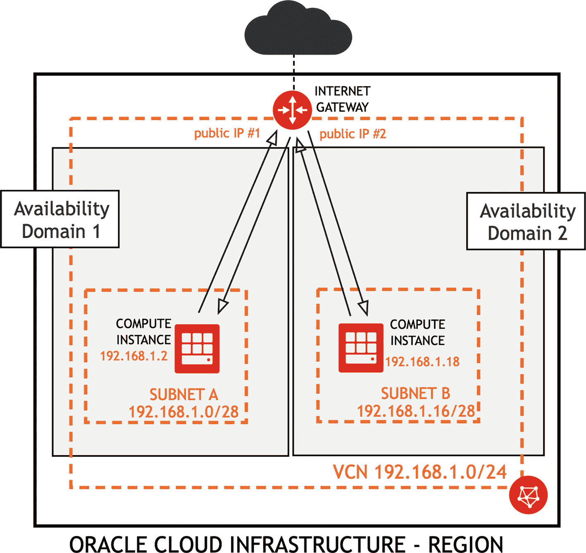
*图 2-46：基础架构图上的 UUID API 的两个节点*

当前设置有一个主要痛点。API 使用者（即调用 API 的应用程序）必须明确指定特定虚拟机的公网 IP 地址。采用这种方法，随着 API 的向外扩展，您会产生更多带有不同公网 IP 地址的无关端点。这不是设计高可用性解决方案的最佳方式。幸运的是，我们可以通过添加负载均衡器来改变这一点。


### 负载均衡器

负载均衡器为活动服务器或工作节点提供单一入口点和流量分发。我们将使用一个面向互联网的，即所谓的公共负载均衡器，它使用一个公共浮动 IP 来支持故障转移机制。这意味着您需要启动一对负载均衡器节点，每个节点位于不同的可用性域中。在任何给定时间，只有一个 LB 节点处于活动状态，并将流量转发到 UUID 服务 API 节点。第二个 LB 节点保持在备用模式。如果活动的 LB 节点发生故障，备用的 LB 节点将检测到此情况，并宣布自己为活动节点和当前 IP 地址持有者。

图 2-47 展示了容错公共负载均衡器的工作原理。

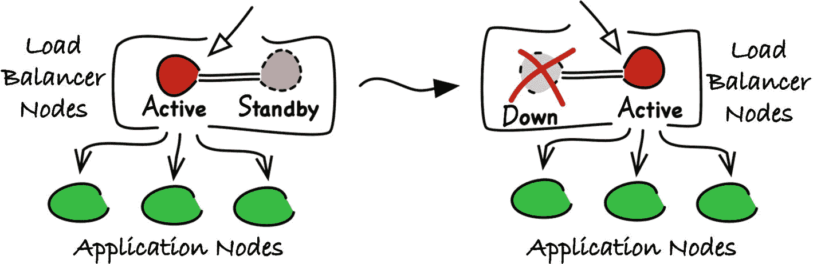

图 2-47
容错公共 IP 负载均衡器

公共负载均衡器需要两个专用的公共子网。我们将在托管 UUID 服务 API 节点的同一个 VCN 中创建它们。这次，我们将使用一个新的安全列表，因为其规则将与我们用于应用程序节点子网的默认安全列表不同。

请创建一个名为 `lb-sl` 的新安全列表。以下是使用 OCI 控制台创建新安全列表的方法：

表 2-2
负载均衡器子网的出站安全规则

|   | 类型       | 协议 | 源              | 目标            |
|---|------------|------|-----------------|-----------------|
| 1 | 无状态     | TCP  | 所有端口        | 192.168.1.0/24 端口 5000 |

表 2-1
负载均衡器子网的入站安全规则

|   | 类型     | 协议 | 源              | 目标        |
|---|----------|------|-----------------|-------------|
| 1 | 有状态   | TCP  | 0.0.0.0/0 所有端口 | 端口 80     |
| 2 | 无状态   | TCP  | 192.168.1.0/24 端口 5000 | 所有端口 |

1.  转到 菜单 ➤ 网络 ing ➤ 虚拟云网络。
2.  确保选择了 `Sandbox` 隔室。
3.  单击您的 VCN 名称。
4.  在资源菜单中单击 安全列表。
5.  单击 创建安全列表。
6.  给它一个名称：`lb-sl`。
7.  按照表 2-1 的定义创建入站规则。其中一条规则必须是无状态的。
8.  按照表 2-2 的定义创建出站规则。该规则必须是无状态的。
9.  单击 创建安全列表。

图 2-48 展示了入站规则。

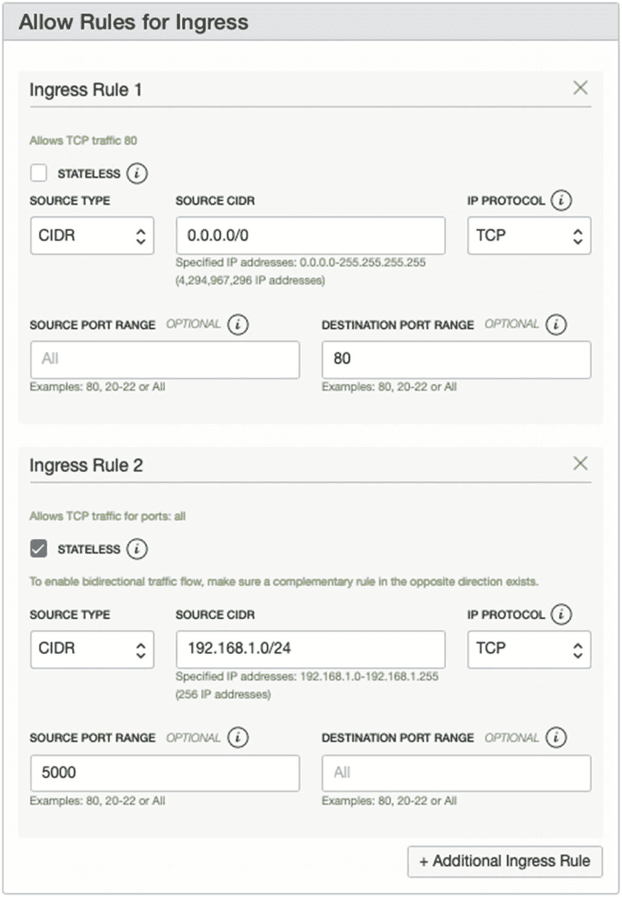

图 2-48
负载均衡器子网的入站规则

图 2-49 展示了预期的出站规则。

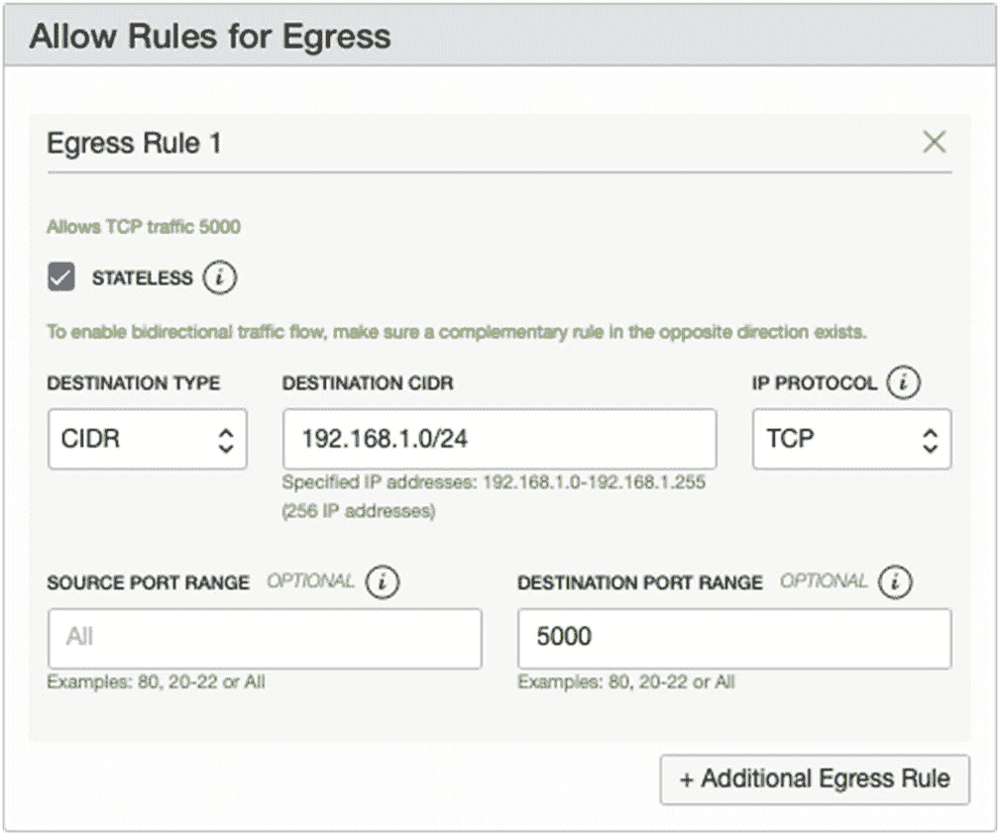

图 2-49
负载均衡器子网的出站规则

我们现在将在两个不同的可用性域中为容错公共负载均衡器节点对创建两个子网。

表 2-3
负载均衡器子网

| 名称 | AD | CIDR 块        | DNS 标签 | 安全列表 |
|------|----|---------------|---------|----------|
| c-net| 1  | 192.168.1.32/29 | c       | lb-sl    |
| d-net| 2  | 192.168.1.40/29 | d       | lb-sl    |

1.  转到 菜单 ➤ 网络 ing ➤ 虚拟云网络。
2.  确保选择了 `Sandbox` 隔室。
3.  单击您的 VCN 名称。
4.  在资源菜单中单击 子网。
5.  按照表 2-3 的定义，添加两个新的公共子网。

我们刚刚为高可用公共负载均衡器准备好了网络设置。连同 UUID API 子网，您应该在 VCN 中看到四个子网，如图 2-50 所示。

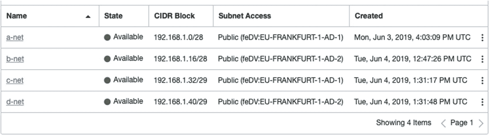

图 2-50
VCN 中的子网

实际上，负载均衡功能由一组协作的 OCI 资源提供，这些资源被封装在一个负载均衡器资源中。负载均衡器将请求转发到的计算节点或私有 IP 地址被视为后端，并被分组到一个后端集资源中。后端集不仅仅是一个简单的后端分组，因为它还定义了运行状况检查策略。运行状况检查策略决定了如何判断后端是正常运行还是发生故障。最后，需要一个监听器来接受入站流量；否则，来自互联网的请求将无法流入公共负载均衡器。图 2-51 展示了负载均衡器 OCI 资源的概念组成。

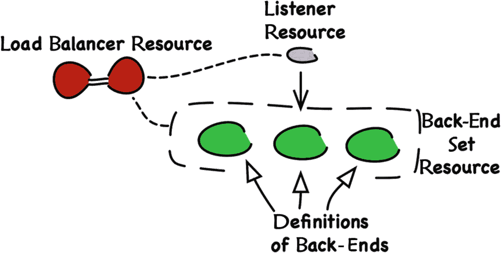

图 2-51
负载均衡器 OCI 资源

概述了负载均衡器的组成资源后，让我们来创建它们。使用 OCI 控制台时，您可以利用一个三步合一的负载均衡器创建向导。以下是创建新的负载均衡器资源的方法：

1.  转到 菜单 ➤ 网络 ing ➤ 负载均衡器。
2.  确保选择了 `Sandbox` 隔室。
3.  单击 创建负载均衡器。
4.  在 “添加详细信息” 步骤中，提供配置，如图 2-52 所示：
    1.  将负载均衡器命名为 `uuid-lb`。
    2.  将可见性设置为 公共。
    3.  选择小规格：100Mbps。
    4.  选择 公共负载均衡器。
    5.  将 VCN 设置为 `uuid-vcn` VCN。
    6.  选择负载均衡器子网：`c-net` 和 `d-net`。
5.  单击 下一步。
6.  在 “选择后端” 步骤中，提供配置，如图 2-53 所示：
    1.  确保选择了 加权轮询。
    2.  单击 添加后端 并选择两个计算实例。
    3.  对于每个后端实例，将端口更改为 `5000`。
7.  仍在 “选择后端” 步骤中，提供运行状况检查策略配置，如图 2-54 所示：
    1.  确保协议设置为 HTTP。
    2.  将端口设置为 5000。
    3.  将 URL 路径设置为 `/identifiers`。
    4.  确保状态代码设置为 200。
8.  单击 下一步。
9.  在 “配置监听器” 步骤中，提供配置，如图 2-55 所示：
    1.  选择 HTTP 协议并将端口设置为 80。
    2.  将监听器命名为 `uuid-lb-listener`。
10. 单击 创建负载均衡器。

图 2-52 展示了 OCI 控制台负载均衡器创建向导的 “负载均衡器添加详细信息” 步骤中预期的负载均衡器配置。

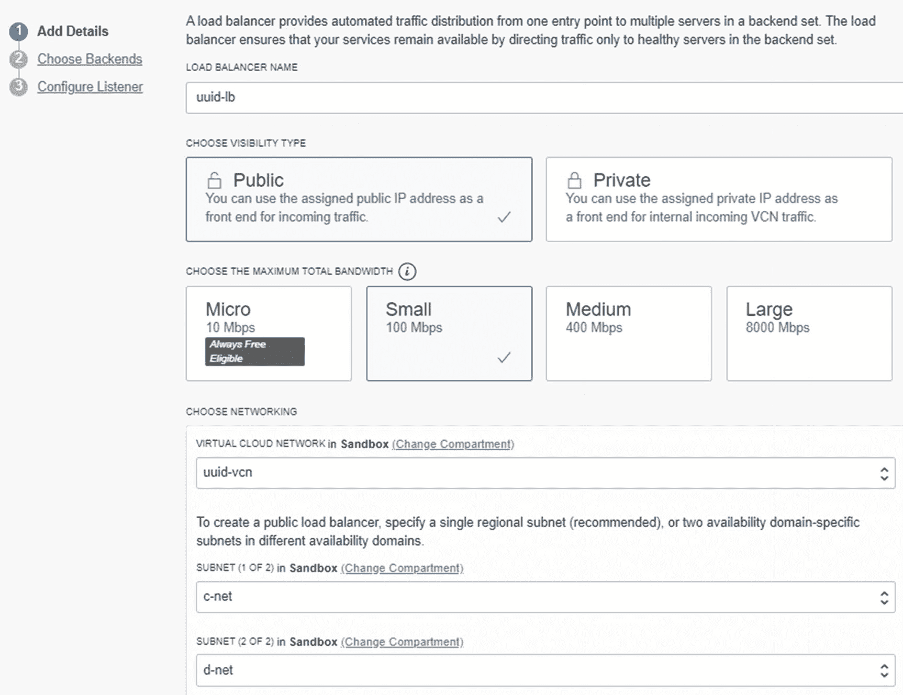

图 2-52
OCI 控制台负载均衡器向导中的 “添加详细信息” 步骤

图 2-53 展示了 OCI 控制台负载均衡器创建向导 “选择后端” 步骤中预期负载均衡器配置的第一部分。

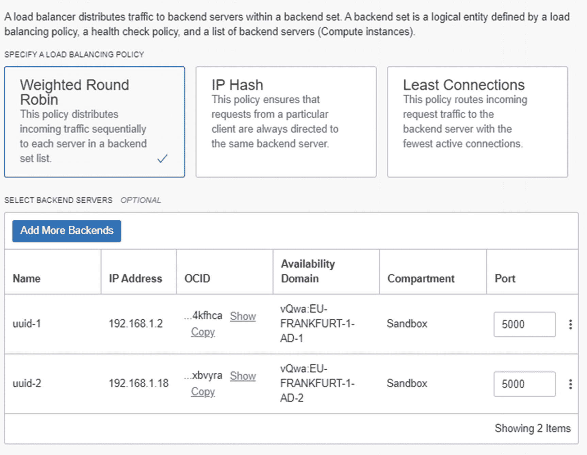

图 2-53
OCI 控制台负载均衡器向导中的 “选择后端” 步骤

图 2-54 展示了 OCI 控制台负载均衡器创建向导 “选择后端” 步骤中预期负载均衡器配置的第二部分。

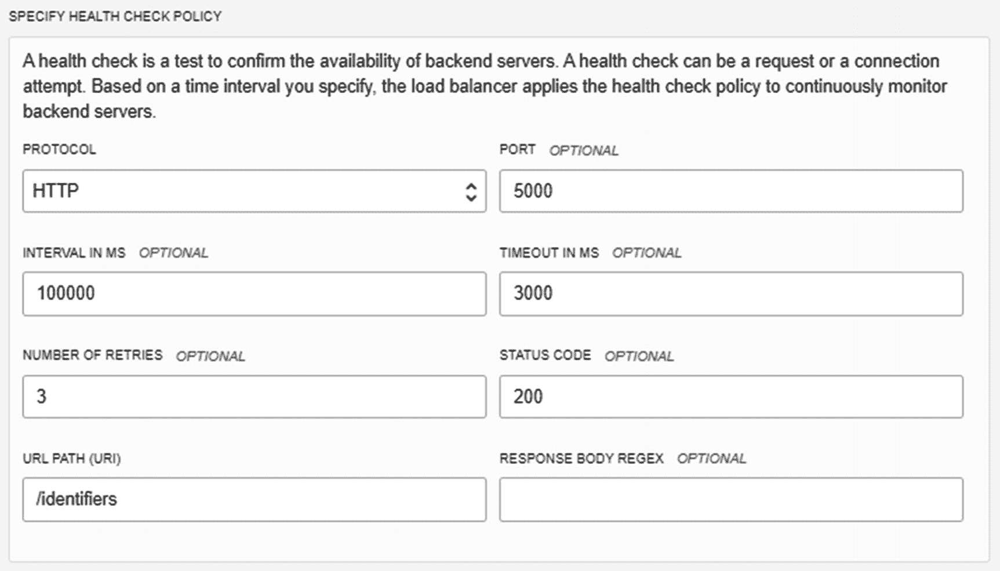

图 2-54
“选择后端” 步骤中的运行状况检查设置

图 2-55 展示了 OCI 控制台负载均衡器创建向导 “配置监听器” 步骤中预期的负载均衡器后端集配置。


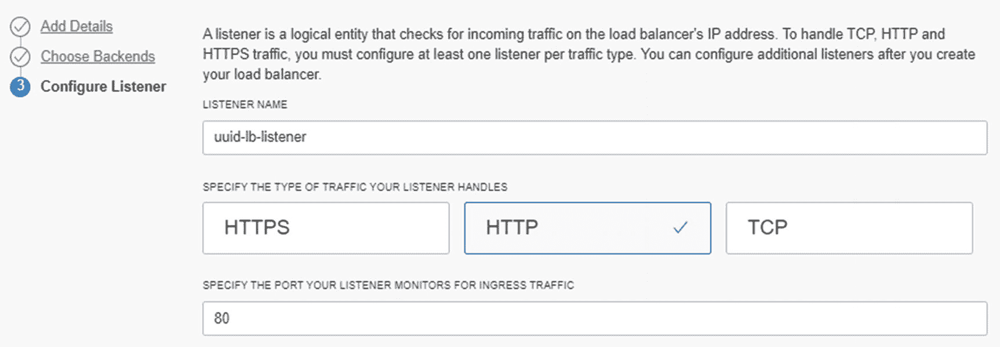

Oracle Cloud Infrastructure 现在将预置一个新的公共负载均衡器，并从 Oracle Cloud 地址池中分配一个公共 IP 地址。我们必须等待预置操作完成，才能看到类似图 2-56 的内容。

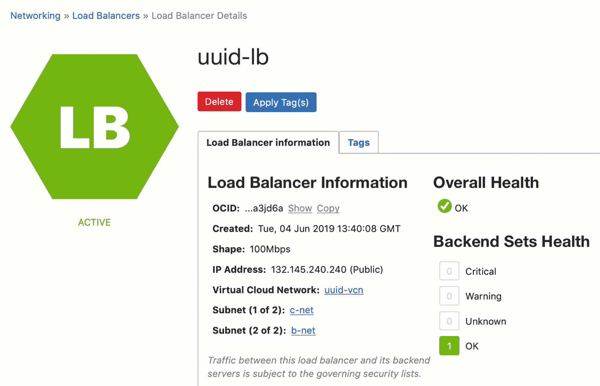

我们定义的健康检查配置负责监控和检测所有已注册的负载均衡后端是否按预期运行。`UUID` 服务已作为一个简单的 `REST API` 实现。`REST API` 利用 `HTTP` 标准方法，通过 API 管理的资源提供 `CRUD` 操作。这就是为什么执行 `REST API` 健康检查最自然的方式是使用 `HTTP GET` 来测试其某个资源。我们刚刚配置的健康检查策略，将每 10 秒向每个后端服务器发送一个 `HTTP GET /identifiers` 请求。如果它在三秒内没有收到 `HTTP 200 OK` 响应，它将重试两次，并将该节点标记为不可用。负载均衡器预置后，可能需要片刻时间才能确认后端运行状况良好。

> **提示**
> 如果您观察到 `Unknown` 状态持续较长时间，请不要担心，继续测试负载均衡器。在某些情况下，负载均衡器启动后，可能需要几分钟时间才能从 `Unknown` 状态转变为 `OK` 状态。

如果需要，您可以检查每个后端的状态，如图 2-57 所示。操作步骤如下：

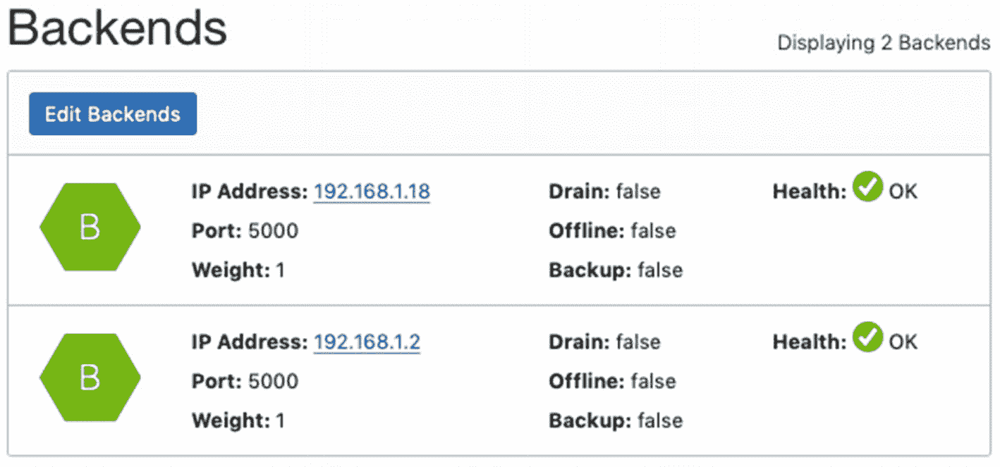

1.  转到菜单 ➤ 网络 ➤ 负载均衡器。
2.  点击您的负载均衡器名称。
3.  在“资源”部分，点击“后端集”。
4.  点击后端集的名称。
5.  在“资源”部分，点击“后端”。

如果您发现某个后端处于 `Critical` 状态，请按照此检查清单进行故障排除：

*   目标计算节点正在运行。
*   `UUID Service systemd service` 已启动。
*   操作系统防火墙接受端口 `5000` 上的连接。
*   默认安全列表中存在允许传入流量访问端口 `5000` 的入站有状态规则。
*   负载均衡器子网安全列表中的规则是正确的。
*   负载均衡器设置的后端定义正确。
*   负载均衡器后端集健康检查配置正确。

总而言之，过一会儿，您将能够执行本章的最终测试。为此，您需要识别您的负载均衡器从 Oracle Cloud 地址池获得的公共 IP 地址。在我的例子中，它是 `132.145.240.240`。当您向负载均衡器端口 `80` 上的 `/identifiers` 资源发送一些请求时，它们将以轮询方式均匀路由到 `UUID` 服务 `API` 的第一个 (`uuid-1`) 和第二个 (`uuid-2`) 实例。每次向负载均衡器发送请求时，它都会由两个 `UUID` 服务实例之一交替提供服务，如每个响应中的 `generator` JSON 元素所示。

```bash
$ LB_INSTANCE=132.145.240.101
$ curl $LB_INSTANCE:80/identifiers
{
"generator":"uuid1",
"uuid":"709f6aac-0720-461a-9fd3-732748253bca"
}
$ curl $LB_INSTANCE:80/identifiers
{
"generator":"uuid2",
"uuid":"cfe329bd-cd2c-49a6-ae4f-29f23bf5d2fe"
}
$ curl $LB_INSTANCE:80/identifiers
{
"generator":"uuid1",
"uuid":"e22b5858-e70f-46ab-bd16-0da3d55aca73"
}
$ curl $LB_INSTANCE:80/identifiers
{
"generator":"uuid2",
"uuid":"1c9662d9-1426-4e2d-bae3-bd4207dbd73b"
}
```

我们已经完成了练习。在继续之前，让我们终止云资源。您现在可以终止本章中创建的所有资源，但我们将要在下一章中使用的学习 compartment 除外。

## 清理

为避免不必要的成本或试用额度的消耗，无论它们多么低廉，让我们终止本章创建的资源。某些资源依赖于其他资源；因此，在删除时遵循所需的顺序很重要。在后续章节中这不会成为问题，因为在许多情况下，自动化将一次性为我们完成操作。然而，在本章中，我们在 `OCI Console` 中手动完成所有操作，因此必须遵循以下步骤：

1.  转到菜单 ➤ 网络 ➤ 负载均衡器。
2.  确保选择了 `Sandbox` compartment。
3.  点击三点菜单，点击“终止”，并等待资源被移除。

图 2-58 展示了如何终止负载均衡器。

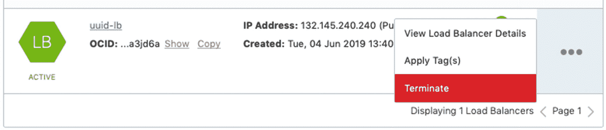

现在，以类似的方式，使用 `OCI Console` 终止（或删除）剩余的资源。

*   两个计算实例（菜单 ➤ 计算 ➤ 实例）
*   自定义镜像（菜单 ➤ 计算 ➤ 自定义镜像）
*   `VCN` 及关联的网络资源

> **提示** 当您终止计算实例时，请确保永久删除其启动卷。如果您忘记了这样做，以后可以在 计算 ➤ 启动卷 中删除被遗弃的启动卷。

本章的练习到此结束。

## 总结

在本章中，我引导您完成了在 Oracle Cloud Infrastructure 上规划和运行一个简单云应用程序的过程。首先，我们花了一些时间分析应用程序设计，并勾勒出所需的云基础设施资源。随后，我们使用 `OCI Console` 逐步预置了每个云资源。应用程序本身通过使用 `cloud-init` 驱动的自动化在实例上构建和运行。接下来，我们将应用程序横向扩展，并添加了一个公共负载均衡器，以将负载均匀分配到承载该应用程序的两个计算节点上。最后，我向您展示了如何执行清理并移除资源。

您可能觉得本章的练习包含了数量庞大的手动步骤。嗯，我警告过您，我想向您展示手动方式，并教您如何操作 `OCI Console`。下一章将介绍 `OCI CLI` 和 `Terraform` 自动化，您将体验如何以代码形式更快地管理您的云基础设施。请继续阅读。


