# 3. 自动化云基础设施

云计算离不开*自动化*。快速自服务地供给池化云资源（计算实例、存储、虚拟网络等）这一核心理念，正是建立在一个前提之上：从头到尾的整个供给过程都是完全自动化的。正因整个过程不涉及任何手动步骤，我们才能以脚本和模板的形式来表示完整的云基础设施，这些脚本和模板用于远程管理云资源。图 3-1 通过思维导图展示了通过自动化实现的一些相关操作特性。

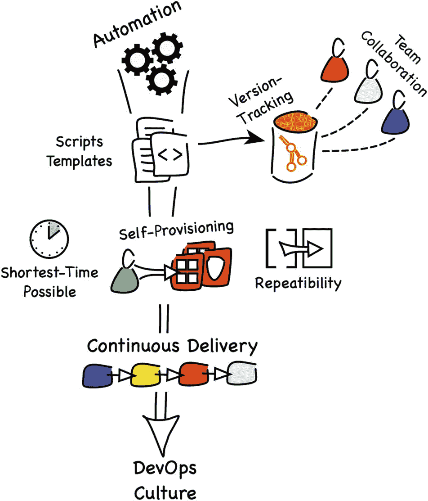

图 3-1

`脚本和模板`可被视为源代码，并存储在像`Git`这样的版本控制系统中。这不仅促进了团队协作，也使得增强功能的交付更快，从而能够更快地解决问题。新团队成员只需阅读那些始终更新的代码，就能理解基础设施架构，这与传统文档形成鲜明对比——传统文档很容易随着时间的推移而与实际情况产生偏差。你准备好脚本和模板后，它们在执行时，会通过下一节将介绍的接口与所谓的云管理平面进行交互。云管理平面的供给引擎已经由你的云提供商实现了自动化。它负责在云中创建、更新和删除资源。再次强调，整个过程绝对没有任何手动步骤。所有这些因素综合起来，实现了尽可能短的供给时间、可重复性和自服务。

你不仅可以，实际上也应该超越仅仅自动化云基础设施管理。云基础设施是你基于云的解决方案的一部分，同时也是其先决条件。你确实是在云基础设施上运行业务或平台软件。因此，自动化整个解决方案的交付过程更有意义。想象一下，你的开发者提交了一段应用程序代码变更，有效地增加了一个新服务。该服务监听一个此前未被使用的端口。同一提交可以包含一个基础设施脚本或模板的变更，该变更会添加一个新的安全列表以允许该端口的入站流量。构建服务器会检测到新的代码修订版，它会创建新的安全规则，并在测试环境中重新供给一个或多个承载该服务的虚拟机或容器。最后，执行集成和回归测试以评估变更的质量。通过这种方式，一个简单的代码变更就能产生一个在云中运行的、经过测试的部署。这被称为*持续交付*。这个过程不必终止于测试环境。一些用例会受益于直接在生产环境中发布有限数量的最新版本的服务实例，这被称为*金丝雀发布*，以评估它们在真实世界条件下的行为。

自动化是持续交付的关键推动力，它可以成为你组织中*DevOps 文化*的重要组成部分。这是什么意思，又有什么好处呢？仅看名称，Dev 部分源于*development*（开发）一词，Ops 部分源于*operations*（运维）一词。在传统模式中，开发人员将可交付成果交给运维团队，运维团队成员准备配置并将制品部署到特定环境。这种级联方式常常导致误解和错误，使得交付过程比应有的时间更长。DevOps 打破了这种方法，融合了这两个角色。与传统运维领域相关的流程现在已完全自动化，并且常常已经由应用开发人员的触发操作所启动。在流行的理解中，担任 DevOps 角色的人负责构建和维护前述的自动化流程。彻底自动化带来的可重复性，降低了以往与手动操作相关的错误风险。此外，通过自动化重复性手动任务所节省的时间，可以用来增强对运行中系统的洞察，并对整个应用格局提供更好的治理。*DevOps 文化*这一术语实际上更为宽泛，远远超出了本书的范围。

## 云管理平面

为了履行其职责，云平台提供了一套安全的接口，你可以通过与这些接口交互来控制你的云资产。这些接口也被称为`API`，它们是你通往*云管理平面*的门户。该引擎基于数据中心的物理和虚拟设备来提供云资源。客户端向`API`端点发送请求，以远程执行云中的各种操作。

你需要记住，云从定义上讲是多租户的。由于众多用户与同一组接口端点交互，该引擎不仅负责管理和监控云资产，还必须确保不同租户（云账户）使用的资源被妥善隔离。此外，`API`还负责保护云资产免遭未经授权的访问。这一理念在图 3-2 中有概念性展示。

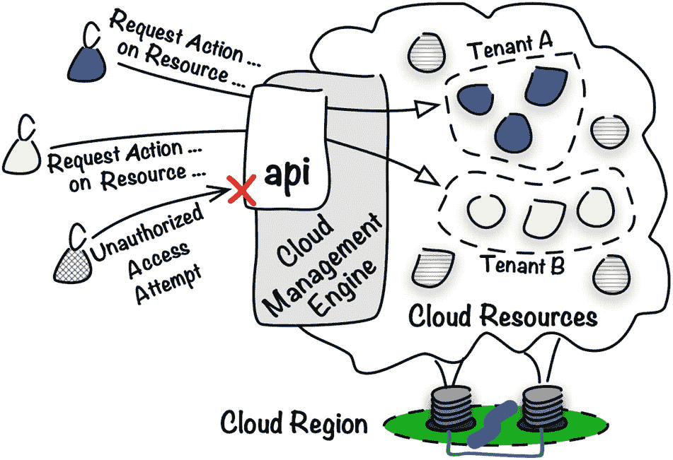

图 3-2

云*管*理*平*面与多租户


### Oracle Cloud Infrastructure API

云提供商提供其云接口的最常见方式是以安全的 `REST APIs` 形式。云资源及其生命周期事件被表示为 REST 资源和对应的 HTTP 方法（`GET`、`PUT`、`POST`、`DELETE`）。一个成功认证和授权的客户端可以命令云管理平面代表其在一个或多个云资源上执行操作。这是通过通过 HTTPS 发送一个格式正确的请求来完成的。云管理平面验证请求并将其转换为在虚拟和/或物理资源上执行的一系列操作，以完成所请求的操作。

从客户端的角度看，这在实际中是如何工作的？让我们快速看一下列表 3-1，它展示了一个简化的 API 请求，最终将列出特定实例池的详细信息。为了增加此示例的清晰度，我使用了实例池云资源的 OCID（`{ic-id}`）和隔离区的 OCID（`{c-id}`）的参数占位符。在真实请求中，您需要用正确的 Oracle Cloud 标识符替换它们。

```
GET /20160918/instancePools/{ic-id}?compartmentId={c-id} HTTP/1.1
Host: iaas.eu-frankfurt-1.oraclecloud.com
Accept: application/json
Authorization: ...
Listing 3-1
简化的 API 请求
```

列表 3-1 所示的请求要求获取指定隔离区中一个给定实例池的实例池详细信息。REST 资源的第一部分 `/20160918` 表示 Oracle Cloud Infrastructure API 的版本，而第二段，即 `instancePools`，清楚地表明了我们正在处理的云资源类型。

获取实例池详细信息的操作以同步方式执行，这意味着结果一旦收集完毕，响应就会立即传递。列表 3-2 显示了相应的响应。请注意，我缩短了 OCID 和请求 ID 头以使结构更易读。

```
HTTP/1.1 200 OK
Content-Type: application/json
Content-Length: 931
opc-request-id: /D8613...
{
"id" : "ocid1.instancepool....",
"compartmentId" : "ocid1.compartment....",
"definedTags" : { },
"displayName" : "instance-pool",
"freeformTags" : { },
"instanceConfigurationId" : "ocid1.instanceconfiguration....",
"lifecycleState" : "RUNNING",
"placementConfigurations" : [ {
"availabilityDomain" : "feDV:EU-FRANKFURT-1-AD-1",
"primarySubnetId" : "ocid1.subnet...."
}, {
"availabilityDomain" : "feDV:EU-FRANKFURT-1-AD-2",
"primarySubnetId" : "ocid1.subnet...."
} ],
"size" : 4,
"timeCreated" : "2018-12-21T18:47:29.767Z"
}
Listing 3-2
简化的 API 响应
```

根据请求操作的类型，云管理平面引擎可能执行同步或异步操作。同步操作导致阻塞调用，这意味着客户端等待在相应响应中返回的结果。对于异步操作，您将立即收到一个响应，其中包含一个工作请求 ID，您可以用它来跟踪所请求操作的状态。在撰写本文时，有三项能力支持工作请求并以异步方式执行某些操作。

*   Kubernetes 容器引擎
*   对象存储
*   负载均衡

对这三项能力使用 API 需要在实现过程式配置脚本时做出仔细的设计决策。这在自定义 API 调用、SDK 和 CLI 时适用。幸运的是，如果您使用 Terraform 的声明式方法将基础设施作为代码进行管理，则无需担心这个设计方面。

API 旨在提供可在云资源上执行的最丰富的操作集。换句话说，如果您找不到特定操作的 API 资源，那么该操作要么当前不受支持，要么可以通过执行更细粒度的云资产操作的多个 API 调用序列来实现。

提示

您可以在 [`https://docs.cloud.oracle.com/iaas/api`](https://docs.cloud.oracle.com/iaas/api) 找到可用的 Oracle Cloud Infrastructure REST API 的全面参考。

### 保障 API 调用安全

您可能想知道使用 REST API 进行云资源的远程管理有多安全。嗯，如果不安全，我想就不会有云计算了。我们需要简要讨论 API 调用安全性的三个方面。

*   传输层安全
*   身份验证
*   授权

首先，通过公共互联网在 HTTPS 上传输的数据包是加密的。TLS 1.2 协议机制保护通信在传输过程中不被窃听或篡改。这个行业标准协议透明地提供 `传输层安全`，不需要云团队的介入。

`身份验证`（验证请求发送者真实身份的方式）的实施需要不同的方法。每个请求必须使用发送者的私钥和 RSA-SHA256 算法进行签名。签名最终包含在请求的 `授权` 头中。列表 3-3 显示了该头的详细结构，包括用户和租户特定数据的占位符。

```
Authorization: Signature version="1",keyId="{tenancy-ocid}/{user-ocid}/{public-key-fingerprint}",algorithm="rsa-sha256",headers="(request-target) date host",signature="{signature}"
Listing 3-3
带有请求签名的授权头
```

要生成签名，您首先需要构建一个 `签名字符串`，它由请求的部分组成，包括但不限于资源目标（如 `/20160918/vcns`）以及请求负载的哈希（如果存在）。然后使用私钥加密签名字符串，并使用 Base64 算法将其编码为文本。是的，这听起来有点复杂，但别担心。在日常工作中，您几乎不需要自己执行这些步骤，除非您真的想这样做。您几乎总是使用特定语言的软件开发工具包（SDK）或专门的配置工具（CLI、Terraform），它们会为您准备 `授权` 头并调用 OCI API。

并非每个成功认证的用户都应被允许执行特定操作。例如，如果同一云账户下维护多个项目，您可能希望将项目 A 的资源与项目 B 的用户隔离开来。即使是单个项目，为特定用户组限制对特定资源集的访问权限仍然有意义。这将是 `授权` 函数的任务，它验证经过身份验证的用户真正有权执行什么操作。在下一章中，您将了解身份和访问管理用户、组和策略，这些共同让您为云账户配置授权机制。

在此阶段，至关重要的是强调每个 API 调用始终是以一个命名的 Oracle Cloud Infrastructure IAM 用户的名义进行的。对于每个请求，在 `授权` 头中，客户端声明一个租户 OCID、一个用户 OCID 以及一个为此特定 IAM 用户上传到 Oracle Cloud Infrastructure 的公钥指纹。此外，同样作为头一部分的签名是使用相应的私钥加密的。这一切都导向一个结论：在签名 API 请求之前，您需要拥有一对密钥，称为 `API 签名密钥对`。公钥必须上传到 Oracle Cloud Infrastructure 并与您选择的用户关联。这样，OCI 将知道如何解密您的请求。


### API 签名密钥

在本节中，我们将生成一个新的密钥对，它将用作 API 签名密钥对，并将公钥上传到 Oracle Cloud Infrastructure 中的特定 IAM 用户下。这样，我们就能授权任何持有私钥的人使用 OCI API，并以该 IAM 用户的身份远程管理 OCI 资源。私钥将通过密码进行额外保护。每次尝试使用私钥时，系统都会提示您输入密码，除非您将其持久化保存在本地配置中。

> **注意**
>
> 本书中的代码片段已在 macOS 和 Windows Subsystem for Linux 上测试通过。此外，所有命令都应在主流 Linux 发行版上正常工作。如果您使用的是 Windows 且不想使用 Windows Subsystem for Linux，您随时可以在虚拟机（VM）上运行 Linux。再者，大多数代码片段也可能在 Windows 的 Git Bash 中正常工作。

#### 生成密钥对

API 签名密钥对必须是 PEM 格式的 RSA 密钥对。PEM 格式使用人类可读的字符，这使得它比二进制格式稍微容易处理一些（尤其是复制公钥）。我们将使用 `openssl` 程序来生成一个新的密钥对，该密钥对由两个相关的 2048 位密钥组成：一个用于签名请求的私钥和一个用于验证请求真实性的公钥。以下是使用 `openssl` 生成新密钥对的方法，该工具在您的 Linux、macOS 和 Windows Subsystem for Linux 上应该是开箱即用的：

```bash
$ mkdir ~/.apikeys
$ cd ~/.apikeys
$ openssl genrsa -out oci_api_pem -aes128 2048
Generating RSA private key, 2048 bit long modulus
.............+++
..+++
e is 65537 (0x10001)
Enter pass phrase for oci_api_pem:
Verifying - Enter pass phrase for oci_api_pem:
$ chmod go-rwx oci_api_pem
$ ls -l | grep pem | awk '{ print $1" "$9 }'
-rw------- oci_api_pem
$ openssl rsa -pubout -in oci_api_pem -out oci_api_pem.pub
Enter pass phrase for oci_api_pem:
writing RSA key
$ ls -l | grep pem | awk '{ print $1" "$9 }'
-rw------- oci_api_pem
-rw-r--r-- oci_api_pem.pub
```

建议您限制对私钥的访问权限，使得只有文件所有者才有权读取或修改该文件。您可以使用 `chmod` 命令执行此操作，如代码片段所示。此时，密钥对已准备就绪。清单 3-4 显示了我们刚刚生成的公钥。

```text
$ cat oci_api_pem.pub
-----BEGIN PUBLIC KEY-----
MIIBIjANBgkqhkiG9w0BAQEFAAOCAQ8AMIIBCgKCAQEAy7QqyKkIM1UW0lBs3h04
OIxCNbAc1YpqLmd/ZQGwNFoC9L7kpkARjOTMQg/XY9VgFhTFwkhv/sP7aOwYZjVD
BMltp3e0Xzu1BGe4AQF3xL+euqZW9dBRlvZqb1ubEse4RnKDCWvYpqQS/vQU48TM
nRObefTsZH1xg2RfO2mFHuGEZhJKrVIjHTJvjisAIZg0dPaVD8Ee+julutCnDHcP
QWlfe2e4OtYvvki5Wwu5Uz4Zq6ZSf55oX25pDGyw/WB5oDFg4v6RsZ7kQZYTBsqA
gF7RnG+q5JnxFfuDvEZoU0sB5hRWujhhSZtE9FjU9UndMU5iaa8kNE6Ua3e0p4ZG
RwIDAQAB
-----END PUBLIC KEY-----
清单 3-4
API 签名密钥对公钥
```

#### 上传公钥

我们已经到了需要决定代表哪个身份发送 API 请求的时刻。换句话说，我们必须选择一个现有的 IAM 用户并上传公钥，该公钥将与此用户关联。如果您使用的是一个新的试用版或按需付费（PAYG）账户，您很可能以默认的 IAM 用户身份登录，该用户代表租户所有者，并且开箱即用地属于 `Administrators` 组。该组将允许您执行本章描述的所有练习。

> **提示**
>
> 如果您使用的是云团队提供的其他 IAM 用户，且该用户不是 `Administrators` 组的成员，请与您的云团队管理员核实您有权执行哪些操作，或者直接跳转到第 4 章，以了解分配给您的 IAM 组的 IAM 策略的含义。

以下是使用 OCI 控制台上传公钥的方法：

1.  转到菜单 ➤ 标识 ➤ 用户。
2.  单击您的租户管理员用户的名称。
3.  在“资源”菜单中单击 API 密钥。
4.  单击添加公钥。
5.  粘贴公钥。
6.  单击添加。

图 3-3 显示了用于为 IAM 用户添加新公钥的 OCI 控制台窗口。

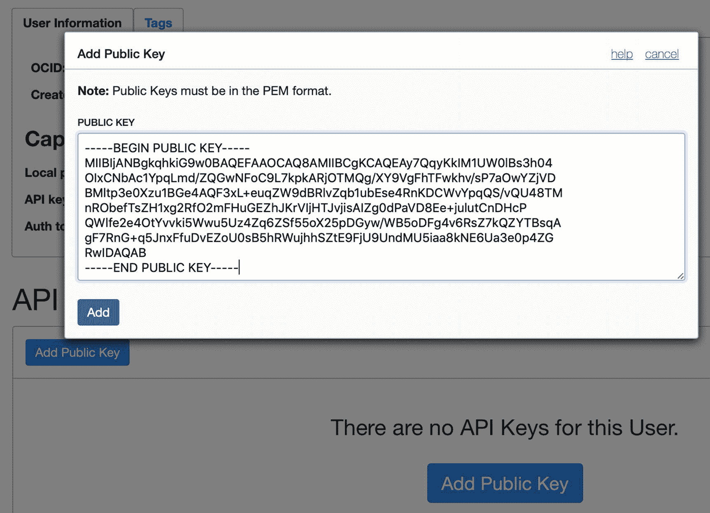

图 3-3
在 OCI 控制台中添加公钥

每个 IAM 用户最多可以拥有三个公共 API 密钥。API 将根据请求的 `authorization` 头中包含的公钥 `指纹` 来识别每个传入请求应使用哪个正确的密钥。指纹会显示在 OCI 控制台中，如图 3-4 所示。

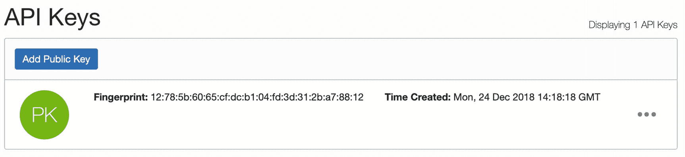

图 3-4
公钥的指纹

用户只能执行其所属组的现有 IAM 策略语句所允许的对云资源的操作。您将在下一章中了解它们。现在，请确保您将使用属于具有租户管理权限的组的 IAM 用户，例如默认的 `Administrators` 组；否则，后面几节中介绍的一些命令可能无法工作。

#### 为 SDK、CLI 和 Terraform 做准备

如果您已完成“API 签名密钥”部分描述的所有步骤，那么您已准备好开始自动化云基础设施管理任务。让我们总结并列出所需的详细信息，在初始设置期间，当您基于喜欢的编程语言的 SDK 编写自定义 API 调用时，或者更常见的是，在运行 CLI 脚本或使用 Terraform 配置基础设施时，您至少需要提供一次这些信息。以下是您应该准备或知道在哪里可以找到的详细信息：

*   **PEM 格式的 API 签名密钥对**：
    *   公钥
    *   私钥
*   公钥的**指纹**
*   **IAM 用户 OCID**，位于菜单 ➤ 标识 ➤ 用户下
*   **租户 OCID**，位于菜单 ➤ 管理 ➤ 租户详细信息下
*   **区域标识符**，位于菜单 ➤ 管理 ➤ 区域管理下的“基础设施区域”选项卡中

我们现在已准备好讨论并应用三种最流行的自动化技术。我们将首先讨论 SDK。


## SDK

OCI SDK 是针对特定编程语言的库，可让您的软件与 Oracle Cloud Infrastructure 的云管理平面进行交互。该 SDK 将 OCI API 调用封装为更易用、上手更快的函数或方法。通过这种方式，管理和监控 OCI 资源的自定义逻辑可以嵌入到您的应用程序中。图 3-5 说明了这个概念。

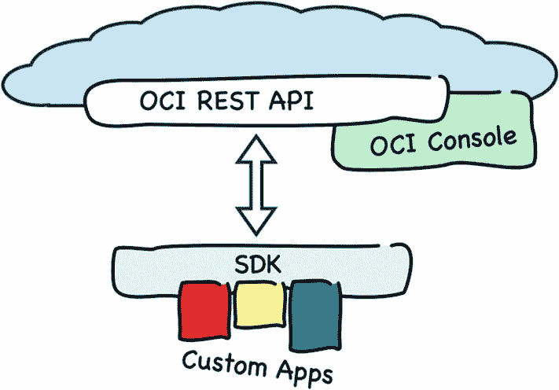

图 3-5 SDK

在撰写本文时，Oracle Cloud Infrastructure 提供了四个以开源项目形式实现的 SDK。

*   Python: [`https://github.com/oracle/oci-python-sdk`](https://github.com/oracle/oci-python-sdk)
*   Go: [`https://github.com/oracle/oci-go-sdk`](https://github.com/oracle/oci-go-sdk)
*   Java: [`https://github.com/oracle/oci-java-sdk`](https://github.com/oracle/oci-java-sdk)
*   Ruby: [`https://github.com/oracle/oci-ruby-sdk`](https://github.com/oracle/oci-ruby-sdk)

如果您需要其他语言的 SDK，可以考虑自己编写一个。您需要先实现 API 请求签名逻辑，然后将软件所需的那些 REST API 调用封装成库函数或类方法。之后，您可以逐步增加对更多 API 资源的支持。实际上，特别是在面向微服务设计和容器的时代，您需要构建新 SDK 的可能性很小，因为您可以使用不同的编程语言来实现一组协同工作的微服务。

在本节中，我将介绍 Oracle Cloud Infrastructure Python SDK 的基础知识。

### 安装

由于历史原因，Python 目前同时维护着两个主要版本：2 和 3。该 SDK 适用于两者，但我建议将使用最新主要版本作为最佳实践。我将使用 Python 3。请检查您用于处理本书练习的机器上是否已安装 Python 3。如果没有，请安装它，并为您的平台选择最新的 Python 3.x 版本。

注意
安装 Python 的方式取决于您使用的操作系统。请访问 [`www.python.org`](http://www.python.org) 了解更多详情。

成功安装后，您应该能看到类似这样的信息：

```
$ python3 --version
Python 3.7.2
```

注意
本书中的代码片段已在 macOS 控制台和 Windows Subsystem for Linux 中测试。所有命令都应能在所有主流 Linux 发行版上轻松运行。如果您使用 Windows，请在带有 Linux 的虚拟机或 Windows Subsystem for Linux 中运行练习。

开箱即用，Python 3 自带 `venv` 模块，它允许开发者在单台机器上创建多个虚拟环境。一个虚拟环境维护独立的 Python 二进制文件和一个作为应用程序依赖项的 Python 模块库。所有使用专用的、环境特定的 Python 包安装器 (`pip`) 实例安装的模块都将存储在虚拟环境的文件层次结构中。如果您同时处理多个项目并需要避免模块版本冲突，这将特别有用。我将创建一个名为 `ocidev` 的新虚拟环境，并通过激活 `bin/activate` 文件来启用它。

提示
我强烈建议您访问本书的 Git 仓库：[`https://github.com/mtjakobczyk/oci-book`](https://github.com/mtjakobczyk/oci-book)。每章都有一个专用目录，其中包含该章的 `README.md` 文件。该文件以易于复制的形式包含了所有的代码片段。

以下是在 macOS 或 Linux 上的操作方法：

```
$ python3 -m venv ocidev
$ ls -1 ocidev/bin/
activate
activate.csh
activate.fish
easy_install*
easy_install-3.7*
pip*
pip3*
pip3.7*
python@
python3@
$ source ocidev/bin/activate
(ocidev) $
```

您可以看到命令提示符已更改，以指示当前活动的虚拟环境。每次打开新的终端会话时，您都需要激活虚拟环境，以便将变量设置为使用所选虚拟环境子目录中的二进制文件和路径。

提示
`venv` 模块仅在 Python 3 中可用。如果您仍想使用 Python 2，也有支持虚拟环境的类似软件包，例如 `virtualenv`。

Oracle Cloud Infrastructure 的 Python SDK 作为模块在 Python 包索引 (`PyPI`) 仓库中提供。您可以使用 Python 的 `pip` 包管理器来下载 `oci` 模块，它已经包含在您的虚拟环境路径中。在下载和安装 `oci` 模块之前，让我们先升级 `pip` 工具。

```
(ocidev) $ python3 -m pip install --upgrade pip
Successfully installed pip-19.1.1
(ocidev) $ python3 -m pip --version
pip 19.1.1 from /Users/mjk/ocidev/lib/python3.7/site-packages/pip (python 3.7)
```

现在，我将使用 `pip freeze` 命令来列出这个特定虚拟环境中安装的软件包。

```
(ocidev) $ python3 -m pip freeze
```

如您所见，我们的虚拟环境中还没有任何软件包。是时候改变这一点并安装 Oracle Cloud Infrastructure Python SDK 了。

```
(ocidev) $ python3 -m pip install oci
Successfully installed (...) oci-2.2.13 (...)
(ocidev) $ python3 -m pip freeze
asn1crypto==0.24.0
certifi==2019.3.9
cffi==1.12.3
configparser==3.7.4
cryptography==2.7
oci==2.2.13
pycparser==2.19
pyOpenSSL==19.0.0
python-dateutil==2.8.0
pytz==2019.1
six==1.12.0
(ocidev) $ deactivate
```

与 `oci` 模块一起，`pip` 还安装了它的依赖项。现在，我们需要讨论如何准备将由 SDK 在签名 API 请求时使用的配置细节。


### 配置

Oracle Cloud Infrastructure 的 Python SDK 就是一个 Python 模块，它提供了一系列客户端类及其方法，这些方法通过调用 OCI REST API 来管理各种类型的 OCI 资源，例如：

*   `oci.core.ComputeClient` 类的方法用于管理计算实例。
*   `oci.core.VirtualNetworkClient` 类的方法用于管理与虚拟云网络相关的资源。
*   `oci.load_balancer.LoadBalancerClient` 类的方法用于管理负载均衡器资源。

当你为某个特定的客户端类创建实例对象时，需要提供一个字典（一组键值对）来存储 SDK 的 API 签名详细信息。下面的代码片段从概念上展示了如何操作。请不要尝试执行这些命令，因为其中一个命令还不完整：
```
$ source ocidev/bin/activate
(ocidev) $ python3
>>> config = dict([('tenancy', '...'), ('region', '...'), ('user', '...'), ('fingerprint', '...'), ('key_file', '...'), ('pass_phrase', '...')])
>>> import oci
>>> compute = oci.core.ComputeClient(config)
```

也可以从配置文件加载配置。配置文件会包含 SDK 所需的详细信息，以便它能够代表指定的 IAM 用户对发送给 Oracle Cloud Infrastructure REST API 的请求进行签名。配置文件的默认名称是 `config`。配置文件的默认位置是 `~/.oci` 目录。该文件必须设置权限，使得只有文件所有者才能读取其内容。清单 3-5 展示了配置文件的结构。
```
[DEFAULT]
tenancy=ocid1.tenancy.oc1..aa.........abcdef
region=eu-frankfurt-1
user=ocid1.user.oc1..aa.........ghijkl
fingerprint=12:78:5b:60:65:cf:dc:b1:04:fd:3d:31:2b:a7:88:12
key_file=/Users/mjk/.apikeys/oci_api_pem
pass_phrase=secret
清单 3-5
OCI 的 Python SDK 配置文件
```

租户 (`tenancy`) 和 IAM 用户 (`user`) 必须提供为有效的 OCID，而区域 (`region`) 必须使用区域标识符，例如 `eu-frankfurt-1`。密钥文件 (`key_file`) 应该是属于 API 签名密钥对的 PEM 格式私钥的路径，其公钥您已经上传并与 IAM 用户关联。私钥密码 (`pass_phrase`) 以及公钥指纹 (`fingerprint`) 也存储在配置文件中。这就是为什么必须为 `config` 文件设置适当的权限以限制其内容可见性至关重要。您可以在一个配置文件中存储多个命名的配置配置文件。在我们的示例中，只有 `DEFAULT` 配置文件。

我已经为您准备了一个配置文件的模板。您可以在以下路径找到模板文件：`chapter03/1-sdk/config.template`。请复制它并保存为默认位置的 `~/.oci/config` 文件。
```
$ mkdir ~/.oci
$ cp ~/git/oci-book/chapter03/1-sdk/config.template ~/.oci/config
$ chmod go-rwx ~/.oci/config
$ ls -l ~/.oci
-rw-------  1 mjk  staff   758B Jun 10 20:21 config
```

现在，调整属性并使用与您环境相对应的值。您可以使用 `vi` 或任何其他文本编辑器。
```
$ vi ~/.oci/config
```

让我们再次激活虚拟环境并启动 Python 解释器。您可以使用 `oci.config.from_file` 函数和与命名配置文件关联的配置。在我们的例子中，这将是 `DEFAULT` 配置文件。最后，您可以测试创建计算客户端类实例。
```
$ source ocidev/bin/activate
(ocidev) $ python3
>>> import oci
>>> config = oci.config.from_file("~/.oci/config","DEFAULT")
>>> compute = oci.core.ComputeClient(config)
>>> quit()
(ocidev) $ deactivate
$
```

### 使用 SDK

一旦您知道如何准备和加载配置文件，就可以进行第一个简单的测试了。让我们列出您的租户和您选择的 IAM 用户可见的可用性域。
```
$ source ocidev/bin/activate
(ocidev) $ python3
>>> import oci
>>> config = oci.config.from_file("~/.oci/config","DEFAULT")
>>> identity = oci.identity.IdentityClient(config)
>>> ads_list = identity.list_availability_domains(config['tenancy']).data
>>> for ad in ads_list:
...     print(ad.name)
...
feDV:EU-FRANKFURT-1-AD-1
feDV:EU-FRANKFURT-1-AD-2
feDV:EU-FRANKFURT-1-AD-3
```

现在，我将向您展示如何在您的一个非 `root` 容器中创建虚拟云网络。在继续之前，请记下一个非 `root` 容器的 OCID，例如 `Sandbox`，您希望在其中创建 VCN。OCID 可以在 OCI 控制台中的身份识别 ➤ 容器下找到，如第 2 章“容器”部分所述。要成功测试接下来的脚本，请将 `cid` 变量的值替换为 `Sandbox` 容器的 OCID。
```
>>> cid = "ocid1.compartment.oc1..aa.........gzwhsa"
>>> kwargs = { "cidr_block": "10.5.0.0/16", "display_name": "sdk-vcn", "compartment_id": cid }
>>> create_vcn_details = oci.core.models.CreateVcnDetails(**kwargs)
>>> print(create_vcn_details)
{
"cidr_block": "10.5.0.0/16",
"compartment_id": "ocid1.compartment.oc1..aa.........gzwhsa",
"defined_tags": null,
"display_name": "sdk-vcn",
"dns_label": null,
"freeform_tags": null
}
>>> vcn = oci.core.VirtualNetworkClient(config)
>>> response = vcn.create_vcn(create_vcn_details)
>>> response.data
{
"cidr_block": "10.5.0.0/16",
"compartment_id": "ocid1.compartment.oc1..aa.........gzwhsa",
"default_dhcp_options_id": "ocid1.dhcpoptions.oc1\. ...",
"default_route_table_id": "ocid1.routetable.oc1\. ...",
"default_security_list_id": "ocid1.securitylist.oc1\. ...",
"defined_tags": {},
"display_name": "sdk-vcn",
"dns_label": null,
"freeform_tags": {},
"id": "ocid1.vcn.oc1.eu-frankfurt-1.aa.........74vj5a",
"lifecycle_state": "AVAILABLE",
"time_created": "2019-06-13T20:56:53.200000+00:00",
"vcn_domain_name": null
}
```

作为使用 Oracle Cloud Infrastructure 的 Python SDK 创建新 VCN 的第一步，我们准备了一个模型类 `CreateVcnDetails` 的实例。模型类对象用于封装客户端类实例进行的 API 调用的配置参数。在我们的例子中，我们仅用三个 VCN 资源参数实例化了模型类：CIDR 块、显示名称和目标容器的 OCID。随后，我们将 `CreateVcnDetails` 对象作为参数传递给了 `VirtualNetworkClient` 客户端类实例的 `create_vcn` 方法。该方法向 OCI REST API 发送了一个请求以同步方式创建 VCN。您可能已经注意到，返回响应花了一点时间。最后，当我们打印 `response.data` 属性时，我们能够看到新创建的 VCN 的 OCID (`id`) 以及所有其他 VCN 属性。图 3-6 显示了 OCI 控制台中的新 VCN。

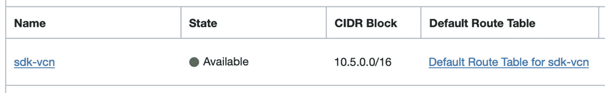

图 3-6
使用 SDK 创建的 VCN

要删除 VCN，您可以像这样使用 `delete_vcn` 方法：
```
>>> response.data.id
'ocid1.vcn.oc1.eu-frankfurt-1.aa.........74vj5a'
>>> vcn.delete_vcn(response.data.id)
```

要退出 Python 解释器并离开虚拟环境，您可以发出以下命令：
```
>>> quit()
(ocidev) $ deactivate
$
```

在本节中，我们简要介绍了 Oracle Cloud Infrastructure 的 Python SDK 的入门知识。如果您想了解更多信息，请参阅可在 [`https://oracle-cloud-infrastructure-python-sdk.readthedocs.io`](https://oracle-cloud-infrastructure-python-sdk.readthedocs.io) 获取的全面文档。


## CLI

`command-line interface`（CLI）是一种命令行实用程序，可让您以便捷的脚本方式与 Oracle Cloud Infrastructure REST API 进行交互。CLI 比 OCI 控制台功能稍强，因为您可能会发现某些功能作为 CLI 命令可用，但在 OCI 控制台中并未实现。此外，执行脚本通常比在 OCI 控制台的图形界面中点击要快得多。如果您仔细研究 CLI，会发现它是基于用于 Oracle Cloud Infrastructure 的 Python SDK 构建的。换句话说，OCI CLI 是作为 `oci-cli` 模块用 Python 实现的，该模块使用了 `oci` 模块中的类。图 3-7 说明了这个概念。

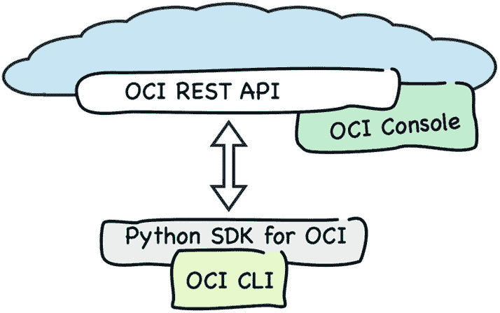

图 3-7 OCI CLI

CLI 作为一个开源项目实现，代码可在 GitHub 的 [`https://github.com/oracle/oci-cli`](https://github.com/oracle/oci-cli) 上找到。它可以安装在 Linux、macOS 和 Windows 操作系统上。

### 安装

您使用专为您的操作系统设计的脚本来安装 CLI。这些脚本可以从 OCI CLI 的 GitHub 帐户下载。事实上，有两个可用的脚本。

*   一个用于 Linux/macOS/Windows Subsystem for Linux 的 Shell 脚本
*   一个用于在 Windows 上原生执行 CLI 的 PowerShell 脚本

如果执行，这两个脚本中的每一个都会执行类似的步骤。

要在 Linux、macOS 或 Windows Subsystem for Linux 上安装 CLI，请打开终端窗口并执行此命令：

```
$ bash -c "$(curl -L https://raw.githubusercontent.com/oracle/oci-cli/master/scripts/install/install.sh)"
```

注意

本书中的代码片段已在 macOS 控制台和 Windows Subsystem for Linux 上测试。所有命令都应在所有主要的 Linux 发行版中轻松工作。如果您使用的是 Windows，请在装有 Linux 的客户机 VM 上或在 Windows Subsystem for Linux 上运行练习。

首先，会验证 `PATH` 变量中是否存在 Python 二进制文件，并且如果需要，会下载并放置任何缺少的原生软件包依赖项。安装程序将优先选择 Python 3 而非 Python 2。然而，CLI 在两者中的任何一个上都能正常工作。在上一节中，我提到 CLI 基本上是一个 Python 模块。这就是为什么安装程序会为 CLI 创建一个新的虚拟环境，以便将其依赖项与您可能同时进行的任何其他基于 Python 的开发隔离。在安装过程中，您将被要求提供虚拟环境的目录路径以及存储轻量级 `oci` 实用程序的另一个路径。该实用程序可以被视为 CLI 可执行文件，它以方便的命令行实用程序的形式公开 `oci-cli` Python 模块类。如果您心中没有特定的目录，可以保留默认值。最后，安装程序将更新您的 `PATH` 变量，以便您可以直接执行 `oci` 实用程序。在某些 Shell 中，安装后 `oci` 实用程序可能不会立即可见。在这种情况下，您必须重新启动控制台，或者只需 source CLI 将自身添加到 `PATH` 变量中的文件。在 Linux 和 Windows Subsystem for Linux 上，这通常是 `~/.bashrc`，而在 Mac 上通常是 `~/.bash_profile` 文件。

```
$ oci --version
Command 'oci' not found.
$ source ~/.bashrc
```

安装完成后，您应该能够检查 CLI 的版本。

```
$ oci --version
2.6.6
```

`oci` 实用程序脚本的第一行会告诉您虚拟环境的位置。此代码片段显示了如何激活 CLI 的虚拟环境并列出 CLI 正在使用的 SDK 版本：

```
$ head -n 1 `which oci`
#!/Users/mjk/lib/oracle-cli/bin/python3
$ cd ~/lib/oracle-cli/
$ source bin/activate
(oracle-cli) $ python3 -m pip freeze | grep oci
oci==2.5.1
oci-cli==2.6.6
(oracle-cli) $ deactivate
$
```

我们这样做是为了说明 CLI 与 Python SDK 的关系。在日常使用 CLI 时，您不会显式激活虚拟环境，而是使用 `oci` 实用程序。

### 配置

CLI 配置文件是一个简单的属性文件，存储了代表命名的 IAM 用户向 Oracle Cloud Infrastructure REST API 签名 API 请求所需的详细信息。如果您期望 CLI 配置与用于 OCI Python SDK 上下文的配置文件相似，您是对的。清单 3-6 显示了 CLI 配置文件的结构。

```
[DEFAULT]
tenancy=ocid1.tenancy.oc1..aa.........
region=eu-frankfurt-1
user=ocid1.user.oc1..aa........
fingerprint=12:78:5b:60:65:cf:dc:b1:04:fd:3d:31:2b:a7:88:12
key_file=/Users/mjk/.apikeys/oci_api_pem
pass_phrase=secret
清单 3-6 OCI CLI 配置文件
```

该结构与上一节关于 SDK 的结构相同。此外，CLI 在相同的默认路径 `~/.oci/config` 期望配置文件。

如果您已经存在 `~/.oci/config` 文件，CLI 即可使用。

注意

如果您已经为 SDK 创建了 `.oci/config` 文件（如前一节所述），请*跳过*下文解释的 `oci setup config` 步骤，因为配置已经存在。

如果您跳过了关于 SDK 的部分或已删除配置，请不要担心。您可以使用一个简单的内置 CLI 配置向导。您需要提供我在“准备 SDK、CLI 和 Terraform”一节中列出的相同信息。此外，如果您之前没有准备，您将有机会创建一个新的 API 签名密钥对。

```
$ oci setup config
Enter a location for your config [/Users/mjk/.oci/config]:
Enter a user OCID: ocid1.user.oc1..aa.........
Enter a tenancy OCID: ocid1.tenancy.oc1..aa.........
Enter a region (e.g. ap-seoul-1, ap-tokyo-1, ca-toronto-1, eu-frankfurt-1, uk-london-1, us-ashburn-1, us-gov-ashburn-1, us-gov-chicago-1, us-gov-phoenix-1, us-langley-1, us-luke-1, us-phoenix-1): eu-frankfurt-1
Do you want to generate a new RSA key pair? (If you decline you will be asked to supply the path to an existing key.) [Y/n]: n
Enter the location of your private key file: /Users/mjk/.apikeys/oci_api_pem
Enter the passphrase for your private key:
Fingerprint: e6:99:f5:82:db:a9:75:fb:cd:3c:30:74:00:b3:61:2b
Do you want to write your passphrase to the config file? (if not, you will need to supply it as an argument to the CLI) [y/N]: y
Config written to /Users/mjk/.oci/config
```

如果您决定使用 `oci setup config` 生成新的 API 签名密钥对，请记得将公钥上传到云端以供您的 IAM 用户使用。如果您不记得如何操作，请返回本章前面的“上传公钥”部分。

存储私钥密码是可选的。如果您决定不这样做，每次发出 CLI 命令时都会提示您输入密码。如果您决定存储，请记住不要将此文件复制到其他地方，并将其权限限制为仅文件所有者可访问。

```
$ ls -l .oci
-rw-------  1 mjk  staff   322B Jun 13 21:26 config
```

现在，您应该可以测试 CLI 了。我们将列出基于 Ubuntu 的镜像的可用版本。此类查询是在 `root` 隔区的上下文中运行的，其 OCID 与租户的 OCID 相同。幸运的是，我们已经在 CLI 配置文件中存储了 `root` 隔区的 OCID，并且可以使用 `grep` 和 `sed` 工具的组合来提取此值。以下是运行您的第一个 OCI 命令以向 OCI REST API 发送请求的方法：


```
$ TENANCY_OCID=`cat ~/.oci/config | grep tenancy | sed 's/tenancy=//'`
$ oci compute image list --compartment-id $TENANCY_OCID --operating-system "Canonical Ubuntu" --output table --query "data [*].{Image:\"display-name\"}"
+----------------------------------------------+
| Image                                        |
+----------------------------------------------+
| Canonical-Ubuntu-18.04-Minimal-2019.05.15-0  |
| Canonical-Ubuntu-18.04-Minimal-2019.04.15-0  |
| Canonical-Ubuntu-18.04-Minimal-2019.03.11-0  |
| Canonical-Ubuntu-18.04-2019.05.15-0          |
| Canonical-Ubuntu-18.04-2019.04.15-0          |
| Canonical-Ubuntu-18.04-2018.12.10-0          |
| Canonical-Ubuntu-16.04-Minimal-2019.05.15-0  |
| Canonical-Ubuntu-16.04-Minimal-2019.04.15-0  |
| Canonical-Ubuntu-16.04-Minimal-2019.03.11-0  |
| Canonical-Ubuntu-16.04-Gen2-GPU-2019.05.15-0 |
| Canonical-Ubuntu-16.04-Gen2-GPU-2019.04.15-0 |
| Canonical-Ubuntu-16.04-Gen2-GPU-2019.03.20-0 |
| Canonical-Ubuntu-16.04-2019.05.15-0          |
| Canonical-Ubuntu-16.04-2019.04.15-0          |
| Canonical-Ubuntu-16.04-2019.03.20-0          |
| Canonical-Ubuntu-14.04-2019.05.15-0          |
| Canonical-Ubuntu-14.04-2019.05.02-0          |
| Canonical-Ubuntu-14.04-2019.03.19-0          |
+----------------------------------------------+
```

OCI REST API 使用 JSON 作为其有效载荷格式。CLI 默认也输出 JSON。你可以通过应用 `--output table` 选项来将其更改为表格输出。如果你想限制打印内容，可以使用 `--query` 选项，该选项接受一个有效的 `JMESPath` 表达式。`JMESPath` 是一种针对 JSON 的查询语言。

**提示**

如果你以前使用过 XML，你可以将 `JMESPath` 理解为类似 XPath 的东西，但适用于 JSON。

几乎每个 CLI 命令都需要一个 compartment OCID。如果你知道你在大部分时间里都将使用某个给定的 compartment，你可以为 `--compartment-id` 选项定义一个默认值。CLI 命令选项的默认值可以在 `~/.oci/oci_cli_rc` 文件中定义。清单 3-7 展示了一个最小化的 `oci_cli_rc` 文件，其中只包含一个配置文件，且仅有一个默认值。

```
[DEFAULT]
compartment-id = ocid1.compartment.oc1..aa.........
```
*清单 3-7 OCI CLI RC 文件*

`[DEFAULT]` 部分是配置文件的名称。这也适用于清单 3-6 中所示的配置文件。你可以在一个配置文件（或带有默认值的文件）中存储多个配置文件，并在执行 CLI 命令时使用 `--profile` 选项动态选择配置文件。例如，你可以为每个 compartment 设置一个单独的配置文件。当你只处理少数几个 compartment 并希望简化选择它们的方式时，这会很有帮助。清单 3-8 展示了这种配置。

```
[DEFAULT]
compartment-id = ocid1.compartment.oc1..aa.........abc
[SANDBOX]
compartment-id = ocid1.compartment.oc1..aa.........def
```
*清单 3-8 带有多个配置文件的 OCI CLI RC 文件*

实际上，在 `oci_cli_rc` 文件中可以存储的不仅仅是默认值。例如，可以创建命名的 `JMESPath` 查询，并在使用 CLI 命令时引用它们。我们现在将测试这一点。

请将 `oci_cli_rc` 文件的模板复制到 `~/.oci/` 目录，并编辑该文件，将 `compartment_id` 属性的值替换为你的 `Sandbox` compartment 的 OCID。

```
$ cp ~/git/oci-book/chapter03/2-cli/oci_cli_rc.template ~/.oci/oci_cli_rc
$ vi ~/.oci/oci_cli_rc
```

清单 3-9 展示了 `oci_cli_rc` 文件。`DEFAULT` 配置文件包含了你的 `Sandbox` compartment 的 `compartment-id`。一个名为 `OCI_CLI_CANNED_QUERIES` 的预定义部分用于存储可在 CLI 调用中重用的常用查询。一个名为 `list_ubuntu_1804` 的查询可用于基于操作系统版本过滤结果，并仅显示镜像名称。

```
[DEFAULT]
compartment-id = ocid1.compartment.oc1..aa.........gzwhsa
[OCI_CLI_CANNED_QUERIES]
list_ubuntu_1804 = data[?"operating-system-version"=='18.04'].{Image:"display-name"}
```
*清单 3-9 带有预定义查询的 OCI CLI RC 文件*

现在，你可以在键入 CLI 命令时重用这个预定义查询。记得在 `--query` 参数的值前加上 `query://` 字符串。

```
$ oci compute image list --operating-system "Canonical Ubuntu" --output table --query query://list_ubuntu_1804
+-------------------------------------+
| Image                               |
+-------------------------------------+
| Canonical-Ubuntu-18.04-2019.05.15-0 |
| Canonical-Ubuntu-18.04-2019.04.15-0 |
| Canonical-Ubuntu-18.04-2018.12.10-0 |
+-------------------------------------+
```

**提示**

如果你在其他项目中同时使用 CLI 和 SDK，你可以选择维护多个配置文件并显式传递它们的文件系统路径，或者在默认路径下的单个配置文件中使用专用的命名配置文件。

如果你想了解更多关于 CLI 配置的信息，可以参考官方文档：[`https://docs.cloud.oracle.com/iaas/Content/API/SDKDocs/cliconfigure.htm`](https://docs.cloud.oracle.com/iaas/Content/API/SDKDocs/cliconfigure.htm)。


### 使用命令行界面

我之前提到过，命令行界面可能提供 OCI 控制台中不可用的功能，但如果某个操作在 OCI 控制台中是可行的，那么使用命令行界面时同样也能做到。这就是为什么，如果你发现在 OCI 控制台中执行的一些重复性任务耗费了你太多时间，可以考虑使用命令行界面将它们自动化。在本节中，你将看到如何使用 OCI CLI 启动一个计算实例。

我假设你已经按照上一节的说明创建了 `oci_cli_rc` 文件。清单 3-10 展示了从现在开始所需的最小配置内容。`Sandbox` 部门的 OCID 值存在于 DEFAULT 配置文件中。

```
[DEFAULT]
compartment-id = ocid1.compartment.oc1..aa.........gzwhsa
清单 3-10
包含基础设施部门的 OCI CLI RC 文件
```

让我们首先确保我们即将在正确的部门中配置 OCI 资源。执行此命令后，你应该能看到 `Sandbox` 部门的名称：

```
$ oci iam compartment get --output table --query "data.{CompartmentName:\"name\"}"
+-----------------+
| CompartmentName |
+-----------------+
| Sandbox         |
+-----------------+
```

如果你阅读了第 2 章，你可能还记得计算实例必须存在于作为 VCN 一部分的子网中。这是一个创建新 VCN（命名为 `cli-vcn`）的 CLI 命令，它使用 192.168.3.0/24 地址空间：

```
$ vcn_ocid=`oci network vcn create --cidr-block 192.168.3.0/24 --display-name cli-vcn --query "data.id" | tr -d '"'`
$ echo $vcn_ocid
ocid1.vcn.oc1.eu-frankfurt-1.aa.........lg4b7w
```

我使用 `--query` 参数过滤了输出，用 `tr` 程序去掉了括号，并将新生成的 VCN OCID 保存为一个名为 `vcn_ocid` 的 bash 变量。为什么？因为我们在创建互联网网关和子网时，需要将 VCN OCID 作为输入参数。这是一个在 VCN 内配置新互联网网关的 CLI 命令：

```
$ igw_ocid=`oci network internet-gateway create --vcn-id $vcn_ocid --display-name cli-igw --is-enabled true --query "data.id" | tr -d '"'`
$ echo $igw_ocid
ocid1.internetgateway.oc1.eu-frankfurt-1.aa.........2ptvoa
```

为了启用与互联网的连接，我们将添加一条路由规则，将 VCN 中所有出站流量导向互联网网关。这是添加包含相关路由规则的新路由表的命令：

```
$ route_rules="[{\"cidrBlock\":\"0.0.0.0/0\", \"networkEntityId\":\"$igw_ocid\"}]"
$ rt_ocid=`oci network route-table create --vcn-id $vcn_ocid --display-name cli-rt --route-rules "$route_rules" --query "data.id" | tr -d '"'`
$ echo $rt_ocid
ocid1.routetable.oc1.eu-frankfurt-1.aa.........ukqcjq
```

在调用 `oci network route-table create` 命令之前，已经创建了一个名为 `route_rules` 的补充变量，其中包含一条引用互联网网关的单一路由规则。同样，我们将路由表的云标识符持久化在一个变量中。我们在创建子网时需要它。以下是使用 CLI 创建子网的方法：

```
$ ad1=`oci iam availability-domain list --query data[0].name | tr -d '"'`
$ echo $ad1
feDV:EU-FRANKFURT-1-AD-1
$ subnet_ocid=`oci network subnet create --vcn-id $vcn_ocid --display-name cli-vcn --cidr-block "192.168.3.0/30" --prohibit-public-ip-on-vnic false --availability-domain $ad1 --route-table-id $rt_ocid --query data.id | tr -d '"'`
$ echo $subnet_ocid
ocid1.subnet.oc1.eu-frankfurt-1.aa.........sqyz6a
```

这次，我们使用 CLI 调用了两次 OCI REST API。首先，我们获取了当前区域中第一个可用域的名称，并将其保存到一个新变量中。其次，我们创建了一个新的特定于可用域的子网，其地址空间狭窄，为 192.168.3.0/30，这仅给我们提供了一个可用的 IPv4 地址：192.168.3.2。为什么只有一个？OCI 在每个 VCN 子网中保留了前两个地址和最后一个地址。

我们已经准备好配置一个新的计算实例。请确保 `~/oci_id_rsa.pub` 下存在一个 SSH 公钥。你在第 2 章创建了一个 SSH 密钥对。该密钥对将用于启用对实例的远程访问。以下是使用 CLI 启动新计算实例的方法：

```
$ image_ocid=`oci compute image list --shape "VM.Standard2.1" --operating-system "CentOS" --operating-system-version 7 --sort-by TIMECREATED --query data[0].id | tr -d '"'`
$ echo $image_ocid
ocid1.image.oc1.eu-frankfurt-1.aa.........hl2cma
$ vm_ocid=`oci compute instance launch --display-name cli-vm --availability-domain "$ad1" --subnet-id "$subnet_ocid" --private-ip 192.168.3.2 --image-id "$image_ocid" --shape VM.Standard2.1 --ssh-authorized-keys-file ~/oci_id_rsa.pub --wait-for-state RUNNING --query data.id | tr -d '"'`
Action completed. Waiting until the resource has entered state: RUNNING
$ echo $vm_ocid
ocid1.instance.oc1.eu-frankfurt-1.ab.........wsbmoq
```

每个计算实例都必须基于一个提供操作系统以及（可选）其他预装软件的镜像。启动计算实例的 OCI CLI 命令需要该镜像的 OCID。这就是为什么我们首先查询最新的、与指定硬件配置兼容的 CentOS 7 基础操作系统镜像的 OCID。随后，我们发出 `oci compute instance launch` 命令，提供要使用的显示名称 (`--display-name`)、首选私有 IP 地址 (`--private-ip`)、定义已分配硬件资源配置的期望硬件配置 (`--shape`)、子网标识符 (`--subnet-id`) 和镜像标识符 (`--image-id`)。目标可用域 (`--availability-domain`) 必须与用于子网的可用域相同。最后，我们告诉 OCI 等待实例进入 `RUNNING` 状态。如果我们跳过这一步，CLI 会在配置过程完成之前就返回结果。图 3-8 展示了在 OCI 控制台中显示的、处于 `RUNNING` 状态的实例。


图 3-8：使用命令行界面配置的计算实例

你还记得我们讨论过 `oci_cli_rc` 配置文件吗？你是否发现我们在执行启动计算实例的命令时，有哪个参数总是相同的？每个命令都定义了一个 `--query` 参数，其值都是相同的 `data.id` 字符串。理论上，看到这种使用模式，你可以考虑将其添加到 `oci_cli_rc` 配置文件中。实际上，这个查询有点过于简单，不值得存储在 `oci_cli_rc` 文件中，但如果你愿意，可以随意添加。

事实上，你会更频繁地使用 CLI 来查询数据。我们刚刚启动的计算实例运行在一个公共子网中，并被分配了一个临时的公共 IPv4 地址。让我们找出这个公共 IP 地址的确切值。由于我们已经将计算实例的 OCID 保存为一个变量 (`vm_ocid`)，我们现在可以复用这个值。以下是查询运行在公共子网中的计算实例的公共 IP 地址的方法：

```
$ oci compute instance list-vnics --instance-id "$vm_ocid" --query data[0].\"public-ip\" --raw-output
130.61.89.229
```

CLI 在配置资源或查询数据时基于一种过程式方法。你按照 CLI 执行的特定顺序指定操作。这些作为 CLI 命令发出的操作，通常会 1:1 地映射为 OCI REST API 请求。资源类型之间的依赖关系必须被遵守，并在规划操作顺序时加以考虑。同样地，如果你要删除资源，顺序通常也需要颠倒。以下是终止并删除先前创建资源的方法：


```
$ oci compute instance terminate --instance-id $vm_ocid --wait-for-state TERMINATED
确定要删除此资源吗？ [y/N]: y
操作已完成。等待资源进入状态：TERMINATED
$ oci network subnet delete --subnet-id $subnet_ocid --wait-for-state TERMINATED
确定要删除此资源吗？ [y/N]: y
操作已完成。等待资源进入状态：TERMINATED
$ oci network route-table delete --rt-id $rt_ocid --wait-for-state TERMINATED
确定要删除此资源吗？ [y/N]: y
操作已完成。等待资源进入状态：TERMINATED
$ oci network internet-gateway delete --ig-id $igw_ocid --wait-for-state TERMINATED
确定要删除此资源吗？ [y/N]: y
操作已完成。等待资源进入状态：TERMINATED
$ oci network vcn delete --vcn-id $vcn_ocid
确定要删除此资源吗？ [y/N]: y
```

在过程式方法中，理解需要采取哪些操作以及按什么顺序执行的责任被委托给了程序员。这会增加脚本的复杂性，尤其是当你希望对现有基础设施的状态实施各种类型的更改时。在这种情况下，你需要在规划那些将基础设施带至预期状态的操作之前，先弄清楚当前的状态是什么。如果只是定义好预期状态，然后让一个配置工具根据基础设施的当前状态来检测需要执行何种操作，那将容易得多。这就是一种**声明式方法**。

## Terraform

Terraform 是一种基础设施即代码（infrastructure-as-code）的配置工具，它会跟踪其所管理基础设施的状态，从而支持*声明式方法*。与在 CLI 工作时所做的那样，Terraform 让你定义基础设施的预期状态，而不是定义和排序操作。接下来，将由 Terraform 来检测需要采取哪些操作以及按何种顺序执行，从而将云资源带至预期状态。你无需担心任何中间状态，只有最终结果才重要。

Terraform 通过一组称为*提供程序*（*providers*）的插件支持多种多样的云提供商。当你使用 `terraform init` 命令初始化一个新项目时，Terraform 会读取此目录中的配置文件，检测要使用哪个提供程序，并下载特定提供程序插件的最新版本。正是提供程序插件负责与（在我们的例子中）Oracle Cloud Infrastructure REST API 进行交互，如图 3-9 所示。

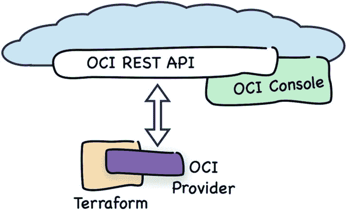

图 3-9. Terraform

让我们更仔细地审视基础设施即代码的概念。

### 基础设施即代码

*基础设施即代码*背后的概念很简单。你在一个或多个配置文件中定义你的目标云基础设施，它由虚拟云网络、计算实例、实例池、自定义镜像、各种类型的存储、托管数据库实例、托管 Kubernetes 集群和其他云资源组成。我们常说你在编写*基础设施代码*。如果你使用的是 Terraform，这些配置文件（或简称基础设施代码）使用类似 JSON 的 HashiCorp 语言（HCL）语法。代码清单 3-11 展示了一个用 HCL 语法编写的计算实例定义示例。

```
resource "oci_core_instance" "bastion_vm" {
  compartment_id      = var.compartment_ocid
  display_name        = "bastion-vm"
  availability_domain = var.ads[0]
  source_details {
    source_id   = var.compute_image_ocid
    source_type = "image"
  }
  shape = "VM.Standard2.2"
  create_vnic_details {
    subnet_id        = oci_core_subnet.bastion_ad1_net.id
    assign_public_ip = true
  }
  metadata = {
    ssh_authorized_keys = file("~/.ssh/oci_id_rsa.pub")
  }
}
```
代码清单 3-11. 用于计算实例的 Terraform HCL

每个云资源定义都使用数据块来指定。资源块头部具有 `resource <类型> <名称>` 的结构。例如，Oracle Cloud Infrastructure 计算实例属于 `oci_core_instance` 类型。如果你仔细看代码清单 3-11，会发现一些属性值使用了对变量（`var.compartment_ocid`）、其他资源的属性（`oci_core_subnet.bastion_ad1_net.id`）的引用，甚至使用了本地文件系统中的文件路径（`file(...)`）。这得出一个结论：一些资源依赖于其他资源。很明显，依赖链对于在相关资源组上执行各种操作（如创建或销毁）的顺序至关重要。Terraform 会构建一个图来跟踪所有这些依赖关系，并用它来决定哪些操作可以并行完成（以缩短整体配置时间），哪些操作必须按顺序执行。

你编写的基础设施代码被理解为*预期状态*。你可以来回更改代码，并多次应用这些更改。每次你这样做时，Terraform 都会将预期状态与所谓的*当前状态*（对应于上一次配置期间部署的基础设施）进行比较。计算出的差异用于创建一个*执行计划*，该计划由一系列步骤组成，这些步骤涉及调用各种 OCI REST API，从而引发实际的配置操作。只要不影响依赖链，选定的步骤可以并行运行。一个执行计划可以包括创建新云资源、修改现有资源或终止必须删除的资源的操作。有时，仅仅更改一个资源的属性就会导致终止实例并启动一个全新的实例。例如，当你更改现有实例的计算实例规格（shape）时，就会发生这种情况。规格指定了计算实例的硬件配置。其他更改可能导致非破坏性的修订，例如向现有安全列表添加一条新的安全规则。

我们在本节中刚刚完成的是一个关于 Oracle Cloud Infrastructure 的 Terraform 提供程序速成课程。如果你感觉我们只是触及了某个复杂事物的表面，那你是完全正确的，但别担心。本书的所有后续章节中，我们将使用 Terraform，因此你将有很多机会进行实践。最后但同样重要的是，随着 Terraform 功能在书中出现，我会随时进行解释。

**提示**

你可以在 [www.terraform.io/docs/index.html](http://www.terraform.io/docs/index.html) 找到 Terraform 文档。

我敢打赌你现在正在问自己，如何开始着手使用 Terraform 驱动的 Oracle Cloud Infrastructure 自动化。先安装软件怎么样？


### 安装

在撰写本文时，你只需下载与你的操作系统相匹配的 Terraform 版本的单个可执行二进制文件。要安装 Terraform，请遵循以下步骤：

1.  访问 [`www.terraform.io/downloads.html`](http://www.terraform.io/downloads.html)。

2.  下载适用于你操作系统的二进制文件。

3.  将下载的 `terraform` 文件移动到存放软件二进制文件的目录，并记住将此目录添加到你的 `PATH` 变量中，除非你已完成此操作。

4.  通过执行版本检查命令来测试安装。

所有这些步骤都可以自动化。只需在执行前注意识别到最新二进制文件的正确路径即可。在撰写本文时，最新的二进制文件是 0.12.9 版本。

```
$ wget https://releases.hashicorp.com/terraform/0.12.2/terraform_0.12.9_linux_amd64.zip
$ sudo unzip terraform_0.12.9_linux_amd64.zip -d /usr/local/bin
$ terraform -v
Terraform v0.12.9
```

提示

如果你使用的是 Windows Subsystem for Linux，则必须下载适用于 Linux 的 Terraform 二进制文件。使用前面的代码片段，并在 WSL 控制台内执行它。

正如你可能预期的那样，这种简便性是需要付出*手动升级*的代价的。每次你看到类似以下消息时，就需要下载一个新的二进制文件并替换你正在使用的文件：

```
$ terraform -v
Terraform v0.12.8
Your version of Terraform is out of date! The latest version
is 0.12.9\. You can update by downloading from www.terraform.io/downloads.html
```

这基本上就是你需要了解的关于安装的全部内容。所有后续方面都需要在你要使用的特定提供商插件的背景下考虑。让我在下一节解释我的意思。

### 配置

事实上，表达式 *Terraform 配置*指的是包含基础结构代码的整个文件集。每个项目都至少在一个基础结构代码文件中包含一个 `provider` 块。基于此块，Terraform 知道要使用哪个提供商插件二进制文件。如果 Terraform 在跨项目的默认目录中找不到相应的提供商插件二进制文件，它将下载该二进制文件并将其放置在项目的 `.terraform/plugins` 子目录中。

要探索最简单的基于 Terraform 的基础结构项目，请转到 `chapter03/3-terraform/1-provider-only` 目录。

```
$ cd git/oci-book/chapter03/3-terraform/1-provider-only
```

此项目目录包含两个文件，如列表 3-12 所示。

```
1-provider-only/
├── provider.tf
└── vars.tf
列表 3-12
Terraform 项目结构 (1-provider-only)
```

`provider.tf` 文件的内容如列表 3-13 所示。

```
# provider.tf
provider "oci" {
tenancy_ocid = var.tenancy_ocid
user_ocid = var.user_ocid
region = var.region
fingerprint = var.fingerprint
private_key_path = var.private_key_path
private_key_password = var.private_key_password
}
列表 3-13
引用变量的 Terraform 提供商配置
```

因为 Terraform 最终向 OCI REST API 发送 API 请求，它需要与 SDK 和 CLI 相同的连接参数集来签名请求。“为 SDK、CLI 和 Terraform 做准备”一节描述了在哪里可以找到它们。理论上，你可以直接将与你云环境相关的值存储在 `provider.tf` 文件中。然而，这是不鼓励的，因为这些数据在一定程度上包含敏感信息，而你并不希望将这些数据存储在版本控制系统中。

为了避免将 `provider` 块所需的值存储在任何基础结构代码文件中，我们将使用变量来注入它们。我们仍然需要声明这些变量。你可以考虑将变量声明添加到同一个 `provider.tf` 文件中。这绝对是可行的。但是，为了保持项目资产的结构良好，存在另一个用于此目的的文件：`vars.tf` 文件。如列表 3-14 所示。

```
# vars.tf
variable "tenancy_ocid" {}
variable "user_ocid" {}
variable "region" {}
variable "fingerprint" {}
variable "private_key_path" {}
variable "private_key_password" {}
列表 3-14
Terraform 变量配置
```

为变量提供值有四种基本方式。

*   在执行 Terraform 命令时，在提示符处为每个变量提供一个值
*   在执行 Terraform 命令时，使用 `-var` 参数为每个变量单独提供值
*   使用变量定义文件 `.tfvars`，其文件路径在执行 Terraform 命令时作为 `-var-file` 参数传递
*   使用带有 `TF_VAR_` 前缀的环境变量

你可以每次在发出 `terraform` 命令时都提供变量值，但我相信即使对这个星球上最有耐心的人来说，这也会变得很烦人。更常见的情况是，你最终会在变量定义文件中定义它们或使用环境变量。

任何以 `TF_VAR_` 为前缀的环境变量都会被 Terraform 考虑在内。例如，`TF_VAR_region` 将被视为变量 `region` 的来源。这就是为什么你会发现将输入变量保存在某种 shell 脚本中很有用。然后你可以执行该脚本，结果是在每次即将处理基于 Terraform 的项目时设置这些变量。让我们准备一个这样的文件。首先，复制以下模板：

```
$ cp ~/git/oci-book/chapter03/3-terraform/tfvars.env.template.sh ~/tfvars.env.sh
```


现在，请编辑新创建的 `tfvars.env.sh` 文件，记得正确替换所有值。对于 `TF_VAR_compartment_ocid`，请使用 `Sandbox` 区间的 OCID。

```
## Terraform
export TF_VAR_tenancy_ocid=ocid1.tenancy.oc1..aa.........abcdef
export TF_VAR_user_ocid=ocid1.user.oc1..aa.........ghijkl
export TF_VAR_fingerprint=12:78:5b:.........:a7:88:12
export TF_VAR_region=eu-frankfurt-1
export TF_VAR_private_key_path=/Users/mjk/.apikeys/oci_api_pem
export TF_VAR_private_key_password=secret
export TF_VAR_compartment_ocid=ocid1.compartment.oc1..aa.........
```

同样，你可以使用 `vi` 或其他文本编辑器来编辑该文件。

```
$ vi ~/tfvars.env.sh
```

小贴士

你可以查看位于 `~/.oci/config` 路径下的 SDK/CLI 配置文件，并复制其中的值来使用，这次是用于 Terraform 的 `tfvars.env.sh` 文件。此外，请记住使用 `Sandbox` 区间的 OCID。

如果你选择不将私有 API 签名密钥的密码存储为环境变量之一，Terraform 将会提示你输入这个缺失的变量，如下所示：

```
var.private_key_password
Enter a value:
```

老实说，这可能会相当烦人。如果你不介意将私有 API 签名密钥的密码存储在你稍后会 `source` 的文件中，请随意这样做。在这种情况下，请记得设置正确的文件系统权限，以将读取权限限制为仅文件所有者可用。

```
$ chmod go-rwx ~/tfvars.env.sh
```

如果你愿意，可以为每个会话 source 这个文件。为此，请将相应的命令附加到 `~/.bashrc`（Linux 或 Windows Subsystem for Linux）或 `~/.bash_profile`（macOS）文件的末尾。

```
$ echo "source ${HOME}/tfvars.env.sh" | tee -a ${HOME}/.bash_profile
```

我们已准备好初始化一个新的 Terraform 项目。执行 `terraform init` 命令。该工具将检测到你希望使用 `oci` 提供程序，下载其最新版本的二进制文件，并将提供程序文件放置在 `.terraform/plugins` 子目录中。现在让我们试试看。

```
$ source ~/tfvars.env.sh
$ cd ~/git/oci-book/chapter03/3-terraform/1-provider-only
$ terraform init
Initializing provider plugins...
- Checking for available provider plugins on https://releases.hashicorp.com...
- Downloading plugin for provider "oci" (3.45.0)...
* provider.oci: version = "~> 3.45"
Terraform has been successfully initialized!
```

现在，让我们检查一下同一个项目目录。

```
.
├── .terraform
│   └── plugins
│       └── darwin_amd64
│           ├── lock.json
│           └── terraform-provider-oci_v3.45.0_x4
├── provider.tf
└── vars.tf
```

如你所见，出现了一个新的子目录。你是否好奇 Terraform 刚刚下载的提供程序二进制文件有多大？我也很好奇。

```
$ du -sh .terraform/
41M  .terraform/
```

提供程序二进制文件的大小在不同平台间确实略有差异。

你已准备好创建一个简单但这次更有意义的 Terraform 项目。这是基础设施即代码方法的真实实践。请继续阅读。

## 使用 Terraform

在本节中，我们将创建一个小型的基础设施即代码项目。目标设置将包括一个虚拟云网络，其中包含一个在公共子网中运行的单一计算实例。该虚拟机将运行一个 Apache HTTP 服务器实例。安全规则和操作系统防火墙规则将允许流量流入服务器的 80 端口。图 3-10 使用 Oracle Cloud Infrastructure 符号展示了此架构。

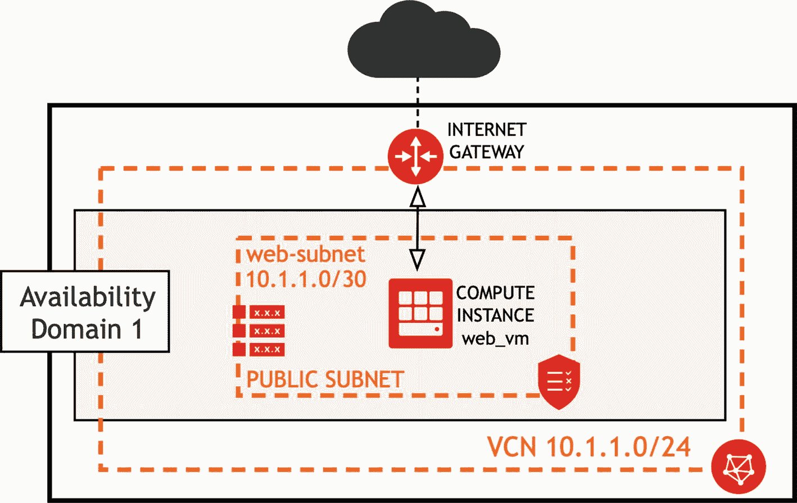

图 3-10

单服务器基础设施

### 配置

请确保你已安装 Terraform。我假设你已经将所需的连接相关变量添加到一个文件中，并且你已经在当前的终端会话中 source 了该文件。你可以通过执行一个列出所有以 `TF_VAR_` 为前缀的环境变量的命令，来检查变量是否设置正确。

```
$ env | grep TF_VAR_
TF_VAR_tenancy_ocid={you-will-see-here-your-value}
TF_VAR_compartment_ocid={you-will-see-here-your-value}
TF_VAR_region={you-will-see-here-your-value}
TF_VAR_fingerprint={you-will-see-here-your-value}
TF_VAR_private_key_path={you-will-see-here-your-value}
TF_VAR_user_ocid={you-will-see-here-your-value}
TF_VAR_private_key_password={you-will-see-here-your-value}
```

现在，请进入此目录：

```
$ cd ~/git/oci-book/chapter03/3-terraform/2-simple-infrastructure
```

你应该看到以下文件：

```
.
├── modules.tf
├── provider.tf
├── vars.tf
├── vcn.tf
└── web
    ├── cloud-init
    │   └── webvm.config.yaml
    ├── compute.tf
    ├── vars.tf
    └── vcn.tf
```

如果你阅读了前一节，你已经知道在 `provider.tf` 和 `vars.tf` 文件中预期会看到什么内容。我们现在将初始化基础设施项目。

```
$ terraform init
Initializing modules...
- module.web
  Getting source "web"
Initializing provider plugins...
- Checking for available provider plugins on https://releases.hashicorp.com...
- Downloading plugin for provider "oci" (3.45.0)...
* provider.oci: version = "~> 3.45"
Terraform has been successfully initialized!
```

Terraform 为 `oci` 提供程序下载了最新的插件版本。

让我们再看看这些目录。每个包含 `.tf` 文件的目录都可以被视为一个独立的 *模块*。如果你将基础设施配置拆分成带有专用文件夹和精心选择的输入参数的 Terraform 配置文件组，你将能够提高代码在项目间的可重用性。我们的演示项目包含两个模块。

- **root**：我们在这里定义提供程序配置、一个 VCN、一个互联网网关以及对 `web` 模块的引用。
- **web**：我们在这里定义路由表、安全列表、子网以及一个使用 `cloud-init` 脚本来安装和启动 Web 服务器的计算实例。

如果你打开 `vars.tf` 文件，你会发现与我们在前一节看到的同名文件相比，它多定义了一个变量，即 `compartment_ocid`。

```
### Provider-specific Variables
variable "tenancy_ocid" {}
variable "user_ocid" {}
variable "region" {}
variable "private_key_path" {}
variable "fingerprint" {}
variable "private_key_password" {}
### Project-specific input variables
variable "compartment_ocid" {}
```

几乎每个 OCI 资源都存在于一个区间内。这意味着你将需要提供你希望资源存在于其中的特定区间的 OCID。相应的环境变量已经存在于 `tfvars.env.sh` 文件中。

`web/compute.tf` 配置文件内的计算实例资源定义假设你有一个现有的 SSH 密钥对，其公钥位于 `~/.ssh/oci_id_rsa.pub`。请在 `~/.ssh/` 目录下生成一个新的密钥对，或者将第 2 章中创建的现有密钥对复制到该文件夹。

我们现在将配置该基础设施。一旦我们看到它启动并运行，我将详细解释配置文件。请确保你位于 `2-simple-infrastructure` 目录中，并像这样执行 `terraform apply` 命令：


让我们仔细看看前面的代码片段。可以看到，虚拟云网络 (`web_vcn`) 是最先被创建的云资源。接着，Internet 网关 (`web_igw`) 和安全列表 (`web_sl`) 的创建过程并行启动。这一点非常清晰。两者都存在于一个 VCN 内部，并且彼此之间没有依赖关系。

### 资源创建依赖关系

然而，路由表 (`web_rt`) 必须等到 Internet 网关成功创建后才能开始创建。其原因在于，我们在路由表中包含的路由规则将 Internet 网关指定为其目标。换句话说，路由表依赖于 Internet 网关的存在。在路由表和安全列表都创建完成后，子网 (`web_subnet`) 的创建便立即开始了。最后，计算实例 (`web_vm`) 的配置启动，这个过程花费了近一分钟才完成。图 3-11 展示了依赖关系树。

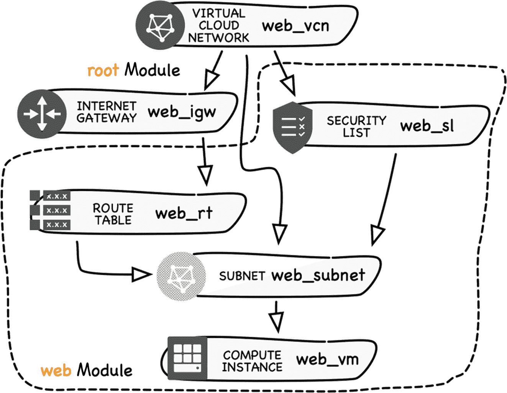

**图 3-11** 资源依赖关系树

最后两个标注着 `Refreshing state` 文字的条目 (`web_vnic_attachment` 和 `web_vnic`) 意味着向 OCI REST API 发送了只读请求以获取某些信息。在这个例子中，Terraform 向 OCI 查询了分配给新启动的计算实例的公共 IP 地址。请记下这个地址（在我这里是 `130.61.127.53`，但你很可能会看到不同的值，除非你幸运地从地址池中获得了相同的地址）。稍后测试部署时会用到它。

恭喜！你刚刚使用基础设施即代码方法，成功配置了你的第一个基于 Terraform 的云解决方案。如果你愿意，可以前往 OCI 控制台查看它，如图 3-12 所示。

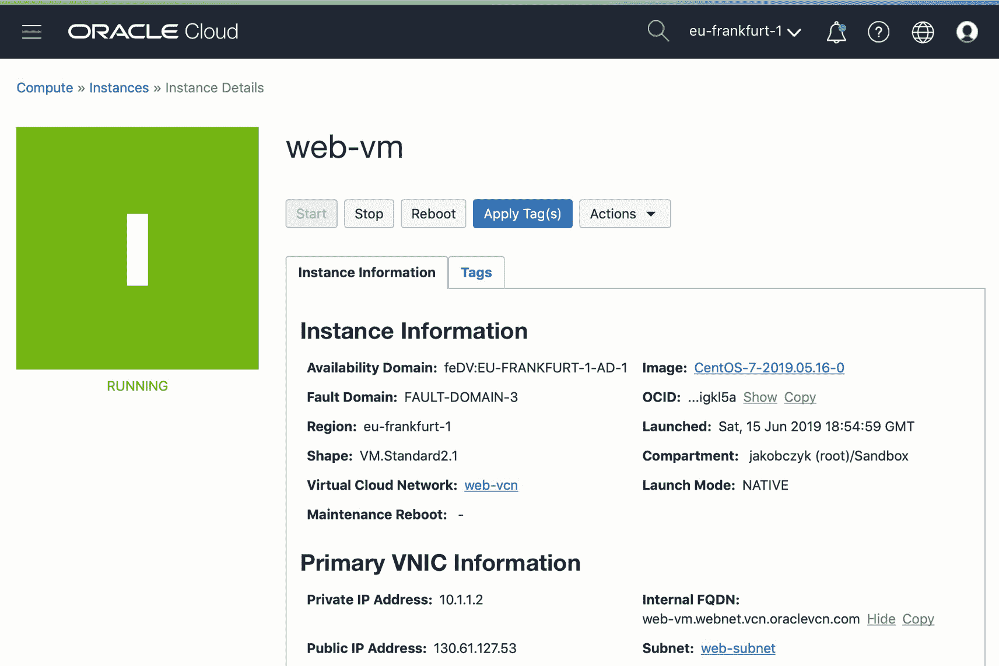

**图 3-12** OCI 控制台中的 web-vm 计算实例

实例处于运行中状态并不意味着启动过程已经完成。Cloud-init 脚本，特别是那些负责下载和安装新软件的脚本，可能需要一些时间才能完成。我在第 2 章中已经解释过这一点。尝试使用 `curl` 发送几次标准 GET 请求，直到你看到如下输出：

```bash
$ VM_PUBLIC_IP=`terraform output web_instance_public_ip`
$ echo $VM_PUBLIC_IP
130.61.127.54
$ curl $VM_PUBLIC_IP
Greetings from the Cloud
```

如果你看到了问候语，那就意味着你已成功测试了我们简单的云应用程序。万岁！

> **提示**
>
> 如果你觉得等待 cloud-init 脚本完成很无聊，可以登录到实例并跟踪 cloud-init 日志。我在第 2 章中已经解释过如何操作。

### 清理资源

当你需要更新复杂云基础设施的细小部分时，基础设施即代码方法的优势便真正显现出来。Terraform 会尽量减少变更数量，只修改（或重新创建）那些确实需要被修改（或被销毁并重新启动）的资源。

假设你已经充分享受了测试简单云应用程序的乐趣，我们现在将终止这些资源。你可以通过执行 `terraform destroy` 命令来完成此操作。如果你使用 `--auto-approve` 选项，Terraform 将不会征求你的最终许可，而是直接向 OCI REST API 发送请求。以下是执行清理并终止我们刚才创建的基础设施的方法：

```bash
$ terraform destroy
data.oci_identity_availability_domains.ads: Refreshing state...
data.oci_core_images.centos_image: Refreshing state...
oci_core_internet_gateway.web_igw: Refreshing state...
oci_core_virtual_network.web_vcn: Refreshing state...
module.web.oci_core_route_table.web_rt: Refreshing state...
module.web.oci_core_security_list.web_sl: Refreshing state...
module.web.oci_core_subnet.web_subnet: Refreshing state...
module.web.oci_core_instance.web_vm: Refreshing state...
module.web.data.oci_core_vnic_attachments.web_vnic_attachment: Refreshing state...
module.web.data.oci_core_vnic.web_vnic: Refreshing state...

An execution plan has been generated and is shown below.
Resource actions are indicated with the following symbols:
  - destroy

Terraform will perform the following actions:
  - module.web.oci_core_instance.web_vm

  - module.web.oci_core_route_table.web_rt

  - module.web.oci_core_security_list.web_sl

  - module.web.oci_core_subnet.web_subnet

  - oci_core_internet_gateway.web_igw

  - oci_core_virtual_network.web_vcn

Plan: 0 to add, 0 to change, 6 to destroy.

Do you really want to destroy all resources?
Terraform will destroy all your managed infrastructure, as shown above.
There is no undo. Only 'yes' will be accepted to approve.

Enter a value: yes

module.web.oci_core_instance.web_vm: Destroying...
module.web.oci_core_instance.web_vm: Still destroying... (10s elapsed)
module.web.oci_core_instance.web_vm: Still destroying... (20s elapsed)
module.web.oci_core_instance.web_vm: Still destroying... (30s elapsed)
module.web.oci_core_instance.web_vm: Still destroying... (40s elapsed)
module.web.oci_core_instance.web_vm: Still destroying... (50s elapsed)
module.web.oci_core_instance.web_vm: Destruction complete after 51s
module.web.oci_core_subnet.web_subnet: Destroying...
module.web.oci_core_subnet.web_subnet: Destruction complete after 0s
module.web.oci_core_route_table.web_rt: Destroying...
module.web.oci_core_route_table.web_rt: Destruction complete after 0s
module.web.oci_core_security_list.web_sl: Destroying...
module.web.oci_core_security_list.web_sl: Destruction complete after 0s
oci_core_internet_gateway.web_igw: Destroying...
oci_core_internet_gateway.web_igw: Destruction complete after 0s
oci_core_virtual_network.web_vcn: Destroying...
oci_core_virtual_network.web_vcn: Destruction complete after 1s

Destroy complete! Resources: 6 destroyed.
```


```
$ terraform destroy --auto-approve
oci_core_virtual_network.web_vcn: 刷新状态中...
data.oci_core_images.centos_image: 刷新状态中...
data.oci_identity_availability_domains.ads: 刷新状态中...
oci_core_security_list.web_sl: 刷新状态中...
oci_core_internet_gateway.web_igw: 刷新状态中...
oci_core_route_table.web_rt: 刷新状态中...
oci_core_subnet.web_subnet: 刷新状态中...
oci_core_instance.web_vm: 刷新状态中...
data.oci_core_vnic_attachments.web_vnic_attachment: 刷新状态中...
data.oci_core_vnic.web_vnic: 刷新状态中...
module.web.oci_core_instance.web_vm: 正在销毁...
module.web.oci_core_instance.web_vm: 仍在销毁中...已过去 10 秒
module.web.oci_core_instance.web_vm: 仍在销毁中...已过去 20 秒
module.web.oci_core_instance.web_vm: 仍在销毁中...已过去 30 秒
module.web.oci_core_instance.web_vm: 仍在销毁中...已过去 40 秒
module.web.oci_core_instance.web_vm: 仍在销毁中...已过去 50 秒
module.web.oci_core_instance.web_vm: 仍在销毁中...已过去 1 分 0 秒
module.web.oci_core_instance.web_vm: 仍在销毁中...已过去 1 分 10 秒
module.web.oci_core_instance.web_vm: 仍在销毁中...已过去 1 分 20 秒
module.web.oci_core_instance.web_vm: 销毁完成，耗时 1 分 25 秒
module.web.oci_core_subnet.web_subnet: 正在销毁...
module.web.oci_core_subnet.web_subnet: 销毁完成，耗时 1 秒
module.web.oci_core_route_table.web_rt: 正在销毁...
module.web.oci_core_security_list.web_sl: 正在销毁...
module.web.oci_core_security_list.web_sl: 销毁完成，耗时 0 秒
module.web.oci_core_route_table.web_rt: 销毁完成，耗时 0 秒
oci_core_internet_gateway.web_igw: 正在销毁...
oci_core_internet_gateway.web_igw: 销毁完成，耗时 1 秒
oci_core_virtual_network.web_vcn: 正在销毁...
oci_core_virtual_network.web_vcn: 销毁完成，耗时 0 秒
销毁完成！资源：6 个已销毁。
```

资源销毁的顺序与其创建的顺序相反。您可以验证计算实例是否真的已被终止。在 OCI 控制台中，您应该会看到如图 3-13 所示的内容。

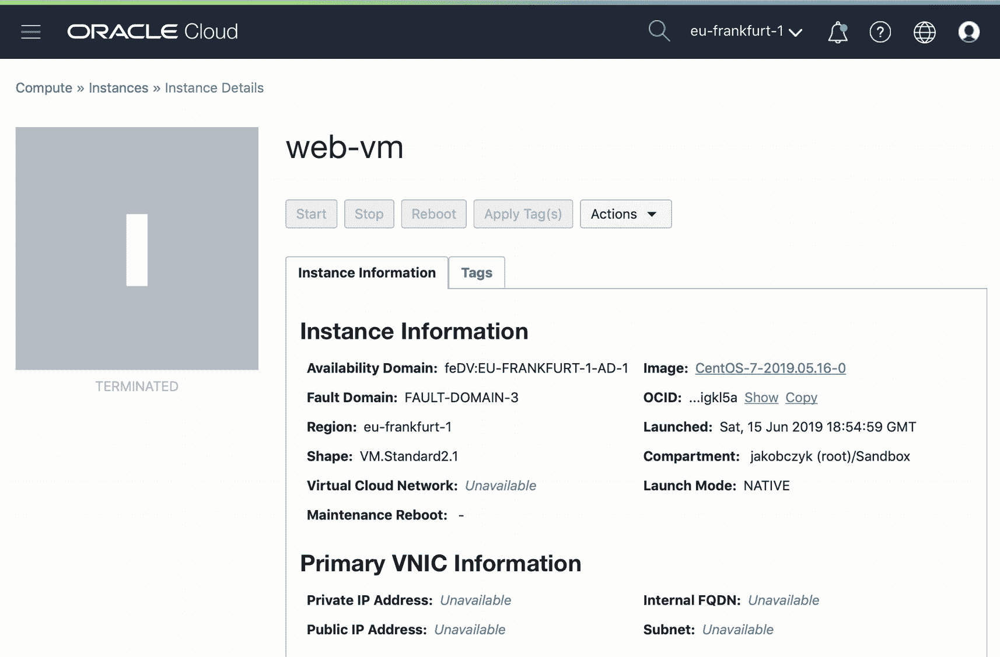

图 3-13 已终止的实例

## 基础设施代码

在本节中，我们将讨论在 Terraform 配置文件（后缀为 `.tf`）中定义的资源。让我们再看一下我们的项目由哪些文件组成：

```
.
├── modules.tf
├── provider.tf
├── vars.tf
├── vcn.tf
└── web
    ├── cloud-init
    │   └── webvm.config.yaml
    ├── compute.tf
    ├── vars.tf
    └── vcn.tf
```

我们已经讨论过 `provider.tf` 和 `vars.tf`。`vcn.tf` 文件包含两个资源定义：一个虚拟云网络 (`web_vcn`) 和一个互联网网关 (`web_igw`)。您可以在代码清单 3-15 中看到这两个资源的定义。

```
resource "oci_core_virtual_network" "web_vcn" {
  compartment_id = var.compartment_ocid
  cidr_block     = "10.1.1.0/24"
  display_name   = "web-vcn"
  dns_label      = "vcn"
}
resource "oci_core_internet_gateway" "web_igw" {
  compartment_id = var.compartment_ocid
  vcn_id         = oci_core_virtual_network.web_vcn.id
}
代码清单 3-15 vcn.tf (根模块)
```

互联网网关 (`web_igw`) 引用了其所在 VCN 的 OCID (`vcn_id`)。它是借助 Terraform 语法实现的，该语法使您能够引用资源、变量、数据源、本地值和其他类型 Terraform 配置的属性，以及使用函数和数学计算。如果要引用资源，您将使用遵循此结构的表达式：`type.name.attribute`，例如 `oci_core_virtual_network.web_vcn.id`。如果要引用变量，您将使用此结构：`var.variable_name`，例如 `var.compartment_ocid`。

根模块没有定义任何其他资源。另一方面，它确实包含一个模块定义。您可以在 `modules.tf` Terraform 配置文件中找到它。其内容如代码清单 3-16 所示。

```
data "oci_identity_availability_domains" "ads" {
  compartment_id = var.tenancy_ocid
}
data "oci_core_images" "centos_image" {
  compartment_id           = var.tenancy_ocid
  operating_system         = "CentOS"
  operating_system_version = 7
  shape                    = "VM.Standard2.1"
}
module "web" {
  source              = "./web"
  compartment_ocid    = var.compartment_ocid
  vcn_ocid            = oci_core_virtual_network.web_vcn.id
  vcn_igw_ocid        = oci_core_internet_gateway.web_igw.id
  vcn_subnet_cidr     = "10.1.1.0/30"
  ads                 = data.oci_identity_availability_domains.ads.availability_domains[*].name
  compute_image_ocid  = data.oci_core_images.centos_image.images[0].id
}
output "web_instance_public_ip" { value = module.web.web_public_ip }
代码清单 3-16 modules.tf (根模块)
```

这个文件比我们之前讨论的那一个多大约三倍的行数。Terraform 使用*数据源*来提供对云中已存在资源或在配置过程中动态计算资源的只读视图。第一个配置块定义了一个名为 `ads` 的数据源，用于查询 OCI 以获取可用性域列表。第二个配置块定义了另一个名为 `centos_image` 的数据源，负责获取可用的 CentOS 7 基础镜像列表。操作系统基础镜像的新版本每月发布，因此这将始终为您获取当前存在版本的引用。在生产环境中，您可以硬编码特定镜像的 OCID，以避免在较新镜像发布时出现基础设施的意外变更。在我们的案例中，每次执行 Terraform 时获取最新镜像的 OCID 是可行的。


## Terraform 模块与配置详解

Terraform 使用 **模块** 来汇集多个 Terraform 配置文件，并将其作为可在各种项目中重复使用和定制的组件。每个包含 `.tf` 文件的目录都可以看作是一个模块。查看我们项目的根目录，可以看到有两个目录可以作为模块使用。我们正在讨论的 `modules.tf` 文件位于我们称为根模块的目录中。该文件中的第三个配置块定义了一个名为 `web` 的模块，并告诉 Terraform 实例化在 `source` 属性提供的目录中定义的资源，在我们的例子中，这指的是 `web` 子目录。为了定制一个模块实例，我们可以使用我们选择的属性，只要它们在引用的模块目录中被定义为变量即可。这听起来可能有点令人困惑。让我用一个例子来解释。如果你再次查看 `modules.tf` 配置文件，你会看到我将一个 VCN 的 OCID 作为一个自定义的、任意命名的模块属性 `vcn_ocid` 传递了进去。`source` 模块属性指向 `web` 子目录作为模块目录。如果你打开 `web/vars.tf` 配置文件，你会看到变量定义与 `modules.tf` 中的模块属性名称完全相同。为了方便你理解，我决定在图 3-14 中展示这种关系。

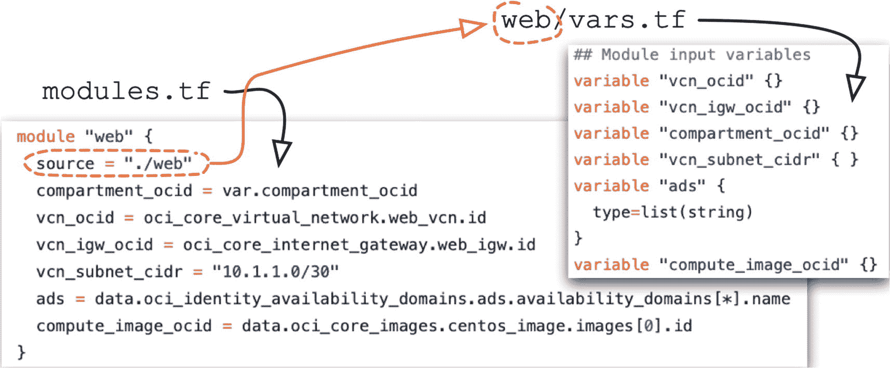

**图 3-14：输入变量与模块属性**

VCN 和互联网网关都由 `web` 模块内定义的资源引用；因此，我们必须将它们的 OCID 作为属性值提供给模块。这是通过模块属性 `vcn_ocid` 和 `vcn_igw_ocid` 完成的，这些属性被模块内的资源视为变量。此外，我们还通过属性/变量 `vcn_subnet_cidr` 提供了子网的地址范围块，以及通过属性/变量 `compartment_ocid` 提供了隔间的 OCID。

我们使用在 `modules.tf` 文件开头定义的数据源进行插值，将获取的值传递到模块中。模块属性 `compute_image_ocid` 用于传递将由 `web` 模块内定义的计算实例使用的操作系统基础镜像的 OCID。请稍等片刻，以理解这个插值表达式的作用。我们的目标是向模块传递一个 OCID，而数据源被定义为读取所有可用的 CentOS 7 镜像，并首先显示基础操作系统镜像。为了实现我们的目标，我们必须从数据源获取的 CentOS 7 基础镜像列表中选择第一个元素的 OCID。图 3-15 详细解释了表达式的每个部分负责什么。

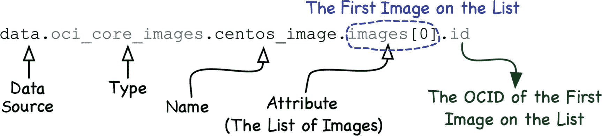

**图 3-15：Terraform 数据源插值示例**

更精确地说，从技术上讲，OCI 提供程序中数据源返回的列表中的元素目前被实现为映射，因为它们将碰巧是列表元素属性名称的键与作为相应列表元素属性值的值关联起来。这允许我们在插值表达式中使用另一种基于查找的语法。我现在将通过一个基于第二个数据源的示例来展示这种替代方法。

> **注意**
>
> Oracle Cloud Infrastructure 的 Terraform 提供程序是作为 Go 语言的开源项目实现的。你可以在 GitHub 上找到源代码：`https://github.com/terraform-providers/terraform-provider-oci`。

模块属性 `ads` 为 `web` 模块内同名的变量提供输入。这次，该变量是一个 `list` 类型。这样，我们可以存储多个值，这些值可以基于列表索引在此变量中访问。`oci_identity_availability_domains` 类型的数据源 `ads` 返回一个可用性域列表。尽管在我们简单的项目中只启动一个计算实例，并且本可以通过传递单个特定可用性域名来满足要求，但我决定向模块提供一个包含 API 返回的所有可用性域名的列表。这样，为计算实例选择特定可用性域的任务就委托给了模块的内部逻辑。为了构造一个列表，用于存储另一个列表中所有元素的某个属性的值，我们使用了 **splat 表达式**，如图 3-16 所示。

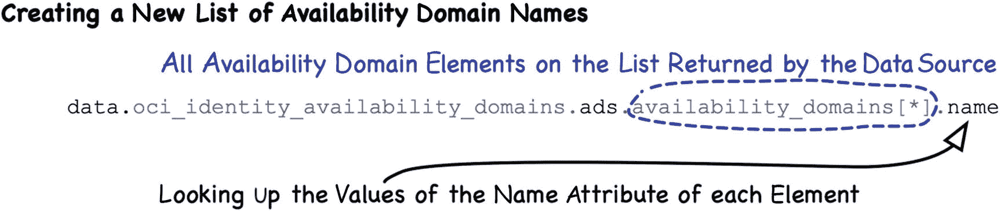

**图 3-16：Terraform 查找插值示例**

列表 3-17 展示了 `web` 模块目录内的 `vcn.tf` 文件的内容。它包含了路由表 `web_rt`、安全列表 `web_sl` 和子网 `web_subnet` 的配置。

```hcl
resource "oci_core_route_table" "web_rt" {
  compartment_id = var.compartment_ocid
  vcn_id         = var.vcn_ocid
  route_rules {
    destination_type  = "CIDR_BLOCK"
    destination       = "0.0.0.0/0"
    network_entity_id = var.vcn_igw_ocid
  }
  display_name = "web-rt"
}

resource "oci_core_security_list" "web_sl" {
  compartment_id = var.compartment_ocid
  vcn_id         = var.vcn_ocid
  egress_security_rules {
    stateless    = "false"
    destination  = "0.0.0.0/0"
    protocol     = "all"
  }
  ingress_security_rules {
    stateless = "false"
    source    = "0.0.0.0/0"
    protocol  = "6"
    tcp_options {
      min = 22
      max = 22
    }
  }
  ingress_security_rules {
    stateless = "false"
    source    = "0.0.0.0/0"
    protocol  = "6"
    tcp_options {
      min = 80
      max = 80
    }
  }
  display_name = "web-sl"
}

resource "oci_core_subnet" "web_subnet" {
  compartment_id                     = var.compartment_ocid
  vcn_id                             = var.vcn_ocid
  display_name                       = "web-subnet"
  availability_domain                = var.ads[0]
  cidr_block                         = var.vcn_subnet_cidr
  route_table_id                     = oci_core_route_table.web_rt.id
  security_list_ids                  = [oci_core_security_list.web_sl.id]
  prohibit_public_ip_on_vnic         = "false"
  dns_label                          = "webnet"
}
```
**列表 3-17：web/vcn.tf (Web 模块)**

路由表 `web_rt` 定义了一条路由规则，该规则将所有旨在前往 VCN 外部的出站流量 (`0.0.0.0/0`) 路由到在根模块中定义且其 OCID 作为模块属性传递的互联网网关。

安全列表 `web_sl` 定义了一个有状态的出站规则，允许所有出站流量，以及两个有状态的入站规则，允许端口 22 (SSH) 和 80 (HTTP) 的入站流量。需要提醒的是，如果一个有状态的安全规则允许其监督方向的流量，那么作为同一 TCP 会话一部分返回的相应数据包也将被允许。

子网 `web_subnet` 资源存在于根模块中定义且其 OCID 作为模块属性传递的 VCN 内。它引用了在 `web` 模块中创建并在前两段中简要描述的路由表和安全列表。`availability_domain` 属性的值展示了如何使用索引访问列表变量：`var.ads[0]`。设置为 `false` 的 `prohibit_public_ip_on_vnic` 属性使此子网成为公网子网。值得注意的是，即使我们只为这个子网使用一个安全列表，我们仍然必须将其 OCID 作为列表元素传递，因为 `security_list_ids` 属性需要一个列表。这是因为一个子网可以引用多个安全列表。


### 计算模块配置与状态管理

清单 3-18 展示了位于 `web` 模块目录内的 `compute.tf` 文件的内容。它包含计算实例 (`web_vm`) 的资源配置，该实例运行一个 Apache 网络服务器，以及两个用于在资源调配期间获取分配给该实例的公网 IP 的数据源 (`web_vnic_attachment` 和 `web_vnic`)。在文件底部，你会找到一个输出配置块 (`web_public_ip`)，我稍后会解释它。

```
resource "oci_core_instance" "web_vm" {
  compartment_id = var.compartment_ocid
  display_name   = "web-vm"
  availability_domain = var.ads[0]
  source_details {
    source_id   = var.compute_image_ocid
    source_type = "image"
  }
  shape = "VM.Standard2.1"
  create_vnic_details {
    subnet_id        = oci_core_subnet.web_subnet.id
    assign_public_ip = true
  }
  metadata = {
    ssh_authorized_keys = file("~/.ssh/oci_id_rsa.pub")
    user_data           = base64encode(file("web/cloud-init/webvm.config.yaml"))
  }
}

data "oci_core_vnic_attachments" "web_vnic_attachment" {
  compartment_id = var.compartment_ocid
  instance_id    = oci_core_instance.web_vm.id
}

data "oci_core_vnic" "web_vnic" {
  vnic_id = data.oci_core_vnic_attachments.web_vnic_attachment.vnic_attachments[0].vnic_id
}

output "web_public_ip" {
  value = data.oci_core_vnic.web_vnic.public_ip_address
}
```
清单 3-18
`web/compute.tf` (Web 模块)

计算实例 (`web_vm`) 在同一个模块中定义的子网中启动。该资源定义引用了一个基于 OCID 的镜像，该 OCID 是在 `root` 模块中获取并作为输入变量提供给 `web` 模块的。`create_vnic_details.assign_public_ip` 属性设置为 `true`，这将导致 OCI 从公网地址池中为该实例的主 vNIC 分配一个临时公网 IP 地址。实例上的 `authorized_keys` 文件将包含一个公钥，该公钥作为字符串从文件读取，该文件路径作为参数提供给 `file` 函数，该函数用于 `metadata.ssh_authorized_keys` 属性的表达式中。

`metadata.user_data` 属性为 cloud-init 工具指定一个经过 base64 编码的 cloud-config 配置，该工具可用于有效地自定义计算实例的初始化。我们使用它来安装 Apache HTTP 服务器、替换默认的 `index.html` 文件、在机器上打开端口 80 并启动 HTTP 服务器。清单 3-19 展示了实例首次启动时由 cloud-init 工具使用的 cloud-config 文件的内容。

```
#cloud-config
packages:
  - httpd
write_files:
  - content: |
      Greetings from the Cloud
    path: /var/www/html/index.html
runcmd:
  - [ "firewall-offline-cmd", "--add-port=80/tcp" ]
  - [ "systemctl", "restart", "firewalld" ]
  - [ "systemctl", "enable", "httpd" ]
  - [ "systemctl", "start", "httpd" ]
final_message: "$HOSTNAME initialization has been completed"
```
清单 3-19
`web/cloud-init/webvm.config.yaml` (Web 模块)

公网 IP 地址是从可用的公网 IP 地址池中动态分配给计算实例的。一旦实例调配完成，我们就能获知确切的地址。一个计算实例可以拥有多个 vNIC。第一个数据源 (`web_vnic_attachment`) 获取 vNIC 列表。在我们的例子中，我们的计算实例只有一个 vNIC。我们将从第一个数据源返回的列表中找到的第一个 vNIC 的 OCID 作为第二个数据源 (`web_vnic`) 的输入，该数据源最终返回一个映射，其中 `public_ip_address` 键对应的值就是公网 IP 地址。我们使用输出配置 (`web_public_ip`) 将该值传递给 `root` 模块，在那里，定义在 `modules.tf` 文件底部的另一个输出配置 (`"web_instance_public_ip"`) 会将该值打印到 Terraform 构建的输出中。

当我们执行 `terraform apply` 命令时，Terraform 准备了一个执行计划，该计划包含为将 *当前状态*（基于*状态文件*中存储的信息）转变为 *预期状态*（基于 `root` 模块和 `web` 模块中配置文件（`.tf`）的内容）所需采取的操作。现在是时候简要讨论一下 Terraform 管理状态的方式了。

### 状态

Terraform 使用一个*状态文件*来跟踪其已调配的真实基础设施、它已计算的中间值以及资源之间的依赖关系图。你可以将所有这些元素视为当前状态。状态的存在是 Terraform 实现其目的的关键促成因素。Terraform 将跨配置文件（`.tf`）定义的预期状态（这些文件构成了您的基础架构代码）与状态文件中存储的当前状态进行比较，以生成一个最终导致 API 调用的执行计划。图 3-17 说明了这一概念。

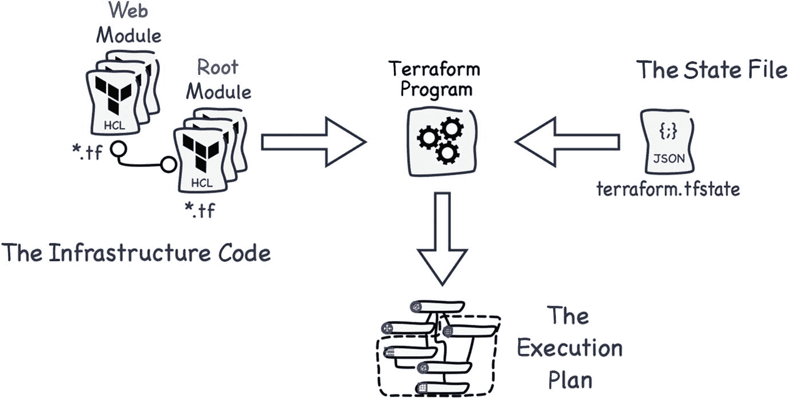
图 3-17
Terraform 状态

如本章前面首次执行 `terraform apply` 命令时，Terraform 在 `root` 模块目录中创建了一个 `terraform.tfstate` 文件。这个 JSON 文件将在您每次运行选定的 Terraform 命令（如 `refresh`、`plan`、`apply` 等）时更新。除非您真的知道要做什么，否则不建议手动更改此文件。在这种情况下，建议您备份该文件并熟悉 `terraform state` 命令的功能。默认情况下，Terraform 将状态文件以 `terraform.tfstate` 文件的形式存储在本地，就像我们的情况一样。这可能导致两个问题：备份策略和团队协作。

首先，将本地状态文件备份到任何类型的版本控制系统中并不是一个好主意，因为该文件可能包含一些敏感数据。其次，与多个团队成员使用的多个副本并发工作，迟早会导致同步问题。

您可以利用 Oracle Cloud Infrastructure 对象存储和 Terraform 的 `http` 后端类型来采用*远程状态*方法，而不是使用我前面提到的存在问题的本地状态文件。如果您这样做，您的状态文件将作为对象存储在对象存储桶中，静态加密并受到保护以防止未经授权的访问。得益于 `http` 后端类型提供的锁定机制，您的团队成员将能够进行协作。图 3-18 展示了对象存储桶中的 Terraform 状态文件。

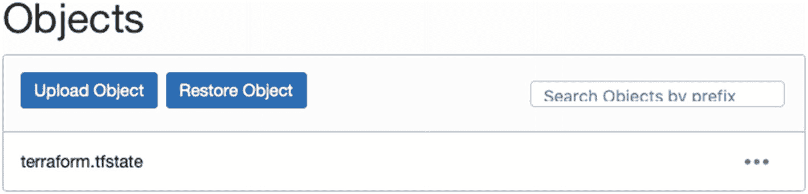
图 3-18
对象存储桶中的 Terraform 状态文件

将 Terraform 状态存储在云对象存储中超出了本书的范围。您可以自行尝试。您将在第 5 章学习如何使用 Oracle Cloud Infrastructure 对象存储桶。


### 最佳实践

现在，我想列出一些关于自动化的建议，与您分享。图 3-19 展示了我们在本章讨论过的自动化选项。

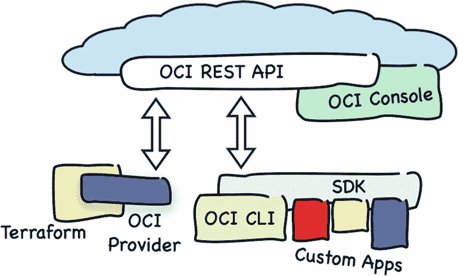

图 3-19：Oracle Cloud Infrastructure 自动化全景图

使用 `Terraform` 将基础设施作为代码进行管理，并采用便捷高效的声明式方法来设计您的云资源。这将使您能够对基础设施代码进行版本控制并跟踪变更，以便随时回退到之前的状态。

使用 `CLI` 创建只读的监控脚本，并在需要按需收集基础设施信息时使用它们。如果需要，可以调度这些脚本以固定时间间隔收集数据，并将结果持久化存储到数据存储中，以供未来研究和分析。如果您需要构建更复杂的云监控工具，可以随意使用 SDK 实现自定义工具。最后但同样重要的是，您应首先通过使用 OCI 的专用云服务来评估其内置的监控功能。然后，您可以直接使用 `CLI` 从这些服务中收集统计数据。

如果您使用 `Terraform`，切勿在 OCI 控制台或使用 `CLI` 对您的云资源进行任何临时性修改；否则，存储当前状态的 `Terraform` 状态文件可能会偏离实际状态，或在无警告的情况下被更改。后一种情况之所以会发生，是因为在执行 `terraform apply` 之前，会隐式执行另一个命令（`refresh`），该命令会根据检测到的实际状态更新状态文件。这样，您可能会无意中在执行计划中纳入对手动创建的资源的一些破坏性操作，并将其删除。

不要将 `Terraform` 状态文件（`terraform.tfstate`）存储在版本控制系统中，因为该文件可能包含敏感数据。如果您使用的是 Git，请确保在您的 `.gitignore` 文件中包含了以下内容：

```
.terraform/
terraform.state*
```

使用远程状态来避免此问题并实现顺畅的团队协作，特别是当远程状态后端支持适当的锁定机制时。如果您无法依赖远程状态，请考虑在专用的构建服务器上运行 `Terraform` 构建，作为持续交付流水线的一部分，以便状态文件存储在具有有限访问权限的单一远程机器上。在这种情况下，您仍然需要解决状态文件备份的问题。或者，您可以使用 `Oracle Cloud Infrastructure 资源管理器`，这是 OCI 的一项服务，但其范围超出了本书的讨论内容。

将您编写的基础设施代码拆分为可重用的模块。仔细考虑哪种模块属性能让您在各种项目中定制和重用您正在处理的模块。思考那些可能在父模块以及 `Terraform` 输出中有用的输出值。

最后但同样重要的是，确保您的计算实例始终使用相同的映像版本，除非您已准备好升级正在运行的实例并知道如何操作，否则即使有更新版本推出也不要改变。您可以通过使用带有硬编码映像 OCID 的变量来实现这一点。在本章中，我们使用了数据源来动态获取 CentOS 7 映像的 OCID。虽然这种方法对于短期存在的概念验证或演示来说完全没有问题，但绝不允许生产系统采用这种方式。如果您动态获取 OCID，并且在两次构建之间引入了新的映像版本，您的实例可能会因为 `Terraform` 更改了其基础映像而被终止并重新启动。对于可用性域，也提出了类似的建议，即提供硬编码的变量值。

## 本章小结

本章介绍了自动化 Oracle Cloud Infrastructure 的三种方式。首先，我重点介绍了 OCI REST API 的作用，特别关注了安全性。您了解了签署请求需要哪些信息以及如何准备必要的 API 签名密钥。接下来，您了解了 Oracle Cloud Infrastructure 的 Python SDK，从安装、配置到在交互式 Python shell 中从 OCI 执行两个简单操作。之后，您熟悉了 `CLI`，发现了它与所基于的 Python SDK 的相似之处。本章的大部分内容侧重于使用 `Terraform` 应用基础设施即代码的原则。您配置了一个简单的单服务器基础设施，执行了冒烟测试，并销毁了这个示例设置。然后，我详细解释了基础设施代码。接着，您学习了 `Terraform` 状态文件的作用。最后，您阅读了一些与自动化相关的建议。在下一章中，我们将更深入地探讨在项目环境管理背景下的身份与访问管理。

