# 4. 云安全与项目环境

在本章中，我们将采用自上而下的方法，思考如何围绕项目、环境以及您即将在 Oracle Cloud Infrastructure 上设计和运行的解决方案，来妥善组织您的云资源。


## 项目、环境与系统

多年来，我们已经习惯于遵循特定的组织流程，以协作方式交付信息技术解决方案。该流程通常围绕一个或多或少的正式计划构建，并持续到特定目标达成或条件满足为止。为了指代整个工作，我们通常称之为 `项目`。几乎所有项目的特点是其临时性。项目的开始、任何可选的中间目标（有时称为 `里程碑`）以及预期的最终结束目标，都有着明确预期的完成日期。当代面向云的信息技术项目，其目标通常要么是改造现有的本地解决方案并将其功能迁移到云端，要么是设计一个全新的云原生解决方案。

一个面向云项目的产物，最常见的是运行在虚拟云基础设施上的一套应用程序。一个组织的软件版图确实可能非常复杂。组织规模越大或技术导向越强，其应用程序的数量和种类就越多。为了避免歧义，并能够指代那些紧密关联的应用程序或应用程序组，我们可以使用 `系统` 这个术语。总而言之，应用版图由许多系统组成，这些系统最终用于驱动广泛的业务流程。通常，大多数系统彼此互联，并需要一定程度的集成。

## 开发生命周期与环境

软件开发生命周期几乎总是迭代式的，因为复杂的问题只有被分解为可管理的阶段才能真正解决。开发者逐步地、以小功能块的方式构建或迁移应用程序。在某些情况下，增量变更可能引入一些回归问题，即导致之前正常工作的功能直接失效的缺陷。为了降低回归风险，至关重要的是整个解决方案至少在每个里程碑上都经过一次全面测试。这是通过所谓的回归测试来完成的。

此外，一些主要里程碑和最终交付物必须得到客户的批准。因此，软件成为所谓的验收测试的对象。虽然开发者频繁地更改他们正在构建的软件，但回归测试和验收测试确实需要一定程度的稳定性。传统的解决方案是通过为不同目的使用不同的 `环境` 来实现的。

开发者在一个或多个 `开发环境` 中工作，他们在其中部署软件的所有中间版本。即使你依赖于自动化单元测试的良好覆盖，这些环境可能仍然相当不稳定。这就是为什么只有选定的版本会被提升为所谓的发布版本，并部署在 `测试环境` 中，在那里进行更复杂的、手动或自动的回归与验收测试。

成功通过测试并获得批准的发布版本通常会被提升到一个所有生产系统运行的环境。我们通常将此环境称为 `生产环境`。值得注意的是，生产系统是例行操作的对象，并且，在一般流程中，我们不再在单个项目的上下文中讨论它们。此外，你可以有多个项目为一个单一的生产环境做出贡献，但每个项目只影响那些相对松散耦合的生产系统。这在概念上如图 4-1 所示。

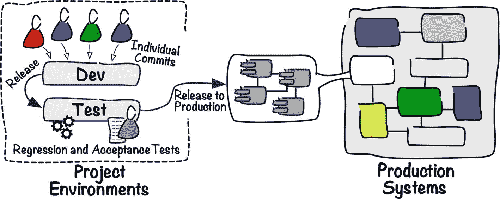

**图 4-1**
项目环境与生产系统

## 资源管理与成本分配

在不同的项目环境和生产系统中使用的云资源，例如计算实例、对象存储桶或虚拟网络，需要单独的 `管理权限`。虽然你可以让一大群开发者来管理各种开发和测试环境所使用的云资源，但你更可能指派一个规模小得多的小组来照看你的生产系统。此外，通常没有必要让从事一个项目的开发者看到其他项目所使用的云资源。

为了强制实施适当的访问级别，你必须能够将选定的云资源分组到某种逻辑组中，并为这些组附加专门的权限策略，这些策略将决定谁可以对特定组内包含的云资源执行何种操作。

选定类型的云资源（如计算实例或负载均衡器）的按量使用会产生财务成本。从财务角度看，几乎所有组织都倾向于 `核算` 由各个项目和生产系统产生的成本。成本划分得越细粒度越好。这样，云费用就可以被恰当地分配给相应的成本中心，并最终以正确的方式入账。同样，你需要以某种方式能够将选定的云资源分组，以计算这些组所产生的费用。


## 容器

Oracle Cloud Infrastructure (OCI) 使用 *容器* 来组织相关的云资源。几乎每一个云资源，例如计算实例、对象存储桶或托管的 Kubernetes 集群，都必须只属于一个容器。你在创建云资源时决定它将存在于哪个容器中。如果你发现需要将资源移动到不同的容器，你将不得不终止旧的资源，并在目标容器中以相同的配置置备一个新的资源，除非该特定云资源类型支持在容器之间移动。容器提供逻辑隔离，这使得治理管理权限策略和跟踪相关资源组产生的成本变得容易得多。这种隔离是纯粹逻辑上的。这意味着在技术上仍然可以让一个容器中的资源（例如计算实例）与另一个容器中的资源（例如其他计算实例和对象存储桶）进行通信。使用容器有三个原因。

*   更轻松的资源管理
*   细粒度的访问控制
*   成本拆分

首先，如果逻辑上组织了相关资源，那么理解你的云租户中有哪些资产以及管理这些资源会更容易。通过这种方式，你能够对查询应用更精确的过滤器，并获得更短、更准确的结果列表。随着你的云资源数量和种类开始增长，这一点会变得更加明显。其次，容器通常成为你访问控制策略语句的主要范围。这些语句存储在称为身份和访问管理 *策略* 的文档中。每个语句都将允许对存在于给定容器中的特定类型云资源进行某种访问。在这个阶段，值得注意的是子容器从其父容器继承访问管理策略。第三，你可以按容器 *过滤成本*，只要你选择为每个项目环境和生产系统使用不同的容器，就能知道每个项目环境和生产系统产生了什么云资源消耗成本。

容器是全局的，每个独立的容器跨越你的云账户订阅的所有区域。在许多情况下，建议将容器安排在分层结构中，该结构最多可包含六级子容器。如果你正在处理一个单一的概念验证项目，或者只是在学习 OCI，你很可能会将所有云资源存储在单个容器中。你可以称它为 `Sandbox` 或任何对你更有意义的名称。一旦你考虑处理多个项目并在你的云租户中运行一组生产系统，你就应该仔细规划容器层次结构。通常你会如何处理这个任务？嗯，很容易发现，最自然的构建容器层次结构的依据是项目环境和生产系统。为什么？简单因为它们通常为资源管理、访问控制和成本跟踪——使用容器的三个主要原因——提供了典型的上下文。这种方法在图 4-2 中进行了说明。

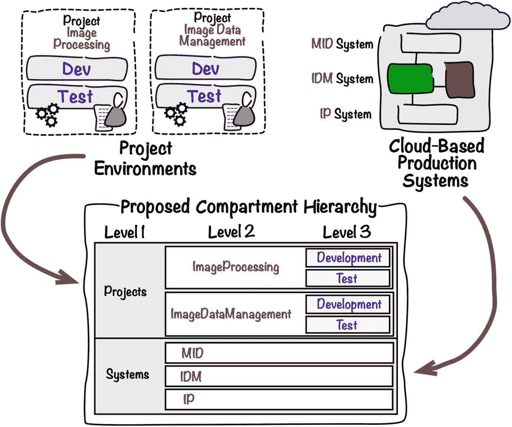

图 4-2 推导容器层次结构

在你的云账户中总是有一个根容器。这也是我们容器层次结构中的根节点。如果我们遵循这个例子，我们将创建两个独立的容器：一个用于项目 (`Projects`)，一个用于生产系统 (`Systems`)。接下来，我们将在 `Systems` 容器内创建三个子容器：`MID`、`IDM` 和 `IP`。这样，逻辑上属于 IDM 生产系统的云资源将位于 `Systems/IDM` 容器中。同样，我们将在 `Projects` 容器内创建两个子容器：`ImageProcessing` 和 `ImageDataMangement`。随后，我们最终会在每个项目特定的容器中为开发和测试环境再创建两个子容器。同样，这将让你将图像处理项目及其开发环境特有的资产保留在 `Projects/ImageProcessing/Development` 容器中。就是这么简单。图 4-3 展示了你在 OCI 控制台容器范围筛选器中会看到的预期容器结构。

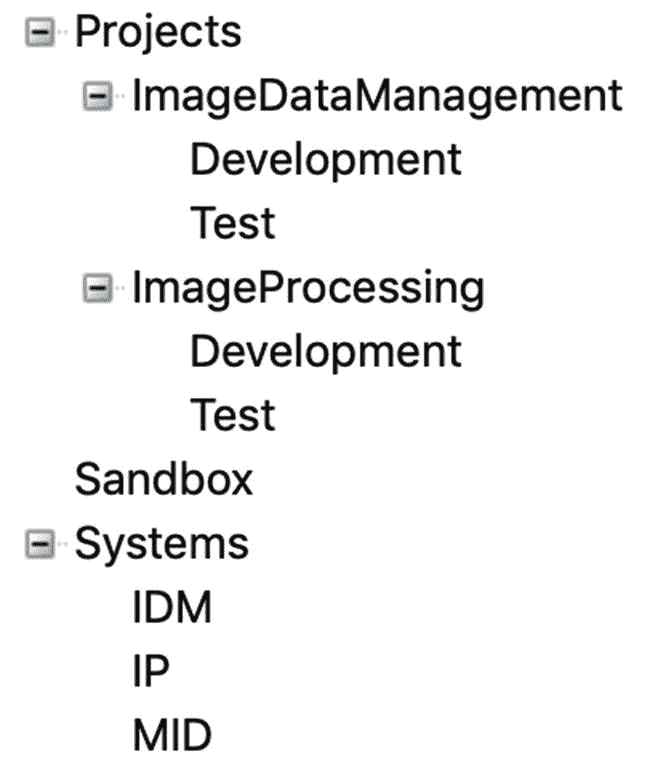

图 4-3 OCI 控制台容器范围筛选器

### 容器管理操作

我们现在将转向实际操作部分，看看有哪些选项可以显示、创建和删除容器。如果你读过第 2 章，你应该已经知道如何使用 OCI 控制台创建容器。这是我们创建 `Sandbox` 容器时的首批任务之一。要在 OCI 控制台中浏览容器，你需要转到 `Menu` ➤ `Identity` ➤ `Compartments`。

你将看到的是你的第 1 级容器列表，如图 4-4 所示。

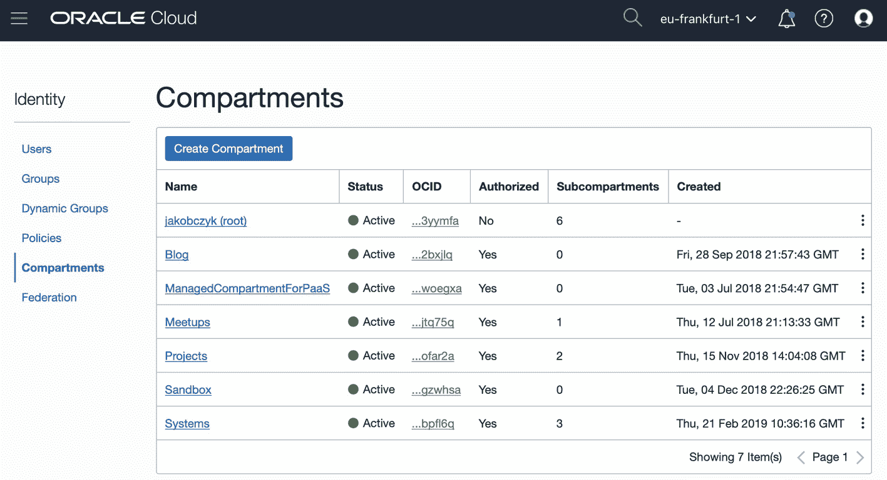

图 4-4 *the* OCI 控制台中的容器列表（第 1 级）

你需要点击特定容器的名称以查看其详细信息以及它包含的子容器的详细列表。在这里，你可以更改容器的名称和描述，检查其 OCID，并管理其子容器。图 4-5 展示了 `Sandbox` 容器的“容器详细信息”视图。

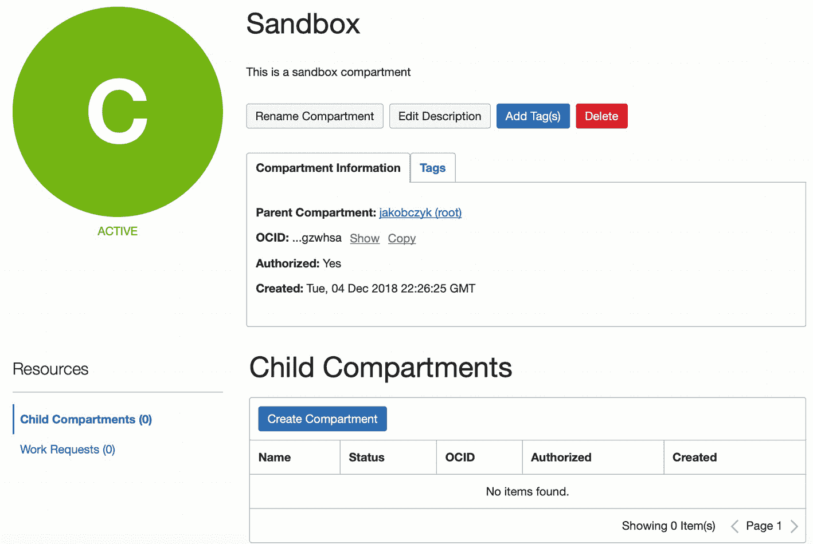

图 4-5 *the* OCI 控制台中的“容器详细信息”视图

要在 OCI 控制台中添加新的子容器，你只需点击 `Create Compartment` 按钮并提供所需的详细信息。

注意

本书中的代码片段已在 macOS 和 Windows Subsystem for Linux 上测试过。此外，所有命令都应在主流 Linux 发行版上运行。如果你使用的是 Windows 且不想使用 Windows Subsystem for Linux，你可以在虚拟机上运行 Linux。此外，大多数代码片段也可能在 Windows 的 Git Bash 中运行。

正如预期的那样，你可以使用 OCI CLI 创建新的容器。如果你已完成第 3 章中描述的所有步骤，你的 CLI 应已配置为默认使用 `Sandbox` 容器。运行此命令以输出在你的 CLI 设置中设置为默认的容器的名称：

```
$ oci iam compartment get --output table --query 'data.{Name:"name"}'
+---------+
| Name    |
+---------+
| Sandbox |
+---------+
```

如果你看到不同的名称，但仍想在 `Sandbox` 容器中创建子容器，你可以调整 `oci_cli_rc` 文件，或者使用 `-c` 参数，该参数接受任何有效的容器 OCID。第二种方式更快，并为你提供更大的灵活性。我在前一章中描述了这两种方法。例如，要在不同容器的上下文中运行相同的命令，你可以执行以下操作：


```
$ oci iam compartment get -c "ocid1.compartment.oc1..aa.........bpfl6q" --output table --query 'data.{Name:"name"}'
+---------+
| Name    |
+---------+
| Systems |
+---------+
```

**提示**

您可以将 `-c` 参数与每个 CLI 命令结合使用，以将该单个命令的上下文设置为您选择的任何分区。

一旦我们确保 CLI 命令在预期分区的上下文中执行，我们就准备好创建一个新的子分区。为此，只需运行此命令，如果需要，不要忘记使用 `-c` 参数：

```
$ EXP_COMPARTMENT_OCID=`oci iam compartment create --name Experiments --description "Sandbox area for experiments" --query "data.id" | tr -d '"'`
```

前面的命令创建了一个名为 `Experiments` 的新分区，作为 `Sandbox` 分区的子分区。在此阶段，您应该能够在 `Sandbox` 分区的子分区列表中看到新创建的分区，如图 4-6 所示。

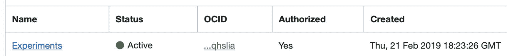

图 4-6

OCI 控制台中的子分区

从现在开始，您可以在此分区内的任何区域和任何可用性域中创建各种云资源。唯一需要记住的是，为操作的上下文选择此分区。在 OCI 控制台中，您可以通过在图 4-7 所示的“列表范围”组合框中选择分区名称来完成此操作。

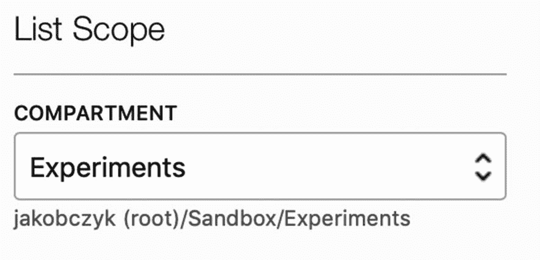

图 4-7

在 OCI 控制台中选择分区

与所有其他 Oracle Cloud Infrastructure 资源一样，分区通过 OCID 唯一标识。您可以在第 2 章中阅读有关它们的更多信息。您可以随时轻松更改分区的名称和描述，但其 OCID 保持不变。

**提示**

如果您在分区名称中出现了拼写错误，请不要删除它，只需重命名即可。

可以删除不需要的分区。您可以在控制台或使用 CLI 执行此操作。此操作是异步的，通常需要一些时间。在此之前，您仍然必须终止并删除要删除的分区内所有资源和子分区；否则，系统不允许您这样做。这是启动分区删除的命令：

```
$ oci iam compartment delete -c "$EXP_COMPARTMENT_OCID"
Are you sure you want to delete this resource? [y/N]: y
{
"opc-work-request-id": "ocid1.identityworkrequest.oc1..aa.........rejw7a"
}
```

输出表明了此操作的异步性质。此外，如果您查看 `Sandbox` 分区的子分区列表，您可能会看到 `Experiments` 子分区仍在删除中，如图 4-8 所示。

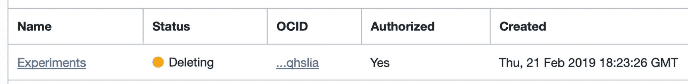

图 4-8

删除分区

最后但同样重要的是，分区数量有服务限制。在撰写本文时，每个租户设置为 50 个。如果您发现需要更多，您可以随时请求提高服务限制。要在 OCI 控制台中执行此操作，您需要遵循以下步骤：

1.  转到菜单 ➤ 治理 ➤ 限制、配额和使用情况。
2.  单击“请求提高服务限制”。
3.  填写表格并单击“提交请求”。

在本节前面，我提到使用分区的主要动机之一是能够分析单个生产系统、项目甚至环境的成本。在 OCI 控制台中，您可以执行以下操作：

1.  转到菜单 ➤ 账户管理 ➤ 成本分析。
2.  在筛选器中选择一个分区。
3.  选择所需的时间段。
4.  单击“应用筛选器”。

图 4-9 展示了自日历年开始以来 `Sandbox` 分区产生的成本，以波兰兹罗提（PLN）计价，这是我所在国家的本地货币。

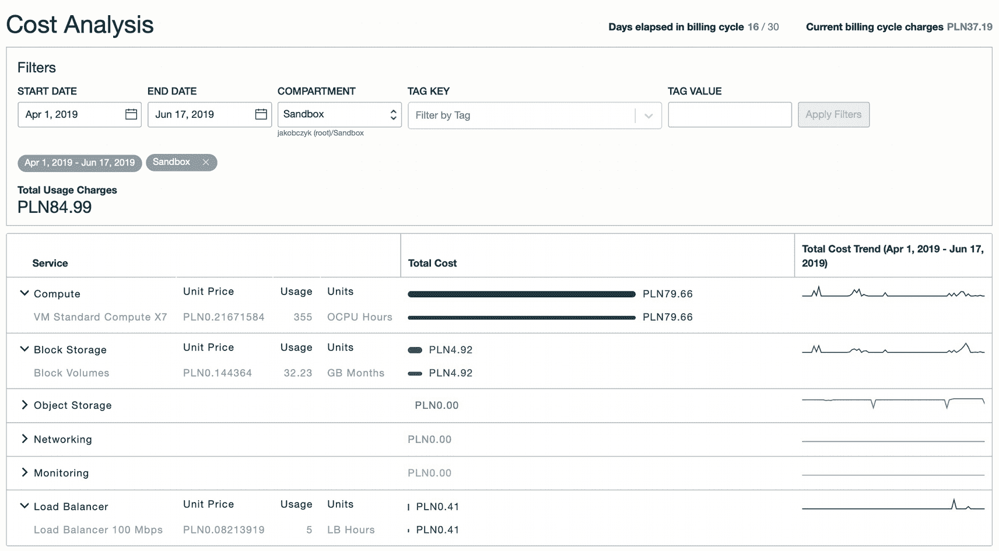

图 4-9

在 OCI 控制台中查看每个分区的成本

我们现在已准备好转向另一个重要主题，即用户管理。
```

## 用户

在 Oracle Cloud Infrastructure 中执行的每个操作总是由一个命名用户完成。正如你在第 3 章中所了解的，每个 API 调用都需要一个用户的 OCID 才能对请求进行签名。无论你是使用控制台、API、SDK、CLI 还是 Terraform，你始终需要一个用户账户。Oracle Cloud Infrastructure 支持两种类型的用户账户。

*   本地用户

*   联合用户

当你订阅一个新的云账户时，在 Oracle Identity Cloud Service (IDCS) 中会为该云账户创建一个**默认的管理员用户**。注册时使用的电子邮件地址将成为这个全局管理员用户的用户名。这是一个联合用户账户。事实上，所有租户默认都与 IDCS 联合，但你可以自由切换到任何其他符合 SAML 标准的身份提供商，或者创建属于 OCI 本地的非联合用户。如果你不确定自己是否理解，别担心。让我来解释一下。当你想要登录到 OCI 控制台时，会看到一个分为两部分的登录屏幕，如图 4-10 所示。左侧部分是为联合用户准备的。这将带你进入由你的身份提供商提供的单点登录 (SSO) 登录屏幕。相反，你将使用右侧的部分以本地非联合用户身份登录。

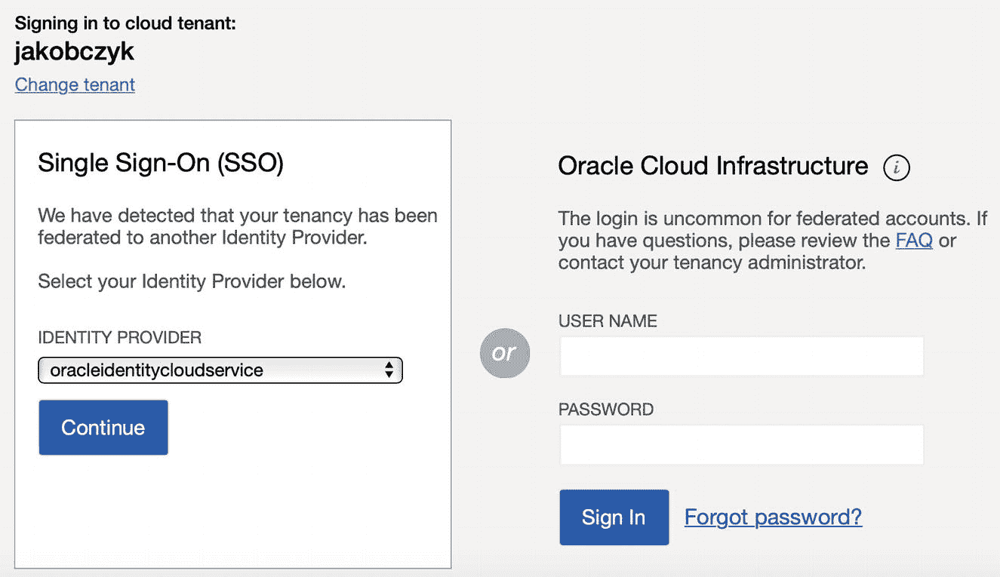
*图 4-10*
*OCI 控制台中的登录屏幕*

到目前为止，在本书中，我一直假设你使用的是默认管理员用户。现在情况将发生变化，因为我们即将创建并切换到一个权限较低的 compartment 管理员用户。为了演示访问策略的实际应用，我们将创建第二个几乎没有访问权限的本地用户。在本书的过程中，我们将根据各种练习中使用的资源，逐步授予这个第二个本地用户越来越多的访问权限。

### 注意

如果你不是租户所有者，你的管理员可能已经给了你一个用户。然而，你的用户仍然有可能被添加到 IDCS 中租户的 `Administrators` 组中。如果情况并非如此，并且你想完成本书中的练习，你需要请求你的租户管理员将你的用户放入一个对选定 compartment 拥有完全控制的 OCI 组中。在这种情况下，你将需要使用这个特定的 compartment。

首先，我们将创建一个新的、本地的、非联合用户，他将成为 `Sandbox` 管理员。此操作通常在 OCI 控制台中执行或使用 CLI 执行。以下是应用第一种方法的方式：

1.  转到菜单 ➤ 标识 ➤ 用户。
2.  点击创建用户。
3.  提供 **sandbox-admin** 作为名称，添加一些描述，然后点击创建。

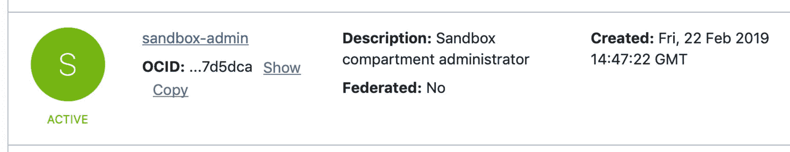
*图 4-11*
*OCI 控制台中的非联合用户*

如图 4-11 所示，新用户将在 OCI 控制台中显示。这将是 `Sandbox` compartment 的本地管理员。现在，我们将使用 CLI 创建另一个本地用户 `sandbox-user`。我们将要使用的命令需要租户 OCID 作为参数之一。你应该能够找到这个值在你的 CLI 配置文件中，该文件很可能位于路径 `~/.oci/config`，除非你为 CLI 配置文件使用了自定义路径。或者，你也可以在 OCI 控制台中的菜单 ➤ 管理 ➤ 租户详细信息下找到它。我们现在准备执行以下 CLI 命令：

```
$ TENANCY_OCID=`cat ~/.oci/config | grep tenancy | sed 's/tenancy=//'`
$ oci iam user create --name sandbox-user --description "Sandbox user" --query "data.id" -c $TENANCY_OCID
"ocid1.user.oc1..aa............dzqpxa
```

首先，我们将租户 OCID 赋值给一个 bash 变量，以简化后续 CLI 命令的语法。最后，我们使用了一个 `iam user create` 命令，该命令利用 JMESPath 查询来输出新分配的用户 OCID。

让我借此机会向你展示如何构建一些更高级的 JMESPath 查询。我们将列出所有名称以 `sandbox` 开头的 OCI 用户的姓名。我们期望看到刚刚创建的两个用户的姓名列表。同样，我们必须将租户 OCID 作为一个参数传递。

```
$ oci iam user list -c $TENANCY_OCID --query "data [?starts_with(name,'sandbox')].name" --all
[
"sandbox-admin",
"sandbox-user"
]
```

此时，两个新的非联合本地用户已准备就绪。我们仍然必须为他们生成一次性密码；否则，他们俩都无法以这些用户身份登录到 OCI 控制台。以下是为 `sandbox-user` 用户执行此操作的方法：

```
$ USER_OCID=ocid1.user.oc1..aa.........dzqpxa
$ oci iam user ui-password create-or-reset --user-id $USER_OCID --query "data.password"
"&gDX9F)iAP_2E16XD)r"
```

现在，你可以打开另一个浏览器并尝试以非联合用户身份登录，如图 4-12 所示。由于这是密码重置后的首次登录尝试，系统将提示你提供一个新密码。

![../images/478313_1_En_4_Chapter/478313_1_En_4_Fig12_HTML.jpg*图 4-12**以非联合用户身份登录*乍一看，OCI 控制台看起来是一样的。为确保你已作为新用户之一访问了它，请单击右上角的圆形剪影图标以展开活动用户菜单，如图 4-13 所示。你应该在那里看到用户名，在我们的例子中是 `sandbox-user`。单击名称或用户设置以打开用户配置文件。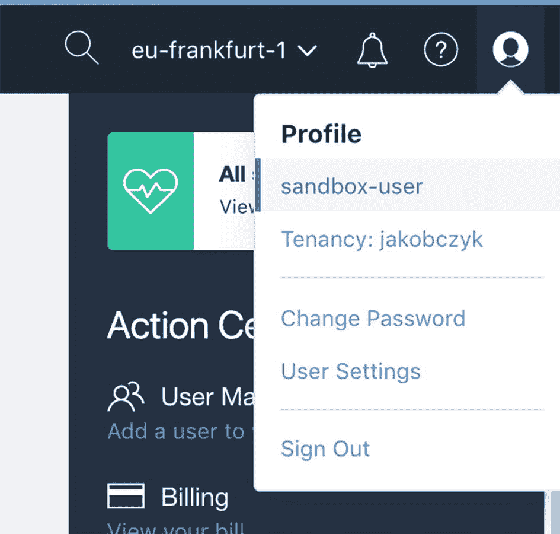
*图 4-13*
*OCI 控制台中的活动用户菜单*

Oracle Cloud Infrastructure IAM 默认禁止新创建的用户访问任何云资源。作为一个未分配到任何组的新创建用户，你唯一能做的就是基本的更改用户设置，例如密码更改或 API 密钥上传。如果你尝试在各种 compartment 中列出任何类型的云资源或列出现有用户，你将看不到任何内容，如图 4-14 所示。

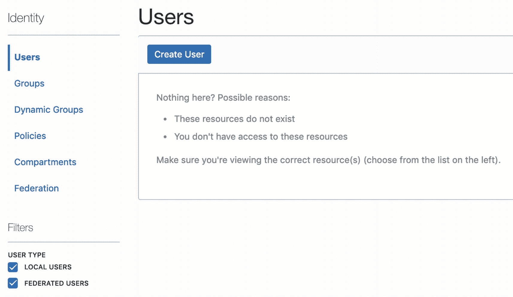
*图 4-14*
*OCI 控制台中访问权限不足*

### 注意

在继续之前，请为 `sandbox-admin` 用户创建一个密码并首次登录以重置它，以便你能够登录到 OCI 控制台。这正是你刚刚为 `sandbox-user` 用户所做的。你不需要再次使用 CLI。也可以在给定用户的 OCI 控制台用户详细信息视图中重置用户密码。

我们将让两个新用户进行远程 API 调用。你将需要生成两个 API 签名密钥对，一个用于这两个新的本地用户，并将它们的公钥上传到其账户下。你可以在第 3 章中找到有关 API 签名密钥的更多信息。这是一个快速指南：


## 组与策略

```
$ cd ~/.apikeys
$ openssl genrsa -out api.sandbox-user.pem -aes128 2048
Generating RSA private key, 2048 bit long modulus
.........+++
..+++
e is 65537 (0x10001)
Enter pass phrase for api.sandbox-user.pem:
Verifying - Enter pass phrase for api.sandbox-user.pem:
$ chmod go-r api.sandbox-user.pem
$ openssl rsa -pubout -in api.sandbox-user.pem -out api.sandbox-user.pem.pub
Enter pass phrase for api.sandbox-user.pem:
writing RSA key
$ openssl genrsa -out api.sandbox-admin.pem -aes128 2048
Generating RSA private key, 2048 bit long modulus
.................................+++
.........................................+++
e is 65537 (0x10001)
Enter pass phrase for api.sandbox-admin.pem:
Verifying - Enter pass phrase for api.sandbox-admin.pem:
$ chmod go-r api.sandbox-admin.pem
$ openssl rsa -pubout -in api.sandbox-admin.pem -out api.sandbox-admin.pem.pub
Enter pass phrase for api.sandbox-admin.pem:
writing RSA key
$ ls -l | awk '{print $1, $9}'
total
-rw------- api.sandbox-admin.pem
-rw-r--r-- api.sandbox-admin.pem.pub
-rw------- api.sandbox-user.pem
-rw-r--r-- api.sandbox-user.pem.pub
```

现在，你可以将公钥（`.pub`后缀）上传到相应的用户账户了。我们将使用 CLI，但如果你愿意，也可以在 OCI 控制台中操作。首先，确保 `TENANCY_OCID` bash 变量仍设置为租户 OCID。

```
$ echo $TENANCY_OCID
ocid1.tenancy.oc1..aa.........
```

要上传公钥，你需要知道用户的 OCID。你可以在 OCI 控制台中查看，或像这样使用 CLI 进行查询：

```
$ SANDBOX_ADMIN_OCID=`oci iam user list -c $TENANCY_OCID --query "data[?name=='sandbox-admin'] | [0].id" --all --raw-output`
ocid1.user.oc1..aa.........7d5dca
```

现在，让我们为 `sandbox-admin` 用户上传公钥。

```
$ oci iam user api-key upload --user-id $SANDBOX_ADMIN_OCID --key-file ~/.apikeys/api.sandbox-admin.pem.pub --query "data.fingerprint"
"91:64:1b:4e:4e:35:4a:06:b2:8f:6f:53:ae:7d:0d:ee"
```

通常，你在本机配置 CLI 时只代表单个用户发送 API 请求。因此，你只会使用 `~/.oci/config` 文件中的默认配置文件。清单 4-1 展示了完成第 3 章的练习后，该文件当前的结构。

```
[DEFAULT]
tenancy=...
region=...
user=...
fingerprint=...
key_file=...
pass_phrase=...
```
清单 4-1
OCI CLI 配置文件

目前只有一个配置文件，即默认配置文件。每个 OCI CLI 命令都使用默认配置文件中的详细信息来签名请求并进行 API 调用。如果你遵循了第 3 章的练习，默认配置文件对应的是租户管理员超级用户。

幸运的是，我们可以创建更多的配置文件。这样，你就可以在一台机器上代表不同的 OCI 用户执行不同的 CLI 命令。用你选择的文本编辑器打开配置文件。

```
$ vi ~/.oci/config
```

在默认配置文件下，添加一个名为 `SANDBOX-ADMIN` 的新配置文件，并为 `sandbox-admin` 用户提供用户详细信息，这些信息你可以在本节中找到。新增部分在清单 4-2 中以粗体显示。

```
[DEFAULT]
tenancy=...
region=...
user=...
fingerprint=...
key_file=...
pass_phrase=...
[SANDBOX-ADMIN]
user=ocid1.user.oc1..aaaaaaaa3n5.........7d5dca
fingerprint=91:64:1b:4e:4e:35:4a:06:b2:8f:6f:53:ae:7d:0d:ee
key_file=~/apikeys/api.sandbox-admin.pem
pass_phrase=put-here-sandbox-admin-private-key-password
```
清单 4-2
包含多个配置文件的 OCI CLI 配置文件

从现在开始，每次你在 CLI 命令中添加 `--profile SANDBOX-ADMIN`，CLI 就会使用 `SANDBOX-ADMIN` 配置文件中的四个参数（`user`, `fingerprint`, `key_file`, 和 `pass_phrase`）以及 `DEFAULT` 配置文件中剩余的两个参数（`tenancy` 和 `region`）。

如果你尝试执行其中一个命令，但这次通过使用 `SANDBOX-ADMIN` 配置文件以 `sandbox-admin` 用户身份执行，你会遇到一个错误。

```
$ oci iam user list -c $TENANCY_OCID --query "data [?starts_with(name,'sandbox')].name" --all --profile SANDBOX-ADMIN
ServiceError:
{
"code": "NotAuthorizedOrNotFound",
"message": "Authorization failed or requested resource not found",
"opc-request-id": "DE........./411.........E1F/B6A.........A8B",
"status": 404
}
```

原因显而易见。默认情况下，Oracle Cloud Infrastructure 拒绝任何对云资源的访问。`sandbox-admin` 用户不属于任何组；因此，没有访问策略会授予该用户任何访问权限。是时候讨论策略的工作原理了。

**注意**
如果你仍以 `sandbox-user` 或 `sandbox-admin` 用户身份登录到 OCI 控制台，请注销并以租户超级用户身份重新登录。或者，你可以使用不同的浏览器。

还有一点重要提示：在继续阅读之前，请为 `sandbox-user` 用户上传公钥作为新的 API 密钥。你已经学会了如何操作。请立即完成。我们将在后续章节中需要它。

## 组与策略

对各种类型云资源的访问权限是授予**组**的，而不是单个用户。我们将只关注本地组，但你可能会受益于知道，你也可以将身份提供程序组映射到本地组。策略语句定义了允许谁在何种范围内进行何种访问。我们稍后将仔细研究策略语句。首先，我们来讨论组。


### 用户组

用户组本质上是一个用户的集合。一个用户可以属于多个用户组。可以动态地向用户组中添加或移除用户。创建用户组的方式与创建用户类似，通常使用控制台或 CLI。现在，是时候为 `sandbox-admin` 用户创建一个新组了。

1.  转到菜单 ➤ 身份 💻 用户组。
2.  点击“创建组”。
3.  提供 `sandbox-admins` 作为组名称和描述，然后点击“创建”。

图 4-15 展示了您云租户中的用户组。`Administrators` 组是每个云账户中都存在的默认组。在任何时间点，Oracle Cloud Infrastructure 都强制要求此组中必须至少有一名用户；否则，您可能会意外地被锁定在账户之外。

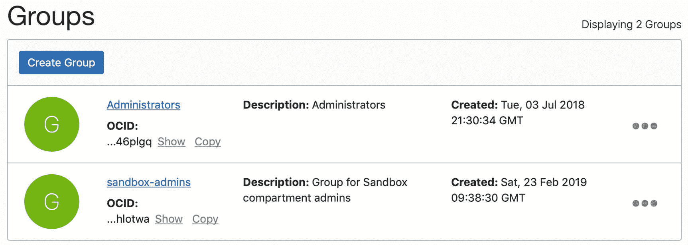
图 4-15
`OCI 控制台`中的用户组

您可能还记得我提到过，Oracle Cloud Infrastructure 中的云资源不是通过名称，而是通过 OCID 来唯一标识的。这对用户组同样适用，但有一个小小的例外。虽然通常从技术上讲，可以使用相同名称预置多个同类型的云资源，但对于用户组和用户，您无法这样做。存在一个额外的约束，即不允许任何用户组或用户的名称重复。

我们将创建另一个组，这次是为 `Sandbox` 隔区（如 `sandbox-user`）中的常规用户创建。这次，为了有所变化，我们将使用 CLI。请记得在运行此命令之前，确保 `TENANCY_OCID` bash 变量值仍设置为您的租户的 OCID：

```bash
$ oci iam group create --name sandbox-users --description "Group for the regular users of the Sandbox compartment" --query "data.id" -c $TENANCY_OCID
"ocid1.group.oc1..aa.........rj2sba"
```

运行此 CLI 命令以列出名称以 `sandbox` 开头的用户组。我们将把输出格式化为表格。

```bash
$ oci iam group list -c $TENANCY_OCID --all --query "data[?starts_with(name,'sandbox')].{Name:name,OCID:id}" --output table
+----------------+------------------------------------+
| 名称           | OCID                               |
+----------------+------------------------------------+
| sandbox-admins | ocid1.group.oc1..aa.........hlotwa |
| sandbox-users  | ocid1.group.oc1..aa.........rj2sba |
+----------------+------------------------------------+
```

这两个新组目前还是空的。在 `OCI 控制台`中，可以通过两种方式向用户组添加或移除用户。第一种选择是使用用户组详情视图，就像这样：

1.  转到菜单 ➤ 身份 💻 用户组。
2.  点击您想要添加用户的用户组的名称。
3.  在“组成员”选项卡上，点击“将用户添加到组”。
4.  选择您想要添加到该组的用户。

或者，您也可以从用户详情屏幕执行相同的操作。

1.  转到菜单 ➤ 身份 💻 用户。
2.  点击您想要添加到某个组的用户的名称。
3.  在“组”选项卡上，点击“将用户添加到组”。
4.  选择您想要将该用户添加到的组。

最后，非常欢迎您使用 CLI 来完成此任务。`iam group add-user` 命令需要用户 OCID 和用户组 OCID，因此请在 `OCI 控制台`中查找它们，或者运行以下两个查询：

```bash
$ USER_OCID=`oci iam user list -c $TENANCY_OCID --query "data[?name=='sandbox-admin'] | [0].id" --all --raw-output`
$ GROUP_OCID=`oci iam group list -c $TENANCY_OCID --query "data[?name=='sandbox-admins'] | [0].id" --all --raw-output`
```

要向组中添加用户，请使用 `oci iam group add-user` CLI 命令。

```bash
$ oci iam group add-user --user-id $USER_OCID --group-id $GROUP_OCID
```

`sandbox-admin` 用户会立即被添加到 `sandbox-admins` 组。您可以在 `OCI 控制台`的用户组详情视图中进行验证，如图 4-16 所示。

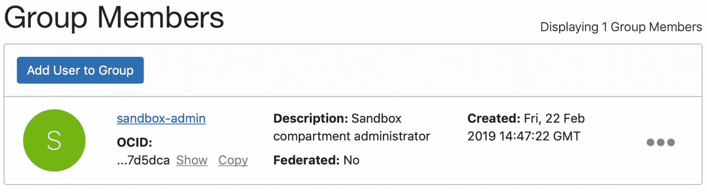
图 4-16
`OCI 控制台`中的组成员

此外，可以使用 CLI 命令 `iam group list-users` 来获取特定用户组的组成员列表。为此，请使用以下命令：

```bash
$ oci iam group list-users --group-id $GROUP_OCID --query "data[*].name" -c $TENANCY_OCID --all
[
  "sandbox-admin"
]
```

现在，在继续阅读之前，请将 `sandbox-user` 用户添加到 `sandbox-users` 组中。我们将在后面的章节中用到它。在此阶段，您应该已将两个用户添加到他们各自的组中。每个用户都应该已经拥有其唯一的密钥对，并且公钥已上传。预期的设置概念上如图 4-17 所示。

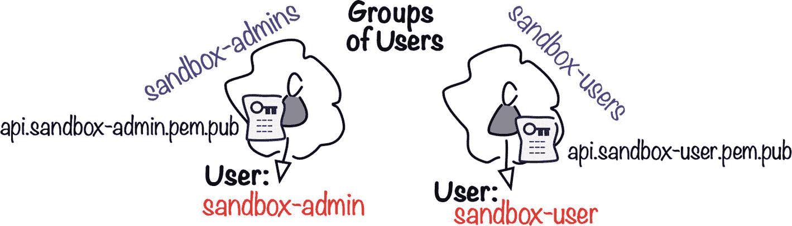
图 4-17
第 4 章的用户和组

下一步，请像在上一节中为 `sandbox-admin` 用户所做的那样，为 `sandbox-user` 用户在 `~/.oci/config` 文件中添加一个新的配置文件。清单 4-3 展示了您的 `~/.oci/config` 文件的预期结构。

```ini
[DEFAULT]
tenancy=...
region=...
user=...
fingerprint=...
key_file=...
pass_phrase=...

[SANDBOX-ADMIN]
user=ocid1.user.oc1..aaaaaaaa3n5.........7d5dca
fingerprint=91:64:1b:4e:4e:35:4a:06:b2:8f:6f:53:ae:7d:0d:ee
key_file=~/apikeys/api.sandbox-admin.pem
pass_phrase=put-here-sandbox-admin-private-key-password

[SANDBOX-USER]
user=ocid1.user.oc1..aaaaaaaatimmpj37ao............cdzqpxa
fingerprint= 61:68:a5:1c:40:ef:51:fd:1a:74:6b:d9:9f:1c:b2:b8
key_file=~/apikeys/api.sandbox-user.pem
pass_phrase=put-here-sandbox-user-private-key-password
```
清单 4-3
第 4 章的 OCI CLI 配置文件

最后但同样重要的是，我们将在 `~/.oci/oci_cli_rc` 文件中创建两个配置文件，为每个 CLI 查询设置默认隔区。请将清单 4-4 中的 OCID 替换为您的 `Sandbox` 隔区的 OCID。如果您不记得那是什么类型的文件，您将在第 3 章中找到更多信息。

```ini
[DEFAULT]
compartment-id = ocid1.compartment.oc1..aa.........gzwhsa

[SANDBOX-ADMIN]
compartment-id = ocid1.compartment.oc1..aa.........gzwhsa

[SANDBOX-USER]
compartment-id = ocid1.compartment.oc1..aa.........gzwhsa
```
清单 4-4
第 4 章的 OCI CLI RC 文件

都准备好了吗？让我们来探索一下如何组织对云资源的访问控制。


### 策略语句

权限管理是如何工作的？您使用 `策略语句` 来定义哪个 `组` 有权对特定的云资源类型执行特定操作。每个 `策略语句` 都指向一个特定的 ` compartment `（ compartment ）或整个 ` tenancy `（ tenancy ）。图 4-18 展示了一个简单的 `策略语句`，它授予 `groupABC` 的成员对属于 `instance-family` 聚合资源类型的选定云资源类型的只读访问权限（`read` 策略动词）。聚合资源类型是真实云资源类型（如计算实例或实例映像）的逻辑分组。此示例 `策略语句` 仅引用存在于 `projectABC` ` compartment ` 中的云资源。

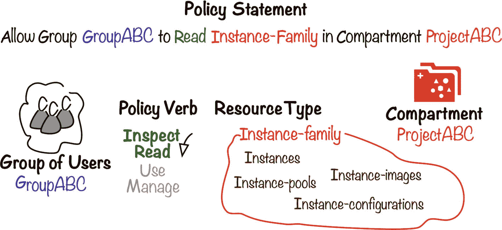
*图 4-18：IAM 策略语句*

虽然理解用户 `组` 和 ` compartment ` 在 `策略语句` 中所扮演的角色应该相当清楚，但您可能仍需要对 `策略动词` 和 `资源类型` 进行一些额外解释。

## 理解资源类型

您可以在云账户中配置多种类型的云基础设施资源。计算实例和对象存储桶是云资源的例子。一些云 `资源类型` 彼此之间比其他类型更相关。实例映像用于配置计算实例。实例可以在池中管理。要启动实例池，需要一个实例配置。正如您所看到的，我举的这四个资源类型例子之间存在一定程度的相互依赖关系。从访问控制的角度来看，您通常会为属于一个相关 `资源类型` 家族的所有 `资源类型` 授予相同的访问权限。因此，Oracle Cloud Infrastructure 定义了所谓的聚合云资源，例如 `instance-family` 或 `virtual-network-family`，它们是现有云 `资源类型` 的逻辑分组。

> **提示：** 在您的 `策略语句` 中列出所有可用 `资源类型` 没有多大意义，因为该列表在不断增长。请参阅官方文档中的策略参考。

## 理解策略动词

`策略动词` 定义了对云资源的访问级别。有四个可用级别：`inspect`、`read`、`use` 和 `manage`。`inspect` 访问是基础级别的，通常只允许 `组` 成员列出资源。`read` 访问包含与 `inspect` 访问相同的范围，但增加了读取云资源详细信息的能力。`use` 访问通常允许 `组` 成员执行 `read` 访问范围内的所有操作，以及启动、停止和更新现有云资源。最后，`manage` 访问授予该云资源类型的所有权限。关于 `策略动词` 的关键是，它们的精确含义是高度依赖于上下文的，并且取决于它们在 `策略语句` 中所前缀的 `资源类型`。

让我用一个例子来解释。表 4-1 展示了在 `load-balancers` `资源类型` 的情况下，`策略动词` 如何映射到各个权限。每个权限实际上都允许 `组` 成员调用特定的 API 集合。

*表 4-1：load-balancers 资源类型的策略动词*

| 动词 | 权限 | 覆盖的 API |
| --- | --- | --- |
| `inspect` | LOAD_BALANCER_INSPECT | `ListLoadBalancers` `ListShapes` `ListPolicies` `ListProtocols` |
| `read` | `inspect` 权限 + LOAD_BALANCER_READ | `inspect` API + `GetLoadBalancer` 等 |
| `use` | `read` 权限 + LOAD_BALANCER_UPDATE | `read` API + `UpdateLoadBalancer` `CreateBackendSet` `DeleteBackendSet` `UpdateBackendSet` 等 |
| `manage` | `use` 权限 + LOAD_BALANCER_CREATE LOAD_BALANCER_DELETE | `use` API + `CreateLoadBalancer` `DeleteLoadBalancer` |

如表 4-1 所示，在 `load-balancers` `资源类型` 的情况下，`inspect` `策略动词` 仅映射到一个 `LOAD_BALANCER_INSPECT` 权限，该权限本质上授予对四个 API 的访问权限：`ListLoadBalancers`、`ListShapes`、`ListPolicies` 和 `ListProtocols`。这四个 API 提供了对给定 ` compartment ` 范围内的可用负载均衡器策略、规格、协议和负载均衡器的一些基本洞察。通常，API 名称是自解释的，但如果您想确定这些 API 真正允许您对云资源执行何种操作，您随时可以阅读 API 参考。

如果您再次查看该表，您会发现负载均衡器只能由 `组` 成员创建或删除，前提是他们的 `组` 被授予了针对 `load-balancers` `资源类型` 的 `manage` `策略动词`。这并不令人惊讶。更有趣的是，当存在带有 `use` `策略动词` 的 `策略语句` 时，就可以创建或删除后端集。我们应该如何理解这一点？嗯，后端集只能存在于负载均衡器的上下文中，作为其子资源。通过这种方式，您可以将后端集的创建委托给负载均衡器的用户，就像您允许他们更新现有负载均衡器一样。然而，父资源（即负载均衡器）的创建或终止仅限于管理员。

> **提示：** `策略动词` 高度依赖于上下文，其确切含义取决于它们在 `策略语句` 中所前缀的 `资源类型`。您需要查阅文档以了解更多：[`https://docs.cloud.oracle.com/iaas/Content/Identity/Reference/policyreference.htm`](https://docs.cloud.oracle.com/iaas/Content/Identity/Reference/policyreference.htm)。

## IAM 策略语句示例

让我们讨论几个 IAM `策略语句` 的例子。在开始为我们新的 IAM `组` 创建语句之前，我希望您能先有个总体的了解。

如果您打算将某个 ` compartment ` 的所有权限授予该 ` compartment ` 的管理员 `组`，您只需使用一条 `IAM 策略语句` 即可完成。

```
allow group sandbox-admins to manage all-resources in compartment Sandbox
```

让我们看另一个例子。要允许 `sandbox-users` `组` 的成员在 `Sandbox` ` compartment ` 中执行所有与负载均衡器相关的操作，您只需创建以下策略：

```
allow group sandbox-users to manage load-balancers in compartment Sandbox
```

## 在策略语句中使用条件

如果您想明确拒绝属于您正在使用的 `策略动词` 的某些选定权限，该怎么办？例如，在 `load-balancers` `资源类型` 的上下文中，`manage` `策略动词` 将允许您执行所有操作，包括负载均衡器的创建和删除。如果您想排除 `LOAD_BALANCER_DELETE` 权限，可以使用 `策略语句条件`。

```
allow group sandbox-users to manage load-balancers in compartment Sandbox where request.permission != 'LOAD_BALANCER_DELETE'
```

`策略语句条件` 可以为权限（例如 `request.permission != 'LOAD_BALANCER_DELETE'`）以及单个 API 操作（例如 `request.operation != 'DeleteLoadBalancer'`）定义。通过这种方式，可以调整 `策略语句`，并根据需要使其尽可能精细。

有时，您甚至可以构建引用多个权限或操作的更复杂条件。我现在将给出更多例子。这个 `策略语句` 允许 `组` 成员列出负载均衡器（`ListLoadBalancers` 操作），尽管 `策略动词` `inspect` 通常允许更多操作，例如列出可用规格（`ListShapes` 操作）或协议（`ListProtocols` 操作）。

```
allow group sandbox-admins to inspect load-balancers in compartment Sandbox where all { request.operation != 'ListShapes', request.operation != 'ListProtocols', request.operation != 'ListProtocols' }
```


`where all` 子句用于确保所有条件都得到满足。当你想要显式地拒绝多个权限或操作时，会采用这种方法。如果你想显式地允许多个权限或操作，可以使用 `where any` 子句。在下一个示例中，策略语句仅允许组成员执行三个操作（`ListShapes`、`ListPolicies` 和 `ListProtocols`），尽管策略动词 `inspect` 通常允许的操作不止一个。

```
allow group sandbox-admins to inspect load-balancers in compartment Sandbox where any { request.operation = 'ListShapes', request.operation = 'ListPolicies', request.operation = 'ListProtocols' }
```

结果，属于 `load-balancers` 资源类型的 `inspect` 策略动词的第四个剩余操作（`ListLoadBalancers`）将被拒绝。

在本节中，我们一直在讨论单个的策略语句。然而，我还没有提到它们在 Oracle Cloud Infrastructure 中实际是如何创建的。我们现在就来做这件事。

### 策略

单个的策略语句不能独立存在，而必须包含在所谓的策略中。一个 `策略` 是一种云资源，由一个或多个语句组成，这些语句决定了用户组在特定 compartment 或整个租户中对特定类别的云资源拥有的访问权限。单个的策略语句不能存在于策略之外；因此，你将始终处理包含在策略中的策略语句。在此阶段，我们需要强调一个重要的概念。用户和组确实存在于整个租户的范围内。我们可以说它们是全局的。另一方面，策略是在 compartment 中创建的，就像大多数常规云资源（例如计算实例或虚拟网络）一样。在撰写本文时，新的云账户默认附带两个策略。要使用 OCI Console 查看它们，请执行以下步骤：

1.  转到菜单 ➤ 身份 ➤ 策略。
2.  确保选择了 `root` compartment。

图 4-19 显示了两个默认策略。查看这两个策略的创建时间，你甚至可以猜测我的云租户大约是在什么时候实际创建的。

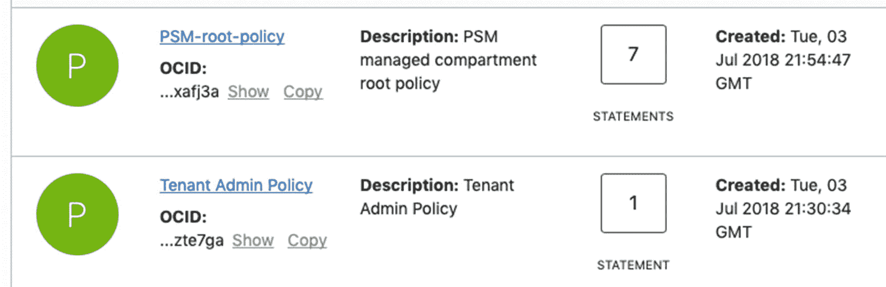

图 4-19

OCI 控制台中的默认策略

如果你更喜欢使用 CLI，以下是列出 `root` compartment 中现有策略的查询：

```
$ oci iam policy list -c $TENANCY_OCID --all --query 'data[*].{Name:name,Statements:length(statements)}' --output table
+---------------------+----------------+
| 名称                | 策略语句数量     |
+---------------------+----------------+
| PSM-root-policy     | 7              |
| Tenant Admin Policy | 1              |
+---------------------+----------------+
```

如你所见，我在 CLI 命令中使用租户 OCID 来指向 `root` compartment（`-c $TENANCY_OCID`）。你的租户根 compartment 的 OCID 与你的租户 OCID 相同。

`Tenant Admin Policy` 只包含一条但很重要的语句。

```
$ oci iam policy list -c $TENANCY_OCID --all --query "data[?name=='Tenant Admin Policy'].statements[0]"
[
"ALLOW GROUP Administrators to manage all-resources IN TENANCY"
]
```

该策略的作用是让默认组 `Administrators` 的成员管理你租户中的所有云资源。此策略受到保护，你既不能删除它，也无法添加任何其他语句。

在你的根 compartment 中可见的第二个默认策略，即 `PSM-root-policy` 策略，允许各种 Oracle Cloud Platform 服务在 Oracle Cloud Infrastructure 上进行配置。本文档不对此进行讨论。

本章前面，我们创建了一个名为 `sandbox-admin` 的新用户，并将他添加到新创建的 `sandbox-admins` 组中。我们还为这个用户在 `~/.oci/config` 文件中添加了一个专用的配置文件。如果我们尝试代表此用户执行任何 CLI 命令，命令将因 `NotAuthorizedOrNotFound` 服务错误而失败，因为目前没有任何策略语句允许 `sandbox-admins` 组的成员与 API 交互。我们已准备好通过向根 compartment 添加一个新策略来改变这一点。该策略将仅包含一条语句，允许 `sandbox-admins` 组的成员在 `Sandbox` compartment 中对所有资源执行各种操作。以下是使用 CLI 执行此操作的方法：

```
$ oci iam policy create -c $TENANCY_OCID --name sandbox-admins-policy --description "Sandbox compartment 管理员组的策略"  --statements '["allow group sandbox-admins to manage all-resources in compartment Sandbox"]'
```


## OCI 策略管理与审计

该命令创建了一个名为 `sandbox-admins-policy` 的新策略云资源。尽管该策略是在根 compartment 中创建的，但其声明的作用域指向了 `Sandbox` compartment。此 IAM 策略包含一条声明。

```
allow group sandbox-admins to manage all-resources in compartment Sandbox
```

这条声明功能强大，因为它允许 `sandbox-admins` 组的成员对 `Sandbox` compartment 中的云资源执行所有类型的操作，包括创建策略声明，以授权其他组在 `Sandbox` 及其子 compartment 中执行操作。

**注意**

在继续之前，请确保您已按照本章“组”部分末尾的描述，将两个配置文件（`SANDBOX-ADMIN` 和 `SANDBOX-USER`）添加到 `~/.oci/config` 和 `~/.oci/oci_cli_rc` 文件中！

让我们尝试一下 `sandbox-admin` 用户是否能够访问某些 API。不要忘记应用正确的 `--profile` 开关，以便请求以 `sandbox-admin` 用户身份签名。

```
$ oci lb shape list --profile SANDBOX-ADMIN --query 'data[*].name'
[
  "100Mbps",
  "400Mbps",
  "8000Mbps"
]
```

一切正常。我们能够列出可用的负载均衡器形状。如果您使用 `SANDBOX-USER` 配置文件重复相同的命令，将会看到错误，因为 `sandbox-users` 组未在 `Sandbox` compartment 的任何策略中被提及。

```
$ oci lb shape list --profile SANDBOX-USER --query 'data[*].name'
ServiceError:
{
  "code": "NotAuthorizedOrNotFound",
  "message": "Authorization failed or requested resource not found.",
  "opc-request-id": "CF6...............7DC",
  "status": 404
}
```

为了允许 `sandbox-user` 查看 `Sandbox` compartment 中的负载均衡器形状、协议和负载均衡器，我们需要向适当的组授予针对 `the load-balancers` 资源类型的 `inspect` 策略动词。作为 `sandbox-admin` 用户，您将创建一个新策略，这次是在 `Sandbox` compartment 中。我还将向您展示如何从 JSON 文件导入策略声明。如果您希望，这可以让您在版本控制的文件中管理策略声明。首先，我们需要一个包含 IAM 策略声明的文件。您可以在 `chapter04/2-policies/sandbox-user-policy.json` 路径下找到它。列表 4-5 显示了这个策略文件的内容。

```
[
  "allow group sandbox-users to inspect load-balancers in compartment Sandbox"
]
Listing 4-5
Policy Statements in JSON File
```

我们将引用 `sandbox-user-policy.json` 文件，同时执行 `oci iam policy create` CLI 命令，该命令将在 `Sandbox` compartment 中添加一个新策略，其声明从 JSON 文件中读取。执行命令时不要忘记使用 `SANDBOX-ADMIN` 配置文件。

```
$ cd ~/git/oci-book/chapter04/2-policies/
$ oci iam policy create --profile SANDBOX-ADMIN --name sandbox-users-policy --description "Policy for regular Sandbox compartment users"  --statements "file://~/sandbox-user-policy.json"
```

要验证新的 `sandbox-users-policy` 策略是否已成功在 `Sandbox` compartment 中创建，您可以运行此命令：

```
$ oci iam policy list --profile SANDBOX-ADMIN --all --query "data[*].{Name:name,Statements:statements}"
[
  {
    "Name": "sandbox-users-policy",
    "Statements": [
      "allow group sandbox-users to inspect load-balancers in compartment Sandbox"
    ]
  }
]
```

对于最终测试，请以 `sandbox-user` 用户身份，在 CLI 命令中应用 `SANDBOX-USER` 配置文件，重复之前不成功的 API 调用。

```
$ oci lb shape list --profile SANDBOX-USER --query 'data[*].name'
[
  "100Mbps",
  "400Mbps",
  "8000Mbps"
]
```

如果出现问题，请确保已将 `sandbox-user` 添加到 `sandbox-users` 组。如您所见，一旦添加了相关的策略声明，用户就能成功访问 API。

在本节中，我们创建了两个策略，如图 4-20 所示。第一个名为 `sandbox-admins-policy`，添加到根 compartment，授予 `sandbox-admins` 组成员对 `Sandbox` compartment 范围内的所有类型云资源进行无限制的管理级访问。第二个策略名为 `sandbox-users-policy`，设置在 `Sandbox` compartment 内部，仅授予 `sandbox-users` 组成员对 `Sandbox` compartment 范围内存在的、特定于负载均衡器的资源类型进行有限的查看级访问。

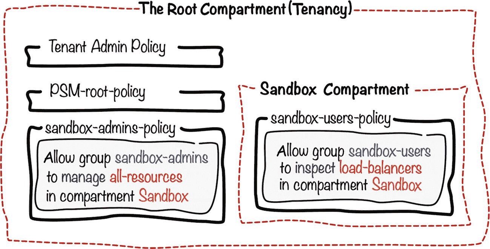

图 4-20
不同 compartment 中的策略

您的租户包含的用户和 compartment 越多，最终可能就需要一套相当复杂的策略。这就是为什么您应该从一开始就牢记一个组织良好的策略放置模式及其声明结构。由于隐式的拒绝所有规则，我鼓励您逐步增加对各种云资源的访问级别，一旦发现用户确实需要访问它们。在本书中，对于 `sandbox-user` 用户，我们将遵循这一最佳实践。在后面的每一章中，我将添加所需的策略声明，以便该用户能够执行特定章节中包含的任务。

我们已经介绍了如何使用 OCI 控制台和 CLI 来管理 compartment、用户、组和策略。您可能想知道，特别是在阅读了第 3 章之后，是否可以将这些云资源包含在您的 Terraform 基础设施代码中。嗯，技术上，是的。绝对可以。例如，您可以使用 `oci_identity_policy` 资源来定义访问策略。然而，我个人更倾向于在 Terraform 基础设施代码之外管理 IAM 云资源。

### 审计与搜索

作为云租户所有者或您所管理云账户的负责人，您需要密切关注在任何给定时刻存在于不同 compartment 中的所有这些不同的云资源。此外，您应该了解用户采取的操作。当我谈到对一个或多个云资源的操作时，我基本上指的是与 API 的交互。我在前一章讨论自动化选项时提到过这一点。任何类型的活动，无论是在 OCI 控制台中完成的，还是通过 API、SDK、CLI 或 Terraform 完成的，在底层都会产生一个 API 调用。在本节中，我将向您简要介绍 Oracle 云基础设施中的搜索和审计功能，当您想要正确控制情况时，这些功能确实是不可或缺的。


#### Searching

想象一下，您想查找所有显示名称包含*sandbox*一词的用户和组。在本章前面的部分，我使用了两个独立的 CLI 命令`iam user list`和`iam group list`来获取所有用户和组的列表。我通过`--query`参数应用的 JMESPath 过滤器来解析响应中接收的数据，并在我的客户端本地显示匹配的元素。但是，如果我的云租户有几十个用户呢？我们将不必要地接收到一个包含所有用户的大型响应，然后才能应用本地的 JMESPath 过滤器。这似乎不是一个有效的解决方案。此外，如果我们想仅通过单个 API 调用*搜索*匹配给定名称的各种类型的云资源，该怎么办？

Oracle Cloud Infrastructure 提供了一个专用的搜索 API，用于执行跨资源类型和跨隔间的全文搜索或结构化查询，以简化和增强您收集云资源信息的方式。当您需要查找分散在不同隔间中的广泛资源时，这尤其有用。这在概念上如图 4-21 所示。

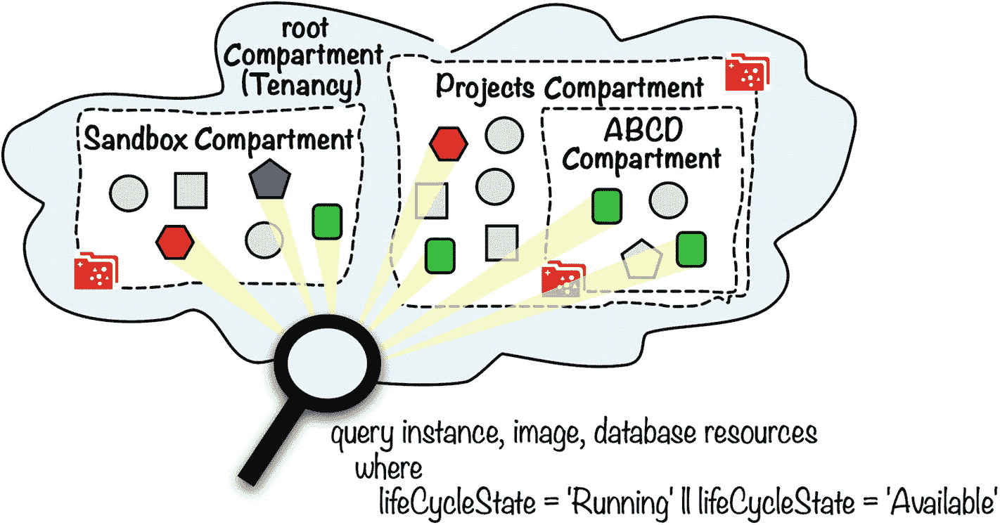

图 4-21

Oracle Cloud Infrastructure Search API

只要策略语句授予您用户所属组访问这些隔间和资源类型的权限，您就可以使用搜索 API 轻松搜索资源。支持两种搜索类型。

*   `Free-text queries`
*   `Structured queries`

您通常会使用自由文本查询来根据资源的元数据文本模式匹配获得资源的概览。如果您已经心中有特定的资源类型或条件，结构化查询会更加方便。

#### Free-Text Search

`Free-text queries`不过是在 Oracle Cloud Infrastructure 索引的所有云资源元数据上执行的全文搜索。如果在任何索引的元数据字段中找到了给定的搜索词，只要该类型的资源及其隔间范围对执行自由文本搜索的用户可见，该云资源就会包含在结果中。要在 OCI 控制台中运行自由文本查询，请将搜索词（例如*sandbox*）放在顶部栏的搜索框中，如图 4-22 所示。结果将按类型分组并一起显示，搜索词会高亮显示，如图 4-23 所示。

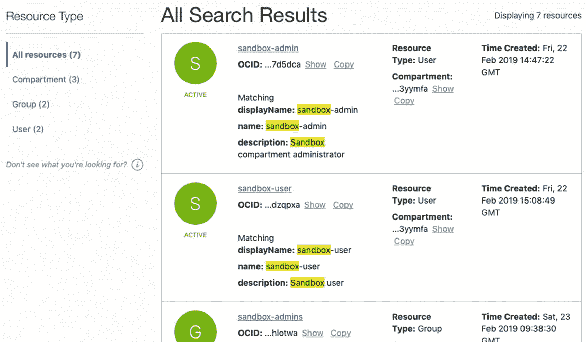

图 4-23

OCI 控制台中的自由文本搜索结果


图 4-22

OCI 控制台中的自由文本搜索

可以使用 CLI 运行相同的查询。为此，我们将利用`search resource free-text-search`命令，并使用`--text`参数指定我们感兴趣查找的术语。请注意，我们仍然可以使用 JMESPath（`--query`参数）在本地过滤并仅显示我们真正感兴趣的字段。

```
$ oci search resource free-text-search --text sandbox --query 'data.items[*].{Type:"resource-type",Name:"display-name",OCID:"identifier",State:"lifecycle-state"}'
[
{
"Name": "sandbox-admin",
"OCID": "ocid1.user.oc1..aa.........7d5dca",
"State": "ACTIVE",
"Type": "User"
},
{
"Name": "sandbox-user",
"OCID": "ocid1.user.oc1..aa.........dzqpxa",
"State": "ACTIVE",
"Type": "User"
},
{
"Name": "sandbox-admins",
"OCID": "ocid1.group.oc1..aa.........hlotwa",
"State": "ACTIVE",
"Type": "Group"
},
{
"Name": "sandbox-users",
"OCID": "ocid1.group.oc1..aa.........rj2sba",
"State": "ACTIVE",
"Type": "Group"
},
{
"Name": "Sandbox",
"OCID": "ocid1.compartment.oc1..aa.........gzwhsa",
"State": "ACTIVE",
"Type": "Compartment"
}
```

正如我之前所说，您通常只会使用这种类型的搜索来获取与特定文本模式匹配的资源的初步、高级概览。根据您搜索的术语，结果集可能非常大。总而言之，这是对您租户或您的用户有权访问的隔间中所有类型云资源的全文搜索。这就是为什么您不应该忘记分页，在 CLI 命令的情况下，您可以使用`--limit`和`--page`参数来控制分页。您可以在本章后面专门的部分中阅读更多相关信息。


#### 结构化查询

`Structured queries`（结构化查询）则使用一种特殊的查询语言，让你能对资源类型及希望在搜索中包含的隔间范围拥有更大的控制力和掌控权。例如，以下是一个将列出 `Sandbox` 隔间中所有“运行中”或“终止中”计算实例的查询：

```
query
instance resources
where ( lifeCycleState = 'RUNNING' || lifeCycleState = 'TERMINATING' ) && compartmentId = 'ocid1.compartment.oc1..aa.........gzwhsa'
```

要在 OCI 控制台中运行它，请打开自由文本搜索页面并单击“高级搜索”按钮，或者您可以在 URL 后附加 `/search` 来直接访问此页面。例如，如果您使用的是法兰克福区域，请访问此 URL：`https://console.eu-frankfurt-1.oraclecloud.com/search`。您将看到可以输入查询的文本框，如图 4-24 所示。

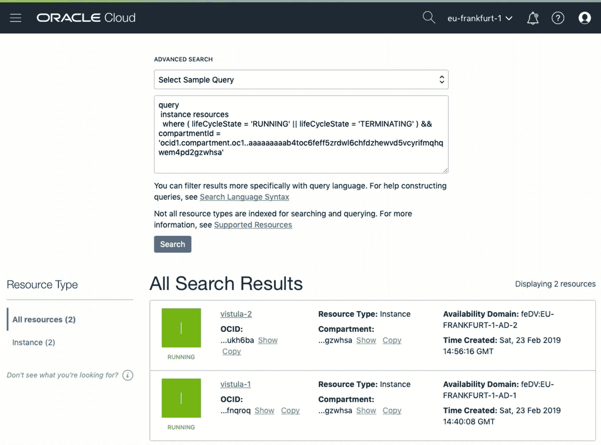

图 4-24

OCI 控制台中的结构化查询

可以使用 CLI 通过 `search resource structured-search` 命令运行相同的查询。然后，查询将作为 `--query-text` 参数传递。

```
$ oci search resource structured-search --query-text "query instance resources where ( lifeCycleState = 'RUNNING' || lifeCycleState = 'TERMINATING' ) && compartmentId = 'ocid1.compartment.oc1..aa.........gzwhsa'"
{
"data": {
"items": [
{
"availability-domain": "feDV:EU-FRANKFURT-1-AD-2",
"compartment-id": "ocid1.compartment.oc1..aa.........gzwhsa",
"defined-tags": {},
"display-name": "vistula-2",
"freeform-tags": {},
"identifier": "ocid1.instance.oc1.eu-frankfurt-1.ab.........ukh6ba",
"lifecycle-state": "Running",
"resource-type": "Instance",
"search-context": null,
"time-created": "2019-02-23T14:56:16.521000+00:00"
},
{
"availability-domain": "feDV:EU-FRANKFURT-1-AD-1",
"compartment-id": "ocid1.compartment.oc1..aa.........gzwhsa",
"defined-tags": {},
"display-name": "vistula-1",
"freeform-tags": {},
"identifier": "ocid1.instance.oc1.eu-frankfurt-1.ab.........fnqroq",
"lifecycle-state": "Running",
"resource-type": "Instance",
"search-context": null,
"time-created": "2019-02-23T14:40:08.609000+00:00"
}
]
}
}
```

注意

不要担心在您的情况下没有结果。这是因为目前 `Sandbox` 隔间中没有正在运行的实例。在后续章节的练习中处理各种云资源时，请随时测试此功能。

回到最初的任务，即列出元数据（如显示名称或描述）包含 `sandbox` 术语的用户和组，以下是正确的查询：

```
query user, group resources matching 'sandbox-'
```

如您所见，我们没有应用 `where` 子句，而是采用了 `matching` 子句。这是如何对选定的资源类型子集实现自由文本查询的一个例子。如果您使用过自由文本搜索，您还会看到其他类型的资源。

类似于自由文本搜索，在结构化查询的情况下，您也可以对结果集应用额外的 JMESPath 驱动的过滤器。只是不要混淆 `--query-text` 参数和 `--query` 参数。前者使用 Search API 在响应中仅查找并返回匹配的资源。后者，即 `--query` 参数，在您的本地客户端计算机上应用 JMESPath 公式来过滤结果。

```
$ oci search resource structured-search --query-text "query user, group resources matching 'sandbox-'" --query 'data.items[*].{Type:"resource-type",Name:"display-name",OCID:"identifier"}'
[
{
"Name": "sandbox-admin",
"OCID": "ocid1.user.oc1..aa.........7d5dca",
"Type": "User"
},
{
"Name": "sandbox-user",
"OCID": "ocid1.user.oc1..aa.........dzqpxa",
"Type": "User"
},
{
"Name": "sandbox-admins",
"OCID": "ocid1.group.oc1..aa.........hlotwa",
"Type": "Group"
},
{
"Name": "sandbox-users",
"OCID": "ocid1.group.oc1..aa.........rj2sba",
"Type": "Group"
}
]
```

要了解有关结构化搜索查询语言语法的更多信息，请查阅官方文档。您可以在 `https://docs.cloud.oracle.com/iaas/Content/Search/Concepts/queryoverview.htm` 找到它。

使用结构化查询进行的有针对性的搜索，通常与自由文本搜索相比，返回的结果集较小。但是，您仍然可能受益于采用适当的分页。让我们看看如何做到这一点。

#### 分页

如今，结果集可能非常大。您可能发现几十个、几百个、数千个甚至更多与您的查询匹配的项目。有时，只验证最初的几个结果是有意义的；在其他情况下，您需要逐项仔细分析整个结果集。例如，要计算您在给定时间运行中的计算实例的 CPU 总数，您将需要处理查询的整个结果集。一次性获取所有结果可能代价高昂，并且在某些情况下可能由于内存原因导致应用程序崩溃。这就是为什么您应该始终考虑`分页`。分页意味着您通过执行一系列相关的搜索调用来分页获取结果集。项目是排序的；因此，如果您继续逐页收集结果，您最终将到达结果集的末尾。这样，您就会知道您已经处理完了整个结果集。OCI 控制台提供了开箱即用的分页功能。使用 CLI 时，您需要定义 `--limit` 和 `--page` 参数，并在每次后续请求中基于 `opc-next-header` 字段的内容。无论您使用 `search resource structured-search` 命令还是 `search resource free-text-search` 命令，都不重要。在这两种情况下，机制的工作方式相同。

让我们通过一个例子看看它是如何工作的。我们将对 `sandbox` 术语运行相同的自由文本查询。这次，我们将应用分页，一次列出最多三个项目。因此，正如您所猜测的，CLI 命令中的 `--limit` 参数将取 `3` 作为值。如果您仔细查看 JMESPath 过滤器，您将看到我还在 `nextpage` 名称下额外显示了 `opc-next-page` 元素。

```
$ oci search resource free-text-search --text sandbox --query "{results: data.items[*].{type: \"resource-type\", name: \"display-name\"}, nextpage: \"opc-next-page\"}" --limit 3
{
"nextpage": "eyJ.........cOY",
"results": [
{
"name": "sandbox-admin",
"type": "User"
},
{
"name": "sandbox-user",
"type": "User"
},
{
"name": "sandbox-admins",
"type": "Group"
}
]
}
$ NEXTPAGE=eyJ.........cOY
```

很好。我们已经收到了结果集中的前三个项目。现在，在下一个查询中，您将在 CLI 命令中添加 `--page` 参数，并使用前一个查询结果的 `nextpage` 字段中收到的值。

```
$ oci search resource free-text-search --text sandbox --query "{results: data.items[*].{type: \"resource-type\", name: \"display-name\"}, nextpage: \"opc-next-page\"}" --limit 3 --page "$NEXTPAGE"
{
"nextpage": null,
"results": [
{
"name": "sandbox-users",
"type": "Group"
},
{
"name": "Sandbox",
"type": "Compartment"
}
]
}
```

太棒了。结果集中的下三个项目已交付。这次，`nextpage` 字段设置为 `null`，这表明我们已经到达了结果集的末尾。


#### 审计

Oracle Cloud Infrastructure 会收集对 API 的每一次调用的信息。因此，任何与 API 的交互，无论其来源是 OCI 控制台、SDK、CLI 还是 Terraform，都属于审计范围。审计日志默认保留 90 天，除非你更改此值。你可以将审计日志条目保留长达 365 天。要在 OCI 控制台中搜索特定时间段内发生的事件，请执行以下步骤：

1.  转到菜单 ➤ 治理 ➤ 审计。
2.  选择你希望缩小结果范围的 compartment。
3.  选择时间段的开始日期和结束日期。
4.  提供一个搜索关键字，例如 `LaunchInstance`。
5.  单击搜索。
6.  单击“保持搜索”标签，确保所有审计日志条目都被处理。

图 4-25 显示了审计事件搜索的结果。

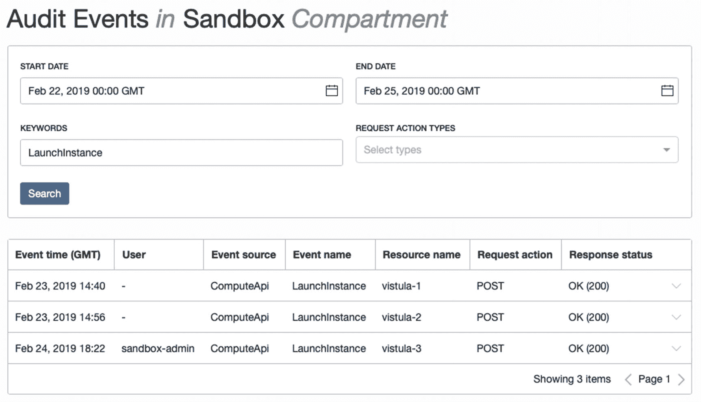

图 4-25

OCI 控制台中的审计事件搜索

前两条记录显示了在 `vistula-1` 和 `vistula-2` 计算实例配置期间捕获的事件。这两个实例是由租户所有者管理员用户配置的，该用户恰好是一个联合用户。对于联合用户，要找出是谁执行了操作，你需要展开事件详情并查看 `principalId` 字段。第三个名为 `vistula-3` 的计算实例是由 `sandbox-admin` 用户启动的，这是一个本地、非联合用户；因此，你可以在用户列中看到它的名称。

注意

本章并未描述启动 `vistula-*` 实例的过程，但你可以自由搜索本章练习中配置的 `uuid-*` 实例，以试验审计事件搜索功能。

对于每个审计日志事件，记录的详细信息比你在图 4-25 所示的表格中看到的要多。如果你展开其中一个条目，比如第三个，你会看到更多信息，如图 4-26 所示，包括作为 `LaunchInstance` 事件主题的计算实例的 OCID。

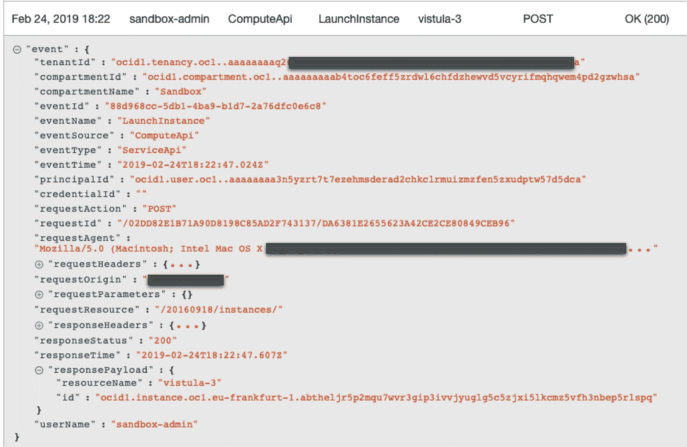

图 4-26

OCI 控制台中的审计事件详情

一如既往，相同的操作也可以通过 CLI 命令的形式完成，这次的命令是 `audit event list`。

## 总结

阅读完本章后，你应该对如何为属于不同项目环境和生产系统的云资源准备称为 compartment 的逻辑容器有了非常清晰的理解。你知道如何在控制台中以及使用 CLI 来管理用户和组。你了解策略语句的重要性，并知道如何使用 IAM 策略创建和管理它们。你能够执行自由文本搜索并使用结构化查询查找资源。最后，你理解了审计的概念及其在云租户管理中的重要性。

# 5. Oracle 云中的数据存储

在 Oracle 云中有许多存储数据的方式。具体选择很大程度上取决于数据类型、应用程序上下文以及适用于特定用例或用户故事的数据使用模式。本章将重点介绍云中最流行的数据存储方法之一，即对象存储。

## 存储桶和对象

假设你正在为一家房地产开发商工作。你处理着各种类型的数据项，如房地产营销材料、公寓蓝图、停车场规划、施工进度表等。尽管这些项目中的每一个通常都是一个文件，但你可以稍作概括，将它们视为 *对象*。换句话说，你可以将这些项目视为你的云应用程序将要处理和服务的内容。为了简化数据资产管理，能够对这些对象进行分组会很有帮助。在这个例子中，分组可以基于不同的房地产项目，这些项目拥有特定的对象。那么，如果你能够安全地忘记非业务任务，比如确保数据始终可用并安全复制以抵御任何意外事件，会怎样呢？这将使你能够完全专注于业务流程要求的各个数据项的业务本质。这就是 *对象存储* 发挥作用的地方。它承担了数据生命周期中发生的各种纯技术活动的负担。数据项会自动复制。此外，你不再需要担心磁盘卷上是否还有足够的空间，因为在这种情况下你根本不需要考虑单个磁盘卷。相比之下，从用户的角度来看，你使用的是一个平坦的、近乎无限的存储空间。最后但同样重要的是，数据默认使用 256 位高级加密标准（AES-256）进行静态加密。

我提到过你可以对相关对象进行分组，例如，在前面的例子中，属于同一个房地产项目的公寓蓝图和停车场规划。为此，你需要某种逻辑容器。对象存储允许你将相关对象存储在称为 *存储桶* 的逻辑容器中。在上一章中，我们讨论了 compartment 以及它们在根据你云账户下维护的项目和系统隔离云资源方面的作用。同样的规则在这里也适用。每个存储桶必须存在于且仅存在于一个 compartment 中。这迫使你将新的存储桶置于某个特定的项目环境、生产系统或通用 compartment（如 `Sandbox`）的上下文中。Compartment 和存储桶可能仍然不足以以你希望的更复杂的方式来组织对象。通常，我们更喜欢处理具有多个层级的分层结构，以表达更详细的分组。这可以通过以适当的方式为对象名称添加前缀来实现，从而在存储桶内部模拟类似文件夹的多级层次结构。你可以使用以 `/` 分隔的“路径”作为对象名称的前缀，最终得到完整的对象名称，如 `/waw/bemowo/125.pdf` 或 `/waw/bemowo/245.pdf`。这种命名约定允许你基于特定前缀列出对象，并在使用 CLI 时对存储桶中基于前缀的对象子集执行各种批量操作。图 5-1 说明了对象存储的核心组件及其与 compartment 的关系。

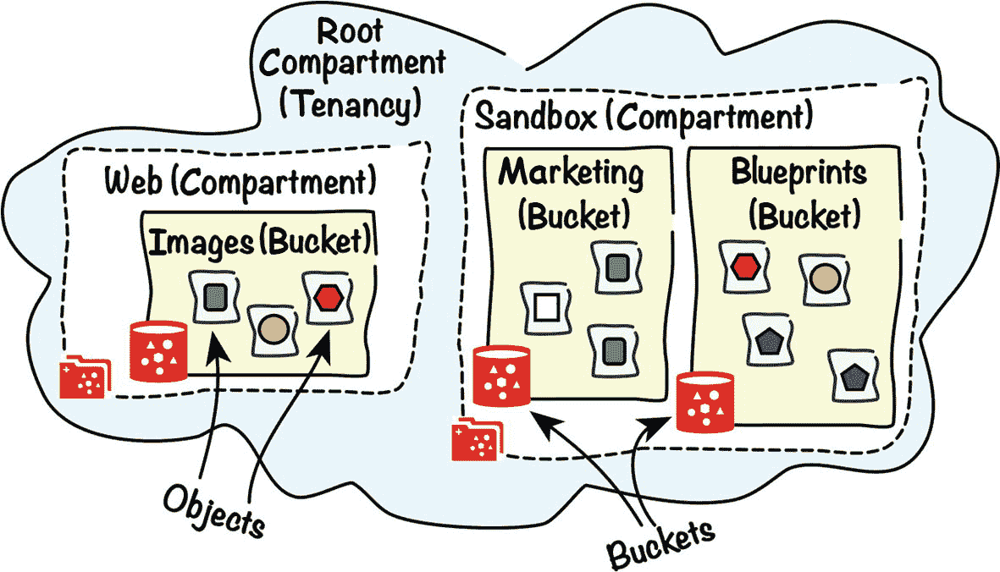

图 5-1

存储桶和对象层次结构

每个云租户都拥有自己的 *命名空间*，存储桶就在其中存在。命名空间名称仅在最初生成一次，且无法更改。对象存储要求存储桶名称仅在单个云账户内唯一。与其他租户已占用的现有存储桶名称不会发生冲突。因此，很明显，所有对对象存储端点的直接和间接（CLI、SDK、Terraform）API 调用都必须知道命名空间。

注意


## 简介

本书中的代码片段已在 macOS 和 Windows Subsystem for Linux 上进行测试。此外，所有命令都应在主流的 Linux 发行版上运行。如果您使用的是 Windows 且不想使用 Windows Subsystem for Linux，您随时可以在虚拟机上运行 Linux。另外，大多数代码片段也可能在 Windows 的 Git Bash 中运行。请务必按照第 3 章和第 4 章的描述准确设置 CLI 和 Terraform。

您可以在控制台中找到与您的云租户关联的对象存储命名空间名称，如下所示：

1.  转到菜单 ➤ 管理 ➤ 租户详细信息。
2.  找到“对象存储命名空间”标签。

或者，您也可以使用 CLI 来获取对象存储 (`os`) 命名空间 (`ns`) 的名称，如下所示：
```
$ oci os ns get
{
"data": "jakobczyk"
}
```
对象存储命名空间名称是不可变的，不会更改。对象存储命名空间名称是一个随机且唯一的字符串。较旧的租户（例如我的）可能其命名空间名称与租户名称相同。您可能还记得，在第 2 章中，我曾提到每个 Oracle Cloud Infrastructure 云资源都由一个称为 OCID 的结构化标识符唯一标识。嗯，这条规则也有例外：存储桶和对象是通过名称唯一标识的。它们始终在专用于您云租户的命名空间的上下文中命名，如图 5-2 所示。


*图 5-2 命名空间、存储桶和对象*

在此阶段，我需要指出，Oracle Cloud Infrastructure 中的对象存储在作用域上是区域性的。这基本上意味着，一个特定的存储桶及其存储的对象，驻留在该存储桶最初创建的区域中。如果您发现自己需要执行跨区域的对象传输到位于另一个区域的另一个存储桶，有一个 API 支持此类操作。

## 处理对象

对象所在的存储桶可以是公共的或私有的。为了在大多数情况下保护数据，您将使用私有存储桶，但您可以随时自由创建公共存储桶。有两种类型的认证组可以访问私有存储桶中的对象。

*   IAM 用户
*   实例主体

我将在接下来的章节中解释这两种访问类型。此外，您还可以通过发出在给定时间段内有效的预认证请求，让未经认证的客户端访问私有存储桶中的特定对象。任何知道链接的人都可以访问该特定对象。预认证请求将在本章末尾介绍。

为了准备练习，我们需要快速回顾一下。在上一章中，我要求您创建两个用户 `sandbox-admin` 和 `sandbox-user`，以及两个对应的组 `sandbox-admins` 和 `sandbox-users`。然后，在根 compartment 中，我们创建了一个新的 IAM 策略 (`sandbox-admins-policy`)，其中包含一条 *IAM 策略语句*，该语句授予了 `sandbox-admins` 组成员对 `Sandbox` compartment 的完全管理访问权限。
```
allow group sandbox-admins to manage all-resources in compartment Sandbox
```
在继续之前，请确保此设置仍然有效。您需要它来完成本章的演练。为了演示对象存储的一些基本功能，您将以 `sandbox-user` 用户身份使用 CLI 创建一个存储桶并上传一组文件。接下来，我们将使用其他命令进行批量操作、基于前缀的带分页列表以及自定义元数据。您还将学习如何处理并发更新。所有 CLI 命令都使用 Oracle Cloud Infrastructure REST API，其概念如图 5-3 所示。

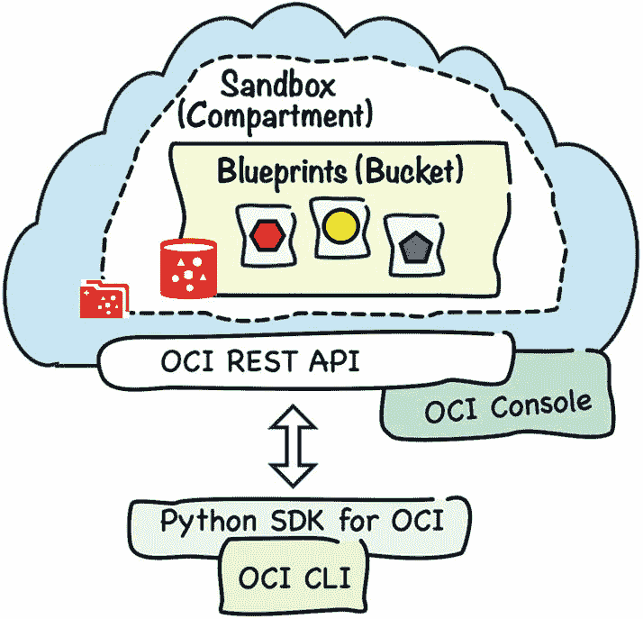
*图 5-3 与对象存储 API 交互*

让我们看看与对象存储的基本交互。我们将使用 CLI 来执行它们。同样，您即将发出的 CLI 命令将简单地导致 API 请求，如第 3 章所述。


### 基础知识

对象可被视为数据实体。这意味着有一套标准操作可以对它们执行，例如创建、读取、更新和删除，通常称为 **增删改查**。这不足为奇。类似的操作也可以在存储桶上执行。我们现在将使用 `oci os bucket create` CLI 命令在 `Sandbox` 隔区中创建一个名为 `blueprints` 的新存储桶。为了遵循最佳实践，我们将以 `sandbox-admin` 用户身份执行此操作和后续的几个操作。为此，请记得应用正确的 CLI 配置文件。

```
$ oci os bucket create --name blueprints --profile SANDBOX-ADMIN
{
"data": {
"approximate-count": null,
"approximate-size": null,
"compartment-id": "ocid1.compartment.oc1..aa.........gzwhsa",
"created-by": "ocid1.user.oc1..aa.........7d5dca",
"defined-tags": {},
"etag": "7115bc55-b18c-4232-80f7-363643c327b9",
"freeform-tags": {},
"kms-key-id": null,
"metadata": {},
"name": "blueprints",
"namespace": "jakobczyk",
"object-lifecycle-policy-etag": null,
"public-access-type": "NoPublicAccess",
"storage-tier": "Standard",
"time-created": "2019-03-07T15:25:52.065000+00:00"
},
"etag": "7115bc55-b18c-4232-80f7-363643c327b9"
}
```

响应中有几个有趣的元素值得解释。我们为 CLI 命令提供的唯一参数是存储桶名称。这就是为什么存储桶在需要时采用了默认配置值。结果，新创建的存储桶被配置为标准存储层存储桶，不允许公共访问。

有两种*存储层*：标准和归档。它们差别不大。*归档存储层*基本上更便宜，但代价是无法立即访问对象，必须先恢复对象。这个操作可能需要几个小时。你会将归档存储用于什么？想想那些很少访问但由于某些监管或合规原因必须存储一定时间的数据。另一个例子可能是旧的日志或测量值，你目前不一定需要，但愿意保留以防万一。在本章中，我们将处理标准存储层存储桶。

不允许公共访问意味着存储桶是私有的，对象只能由经过身份验证的 IAM 用户、实例主体或通过预认证请求访问。如果我们处理的是公共存储桶，对象将对所有人可见并可下载。图 5-4 显示了 OCI 控制台中的存储桶详细信息。

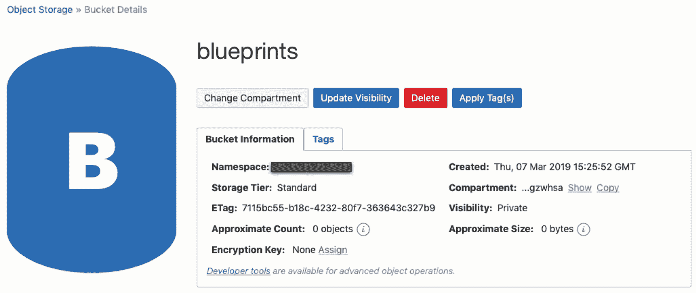

图 5-4

在 OCI 控制台中查看存储桶详细信息

这是列出活动隔区中存在的存储桶并以表格形式显示它们的 CLI 命令：

```
$ oci os bucket list --query 'data[*].{Bucket:name}' --output table --profile SANDBOX-ADMIN
+------------+
| Bucket     |
+------------+
| blueprints |
+------------+
```

进入下一步，我们希望创建权限，允许 `sandbox-users` 组的成员列出此存储桶中存在的对象，并能够添加新对象和删除现有对象。为此，首先准备一个包含相关策略语句的文件，如清单 5-1 所示。我将此文件命名为 `sandbox-users.policies.storage.json` ，但名称并不重要，只要在下一个命令中正确引用它即可。或者，你可以在以下路径的 Git 仓库中找到此文件：`chapter05/1-policies/sandbox-users.policies.storage.json`。

```
[
"allow group sandbox-users to read buckets in compartment Sandbox where target.bucket.name='blueprints'",
"allow group sandbox-users to manage objects in compartment Sandbox where target.bucket.name='blueprints'"
]
Listing 5-1
sandbox-users.policies.storage.json
```

`buckets` 的 `read` 策略动词允许用户列出存储桶并获取每个存储桶的详细配置。然而，我们使用了一个带有 `target.bucket.name` 变量的条件，这基本上限制了权限，只允许用户操作名为 `blueprints` 的存储桶。类似地，我们对 `objects` 使用 `manage` 策略动词来授予对象范围内的所有操作类型，但仅限于 `blueprints` 存储桶中的对象。

一旦文件准备就绪，我们就可以使用 `oci iam policy create` CLI 命令，在 `Sandbox` 隔区中创建一个新策略，就像我们在上一章中添加新策略的方式一样。以 `sandbox-admin` 身份工作，你只能在 `Sandbox` 隔区中创建策略。在第 4 章中，我们将 `Sandbox` 隔区设置为 `~/.oci/oci_cli_rc` 文件中 `SANDBOX-ADMIN` 配置文件的默认隔区。这样，你可以跳过必需的 `--compartment-id`（或其别名 `-c`）参数，因为 CLI 将能够读取并应用默认值。以下 CLI 命令将基于提供的文件创建一个新的 IAM 策略。我假设你已经克隆了与本书相关的代码；因此，你可以进入包含策略文件的目录并执行 CLI 命令，如下所示：

```
$ cd ~/git/oci-book/chapter05/1-policies
$ oci iam policy create --name sandbox-users-storage-policy --statements file://sandbox-users.policies.storage.json --description "Storage-related policy for regular Sandbox users" --profile SANDBOX-ADMIN
```

在此阶段，你应该能在 OCI 控制台中看到带有两个语句的新策略，如图 5-5 所示。


图 5-5

与 sandbox-users 相关的新对象存储策略

执行将文件放入存储桶的最基本的命令之一怎么样？首先，我们需要一个样本文件。真实数据在当今是宝贵的，应该受到保护，所以让我们生成一个随机的、无意义的文件，我们假装它是一份房地产公寓蓝图 PDF。以下是你使用 Bash 生成随机二进制文件的方法：

```
$ mkdir ~/data
$ cd ~/data
$ SIZE=$((4096+(10+RANDOM % 20)*1024))
$ head -c $SIZE /dev/urandom > 101.pdf
$ ls -lh 101.pdf | awk '{ print $9 " (" $5 ")" }'
101.pdf (21K)
```

很好。现在，请小心。从现在开始，连续的 CLI 命令将使用另一个配置文件 `SANDBOX-USER` 来调用。这是你可以使用 CLI 将此文件放入 `blueprints` 存储桶的方法：

```
$ oci os object put -bn blueprints --file 101.pdf --profile SANDBOX-USER
Uploading object  [####################################]  100%
{
"etag": "06b2293c-72d9-4668-b236-bdb881472bd6",
"last-modified": "Thu, 07 Mar 2019 18:42:25 GMT",
"opc-content-md5": "urJobycygNAm2Z3fEf3tkw=="
}
```

这很容易，不是吗？我们使用了 `oci os object put` 命令将 `101.pdf` 文件上传到 `blueprints` 存储桶。CLI 配置文件 `SANDBOX-USER` 以 `sandbox-user` 用户身份进行身份验证。此用户属于 `sandbox-users` 组。片刻之前，我们授予了这个用户组对 `Sandbox` 隔区中 `blueprints` 存储桶内的对象的管理级别访问权限。作为一个细心的读者，你可能想知道 CLI 如何知道目标对象存储命名空间的名称。该名称既未存储在 CLI 配置文件中，也未存储在 `oci_cli_rc` 文件中。答案是它不知道。因此，CLI 必须在后台查询与租户关联的默认对象存储命名空间的 API，使用的 API 与我们通过 `oci os ns get` 命令查询的 API 相同。如果你想避免这个额外的 API 内部调用，可以使用 `-ns` 选项将命名空间名称传递给对象存储 CLI 命令，如下所示：


## OCI 对象存储基础操作

```
$ oci os object put -ns jakobczyk -bn blueprints --file 101.pdf --profile SANDBOX-USER
```

要将对象下载到本地驱动器并以不同的名称（例如 `101-copy.pdf`）保存，请执行此 CLI 命令：

```
$ oci os object get -bn blueprints --name 101.pdf --file 101-copy.pdf --profile SANDBOX-USER
Downloading object  [####################################]  100%
```

最后，要从存储桶中删除文件，请使用此 CLI 命令：

```
$ oci os object delete -bn blueprints --name 101.pdf --profile SANDBOX-USER
Are you sure you want to delete this resource? [y/N]: y
```

那么如何更新对象呢？你需要注意对象是不可变的。要更新对象，你基本上需要覆盖它，实际上就是用新版本替换旧版本。

好了，这些是基础操作。

### 对象名称前缀

如果我们要将来自不同房地产项目的蓝图存储在一个存储桶中怎么办？华沙 Bemowo 区的一处房产中，一套待售公寓的编号可能与 Wola 区另一处房产中一套公寓的编号相同。我们可以使用名称前缀来避免混淆这两套公寓。这次，我们将生成一整套文件，假装它们是公寓蓝图。我们将使用三组文件。第一组将是华沙 Bemowo 区一套房产中公寓的蓝图。

```
$ mkdir -p warsaw/bemowo
$ for i in 101 102 105 107 115; do SIZE=$((4096+(10+RANDOM % 20)*1024)); head -c $SIZE /dev/urandom > warsaw/bemowo/$i.pdf; done
```

第二组将模拟华沙 Wola 区一套房产中 A 栋建筑的蓝图文件。

```
$ mkdir -p warsaw/wola/a
$ for i in 115 120 124 130; do SIZE=$((4096+(10+RANDOM % 20)*1024)); head -c $SIZE /dev/urandom > warsaw/wola/a/$i.pdf; done
```

第三组将假装是同一处 Wola 区房产中 B 栋建筑的公寓蓝图文件。

```
$ mkdir -p warsaw/wola/b
$ for i in 119 120 121; do SIZE=$((4096+(10+RANDOM % 20)*1024)); head -c $SIZE /dev/urandom > warsaw/wola/b/$i.pdf; done
```

很好。你应该会得到类似这样的结果：

```
$ find warsaw -type f -exec ls -lh {} + | awk '{ print $9 " (" $5 ")"}'
warsaw/bemowo/101.pdf (29K)
warsaw/bemowo/102.pdf (30K)
warsaw/bemowo/105.pdf (18K)
warsaw/bemowo/107.pdf (23K)
warsaw/bemowo/115.pdf (33K)
warsaw/wola/a/115.pdf (32K)
warsaw/wola/a/120.pdf (21K)
warsaw/wola/a/124.pdf (15K)
warsaw/wola/a/130.pdf (31K)
warsaw/wola/b/119.pdf (21K)
warsaw/wola/b/120.pdf (29K)
warsaw/wola/b/121.pdf (18K)
```

CLI 提供了一组方便的 `bulk commands`，可让你批量上传、下载和删除对象。我们现在将把来自 `warsaw/bemowo` 本地目录的蓝图上传到 `blueprints` 存储桶，作为以 `waw/bemowo/` 字符串为前缀的新对象，如下所示：

```
$ oci os object bulk-upload -bn blueprints --src-dir warsaw/bemowo/ --object-prefix "waw/bemowo/" --include "*.pdf" --profile SANDBOX-USER
{
"skipped-objects": [],
"upload-failures": {},
"uploaded-objects": {
"waw/bemowo/101.pdf": {...}
"waw/bemowo/102.pdf": {...},
"waw/bemowo/105.pdf": {...},
"waw/bemowo/107.pdf": {...},
"waw/bemowo/115.pdf": {...}
}
}
```

如果需要，你可以使用 `--include` 选项来限制从源目录上传的文件，使其仅匹配给定模式的文件。

以类似的方式，我们将上传来自 `warsaw/wola` 目录的文件，这次根据每个文件最初所在的本地子目录，使用 `waw/wola/a` 和 `waw/wola/b` 字符串作为对象的前缀。

```
$ oci os object bulk-upload -bn blueprints --src-dir warsaw/wola/a --object-prefix "waw/wola/a/" --profile SANDBOX-USER
{
"skipped-objects": [],
"upload-failures": {},
"uploaded-objects": {
"waw/wola/a/115.pdf": {...},
"waw/wola/a/120.pdf": {...},
"waw/wola/a/124.pdf": {...},
"waw/wola/a/130.pdf": {...}
}
}
$ oci os object bulk-upload -bn blueprints --src-dir warsaw/wola/b --object-prefix "waw/wola/b/" --profile SANDBOX-USER
{
"skipped-objects": [],
"upload-failures": {},
"uploaded-objects": {
"waw/wola/b/119.pdf": {...},
"waw/wola/b/120.pdf": {...},
"waw/wola/b/121.pdf": {...}
}
}
```

图 5-6 说明了我们刚刚执行的操作。前缀确实很有帮助，因为它们让你可以在特定存储桶中重建类似文件夹的层次结构。`ListObjects` 对象存储服务 API 提供了一个方便的查询参数 `prefix`，它允许你根据对象名称前缀指定要列出的对象子集。你可以使用 `oci os object list` CLI 命令访问此 API，如下所示：

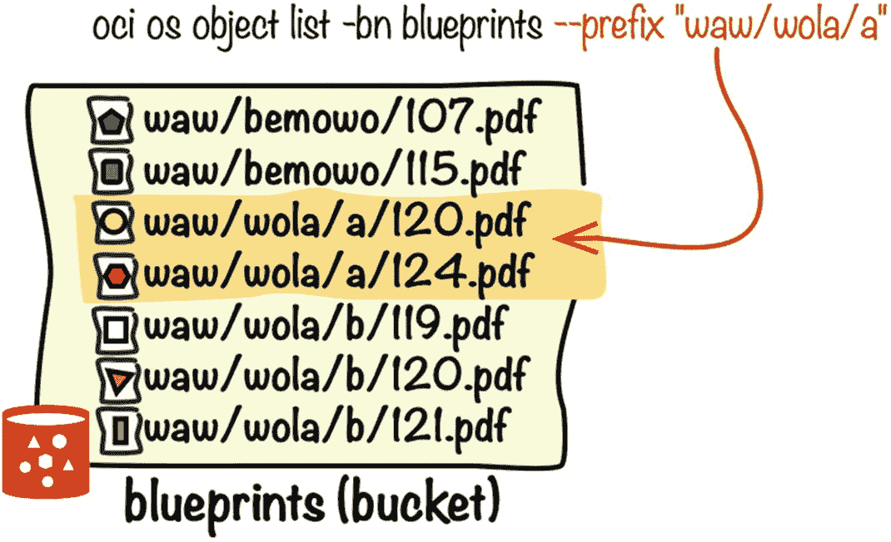

图 5-6

基于前缀的过滤

```
$ oci os object list -bn blueprints --prefix "waw/wo" --query 'data[*].name' --profile SANDBOX-USER
[
"waw/wola/a/115.pdf",
"waw/wola/a/120.pdf",
"waw/wola/a/124.pdf",
"waw/wola/a/130.pdf",
"waw/wola/b/119.pdf",
"waw/wola/b/120.pdf",
"waw/wola/b/121.pdf"
]
$ oci os object list -bn blueprints --prefix "waw/wola/b" --query 'data[*].name' --profile SANDBOX-USER
[
"waw/wola/b/119.pdf",
"waw/wola/b/120.pdf",
"waw/wola/b/121.pdf"
]
$ oci os object list -bn blueprints --prefix "waw/wola/b/12" --query 'data[*].name' --profile SANDBOX-USER
[
"waw/wola/b/120.pdf",
"waw/wola/b/121.pdf"
]
```

### 分页列出对象

在日常工作中，你很容易遇到包含数百或数千个对象的存储桶。一次性列出所有对象是不可能的。你需要借助 `paging mechanism`。你可能还记得上一章描述的搜索 API 及其分页机制。坏消息是，在撰写本文时，搜索 API 不支持对象存储对象。好消息是，对象存储 `ListObjects` API 有其自己的分页机制，实际上比搜索 API 中使用的机制稍简单一些。如果你决定使用 `limit` 参数，在响应中除了对象列表外，你还会收到 `next-start-with` 元素，它其实就是下一个对象的名称。在后续的每个查询中，你可以取前一个 `next-start-with` 元素的值，并使用 `start` 参数来指示 API 从哪里开始列出元素，如以下代码片段所示：

```
$ oci os object list -bn blueprints  --limit 5 --query '{names:data[*].name, next:"next-start-with"}' --profile SANDBOX-USER
{
"names": [
"waw/bemowo/101.pdf",
"waw/bemowo/102.pdf",
"waw/bemowo/105.pdf",
"waw/bemowo/107.pdf",
"waw/bemowo/115.pdf"
],
"next": "waw/wola/a/115.pdf"
}
$ oci os object list -bn blueprints  --limit 5 --start "waw/wola/a/115.pdf" --query '{names:data[*].name, next:"next-start-with"}' --profile SANDBOX-USER
{
"names": [
"waw/wola/a/115.pdf",
"waw/wola/a/120.pdf",
"waw/wola/a/124.pdf",
"waw/wola/a/130.pdf",
"waw/wola/b/119.pdf"
],
"next": "waw/wola/b/120.pdf"
}
$ oci os object list -bn blueprints  --limit 5 --start "waw/wola/b/120.pdf" --query '{names:data[*].name, next:"next-start-with"}' --profile SANDBOX-USER
{
"names": [
"waw/wola/b/120.pdf",
"waw/wola/b/121.pdf"
],
"next": null
}
```


### 对象元数据

另一个与在对象存储桶中存储不同种类和业务用途文件相关的实用方面是可以附加*自定义元数据*。通过这种方式，您可以在不改变对象内容的情况下，通过注释选定对象来提供额外的上下文信息。回到我们房地产项目的示例场景，我们可以决定注释那些指向两层公寓的蓝图。因为不想更改对象内容，我们可以利用自定义元数据，它本质上是由与现有对象关联的键值对组成的。以下是如何将带有自定义元数据（`apartment-levels`键）的新对象放入存储桶：

```
$ head -c 4096 /dev/urandom > warsaw/wola/a/122.pdf
$ METADATA='{ "apartment-levels": "2" }'
$ oci os object put -bn blueprints --name "waw/wola/a/122.pdf" --file warsaw/wola/a/122.pdf --metadata "$METADATA" --profile SANDBOX-USER
Uploading object  [####################################]  100%
{
"etag": "b899ed57-baca-4aff-85ba-5e1fe925c437",
"last-modified": "Sat, 09 Mar 2019 10:46:34 GMT",
"opc-content-md5": "kZ6fEuo46zGMm+Tymcumaw=="
}
```

乍一看，似乎没有发生什么特别的事情。然而，如果您在 OCI 控制台中查看对象详细信息，您将看到一个新的自定义键值对，如图 5-7 所示。

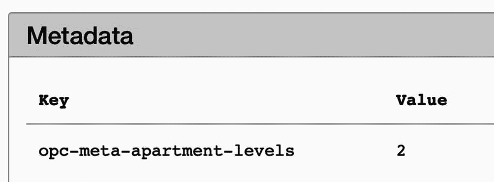

图 5-7

对象的自定义元数据

如果您考虑通过 API 进行可编程交互，则无需下载特定文件来检查其自定义元数据。`HeadObject` API 让您仅读取对象的元数据和实体标签。我们将在下一节讨论实体标签的重要性。以下是使用`oci os object head` CLI 命令访问此 API 的方法：

```
$ oci os object head -bn blueprints --name "waw/wola/a/122.pdf" --profile SANDBOX-USER
{
......
"content-length": "4096",
"content-md5": "kZ6fEuo46zGMm+Tymcumaw==",
"content-type": "application/octet-stream",
"date": "Sat, 09 Mar 2019 11:40:41 GMT",
"etag": "b899ed57-baca-4aff-85ba-5e1fe925c437",
"last-modified": "Sat, 09 Mar 2019 10:46:34 GMT",
......
"opc-meta-apartment-levels": "2",
......
}
```

在这两种情况下，您都可以看到任何自定义键都会带有`the opc-meta-`前缀，以避免与任何标准元数据（如`content-length`或`content-type`）发生冲突。您需要意识到对象是不可变的；因此，要向存储桶中已存在的对象附加新元数据，我们必须替换该对象。无论新版本是否包含相同的内容，这都无关紧要。

### 并发更新

让我们讨论一下所谓的*竞态条件*。假设有两个应用程序想要同时更新同一个对象，以增量方式添加它们的局部更改。如果它们一个接一个地立即获取对象，它们将处理相同的基础版本，每个应用程序都不知道另一个应用程序正在并行处理同一个对象。在两个应用程序都决定上传对象的新版本（从而有效地替换基础版本）之前，一切似乎都很好。结果很容易预测。第二个执行更新的应用程序将覆盖第一个保存对象的应用程序所做的更改。这种情况可以称为*丢失更新*，其概念如图 5-8 所示。

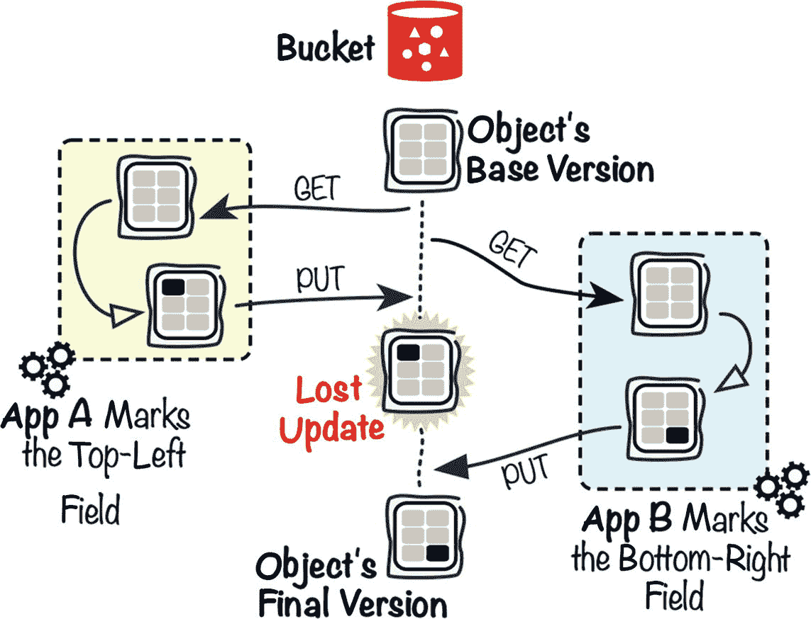

图 5-8

丢失更新问题

丢失更新的影响取决于业务场景。想象一下，通过给已售出的停车位着色来更改地下停车场地图的应用程序逻辑。在这种情况下，丢失更新将导致某些停车位即使已售出也显示为可用。通常，我们更愿意完全消除这类问题。对象存储 API 通过*实体标签*（ETags）来解决这个问题，它可以用于实现乐观并发控制。ETag 是为每个对象版本生成的标识符，无论内容是否更改。如果您放置同一个对象两次，即在第二次上传期间使用相同的内容覆盖它，您仍然会得到两个不同的 ETag，如以下代码片段所示：

```
$ head -c 8096 /dev/urandom > warsaw/bemowo/parking.pdf
$ oci os object put -bn blueprints --name waw/bemowo/parking.pdf --file warsaw/bemowo/parking.pdf --profile SANDBOX-USER
Uploading object  [####################################]  100%
{
"etag": "d5ded03a-64ca-4af2-8185-563f658f4021",
"last-modified": "Sat, 09 Mar 2019 16:43:31 GMT",
"opc-content-md5": "upvy5Ns5flwg053S8WJG1w=="
}
$ oci os object put -bn blueprints --name waw/bemowo/parking.pdf --file warsaw/bemowo/parking.pdf --profile SANDBOX-USER
WARNING: This object already exists. Are you sure you want to overwrite it? [y/N]: y
Uploading object  [####################################]  100%
{
"etag": "4f893925-455a-4ea5-8890-2b39f8523d82",
"last-modified": "Sat, 09 Mar 2019 16:43:41 GMT",
"opc-content-md5": "upvy5Ns5flwg053S8WJG1w=="
}
```

您将如何在您的应用程序逻辑中包含*乐观并发控制*以避免竞态条件？对对象的更新操作可以分步骤执行。首先，读取当前对象的 ETag 并下载对象内容。接下来，应用程序在本地更改对象。最后，告诉 API 将对象的新版本放入存储桶，从而有效地覆盖旧版本，但仅当 ETag 在此期间未更改时。这样的条件 PUT 可以使用`If-Match` HTTP 头来实现，如图 5-9 所示。

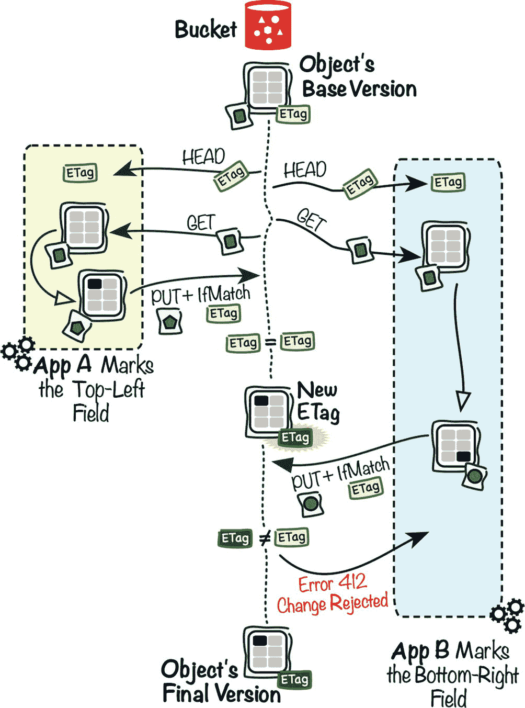

图 5-9

实现乐观并发

让我使用 CLI 来演示这个场景：


```
$ ETAG=`oci os object head -bn blueprints --name waw/bemowo/parking.pdf --query 'etag' --profile SANDBOX-USER --raw-output`
$ echo $ETAG
6836145f-2b37-4538-885d-bd7f242d5a34
$ oci os object get -bn blueprints --name waw/bemowo/parking.pdf --file local.parking.pdf --profile SANDBOX-USER
Downloading object  [####################################]  100%
$ ls -lh local.parking.pdf | awk '{ print $9 " (" $5 ")" }'
local.parking.pdf (7.9K)
$ head -c 2048 /dev/urandom >> local.parking.pdf
$ ls -lh local.parking.pdf | awk '{ print $9 " (" $5 ")" }'
local.parking.pdf (9.9K)
$ oci os object put -bn blueprints --name waw/bemowo/parking.pdf --file local.parking.pdf --if-match "$ETAG" --profile SANDBOX-USER
WARNING: This object already exists. Are you sure you want to overwrite it? [y/N]: y
Uploading object  [####################################]  100%
{
"etag": "0698bdb4-ddd0-4d12-a030-cd7e55dc25af",
"last-modified": "Sat, 09 Mar 2019 17:56:35 GMT",
"opc-content-md5": "z2gpBufEwHkU2SsbutTQsA=="
}
```

我们从读取特定对象的 ETag 开始。`oci os object head` CLI 命令使用轻量级的`HeadObject` API，该 API 仅获取与对象关联的元数据，包括 ETag。在我们的例子中，我们发现当前 ETag 的值以`bd7f242d5a34`结尾。在第二步中，我们使用`oci os object get` CLI 命令下载了对象的内容，并向本地副本追加了 2KB 的随机数据以模拟本地更改。在最后部分，我们使用了带有`--if-match`选项的`oci os object put` CLI 命令，以确保仅当对象自我们最初获取 ETag 以来未被修改时才会被覆盖。在对条件性 PUT 操作的响应中，我们可以看到新对象版本已被分配了一个完全不同的 ETag，该 ETag 以`cd7e55dc25af`结尾。如果另一个应用程序尝试使用不再同步的 ETag 发出条件性 PUT 命令，它将收到一个状态为 HTTP 412（前提条件失败）的错误。

```
$ head -c 1024 /dev/urandom >> local.parking.pdf
$ ls -lh local.parking.pdf | awk '{ print $9 " (" $5 ")" }'
local.parking.pdf (11K)
$ oci os object put -bn blueprints --name waw/bemowo/parking.pdf --file local.parking.pdf --if-match "$ETAG" --profile SANDBOX-USER
ServiceError:
{
"code": null,
"message": "The service returned error code 412",
"opc-request-id": "f3fee86d-8e97-93b4-1c5e-da3ed572ed35",
"status": 412
}
```

## 编程对象存储

为了与对象存储 API 交互，我们在本章之前的示例中一直使用 CLI 命令。然而，在现实世界中，对对象存储的绝大多数 API 调用都来自应用程序。在本节中，我将向您展示如何使用其中一个 SDK（即适用于 Python 的 OCI SDK），让您的应用程序能够使用 Oracle Cloud Infrastructure 对象存储。我还将借此机会解释如何通过采用多段文件上传方法来处理大文件。

在第 3 章中，我引导您完成了 SDK 安装和配置的简单过程。在第 4 章中，我们创建了新的组和用户，并向 SDK/CLI 配置文件添加了两个新的配置文件：`SANDBOX-ADMIN`和`SANDBOX-USER`。最后，在本章的第一部分，我们以这种方式创建了所需的策略，以允许`sandbox-users`组的组成员管理`blueprints`存储桶中的对象。我假设所有这些仍然有效。

使用适用于 Python 的 OCI SDK 对对象存储云资源执行的所有操作都是通过`ObjectStorageClient`类的方法完成的。您可以在[`https://oracle-cloud-infrastructure-python-sdk.readthedocs.io/en/latest/api/object_storage/client/oci.object_storage.ObjectStorageClient.html`.](https://oracle-cloud-infrastructure-python-sdk.readthedocs.io/en/latest/api/object_storage/client/oci.object_storage.ObjectStorageClient.html)找到该类的全面文档。

### 多段上传

在处理非常大的文件（例如大于 100MB 的文件）时，建议您将原始文件拆分为较小的部分，并利用`多段上传` API 将文件分成可管理的块上传到云端。这种方法使上传过程不易受到任何网络问题的负面影响，因为您只需要重新上传未能成功传送到云端的单个部分即可。此外，多段上传机制使得并行上传各个部分成为可能，从而加快了上传操作的完成速度。在撰写本文时，可上传对象的最大大小为 10TB。另外，每个单独的部分必须小于 50GB。您最多可以创建 10,000 个部分。

一个多段上传操作包括四个阶段，其概念如图 5-10 所示。首先，您必须将大文件拆分为较小的部分(1)。具体方式取决于您和您选择的工具。接下来，您通过发送`CreateMultipartUpload`请求来发起第一次 API 调用，以启动一个新的多段上传(2)。在请求中，您指定存储命名空间、存储桶名称和目标对象名称。在响应中，您将获得新激活的多段上传的上传 ID。在此阶段，您可以开始上传各个部分(3)。对于每个部分，您向对象存储 API 发送一个`UploadPart`请求。顺序无关紧要。正如我所提到的，您甚至可以并行上传多个部分。除了存储命名空间、存储桶名称、目标对象名称和上传 ID 之外，`UploadPart`操作还期望您提供一个上传部分编号，每个部分都不同。换句话说，您负责对部分进行编号。部分编号不需要是连续的。最终将根据部分编号的升序序列组合各部分以形成目标对象。`UploadPart`操作会为您上传的每个部分返回一个唯一的实体标签(ETag)。请确保您收集这些实体标签，因为一旦准备好提交多段上传，您就需要它们。为了让对象存储根据已上传的部分构建目标对象，您需要提交多段上传(4)。您通过向 API 发送`CommitMultipartUpload`请求来完成此操作。在请求中，您指定一个配对列表，其中每个配对包含一个已分配的部分编号和相应的 ETag。只有包含在列表中的部分才会用于构建目标对象，无论您总共上传了多少部分。

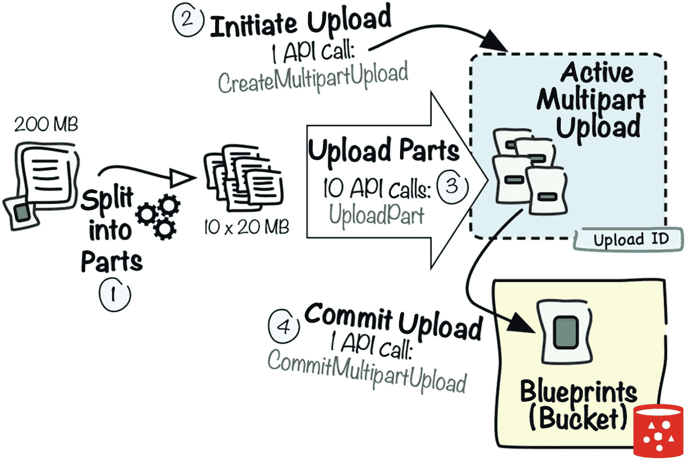

图 5-10 多段上传

如果您的应用程序取消正在进行的多段上传，它会向 API 发送一个`AbortMultipartUpload`请求。这样，对象存储将关闭多段上传，有效地删除已经上传的部分。如果您只是关闭应用程序而没有以正确方式中止上传，会发生什么？嗯，从技术上讲，多段上传将保持活动状态并准备好接受更多部分。在这种情况下，您将为已上传的部分持续付费，直到您中止上传为止。不用担心跟踪您的多段上传情况。可以通过向 API 发送`ListMultipartUploads`请求来列出活动的上传。如果您预计会有许多执行多段更新的应用程序实例，那么实现一个定期作业来使用此方法监控进行中和已放弃的上传可能是明智之举。


## 准备测试文件与执行 OCI 分片上传

让我们准备一个测试文件。这次，我们将生成一个较大的文件（25M），命名为 `visualizations.pdf`，并将其放在 `warsaw/bemowo` 本地目录中。你可以很容易地想象这是一个包含彩色图片和特定房地产项目可视化图的销售目录。这类文件通常体积相当大。生成文件的方法如下：

```bash
$ cd ~/data
$ SIZE=$((25*1024*1024))
$ head -c $SIZE /dev/urandom > warsaw/bemowo/visualizations.pdf
$ ls -lh warsaw/bemowo/visualizations.pdf | awk '{ print $9 " (" $5 ")" }'
warsaw/bemowo/visualizations.pdf (25M)
```

### 环境设置与应用程序执行

我们将要运行的应用程序将使用 OCI 的 Python SDK。让我们使用 `venv` 模块为此应用程序准备一个隔离的虚拟环境。接下来，我们激活环境，升级 Python 包管理器 (`pip`)，并安装 OCI SDK (`oci` 模块)。最后，我们使用 `pip freeze` 命令列出已安装的模块，并验证 SDK 是否已成功安装。

```bash
$ cd
$ python3 -m venv oci-multipart
$ source oci-multipart/bin/activate
(oci-multipart) $ python3 -m pip install --upgrade pip
Collecting pip
.........
Successfully installed pip-19.2.3
(oci-multipart) $ python3 -m pip install oci
Collecting oci
.........
Successfully installed asn1crypto-0.24.0 certifi-2019.9.11 cffi-1.12.3 configparser-4.0.2 cryptography-2.7 oci-2.5.1 pyOpenSSL-19.0.0 pycparser-2.19 python-dateutil-2.8.0 pytz-2019.2 six-1.12.0
(oci-multipart) $ python3 -m pip freeze | grep oci
oci==2.5.1
```

假设 `blueprints` 存储桶仍然存在且所有凭据都已就位，我们就可以执行应用程序了。访问之前从我的 GitHub 账户获取的应用程序代码，调整到 `visualizations.pdf` 和配置文件的路径，然后运行程序。

```bash
(oci-multipart) $ cd ~/git/oci-book/chapter05/2-multipart-upload
(oci-multipart) $ chmod u+x multipart.py
(oci-multipart) $ FILE="$HOME/data/warsaw/bemowo/visualizations.pdf"
(oci-multipart) $ CONFIG="$HOME/.oci/config"
(oci-multipart) $ ./multipart.py "$FILE" 10 "waw/bemowo/visualizations.pdf" "blueprints" "$CONFIG" SANDBOX-USER
Upload ID: 7de81d8f-44ba-4178-4269-5c25f7d03a86
Part File: /Users/mjk/warsaw/bemowo/visualizations.pdf.part0
Part ETag: 8489D285131C4A32E053C21DC20AAE16
Part File: /Users/mjk/warsaw/bemowo/visualizations.pdf.part1
Part ETag: 84897E38465648C8E053C21DC20AB5FF
Part File: /Users/mjk/warsaw/bemowo/visualizations.pdf.part2
Part ETag: 84897DC3EF364AEEE053C21DC20AF0F0
(oci-multipart) $ deactivate
$
```

应用程序将原始文件分割成三个部分，如下列命令的输出所示：

```bash
$ ls -lh ~/data/warsaw/bemowo/visual* | awk '{ print $9 " (" $5 ")" }'
data/warsaw/bemowo/visualizations.pdf (25M)
data/warsaw/bemowo/visualizations.pdf.part0 (10M)
data/warsaw/bemowo/visualizations.pdf.part1 (10M)
data/warsaw/bemowo/visualizations.pdf.part2 (5.0M)
```

通过提交分片上传，新创建的对象由这些部分构建而成。为了验证它是否真的相同，请下载该对象并使用 `diff` 工具。

```bash
$ cd ~/data
$ oci os object get -bn blueprints --name "waw/bemowo/visualizations.pdf" --file visualizations.downloaded.pdf --profile SANDBOX-USER
Downloading object  [####################################]  100%
$ ls -lh visualizations.downloaded.pdf | awk '{ print $9 " (" $5 ")" }'
visualizations.downloaded.pdf (25M)
$ diff visualizations.downloaded.pdf warsaw/bemowo/visualizations.pdf
$
```

`diff` 命令没有输出意味着两个文件的内容完全相同。

### 代码解析：主程序

是时候看看你刚刚执行的代码了。如清单 5-2 所示，我们将主要程序逻辑封装在一个传统的 Python `if __name__ == '__main__'` 代码块中。这样，只有当我们直接运行此文件时，代码才会执行。Python 允许你将 `.py` 文件视为可导入的模块，从而复用已实现的逻辑。在这种情况下，你通常希望能够调用导入的函数，而忽略主程序逻辑。当一个文件被另一个模块作为模块导入时，`__name__` 变量不再具有 `__main__` 值，而是保存模块（文件）的名称，从而有效地排除了主程序逻辑。我们直接运行了该程序；因此，主程序逻辑被执行并调用了两个函数。首先，我们使用 `split_large_file` 函数将文件分割成更小的部分。然后，我们使用 `upload_to_oci` 函数执行分片上传。

```python
if __name__ == '__main__':
    filepath = str(sys.argv[1])
    part_size_mb = int(sys.argv[2])
    object_name = str(sys.argv[3])
    bucket_name = str(sys.argv[4])
    config_path = str(sys.argv[5])
    config_profile = str(sys.argv[6])

    part_list = split_large_file(filepath, part_size_mb*1024*1024)
    upload_to_oci(part_list, object_name , bucket_name, config_path, config_profile)
```

**清单 5-2** `multipart.py`：主函数

### 代码解析：分片函数

清单 5-3 展示了 `split_large_file` 函数。值得注意的是返回的对象。在我们的例子中，我们不仅将原始文件的内容分割成更小的块，还收集了存储这些块的新创建文件的文件名。这使我们能够返回指向存储各部分文件路径的列表。

```python
def split_large_file(file_path, part_size):
    """Splits a file into parts"""
    part_list = []
    part_number = 0
    with open(file_path, 'rb') as file_stream:
        part = file_stream.read(part_size)
        while part != b"":
            part_file_path = file_path+'.part'+str(part_number)
            with open(part_file_path, 'wb') as part_stream:
                part_stream.write(part)
            part_list.append(part_file_path)
            part_number += 1
            part = file_stream.read(part_size)
    return part_list
```

**清单 5-3** `multipart.py`：`split_large_file` 函数

清单 5-4 展示了 `upload_to_oci` 函数。第一个输入参数是从 `split_large_file` 函数返回的部分列表。我们这样做是为了告诉函数可以在哪里找到分片文件。首先，`oci.config.from_file` 方法从配置文件（`config_path` 输入参数）中读取连接详细信息，并使用选定的配置文件（`config_profile` 输入参数）。紧接着，创建 `oci.object_storage.ObjectStorageClient` 类的一个实例，并命名为 `client`。与 OCI 对象存储 API 的所有交互都是通过该类的方法完成的。在开始分片上传之前，我们仍需获取分配给云账户的对象存储命名空间。我们使用 `client.get_namespace` 方法执行此任务。接下来，我们调用本地的 `create_multipart_upload` 函数，该函数启动新的分片上传并返回生成的上传 ID。随后，我们遍历部分列表，并为每个部分调用 `upload_part` 函数。不过，这不是一种非常高效的方式，因为我们是以阻塞、顺序的方式执行的。但是，出于本示例的目的，如果我使用了并行函数执行，反而更难理解。在每次迭代中，我们收集由 `upload_part` 函数返回的对象，并将所有对象聚合到一个名为 `part_details_list` 的列表中。最后，我们将此列表连同其他输入参数（如上传 ID 和对象存储客户端类实例）传递给本地的 `commit_multipart_upload` 函数，该函数提交分片上传。


```
def upload_to_oci(part_list, object_name, bucket_name, config_path, config_profile):
    """执行到 OCI 对象存储的多部分上传"""
    config = oci.config.from_file(config_path, config_profile)
    client = oci.object_storage.ObjectStorageClient(config)
    storage_namespace = client.get_namespace().data
    upload_id = create_multipart_upload(storage_namespace, bucket_name, object_name, client)
    part_number = 1
    part_details_list = []
    for part in part_list:
        part_details = upload_part(storage_namespace, bucket_name, object_name, upload_id, part_number, part, client)
        part_details_list.append(part_details)
        part_number += 1
    commit_multipart_upload(storage_namespace, bucket_name, object_name, upload_id, part_details_list, client)
```

代码清单 5-4
multipart.py: `upload_to_oci` 函数

代码清单 5-5 展示了 `create_multipart_upload` 函数，该函数使用 `client.create_multipart_upload` 方法来开始上传。如你所见，`CreateMultipartUpload` API 请求接受对象存储命名空间、目标存储桶和目标对象名作为输入参数。然而，对象名必须封装在一个名为 `CreateMultipartUploadDetails` 的模型类实例中，并通过一个通常命名为 `kwargs` 的关键字参数字典来传递。最后但同样重要的是，该函数返回为此多部分上传生成的上传 ID。

```
def create_multipart_upload(storage_namespace, bucket_name, object_name, client):
    kwargs = { "object": object_name }
    details = oci.object_storage.models.CreateMultipartUploadDetails(**kwargs)
    upload_id = client.create_multipart_upload(storage_namespace, bucket_name, details).data.upload_id
    print('Upload ID: '+upload_id)
    return upload_id
```

代码清单 5-5
multipart.py: `create_multipart_upload` 函数

代码清单 5-6 展示了 `upload_part` 函数，它是整个多部分上传过程中的主要工作函数。它接受部分文件的路径（`part` 输入参数）和分配的部分编号（`part_number` 输入参数）作为输入参数，同时也接受上传 ID、对象存储命名空间、存储桶、对象名称和客户端类实例。该文件以只读的二进制流形式打开，并传递给 `client.upload_part` 方法，该方法在底层发送 `UploadPart` API 请求。我之前提到过，在最后我们需要指定要包含在多部分上传提交中的部分列表。该列表将包含 `CommitMultipartUploadPartDetails` 对象，这些对象实际上各自存储了部分编号和对应的实体标签。为了在 `upload_to_oci` 函数中填充此列表，我们在 `upload_part` 函数中基于已知的部分编号和返回的 ETag 标头（存储了已上传部分的实体标签）为每个部分创建详情对象。

```
def upload_part(storage_namespace, bucket_name, object_name, upload_id, part_number, part, client):
    print('Part File: '+part)
    kwargs = {}
    with open(part, 'rb') as part_stream:
        rsp = client.upload_part(storage_namespace, bucket_name, object_name, upload_id, part_number, part_stream)
        kwargs = { "part_num": part_number, "etag": rsp.headers['ETag'] }
        print('Part ETag: '+rsp.headers['ETag'])
    return
    oci.object_storage.models.CommitMultipartUploadPartDetails(**kwargs)
```

代码清单 5-6
multipart.py: `upload_part` 函数

代码清单 5-7 展示了 `commit_multipart_upload` 函数，该函数接受 `CommitMultipartUploadPartDetails` 对象列表，将其包装成一个 `CommitMultipartUploadDetails` 对象，并使用 `client.commit_multipart_upload` 方法向 API 发送一个 `CommitMultipartUpload` 请求。

```
def commit_multipart_upload(storage_namespace, bucket_name, object_name, upload_id, part_details_list, client):
    kwargs = { "parts_to_commit": part_details_list }
    details = oci.object_storage.models.CommitMultipartUploadDetails(**kwargs)
    client.commit_multipart_upload(storage_namespace, bucket_name, object_name, upload_id, details)
```

代码清单 5-7
multipart.py: `commit_multipart_upload` 函数

我构建了这个示例应用程序来说明使用 OCI SDK 以及编程实现多部分上传的方式。要将这样的应用程序发布到生产环境，你需要添加错误处理逻辑，以便在发生严重失败时中止正在进行的多部分上传。你还可以考虑为单个部分的上传添加重试机制。最后，可以并行上传各个部分以加快整个过程。

事实上，如果你乐于依赖嵌入在脚本中的 OCI CLI，你可以使用方便的 `oci os put` CLI 命令。这与你本章前面已经使用过的命令相同。任何大于你通过 `--part-size` 参数定义的文件都会有效地使用多部分上传 API 进行上传，除非你明确使用 `--no-multipart` 选项。此外，你可以使用 `--parallel-upload-count` 参数定义并行部分上传的数量，其默认值为 3。

在本节中，你使用了一个应用程序，该应用程序利用 SDK/CLI 配置文件让 SDK 以 IAM 用户身份对 API 调用进行签名。这可能会很烦人，因为你需要以某种方式将 API 签名密钥和用户的 OCID 等内容分发到你的应用程序预计运行的主机。幸运的是，对于托管在 Oracle Cloud 中运行的计算节点上的应用程序，你不需要这样做。在这种情况下，你甚至不需要任何专门的 IAM 用户。相反，你可以利用所谓的动态组，其成员是满足某些条件的计算实例。你将在下一节中了解它们。


## 实例主体

在 IAM 的上下文中，Oracle Cloud 中的每个计算实例都有其自己的身份，该身份基于自动生成、添加到实例上并进行轮换的证书。换句话说，计算实例被视为一个*实例主体*，一个独立的参与者，并且被允许以其自己的名称调用 OCI API。实例主体只能是*动态组*的成员。您已经了解到，我们使用策略来为特定用户组指定对云资源的允许访问。类似地，我们可以定义策略，为由实例主体组成的特定动态组指定允许的访问。为什么我们称动态组为“动态”？很简单，因为它们使用匹配规则来动态添加或移除其成员，如图 5-11 所示。

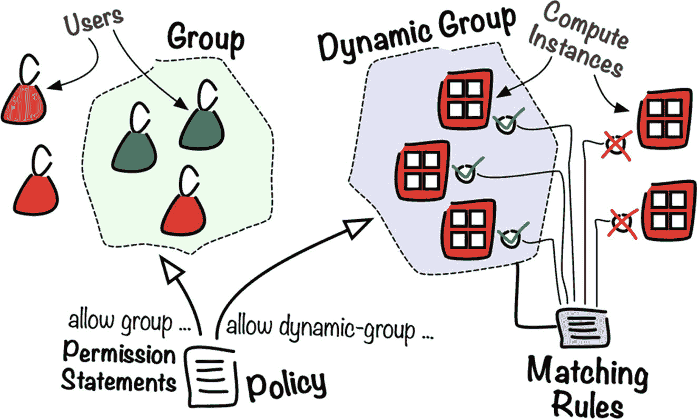
图 5-11
实例主体和动态组

您使用简单的语法制定匹配规则，以定义实例必须满足的条件才能被视为给定动态组的成员。让我给您一个例子。这是一个`匹配规则`条件，它将包含特定 compartment 中存在的所有计算实例：

```
instance.compartment.id = 'ocid1.compartment.oc1..aaaaa.........gzwhsa'
```

您也可以根据实例精确的 OCID 来指向它们。

```
instance.id = 'ocid1.instance.oc1..........kurtua'
```

然而，最方便且真正动态的方式是依赖附加到计算实例上的已定义标签。这是一个条件，它将包含所有附加了`project.realestate`自定义标签的计算实例。

```
tag.project.realestate.value
```

您也可以创建复杂的条件。`all`这个词将确保所有单独条件都必须满足，而`any`这个词则将规则视为只要至少一个条件满足即达成。这是一个条件，它将包含所有存在于特定 compartment 中并且附加了`project.name`自定义标签的计算实例。在这种情况下，标签值必须设置为`realestate`。

```
all { instance.compartment.id = 'ocid1.compartment.oc1..aaaaa.........gzwhsa', tag.projects.name.value = 'realestate' }
```

等等？一个“自定义标签”？是的。没错。我之前没有提到过这一点。在 Oracle Cloud 中，您可以将*用户定义的标签*附加到计算实例和许多其他类型的云资源上。这是一个简单而强大的功能，可让您组织和跟踪云资源。

### 标记资源

许多类型的云资源，包括计算实例和对象存储桶，都可以附加自定义标签。有两种类型的标签。

*   自由格式标签
*   定义标签

我们将重点关注定义标签，因为它们提供了更多功能，包括动态组匹配规则支持。定义标签必须在*标签命名空间*内分组。确切地说，标签命名空间包含*标签键*。然后，您将来自给定命名空间、具有给定键的标签附加到云资源，例如计算实例、对象存储桶或负载均衡器。在此过程中，您可以选择性地为特定标签键分配自定义*标签值*，但这不是强制性的。虽然您在 compartment 中创建标签命名空间，但标签命名空间名称必须在整个租户中唯一。此外，名称不区分大小写；因此，为了保持一致性，最好将它们全部保持为小写或全部大写。与许多其他类型的云资源相比，允许您将标签命名空间从一个 compartment 移动到另一个 compartment。

注意
您可以为对象存储桶分配标签，但不能为单个对象分配标签。对于对象，请使用本章前面介绍的自定义元数据功能。

不再需要的标签键可以被停用或完全删除。已停用的标签键被标记为非活动状态，不能再附加到云资源。但是，现有附件不受影响。特定于标签的操作仍将考虑附加到资源的已停用标签键。停用标签命名空间会有效地停用属于该命名空间的所有标签键。

让我们在`Sandbox` compartment 中创建一个名为`test-projects`的新标签命名空间。我们将使用`oci iam tag-namespace` `create` CLI 命令。如果您已按照第 4 章的说明在`oci_cli_rc`配置文件中配置了`SANDBOX-ADMIN`配置文件，则可以像我在以下代码片段中所做的那样，省略`--compartment-id`选项：

```
$ oci iam tag-namespace create --name "test-projects" --description "Test tag namespace: projects" --profile SANDBOX-ADMIN
{
"data": {
"compartment-id": "ocid1.compartment.oc1..aa.........gzwhsa",
"defined-tags": {},
"description": "Test tag namespace: projects",
"freeform-tags": {},
"id": "ocid1.tagnamespace.oc1..aa.........6qu2eq",
"is-retired": false,
"name": "test-projects",
"time-created": "2019-03-09T20:23:33.458000+00:00"
},
"etag": "4c49c30092918551319c46469d6051f47309f001"
}
```

响应主体是自我描述的。我们可以清楚地看到标签命名空间创建成功。我们始终可以使用 OCI 控制台验证一切是否顺利，如图 5-12 所示。为此，请按照以下步骤操作：

1.  转到菜单 ➤ 治理 ➤ 标签命名空间。

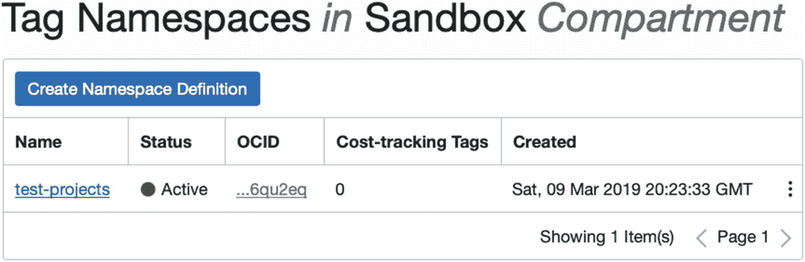
图 5-12
在 OCI 控制台中查看标签命名空间

提示 如果您意外地在根 compartment 中创建了`tag-namespace`，请不要停用它；只需将其移动到`Sandbox` compartment 即可。

如果您问自己图 5-12 所示视图中的“成本跟踪标签”列是什么意思，我将帮助您。您一次最多可以指定 10 个标签键作为成本跟踪启用。这些标签键将作为您应用的额外过滤器，在 OCI 控制台的账单成本分析视图中可用，以便以更精细的方式跟踪成本。基于标签可以动态附加到资源并从资源分离这一事实，成本跟踪标签为您提供了更大的灵活性，以跨 compartment 跟踪相关云资源组产生的成本。


现在，我们将创建一个新的标签键。此键将用于匹配规则，以将我们即将配置的计算实例包含在动态组中。这将让我们能够测试实例委托的实际操作。要在给定的命名空间内创建新的标签键，请执行以下 CLI 命令，记得替换标签命名空间 OCID：

```
$ TAG_NAMESPACE_OCID=`oci iam tag-namespace list --query "data[?name=='test-projects'] | [0].id" --raw-output`
$ oci iam tag create --tag-namespace-id $TAG_NAMESPACE_OCID --name realestate --description "Real-estate project" --profile SANDBOX-ADMIN
{
"data": {
"compartment-id": "ocid1.compartment.oc1..aa.........gzwhsa",
"defined-tags": {},
"description": "Real-estate project",
"freeform-tags": {},
"id": "ocid1.tagdefinition.oc1..aa.........mnlowa",
"is-cost-tracking": false,
"is-retired": false,
"name": "realestate",
"tag-namespace-id": "ocid1.tagnamespace.oc1..aa.........6qu2eq",
"tag-namespace-name": "test-projects",
"time-created": "2019-03-09T20:57:41.094000+00:00"
},
"etag": "83cfd4a247632b699c548886ac4c628891b4eecc"
}
```

再次说明，您可以使用 OCI 控制台通过以下步骤查看新标签：
1.  转到菜单 ➤ 治理 ➤ 标签命名空间。
2.  单击“test-projects”命名空间名称。

如果您觉得 CLI 更方便，可以使用 `oci iam tag list` CLI 命令列出给定命名空间内的所有键。

```
$ oci iam tag list --tag-namespace-id $TAG_NAMESPACE_OCID qsmxlurkwx7pu6qu2eq --all --profile SANDBOX-ADMIN
{
"data": [
{
"compartment-id": "ocid1.compartment.oc1..aa.........gzwhsa",
"defined-tags": {},
"description": "Real-estate project",
"freeform-tags": {},
"id": "ocid1.tagdefinition.oc1..aa.........mnlowa",
"is-cost-tracking": false,
"is-retired": false,
"name": "realestate",
"time-created": "2019-03-09T20:57:41.094000+00:00"
}
]
}
```

很好。现在，我们准备好定义新的动态组及其匹配规则。

#### 动态组

*动态组*的成员只能是那些在 Oracle 云基础设施中运行且满足与该动态组关联的匹配规则中定义条件的计算实例。匹配规则将在创建动态组时提供。我们将接受所有携带在 `test-projects` 命名空间中定义的 `realestate` 标签键的计算实例作为动态组成员。这是我们需要使用的匹配规则：

```
tag.test-projects.realestate.value
```

动态组与标准组一样，存在于整个租户的范围内。因此，`sandbox-admin` 用户将无法创建新的动态组，因为它只能管理 `Sandbox` 隔离区内的资源。这就是为什么我们将使用代表租户管理员的默认 CLI 配置文件，并代表租户管理员创建新的动态组。

> 提示：如果您无法访问租户管理员帐户，请让您的云帐户管理员为您创建此动态组。

要创建新的动态组并明确指示租户级范围，请像这样使用 `oci iam dynamic-group create` 命令：

```
$ TENANCY_OCID=`cat ~/.oci/config | grep tenancy | sed 's/tenancy=//'`
$ MATCHING_RULE="tag.test-projects.realestate.value"
$ oci iam dynamic-group create --name realestate-instances --description "Instances related to the real-estate project" --matching-rule $MATCHING_RULE -c $TENANCY_OCID
{
"data": {
"compartment-id": "ocid1.tenancy.oc1..aa.........3yymfa",
"description": "Instances related to the real-estate project",
"id": "ocid1.dynamicgroup.oc1..aa.........hkt7dq",
"inactive-status": null,
"lifecycle-state": "ACTIVE",
"matching-rule": "tag.test-projects.realestate.value",
"name": "realestate-instances",
"time-created": "2019-03-20T20:59:36.353000+00:00"
},
"etag": "4c007061997871d3f5ac4a98a225f71be509ac25"
}
```

我们将匹配规则定义为 `MATCHING_RULE` 变量，并将其传递给 `oci iam dynamic-group create` CLI 命令的 `--matching-rule` 参数。该命令没有显式指定 `--profile`；因此，CLI 使用了我们配置的默认配置文件（正如第 3 章配置的那样）来使用租户管理员凭据。新的动态组被称为 `realestate-instances`。

有了新的动态组，我们就可以向现有策略添加一条新的权限语句。标准组和动态组的策略语法几乎相同，只是使用 `dynamic-group` 术语代替了 `group` 术语。此语句允许新创建的动态组的实例委托管理 `Sandbox` 隔离区中的对象。

```
allow dynamic-group realestate-instances to manage objects in compartment Sandbox where target.bucket.name='blueprints'
```

我们将重用本章前面创建的相同策略。要执行更新，我们需要一个包含策略中应存在的所有语句的文件。清单 5-8 展示了两条现有语句和第三条新语句。

```
[
"allow group sandbox-users to read buckets in compartment Sandbox where target.bucket.name='blueprints'",
"allow group sandbox-users to manage objects in compartment Sandbox where target.bucket.name='blueprints'",
"allow dynamic-group realestate-instances to manage objects in compartment Sandbox where target.bucket.name='blueprints'"
]
Listing 5-8
sandbox-users.policies.storage.2.json
```

该文件可在 Git 存储库的 `oci-book/chapter05/1-policies/` 目录中找到。

我们将要更新的策略最初是在 `Sandbox` 隔离区中创建的。要通过名称查找此策略，我们可以使用 `oci iam policy list` CLI 命令，并额外应用本地 JMESPath 过滤器以仅显示策略 OCID。


让我们从存储 `sandbox-users.policies.storage.2.json` 文件的目录执行 `oci iam policy update` CLI 命令。我们将使用 `--statements` 参数来引用该文件的相对路径。命令如下：

```
$ cd ~/git/oci-book/chapter05/1-policies
$ POLICY_ID=`oci iam policy list --all --query "data[?name=='sandbox-users-storage-policy'] | [0].id" --raw-output --profile SANDBOX-ADMIN`
$ oci iam policy update --policy-id $POLICY_ID --statements file://sandbox-users.policies.storage.2.json --version-date "" --profile SANDBOX-ADMIN
WARNING: The value passed to statements will overwrite all existing statements for this policy. The existing statements are as follows :
[
"allow group sandbox-users to read buckets in compartment Sandbox where target.bucket.name='blueprints'",
"allow group sandbox-users to manage objects in compartment Sandbox where target.bucket.name='blueprints'"
]
Are you sure you want to continue? [y/N]: y
{
"data": {
"compartment-id": "ocid1.compartment.oc1..aa.........gzwhsa",
"defined-tags": {},
"description": "Storage-related policy for regular Sandbox users",
"freeform-tags": {},
"id": "ocid1.policy.oc1..aa.........tiueya",
"inactive-status": null,
"lifecycle-state": "ACTIVE",
"name": "sandbox-users-storage-policy",
"statements": [
"allow group sandbox-users to read buckets in compartment Sandbox where target.bucket.name='blueprints'",
"allow group sandbox-users to manage objects in compartment Sandbox where target.bucket.name='blueprints'",
"allow dynamic-group realestate-instances to manage objects in compartment Sandbox where target.bucket.name='blueprints'"
],
"time-created": "2019-03-07T15:52:21.583000+00:00",
"version-date": null
},
"etag": "79b1393841a75cb5cf8b22586d731e52b9617cda"
}
```

此外，在撰写本文时，我们必须向 CLI 命令传递 `--version-date` 参数；否则验证将失败。此参数定义了生效的策略动词和资源类型范围。为 `--version-date` 参数使用空值将包含未来添加到该资源类型家族的所有资源类型以及策略动词定义的更改。就本次练习而言，这实际上无关紧要，但该参数必须设置。

至此，我们创建了一个新的标签命名空间和一个已定义的标签键。接着，我们指定了一个新的动态组及其匹配规则，该规则接受计算实例作为动态组的成员，前提是该实例带有新定义的标签。最后，我们向现有策略添加了一条新语句，以允许动态组成员在 `Sandbox` 隔区中管理对象。我们已经准备好配置随自定义应用程序一起交付的基础设施，该应用程序将让我们看到实例主体的实际应用。

#### 从实例访问存储

在本节中，您将应用 Terraform 基础设施代码，该代码将配置一套简单的云资源，包括一台基于 CentOS 的虚拟机。在这台机器上，我们将运行一个简单的基于 Python 的应用程序，该程序被封装为一个基于 systemd 的 Linux 操作系统服务。该应用程序将定期列出特定存储桶中的一组对象，并在同一存储桶中创建一个摘要文本文件。我们将使用 OCI Python SDK 来实现该逻辑。该应用程序，或者更准确地说，运行该应用程序的计算实例，将以所谓的实例主体进行身份验证。这样，您就可以避免在该计算实例上存储密码或密钥。应用程序逻辑的概念图如图 5-13 所示。

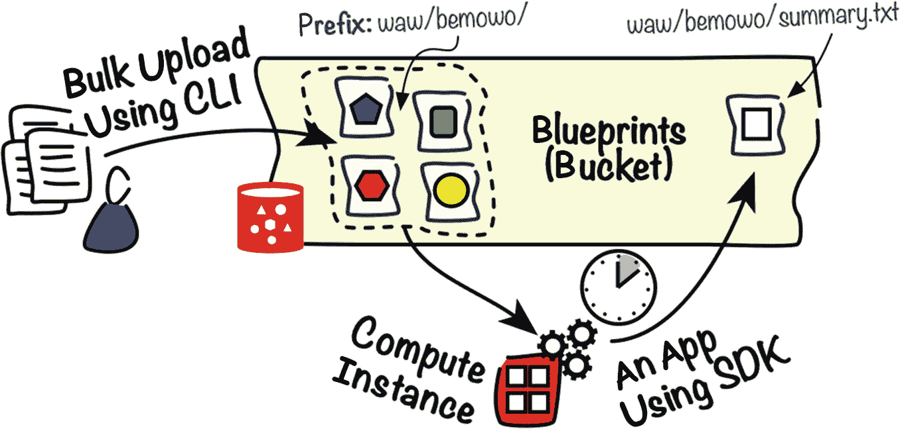

图 5-13：从 OCI 实例访问对象存储

本章前面，您已经在对象存储 API 的背景下对 OCI Python SDK 进行了一些实验。您之前运行的代码使用了本地的 OCI CLI/SDK 配置文件，并以 `sandbox-user` 用户身份进行了身份验证。应用程序必须能够访问私有的 API 签名密钥，并了解其他一些详细信息，例如用户 OCID 和区域，才能成功签署每个请求。这不是一个非常便于移植的设置，对吧？这次，我们将让应用程序以实例主体的身份进行身份验证。这样，我们就不需要在运行应用程序的计算实例上提供或定义任何密钥或用户详细信息。相反，应用程序将代表计算实例进行 API 调用。这增强了安全性，使整个管理更简单，应用程序更具可扩展性。

整个解决方案将使用我准备的脚本以完全自动化的方式构建。您只需“按下按钮”并观看即可。基础设施几乎与第 3 章部署的相同。只是少数名称发生了变化。不过，cloud-init 配置文件是全新的。我稍后会解释一切。首先，让我们看看它的实际效果。

我假设 Terraform 使用的环境变量仍然有效。您可以使用 Bash 命令 `env | grep TF_VAR` 来验证这一点。如果它们不存在，您应该能够使用 `tfvars.env.sh` 脚本来加载它们，该脚本是您在第 3 章练习中创建的。

```
$ source ~/tfvars.env.sh
```

Terraform 代码假设 `~/.ssh` 目录中存在 `oci_id_rsa.pub` 公共 SSH 密钥，并从 `compute.tf` 基础设施代码文件中引用该密钥。满足上述先决条件后，运行 `terraform init` 命令以下载最新的 OCI 插件，并执行 `terraform apply` 命令来配置基础设施。


## 实例主体操作与 cloud-init 服务验证

等待分配给新创建虚拟机的公共 IP。本例中是 `130.61.18.158`。尽管实例已被宣布为创建完成并就绪，但我们必须记住，其启动过程很可能仍在运行。你可能需要等待几秒钟，直到 SSH 守护进程开始接受连接。让我们连接到该实例。

```
$ APP_VM_PUBLIC_IP=`terraform output app_instance_public_ip`
$ ssh -i ~/.ssh/oci_id_rsa opc@$APP_VM_PUBLIC_IP
The authenticity of host '130.61.18.158' can't be established.
ECDSA key fingerprint is SHA256:YJE8Q........./.........LSQxtM.
Are you sure you want to continue connecting (yes/no)? yes
Warning: Permanently added '130.61.18.158' (ECDSA) to the list of known hosts
```

为 cloud-init 设置的任务完成可能需要长达一分钟。你可以在计算实例上使用 `sudo tail -f /var/log/cloud-init.log` 命令来跟踪 cloud-init 执行的进度并调试任何意外问题。你可以定期执行 `systemctl status` 命令，并传递 `reportissuer` 作为服务名。在某个时间点，你应该能看到一个自定义的 `reportissuer` 服务已加载并处于活动状态。这是我们的 Python 应用程序被封装成的一个 systemd 单元。如果你查看服务日志，会发现每 30 秒就会报告生成了一份报告。

```
[opc@app-vm]$ sudo systemctl status reportissuer
● reportissuer.service - Issue Report Job
   Loaded: loaded (/etc/systemd/system/reportissuer.service; enabled; vendor preset: disabled)
   Active: active (running) since Thu 2019-03-21 16:14:09 GMT; 5min ago
 Main PID: 13978 (python3.6)
   CGroup: /system.slice/reportissuer.service
           └─13978 python3.6 /home/opc/reportissuer.py
Mar 21 16:17:45 app-vm reportissuer.py[13978]: Creating a report
Mar 21 16:17:45 app-vm reportissuer.py[13978]: ### Report generated 2019-03-21 16:17:45.634197
Mar 21 16:18:15 app-vm reportissuer.py[13978]: Creating a report
Mar 21 16:18:16 app-vm reportissuer.py[13978]: ### Report generated 2019-03-21 16:18:16.170609
Mar 21 16:18:46 app-vm reportissuer.py[13978]: Creating a report
Mar 21 16:18:47 app-vm reportissuer.py[13978]: ### Report generated 2019-03-21 16:18:47.605280
Mar 21 16:19:17 app-vm reportissuer.py[13978]: Creating a report
[opc@app-vm]$ exit
```

如果查看存储桶，你应该能看到一个名为 `waw/bemowo/summary.txt` 的新对象。这个对象由你刚刚创建的计算实例上运行的 `reportissuer` 服务每 30 秒生成并上传一次。图 5-14 展示了 OCI 控制台中的新对象。

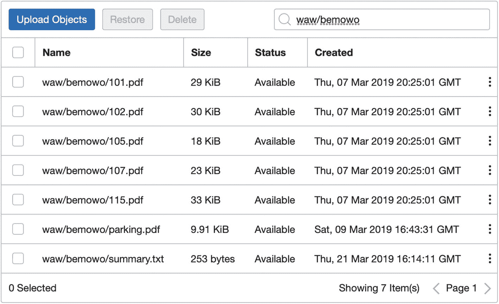

**图 5-14** 由实例主体上传的摘要对象

你对报告的内容感到好奇吗？当然会。回到本地命令行，关闭到计算实例的 SSH 连接。使用 `oci os object get` CLI 命令，并通过 `--file -` 选项将 `waw/bemowo/summary.txt` 对象的内容转储到标准输出。

```
$ oci os object get -bn blueprints --name "waw/bemowo/summary.txt" --file - --profile SANDBOX-USER
waw/bemowo/101.pdf (29.0K)
waw/bemowo/102.pdf (30.0K)
waw/bemowo/105.pdf (18.0K)
waw/bemowo/107.pdf (23.0K)
waw/bemowo/115.pdf (33.0K)
waw/bemowo/parking.pdf (9.90625K)
waw/bemowo/summary.txt (0.2470703125K)
### Report generated 2019-03-21 16:34:33.971448
```

如你所见，报告包含了所有前缀为 `the waw/bemowo` 字符串的对象名称和大小。最后一行显示了报告创建的时间戳，与计算实例上运行的 `reportissuer` 服务最后记录的相同。

清单 5-9 展示了上传到计算实例并由 cloud-init 模块处理的 cloud-config 文件。结果，一系列步骤发生。首先，一个新的单元文件被添加到计算实例文件系统，路径如下：`/etc/systemd/system/reportissuer.service`。这个单元文件是封装我们应用程序的新 systemd 服务的基础。它指定了几个为 `reportissuer.py` 脚本提供运行时配置的变量，该脚本是这里主要的服务可执行文件。cloud config 文件的 `runcmd` 部分定义了在实例上执行的进一步操作，例如安装 Python 3 和 OCI SDK，从 GitHub 仓库下载 `reportissuer.py` 脚本，以及一些命令，这些命令共同基于我们提供的单元文件有效地添加了一个新的 systemd 服务。


## 配置并部署 OCI 实例主体报告服务

### Cloud-init 配置

以下 `appvm.config.yaml` 文件（清单 5-9）展示了如何使用 cloud-init 为应用虚拟机配置 `reportissuer` 服务。

```yaml
#cloud-config
write_files:
-   content: |
    [Unit]
    Description = Issue Report Job
    After = network.target
    [Service]
    Environment=APP_BUCKET_NAME=blueprints
    Environment=APP_OBJECT_NAME=waw/bemowo/summary.txt
    Environment=APP_OBJECT_PREFIX=waw/bemowo
    Environment=APP_POLLING_INTERVAL_SECONDS=30
    Environment=PYTHONUNBUFFERED=1
    ExecStart = /home/opc/reportissuer.py
    User = opc
    [Install]
    WantedBy = multi-user.target
    path: /etc/systemd/system/reportissuer.service
runcmd:
-  [ yum, -y, install, "https://centos7.iuscommunity.org/ius-release.rpm" ]
-  [ yum, -y, install, python3 ]
-  [ yum, -y, install, python3-pip ]
-  [ python3, -m, pip, install, --upgrade, pip ]
-  [ python3, -m, pip, install, oci ]
-  [ wget, "https://raw.githubusercontent.com/mtjakobczyk/oci-book/master/chapter05/3-instance-principals/applications/reportissuer.py" ]
-  [ mv, reportissuer.py, "/home/opc/" ]
-  [ chown, "opc:opc", "/home/opc/reportissuer.py" ]
-  [ chmod, "u+x", "/home/opc/reportissuer.py" ]
-  [ ln, -s, "/etc/systemd/system/reportissuer.service", "/etc/systemd/system/multi-user.target.wants/reportissuer.service" ]
-  [ systemctl, enable, reportissuer.service ]
-  [ systemctl, start, reportissuer.service ]
```

### `reportissuer` 服务实现详解

如果你对 `reportissuer` 服务的实现感兴趣，特别是它如何以实例主体身份进行身份验证，请继续阅读。清单 5-10 展示了程序的主函数。

```python
if __name__ == '__main__':
    bucket_name = os.environ['APP_BUCKET_NAME']
    summary_object_name = os.environ['APP_OBJECT_NAME']
    object_prefix = os.environ['APP_OBJECT_PREFIX']
    polling_interval_seconds = int(os.environ['APP_POLLING_INTERVAL_SECONDS'])
    tmp_directory = os.environ['HOME']
    while True:
        print('Creating a report')
        signer = oci.auth.signers.InstancePrincipalsSecurityTokenSigner()
        client = oci.object_storage.ObjectStorageClient(config={}, signer=signer)
        storage_namespace = client.get_namespace().data
        report_entry_list = prepare_report_entries(storage_namespace, bucket_name, object_prefix, client)
        upload_report(report_entry_list, tmp_directory, storage_namespace, bucket_name, summary_object_name, client)
        time.sleep(polling_interval_seconds)
```

**主函数说明**：前几行将环境变量读取到对应的本地程序变量中。这些值已在上传的 systemd 单元文件（`reportissuer.service`）的 `Service` 部分定义。该过程的循环性质通过一个无限 `while` 循环实现。在每次迭代结束时，进程线程会休眠由 `APP_POLLING_INTERVAL_SECONDS` 环境变量定义的时长。`prepare_report_entries` 函数负责列出对象并为 `upload_report` 函数准备一个列表，后者将新创建的摘要文件上传到存储桶。每次迭代时，都会创建一个对象存储客户端类的实例，并设置为使用实例主体安全令牌签名器。这两行简单的代码导致了基于实例主体的请求签名的使用：

```python
signer = oci.auth.signers.InstancePrincipalsSecurityTokenSigner()
client = oci.object_storage.ObjectStorageClient(config={}, signer=signer)
```

所有其他 SDK 客户端类都可以以相同方式使用，以利用实例主体和动态组。这可以大大简化在 Oracle Cloud Infrastructure 计算实例上运行的应用程序的身份验证模式，因为你不再需要向每个计算实例提供密钥和用户详细信息。

### 函数详解

#### `prepare_report_entries` 函数

清单 5-11 展示了 `prepare_report_entries` 函数。`client.list_objects` 方法调用对象存储 API 以获取名称以特定前缀开头的对象列表。关键字参数 `fields="name,size"` 通知 API 我们感兴趣的字段。如果我们将其省略，API 将不会在响应中返回 `size` 字段值。我们遍历返回的对象，并使用字符串连接来准备一个报告条目。最后，我们返回一个包含已创建报告条目的列表。

```python
def prepare_report_entries(storage_namespace, bucket_name, object_prefix, client):
    report_entries = []
    objects = client.list_objects(storage_namespace, bucket_name, fields="name,size", prefix=object_prefix).data.objects
    for obj in objects:
        entry = str(obj.name)+' ('+str(obj.size/1024)+'K)'
        report_entries.append(entry)
    return report_entries
```

#### `upload_report` 函数

清单 5-12 涵盖了 `upload_report` 函数，它获取报告条目列表并将它们写入一个新的临时文件。为了避免名称冲突，我们在文件名中包含了一个新生成的 UUID。文件的最后一行包含报告创建时间戳。相同的字符串被写入标准输出，也就是你刚才在 systemd 服务状态日志中看到的。`client.put_object` 方法将文件内容作为一个新对象上传。最后，临时文件从本地文件系统中被删除。

```python
def upload_report(report_entry_list, tmp_directory, storage_namespace, bucket_name, object_name, client):
    tmp_report_filename = tmp_directory+'/bucket_report.'+str(uuid.uuid4())+'.txt'
    with open(tmp_report_filename, 'w') as stream:
        for entry in report_entry_list:
            stream.write(entry+'\n')
        report_timestamp_str = '### Report generated '+str(datetime.datetime.now())+'\n'
        stream.write(report_timestamp_str)
        print(report_timestamp_str)
    with open(tmp_report_filename, 'r') as stream:
        client.put_object(storage_namespace, bucket_name, object_name, stream)
    os.remove(tmp_report_filename)
```

### 清理资源

这结束了实例主体的演示。你现在可以使用众所周知的 `terraform destroy` 命令来终止所有云资源，如下所示：

```bash
$ terraform destroy --auto-approve
oci_core_virtual_network.app_vcn: Refreshing state...
data.oci_identity_availability_domains.ads: Refreshing state...
data.oci_core_images.centos_image: Refreshing state...
oci_core_internet_gateway.app_igw: Refreshing state...
oci_core_security_list.app_sl: Refreshing state...
oci_core_route_table.app_rt: Refreshing state...
oci_core_subnet.app_subnet: Refreshing state...
oci_core_instance.app_vm: Refreshing state...
data.oci_core_vnic_attachments.app_vnic_attachment: Refreshing state...
data.oci_core_vnic.app_vnic: Refreshing state...
module.app.oci_core_instance.app_vm: Destroying...
module.app.oci_core_instance.app_vm: Destruction complete after 2m15s
module.app.oci_core_subnet.app_subnet: Destroying...
module.app.oci_core_subnet.app_subnet: Destruction complete after 0s
module.app.oci_core_route_table.app_rt: Destroying...
module.app.oci_core_security_list.app_sl: Destroying...
module.app.oci_core_security_list.app_sl: Destruction complete after 1s
module.app.oci_core_route_table.app_rt: Destruction complete after 1s
oci_core_internet_gateway.app_igw: Destroying...
oci_core_internet_gateway.app_igw: Destruction complete after 0s
oci_core_virtual_network.app_vcn: Destroying...
oci_core_virtual_network.app_vcn: Destruction complete after 0s
Destroy complete! Resources: 6 destroyed.
```


## Oracle Cloud Infrastructure 对象存储监控与公共访问

Oracle Cloud Infrastructure 提供了丰富的监控功能，包含多种服务特定指标。对于对象存储，存储桶有两个可用指标：对象数量和存储桶聚合大小。要在 OCI 控制台中查看监控数据，请按照以下步骤操作：

1.  转到 **菜单** ➤ **对象存储** ➤ **对象存储**。
2.  单击存储桶名称。
3.  在 **资源** 选项卡上，选择 **指标**。

如果单击其中一个图表，将会显示详细视图，如图 5-15 所示。

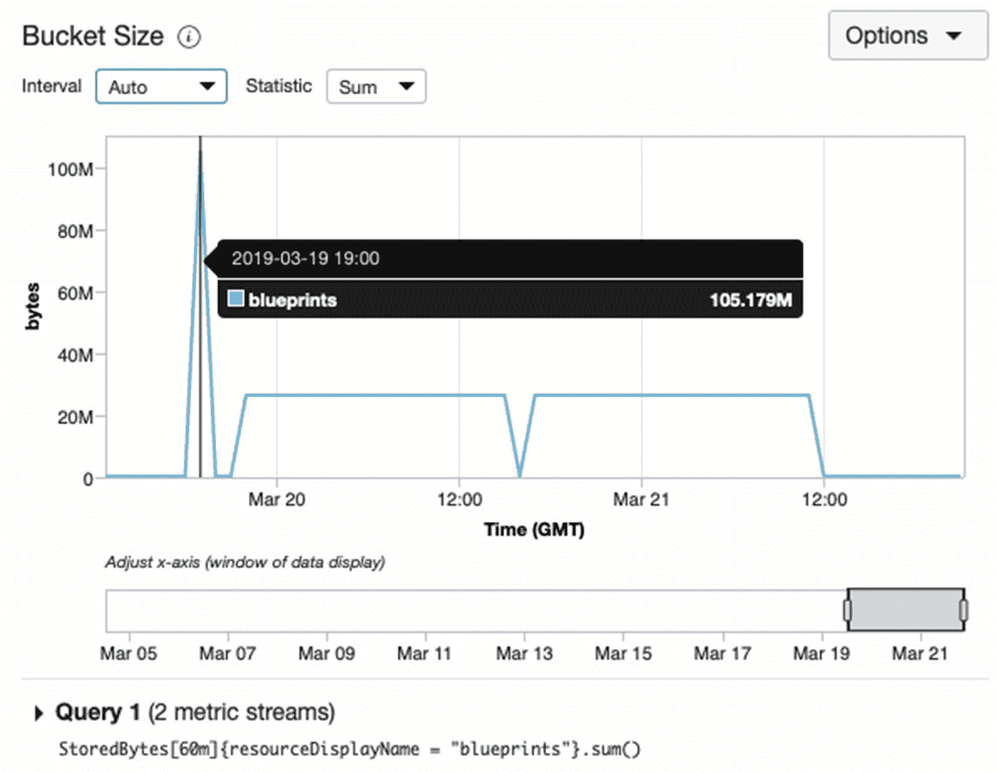

图 5-15
查看对象存储指标

> **注意**
> 在详细图表的底部，您将看到用于生成显示结果的查询。Oracle Cloud Infrastructure 使用监控查询语言（MQL），可用于创建自定义图表。

### 公共访问

有时，您可能决定将选定的存储桶设置为允许匿名只读访问，以便向公众提供内容。在构建依赖于公共内容的边缘解决方案（例如移动应用程序）时，此方法可能很有用。例如，您可以将选定的图像、视频和文章存储在允许所有人下载这些对象的存储桶中。在这种情况下，您可以简单地使用 *公共存储桶*。使用 CLI 时，您可以使用 `--public-access-type` 选项来定义存储桶是私有还是公共。默认值 `NoPublicAccess` 会创建私有存储桶。公共存储桶可以有两种访问模式。

*   `ObjectRead`
*   `ObjectReadWithoutList`

两者都将允许未经身份验证的用户对对象进行只读访问。唯一的区别是 `ObjectReadWithoutList` 会为未经身份验证的用户禁用对象列表功能。这有助于仅向持有确切链接的用户提供对象，并避免您的内容被爬取，尤其是在您使用难以或无法猜测的对象名称时。技术上可以在公共和私有之间来回更改公共访问类型，但这不被视为最佳实践。

如果您有一个包含大量对象的存储桶，并且您发现自己处于希望暂时允许对其中一个对象进行未经身份验证的读写访问的情况，该怎么办？在此类及其他场景中，您可能会发现 *预身份验证请求* 很有用。预身份验证请求带有一个动态生成的唯一 URL，该 URL 在定义的时间段内保持有效。任何持有该 URL 的人都可以在预身份验证请求允许的范围内使用对象存储。如果您为特定对象创建预身份验证请求，可以从三种访问类型中选择。

*   `ObjectRead`
*   `ObjectWrite`
*   `ObjectReadWrite`

这些 URL 几乎无法猜测。只要您的分发渠道安全，并且您信任边缘的应用程序，您可以考虑构建一个依赖于预身份验证请求的解决方案，供那些既不使用实例主体也不使用经过身份验证的用户的应用程序访问对象。以下是使用 CLI 为 blueprints 存储桶中的一个 PDF 文件创建预身份验证请求的方法：

```bash
$ date +"%Y-%m-%d"
2019-09-29
$ ONE_WEEK_LATER="2019-10-06"
$ MIDNIGHT="T00:00:00.000Z"
$ oci os preauth-request create -bn blueprints --name waw-bemowo-105-par --access-type ObjectRead --time-expires "$ONE_WEEK_LATER$MIDNIGHT" -on waw/bemowo/105.pdf --profile SANDBOX-ADMIN
{
"data": {
"access-type": "ObjectRead",
"access-uri": "/p/n0218vRTg4FW5d1t1nV-uMPp471HFIxNccISzFiU2Qg/n/jakobczyk/b/blueprints/o/waw/bemowo/105.pdf",
"id": "tk/aQTCjIGsF1EJ1SsMAMVOwPNW4RErVneNfLjR5LN8=:waw/bemowo/105.pdf",
"name": "waw-bemowo-105-par",
"object-name": "waw/bemowo/105.pdf",
"time-created": "2019-09-29T23:16:20.599000+00:00",
"time-expires": "2019-10-06T00:00:00+00:00"
}
}
```

无论预身份验证请求是通过 OCI 控制台还是使用 CLI 创建的，您都只会看到生成的访问 URI 一次，因此请确保您或您的应用程序代码已读取它。如果您错过了此操作，预身份验证请求将变得无用。`--time-expires` 选项间接定义了访问 URI 保持活动状态的时间窗口。无法延长或缩短此时间段，但您可以自由删除现有请求并为同一对象创建新的预身份验证请求以更改过期时间。由于这些原因，在构建严重依赖预身份验证请求的解决方案之前，请确保您能够实现可靠的通知和分发渠道，以便向应用程序提供最新的预身份验证请求。

要使用访问 URI，您需要通过在前面加上特定于区域的基础 URL 来丰富 `data.access-uri` 字段中返回的值，如以下代码片段所示：

```bash
https://objectstorage.eu-frankfurt-1.oraclecloud.com/p/n0218vRTg4FW5d1t1nV-uMPp471HFIxNccISzFiU2Qg/n/jakobczyk/b/blueprints/o/waw/bemowo/105.pdf
```

您可以尝试在 Web 浏览器中打开该链接。不要忘记使用您自己的链接而不是显示的链接。PDF 文件（更准确地说，是本章中模拟 PDF 文件的随机二进制文件）将被下载到您的本地计算机，即使您未以任何方式进行身份验证。

您可以使用 OCI 控制台（如图 5-16 所示）或 CLI 来列出现有的预身份验证请求，或在需要时在达到过期时间之前删除其中一些。

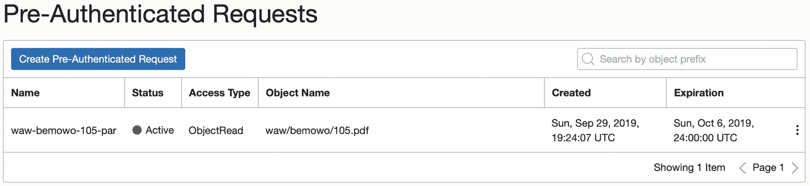

图 5-16
在 OCI 控制台中查看活动的预身份验证请求

也可以为存储桶创建预身份验证请求。在这种情况下，唯一允许的访问类型是 `AnyObjectWrite`，这实际上可以让 URL 持有者管理该存储桶内的所有对象。

## 清理

我们将不再需要本章练习中创建的对象存储资源。您可以删除它们。但有一个例外。不要删除 IAM 策略。我们稍后将需要它们。

以下是使用 OCI CLI 删除预身份验证请求、对象和 `blueprints` 存储桶的方法：

```bash
$ OS_PARID=`oci os preauth-request list -bn blueprints --query "data[?name=='waw-bemowo-105-par'] | [0].id" --raw-output`
$ oci os preauth-request delete -bn blueprints --par-id $OS_PARID
Are you sure you want to delete this resource? [y/N]: y
$ oci os object bulk-delete -bn blueprints
WARNING: This command will delete 16 objects. Are you sure you want to continue? [y/N]: y
$ oci os bucket delete -bn blueprints
Are you sure you want to delete this resource? [y/N]: y
```

删除对象将停止其占用存储空间的计费费用。


## 小结

本章主要探讨了对象存储。首先，我们介绍了对象的概念以及它们如何被组织到存储桶中。随后，你学习了使用命令行界面（CLI）进行一些基本的对象操作技巧。接着，我们讨论了对象名称前缀的重要性，并通过基于 CLI 的示例演示了如何正确使用它们。此外，我描述了 CLI 自带的批量命令，并展示了如何使用对象存储 API 来分页列出对象，从而以安全的方式处理大量对象。我们还涉及了并发更新的方面以及 ETags 在此上下文中的作用。本章很大一部分内容致力于对象存储的编程。你学习了如何使用 OCI Python SDK 来处理多段上传，并让应用程序以实例主体（instance principals）的身份进行认证。你也能够熟悉定义标签（defined tags）的概念，并在动态组的匹配规则中使用它们。最后，我简要介绍了允许匿名用户访问对象的方法，无论是通过公共存储桶还是通过预认证请求。在下一章中，我们将探讨一些基本模式，这些模式你将应用于甲骨文云基础设施中的计算和网络云资源。

# 6. 计算与网络的模式

信息技术实践非常重视可重用性这一概念，它不仅限于软件库、模块或服务，还常常以架构模式的形式体现。在本章中，我将引导你了解一些基本的云基础设施模式，这些模式旨在帮助解决你在设计云解决方案时经常遇到的标准问题。本章旨在围绕实践练习进行松散的讨论，并非一个全面的架构模式目录。

如果你回顾第 2 章以及其中关于在甲骨文云中规划云基础设施的内容，就会清楚地认识到，设计云基础设施始于准备适当的 compartment（ compartment）层次结构并勾勒虚拟网络。在第 4 章，我描述了与 compartment 使用相关的各个方面。现在，我们将着眼于虚拟云网络。

## 虚拟网络

虚拟云网络是一个软件定义的网络，用于组织和提供计算实例之间的连接。它具有区域范围，这意味着你在一个特定的甲骨文云区域中创建每个 `VCN`。一个孤立的 `VCN` 是无用的，除非你将其划分为子网。无论是 `VCN` 还是其子网，在概念上都接近于采用 IP 寻址和地址范围划分的传统网络。如果你已经跟随了前面的章节，那么你已经获得了一些与 `VCN` 相关资源的实践经验。此外，你可能清楚地记得，每个计算实例都必须存在于特定的虚拟云网络上下文中。更准确地说，每个计算实例必须通过一个或多个虚拟网络接口卡（`VNIC`）连接到至少一个子网。一个子网可以绑定到特定的可用性域，也可以跨越整个区域内的所有可用性域。第一种类型被称为特定可用性域（AD-specific）子网，而后者被称为区域子网。图 6-1 展示了这两种子网类型。


图 6-1：区域子网和特定可用性域子网

特定子网的区域范围通常被视为更灵活，因为它允许在不同的可用性域中创建计算实例，同时让它们连接到完全相同的子网。为什么我们有时需要使用特定可用性域子网而不是区域子网呢？最初，子网总是必须在特定的可用性域内创建。换句话说，在开始时，只有特定可用性域子网是可能的，这使得在设计依赖多个 `AD` 的高可用性解决方案时，必须使用多个子网。随着区域子网的出现，你可以在大多数情况下坚持使用它们。此外，甲骨文建议尽可能使用区域子网。在需要添加一层控制以确保连接到该子网的所有实例始终在特定 `AD` 中创建的情况下，采用特定可用性域子网是有意义的。


### 私有 IP

一旦新的计算实例启动，其 `VNIC` 就会从所连接子网的 IP 地址范围内获得一个私有 IPv4 地址。这就是 `主私有 IP` 地址。该地址可以由您选择，也可以由 Oracle Cloud 控制平面自动选定。无法移除或更改现有实例上的主私有 IP。其生命周期与计算实例的生命周期严格关联，这意味着主私有 IP 会在实例销毁时终止。私有 IP 地址使您的实例能够与同一 `VCN` 中的其他实例（或您即将了解的其他互连 `VCN` 中的实例）通信，如图 6-2 所示。此外，如果已配置 `FastConnect` 或 `VPN`，它也可选择性地用于与本地网络中的机器进行数据交换。

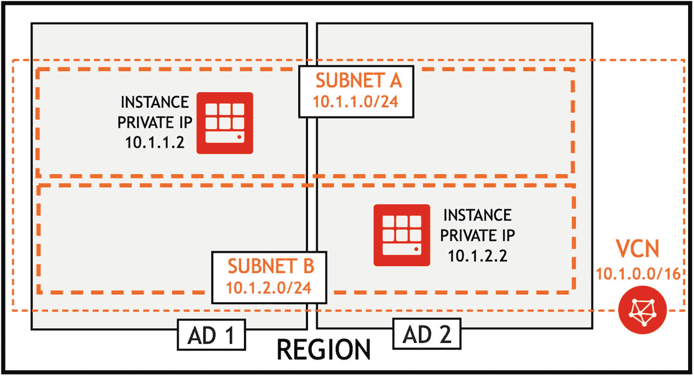

图 6-2 私有 IP

既然有“主” `VNIC` 的概念，那就必然存在“辅助” `VNIC` 的概念；否则，这个名字就说不通了，对吧？确实，可以在单个实例上创建 `辅助 VNIC`。如果您的意图是将实例连接到多个子网，这实际上是一种可行的方法。图 6-3 显示了一个计算实例的 `VNIC` 列表。在此情况下，每个 `VNIC` 都连接到不同的子网。添加辅助 `VNIC` 只是提供多子网连接的第一步。根据实例的形态和镜像，您仍需在操作系统内配置新的网络接口。

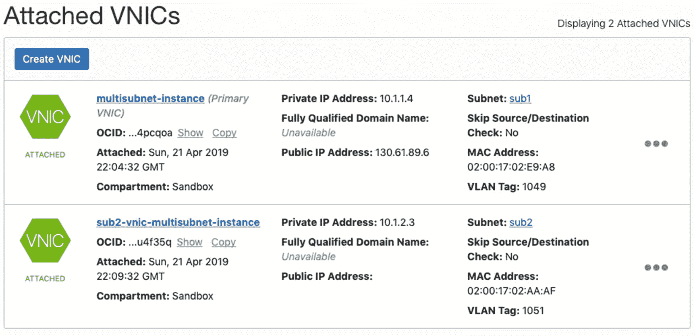

图 6-3 主用和辅助 VNIC

从管理角度来看，`VNIC` 和私有 IP 是常规的云资源，就像计算实例一样。这意味着它们通过专用的 API 端点路径进行控制，因此可以在其依赖关系允许的范围内进行单独管理。我说的“依赖关系”是什么意思？例如，无法单独配置一个未连接的 `VNIC` 云资源。它必须始终存在于某个计算实例的上下文中。如果您正在创建辅助 `VNIC`，`AttachVnic` API 确实需要提供一个计算实例 `OCID`。

我们刚刚了解到，每个 `VNIC` 云资源都会创建一个主私有 IP。它无法被移除，并且始终与其父 `VNIC` 一起被删除。有时，您需要更大的灵活性。想象一下，您希望实现一个浮动 IP 架构以实现高可用性。浮动 IP 是一个可以移动（从一个计算实例转移到另一个计算实例）的 IP 地址，从而实现主动-被动高可用性。如果当前的私有 IP 持有者突然发生故障，被动实例（也称为 `备用` 实例）将接管该浮动 IP，从而保障服务连续性。要实现这样的场景，您需要依赖 `辅助私有 IP` 云资源，并结合集群引擎软件（如 `Heartbeat` 或 `Corosync`）以及集群资源管理器（如 `Pacemaker`）。辅助私有 IP 可以添加到任何类型的 `VNIC`（包括主用和辅助）。将多个私有 IP 附加到现有 `VNIC` 的另一个用例是，在单个计算实例上运行多个服务。有时，您可能会发现将每个服务绑定到单独的私有 IP 很有用。图 6-4 显示了附加到单个 `VNIC` 的两个私有 IP 资源。

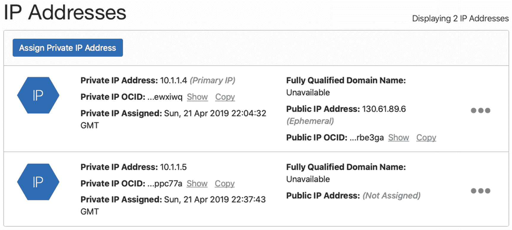

图 6-4 主用和辅助私有 IP 地址

注意：在大多数情况下，您使用的计算实例将仅配备一个 `VNIC` 和一个私有 IP。

### 公共 IP

计算实例可以，但并非必须，持有一个公共 IP 地址。如果您将 Oracle Cloud 用作计算能力扩展或托管数据库提供商，可以通过 `FastConnect` 或 `VPN` 将其安全地连接到您的本地网络。在这种情况下，通常甚至不希望云实例建立到互联网的直接连接。在这种情况下，您从私有的本地网络内部访问这些计算实例，而实例则从某种私有的构件存储库下载更新和新软件，该存储库存储各种类型的软件，例如 `RPM` 包、`npm` 和 `Maven` 库、`Docker` 镜像，甚至 `Helm` 图表。然而，如今，越来越多的新创企业纯粹在云端运行。对于它们而言，至少对于一部分计算实例来说，访问互联网是必不可少的。

让我们考虑一个独立计算实例的最简单场景。该场景假定一个给定的实例拥有自己的互联网标识，即一个公共 IP 地址。实例需要公共 IP 地址通常有三个主要原因：
*   它托管一个公开 Web 服务的应用程序。
*   其操作系统需要下载更新或附加软件。
*   您希望建立 `SSH` 连接以访问终端。

公共 IP 地址只能分配给那些附加到 `公共子网` 的计算实例。您在创建子网时选择它是公共的还是私有的。在 `OCI 控制台` 中，这个选择非常简单。您只需勾选正确的复选框。您已经在第 2 章的学习中实践过这一点。另一方面，当使用 `API`、`SDK` 或 `CLI` 时，您通过 `prohibitPublicIpOnVnic` 元素（`API`）、`prohibit_public_ip_on_vnic` 键（`Terraform`）或 `--prohibit-public-ip-on-vnic` 选项（`CLI`）的值间接设置特定子网的公共或私有属性。如果您学习过第 3 章，您已经使用过它一次。总而言之，私有子网始终禁止所连接的实例在其连接到该私有子网的 `VNIC` 上拥有公共 IP。

在一个简单的场景中，要访问互联网，除了实例上附加的公共 IP 外，还必须满足另外三个条件：
*   `VCN` 包含一个活跃的互联网网关 (`IGW`)。
*   一条路由规则将出站流量指向该 `IGW`。
*   安全规则允许特定类型的入站和出站流量。

在前面的章节中，您已经有多次机会在 `控制台` 中以及使用 `CLI` 和 `Terraform` 来操作这些资源。

公共 IP 地址实际上是如何附加到实例上的呢？从管理角度来看，公共 IP 云资源始终与一个私有 IP 云资源相关联。对于大多数用例，这都是在后台完成的，您甚至不需要对此做任何特别的事情。因为公共 IPv4 地址数量有限，Oracle Cloud 使用公共 IP 地址池。默认情况下，新创建的实例会从 Oracle Cloud 地址池中获得一个可用的公共 IPv4 地址，如图 6-5 所示。实例终止后，该地址会返回池中，将来可能被其他客户重复使用。这被称为 `临时公共 IP`。其生命周期与特定的计算实例严格绑定。

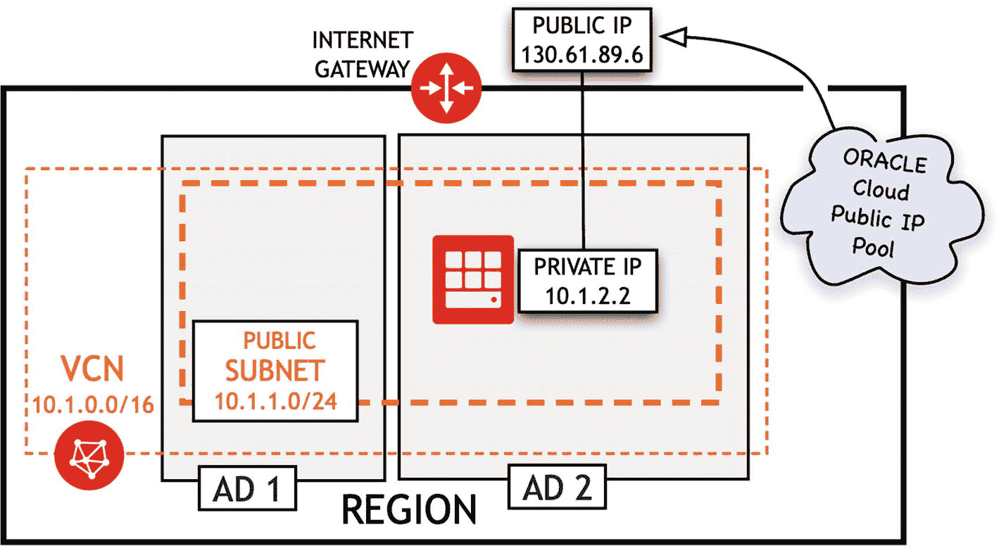

图 6-5 面向互联网的计算实例


出于开发目的，依赖动态分配且在一定程度上随机的公共 IPv4 地址似乎没问题。但如果考虑生产系统，你确实会从获得更多对公共 IP 地址的控制权中受益。为此，你可以使用**预留公网 IP**。它们的生命周期完全独立于任何其他云资源。此外，你可以将它们附加到正在运行的计算实例上，也可以从其上分离。与临时公网 IP 不同，预留公网 IP 即使在你某个时间点不需要它时，也可以保持未分配状态。以下是如何使用 OCI 控制台预留一个新的预留公网 IP：

1.  转到菜单 ➤ 网络 ➤ 公共 IP。
2.  确保选择了 `Sandbox` 隔间。
3.  点击 创建预留公网 IP。
4.  提供一个新的显示名称，例如 `my-ip`。
5.  点击 创建。

从现在起，一个新预留的公网 IP 就准备就绪，可以分配给你选择的计算实例了。

注意：本书中的代码片段已在 macOS 和 Windows Subsystem for Linux 上测试过。此外，所有命令应在主流 Linux 发行版上运行。如果你使用 Windows 且不想使用 Windows Subsystem for Linux，你随时可以在虚拟机上运行 Linux。而且，大多数代码片段也可能在 Windows 的 Git Bash 中运行。请务必按照第 3 章所述设置 CLI 和 Terraform，并按照第 4 章所述设置 IAM。

和往常一样，你可以使用 `oci network public-ip create` CLI 命令来执行相同的操作。

```
$ oci network public-ip create --lifetime RESERVED --display-name another-ip --profile SANDBOX-ADMIN
{
"data": {
"assigned-entity-id": null,
"assigned-entity-type": null,
"availability-domain": null,
"compartment-id": "ocid1.compartment.oc1..aa.........gzwhsa",
"defined-tags": {},
"display-name": "another-ip",
"freeform-tags": {},
"id": "ocid1.publicip.oc1.eu-frankfurt-1.aa.........mkawlq",
"ip-address": "130.61.68.218",
"lifecycle-state": "AVAILABLE",
"lifetime": "RESERVED",
"private-ip-id": null,
"scope": "REGION",
"time-created": "2019-04-22T16:50:41.982000+00:00"
},
"etag": "34e061ab"
}
```

如果你阅读了前一章，你就知道我们已经准备并正在使用 `SANDBOX-ADMIN` 配置文件，以 `sandbox-admin` 用户身份执行 CLI 命令。`--lifetime RESERVED` 参数用于告知 API 我们想要创建一个新的预留公网 IP。图 6-6 展示了 OCI 控制台中的两个新的预留公网 IP 地址。

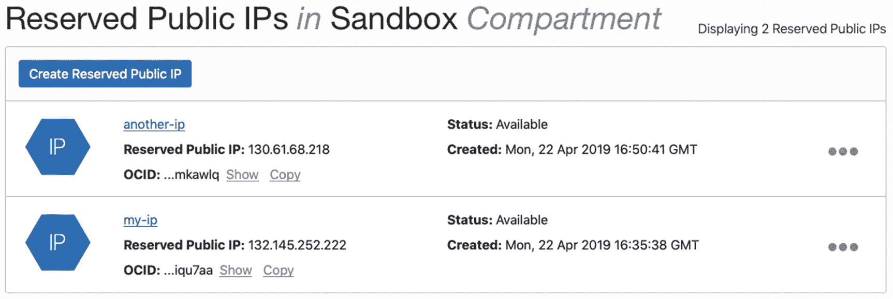  
*图 6-6：在 OCI 控制台中查看预留公网 IP*

要使用 CLI 列出预留公网 IP，你必须使用 `oci network public-ip list` 命令，如下所示：

```
$ oci network public-ip list --lifetime RESERVED --scope REGION --query 'data[*].{IP:"ip-address",Name:"display-name",State:"lifecycle-state"}' --output table --all --profile SANDBOX-ADMIN
+-----------------+------------+-----------+
| IP              | Name       | State     |
+-----------------+------------+-----------+
| 130.61.68.218   | another-ip | AVAILABLE |
| 132.145.252.222 | my-ip      | AVAILABLE |
+-----------------+------------+-----------+
```

在前面的例子中，我使用了 JMESPath 过滤器和表格输出来提高响应的清晰度。要了解更多相关信息，请参考前面的章节。

我们现在将使用 CLI 来释放这两个预留公网 IP，因为在我们的练习中，我们将使用临时公网 IP。你可以使用以下 CLI 命令来终止每个预留公网 IP 云资源：

```
$ RESERVED_IP_NAME="my-ip"
$ QUERY="data[?\"display-name\" == '$RESERVED_IP_NAME'].id | [0]"
$ RESERVED_IP_OCID=`oci network public-ip list --scope REGION --lifetime RESERVED --query "$QUERY" --all --profile SANDBOX-ADMIN | tr -d '"'`
$ echo $RESERVED_IP_OCID
ocid1.publicip.oc1.eu-frankfurt-1.aa.........6glghq
$ oci network public-ip delete --public-ip-id $RESERVED_IP_OCID --force --profile SANDBOX-ADMIN
```

请调整 `QUERY` 变量，在 JMESPath 过滤器中使用 `another-ip` 代替 `my-ip`，并重复前面的步骤来释放第二个预留公网 IP 资源。

提示：尽可能少使用预留公网 IP，并且主要用于生产目的。对于开发和测试，如果可能，请坚持使用临时公网 IP。这将简化你的基础设施代码。

除了计算实例之外，还有其他类型的云资源可以使用公共 IP 地址，包括公共负载均衡器和 NAT 网关。当你配置一个公共负载均衡器时，一个新的预留公网 IP 地址会自动添加到你的账户中。你可以按照上一段所述在 OCI 控制台中看到它。然而，你无法将其从负载均衡器上分离。其生命周期与负载均衡器绑定，这意味着随新配置的公共负载均衡器一起出现的预留公网 IP 地址，将在负载均衡器被终止时立即被删除。NAT 网关使用临时公共 IP 地址。我们将在下一节讨论这种类型的网关。

我们提到过，公有子网允许你为计算实例分配公网 IP，而私有子网则不允许。这条简单的规则在设计和治理你的云基础设施时大有帮助，因为你可以确信连接到私有子网的所有计算实例永远不会使用公网 IP。这样一来，一个可能的入侵路径就被关闭了。


### 私有子网、堡垒机与 NAT 网关

私有子网通过设计将计算实例与公共互联网隔离。实例无法使用公共 IP 这一事实，使其在一定程度上对外部世界不可见。之前，我提到了实例需要公共 IP 的三个基本原因：

*   它托管一个暴露公共 Web 服务的应用程序。
*   其操作系统需要下载更新或额外的软件。
*   您希望通过 SSH 连接访问终端。

事实上，即使特定实例在隔离的私有子网中运行且没有公共 IP，也可以解决所有这三个问题。为此，我们将应用一种云基础设施模式，该模式采用一个`bastion host`（堡垒主机）和一个`NAT gateway`（NAT 网关）。让我们考虑托管在计算实例上的应用程序的两个目标：

*   运行隔离的工作负载
*   暴露 Web 服务

执行*隔离工作负载*的应用程序可能会对对象存储或托管数据库中的数据运行定期批处理作业。其他更令人兴奋的例子是高性能计算（HCP）任务，例如 3D 渲染、流体动力学或生物模拟。部署这些应用程序的主机很少暴露公共 Web 服务。相反，它们可以被视为隔离的后端系统。然而，有时您仍然希望通过 SSH 访问此实例以执行一些内务管理任务。这就成了`bastion host`的任务，它是在公共子网中配置的专用实例，拥有一个公共 IP。要访问私有子网中的实例，您只需通过堡垒主机隧道化您的 SSH 连接。

下一个方面是来自隔离实例的出站连接。操作系统和应用程序至少必须能够下载更新。如果您的私有网络内没有带有适当镜像的私有构件注册表，您可能需要让这些主机访问互联网上的公共仓库。在您的 VCN 中，您部署一个`NAT gateway`并将出站流量重定向到它。该网关的公共 IP 成为从互联网看到的、将其出站流量发送到该网关的私有子网中运行的隔离实例的源 IP 地址。除了与出站流量相关的响应外，NAT 网关不允许任何其他入站流量进入您的 VCN。简单而安全。图 6-7 展示了一个简化的基础设施，用于前面描述的隔离工作负载用例。

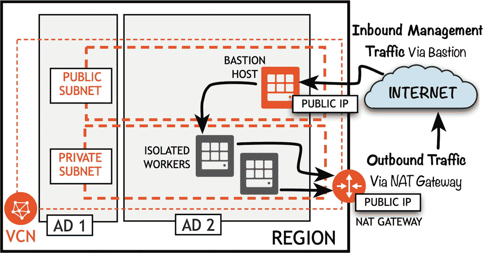

图 6-7 隔离工作负载基础设施

显然，暴露公共 Web 服务的应用程序必须能够从公共互联网访问。对于它们的情况，您通常部署一个高可用的负载均衡器来面对互联网，并将流量均匀地分布到应用程序主机，这些主机在一个或多个后端集中组合在一起。通过这种方式，可以将后端集主机放置在私有子网中，减少不必要的暴露和公共 IP 地址消耗。为了支持远程管理和访问更新，我们依赖堡垒主机和 NAT 网关。图 6-8 展示了前面描述的这个用例。

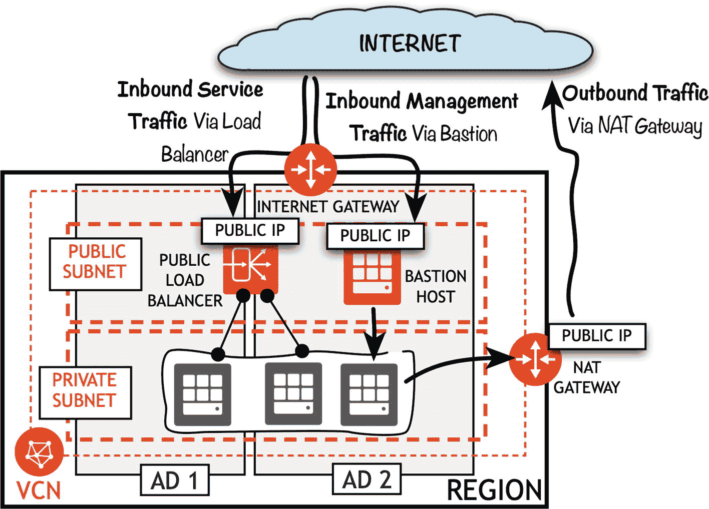

图 6-8 公共 Web 服务基础设施

我们现在将配置一个简化的基础设施来支持隔离工作负载用例。在私有子网中，我们将启动一个基于 CentOS 的实例，配备两个 OCPUs。这将是我们没有互联网身份、因此也没有公共 IP 地址的工作节点。为了通过 SSH 访问工作节点，我们将在公共子网中启动另一个性能较低的实例。这个实例被称为`bastion host`，它将持有一个公共 IP 地址，使我们能够从互联网访问它。这样，我们就能够隧道化 SSH 连接并访问工作节点终端。最后，一个`NAT gateway`将允许工作节点访问互联网。目标基础设施如图 6-9 所示。

> **警告**
> 在开始本章涵盖的实践练习之前，您必须确保您的服务限制允许您在您工作区域的每个 AD 中至少启动一个`VM.Standard2.2`形状的实例。在 OCI 控制台中，转到菜单 ➤ 治理 ➤ 限制、配额和使用情况，并搜索`VM.Standard2.2`。如果限制设置为 0，请单击“请求增加服务限制”，相应地填写表格并提交。

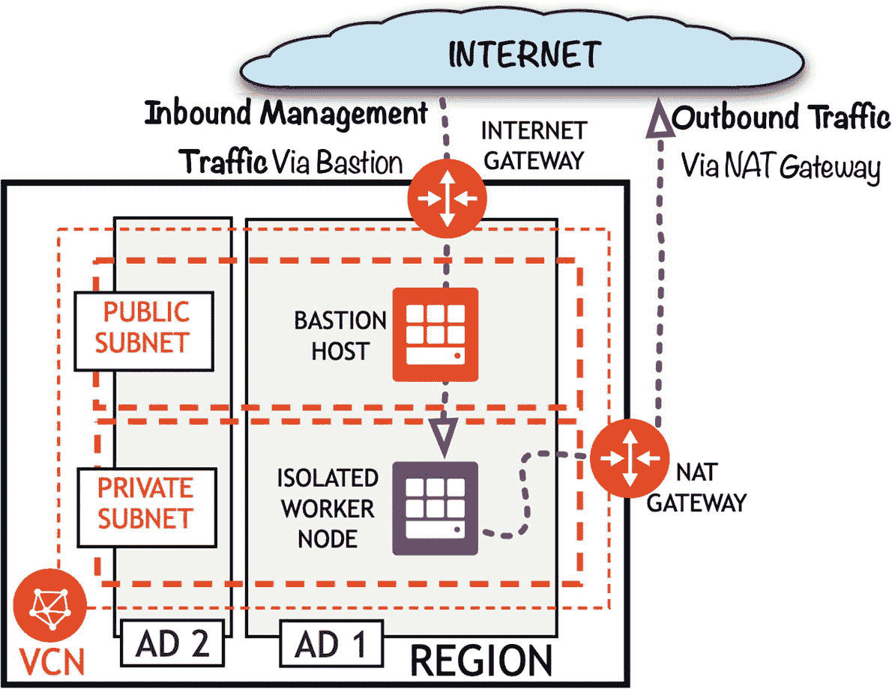

图 6-9 隔离的工作节点、堡垒主机和 NAT 网关

基础设施代码在很大程度上与我们已经部署过几次的代码相同。您应该熟悉许多元素。不过，也有一些新东西。转到`chapter06/1-bastion-nat`目录。基础设施代码假设 SSH 公钥位于`~/.ssh/oci_id_rsa.pub`路径。您还需要相应的私钥来远程访问已配置的计算实例。在基础设施子文件夹中，运行`terraform init`命令以下载最新的 OCI 插件，并执行`terraform apply`命令来配置基础设施。

```
$ source ~/tfvars.env.sh
$ cd ~/git
$ cd oci-book/chapter06/1-bastion-nat/infrastructure/
$ find . -name "*.tf"
./modules.tf
./bastion/compute.tf
./bastion/vcn.tf
./bastion/vars.tf
./vcn.tf
./workers/compute.tf
./workers/vcn.tf
./workers/vars.tf
./provider.tf
./vars.tf
$ terraform init
Initializing modules...
- module.bastion
Getting source "bastion"
- module.workers
Getting source "workers"
Initializing provider plugins...
- Checking for available provider plugins on https://releases.hashicorp.com...
- Downloading plugin for provider "oci" (3.45.0)...
* provider.oci: version = "~> 3.45"
Terraform has been successfully initialized!
$ terraform apply -auto-approve
Apply complete! Resources: 11 added, 0 changed, 0 destroyed.
Outputs:
bastion_public_ip = 130.61.53.185
worker_public_ip = 10.0.1.130
image_name = CentOS-7-2019.04.15-0
$ BASTION_PUBLIC_IP=`terraform output bastion_public_ip`
```

等待看到分配给您新配置的堡垒主机的公共 IP，该主机已部署在公共子网中。这次，在我的例子中是`130.61.53.185`。您现在应该在 OCI 控制台中看到两个新实例，如图 6-10 所示：一个在公共子网中的堡垒主机实例和一个在私有子网中的工作节点。

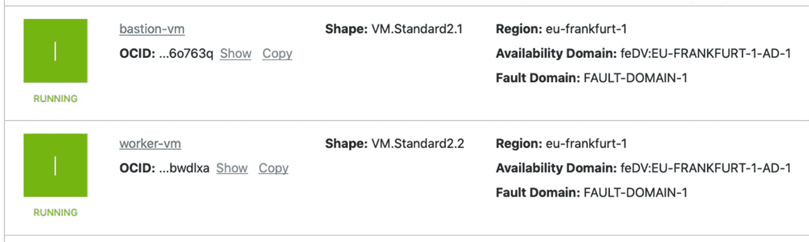

图 6-10 在 OCI 控制台中查看堡垒和工作实例

您可能需要等待几秒钟，直到`sshd`守护进程开始接受连接。让我们通过堡垒主机连接到工作节点。

如果您在 Windows 上工作，无论是使用适用于 Linux 的 Windows 子系统还是使用 GitBash，您可能需要先启动`ssh-agent`。

```
$ eval `ssh-agent -s`
Agent pid 290
```

现在，您应该可以通过公共子网中的堡垒主机连接到私有子网中的工作节点了。


## 通过堡垒主机访问工作节点

```
$ ssh-add ~/.ssh/oci_id_rsa
Identity added: /Users/mjk/.ssh/oci_id_rsa
$ ssh -J opc@$BASTION_PUBLIC_IP opc@10.0.1.130
[opc@worker-vm ~]$
```

为了访问工作节点的终端，我们将私钥添加到了认证代理，并使用 `-J` 选项执行 `ssh` 命令，以利用 SSH ProxyJump 技术。为了验证私有子网中的实例是否确实能够访问互联网，我们将尝试 ping 一个 Google 的公共 DNS 服务器。

```
[opc@worker-vm ~]$ ping -c 3 8.8.8.8
PING 8.8.8.8 (8.8.8.8) 56(84) bytes of data.
64 bytes from 8.8.8.8: icmp_seq=1 ttl=123 time=24.0 ms
64 bytes from 8.8.8.8: icmp_seq=2 ttl=123 time=0.417 ms
64 bytes from 8.8.8.8: icmp_seq=3 ttl=123 time=0.377 ms
--- 8.8.8.8 ping statistics ---
3 packets transmitted, 3 received, 0% packet loss, time 2001ms
rtt min/avg/max/mdev = 0.377/8.294/24.088/11.168 ms
[opc@worker-vm ~]$ exit
$
```

可以看到，尽管工作节点实例没有公共 IP，但它既可以通过堡垒主机通过 SSH 访问，也可以通过 NAT 网关访问互联网。

## 虚拟云网络与网关资源概述

现在，让我们从本节的角度，简要了解一下基础设施代码中那些最有趣的资源。清单 6-1 展示了 `vcn.tf` 文件，我们在其中定义了虚拟云网络（VCN）、Internet 网关和 NAT 网关。

```
resource "oci_core_virtual_network" "vcn" {
  compartment_id = var.compartment_ocid
  cidr_block     = var.vcn_cidr
  display_name   = "bastionnat-vcn"
  dns_label      = "a"
}

resource "oci_core_internet_gateway" "igw" {
  compartment_id = var.compartment_ocid
  vcn_id         = oci_core_virtual_network.vcn.id
  display_name   = "internet-gateway"
}

resource "oci_core_nat_gateway" "natgw" {
  compartment_id = var.compartment_ocid
  vcn_id         = oci_core_virtual_network.vcn.id
  display_name   = "nat-gateway"
  block_traffic  = false
}
```
清单 6-1 `vcn.tf` (根模块)

两种类型的网关都在 VCN 内创建。Internet 网关 (`igw`) 实际上为连接到公共子网的实例提供入站和出站连接，这些公共子网的路由表包含一条路由规则，该规则将非 VCN 流量的目标指向 Internet 网关。NAT 网关 (`natgw`) 本质上旨在为私有子网中的实例提供仅出站流量，这些私有子网的路由表包含一条路由规则，该规则将非 VCN 流量的目标指向 NAT 网关。这些角色在图 6-11 中进行了概念性展示。

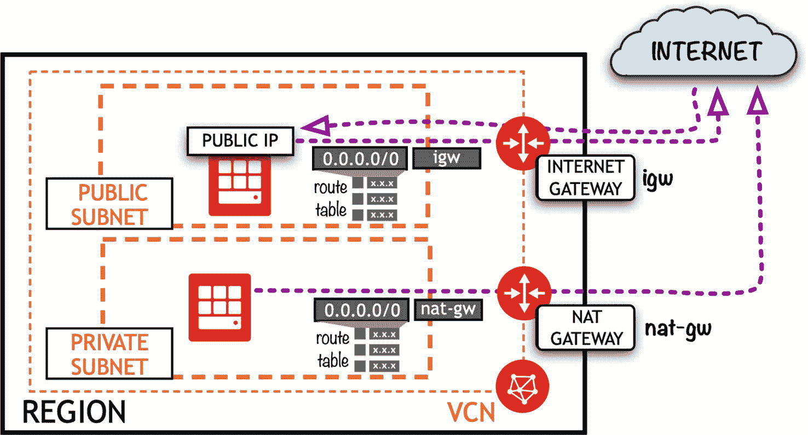
图 6-11 Internet 和 NAT 网关的路由规则

## 模块化代码与变量传递

为了遵循最佳实践，我们在基础设施代码中使用了模块。`bastion` 模块负责创建一个带有专用路由表和安全列表的公共子网，以及启动连接到该公共子网的堡垒主机实例。`workers` 模块创建一个私有子网，连同其专用路由表和安全列表，并启动一个连接到该私有子网的工作节点实例。由于路由规则在每个模块内部创建，我们必须将两个网关的 OCID 作为输入变量传递。清单 6-2 展示了 `modules.tf` 文件的摘录，说明了这是如何完成的。

```
...
module "bastion" {
  source             = "./bastion"
  compartment_ocid   = var.compartment_ocid
  vcn_ocid           = oci_core_virtual_network.vcn.id
  vcn_igw_ocid       = oci_core_internet_gateway.igw.id
  vcn_cidr           = oci_core_virtual_network.vcn.cidr_block
  vcn_subnet_cidr    = "10.0.1.0/27"
  ads                = data.oci_identity_availability_domains.ads.availability_domains[*].name
  image_ocid         = data.oci_core_images.centos_image.images[0].id
}

module "workers" {
  source             = "./workers"
  compartment_ocid   = var.compartment_ocid
  vcn_ocid           = oci_core_virtual_network.vcn.id
  vcn_nat_ocid       = oci_core_nat_gateway.natgw.id
  vcn_cidr           = oci_core_virtual_network.vcn.cidr_block
  vcn_subnet_cidr    = "10.0.1.128/27"
  ads                = data.oci_identity_availability_domains.ads.availability_domains[*].name
  image_ocid         = data.oci_core_images.centos_image.images[0].id
}
...
```
清单 6-2 `modules.tf` (根模块)

在我的例子中，将 Internet 网关的 OCID 传递到 `bastion` 模块的变量称为 `vcn_igw_ocid`。你在第 3 章已经了解到，模块输入变量的名称是任意的。你只需要确保在模块内部正确引用它们。如果你查看 `bastion/vcn.tf` 文件，你会发现 Internet 网关的 OCID 成为了所有非 VCN 流量的目标。清单 6-3 展示了 `bastion/vcn.tf` 文件的相关部分。

```
resource "oci_core_route_table" "bastion_rt" {
  compartment_id = var.compartment_ocid
  vcn_id         = var.vcn_ocid
  route_rules {
    network_entity_id = var.vcn_igw_ocid
    destination_type  = "CIDR_BLOCK"
    destination       = "0.0.0.0/0"
  }
  display_name   = "bastion-rt"
}
```
清单 6-3 `vcn.tf` (Bastion 模块)

类似地，我们使用 `vcn_nat_ocid` 变量来传递 NAT 网关的 OCID，这次是传递到 `workers` 模块。清单 6-4 展示了工作节点所连接的私有子网所使用的路由表的定义。

```
resource "oci_core_route_table" "workers_rt" {
  compartment_id = var.compartment_ocid
  vcn_id         = var.vcn_ocid
  route_rules {
    network_entity_id = var.vcn_nat_ocid
    destination_type  = "CIDR_BLOCK"
    destination       = "0.0.0.0/0"
  }
  display_name   = "workers-rt"
}
```
清单 6-4 `vcn.tf` (Workers 模块)

## 修改与验证 NAT 网关配置

如果你需要临时阻止私有实例到公共互联网的出站流量，你可以仅用一个简单的开关来完成。NAT 网关可以被设置为阻止流量。要测试此功能，请转到根模块中的 `vcn.tf` 文件，并将 `block_traffic` 属性设置为 `true`，如清单 6-5 所示。

```
...
resource "oci_core_nat_gateway" "natgw" {
  compartment_id = var.compartment_ocid
  vcn_id         = oci_core_virtual_network.vcn.id
  display_name   = "nat-gateway"
  block_traffic  = true
}
```
清单 6-5 `vcn.tf` (根模块)

一旦你应用更改，Terraform 将检测到你的 `.tf` 文件所代表的预期状态与它在刷新后的状态文件中找到的内容不同。计算出的计划将执行相关的 API 调用，将 NAT 网关设置为阻止流量。

```
$ terraform apply -auto-approve
...
oci_core_nat_gateway.natgw: Modifying... (ID: ocid1.natgateway.oc1.eu-frankfurt-1.........6n76gq)
block_traffic: "false" => "true"
oci_core_nat_gateway.natgw: Modifications complete after 0s
Apply complete! Resources: 0 added, 1 changed, 0 destroyed.
Outputs:
bastion_public_ip = 130.61.53.185
worker_public_ip = 10.0.1.130
image_name  = CentOS-7-2019.04.15-0
```

你现在可以在 OCI 控制台中验证 NAT 网关是否已被有效禁用。为此，请按照以下步骤操作：
1.  转到菜单 ➤ 网络 ➤ 虚拟云网络。
2.  确保选择了 `Sandbox` 计算域。
3.  点击 VCN 名称 (bastionnat-vcn)。
4.  在“资源”部分，点击 NAT 网关。


## 禁用 NAT 网关后的连通性测试

您应该看到 NAT 网关已变灰，其状态设置为阻止流量，如图 6-12 所示。您看到的 NAT 网关的公共 IP 是一个临时公共 IP。


**图 6-12**

在 OCI 控制台中查看如何禁用 NAT 网关

这次，您应该无法再 ping 通 Google 公共 DNS 服务器。让我们测试一下。通过堡垒主机使用 SSH 连接到工作节点实例，并发出 `ping` 命令。

```bash
$ ssh -J opc@$BASTION_PUBLIC_IP opc@10.0.1.130
...
[opc@worker-vm ~]$ ping -c 5 8.8.8.8
PING 8.8.8.8 (8.8.8.8) 56(84) bytes of data.
--- 8.8.8.8 ping statistics ---
5 packets transmitted, 0 received, 100% packet loss, time 3999ms
[opc@worker-vm ~]$ exit
$
```

这就结束了关于堡垒主机和 NAT 网关的实践练习。您现在可以终止这些基础设施。

```bash
$ terraform destroy -auto-approve
...
Destroy complete! Resources: 11 destroyed.
```

除了我们为每个子网创建的两个路由规则外，还有专用的安全列表。这将是我们基于您刚刚终止的基础设施代码要讨论的最后一个元素。

### 安全规则

安全规则提供了一个额外的虚拟防火墙层，通过明确允许它们所描述的流量来保护计算实例。虚拟云网络默认遵循拒绝所有原则；因此，为了让不同类型的专用流量通过，必须配置适当的安全规则。安全列表和规则已在第 2 章开头简要介绍过。在本书的过程中，每次部署和测试带有计算实例的云基础设施时，您都会用到它们。您已经知道，每个子网必须至少有一个关联的 `security list`（安全列表），它是一组安全规则的集合。`Security rules`（安全规则）总是定义什么是允许的，因此要拒绝特定类型的流量，您只需要确保没有允许它的规则。规则在数据包到达计算实例之前执行。安全规则根据其方向分类为 `ingress`（入站）和 `egress`（出站）。安全规则的无状态性会影响响应流量的处理方式。对于一条 `stateful`（有状态）规则，如果基于出站规则允许了出站流量，则相应的响应数据包会自动被允许。对于一条 `stateless`（无状态）规则，我们仍然需要在相反方向上有一条明确的无状态规则，如图 6-13 所示的概念图。

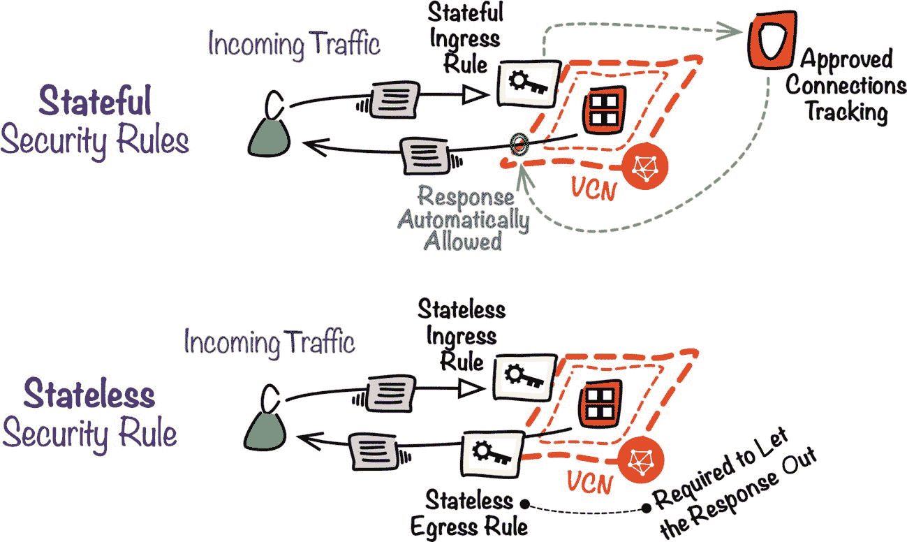

**图 6-13**

无状态和有状态安全规则

Oracle Cloud 必须跟踪有状态规则所允许的连接，以便能够自动允许相应的响应，这不足为奇。这是以轻微延迟增加为代价的。此外，每种实例规格类型都有允许跟踪连接数量的限制。

> **提示**
>
> 尽可能使用无状态规则，以避免有状态规则发生的连接跟踪性能损耗，并避免达到限制。这样，您将避免触及跟踪连接数量的限制。

如果存在两条安全规则，一条无状态和一条有状态，它们对某些特定流量重叠，则无状态规则具有优先权，并且您必须确保有一条相应的无状态规则将允许相关的响应流量。

清单 6-6 展示了来自 `bastion/vcn.tf` 文件的安全列表元素定义。

```hcl
...
resource "oci_core_security_list" "bastion_sl" {
  compartment_id = var.compartment_ocid
  vcn_id         = var.vcn_ocid
  egress_security_rules {
    stateless    = true
    destination  = var.vcn_cidr
    protocol     = "all"
  }
  egress_security_rules {
    stateless    = false
    destination  = "0.0.0.0/0"
    protocol     = "all"
  }
  ingress_security_rules {
    stateless    = true
    source       = var.vcn_cidr
    protocol     = "all"
  }
  ingress_security_rules {
    stateless    = false
    source       = "0.0.0.0/0"
    protocol     = "6"
    tcp_options {
      min = 22
      max = 22
    }
  }
  display_name = "bastion-sl"
}
...
```
**清单 6-6**

vcn.tf（堡垒模块）

`bastion_sl` 安全列表包含一个 *无状态*（`stateless=true`）的 `ingress rule`（入站规则），它允许来自同一 VCN（`source=var.vcn_cidr`，子网所属的 VCN）中实例的 *所有*（`protocol = "all"`）入站流量，以及一个 *无状态 egress rule*（出站规则），类似地，它接受发往同一 VCN（`destination=var.vcn_cidr`，堡垒公共子网所属的 VCN）中任何子网所连接实例的所有出站流量。生成的规则如图 6-14 所示。

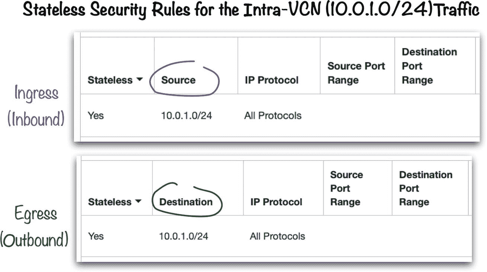

**图 6-14**

用于堡垒子网的 VCN 内部流量无状态规则

为了允许从任何主机（`source="0.0.0.0/0"`）发起的传入 SSH 连接（`protocol="6" tcp_options { min=22 max=22 }`）进行双向通信，安全列表包含一个 *有状态*（`stateless=false`）的 `ingress rule`（入站规则）。最后，堡垒主机本身受益于一个 *有状态 egress rule*（出站规则），该规则允许从实例所连接的公共子网发起的、发送到任何主机（`destination="0.0.0.0/0"`）的任何类型（`protocol = "all"`）的双向数据包交换。生成的规则如图 6-15 所示。

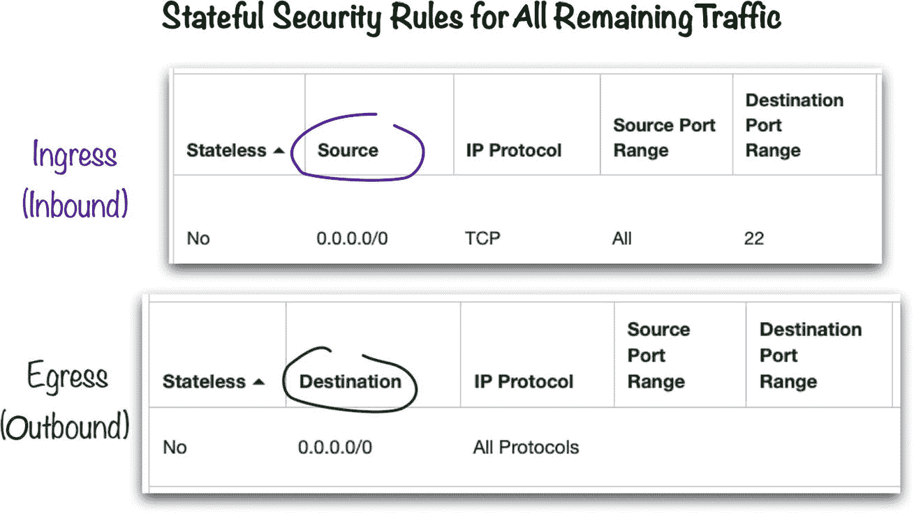

**图 6-15**

用于堡垒子网的有状态规则


### VCN 对等连接

在多个生产系统环境下工作时，通常会产生若干独立的隔离区，用于存放这些生产系统的云资源。VCN 云资源无法跨越多个隔离区，必须创建在某个特定的隔离区内。如果每个生产系统都在其专属的隔离区内进行管理，那么每个系统最终将至少拥有一个 VCN。根据业务需求，迟早你会面临连接其中某些系统的挑战。对于运行在同一云区域内的系统，你可以使用 `本地 VCN 对等连接` 来连接选定的 VCN，让实例在 Oracle Cloud 内使用其私有地址进行通信，如图 6-16 所示。

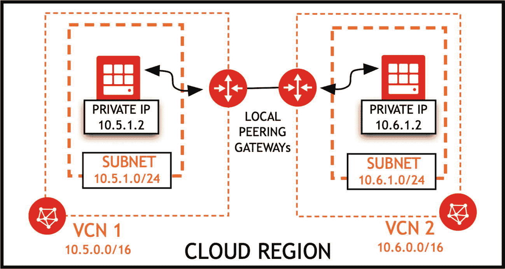

图 6-16 本地 VCN 对等连接

在早期规划阶段就必须考虑的一个重要要求是，两个连接的 VCN 绝不能使用重叠的 IP 地址范围。如果重叠，路由将会失败。要设置本地 VCN 对等连接，你需要执行以下操作：

*   在两个 VCN 中创建 `本地对等网关` (`LPG`)。
*   在 `LPG` 之间建立连接。
*   通过添加新规则来调整路由表，这些规则将指向另一个 VCN 的流量导向 `LPG`。
*   确保安全规则允许进出另一个 VCN 的流量。

本地对等网关只是一个普通的云资源，像你已经使用过的互联网网关或 NAT 网关一样，创建在 VCN 内部。如果你的用户有权管理这两个 VCN，那么创建连接就非常简单。你只需要指向另一个 `LPG`，对等连接状态应显示为成功连接，如图 6-17 所示。

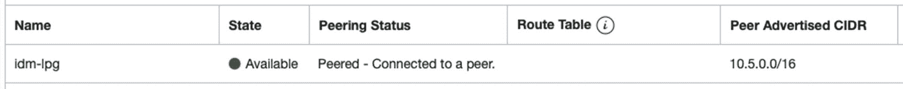

图 6-17 已连接的本地对等网关

然而，在处理生产系统时，存在另一种情况，即另一个 VCN 由其他人管理。在这种情况下，你需要商定由谁来发起连接。如果管理员用户对其自己的隔离区没有完全的访问管理权限，你必须确保请求者所属的组拥有 `manage local-peering-from` 权限。接受者所属的组则需拥有 `managed local-peering-to` 权限。这两种 IAM 策略资源类型 (`local-peering-from` 和 `local-peering-to`) 都属于 `virtual-network-family`。要了解更多关于 IAM 策略的信息，请参阅第 4 章。

一旦 `LPG` 成功连接，VCN 对等连接便建立起来了。现在，你需要调整两个 VCN 中的路由表。基本上，必须在两侧添加新的路由规则，以将目标为另一个 VCN 的流量导向正确的网络实体，即 `LPG`，如图 6-18 所示，其中另一个 VCN 使用 `10.6.0.0/16` 地址范围。

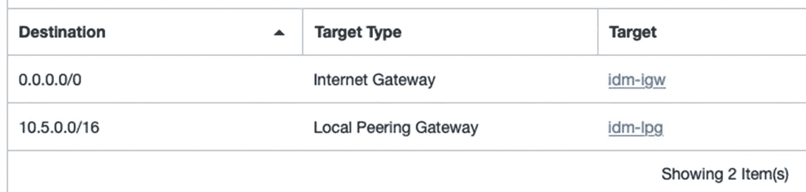

图 6-18 用于本地 VCN 对等连接的路由规则

最后需要添加的是安全规则。这里没有例外。就像你需要为同一 VCN 中的不同子网添加新的安全规则一样，你必须为对等 VCN 中的子网执行相同的操作。请考虑使用无状态规则，以避免与有状态规则相关的不必要连接跟踪。

VCN 对等连接是点对点连接。任何给定的 VCN 最多可以与另外十个 VCN 建立本地对等连接。换句话说，每个 VCN 最多可以有十个 `LPG`，其中每个 `LPG` 代表一个对等的 VCN，如图 6-19 所示。这听起来可扩展性不是很好，对吧？关于对等连接需要记住的另一个重要特点是，一个 VCN 中的实例无法使用对等 VCN 中的互联网网关来访问互联网。

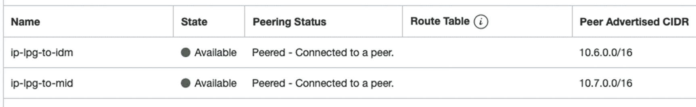

图 6-19 每个对等 VCN 对应一个 LPG

在复杂的应用环境下，你最终可能要么陷入难以管理的本地对等 VCN “面条式”拓扑，要么达到本地对等连接数的上限。为了缓解这些问题，可以考虑两种替代架构。

*   使用一个专门用于云网络的隔离区
*   使用消息传递平台即服务

图 6-20 展示了一个高级架构草图，其中有一个 `专用网络隔离区`，包含一个大型 VCN，该 VCN 又包含多个子网。每个子网专用于一个生产系统。生产系统实例在其各自的隔离区中启动，但同时连接到网络隔离区中的 VCN 子网。这种设置完全消除了对本地 VCN 对等连接的需求，但这个好处的代价可能是 IAM 策略更为复杂，特别是当存在不同的隔离区管理组时。

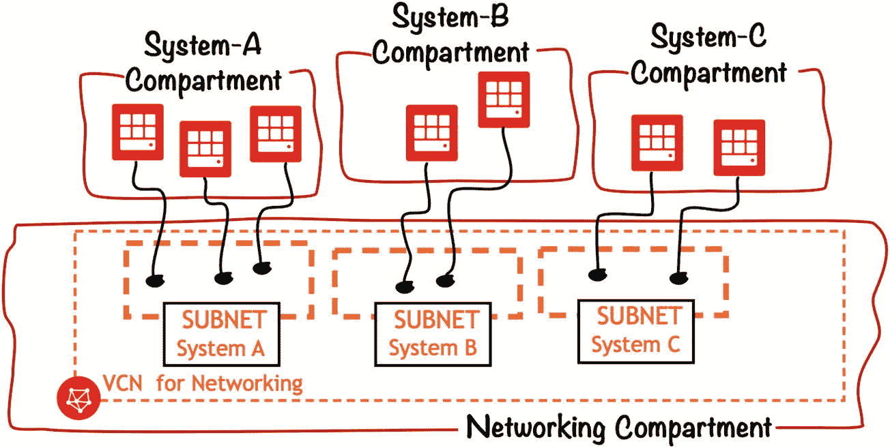

图 6-20 基于专用网络隔离区的架构

对于涉及多个生产系统的复杂应用环境，另一个推荐的方法是使用消息传递平台即服务。生产系统将消息发送到消息传递集群，该集群在底层由多个消息代理组成。如果你选择托管服务，则无需担心集群管理。要了解更多信息，可以探索 Oracle Cloud Infrastructure Streaming，看看它是否符合你的需求。

到目前为止，我们讨论的本地 VCN 对等连接都假设所有连接的 VCN 位于同一云区域内。要连接位于两个不同 Oracle Cloud 区域的 VCN，你需要采用 `远程 VCN 对等连接`。这种技术在某种程度上类似，但涉及另一种称为 `动态路由网关` (`DRG`) 的云资源。在极少数情况下，你甚至可能希望连接到位于不同租户中的 VCN。`跨租户 VCN 对等连接` 也是可行的，但需要在两个租户中授予额外的 IAM 策略。你可以在官方文档中找到更多信息。

至此，我们主要关注的是网络连接。我们讨论了与 IP 地址相关的云资源，应用了堡垒主机和 NAT 网关模式以允许私有工作者安全地与互联网通信，解释了安全规则的类型，并探讨了选定的互连问题。现在，我们将更仔细地研究与计算实例相关的方面。

## 扩展实例

弹性是第 1 章提到的云计算原则之一。我们曾提到，弹性可以通过底层资源的可扩展性来实现。我们还定义了**水平扩展**，即通过添加（或移除）同类集群实例来增加（或减少）集群的整体处理能力。添加更多实例通常被称为**向外扩展**，而从集群中移除实例则被称为**向内扩展**。类似地，我们定义了**垂直扩展**，即通过向上（或向下）调整单个实例的硬件配置来使其更强大（或更弱）。增加更多硬件资源传统上被称为**向上扩展**，而使用更弱的资源则称为**向下扩展**。所有术语均在图 6-21 中说明。


**图 6-21 水平和垂直扩展**

本节将讨论这两种扩展类型，先讲水平扩展，再讲垂直扩展。

### 实例池与自动扩展

水平扩展通常针对同构实例组执行。这些实例中的每一个都使用相同的硬件配置文件和基础软件堆栈。此外，对于成员协作的集群应用程序，实例初始化逻辑应告知每个成员如何找到其他成员并建立正确的连接。为了能够通过启动新实例快速向外扩展，我们需要某种实例模板，这比你在第 2 章中使用的自定义镜像要多。这种实例模板被理解为硬件配置（形状）、基础软件堆栈（镜像）和初始化逻辑（用于 `cloud-init` 的 `cloud-config`）的组合，并附带一些基本的网络详细信息，被称为**实例配置**。基于实例配置调配的实例被分组到一个**实例池**中。然后，你可以为特定池设置预期的实例数量，并观察池是如何通过启动新实例（或终止现有实例）来向外（或向内）扩展的。随着时间的推移，你可以动态调整实例数量，以提供预期的集群处理能力。单个实例配置可用于调配多个实例池。你可以基于现有的计算实例创建实例配置，或者完全从头开始使用 API（通常通过 Terraform 或 CLI）创建。实例配置与实例池之间的关系如图 6-22 所示。

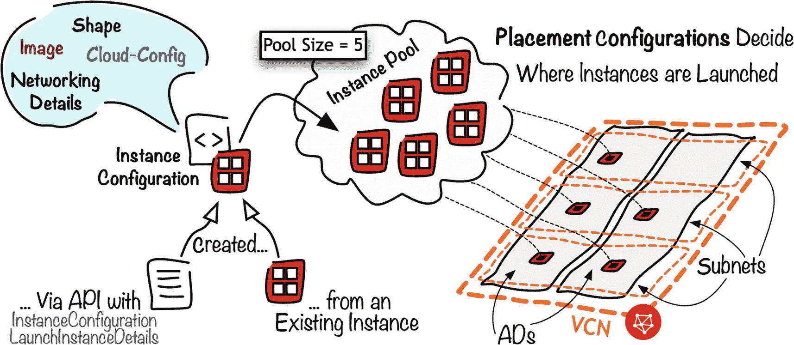

**图 6-22 实例池和实例配置**

我们将通过调配一套完整的云资源来更仔细地研究实例池的工作方式。该池将由在私有子网中启动的、基于自定义实例配置的实例组成。为了为隔离的实例提供适当的互联网连接，我们将采用依赖于主机和 NAT 网关的熟悉模式。实例配置将使用最新的 CentOS 镜像、一个简单的 `cloud-init` 配置（该配置安装并执行名为 `stress-ng` 的压力测试工具）、SSH 公钥以及一些基本的硬件配置文件信息（如形状和 VNIC 详细信息）。图 6-23 展示了我们练习的预期基础设施。

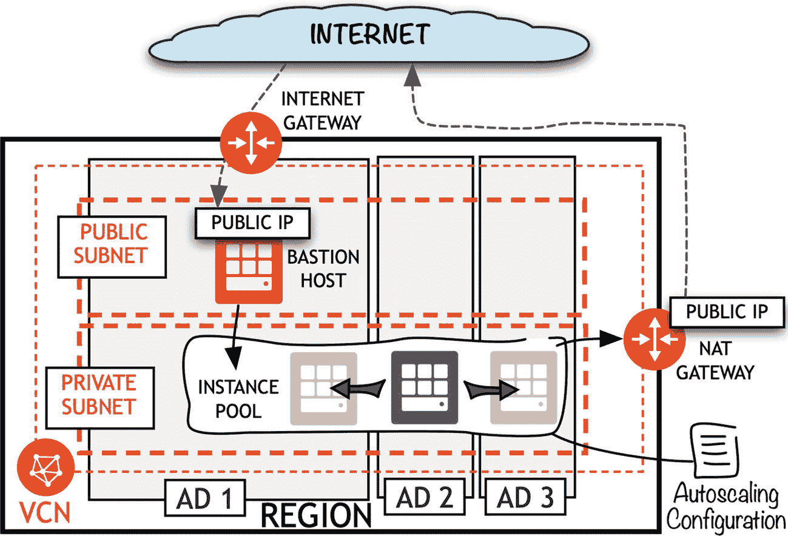

**图 6-23 隔离的实例池基础设施**

这次，我们将使用 `chapter06/2-instance-pool-autoscale` 目录中的代码。和往常一样，我假设第 3 章中描述的 Terraform 所需的所有环境变量都存在。同样适用于位于 `~/.ssh/oci_id_rsa.pub` 路径的 SSH 公钥。让我们开始调配基础设施。

```
$ cd ~/git
$ cd oci-book/chapter06/2-instance-pool-autoscale/infrastructure
$ find . \( -name "*.tf" -o -name "*.yaml" \)
./modules.tf
./bastion/compute.tf
./bastion/vcn.tf
./bastion/vars.tf
./vcn.tf
./workers/compute.tf
./workers/vcn.tf
./workers/cloud-init/worker.config.yaml
./workers/vars.tf
./provider.tf
./vars.tf
$ terraform init
Initializing modules...
- module.bastion
Getting source "bastion"
- module.workers
Getting source "workers"
Initializing provider plugins...
- Checking for available provider plugins on https://releases.hashicorp.com...
- Downloading plugin for provider "oci" (3.30.0)...
* provider.oci: version = "~> 3.30"
Terraform has been successfully initialized!
$ terraform apply -auto-approve
Apply complete! Resources: 13 added, 0 changed, 0 destroyed.
Outputs:
bastion_public_ip = 130.61.122.251
image_name = CentOS-7-2019.04.15-0
$ BASTION_PUBLIC_IP=`terraform output bastion_public_ip`
```

在通过主机连接到工作节点之前，让我们先在 OCI 控制台中查看一些新调配的云资源。

1.  转到菜单 ➤ 计算 ➤ 实例池。

2.  确保选择了 `Sandbox` 复合框。

你应该会看到一个名为 `workers-pool` 的新实例池，如图 6-24 所示。池的放置配置包括我默认区域（eu-frankurt-1）中的所有三个可用性域。每当一个新实例添加到池中时，它将在其中一个可用性域中创建。如果你查看“目标实例计数”，你会看到，在我们的例子中，我们开始时目标实例数量很少，只有一个。

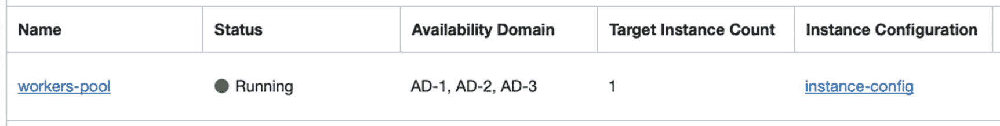

**图 6-24 在 OCI 控制台中查看实例池**

要了解有关池中实例的更多信息，请按照以下步骤操作：

1.  单击实例池的名称。

2.  在“资源”部分，确保选择了“已创建的实例”。

你现在应该看到类似于图 6-25 所示的内容。这次，工作实例位于 AD-1 中。

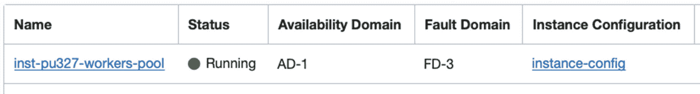

**图 6-25 在 OCI 控制台中查看实例池成员**

让我们更详细地检查这个实例。我们现在要找出分配给实例的私有 IP 地址，并监控其当前负载。为此，请按照以下步骤操作：

1.  单击实例的名称。

2.  在“实例详细信息”视图的“实例信息”选项卡上，从“主 VNIC 信息”部分读取“私有 IP 地址”设置。在我的例子中，它是 `10.1.2.2`。

3.  在“资源”部分，确保选择了“指标”。

4.  单击“CPU 利用率”小部件的绘图区域。

应该会出现一个新的嵌入式窗口，你可以在其中调整底部的 x 轴，以进一步提高图表的可读性。如图 6-26 所示。

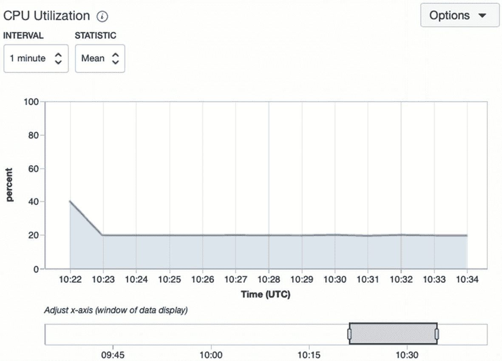

**图 6-26 在 OCI 控制台中查看实例 CPU 利用率**

如你所见，在初始引导相关进程完成后，CPU 消耗从大约 40% 下降到 20%。为什么一台空闲机器要消耗 20% 的 CPU？它真的空闲吗？要了解原因，让我们连接到工作节点。当然，我们必须依赖主机，因为工作节点甚至没有公有 IP 地址。


```
$ ssh -J opc@$BASTION_PUBLIC_IP opc@10.1.2.2
[opc@inst-pu327-workers-pool ~]$ ps -axf -o %cpu,pid,command
%CPU   PID COMMAND
...
0.0 13531 /usr/bin/python /usr/bin/cloud-init modules -mode=final
0.0 13776  \_ /bin/sh /var/lib/cloud/instance/scripts/runcmd
0.0 13780      \_ stress-ng -c 0 -l 20
19.9 13785          \_ stress-ng -c 0 -l 20
20.0 13786          \_ stress-ng -c 0 -l 20
19.9 13787          \_ stress-ng -c 0 -l 20
19.9 13788          \_ stress-ng -c 0 -l 20
```

谜底揭晓。作为 `cloud-init` 最终阶段的一部分，我们有意执行了 `stress-ng` 工具，以在实例上模拟 CPU 负载。`stress-ng` 工具的执行方式是在每个 vCPU 上产生 20% 的总体 CPU 负载。由于我们使用了配备两个 OCPU 的 `VM.Standard2.2` 形状，操作系统总共能看到四个 vCPU。因此，`stress-ng` 分叉出四个进程，每个进程消耗特定 vCPU 处理能力的 20%。以下清单展示了实例配置所引用的 `cloud-config` 文件，该配置是我们刚刚配置的实例池中实例的模板。

```yaml
#cloud-config
packages:
- stress-ng
runcmd:
-  [ stress-ng, -c, 0, -l, 20 ]
```

## 清单 6-7: worker.config.yaml (Workers 模块)

让我们来看看基础架构代码，并逐一了解你此前未曾见过的新资源。以下清单展示了 `workers/compute.tf` 文件的第一部分，涵盖了实例配置资源。

```hcl
...
resource "oci_core_instance_configuration" "worker_config" {
  compartment_id = var.compartment_ocid
  instance_details {
    instance_type = "compute"
    launch_details {
      compartment_id = var.compartment_ocid
      create_vnic_details {
        assign_public_ip = false
      }
      metadata = {
        ssh_authorized_keys = file("~/.ssh/oci_id_rsa.pub")
        user_data = base64encode(file("workers/cloud-init/worker.config.yaml"))
      }
      shape = "VM.Standard2.2"
      source_details {
        source_type = "image"
        image_id = var.image_ocid
      }
    }
  }
  display_name = "instance-config"
}
...
```

## 清单 6-8: compute.tf (Workers 模块): 实例配置

`oci_core_instance_configuration` 资源定义了一个实例配置，如前所述，它是实例池在启动新实例时应用的模板。最重要的细节定义在 `launch_details` 对象中。实际上，它们的定义类似于标准计算实例 Terraform 资源 `oci_core_instance`。生成的实例配置可以在 OCI 控制台中查看，如图 6-27 所示。

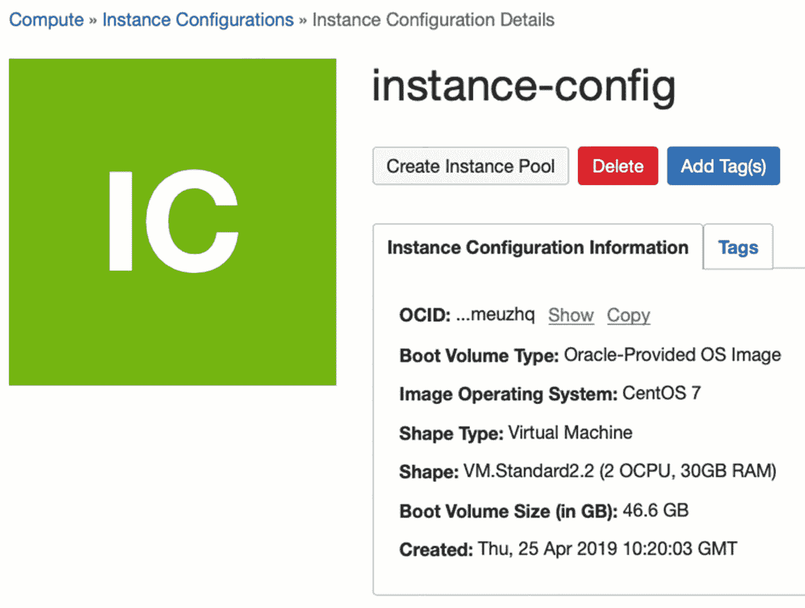

## 图 6-27: 在 OCI 控制台中查看实例配置详情

以下清单展示了 `workers/compute.tf` 文件的第二部分，涵盖了实例池资源。

```hcl
...
resource "oci_core_instance_pool" "worker_pool" {
  compartment_id = var.compartment_ocid
  instance_configuration_id = oci_core_instance_configuration.worker_config.id
  placement_configurations {
    availability_domain = var.ads[0]
    primary_subnet_id = oci_core_subnet.workers_net.id
  }
  placement_configurations {
    availability_domain = var.ads[1]
    primary_subnet_id = oci_core_subnet.workers_net.id
  }
  placement_configurations {
    availability_domain = var.ads[2]
    primary_subnet_id = oci_core_subnet.workers_net.id
  }
  size = var.pool_target_size
  display_name = "workers-pool"
}
...
```

## 清单 6-9: compute.tf (Workers 模块): 实例池

`oci_core_instance_pool` 资源定义了一个实例池。`instance_configuration_id` 参数接收实例配置的 OCID，而 `size` 参数用于定义基于该实例配置在池中创建的初始实例数量。其他有趣的部分是 `placement_configurations` 嵌入块。它们的元素指定了实例池应在何处启动其实例。在我们的案例中，我使用了在 workers 模块中定义的单一区域子网，并指示实例池在配置任何后续实例时使用所有三个可用性域。实例池的初始大小通过模块输入变量设置。以下清单展示了 `modules.tf` 文件的一小部分，在众多不同的输入参数中，你可以看到初始实例池大小的值。

```hcl
...
module "workers" {
  source = "./workers"
  compartment_ocid = var.compartment_ocid
  vcn_ocid = oci_core_virtual_network.vcn.id
  vcn_nat_ocid = oci_core_nat_gateway.natgw.id
  vcn_cidr = oci_core_virtual_network.vcn.cidr_block
  vcn_subnet_cidr = "10.1.2.0/24"
  ads = data.oci_identity_availability_domains.ads.availability_domains[*].name
  image_ocid = data.oci_core_images.centos_image.images[0].id
  pool_target_size = 1
}
...
```

## 清单 6-10: modules.tf (根模块)

现在我们将探索所使用的实例池的自动扩缩功能。首先，我们将在工作节点上施加更大的 CPU 负载，以模拟繁重的批处理处理或大量的传入请求峰值。在仍然连接到工作节点的情况下，启动另一个 `stress-ng` 进程。

```bash
[opc@inst-pu327-workers-pool ~]$ nohup stress-ng -c 0 -l 80 &
[1] 10834
[opc@inst-pu327-workers-pool ~]$ ps -axf -o %cpu,pid,command
%CPU   PID COMMAND
...
0.0  5598 /usr/sbin/sshd -D
0.1 10769  \_ sshd: opc [priv]
0.0 10772      \_ sshd: opc@pts/1
0.0 10773          \_ -bash
0.0 10834              \_ stress-ng -c 0 -l 80
71.5 10835              |   \_ stress-ng -c 0 -l 80
71.0 10836              |   \_ stress-ng -c 0 -l 80
71.0 10837              |   \_ stress-ng -c 0 -l 80
71.1 10838              |   \_ stress-ng -c 0 -l 80
0.0 10849              \_ ps -axf -o %cpu,pid,command
0.0 13531 /usr/bin/python /usr/bin/cloud-init modules --mode=final
0.0 13776  \_ /bin/sh /var/lib/cloud/instance/scripts/runcmd
0.0 13780      \_ stress-ng -c 0 -l 20
19.9 13785          \_ stress-ng -c 0 -l 20
19.9 13786          \_ stress-ng -c 0 -l 20
19.9 13787          \_ stress-ng -c 0 -l 20
19.9 13788          \_ stress-ng -c 0 -l 20
...
[opc@inst-pu327-workers-pool ~]$ exit
```

为了增加更多 CPU 负载，我们启动了一个新的 `stress-ng` 进程实例。前面的 `nohup` 命令用于让 `stress-ng` 进程即使在我们与机器断开连接后也能继续运行。两三分钟后，实例的 CPU 使用率将报告负载大幅增加，如图 6-28 所示。很好。一切如预期进行。

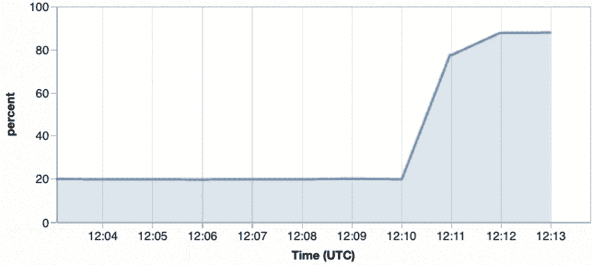

## 图 6-28: 在实例的“指标”窗口中查看增加的 CPU 使用率

同时，我们将查看 workers 模块中 `compute.tf` 文件的第三部分，即自动扩缩配置资源。代码如下一个清单所示。


```
...
resource "oci_autoscaling_auto_scaling_configuration" "workers_pool_autoscale" {
  compartment_id = var.compartment_ocid
  auto_scaling_resources {
    id   = oci_core_instance_pool.worker_pool.id
    type = "instancePool"
  }
  cool_down_in_seconds = 300
  policies {
    capacity {
      initial = var.pool_target_size
      max     = 3
      min     = 1
    }
    policy_type = "threshold"
    rules {
      action {
        type  = "CHANGE_COUNT_BY"
        value = 1
      }
      metric {
        metric_type = "CPU_UTILIZATION"
        threshold {
          operator = "GT"
          value    = "70"
        }
      }
      display_name = "scale-out"
    }
    rules {
      action {
        type  = "CHANGE_COUNT_BY"
        value = -1
      }
      metric {
        metric_type = "CPU_UTILIZATION"
        threshold {
          operator = "LT"
          value    = "30"
        }
      }
      display_name = "scale-in"
    }
    display_name = "workers-pool-autoscale-policy"
  }
  display_name = "workers-pool-autoscale"
}
```
清单 6-11 compute.tf（Workers 模块）：自动扩展配置

`oci_autoscaling_auto_scaling_configuration` 资源创建一个新的 *自动扩展配置*，并同时将其连接到实例池。自动扩展为实例池添加了一些基本的自主能力。您设置标准来定义实例池应如何应对不断变化的条件，例如其实例池成员实例上处理负载的增加（或减少）。例如，您可以规定每当实例池平均 CPU 利用率性能指标超过 70% 时，就向池中添加一个新实例。以类似的方式，如果平均 CPU 利用率低于另一个阈值，可以自动终止一个实例。基础设施代码包含一个具有两条规则的 *自动扩展策略*。两者都将平均实例池 CPU 利用率作为驱动自动扩展事件的指标。第一条规则将导致实例池通过添加一个实例进行扩容，前提是平均 CPU 利用率大于 70%。第二条规则将命令实例池进行缩容，终止一个实例，前提是平均 CPU 利用率降至 30% 以下。该策略还负责定义实例的最小和最大数量。在我们的案例中，它们被固定为 1 和 3。初始实例数量使用与实例池大小相同的模块输入变量 (`pool_target_size`) 来设置。您可以在 OCI 控制台中查看自动扩展策略。为此，请执行以下操作：

1.  转到菜单 ➤ 计算 ➤ 实例池。
2.  确保选择了 `Sandbox` 崩体。
3.  单击实例池的名称。
4.  在“实例池详细信息”视图的“实例池信息”选项卡上，单击“自动扩展配置”标签旁边的链接。
5.  展开该策略。

图 6-29 以比 Terraform 基础设施代码中使用的格式更人性化的方式展示了自动扩展策略。

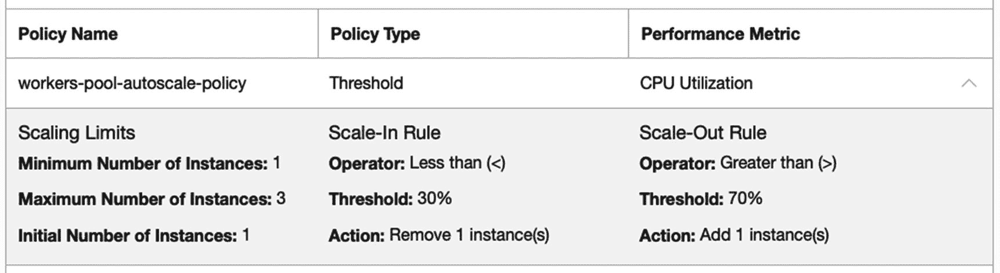

图 6-29 在 OCI 控制台中查看自动扩展策略

为避免实例池中过于频繁和间歇性的变化，*冷却期* 被设置为 300 秒。您可以在清单 6-11 的基础设施代码中找到此值作为 `cool_down_in_seconds` 参数。冷却期从实例池进入稳定状态时开始。这发生在池的初始配置期间。从那时起，按照冷却期定义的固定间隔，自动扩展引擎会检查最后三个指标探测。默认情况下，指标探测每分钟从计算实例收集一次。基于这些探测，实例池计算给定时间戳的平均指标。如果另一个平均值（这次是最后三个连续的实例池平均值）超过特定的自动扩展策略阈值，则会触发自动扩展事件，并调整实例池大小。在这个阶段，我们也可以为我们的池观察到这一点。

多亏了 `stress-ng` 工具，我们对当时拥有的唯一实例池成员造成了 90% 的 CPU 负载。可能从那一刻起已经过去了几分钟。让我们看看在您阅读时是否有任何变化。如果您幸运的话，可能仍然能观察到实例池正在扩容。OCI 控制台视图会显示类似图 6-30 所收集的内容。

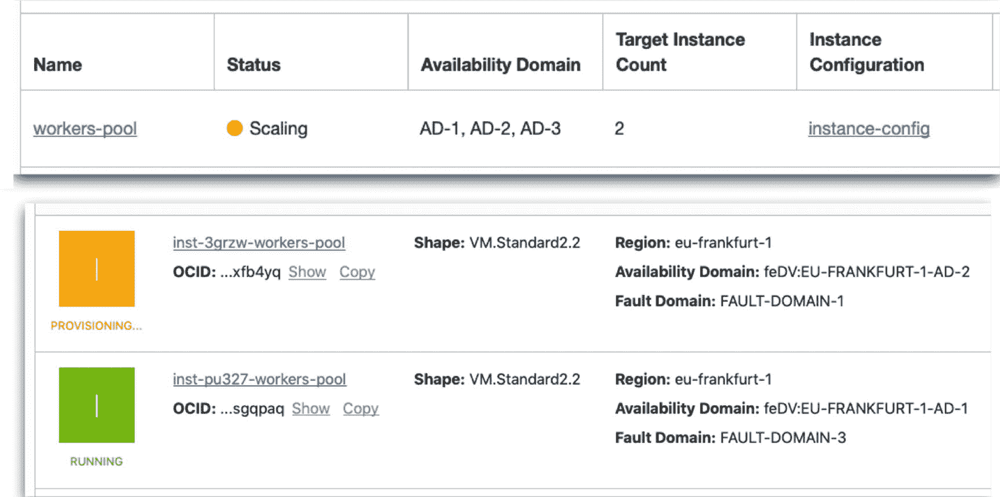

图 6-30 在 OCI 控制台中查看实例池如何扩容

第二个实例创建在与第一个实例不同的可用性域中。这一次，为了在一个图表中查看来自多个实例的监控指标，我们将利用 OCI 监控服务指标。为此，请在 OCI 控制台中执行以下操作：

1.  转到菜单 ➤ 监控 ➤ 服务指标。
2.  确保选择了 `Sandbox` 崩体。
3.  单击 CPU 利用率小部件的绘图区域。
4.  确保时间间隔设置为 1 分钟。
5.  如果需要，调整 X 轴。

在图表中的某个时间点，您应该观察到计算实例的 CPU 利用率急剧增加。您之前在单个实例的“指标”部分看到过这个。由于五分钟的冷却期已经过去，自动扩展引擎评估了来自整个实例池的最后三个 CPU 利用率指标探测的平均值，当时该池仅包含一个实例。因为发现超过了 70% 的阈值，所以一个新计算实例被添加到池中。如图 6-31 所示。

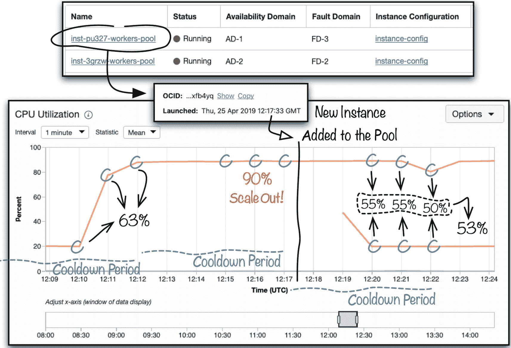

图 6-31 冷却期、阈值和自动扩展

由于新实例使用与第一个实例相同的实例配置，因此两者都将基于相同的形状、基础镜像和 cloud-config。拥有相同的 cloud-config 文件，新添加实例上的 cloud-init 将启动 `stress-ng` 工具并造成 20% 的 CPU 负载。从现在起，实例池平均 CPU 利用率将考虑来自两个实例的探测进行计算。

在撰写本文时，Oracle Cloud Infrastructure 中的自动扩展配置策略规则仅支持两种类型的指标。

*   CPU 利用率
*   内存利用率


## 实例池的生命周期

一个有趣的问题涉及实例池的生命周期。随着时间的推移，尤其是对于长期运行的实例，您可能需要更新用于特定实例池的实例配置。OCI 控制台目前似乎不支持此操作，但 API 支持。要升级实例池使用的实例配置，您只需创建新的实例配置（例如，通过 Terraform 基础设施代码），并正确地更新实例池。使用 Terraform 时，您只需将新实例配置的 OCID 用作实例池资源的 `instance_configuration_id` 参数值并应用更改。以下代码片段显示了 Terraform 输出的一部分，表明在此情况下，升级操作确实是非破坏性的。

```
An execution plan has been generated and is shown in the following.
Resource actions are indicated with the following symbols:
~ update in-place
Terraform will perform the following actions :
~ module.workers.oci_core_instance_pool.worker_pool
instance_configuration_id: "ocid1.instanceconfiguration.oc1.eu-frankfurt-1.aa.........meuzhq" => "ocid1.instanceconfiguration.oc1.eu-frankfurt-1.aa.........ijrpuq"
Plan: 0 to add, 1 to change, 0 to destroy.
Do you want to perform these actions?
Terraform will perform the actions described earlier.
Only "yes" will be accepted to approve.
Enter a value: yes
Apply complete! Resources: 0 added, 1 changed, 0 destroyed.
```

成功更新后，添加到池中的新实例将基于新的实例配置创建，如图 6-32 所示。已存在的实例不会受到影响。您可以随时手动终止它们，让实例池引擎提供它们的替代品，此时将使用最新的实例配置。

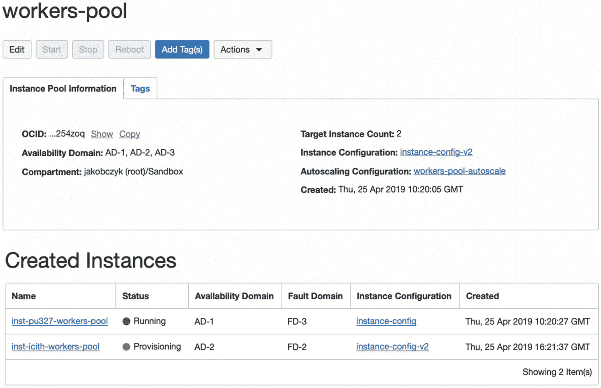

**图 6-32** 查看已更新实例配置的实例池

关于实例池，另一个有用的特性是它们对**负载均衡器**的一流支持。如果特定的实例池关联了负载均衡器，则在池中启动的实例会被添加到负载均衡器的后端集合中。您在第 2 章中曾将公共负载均衡器与独立实例一起使用。

水平扩展的介绍到此结束。在下一节中，我们将讨论垂直扩展。在继续之前，请不要忘记终止本节中创建的云基础设施。为此，请确保您位于 `chapter06/2-instance-pool-autoscale` 目录中并执行以下命令：

```
$ terraform destroy -auto-approve
```

### 垂直扩展实例

在上一节中，我们讨论并实际测试了 Oracle Cloud Infrastructure 计算实例上的水平扩展。为了简化练习，我们专注于简单的测试，没有在这些实例上部署真正的业务软件。然而，一旦考虑应用层，事情通常会变得更加复杂。并非每个应用程序（尤其是遗留应用程序）都支持水平扩展模式。为此，系统通常需要正确处理集群、多节点分发、复制和同步，这并不像您想象的那么简单。过去，许多系统被设计为单体架构。其中一些只提供主动-被动高可用性，在给定时刻只有一个节点可以处于活动状态，而另一个则作为备用节点等待。为了增加这类系统的处理和存储容量，更多硬件资源被添加到现有服务器中，而不是添加新节点。如果您向现有服务器添加更多内存、存储或 CPU 核心，您实际上是在对其进行（垂直）扩展。通过这种方式，应用程序获得了更强大的主机，至少在理论上，应该能够以更快的速度处理更多的并行线程，如图 6-33 所示。

我们现在将启动一个具有一个 OCPU 的计算实例，这实际上为该实例提供了两个 vCPU。cloud-config 导致创建一个新的 systemd 服务，该服务模拟两个核心的 CPU 利用率均为 60%。我们将应用与水平扩展测试中相同的 `stress-ng` 工具。最后，我们将通过升级其形状选择来垂直扩展机器。结果，实例将拥有两个 OCPU，实际上对应四个 vCPU。对于实例上运行的多线程应用程序，增加更多 CPU 核心将使它们受益于增加的处理能力。在我们的例子中，核心数量加倍后，整体平均 CPU 利用率应从 60% 降至 30%，如图 6-33 所示。


**图 6-33** 垂直扩展实例

模拟两个核心 CPU 利用率为 60% 的服务由 cloud-init 根据提供的 cloud-config 文件添加，如清单 6-12 所示。

```
#cloud-config
packages:
- stress-ng
write_files:
-   content: |
[Unit]
Description = Simulate CPU Utilization
[Service]
ExecStart = /usr/bin/stress-ng -c 2 -l 60
User = opc
[Install]
WantedBy = multi-user.target
path: /etc/systemd/system/stress.service
runcmd:
-  'echo $(date) | tee /home/opc/datemarker'
-  [ "ln", "-s", "/etc/systemd/system/stress.service", "/etc/systemd/system/multi-user.target.wants/stress.service" ]
-  [ "systemctl", "enable", "stress.service" ]
-  [ "systemctl", "start", "stress.service" ]
Listing 6-12
vm.config.yaml (Root Module)
```

本练习的代码位于 `chapter06/3-instance-scale-up` 目录中。再次提醒，在继续之前，请确保已根据需要设置 Terraform 所需的所有环境变量。此外，与之前一样，一个公共 SSH 密钥必须命名为 `oci_id_rsa.pub` 并位于 `~/.ssh` 目录中。让我们开始并查看实例的运行情况。


```
$ cd ~/git
$ cd oci-book/chapter06/3-instance-scale-up/infrastructure
$ find . \( -name "*.tf" -o -name "*.yaml" \)
./compute.tf
./vcn.tf
./data.tf
./provider.tf
./cloud-init/vm.config.yaml
./vars.tf
$ terraform init
Initializing provider plugins...
- Checking for available provider plugins on https://releases.hashicorp.com...
- Downloading plugin for provider "oci" (3.30.0)...
* provider.oci: version = "~> 3.30"
Terraform has been successfully initialized!
$ terraform apply -auto-approve
Apply complete! Resources: 6 added, 0 changed, 0 destroyed.
Outputs:
image_name = CentOS-7-2019.04.15-0
vm_public_ip = 130.61.48.49
$ INSTANCE_PUBLIC_IP=`terraform output vm_public_ip`
```

在撰写本文时，计算实例上的监控代理默认每分钟发送一次收集到的指标探测，其中包含我们感兴趣的已测量 CPU 利用率。为了验证平均 CPU 利用率是否真如预期，大约为 60%，我们必须等待几分钟。在此期间，让我们简要讨论一下引导卷。请前往 OCI 控制台并执行以下步骤：

1.  转到菜单 ➤ 计算 ➤ 实例。
2.  确保已选择`Sandbox` compartment。

您应该能看到新配置的实例，如图 6-34 所示。如承诺的那样，当前规格为`VM.Standard2.1`，配备一个 OCPU，这实际上意味着操作系统可见的两个 vCPU。


**图 6-34 查看扩容前的实例**

1.  单击新配置实例的名称以查看实例详情。
2.  在“资源”菜单中，选择“引导卷”。

您眼前将出现附加到该实例的引导卷。什么是引导卷？很简单。*引导卷*是一个块卷，操作系统、根文件系统以及有时额外的软件驻留在其中。它基于您选择的映像创建，无论它只是一个基础操作系统映像，还是带有额外软件的自定义映像。换句话说，您可以认为引导卷是存储特定实例部分状态的地方。图 6-35 显示了实例的引导卷。

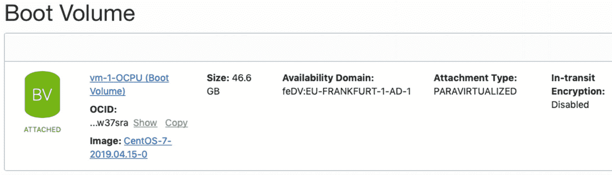
**图 6-35 查看实例的引导卷**

引导卷与其初始父实例在相同的可用性域中创建。您可以清楚地看到作为此引导卷模板的映像。在我的例子中，它是`CentOS 7`（2019 年 4 月版本）。默认启用静态加密。对于基于 VM 的规格，您可以考虑使用传输中加密。在许多情况下，可能不需要，因为实例和块存储之间的底层 iSCSI 数据交换无论如何都在内部网络上进行。引导卷的大小必须大于或等于映像的大小，但不能小于 50GB，某些选定的基础映像有例外情况。最后但同样重要的是，最好了解卷可以调整大小，但此操作必须在分离的卷上执行。

尽管引导卷在实例启动期间与计算实例一起创建，但引导卷仍然是常规的云资源，其生命周期可以与计算实例分离。这使您能够*分离*引导卷并将其*附加*到新的计算实例，而该新实例最终可能使用更强大的规格。这样，您所做的无非是进行实例的垂直扩容。

是时候返回到实例指标并确认基于`stress-ng`的服务确实产生了大约 60%的 CPU 利用率了。

1.  在“资源”菜单中，选择“指标”。
2.  单击“CPU 利用率”小部件，并调整 X 轴。

如果您等待几分钟，您将能够看到，如图 6-36 所示，实例正如我们所期望的那样繁忙，即 60%。一旦我们将核心数加倍，CPU 利用率应降至 30%左右。

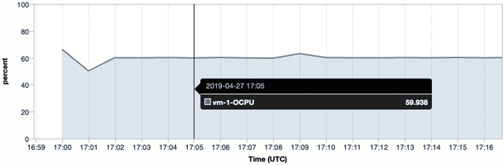
**图 6-36 查看实例（一个 OCPU）的 CPU 利用率**

2020 年 1 月，Oracle Cloud Infrastructure 将为计算实例引入便捷的、API 驱动且全自动的垂直扩容功能。对于大多数规格，您将能够使用`UpdateInstance` API 来更新任何现有实例的规格，使其更强大或稍弱。正在运行的实例将重新启动，但您可以预期实例的 IP 地址、VNIC 和卷附件将保持不变。将新规格应用于正在运行实例的 CLI 命令将如下所示：
```
oci compute instance update --instance-id $INSTANCE_OCID --shape VM.Standard2.2 --wait-for-state RUNNING
```

如果您阅读本书的时间足够晚，此功能可能已可用。然而，为了即将进行的练习的目的，请不要在此阶段执行`oci compute instance update`命令。如果您已经执行了，请将实例缩回`VM.Standard2.1`规格，然后再继续。

或者，一直以来还有另一种对实例进行垂直扩容的方法。此方法涉及分离引导卷、关闭旧实例并重用引导卷启动一个新实例。我将使用 Terraform 来解释它。假设您想将`compute.tf`基础设施代码文件中的规格名称替换。让我模拟这样的更改，并解释您可能陷入的陷阱。好吗？您只是观看。我正在注释掉旧行并添加一个新行，这次使用更强大的规格(`VM.Standard2.2`)，如下所示：
```
resource "oci_core_instance" "vm" {
...
