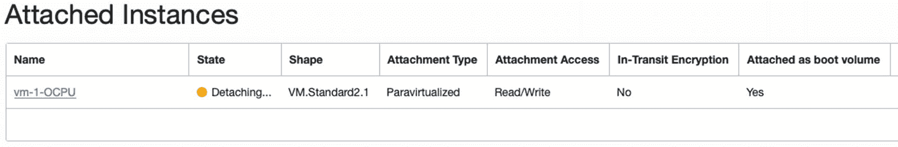
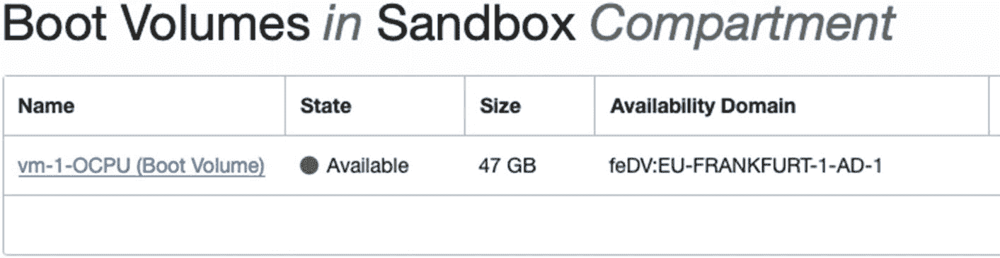
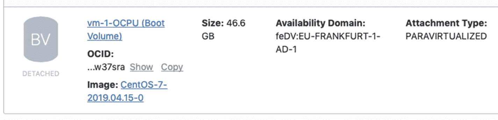

# 1\. Stop the instance
state = "STOPPED"
preserve_boot_volume = true
}
output "vm_bootvolume_ocid" {
value = oci_core_instance.vm.boot_volume_id
}
清单 6-13
compute.tf（根模块）中需要取消注释的部分
```

运行 `terraform plan`。你会看到类似这样的输出：

```
$ terraform plan
An execution plan has been generated and is shown in the following.
Resource actions are indicated with the following symbols:
+ create
~ update in-place
Terraform will perform the following actions:
~ oci_core_instance.vm
preserve_boot_volume:             "" => "true"
state:                           "RUNNING" => "STOPPED"
...
Plan: 0 to add, 1 to change, 0 to destroy.
```

运行 `terraform apply`。

```
$ terraform apply -auto-approve
...
Apply complete! Resources: 0 added, 1 changed, 0 destroyed.
Outputs:
vm_public_ip = 130.61.48.49
image_name = CentOS-7-2019.04.15-0
vm_bootvolume_ocid = ocid1.bootvolume.oc1....w37sra
```

我们已经输出了启动卷的 OCID。现在，我们准备将该卷从实例中分离出来。为此，我们将使用 OCI CLI。

> **注意**
>
> 当然，使用 OCI 控制台来分离特定的启动卷是可行的，而且非常快捷，但在本书中，我们更倾向于自动化，而不是手动与用户界面交互。

为什么我们不能保持一致，继续仅使用 Terraform 来完成此操作呢？如果你查看每个基础设施代码文件，你会发现没有任何资源代表随实例一起创建的启动卷。在配置时，实例及其启动卷的生命周期并未分离。因此，我们不能仅靠 Terraform。这是需要结合声明式基础设施代码（`Terraform`）方法和命令式编程技术（`CLI`）才能完成任务的情况之一。要从实例分离启动卷，请遵循以下步骤：

```
$ BOOTVOLUME_OCID=`terraform output "vm_bootvolume_ocid"`
$ echo $BOOTVOLUME_OCID
ocid1.bootvolume.oc1....w37sra
$ BOOTVOLUME_AD=`oci bv boot-volume get --boot-volume-id $BOOTVOLUME_OCID --query 'data."availability-domain"' --profile SANDBOX-ADMIN | sed 's/["]//g'`
$ echo $BOOTVOLUME_AD
feDV:EU-FRANKFURT-1-AD-1
$ BOOTVOLUME_ATTACHMENT_OCID=`oci compute boot-volume-attachment list --availability-domain $BOOTVOLUME_AD --boot-volume-id $BOOTVOLUME_OCID --query 'data[0].id' --profile SANDBOX-ADMIN | sed 's/["]//g'`
$ echo $BOOTVOLUME_ATTACHMENT_OCID
ocid1.instance.oc1....gnzzyq
$ oci compute boot-volume-attachment detach --boot-volume-attachment-id $BOOTVOLUME_ATTACHMENT_OCID --wait-for-state DETACHED --force --profile SANDBOX-ADMIN
Action completed. Waiting until the resource has entered state: DETACHED
```

我们首先使用 `terraform output` 命令将包含启动卷 OCID 的输出之一保存到一个变量中。在下一步中，我们使用 `oci bv boot-volume get` CLI 命令来提取实例和卷所在可用性域的名称。随后，我们使用 `oci compute boot-volume-attachment list` CLI 命令来获取启动卷连接的名称。在撰写本文时，启动卷连接的 OCID 与实例的 OCID 相同，但为了避免未来可能出现的变化带来问题，我们遵循了最可靠的流程来获取连接的 OCID。最后，我们执行了 `oci compute boot-volume-attachment detach` CLI 命令来触发分离卷的异步作业。我们应用了 `--wait-for-state DETACHED` 选项来保持步骤的阻塞性，从而使其实际上是同步的。另外，我们使用了 `--force` 选项来跳过确认提示。如果你决定将这些步骤与基于 `Terraform` 的步骤一起自动化为一个“垂直扩展”流水线，你会发现这两个选项都非常有用。总而言之，这几条命令最终将导致启动卷的分离操作，如图 6-37 所示。



*图 6-37 观察分离过程中的启动卷*

### 在 OCI 控制台中查看启动卷

你需要执行以下操作：

1.  转到 菜单 ➤ 计算 ➤ 启动卷。

2.  确保已选择 `Sandbox` 隔区。

尽管卷已被分离，但它仍然显示为存在。如图 6-38 所示。这正是我们的目标。



*图 6-38 在 OCI 控制台中查看启动卷*

如果你打开启动卷详细视图，并在资源菜单中选择“已连接的实例”，你将看到不再有任何计算实例连接到该卷。同时，我们之前与启动卷一起启动的原始实例会报告启动卷确实已分离，如图 6-39 所示。



*图 6-39 查看已分离的启动卷*

现在我们准备好终止旧实例，并使用刚刚从旧实例分离出来的启动卷启动一个更强大的新计算实例。新实例必须在同一个可用性域中启动。

> **警告**
>
> 你必须小心，不要使用 `cloud-init` 重新初始化新实例。否则，你可能会损坏使用现有启动卷配置的这个新实例上的应用状态。在我们的情况下，连接到现有启动卷的更强大的新实例将完全不使用任何 `cloud-config`。


在进行资源调配时，我们将采用 Terraform 的声明式方法。执行`terraform apply`之前，您需要完成以下操作：

1.  注释掉内容或直接删除整个`compute.tf`文件，以终止刚才停止的旧实例。
2.  取消注释`compute-ocpu2.tf`文件的内容（通过删除文件开头的`/*`注释符和文件结尾的`*/`注释符）。这将调配新实例。

这两个任务很容易编写成脚本。要在 Linux 或 Windows Subsystem for Linux 上执行它们，请运行以下代码：

```
$ rm compute.tf
$ sed -i 's/\/\*//; s/\*\///' compute-ocpu2.tf
```

如果您使用的是 macOS，则需要以稍微不同的方式使用`sed`命令。

```
$ rm compute.tf
$ sed -i '.bak' -e 's/\/\*//; s/\*\///' compute-ocpu2.tf
```

清单 6-14 展示了新的、更强大实例的基础设施代码。它与用于旧实例的代码相似，但存在一些显著差异。

*   实例规格（使用 `VM.Standard2.2` 而非 `VM.Standard2.1`）。
*   源类型设置为 `bootVolume`，并通过 Terraform 变量提供现有引导卷的 OCID。
*   没有用户数据，因此新实例首次启动时不会通过 cloud-init 执行任何额外初始化，以避免更改引导卷中的现有内容。
*   显示名称（使用 `vm-2-OCPU` 而非 `vm-1-OCPU`）。

```
variable "vm_2_ocpu_bootvolume_ocid" { }

