# 2. 添加新实例
resource "oci_core_instance" "vm_2_ocpu" {
  compartment_id      = var.compartment_ocid
  display_name        = "vm-2-OCPU"
  availability_domain = data.oci_identity_availability_domains.ads.availability_domains[0].name
  source_details {
    source_id   = var.vm_2_ocpu_bootvolume_ocid
    source_type = "bootVolume"
  }
  shape = "VM.Standard2.2"
  create_vnic_details {
    subnet_id        = oci_core_subnet.net.id
    assign_public_ip = true
  }
  metadata = {
    ssh_authorized_keys = file("~/.ssh/oci_id_rsa.pub")
  }
}

output "new_vm_public_ip" { value = oci_core_instance.vm_2_ocpu.public_ip }
清单 6-14
compute-2-ocpu.tf (根模块)
```

以下是应用新基础设施代码的步骤。请注意，我们使用之前捕获为 `BOOTVOLUME_OCID` 变量的 Terraform 输出，通过设置并导出（!）一个新的环境变量（`TF_VAR_vm_2_ocpu_bootvolume_ocid`），以此将现有引导卷的 OCID 传递给 Terraform。

```
$ echo $BOOTVOLUME_OCID
ocid1.bootvolume.oc1....w37sra
$ export TF_VAR_vm_2_ocpu_bootvolume_ocid=$BOOTVOLUME_OCID
$ echo $TF_VAR_vm_2_ocpu_bootvolume_ocid
ocid1.bootvolume.oc1....w37sra
$ terraform plan
已生成执行计划，显示如下。
资源操作使用以下符号表示：
  + 创建
  - 销毁
Terraform 将执行以下操作：
  - oci_core_instance.vm
  + oci_core_instance.vm_2_ocpu
  ...
  availability_domain:           "feDV:EU-FRANKFURT-1-AD-1"
  ...
  source_details.#:              "1"
  source_details.0.source_id:    "ocid1.bootvolume.oc1....w37sra"
  source_details.0.source_type:  "bootVolume"
  ...
计划：1 个添加，0 个更改，1 个销毁。
```

只要计划报告旧实例将被销毁，并且新实例将使用现有引导卷构建，我们就可以继续。

```
$ terraform apply -auto-approve
...
应用完成！资源：1 个已添加，0 个已更改，1 个已销毁。

输出：
new_vm_public_ip = 130.61.90.54
image_name = CentOS-7-2019.04.15-0
$ NEW_INSTANCE_PUBLIC_IP=`terraform output new_vm_public_ip`
```

提示

如果 `terraform apply` 命令产生 *服务错误：冲突*，请不要担心。这种情况下，是因为在创建新实例之前尚未删除旧实例。这会导致引导卷即使已分离，仍被视为分配给旧实例。要继续，只需再次运行 `terraform apply -auto-approve` 命令即可。

如果您关注中间的 Terraform 输出，您会发现新实例的创建实际上是在旧实例销毁之后才开始的，如图 6-40 所示。发生这种情况是因为引导卷即使已分离，仍被旧实例注册。只要为创建操作设置的 Terraform 超时时间足够长，您应该不会遇到问题。

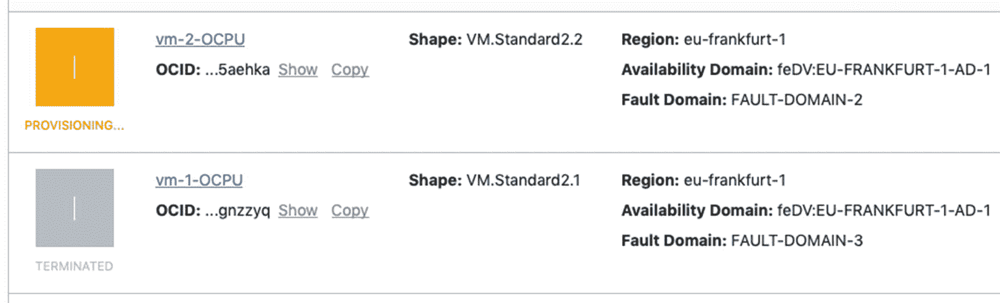
*图 6-40. 查看新的向上扩展实例的调配过程*

一旦新实例准备就绪，并且经过几秒钟启动 ssh 守护进程后，您可以自由连接到该实例，并检查在第一个实例初始启动时写入的文件是否在引导卷重新挂载后仍然存在。

```
$ ssh -i .ssh/oci_id_rsa opc@$NEW_INSTANCE_PUBLIC_IP
[opc@vm-2-ocpu ~]$ cat datemarker
Sat Apr 27 17:01:34 GMT 2019
[opc@vm-2-ocpu ~]$ exit
```

很好。文件存在且内容与我们之前检查的一致，这一事实证明引导卷确实经受住了重新挂载，也就是说向上扩展操作是成功的。

新实例的 vCPU 数量增加了一倍，而我们的 CPU 利用率压力测试服务参数保持不变。因此，我们预计这次看到的不是 60%的 CPU 利用率，而是 30%左右的 CPU 利用率。让我们来验证一下。转到新实例的“指标”视图。

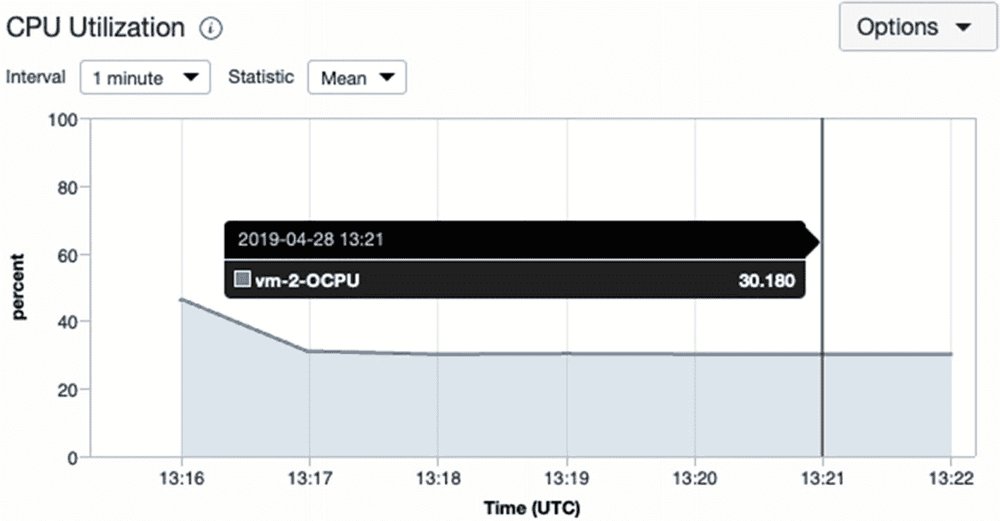
*图 6-41. 查看实例（双 OCPU）的 CPU 利用率*

几分钟后，您应该确实会看到 CPU 利用率稳定在 30%左右。这证明我们的向上扩展操作是成功的。我们成功地在更强大的计算实例上复用了同一个引导卷。如果您将本节描述的步骤自动化，您会发现其中的逻辑相当简单。

还有一件事，如果您查看引导卷的名称（如图 6-42 所示），并将其与新实例的名称进行比较，您会发现引导卷的名称与已被终止的旧实例名称相同。将 `vm-1-OCPU` 引导卷挂载到 `vm-2-OCPU` 实例上看起来有点奇怪，不是吗？

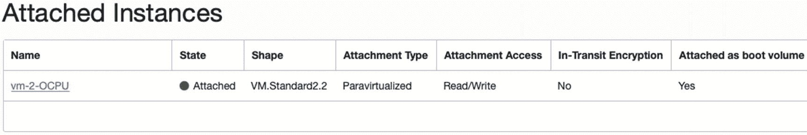
*图 6-42. 查看引导卷的旧名称*

幸运的是，重命名引导卷的显示名称很容易，且不会影响数据或导致实例停机。毕竟，显示名称只是元数据，对吧？要重命名引导卷，您可以使用带有 `--display-name` 选项的 `oci bv boot-volume update` CLI 命令来设置新名称，如下所示：

```
$ oci bv boot-volume update --boot-volume-id $BOOTVOLUME_OCID --display-name vm-bv --profile SANDBOX-ADMIN
```

至此，本练习完成。请使用 `terraform destroy` 命令释放资源并停止计费。

```
$ terraform destroy -auto-approve
```

引导卷将随新实例一起被终止，如图 6-43 所示。

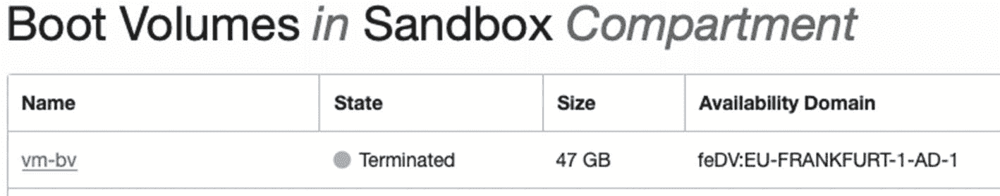
*图 6-43. 查看已终止的引导卷*


## 不可变基础设施

高度的 API 驱动自动化以及池化基础设施资源的快速自我供应能力，使得云计算成为 `不可变基础设施` 模式的关键推动者。`不可变`一词与`不可更改`、`永久`或`固定`等词同义。一个不会改变的基础设施必须在相对较短的时间内创建完毕，并能立即服务于其业务目的。后者意味着不可变基础设施与一个已预装并完成初始化的应用层捆绑在一起，该应用层已准备好提供服务和处理数据。迟早，某些组件将需要升级。这正是`不可变`一词发挥作用之处。与传统的服务器和应用程序生命周期不同，不可变基础设施模式假设基于升级后的镜像和增强的初始化代码来供应一组新的云资源，并将任何传入流量妥善重定向，同时简单地终止旧的基础设施。

不可变基础设施可以融合`自主智能`，例如横向计算自动伸缩。自动伸缩将根据本章前面描述的指标动态调整实例数量。这里的关键理念是无需人工干预，正因如此，该基础设施可被视为不可变的。

鉴于应用格局的复杂性、数据流依赖关系以及各种业务连续性要求，认为所有系统的整个云基础设施都可以被视为一组单一的不可变资源，这相当不切实际。实际上，你控制着多组云资源，它们作为不可变基础设施被独立管理。此外，你通常会决定某些云资源，尤其是托管的平台服务，不会使用此模式进行供应。总而言之，你应该仔细选择云资源组的适当划分，既包含遵循不可变基础设施模式的组，也包含依赖于传统的、动态的、长生命周期的基础设施模式的组。

我之前提到过，不可变基础设施意味着托管的应用和系统在完全自动化的供应运行完成后即可投入运行。在本书包含的练习过程中，我们广泛使用了`Terraform`配合`cloud-config`文件，这些文件在实例启动时由`cloud-init`处理和执行。我是`cloud-init`的忠实拥趸，但我承认，随着应用初始化逻辑变得越来越复杂，使用`cloud-init`就变得越发低效。当你在初始化复杂的集群系统时，`cloud-init`的局限性尤为明显，这些系统中不同节点承担着不同的角色，例如`主节点`或`工作节点`，并且需要特定的初始化顺序。

一种选择是使用`Terraform 供应器`，基于预定义的依赖树以特定顺序在远程云主机上执行脚本。有人认为`Terraform 供应器`使得`Terraform`基础设施代码不再简单易读。嗯，`Terraform`基础设施代码本意是声明式的。使用标准的`Terraform`配置，如`资源`、`数据源`或`模块`，确实是纯声明式的，这带来诸多好处。首先，你永远无需担心将实际状态转变为目状态所需的执行步骤。这个任务由`Terraform`完成。如果你通过使用`供应器`来扩展这种清晰的声明式方法，你就是在添加命令式特性，实际上是在同一代码库中混合了两种范式（声明式和命令式）。这样一来，基础设施代码会变得难以理解和维护。

对于真正复杂的架构，我推荐的另一个选项是：通过将声明式的基于`Terraform`的基础设施代码与使用`Ansible`编排的命令式初始化逻辑适当结合，来实现不可变基础设施。`Ansible`是一种无代理的自动化工具，用于远程管理计算实例。其能力不仅包括系统管理，还包括应用程序部署。`Terraform`和`Ansible`都可以在同一构建服务器上执行，并封装为完整`持续集成与持续部署`流水线内的可重复作业。供应流水线可以由四个阶段组成，如图 6-44 所示，可理解如下：

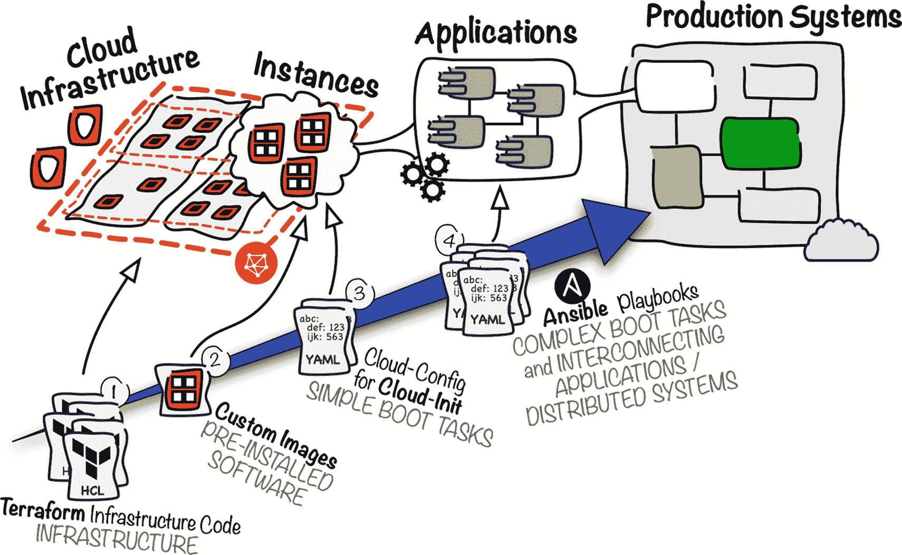

图 6-44

使用 Terraform 和 Ansible 的不可变架构

1.  云基础设施根据使用`Terraform`配置文件定义的声明式目标基础设施来创建。
2.  预装的应用程序和库可以已经包含在用于启动实例的自定义镜像中一同交付。
3.  一些初始的操作系统和应用程序初始化逻辑由`cloud-init`根据提供的`cloud-config`用户数据执行。
4.  更加分散且相互依赖的初始化任务最终通过一组基于`Ansible`的`剧本`来执行。

## 本章小结

本章的主要目标是让你熟悉在设计基于云的解决方案或将现有系统迁移到云端时会遇到的一些核心云基础设施模式。我们从讨论虚拟网络开始，研究了`虚拟云网络`、区域和`可用域`特定的子网、`虚拟网卡`和私有`IP`。随后，在面向互联网的实例背景下，介绍了两种类型的公共`IP`：`临时`和`保留`。接着，我们简要了解了`堡垒主机`和`NAT 网关`模式，这些模式用于为连接到私有子网的隔离实例提供安全的互联网连接。你使用了`Terraform`来供应相应的基础设施，并见证了该模式的实际运作。我们简要探讨了路由，并花费更多时间澄清了`有状态`和`无状态`安全规则之间的区别。你学习了如何使用本地`虚拟云网络对等连接`来互连同一区域内的不同`虚拟云网络`。专用网络隔离区模式被作为`虚拟云网络对等连接`的替代方案给出，尤其是在更复杂的架构背景下。本章很大部分内容致力于通过横向和纵向实例扩展所提供的弹性。你使用了`实例池`、`实例配置`和`自动伸缩配置`来试验横向扩展。你学习了如何通过迁移到更强大的计算形态来纵向扩展实例，同时重用在启动原始实例时创建的现有启动卷。最后，你阅读了关于不可变基础设施的内容，并被简要介绍了可用于实现供应流水线的工具。

# 7. 自治数据库

存储数据可能充满挑战。需要考虑的方面很多。在本章中，我们将探索 Oracle 云的旗舰产品之一：作为平台即服务在 Oracle 云中提供的完全托管的 Oracle 数据库。


## 关系数据模型

组织和构建数据的方式通常被称为**数据模型**。数据模型本身通常意味着各个数据实体之间存在多种关系和完整性要求。一个数据实体可以代表一个独立的业务对象，如产品、客户或销售项。数据实体也用于体现技术数据，例如某种收集的测量探头。每个数据实体最终必须以物理数据条目的形式在特定类型的数据库中体现。数据库的类型在某种程度上决定了主要的物理数据条目格式。以下是一些流行的数据库类型：

- 基于二维表的关系模型
- 基于`JSON`或`XML`文档的文档导向模型
- 图数据库
- 键值存储
- 宽列存储

### 二维表

二维表被认为是组织业务相关数据最流行、历史上最普遍的方式。此外，业务人员由于日常工作使用电子表格，通常习惯于以表格形式呈现数据。观察二维表，行对应于单个数据对象，而列则代表这些对象所具有的属性，如图 7-1 所示。

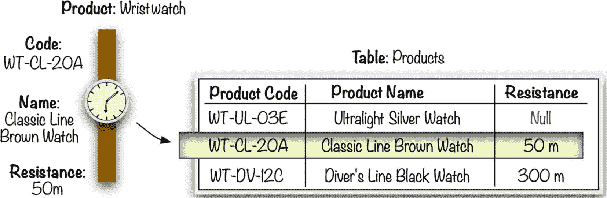

诸如产品、客户或销售项之类的业务数据实体很少孤立存在，几乎总是以某种方式与其他实体相关联。例如，销售项可以引用它们所运输的产品以及进行购买的客户。为了表达二维表之间的这些关系，你需要利用关系数据模型，其设计初衷确实有助于数据库引擎在以下方面发挥作用：

- 保护数据完整性
- 解析和优化查询

### 数据完整性

保护数据完整性意味着什么？只有在某个销售项实体所引用的产品实体已经存在的情况下，才能创建该销售项实体。关系数据库能够强制实施这种要求，并禁止在产品表中不存在给定产品条目的情况下创建销售项表条目。这被称为**引用完整性**。关系数据库在这方面确实表现出色。

尽管从技术上讲关系数据库可以存储重复的行，但在某些工作负载类型中，尤其是操作型负载中，这是不希望出现的。对于这些情况，单个产品通常应该由一个单一的、易于识别的数据条目来表示。为了在表中唯一标识选定的产品，数据条目必须拥有一个或多个列，这些列的值组合起来能唯一标识该数据实体。为了禁止数据库插入重复项，你需要在这些列上创建一个**唯一键数据完整性约束**。任何尝试插入在唯一键列中具有已存在值组合的新数据行的操作都将被拒绝。

数据完整性基于每个单独列的类型进行保护。关系数据库传统上基于具有固定类型列的表。每个列都定义了一个列数据类型，可以是多种支持的字符、数值、日期和时间数据类型之一。例如，产品名称列可以是基于 Unicode 的可变长度字符类型，其最大长度由字符数表示，而销售项数量列则使用非负整数数值类型定义。不符合列数据类型的插入值将被拒绝。

完整性检查还可以强制实现：给定列只允许匹配给定正则表达式的词，或者只允许属于特定范围的数值。这可以通过**检查约束**来实现。在现实世界中，开发者有时会决定在应用层为选定列构建此类检查。这完全取决于创建特定数据模型的目的和上下文。在此阶段，必须指出，并非每个工作负载都需要内置完整性检查的数据模型。事实上，在某些用例中，数据模型的灵活性比强制完整性更受重视。然而，与业务相关的数据通常倾向于拥有这些完整性约束。

### 数据检索与 SQL

存储数据只是硬币的一面。要使用持久化的数据，你必须能够定期且高效地从数据库中检索它。为了获取所需的数据条目子集，你需要查询数据库引擎。对于关系数据库，你通常使用标准化的**结构化查询语言** (`SQL`) 来精确定义要返回的内容，有时会扩展以包含数据库特定的功能。一个`SQL`查询从客户端发送到数据库引擎，引擎将其转换为**查询执行计划**。基于此计划，数据库引擎检索数据并将其发送回客户端。

清单 7-1 展示了一个基本的`SQL`查询，该查询选择了所有条形码以 590 开头且类别代码等于 REG 的产品的名称和条形码。

```sql
SELECT name, barcode
FROM products
WHERE barcode LIKE '590%' AND category_code = 'REG';
```
**清单 7-1** `SQL` SELECT 语句


## 关系型数据库核心概念与 Oracle Database 概览

查询可以针对单个表，也可以跨多个表，根据需要连接它们。来自不同表的行基于特定数据模型中定义的关系进行连接。例如，如果您想收集所有仅引用被分类为数学书籍的这些产品的销售项目，数据库引擎将必须至少将销售项目表与产品表连接起来，并应用适当的过滤器来排除其他类别。两个表如何连接源自它们的逻辑设计。最流行的关系类型是：一个表反映的实体可以被第二个表中的多个实体引用。同时，第二个表中的每个实体只能引用第一个表中的一个实体。这被称为“一对多关系”。这可以是销售项目表与产品表之间的关系。多个销售项目引用同一个产品，而一个销售项目只引用一个产品。这是通过在销售项目表中为每个条目存储被引用产品的唯一标识符来实现的，如图 7-2 所示。这个键通常被称为“外键”。

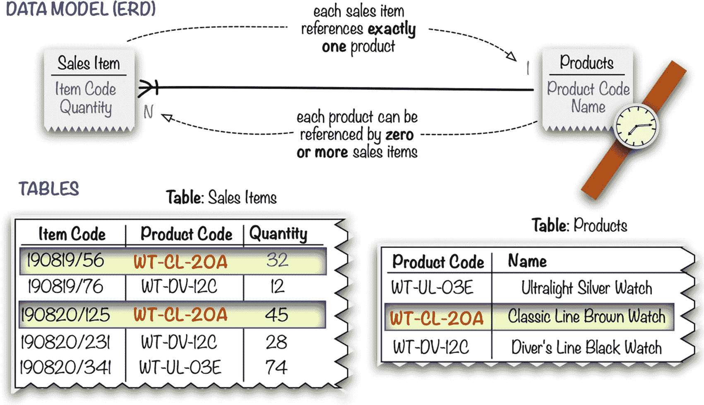

图 7-2 建模一对多关系

为了加速预期会频繁执行的查询，关系型数据库依赖于称为“索引”的附加数据结构，用于绕过耗时的全表扫描并优化表连接。标准的 B 树索引与单个表关联，并在一个或多个列上创建。索引中列的顺序很重要。使用这些列来过滤结果的查询以及基于这些列的表连接，都可能受益于操作时间的大幅加速。B 树索引指向单行。位图索引是另一种流行于实现分析型数据模型的索引类型。它们在存储少量离散值的列上创建，并支持依赖于集合操作的复杂搜索。位图索引指向多行，因此可用于加速聚合查询。一旦创建索引，其管理就由数据库引擎接管。每当您对数据行执行插入、更新或删除操作时，相应的索引也会随之更新。

与针对数据库的数据修改操作相关的一个关键概念是“事务”。事务确保一组数据修改操作要么全部执行，要么全部不执行。不允许中间状态影响作为事务内包装的数据修改操作主题的数据集。当事务“提交”时，所有语句都会应用到数据库中。如果其中一个语句失败或事务被有意“回滚”，则任何语句都不会导致数据集更改。这使得开发人员能够在其与数据库交互的应用程序中实现复杂的用例和适当的错误处理。事务遵循所谓的 ACID 属性，即事务是：

*   原子性
*   一致性
*   隔离性
*   持久性

原子性和一致性意味着要么所有操作要么没有操作应用于作为事务主题的整个数据集，并且数据库中不允许数据条目处于中间状态。隔离性意味着可以运行多个并发事务，并且任何给定事务的结果只有在成功提交后才对其他事务可见。实际上，有几种所谓的隔离级别，它们决定了如何处理活动的并发事务。最后但同样重要的是，持久性承诺任何已提交的事务都是永久性的且不会丢失，即使在数据库引擎发生故障的情况下也是如此。

### Oracle Database

几十年来，关系型数据库一直被广泛用作不同行业的数据支柱。Oracle Database 是于 1979 年推出的第一个商用 SQL 关系型数据库管理系统。早几年的 1970 年，Edgar F. Codd 在他的理论性、基于数学的论文《大型共享数据库的关系数据模型》中公开介绍了关系数据模型。该模型最终成为几十年来占主导地位的数据库模型，并使 Oracle Corporation 成为该领域的市场领导者。Oracle Database 已经发展了 40 年。在此期间，Oracle 将数据库代码移植到 C 语言，强化了事务支持，增强了事务隔离一致性，转向了允许基于网络架构的客户端-服务器模式，改进了锁定机制，引入了各种备份策略，添加了 PL/SQL（它是 SQL 的过程化扩展），引入了触发器和存储过程，通过集群提供高可用性，利用压缩来优化存储空间占用，并包含了无数的其他改进，例如 XML 和 JSON 支持、内存和网格计算支持、空间与图形处理、用于安全和测试的数据屏蔽、高级监控、REST 数据服务等等。2013 年，随着 12c 版本的发布，多租户以可插拔数据库的形式出现，Oracle Database 12c 被宣传为世界上第一个（关系型）为云而设计的数据库。Oracle Database 可用于事务性和分析性工作负载，并满足广泛的企业需求。Oracle Corporation 也是 MySQL 的守护者，这是最流行的开源关系型数据库之一，通常是小型企业和需求有限且非企业级的组织的首选。

丰富的功能可能导致颇具挑战性的管理任务，特别是在初始设置、硬件选择、适当的数据库调优以及资源和性能监控方面。这些活动是不可避免的，必须执行以交付生产就绪的数据库。预期工作负载要求越高，就需要越复杂的设置。所有这些功能都依赖于熟练的劳动力并消耗大量时间。为了缓解这一潜在痛点，十多年前，Oracle 推出了“Exadata 数据库一体机”，它结合了针对数据库优化的硬件、专门的系统控制软件以及当然的 Oracle Database。Exadata 硬件利用 InfiniBand 网络结构、NVMe SSD 存储等技术，提供极致的性能，并支持通过增加 CPU 核心、安装更多存储卷甚至通过添加额外的机架进行横向扩展来实现逐步扩展。客户可以将 Exadata 机架安装在他们的数据中心中，以便仍然物理上拥有数据，但利用已经优化的硬件和软件，并将一些生命周期任务委托给内置的自动化或部署和管理基础设施的 Oracle 高级支持专家。

虽然运维团队可能确实需要一些时间来推出环境，但开发人员通常不想等待。多年前，Oracle 用免费的 Oracle Database 快捷版丰富了其产品组合，该版本可用于快速启动面向 Oracle 的应用程序开发，之后再过渡到使用 Oracle Database 企业版。虽然 Oracle Database 快捷版适合开始使用 Oracle Database，但它无助于为生产目的快速提供和管理数据库实例。

## 自治数据库概览

云计算不仅向市场提供软件即服务或基础设施即服务选项，还提供托管平台服务。托管平台服务可以快速配置，减少整体管理负担，让团队专注于开发和特定平台的使用。每个 Oracle Cloud 区域都提供一个完全托管、高度自动化、集成良好、可扩展的 Oracle 数据库，称为`Autonomous Database (ADB)`，它有两种形式：`Autonomous Transaction Processing (ATP)`和`Autonomous Data Warehouse (ADW)`。ADB 运行在接入 Oracle Cloud Infrastructure 骨干网的 Exadata 硬件上。ADB 被宣传为自我驾驶、自我保护和自我修复，这基本上意味着它是一项完全托管的服务，客户方面几乎不需要任何管理努力。诸如打补丁、升级、调优或备份数据库等职责都在后台自动完成。这使您可以专注于数据模型设计和开发，而将任何数据库生命周期任务交给 Oracle 维护的自动化流程处理，如图 7-3 所示。

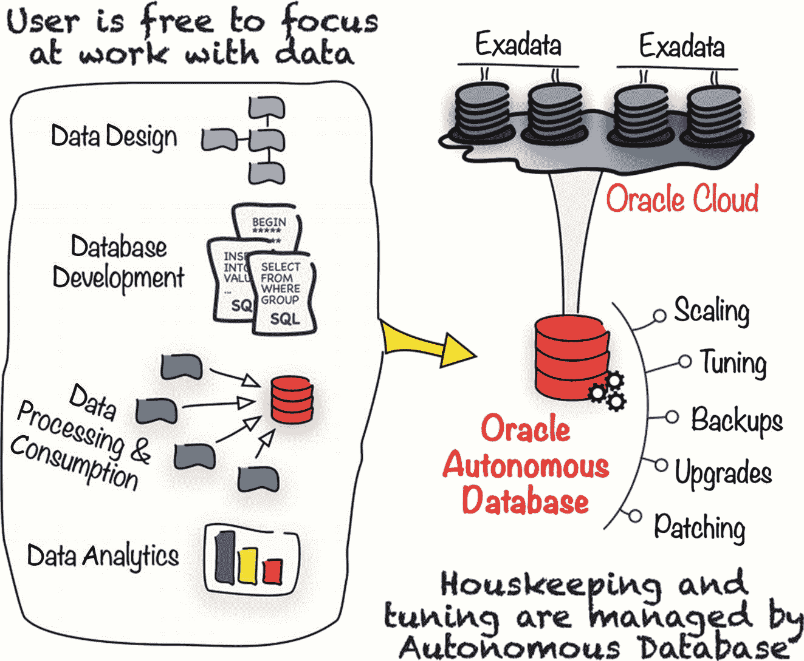

**图 7-3**

**自治数据库**

ADB 在每个 Oracle 公共云区域中都可用，有两种部署选择。

*   `Serverless` (无服务器)
*   `Dedicated` (专用)

`Serverless`部署是启动托管 Oracle 数据库的最简单方式。首先选择目标 Oracle Cloud 区域，然后只需选择初始的 CPU 数量、存储容量、管理员凭据和工作负载类型（ATP 或 ADW）。之后，您仍然可以扩展 CPU 和存储。此外，如果需要，您可以启用 CPU 自动扩展。其他所有事情，如打补丁、升级、自动调优和备份，都在后台完全自动化完成。总而言之，整个生命周期由 Oracle 管理的自动化流程负责。无服务器部署选项遵循云中广泛使用的标准模式，即多租户。这意味着什么？可能有多个 ADB 实例由不同的云租户使用，全部运行在同一台 Exadata 机器上。如果需要与其他租户更高的隔离性，您的企业可能会考虑`dedicated` (专用)部署模式下的 ADB，这确实需要多一点初始工作，但能让您专属的 Exadata 基础设施在 Oracle 公共云中完全隔离的私有虚拟网络中运行。虽然专用 ADB 对企业来说是个不错的选择，但大多数用例将从运行高度自动化的无服务器 ADB 中获益更多。在本书中，我们将仅处理无服务器 ADB。

ADB 功能非常强大。在撰写本文时，每个实例的最大 CPU 核心数为 128。您可以随时上下扩展实例的 CPU 数量和存储容量。Autonomous Database 根据 CPU 和 Exadata 存储消耗计费。如果您的组织已经持有有效且相关的 Oracle 数据库许可证，可以在启动 ADB 实例时考虑选择自带许可证（BYOL）选项。这将显著降低您的云费用。

ADB 可以自我调优，但它仍然需要一些初始指示，说明该特定实例将服务于哪种类型的工作负载。数据库应用程序通常分为两类，需要不同的数据库调优。

*   事务处理（`OLTP`）系统
*   分析处理（`OLAP`）系统

`OLTP workloads` (OLTP 工作负载)的特点是高频次、大容量且相对较小的写操作。这些操作可能同时来自数百或数千个客户端，从而导致大量并发写入，需要适当的事务隔离。在某些情况下，数据不仅可以交互方式修改，还可以基于批量数据加载进行修改。随着电子商务的出现，事务处理对数据库变得更加重要，有时被视为关系数据库的传统领域。事务数据库通常采用高度规范化的数据模型，以消除可能导致重大数据不一致性的冗余。可以说，事务处理工作负载的主要目标之一是收集数据并根据传入的数据修改操作保持其最新状态。`Autonomous Transaction Processing (ATP)` (自治事务处理)经过调优以服务于此类工作负载。

`OLAP workloads` (OLAP 工作负载)的特点是交易数量有限，而倾向于有计划、定期的批量加载大量数据，这些数据通常来自多个事务数据库。数据从多个规范化的事务数据库转换和整合到一个高度非规范化的、有意冗余的分析数据模型中。分析数据库经过调优，以优化预期查询和完全即席查询的性能。在分析数据库上执行的典型操作包括数据透视、向下钻取、向上聚合、切片和切块、数据选择和排序。`OLAP`系统的主要目标是进行多维聚合数据分析，以分析历史数据趋势，发现各种依赖关系或相关性，并最终提供精细的报告。Autonomous Data Warehouse (自治数据仓库)经过调优以服务于此类工作负载。

由 ATP 和 ADW 服务的工作负载类型的概念性说明见图 7-4。

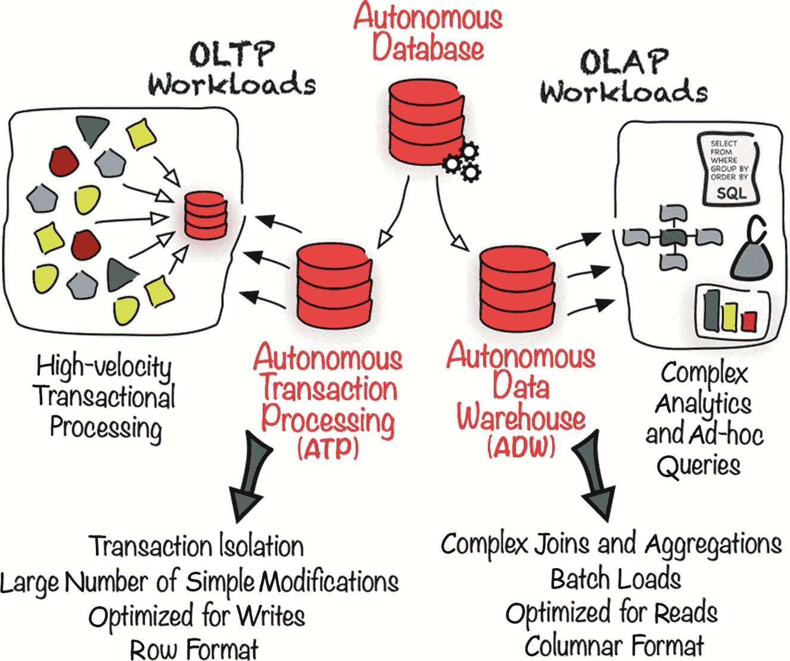

**图 7-4**

**ATP 和 ADW**


## 自治数据仓库

自治数据仓库经过优化，旨在服务于联机分析处理系统中的分析处理任务。它利用多种 Oracle 调优选项，如特定的内存分配、列式数据格式和并行查询，以提升典型数据仓库任务的性能。与事务处理系统相比，数据几乎完全以批量方式加载到 ADW 中，每天最多一次，甚至频率更低。

我们将模拟一个简单的数据仓库用例，该用例涉及波兰所有主要道路上几年内收集的各种警方监控的道路事件发生情况。事实上，您将使用的数据完全是人工生成的，但看起来可能比较逼真，并为一些数据分析提供了良好的基础。我是基于自定义参数和广泛使用正态分布随机性生成这些数据的。

首先，我们必须配置一个新的 ADW 实例、设置数据库模式、加载数据，然后运行我们的分析查询来回答一些业务问题。接下来，我将简要说明可视化这些发现有哪些选项。在本节及后续章节中，您将了解到数据仓库的一些基本概念并将其付诸实践。

### 配置新的 ADW 实例

要配置一个新的自治数据仓库实例，需要做出一些选择并设置一些参数。ADW 实例是特定于区域且可感知 compartment 的。换句话说，与几乎所有的 Oracle Cloud Infrastructure 资源一样，您必须选择实例将被配置的地理区域。此外，为了支持特定于环境和项目的逻辑隔离，您需要选择将创建特定 ADW 实例的 compartment。

如果您要使用 OCI 控制台启动一个新的自治数据仓库实例，您将打开一个非常直观的自治数据库创建向导，提供显示名称和数据库名称，将工作负载类型设置为数据仓库，并通过定义 CPU 数量和以 TB 为单位表示的存储空间来配置初始硬件配置文件，如图 7-5 所示。您可以随时动态调整 CPU 和存储空间数量。此外，您可以启用 CPU 自动扩缩，让数据库对增加的处理需求做出反应。

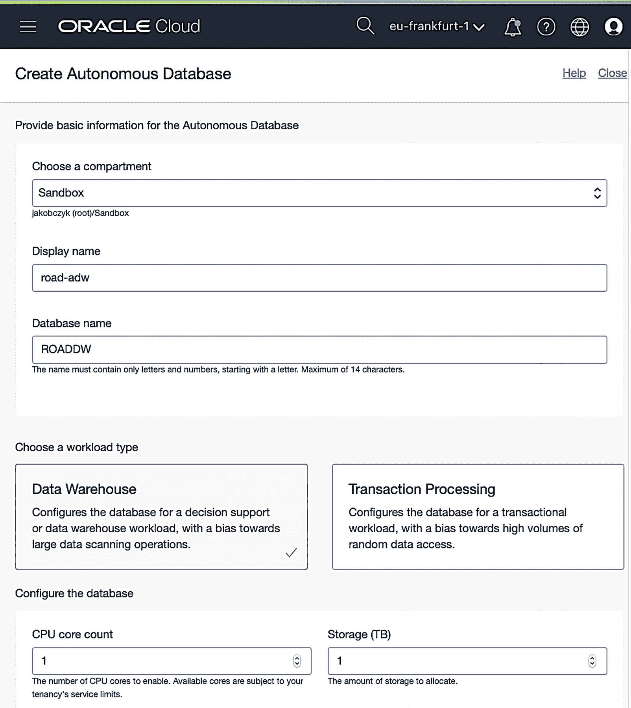

**图 7-5** OCI 控制台中的自治数据库创建向导 1/2

数据库管理员用户称为`ADMIN`。在使用向导时，您必须设置其密码。另一个重要点与许可模式相关。如果您的组织没有任何可用的 Oracle 数据库许可，或者您根本不知道，请记住选择“包含许可”选项。这样，您的每小时费用将包含一个“新”数据库许可的成本。这些设置如图 7-6 所示。

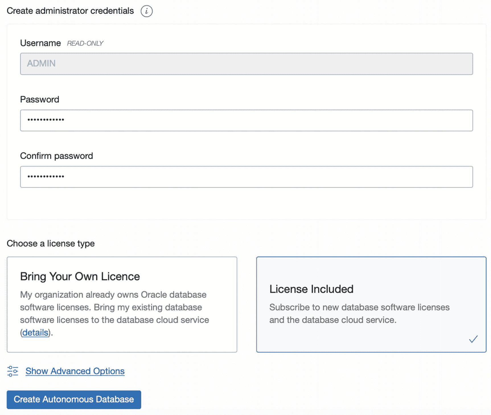

**图 7-6** OCI 控制台中的自治数据库创建向导 2/2

### 使用 OCI CLI

正如我提到的，本书侧重于自动化。因此，我们将使用 OCI CLI 代表`sandbox-admin`用户在`Sandbox` compartment 中启动一个新的自治数据仓库实例。

我假设`SANDBOX-ADMIN` CLI 配置文件已如第 4 章所述正确设置，`oci_cli_rc`文件中的相应部分将`Sandbox` compartment 指向为所有 CLI 命令的默认 compartment。

请确保您仔细选择 Admin 密码，密码必须遵循以下准则：长度在 12 到 30 个字符之间，并且至少包含一个小写字母、一个大写字母和一个数字。要配置 ADW 实例，请记住替换密码，并像这样使用`db autonomous-database create` CLI 命令：

```
$ ADW_ADMIN_PASS=evr43453fEWQ3@EF
$ oci db autonomous-database create \
    --db-name ROADDW \
    --display-name road-adw \
    --db-workload DW \
    --license-model LICENSE_INCLUDED \
    --cpu-core-count 1 \
    --data-storage-size-in-tbs 1 \
    --admin-password "$ADW_ADMIN_PASS" \
    --wait-for-state AVAILABLE \
    --profile SANDBOX-ADMIN
Action completed.
Waiting until the resource has entered state: AVAILABLE
```

Oracle 最近增加了一个名为“始终免费”的免费套餐。在撰写本文时，您可以配置最多两个 ADB 实例，每个实例限制为 1 个 OCPU 和 20GB。这些实例不会产生任何费用。要启动一个始终免费的 ADB 实例，请对`oci db autonomous-database create` CLI 命令使用`--is-free-tier true`选项。

```
$ oci db autonomous-database create \
    ...
    --is-free-tier true \
    ...
```

**提示：** 如果您使用的是付费账户，请考虑使用免费套餐启动您的 ROADDW ADB 实例，以运行本章描述的练习。

这将创建一个新的无服务器自治数据库实例，该实例针对数据仓库进行了优化，最初配备一个 CPU 和 1TB 的硬件容量。响应显示了一些有趣的细节，包括 Oracle 数据库版本和 Service Console URL。

```
...
"cpu-core-count": 1,
"data-storage-size-in-tbs": 1,
"db-name": "ROADDW",
"db-version": "18c",
"db-workload": "DW",
"display-name": "road-adw",
"id": "ocid1.autonomousdatabase.oc1.eu-frankfurt-1.ab...hm23ea",
"is-auto-scaling-enabled": false,
"is-dedicated": false,
"license-model": "LICENSE_INCLUDED",
"lifecycle-state": "AVAILABLE",
"service-console-url": "https://adb.eu-frankfurt-1.oraclecloud.com/console/index.html?tenant_name=OCID1.TENANCY.OC1..AA.........3YYMFA&database_name=ROADDW&service_type=ADW",
...
```

### 访问 ADB 服务控制台

ADW 数据库可以完全独立于 OCI 控制台使用；因此，提供了一个单独的仪表板，称为 ADB 服务控制台。您可以收藏并分发`db autonomous-database create` CLI 命令响应中`service-console-url`元素所示的直接链接。

首次访问此链接后，您必须以 ADB `ADMIN`用户身份登录，并提供您刚才为此用户设置的密码。服务控制台的概览仪表板如图 7-7 所示。

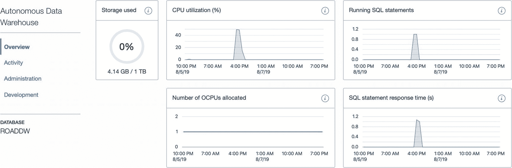

**图 7-7** 自治数据库服务控制台仪表板

### 在 OCI 控制台中查看 ADB 实例

让我们退一步，在 OCI 控制台中检查 ADW 实例的详细信息。选定 compartment 中存在的所有实例都会被列出，如图 7-8 所示。

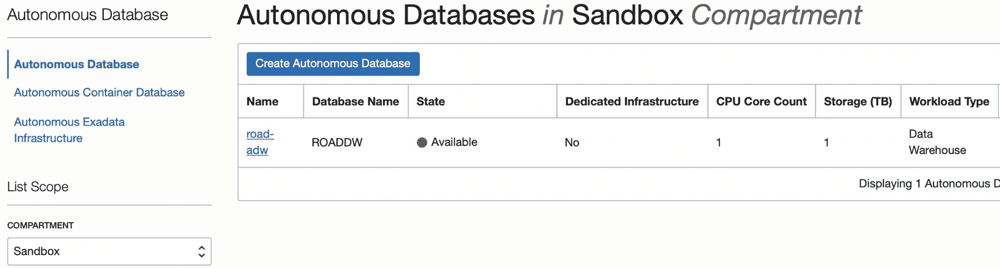

**图 7-8** 在 OCI 控制台中查看 ADB 实例

要在 OCI 控制台中显示特定 ADB 实例的详细信息，请执行以下操作：

1.  转到菜单 ➤ 数据库 ➤ 自治数据仓库。
2.  确保选择了`Sandbox` compartment。
3.  点击您的 ADW 实例名称（`road-adw`）。


除了实例信息之外，您会在详情视图的顶部看到若干不同的按钮，如图 7-9 所示，以及底部的备份区域。顾名思义，`Service Console`（服务控制台）将打开我已经向您介绍过的实例专属控制台。`Scale Up/Down`（向上/向下扩展）将允许您调整分配给实例的 CPU 数量以及以 1TB 为增量的存储。在撰写本文时，您应该能够为单个`ADB`实例分配最多 128 个 CPU 和最多 128TB 的存储。默认情况下，标准试用版或按需付费账户的自治数据库服务限制设置为 8 个 CPU，但您可以申请提高限制。请注意，您的云账户将根据使用的 CPU 数量和分配的存储容量进行计费。为了降低成本，如果您知道将会有空闲时间，可以停止实例。这通常仅在数据仓库系统的特定时间窗口内有意义，此时既不进行数据加载，也不执行查询。停止实例不会暂停由存储容量产生的成本。

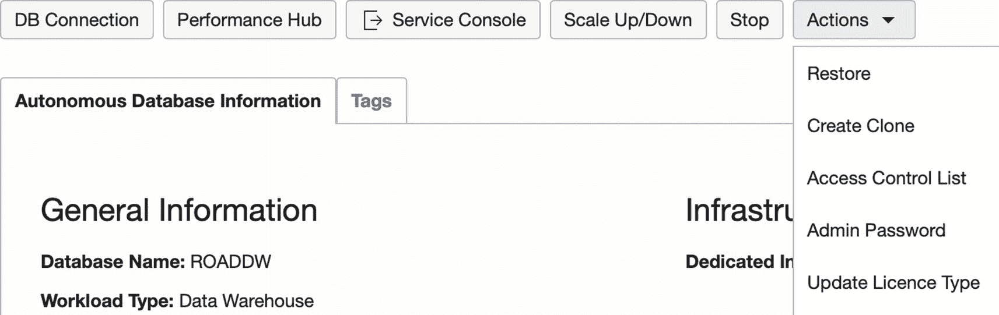
*图 7-9. OCI 控制台中可用的`ADB`实例操作*

自治数据库每天都会自动备份，无需用户干预。每周执行一次完整备份。其余几天则进行增量备份。所有这些备份都会保留 60 天。所有自动备份都可以视为热备份，这基本上意味着在进行备份时，数据库保持可操作和可用状态。如果出现问题，例如某个表被意外截断或整个模式被删除，您可以从选定的备份中恢复其状态。可用备份列表在 OCI 控制台的`ADB`详情视图底部可见，如图 7-10 所示，也可以通过`OCI CLI`获取。

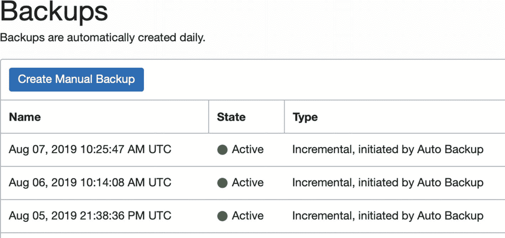
*图 7-10. OCI 控制台中的`ADB`备份*

尽管我们可以考虑使用`ADMIN`用户进行常规数据库查询，但这违背了通常推荐的做法。此外，Oracle 数据库对象（如表或视图）存在于模式的范围内。一个模式与一个数据库用户相关联。要在`road`模式中创建几个表，我们需要创建`road`数据库用户并向该用户授予所有必需的权限。自治数据库基于最新版本的 Oracle 数据库并与其兼容；因此，我们创建数据库用户的方式与在传统本地 Oracle 数据库实例中所做的相同。我们现在将以`ADMIN`身份连接到数据库，创建一个新用户，并向该用户授予所有必需的权限。

### SQL Developer Web
如果您曾经使用过 Oracle 数据库，您可能知道`SQL Developer`是什么。Oracle `SQL Developer`是一个基于 Java 的 SQL 桌面 IDE，用于 Oracle 数据库。您可以免费下载它，并将其与传统的和自治的 Oracle 数据库一起使用。`ADB`附带了`SQL Developer Web`，这是一个针对`ADB`相关任务优化的、基于浏览器的等效工具。它提供了更成熟的桌面版中可用功能的一个子集，但对于大多数 SQL 任务来说，其功能应该足够好。让我们访问它。

1.  转到`Menu`（菜单）➤ `Database`（数据库）➤ `Autonomous Data Warehouse`（自治数据仓库）。
2.  确保选择了`Sandbox`（沙盒） compartment。
3.  点击您的`ADW`实例的名称。
4.  点击`Service Console`按钮。

> **提示** 如果在点击`Service Console`按钮后没有任何反应，新窗口可能已被您的浏览器阻止。在浏览器中，您需要允许此页面打开新窗口。

5.  以`ADMIN`用户身份登录。
6.  点击`Development`（开发）。
7.  点击`SQL Developer Web`。

如果系统提示您再次登录，请使用相同的`ADMIN`凭据。您可以将以下查询粘贴到工作区区域，然后点击绿色的`Run Statement`（运行语句）按钮，将会看到与图 7-11 类似的内容：

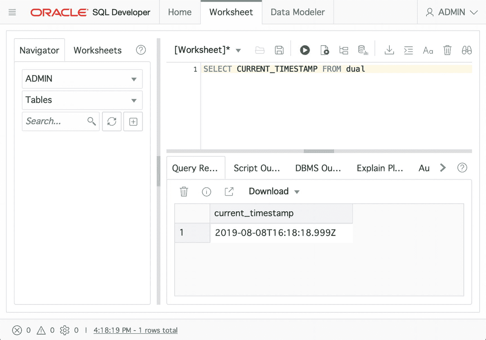
*图 7-11. `SQL Developer Web`*

```sql
SELECT CURRENT_TIMESTAMP FROM dual;
```

仍然在`SQL Developer Web`中，粘贴下面显示的 SQL 语句，修改位于`IDENTIFIED`子句后的密码，然后运行查询：

```sql
CREATE USER SANDBOX_USER IDENTIFIED BY "y0uRp@55worD";
GRANT dwrole TO SANDBOX_USER;
ALTER USER SANDBOX_USER QUOTA 500M ON DATA;
```

将创建一个名为`SANDBOX_USER`的新数据库用户，并授予名为`dwrole`的预定义、`ADW`专属数据库角色。如果您点击底部的`Script Output`（脚本输出）选项卡，您应该会看到两条消息，宣布两项操作均成功。

```
User SANDBOX_USER created.
Grant succeeded.
```

`dwrole`数据库角色为用户配备了三组权限。

*   标准的 SQL 数据定义语言（`DDL`）操作，例如创建表、触发器、视图、过程等
*   Oracle 特有的数据仓库和商业智能 SQL `DDL`操作，例如分析视图、属性维度、层次结构和数据挖掘模型
*   `DBMS_CLOUD` `PL/SQL`包，它捆绑了主要与从云对象存储向数据库表填充数据相关的云基自治数据库过程

为了让新创建的`SANDBOX_USER`用户能够访问并在`SQL Developer Web`中工作，必须为用户模式启用 Oracle REST 数据库服务（`ORDS`）访问。为此，仍然以`ADMIN`用户身份，执行`ORDS_ADMIN.ENABLE_SCHEMA`过程，如下所示：

```sql
BEGIN
  ords_admin.enable_schema(
    p_enabled => TRUE,
    p_schema => 'SANDBOX_USER',
    p_url_mapping_type => 'BASE_PATH',
    p_url_mapping_pattern => 'sandbox',
    p_auto_rest_auth => TRUE
  );
  commit;
END;
```

底部的`Script Output`选项卡中应该会显示一条消息：

```
PL/SQL procedure successfully completed.
```

`p_schema`参数引用新创建的用户，而`p_url_mapping_type`参数定义了为用户专用的`SQL Developer Web`URL 中的用户专属部分。图 7-12 展示了`SQL Developer Web` URL 的典型结构。

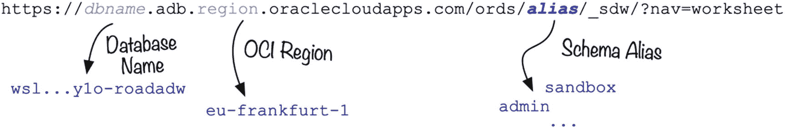
*图 7-12. `SQL Developer Web` URL 结构*

通常，您需要准备用户专属的 URL 并将其交付给用户，方法是将`schema-alias`部分替换为之前在`ORDS_ADMIN.ENABLE_SCHEMA`过程中使用的 URL 映射模式值。您可以复制基础的`SQL Developer Web` URL，此时您仍以`ADMIN`用户身份使用这个基于浏览器的工具。您必须将`schema-alias`部分（在此情况下最初设置为`admin`值）替换为`sandbox`值。

这次让我们以`SANDBOX_USER`身份访问`SQL Developer Web`。您可以在新的浏览器标签页中打开修改后的 URL。

> **提示** 作为切换标签页的替代方法，您可以为每个`SQL Developer Web`会话使用两个不同的浏览器。这样，您将能够在一个标签页（或浏览器）中继续以`ADMIN`身份工作，同时在第二个标签页（或浏览器）中以`SANDBOX_USER`身份工作，如图 7-13 所示。

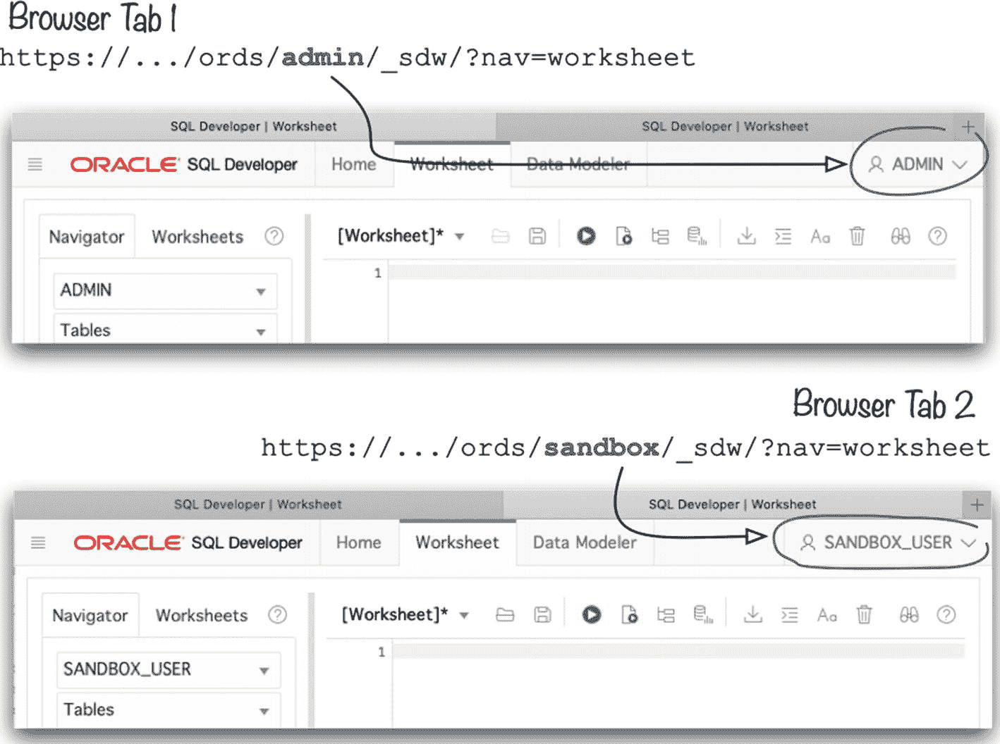
*图 7-13. `SQL Developer Web`用户*


### 向 ADW 加载数据

自治数据库 (Autonomous Database) 是一项基于云的托管数据库服务。从文件加载数据的推荐方法是：将文件上传至对象存储桶，然后执行 `DBMS_CLOUD.COPY_DATA` 过程来解析这些文件并将数据插入数据库表。此过程能够从以下来源加载数据：

*   Oracle Cloud Infrastructure 对象存储
*   Azure Blob Storage
*   Amazon S3

使用与 ADB 实例处于同一区域的 Oracle Cloud Infrastructure 对象存储桶可以实现最短的数据加载时间，但使用其他组合也完全没有问题。ADW 实例代表特定的 IAM 用户访问 OCI 对象存储。

#### 数据库凭证

`DBMS_CLOUD.COPY_DATA` 过程引用一个 `Credential` 数据库对象，该对象保存访问基于云的对象存储所需的认证详细信息。对于 OCI 对象存储，IAM 用户必须持有一个有效的身份验证令牌 (Auth Token)，该令牌将与此用户名一起保存在此 `Credential` 对象中。令牌是一个相对较短的、由 Oracle 生成的字符串。任何 IAM 用户最多可以同时拥有两个身份验证令牌。用户可以自行创建令牌，管理员也可以使用 OCI 控制台或利用基于 API 的自动化工具（如 OCI CLI）随意创建令牌。

以下是你在 OCI 控制台中以 `sandbox-user` 身份生成身份验证令牌的步骤：


图 7-14：在 OCI 控制台中访问用户配置文件

1.  以 `sandbox-user` 身份登录 OCI 控制台。
2.  点击用户名进入用户配置文件，如图 7-14 所示。
3.  在“资源”选项卡上，单击“身份验证令牌”。
4.  单击“生成令牌”。
5.  为令牌提供描述，然后单击“生成令牌”。
6.  记下你的令牌。你只会看到它一次。

必须记住，新生成的身份验证令牌你只会看到一次，如图 7-15 所示。如果丢失，你必须删除旧令牌并生成一个新令牌。

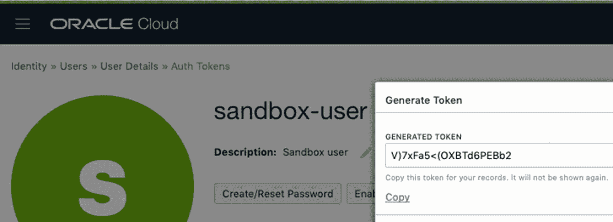

图 7-15：查看生成的令牌

要以编程方式为选定用户生成身份验证令牌，你可以使用默认配置文件（无 `--profile` 参数）代表租户管理员执行以下 CLI 命令。首先查询特定用户的 OCID，然后对该用户使用 `iam auth-token create` CLI 命令。

```
$ TENANCY_OCID=`cat ~/.oci/config | grep tenancy | sed 's/tenancy=//'`
$ IAM_USER_OCID=`oci iam user list -c $TENANCY_OCID --query "data[?name=='sandbox-user'] | [0].id" --raw-output --all`
$ echo $IAM_USER_OCID
ocid1.user.oc1..aa.........zqpxa
$ oci iam auth-token create --user-id $IAM_USER_OCID --description token-adw --query ‘data.token’ --raw-output
B8.E_Ry7oOtN1KF0do9x
```

无论你选择哪种方式，请确保你拥有 `sandbox-user` IAM 用户的身份验证令牌。

名为 `SANDBOX_USER` 的新数据库用户与我们在前几章中一直使用的 `sandbox-user` IAM 用户完全独立。我们现在将创建一个数据库 `Credential` 对象来存储 `sandbox-user` IAM 用户的用户名和身份验证令牌。这些详细信息将以加密格式存储在数据库中。每次你执行 `DBMS_CLOUD.COPY_DATA` 过程将对象存储中的数据加载到数据库表时，你都需要提供要使用的 `Credential` 对象的名称。

> **提示**
>
> 从现在开始，大多数 SQL 命令都需要以 `SANDBOX_ADMIN` 的身份在 SQL Developer Web 中执行。请确保你打开了正确的 SQL Developer Web 实例，使用前面几段描述的用户特定链接。

以 `SANDBOX_USER` 数据库用户身份打开 SQL Developer Web，将 SQL 过程放在工作表中，使用你新生成的身份验证令牌作为密码参数的值，并执行以下命令：

```
BEGIN
DBMS_CLOUD.CREATE_CREDENTIAL(
credential_name => 'OCI_SANDBOX_USER',
username => 'sandbox-user',
password => 'B8.E_Ry7oOtN1KF0do9x'
);
END;
```

`Credential` 对象存在于特定的用户模式中，并且只能由有权访问该模式的用户访问。按照惯例，每个 Oracle Database 模式都与同名的单个数据库用户相关联。你可以假设，默认情况下，只允许 `Credential` 所有者用户引用此 `Credential` 对象。要删除现有的 `Credential` 对象，你应依赖 `DBMS_CLOUD.DROP_CREDENTIAL` 过程。要列出给定模式中现有的 `Credential` 对象，你可以使用以下 SQL 查询（作为模式所有者）：

```
SELECT * FROM all_credentials;
```

将文件数据加载到 ADB 可以总结为三个步骤。我们稍后将遵循这些步骤。

1.  将支持的格式（如 `.csv`）的源文件上传到对象存储桶。
2.  如果表尚不存在，则为导入的数据创建一个新的数据库表。
3.  执行 `DBMS_CLOUD.COPY_DATA` 以填充表。

此过程的概念图如图 7-16 所示。

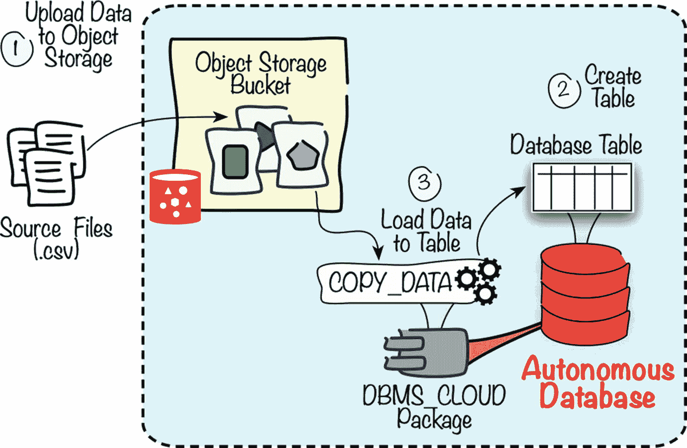

图 7-16：从对象存储加载数据到 ADW

之前，我们创建了一个 `Credential` 数据库对象，该对象将允许 ADW 实例代表指定的 IAM 用户访问 OCI 对象存储。我们仍然需要创建一个对象存储桶。在第 5 章中，你了解到要设置一个新的存储桶，你可以依赖以下 OCI CLI 命令，并通过 `SANDBOX-ADMIN` 配置文件代表 `sandbox-admin` 用户执行。现在就执行它，创建一个名为 `roadadw-load` 的新存储桶。

```
$ oci os bucket create --name roadadw-load --profile SANDBOX-ADMIN
```

基于第 5 章中设置的 IAM 策略，`sandbox-user` 被允许仅上传数据到名为 `blueprints` 的对象存储桶。让我们通过添加代码清单 7-2 中所示的新的 IAM 策略语句来扩展这个访问范围。现在，我们将允许 `sandbox-users` 将对象上传到 `roadadw-load` 存储桶。

```
[
"allow group sandbox-users to read buckets in compartment Sandbox where target.bucket.name='roadadw-load'",
"allow group sandbox-users to manage objects in compartment Sandbox where target.bucket.name='roadadw-load'"
]
```

代码清单 7-2: `sandbox-users.policies.adwstorage.json`

我们可以使用 `oci iam policy create` CLI 命令，以与前几章添加新策略相同的方式，在 `Sandbox` 盈利中创建一条新策略。该策略应添加到 `Sandbox` 盈利中。只要你仍然使用如前几章所述配置的 `oci_cli_rc` 文件，这些命令就应该能完成工作：

```
$ cd ~/git/oci-book/chapter07/1-setup/
$ oci iam policy create --name sandbox-users-adw-storage-policy --statements file://sandbox-users.policies.adwstorage.json --description "ADW-Storage-related policy for regular Sandbox users" --profile SANDBOX-ADMIN
```

有了新策略，我们就可以将包含各种新 ADW 表输入数据的文件上传到 `roadadw-load` 对象存储桶。在此阶段，值得提及这些文件是什么以及我们将如何使用它们。


#### 星型模式

我已提及，我们将模拟一个简单的数据仓库应用场景。`星型模式`是一种典型的关系型数据库表结构，它使得执行典型的商业智能操作（如透视、选择、切片、切块以及向下钻取和向上汇总）变得更加容易。在本章开头，我已向你介绍了表之间关系的概念及其在关系型数据库中的重要性。在`星型模式`的核心，存在一个`事实表`，其中包含部分聚合的数值型数据，例如以货币表示的销售额结果、以测量单位表示的各种度量、以数量表示的生产量，或使用收集统计数据量化的观测事件。本章的练习构建在类似于波兰道路上报告的事故和事件的数据之上。这些事件使用以下度量进行量化：
*   事件数量（发生次数）
*   受伤人数
*   死亡人数

仅靠数字不足以进行数据分析。我们需要知道存储在`事实表`中的每条记录的上下文。这些上下文被称为维度。道路事件可能发生在某个特定日期（`时间`维度）和某段特定道路上（`道路`维度），并具有特定类型，如追尾碰撞、超速或无证驾驶（`事件类型`维度）。你可能希望将特定类型的道路事件归类为类别层级。追尾碰撞和侧面碰撞可能都属于“碰撞”类别。接着，多个类别可以归并为道路事件类别，如“事故”或“事件”。因此，`事件类型`维度将具有三级层次结构：最顶层的道路事件类别，中间层的道路事件类别，以及最底层的道路事件类型。如果你考虑`时间`维度的层次结构，最常见的粒度级别是日、月、年。对于`道路`维度层次结构，你可以区分路段和道路。维度通过如图 7-17 所示的方式，为每个单独的`事实表`条目提供了多样化的上下文。

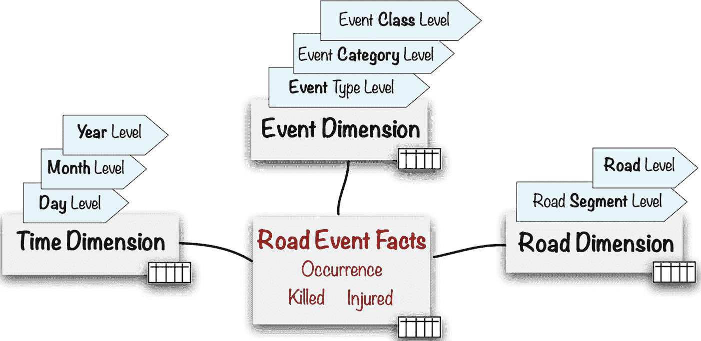

图 7-17：星型模式

例如，包含在`道路事件`事实表中的一项观测可能表明，2017 年 3 月 7 日，在库亚维-波美拉尼亚省（地区）的 DK5 快速道路段上发生了七起车辆驶出路外事故。该特定事实表记录中包含的进一步数值数据可能告知我们，这七起事故总共造成两人受伤，六人死亡。

考虑到本章内容，我已经准备好了进行后续练习所需的所有数据。你将从本书 Git 仓库中提供的逗号分隔值文件中加载三个维度和整个事实表。

##### 维度

我们已经说过，没有适当的上下文，你的事实数据几乎是无用的。维度为你的事实提供上下文，让你能够获得关于数据含义的宝贵洞察。你可以在 `chapter07/2-dimensions` 目录中找到维度数据文件。

```
$ cd ~/git/oci-book/chapter07/2-dimensions/
$ ls -1 *_dim.csv
event_dim.csv
road_dim.csv
time_dim.csv
```

文件名表明了每个文件中存储的数据记录类型。`event_dim.csv` 文件包含`事件类型`维度条目，`road_dim.csv` 包含`道路`维度条目，`time_dim.csv` 包含`时间`维度条目。这些文件使用众所周知的 CSV 人类可读文本格式。值之间使用逗号 (`,`) 字符分隔。每一行代表一条数据记录。第一行是包含列名的标题。图 7-18 展示了.csv 文件内容如何映射到我们即将创建并填充的数据库表。

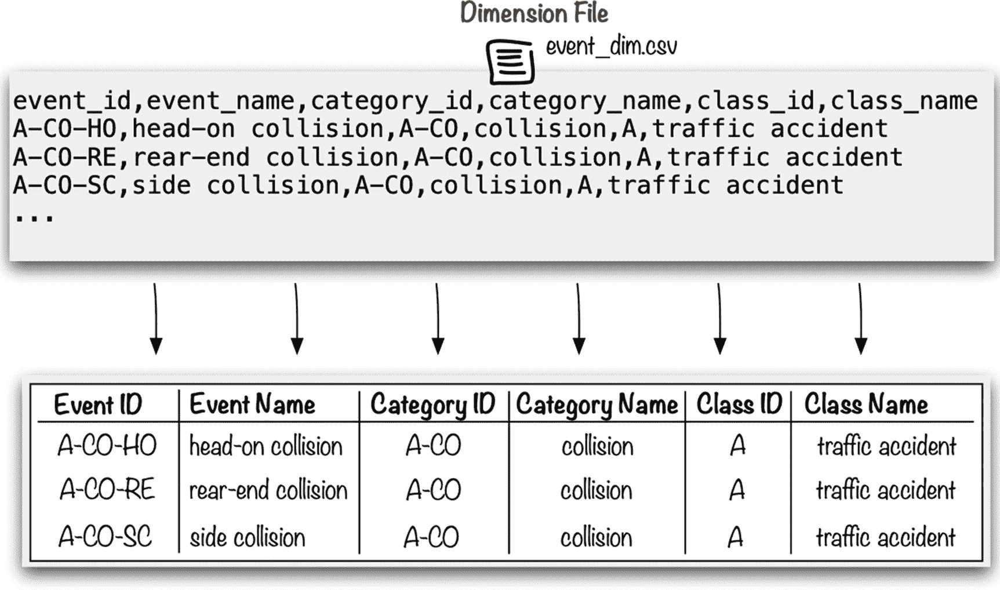

图 7-18：维度文件

我假设你已经按照刚才的指示创建了 `roadadw-load` 存储桶。让我们将维度文件上传到这个存储桶。我们将使用 `os object put` OCI CLI 命令。你在第 5 章已经学过如何操作。记得选择你在第 4 章创建的 `SANDBOX-USER` CLI 配置文件。该配置文件最终将代表 `sandbox-user` 执行 API 调用。

```
$ oci os object put -bn roadadw-load --file time_dim.csv --profile SANDBOX-USER
Uploading object  [####################################]  100%
$ oci os object put -bn roadadw-load --file road_dim.csv --profile SANDBOX-USER
Uploading object  [####################################]  100%
$ oci os object put -bn roadadw-load --file event_dim.csv --profile SANDBOX-USER
Uploading object  [####################################]  100%
```

你可以在 OCI 控制台对象存储仪表板的`存储桶详情`视图中查看新上传的文件。在 OCI 控制台中执行以下步骤：
1.  转到菜单 ➤ `对象存储` ➤ `对象存储`。
2.  点击存储桶名称。

在`存储桶详情`视图的`对象`表中，你应该能看到这些对象。图 7-19 展示了这三个文件作为`roadadw-load`存储桶中的对象存储对象。

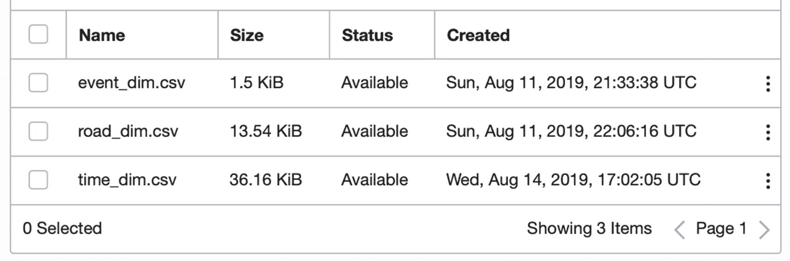

图 7-19：对象存储桶中的维度数据文件

`时间`维度包含 731 条记录。每条记录代表 2016 年 1 月 1 日至 2017 年 12 月 31 日之间的一个日历日。如果你好奇为什么是 731 天而不是 730 天（2 × 365 天），答案很简单。2016 年是闰年，总共有 366 天。`时间`维度有三个层次级别，如图 7-20 所示。每个维度属性最终映射到数据库表的一个列，并属于一个特定的级别。此外，每个级别都有一个属性用于唯一标识该级别。这些属性（`day_id`、`month_id` 和 `year_id`）的名称通常以 `_id` 作为后缀。

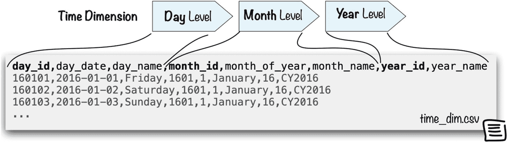

图 7-20：时间维度

# 道路维度

道路维度包含 263 条记录，具有两个层级，即 `路段` 和 `道路`。单个路段代表特定**省**内所有同类型的公路部分，例如普通道路 (`G`)、主要道路 (`GP`)、快速路 (`S`) 和高速公路 (`A`)。如果查看图 7-21，路段 `R01S01` 代表所有高速公路类型的公路，从组织管理的角度看，它们属于道路 `DK1`，并位于滨海省。

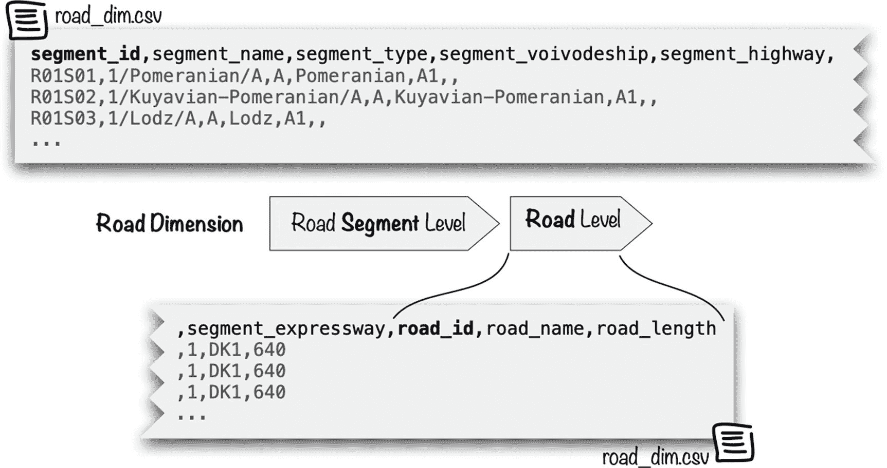
图 7-21：道路维度

# 事件维度

事件维度包含 24 条记录，具有三个层级。我们之前已经讨论过一些，但为了回顾一下，最细粒度的 `道路事件类型` 属于中间级的 `道路事件类别`，而最高级的则是 `道路事件类别`，如图 7-22 所示。

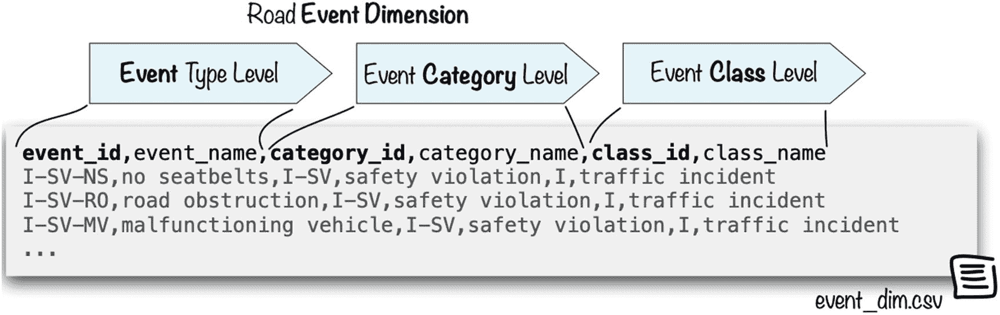
图 7-22：道路事件维度

总而言之，维度数据已成功上传至 Oracle Cloud 中的对象存储。在尝试填充这些表之前，我们仍需在 Autonomous Data Warehouse 实例中创建维度数据库表。打开 `SANDBOX_USER` 用户的 SQL Developer Web，并执行第一个 SQL 数据定义语言（DDL）语句。

```sql
create table EVENT_DIM (
event_id        char(7) not null,
event_name      varchar2(50) not null,
category_id     char(4) not null,
category_name   varchar2(50) not null,
class_id        char(1) not null,
class_name      varchar2(50) not null,
constraint pk_event_dim primary key (event_id)
);
```

结果，事件类型维度的第一个维度表将被创建。

Autonomous Database 本质上是一个基于云的 Oracle 数据库；因此，我们使用 Oracle Database 数据类型，如 `VARCHAR2`。我们创建了一个包含六列的表，每一列对应一个维度属性。表的主键设置为最细粒度的维度层级标识符。你应该会看到表已成功创建的消息。

```
Table EVENT_DIM created
```

是时候填充新创建的数据库表，并从封装了事件类型维度逗号分隔值文件的相应对象中加载数据了。仍然在 SQL Developer Web 中，准备 `DBMS_CLOUD.COPY_DATA` 过程。你需要修改 `file_uri_list` 输入参数，并将其设置为代表 `event_dim.csv` 文件的对象的 URI。基本上，你需要使用你的区域代码（在我的例子中是 `eu-frankfurt-1`）和你的对象存储命名空间（在我的例子中是 `jakobczyk`）。你可以在 OCI 控制台该对象的“对象详细信息”弹出窗口中找到每个对象的确切值。准备好后，执行以下过程：

```sql
BEGIN
DBMS_CLOUD.COPY_DATA(
table_name => 'EVENT_DIM',
credential_name => 'OCI_SANDBOX_USER',
file_uri_list => 'https://objectstorage.eu-frankfurt-1.oraclecloud.com/n/jakobczyk/b/roadadw-load/o/event_dim.csv',
format => json_object('type' value 'CSV', 'skipheaders' value '1')
);
END;
```

`DBMS_CLOUD.COPY_DATA` 过程使用一个按名称引用的凭证数据库对象，该名称由你作为 `credential_name` 参数的值提供。该过程处理 `file_uri_list` 参数中提到的所有文件，同时考虑你通过 `format` 参数提供的任何特定格式相关设置。最后，数据被插入到你通过 `table_name` 参数设置的目标表中。在我们的例子中，这将是我们刚刚创建的 `EVENT_DIM` 表。我们指示该过程文件是 CSV 格式，并且包含我们希望跳过的标题。该过程应返回一条简短消息，表明一切顺利。

```
PL/SQL procedure successfully completed.
```

我们这里不会练习错误处理，但简单了解一下该过程如何处理任何意外的加载问题是好的。首先，你必须知道可以添加到 `format` 字段的 `rejectlimit` 属性。`rejectlimit` 属性定义了可以忽略而不会导致过程报错的无效行的最大数量。默认情况下，此值设置为 `0`，这意味着即使只有一行违反列数据类型、参照完整性或任何其他约束，整个数据加载也将回滚。在这种情况下，你将在输出消息中收到通知，其中可以找到详细的过程日志。它通常存储在动态创建的表中，其名称类似于 `COPY$1_LOG`。

让我们看一下 `EVENT_DIM` 数据库表中的事件类型维度数据。在同一个 SQL Developer Web 工作表中，运行以下查询以从 `EVENT_DIM` 表中选择所有记录：

```sql
select * from event_dim;
```

结果如图 7-23 所示。请随意将你看到的查询结果窗格中的内容与 `event_dim.csv` 文件的内容进行比较。

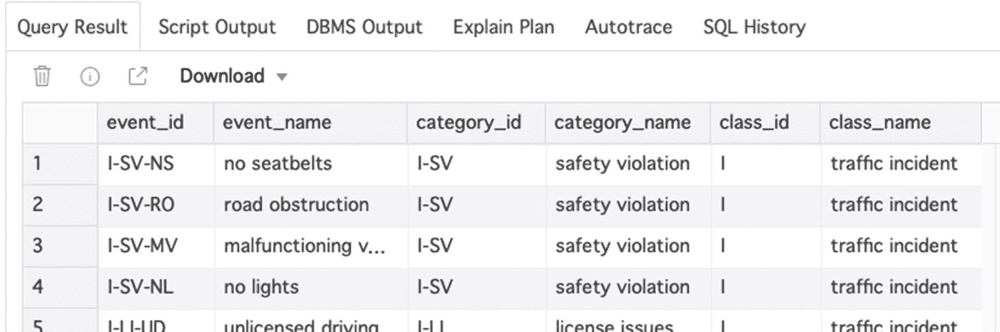
图 7-23：SQL Developer Web 中的事件维度数据

现在，我们将重复对事件类型维度所做的操作，并应用相同的步骤来加载剩余的两个维度。使用以下 SQL DDL 语句为道路维度创建新的数据库表：

```sql
create table ROAD_DIM (
segment_id          char(6) not null,
segment_name        varchar2(50) not null,
segment_type        char(2) not null,
segment_voivodeship varchar2(50) not null,
segment_highway     varchar2(50),
segment_expressway  varchar2(50),
road_id             varchar2(10) not null,
road_name           varchar2(10) not null,
road_lenght         number(5),
constraint pk_road_dim primary key (segment_id),
constraint chk_segment_type
check ( segment_type in ('A','S','GP','G'))
);
```

`ROAD_DIM` 数据库表包含两列允许 `NULL` 值。在数据库领域及其他领域，`NULL` 被理解为“无值”，用于区别于“空值”。此外，该表使用了一个额外的 `CHECK` 约束，以确保 `segment_type` 列只允许四个列出的值（`A`、`S`、`GP` 和 `G`）。运行 DDL 语句后，你应该会收到以下消息：

```
Table ROAD_DIM created
```

因此，调整下一个代码片段中所示的过程，替换区域代码和对象存储命名空间（就像你之前做的那样），并执行它以填充 `ROAD_DIM` 表。

```sql
BEGIN
DBMS_CLOUD.COPY_DATA(
table_name => 'ROAD_DIM',
credential_name => 'OCI_SANDBOX_USER',
file_uri_list => 'https://objectstorage.eu-frankfurt-1.oraclecloud.com/n/jakobczyk/b/roadadw-load/o/road_dim.csv',
format => json_object('type' value 'CSV', 'skipheaders' value '1', 'blankasnull' value 'true')
);
END;
```

这次，我们添加了一个名为 `blankasnull` 的新格式属性。因此，源文件中的所有空字段将在其对应的数据库字段中表示为 `NULL`。我们不期望出现任何意外。

```
PL/SQL procedure successfully completed.
```

再次使用 SQL Developer Web 显示刚刚复制到 `ROAD_DIM` 表中的内容。

```sql
select * from road_dim;
```

结果如图 7-24 所示。

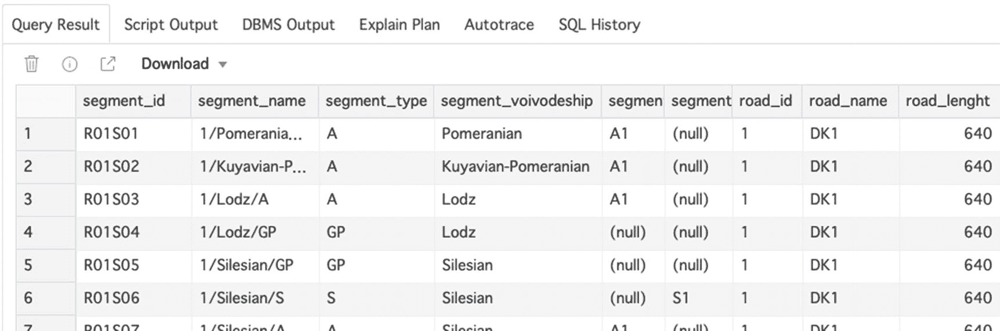
图 7-24：SQL Developer Web 中的道路维度

# 时间维度

唯一剩下的维度是时间维度。创建下表：


##### 事实

维度为事实提供了上下文。然而，事实承载着最有价值的信息，即各种数值数据，这些数据后续可以用于各种分析操作。与维度不同，事实表可能非常大，包含海量的记录。很多时候，记录集合如此之大，以至于必须拆分成多个源数据文件。为了模拟这一点，我准备了不止一个，而是四个逗号分隔值文件，其中包含事实表的源数据。每个文件包含从跨越半年的时间段内收集的事实。这样，四个文件总共包含了两个日历年份的数据。你可以在 `chapter07/3-facts` 目录中找到这些事实数据文件。

```
$ cd ~/git/oci-book/chapter07/3-facts/
$ ls -1 *.csv
facts.16H1.csv
facts.16H2.csv
facts.17H1.csv
facts.17H2.csv
```

图 7-26 展示了保存事实表数据的逗号分隔值文件的结构。每条记录引用一个时间维度、一个道路维度和一个事件维度条目。例如，事实表源文件中的 `road_dim_id` 列与 `ROAD_DIM` 表中 `segment_id` 列具有相同值的一条道路维度记录相匹配。维度信息列之后是定量数据列，这些列承载着道路事件发生情况以及相关的伤亡人数信息。

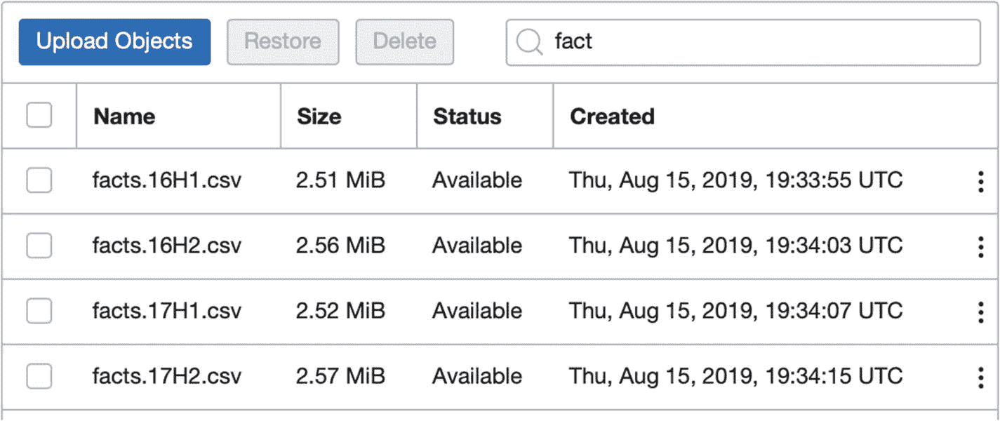
图 7-27
对象存储存储桶中的事实数据文件

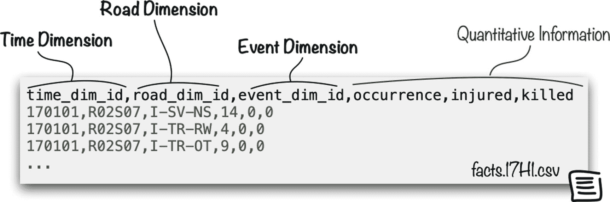
图 7-26
道路事件事实

使用 `os object put` CLI 命令将所有四个事实文件上传到对象存储存储桶。记得像之前一样应用 `SANDBOX-USER` 配置文件。你可以通过以下方式在 Bash shell `for` 循环中使用它：

```
$ for fact in `ls facts.*.csv`; do echo $fact; oci os object put -bn roadadw-load --file $fact --profile SANDBOX-USER; done
facts.16H1.csv
Uploading object  [####################################]  100%
facts.16H2.csv
Uploading object  [####################################]  100%
facts.17H1.csv
Uploading object  [####################################]  100%
facts.17H2.csv
Uploading object  [####################################]  100%
```

你现在应该能在 `roadadw-load` 存储桶中看到这些文件作为对象，如图 7-27 所示。

回到 SQL Developer Web，仍然以 `SANDBOX_USER` 用户登录，执行将创建数据库事实表的 SQL DDL 语句。

```
create table ROADEVENTS_FACT (
    time_dim_id     char(6) not null,
    road_dim_id     char(6) not null,
    event_dim_id    char(7) not null,
    occurrence      number(10) not null,
    injured         number(10) not null,
    killed          number(10) not null,
    constraint pk_roadevents_fact
        primary key (time_dim_id, road_dim_id, event_dim_id),
    constraint fk_road_dim
        foreign key (road_dim_id)
        references ROAD_DIM(segment_id),
    constraint fk_event_dim
        foreign key (event_dim_id)
        references EVENT_DIM(event_id),
    constraint fk_time_dim
        foreign key (time_dim_id)
        references TIME_DIM(day_id)
);
```

事实表引用了维度表。使用外键约束来确保在将事实记录插入事实表之前，相应的维度表记录确实存在。通过这种方式，我们保护了数据模型的参照完整性。这张表应该能毫无问题地被创建。

```
Table ROADEVENTS_FACT created
```

Oracle 会自动为主键和唯一约束中使用的列创建索引，但不会为外键约束中的列创建索引。为了提升连接操作的性能，你可以像下面这样，在所有三个外键列上额外创建索引：


## 数据加载与数据库监控

```
CREATE INDEX roadevents_fact_time_ix
ON roadevents_fact (time_dim_id);
CREATE INDEX roadevents_fact_road_ix
ON roadevents_fact (road_dim_id);
CREATE INDEX roadevents_fact_event_ix
ON roadevents_fact (event_dim_id);
```

现在您已准备好执行 `COPY_DATA` 过程。像往常一样，调整区域代码和对象存储命名空间，并执行以下代码：

```
BEGIN
DBMS_CLOUD.COPY_DATA(
table_name => 'ROADEVENTS_FACT',
credential_name => 'OCI_SANDBOX_USER',
file_uri_list => 'https://objectstorage.eu-frankfurt-1.oraclecloud.com/n/jakobczyk/b/roadadw-load/o/facts.*.csv',
format => json_object('type' value 'CSV', 'skipheaders' value '1', 'blankasnull' value 'true')
);
END;
```

您已经熟悉所有参数。请注意 `file_uri_list` 参数值中使用的通配符。通过这种方式，我们可以方便地指定多个具有相似名称的源文件。该过程应在短时间内成功完成。

```
PL/SQL procedure successfully completed.
```

为了初步了解实际插入了多少事实记录，我们可以运行 `select count(*)` 查询。

```
select count(*) from ROADEVENTS_FACT;
```

结果显示总共有 377,808 行。让我们通过执行标准的 `select` SQL 查询查看其中一些数据。

```
select * from ROADEVENTS_FACT;
```

除非您想导出结果，否则 SQL Developer Web 将分批逐步加载数据，仅在您继续向下滚动时才加载更多数据。这可以防止我们在不必要时等待过长时间。结果如图 7-28 所示。

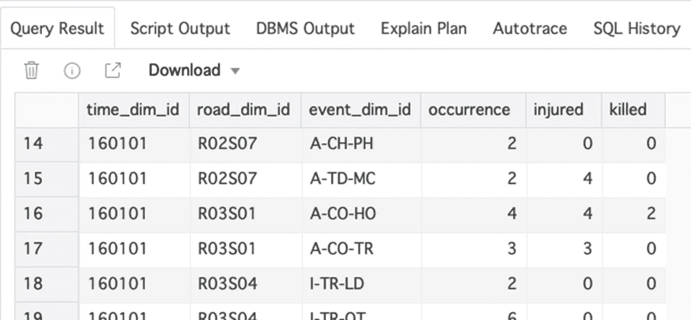

**图 7-28** SQL Developer Web 中的维度表

您已完成练习的数据加载部分。作为其中的一部分，我们执行了一些 SQL DDL 语句、存储过程以及几个 SQL `select` 语句。ADB 实例让您深入了解数据库的详细信息。让我们看看 ADW 中包含的一些监控功能。

### 数据库监控

Autonomous Database 实例配备了一个专用的服务控制台，可用于监控实例的性能。ADB 服务控制台仪表板已在图 7-7 中展示。要访问服务控制台，如果您之前保存了其直接链接，可以使用它。或者，您始终可以打开 OCI 控制台并执行以下步骤：

1.  转到菜单 ➤ 数据库 ➤ Autonomous Data Warehouse。
2.  确保选中 `Sandbox` compartment。
3.  单击您的 ADW 实例名称。
4.  单击服务控制台按钮。

提示

如果单击服务控制台按钮后没有任何反应，新窗口可能已被您的浏览器阻止。在浏览器中，您必须允许此页面打开新窗口。

在本章开始时，您配置了 ADW 实例。您为实例设置了两个与资源相关的参数，即初始分配的 CPU 数量和以太字节表示的初始存储容量。仪表板提供以下方面的当前和历史信息：

*   CPU 分配和利用率
*   所有数据库表空间使用的存储容量
*   已执行 SQL 语句的平均数量
*   SQL 语句的平均响应时间

图 7-29 中展示的活动视图提供了关于服务消耗的更细粒度信息，并让您可以检查详细的 SQL 执行信息。

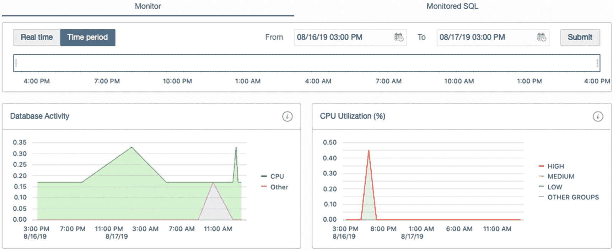

**图 7-29** ADW 数据库活动视图

活动视图允许您调整希望显示统计信息的时间间隔。默认情况下，ADW 为服务消耗保留历史信息八天，并以一小时为间隔进行。您可以将保留时间增加到大于这八天的值，并更改性能统计信息收集间隔。Autonomous Database 与传统的 Oracle Database 一样，依赖自动工作负载仓库 (AWR) 表来保留历史性能统计信息。AWR 表存储在 SYSAUX 表空间中，并属于 SYS 模式。以 `ADMIN` 身份打开 SQL Developer Web，并运行以下查询以显示当前的 AWR 设置：

```
select
extract( hour from snap_interval) interval_hours,
snap_interval,
extract( day from retention) retention_days,
retention
from SYS.DBA_HIST_WR_CONTROL
where dbid=(select con_dbid from v$database);
```

结果如图 7-30 所示。`snap_interval` 和 `retention` 列是 `INTERVAL` 类型，因此您可以利用 `EXTRACT()` 函数仅打印您感兴趣的部分（天、小时、分钟、秒）。

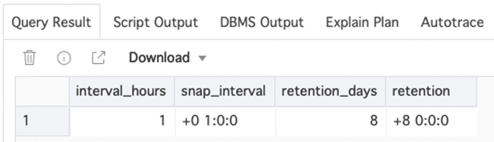

**图 7-30** AWR 的控制信息

要更改默认保留时间或默认统计信息快照收集间隔，您需要使用 `DBMS_WORKLOAD_REPOSITORY.MODIFY_SNAPSHOT_SETTINGS` 过程，如下所示：

```
BEGIN
DBMS_WORKLOAD_REPOSITORY.MODIFY_SNAPSHOT_SETTINGS(
retention => 20160,
interval => 60
);
END;
```

在此示例中，我们将保留期增加到两周（14 天等于我们用作 `retention` 参数输入的 20,160 分钟）。明智地调整此参数，因为保留期增加得越多，AWR 表在 `SYSAUX` 表空间中消耗的存储就越多。

访问 ADB 服务控制台活动视图中的“受监视的 SQL”选项卡，可为您提供正在执行和过去执行的 SQL 语句列表，如图 7-31 所示。

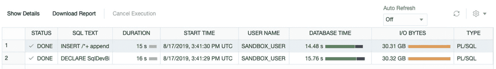

**图 7-31** ADW SQL 监视

您可以检查每个单独的 SQL 语句，并了解其等待统计信息、I/O 统计信息、执行计划性能以及并行性（如果适用）。为此，在“受监视的 SQL”选项卡上，右键单击您感兴趣的查询并选择“显示详细信息”选项。将向您显示一个新的弹出区域，如图 7-32 所示。

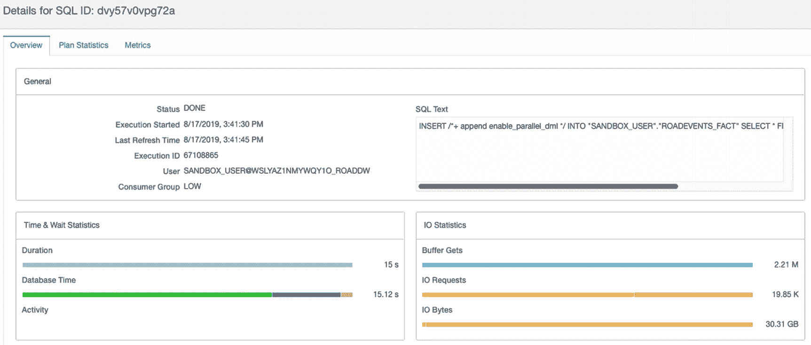

**图 7-32** SQL 执行详细信息

您已经学习了如何监控数据库实例。现在是时候让我们将注意力转回到之前加载到数据库表中的维度和事实数据了。是时候接触这些数据库表中存储的信息了。让我们执行一些有趣的查询。


## 数据分析

收集数据只是故事的一部分。理解我们为何要进行数据收集则更为重要。数据可以揭示不同的信息——有时是预期的，有时是令人惊讶的——这些信息关乎数据所代表的业务情况、对象、测量或事件。最传统、可能也是最普遍和成熟的方法，是有意识地查询数据集，以发现各种相关性、趋势、异常，或者更常见的，可用于报告的聚合结果，例如按业务部门划分的季度销售额。结果通常会进行数据可视化，这有助于阐释一大串数字真正表达的含义。除非我们处理的是标准化和常规报告，否则*数据分析*通常包含大量临时查询，这些查询的特点是未预定义且在特定查询执行前无法确定。为了处理此类查询，会采用专门的反规范化数据库表组合。你已经了解了最简单但往往已足够使用的**星型模式**。

如你所知，星型模式是反规范化数据库表的组合，是构建所谓**OLAP 立方体**的基础。什么是 OLAP 立方体？我们可以说它是一个多维结构，将维度属性层次结构与定量事实结合起来。嗯，这听起来可能有点太复杂了。从实际角度来看，方便的说法是，OLAP 立方体是一个更高级别的结构，通常构建在星型模式之上，提供了一种更抽象的方式来查看数据，超越了底层的表格结构。我们不再考虑维度表，而是讨论维度属性层次结构。在本章的上下文中，相应的 OLAP 立方体如图 7-33 所示。我特意为本章的示例数据选择了三个维度，因为它使得想象相应的 OLAP 立方体作为一个三维坐标系变得非常容易。每个维度都是一条轴线的基础。该坐标系中的每个点都可以看作是一个单一的事实条目，承载着各种定量数据。

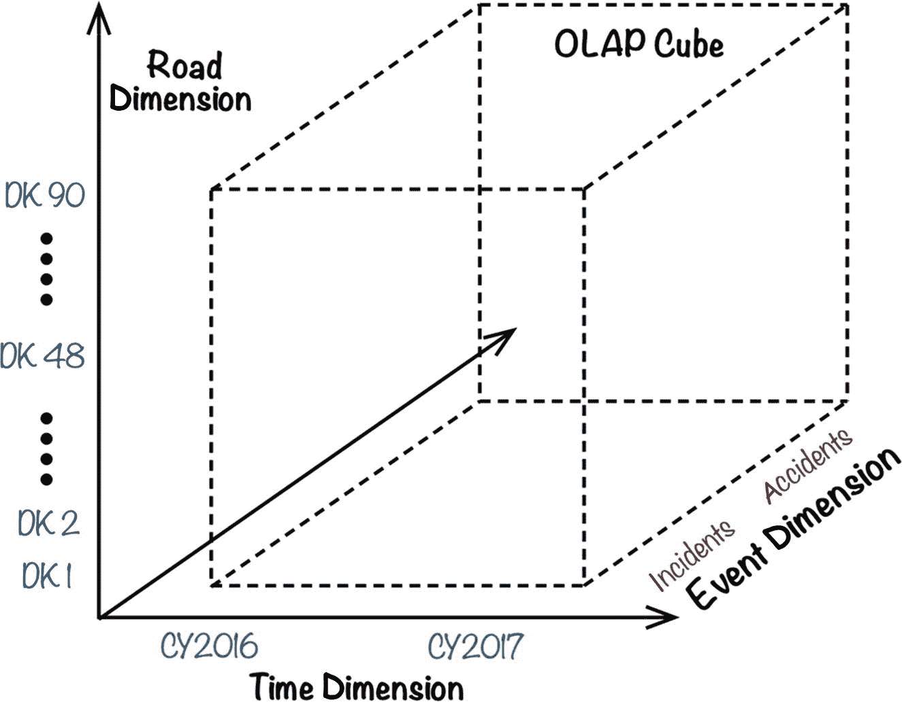

图 7-33

OLAP 立方体

OLAP 立方体不仅限于逻辑概念。数据库或数据处理平台可以包含一个 OLAP 立方体引擎模块，该模块承担了处理与维度层次级别相关的某些计算负担，让你可以专注于更面向业务的查询。OLAP 立方体的实现范围很广，从依赖高级 SQL 语言特性的数据库扩展（如 Oracle Analytic Views），到基于中间件的商业智能解决方案（如 Oracle Business Intelligence Suite），后者支持专用查询语言（如 MDX）。OLAP 立方体将帮助我们理解一些我们将要针对星型模式执行的基本查询。然而，首先，我们需要物化一个星型模式。

生成星型模式最简单的方法是运行一个 SQL `SELECT`查询，该查询基本上将所有的维度表与事实表连接起来，如下所示：

```sql
SELECT * FROM ROADEVENTS_FACT   F
JOIN TIME_DIM  T ON T.DAY_ID = F.TIME_DIM_ID
JOIN ROAD_DIM  R ON R.SEGMENT_ID = F.ROAD_DIM_ID
JOIN EVENT_DIM E ON E.EVENT_ID = F.EVENT_DIM_ID
```

为了简化将来使用更复杂的选择和过滤条件的查询，并避免重复编写整个星型模式 SQL `SELECT`查询，将星型模式查询合并到一个称为*视图*的数据库对象中可能很方便。视图只是保存在数据库中的一组表或其他视图的 SQL 查询定义。它不物理存储数据，而是提供对物理数据库表的预定义视图。尽管如此，使用视图有时可能意味着需要动态地进行代价高昂的查询结果计算。了解到典型的 ADW 工作负载通常建立在计划的大批量数据加载之上，在数据加载完成后，我们可以预先计算视图并物理存储数据。为此，我们将使用称为*物化视图*的数据库对象。

如你所记得的，数据库用户`SANDBOX_USER`被授予了预定义的`dwrole`数据库角色。然而，这个角色不允许用户创建物化视图。让我们打开 SQL Developer Web，这次使用`ADMIN`用户的链接，并通过执行`GRANT`语句为`SANDBOX_USER`添加一个新权限。

```sql
GRANT CREATE MATERIALIZED VIEW TO SANDBOX_USER;
```

如果你愿意，可以选择作为`ADMIN`用户运行这些查询来验证`SANDBOX_USER`拥有的角色和权限。

```sql
SELECT * FROM DBA_ROLE_PRIVS where grantee='SANDBOX_USER';
SELECT * FROM DBA_SYS_PRIVS where grantee='SANDBOX_USER';
```

我们准备好切换到`SANDBOX_USER`的 SQL Developer Web 窗口，并执行`CREATE MATERIALIZED VIEW` SQL DDL 语句。再次记住，要在`SANDBOX_USER` SQL Developer Web 窗口中执行此查询。

```sql
CREATE MATERIALIZED VIEW ROADEVENTS_STAR AS
SELECT * FROM ROADEVENTS_FACT   F
JOIN TIME_DIM  T ON T.DAY_ID = F.TIME_DIM_ID
JOIN ROAD_DIM  R ON R.SEGMENT_ID = F.ROAD_DIM_ID
JOIN EVENT_DIM E ON E.EVENT_ID = F.EVENT_DIM_ID
```

你应该会收到以下消息：

```
Materialized view ROADEVENTS_STAR created.
```

为了本章的目的，我们刚刚在整个事实表上创建了物化视图。值得了解的是，与视图相反，物化视图确实消耗物理存储。对于涉及大数据集的生产用例，将整个星型模式查询持久化为物化视图可能是相当不可取的。同样适用于数据加载是增量且高频率的情况，因为物化视图通常必须在底层数据库表更改后立即刷新。在此上下文中，最佳实践建议在应用维度过滤器后构建物化视图，并且仅针对那些报告引擎经常使用的聚合构建。

我们可以像查询普通数据库表一样查询物化视图。让我们发布一个 SQL `SELECT`语句，该语句对所有道路事件发生次数以及受伤和死亡人数进行求和，并按日历年和道路事件类别对结果进行分组。日历年和道路事件类别都是其维度中的最高级别。查询如下所示：

```sql
SELECT
    year_name, class_name,
    SUM(occurrence) total_occurrence,
    SUM(injured) sum_injured,
    SUM(killed) sum_killed
FROM ROADEVENTS_STAR
GROUP BY year_name, class_name
ORDER BY year_name, class_name;
```

结果如图 7-34 所示。我们可以立即得出一些初步结论。例如，我们可以看到，与 2016 年相比，2017 年的事故和事故受害者数量有所下降。与此同时，报告的交通事故数量略有增加。这可能导致我们提出这样的假设：增加的警察活动可能导致发现更多事件，改善道路安全，并导致 2017 年事故数量减少。

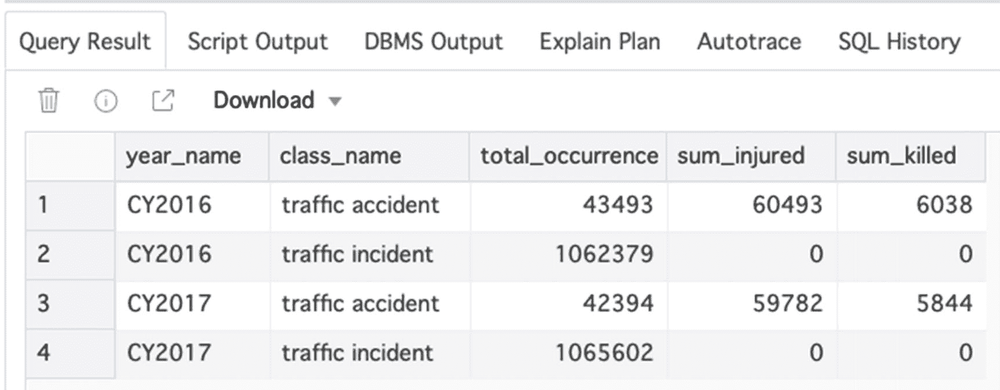

图 7-34

对星型模式的聚合查询


## OLAP 立方体操作

查询结果包含四行，可以在相应的 OLAP 立方体上展示，如图 7-35 所示。该查询实际上将原始立方体划分为四个子立方体，划分依据是时间和事件两个维度的最高维度层次级别。如果我们知道自己只对分析 2017 年发生的交通事件感兴趣，我们就会专注于这个特定的子立方体。这种操作被称为 `切块`。切块操作通过对少数维度应用值范围过滤器来创建一个子立方体。

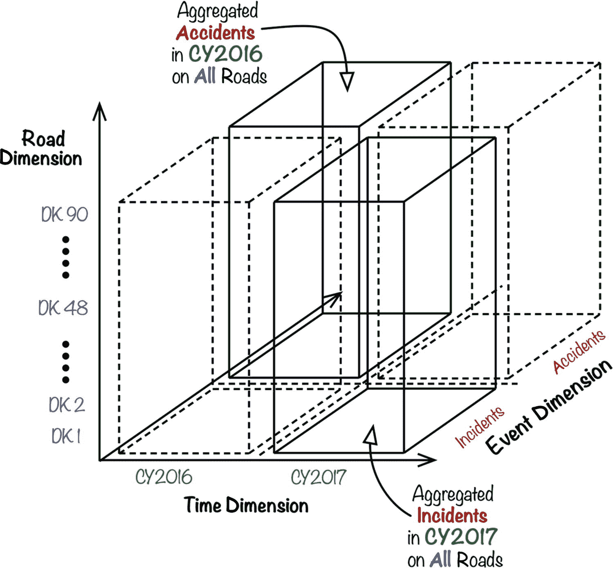

**图 7-35** 查询的 OLAP 立方体透视图

### 切片与切块

切块只是你在商业智能（BI）领域会遇到的几种 OLAP 立方体操作之一。最常见的 BI 操作类型包括：

*   切片与切块
*   向下钻取与向上卷叠
*   透视

切块操作在一个或多个维度上使用范围过滤器来创建子立方体，而 `切片` 操作则减少分析的维度数量。你通常为特定维度选择一个固定值，并将其用作数据集的过滤器。切片和切块操作的概念如图 7-36 所示。

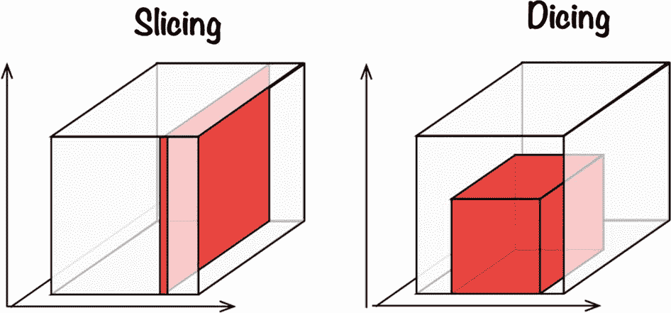

**图 7-36** OLAP 立方体切片与切块

让我们通过消除时间维度来对立方体进行切片。例如，我们可能希望显示特定日期的汇总总计，比如 2017 年 8 月 12 日。为此，执行第二个 `select` 查询。

```sql
SELECT
    SUM(occurrence) total_occurrence,
    SUM(injured) sum_injured,
    SUM(killed) sum_killed
FROM ROADEVENTS_STAR
WHERE day_date=TO_DATE('20170812','YYYYMMDD');
```

结果如图 7-37 所示。事故和事件总共发生了 2,777 起。事故导致 175 人受伤，9 人死亡。

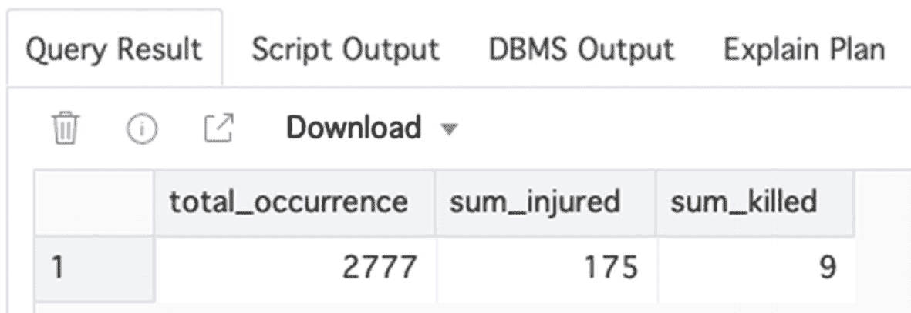

**图 7-37** 切片操作

### 向下钻取与向上卷叠

对星型模式物化视图执行的第三个 `select` 查询是 `向下钻取` 操作的一个例子。我们仍然使用之前的立方体切片。我们向其添加了 `GROUP BY` 子句，这有效地呈现了更细粒度的聚合拆分。排序与事件维度层次结构一致。事件类别（`class_name` 列）拆分为事件分类（`category_name` 列），随后再拆分为事件类型（`event_name` 列）。目的是使结果更清晰、更容易理解。现在，执行第三个查询。

```sql
SELECT class_name, category_name, event_name,
    SUM(occurrence) total_occurrence,
    SUM(injured) sum_injured,
    SUM(killed) sum_killed
FROM ROADEVENTS_STAR
WHERE day_date=TO_DATE('20170812','YYYYMMDD')
GROUP BY class_name, category_name, event_name
ORDER BY class_name, category_name, event_name;
```

图 7-38 展示了你刚刚执行的查询所产生的更详细的拆分结果。虽然我们展示了每个事实度量的总计，但没有任何阻碍你进行额外的即席计算，例如计算每个事件类型的平均值或伤亡比率。记住，我们是在立方体的一个切片上进行操作，结果仅针对一天给出。

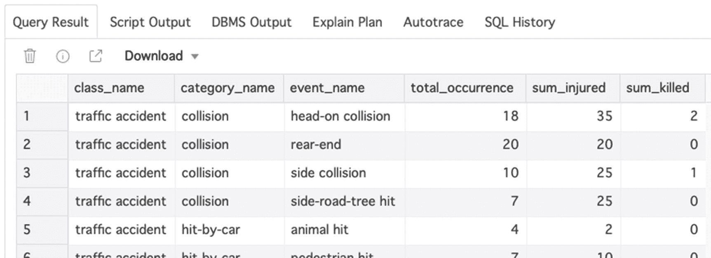

**图 7-38** 向下钻取操作

### 切块操作

第四个 SQL 语句是 `切块` 操作的一个例子。我们对每个维度应用过滤器以创建一个子立方体。时间维度限制为 2017 年 8 月，事件维度限制为“交通规则”分类，道路维度仅限于位于三个列出的省份的道路路段。执行以下 `select` 查询：

```sql
SELECT event_name, segment_voivodeship,
    SUM(occurrence) occurrence_in_201708
FROM ROADEVENTS_STAR
WHERE
    month_of_year=8 and year_name="CY2017" and
    category_name='traffic rules' and
    segment_voivodeship
    in ('Masovian','Subcarpathian','Lesser Poland')
GROUP BY event_name, segment_voivodeship
ORDER BY event_name, segment_voivodeship;
```

图 7-39 展示了各种交通规则道路事件的总和，并根据其地点进行了额外拆分。例如，我们可以看到，2017 年 8 月在马佐夫舍省的道路上报告了 2,835 起超速交通事件。

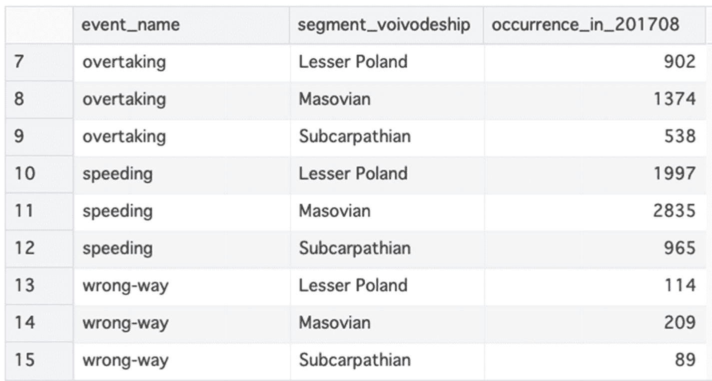

**图 7-39** 切块操作

### 透视操作

我们正在做的是创建即席查询，以探索和检测此特定数据集的各种特征。在即席查询的情况下，只要我们能阅读和理解结果，格式就不那么重要。当我们需要为报告准备结果时，情况将发生巨大变化。图 7-39 中展示的聚合基于一个二维的切块。时间维度不再被考虑。有了两个维度，我们可以想象一份报告，其二维结构依赖于每个剩余维度。x 轴可以基于道路维度，而 y 轴基于事件维度。查看上一个查询的结果，剩下的就是应用 `透视` 操作。透视操作基本上是将行旋转成列，如果需要，会应用额外的聚合。存储在特定列的行字段中的值可以成为一组新的列。Oracle 数据库提供了一个专门的 `PIVOT` 子句来执行透视操作。这是要执行的第五个查询：

```sql
SELECT
    *
FROM
    (
        SELECT
            event_name,
            segment_voivodeship,
            SUM(occurrence) occurrence_in_201708
        FROM
            ROADEVENTS_STAR
        WHERE
            month_of_year = 8 AND year_name = 'CY2017'
            AND category_name = 'traffic rules'
            AND segment_voivodeship
            IN ( 'Masovian', 'Subcarpathian', 'Lesser Poland' )
        GROUP BY event_name, segment_voivodeship
        ORDER BY event_name, segment_voivodeship
    ) PIVOT (
        SUM ( occurrence_in_201708 )
        FOR ( segment_voivodeship )
        IN (
            'Masovian' as masovian,
            'Subcarpathian' as subcarpathian,
            'Lesser Poland' as lesser_poland
        )
    )
```

图 7-40 展示了应用于子立方体的透视操作后可供报告使用的结果。之前作为行字段展示的 `segment_voivodeship` 列中的值变成了新的列。之前的 `occurrence_in_201708` 列被移除，其值根据新的布局进行了相应分配。在这种情况下，由于分组级别粒度良好，没有发生额外的聚合。

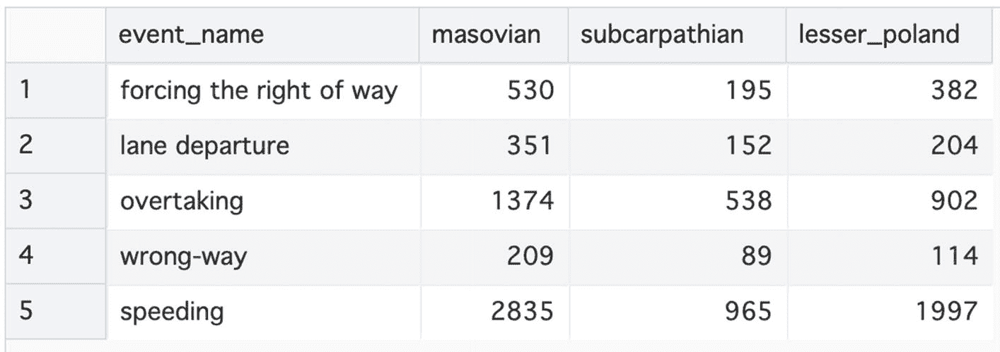

**图 7-40** 透视操作

所展示的操作只是冰山一角。Oracle Autonomous Database 支持许多专门的子句，允许你正确地构建、分发、聚合和排名结果，但这超出了本书的范围。Oracle Database 的分析视图可用于执行更高级的维度查询，并能感知层次结构，同时包含对底层事实表中可用聚合的嵌入式计算。


每个自治数据仓库实例都配备了一项名为 `Oracle Machine Learning`（OML）的功能，这是一个基于开源 Apache Zeppelin 项目的、基于 Web 的、交互式、面向笔记本的数据可视化与数据分析工具。对于简单的可视化用例，您可以轻松使用 SQL 发布查询，并通过几次点击操作来准备各种图表。例如，图 7-41 展示了如何显示一个折线图，该图按交通事故类别分组，说明了 2017 年波兰车祸受害者的总数。提醒一下，您看到的数据纯属虚构，是笔者为了本书的唯一目的而生成的。


**图 7-41** 基于 Oracle Machine Learning Zeppelin 的可视化

笔记本可以按照类似于多段落报告的方式进行排列，如图 7-42 所示，该图结合了饼图和相应的数据表。两种视图都展示了按省份划分的 2017 年每日平均受伤人数。


**图 7-42** 基于 OML 的报告

您可以从自治数据仓库服务控制台的“管理”页面访问 OML 管理页面。在这里，您能够允许现有的数据库用户使用 OML 笔记本。要了解更多信息，请参阅相关文档。

自治数据仓库实例可以轻松注册为 Oracle Analytics Cloud 的数据源，后者提供了更丰富的可用图表集。图 7-43 展示了 2017 年在 GP 类型道路上受伤人数的雷达面积图。每个不同的角度对应一个特定的省份。某个省份 GP 道路上的受伤人数越少，该特定角度上的蓝色区域就越小。使用 Analytics Cloud，您可以构建很多东西，执行交互式分析并动态调整图表，以便在您特定的报告场景中得出理想的仪表板。


**图 7-43** Oracle Analytics Cloud

讨论商业智能操作、数据挖掘算法以及由基于 Zeppelin 的 ADB 扩展和 Oracle Analytics Cloud 支持的不同可视化技术等内容，超出了本书的范围。互联网上有大量可用的资料，欢迎自行探索。

## 清理

我们现在可以终止数据库实例，因为在此之后我们将不再需要它。要关闭并终止 ADW 实例，您可以执行以下命令：

```
$ ADW_OCID=`oci db autonomous-database list --query "data[?\"display-name\"=='road-adw'] | [0].id" --raw-output`
$ echo $ADW_OCID
ocid1.autonomousdatabase.oc1.eu-frankfurt-1.ab......763psq
$ oci db autonomous-database delete --autonomous-database-id "$ADW_OCID" --wait-for-state TERMINATED
Are you sure you want to delete this resource? [y/N]: y
Action completed. Waiting until the resource has entered state: TERMINATED
```

同样，使用 OCI CLI 删除所有对象并删除我们最初用于数据库数据加载的原始输入数据的对象存储存储桶。

```
$ oci os object bulk-delete -bn roadadw-load
WARNING: This command will delete 7 objects. Are you sure you want to continue? [y/N]: y
$ oci os bucket delete -bn roadadw-load
Are you sure you want to delete this resource? [y/N]: y
```

## 总结

本章是对 RDBMS 支持的数据仓库和面向维度的数据分析的简要而快速的介绍。在完全托管的云端自治数据库时代，我们能够快速启动数据仓库实例，并在进行一些基本设置后，直接转向构建面向数据的解决方案。这正是托管云平台的意义所在：通过将这些维护任务委托给云平台，专注于以最小的管理精力解决问题。在后续章节中，您学习了如何配置自治数据库实例、以 `ADMIN` 身份访问 SQL Developer Web、创建常规数据库用户、将数据从对象存储加载到数据库表，以及理解星型模式及其在商业智能操作中的作用。接着，您熟悉了数据库监控。最后，您以多种方式查询了数据，并了解了 Oracle Cloud 中可用的数据可视化选项。

# 8. Oracle Container Engine for Kubernetes

在本章中，我们将处理 `应用程序容器`，它已经彻底改变了当代的软件世界。容器影响了我们构建、交付和运行应用程序的方式，从而在很大程度上改变了软件开发的流程。它们促成了一种新的架构风格，这种风格围绕着由大量高度专业化、自治且通常规模较小的应用程序（称为 `微服务`）组成的系统。毫不夸张地说，在应用程序容器之上，已经出现了一个新的标准、平台、组件、工具、库、协议和服务的 `生态系统`。这个生态系统范围极其广阔，由庞大的开源社区推动，并得到丰富的企业赞助。

本章第一节简要解释了什么是容器，并指导您完成与将应用程序容器化以及将容器镜像存储到 Oracle Container Image Registry（OCIR）相关的最重要任务。第二节讨论了容器编排的需求，并向您介绍了 Oracle Kubernetes Engine（OKE），这是 Oracle Cloud Infrastructure 上提供的托管 Kubernetes 服务。


## 容器

容器是一种可移植、可交付的软件单元，它被打包了所有的依赖项。让我们通过更仔细地审视容器的三个核心特性来探讨这个定义。

-   **自包含**
-   **隔离的**
-   **可交付的**

每个容器在原则上都是**自包含**的。封装在容器内的服务或应用程序会配备其所有依赖项，例如软件二进制文件、配置文件、库、环境变量，以及——无论乍听起来多么奇怪——整个操作系统。尽管在同一个裸机或虚拟机上可能运行着数百个容器，但每个容器都为其封装的应用程序提供了一个完全隔离且独占环境的印象。换句话说，任何给定容器内的应用程序都认为自己运行在一个专用的机器上，无论同一台主机上还共存着多少其他容器。只要所有主机都支持相同的容器运行时，容器就被认为可以轻松地在可能使用不同主机操作系统的不同主机机器之间**交付**。图 8-1 从概念上说明了这三个特性。

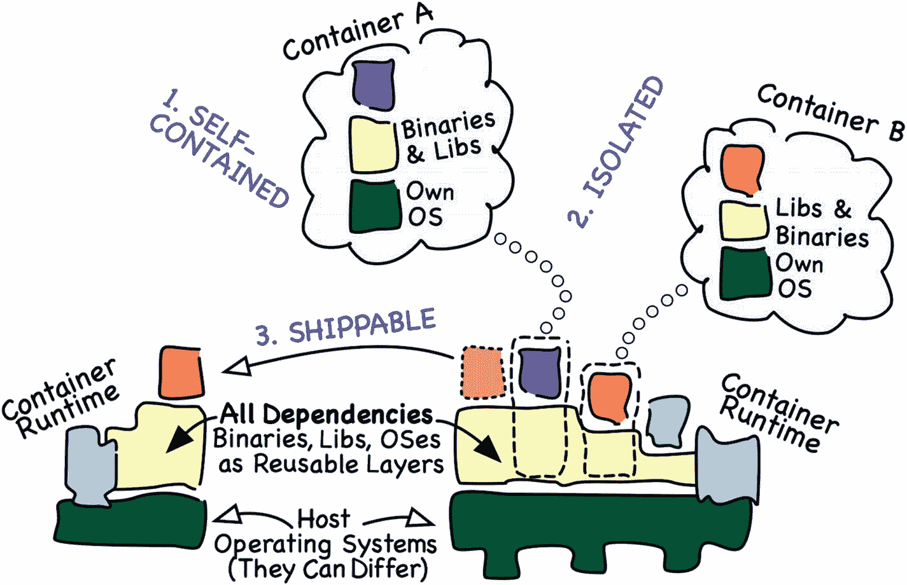

**图 8-1：容器核心特性**

如果你从未听说过容器，并且是这个话题的新手，你可能会好奇从技术角度来看这一切是如何实现的。此外，容器与虚拟机究竟有何不同？当代容器运行时起源于 Linux 生态系统，并利用 Linux 内核特性（如命名空间、控制组或 `chroot` 命令）来实现文件系统、进程、网络和资源隔离。无论你最终选择哪种容器引擎，无论是 `Docker`、`rkt` 还是 `cri-o`，你都可以确信它们都使用了上述相同的 Linux 内核特性。

在这种背景下，情况变得清晰起来：所有运行在同一主机上的容器，尽管是完全隔离的，但都使用该主机的 Linux 内核。在可重用性方面，还有一个影响更大的概念，即**层**。容器使用层层堆叠的文件系统层。“底层”的基础层提供了整个操作系统。这听起来可能很庞大，但在容器的世界里，你经常会遇到非常轻量级的 Linux 发行版，例如 CoreOS Container Linux 或 Alpine Linux。在此之上，额外的层通常会带来应用程序运行时，例如 Java 虚拟机、Python 或 Node.js。更上面的层可以包含所需的库，如 Python Flask。最后，最顶层包含应用程序二进制文件，通常还附带注入的配置文件。所有这些层都是**只读的**，这允许多个容器共享它们。每个容器都带有一个专用的**可写层**，用于保存容器内应用程序或其他组件在其生命周期内所做的所有更改。

只读层在逻辑上被分组为**容器镜像**，这些镜像可以在多台机器之间共享。每个镜像都是一个自包含的实体，可以作为多个运行中容器的基础。你可以基于同一个镜像拥有数百个容器，其实际占用的存储空间仅相当于运行单个容器。

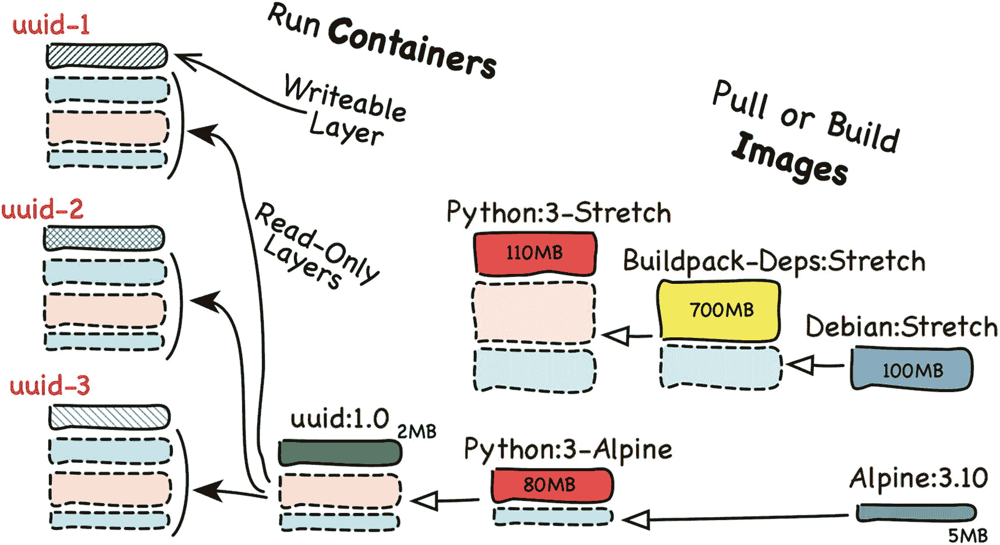

**图 8-2：容器层**

图 8-2 说明了各个镜像和容器之间的关系。有三个名为 `uuid-1`、`uuid-2` 和 `uuid-3` 的容器，它们都使用相同的 `uuid:1.0` 镜像构建。`uuid:1.0` 镜像是一个自定义构建的镜像，主要包含一些应用程序代码和配置文件。该镜像是在一个已下载的 `python:3-alpine` 镜像之上构建的，而 `python:3-alpine` 镜像又在一个名为 `alpine:3.10` 的基础操作系统镜像之上安装了 Python 3。这三个容器内的应用程序都认为自己运行在独立的主机上。然而，它们都共享主机的 Linux 内核和只读层。社区中一直有声音指出，并非所有 Python 应用程序都能在 Alpine Linux 上运行，因为缺少一些特定于发行版的依赖项。为了解决这些问题，你可以考虑使用不依赖 `python:3-alpine`，而是基于 Debian 的 `python:3-stretch` 镜像的容器来运行要求更高的 Python 应用程序。

内核级隔离与内核及各种文件系统层的重用相结合，使得容器与虚拟机相比，在使用上显著**更轻量**。同样，将一个容器**交付**到另一台机器上也比迁移整个虚拟机容易得多。

但是，**交付**一个容器在物理上意味着什么？你已经了解到，任何特定的容器都需要一个由只读文件系统层组成的镜像。对于无状态应用程序而言，交付容器无非就是停止一个现有容器，然后在另一台机器上基于同一个镜像并使用相同的运行时配置启动另一个容器。显而易见，镜像必须以某种方式在镜像注册表中提供，并且所有带有容器运行时的主机机器都能访问该注册表。然后，容器平台会从镜像注册表中**拉取**一个镜像，这实际上意味着下载所有必需的文件系统层和相应的元数据，如图 8-3 所示。

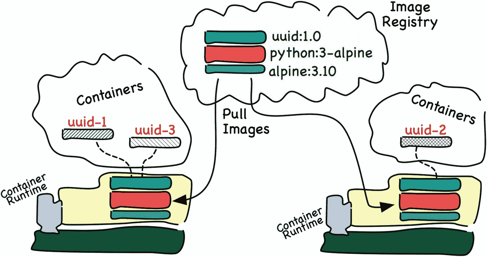

**图 8-3：从镜像注册表拉取镜像**

应用程序在其生命周期中总是在不断演进。为了跟踪这一演进过程，应用程序的发布会被**版本化**。这同样适用于容器镜像。如果你仔细观察前面的图，会看到诸如 `1.0`、`3-alpine` 或 `3:10` 这样的版本后缀。我们称之为**标签**。容器镜像打标签主要是为了表示特定镜像的不同变体或发布顺序。例如，假设你发布了一个封装了 UUID 服务更新二进制文件的新次要版本镜像。如果之前的镜像版本标记为 `uuid:1.0`，那么更新后的镜像版本可以标记为 `uuid:1.1`。如果一个基于 Python 的应用程序碰巧不够快，你还可以额外实现一个基于 Golang 的替代方案，并将其发布为 `uuid:1.0-golang` 变体。

## 容器化应用开发流程概述

在了解了所有基本组件之后，我们现在可以勾勒出容器化应用的开发流程了。根据具体情况，您可能需要对现有应用进行容器化，或者在开发新应用之初就将容器化作为自动化流程的一部分纳入其中。要 `容器化一个应用`，您需要仔细识别所有依赖项，并对整个执行环境做出选择，包括应用自认为运行于其上的操作系统。基于这些决策，您选择一个现有的基础镜像，如果不存在合适的，就开始自己构建一个。这将作为您应用特定镜像的基础镜像。一旦基础镜像准备就绪，您就可以开始在选定的基础镜像之上构建应用特定镜像了。这通常通过添加应用二进制文件（可选地附带一些静态的、应用特定的配置文件）并为应用使用的任何环境变量设置默认值来实现。这些环境变量的值随后可以为每个单独的容器进行覆盖。对于容器化应用，另一种更复杂的方式是从解耦的外部配置源获取其运行时配置制品。应用特定的镜像是自包含的，它可以被上传到镜像注册表。我们称此活动为 `推送` 镜像。然后，可以从注册表拉取镜像以运行容器，并在构成特定时刻测试环境的机器上针对这些容器执行自动化测试。测试流水线完成后，容器将被销毁。此外，如果测试机器是基于云的，在测试完成后可以终止它们以消除空闲时间。之后，成功验证的容器镜像会被正确标记并推送到另一个镜像注册表，这次是用于生产环境分发。有些人将其称为 `镜像晋级`。在最后一步中，使用最新的镜像在生产机器上替换或启动新容器。整个过程如图 8-4 所示。

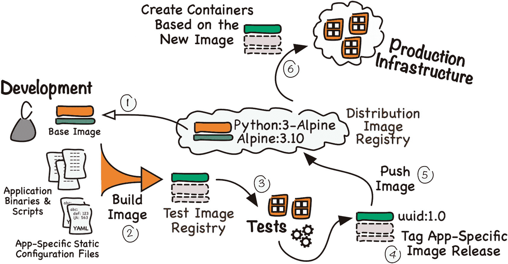

图 8-4

开发容器化应用

整个开发过程通常是完全自动化的。开发人员将代码签入 Git 等版本控制系统，这会触发测试镜像的构建、部署和测试。如果镜像验证成功，它会自动打标签并推送到分发镜像注册表。另一套自动化规则可以用基于最新镜像的新容器替换生产环境中的旧容器。

本节为您提供了一些关于容器领域的基础知识。我们现在已准备好将这些概念付诸实践。为此，我们将对第 2 章介绍的 UUID 服务进行容器化。

### 容器化应用

市场上有几种容器运行时。仅举几个例子，我们可以列出 `containerd`、`rkt` 或 `cri-o`。事实上，这是一个非常动态的领域，几乎每个月都在迅速变化。幸运的是，社区已经进行了一些联合标准化努力，旨在为这种创意的混沌带来一些结构，并在各种运行时之间重用一些通用组件。最流行的容器运行时之一是 `containerd`。它从先前单体的 Docker Engine 中提取出来，并作为一个由云原生计算基金会管理的开源项目捐赠给了社区。Docker 本身实际上是 Linux 容器使用的先驱，最初使用一组现有的 Linux 容器工具，后来切换到定制的内置平台。Docker 可能是目前最流行的容器引擎技术，也是用于容器化应用工具的领先提供商。在本节中，我们将使用 Docker 工具对之前作为第 2 章练习一部分处理的现有 UUID 服务应用进行容器化。当时，我们在 Oracle Cloud Infrastructure 中运行的两个计算实例上将其作为 Linux systemd 服务运行。那时，我们在每个计算实例上只托管一个应用实例。现在，我们将构建一个可以被任意数量容器运行的容器镜像，从而在单台机器上提供多个 UUID API 实例，如图 8-5 所示。每个应用仍然会认为它是在专用主机上单独运行的，尽管实际上，它与基于相同镜像并在同一台机器上运行的所有其他容器共享底层镜像层和 Linux 内核。通过对应用进行容器化，您将解锁通过添加更多容器和具有容器运行时的主机来水平扩展整个 UUID API 的可能性。

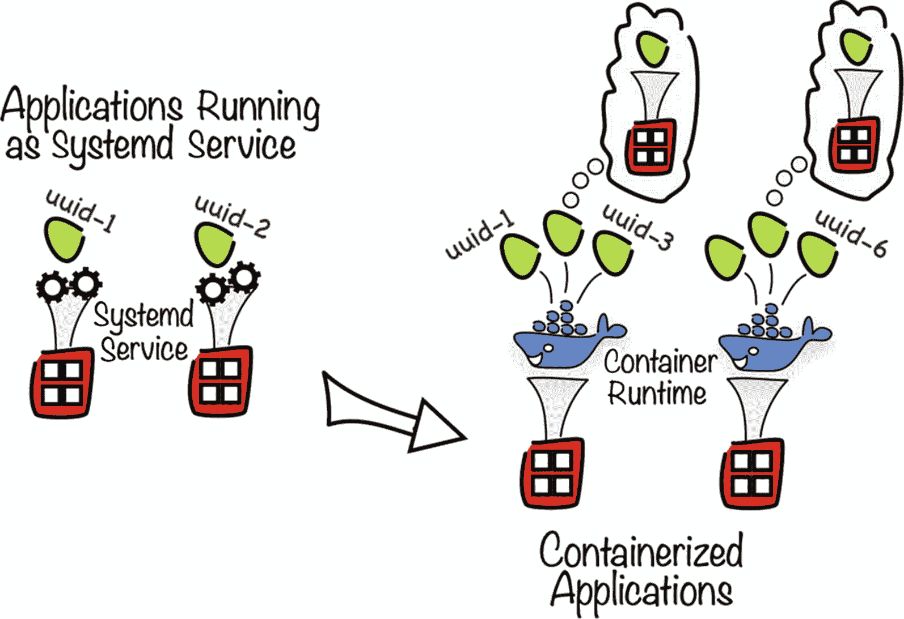

图 8-5

容器化应用的可扩展性

注意

本书中的代码片段已在 macOS 和 Windows Subsystem for Linux 上测试。此外，所有命令应在主流 Linux 发行版上工作。如果您使用 Windows 且不想使用 Windows Subsystem for Linux，您始终可以在虚拟机上运行 Linux。另外，大多数代码片段也可能在 Windows 的 Git Bash 中工作。

要构建镜像，您将需要一台安装了 Docker 工具的开发者机器。在本章的过程中，我们将配置并使用一个安装了所有必需工具的临时开发计算实例。我建议您遵循这些步骤，因为这将使使用代码片段更容易，并避免平台特定的差异。


## 云端开发实例

让我们基于最新的 CentOS 7 平台镜像配置一个计算实例。我已经准备好了基础架构代码。你可以在 `the chapter08/1-devmachine` 目录中找到它。代码结构符合我们在前面所有章节中讨论过的内容。其中有一个名为 `devmachine` 的模块，实例及其对应的子网级云网络资源就在这个模块中定义。而 VCN（虚拟云网络）传统上是在模块外部、顶层 `vcn.tf` 文件中定义的。

```
$ cd ~/git
$ cd oci-book/chapter08/1-devmachine
$ find . \( -name "*.tf" -o -name "*.yaml" \) | sort
./devmachine/cloud-init/devvm.config.yaml
./devmachine/compute.tf
./devmachine/vars.tf
./devmachine/vcn.tf
./modules.tf
./provider.tf
./vars.tf
./vcn.tf
```

### 通过 Cloud-Config 进行初始设置

为了执行初始实例设置并为你提供所有必需的开发工具，我们使用 cloud-config 文件，如列表 8-1 所示。

```yaml
#cloud-config
yum_repos:
docker-ce-stable:
name: Docker CE Stable - $basearch
baseurl: https://download.docker.com/linux/centos/7/$basearch/stable
enabled: true
...
kubernetes:
name: Kubernetes
baseurl: https://packages.cloud.google.com/yum/repos/kubernetes-el7-x86_64
enabled: true
...
packages:
- git
- docker-ce
- docker-ce-cli
- containerd.io
- kubectl
runcmd:
- [ systemctl, enable, docker ]
- [ systemctl, start, docker ]
- [ usermod, -aG, docker, opc ]
- [ mkdir, "/home/opc/.kube" ]
- [ chown, "opc:opc", "/home/opc/.kube" ]
- [ firewall-offline-cmd, "--add-port=5010-5019/tcp" ]
- [ systemctl, restart, firewalld ]
final_message: "DEV machine is running, after $UPTIME seconds"
```

*列表 8-1：`1-devmachine/cloud-init/devvm.config.yaml`*

基于这个 cloud-config 文件，cloud-init 将添加两个外部 Yum 仓库，并安装 Git 客户端、Docker 社区版（CE）工具包以及 Kubernetes 的 `kubectl` 命令行管理工具。你将在本章的第二部分了解 `kubectl` 和 Kubernetes。

### 使用 Terraform 配置实例

是时候配置开发实例了。在你已安装并配置了 Terraform 的本地机器上，请确保你已经导出了相关环境变量，这些变量以 `TF_VAR_` 开头，是你 OCI Provider 所需的。如果它们尚未设置，你可能需要运行以下命令：

```
$ source ~/tfvars.env.sh
```

现在，执行以下命令：

```
$ terraform init
Initializing modules...
- devmachine in devmachine
Initializing the backend...
Initializing provider plugins...
- Checking for available provider plugins...
- Downloading plugin for provider "oci" (terraform-providers/oci) 3.30.0...
* provider.oci: version = "~> 3.30"
Terraform has been successfully initialized!
$ terraform apply
data.oci_identity_availability_domains.ads: Refreshing state...
data.oci_core_images.centos_image: Refreshing state...
Terraform will perform the following actions:
