# module.devmachine.oci_core_subnet.dev_net will be created
Plan: 6 to add, 0 to change, 0 to destroy.
Do you want to perform these actions?
Terraform will perform the actions described earlier.
Only 'yes' will be accepted to approve .
Enter a value: yes
...
Apply complete! Resources: 6 added, 0 changed, 0 destroyed.
Outputs:
dev_machine_image_name = CentOS-7-2019.06.19-0
dev_machine_public_ip = 130.61.84.182
$ DEV_VM_PUBLIC_IP=`terraform output dev_machine_public_ip`
```

在我的案例中，该实例已在法兰克福区域的第三个可用性域的第三个故障域中配置完成，如图 8-6 所示。

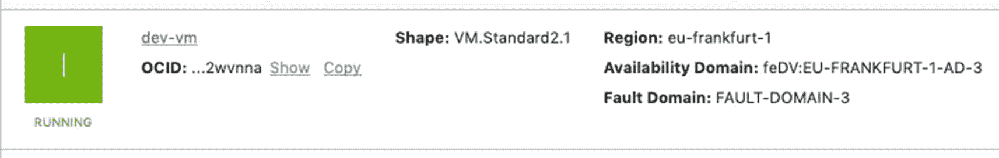

*图 8-6：在 OCI 控制台中查看开发者虚拟机*

## 连接与验证

开发者实例报告为“运行中”后，请等待几秒钟，让 `sshd` 守护进程启动并连接到该机器。接下来，和往常一样，你可能需要等待一两分钟，直到 cloud-init 完成 cloud-config 文件中定义的所有任务。你可以时不时检查 `cloud-init.log` 来确认 cloud-init 是否已完成。

```
$ ssh -i ~/.ssh/oci_id_rsa opc@$DEV_VM_PUBLIC_IP
[opc@dev-vm]$ sudo cat /var/log/cloud-init.log | grep "DEV machine is running"
2019-06-22 12:46:49,899 - util.py[DEBUG]: DEV machine is running, after 116.90 seconds
[opc@dev-vm]$ exit
```

从现在开始，在后续任何代码片段中看到 `[opc@dev-vm]$` 命令提示符时，都将假定你已登录到开发者实例上。

**注意**
Oracle Cloud Infrastructure 市场提供了一个更全面的预构建 Oracle Cloud Developer 镜像，其中开箱即装有许多其他工具。然而，在本章中，我们使用的是一个更轻量级、定制化的开发者实例，该实例是你使用提供的基础架构代码启动的。

为了能够以普通用户身份运行 Docker，cloud-init 已将 `opc` 用户添加到了 `docker` 组。重新连接到开发者机器以使组分配生效。

```
$ ssh -i ~/.ssh/oci_id_rsa opc@$DEV_VM_PUBLIC_IP
```

我们将在下一节中继续进行相关工作。


## Docker 运行时

让我们简单探索一下开发者实例上安装的 Docker 工具。在本章开头，你已经了解了容器和容器镜像。要列出给定机器上的镜像，请执行 `docker images` 命令。要列出正在运行的容器，请执行 `docker ps` 命令，如下所示：

```
[opc@dev-vm]$ docker images
REPOSITORY    TAG    IMAGE ID    CREATED    SIZE
[opc@dev-vm]$ docker ps
CONTAINER ID   IMAGE   COMMAND   CREATED   STATUS   PORTS   NAMES
```

很好。目前，这台机器上既没有镜像也没有容器。那么，要不要再学习一些关于 Docker 引擎和底层容器运行时的知识？请执行 `docker info` 命令。

```
[opc@dev-vm]$ docker info
...
Server Version: 18.09.6
Storage Driver: overlay2
Backing Filesystem: xfs
Supports d_type: true
Native Overlay Diff: true
...
Runtimes: runc
Default Runtime: runc
...
Kernel Version: 3.10.0-957.21.3.el7.x86_64
...
Docker Root Dir: /var/lib/docker
...
```

之前，我简要提到过所有容器都使用其宿主机的内核。这就是为什么内核对于 Docker 引擎仍然很重要，你可以在 `docker info` 命令的输出中找到其精确版本，列为 `Kernel Version` 条目。在各种信息条目中，你还会看到 `Runtimes` 条目。Docker 使用名为 `containerd` 的容器运行时。然而，在这里，我们在 `Runtimes` 条目中看到的是名为 `runc` 的东西。这并没有错。`runc` 是一个负责根据标准化的开放容器倡议 (OCI) 规范运行容器的组件。`containerd` 容器运行时在底层使用了 `runc`，并在其周围添加了更多功能。另一个有趣的条目涉及 Docker 处理文件系统层的方式，这些层组合起来构成容器化应用程序所看到的文件系统。在只读层的顶部，有一个可写的容器层。如果应用程序对文件系统进行了任何更改，这些更改将仅反映在可写层中。`存储驱动程序` 的任务就是管理这些层，同时考虑支撑宿主机上 `Docker 根目录` 的底层物理文件系统的特性。有几种可用的存储驱动程序，各有优缺点。我们使用的是目前首选的名为 `overlay2` 的存储驱动程序，由 xfs 文件系统支持。文件系统层层次结构位于 `/var/lib/docker/overlay2` 子目录中。当容器运行时，你应该能够使用 `mount` 命令找到层是如何相互堆叠的。如果乍看起来有点复杂，也不必担心。我们不会去处理这些设置。我只是想让你对本章开头关于层的概念性讨论，获得一些实际的概览。

## Docker 镜像

我们的目标是构建一个封装了 UUID 服务应用程序的镜像，包括应用程序依赖项（Python 3 和 Flask 微框架）以及所需环境变量（例如，`FLASK_APP`）的默认值。首先，我们必须为我们即将构建的应用程序特定镜像选择合适的 `基础镜像`。幸运的是，Docker Hub（这可能是最大的容器镜像库）上有 Python 的官方基础镜像。社区驱动的开源项目和独立软件供应商都将其准备分发的镜像发布到 Docker Hub。你可以在 [`https://hub.docker.com/_/python`](https://hub.docker.com/_/python) 找到大量捆绑了不同 Python 版本的镜像，适用于各种平台，如图 8-7 所示。

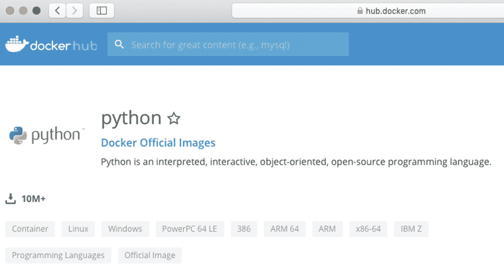

### 图 8-7

Docker Hub 上的官方 Python 镜像

出于演示目的，我们将选择 Alpine Linux 上的 Python 3，即 `python:3-alpine` 标签下的可用变体。我们的 Docker 引擎（运行在 Oracle Cloud Infrastructure 法兰克福区域的一个实例上）实际上如何知道如何获取这个镜像呢？如果你再次运行 `docker info` 命令，你应该会在输出底部看到 `Registry` 条目。

```
[opc@dev-vm]$ docker info
...
Registry: https://index.docker.io/v1
...
```

Docker CE 默认附带预配置的指向 Docker Hub 容器镜像注册表的链接。根据计算实例所连接的 VCN 子网使用的安全规则，该实例确实具有通往互联网的出站连接，这实际上允许实例从 Docker Hub 下载容器镜像。

到目前为止一切顺利。我们知道基础镜像的名称了。现在，是时候创建自定义镜像了，该镜像添加了 Flask 微框架，设置了一些默认环境变量，并指示容器运行时执行 `app.py` 文件（即 UUID API 的实现）。为了指示 Docker 如何构建新镜像，你需要使用一个 `Dockerfile`，它基本上由用于构建给定镜像的一系列命令组成。

首先，我们将再次克隆包含本书代码的 Git 仓库，这次是在开发者实例上。

```
[opc@dev-vm]$ git clone https://github.com/mtjakobczyk/oci-book.git
[opc@dev-vm]$ cd oci-book/chapter08/2-docker/
[opc@dev-vm]$ cd uuid-service/
[opc@dev-vm]$ ls -1
app.py
Dockerfile
requirements.txt
```

`chapter08/2-docker/uuid-service` 目录包含三个文件。

*   `app.py`
*   `Dockerfile`
*   `requirements.txt`

`app.py` 文件与我们在第 2 章使用的文件相同。这基本上是 UUID API 的实现。根据 Python 惯例，`requirements.txt` 文件保存了我们应用程序所需的 Python 包列表，这些包将使用 `pip` 工具安装。正如我刚才提到的，`Dockerfile` 用于构建镜像。清单 8-2 显示了我们镜像的 `Dockerfile`。

```
FROM python:3-alpine
ENV FLASK_APP /usr/src/app/app.py
ENV FLASK_ENV development
ENV FLASK_DEBUG 0
EXPOSE 5000
WORKDIR /usr/src/app
COPY requirements.txt ./
RUN pip install --no-cache-dir -r requirements.txt
COPY . .
CMD [ "flask", "run", "--host=0.0.0.0" ]
```

清单 8-2
`Dockerfile`


Dockerfile 包含一系列按声明顺序执行的指令。第一条指令始终是`FROM`指令，它定义了我们要为新构建的镜像使用的基础镜像。如前所述，我们将利用 Docker Hub 镜像注册表中一个名为`python:3-alpine`的官方 Python 镜像。接下来的三条`ENV`指令设置了 Flask 微框架开发 Web 服务器使用的三个环境变量。`FLASK_APP`指向 API 实现文件的路径，而`FLASK_ENV`和`FLASK_DEBUG`则用于调整服务器的输出。`EXPOSE`指令声明了端口 5000，这是 Flask 服务器监听传入请求的默认端口。该指令的作用主要是信息性的，因为端口暴露设置仅在运行容器时生效。`WORKDIR`指令为后续的`COPY`、`RUN`和`CMD`指令在虚拟容器文件系统内设置了工作目录。`COPY`指令的第一次出现创建了一个镜像文件系统层，其中包含了从开发者机器复制的`requirements.txt`文件。`RUN`命令执行`pip install`命令，该命令实际安装了 Flask 微框架。安装结果被持久化为另一个文件系统层。`COPY`命令的第二次出现将`app.py`脚本作为又一个文件系统层添加到容器镜像中。总而言之，每条指令都会生成一个文件系统层。其中一些是临时层，而另一些则被包含在最终的容器镜像中。与之前的`RUN`指令相反，最后一条指令，即`CMD`指令，并不会被执行，因此不会基于给定命令的结果产生任何额外的镜像层。`CMD`指令的作用是告知 Docker 引擎，对于使用此镜像启动的每个新创建的容器，应该执行什么命令。在我们的例子中，每个新创建的容器基本上都会使用`flask run`命令来启动 Flask 微框架开发 Web 服务器。因此，Flask 服务器将公开在`app.py`文件中实现的 API，其路径已设置在`FLASK_APP`环境变量中。

要触发镜像构建过程，请使用`docker build`命令。`-t`参数为新构建的镜像设置标签。不要忘记在末尾包含点号，以指示`docker build`命令在当前工作目录中搜索 Dockerfile。

```
[opc@dev-vm]$ docker build -t uuid:1.0 .
Sending build context to Docker daemon  4.608kB
Step 1/10 : FROM python:3-alpine
3-alpine: Pulling from library/python
e7c96db7181b: Pull complete
799a5534f213: Pull complete
913b50bbe755: Pull complete
11154abc6081: Pull complete
c805e63f69fe: Pull complete
...
Status: Downloaded newer image for python:3-alpine
...
Step 2/10 : ENV FLASK_APP /usr/src/app/app.py
...
Step 3/10 : ENV FLASK_ENV development
...
Step 4/10 : ENV FLASK_DEBUG 0
...
Step 5/10 : EXPOSE 5000
...
Step 6/10 : WORKDIR /usr/src/app
...
Step 7/10 : COPY requirements.txt ./
...
Step 8/10 : RUN pip install --no-cache-dir -r requirements.txt
...
Successfully installed Flask-1.0.2 Jinja2-2.10.1 MarkupSafe-1.1.1 Werkzeug-0.15.4 click-7.0 itsdangerous-1.1.0
...
Step 9/10 : COPY . .
...
Step 10/10 : CMD [ "flask", "run", "--host=0.0.0.0" ]
...
Successfully built b16f04d1bb7f
Successfully tagged uuid:1.0
```

现在，您可以使用`docker images`命令来列出镜像，可以选择使用`--format`参数来过滤输出。

```
[opc@dev-vm]$ docker images --format "table {{.Repository}}\t{{.Tag}}\t{{.ID}}\t{{.Size}}"
REPOSITORY  TAG        IMAGE ID       SIZE
uuid        1.0        b16f04d1bb7f   96.7MB
python      3-alpine   fe3ef29c73f3   87MB
```

您应该看到两个顶层镜像。

*   `uuid:1.0`

*   `python:3-alpine`

我们之前多次提到过`python:3-alpine`。这是基础镜像。它是从 Docker Hub 镜像注册表下载的。大小为 87MB，由一些默认不显示的中间层组成。`uuid:1.0`是我们刚刚在基础镜像之上构建的镜像。它添加了 Flask 微框架，设置了三个环境变量，并添加了`app.py`应用程序。您看到的大小（96.7MB）有些误导性。这是包含基础镜像大小的总大小。我们添加的层仅占 9.7MB（96.7MB – 87MB）。

要显示镜像的构建历史，从而查看包括临时中间层在内的所有层，您可以执行`docker history`命令，如图 8-8 所示。

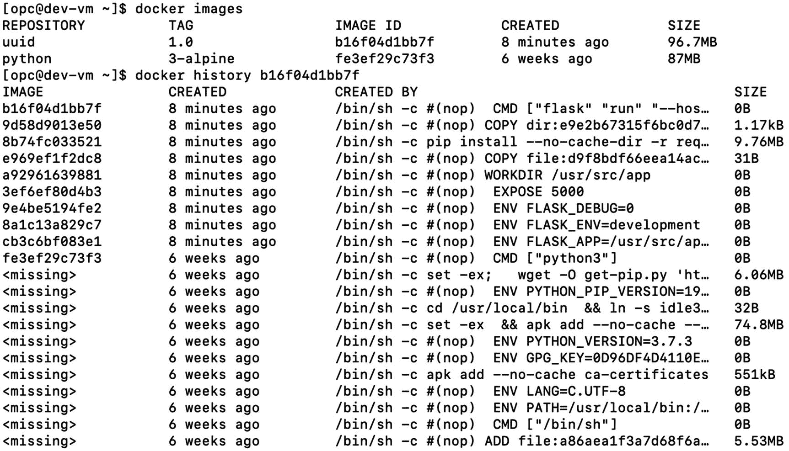

图 8-8

Docker 镜像的顶层镜像与中间层镜像

新镜像就位后，我们就可以继续运行容器了。


## 运行容器

镜像本身可以简单地看作是逻辑关联的只读文件系统层。要使用容器化的应用程序，您必须基于特定镜像启动一个或多个容器。您可以使用 `docker run` 命令来实现这一点。`-d` 参数将容器作为后台的**分离的进程**运行，从而不会阻塞终端。即使 `Dockerfile` 声明了端口 5000 是镜像暴露的端口，您仍然需要为每个创建的容器映射一个选定的主机端口到该容器端口。您可以使用 `-p` 参数来实现这一点。我们可以自由地使用一个或多个 `-e` 参数来覆盖或设置额外的环境变量。您可能还记得，UUID API 在响应中将 `UUID_GENERATOR_NAME` 环境变量的值作为 `generator` 字段返回。对于我们即将启动的每个容器，我们将使用一个不同的值，该值与用 `--name` 参数设置的容器名称相同。

第 2 章的练习帮助您在两个主机上分别将 UUID API 的单个实例作为 `systemd` 服务运行。这一次，我们将运行同一应用程序的几个实例，将它们绑定到开发实例上不同的端口，如下所示：

```
[opc@dev-vm]$ docker run -d -p 5011:5000 -e "UUID_GENERATOR_NAME=uuid-1" --name uuid-1 uuid:1.0
d6e9112b0950.........40adc3
[opc@dev-vm]$ docker run -d -p 5012:5000 -e "UUID_GENERATOR_NAME=uuid-2" --name uuid-2 uuid:1.0
224256288f19.........d63b8c
[opc@dev-vm]$ docker run -d -p 5013:5000 -e "UUID_GENERATOR_NAME=uuid-3" --name uuid-3 uuid:1.0
b15d1d26614c.........45b8dd
```

要列出正在运行的容器，您可以使用 `docker ps` 命令。

```
[opc@dev-vm]$ docker ps --format "table {{.ID}}\t{{.Image}}\t{{.Names}}\t{{.Status}}\t{{.Ports}}"
CONTAINER ID  IMAGE     NAMES   STATUS     PORTS
b15d1d26614c  uuid:1.0  uuid-3  Up 3 min   0.0.0.0:5013->5000/tcp
224256288f19  uuid:1.0  uuid-2  Up 3 min   0.0.0.0:5012->5000/tcp
d6e9112b0950  uuid:1.0  uuid-1  Up 3 min   0.0.0.0:5011->5000/tcp
```

现在，让我们测试每个容器上的 UUID API。

```
[opc@dev-vm]$ curl 127.0.0.1:5011/identifiers
{
"generator":"uuid-1",
"uuid":"d89d68bf-c093-4774-ab0e-0089674c184e"
}
[opc@dev-vm]$ curl 127.0.0.1:5012/identifiers
{
"generator":"uuid-2",
"uuid":"e141eef7-e578-4272-934b-68b48b6e146c"
}
[opc@dev-vm]$ curl 127.0.0.1:5013/identifiers
{
"generator":"uuid-3",
"uuid":"52ea3c08-adf2-452b-bd28-ef7b26aa2fc2"
}
```

由于我们在 Oracle 云基础设施上运行 `dev-vm` 计算实例，您可能希望通过使用实例的公共 IP 从本地机器调用测试容器化的 UUID API。为此，您必须添加一条入站安全规则，允许端口 5011–5013 的入站流量。与 `dev-vm` 相关的基础设施是使用 Terraform 配置的。要添加新的入站安全规则，您需要在基础设施代码文件 `devmachine/vcn.tf` 的 `dev_sl` 资源中进行操作。我们在第 2 章和第 6 章讨论了安全规则。

我们已通过实例化三个容器并测试其 API，成功验证了新构建的镜像。您现在可以退出开发者实例控制台。

```
[opc@dev-vm]$ exit
```

`uuid:1.0` 镜像目前存储在我们开发实例上的本地镜像注册表中。这类本地注册表对于刚刚进行的测试来说完全足够，但不能作为分发注册表使用。

## 容器注册表

理论上，您可以将新构建的镜像从开发者实例上的本地镜像注册表推送到互联网上的某个公共注册表，例如 Docker Hub。然而，您通常更倾向于将所有自定义镜像保存在某种私有注册表中，对公众不可见，并且该注册表在地理上更靠近容器运行的目标基础设施。每个 Oracle 云基础设施租户都配有一个能够存储私有和公共仓库的镜像注册表。*Oracle 云基础设施注册表* (`OCIR`) 与身份和访问管理完全集成。因此，`OCIR` 的访问权限被授予 `IAM` 用户，并使用您已熟悉的 `IAM` 策略进行管理。在后台，容器镜像被冗余地存储在支持 `OCIR` 的 `OCI` 对象存储中。*仓库* 用于对相关镜像进行分组。一个单一的 *仓库* 可以被视为为单个服务或应用程序提供的一组相关的、带标签的 Docker 镜像版本。在 `OCIR` 的上下文中，仔细分配的 *标签* 不仅用于表示容器化应用程序的特定版本或变体，还用于指示租户命名空间、目标区域和仓库名称。要将镜像推送到您的租户 `OCIR`，您必须使用严格定义的表示法标记镜像，如图 8-9 所示。

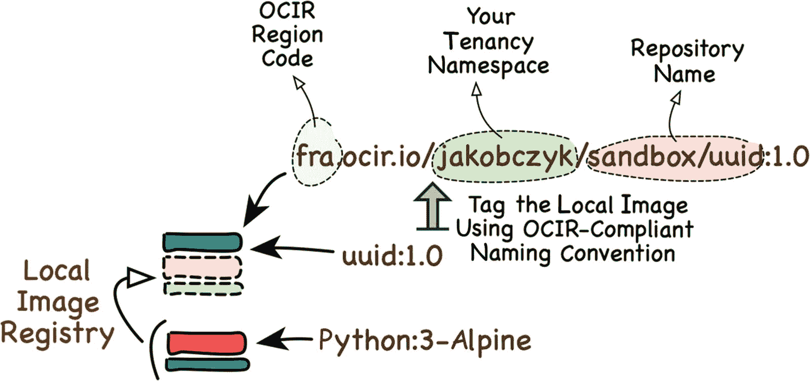

图 8-9

镜像标签与 `OCIR`

`OCIR` 使用的区域代码与您迄今为止遇到的不同。表 8-1 展示了其中一些。更新后的列表可以在这里找到： [`https://docs.cloud.oracle.com/iaas/Content/General/Concepts/regions.htm`](https://docs.cloud.oracle.com/iaas/Content/General/Concepts/regions.htm)。

表 8-1

OCIR 区域代码

| 区域名称 | 区域标识符 | OCIR 键 |
| --- | --- | --- |
| 澳大利亚东部 (悉尼) | `ap-sydney-1` | `syd` |
| 巴西东部 (圣保罗) | `sa-saopaulo-1` | `gru` |
| 加拿大东南部 (多伦多) | `ca-toronto-1` | `yyz` |
| 德国中部 (法兰克福) | `eu-frankfurt-1` | `fra` |
| 印度西部 (孟买) | `ap-mumbai-1` | `bom` |
| 日本东部 (东京) | `ap-tokyo-1` | `nrt` |
| 伦敦 (英国) | `uk-london-1` | `lhr` |
| 韩国中部 (首尔) | `ap-seoul-1` | `icn` |
| 瑞士北部 (苏黎世) | `eu-zurich-1` | `zrh` |
| 英国南部 (伦敦) | `uk-london-1` | `lhr` |
| 美国东部 (阿什本) | `us-ashburn-1` | `iad` |
| 美国西部 (凤凰城) | `us-phoenix-1` | `phx` |

您可以在 `OCI` 控制台的注册表视图中找到 *租户命名空间*。如果以租户超级用户身份登录，您不需要任何特定的 `IAM` 策略即可在 `OCI` 控制台中查看 `OCIR`。以下是使用 `OCI` 控制台访问相关视图的方法：

1.  转到 **菜单** ➤ **开发者服务** ➤ **注册表**。

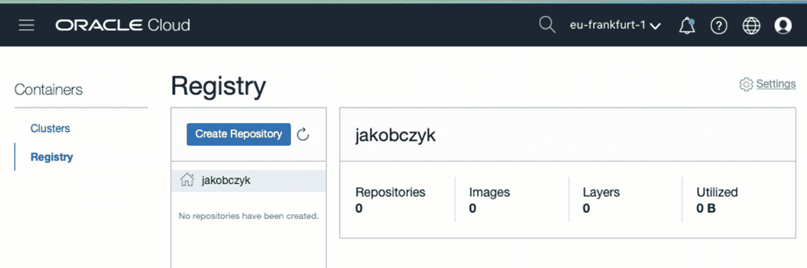

图 8-10

在 `OCI` 控制台中查看 Oracle 容器镜像注册表

*租户命名空间* 作为仓库列表的根节点可见。您会在房子图标旁边找到它。在我的情况下，命名空间名称与我的租户名称 (`jakobczyk`) 相同，但对于较新的租户，情况可能不再如此。您可能会发现一个随机字符串。


要允许其他 IAM 用户与 OCIR 交互，您必须创建适当的 IAM 策略，明确授予所选 IAM 组的特定访问权限。在本书中，我们一直在处理两个组：`sandbox-admins`和`sandbox-users`。假设我们希望授予`sandbox-admins`组成员列出租户中所有 Docker 仓库的权限。此外，两个组都应能够在名称以`sandbox`前缀开头的仓库（如`sandbox/uuid`或`sandbox-cicd/uuid`）中推送、拉取和删除镜像。在本地主机上使用 OCI CLI，打开`chapter08/2-docker/policies`目录。

```
$ cd ~/git
$ cd oci-book/chapter08/2-docker
$ cd policies
$ ls -1
tenancy.ocir.policies.json
```

JSON 文件包含三条策略声明，如清单 8-3 所示。`manage repos`授予对名称匹配`where target.repo.name`筛选条件的所有仓库的完整 Registry 相关 OCI API 访问权限。第三条规则授予`sandbox-admins`组成员对所有仓库的`inspect repos`访问权限。`inspect`级别的访问仅涉及两个 API：`ListDockerRepositories`和`ListDockerRepositoryManifests`。

```
[
"allow group sandbox-users to manage repos in tenancy where target.repo.name = /sandbox*/",
"allow group sandbox-admins to manage repos in tenancy where target.repo.name = /sandbox*/",
"allow group sandbox-admins to inspect repos in tenancy where request.operation='ListDockerRepositories'"
]
清单 8-3
tenancy.ocir.policies.json
```

由于 OCIR 作用域是租户级别，我们必须通过在`iam policy create` CLI 命令中使用`-c`参数指向根 compartment 来创建策略。您可能还记得，我们在 CLI 配置中维护三个配置文件。默认配置文件代表租户管理员调用 API，当未设置`--profile`参数时将使用该配置文件。回到本地机器，让我们以租户管理员身份执行 OCI CLI。

```
$ TENANCY_OCID=`cat ~/.oci/config | grep tenancy | sed 's/tenancy=//'`
$ echo $TENANCY_OCID
tenancy=ocid1.tenancy.oc1..aa..........3yymfa
$ oci iam policy create -c $TENANCY_OCID --name tenancy-ocir-policy --description "OCIR 策略" --statements "file://tenancy.ocir.policies.json"
{
"data": {
...
"lifecycle-state": "ACTIVE",
"name": "tenancy-ocir-policy",
"statements": [
"allow group sandbox-users to manage repos in tenancy where target.repo.name = /sandbox*/",
"allow group sandbox-admins to manage repos in tenancy where target.repo.name = /sandbox*/",
"allow group sandbox-admins to inspect repos in tenancy where request.operation='ListDockerRepositories'"
],
...
},
"etag": "d705d10ec093dbaf7c116054709951d38d3f7651"
}
```

您可以在 OCI 控制台中验证新创建的 IAM 策略是否存在。请记住将作用域切换到根 compartment，如图 8-11 所示。

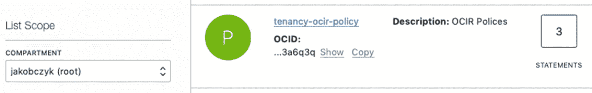
*图 8-11: OCIR 策略*

既然 OCIR 已与 IAM 完全集成，显然只有经过身份验证和授权的 IAM 用户才被允许在私有仓库中拉取或推送镜像。您在上一章已经使用过身份验证令牌。作为快速回顾，让我提及几个事实。用户基于身份验证令牌进行身份验证。令牌是 Oracle 生成的相对较短的字符串。任何 IAM 用户最多可以同时拥有两个身份验证令牌。令牌可以由用户自己创建，也可以由管理员通过 OCI 控制台或利用基于 API 的自动化（如 OCI CLI）任意创建。

以下是您作为`sandbox-user`在 OCI 控制台中生成身份验证令牌的方法：

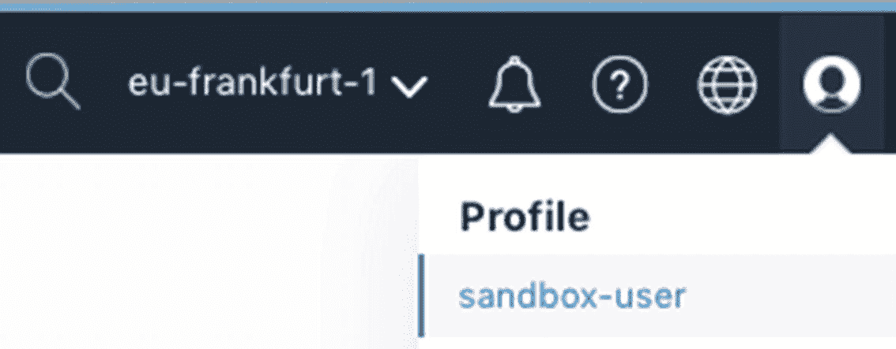
*图 8-12: 在 OCI 控制台中访问用户配置文件*

1.  以`sandbox-user`身份登录 OCI 控制台。
2.  通过单击用户名转到用户配置文件，如图 8-12 所示。
3.  在"资源"选项卡上，单击"身份验证令牌"。
4.  单击"生成令牌"。
5.  为令牌提供描述，然后单击"生成令牌"。
6.  记下您的令牌。您只会看到它一次。

至关重要的是要记住，您只能看到一次新生成的身份验证令牌，如图 8-13 所示。如果丢失，您将必须删除旧令牌并生成新令牌。


*图 8-13: 查看生成的令牌*

要以编程方式为选定用户生成身份验证令牌，您可以使用默认 CLI 配置文件（只需省略`--profile`参数）代表租户管理员执行以下 CLI 命令。首先，查询特定用户的 OCID，然后为该用户使用`iam auth-token create` CLI 命令。

```
$ IAM_USER_OCID=`oci iam user list -c $TENANCY_OCID --query "data[?name=='sandbox-user'] | [0].id" --raw-output --all`
$ echo IAM_USER_OCID
ocid1.user.oc1..aa..........dzqpxa
$ oci iam auth-token create --user-id $IAM_USER_OCID --description token-ocir --query 'data.token' --raw-output
B8.E_Ry7oOtN1KF0do9x
```

无论您选择哪种方式，请确保您已为`sandbox-user` IAM 用户准备好身份验证令牌。

我们即将推送刚才构建的`uuid:1.0`镜像。要将本地容器镜像推送到 OCIR，您必须执行以下操作：

1.  选择 OCIR 区域。
2.  根据 OCIR 命名规范正确标记本地镜像。
3.  以命名的 IAM 用户身份登录到特定区域的 OCIR。
4.  推送已标记的镜像。

您可以在图 8-9 中找到图像标记的 OCIR 命名规范的图形说明。我将把镜像推送到法兰克福的 OCIR，但您当然可以选择迄今为止一直在使用的区域。在这种情况下，您将在表 8-1 中找到所需的 OCIR 区域代码。

在撰写本文时，可以使用`oci os ns get` CLI 命令通过 OCI API 以编程方式读取租户命名空间。让我们确定我们的租户命名空间。稍后我们将使用它。

```
$ oci os ns get --query data --raw-output
jakobczyk
```

如您所见，我的租户命名空间与我的租户名称具有相同的值。这是因为我使用的是相对较旧的云帐户。对于较新的云帐户，可能包括您的，租户命名空间和租户名称几乎总是不同的。

**注意：** 使用 OCIR 时，请注意不要混淆*租户名称*和*租户命名空间*。确保使用租户命名空间来标记镜像并登录 OCIR。

现在连接到开发实例。

```
$ ssh -i ~/.ssh/oci_id_rsa opc@$DEV_VM_PUBLIC_IP
[opc@dev-vm] $
```

以下是我如何使用`docker tag`命令将本地的`uuid:1.0`镜像标记为`fra.ocir.io/jakobczyk/sandbox/uuid:1.0`：

```
[opc@dev-vm] $ OCI_PROJECT_CODE=sandbox
[opc@dev-vm] $ OCI_TENANCY_NAMESPACE=jakobczyk
[opc@dev-vm] $ OCIR_REGION=fra
[opc@dev-vm] $ OCI_USER=sandbox-user
[opc@dev-vm] $ IMAGE_NAME=uuid
[opc@dev-vm] $ IMAGE_TAG=1.0
[opc@dev-vm] $ docker tag $IMAGE_NAME:$IMAGE_TAG $OCIR_REGION.ocir.io/$OCI_TENANCY_NAMESPACE /$OCI_PROJECT_CODE/$IMAGE_NAME:$IMAGE_TAG
[opc@dev-vm] $ docker images --format "table {{.Repository}}\t{{.Tag}}\t{{.ID}}"
REPOSITORY                           TAG       IMAGE ID
uuid                                 1.0       b16f04d1bb7f
fra.ocir.io/jakobczyk/sandbox/uuid   1.0       b16f04d1bb7f
python                               3-alpine  fe3ef29c73f3
```


如你所见，`the uuid:1.0` 和 `fra.ocir.io/jakobczyk/sandbox/uuid:1.0` 这两个标签都指向同一个 `b16f04d1bb7f` 镜像。这正是我们的目标。现在，登录到 OCIR 并像这样推送镜像。系统将提示你输入认证令牌。

```
[opc@dev-vm] $ docker login -u $OCI_TENANCY_NAMESPACE/$OCI_USER $OCIR_REGION.ocir.io
Password: B8.E_Ry7oOtN1KF0do9x
Login Succeeded
[opc@dev-vm]$ docker push $OCIR_REGION.ocir.io/$OCI_TENANCY_NAMESPACE/$OCI_PROJECT_CODE/$IMAGE_NAME:$IMAGE_TAG
The push refers to repository [fra.ocir.io/jakobczyk/sandbox/uuid]
4954d6a23347: Pushed
7337b89d95ab: Pushed
1821dd20f0ac: Pushed
640ae8435b21: Pushed
5191bfc553a0: Pushed
0db5724f9017: Pushed
7f61afcc4a4d: Pushed
8cec11e3dff0: Pushed
f1b5933fe4b5: Pushed
1.0: digest: sha256:33645f08e7eed90afde92b7331254a6d24a6480b12f01e13148be3bae81fc180 size: 2200
[opc@dev-vm]$ docker logout $OCIR_REGION.ocir.io
Removing login credentials for fra.ocir.io
[opc@dev-vm]$ exit
```

提示： 如果你收到一个 `docker login` 错误，提示找不到具有给定命名空间的租户，你可能使用了租户名称而不是租户命名空间。请使用租户命名空间来标记镜像并登录 OCIR。你可以使用 `oci os ns get` 命令来找出你的租户命名空间。

现在，你可以验证镜像已成功推送到 OCIR，成为一个新的私有 Docker 仓库。这次，我以 `sandbox-admin` 身份登录到 OCI 控制台。如果你以 `sandbox-user` 登录，将无法列出 Docker 仓库，因为我们设置的策略只允许 `sandbox-admins` 组成员执行此操作。图 8-14 展示了新创建的仓库，它代表了新推送的 `uuid:1.0` 镜像。访问字段表明我们正在处理一个私有仓库，仅对成功认证和授权的 IAM 用户可见。在用户字段中，你可以看到创建该仓库的用户的 OCID。图 8-15 展示了一个具体镜像版本的详细信息。

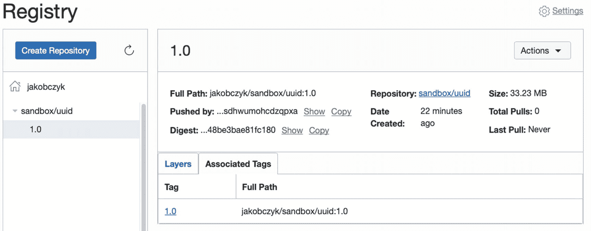
*图 8-15: 查看 OCIR 仓库镜像*

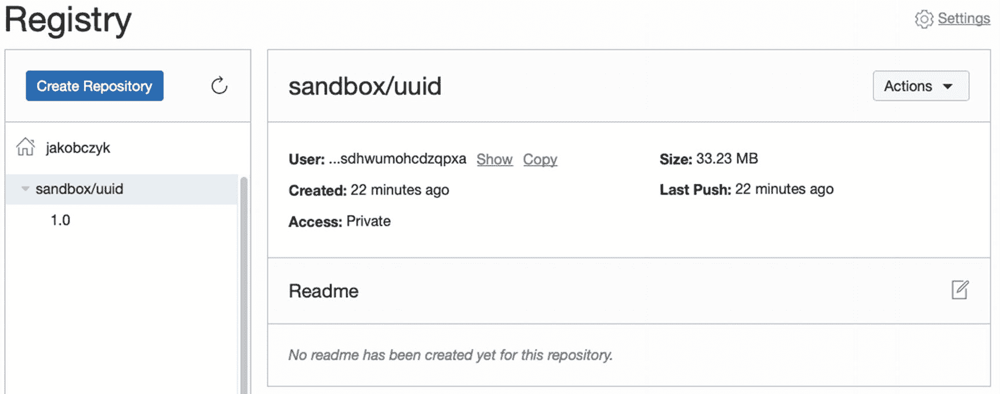
*图 8-14: 查看 OCIR 仓库*

该镜像已存在于 OCIR 中。

### 容器管理

设想一下配置一个负载均衡器前置的实例池。在实例池中，每个计算实例在启动时使用 Docker 并拉取一个镜像，以运行多个（例如三个）基于 `uuid:1.0` 镜像的容器。这样，大量的 UUID API 实例将能够处理通过负载均衡器传入的真正高需求的请求流。这在概念上如图 8-16 所示。

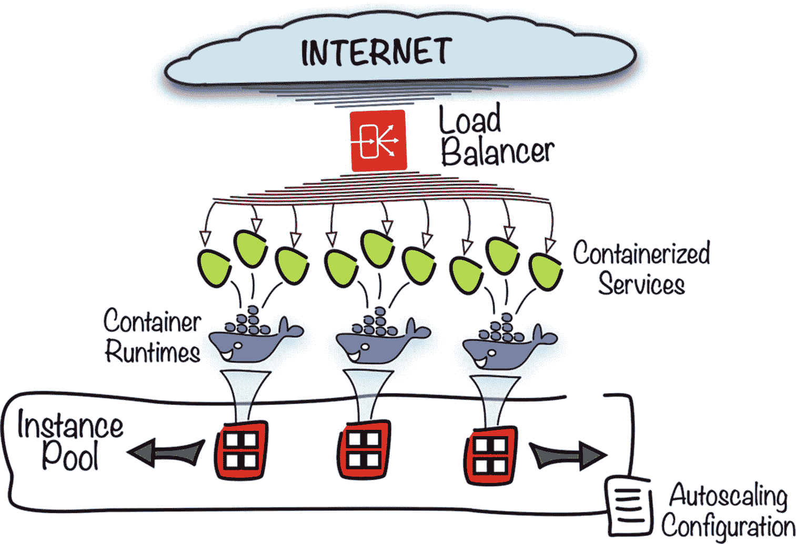
*图 8-16: 在多台虚拟机上运行容器化应用的多个实例*

这可能运行良好，并且你将有机会根据需求增长手动或通过自动扩缩机制横向扩展计算实例的数量，或者在需求减少时缩减它们。

不过，请花点时间考虑几个挑战。

*   通过引入更新的镜像版本来升级所有运行中的容器
*   添加基于不同镜像的其他容器
*   更改每个计算实例的容器数量

乍一看，你只需要将相关镜像推送到 OCIR，并根据你遵循的实例初始化风格调整云配置文件、Terraform 提供程序或 Ansible Playbook。然而，如果你更深入地审视这些挑战，你会开始问自己以下问题：

*   我如何在这些实例上安全管理认证令牌？
*   我如何避免服务中断？
*   如果我必须处理不同容器化应用程序之间的依赖关系，该怎么办？
*   如果多个计算实例上的各种容器化应用程序需要相互交互，我实际上如何管理它们之间的虚拟网络？
*   一个容器如何发现并与其它容器通信？

如你所见，有时——我敢说经常——仅仅启动一个实例池，在每个实例上运行容器化应用并由负载均衡器前置是不够的。我列出的这些问题证明，你需要一个更复杂、更强大的机制来管理容器，并支持容器化应用程序的完整生命周期。这就是容器编排发挥作用的地方。

## 容器编排

现代的后端系统由许多相互交互的应用程序和属于更专业化系统的应用模块组成。这种方法随着多年前面向服务架构（SOA）的到来而得到强化。从那时起，SOA 已被广泛采用。面向服务是一种设计范式，其中优选无状态的软件组件被视为*服务*，它们通过描述良好的 API 提供其功能。这种方法导致个体软件能力之间更细粒度的划分，并带来了对个体服务之间各种类型交互需求的增加。

在操作系统的上下文中，将每个服务作为独立进程运行将是一项相当繁琐的任务。这就是为什么服务传统上被部署到*应用服务器*上的原因，这些应用服务器完成了许多关键的非功能性任务，例如管理依赖关系、提供资源注入、提供安全性、持久化状态、交付监控能力以及实现 API。服务开发人员受益于将这些支持任务委托给应用服务器，因为他们能够专注于服务代码中的功能目标。然后，应用服务器可以组合成集群，以实现负载分发和高可用性。此外，依赖关系是在应用服务器级别安装和注册的，因此与服务代码解耦。乍一看，这听起来绝对美妙，就像是企业软件的终极解决方案。然而，它可能导致——并且经常导致——在将特定服务从一个环境迁移到另一个环境时出现问题。在应用服务器的世界里，开发人员通常将他们的部署工件连同所需的依赖项列表一起交给运维团队，后者的角色是在各种环境中安装服务，并在需要时将它们接入消息总线。有时，不同环境的配置差异如此之大，以至于由于属性不正确或库版本不兼容而出现意外问题。要将服务部署到给定的应用服务器，服务代码必须遵守特定应用服务器支持的标准和实现的接口。例如，你将 Java EE 应用部署到兼容 JEE 的服务器，将 Python 应用部署到兼容 WSGI 的 Web 服务器，将 .NET 应用部署到 Microsoft IIS。


## 容器化与挑战

部署到应用服务器的服务与容器化应用的一个区别在于，后者所有的依赖项都以镜像的形式与应用捆绑在一起。多亏了众多镜像共享的文件系统层，这不会造成任何主要的存储容量问题。然而，没有应用服务器就意味着容器必须自行处理所有`非功能性任务`。为了应对这一挑战，你可能需要为每个实现服务或部分业务流程的容器创建一组专用的容器来处理这些非功能性任务。实际上，这是一种被称为`边车模式`的知名模式。这就产生了将主容器与其边车容器逻辑组合起来，并作为一个单一的逻辑部署单元来联合管理其生命周期的需求。

容器化通常会产生更加细粒度的应用，每个应用都专注于一项狭窄且专门的任务，无论是数据转换、实现属于标准化 API 的单个 REST 资源，还是与各种软件即服务业务解决方案进行交互。有些人倾向于将这些高度专业化的服务称为`微服务`。许多微服务必须相互交互才能完成一个或多个业务流程。因此，容器化应用需要某种服务发现机制和连接能力。

为了实现容错并支持高可用的应用部署，具有容器运行时的多台主机会被组合在一起形成集群。这些集群必须提供某种覆盖网络，以便所有容器化应用在需要时能够顺畅地相互交互。总而言之，我们在一定程度上回到了那些为部署到应用服务器的服务已经解决的问题。对于容器化应用，我们需要某种`与基础设施无关的平台`，它将支持集群、内置扩展、生命周期管理以及相关容器组的扁平覆盖网络，如图 8-17 所示。

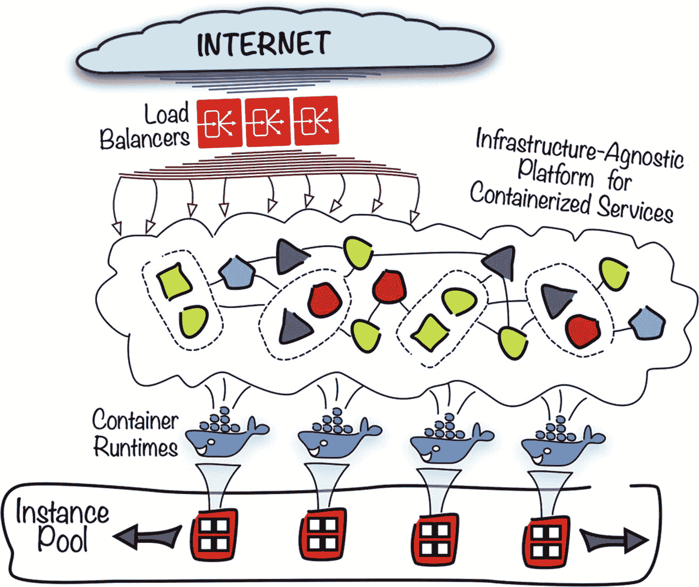

图 8-17 容器化应用平台

此类`容器平台`的目标如下：

*   编排容器化应用
*   抽象底层基础设施
*   为应用提供以下功能：
    *   扁平的覆盖网络
    *   可扩展的计算能力
    *   持久化存储
    *   面向应用的集成服务发现
    *   健康检查功能
    *   以及更多

根据牛津词典，`编排`一词可以表示“协调各个元素（…）以产生预期效果。”该平台协调各个独立容器及相关容器的生命周期，包括但不限于创建、扩展、终止、智能升级和自我修复。

从应用的角度来看，涉及多少计算实例或何种负载均衡器并不重要。重要的是计算能力以及稳定、不间断的传入请求流。这使得基础设施成为被抽象化的理想候选者。

目前已经存在相当多可用于运行容器化应用的集群感知平台，包括：

*   `Docker Swarm`
*   `HashiCorp Nomad`
*   `Mesosphere DC/OS`
*   `Kubernetes`

云原生计算基金会（`CNCF`）托管着一个专注于容器化应用的开源软件生态系统。其成员包括主要的云提供商、成熟的软件供应商和快速发展的初创公司。在撰写本文时，`Kubernetes`是容器编排领域唯一一个毕业项目，在`GitHub`上有超过 2,100 名直接贡献者，并已被许多云提供商采纳为其托管容器平台的引擎。

## Kubernetes

`Kubernetes`是一个真正庞大的主题，足以单独写一本书。该平台及多样化的相关工具生态系统提供了前文提到的广泛面向容器的功能。`Kubernetes`自带一个可扩展和可插拔的控制平面。`Kubernetes`作为一个围绕容器编排构建的、功能丰富的容器平台，为容器化应用提供了一个与基础设施无关、可扩展的部署画布，并配备了可插拔的扁平空间网络。

### Pods

容器化应用被组织成`Pod`。`Pod`是一种逻辑结构，它将紧密相关的容器分组在一起，通常是一个主容器和几个边车容器。尽管 Pod 中的容器在某种程度上仍然是隔离的，但它们确实共享一些元素，如主机名、网络接口和 IPC 命名空间。每个单独容器构建自的文件系统层仍然是分开的，除非它们共享相同或相似的镜像。容器可以使用`localhost`与同一 Pod 中的其他容器通信，因为它们共享环回接口。

如何将容器分组到 Pod 中？首先，考虑扩展性。Pod 可以被复制以提高处理吞吐量，或者简单地提供高可用性以应对故障。如果你觉得将两个特定的容器分开扩展更合适，就把它们放入两个独立的 Pod 中。其次，考虑边车模式。对于一个特定的主容器，你通常会将专用的支持容器放入同一个 Pod 中，以便它们能与主容器自由通信，例如通过环回接口。

### ReplicaSet

Pod 是核心的`Kubernetes`对象类型的一个示例。`Kubernetes`对象还有其他几种类型。我之前提到过 Pod 可以被复制。复制操作由一个`ReplicaSet`对象处理。`Kubernetes`的一个基本概念是控制器控制循环的存在。一个`ReplicaSet`定义了带有特定标签的 Pod 的期望数量。相应的控制循环确保 Pod 的数量根据期望状态保持正确。如果在某个时刻运行的 Pod 副本太少，控制循环将确保实例数量增加到特定`ReplicaSet`定义中所期望的值。

### Service

对于一组提供了特定 API 实现的 Pod 副本，你可能会问如何暴露这个 API。另一种`Kubernetes`对象，即`Service`对象，用于为实现特定服务的 Pod 副本组提供一个静态的入口点。`Kubernetes`根据选择器知道将传入的请求分发到哪里。当你定义一个`Service`对象时，你提供一个标签选择器。所有带有给定标签的 Pod 都将被视为该服务的寻址对象。

`Service`对象的默认类型称为`ClusterIP`。它为服务提供一个只能在集群内部访问的内部 IP 地址。这对于那些服务仅被集群内其他容器调用的容器来说非常合适。为了让服务能从集群外部访问，你可以选择`LoadBalancer`类型（前提是你的底层云基础设施支持这种类型）。Oracle Cloud Infrastructure 确实提供附加到公共 IP 并可以从互联网访问的公共负载均衡器。我稍后将实际演示这一点。


如果你思考升级策略，大概能说出几种。首先，如果你接受短时间的服务中断，最简单的方法是直接终止所有容器使用已弃用镜像的 Pod，让 `ReplicaSet` 在后台自动重新创建它们，这次使用最新的镜像。或者，你可以采用蓝绿部署策略，即基于新镜像版本创建新的 Pod，与基于先前镜像版本正在运行的 Pod 并行存在，然后在某个瞬间将服务切换指向这些新 Pod。最后，你可以通过逐一替换 Pod 为更新的镜像版本来执行滚动升级。滚动升级策略需要你使用两个 `ReplicaSet` 资源，并按步骤以程序化的方式逐步执行变更。`ReplicaSet` 是一个相当底层的对象。为了提升升级体验，一个更高级的对象 `Deployment` 应运而生。`Deployment` 对象通过 `ReplicaSet` 控制 Pod，其方式使得基于纯声明式变更来处理升级过程变得容易得多。我们不会在本书中深入探讨升级策略，但我们将使用 `Deployment` 对象，这就是我简要描述它的原因。

作为对 Kubernetes 主要对象类型的快速介绍的总结，让我们看一下图 8-18。这里定义了两个部署。左侧的那个定义了一个单容器 Pod，标记为 `Tag A`，并将期望副本数设置为两个。右侧的那个定义了一个双容器 Pod，标记为 `Tag B`，并将期望副本数设置为三个。此外，还创建了两个 `LoadBalancer` 类型的服务。一个将流量转发到附加了标签 `Tag A` 的 Pod，而第二个则将流量转发到附加了标签 `Tag B` 的 Pod。

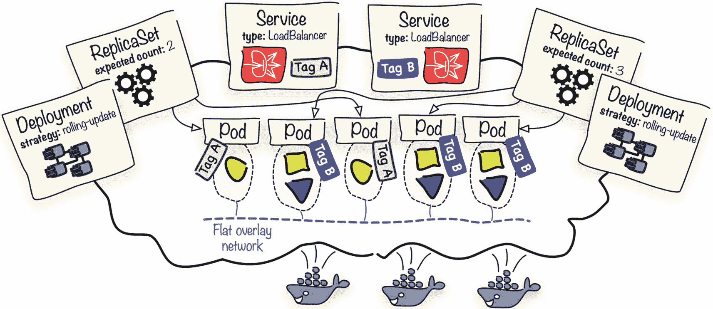

图 8-18 Kubernetes 对象

还有其他几种类型的 Kubernetes 对象，例如 `StatefulSets`、`DaemonSets`、`Jobs`、`Ingresses`、`PersistentVolumes`、`StorageClasses` 等。如果我在这里试图涵盖所有内容，这本书的篇幅会变得极为庞大。这就是为什么我们只关注本章后续部分中用于演示 Oracle Kubernetes Engine 的对象。如果这一切看起来过于理论化，请不要担心。你很快就会在实践中看到这些对象。继续阅读即可。

构建一个具有各种附加功能、可用于生产的集群，其本身就可能是个挑战。即使你没有被要求设计和启动 Kubernetes 集群，了解其高层架构仍然是有益的。

Kubernetes 控制平面由各种软件组件构成，这些组件被复制并分布在奇数个主节点上。这些组件包括 API 服务器、调度器和控制器管理器。Kubernetes 对象定义存储在一个名为 `etcd` 的分布式、持久化键值存储中。`etcd` 集群拥有独立于 Kubernetes 的生命周期，这在规划和启动可用于生产的集群时增加了工作量。只有 API 服务器会直接访问 `etcd`。Pod 被调度到称为工作节点的其他类型节点上。在每个节点上，通常有一个 `kubelet` 守护进程作为 `systemd` 主机服务管理器运行。你可以将 `kubelet` 视为节点代理。它通过与本地容器运行时通信来管理给定节点上的特定 Pod 容器。从网络角度来看，Kubernetes 服务代理负责控制服务与 Pod 之间的流量路由，而另一个可插拔组件——容器网络接口插件——则实现了 Pod 之间的覆盖网络。图 8-19 提供了属于 Kubernetes 控制平面的选定组件的高层概览。

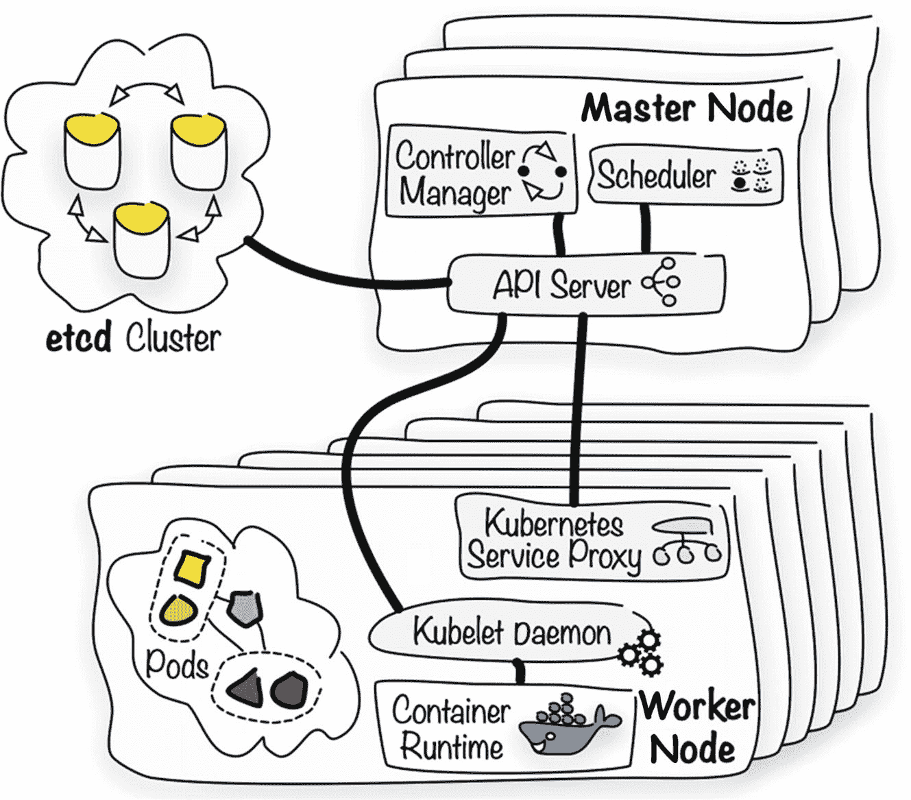

图 8-19 Kubernetes 与底层基础设施

本书并非专门讲述 Kubernetes 管理，你需要知道，在规划 Kubernetes 集群的自定义安装时，有许多不同的注意事项需要考虑。幸运的是，由于托管 Kubernetes 引擎的存在，我们无需为这些方面费心。


## 托管集群

Oracle Cloud Infrastructure 提供了 Oracle Kubernetes Engine (OKE)，这是一个托管的 Kubernetes 平台即服务（PaaS）云产品，已通过 CNCF 认证的 Kubernetes 一致性程序验证。该认证确保了所需的 Kubernetes API 得到完全支持，并与开源发行版保持一致。托管服务意味着在几分钟内，你就能获得一个完全可运行的集群，由平台以智能方式管理。你无需操心 `etcd` 集群或主节点配置。所有控制平面组件都会自动安装。你的职责是选择工作节点规格，并指向将要创建工作节点和负载均衡器的 VCN 子网。该集群将与 IAM 完全集成，并运行在 Oracle Cloud Infrastructure 计算实例上。

### 在 OCI 控制台中创建集群

在 OCI 控制台中创建集群非常直接。不过，首先要做的是：如果你的租户中从未启动过任何 OKE 集群，你必须显式启用 OKE 服务。这是通过在 `root` 区域中添加一条简单的 IAM 策略来完成的。所需的声明如清单 8-4 所示，它允许 OKE 服务管理整个租户中的所有资源。OKE 服务必须能够配置实例并动态更改一些网络资源，例如安全列表。

```json
[ "allow service OKE to manage all-resources in tenancy" ]
```
清单 8-4
`tenancy.oke.policy.json`

确保你在本地机器上。让我们创建所需的策略。我们没有使用 `--profile` 参数；因此，该命令将以租户管理员身份执行，因为该用户定义在我们的 CLI 配置文件的 `DEFAULT` 配置文件中。

```bash
$ TENANCY_OCID=`cat ~/.oci/config | grep tenancy | sed 's/tenancy=//'`
$ echo TENANCY_OCID
ocid1.tenancy.oc1..aa.........3yymfa
$ cd ~/git
$ cd oci-book/chapter08/3-kubernetes
$ cd policies
$ oci iam policy create -c $TENANCY_OCID --name tenancy-oke --description "OKE Policy"  --statements "file://tenancy.oke.policy.json"
{
"data": {
...
"lifecycle-state": "ACTIVE",
"name": "tenancy-oke",
"statements": [
"allow service OKE to manage all-resources in tenancy"
],
...
},
}
```

如今，随着越来越多的端到端自动化到位，我们已经习惯了“一键式”方法，这种方法假设完成诸如集群配置之类的任务不需要复杂的操作。正如我之前所说，在 OCI 控制台（或使用 CLI）中启动集群非常直接。要使用 OCI 控制台配置集群，你需要转到开发者服务，选择容器集群，单击创建集群，并提供一些详细信息，例如 Kubernetes 版本、工作节点规格以及每个工作节点子网的初始数量。然而，本书侧重于代码驱动的自动化；因此，我将展示如何使用 Terraform 驱动的基础设施代码在自定义虚拟网络布局之上配置集群。

### 使用 Terraform 配置集群

我们希望 `sandbox-admin` 被 OKE 集群识别为其初始管理员。这就是为什么你必须以 `sandbox-admin` 用户身份配置集群至关重要。到目前为止，Terraform 代表租户管理员创建了所有资源。为了让 Terraform 此次使用另一组凭据并以 `sandbox-admin` 身份与 OCI API 交互，你必须准备一个新的变量定义文件，如清单 8-5 所示。

```hcl
tenancy_ocid = ""
region = ""
user_ocid = ""
private_key_path = ""
private_key_password = ""
fingerprint = ""
compartment_ocid = ""
```
清单 8-5
`sandbox-admin.tfvars`

我们将使用 `--var-file` 参数将新文件传递给 `terraform`，以此为 `oci` 提供程序设置值，使其代表 `sandbox-admin` 用户执行所有 API 调用。所有必需的详细信息已经存在于 `.oci/config` 文件中的 `SANDBOX-ADMIN` 配置文件中。我准备了一个辅助脚本，用于从存储在 `.oci/config` 文件中的值生成 `sandbox-admin.tfvars` 文件。

```bash
$ SANDBOX_COMPARTMENT_OCID=`oci iam compartment get --query data.id --raw-output --profile SANDBOX-ADMIN`
$ cd ~/git/oci-book/chapter08/3-kubernetes
$ chmod a+x oci_config_to_tfvars.sh
$ ./oci_config_to_tfvars.sh ~/.oci/config ~/sandbox-admin.tfvars $SANDBOX_COMPARTMENT_OCID
```

确保新创建的 `tfvars` 文件确实存在于 `~/sandbox-admin.tfvars` 路径中，然后继续。

我们将使用 Terraform 来配置与 VCN 相关的资源，例如子网、安全列表和网关，以及 Kubernetes 集群云资源和工作节点实例池。OKE 需要各种资源，例如计算实例、负载均衡器和虚拟网络。`sandbox-admins` 组成员和租户管理员已经拥有在 `Sandbox` 区域中管理所需云资源类型的所有权限。在 `chapter08/3-kubernetes` 目录中，你会找到基础设施代码。让我们来配置它。

```bash
$ cd ~/git
$ cd oci-book/chapter08/3-kubernetes
$ cd infrastructure
$ find . | sort
./kube
./kube/cluster.tf
./kube/vars.tf
./kube/vcn-lb.tf
./kube/vcn-workers.tf
./modules.tf
./provider.tf
./vars.tf
./vcn.tf
$ terraform init
Initializing modules...
- kubernetes in kube
Initializing the backend...
Initializing provider plugins...
- Checking for available provider plugins...
- Downloading plugin for provider "oci" (terraform-providers/oci) 3.30.0...
Terraform has been successfully initialized!
$ terraform apply -var-file="~/sandbox-admin.tfvars" -auto-approve
...
```

> **提示**
>
> 如果你收到 401 错误，很可能是因为你使用了私钥的相对路径。请打开 `sandbox-admin.tfvars` 文件，将 `~` 字符或 `$HOME` 变量替换为你的主目录的绝对路径，例如 `/home/thomas/` 或 `/Users/thomas/`。

配置基础设施以及随后在主节点和工作节点上安装集群控制平面组件将需要几分钟时间，通常少于八分钟。Terraform 将显示 `Still creating` 消息。你也可以访问 OCI 控制台，观察处于创建状态的新集群，如图 8-20 所示。操作如下：

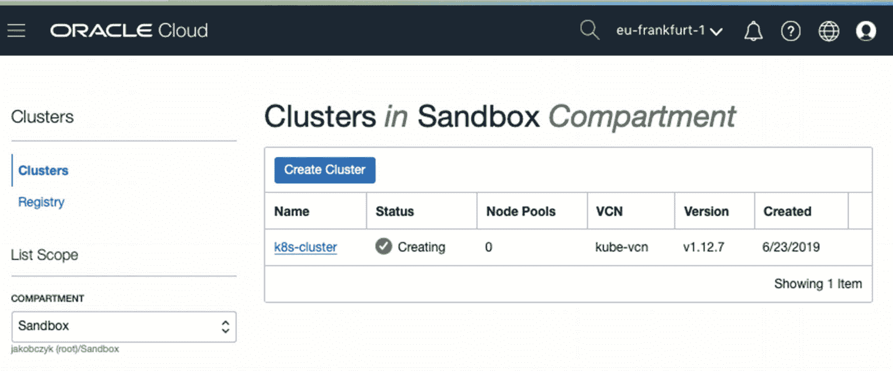

图 8-20

OKE 集群配置

1.  转到菜单 ➤ 开发者服务 ➤ 集群。

在某个时间点，集群将转移到活动状态。这宣告了控制平面已就绪。你仍然需要等待片刻，直到工作节点（节点池实例）进入运行状态。同时，请查看集群和网络信息，如图 8-21 所示。基础设施代码配置了一个具有单个工作节点池的 Kubernetes 集群。我们可以清楚地看到谁创建了该集群。

> **注意**
>
> 在“创建者”字段中，你应该看到 `sandbox-admin` 用户的名称或 OCID，如图 8-21 所示。如果你看到其他用户，例如租户管理员，这意味着你在执行 `terraform apply` 时要么省略了 `--var-file` 参数，要么 `~/sandbox-admin.tfvars` 文件中的用户数据无效。请使用 `terraform destroy` 删除当前集群，确保为 `sandbox-admin` 用户准备的新 Terraform 属性文件正确无误，然后重新创建基础设施。


所有云资源都已配置在`Sandbox`隔离区中。有两个负载均衡器子网。它们将用于托管高可用的、基于浮动 IP 的公共负载均衡器，当你开始创建`LoadBalancer`类型的 Kubernetes `Service`对象时，这些负载均衡器就会出现。`Pod CIDR`字段显示了将由动态创建的 Pod 使用的私有 IP 地址范围，而`Services CIDR`字段则显示了由 Kubernetes 服务暴露的地址范围。Pod 和服务地址范围的选取方式确保它们不会与工作节点所连接的`kube-vcn`虚拟云网络（VCN）所使用的地址范围重叠。

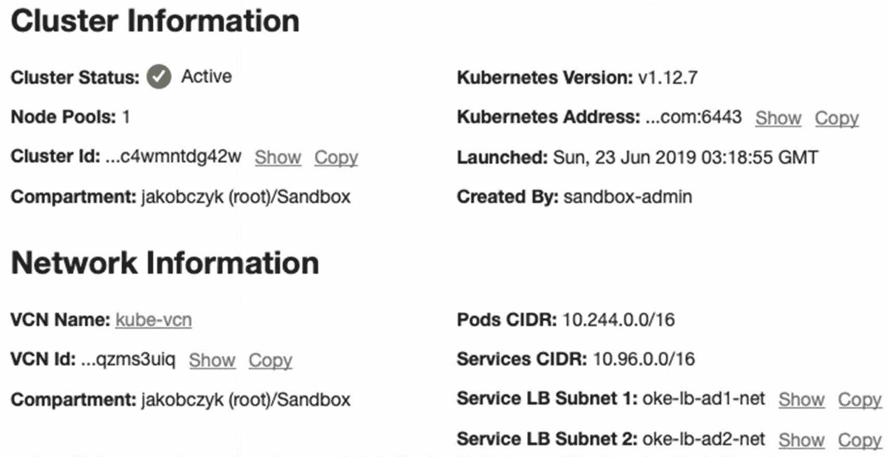

图 8-21

在 OCI 控制台中查看活动的 OKE 集群摘要

如果你查看 Terraform 的最终输出，你会看到不仅列出了集群资源，还提到了一个节点池。

```
...
module.kubernetes.oci_containerengine_cluster.k8s_cluster: Creation complete after 6m6s
module.kubernetes.oci_containerengine_node_pool.k8s_nodepool: Creating...
module.kubernetes.oci_containerengine_node_pool.k8s_nodepool: Creation complete after 2s
Apply complete! Resources: 13 added, 0 changed, 0 destroyed.
```

节点池由 OKE 管理，你可以在 OCI 控制台集群详情视图的底部看到它，如图 8-22 所示。该池控制着充当工作节点的计算实例。如果你点击这些实例中任何一个的名称，你将被转到相应实例的“实例详情”视图。所有属于 OKE 集群节点池的工作节点都像任何普通计算实例一样可见，如图 8-23 所示。你可以查看它们的指标并检查其他实例特有的信息。你还会发现实例显示名称包含了一小部分集群 OCID。如果你想知道主节点和 etcd 主机的实例在哪里，答案是整个 OKE 集群控制平面完全由 OKE 托管，从未在任何 API 中暴露。你不会在 OCI 控制台中看到它们，也无法使用 API 列出它们。这些计算资源是不可见的。

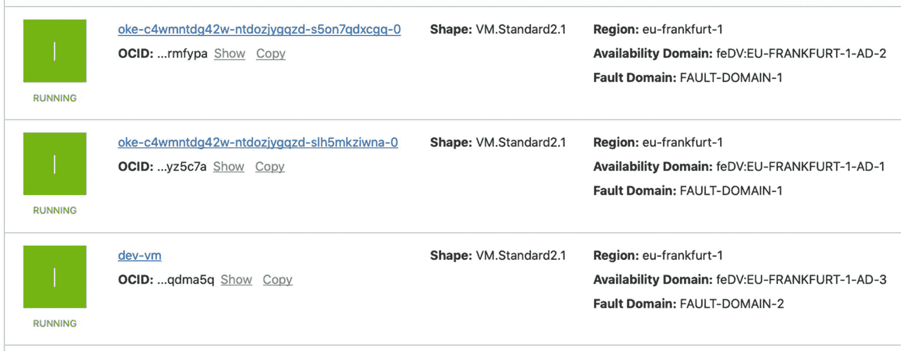

图 8-23

OCI 控制台中的 OKE 集群实例

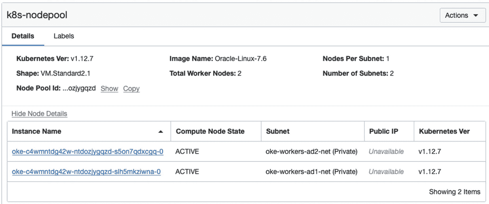

图 8-22

OCI 控制台中的 OKE 集群节点池

基础设施代码在我们选择设为私有子网的每个工作节点子网中声明了一个计算实例。对于工作节点，你有两个选项。它们可以连接到公共子网并拥有公共 IP，也可以被隔离在阻止实例拥有公共 IP 的私有子网中。在我们的案例中，我们选择了第二个选项。这就是为什么你在`Node Pool`表的`Public IP`列中看到`Unavailable`。这些实例部署在两个不同的可用性域（AD）中。它们的规格是`VM.Standard2.1`，基于`Oracle Linux 7.6`镜像。这些选择究竟从何而来？让我们看一下基础设施代码中的选定元素：

```
$ find . -name "*.tf" | sort
./kube/cluster.tf
./kube/vars.tf
./kube/vcn-lb.tf
./kube/vcn-workers.tf
./modules.tf
./provider.tf
./vars.tf
./vcn.tf
```

基础设施代码遵循一个众所周知的、你在这本书中已经见过几次的结构。只有一个名为`kube`的非根模块。它包含了 OKE 集群使用的所有基础设施云资源，但 VCN 和网关除外。VCN、NAT 网关和互联网网关在`vcn.tf`文件中声明。`modules.tf`文件将这些网络资源的 OCID 作为输入参数提供给`kube`模块。根模块中的代码与你在之前练习中看到的类似；因此，我不打算在这里列出根模块文件。你可以直接在基础设施代码中查看它们。清单 8-6 显示了来自`kube`模块的`vars.tf`文件。

```
