# kube module - vars.tf
...
variable "oke_cluster" {
  type = map
  default = {
    cidr                  = "10.0.2.0/24"
    version               = "v1.12.7"
    worker_image          = "Oracle-Linux-7.6"
    worker_shape          = "VM.Standard2.1"
    worker_nodes_in_subnet = 1
    pods_cidr             = "10.244.0.0/16"
    services_cidr         = "10.96.0.0/16"
  }
}
variable "oke_wn_subnet_cidr" {
  type = list(string)
  default = [ "10.0.2.0/27", "10.0.2.32/27" ]
}
variable "oke_lb_subnet_cidr" {
  type = list(string)
  default = [ "10.0.2.128/28", "10.0.2.144/28" ]
}
variable "oke_engine_cidr" {
  type = list(string)
  default = [ "130.35.0.0/16", "138.1.0.0/17"]
}
代码清单 8-6
vars.tf（kube 模块）
```

你可能被`kube`模块的`vars.tf`文件中为不同子网定义的各种 IP 地址范围的数量所淹没。它并没有看起来那么复杂。看一下图 8-24。仅 Kubernetes 本身就需要两个不重叠的私有 IP 地址范围，分别用于 Pod 和服务。这些范围在`oke_cluster` Terraform 变量映射中设置，然后传递给代表我们刚刚配置的 OKE 集群的`oci_container_engine_cluster` Terraform 资源。底层基础设施，如计算实例或 OCI 负载均衡器，将分布在属于同一个 VCN 的四个子网中。工作节点的子网在`oke_wn_subnet_cidr`列表变量中设置，而负载均衡器的子网则在`oke_lb_subnet_cidr`列表变量中设置。

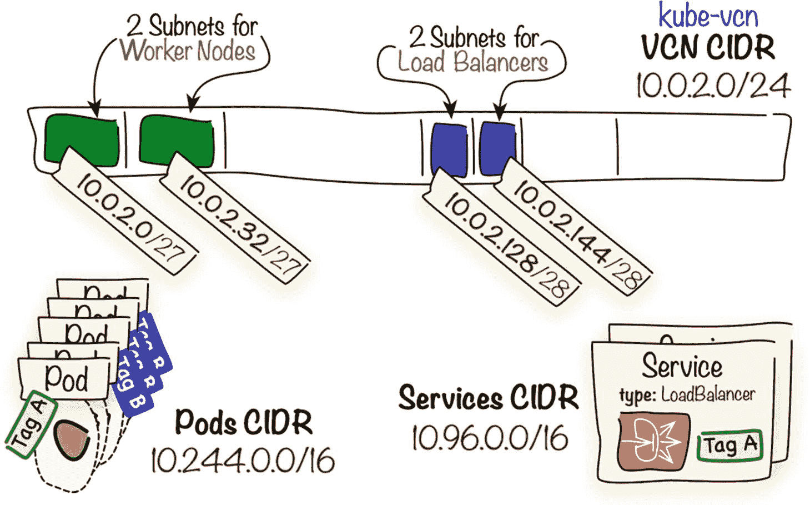

图 8-24

与 OKE 集群相关的子网

代码清单 8-7 展示了`vcn-workers.tf`文件，其中包含与工作节点子网相关的 VCN 资源的声明。这里定义了两个私有子网，每个位于不同的可用性域中。


### 工作节点子网与网络配置

以下代码块展示了为 OKE 工作节点子网配置的路由表、安全列表和子网资源。这些资源定义在 `vcn-workers.tf` 文件中。

```
resource "oci_core_route_table" "oke_workers_rt" {
  compartment_id = var.compartment_ocid
  vcn_id         = var.vcn_ocid
  display_name   = "oke-workers-rt"
  route_rules {
    destination        = "0.0.0.0/0"
    network_entity_id  = var.vcn_nat_ocid
  }
}

resource "oci_core_security_list" "oke_workers_sl" {
  compartment_id = var.compartment_ocid
  vcn_id         = var.vcn_ocid
  display_name   = "oke-workers-sl"
  # Allow all traffic within the VCN
  egress_security_rules {
    stateless    = true
    destination  = var.oke_cluster["cidr"]
    protocol     = "all"
  }
  ingress_security_rules {
    stateless    = true
    source       = var.oke_cluster["cidr"]
    protocol     = "all"
  }
  # Allow all outbound traffic
  egress_security_rules {
    destination = "0.0.0.0/0"
    protocol    = "all"
  }
}

resource "oci_core_subnet" "oke_workers_ad1_net" {
  compartment_id      = var.compartment_ocid
  vcn_id              = var.vcn_ocid
  display_name        = "oke-workers-ad1-net"
  availability_domain = var.ads[0]
  cidr_block          = var.oke_wn_subnet_cidr[0]
  route_table_id      = oci_core_route_table.oke_workers_rt.id
  security_list_ids   = [ oci_core_security_list.oke_workers_sl.id ]
  prohibit_public_ip_on_vnic = true
  dns_label           = "work1"
}

resource "oci_core_subnet" "oke_workers_ad2_net" {
  compartment_id      = var.compartment_ocid
  vcn_id              = var.vcn_ocid
  display_name        = "oke-workers-ad2-net"
  availability_domain = var.ads[1]
  cidr_block          = var.oke_wn_subnet_cidr[1]
  route_table_id      = oci_core_route_table.oke_workers_rt.id
  security_list_ids   = [ oci_core_security_list.oke_workers_sl.id ]
  prohibit_public_ip_on_vnic = true
  dns_label           = "work2"
}
```
*代码清单 8-7: `vcn-workers.tf` (kube 模块)*

### 负载均衡器子网与网络配置

类似地，为负载均衡器子网配置的 VCN 资源声明在一个名为 `vcn-lb.tf` 的类似文件中（如代码清单 8-8 所示）。这里同样定义了两个子网，每个位于不同的可用性域。这两个子网是公有的，以便 OKE 能够为任何 LoadBalancer 类型的 Kubernetes 服务创建 OCI 公有负载均衡器。

```
resource "oci_core_route_table" "oke_lb_rt" {
  compartment_id = var.compartment_ocid
  vcn_id         = var.vcn_ocid
  display_name   = "oke-lb-rt"
  route_rules {
    destination        = "0.0.0.0/0"
    network_entity_id  = var.vcn_igw_ocid
  }
}

resource "oci_core_security_list" "oke_lb_sl" {
  compartment_id = var.compartment_ocid
  vcn_id         = var.vcn_ocid
  display_name   = "oke-lb-sl"
  # Allow all traffic within the VCN
  egress_security_rules {
    stateless    = true
    destination  = var.oke_cluster["cidr"]
    protocol     = "all"
  }
  ingress_security_rules {
    stateless    = true
    source       = var.oke_cluster["cidr"]
    protocol     = "all"
  }
  # Allow all inbound traffic on ports 30000-32767
  egress_security_rules {
    stateless    = true
    destination  = "0.0.0.0/0"
    protocol     = "all"
  }
  ingress_security_rules {
    stateless    = true
    source       = "0.0.0.0/0"
    protocol     = "6"
    tcp_options {
      min = 30000
      max = 32767
    }
  }
}

resource "oci_core_subnet" "oke_lb_ad1_net" {
  compartment_id      = var.compartment_ocid
  vcn_id              = var.vcn_ocid
  display_name        = "oke-lb-ad1-net"
  availability_domain = var.ads[0]
  cidr_block          = var.oke_lb_subnet_cidr[0]
  route_table_id      = oci_core_route_table.oke_lb_rt.id
  security_list_ids   = [ oci_core_security_list.oke_lb_sl.id ]
  dns_label           = "lb1"
}

resource "oci_core_subnet" "oke_lb_ad2_net" {
  compartment_id      = var.compartment_ocid
  vcn_id              = var.vcn_ocid
  display_name        = "oke-lb-ad2-net"
  availability_domain = var.ads[1]
  cidr_block          = var.oke_lb_subnet_cidr[1]
  route_table_id      = oci_core_route_table.oke_lb_rt.id
  security_list_ids   = [ oci_core_security_list.oke_lb_sl.id ]
  dns_label           = "lb2"
}
```
*代码清单 8-8: `vcn-lb.tf` (kube 模块)*

### OKE 集群与节点池

最后，OKE 集群及其对应的节点池（用作 Kubernetes 工作节点的计算实例）在 `cluster.tf` 基础设施文件中声明。代码如代码清单 8-9 所示。

```
resource "oci_containerengine_cluster" "k8s_cluster" {
  compartment_id      = var.compartment_ocid
  kubernetes_version  = var.oke_cluster["version"]
  name                = "k8s-cluster"
  vcn_id              = var.vcn_ocid
  options {
    kubernetes_network_config {
      pods_cidr      = var.oke_cluster["pods_cidr"]
      services_cidr  = var.oke_cluster["services_cidr"]
    }
    service_lb_subnet_ids = [
      oci_core_subnet.oke_lb_ad1_net.id,
      oci_core_subnet.oke_lb_ad2_net.id
    ]
  }
}

resource "oci_containerengine_node_pool" "k8s_nodepool" {
  compartment_id      = var.compartment_ocid
  cluster_id          = oci_containerengine_cluster.k8s_cluster.id
  kubernetes_version  = var.oke_cluster["version"]
  name                = "k8s-nodepool"
  node_image_name     = var.oke_cluster["worker_image"]
  node_shape          = var.oke_cluster["worker_shape"]
  subnet_ids = [
    oci_core_subnet.oke_workers_ad1_net.id,
    oci_core_subnet.oke_workers_ad2_net.id
  ]
  quantity_per_subnet = var.oke_cluster["worker_nodes_in_subnet"]
  ssh_public_key      = file("~/.ssh/oci_id_rsa.pub")
}
```
*代码清单 8-9: `cluster.tf` (kube 模块)*

图 8-25 展示了为 `k8s-cluster` OKE 集群实例配置的 OCI 基础设施组件。Kubernetes 控制平面元素（如主节点和 etcd 主机）是完全托管且不可访问的，因此从 API 或 OCI 控制台中不可见。你可以检查、监控并在一定程度上管理的是作为工作节点的计算实例、负载均衡器以及其他虚拟网络组件。

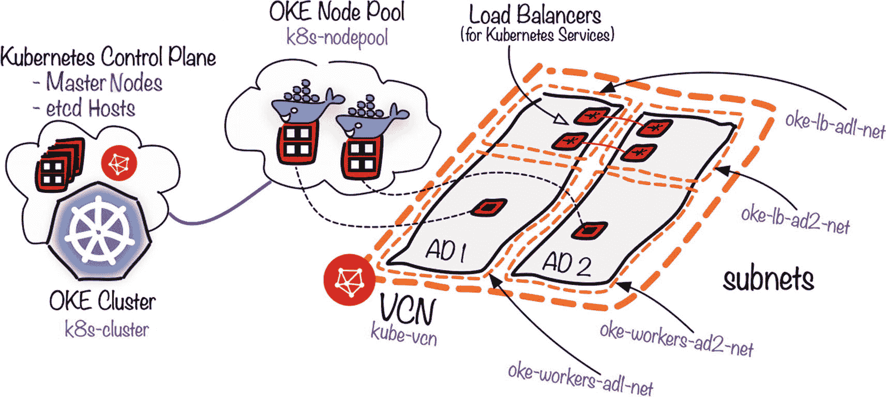

*图 8-25: 已配置的 OKE 集群*

有了托管的 Kubernetes 集群，现在是时候连接到 Kubernetes API 了。


### 以超级用户身份连接

Kubernetes 假定用户完全在 Kubernetes 外部进行管理。如果您正在使用一个未托管的 Kubernetes 集群，例如安装在您的数据中心或某些 IaaS 上，您通常会为客户端设置基于证书的身份验证，或者采用利用由 Kubernetes API 信任的身份签名的 ID 令牌的 OpenID Connect。后者在 Kubernetes API 认证以及随后的授权背景下，允许采用更面向生产的用户管理策略。

对于托管服务，如 Oracle Kubernetes Engine，一切都简单得多。对于 OKE 集群，只要 IAM 用户是具有适当 IAM 策略的组的成员，所有 IAM 用户都会被识别并成功通过身份验证，开箱即用。不过，接下来的是授权问题。作为某个组成员的 IAM 用户，如果该组在集群所在 compartment 中被分配了 `manage clusters` 权限，则 Kubernetes OCI 授权器会自动将该用户视为集群管理员，并拥有对该特定集群的完整 Kubernetes API 访问权限。其余的 IAM 用户则必须显式绑定到预定义或自定义的 RBAC 角色。您稍后将了解这一点。`sandbox-admin` 用户属于 `sandbox-admins` 组，该组已被授予对 `Sandbox` compartment 中所有资源的完全管理级访问权限。这样，Kubernetes API 应该会将此用户识别为集群管理员。首先，您需要一个所谓的 `kubeconfig` 文件，它不过是一个 YAML 文件，包含以命名用户身份连接到 Kubernetes API 所需的所有信息。要为特定 IAM 用户生成定制的 kubeconfig 文件，您可以使用 OCI 控制台或 OCI CLI，如下所示（请注意，我们使用 `--profile SANDBOX-ADMIN` 以 `sandbox-admin` 用户身份执行 CLI 命令）：

```
$ CLUSTER_OCID=`oci ce cluster list --name k8s-cluster --query "data[?name=='k8s-cluster'] | [0].id" --lifecycle-state ACTIVE --raw-output --profile SANDBOX-ADMIN`
$ echo $CLUSTER_OCID
ocid1.cluster.oc1.eu-frankfurt-1.aa.........tdg42w
$ REGION=eu-frankfurt-1
$ mkdir ~/.kube
$ oci ce cluster create-kubeconfig --cluster-id $CLUSTER_OCID --file ~/.kube/sandbox-admin.config --region $REGION --profile SANDBOX-ADMIN
New config written to the file /Users/mjk/.kube/sandbox-admin.config
$ chmod 600 ~/.kube/sandbox-admin.config
$ ls -l ~/.kube | awk '{print $1, $9}'
-rw------- sandbox-admin.config
```

根据惯例，kubeconfig 文件被放置在新创建的目录 `~/.kube` 中。路径 `~/.kube/config` 被我们即将使用的 `kubectl` 工具视为 kubeconfig 文件的默认路径。我们特意使用了自定义名称，以便仅在需要时才使用此配置。列表 8-10 展示了为 `sandbox-admin` 用户生成的 kubeconfig 文件。

```
apiVersion: v1
clusters:
- cluster:
certificate-authority-data:
::: Base64-encoded cluster certificate :::
server: https://c4wmntdg42w.eu-frankfurt-1.clusters.oci.oraclecloud.com:6443
name: cluster-c4wmntdg42w
contexts:
- context:
cluster: cluster-c4wmntdg42w
user: user-c4wmntdg42w
name: context-c4wmntdg42w
current-context: context-c4wmntdg42w
kind: ""
users:
- name: user-c4wmntdg42w
user:
exec:
apiVersion: client.authentication.k8s.io/v1beta1
args:
- ce
- cluster
- generate-token
- --cluster-id
- ::: Cluster OCID :::
- --region
- eu-frankfurt-1
command: oci
env: []
列表 8-10
.kube/sandbox-admin.config
```

`clusters:cluster:certificate-authority-data` 字段是集群的 Base64 编码证书，而 `users:user:exec` 字段是一个指令，用于使用自定义命令动态获取凭据并以特定 IAM 用户身份进行身份验证。如果您想进行身份验证，仅仅持有此文件是不够的。用于获取凭据的命令依赖于 OCI CLI 和用户特定的 CLI 配置文件。您很快就会看到它的实际操作。

别忘了我们正在为 `sandbox-admin` 使用特定的 CLI 配置文件。我们必须考虑到这一点，并相应地修改 `kube/sandbox-admin.config` 文件。编辑 `.kube/sandbox-admin.config` 文件并添加两行新内容（加粗显示），如下所示：

```
...
users:
- name: user-c2gmyzqguzt
user:
exec:
apiVersion: client.authentication.k8s.io/v1beta1
args:
- ce
- cluster
- generate-token
- --profile
- SANDBOX-ADMIN
- --cluster-id
...
```

您将使用一个名为 `kubectl` 的工具连接到 Kubernetes API。该工具将读取 kubeconfig 文件以执行以下操作：

1.  查明 Kubernetes API 公共端点是什么

2.  安全地连接到 Kubernetes API

3.  使用 OCI CLI 获取令牌并以命名 IAM 用户身份为我们进行身份验证

`kubectl` 工具已通过 cloud-init 根据提供的 cloud-config 文件预先安装在开发实例上，因此您应该能够开箱即用该工具。我们仍然需要在开发实例上安装 OCI CLI。现在，连接到开发实例并执行以下命令：

```
[opc@dev-vm ~]$ bash -c "$(curl -L https://raw.githubusercontent.com/oracle/oci-cli/master/scripts/install/install.sh)"
...
-- Installation successful.
-- Run the CLI with /home/opc/bin/oci --help
[opc@dev-vm ~]$ oci --version
2.6.14
[opc@dev-vm ~]$ mkdir ~/.oci
[opc@dev-vm ~]$ mkdir ~/.apikeys
[opc@dev-vm ~]$ exit
```

现在，我们需要准备并上传 `sandbox-admin` 的 CLI 配置。

```
$ cat ~/.oci/config | grep -A 4 "\[SANDBOX-ADMIN\]" > ~/.oci/devvm.config
$ cat ~/.oci/config | grep tenancy >> ~/.oci/devvm.config
$ cat ~/.oci/config | grep region >> ~/.oci/devvm.config
$ scp -i ~/.ssh/oci_id_rsa ~/.oci/devvm.config opc@$DEV_VM_PUBLIC_IP:/home/opc/.oci/config
devvm.config    100%  329  5.5KB/s
```

CLI 配置引用了 API 签名密钥。我们也上传它。

```
$ scp -i ~/.ssh/oci_id_rsa ~/.apikeys/api.sandbox-admin.pem opc@$DEV_VM_PUBLIC_IP:/home/opc/.apikeys/api.sandbox-admin.pem
api.sandbox-admin.pem   100% 1766    10.0KB/s
```

唯一缺少的是开发实例上的 kubeconfig 文件。因此，我们将通过以下方式安全地将 kubeconfig 文件复制到开发实例：

```
$ scp -i ~/.ssh/oci_id_rsa ~/.kube/sandbox-admin.config opc@$DEV_VM_PUBLIC_IP:/home/opc/.kube/config
sandbox-admin.config           100% 3669   117.0KB/s   00:00
```

提示

要了解开发实例是如何初始化的，您可以阅读位于 `chapter08/1-devmachine/devmachine/cloud-init/devvm.config.yaml` 的 cloud-config 文件。

现在，请连接到开发实例。

```
$ ssh -i ~/.ssh/oci_id_rsa opc@$DEV_VM_PUBLIC_IP
```

在我们开始与 Kubernetes API 交互之前，我们将调整新上传的配置文件的文件权限。

```
[opc@dev-vm ~]$ chmod 600 .kube/config
[opc@dev-vm ~]$ chmod 600 .oci/config
```

我们将发出几个 `kubectl` 命令来测试与 Kubernetes API 的连通性，并检查集群中的基本 Kubernetes 对象。仍在开发实例上，发出以下命令：


## Kubernetes 集群验证与命名空间管理

```
[opc@dev-vm ~]$ kubectl get nodes
NAME        STATUS   ROLES   AGE   VERSION
10.0.2.2    Ready    node    14h   v1.12.7
10.0.2.34   Ready    node    14h   v1.12.7
[opc@dev-vm ~]$ kubectl get namespaces
NAME          STATUS   AGE
default       Active   14h
kube-public   Active   14h
kube-system   Active   14h
[opc@dev-vm ~]$ kubectl get pods -n kube-system
NAME                                    READY   STATUS
kube-dns-7db5546bc6-4gvqq               3/3     Running
kube-dns-7db5546bc6-gq6fq               3/3     Running
kube-dns-autoscaler-7fcbdf46bd-5sdnx    1/1     Running
kube-flannel-ds-gvkxn                   1/1     Running
kube-flannel-ds-vlsgk                   1/1     Running
kube-proxy-blzxf                        1/1     Running
kube-proxy-sdv4m                        1/1     Running
kubernetes-dashboard-7b96874d59-w5tfj   1/1     Running
proxymux-client-10.0.2.2                1/1     Running
proxymux-client-10.0.2.34               1/1     Running
tiller-deploy-7c4c4bfbc4-nsscm          1/1     Running
```

**提示**
如果遇到错误，请仔细检查所有文件（`.oci/config`、`.kube/config`、`.apikeys/api.sandbox-admin.pem`）是否按要求设置、CLI 是否已安装，以及您是否已按照前面几个段落的描述将 `SANDBOX-ADMIN` 配置文件添加到 Kubeconfig 文件中。

`kubectl get nodes` 命令列出了工作节点。主节点不会列在 OKE 集群中。`kubectl get namespaces` 命令列出了 Kubernetes 命名空间，可以将其视为在同一物理集群中隔离不同环境的一种便捷方式。各种 Kubernetes 对象（如 Pod 或服务）存在于特定命名空间的范围内。`kube-system` 命名空间用于托管 Kubernetes 网络代理（`kube-proxy-`）和集群功能插件，例如容器网络接口插件 Pod（`kube-flannel-`）或集群 DNS Pod（`kube-dns-`）。您可以使用 `kubectl get pods` 命令并设置命名空间参数 `-n` 为 `kube-system` 值来列出这些 Pod。

这三个命令的输出实际上证明了您已通过 Kubernetes OCI 授权器成功认证。但给定用户在 Kubernetes API 方面的权限有多大呢？有没有办法检查呢？是的，有。一个直接的方法是 `auth can-i` Kubernetes API 调用。您可以使用 `kubectl` 这样调用：

```
[opc@dev-vm ~]$ kubectl auth can-i create namespace --all-namespaces
Yes
[opc@dev-vm ~]$ kubectl auth can-i '*' '*' --namespace=default
yes
```

第一次执行该命令是询问 Kubernetes API，代表 `kubectl` 进行调用的用户是否有权创建 Kubernetes 命名空间。答案不言自明，不是吗？第二条命令使用 `*` 通配符来检查在 `default` 命名空间中，是否允许该用户执行所有类型的操作。

事实上，正如我所提到的，`sandbox-admin` 用户应该能够对该集群的 Kubernetes API 执行所有类型的操作，因为他属于 `Sandbox` 管理员 IAM 组，并因此被 Kubernetes OCI 授权器视为该集群的集群管理员。让我们验证一下。

```
[opc@dev-vm ~]$ kubectl auth can-i '*' '*' --all-namespaces
Yes
```

这一切都是正确的。`sandbox-admin` 用户被授权在所有 Kubernetes 命名空间中对所有 Kubernetes 对象执行所有操作。

### Sandbox 命名空间

Kubernetes 命名空间可用于在同一物理集群中隔离不同环境。大多数 Kubernetes 资源都是命名空间范围的，在创建 Pod 或服务等特定资源时需要指定命名空间。在使用 Kubernetes DNS 进行 Kubernetes 服务名称解析时，命名空间也很有用，因为 Kubernetes 服务的 FQDN 包含其命名空间。我们希望 `sandbox-user` 能够执行诸如创建 Kubernetes 对象（如 Pod、服务和部署）等操作，但仅限于专用 Kubernetes 命名空间的范围内。最后但同样重要的是，您可以设置各种配额来限制特定命名空间中 Kubernetes 资源的消耗。

让我们创建一个名为 `dev-sandbox` 的新 Kubernetes 命名空间。

```
[opc@dev-vm ~]$ cd oci-book/chapter08/3-kubernetes/platform
[opc@dev-vm ~]$ kubectl create -f dev-sandbox-namespace.yaml
namespace/dev-sandbox created
```

我们使用了 `kubectl create` 命令来创建一个定义在 YAML Kubernetes 对象描述符中的新 Kubernetes 命名空间资源。我们通过 `-f` 参数传递了文件的相对路径。清单 8-11 显示了该 YAML 文件。

```
apiVersion: v1
kind: Namespace
metadata:
  name: dev-sandbox
  labels:
    environment: dev
```
**清单 8-11**
`dev-sandbox-namespace.yaml`

这个新的 Kubernetes 对象是 `Namespace` 类型，名称为 `dev-sandbox`，并带有自定义的 `environment` 标签，其值设置为 `dev`。由于 Kubernetes 平台的可插拔和可扩展性，标签通常是关联各种对象的主要手段。在这种情况下，我们将不使用这个特定的标签，但我借此机会向您展示如何为 Kubernetes 对象添加标签。您现在可以使用 `kubectl` 来列出并描述新创建的命名空间。

```
[opc@dev-vm ~]$ kubectl get namespaces
NAME          STATUS   AGE
default       Active   15h
dev-sandbox   Active   41m
kube-public   Active   15h
kube-system   Active   15h
[opc@dev-vm ~]$ kubectl describe namespace dev-sandbox
Name:         dev-sandbox
Labels:       environment=dev
Annotations:  
Status:       Active
No resource quota.
No resource limits.
[opc@dev-vm ~]$ exit
```

现在，有了新的命名空间，我们可以准备 `sandbox-user` 用户来连接 Kubernetes API 了。


## 以开发者身份连接

我们已经了解到，要使用`kubectl`与 Kubernetes API 通信，我们必须拥有一个 kubeconfig 文件。此外，您也看到 OKE 客户端认证机制假设令牌是使用 OCI CLI 在后台动态生成的。基于此事实，我们上传了`sandbox-admin`用户的 CLI 配置和 API 签名密钥。在本章前面，我们使用了`ce cluster create-kubeconfig` CLI 为`sandbox-admin`用户生成 kubeconfig。该命令是代表`sandbox-admin`用户发出的，这要归功于 CLI 配置文件中存在`SANDBOX-ADMIN`配置文件。在本节中，我们将让`sandbox-user`生成一个个人 kubeconfig 文件。很明显，并非每个 IAM 用户都应被允许生成个人 kubeconfig 文件。要生成 kubeconfig 文件，OCI API 要求调用 API 所代表的 IAM 用户拥有`GetClusterKubeconfig`权限集。此权限包含在`use clusters` IAM 策略动词中。让我们创建一个新策略，允许`sandbox-users`使用`Sandbox` compartment 中的所有 OKE 集群。尽管该策略是为`sandbox-users`组的成员准备的，但我们是像这样使用`SANDBOX-ADMIN`配置文件以`sandbox-admin`身份执行 CLI 命令的：

```
$ TENANCY_OCID=`cat ~/.oci/config | grep tenancy | sed 's/tenancy=//'`
$ echo $TENANCY_OCID
ocid1.tenancy.oc1..aa.........3yymfa
$ cd ~/git
$ cd oci-book/chapter08/3-kubernetes
$ cd policies
$ oci iam policy create --name sandbox-users-containers-policy --description "Containers-related policy for regular Sandbox users"  --statements "file://sandbox-users.containers.policy.json" --profile SANDBOX-ADMIN
{
"data": {
...
"lifecycle-state": "ACTIVE",
"name": "sandbox-users-containers-policy",
"statements": [
"allow group sandbox-users to use clusters in compartment Sandbox"
],
...
}
```

列表 8-12 展示了我们用来创建新 IAM 策略的 JSON 文件的内容。正如我之前所说，我们正在授予`sandbox-users`组的成员使用`Sandbox` compartment 中所有 OKE 集群的权利。这组权限也包括生成个人 kubeconfig 文件的权利。

```
[
"allow group sandbox-users to use clusters in compartment Sandbox"
]
列表 8-12
sandbox-users.containers.policy.json
```

现在，我们已准备好通过应用`SANDBOX-USER` CLI 配置文件，代表`sandbox-user`用户执行`ce cluster create-kubeconfig` CLI 命令，如下所示：

```
$ oci ce cluster create-kubeconfig --cluster-id $CLUSTER_OCID --file ~/.kube/sandbox-user.config --region $REGION --profile SANDBOX-USER
New config written to the file /Users/mjk/.kube/sandbox-user.config
$ chmod 600 ~/.kube/sandbox-user.config
```

我们必须通过设置正确的 OCI CLI 配置文件来修改新生成的 kubeconfig 文件。请编辑`sandbox-user.config`文件并像这样添加`SANDBOX-USER`配置文件：

```
...
users:
- name: user-c2gmyzqguzt
user:
exec:
apiVersion: client.authentication.k8s.io/v1beta1
args:
- ce
- cluster
- generate-token
- --profile
- SANDBOX-USER
- --cluster-id
...
```

总而言之，在此阶段，我们有两个配置文件。

```
$ ls -l ~/.kube | awk '{print $1, $9}'
-rw------- sandbox-admin.config
-rw------- sandbox-user.config
```

现在，将最新的 kubeconfig 文件上传到开发人员实例。

```
$ scp -i ~/.ssh/oci_id_rsa ~/.kube/sandbox-user.config opc@$DEV_VM_PUBLIC_IP:/home/opc/.kube
sandbox-user-config           100% 3669   262.2KB/s   00:00
```

我们必须通过添加`SANDBOX-USER`配置文件来扩展`dev-vm`上的 OCI CLI 配置。让我们在本地完成此操作，然后再次上传以替换先前版本。

```
$ cat ~/.oci/config | grep -A 4 "\[SANDBOX-USER\]" >> ~/.oci/devvm.config
$ cat ~/.oci/config | grep tenancy >> ~/.oci/devvm.config
$ cat ~/.oci/config | grep region >> ~/.oci/devvm.config
$ scp -i ~/.ssh/oci_id_rsa ~/.oci/devvm.config opc@$DEV_VM_PUBLIC_IP:/home/opc/.oci/config
devvm.config   100%  656   5.2KB/s
```

最后但同样重要的是，我们需要上传`sandbox-user`的 API 签名密钥。

```
$ scp -i ~/.ssh/oci_id_rsa ~/.apikeys/api.sandbox-user.pem opc@$DEV_VM_PUBLIC_IP:/home/opc/.apikeys/api.sandbox-user.pem
api.sandbox-user.pem   100% 1766    13.7KB/s
```

让我们连接到开发机器。

```
$ ssh -i ~/.ssh/oci_id_rsa opc@$DEV_VM_PUBLIC_IP
```

此时，开发人员机器上的`~/.kube`目录中应该有两个 kubeconfig 文件：

```
[opc@dev-vm ~]$ chmod 600 ~/.kube/sandbox-user.config
[opc@dev-vm ~]$ ls -l ~/.kube | grep config | awk '{print $1, $9}'
-rw-------. config
-rw-------. sandbox-user.config
```

您将使用`--kubeconfig`参数指示`kubectl`工具应使用哪个文件，如图 8-26 所示。如果将参数留空，则默认情况下将选择`~/.kube/config`文件。

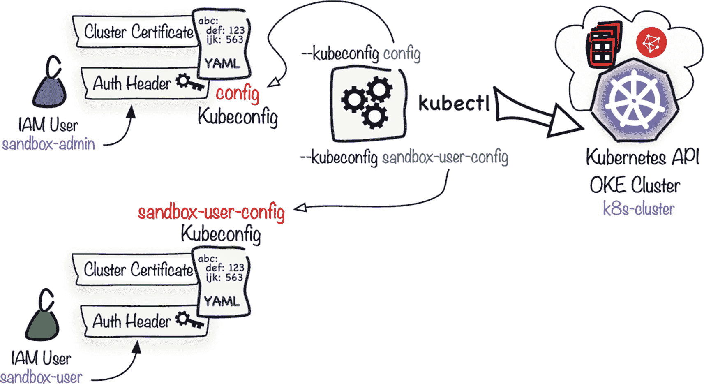

**图 8-26**
Kubeconfig 文件

让我们尝试列出`dev-sandbox`命名空间中的 Pod，这次代表`sandbox-user`。请记住，通过像这样设置`--kubeconfig`参数来选择适当的 kubeconfig 文件：

```
[opc@dev-vm]$ kubectl --kubeconfig ~/.kube/sandbox-user-config get pods -n dev-sandbox
Error from server (Forbidden): pods is forbidden: User "ocid1.user.oc1..aa.........dzqpxa" cannot list resource "pods" in API group "" in the namespace "dev-sandbox"
```

收到的响应清楚地表明，给定用户无权执行此类操作。`sandbox-user`用户属于一个未分配`manage clusters`策略的组。因此，该用户在 k8s-cluster OKE 集群中没有预定义的角色集。我们必须显式地将用户绑定到一个角色。我们将创建一个*角色绑定*，将`sandbox-user`绑定到`edit`角色，并且仅限于`dev-sandbox`命名空间的范围。`edit`角色是预定义的 Kubernetes 角色，它给予对特定命名空间中大多数类型的 Kubernetes 对象的读写访问权限，但不允许用户创建角色绑定。

我们现在将创建一个 Rolebinding Kubernetes 对象，该对象将`sandbox-user`绑定到`dev-sandbox`命名空间上下文中的预定义 edit 角色。您必须代表`sandbox-admin`执行`kubectl create rolebinding`，并像这样省略`--kubeconfig`参数：

```
[opc@dev-vm]$ SANDBOX_USER_OCID=ocid1.user.oc1..aa.........dzqpxa
[opc@dev-vm]$ kubectl create rolebinding sandbox-users-binding --clusterrole=edit --namespace=dev-sandbox --user=$SANDBOX_USER_OCID
rolebinding.rbac.authorization.k8s.io/sandbox-users-binding created
```

我们可以再次尝试列出`dev-sandbox`命名空间中的 Pod。请记住设置`--kubeconfig`参数以作为`sandbox-user`用户运行命令。

```
[opc@dev-vm]$ kubectl --kubeconfig ~/.kube/sandbox-user-config get pods -n dev-sandbox
No resources found.
```

`No resources found`消息证明我们能够作为`sandbox-user`调用 Kubernetes API。

对于`sandbox-user`用户，我们期望仅在`dev-sandbox`命名空间的范围内执行所有`kubectl`命令。您可以像这样将默认命名空间添加到您的配置文件中，而不是显式使用`-n`参数：

```
[opc@dev-vm]$ cat ~/.kube/sandbox-user.config
...
contexts:
- context:
cluster: cluster-...
namespace: dev-sandbox
user: user-...
name: context-...
...
```

最后，我们已准备好将一些 Pod 部署到我们的 OKE 集群。


### Pod

如前所述，本章前文已对 UUID API 进行了容器化，并将 `uuid:1.0` Docker 镜像推送至 OCI 注册表。现在，我们将基于此镜像创建一个 Kubernetes Pod。具体方法是：提供一个 YAML 描述文件，其中定义了包含单个容器的新 Pod 及其容器镜像。需要记住，我们为 `uuid:1.0` 镜像使用了一个私有的 OCIR 仓库。从 OCIR 的角度看，OKE 集群只是另一个客户端，为了成功拉取镜像，它必须使用认证令牌进行验证。您可以将此令牌存储在 Kubernetes 的 *secret* 类型对象中。这样，在创建需要从特定注册表中的一个或多个容器仓库拉取镜像的 Kubernetes Pod 时，您就可以引用这个 secret。在我们这个例子中，secret 将封装区域性的 OCIR 端点、IAM 用户名和该用户的认证令牌。因此，Kubernetes 将只能从该特定 IAM 用户有权访问的仓库中拉取镜像。

为了创建单容器 Pod，我们将使用带有简单 YAML 描述文件的 `kubectl create` 命令。该过程的概念图见图 8-27。

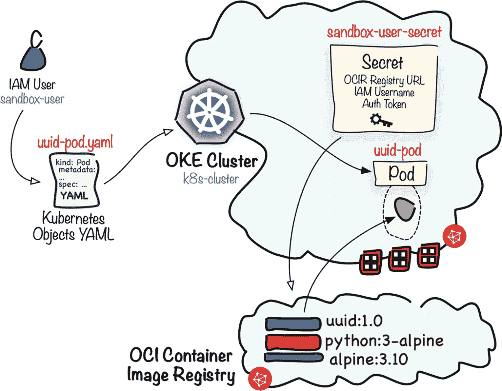

图 8-27

#### 令牌与秘密

在本节中，所有 `kubectl` 调用都将代表 `sandbox-user` 用户执行。为了简化输入，我们可以通过设置 `KUBECONFIG` 环境变量来覆盖默认的 kubeconfig 路径。设置并导出该变量，使其指向属于 `sandbox-user` 用户的 kubeconfig 文件，如下所示：

```
[opc@dev-vm]$ export KUBECONFIG=~/.kube/sandbox-user.config
```

您将使用 `kubectl create secret` 命令在 `dev-sandbox` 命名空间中创建一个新的 Secret 对象。该 Secret 对象将被命名为 `sandbox-user-secret`，类型为 `docker-registry`，并包含 Kubernetes 访问存储了 `uuid:1.0` 容器镜像的 OCIR 私有仓库所需的所有信息，即：

*   区域性 OCIR 注册表 URL
*   IAM 用户
*   该 IAM 用户的认证令牌

我使用了 shell 变量，以便您在调整变量值后可以直接复制 `kubectl create secret` 命令。请记住，`OCIR_REGION` 变量使用 OCIR 区域代码，`OCI_TENANCY_NAMESPACE` 使用您的租户命名空间，`OCI_USER_TOKEN` 使用为 `sandbox-user` 用户生成的认证令牌。

```
[opc@dev-vm]$ OCI_TENANCY_NAMESPACE=jakobczyk
[opc@dev-vm]$ OCIR_REGION=fra
[opc@dev-vm]$ OCI_USER=sandbox-user
[opc@dev-vm]$ OCI_USER_TOKEN="B8.E_Ry7oOtN1KF0do9x"
[opc@dev-vm]$ kubectl create secret docker-registry sandbox-user-secret --docker-server=$OCIR_REGION.ocir.io --docker-username="$OCI_TENANCY_NAMESPACE/$OCI_USER" --docker-password="$OCI_USER_TOKEN" -n dev-sandbox
secret/sandbox-user-secret created
```

Caution
在使用 OCIR 时，请注意不要混淆 *租户名称* 和 *租户命名空间*。请确保用于获取 OCIR 访问权限的 Kubernetes secret 使用的是租户命名空间。

我们可以像这样显示特定命名空间中存在的 secret：

```
[opc@dev-vm]$ kubectl get secrets -n dev-sandbox
NAME                 TYPE                               DATA  AGE
default-token-wg574  kubernetes.io/service-account-token 3   3d1h
sandbox-user-secret  kubernetes.io/dockerconfigjson      1    51s
```

新创建的、类型为 `kubernetes.io/dockerconfigjson` 的 `sandbox-user-secret` 存储了以 `sandbox-user` 用户身份访问 OCIR 所需的所有数据。

现在，我们将基于 `uuid:1.0` 容器镜像创建一个单容器 Pod。您只需使用定义了新 Pod 的 `uuid-pod.yaml` 文件来执行 `kubectl create` 命令。不久前，您通过环境变量覆盖了默认的 kubeconfig 路径。这意味着所有 `kubectl` 命令都是作为 `sandbox-user` 用户调用的。您必须在 `dev-sandbox` 命名空间中创建 Pod；否则操作将失败。像这样创建 Pod：

```
[opc@dev-vm]$ cd oci-book/chapter08/3-kubernetes/platform
[opc@dev-vm]$ sed -i "s/OCIR_REGION/$OCIR_REGION/; s/OCI_TENANCY_NAMESPACE/$OCI_TENANCY_NAMESPACE/" uuid-pod.yaml
[opc@dev-vm]$ kubectl create -f uuid-pod.yaml -n dev-sandbox
pod/uuid-pod created
[opc@dev-vm]$ kubectl get pods -n dev-sandbox
NAME       READY   STATUS    RESTARTS   AGE
uuid-pod   1/1     Running   0          8s
```

Tip
如果您看到 `ErrorImagePull` 或 `ImagePullBackOff` 状态，而不是 `Running` 状态，则可能是令牌有问题。请确保在设置 `OCI_USER_TOKEN` 变量时将令牌放在引号内。

清单 8-13 展示了用于创建新 Pod 的 YAML 文件。`metadata` 部分用于将对象置于特定的命名空间并设置其名称。`spec` 部分包含容器定义以及拉取镜像时要使用的 Secret 对象的名称。镜像名称引用了正确标记为 `uuid:1.0` 的容器镜像。我们使用 `sed` 命令将 YAML 文件中两个用大写字母表示的占位符替换为您的 OCIR 区域和租户命名空间。

```
apiVersion: v1
kind: Pod
metadata:
name: uuid-pod
namespace: dev-sandbox
spec:
containers:
- image: OCIR_REGION.ocir.io/OCI_TENANCY_NAMESPACE/sandbox/uuid:1.0
name: uuid-container
ports:
- containerPort: 5000
protocol: TCP
imagePullSecrets:
- name: sandbox-user-secret
Listing 8-13
uuid-pod.yaml
```

坦率地说，单独一个 Pod 并不能给我们带来多少增值。我们知道它运行着一个 UUID API，但我们无法直接访问其端点。让我们删除这个 Pod。

```
[opc@dev-vm]$ kubectl delete pod uuid-pod -n dev-sandbox
pod "uuid-pod" deleted
```


### 部署与服务

一个容器化的应用几乎从来不只是孤零零的单容器 Pod。大多数容器化应用，特别是无状态应用，都希望能够进行水平扩展，并向服务消费者暴露服务端点。服务消费者可以被认为是同一集群中其他 Pod 内运行的其它容器化应用，或者是来自公共互联网的外部系统或客户端。为了控制和方便地管理一组 Pod 副本的服务端，你将使用 Kubernetes 的`Service`对象。`Service`对象在某种程度上解耦了代表 Web 服务的静态端与由一组 Pod 提供的服务实现。这样做的部分原因是 Pod 可以被动态地扩缩容。同时，服务端应保持不变，以简化服务发现。此外，`Service`对象负责对传入流量进行适当的负载均衡。为了管理对一组 Pod 的操作，例如升级策略和维持预期数量的健康 Pod，你将使用 Kubernetes 的`Deployment`对象。`Deployment`对象会创建一个`ReplicaSet`，该`ReplicaSet`保持稳定数量的相同 Pod，并替换那些进入不健康状态的 Pod。此外，它还通过使用各种升级策略，来谨慎处理容器更新到新镜像的方式。图 8-28 展示了这些 Kubernetes 对象之间简单的协作关系。

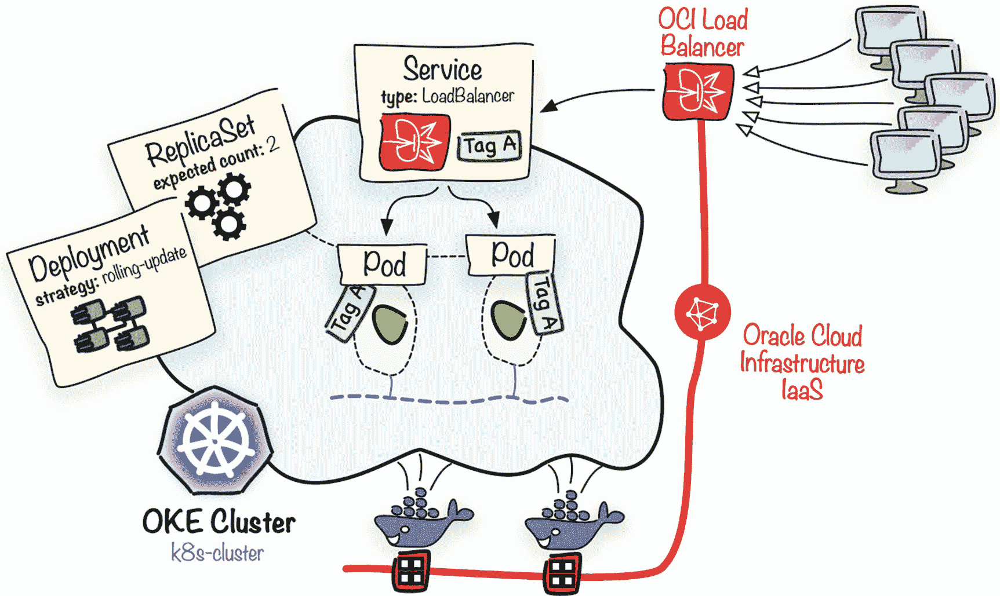

图 8-28

Kubernetes 上的无状态服务

假设你仍在开发实例上，`KUBECONFIG`变量已如前所述设置，并且你仍在`3-kubernetes/platform`目录中。使用`kubectl create`命令和`uuid-deployment.yaml`文件来创建一组 Kubernetes 对象，如下所示：

```
[opc@dev-vm] $ sed -i "s/OCIR_REGION/$OCIR_REGION/; s/OCI_TENANCY_NAMESPACE/$OCI_TENANCY_NAMESPACE/" uuid-deployment.yaml
[opc@dev-vm] $ kubectl create -f uuid-deployment.yaml -n dev-sandbox
deployment.apps/uuid-dpm created
service/uuid-srv created
```

清单 8-14 展示了`uuid-deployment.yaml`文件，该文件创建了关联的 Kubernetes 对象，即`Service`、`Deployment`、`ReplicaSet`以及托管容器的`Pods`，这些容器基于从租户的 OCIR 拉取的`uuid:1.0`容器镜像。所有 Pod 都带有`app=uuid`标签。`Service`对象使用基于标签的选择器`app:uuid`来了解如何路由和分发从其专用的 Oracle Cloud Infrastructure 负载均衡器传入的流量。如果`Service`对象的类型设置为`LoadBalancer`，则负载均衡器会被动态创建。

```
apiVersion: apps/v1
kind: Deployment
metadata:
name: uuid-dpm
namespace: dev-sandbox
spec:
replicas: 2
selector:
matchLabels:
app: uuid
template:
metadata:
labels:
app: uuid
spec:
imagePullSecrets:
- name: sandbox-user-secret
containers:
- name: uuid-container
image: OCIR_REGION.ocir.io/OCI_TENANCY_NAMESPACE/sandbox/uuid:1.0
ports:
- containerPort: 5000
protocol: TCP

apiVersion: v1
kind: Service
metadata:
name: uuid-srv
namespace: dev-sandbox
spec:
type: LoadBalancer
selector:
app: uuid
ports:
- port: 80
targetPort: 5000
清单 8-14
uuid-deployment.yaml
```

你可以使用`kubectl get`命令来显示新创建的对象。

```
[opc@dev-vm]$ kubectl get pods -n dev-sandbox -o wide
NAME                       READY STATUS   IP          NODE
uuid-dpm-78cf484f96-rj4br  1/1   Running  10.244.1.7  10.0.2.2
uuid-dpm-78cf484f96-wg2zw  1/1   Running  10.244.0.7  10.0.2.34
[opc@dev-vm]$ kubectl get replicasets -n dev-sandbox
NAME                  DESIRED   CURRENT   READY
uuid-dpm-78cf484f96   2         2         2
[opc@dev-vm]$ kubectl get services -n dev-sandbox
NAME      TYPE          CLUSTER-IP   EXTERNAL-IP    PORT(S)
uuid-srv  LoadBalancer  10.96.26.62  130.61.195.20  80:31475/TCP
```

新创建的`Service`对象是`LoadBalancer`类型。这导致配置了一个新的高可用公共 OCI 负载均衡器，该均衡器跨越了你为集群负载均衡器设置的两个子网。`EXTERNAL-IP`列显示了负载均衡器的公共 IP 地址。如果你看到`Pending`，请稍等片刻。你的负载均衡器正在启动中。在我的例子中，负载均衡器的公共 IP 地址是 130.61.195.20，你的地址可能会不同。请记下它，我们稍后会需要用到。同时，你可以在 OCI 控制台中观察负载均衡器，如图 8-29 所示。你可能需要等待片刻才能看到“整体运行状况”设置为`正常`。有时，即使负载均衡器完全可用，这个标志最初也会在稍长一段时间内设置为`未知`。图 8-30 展示了负载均衡器的详细视图，包括其形态、公共 IP 地址、VCN 以及你在启动 OKE 集群时为负载均衡器选择的两个公共子网。

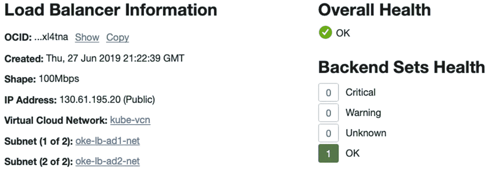

图 8-30

Kubernetes 服务负载均衡器详情

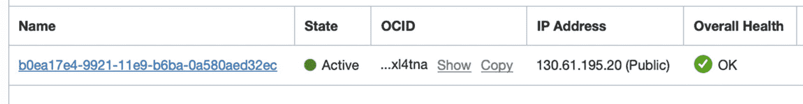

图 8-29

Kubernetes 服务负载均衡器

如果你仍在开发者实例上，请断开连接。

```
[opc@dev-vm]$ exit
```

让我们向服务的外部 IP 地址发送一系列相同的请求。在运行这些命令之前，你需要将`LB_PUBLIC_IP`的值替换为已分配给你负载均衡器的 IP 地址：

```
$ LB_PUBLIC_IP=130.61.195.20
$ for i in {1..10}; do curl $LB_PUBLIC_IP:80/identifiers; done
{"generator":"uuid-dpm-78cf484f96-wg2zw","uuid":"a5bf.......d471"}
{"generator":"uuid-dpm-78cf484f96-wg2zw","uuid":"f2a4.......b902"}
{"generator":"uuid-dpm-78cf484f96-rj4br","uuid":"564c.......1496"}
{"generator":"uuid-dpm-78cf484f96-rj4br","uuid":"2473.......f7f9"}
{"generator":"uuid-dpm-78cf484f96-rj4br","uuid":"9709.......bc47"}
{"generator":"uuid-dpm-78cf484f96-wg2zw","uuid":"cffd.......22d9"}
{"generator":"uuid-dpm-78cf484f96-wg2zw","uuid":"6bb3.......5285"}
{"generator":"uuid-dpm-78cf484f96-rj4br","uuid":"6b02.......cafc"}
{"generator":"uuid-dpm-78cf484f96-rj4br","uuid":"fdb5.......dcf7"}
{"generator":"uuid-dpm-78cf484f96-wg2zw","uuid":"ee94.......b038"}
```

`generator`字段是根据接收到请求的 Pod 名称填充的。查看结果，你应该会看到请求在支撑我们服务的两个 Pod 之间相当均匀地分配。如果你愿意，可以在几秒钟内将容器化应用实例的数量扩展到数十甚至数百个。

我们在本章中使用 Oracle Kubernetes Engine 所完成的操作，仅仅是触及了使用基于云的托管 Kubernetes 所能实现功能的皮毛。请随意尝试，当你准备好进入下一章时，别忘了终止集群和开发者实例，以节省你的资源消耗。


# 9. 云原生架构

## 清理

我们需要按正确顺序终止三组资源。

*   Kubernetes 对象及其相关的 OCI 资源
*   OKE 集群及相关资源
*   `dev-vm` 计算实例及相关资源

首先，我们有一个 Kubernetes 服务，它是在配置负载均衡器时创建的。我们需要删除此服务以移除相应的负载均衡器。让我们再次连接到开发者实例，并使用 `kubectl` 删除我们刚刚成功测试过的 Kubernetes 对象。

```shell
$ ssh -i ~/.ssh/oci_id_rsa opc@$DEV_VM_PUBLIC_IP
[opc@dev-vm]$ export KUBECONFIG=~/.kube//sandbox-user.config
[opc@dev-vm]$ kubectl delete all --all -n dev-sandbox
pod "uuid-deployment-78cf484f96-rj4br" deleted
pod "uuid-deployment-78cf484f96-wg2zw" deleted
service "uuid-service" deleted
deployment.apps "uuid-deployment" deleted
[opc@dev-vm]$ exit
```

第二步涉及终止集群。进入基础设施代码目录，并执行 `terraform destroy` 命令，正确引用 `sandbox-admin.tfvars` 文件，以代表 `sandbox-admin` 用户执行此操作。

```shell
$ cd ~/git
$ cd oci-book/chapter08/3-kubernetes/infrastructure
$ terraform destroy -var-file="$HOME/sandbox-admin.tfvars" -auto-approve
```

最后，你可以进入本章的最后一个清理步骤，终止 `dev-vm` 计算实例。

```shell
$ source ~/tfvars.env.sh
$ cd ~/git
$ cd oci-book/chapter08/1-devmachine
$ terraform destroy -auto-approve
```

## 总结

在本章中，你体验了将应用程序容器化的端到端过程。首先，我们基于 UUID API 构建了一个多层容器镜像，该 API 最初在第 2 章中作为操作系统服务构建和部署在计算实例上。我们基于此镜像在本地测试了容器，并将其推送到 OCIR 私有仓库。接着，我们讨论了基于最流行的开源容器平台 Kubernetes 进行容器编排的必要性。然后，我们使用 Oracle Kubernetes Engine 准备并配置了一个托管 Kubernetes 集群。随后，你学习了如何使用 Kubernetes API 以及管理 IAM 用户的细粒度访问权限。最后，你创建了一套完整的 Kubernetes 对象，以基于本章开头准备的容器镜像，妥善管理一个无状态的容器化应用程序。

在下一章中，我们将讨论云原生架构在当今的实际含义。

近年来，软件领域的变化程度和速度前所未有地加快了。`开源`运动点燃了大量分散且常常独立的团队，他们以惊人的速度竞相将新的软件组件、工具、平台、协议和服务推向市场。`云计算`通过允许团队在几秒钟内自行配置虚拟化硬件资源，消除了许多与硬件相关的入门壁垒。借助云提供商管理的硬件能力（包括虚拟化甚至裸机），几乎任何人都可以启动和开发一个小型软件项目。前一章简要介绍的`容器化`，通常为设计应用程序带来了新的方法，并需要新的补充工具来使解决方案达到生产就绪状态。这里存在一些老问题需要解答，例如如何在容器时代解决存储、网络、消息传递和服务发现的挑战。也有新的领域有待探索——服务网格、容器注册表和调度器等。让我们列举三个对构建新一代软件解决方案的架构方式产生重大影响的信息时代转折点。它们如下：

*   `开源`
*   `云计算`
*   `容器化`

日益增长的开源贡献者以及启动云端软件项目的便利性，引发了前所未有的软件开发规模。容器化的到来带来了对新型软件组件的需求，以及调整一些现有工具的需求。要推出一个生产就绪的软件解决方案，通常需要精心挑选各种类型的现有组件，添加你内部的应用程序代码库，并正确集成所有内容。大量积极开发中、通常尚未成熟且常常相互竞争的面向容器的组件、实用程序、平台、协议和服务，使得公司越来越难以选择他们所需的东西，如图 9-1 所示。

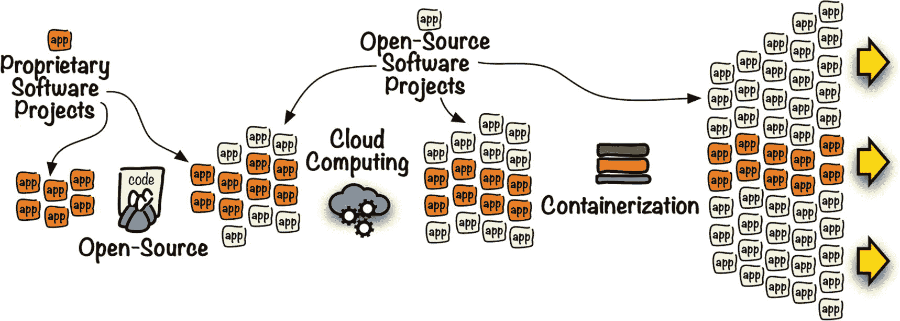

图 9-1：信息时代转折点

解决同类问题的方法过多以及大量相互竞争且常常不成熟的开源软件项目，可能会导致一定程度的混乱。为避免陷入困境，就产生了对`标准化`的需求。这类似于拥有设计模式来解决常见的软件开发挑战。有几种类型的标准需要考虑。一些标准对于需要交互的软件组件能够“说同一种语言”至关重要。例如，OpenAPI 规范为使用 YAML 或 JSON 文档定义 REST API 提供了标准，这些文档对人类和机器都是可读的。CloudEvents 规范旨在定义通用的事件结构，以便广泛的应用程序能够无缝理解其他应用的事件。其他标准，如容器网络接口（CNI）和容器存储接口（CSI），侧重于定义接口，让供应商特定的插件能够以统一的方式与各种容器运行时通信。技术负责人和架构师面临的最大挑战之一，就是应对开源项目的洪流。担任这些角色的人在设计和构建基于云的解决方案时，面临着依赖哪些开源项目的问题。由于这些项目大多数相对较新且仍不成熟，因此存在随着时间推移，一些项目被废弃或在开源竞争中失去优势的风险。换句话说，如果能有某种由行业认可的参考架构，换句话说，就是一系列符合合理要求、安全可靠的“毕业项目”集合，供设计面向云的解决方案时选用，那将是非常好的。为满足这一需求，领先的云提供商、独立软件供应商、技术驱动型公司以及学术和非营利组织共同创建了`云原生计算基金会`（CNCF）。CNCF 承载了整个面向云和容器的开源项目生态系统，并在其发展过程中提供支持。被接受加入 CNCF 项目组合的项目，根据其成熟度和采用情况进行分级。有三个等级：沙箱、孵化和毕业。对于技术负责人和架构师，CNCF 在为构建的解决方案选择组件时，提供了一个方便的项目全景图供参考，如图 9-2 所示。此外，CNCF 协调全球性活动，如 KubeCon + CloudNativeCon，并支持全球范围内的云原生技术聚会网络。

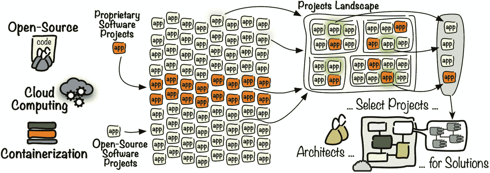

图 9-2：在构建云解决方案时选择云原生项目


## 云原生

什么是云原生？看到 `native` 这个词，我们可以推断，云原生工具或组件是专门针对以云为核心的、业界公认的参考架构而设计和构建的。我们需要一些例子来更好地理解这个术语，以及构成云原生生态系统的各类工具、应用程序和组件。如果我们参考 CNCF 对 `云原生` 的定义，我们会了解到以下内容：

> *云原生技术使组织能够在公共云、私有云和混合云等现代化、动态的环境中构建和运行可扩展的应用程序。容器、服务网格、微服务、不可变基础设施和声明式 API 是这种方法的典型示例。*

最新的定义可以在 GitHub 上的 [`https://github.com/cncf/toc/blob/master/DEFINITION.md`](https://github.com/cncf/toc/blob/master/DEFINITION.md) 找到。

### 容器与编排

列举云原生技术时，首先要提到容器。如您所知，容器旨在无论底层主机平台如何，都能以相同的方式工作。要运行容器，需要一个 `容器运行时`。CNCF 的毕业项目之一是 `containerd`。正如第 8 章所讨论的，`containerd` 是行业标准的容器运行时，负责监督容器的生命周期，处理容器执行、镜像管理以及与主机系统相关的任务，例如底层存储或网络连接。即使您从未听说过 `containerd`，您也已经间接地使用过它，因为它被 `Docker` 在底层所采用。
现代架构的解决方案通常由大量容器化的应用程序组成，这些应用程序必须相互交互，并且易于横向扩展或在发生故障时重新调度到其他底层主机节点。换句话说，必须在比单台主机范围更广泛的意义和背景下，关照它们的生命周期。`Kubernetes` 是 Google 捐赠给基金会的第一个 CNCF 毕业项目。它的任务是为跨多台主机运行和管理容器化应用程序提供一个可插拔的平台。`Kubernetes` 负责容器的生命周期，并确保始终满足期望的状态。例如，如果某个主机节点突然故障，该节点上的容器化应用程序最终将被重新调度（重新创建）到另一个工作节点上，以满足期望的副本数量。`Kubernetes` 的核心功能被称为 `容器编排与调度`。从开发者的角度来看，它还提供了其他关键特性，例如 API 驱动的声明式 `Kubernetes` 对象，这些对象封装或抽象了应用程序组件，例如称为 `Pod`、`Service`、`Volume`、`Job`、`Deployment` 等的容器组。您在上一章已经使用过其中几种类型。

### 镜像仓库与服务网格

容器化的应用程序基于多层容器镜像。镜像有自己的生命周期，存储在 `容器镜像仓库` 中。像 `Kubernetes` 这样的容器平台会从镜像仓库动态获取镜像，以根据开发者声明的期望状态创建容器。CNCF 托管着诸如 `Docker Registry`、`JFrog Artifactory`、`Quay` 和 `Harbor` 等镜像仓库项目。
容器化服务之间交互的各种非功能性方面，例如安全性或可观测性，可以通过安装在每个 `Kubernetes` Pod 中作为边车容器的轻量级代理来处理。这些代理形成了另一层，称为 `服务网格`。服务网格简化了容器化服务之间的通信，并提供了开箱即用的功能，如服务发现、重试、负载均衡或熔断。使用服务网格可以减轻开发者实现这些非功能性服务间通信任务的负担。`Linkerd` 是一个 CNCF 孵化的服务网格项目。您可能也听说过 `Istio`，这是 CNCF 托管的另一个服务网格项目。

### 无服务器与更广泛的生态系统

一种无需任何服务器管理即可运行应用程序的新趋势模型被称为 `无服务器`，它同样属于云原生生态系统。`Fn Project` 是一个从零开始为容器构建的无服务器平台的例证。
容器运行时、编排平台、镜像仓库、服务网格或无服务器框架只是冰山一角。要构建一个完整的基于云的解决方案，还需要包含许多其他类型的云原生组件，例如服务发现、密钥管理、流处理、消息传递、持续交付、API 网关、监控、日志记录、追踪等。

### CNCF 云原生全景图

CNCF 使用一个方便的名为 CNCF Cloud Native Landscape 的地图，将其托管的开源项目与精选的专有但仍与生态系统相关的解决方案进行分组，该地图可在 [`https://landscape.cncf.io`](https://landscape.cncf.io) 获取。这个地图旨在帮助技术负责人和架构师跟上快速变化和演进的云原生技术栈。为了让您对这个生态系统的广度和多样性有一个初步印象，请看图 9-3。


*图 9-3 CNCF `云原生全景图`*

### Oracle Cloud 与云原生

本书是关于 Oracle Cloud 的。您在上一章了解了容器。现在，是时候体验云原生开源项目对 Oracle Cloud 的影响了。
Oracle 是 CNCF 的白金会员。它已向 CNCF 云原生生态系统贡献了一个基于容器的无服务器开源项目，称为 `Fn Project`。Oracle Cloud 提供了 `Oracle Kubernetes Engine` (`OKE`)，这是一个完全托管、经过 CNCF 认证的托管 Kubernetes 引擎。您在上一章已经使用过 `OKE`。Oracle Linux 附带了一个经过认证的 Kubernetes 发行版，可作为 Oracle Container Services for Kubernetes 的一部分使用。最后但同样重要的是，两种领先的关系型数据库——开源的 `MySQL` 和专有的 `Oracle Database`——都在 CNCF 全景图中被引用。此外，Oracle Cloud 在一定程度上使用了其他 CNCF 开源项目。例如，Oracle Cloud Infrastructure 事件符合名为 `CloudEvents` 的行业标准 CNCF 项目所定义的事件结构。

### 后续步骤

是时候做一些动手练习了。我们将深入研究 Oracle Functions，这是一个基于开源 `Fn Project` 的函数即服务（FaaS）。换句话说，让我们来看一下无服务器计算。


## 无服务器

`serverless`（无服务器）这个词正在成为另一个云计算领域的流行语。你可能认为这个名字暗示着执行一个无服务器应用不涉及任何服务器。嗯，这有点误导性。后端依然存在服务器。一如既往。这个术语真正强调的是，操作无服务器应用让你可以忽略后端相关的方面。运行时和应用程序的生命周期完全由特定的无服务器框架或托管的无服务器服务管理。后者通常与术语`函数即服务`（FaaS）相关联。“函数”是因为无服务器应用通常被视为无状态函数的松散组合。这样一个函数应该被设计为专注于单一的、运行时间相对较短的无状态任务。

无服务器框架或基于云的托管无服务器服务通常只在有请求进入或某个函数触发器被激活时，才实例化特定的函数实例。一旦空闲时间间隔结束，该实例通常就会被终止，以释放计算资源。换句话说，无服务器函数实例不应该处于空闲状态。另一个需要提及的重要方面是，无服务器函数需要具备可扩展性。因此，无服务器框架或基于云的 FaaS 可能会创建同一无服务器函数的多个实例，以便能够处理许多并行请求。

从开发者的角度来看，无服务器意味着简单。一个无服务器函数通常被实现为一个简单的处理函数，它返回一个结果。根据触发器的不同，一个函数可能自行消费输入或读取某些信息。例如，一个基于 HTTP 的无服务器函数可以处理作为二进制流传递的图像，应用一些相对简单的过滤器，然后返回结果或将其持久化存储到一个对象存储桶中。另一个例子可能是当捕获到某种云事件时立即执行的函数。向特定桶上传一个新对象可能会产生这样的云事件，最终触发该函数。你可以为无服务器函数构思许多想法。只需记住两个关键特性：无服务器函数应该是`无状态的`和`短寿命的`。无服务器框架通常限制允许的最大函数执行时间。

如今，无服务器框架有望支持多种编程语言。这使得开发者可以为特定任务选择最佳语言，或者简单地选择他们擅长的那种。

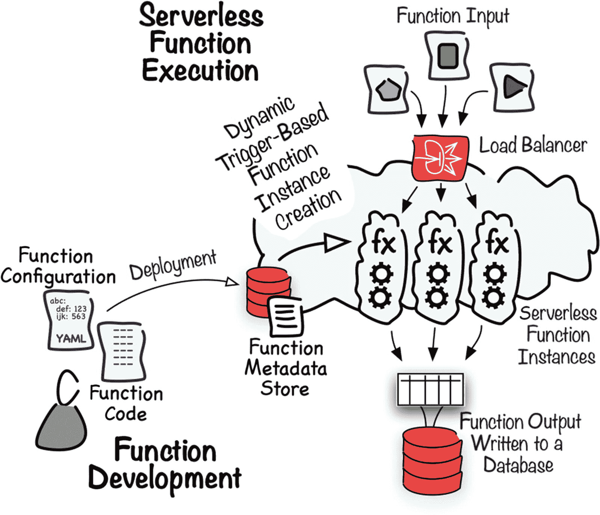

图 9-4 无服务器

无服务器并不局限于云计算。事实上，有些框架让你可以在本地服务器或开发机器上运行无服务器平台。然后，基于云的托管无服务器平台可以使用相同的框架。这样，你可以在本地实现和测试一个函数，然后再将其推送到云端兼容的无服务器平台。这正是我们在本章中将要采用的工作方式。首先，你需要为无服务器开发设置一台客户端机器。

### 开发者虚拟机

我准备了基础架构代码，用于配置一个新的基于 Ubuntu 的计算实例以及稍后 Oracle Functions 所需的子网。请导航到 `chapter09/1-infrastructure` 目录，如下所示：

```
$ cd ~/git/oci-book/chapter09/1-infrastructure
$ find . \( -name "*.tf" -o -name "*.yaml" \) | sort
./devmachine/cloud-init/ubuntu.config.yaml
./devmachine/compute.tf
./devmachine/vars.tf
./devmachine/vcn.tf
./functions/vars.tf
./functions/vcn.tf
./modules.tf
./provider.tf
./vars.tf
./vcn.tf
```

`devmachine` 模块包含了用于函数开发的计算实例所需的云资源定义。`functions` 模块则简单得多，基本上用于创建一个私有子网，该子网带有专用的安全列表和路由表。这个子网将使我们能够控制 Oracle Functions 执行的环境网络上下文。我们稍后会讨论它，但让我们节省一些时间，将其与用于函数开发的计算实例一起配置。我不会讨论每个文件，因为我们在前面的章节中已经讨论过类似的基础设施代码文件。像往常一样，请设置 Terraform 所期望的相关环境变量。

```
$ source ~/tfvars.env.sh
```

接下来，初始化并配置基础设施。

```
$ terraform init
...
Terraform has been successfully initialized!
$ terraform apply
...
Plan: 10 to add, 0 to change, 0 to destroy.
Do you want to perform these actions?
Enter a value: yes
...
Apply complete! Resources: 10 added, 0 changed, 0 destroyed.
Outputs:
dev_machine_image_name = Canonical-Ubuntu-18.04-2019.08.14-0
dev_machine_public_ip = 130.61.88.227
functions_subnet_ocid = ocid1.subnet.oc1....
```

从现在开始，在本章中，我们将主要在这台计算实例上工作。你将在这个基于云的实例上执行大量命令。这些命令将以 `[ubuntu@dev-vm]` 命令提示符为前缀。你可以在 OCI 控制台中验证实例是否正在运行，如图 9-5 所示。


图 9-5 用于函数开发的计算实例

让我们回到终端。Terraform 输出了三个值。在本章中，我们将需要用到其中两个，即用于函数开发的计算实例的公有 IP 地址和子网的 OCID。你不需要记下这些输出值。我们将使用 `terraform output` 命令直接从状态文件中读取它们。该计算实例基于一个带有 Ubuntu 的操作系统镜像。基础架构代码使用 `cloud-init` 来安装练习所需的一些额外包，其中最著名的是 Docker CE。

**注意**
如你所知，`cloud-init` 是异步执行的。你可能需要等待一两分钟，机器才真正准备就绪。如果你在 `cloud-init` 完成之前连接，你将需要在之后重新连接，以便 `docker` 命令能为 `ubuntu` 用户工作，而无需在前面加上 `sudo`。

请连接到实例并执行 `cat` 命令，如下所示，直到你在 `/var/log/syslog` 文件中看到 `DEV machine is running` 条目。

```
$ DEV_MACHINE_IP=`terraform output dev_machine_public_ip`
$ ssh -i ~/.ssh/oci_id_rsa ubuntu@$DEV_MACHINE_IP
Welcome to Ubuntu 18.04.3 LTS (GNU/Linux 4.15.0-1021-oracle x86_64)
[ubuntu@dev-vm]$ sudo cat /var/log/syslog | grep "DEV machine"
Sep 14 12:30:53 dev-vm cloud-init[1799]: DEV machine is running, after 86.18 seconds
```

为了验证实例是否按预期配置，请运行一些 Docker 命令，例如 `docker version`、`docker images` 或 `docker ps`。应该没有任何错误。如果你因权限不足而遇到错误，你可能需要退出并重新连接到计算实例。

**注意**
如果你的系统允许，使用本地计算机进行函数开发而不是新配置的基于云的计算实例也没有问题，但根据你的系统，你可能需要对本章中使用的一些命令进行调整。

一旦用于函数开发的计算实例按预期运行，我们就可以继续下一步了。


### Fn Project

无服务器函数在`无服务器平台`上执行，这些平台将函数开发者与底层基础设施隔离开来，并提供所有必需的函数生命周期服务。CNCF（云原生计算基金会）将几个无服务器平台列为其云原生全景图的一部分。其中之一就是 Fn Project。Fn Project 是一个基于容器的无服务器平台，支持多种编程语言，包括 Golang、Java 和 Python。该项目于 2017 年开源，其 GitHub 地址为 [`https://github.com/fnproject`](https://github.com/fnproject)，如图 9-6 所示。

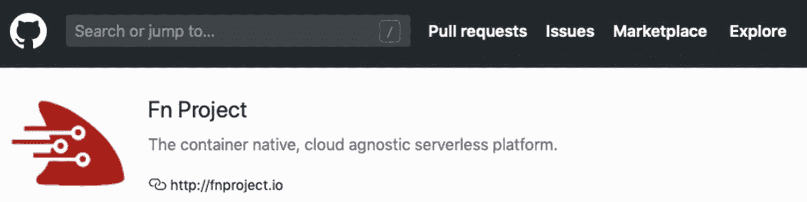

图 9-6

GitHub 上的 Fn Project

我们将用 Python 实现两个简单的函数，并首先在本地的 Fn Project 安装上运行它们。稍后，你将选择其中一个，在不做任何代码更改的情况下，将其部署到 Oracle Functions——这是 Oracle Cloud 上的一个托管函数即服务平台。

#### 安装与配置

首先，确保你仍然连接到新创建的计算实例。要安装 Fn Project，只需执行这条简洁的单行命令：

```
[ubuntu@dev-vm]$ curl -LSs https://raw.githubusercontent.com/fnproject/cli/master/install | sh
fn version 0.5.86
______
/ ____/___
/ /_  / __ \
/ __/ / / / /
/_/   /_/ /_/`
[ubuntu@dev-vm]$ fn version
Client version is latest version: 0.5.86
Server version:  ?
```

Fn Project 客户端二进制文件 `fn` 已安装，并且用于存储客户端配置文件的 `~/.fn` 目录树也已初始化。为了继续进行本地开发和测试，我们需要启动一个本地的 Fn 服务器。为此，你将使用 `fn start` 命令。本地的 Fn 服务器是作为一个 Docker 容器实现的。该命令将下载最新的容器镜像并启动 Fn 服务器容器。

```
[ubuntu@dev-vm]$ fn start -d
[1] 4971
Unable to find image 'fnproject/fnserver:latest' locally
latest: Pulling from fnproject/fnserver
...
Status: Downloaded newer image for fnproject/fnserver:latest
```

我们使用了 `-d` 标志（`d` 代表分离模式）在后台执行本地的 Fn 服务器容器。这将允许我们在同一个终端会话中继续工作。

基于容器的服务器架构使得 Fn Project 成为构建无服务器平台的理想选择，仅仅因为它可以作为容器在任何地方运行。让我们看看它的镜像和容器。

```
[ubuntu@dev-vm]$ docker images
REPOSITORY          TAG     IMAGE ID      CREATED      SIZE
fnproject/fnserver  latest  e63938b4a8e1  12 days ago  161MB
[ubuntu@dev-vm]$ docker ps
IMAGE                      PORTS                      NAMES
fnproject/fnserver:latest  2375/tcp,*:8080->8080/tcp  fnserver
```

要随时查看 Fn 服务器日志，你可以应用 `docker logs` 命令。

```
[ubuntu@dev-vm]$ docker logs fnserver
time="2019-09-16T17:04:43Z" level=info msg="Registering data store provider 'sql'"
time="2019-09-16T17:04:43Z" level=info msg="Connecting to DB" url="sqlite3:///app/data/fn.db"
...
time="2019-09-16T17:04:43Z" level=info msg="Fn serving on `:8080`" type=full version=0.3.731
```

`fnserver` 容器是从 `fnproject/fnserver` 镜像创建的。`fnserver` 执行所有函数的元数据以及生命周期管理任务。Fn Project 函数是作为单独的容器镜像单独部署的。当被触发时，`fnserver` 会基于特定的函数镜像实例化一个函数专用的容器来处理该函数调用。如果有并行的函数调用，Fn 服务器可能会决定为同一个函数创建更多容器。另一方面，在本地 Fn Project 安装的情况下，函数元数据使用一个名为 SQLite 的基于文件的可嵌入关系数据库存储在本地文件系统中。默认的 SQLite 文件位置是 `.fn/data/fn.db`。如果你实在好奇，可以使用 `sqlite3` 客户端访问此函数元数据数据库文件。这只有在我们定义并部署了一些函数后才有意义。目前，我们本地的基于 SQLite 的函数元数据数据库仍然是空的。进一步看，连接相关的客户端配置以名为 `contexts`（上下文）的配置文件形式存储。`fn` 客户端将为你正在使用的每个 Fn Project 平台使用专用的上下文，无论该平台是本地的、本地部署的还是基于云的。上下文文件将以 YAML 文件的形式存储在 `.fn/contexts` 目录中。

```
/home/ubuntu/.fn/
├── config.yaml
├── contexts
│   └── default.yaml
├── data
│   └── fn.db
└── iofs
```

让我们使用 `fn` 工具列出所有的上下文。

```
[ubuntu@dev-vm]$ fn list contexts
CURRENT NAME.    PROVIDER  API URL.                REGISTRY
Default  default   http://localhost:8080
```

由于这是一个新的本地 Fn Project 安装，只有一个名为 `default` 的上下文，实际上它还不完整且无法使用。在我们继续并添加任何缺失的配置以允许本地函数开发之前，我希望你理解 Fn 客户端上下文定义的三个重要信息组成部分。它们如下：

*   目标平台的 Fn Project 服务器 API 端点
*   用于存储函数专用镜像的容器注册表
*   定义目标平台属性集的提供者

客户端能够与多个 Fn Project 平台交互。然而，在任何给定时刻，客户端只与单个平台（即由当前上下文定义的那个平台）协同工作。要设置当前上下文，你使用 `fn use context` 命令。

```
[ubuntu@dev-vm]$ fn use context default
Now using context: default
```

正如我之前提到的，函数实例作为基于函数专用镜像的容器执行。你使用 `fn` 客户端来部署函数。在基于容器的无服务器环境中部署函数意味着什么？`函数部署` 涉及构建一个新的函数专用容器镜像并将其推送到容器镜像注册表。注册表由当前上下文定义。对于本地开发，将镜像存储在本地机器上就足够了。为此，我们在执行 `fn deploy` 命令时将使用 `--local` 选项。镜像将以当前上下文中为注册表设置的名称为前缀。让我们使用 `localdev` 作为名称。要更新当前上下文，请像这样使用 `fn update context` 命令：

```
[ubuntu@dev-vm]$ fn update context registry localdev
Current context updated registry with localdev
[ubuntu@dev-vm]$ fn list contexts
CURRENT NAME     PROVIDER  API URL                REGISTRY
*  default  default   http://localhost:8080  localdev
```

我们可以开始开发和部署第一个函数了。


### 你的第一个函数

无服务器 `functions` 设计上应为无状态的，并执行一个相对简短的任务。Fn Project 能够运行以各种编程语言实现的函数。在撰写本文时，这些语言包括 Java、Golang、Python、JavaScript（配合 Node.js）、Ruby 和 C#（使用 .NET Core）。你无需为这些语言安装任何开发工具。代码将在函数专属容器内执行。除了使用 Terraform 编写基础设施代码外，本书以 Python 为主。为了与其余代码示例保持一致，我们将使用 Python 进行函数开发。在完成本章的练习后，你可以自由尝试其他语言。现在，让我们使用 `fn init` 命令来引导一个基于 Python 的函数桩，如下所示：

```bash
[ubuntu@dev-vm]$ fn init --runtime python blankfn
Creating function at: ./blankfn
Function boilerplate generated.
func.yaml created.
[ubuntu@dev-vm]$ tree blankfn/
blankfn/
├── func.py
├── func.yaml
└── requirements.txt
```

`fn init` 命令使用了 `--runtime python` 选项执行。结果是，`func.py` 函数桩已创建并使用 Python 作为编程语言。此外，该命令还创建了 `func.yaml` 函数配置文件，如清单 9-1 所示。

```yaml
schema_version: 20180708
name: blankfn
version: 0.0.1
runtime: python
entrypoint: /python/bin/fdk /function/func.py handler
memory: 256
清单 9-1
blankfn/func.yaml
```

该函数配置文件可用于微调函数的构建过程和执行特性，例如分配的内存或函数允许运行的最长时间。在构建函数专属容器镜像时会使用其中几个属性。例如，可以调整函数的基础镜像。

在之前的章节中，我们已经接触过 `requirements.txt` 文件。此文件用于列出你的函数所依赖的 Python 包。你指明函数需要哪些 Python 包，`pip` 工具就会将它们作为一个新层安装到函数专属容器镜像中。清单 9-2 展示了在函数目录内创建的 `requirements.txt` 文件。我们的函数桩仅引用了 `fdk` Python 包。`fdk` 包是由 Fn Project 维护的 Python 函数开发套件。它主要用于处理函数的输入和输出。如果你需要任何额外的 Python 包来实现稍微复杂一些的函数，这将是你添加它们的地方。

```txt
fdk
清单 9-2
blankfn/requirements.txt
```

`cloud-init` 配置（在我们的计算实例首次启动时处理）会获取一个名为 `blankfn` 的简单函数代码文件。该代码从与本书关联的代码仓库下载，并放置在 `~/functions` 目录中。让我们用 `blankfn.py` 文件替换由 `fn init` 命令创建的函数桩，如下所示：

```bash
[ubuntu@dev-vm]$ cp ~/functions/blankfn.py ~/blankfn/func.py
```

清单 9-3 展示了该函数的代码。

```python
import io
import json
from fdk import response
def handler(ctx, data: io.BytesIO=None):
res_str = json.dumps({"message": "blank message"})
headers_dict={"Content-Type": "application/json"}
rsp = response.Response(ctx, response_data=res_str, headers=headers_dict)
return rsp
清单 9-3
blankfn/func.py
```

`blankfn` 函数总是返回一个静态文本。我创建这个函数是为了让你获得最简单的基于 Python 的 Fn Project 开发体验。一般来说，你作为函数开发者的职责是实现函数处理器。如果你看一下清单 9-3 中的代码，你会发现函数处理器返回一个 `fdk.response.Response` 对象，该对象传入了 `response_data` 字符串，该字符串包含一个无意义的测试消息的 JSON 对象。此外，函数处理器代码设置了 HTTP 头中的 `headers` 字典。默认情况下，如果函数的配置文件中没有明确声明触发器，则会应用 HTTP 触发器，我们应该将输出视为 HTTP 响应。

在构建函数专属容器镜像之前，我们必须创建一个应用。应用仅仅是一个逻辑构造。你使用 `fn create app` 命令在当前上下文指向的 Fn 服务器（在我们的例子中是作为 `fnserver` 容器运行的本地 Fn 服务器）中注册一个新应用。我们将新应用命名为 `blankapp`，并像这样注册它：

```bash
[ubuntu@dev-vm]$ fn create app blankapp
Successfully created app:  blankapp
[ubuntu@dev-vm]$ fn list apps
NAME.     ID
blankapp  01DMQZJPDDNG8G00GZJ0000006
```

`fn list apps` 命令显示了新注册的应用。我们已经准备好构建并部署函数。为此，进入 `blankfn` 函数目录并运行 `fn deploy` 命令，如下所示：

```bash
[ubuntu@dev-vm]$ cd blankfn
[ubuntu@dev-vm]$ fn --verbose deploy --app blankapp --local
Deploying blankfn to app: blankapp
Bumped to version 0.0.2
Building image localdev/blankfn:0.0.2
FN_REGISTRY:  localdev
Current Context:  default
...
Successfully built 29e36845273a
Successfully tagged localdev/blankfn:0.0.2
Updating function blankfn using image localdev/blankfn:0.0.2...
Successfully created function: blankfn with localdev/blankfn:0.0.2
```

`fn deploy` 命令读取它在当前目录中找到的 `func.yaml` 函数配置文件，以创建函数专属容器镜像。存储函数代码的文件以及相应的 `requirements.txt` 文件会被添加到容器镜像中。使用 `--local` 选项将镜像存储在客户端机器上。如果你省略了它，`fn` 客户端会尝试将镜像推送到 Docker Hub 上的 `localdev` 仓库，这不是我们的本意。`--verbose` 选项让我们能看到镜像构建的输出。这是普通的 `docker build` 输出，附带了一些来自 `fn` 客户端的辅助操作输出。总而言之，函数已经准备就绪。让我们检查函数元数据以确认一切顺利。为此，使用 `fn list functions` 命令。

```bash
[ubuntu@dev-vm]$ fn list functions blankapp
NAME     IMAGE                     ID
blankfn  localdev/blankfn:0.0.2  01DMQZNA73NG8G00GZJ0000007
```

目前，`blankapp` 应用引用了一个名为 `blankfn` 的函数。函数实例将基于 `localdev/blankfn:0.0.2` 容器镜像创建为容器。你可以像这样查看该镜像：

```bash
[ubuntu@dev-vm]$ docker images | grep blank
localdev/blankfn   0.0.2   e3cdfd6089b4   2 minutes ago   344MB
```

目前，只有本地的 `fnserver` 容器在运行，如下列的 `docker ps` 命令所示：

```bash
[ubuntu@dev-vm]$ docker ps --format '{{.Names}} [{{.Image}}] {{.Status}}'
fnserver [fnproject/fnserver:latest] Up 4 minutes
```

让我重申一下：函数实例将作为独立的容器创建。本地的 `fnserver` 协调函数容器，这些容器在函数被触发时动态创建。掌握了这些知识，你应该知道会发生什么。以下是你使用 `fn invoke` 命令进行第一次无服务器函数调用的方法：

```bash
[ubuntu@dev-vm]$ fn invoke blankapp blankfn
{"message": "blank message"}
```


就是这样。就像这样。你可以说这个响应来得无迹可寻。如果你足够快，并再次执行 `docker ps` 命令，你会发现一个基于 `local/blankfn:0.0.2` 镜像的新容器。

```
[ubuntu@dev-vm]$ docker ps --format '{{.Names}} [{{.Image}}] {{.Status}}'
01D...00C  [local/blankfn:0.0.2]        Up 2 seconds (Paused)
fnserver   [fnproject/fnserver:latest]  Up 22 hours
```

这个为函数调用创建的特定容器实例用于处理该函数调用。如果没有进一步的函数调用到达，该容器将在 30 秒后消失。你可以使用 `watch docker ps` 命令来观察这种行为。这个间隔可以在函数配置文件中延长。

另一个有趣的实验是同时发送两个函数调用。

```
[ubuntu@dev-vm]$ fn invoke blankapp blankfn &
[1] 2903
[ubuntu@dev-vm]$ fn invoke blankapp blankfn &
[2] 2972
```

列出容器会显示，这次创建了两个函数特定的容器。

```
[ubuntu@dev-vm]$ docker ps --format '{{.Names}} [{{.Image}}] {{.Status}}'
01D...00H [local/blankfn:0.0.2] Up Less than a second (Paused)
01D...00F [local/blankfn:0.0.2] Up 1 second (Paused)
fnserver [fnproject/fnserver:latest] Up 22 hours
```

这是一个简单的方法，可以证明无服务器平台具有原生可扩展性。

如果我们简要地总结一下 Fn Project 函数的无服务器函数开发过程，以下将是需要遵循的步骤：

1.  创建项目存根。
2.  实现函数处理程序。
3.  调整并可选地扩展函数配置文件。
4.  部署函数。

函数部署会导致 Fn 平台后端发生两个状态变化：

1.  函数元数据被放置在 Fn 服务器上。
2.  函数特定的容器镜像被推送到容器镜像注册表。

每次函数触发器被触发时，Fn 服务器会创建或取消暂停一个现有的函数特定容器来处理请求。从开发到执行的整个过程在概念上如图 9-7 所示。

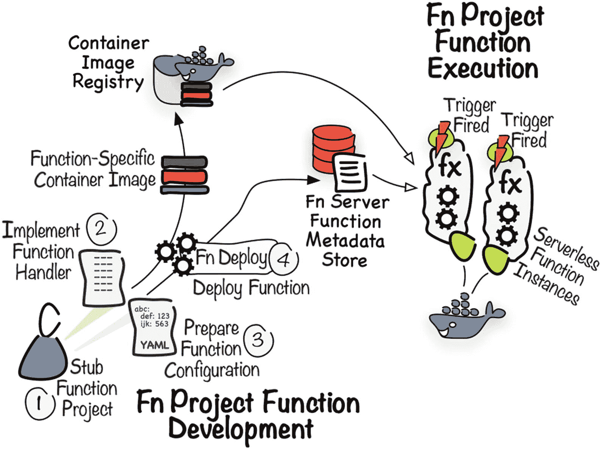

图 9-7: Fn Project 函数开发与执行

现在，我们将创建一个比 `blankfn` 更有意义一些的函数，后者完全没有任何实际用途。

### UUID 函数

阅读了前面的章节后，你现在应该熟悉了 UUID 生成函数。首先，你将其作为 systemd 服务部署在基于 Linux 的计算实例上。这是第二章包含的练习。接下来，你将这个应用容器化，并在 Oracle Kubernetes Engine 的集群实例上的 Kubernetes pod 中部署它。这是第 8 章的练习。现在，我们将为 UUID 生成逻辑使用最轻量级的部署模型，并将其作为无服务器函数运行。作为无状态、短生命周期且专门的逻辑，它是成为无服务器函数的完美候选者。在这一点上，值得一提的是，我刚才描述的是当今软件演进方式的一个绝佳例子。起初，我们处理一个专用的计算实例，其中应用生命周期绑定到由 systemd 管理的操作系统服务。接着，我们能够通过容器化应用并在容器平台上运行来解除这种耦合。最后，我们到达了对于如此简单、专门且短生命周期的应用逻辑的最轻量级模式，并使用无服务器来将所有函数生命周期管理委托给无服务器平台。这种演变如图 9-8 所示。

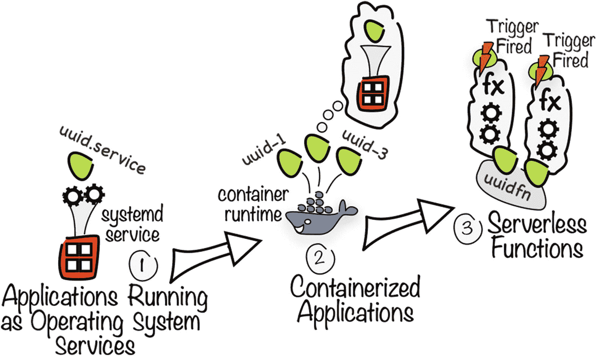

图 9-8: UUID 函数部署模型的演进

让我们以与之前类似的方式创建一个新的函数存根。这次，我们使用 `uuidfn` 作为函数名称。

```
[ubuntu@dev-vm]$ cd
[ubuntu@dev-vm]$ fn init --runtime python uuidfn
Creating function at: ./uuidfn
Function boilerplate generated.
func.yaml created.
```

同样，执行以下命令，用我在编写本书时已经为你准备好的函数代码替换函数存根：

```
[ubuntu@dev-vm]$ cp ~/functions/uuidfn.py ~/uuidfn/func.py
```

清单 9-4 显示了 UUID 生成函数的代码。

```
import io
import json
import uuid
from fdk import response
def handler(ctx, data: io.BytesIO=None):
    res_dict = {}
    try:
        # Generate UUID
        res_dict["generator_uuid"] = str(uuid.uuid4())
        # Intercept input and prepare optional response part
        if data is not None:
            data_bytes = data.getvalue()
            if len(data_bytes)>0:
                data_json = json.loads(data_bytes)
                res_dict["generator_client"] = data_json.get("client_name")
    except (Exception, ValueError) as ex:
        res_dict["message"] = str(ex)
    headers_dict={"Content-Type": "application/json"}
    res_str = json.dumps(res_dict)
    rsp = response.Response(ctx, response_data=res_str, headers=headers_dict)
    return rsp
```

清单 9-4: `uuidfn/func.py`

与 `blankfn` 函数相反，`uuidfn` 确实解析了以 `io.ByteIO` 类型的 `data` 对象形式提供的输入。除了使用 `uuid.uuid4()` 方法生成 UUID 外，我们还处理输入。如果没有输入，我们仅在 JSON 格式中返回新生成的 UUID 字符串作为 `generator_uuid` 对象。如果有输入，我们期望它是 JSON 格式，并解析它以提取 `client_name` 对象，在 JSON 响应中将其作为 `generator_client` 对象返回。提供无效输入将抛出错误，我们最终会捕获该错误，并在响应中返回错误消息。

请创建一个名为 `uuidapp` 的新应用。

```
[ubuntu@dev-vm]$ fn create app uuidapp
Successfully created app:  uuidapp
```

在这个阶段，我们应该能看到两个应用。

```
[ubuntu@dev-vm]$ fn list apps
NAME      ID
blankapp  01DMQZJPDDNG8G00GZJ0000006
uuidapp   01DMR30A3TNG8G00GZJ000000P
```

要构建函数特定的容器镜像，我们需要进入函数目录并调用 `fn deploy` 命令。

要测试该函数，请使用 `fn invoke` 命令并正确指定应用程序和函数名称作为参数。

```
[ubuntu@dev-vm]$ fn invoke uuidapp uuidfn
{"generator_uuid": "f03abce5-3615-4994-9680-157b057198d3"}
```

该函数返回包含新生成的 UUID 的 JSON。

你可以像这样向函数提供输入：

```
[ubuntu@dev-vm]$ echo -n '{ "client_name": "some_app"  }' | fn invoke uuidapp uuidfn --content-type application/json
{"generator_uuid": "3298bb2e-9cd5-476b-83b6-f4343d7c8522", "generator_client": "some_app"}
```

如你所见，这次响应中有两个 JSON 对象。响应中的 `generator_client` 对象存储了作为输入传入的 `client_name` 值。

该函数被隐式定义为在 HTTP 触发器上启动。这意味着必须有一个与该函数关联的 HTTP 端点。事实上，HTTP 端点正是我们使大多数无服务器函数在生产中发挥作用所必需的。你可以使用 `fn inspect function` 命令查看函数特定的端点。

```
[ubuntu@dev-vm]$ fn inspect function uuidapp uuidfn
{
"annotations": {
"fnproject.io/fn/invokeEndpoint": "http://localhost:8080/invoke/01DMR7VTNHNG8G00GZJ0000009"
},
"app_id": "01DMR7TZRFNG8G00GZJ0000008",
"created_at": "2019-09-14T15:57:01.489Z",
"id": "01DMR7VTNHNG8G00GZJ0000009",
"idle_timeout": 30,
"image": "localdev/uuidfn:0.0.2",
"memory": 256,
"name": "uuidfn",
"timeout": 30,
"updated_at": "2019-09-14T15:57:01.489Z"
}
```

除了端点之外，该命令还揭示了其他信息，例如函数的最大执行时间、空闲超时以及函数使用的容器镜像。`fn inspect function` 命令与 `jq` 命令的恰当组合将让你提取端点并将其保存到 shell 变量中。

```
[ubuntu@dev-vm]$ FN_INVOKE_ENDPOINT=`fn inspect function uuidapp uuidfn | jq -r '.annotations."fnproject.io/fn/invokeEndpoint"'`
```

接下来，我们可以使用众所周知的 `curl` 工具向该端点发送 HTTP 请求。

```
[ubuntu@dev-vm]$ curl -X "POST" -H "Content-Type: application/json" $FN_INVOKE_ENDPOINT
{"generator_uuid": "84eb8921-663f-4469-ad3b-fa34813da319"}
```

本节简要介绍了 Fn Project 以及实践中本地执行的无服务器函数。还有许多其他方面未涉及，例如将多个函数打包到单个应用程序中、单元测试以及将函数镜像推送到其他注册表。更重要的是，无服务器确实只给无服务器函数开发者带来一种“无需基础设施”的印象。如果你想运营一个无服务器平台，尤其是在生产环境中，有各种关键任务需要规划和执行。这些任务涉及安全、负载均衡和工作节点池管理。Fn Project 在其网页上记录了这些说明。所有这些都超出了本书的讨论范围。

与其自己运营无服务器平台，你可以依赖一个托管的基于云的无服务器平台。在下一节中，我们将使用 Oracle Functions，这是一个基于 Fn Project 在 Oracle Cloud Infrastructure 上构建的托管无服务器平台。

### Oracle Functions

Fn Project 是 *Oracle Functions* 的基础，后者是在 Oracle Cloud 上可用的函数即服务平台。在上一节中，你操作了一个本地 Fn 服务器。现在，你可以将相同的函数代码部署到 Oracle Functions。通过这样做，你将让你的函数在你选择的 Oracle Cloud 区域中运行。无需像我们在前几章中运行应用程序那样配置任何计算实例或容器编排集群。底层计算资源完全由 Oracle Functions 在后台管理。函数实例是动态创建的，以响应函数 *触发器*。正如你可能预期的那样，最基本的触发器类型是 HTTP 请求。每一个部署到 Oracle Functions 的 Fn Project 函数都会被赋予一个专用的基于 HTTP 的 *函数端点*。发送到该端点的请求必须经过正确签名才能通过 OCI Identity and Access Management 完成的身份验证和授权。当它们成功后，Oracle Functions 会读取函数元数据，并根据该信息创建特定于函数的容器来处理请求。其他类型的触发器是在 Oracle Cloud 内发生的各种 *事件*。例如，特定对象存储桶中新建的对象可能会生成一个事件，该事件由 Oracle Events 服务传播到 Oracle Functions 服务中的选定函数。你将在本章第二部分了解到这一点。两种触发器——基于 HTTP 和基于事件的——以及 Oracle Functions 的一般工作方式如图 9-9 所示。

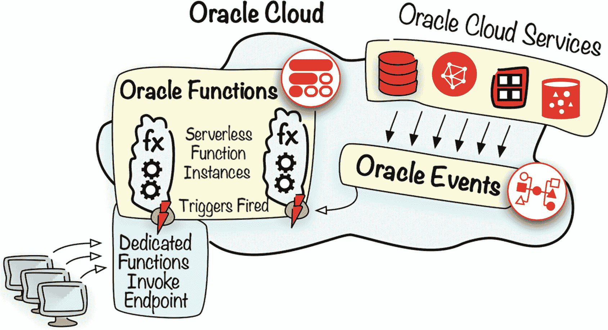

图 9-9

Oracle Functions

建议将函数特定的容器镜像存储在与你希望无服务器函数运行的 Oracle Functions 端点相同区域的 Oracle Container Image Registry (OCIR) 中。你在上一章已经使用过 OCIR。那时，Oracle Kubernetes Engine 从 OCIR 拉取镜像以在 Kubernetes Pod 中创建容器。这次，镜像将被 Oracle Functions 动态拉取，以创建短生命周期的函数容器，用于处理到达的函数调用。


## OCI 网络与策略

在开始使用 Oracle Functions 之前，还有两个与基础设施相关的初始设置需要选择。

*   为无服务器函数选择虚拟云网络子网。

*   为 FaaS 服务创建所需的 IAM 策略语句。

为什么我们还要谈论虚拟网络，即使 Oracle Functions 本身不需要管理基础设施？当你定义一个 Fn 应用（它将无服务器函数分组）并打算让此应用在 Oracle Functions 上运行时，必须指定 VCN 子网。该 VCN 子网在其 IP 范围内必须至少有 32 个可用的 IP 地址，并且应依赖于无状态安全规则。使用不同的 VCN 来运行无服务器函数是完全可以的。你将在接下来的某个章节中学习如何为 Oracle Functions 应用指定 VCN。通常，你需要自行创建新的子网。但为了本节练习的目的，子网已由 Terraform 预先创建好，一同创建的还有用于函数开发的计算机器。你可以在 `functions` 模块中找到相应的基础设施代码。计算实例连接到 `dev-net` 公共子网。`functions-subnet` 私有子网则专用于 Oracle Functions。图 9-10 展示了 OCI 控制台中的两个子网。

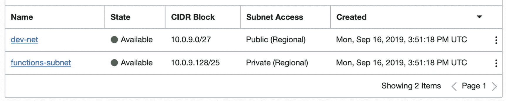

图 9-10

用于 Oracle Functions 的 VCN 子网

Oracle Functions 与 IAM 完全集成。这一事实影响着服务的双方。不仅 Oracle Functions 必须被授予所需的访问权限，函数开发者和函数使用者也必须属于相关 IAM 策略语句所引用的 IAM 组。让我们以更有条理的方式来讨论这一点。首先，代表 Oracle Functions 的 `FaaS` 服务在 IAM 中必须被允许执行以下操作：

*   在租户或选定的 compartment 中使用虚拟网络

*   读取 OCIR 中的容器镜像仓库

这些权限通过清单 9-5 所示的策略语句授予。

```
[
"allow service FaaS to use virtual-network-family in compartment Sandbox",
"allow service FaaS to read repos in tenancy"
]
Listing 9-5
tenancy.functions.policy.json
```

其次，为了部署和监控他们的无服务器函数，函数所有者必须属于被允许的 IAM 组。

*   与 `functions` 族的管理级 OCI API 交互

*   读取指标

*   使用虚拟网络

*   管理 OCIR 中选定的仓库

这些语句可以限定到特定的 compartment。在我们的案例中，我们将允许 `sandbox-users` 组的成员仅在 `Sandbox` compartment 中部署和监控函数。所需权限中的三项通过清单 9-6 所示的策略语句授予。

```
[
"allow group sandbox-users to manage functions-family in compartment Sandbox",
"allow group sandbox-users to read metrics in compartment Sandbox",
"allow group sandbox-users to use virtual-network-family in compartment Sandbox"
]
Listing 9-6
sandbox-users.functions.policy.json
```

如果你完成了第 8 章的练习，那么第四项剩余的策略语句已经定义好了。它应该在根 compartment（租户级别）中一个名为 `tenancy-ocir-policy` 的策略里定义，如下所示：

```
allow group sandbox-users to manage repos in tenancy where target.repo.name = /sandbox∗/
```

现在，让我们创建清单 9-5 和 9-6 所示的两个新策略。为此，回到我们的本地机器，使用 OCI CLI 执行以下命令：

```
$ cd ~/git/oci-book/chapter09/3-functions/policies
$ TENANCY_OCID=`cat ~/.oci/config | grep tenancy | sed 's/tenancy=//'`
$ echo $TENANCY_OCID
ocid1.tenancy.oc1..aa...3yymfa
$ oci iam policy create -c $TENANCY_OCID --name functions-policy --description "FaaS Policy" --statements "file://tenancy.functions.policy.json"
{
"data": {
...
"lifecycle-state": "ACTIVE",
"name": "functions-policy",
...
}
$ oci iam policy create --name sandbox-users-functions-policy --description "Functions-related policy for regular Sandbox users" --statements "file://sandbox-users.functions.policy.json" --profile SANDBOX-ADMIN
{
"data": {
...
"lifecycle-state": "ACTIVE",
"name": "sandbox-users-functions-policy",
...
}
```

我们已经为 Oracle Functions 准备好了租户。现在，让我们转向 `fn` 客户端并创建一个新的上下文。


### 客户端设置

从函数开发者的角度来看，在`fn`客户端配置方面，我们需要首先添加一个新的 Fn 客户端上下文。该 Fn 客户端上下文

*   使用`oracle`提供商
*   指向一个 Oracle Functions API 端点
*   将函数特定的容器镜像推送到 OCIR

其次，使用`oracle`提供商的 Fn 客户端上下文必须引用存储在现有 OCI CLI 配置文件中的配置文件。这是因为 Oracle Functions 函数与 Oracle Cloud 中的 IAM 集成。函数开发者必须拥有现有 Oracle Cloud 用户的身份，例如`sandbox-user`用户，才能在 Oracle Functions 中执行诸如创建新应用程序或函数等操作。类比来说，你可以回想一下 OCI CLI 的使用。所有 CLI 命令，或者更准确地说，底层的 API 调用，都是代表在 OCI CLI 配置文件中指定的命名配置文件下定义的 IAM 用户执行的。

为了简化开发过程，你可以在本地 Fn 服务器和 Oracle Functions 之间交替工作。这样，你将能够在本地开发和单元测试新创建的函数，然后再将它们部署到 Oracle Functions。要实现这样的工作方式，只需在如图 9-11 所示的上下文之间切换即可。

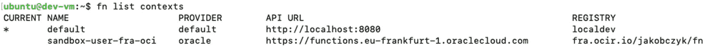

#### 图 9-11

### Fn 项目上下文

理论你已经了解了。是时候实践了。连接到计算实例，使用`fn create context`命令创建一个新的上下文，并将`--provider`选项设置为`oracle`，如下所示：

```bash
[ubuntu@dev-vm]$ fn create context sandbox-user-fra-oci --provider oracle
Successfully created context: sandbox-user-fra-oci
```

在`fn`客户端配置目录中，应该会创建一个新的 YAML 文件。

```bash
/home/ubuntu/.fn/contexts/
├── default.yaml
└── sandbox-user-fra-oci.yaml
```

目前，这个新的上下文文件几乎是空的，肯定无法使用。你必须添加以下详细信息，才能让`fn`客户端正常与 Oracle Functions 配合工作：

*   区域性的 Oracle Functions API 端点
*   区域性的 Oracle 容器镜像注册表 (OCIR) 仓库端点
*   Fn 项目特定于`oracle`提供商的信息：
    *   compartment OCID
*   OCI CLI 配置配置文件的名称

Oracle Functions API 端点应设置为以下格式：

```bash
https://functions.<region>.oraclecloud.com
```

OCIR 仓库端点使用类似这样的格式：

```bash
<region-code>.ocir.io/<tenancy-namespace>/<repo-name>
```

例如，如果你在法兰克福区域工作，你将使用`eu-frankfurt-1`作为区域名称，并简单地使用`fra`作为区域代码。你可以在 OCI 文档中找到其他区域名称及其代码的列表。要识别你的*租户命名空间*，可以使用以下命令：

```bash
$ oci os ns get --query 'data' --raw-output
jakobczyk
```

现在，重新连接到计算实例，并通过编辑上下文文件来添加上述信息。

```bash
$ ssh -i ~/.ssh/oci_id_rsa ubuntu@$DEV_MACHINE_IP
[ubuntu@dev-vm]$ vi ~/.fn/contexts/sandbox-user-fra-oci.yaml
```

你可以从`chapter09/3-functions/configuration/sandbox-user-fra-oci.yaml`模板文件开始，并按照类似的方式编辑它，如清单 9-7 所示。

```yaml
api-url: https://functions.eu-frankfurt-1.oraclecloud.com
registry: fra.ocir.io/jakobczyk/sandbox-fn
provider: oracle
oracle.compartment-id: ocid1.compartment.oc1..aa...gzwhsa
oracle.profile: SANDBOX-USER
```

#### 清单 9-7

#### ~/.fn/contexts/sandbox-user-fra-oci.yaml

不要忘记将`Sandbox` compartment 的 OCID 用作`oracle.compartment-id`字段的值。上下文文件提到一个 OCI CLI 配置文件名称作为`oracle.profile`属性的值。到目前为止，你一直在本地开发机器上使用 OCI CLI。本章假设你使用基于云的计算实例进行函数开发。这个新的`fn`客户端上下文旨在让`fn`客户端与 Oracle Functions 配合工作，它引用了一个特定的 OCI CLI 配置配置文件。因此，我们也需要在计算实例上创建配置文件。不过，不需要安装 CLI。在这种情况下，一切都是关于配置。让我们在默认路径中创建配置文件。这样，`fn`客户端将能够获取它。

```bash
[ubuntu@dev-vm]$ mkdir ~/.oci
[ubuntu@dev-vm]$ vi ~/.oci/config
```

仅从你原始开发机器上使用的 OCI CLI 配置文件中复制`SANDBOX-USER`配置文件。不要忘记添加租户 OCID 和区域名称，如清单 9-8 所示。

```ini
[SANDBOX-USER]
tenancy=ocid1.tenancy.oc1..aa...3yymfa
region=eu-frankfurt-1
user=ocid1.user.oc1..aa...dzqpxa
fingerprint=ad:82:99:bf:93:27:63:7b:35:75:f5:27:d4:95:78:86
key_file=~/.apikeys/api.sandbox-user.pem
pass_phrase=secret
```

#### 清单 9-8

#### ~/.oci/config (在用于函数开发的计算实例上)

`fn`客户端的 IAM 身份源自存储在配置文件中的信息。更准确地说，`fn`客户端只读取引用的配置文件下的信息。为了与 Oracle Functions 交互，`fn`客户端使用的`oracle`提供商会将`fn`客户端命令最终转换为 OCI API 请求，如图 9-12 所示。此信息是正确签名这些请求所必需的；否则，OCI API 将拒绝它们。

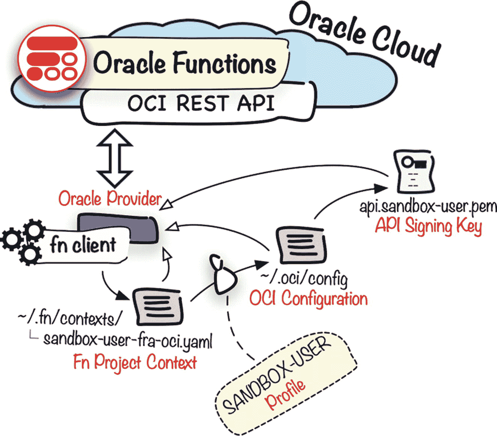

#### 图 9-12

### Oracle Functions 的客户端配置

客户端配置中最后一个缺失的元素是用于签署 API 请求的私钥。为了简化练习，我们将重用与标准 OCI CLI 调用相同的 API 签名密钥。回到装有 OCI CLI 的原始开发机器上，你可以使用`scp`工具将 API 签名密钥上传到用于函数开发的计算实例，如下所示：

```bash
$ cd ~/git/oci-book/chapter09/1-infrastructure
$ DEV_MACHINE_IP=`terraform output dev_machine_public_ip`
$ scp -i ~/.ssh/oci_id_rsa ~/.apikeys/api.sandbox-user.pem ubuntu@$DEV_MACHINE_IP:/home/ubuntu
api.sandbox-user.pem           100% 1766    57.2KB/s   00:00
```

接下来，连接到计算实例，并将 API 签名密钥移动到配置文件中声明的目录。

```bash
[ubuntu@dev-vm]$ mkdir ~/.apikeys
[ubuntu@dev-vm]$ mv ~/api.sandbox-user.pem ~/.apikeys/api.sandbox-user.pem
[ubuntu@dev-vm]$ chmod go-rwx ~/.apikeys/api.sandbox-user.pem
```

总而言之，`fn`客户端要与 Oracle Functions 配合工作所需的三个文件都在我们的`dev-vm`计算实例上了。

```bash
/home/ubuntu
├── .apikeys
│   └── api.sandbox-user.pem
...
├── .fn
│   ├── config.yaml
│   ├── contexts
│   │   ├── default.yaml
│   │   └── sandbox-user-fra-oci.yaml
...
├── .oci
│   └── config
```

现在，使用`fn use context`命令将新上下文设置为当前上下文，并在后续步骤中发出`fn list apps`命令以测试与 Oracle Functions 的连接性。

```bash
[ubuntu@dev-vm]$ fn use context sandbox-user-fra-oci
Now using context: sandbox-user-fra-oci
[ubuntu@dev-vm]$ fn list apps
No apps found
```


这次没有显示任何 Fn 应用，但这正是我们所预期的。目前，还没有任何函数被部署到云端。旧的应用，即 `blankapp` 和 `uuidapp`，并未消失，它们仍然注册在我们的本地 Fn 服务器上。它们此刻没有在 `fn list app` 的输出中列出，仅仅是因为，这次我们是在与 Oracle Functions 交互，而不是与本地的 Fn 服务器。如果你将上下文切换回本地，你应该会再次看到这两个应用。无论如何，让我们继续使用新的上下文，这会使我们的 `fn` 客户端命令能够与 Oracle Functions 协同工作。

## 部署 UUID 函数

我们已准备好将之前在本地机器上测试过的相同 `uuidfn` 函数代码部署到 Oracle Functions。首先，我们将为 Oracle Functions 注册一个新的应用。在此过程中，你必须指定 VCN 子网，Oracle Functions 将使用该子网为该特定函数动态地将临时函数专用容器接入 OCI 网络。回想一下，本章开头描述的基础设施代码已经创建了一个子网，该子网可以被我们即将注册的应用引用。

**提示**

为你的 Oracle Functions 应用使用不同的 VCN 子网是完全可以的。只需确保它们满足相关建议，例如可用的私有 IP 地址数量或使用无状态安全规则。

回到你的本地开发机器，使用 `terraform output` 命令获取此子网的 OCID。

```
$ cd ~/git/oci-book/chapter09/1-infrastructure
$ terraform output functions_subnet_ocid
ocid1.subnet.oc1.eu-frankfurt-1.aa...sp2ufa
```

接下来，连接到 `dev-vm` 计算实例，将子网 OCID 存储在一个 shell 变量中，并发出 `fn create app` 命令，同时将 `oracle.com/oci/subnetIds` 注解设置为该变量的值。你执行的命令将类似于以下内容：

```
[ubuntu@dev-vm]$ FN_SUBNET_ID=ocid1.subnet.oc1.eu-frankfurt-1.aa...sp2ufa
[ubuntu@dev-vm]$ fn create app uuidcloudapp --annotation oracle.com/oci/subnetIds="[\"$FN_SUBNET_ID\"]"
Successfully created app:  uuidcloudapp
```

在此阶段，如果你愿意，可以在 OCI 控制台中验证应用是否确实已创建。操作如下：

1.  转到菜单 ➤ 开发者服务 ➤ Functions。

2.  确保选择了 `Sandbox` 隔区。

你应该能够在应用列表中看到一个条目，如图 9-13 所示。

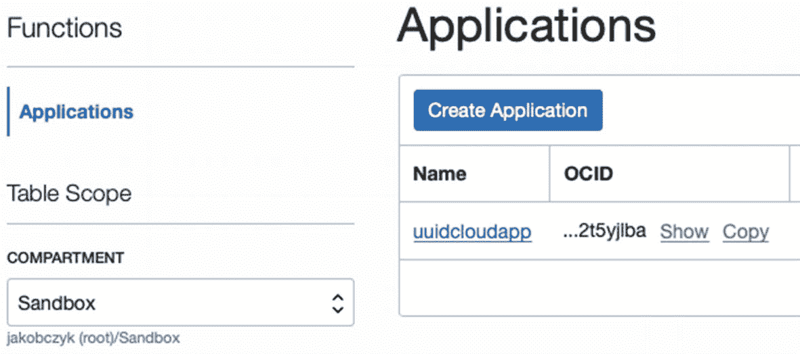

图 9-13：在 OCI 控制台中查看函数

仅仅一个应用本身并不为我们提供任何服务。它只是函数的逻辑分组。建议将函数专用的容器镜像存储在 Oracle Container Image Registry (OCIR) 中，且该仓库应位于我们希望函数实例为基于触发器的函数调用提供服务的同一区域。在部署函数之前，我们需要登录到 OCIR。我在前一章已经介绍过这项任务，因此我假设你已经熟悉此操作。请记住使用租户命名空间，而不是 OCID。同样，使用区域代码（如 `fra`）而不是区域名称。请确保找到你在前一章使用的 `sandbox-user` 的身份验证令牌，或者创建一个新的。你需要它作为登录 OCIR 的密码。一旦准备就绪，请调整以下代码片段中 `OCI_TENANCY_NAMESPACE` 变量和 `OCIR_REGION` 变量的值，并执行 `docker login` 命令：

```
[ubuntu@dev-vm]$ OCI_TENANCY_NAMESPACE=jakobczyk
[ubuntu@dev-vm]$ OCIR_REGION=fra
[ubuntu@dev-vm]$ OCI_USER=sandbox-user
[ubuntu@dev-vm]$ docker login -u $OCI_TENANCY_NAMESPACE/$OCI_USER $OCIR_REGION.ocir.io
Password: 
Login Succeeded
```

要部署 `uuidfn` 函数，你可以使用 `fn deploy` 命令。你将需要引用你刚才在 Oracle Functions 中创建的应用。此外，我们尚未更改函数代码中的任何内容；因此，`--no-bump` 参数将禁用递增镜像版本号的默认行为。总而言之，需要执行的命令如下：


## 函数部署与测试

```bash
[ubuntu@dev-vm]$ cd ~/uuidfn
[ubuntu@dev-vm]$ fn -v deploy --app uuidcloudapp --no-bump
Deploying uuidfn to app: uuidcloudapp
Building image fra.ocir.io/jakobczyk/sandbox-fn/uuidfn:0.0.2
FN_REGISTRY:  fra.ocir.io/jakobczyk/sandbox-fn
Current Context:  sandbox-user-fra-oci
...
Successfully built 258fbf5d0629
Successfully tagged fra.ocir.io/jakobczyk/sandbox-fn/uuidfn:0.0.2
Parts:  [fra.ocir.io jakobczyk sandbox-fn uuidfn:0.0.2]
Pushing fra.ocir.io/jakobczyk/sandbox-fn/uuidfn:0.0.2 to docker registry...The push refers to repository [fra.ocir.io/jakobczyk/sandbox-fn/uuidfn]
...
Updating function uuidfn using image fra.ocir.io/jakobczyk/sandbox-fn/uuidfn:0.0.2...
Successfully created function: uuidfn with fra.ocir.io/jakobczyk/sandbox-fn/uuidfn:0.0.2
```

正如构建输出中所示，镜像已正确打上标签并推送至我们所选区域的 OCIR 中。最终，函数创建报告为成功。

回到 OCI 控制台，如果你点击`uuidcloudapp`应用程序名称，你将进入更详细的视图，并应该在列表中看到新创建的函数，如图 9-14 所示。

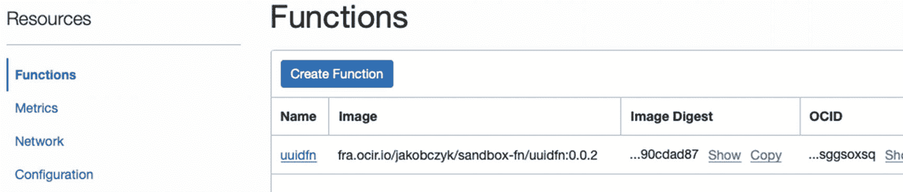

**图 9-14**
在 OCI 控制台中查看函数

类似地，该函数特定的容器镜像将列在 OCI 控制台的 OCIR 视图中，如图 9-15 所示。如果你完成了上一章的练习，你可能还会在`sandbox/uuid`仓库中看到另一个镜像。

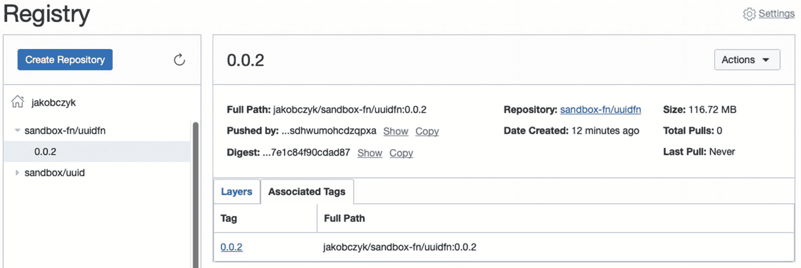

**图 9-15**
在 OCI 控制台中查看函数特定的容器镜像

函数测试可以按之前相同的方式进行。我们将使用`fn invoke`命令，它以应用程序名称和函数名称作为参数。为了进行简单的冒烟测试，让我们发起一次单函数调用。

```bash
[ubuntu@dev-vm]$ fn invoke uuidcloudapp uuidfn
{"generator_uuid": "921d63a9-f20c-44c0-97e6-5ff875fb1b39"}
```

回想一下，`uuidfn`函数解析输入，寻找一个顶级的`client_name` JSON 对象，该对象用于设置 JSON 响应中`generator_client`对象的值。要测试输入数据处理，请执行以下命令：

```bash
[ubuntu@dev-vm]$ echo -n '{ "client_name": "some_app"  }' | fn invoke uuidcloudapp uuidfn --content-type application/json
{"generator_uuid": "7685e3b8-5db7-49e1-8f1b-1561e16e9103", "generator_client": "some_app"}
```

让我们再触发该函数两次。

```bash
[ubuntu@dev-vm]$ fn invoke uuidcloudapp uuidfn
{"generator_uuid": "9b4ad9bb-7d20-47d9-a53c-b3eb61854e4d"}
[ubuntu@dev-vm]$ fn invoke uuidcloudapp uuidfn
{"generator_uuid": "b60fa2f0-3778-4a6a-9932-90d852a78ab1"}
```

现在，在 OCI 控制台中，你可以转到资源菜单中的“指标”选项卡，并检查此特定函数的各种指标。例如，一个最简单但仍非常有趣的指标是函数调用次数。看起来如图 9-16 所示。

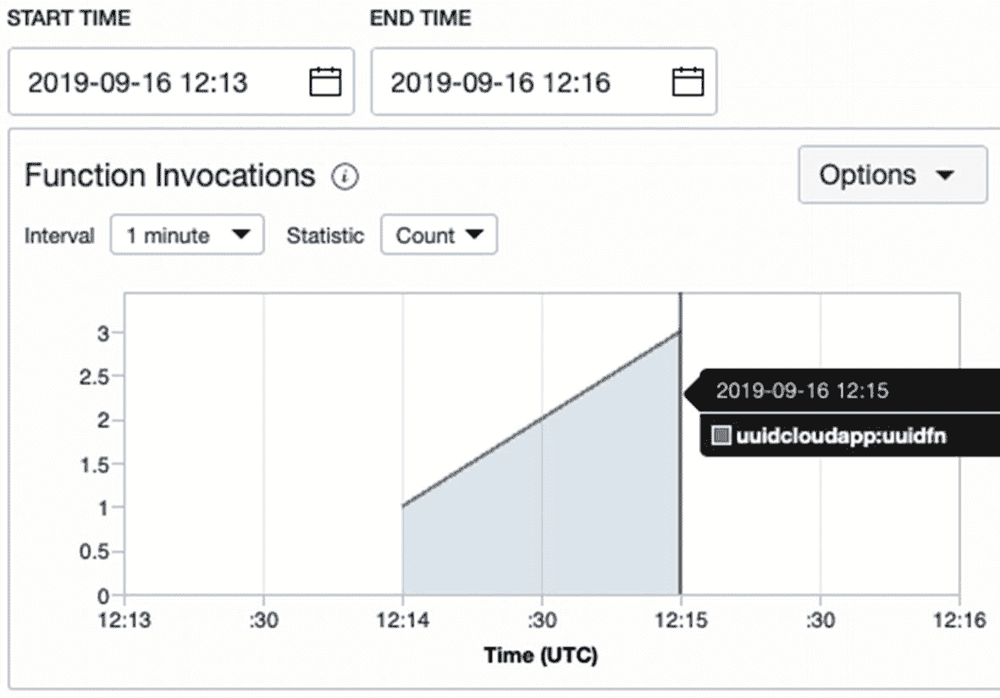

**图 9-16**
在 OCI 控制台中查看函数调用

刚才，为了进行函数测试，我们使用了`fn invoke`命令。通常，函数使用者（如常规客户端应用程序或其他系统）将使用函数的 HTTP `invoke endpoint`，可以直接使用，或者在更复杂的解决方案中，隐藏在企业级 API 管理平台后面。你可以在 OCI 控制台中发现该端点，也可以通过`fn inspect function`命令来发现，如下所示：

```bash
[ubuntu@dev-vm]$ fn inspect function uuidcloudapp uuidfn | jq -r '.annotations."fnproject.io/fn/invokeEndpoint"'
https://wup2t5yjlba.eu-frankfurt-1.functions.oci.oraclecloud.com/20181201/functions/ocid1.fnfunc.oc1.eu-frankfurt-1.aa...gsoxsq/actions/invoke
```

以 HTTP 请求形式的函数调用被发送到调用端点，并且必须使用正确的 Oracle Cloud Infrastructure 签名进行签名。换句话说，Oracle Functions 只接受来自已知租户用户的外部请求，无论他们是人类用户还是系统用户。如果你向函数调用端点发送未签名的请求，你将收到以下响应：

```json
{"code":"NotAuthenticated","message":"Not authenticated"}
```

要发送已签名的请求，你需要将函数使用者映射到现有的 Oracle Cloud 用户，这需要一些仔细规划。此外，为了向函数使用者公开更用户友好的 REST API，你可能会部署某种网关，甚至采用前述的成熟 API 管理平台。让我在此跳过这个话题，因为它涉及本书范围之外的方面。同时，让我们继续讨论第二种函数触发器类型，即事件。

## 事件

什么是`事件`？通常，我们用这个词指代某种特定情况的发生。让我以一个业务流程为例。发送到特定入站电子邮件地址的传入电子邮件可以被视为一个事件，并有效地在系统中触发一个新的业务流程案例。类似地，上传到对象存储桶中的新文件也可以被视为一个事件，并触发一个无服务器函数实例来处理新上传的数据。在这两种情况下，事件都需要携带一些额外的（但最好是有限且轻量级的）上下文信息。在后一个例子中，一个事件将至少携带新对象的名称以及存储桶的名称。这样，相应的无服务器函数就能够识别导致事件发生的对象。事件在当代软件架构中至关重要，并为不同的应用程序集成模式（如即发即弃、发布-订阅或存储转发）提供了基础。事件驱动的应用程序架构（组件通过交换事件进行通信）受益于松散耦合，这是独立组件开发和生命周期管理的关键推动因素，最终提高了生产力。

作为一个练习，我们将部署并测试一个无服务器函数，该函数处理出现在特定对象存储桶中的新创建的对象。函数实例将由该特定存储桶中的对象创建事件触发。当一个新对象被上传到`reports`存储桶时，将创建一个`reportingfn`无服务器函数的实例，并为其提供包含对象名称的事件上下文信息。接下来，函数将验证对象名称是否使用`.raw.csv`后缀。如果是，函数将读取对象的内容，在内存中执行简单的数据聚合，并创建一个新对象来存储操作结果。新对象将带有`.processed.csv`后缀。图 9-17 说明了前述的数据处理逻辑。

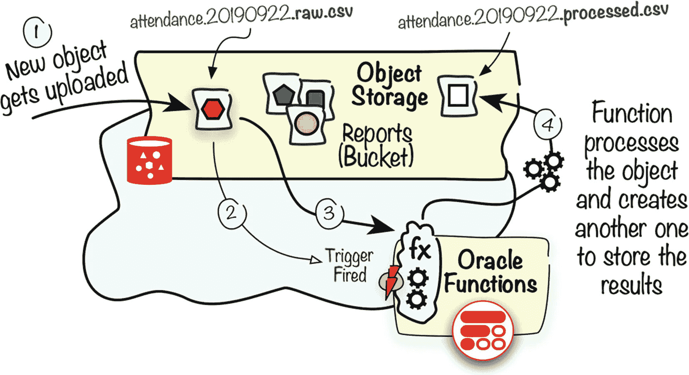

**图 9-17**
基于事件的函数调用


### 函数与对象存储

在 Oracle Functions 平台上运行的函数访问对象存储的方式，与在计算实例上运行的传统应用程序类似。就像使用计算实例一样，源自函数的 OCI API 调用是代表**实例主体**（你在第 5 章中已熟悉）进行的。回想一下，实例主体可以被包含在动态组中。为了将某个函数所有动态创建的函数实例都包含在一个动态组中，你可以将动态组的匹配规则设计为简单地包含所有具有特定标签键的函数。最后，你创建 IAM 策略语句，以允许动态组成员访问特定的 API 并与 OCI 资源（如对象存储桶和对象）进行交互。图 9-18 说明了这些与访问相关的方面。

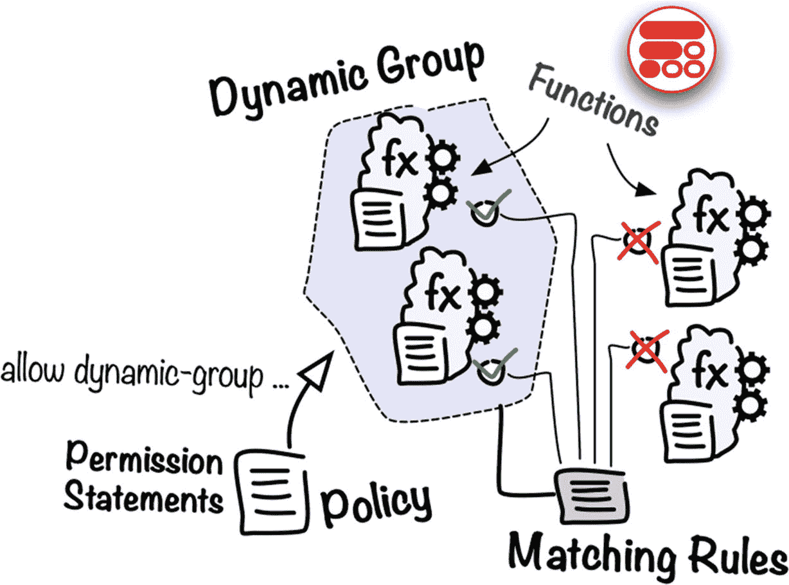

图 9-18

动态组与函数

现在，你应该理解了本节的目标，以及我们即将采用的机制，以允许函数实例与对象存储 API 交互并有效处理对象。

#### 准备基础设施

第一步，我们必须准备一个新的对象存储桶。断开与用于函数开发的计算实例的连接，并在你的开发机器上使用 OCI CLI 执行 `oci os bucket create` 命令。

```
$ oci os bucket create --name reports --profile SANDBOX-ADMIN
{
"data": {
...
"name": "reports",
"public-access-type": "NoPublicAccess",
"storage-tier": "Standard",
...
}
}
```

接下来，我们将让 `sandbox-user` 管理新创建的 `reports` 存储桶中的所有对象。为此，使用 `oci iam policy create` 创建新策略，如下所示：

```
$ cd ~/git/oci-book/chapter09/4-events/policies
$ oci iam policy create --name sandbox-users-storage-reports-policy --statements file://sandbox-users.policies.storage-reports.json --description "Storage-related (reports) policy for regular Sandbox users" --profile SANDBOX-ADMIN
{
"data": {
...
"name": "sandbox-users-storage-reports-policy",
"description": "Storage-related (reports) policy for regular Sandbox users",
"lifecycle-state": "ACTIVE",
...
}
}
```

你应该已经熟悉 `read buckets` 和 `manage objects` 这两个策略动词。你在第 5 章中对另一个存储桶应用过它们。列表 9-9 显示了针对 `reports` 存储桶的策略语句。

```
[
"allow group sandbox-users to read buckets in compartment Sandbox where target.bucket.name='reports'",
"allow group sandbox-users to manage objects in compartment Sandbox where target.bucket.name='reports'"
]
列表 9-9
sandbox-users.policies.storage-reports.json
```

现在，上传第一个测试文件：

```
$ cd ~/git/oci-book/chapter09/4-events/reports
$ oci os object put -bn blueprints --file customer_attendance.20190922.raw.csv --profile SANDBOX-USER
Uploading object  [####################################]  100%
```

作为第 5 章练习的一部分，我们创建了 `test-projects` 标签命名空间。在这个已存在的标签命名空间中，让我们准备一个名为 `reports` 的新标签键。稍后我们将使用此键来标记处理对象的函数。现在，使用 `oci iam tag-namespace list` 及以下查询来读取标签命名空间的 OCID。接下来，在创建新标签键的 `oci iam tag create` 命令中使用此 OCID。

```
$ TAG_NAMESPACE_OCID=`oci iam tag-namespace list --query "data[?name=='test-projects'] | [0].id" --raw-output`
$ echo $TAG_NAMESPACE_OCID
ocid1.tagnamespace.oc1..aaaaaaaac7doek63tcdgt3xqtjfx5is3twcpdsszaqsmxlurkwx7pu6qu2eq
$ oci iam tag create --tag-namespace-id $TAG_NAMESPACE_OCID --name reports --description "Reports project" --profile SANDBOX-ADMIN
{
"data": {
...
"tag-namespace-name": "test-projects",
"name": "reports",
"description": "Reports project",
"is-cost-tracking": false,
"lifecycle-state": "ACTIVE",
...
}
}
```

我们将使用以下动态组匹配规则，它包含所有带有 `test-projects.reports` 标签键的函数：

```
ALL {resource.type = 'fnfunc', tag.test-projects.reports.value}
```

现在，使用 `oci iam dynamic-group create` 创建动态组。

```
$ echo $TENANCY_OCID
ocid1.tenancy.oc1..aa...3yymfa
$ MATCHING_RULE="ALL { resource.type = 'fnfunc', tag.test-projects.reports.value = 'r1' }"
$ oci iam dynamic-group create --name reporting-functions --description "Functions related to the reporting project" --matching-rule "$MATCHING_RULE" -c $TENANCY_OCID
{
"data": {
...
"name": "reporting-functions",
"description": "Functions related to the reporting project",
"matching-rule": "tag.test-projects.reports.value",
"lifecycle-state": "ACTIVE",
...
}
}
```

最后一步是添加一个新的 IAM 策略语句，以允许该动态组的成员管理 `Sandbox` 配置空间中 `reports` 存储桶内的对象。列表 9-10 显示了这个 IAM 策略语句。

```
[
"allow dynamic-group reporting-functions to manage objects in compartment Sandbox where target.bucket.name='reports'"
]
列表 9-10
functions.policies.storage-reports.json
```

这些命令将使新的 IAM 策略生效：

```
$ cd ~/git/oci-book/chapter09/4-events/policies
$ oci iam policy create --name functions-storage-reports-policy --statements file://functions.policies.storage-reports.json --description "Storage-related (reports) policy for tagged functions" --profile SANDBOX-ADMIN
{
"data": {
...
"name": "functions-storage-reports-policy",
"description": "Storage-related (reports) policy for tagged functions",
"lifecycle-state": "ACTIVE",
...
}
}
```

通过这几个步骤，我们为附加了 `test-projects.reports` 定义标签的函数实例准备好了对象存储访问控制配置。


#### 部署函数

#### 创建函数存根

新的函数将被命名为 `reportingfn`，并采用基于 Python 的实现。现在，连接到用于函数开发的计算实例，并使用 `fn init` 命令来创建函数存根。

```
[ubuntu@dev-vm]$ cd ~
[ubuntu@dev-vm]$ fn init --runtime python reportingfn
Creating function at: ./reportingfn
Function boilerplate generated.
func.yaml created.
```

和之前一样，`cloud-init` 已经下载了函数代码并将其放置在函数目录中。将代码复制到函数存根中。

```
[ubuntu@dev-vm]$ cp ~/functions/reportingfn.py ~/reportingfn/func.py
```

#### 修改依赖项

该函数使用 OCI Python SDK 与 OCI 对象存储进行交互。这意味着需要依赖 `oci` 模块，并迫使我们修改 `requirements.txt` 文件。只有这样，函数特定的镜像才会包含 `oci` 模块。你可以使用简单的 `echo` 命令将 `oci` 名称追加到 `requirements.txt` 文件中。

```
[ubuntu@dev-vm]$ echo -ne "\noci" >> ~/reportingfn/requirements.txt
[ubuntu@dev-vm]$ cat ~/reportingfn/requirements.txt
fdk
oci
```

#### 分析处理函数

`reportingfn.py` 代码比我们之前处理过的两个函数稍大一些。清单 9-11 展示了 `handler` 函数最重要的部分。

```
...
def handler(ctx, data: io.BytesIO=None):
...
bucket_name = "reports"
object_name = extract_object_name(data)
...
signer = oci.auth.signers.get_resource_principals_signer()
client = oci.object_storage.ObjectStorageClient(
    config={},
    signer=signer)
storage_namespace = client.get_namespace().data
object_content_str = load_object_content(
    client, storage_namespace,
    bucket_name, object_name)
city_attendance_str = process_city_attendance_data(
    object_content_str)
processed_object_name = object_name.replace(
    '.raw.csv','.processed.csv')
put_response = put_city_attendance_object(
    client, storage_namespace, bucket_name,
    processed_object_name, city_attendance_str)
...
```

*清单 9-11 reportingfn.py 函数*

该函数被设计为仅与 `reports` 存储桶交互。它从输入数据中读取新创建的对象名称。此逻辑在我们将要稍后介绍的 `extract_object_name` 函数中提供。接下来，调用 OCI SDK 函数以获取 `ObjectStorageClient` 对象并获取要使用的对象存储命名空间。在后续步骤中，函数加载新创建对象的内容（`load_object_content` 函数），处理该数据（`process_city_attendance` 函数），最后将处理结果持久化到另一个新对象（`put_city_attendance_data` 函数）中，该对象具有与原始对象相同的名称但不同的后缀（`.processed.csv`）。你可以在同一个 `reportingfn.py` 文件中找到这些函数。只要了解 Python 的基础知识，代码应该相对容易理解。

#### 部署函数

根据当前的 Fn 客户端上下文，将函数部署到 Oracle Functions 会将镜像推送到 OCIR。虽然我们已经执行了 `docker login` 命令，但你可能需要重复此操作。如果是这种情况，以下是需要执行的命令：

```
[ubuntu@dev-vm]$ OCI_TENANCY_NAMESPACE=jakobczyk
[ubuntu@dev-vm]$ OCIR_REGION=fra
[ubuntu@dev-vm]$ OCI_USER=sandbox-user
[ubuntu@dev-vm]$ docker login -u $OCI_TENANCY_NAMESPACE/$OCI_USER $OCIR_REGION.ocir.io
Password: 
Login Succeeded
```

现在，确保 `FN_SUBNET_ID` 已正确定义，并使用 `fn create app` 来创建应用程序。

```
[ubuntu@dev-vm]$ FN_SUBNET_ID=ocid1.subnet.oc1.eu-frankfurt-1.aa...sp2ufa
[ubuntu@dev-vm]$ fn create app reportingapp --annotation oracle.com/oci/subnetIds="[\"$FN_SUBNET_ID\"]"
Successfully created app:  reportingapp
```

我们已经准备好部署函数。

```
[ubuntu@dev-vm]$ cd reportingfn/
[ubuntu@dev-vm]$ fn -v deploy --app reportingapp
...
Updating function reportingfn using image fra.ocir.io/jakobczyk/sandbox-fn/reportingfn:0.0.2...
Successfully created function: reportingfn with fra.ocir.io/jakobczyk/sandbox-fn/reportingfn:0.0.2
```

图 9-19 显示了 OCI 控制台中新部署的函数。类似地，图 9-20 展示了 OCIR 中的函数特定容器镜像。

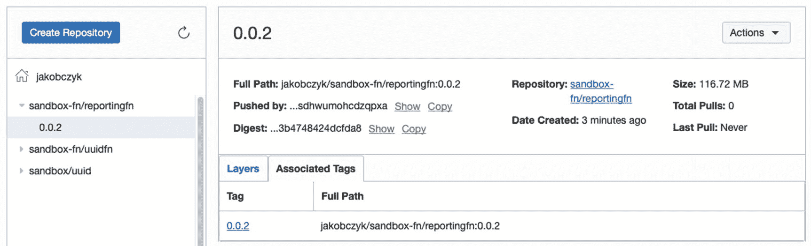

*图 9-20 在 OCI 控制台中查看函数特定容器镜像*

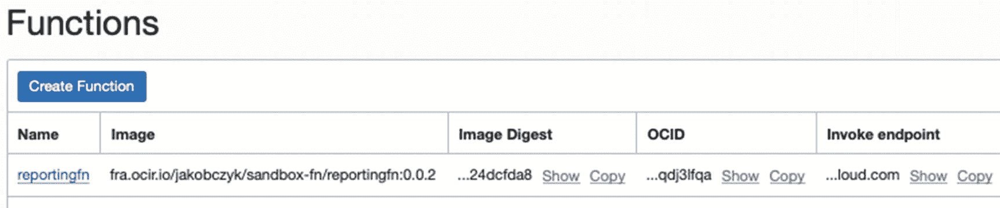

*图 9-19 在 OCI 控制台中查看函数*

#### 添加标记

我们绝不能忘记需要附加到函数上的标记。这可以通过 OCI CLI 完成。首先，使用带有定制 JMESPath 查询的 `oci fn application list` 命令来获取 Oracle Functions 应用程序的 OCID。接下来，使用 `oci fn function list` 命令来获取函数的 OCID。最后，你可以使用 `oci fn function update` 命令将 `test-projects.reports` 定义的标记附加到函数上。

```
$ FN_APP_OCID=`oci fn application list --query "data[?\"display-name\" == 'reportingapp'] | [0].id" --raw-output`
$ echo $FN_APP_OCID
ocid1.fnapp.oc1.eu-frankfurt-1.aa...spf2rq
$ FN_FUN_OCID=`oci fn function list --application-id $FN_APP_OCID --query "data[?\"display-name\" == 'reportingfn'] | [0].id" --raw-output`
$ echo $FN_FUN_OCID
ocid1.fnfunc.oc1.eu-frankfurt-1.aa...j3lfqa
$ oci fn function update --function-id $FN_FUN_OCID --defined-tags '{ "test-projects": {"reports": "r1"} }'
WARNING: Updates to config and freeform-tags and defined-tags will replace any existing values. Are you sure you want to continue? [y/N]: y
{
  "data": {
    ...
    "defined-tags": {
      "test-projects": {
        "reports": "r1"
      }
    },
    "display-name": "reportingfn",
    "freeform-tags": {},
    ...
    "lifecycle-state": "ACTIVE",
    ...
  }
}
```

如果你愿意，可以在 OCI 控制台中按照以下步骤直观地确认标记已正确附加到函数上：

1.  转到菜单 ➤ 开发者服务 ➤ 函数。
2.  确保选择了 `Sandbox` 复选框。
3.  单击 `reportingapp` 应用程序的名称。
4.  单击 `reportingfn` 函数的名称。
5.  单击“标记”选项卡。

你应该会看到新的已定义标记，它存在于 `test-projects` 标记命名空间中并使用 `reports` 键，如图 9-21 所示。

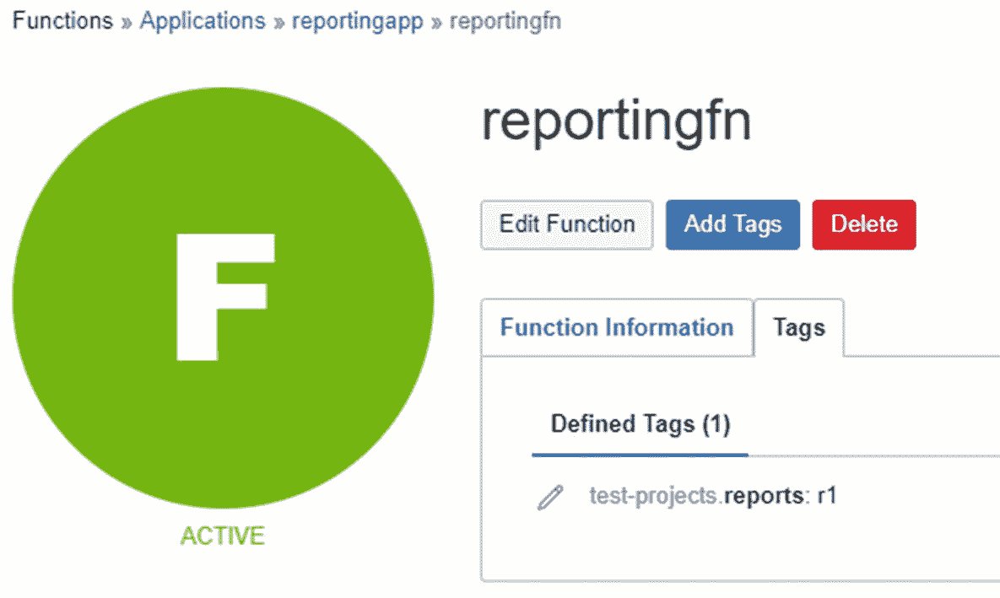

*图 9-21 查看附加到函数的已定义标记键*

函数已部署到 Oracle Functions。在我们测试它之前，让我们讨论一下它的触发方式。


### 事件作为函数触发器

`reportingfn` 函数将在 `reports` 存储桶中创建新对象时被触发。事件必须携带一些关于上下文的基本信息。函数实例必须被告知要处理的对象名称。让我们为事件负载构思一个简单的示例。可以想象，事件上下文信息以 JSON 格式存储，其外观类似于清单 9-12 中所示的示例。

```json
{
"eventType": "createobject",
"source": "ObjectStorage",
"eventTime": "2019-09-23T10:49:00.195Z",
"data": {
"resourceName": "customer_attendance.20190922.raw.csv",
}
}
```
**清单 9-12**
`event.mock.json`

函数代码随后会解析传入的事件负载，并提取携带新创建对象名称的 `resourceName` 元素。`reportingfn` 函数使用了前面提到的 `extract_object_name` 函数，该函数在清单 9-13 中展示。

```python
...
def extract_object_name(data: io.BytesIO):
    data_bytes = data.getvalue()
    data_json = json.loads(data_bytes)
    object_name = data_json['data']['resourceName']
    return object_name
...
```
**清单 9-13**
`reportingfn.py: extract_object_name` 函数

回到我们刚才上传的测试对象，让我们在 OCI 控制台中检查它的名称。该对象使用的是 `customer_attendance.20190922.raw.csv` 这个名称，如图 9-22 所示。

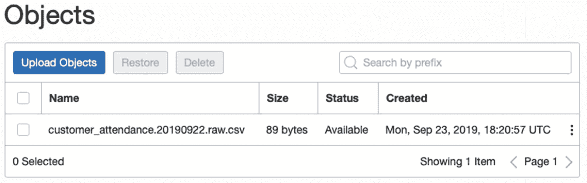
**图 9-22**
在 OCI 控制台中查看原始数据对象

在用于函数开发的计算实例上，`ubuntu`用户的主目录中，您可以找到`~/event.mock.json`文件。该文件包含了事件负载，如清单 9-13 所示。该文件是在初始启动时通过`cloud-init`下载的，方式与您部署的三个函数的代码文件相同。为了测试函数，我们将把该文件的内容作为输入流提供给函数。

```bash
[ubuntu@dev-vm]$ cat ~/event.mock.json | fn invoke reportingapp reportingfn --content-type application/json
{"object_name": "customer_attendance.20190922.raw.csv", "processed_object_name": "customer_attendance.20190922.processed.csv",
"result": "success"}
```

现在，如果您查看 OCI 控制台中`reports`存储桶的对象列表，应该很快会看到新对象，如图 9-23 所示。这个新对象是由运行在 Oracle Functions 平台上的动态生成的函数实例创建的。

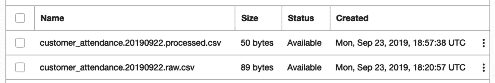
**图 9-23**
在 OCI 控制台中查看已处理的数据对象

好了，到目前为止一切顺利，但这仍然不是我们最初预期的结果。我们的目标是让函数实例在存储桶中出现新对象时自动触发。是时候介绍另一个属于 CNCF 项目生态系统的开源项目了。

### CloudEvents

CloudEvents 项目是在 CNCF 伞形组织下运作的相对较新的计划之一。该项目的主要目标是为社区提供一个统一的规范来描述事件数据。事件驱动的应用程序并不新鲜，不同的软件组件已经为事件使用了大量各种结构。当事件发布者以不同于事件消费者预期的格式发出事件时，这通常会导致有时成本高昂，有时只是令人烦恼的额外应用程序集成工作。为了减轻这种痛苦，业界已经清楚地认识到，像事件上下文信息这样简单且范围相当有限的东西，应该通过联合努力达成一致。CloudEvents 提供了一个描述事件数据的规范。此外，它还附带了各种编程语言的参考实现。您可以在 GitHub 上找到所有这些内容，如图 9-24 所示。

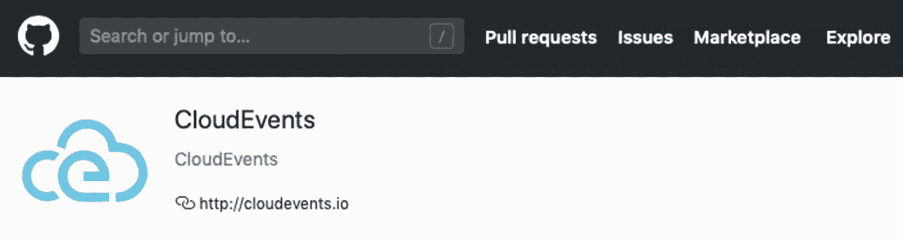
**图 9-24**
GitHub 上的 CloudEvents 项目

CloudEvents 规范内容轻量且相对容易阅读。在撰写本文时，该规范有三个稳定版本。当您阅读本书时，很可能已经有更新的版本可用。不用担心。为了简要讨论该规范，我们将重点关注 0.1 版本。细节会随着时间变化，但一般规则保持不变。我选择了 0.1 版本，因为它是您将在接下来的章节中学习的 Oracle Events 的当前标准。

CloudEvents 规范（版本 0.1）的核心包含三个部分。

*   术语

*   类型系统

*   上下文属性

最有趣的部分是*上下文属性*，它们有效地定义了事件信封，或者换句话说，基本上就是承载事件上下文信息的有效负载。这些主要是元数据，如事件的类型、来源和时间，以及事件特定的数据及其内容类型。这些属性列在表 9-1 中。

**表 9-1**
CloudEvents 上下文属性

| CloudEvents 版本 | 0.1 | 0.3 / 1.0-rc1 |
| --- | --- | --- |
| 使用的规范版本 | `cloudEventsVersion` | `specversion` |
| 事件类型 | `eventType` | `type` |
| 事件类型的版本 | `eventTypeVersion` | - |
| 事件发出者 | `source` | `source` |
| 唯一事件标识符 | `eventID` | `id` |
| 事件发生时间戳 | `eventTime` | `time` |
| `data` 字段中内容的类型 | `contentType` | `datacontenttype` |
| 事件的特定领域数据 | `data` | `data` |

清单 9-14 展示了 Oracle Cloud 中对象存储发出的事件的部分选定元素。您可以看到，在这种情况下，我们查看的是在创建新对象时发出的事件。这是基于 `eventType` 和 `source` 字段的值。 compartment、bucket 和对象名称包含在 `data` 元素内。清单仅显示了存储在 `resourceName` 字段中的对象名称。为了清单的简洁性，许多其他特定领域的事件数据被省略了。

```json
{
"eventType": "com.oraclecloud.objectstorage.createobject",
"cloudEventsVersion": "0.1",
"eventTypeVersion": "2.0",
"source": "ObjectStorage",
"eventTime": "2019-09-23T10:49:00.195Z",
"contentType": "application/json",
"data": {
    ...
    "resourceName": "customer_attendance.20190923.csv",
    ...
},
"eventID": "b163df45-de9c-9f01-2928-b0906cd8a3e4"
}
```
**清单 9-14**
CloudEvent（版本 1）

有了对 CloudEvents 规范的简要了解，我们可以进入本章的最后一部分了。


### Oracle 事件

Oracle Cloud 中的选定服务可以配置为发出事件。这些事件符合开源 CloudEvents 规范（在撰写本文时，我们谈论的是该规范的 0.1 版本）。Oracle 事件用于将发出的事件与其他 Oracle Cloud 服务连接起来，以便在特定事件发生时执行操作。例如，您可以注册一个在某个事件发生时执行操作的函数；例如，当新的计算实例启动完成、数据库备份创建、收到通知或在特定存储桶中创建新对象时。您通过定义适当的 Oracle Events 规则，将事件发出者与执行操作的服务连接起来。规则定义了已实现的事件处理链的条件和操作，如图 9-25 所示。

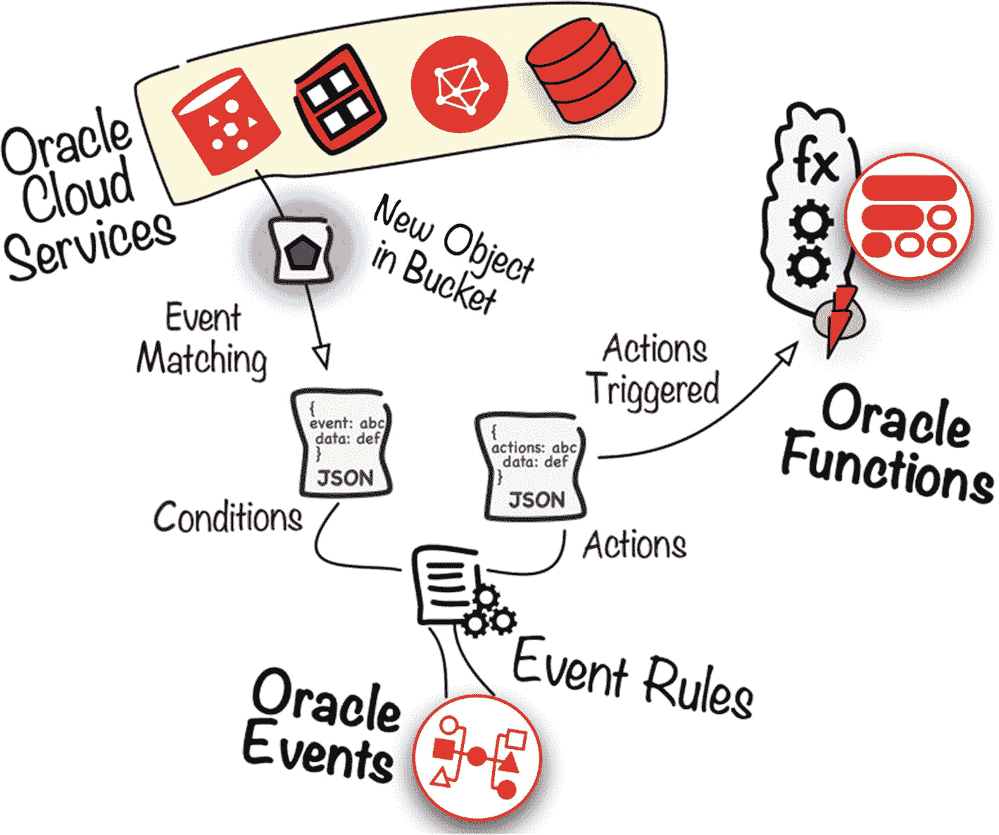

图 9-25 Oracle 事件

回到我们的练习，首先，我们必须允许 Oracle 事件服务调用 Oracle Functions，以便在特定类型的事件发生时，能够触发定义在 `Sandbox` 复合区中的无服务器函数。清单 9-15 展示了为此目的所需的唯一 IAM 策略语句。

```json
[
"allow service cloudEvents to use functions-family in compartment Sandbox"
]
```
清单 9-15 cloudevents.policies.json

现在，使用 `oci iam policy create` 来添加此语句。

```bash
$ cd ~/git/oci-book/chapter09/4-events/policies
$ oci iam policy create --name cloudevents-policy --statements file://cloudevents.policies.json --description "Functions-related policy for CloudEvents" --profile SANDBOX-ADMIN
{
"data": {
...
"name": "cloudevents-policy",
"description": "Functions-related policy for CloudEvents",
"lifecycle-state": "ACTIVE",
...
}
}
```

我们即将创建一个 Oracle 事件规则，该规则将一个定义了要响应事件类型的条件与一个操作相结合。清单 9-16 展示了我们将要使用的条件。

```json
{
"eventType": [ "com.oraclecloud.objectstorage.createobject" ],
"data": {
"compartmentName": ["Sandbox"],
"additionalDetails": {
"bucketName": ["reports"]
}
}
}
```
清单 9-16 oracleevents.conditions.json

简而言之，当在 `Sandbox` 复合区内的 `reports` 存储桶中创建新对象时，规则将执行定义的操作，如清单 9-17 所示。

```json
{
"actions": [
{
"actionType": "FAAS",
"description": "string",
"functionId": "PUT_HERE_FUNCTION_ID",
"isEnabled": true
}
]
}
```
清单 9-17 oracleevents.actions.template.json

我们稍后会引用这些文件。同时，还有一件重要的事情要做。某些类型的事件发出者必须显式启用。对象存储对象的事件就属于这种情况。我们需要为 `reports` 存储桶启用发出对象事件。在 OCI 控制台中，您可以按照以下方式执行此任务：

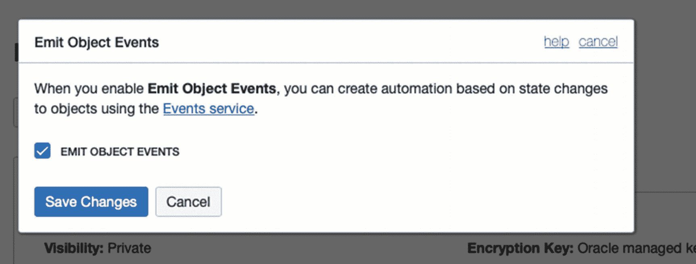

图 9-26 为存储桶中的对象启用事件生成

1.  转到菜单 ➤ 对象存储 ➤ 对象存储。
2.  确保选择了 `Sandbox` 复合区。
3.  单击 `reports` 存储桶的名称。
4.  单击“发出对象事件”旁边的“编辑”。
5.  选中“发出对象事件”框，如图 9-26 所示。
6.  单击“保存更改”。

在这个阶段，我们已经准备好创建一个新的 Oracle 事件规则，该规则将使用您刚才看到的条件文件和操作文件。如下面的代码片段所示，您将对条件文件的内容进行序列化，并使用 `sed` 程序创建包含最终操作的 JSON 文件。这样做是为了准备 `oci events rule create` 命令的输入。请注意，`FN_FUN_OCID` 变量仍然需要设置。以下是需要执行的代码：

```bash
$ cd ~/git/oci-book/chapter09/4-events/events
$ echo $FN_FUN_OCID
ocid1.fnfunc.oc1.eu-frankfurt-1.aa...j3lfqa
$ cat oracleevents.actions.template.json | sed -e "s/PUT_HERE_FUNCTION_ID/$FN_FUN_OCID/g" > oracleevents.actions.json
$ SERIALIZED_CONDITIONS=`cat oracleevents.conditions.json | sed 's/"/\\"/g' | sed 's/[[:space:]]//g' | tr -d '\n'`
$ echo $SERIALIZED_CONDITIONS
{"eventType":["com.oraclecloud.objectstorage.createobject"],"data":{"compartmentName":["Sandbox"],"additionalDetails":{"bucketName":["reports"]}}}
$ oci events rule create --display-name new-reports --is-enabled true --condition $SERIALIZED_CONDITIONS --actions file://oracleevents.actions.json
```

规则已创建。如果您愿意，可以随时前往 OCI 控制台查看或酌情修改 Oracle 事件规则，如图 9-27 所示。

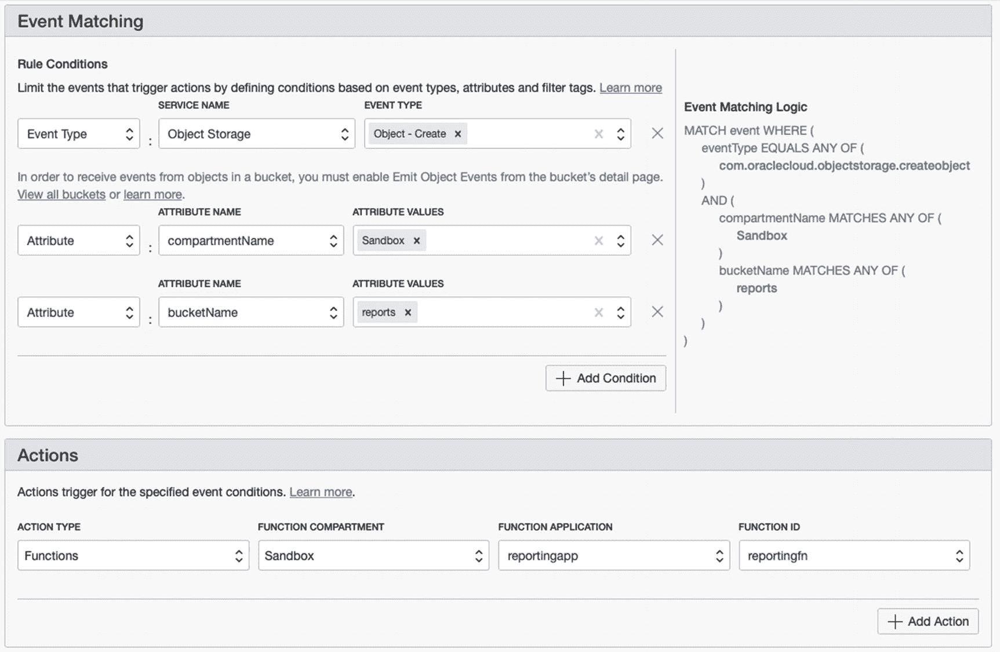

图 9-27 在 OCI 控制台中查看 Oracle 事件规则

要测试对象存储发出的事件是否真的触发了部署到 Oracle Functions 的 `reportingfn` 函数，请将剩余的两个测试文件放入 `reports` 存储桶。您可以使用 `oci os object put` 命令来完成，如下所示：

```bash
$ cd ~/git/oci-book/chapter09/4-events/reports
$ oci os object put -bn reports --file customer_attendance.20190923.raw.csv --profile SANDBOX-USER
Uploading object  [####################################]  100%
$ oci os object put -bn reports --file customer_attendance.20190924.raw.csv --profile SANDBOX-USER
Uploading object  [####################################]  100%
```

一段时间后，您应该会在同一个存储桶中看到另外两个文件出现，这次带有 `.processed.csv` 后缀，如图 9-28 所示。

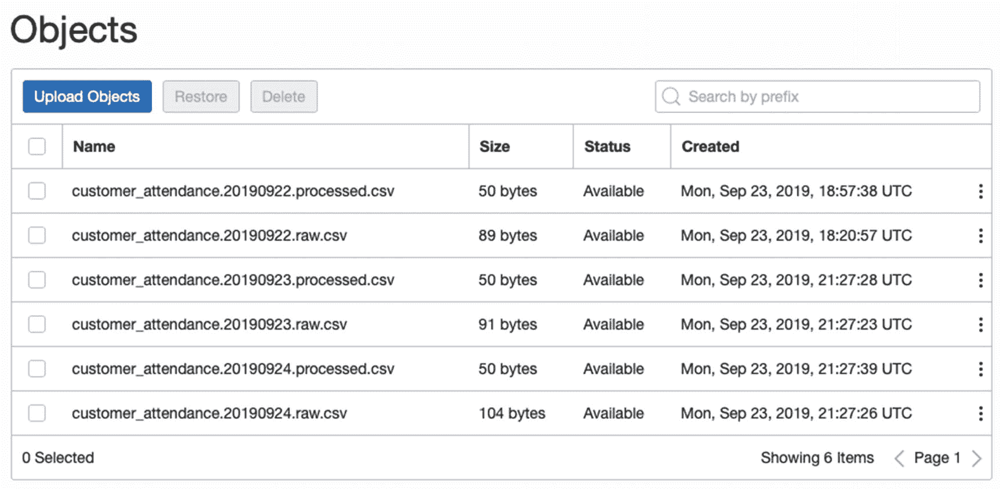

图 9-28 在 OCI 控制台中查看已处理的文件

您可以自由探索这些文件的内容，比较 `.raw.csv` 和 `.processed.csv`，并查看用于实现该函数的 Python 代码。

提示

如果没有任何反应，并且没有 `.processed.csv` 文件，您可能跳过了在存储桶上启用发出事件的步骤。删除这两个 `.raw.csv` 文件，在 `reports` 存储桶上启用发出事件，然后重新上传 `.raw.csv` 文件。


## 清理

完成练习后，你可以终止本章中创建的云资源。首先，让我们删除存储桶及其内容。

```
$ oci os object bulk-delete -bn reports
There are 6 object in the bucket. Are you sure you want to delete them? [y/N]: y
$ oci os bucket delete -bn reports
Are you sure you want to delete this resource? [y/N]: y
```

要从 Oracle Functions 删除函数，你可以使用 OCI CLI、OCI 控制台或 Fn 客户端。以下是使用 CLI 命令的方法：

```
$ FN_APP_OCID=`oci fn application list --query "data[?\"display-name\" == 'reportingapp'] | [0].id" --raw-output`
$ FN_FUN_OCID=`oci fn function list --application-id $FN_APP_OCID --query "data[?\"display-name\" == 'reportingfn'] | [0].id" --raw-output`
$ oci fn function delete --function-id $FN_FUN_OCID
Are you sure you want to delete this resource? [y/N]: y
$ oci fn application delete --application-id $FN_APP_OCID
Are you sure you want to delete this resource? [y/N]: y
$ FN_APP_OCID=`oci fn application list --query "data[?\"display-name\" == 'uuidcloudapp'] | [0].id" --raw-output`
$ FN_FUN_OCID=`oci fn function list --application-id $FN_APP_OCID --query "data[?\"display-name\" == 'uuidfn'] | [0].id" --raw-output`
$ oci fn function delete --function-id $FN_FUN_OCID
Are you sure you want to delete this resource? [y/N]: y
$ oci fn application delete --application-id $FN_APP_OCID
Are you sure you want to delete this resource? [y/N]: y
```

要删除 Oracle Events 规则，可以像这样使用 `oci events rule delete` CLI 命令：

```
$ EVENTRULE_OCID=`oci events rule list --query "data[?\"display-name\" == 'new-reports'] | [0].id" --raw-output`
$ oci events rule delete --rule-id $EVENTRULE_OCID
Are you sure you want to delete this resource? [y/N]: y
```

要终止 `dev-vm` 及任何相关的网络资源，你必须在基础设施项目目录中像这样发出 `terraform destroy` 命令：

```
$ source ~/tfvars.env.sh
$ cd ~/git
$ cd oci-book/chapter09/1-infrastructure
$ terraform destroy -auto-approve
```

这是本书的最后一章。在本书的过程中，我们创建了许多租户级别的补充云资源，例如用户、组、IAM 策略、动态组和 `Sandbox` 隔区。这些资源至少在撰写本文时不会产生费用。除非你想自行使用它们来进一步探索 Oracle Cloud Infrastructure 功能，否则可以随意删除它们。要查找在特定时间点存在于你的租户或特定隔区中的所有云资源，你可以使用第 4 章介绍的搜索功能，或 OCI 控制台中菜单 ➤ 治理 ➤ 隔区浏览器下可用的隔区浏览器。

## 总结

云原生架构，尽管尚未完全成熟，但正逐渐成为现实。在本章中，你了解了新兴的 CNCF 生态系统及其基于开源、云计算和容器化的起源。接下来，你熟悉了无服务器函数的概念，并运用这些知识，使用了名为 Fn Project 的开源、基于容器的无服务器框架。然后，你使用了 Oracle Functions，这是 Oracle Cloud 上的一个托管平台，允许你执行 Fn Project 函数。进一步地，你理解了部署到 Oracle Functions 的函数如何与其他 Oracle Cloud 服务交互。作为一个示例，你学习了如何读写对象存储。最后，你认识了 CNCF 主办的 CloudEvents 项目，该项目致力于定义行业范围的事件规范，并看到了如何通过配置 Oracle Events 规则来利用基于事件的函数触发器。

本章为 *Practical Oracle Cloud Infrastructure* 画上了句号。我很高兴能成为你的向导。祝你好运！


# 索引

## A
- `ACID 属性`
- `ADW 实例`，终止 `ADW`，加载数据数据库凭据 `身份验证令牌`
- `CLI 命令` `DBMS_CLOUD.COPY_DATA 过程` `DBMS_CLOUD.DROP_CREDENTIAL 过程` `roadadw-load`
- `SANDBOX_USER` `DBMS_CLOUD.COPY_DATA 过程`
- `星型模式` 参见 `星型模式`
- 美国国家标准与技术研究院 (NIST)
- `Ansible`
- 应用设计 `API 响应组件` 草图 `JSON 格式` `轮询策略` 服务实现 `UUID` `WSGI`
- 应用程序编程接口 (API) `REST` `SOAP`
- 架构模式
- `AttachVnic API`
- 审计事件搜索 `OCI 控制台`
- 自动工作负载存储库 (AWR)
- 自治数据库 (ADB)
- 自治数据仓库 (ADW) `ADMIN` 备份 `CLI 命令` 数据库创建 地理区域 实例, `OCI 控制台` `OCI 控制台` `OLAP 系统` `SANDBOX-ADMIN` `CLI 模式` `服务控制台`
- 自治事务处理 (ATP)
- `自动扩展`
- 可用性域 (AD)

## B
- 裸机 (BM) 裸机云服务 (BMCS) 计费 `BYOL` 基于承诺的定价 `OCI 控制台` 按需定价
- `blankapp 应用程序` `blankfn 函数` `blankfn.py 文件`
- 块存储 启动卷
- 自带许可证 (`BYOL`)
- `存储桶`
- 业务流程建模符号 (BPMN)

## C
- 资本支出
- `cat 命令`
- 清理 `client.get_namespace 方法` `client.list_objects 方法`
- 云账户
- 云特性 云管理平面 成本 承诺折扣价格 按需定价 `PAYG` *对比* 基于承诺的计划定义 作为服务交付 弹性与可扩展性 传统配置流程 虚拟资源与硬件
- `cloud-config 文件`
- `CloudEvents 项目` 上下文属性 `GitHub` `CloudEvents 规范`
- 云基础设施 地址布局 架构 启动卷 容错 镜像 `IPv4 地址` 负载均衡器 `OCPU` 操作系统 `形状` 子网
- 云基础设施，自动化 `CLI` 计算实例 配置 定义 安装 `oci-cli 模块` 配置资源 `SSH 公钥` `VCN OCID`
- 云平台 参见 `云管理平面` `SDK 配置安装 OCID` 开源项目 `VCN` `terraform`
- `cloud-init 配置`
- 云管理平面 `API 调用，安全密钥对，生成` 多租户 Oracle 云基础设施 `API 公钥，上传` `SDK/CLI/Terraform`
- 云原生 定义 全景
- 云原生计算基金会 (CNCF)
- `ClusterIP 服务`
- 冷备份
- 托管模式
- 命令行界面 (CLI)
- `commit_multipart_upload 函数`
- 通用互联网文件服务 (CIFS)
- 社区版 (CE)
- ` compartment ` 访问控制策略 删除 派生 compartment 层级结构 详情视图 过滤成本 层级结构 列表 `OCI 控制台` 原因 资源 `沙盒` 查看每个 compartment 的成本
- 计算实例 裸机 *对比* 虚拟机 `cloud-init` 创建 自定义镜像 硬件配置 配置文件管理选项卡 多租户 网络选项卡 `OCI 控制台` 预装软件栈 `RSA 算法` 部分 `SSH 密钥对创建 SSH 公钥 VM vm.config.yaml`
- 容器镜像仓库
- 容器化应用开发 实例 `docker 镜像` `docker 运行时` 运行容器 可扩展性
- 容器网络接口 (CNI)
- 容器编排 集群部署 开发者 `Kubernetes Pods` `sandbox-user` 令牌与密钥
- 容器 核心特性 定义 开发应用 文件系统层 镜像 隔离层 管理仓库平台 自包含标签 租户命名空间
- 容器存储接口 (CSI)
- `COPY 命令`
- 核心云能力 计算 `IAM` 网络存储
- `-c 参数` `create_multipart_upload 函数`
- 创建、读取、更新、删除 (CRUD)
- 跨租户 `VCN 对等连接`
- 自定义标签

## D
- 数据分析 即席查询 `切片钻取操作` `GRANT 语句` `物化视图` `OLAP 立方体` `OML` `Oracle 分析云` `透视操作` 查询 查询结果 `切片与切块切片操作` `SQLselect 语句` `星型模式视图`
- 数据库监控 活动视图 `AWR 表` `服务控制台` `SQL 语句`
- 数据定义语言 (DDL)
- 数据实体
- 数据模型
- 部署模型 混合云 私有云 公有云
- 开发环境 `dev-sandbox 命名空间` `dev-vm 计算实例`
- `-d 标志`
- `切片操作`
- 灾难恢复 (DR)
- `-d 参数`
- 动态组 命令 创建 匹配规则 `oci iam 策略` `sandboxcompartment sandbox-users.policies.storage.2.json 文件` 语句 `--version-date 参数`
- 动态路由网关 (DRG)

## E
- `弹性`
- 企业服务总线 (ESB)
- 实体标签 (ETags)
- `ENV 指令` `-e 参数`
- 基于事件的函数调用
- `Events 应用程序` 集成模式 `定义标签部署自由格式标签` 组与函数 `处理程序函数 IAM 策略语句 JSON 格式` `object_name 函数 object-processing 函数 reportingfn` `requirements.txt 文件 test-projects.reports` 标签键
- `Exadata 数据库机`
- `EXPOSE 指令`
- 快捷版 (XE)
- `extract_object_name 函数`
- 提取-转换-加载 (ETL)

## F
- `FastConnect`
- 故障域
- 文件存储
- 浮动 IP
- `fn init 命令`
- Fn 项目 `blankapp 应用程序` `blankfn 函数` `blankfn.py 文件` 上下文 开发与执行 `docker 日志命令` `fdk 打包` 特定于函数的容器 安装基于 Python 的函数 `UUID`
- 自由文本查询 `JMESPath` `OCI 控制台`
- `FROM 指令`
- 函数即服务 (FaaS)
- 函数部署 `func.yaml 函数`

## G
- Gartner
- `组成员` `OCI CLI 配置文件` `OCI CLI RC 文件` `OCI 控制台 TENANCY_OCID bash 变量` 用户详情屏幕

## H
- HashiCorp 语言 (HCL)
- 高性能计算 (HPC)
- 水平扩展 `自动扩展策略 CPU 利用率` 实例池 `CentOS 镜像 cloud-config 文件` 冷却期 `CPU 利用率` 基础设施 `实例配置` 负载均衡器 `modules.tf 文件` `OCI 控制台` `oci_core_instance_configuration 资源` 扩展 `SSH 密钥 workers-pool 内存利用率 Terraform`
- 基于 HTTP 的无服务器函数

## I
- `标识符()处理程序函数`
- 身份与访问管理 (IAM) 云用户 动态组
- 身份云服务 (IDCS)
- 身份提供者 (IdP)
- 镜像仓库
- 不可变基础设施 `Ansible` 自治智能 `cloud-init` 多套阶段, `管道 Terraform 供应器`
- 索引
- 信息时代
- 基础设施无关平台
- 基础设施即服务 (IaaS)
- 每秒输入/输出操作数 (IOPS)
- 实例配置
- 实例池
- 实例主体
- 互联网网关 (IGW)
- 互联网小型计算机系统接口 (iSCSI) 协议

## J
- JavaScript 对象表示法 (JSON)

## K
- 内核级隔离
- `内核版本条目`
- `Kubeconfig 文件` 集群 `DNS pods (kube-dns-)` 容器网络接口插件 `pods (kube-flannel-)` Kubernetes 网络代理 `(kube-proxy-)`
- Kubernetes 基础设施对象
- Kubernetes 服务负载均衡器

## L
- Linux 容器工具 (LXC)
- 负载均衡器 (LB) 添加详情 后端步骤 容错 健康检查设置 入口安全规则 `JSON 元素` 监听器步骤 `OCI 资源` `REST API` 安全列表 子网 故障排除 `VCN`
- `LoadBalancer 类型 Kubernetes 服务`
- `load_object_content 函数`
- `--local 选项`
- 本地对等网关 (LPG)

## M
- 管理权限
- 微服务
- 多部分上传机制

## N
- `命名空间`
- 网络文件系统 4 (NFS4)
- `--no-bump 参数`
- 节点池
- 非易失性内存快速通道 (NVMe)
- `-n 参数`

## O
- 对象 API 认证组 二进制文件, `bash 桶详情 CLI 配置文件并发更新错误 ETagsHeadObject API --if-match 选项丢失更新 oci os 对象乐观并发控制竞争条件 CRUD 自定义元数据 IAM 策略语句列表-ns 选项对象名称前缀批量命令文件组过滤--include 选项 oci os 对象列表前缀上传蓝图 oci os 对象 put 命令 sandbox-admins 组 SANDBOX-USER 配置文件 sandbox-users.policies.storage.json 存储层级表`
- 对象存储
- `ObjectStorageClient 类`
- `OCI CLI 命令` `oci.config.from_file 方法`
- `OCI 控制台` 访问用户配置文件 函数调用 特定于函数的容器镜像 `OCIR` `OKE 集群` 处理后的文件 原始数据对象 查看函数 查看处理后的数据
- `OCI 基础设施组件` `oci.object_storage.ObjectStorageClient 类`
- `OCI 注册表 (OCIR)` 镜像标签
- `OCI 控制台策略` 区域代码
- `OCI REST API` `OCIR 仓库镜像查看 OKE 集群`
- `OLAP 立方体` `OLAP 工作负载` `OLTP 工作负载`
- 开放容器倡议 (OCI)
- `Oracle 分析云`
- Oracle 云标识符 (OCID)
- Oracle 云基础设施 (OCI) 计费 `IaaS 区域服务 SLA` 参见 `服务级别协议 (SLA)` 支持试用工作负载
- Oracle 云基础设施注册表 (OCIR)
- Oracle 计算单元 (OCPU)
- Oracle 容器镜像注册表 (OCIR)
- Oracle 数据库 `ADB ADW` 定义 `Exadata 机架 OLAP 工作负载 OLTP 工作负载` 无服务器 `XE`
- Oracle 事件 操作 启用 发射对象事件 规则中 `在 OCI 控制台`
- `Oracle Functions 访问管理客户端上下文客户端正确端点事件 fn 客户端配置 OCI CLI 配置策略语句 sandbox/uuid 仓库租户命名空间测试连通性触发器 VCN 子网`
- Oracle Kubernetes 引擎 (OKE)
- Oracle 机器学习 (OML)
- Oracle REST 数据库服务 (ORDS)

## P, Q
- 分页
- 分页机制
- `ping 命令`
- 平台即服务 (PaaS)
- `策略 compartment JSON 文件 OCI 控制台 SANDBOX-ADMIN 用户 sandbox-admins-policy 沙盒 compartment 租户管理员策略语句 IAMLOAD_BALANCER_DELETE 权限负载均衡器多个权限/操作策略动词资源类型`
- `-p 参数`
- `预认证请求` `预启动执行环境 (PXE)` `prepare_report_entries 函数`
- 私有 IP 主要和次要 次要 `VCN`
- 私有子网 `API 调用` 堡垒主机 堡垒模块 `基于 CentOS 的实例` 隔离工作负载 `NAT 网关` `OCI 控制台 OCID` 公共 `DNS 服务器远程管理路由规则路由表 terraform apply 命令 vcn.tf 文件` `process_city_attendance 函数.processed.csv 后缀`
- 生产环境
- 编程对象存储实例原则 应用逻辑 `cloud-config 文件` 复杂条件 自定义标签 动态组 `--file 选项` 基础设施 匹配规则 `prepare_report_entries 函数` 公共 IP `报告 reportissuer.py runcmd 部分服务特定指标摘要对象 terraform destroy 命令 tfvars.env.sh 单元文件上传 _report 函数视图，存储指标`
- 多部分上传 `AbortMultipartUpload` 应用执行 `commit_multipart_upload 函数 CommitMultipartUpload create_multipart_upload 函数 diff 工具 ETag ListMultipartUploads 主函数 part_details_list --part-size 参数阶段 pip freeze 命令 SDK 安装拆分 split_large_file 函数测试文件 upload_part 函数 upload_to_oci 函数`
- 标记资源代码成本跟踪标签 `oci iam 标签列表 oci iam 标签-命名空间标签键标签命名空间标签 test-projects 项目--provider 选项`
- 配置基础设施 compartment `OCI 控制台 OCID DR OCI 控制台单 AD 区域`
- 公共访问访问模式访问类型 `ObjectReadWithoutList OCI 控制台预认证请求公共存储桶--time-expires 选项 URL`
- 公共 IP `CLI 命令临时 IGW JMESPath 过滤负载均衡器 OCI 控制台本地网络 Oracle 云地址池原因保留，OCI 控制台子网终止保留资源` `put_city_attendance_data 函数`
- Python 包索引 (PyPI) 仓库

## R
- 快速配置
- 快速自配置流程
- 引用完整性
- 关系数据模型 `ACID B 树索引检查约束一对多关系存储数据事务二维表唯一键`
- 远程桌面 (RDP)
- 远程过程调用 (RPC)
- `reportingfn 函数` `reportingfn.py 代码`
- 表征状态转移 (REST) 关键抽象 `RPC`
- 路由规则
- 路由表

## S
- `沙盒管理员组成员` `sandbox-admin.tfvars 文件`
- `可扩展性`
- 缩减
- 缩容
- 垂直扩展实例 启动卷 `cloud-config 文件 CPU 利用率分离，启动卷显示名称，启动卷基础设施代码新实例 OCI 控制台，启动卷 source_details 步骤终止，启动卷 Terraform terraform destroy 命令取消注释代码`
- 水平扩展 `自动扩展计算实例高级网络选择自定义镜像创建查看自定义镜像水平原因子网 UUID` 服务 API `Vistula API`
- 向上扩展
- 搜索 `基于 JMESPath 的过滤类型`
- 安全列表 出站安全规则 无状态规则
- 安全规则 拒绝所有原则 安全列表 有状态规则 无状态和有状态 无状态规则
- 自服务
- 无服务器函数 云基实例 `devmachine 模块` Docker 命令 Fn 项目 参见 `Fn 项目` 函数开发 无状态/短生命周期
- 服务器消息块 (SMB) 协议
- 服务消费者
- 服务级别协议 (SLA) `AD 云信用等级 PAYG 服务抵扣金`
- 服务限制
- 服务网格
- 服务模型 消费模式 `IaaS PaaS SaaS`
- 面向服务的架构 (SOA)
- 共享池
- Sidecar 模式
- 简单对象访问协议 (SOAP)
- 单点登录 (SSO)
- 小型计算机系统接口 (SCSI)
- 快照
- 软件即服务 (SaaS)
- 软件定义网络 (SDN)
- 软件开发工具包 (SDK)
- 固态硬盘 (SSD)
- `split_large_file 函数`
- SQL 开发工具网页 `dwrole 数据库 ORDS_ADMIN.ENABLE_SCHEMA 过程 SANDBOX_USER SQL 语句 SQL 任务 URL 结构 SQLselect 语句`
- `ssh-agent` `SSH ProxyJump 技术`
- 标准化
- `星型模式` 定义 维度 `blankasnull 数据文件 DBMS_CLOUD.COPY_DATA 过程 DDL 语句事件对象详情对象存储 rejectlimit 道路道路 sandbox-user SQL DDL 语句 SQL 开发工具网页时间 TIME_DIM 数据库事实数据文件连接操作对象存储桶道路事件 SQL DDL 语句 SQL 开发工具网页事实表`
- 有状态规则
- 无状态规则
- 存储能力 访问频率 块存储 `iSCSI 协议 NFS 协议` 资源类型
- 存储驱动程序
- 结构化查询 `OCI 控制台沙盒`
- 结构化查询语言 (SQL)
- 子网
- Sun 网络文件系统 (NFS)

## T
- 标签
- `Terraform CLI 配置项目目录变量定义基础设施代码属性 cloud-init 工具数据源模块项目资源路由表安全列表子网 web 模块目录互联网网关(web_igw)引用 web 模块安装供应商供应操作清理和终止基础设施依赖树环境变量文件模块 web-vm 计算实例单服务器基础设施状态文件 Terraform 驱动的基础设施`
- 测试 `API cloud-init LB 参见负载均衡器 (LB) 开放端口 SSH 连接-t 参数`
- 通用唯一标识符 (UUID)
- `upload_part 函数` `upload_report 函数` `upload_to_oci 函数`
- 用户 活动用户菜单 `CLI 配置文件访问权限不足非联合用户 SANDBOX-ADMIN 配置文件登录屏幕 TENANCY_OCID bash 变量类型 UUID 生成函数部署模型 fn 检查函数 fn 调用命令 uuid.uuid4()方法`

## V
- `VCN 对等连接跨租户专用网络 compartment 本地 LPG 点对点远程路由规则--verbose 选项`
- 垂直扩展
- 虚拟云网络 (VCN) `特定于 AD 的子网子网类型`
- 虚拟硬件资源
- 虚拟机 (VM)
- 虚拟网络

## W, X
- 温备份
- Web 应用描述语言 (WADL)
- Web 应用防火墙 (WAF)
- Web 服务描述语言 (WSDL)
- `WORKDIR 指令`

## Y, Z
- 您的按需付费 (PAYG)