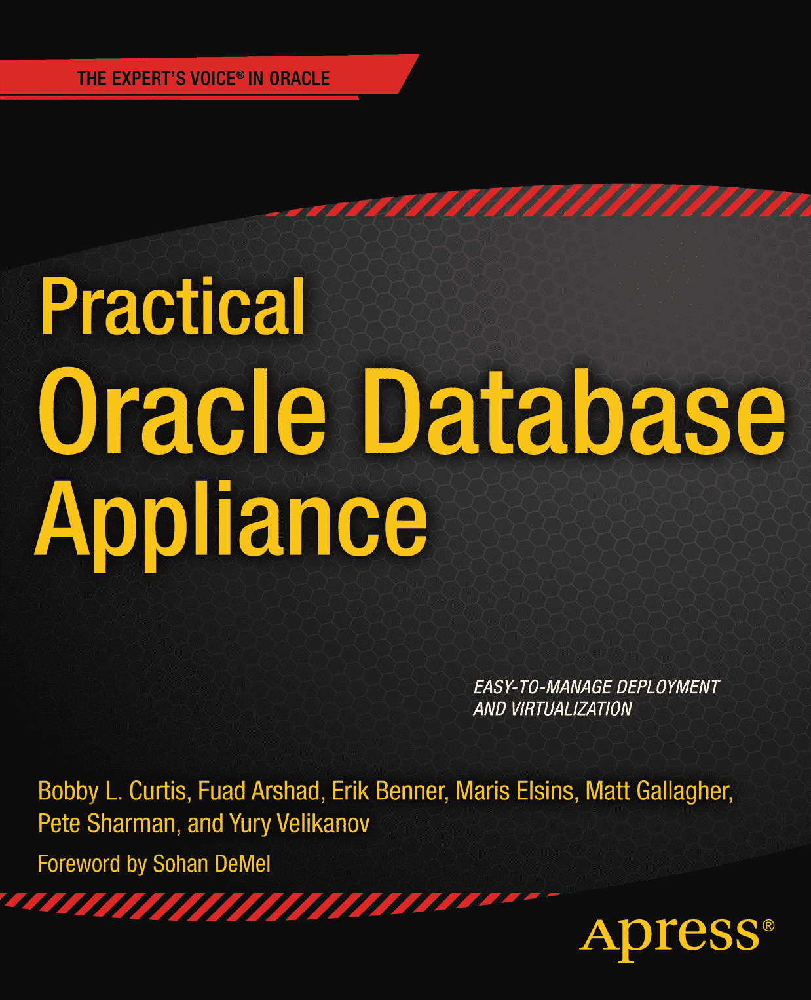

Bobby Curtis, Fuad Arshad, Erik Benner, Maris Elsins, Matt Gallagher, Pete Sharman and Yury Velikanov《Oracle 数据库一体机实战》10.1007/978-1-4302-6266-4© Apress 2014 Bobby Curtis, Fuad Arshad, Erik Benner, Maris Elsins, Matt Gallagher, Pete Sharman and Yury Velikanov 《Oracle 数据库一体机实战》

ISBN 978-1-4302-6265-7e-ISBN 978-1-4302-6266-4 © Apress 2014 《Oracle 数据库一体机实战》
总裁兼出版人：Paul Manning
主编：Jonathan Gennick
技术审阅：Frits Hoogland
编辑委员会：Steve Anglin, Mark Beckner, Ewan Buckingham, Gary Cornell, Louise Corrigan, James T. DeWolf, Jonathan Gennick, Jonathan Hassell, Robert Hutchinson, Michelle Lowman, James Markham, Matthew Moodie, Jeff Olson, Jeffrey Pepper, Douglas Pundick, Ben Renow-Clarke, Dominic Shakeshaft, Gwenan Spearing, Matt Wade, Steve Weiss
协调编辑：Anamika Panchoo
文案编辑：Kimberly Burton-Weismann
排版：SPi Global
索引：SPi Global
美术：SPi Global
封面设计：Anna Ishchenko
本书全球发行由 Springer Science+Business Media New York 负责，地址：233 Spring Street, 6th Floor, New York, NY 10013。电话 1-800-SPRINGER，传真 (201) 348-4505，电子邮件 `orders-ny@springer-sbm.com`，或访问 [`www.springeronline.com`](http://www.springeronline.com/)。Apress Media, LLC 是一家加利福尼亚州有限责任公司，其唯一成员（所有者）是 Springer Science + Business Media Finance Inc (SSBM Finance Inc)。SSBM Finance Inc 是一家特拉华州公司。有关翻译信息，请发送电子邮件至 `rights@apress.com`，或访问 [`www.apress.com`](http://www.apress.com/)。Apress 和 friends of ED 的图书可批量购买用于学术、企业或推广用途。大多数图书也提供电子书版本和许可。更多信息，请参考我们的批量销售-电子书许可专页 [`www.apress.com/bulk-sales`](http://www.apress.com/bulk-sales)。作者在文中引用的任何源代码或其他补充材料，读者可在 [`www.apress.com`](http://www.apress.com/) 获取。有关如何查找图书源代码的详细信息，请访问 [`www.apress.com/source-code/`](http://www.apress.com/source-code/)。本作品受版权保护。出版者保留所有权利，无论涉及材料的全部或部分，特别是翻译、转载、插图重用、朗诵、广播、微缩胶片或其他任何物理方式的复制，以及信息存储和检索、电子改编、计算机软件，或目前已知或未来开发的类似或不同方法。对于与评论或学术分析相关的简短摘录，或专门为在计算机系统上输入和执行而提供的材料（仅供作品购买者专用），不受此法律保留的限制。仅允许根据出版者所在地现行《版权法》的规定复制本出版物或其部分内容，使用许可必须始终从 Springer 获取。可通过版权许可中心的 RightsLink 获取使用许可。违反行为将根据相应的《版权法》追究责任。书中可能出现商标名称、标识和图像。我们并非每次出现商标名称、标识或图像时都使用商标符号，而是仅以编辑方式并为了商标所有者的利益使用这些名称、标识和图像，无商标侵权意图。本出版物中使用的商品名称、商标、服务标志和类似术语，即使未明确标识，也不应被视为表达意见，认为它们是否受专有权保护。尽管本书中的建议和信息在出版时被认为是真实准确的，但作者、编辑或出版者均不承担因可能存在的错误或遗漏而产生的任何法律责任。出版者对本出版物所含材料不作任何明示或暗示的保证。此为献词。前言

