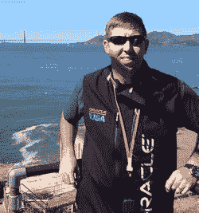
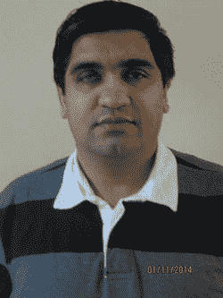
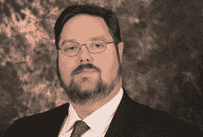
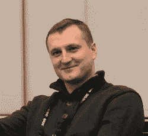
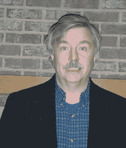
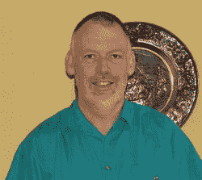
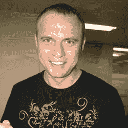
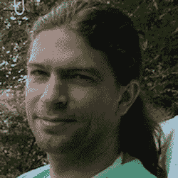

# Oracle 数据库一体机（ODA）是如何诞生的？

这是个好问题，我很乐意分享一些关于这台一体机背后的历史、动机和思考过程。

Oracle 的真正应用集群（`RAC`）开发团队一直致力于让 `RAC` 成为一种更广泛被采用的技术。在第一个十年（2001 年至 2011 年）中，Oracle `RAC` 在市场上获得了快速的采纳和增长，但许多中端市场客户出于对其复杂性和成本的认知而避开了 `RAC`。虽然 `RAC` 在大型企业环境中很常见并被广泛接受，但 Oracle 的中端市场客户却没有一个简单且负担得起的 `RAC` 数据库解决方案。

2010 年初，Oracle 收购了 Sun Microsystems，一个充满可能性的新世界由此打开。Sun 拥有一套尚未商业化的“箱中集群”硬件系统。它在极具吸引力的 4U 尺寸规格中集成了服务器、存储和网络。该系统被证明是部署 `RAC` 的最简单方式。借助它，我们能够在 `55 分钟`内部署好 `RAC`！

灵光乍现。这个“箱中集群”正是实现我们“**大众化的 RAC**”梦想的答案。我们开发了 `Appliance Manager` 软件来简化和自动化部署、补丁和存储管理。该软件与一体机相结合，使得 `RAC` 的实现变得极其简单。`ODA` 便由此诞生。

我们面临的下一个挑战是成本。如果软件费用高得离谱，廉价的硬件又有什么用？为了让我们的“箱中 RAC”解决方案对中端市场客户具有吸引力，我们必须克服这个挑战。集群硬件和 `RAC` 数据库软件能否以低于 10 万美元的价格购买和部署？在 Oracle 高层管理的支持下，`ODA` 成为了 Oracle 首个按需扩容系统。换句话说，客户可以以较低的价格入门，然后随着需求的增长，再开启更多内核并添加许可功能。正是这种方法使得低于 10 万美元的 Oracle `RAC` 系统成为现实可能。

早期的客户对 `ODA` 的简洁性赞不绝口。许多 `RAC` 的怀疑者转变了看法。一些客户将 `ODA` 采纳为标准。但正如通常发生的那样，客户很快就想要更多！随着 `ODA` 的每一代更新，CPU、内存和存储容量都在增长。客户还希望将他们的应用程序也放入 `ODA` 中。这就是我们构建 `ODA` 虚拟化平台的原因。数据库可以在其自己的虚拟机（`VM`）中运行，而客户应用程序可以在它们自己的 `VM` 中运行。客户可以按层为他们所使用的内容付费，并拥有完整的应用与数据库隔离安全性。“盒中解决方案”的概念由此诞生。人们开始将 `ODA` 视为现代版的 `AS/400`。

Fuad Arshad 是本书的作者之一，我很荣幸能在这里说几句关于他的话。我第一次见到 Fuad 时，他是我的客户。那是一个下午，Fuad 端到端部署了四台 `ODA`，并在所有机器上运行了 Oracle `RAC`。他简直不敢相信。他明白，他在一个下午完成的事情，他的组织之前需要花费数月时间。他明白，这是部署 Oracle 和 `RAC` 的一种范式转变。对他和他的组织而言，这改变了游戏规则，请求不断涌向他：“请给我也来一台 `ODA`？”。

Fuad 和他的队友们以一种我在客户中很少见的热情追随着 `ODA`。Fuad 迅速成为该技术方面知识最渊博的人之一，也是我们最有价值的客户反馈资源。他测试了所有与 `ODA` 相关的东西。他为此写博客。他在用户大会上发言。Fuad 的热情驱使他去写一本充满他激情的主题。他的合著者们也是如此。我祝愿他们一切顺利，并祝他们的书取得圆满成功。

Sohan DeMel
产品战略与业务发展副总裁
Oracle 公司

## 关于作者

 **Bobby L. Curtis, MBA**，在信息技术领域拥有 18 年经验，其中 12 年使用 Oracle 产品。他专注于数据库监控和数据集成技术，旨在使可用性更简单、更轻松。目前，他作为高级技术顾问工作，专注于可扩展数据库的实施和迁移，同时为这些环境提供监控解决方案。Bobby 是独立 Oracle 用户组（`IOUG`）、Oracle 开发工具用户组（`ODTUG`）、佐治亚 Oracle 用户组（`GOUSER`）和落基山脉 Oracle 用户组（`RMOUG`）的成员。他与妻子和三个孩子居住在佐治亚州道格拉斯维尔。Bobby 正在 Enkitec（[`www.enkitec.com`](http://www.enkitec.com/)）磨练他的技术技能。可以通过 Twitter `@dbasolved` 和他的博客 [`http://dbasolved.com`](http://dbasolved.com/) 关注他。

 **Fuad Arshad** 是一名高级数据库架构师，拥有超过 16 年的 Oracle 数据库技术工作经验。他拥有 Oracle 数据库各个方面的经验，从管理到调优，并且是 Oracle 认证专家。他经常在 [`http://www.fuadarshad.com`](http://www.fuadarshad.com/#_new) 上撰写关于 Oracle 的博客。Fuad 参与在线论坛和社交媒体。他是一位活跃的 Twitter 用户，你可以在 [`http://www.twitter.com/fuadar`](http://www.twitter.com/fuadar#_new) 找到他。Fuad 曾在 Collaborate 和 Oracle OpenWorld 等会议上发表演讲，主题涵盖 Oracle 真正应用集群到 Oracle 数据库一体机。Fuad 目前在 Oracle 公司的北美销售组织工作。他是 Saba 的丈夫，也是 Areej 和 Ammaar 的父亲，他努力将所有与 Oracle 无关的时间都花在家人身上。

 **Erik Benner** 是 BIAS Corp. 的解决方案架构师，专注于满足客户需求的解决方案。Erik 在 Oracle 数据库一体机正式发布前就已开始使用，并持续探索如何将该技术不仅用作数据库服务器，在虚拟化时还用作应用系统。Erik 是 Oracle 活动中的常见演讲者，专注于 Oracle 数据库一体机、Linux 和虚拟化领域。工作之余，Erik 喜欢与家人在他们的天文台共度时光，那里的望远镜比人还多。

 **Maris Elsins** 是一位经验丰富的 Oracle 应用 DBA，目前在 The Pythian Group 担任团队技术主管。他的主要专业领域是 Oracle 数据库和电子商务套件系统的故障排除和性能调优。Maris 曾领导或参与过众多 Oracle 电子商务套件实施、维护、迁移和升级项目。他是一位博主，也是 UKOUG、Collaborate 等 Oracle 相关会议的常客。Maris 是 Oracle 认证大师，并持有多个 Oracle 认证专家证书。他也是拉脱维亚 Oracle 用户组董事会成员。

 **Matt Gallagher** 是一家主要财富 500 强公司的首席数据库架构师。他拥有 17 年的 Oracle 经验。他专注于开发企业级数据库管理和架构解决方案。Matt 的经验涵盖 Oracle 数据库一体机、Exadata、Oracle `RAC`、Data Guard 和 `ASM`。他为各种数据库需求开发了解决方案，包括高可用性、事务处理和决策支持系统。

 Pete Sharman（皮特·沙曼）是 Oracle 公司服务器技术部门企业经理产品套件组的**高级产品经理**。他在 Oracle 工作了 18 年，担任过多种职位，从教育到咨询再到开发，并从 0.76 beta 版开始就使用企业经理。Pete 是 OakTable Network 的成员，并在世界各地的会议上发表过演讲，包括 Oracle OpenWorld（澳大利亚和美国）、RMOUG Training Days、Hotsos Conference、Miracle Open World 以及 AUSOUG 和 NZOUG 会议。他撰写了一本关于如何通过 Oracle Certified Professional 计划的 Oracle8i 数据库管理考试的书籍。他与妻子和三个孩子住在澳大利亚堪培拉。

 Yury Velikanov（尤里·韦利卡诺夫）拥有超过 15 年的 Oracle DBA 经验。他是 9i/10g/11g 版本的 Oracle 认证大师。因其对 Oracle 社区的参与，他被认可为 Oracle ACE 总监。在过去的几年里，Yury 一直参与`Oracle Database Appliance`项目。他很乐于在这本书中与您分享他的经验。

## 关于技术审校者

 Frits Hoogland（弗里茨·霍格兰）是一位专注于 Oracle 数据库性能和内核的 IT 专业人士。Frits 经常在世界各地的会议上就 Oracle 技术主题发表演讲。2009 年，他获得了 Oracle 技术网络颁发的 Oracle ACE 奖，一年后成为 Oracle ACE 总监。2010 年，他加入了 OakTable Network。除了发展他的 Oracle 专长外，Frits 还从事 MySQL、PostgreSQL 和现代操作系统方面的工作。Frits 目前就职于 Enkitec LP。

