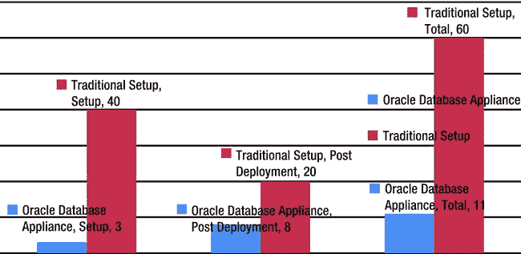
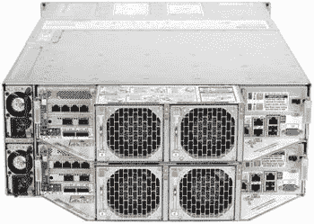
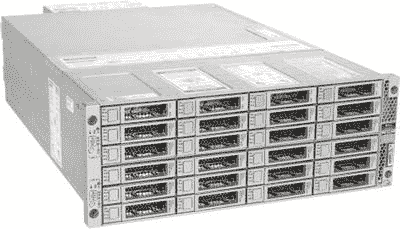
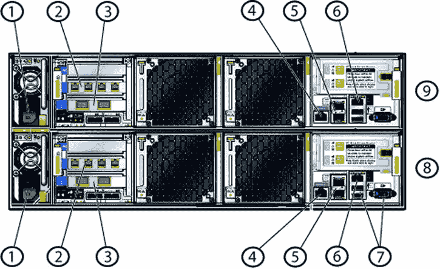
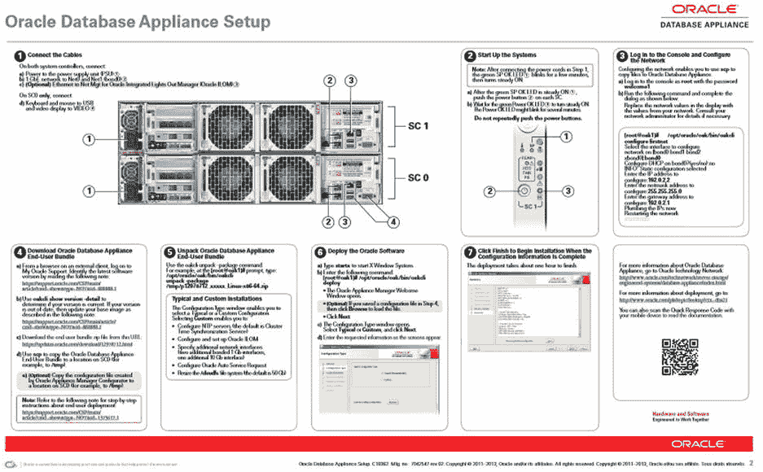
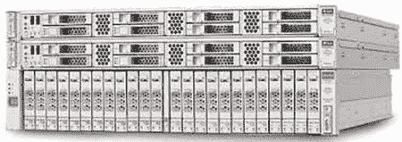
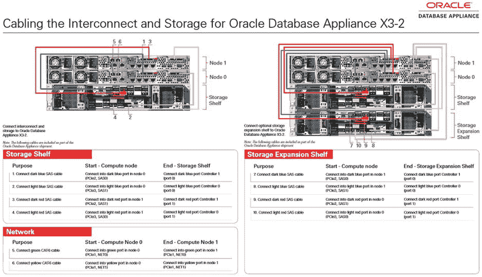
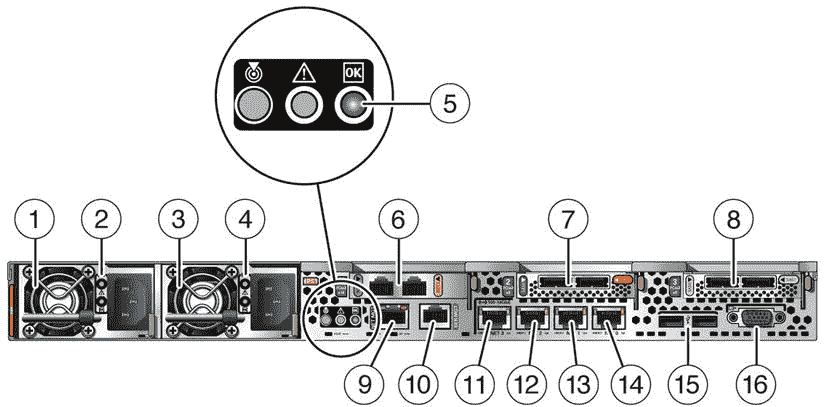
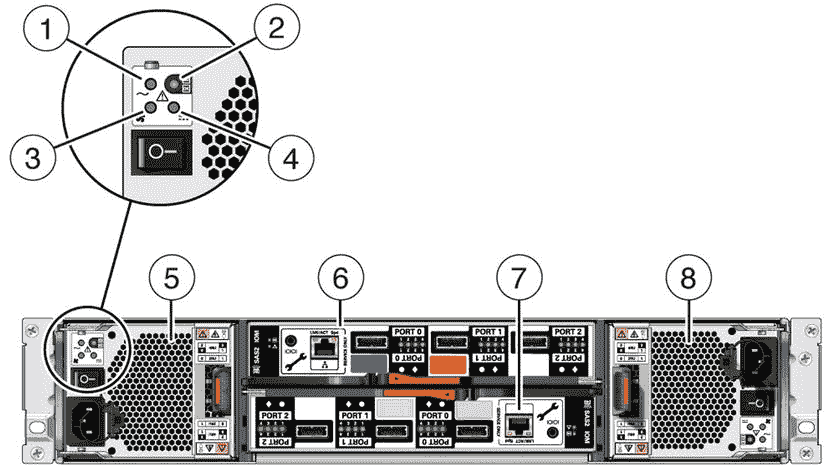

# 1. Oracle 数据库一体机

摘要

`Oracle 数据库一体机（ODA）`是 Oracle 集成系统产品家族的新成员。它旨在作为一款入门级一体机，提供无痛的`Oracle 数据库`实施体验。`ODA`实施方案通过提供一条更简便的途径来部署高可用数据库解决方案——该方案结合使用`Oracle 数据库`企业版与`Oracle 坚不可摧 Linux（OEL）`并在两个节点上集群——从而节省时间和金钱。

`Oracle 数据库一体机（ODA）`是 Oracle 集成系统产品家族的新成员。它旨在作为一款入门级一体机，提供无痛的`Oracle 数据库`实施体验。`ODA`实施方案通过提供一条更简便的途径来部署高可用数据库解决方案——该方案结合使用`Oracle 数据库`企业版与`Oracle 坚不可摧 Linux（OEL）`并在两个节点上集群——从而节省时间和金钱。

### 为何需要一体机？

传统的硬件部署可能需要数周甚至数月才能完成，具体取决于公司采用的采购和部署模式。`Oracle 数据库`版本的升级也可能是一个挑战，因为每个硬件/软件组合都需要在各个级别进行认证，以确保升级顺利进行。

在我们审视集成系统时，理解`Oracle 数据库`的演进过程至关重要。`Oracle`在其`Oracle 数据库`产品的演进过程中融入了多种增强功能。在其发展过程中，软件的复杂性也增加了。从`Oracle V4`中一个非常简单的关系数据库管理系统（`RDBMS`），到作为`V9`一部分重新引入的`Oracle 真正应用集群`，`Oracle`彻底改变了`RDBMS`和集群件领域。

由于`Oracle 数据库`产品线的增强功能，数据库管理员（`DBA`）的角色也随之演进。职责范围扩大了，与多个目标各异的基础架构团队进行协调的需求也增加了。随着`Oracle`推出数据库版本`10`和`11`，`DBA`的工作变得更加复杂，尤其是在增加了`自动存储管理（ASM）`和`网格基础架构（GI）`之后。`DBA`现在负责卷管理，并确保基础架构的所有方面都满足`Oracle`技术栈的要求。

复杂性自有其风险，随着组件数量的增加，问题解决时间也大大增加。如果未对基础架构的所有方面进行充分适当的评估，硬件和平台的虚拟化也可能使情况变得更糟。为确保完全合规所需的基础架构和软件成本对组织来说可能非常高昂，而无意中更新基础架构某个部件的固件可能会导致其他基础架构或软件方面出现混乱。

当我们谈论基础架构和软件的进步时，人为因素非常重要。`DBA`们已经看到他们的职责随着`Oracle 数据库`技术栈的每个版本发布而增加。现在，他们需要理解`RDBMS`、基础架构、操作系统（`OS`）和网络等所有方面，以便为客户提供全面且无缺陷的解决方案。交付这样的解决方案需要与各个基础架构团队进行广泛协调，并且可能需要昂贵的升级或采购。

`ODA`是一款入门级一体机，旨在帮助进行基础架构和软件部署以及升级。它作为一个完整的、打包的解决方案推出，面向中小型企业以及大型企业，用于快速部署硬件和软件。`ODA`在`Oracle OpenWorld 2011`上推出，第二个版本`X3-2`于`2013`年`4`月开始发货。`ODA`是首款支持按需付费许可的一体机。它允许客户根据需要从少至`2`个核心开始，并可扩展至`32`个核心（`X3-2`）。管理和构建成本显著降低，因为`ODA`预配置了互联网络和存储，以及一个经过调优的操作系统（`OS`）。`ODA`还包含对一体机进行虚拟化的选项，通过提供一个用于虚拟化应用程序和数据库的完整打包解决方案，可以为组织节省大量成本。

企业和组织常常面临截止日期的压力，而采用包含采购作为项目预算一部分的传统部署模式，通常很难提供业务快速实现创意所需的敏捷性。典型的部署周期可能在`30`到`90`天之间，这使得需要数据库的产品更难快速推向市场。图 1-1 基于`Oracle 真正应用集群（RAC）`的部署经验，展示了传统系统与使用`ODA`的典型部署周期对比。这可能因组织的部署成熟度模型而异。


图 1-1. 传统服务器与搭载 RAC 的 ODA 对比

传统设置与`ODA`设置之间的差异巨大。差异可能基于组织实践的流程而不同。传统上，部署硬件的过程包括以下步骤：

硬件采购
硬件交付
硬件设置
网络连接和交换机设置
操作系统（`OS`）设置和调优
数据库软件设置
设置后的最佳实践实施

这些步骤只是让系统启动和运行所需的众多步骤中的一部分，并且可能因组织使用的基础架构模型而异。组织始终有能力预先购买和配置基础架构，以及构建共享模型来支持业务。这在某些情况下可能具有成本效益，但也可能带来问题，因为持续理解新的业务需求是必须的。业务需求根据可用性模型驱动基础架构的复杂性。需求可能推动需要准备一个能够支持各种业务计划并提供按需框架的环境，以实现更快的配置。`ODA`可以作为基于私有云框架或简单配置模型的推动者。

`ODA`独特的许可模式，以及开箱即用的虚拟化能力，可以帮助组织构建一个可扩展的模型，以一小部分的时间和成本部署应用程序和数据库。`ODA`作为一个完整的软件包提供，这意味着`Oracle`对所有组件负责。这使组织能够专注于业务而非技术，并解放`DBA`的时间，让他们专注于设计而非设置和协调。传统的`ODA`部署工作包括以下内容：

采购硬件
安装硬件
设置数据库一体机
实施组织最佳实践

实施`ODA`所需的步骤远少于传统设置，因为`Oracle`将硬件和软件捆绑为一个单元，并允许将技术栈作为一个整体进行管理和维护，这与传统基础架构的管理方式不同。

### 一体机硬件

`ODA`以“简单、可靠、实惠”作为市场宣传语。目前，它提供两种硬件配置：原始版本和`ODA X3-2`。作为`Oracle`“硬件、软件、一体化”战略的一部分，`ODA`提供了一个简单的集群，包括两个数据库服务器节点、存储，以及内建于一体机本身的集群互联和简化管理。

### Oracle Database Appliance V1

迄今为止，Oracle 已出货超过 1,000 台 Oracle Database Appliance。[¹] 原始的 ODA 是一个完整的统一机箱解决方案，包含两台 2U Sun M4370 服务器，以及存储和网络组件。ODA V1 在数据中心机架中的总大小为 4U。图 1-2 和 1-3 分别展示了该设备的正面和背面，突出了 ODA 设计的简洁性。


**图 1-3.** Oracle Database Appliance V1 背面


**图 1-2.** Oracle Database Appliance V1 正面

#### 硬件规格

每个 ODA 单元由两个物理服务器组成，每个物理服务器由一个服务器节点和一个集成式远程管理（ILOM）组件构成。第 2 章 深入探讨了 ILOM 并解释了其在 ODA 单元中的重要性。表 1-1 列出了 Oracle Database Appliance 数据表中 ODA V1 的规格（My Oracle Support Note 1385831.1 提供了相同的信息）。

**表 1-1.** Oracle Database Appliance V1 规格

| 组件 | 规格 |
| --- | --- |
| CPU | 2x 6 核 Intel Xeon X5675 3.07GHz |
| 内存 | 96GB RAM (12 x DDR3-1333 8GB DIMMs) |
| 网络 | 2x 10GbE (SFP+) PCIe 卡<br>6x 1GbE PCIe 卡<br>2x 1GbE (Intel 82571) 板载集成冗余集群互联 |
| 内部存储 | 2x 500GB SATA - 用于操作系统<br>1x 4GB USB 内部 |
| RAID 控制器 | 2x LSI SAS9211-8i SAS HBA |
| 共享存储 | 20x 600GB - 3.5" SAS 15k RPM HDD (Seagate Cheetah) - 用于 RDBMS DATA（除磁盘顶行外的任何插槽）<br>4x 73GB - 3.5" SAS2 SSDs - 用于 RDBMS REDO（顶行四个磁盘的插槽）<br>SSD 来自 STEC (ZeusIOPS - 多层单元 (MLC) 版本，SAS 接口) |
| 操作系统 | Oracle Enterprise Linux 5.5 (在 ODA 软件版本 2.1 上)，5.8 (在 ODA 软件版本 2.2 上) x86_64 |

ODA 配备了功能非常强大的 Intel Xeon 处理器，以及足够的内存和存储空间，可以容纳各种在线事务处理（OLTP）和一些较小的数据仓库工作负载。网络互联内置于设备中，这消除了为节点间通信互联购买交换机的需求。在存储方面，根据 ODA 软件版本和冗余层级，你可以在 4 到 6 太字节（TB）的空间之间选择。

#### 存储配置

每个 ODA 每个服务器节点附带两个 500GB 驱动器，它们被镜像并用于操作系统，以及承载操作系统、集群件和 Oracle Database 主目录的软件（250GB 未分配）。每个设备有二十个 600GB SAS 驱动器和四个仅用于在线重做日志的 73GB SSD。ODA 上的共享磁盘通过两个 LSI 控制器连接，这些控制器连接到板载 SAS 扩展器。每个 SAS 扩展器又连接到 ODA 中的 12 个硬盘。Oracle 使用 Linux 多路径来避免磁盘路径故障。添加固态硬盘（SSD）用于重做日志是为了克服旋转磁盘的延迟，因为旋转磁盘的控制器没有缓存。ODA 上的磁盘大小取决于许多因素，包括在设备上运行的 ODA 软件版本。表 1-2 显示了 ODA 上支持的各种磁盘配置和配置选项。

**表 1-2.** ODA 磁盘配置

| 配置选项 | 磁盘组 | 类型/冗余 | 备份类型 | 可用空间 (GB) | 支持的软件版本 |
| --- | --- | --- | --- | --- | --- |
| 1 | DATA | HIGH | 外部 | 3200 | 所有版本 |
| 1 | RECO | HIGH | 外部 | 488 | 所有版本 |
| 1 | REDO | HIGH | 无 | 91 | 所有版本 |
| 2 | DATA | HIGH | 本地 | 1600 | 所有版本 |
| 2 | RECO | HIGH | 本地 | 2088 | 所有版本 |
| 2 | REDO | HIGH | 无 | 91 | 所有版本 |
| 3 | DATA | NORMAL | 外部 | 4800 | 2.4 及以上 |
| 3 | RECO | NORMAL | 外部 | 733 | 2.4 及以上 |
| 3 | REDO | HIGH | 外部 | 91 | 2.4 及以上 |
| 4 | DATA | NORMAL | 本地 | 2400 | 2.4 及以上 |
| 4 | RECO | NORMAL | 本地 | 3133 | 2.4 及以上 |
| 4 | REDO | NORMAL | 无 | 91 | 2.4 及以上 |

表 1-2 说明了 ODA 支持的各种磁盘配置选项。如你所见，在配置选项 1 和 2 中，由于所有磁盘组都是三重镜像（高冗余），可用空间大约为 4TB。根据你选择的配置，你将在 DATA 或 RECO 磁盘组中拥有更多空间。

Oracle Database Appliance 2.4 引入了允许 DATA 和 RECO 使用镜像（正常冗余）磁盘组的选项。这在表 1-2 中突出显示为配置选项 3 和 4。这样做主要是为了让客户能够根据部署 ODA 的环境选择空间。通常建议在开发/测试系统上部署镜像（正常冗余）。

#### 操作系统与软件

ODA 运行 Oracle Enterprise Linux 操作系统，截至软件版本 2.2，仅支持不可变企业内核（UEK）。以下是 ODA 软件版本 2.6 的快照：

```
Linux oda01 2.6.32-300.32.5.el5uek #1 SMP Wed Oct 31 22:06:21 PDT 2012 x86_64 x86_64 x86_64 GNU/Linux
Enterprise Linux Enterprise Linux Server release 5.8 (Carthage)
```

#### 连接与设置

从外部看 ODA 机箱，需要进行许多连接。图 1-4 指出了各种连接，这些连接随后在表 1-3 中描述。Oracle 还提供了一个简单的设置方案。设置海报如图 1-5 所示。

**表 1-3.** Oracle Database Appliance 连接器描述[²]

| 标注 | 标签 | 以太网 | 绑定 | 描述 |
| --- | --- | --- | --- | --- |
| 1 |   |   |   | 电源连接器。 |
| 2 | PCIe 1 | `Eth 7`, `Eth 6`, `Eth 5`, `Eth 4` (从左到右) | `bond1`, `bond2` | `Eth 4` 和 `Eth 5` 配置为 `bond1`。`Eth 6` 和 `Eth 7` 配置为 `bond2`。这些端口用于自定义配置或用于单独的备份、灾难恢复和网络管理。 |
| 3 | PCIe 0 | `Eth 8`, `Eth 9` | `xbond0` | 两个 10 GbE 端口。在 10 GbE 系统中，这些连接到公共网络。 |
| 4 | SerMgt |   |   | 用于 Oracle ILOM 和系统控制台的串行连接器。 |
| 5 | `Net 0`, `Net 1` | `Eth2`, `Eth3` | `bond0` | 两个 1 GbE 连接器。在 1 GbE 系统中，这些连接到公共网络。 |
| 6 | NetMgt |   |   | 用于 Oracle ILOM 的以太网连接。 |
| 7 | USB 和视频 |   |   | 用于连接系统控制台。 |
| 8 |   |   |   | 服务器节点 0。 |
| 9 |   |   |   | 服务器节点 1。 |


**图 1-4.** Oracle Database Appliance V1 连接标注

[¹]: 文中引用标记，指向原始文档的脚注。
[²]: 文中引用标记，指向原始文档的脚注。


ODA 安装海报是一种简单易懂的设备安装和设置方法。该海报是一个逐步指南，解释了如何连接线缆以部署软件，从而得到一个功能完整的集群数据库服务器。图 1-5 对此进行了详细展示。Oracle 会为每个发布版本更新此海报。海报可在 ODA 文档网站上获取：[`http://docs.oracle.com/cd/E22693_01`](http://docs.oracle.com/cd/E22693_01)。



图 1-5. ODA V1 安装海报³

ODA 配备了完全冗余的硬件，包括两个 10 吉比特以太网（GbE）接口，它们通过 Linux 操作系统绑定在一起以提供冗余；此外还有两个 3×2 的 1GbE 接口，同样为了冗余目的而绑定在一起。设备上有一个用于 ILOM（集成 Lights Out Manager）的接口，以及用于连接键盘和外置显示器的 USB 和 VGA 接口（如果需要）。

ODA 的独特之处在于它板载了一个用于连接两个数据库服务器的互连网络。该互连网络是 1GbE，使用 Intel 82571 板卡；它没有被绑定。这就是为什么从集群 ware（Clusterware）中可以看到两个集群互连，对应两个 HAIP 设备。由于这些私有互连是设备内部的，因此不需要外部布线。

ODA 由 `Oracle Appliance Kit (OAK)` 管理，这是一套专有的软件，专用于 ODA。`OAK` 以及各种 ODA 软件功能将在后续章节中讨论。虚拟化作为一项可选功能被添加到 ODA 平台中，同样会在后续章节中探讨。

### Oracle Database Appliance X3-2

ODA X3-2 是 ODA 设备的第二代产品。它拥有许多新功能，且容量比其前代产品更大。图 1-6 展示了该设备的正面视图。

Oracle Database Appliance X3-2 扩展了 ODA V1 的功能，在硬件和存储能力方面表现出色。Oracle 在 X3-2 的硬件架构上采取了略有不同的方法。服务器节点和存储机架现在是两个独立的单元，它们连接在一起，并且可以选择添加一个扩展存储机架，使设备的存储容量翻倍。



图 1-6. Oracle Database Appliance X3-2

X3-2 比第一代设备在结构上更具模块化，提供了灵活性。客户能够通过添加额外的存储机架来扩展存储。他们可以在数据中心分别放置存储机架和服务器节点机架；不过，我们建议将这些组件安装在一起。

X3-2 仍然是一个 4U 的机架可安装单元，但它被划分为两个独立的 2U 单元。服务器单元各为 1U，存储单元也为 2U。如果选择了扩展机架，将为系统再增加 2U 空间。表 1-4 列出了 X3-2 机箱的完整规格，但简而言之，该机箱的特色是 `Intel Xeon E5-2690` 处理器、256GB 内存、两个 10GbE 外部铜缆连接以及两个 10GbE 内部网络互连。还包括共享的串行连接 SCSI (SAS) 磁盘。内部磁盘现在是 600GB，高于 V1 中的 500GB 配置。

表 1-4. Oracle Database Appliance X3-2 规格

| 组件 | 规格 |
| --- | --- |
| CPU | 两个 8 核 Intel® Xeon® 处理器 E5-2690 |
| 内存 | 256GB（16 个 16GB RDIMM，1600 MHz） |
| 网络 | 四个 100/1000/10G Base-T 以太网端口（板载）<br>1 个双端口 10GBase-T 互连，用于集群通信 |
| 内部存储 | 两个 2.5 英寸 600GB 10K rpm SAS-2 HDD（镜像）操作系统 |
| RAID 控制器 | 1 个双端口内部 SAS-2 HBA<br>2 个双端口外部 SAS-2 HBA |
| 共享存储 | 二十个 2.5 英寸 900GB 10K rpm SAS-2 HDD<br>每个机架四个 2.5 英寸 200GB SAS-2 SLC SSD，用于数据库重做日志<br>可选存储扩展：添加额外的存储机架可使存储容量翻倍<br>支持外部 NFS 存储 |
| 操作系统 | Oracle Enterprise Linux 5.8 x86_64 |

ODA X3-2 提供了非常详尽的规格参数。它是原始 ODA 的强大继任者。Oracle 在安装上增加了一点复杂性，以适应将存储机架与实际服务器单元分开的灵活性。这允许根据需要添加第二个机架，但现在您需要确保按照设备附带的安装海报正确布线。

与原始 ODA 一样，X3-2 的安装海报经过了增强，成为一个方便的资源，以帮助安装。图 1-7 显示了该海报，它会随着软件的每个版本进行更新。目前，安装海报包含了将 ODA 设置为裸机环境或虚拟化环境的说明。



图 1-7. Oracle Database Appliance X3-2 安装海报

如果您查看海报，会发现它建议了一种与原始设计有所偏离的方案，即服务器节点之间需要有连接和线缆，服务器节点到存储机架之间也需要线缆，并可选地连接到额外的存储机架。图 1-8 显示了服务器节点的外观。表 1-5 描述了图 1-8 中的标注说明。

表 1-5.


### ODA 服务器节点后部的标注说明

| 标注 | 图例 | 标注 | 图例 |
| --- | --- | --- | --- |
| 1 | 带风扇模块的电源 (PS) 0。 | 9 | `NetMgt` 端口。10/100BASE-T 端口，用于连接到 Oracle Integrated Lights Out Manager (Oracle ILOM) SP。 |
| 2 | 电源 (PS) 0 状态指示灯：`需要维护 LED`：琥珀色，`交流电源正常 LED`：绿色。 | 10 | 串行管理 (`SerMgt`) / RJ-45 串行端口。 |
| 3 | 带风扇模块的电源 (PS) 1。 | 11 | 网络 (`NET`) 100/1000/10000 Mbps Base-T 以太网 RJ-45 连接器：`NET 3`。 |
| 4 | 电源 (PS) 1 状态指示灯：`需要维护 LED`：琥珀色，`交流电源正常 LED`：绿色。 | 12 | 带 RJ-45 连接器的网络 (`NET`) 100/1000/10000 Mbps Base-T 以太网端口：`NET 2`。 |
| 5 | 系统状态指示灯：`定位器 LED`：白色，`需要维护 LED`：琥珀色，`电源/正常 LED`：绿色。 | 13 | 带 RJ-45 连接器的网络 (`NET`) 100/1000/10000 Mbps Base-T 以太网端口：`NET 1`。 |
| 6 | PCIe 卡插槽 1。提供两个带 RJ-45 连接器的 10GBase-T 以太网端口，用于服务器节点之间的专用互连。 | 14 | 带 RJ-45 连接器的网络 (`NET`) 100/1000/10000 Mbps Base-T 以太网端口：`NET 0`。 |
| 7 | PCIe 卡插槽 2。提供两个 SAS-2 连接器，用于将服务器连接到存储架和存储扩展架。 | 15 | USB 2.0 连接器 (2 个)。 |
| 8 | PCIe 卡插槽 3。提供两个 SAS-2 连接器，用于将服务器连接到存储架和存储扩展架。 |   |   |



**图 1-8.** Oracle Database X3-2 服务器节点后部

存储架是一个独立组件。您可以在图 1-9 中看到构成存储架的结构和组件。表 1-6 描述了各种标注。

**表 1-6.** Oracle Database Appliance 存储架标注说明

| 标注 | 图例 |
| --- | --- |
| 1 | 交流电源故障指示灯 |
| 2 | 电源状态指示灯 |
| 3 | 风扇故障指示灯 |
| 4 | 直流电源故障指示灯 |
| 5 | 带风扇模块 0 的电源 |
| 6 | I/O 模块 1 |
| 7 | I/O 模块 0 |
| 8 | 带风扇模块 1 的电源 |



**图 1-9.** Oracle Database Appliance X3-2 存储架

由于增加了存储架和大容量驱动器，Oracle Database Appliance X3-2 提供了比前代产品大得多的存储空间。其工作负载能力也得到了显著扩展，以适应各种数据集市样式的工作负载。

ODA X3-2 支持前面表 1-2 中展示的相同四种磁盘配置，但容量规划不同。表 1-7 概述了 X3-2 平台上可用的容量选项。

**表 1-7.** ODA X3-2 磁盘配置

| 配置选项 | 磁盘组 | 类型/冗余 | 备份类型 | 可用空间 (GB) | 带扩展架 (GB) |
| --- | --- | --- | --- | --- | --- |
| 1 | DATA | HIGH | 外部 | 4800 | 9600 |
| 1 | RECO | HIGH | 外部 | 733 | 1466 |
| 1 | REDO | HIGH | 无 | 248 | 496 |
| 2 | DATA | HIGH | 本地 | 2400 | 4800 |
| 2 | RECO | HIGH | 本地 | 3133 | 6266 |
| 2 | REDO | HIGH | 无 | 248 | 496 |
| 3 | DATA | NORMAL | 外部 | 7200 | 14400 |
| 3 | RECO | NORMAL | 外部 | 1100 | 2200 |
| 3 | REDO | HIGH | 外部 | 248 | 496 |
| 4 | DATA | NORMAL | 本地 | 3600 | 7200 |
| 4 | RECO | NORMAL | 本地 | 4700 | 9400 |
| 4 | REDO | NORMAL | 无 | 248 | 496 |

## 本章小结

本章探讨了 Oracle Database Appliance (ODA)——包括原始型号和 X3-2 型号。最初，ODA 面向中小型企业，但它在企业领域也越来越受欢迎。其一体化、全包式的架构以及按需扩容的功能是其备受赞誉的特点。部署和管理的简便性相比于传统的基础设施部署模式可节省成本。ODA 开箱即用地提供高可用性和冗余性，并将 Oracle 的最佳实践应用于系统。

脚注 1
Oracle，“全球客户借助 Oracle Database Appliance 简化数据库管理”， [`http://www.oracle.com/us/corporate/press/1940385`](http://www.oracle.com/us/corporate/press/1940385)，2013 年 4 月 29 日。
2
MOS 注释 1385831.1 的一部分。
3
Oracle，Oracle Database Appliance 文档， [`http://docs.oracle.com/cd/E22693_01/doc.21/e40077.pdf`](http://docs.oracle.com/cd/E22693_01/doc.21/e40077.pdf)。

