# 2. 集成式远程管理

摘要

Oracle Database Appliance (ODA) 是包含两个服务器节点的捆绑包，其中包括存储和嵌入式集群网络。每个服务器节点都有一个集成式远程管理器 (`ILOM`) 接口，用于管理和维护任务。本章将深入探讨什么是 `ILOM`，以及如何在数据库设备的环境中使用它。

Oracle Database Appliance (ODA) 是包含两个服务器节点的捆绑包，其中包括存储和嵌入式集群网络。每个服务器节点都有一个集成式远程管理器 (`ILOM`) 接口，用于管理和维护任务。本章将深入探讨什么是 `ILOM`，以及如何在数据库设备的环境中使用它。


## ILOM 简介

`ILOM` 是一个服务处理器（`SP`），嵌入在所有基于 Oracle Sun 服务器的产品中。`ILOM` 的目的是为服务器提供支持，使得日常支持功能无需访问数据中心。`ILOM` 还提供对各种诊断功能的访问，并与 Oracle 的自动服务请求（`ASR`）集成，以提供向 Oracle 报告硬件故障的呼叫-home 功能。

Oracle `ILOM` 服务处理器提供了广泛的功能，其功能方面随着 `ILOM` 的每个版本发布而改进。`ODA V1` 和 `X3-2` 配备了不同的 `ILOM` 版本，这是由于服务处理器本身的增强所致，但其核心，`ILOM` 允许以下操作：
*   远程 `KVMS` 功能
*   从镜像远程启动
*   故障显示
*   与各种身份验证系统的集成，如 `LDAP`（轻量目录访问协议）、`SSL`（安全套接字层）、`Radius` 和 Active Directory
*   远程 `syslog` 设置
*   基于 `SNMP` 和 `SMTP` 的警报
*   环境报告
*   系统串行控制台重定向（`LAN`）
*   远程监控主机状态
*   访问各种部件号和序列号

本章将在 `ODA` 的背景下重点介绍这些功能。Oracle 套件包（`OAK`），也称为 Oracle 套件管理器，是管理安装和补丁的软件，在某些情况下，还负责收集诊断信息并将 `ILOM` 与 `ASR` 集成。然而，理解 `ILOM` 及其执行的基本功能仍然很重要。

图 2-1 显示了通过浏览器登录 `ILOM` 时看到的起始屏幕。该屏幕有三个主要组件。其布局在设计上与 `ODA V1` 的布局有些不同，但大多数常见功能保持不变。

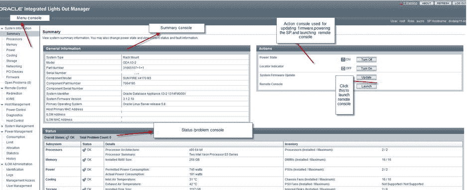

图 2-1.
在 `ODA X3-2` Sun Fire `X4170 M3` 上运行的 `ILOM`

"常规信息"部分是按服务器节点查看基本系统信息的主要位置，且以视觉上令人愉悦的方式呈现。您在那里可以找到的信息包括：
*   系统类型
*   型号
*   部件号
*   组件型号
*   `ILOM` 和系统 `MAC` 地址
*   主要操作系统

"操作"部分提供了对 `ILOM` 用户需要访问的各种常用功能的便捷访问。这些功能包括更新固件、打开或关闭服务器电源，以及通过切换电源状态的各种选项来回收服务处理器。您还可以打开定位信标，以便在数据中心中定位系统（`X3-2` 的新功能），并且可以使用远程控制台访问服务器节点。

"状态"部分提供对服务器节点内包含的组件物理状态的实时状态。"状态"部分查看以下内容：
*   处理器
*   内存
*   电源
*   散热
*   存储
*   网络

如图 2-1 所示的"摘要"屏幕信息丰富，可让您快速获取大量汇总信息。左侧的菜单部分允许获取每个组件的更详细信息。该菜单还包括用于设置和自定义 `ILOM` 的选项。

图 2-2 显示了来自原始数据库套件的摘要屏幕。如您所见，图 2-1 中的新界面提供了一种更简单的方式来查找信息，并且菜单导航更加直观。在接下来的章节中介绍这些功能时，我们将指出如何从两个 `ILOM` 访问各个位置。

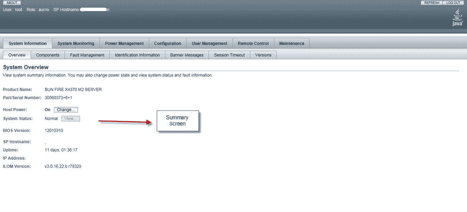

图 2-2.
来自原始 `ODA`（`V1 X4370 M2`）的 `ILOM`

## ILOM 功能

`ILOM` 能够提供大量的服务。查看 `ILOM` 及其所有功能超出了本书的范围，但我们将从管理 `ODA` 的角度研究一些重要的功能。

### 远程 KVMS 服务

远程 `KVMS`（键盘、视频、鼠标、存储）是 `ILOM` 中非常重要的一部分，根据您对设备远程访问的熟悉程度和经验，这可能是您将使用的主要功能。远程 `KVMS` 服务允许您从浏览器远程控制服务器节点。远程 `KVMS` 使用虚拟网络计算（`VNC`）访问服务器节点。因此，您应该确保在您的工作站上打开表 2-1 中所示的防火墙端口。

表 2-1.
`RKVMS` 访问所需的防火墙端口

| 端口 | 协议类型 | 服务 |
| --- | --- | --- |
| `443` | `TCP` | `HTTPS`（入站） |
| `5120` | `TCP` | 远程光驱（出站） |
| `5121` | `TCP` | 远程键盘和鼠标 |
| `5123` | `TCP` | 远程软驱 |
| `6577` | `TCP` | `CURI`（`API`）- `TCP` 和 `SSL` |
| `7578` | `TCP` | 视频数据（双向） |
| `161` | `UDP` | `SNMP V3` 访问（入站） |
| `3072` | `UDP` | 陷阱输出（仅出站） |

`ILOM` 的设置将在本章后面介绍，但一旦 `ILOM` 设置完毕，远程 `KVMS` 就允许访问服务器控制台。远程 `KVMS` 还允许远程安装，这是进行裸机服务器安装所必需的。远程控制功能的访问方式在 `ODA V1` 和 `X3-2` 之间略有不同，但两者在功能上提供相同的功能。

图 2-3 显示了 `ODA V1` 与 `ODA X3-2` 中远程控制功能位置的截取。`ODA X3-2` 上通过主屏幕更容易访问远程控制功能。相比之下，在 `ODA V1` 上需要点击几下才能进入远程控制功能。

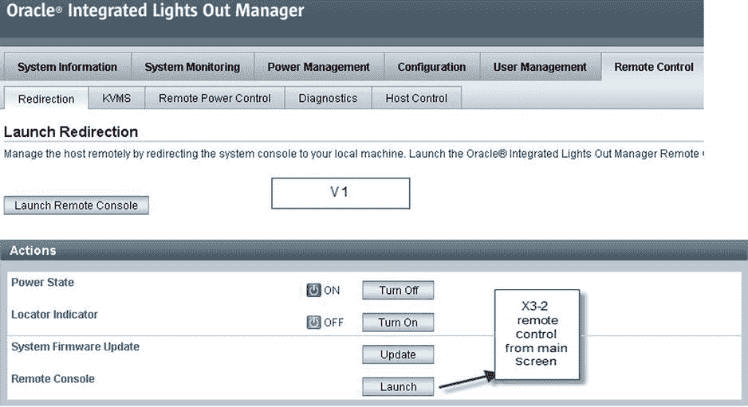

图 2-3.
`ODA V1`（顶部）和 `ODA X3-2`（底部）中的远程控制台选项

远程控制台是访问服务器控制台、配置服务器或诊断问题（如果无法远程连接到服务器本身）的简便方法。启动远程控制台后，您会看到类似于登录 `Unix` 机器时的登录提示。这允许您从控制台登录到服务器。

远程控制台提供对控制台消息的访问，并允许用户登录系统。每个服务器节点（`SN`）都有自己的 `ILOM`，因此在 `ODA` 的上下文中有两个 `ILOM`。这一点非常重要，因为 `ODA` 中的每个物理服务器都有自己的 `ILOM`，必须使用该 `ILOM` 来管理和维护该物理服务器。


### Integrated Lights Out Manager (ILOM) 管理

### 集成 Shell

ILOM 也可以通过集成到服务处理器中的 shell 来访问。该 shell 是访问和操作 ILOM 的一种便捷方式。ILOM shell 可通过多种方式访问，如下所示：

*   服务器节点上的 `NET MGT` 端口（串行连接）
*   通过 `TCP` 使用 `ipmitool` 的服务器节点
*   通过 `TCP` 直接 `SSH`（安全 Shell）进入 ILOM
*   通过 `LAN` 使用 `IPMITool`，本地或从任何支持 `ipmitool` 的设备访问

集成 shell 用于首次配置 ILOM。数据中心团队可以用它来准备 ODA 以进行配置。集成 shell 还用于执行基本功能，如更改 ILOM 密码、检查系统故障、获取控制台访问权限等。

集成 shell 可通过 `ipmitool` 命令访问。也可以在服务器节点上以及远程使用带有 `lanplus` 协议的 `ipmitool` 来访问。`ipmitool` 可通过 SP 管理硬件的主机访问（以 `root` 身份；Linux 中的 IPMI 设备只允许 `root` 访问）。例如：

```
### ipmitool sunoem cli
Connected. Use ^D to exit.
```

另一种连接到 SP 的方式是通过 `lanplus` 协议。这种方法可用于安装了 `ipmitool` 的远程机器。以下是一个示例：

```
[root@mxt101 ∼]# ipmitool -I lanplus -H <ilom hostname/address> -U <ilom username> -P <ilom user's password> sunoem cli
Connected. Use ^D to exit.
->
```

也可以通过原生 `SSH` 远程访问 ILOM。操作方法如下：

```
$ ssh <ilom username>@<ilom hostname/address>
Password:
Oracle(R) Integrated Lights Out Manager
Version 3.0.16.10.d r74499
Copyright (c) 2012, Oracle and/or its affiliates. All rights reserved.
->
```

ILOM 集成 shell 提供了相当丰富的命令集，并允许您直接从界面本身执行各种任务。表 2-2 列出了一些关键命令及其访问方式。

**表 2-2. 常用的 ILOM CLI 命令**

| ILOM CLI 命令 | 描述 |
| --- | --- |
| `show /SYS power_state fault_state` | 显示主机的 `power_state`（开或关）和故障状态。OK 表示无故障。如果 ILOM/SP 检测到故障，故障状态将不是 OK。 |
| `stop /SYS` | 以优雅方式停止主机。如果主机无响应或未关机，您可以通过添加 `-f` 强制停止主机。例如：`stop -f /SYS` |
| `start /SYS` | 启动主机。 |
| `show faulty` | 列出所有检测到的故障（如果有）。 |
| `start /SP/console` | 启动基于文本的控制台访问。 |
| `set /SP/users/root password=welcome1` | 为 ILOM 设置新密码。 |
| `set /SP/network pendingipdiscovery=static pendingipaddress=10.0.0.1 pendingipnetmask=255.255.255.0 pendingipgateway=10.0.0.255 commitpending=true` | 为 ILOM 配置网络。 |
| `reset /SP` | 重置 SP，这意味着主机和 SP 都将重新启动。 |
| `Show /SP/version` | 显示当前 SP 版本。 |

为了远程访问和执行这些命令，确保 ILOM 集成 shell 可访问且可用非常重要。我们在表 2-1 中讨论了远程 KVMS 所需的端口。您还应考虑表 2-3 中列出的端口。这些端口基于标准的 Oracle 默认设置，可以根据需求进行配置。

**表 2-3. 用于 ILOM 访问的端口**

| 端口 | 类型 | 描述 |
| --- | --- | --- |
| 22 | 基于 `TCP` 的 `SSH` | `SSH` - 安全 Shell（入站） |
| 69 | 基于 `UDP` 的 `TFTP` | `TFTP`（出站） |
| 80 | 基于 `TCP` 的 `HTTP` | Web（用户可配置；入站） |
| 123 | 基于 `UDP` 的 `NTP` | `NTP` - 网络时间协议（出站） |
| 161 | 基于 `UDP` 的 `SNMP` | `SNMP` - （用户可配置；入站） |
| 162 | 基于 `UDP` 的 `IPMI` | `IPMI` - 平台事件陷阱（`PET`）（出站） |
| 389 | 基于 `UDP/TCP` 的 `LDAP` | `LDAP`（用户可配置；出站） |
| 443 | 基于 `TCP` 的 `HTTPS` | （用户可配置；入站） |
| 514 | 基于 `UDP` 的 Syslog | Syslog - （出站） |
| 623 | 基于 `UDP` 的 `IPMI` | `IPMI`（双向） |
| 546 | 基于 `UDP` 的 `DHCP` | `DHCP`（双向） |
| 1812 | 基于 `UDP` 的 `RADIUS` | `RADIUS`（出站） |

## 安全管理

ILOM 允许账户管理并与多种流行的认证协议集成。详细讨论所有这些内容超出了本书的范围。在本节中，我们将了解 Active Directory 集成，并讨论如何在本地管理用户。

### 本地账户管理

ILOM 提供了一种安全的方式，通过本地验证的账户进行身份验证和执行日常功能。这是访问 ILOM 的默认身份验证方法。ILOM 账户管理允许管理员为各种功能配置账户。表 2-4 列出了用户可用的所有角色。

**表 2-4. 可用于 ILOM 身份验证的角色**

| 角色 | 描述 |
| --- | --- |
| `a` (管理员) | 完全的管理员权限 |
| `u` (用户) | 允许创建和删除用户以及配置身份验证服务 |
| `c` (控制台) | 访问允许进行 BIOS 更新的控制台功能 |
| `r` (重置) | 允许控制主机电源，以及对 SP 进行电源循环 |
| `o` (只读) | 允许对日志和环境信息进行只读访问 |

根据所选角色（管理员、操作员、高级角色），用户会被授予不同的权限。用户可以通过 ILOM GUI 或命令行创建。

图 2-4 及前面的命令行示例展示了可用于将用户添加到 ILOM 进行本地身份验证的各种方法。角色和权限分配以及用户删除也可以通过 GUI 或命令行完成，具体取决于您的熟练程度。

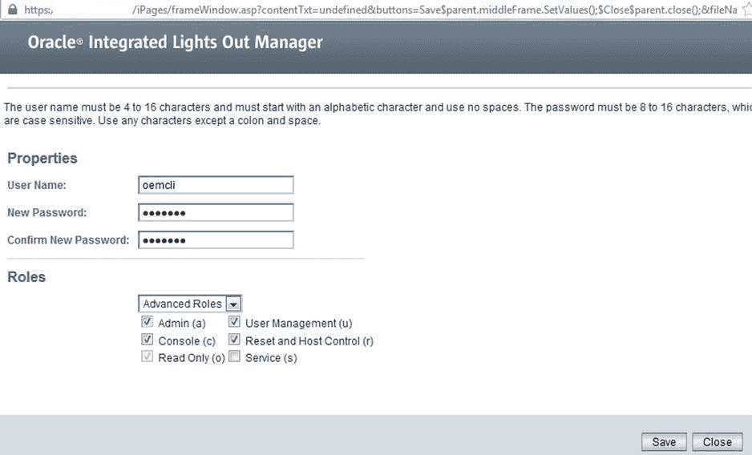

**图 2-4. 添加用户屏幕**

以下是一个创建名为 `rick` 的新用户的命令示例：

```
create /SP/users/rick password=my_secret role=administrator
```

创建用户后，您可以按如下方式修改用户角色：

```
set /SP/users/rick role=operator
```

您也可以删除该用户：

```
delete /SP/users/rick
```

了解可用的角色和权限并适当地分配它们，对于保护您的环境至关重要。同时，请务必在部署后立即更改默认的 ILOM root 密码。


### Oracle 数据库设备与 ILOM

### 告警与系统日志设置

日志记录是理解和调试问题的一种非常重要方式。Oracle ILOM 提供了多种传播日志信息的方法。系统日志默认是禁用的，但它是集中化日志记录的首选方式。也可以设置 SNMP 陷阱，以实现向远程系统的告警。

系统日志是一项需要启用和配置的 ILOM 服务。在 ILOM 上启用系统日志的过程是添加系统日志服务器的 IP 地址。图 2-5 和图 2-6 分别显示了 ODA V1 和 ODA X3-2 中可用的系统日志配置界面。该界面可用于配置 ILOM 以将数据发送到外部系统日志服务器。

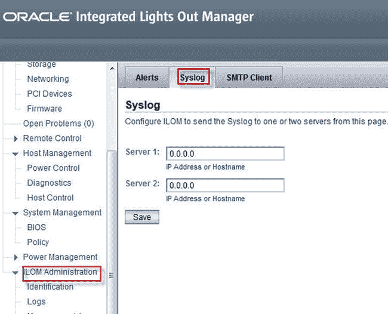

图. 2-6. ODA X3-2 系统日志设置

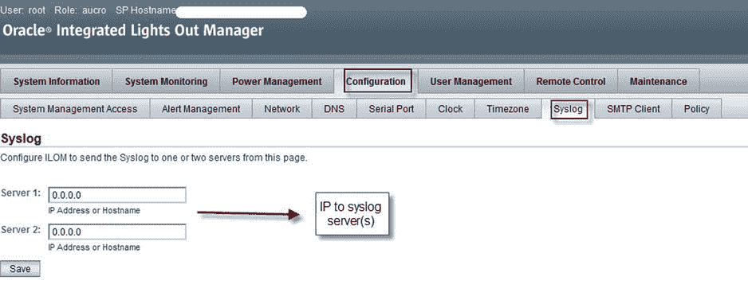

图 2-5. ODA V1 系统日志设置

通过命令行设置系统日志服务器的日志记录在两个版本上是类似的。只需执行以下命令：

`set /SP|CMM/clients/syslog destination_ip=syslog_server_`

SNMP 告警的设置方式也类似。SNMP 服务默认启用，其配置取决于目标 SNMP 陷阱接收系统。ILOM 支持 SNMP 协议 v1、v2c 和 v3。SNMP 协议 v1 和 v2c 使用团体名作为认证方法。ILOM 上预创建了一个名为`public`的默认只读团体和一个名为`private`的读写团体。根据环境设置，如果需要，可以使用自定义字符串来发送 SNMP 陷阱。SNMP 协议 v3 需要基于用户名/密码的认证。

SNMP 在 ODA V1 和 X3-2 上的设置方式类似。在 X3-2 上，设置可通过以下菜单选项访问：`ILOM 管理 ➤ 管理访问 ➤ SNMP`。在 V1 上，进入`配置管理 ➤ 系统管理访问 ➤ SNMP`。图 2-7 显示了您将进入的设置界面。

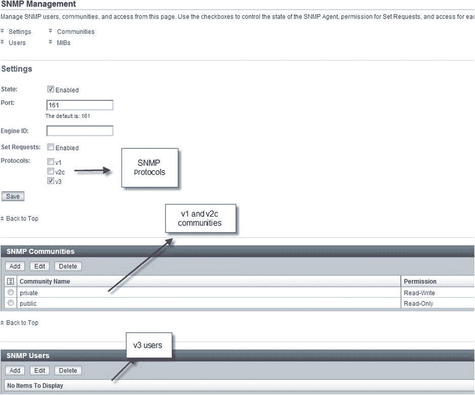

图 2-7. SNMP 设置界面

到目前为止，我们已经了解了各种 ILOM 功能和设置任务。ILOM 还提供了丰富的日志信息，可用于多种目的。表 2-5 描述了 ILOM 提供的日志类型。

**表 2-5. ILOM 日志**

| 日志类型 | 描述 |
| --- | --- |
| 系统日志 | 系统日志产生的输出可被诸如[Manage Engine](https://www.manageengine.com/)、[Splunk](https://www.splunk.com/)和`syslogd`等日志服务使用。这些服务在远程系统上运行。它们聚合日志，以提供所有发生在多个 ILOM 上的事件的统一视图。 |
| 事件日志 | ILOM 事件跟踪生成的各种类型的消息。这些可以是关于错误和警告的消息，也可以是信息性项目。事件日志还跟踪组件的添加和移除，以及 ILOM 负责的各种组件的状态。 |
| 审计日志 | 审计事件与特权调用相关，并被记录以确保授予了适当级别的访问权限。SNMP 调用也会被审计。 |

### 通过串行连接设置 Oracle 数据库设备

当 ODA 首次在数据中心的机架中设置时，需要遵循一些步骤才能访问 ODA。这些步骤在设置海报中概述。¹完成布线后，第一步是为两个 ODA 服务器节点提供 IP 地址。这可以通过在数据中心使用串行电缆访问 ODA，或使用像 Avocent 这样的 KVM（键盘、视频、鼠标）设备远程访问设备的串行端口来完成。

ODA ILOM 可通过串行管理（SER MGT）端口访问。MOS 注释 ID 1395445.1 解释了连接到 ODA 以配置 ILOM 的过程。此过程需要物理上直接访问串行端口，这意味着此过程需要在 ODA 所在的同一物理位置执行。

每个 ODA 都附带一个如图 2-8 所示的 RJ-45 串行转换器。

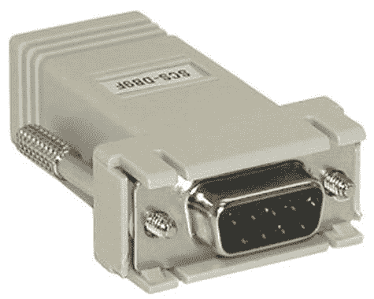

图 2-8. RJ-45 串行转换器

使用 RJ-45 电缆，您可以将电缆连接到笔记本电脑或数据中心终端推车上的串行端口，并使用像 PuTTY 或 ITerm2 这样的终端模拟器连接到 ILOM。如果您没有串行端口，可以购买市场上众多 USB 转串行转换电缆中的一种。一旦连接电缆连接到笔记本电脑和 ODA 串行端口（假设您使用的是 Windows），请检查设备管理器以查看 USB 设备连接到了哪个 COM 端口。然后在您的 PuTTY 连接中指定该 COM 端口，如图 2-9 所示。（如果运行 Linux，请参阅 MOS 注释 ID 1395445.1 获取说明）。确定端口后，您可以打开终端并通过串行线连接到 ODA。

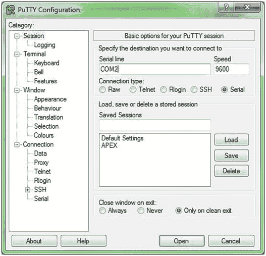

图 2-9. 用于建立串行连接的 PuTTY 屏幕

建立连接后，您将看到 ILOM 的登录提示。您需要使用 root 帐户和默认的 root 密码（`changeme`）连接到 ILOM。

ILOM 的初始配置应该没有 IP 配置。您可以通过发出以下命令来验证这一点：

`# show /SP/network`

Oracle 设备套件部署可以设置 ILOM 的 IP 网络详细信息，但使用我们接下来描述的方法配置 ILOM IP 地址通常更快。它允许通过使用 ILOM 来部署 ODA，从而实现更快的部署。您需要以下信息来为两个 ODA 服务器设置 ILOM 的 IP 配置：

*   公网 IP 地址
*   子网掩码
*   网关地址

根据您的需求，可以为 ILOM 分配静态 IP 或动态 IP（DHCP）地址。

以下是分配静态 IP 地址的示例：

`# set /SP/network pendingipdiscovery=static pendingipaddress=1.2.2.65 pendingipnetmask=255.255.255.0 pendingipgateway=1.2.2.254 commitpending=true`

每个 ODA 有两个服务器节点，因此也有两个 ILOM。网络配置需要执行两次，每个 ILOM 一次。建立 IP 配置后，应可通过浏览器进行 SSH 访问。通过浏览器导航到 ILOM 的 IP 地址应显示如图 2-10 所示的屏幕。

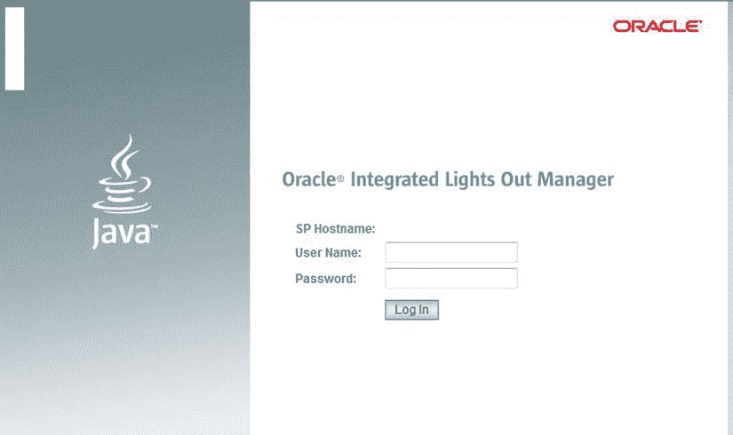

图 2-10. 通过浏览器访问的 ILOM 屏幕

图 2-10 所示的屏幕是 ILOM 控制台；看到它确认了 ILOM 已成功配置。既然 ILOM 已成功配置，您就可以继续配置 ODA 数据库节点了。


数据库设备一旦接通电源并完成线缆连接，ILOM 便会自动启动，但服务器节点需要手动开启。请在集成的 ILOM shell 会话中执行以下命令来启动服务器节点。请务必为两个节点都执行此命令。

```
### start /SYS
```

也可以通过浏览器访问 ILOM 图形界面来启动服务器节点。ODA V1 和 ODA X3-2 用于执行各种服务器电源相关活动的界面略有不同。图 2-11 和图 2-12 分别展示了 V1 和 X3-2 的界面。

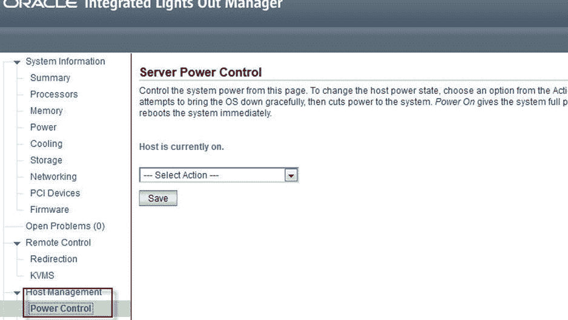
*图 2-12. ODA X3-2 服务器电源控制*

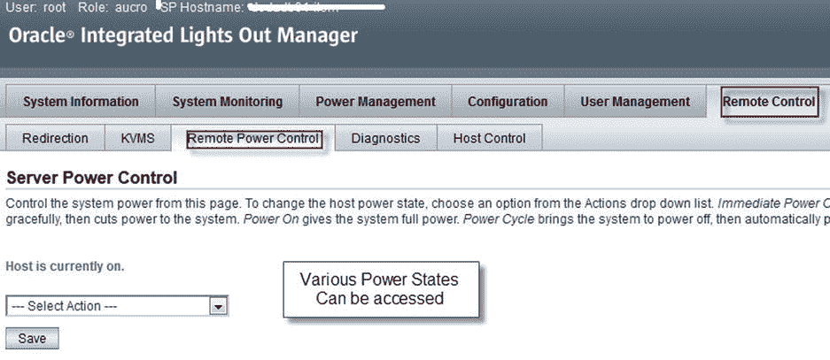
*图 2-11. ODA V1 服务器电源控制*

### 裸机 Oracle 数据库设备

Oracle 数据库设备预装了基础软件，但在某些情况下需要对 ODA 服务器进行重新镜像。重新镜像的需求可能源于系统损坏，或者为了快速将软件升级到最新版本。

该过程需要下载要镜像到数据库设备上的软件的 ISO 镜像。最新的 ISO 镜像可通过按照 MOS 说明 888888.1 中的指示获取。下载 ISO 文件并在笔记本电脑或台式机上解压。进入“远程控制” ➤ “重定向”菜单，然后选择“启动远程控制台”。这将打开一个显示控制台消息并可访问服务器节点的屏幕。请在两个服务器节点上都执行此过程。

一旦远程控制台屏幕可用，点击“设备”菜单并选择“CD ROM 镜像”。您将看到一个对话框，要求您定位 ISO 镜像。

选择 ISO 镜像后，请确保该镜像已挂载。屏幕上将显示消息以确认镜像已挂载。屏幕将显示一条消息，指示虚拟 CD-ROM 镜像已挂载。

进入 ILOM。选择下一个启动设备为 CDROM，如图 2-13 所示。然后循环重启服务器节点的电源，如图 2-14 所示。

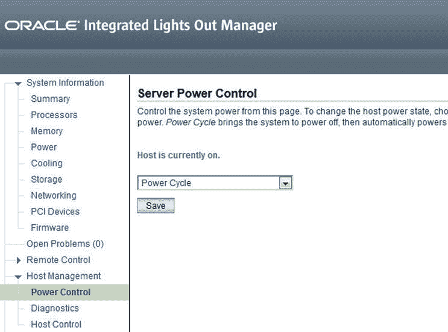
*图 2-14. 循环重启服务器节点电源*

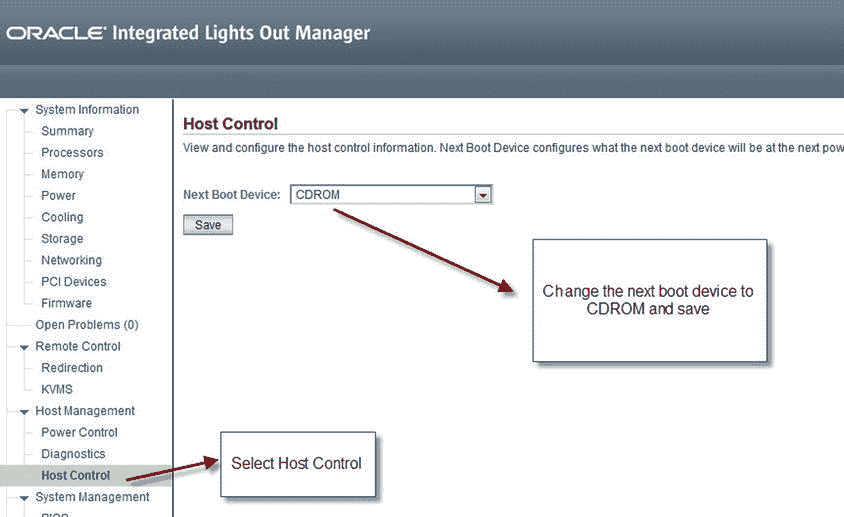
*图 2-13. 选择下一个启动设备*

电源循环重启后，重定向屏幕将在系统重启时显示控制台消息。消息显示后，裸机镜像过程将开始。图 2-15 显示了该过程的开始。

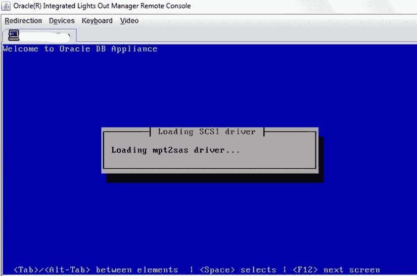
*图 2-15. Oracle 数据库设备镜像开始*

安装后过程可能耗时较长。您必须确保在整个过程中与服务器保持稳定的连接。图 2-16 显示了安装后屏幕。

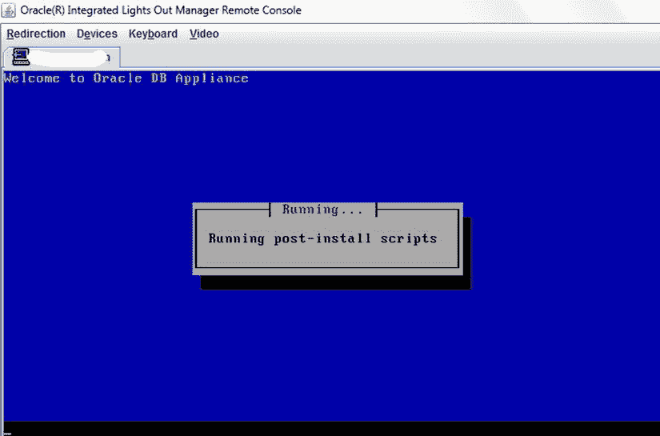
*图 2-16. ODA 镜像的安装后屏幕*

完整的镜像过程可能需要一到两个小时，并且可以在两个服务器节点上并行运行以加快访问设备的速度。请务必牢记，重新镜像一个极具破坏性的过程，它会擦除设备上的所有信息。在镜像前，务必备份您在 ODA 上存储的任何信息。

## 摘要

ILOM 是嵌入到 ODA 中的服务处理器。它是硬件的大脑。从管理和监控的角度来看，ILOM 提供了许多功能。远程 KVMS 或 shell 访问允许远程访问服务器节点以执行“亲临现场”般的功能。

可以通过运行 Java 的现代浏览器使用图形界面访问 ILOM，也可以通过集成的 shell 访问。这两种方法都可用于执行设置和管理，以及监控任务。ILOM 可以与最常见的身份验证机制（如 LDAP 和 Active Directory）集成。ILOM 还提供全面的日志记录机制，并允许通过远程 syslog 服务器或 SNMP 陷阱复制日志数据。

ILOM 提供通过串行访问设置数据库设备的功能，以及提供服务器电源控制功能。当需要时，ILOM 是控制台，允许通过 Oracle 支持网站提供的 CD-ROM 镜像对设备服务器节点进行重新镜像。

脚注 1

Oracle 设置海报可在 [`http://docs.oracle.com/cd/E22693_01/`](http://docs.oracle.com/cd/E22693_01/) 获取。

