# 3. 安装

摘要

您已经了解了在 Oracle 数据库设备上执行裸机恢复的基本任务。现在您需要为安装真正应用集群 (RAC) 数据库准备 Oracle 数据库设备。借助 Oracle 数据库设备内置的自动化功能，这是一项简单的任务，可以在几小时内完成。在开始之前，您需要最终确定一些先决条件。

## 网络和电源连接

ODA 已为高可用性网络访问（主网络和辅助网络）预配置。这些网络绑定在安装镜像中已预配置，使安装快速而简单。Oracle 数据库设备有两种版本：原始型号和 X3-2。它们在网络方面略有不同。原始 Oracle 数据库设备有 12 个 1000BASE-T 以太网端口，并可通过四个 SFP 光纤连接提供 10G 以太网。X3-2 型号则配备 8 个 10GBaseT 端口，支持高达 10Gbit 的连接速度。


### 原始 ODA

第一代 Oracle 数据库一体机机箱内集成了两个计算节点。每台服务器拥有四组绑定的以太网端口。默认情况下，`bond0`用于公共流量，而`bond1`、`bond2`和`xbond0`用于辅助访问，这将在第 6 章中更详细地介绍。在安装 Oracle 数据库一体机之前，请将两根线缆连接到`eth2`和`eth3`端口。通常，这些端口会连接到数据中心内独立的交换机以实现容错。绑定的默认配置会在两个端口之间进行流量负载均衡，这意味着绑定能够自动从单个网络路径故障中恢复。在图 3-1 和表 3-1 中，您将看到 Oracle 数据库一体机的详细示意图，以及图中编号注释的说明。

表 3-1. 图 3-1 中高亮连接的描述

| 注释编号 | 描述 |
| --- | --- |
| 1 | `C13`电源连接器，两个节点共享的电源总线 |
| 2 | 从右至左依次为节点 0 的`eth4`、`eth5`、`eth6`和`eth7`；`eth4`和`eth5`构成`bond1`，`eth6`和`eth7`构成`bond2` |
| 3 | 节点 0 的`eth8`和`eth9`的 10BaseT SFP 端口，配置为`xbond0` |
| 4 | 节点 0 的`ILOM`串行端口 |
| 5 | `eth2`和`eth3`，`bond0`用于公共网络访问 |
| 6 | `ILOM` 10/100 BaseT 端口 |
| 7 | `USB`和`VGA`端口 |
| 8 | 节点 0 |
| 9 | 节点 1 |

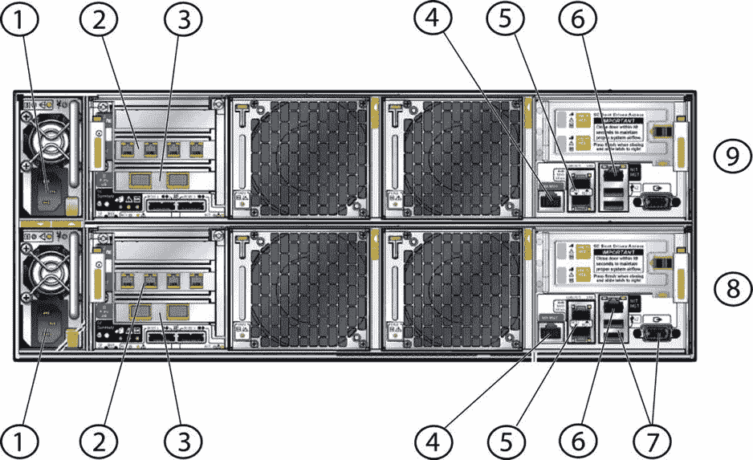
图 3-1. 原始 ODA 背面的网络及其他连接

### ODA X3-2

第二代 Oracle 数据库一体机使用两台 X3 服务器作为计算节点。每台服务器拥有两组绑定的以太网端口。默认情况下，`bond0`用于公共流量，`bond1`用于辅助访问，这将在第 6 章中详细说明。在安装 Oracle 数据库一体机之前，请将两根线缆连接到`eth2`和`eth3`端口。通常，这些端口会连接到数据中心内独立的交换机以实现容错。绑定的默认配置会在两个端口之间进行流量负载均衡，自动从单个网络路径故障中恢复。图 3-2 和表 3-2 图解并详细说明了 X3-2 Oracle 数据库一体机背面的连接。

表 3-2. 图 3-2 中高亮连接的描述

| 注释编号 | 描述 |
| --- | --- |
| 1 | 电源 0 风扇 |
| 2 | 电源 0 |
| 3 | 电源 1 风扇 |
| 4 | 电源 1 |
| 5 | 系统指示灯和定位灯 |
| 6 | 集群互连，`eth0`和`eth1` |
| 7 | SAS 卡 0 |
| 8 | SAS 卡 1 |
| 9 | `ILOM`端口，10/100BASE-T |
| 10 | `ILOM`串行端口 |
| 11 | 10GBASE-T，`eth2` `bond0` |
| 12 | 10GBASET，`eth3` `bond0` |
| 13 | 10GBASET，`eth4` `bond1` |
| 14 | 10GBASET，`eth5` `bond1` |
| 15 | `USB`端口 |
| 16 | `VGA`端口 |

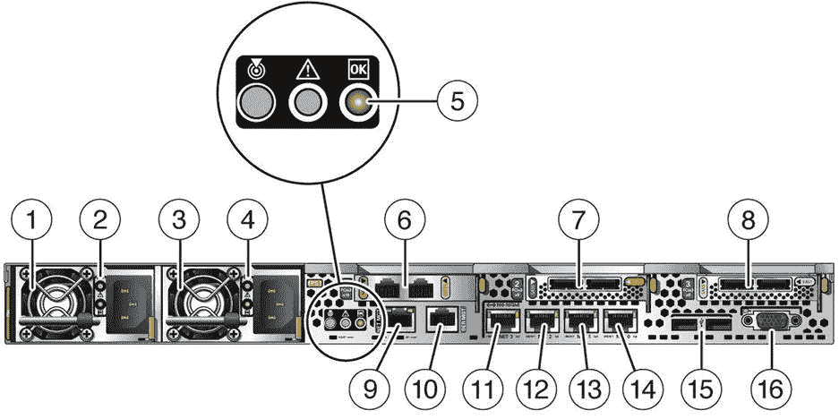
图 3-2. X3-2 ODA 背面的网络及其他连接

### 电源线

没有什么比将新系统装入机架后才发现电源线不是你需要的型号更糟糕的了。像`C13`和`C14`这样的连接器名称，对许多 Oracle 数据库一体机的终端用户来说意义不大。表 3-3 列出了北美版 Oracle 数据库一体机常用的插头。

表 3-3. 北美版 Oracle 数据库一体机常用插头

| 连接器名称 | 用途 | 示意图 |
| --- | --- | --- |
| `C13` | 这是连接到 Oracle 数据库一体机上的连接器。 |  |
| `C14` | 常用于机架中。110V 或 220V。 |  |
| `C14RA` | `C14`的直角版本。电线从右侧进入。 | 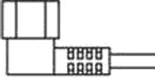 |
| `5-15P` | 110V 应用的标准插头。 |  |
| `6-15P` | `5–15P`的 200V 版本。 |  |
| `L6-20P` | 锁定式 200V 插头，通常用于 DIN 高电流负载。 |  |

## Oracle 数据库一体机初始部署

一旦 Oracle Linux 操作系统的裸金属安装完成，您需要登录到其中一个节点的控制台，并使用`firstnet`命令对 Oracle 数据库一体机网络进行初始配置。该命令允许您在首次使用时为 Oracle 数据库一体机建立网络接口。

注意

在运行`firstnet`之前，您应该分配所需的互联网协议（`IP`）地址，并验证其在域名服务（`DNS`）中的条目已完成。如果您在收集或分配`IP`地址方面需要帮助，请联系您当地的系统管理员。

### ILOM 网络

Oracle Integrated Lights Out Manager（`ILOM`）运行在服务处理器（`SP`）上，用于硬件安装、维护和故障排除。Oracle 数据库一体机上的每个节点都有一个专用的`SP`，并配有一个专用的 10/100BaseT 端口。

### 网络信息

每个 Oracle 数据库一体机节点都需要访问外部网络；一体机背面有多个以太网端口来建立这些连接。支持公共网络访问的绑定通过连接到每个 Oracle 数据库一体机上`net0`和`net1`端口的线缆实现冗余连接。本章中的示例将基于名为“ejb”的 Oracle 数据库一体机。表 3-4 说明了需要在一体机两个节点上为`bond0`建立的内容。

注意

请注意，您只需关注两个节点上的`bond0`接口。使用`firstnet`工具时会配置`bond0`接口。

表 3-4. node0 的互联网协议信息

| 节点 | 绑定名称 | IP 地址 | 网络掩码 | DNS 条目 |
| --- | --- | --- | --- | --- |
| 0 | `bond0` | 172.30.0.20 | 255.255.255.0 | ejb1.m57.local |
| 1 | `bond0` | 172.30.0.21 | 255.255.255.0 | ejb2.m57.local |

Oracle 数据库一体机还使用常规网络资源，如`DNS`、网关和网络时间协议（`NTP`）。表 3-5 展示了这些资源的配置示例。

表 3-5. Oracle 数据库一体机的附加资源

| 资源 | 条目 |
| --- | --- |
| `DNS`服务器 | 172.16.11.215 |
| `DNS`后缀 | m57.local |
| `DNS`搜索顺序 | m57.local |
| `NTP`服务器 | 172.30.0.1 |
| 默认网关 | 172.30.0.1 |
| SMTP 中继 | 172.30.0.1 |


### 真应用集群（RAC）网络

Oracle 真应用集群 11g 第 2 版（RAC）预装在 Oracle 数据库一体机上。此版本的 RAC 引入了**单一客户端访问名称**（SCAN）寻址的概念。SCAN 地址通过提供两个或多个 IP 地址，为集群提供数据库的别名。这种类似别名的方法允许远程客户端连接，而无需更改与环境相关的连接信息。

**注意**
SCAN 需要企业 DNS 或 Oracle 全局命名服务才能工作。对于 Oracle 数据库一体机，方法是使用您的企业 DNS。有关 SCAN 的更多信息，请参见 [`www.oracle.com/technetwork/products/clustering/overview/scan-129069.pdf`](http://www.oracle.com/technetwork/products/clustering/overview/scan-129069.pdf)。

SCAN 寻址采用 DNS 的轮询（round-robin）方法。这种方法确保网络流量在多个 IP 地址之间负载均衡。该方法确保远程主机可以配置本地命名，而无需在环境发生变化时更改连接信息。表 3-6 提供了一个如何在企业 DNS 服务器中配置条目的示例。

**注意**
DNS 中的 SCAN 条目应关联不少于三个 IP 地址。

**表 3-6. 域名服务（DNS）设置**

| DNS 名称 | IP 地址 |
| --- | --- |
| ejb-vip1.m57.local | 172.30.0.22 |
| ejb-vip2.m57.local | 172.30.0.23 |
| ejb-scan.m57.local | 172.30.0.24, 172.30.0.25, 172.30.0.26 |

至此，您应对配置 Oracle 数据库一体机网络所需的组件有了基本了解。接下来，您需要通过连接到 ILOM 来配置所有这些与网络相关的项目。

### 网络配置

对于所有 Oracle 数据库一体机，一旦您设置好网络资源（DNS、IP 地址）并完成 ILOM 网络配置，您就可以使用 SSH 协议连接到 ILOM。连接到 ILOM 后，您可以连接到系统的控制台以获取 Linux 控制台终端。可以使用 ILOM 命令 `start /SP/console` 访问系统的控制台。清单 3-1 提供了交互过程应如何进行的示例。

**清单 3-1. 启动 ILOM 控制台**

```
oak1 login: -> start /SP/console
Are you sure you want to start /SP/console (y/n)? y
Serial console started. To stop, type ESC (
Oracle Linux Server release 5.9
Kernel 2.6.39-400.111.1.el5uek on an x86_64
login: root
Password:
Last login: Sun Sep 8 13:43:28 on tty1
[root@oak1 ∼]#
```

现在您已连接到控制台，需要为所连接的节点配置初始 IP 地址。如本章前面所述，这是通过发出 `firstnet` 命令完成的。清单 3-2 说明了如何使用此命令在第一个节点上配置网络。

**清单 3-2. 发出 firstnet 命令**

```
[root@oak1 ∼]# /opt/oracle/oak/bin/oakcli configure firstnet
INFO: Non VM environment detected
Select the interface to configure network on (bond0 bond1 bond2 xbond0) [bond0]:
Configure DHCP on bond0 (yes/no) [no]:
INFO: Static configuration selected
Enter the IP address to configure:172.30.0.20
Enter the netmask address to configure:255.255.255.0
Enter the gateway address to configure[172.30.0.1]:172.30.0.1
INFO: Plumbing the IPs now
INFO: Restarting the network
Shutting down interface bond0: bonding: bond0: Warning: the permanent HWaddr of eth2 - 00:21:28:e7:c1:e8 - is still in use by bond0\. Set the HWaddr of eth2 to a different address to avoid conflicts.
bond0: mixed no checksumming and other settings.
[ OK ]
Shutting down interface bond1: bonding: bond1: Warning: the permanent HWaddr of eth4 - 00:1b:21:c5:c4:21 - is still in use by bond1\. Set the HWaddr of eth4 to a different address to avoid conflicts.
bond1: mixed no checksumming and other settings.
[ OK ]
Shutting down interface bond2: bonding: bond2: Warning: the permanent HWaddr of eth6 - 00:1b:21:c5:c4:23 - is still in use by bond2\. Set the HWaddr of eth6 to a different address to avoid conflicts.
bond2: mixed no checksumming and other settings.
[ OK ]
Shutting down interface eth0: [ OK ]
Shutting down interface eth1: [ OK ]
Shutting down interface eth8: bonding: xbond0: Warning: the permanent HWaddr of eth8 - 00:1b:21:c2:20:f0 - is still in use by xbond0\. Set the HWaddr of eth8 to a different address to avoid conflicts.
[ OK ]
Shutting down interface eth9: xbond0: mixed no checksumming and other settings.
[ OK ]
Shutting down interface xbond0: bonding: xbond0: Error: cannot release eth8.
bonding: xbond0: Error: cannot release eth9.
[ OK ]
Shutting down loopback interface: [ OK ]
Bringing up loopback interface: [ OK ]
Bringing up interface bond0: [ OK ]
Bringing up interface bond1: [ OK ]
Bringing up interface bond2: [ OK ]
Bringing up interface eth0: [ OK ]
Bringing up interface eth1: [ OK ]
Bringing up interface xbond0: [ OK ]
```

配置好网络接口后，您需要使用节点上的 `ping` 命令对其进行测试。此外，您还可以从远程客户端 ping 已配置的节点来测试网络。清单 3-3 显示了 ping 所配置节点的默认网关的结果。

**清单 3-3. Ping 默认网关的结果**

```
[root@oak1 ∼]# ping 172.30.0.1
PING 172.30.0.1 (172.30.0.1) 56(84) bytes of data.
64 bytes from 172.30.0.1: icmp_seq=1 ttl=64 time=1.31 ms
64 bytes from 172.30.0.1: icmp_seq=2 ttl=64 time=0.245 ms
64 bytes from 172.30.0.1: icmp_seq=3 ttl=64 time=0.255 ms
--- 172.30.0.1 ping statistics ---
3 packets transmitted, 3 received, 0% packet loss, time 2001ms
rtt min/avg/max/mdev = 0.245/0.606/1.319/0.504 ms
```

由于第一个节点的网络接口已启动，请将之前讨论和下载的最终用户捆绑包复制到第一个节点上的临时目录（`/tmp`）。根据您的客户端机器与 ODA 第一个节点之间的网络连接情况，复制可能需要几分钟（参见图 3-3）。最终用户捆绑包开始传输后，您可以继续进行配置。

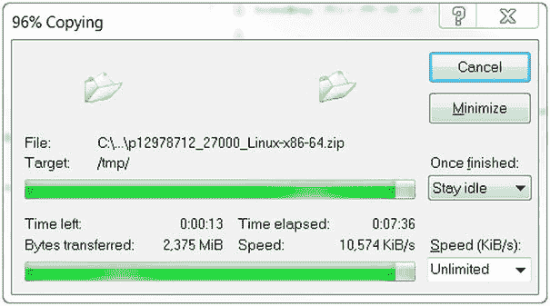
**图 3-3. 将最终用户捆绑包复制到 Oracle 数据库一体机**


### 网络时间协议配置

在部署数据库前，验证两个节点之间的时间是否准确且相差在几秒钟内至关重要。Oracle 数据库一体机随附的默认配置文件 `/etc/ntp.conf` 实际上是有效的。一体机初始配置为使用 RedHat 公共 NTP 服务器池；对于能访问互联网的系统，这通常能使 Oracle 数据库一体机的时间保持同步。清单 3-4 展示了 NTP 配置文件的服务器部分，其中 Oracle 数据库一体机指向了 RedHat NTP 池。

清单 3-4. RedHat NTP 池
```
# 使用 pool.ntp.org 项目的公共服务器。
# 请考虑加入该池 ( http://www.pool.ntp.org/join.html )。
server 0.rhel.pool.ntp.org
server 1.rhel.pool.ntp.org
server 2.rhel.pool.ntp.org
```

对于某些安装，这样配置就可以了，但许多数据中心拥有自己的 NTP 基础设施。这种情况下，应注释掉（在行首放置井号 "#"）指向池的 "server" 行，并添加指向本地 NTP 服务器的行。清单 3-5 展示了如何添加您自己的本地 NTP 服务器。

清单 3-5. 配置本地 NTP 服务器
```
# 使用 pool.ntp.org 项目的公共服务器。
# 请考虑加入该池 ( http://www.pool.ntp.org/join.html )。
#server 0.rhel.pool.ntp.org
#server 1.rhel.pool.ntp.org
#server 2.rhel.pool.ntp.org
server 172.30.0.1
```

修改 `/etc/ntp.conf` 文件后，需要使用 `service ntpd restart` 命令重启 NTP 守护进程 (`ntpd`)。这将停止守护进程，将时钟与 NTP 源同步，然后重新启动守护进程。

注意

在 Oracle 数据库一体机 2.2 版本中，存在一个导致 NTP 不同步的错误。请参阅 Note 1489263.1 获取解决方案。

`ntpd` 进程重启后，您可以使用 `ntpq -p` 命令验证与 NTP 服务器的通信。此命令将显示一体机当前使用的所有 NTP 服务器以及每个服务器经历的时间偏移（参见清单 3-6）。

清单 3-6.  ntpdq –p 命令的输出
```
     remote          refid      st t when poll reach   delay   offset  jitter
==============================================================================
 205-196-146-72.  209.51.161.238   2 u   62   64    1   26.872   -2.682   0.001
name1.glorb.com  128.174.38.133   2 u   61   64    1   17.005   -2.099   0.001
 ntp1.rescomp.be  169.229.128.214  3 u   60   64    1   77.270    3.740   0.001
 LOCAL(0)        .LOCL.          10 l   59   64    1    0.000    0.000   0.001
```

查看清单 3-6，我们可以看到正在使用三个外部服务器和系统时钟。系统时钟偏移大约为 –2 到 3 秒。NTP 守护进程 (`ntpd`) 现在将漂移时间，以使系统时钟与实际时间的差距保持在一百到二百毫秒之内。

### Grid Infrastructure 和数据库安装

在第 2 章结尾，您得到的是一台"裸机"安装的 Oracle 数据库一体机。这意味着您现在应该有一台运行着 Oracle Enterprise Linux 的干净的 Oracle 数据库一体机。此时，您需要在 Oracle 数据库一体机上安装 Oracle Grid Infrastructure 和 Oracle 数据库软件。如何操作呢？由于 Oracle 数据库一体机是一个工程化系统，您不能直接下载并安装这些 Oracle 产品。Oracle 提供了用于安装这些产品的软件包。

当您开始寻找安装 Oracle 产品的软件包时，可能需要访问 My Oracle Support 并下载适用于 Oracle 数据库一体机的最新最终用户捆绑包。最终用户捆绑包为"出厂"或重新镜像的 Oracle 数据库一体机提供了 Grid Infrastructure 和 Oracle 数据库的更新版本。请注意，当您开始下载最终用户捆绑包时，文件相当大，可能需要一些时间才能获取完毕，然后才能开始安装。

注意

要下载最终用户捆绑包或 Oracle 数据库一体机所需的任何其他主要补丁，您可能需要遵循 Note ID 888888.1 中的说明。

## 数据库安装

将最终用户捆绑包复制到 Oracle 数据库一体机后，您需要通过解包将其安装到一体机上。解包包括使用 `oakcli unpack` 命令。清单 3-7 展示了在 temp 目录中解压缩 2.7 版的最终用户捆绑包。

清单 3-7. 使用 oakcli unpack
```
[root@oak1 tmp]# /opt/oracle/oak/bin/oakcli unpack -package /tmp/p12978712_27000_Linux-x86-64.zip
Unpacking takes a while,  pls wait....
```

最终用户捆绑包解压到临时目录后，您需要使用图形用户界面安装 Oracle 产品。为此，您需要启动虚拟网络计算服务器以与 Oracle 数据库一体机交互。


### VNC 配置与连接

VNC 是一种图形化桌面共享技术，它允许你在服务器上使用 X11 桌面并本地执行程序，而仅将屏幕输出发送到你的 PC 或 MAC 上的 VNC 客户端。在安装终端用户束之前，你需要为 VNC 服务器配置一个初始密码。要设置初始 VNC 密码，请运行 `vncserver` 命令并设置你的密码。该命令还会为你提供 VNC 会话编号。代码清单 3-8 展示了在设置 VNC 服务器密码时应该看到的示例。

代码清单 3-8. 设置 VNC 服务器密码和端口

```
[root@oak1 tmp]# vncserver
You will require a password to access your desktops.
Password:
Verify:
xauth:  creating new authority file /root/.Xauthority
xauth: (stdin):1:  bad display name "oak1:1" in "add" command
New 'oak1:1 (root)' desktop is oak1:1
Creating default startup script /root/.vnc/xstartup
Starting applications specified in /root/.vnc/xstartup
Log file is /root/.vnc/oak1:1.log
```

一旦密码设置完成并确定了会话编号，你就可以使用 VNC 客户端连接到系统。对于远程主机，你需要使用启动 VNC 服务器时标识的 IP 地址和会话。图 3-4 展示了使用 VNC 客户端连接到 Oracle 数据库设备。

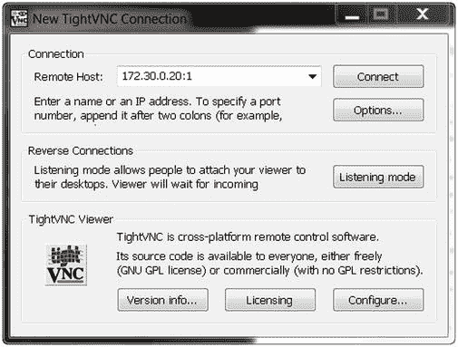
图 3-4. VNC 客户端连接到 Oracle 数据库设备

如果你使用正确的会话 ID 和 IP 地址，现在应该会提示你输入密码。输入你在配置 VNC 服务器时设置的密码（参见图 3-5）。

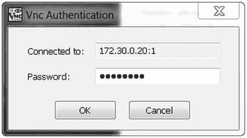
图 3-5. 客户端上来自 VNC 服务器的密码提示

如果密码被接受，你现在应该能看到一个 X11 桌面。在出现的命令窗口中，你可以开始部署 Oracle 数据库设备。要开始部署，必须使用 `oakcli deploy` 命令。这将启动 Oracle 设备管理器 (OAM)。一旦 Oracle 设备管理器启动，你将能够配置 Oracle 网格基础设施加上自动存储管理 (ASM) 存储以及 Oracle 数据库。代码清单 3-9 展示了如何使用 `oakcli deploy` 开始部署过程。

代码清单 3-9. 使用 oakcli 进行部署

```
[root@oak1 ∼]# /opt/oracle/oak/bin/oakcli deploy
Log messages in /tmp/oak_1378687999949.log
Running Oracle Appliance Manager
```

既然你已经在 Oracle 数据库设备上启动了部署，你需要熟悉 Oracle 设备管理器。在下一节中，你将了解 Oracle 设备管理器以及基础配置应选择的选项。

### Oracle 设备管理器与部署

通过运行 `oakcli deploy` 命令，你启动了 Oracle 设备管理器的图形用户界面安装向导。Oracle 设备管理器与其他 Oracle 安装向导非常相似。它将引导你完成配置 Oracle 数据库设备所需的各种步骤。图 3-6 显示了 Oracle 设备管理器的欢迎屏幕。

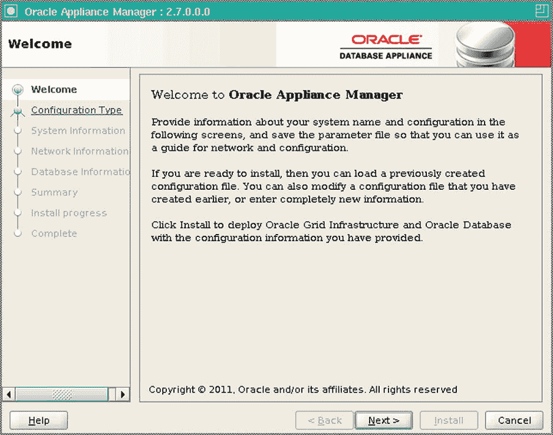
图 3-6. Oracle 设备管理器欢迎屏幕

就像许多其他 Oracle 向导一样，Oracle 提供了一个菜单（在左侧）来帮助你在点击“下一步”按钮推进向导时进行导航。在向导的下一个屏幕中，你可以选择希望在 Oracle 数据库设备上执行的部署类型。图 3-7 展示了可供你选择的选项。表 3-7 快速描述了这些选项的含义。选择部署类型后，你可以点击“下一步”按钮继续通过向导。

表 3-7. 部署类型描述

| 部署类型 | 描述 |
| --- | --- |
| 典型 | 所有 Oracle 数据库设备的默认设置 |
| 自定义 | 允许你覆盖默认设置；即，磁盘镜像设置 ASM |
| SAP 应用 | 仅用于将运行 SAP 的设备 |

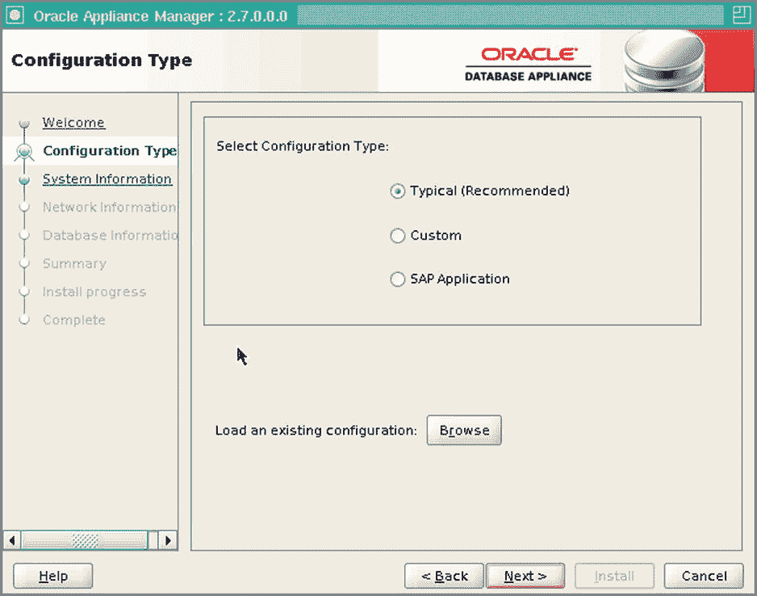
图 3-7. 配置类型

在向导的下一步中，你需要为 Oracle 数据库设备设置系统信息。图 3-8 展示了向导的界面。你需要选择或输入所需的信息。

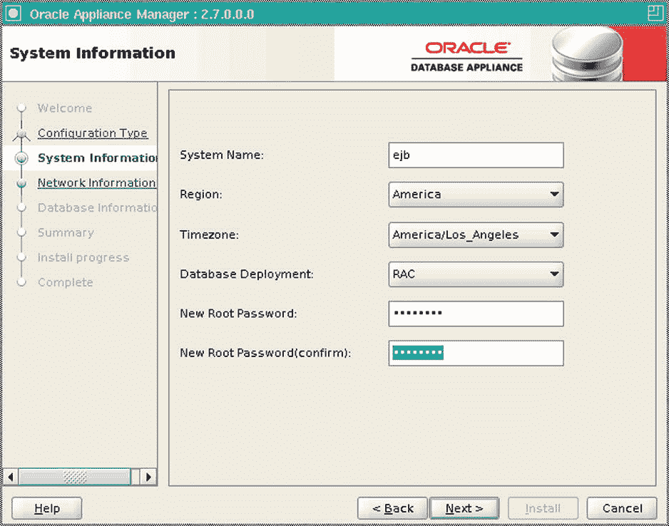
图 3-8. Oracle 数据库设备的系统信息

在系统信息步骤中，有几点需要注意。首先，系统名称用于部署和 Oracle 数据库设备中的每个节点，节点的主机名会自动在系统名称后附加 1 或 2。部署完成后，节点的主机名应该类似于 `ejb1` 或 `ejb2`。

下一个所需的系统信息是 Oracle 数据库设备所在的区域。这是一个下拉列表，你可以在其中选择 Oracle 数据库设备运行的地理区域。在图 3-8 中，选择的区域是美洲。

接下来是时区下拉菜单，它提供了一个列表供你选择 Oracle 数据库设备所在的时区。图 3-8 显示选择了太平洋时区 (`America/Los_Angeles`)。

数据库部署下拉菜单提供了一系列选项，用于在 Oracle 数据库设备上部署数据库。你可以选择部署实时应用集群 (RAC)、实时应用集群 (RAC) 单节点或企业版数据库。在图 3-8 中，选择了实时应用集群 (RAC) 选项。

系统信息所需的最后一部分是 root 密码。默认情况下，root 密码设置为 `welcome1`。在你为部署提供 root 密码后，该密码将在 Oracle 数据库设备的两个节点上被更改。此时，如果你对系统信息屏幕上提供的所有项目都满意，可以点击“下一步”继续完成向导。


### 网络信息屏幕

当你逐步通过向导时，会进入网络信息屏幕。在这里，你需要提供所需的 IP 地址和 DNS 信息。除了 IP 地址，你还需要提供一个域名。图 3-9 展示了填写 IP 地址和其他所需信息的复杂界面。所有信息填写完毕后，你需要核对所有地址、DNS 信息和其他项目是否正确。大多数部署失败都是由于 IP 地址和 DNS 条目不正确造成的。

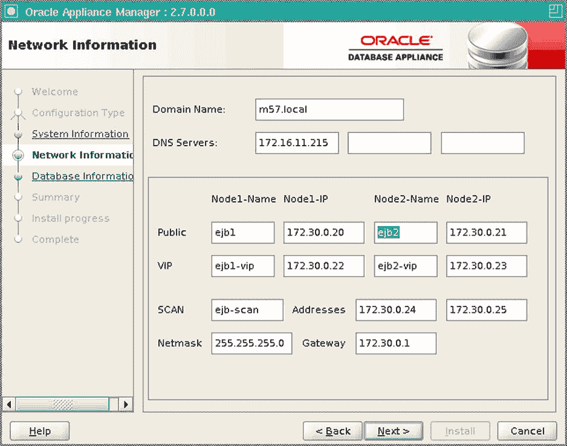

图 3-9. 网络信息屏幕

### 数据库信息屏幕

部署向导的下一步是设置数据库特定选项。如图 3-10 所示，你会看到三个选项：数据库名称、数据库类和数据库语言。这三项都需要填写或选择。填写后，安装程序将知道要创建的数据库名称、数据库大小以及应使用的国家语言。

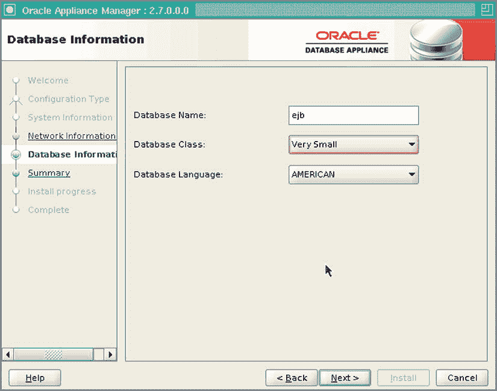

图 3-10. 数据库信息屏幕

数据库类取决于你在系统信息屏幕上选择的数据库部署。Oracle Database Appliance 软件的一部分包含了为所选数据库大小预配置的模板。这种数据库部署方法优化了数据库以及所选数据库大小的相关性能。这些模板还融合了 Oracle 最佳实践，并根据所使用的 Oracle Database Appliance 型号略有不同。表 3-8 和表 3-9 提供了所选数据库类的细分。

表 3-9. X3-2 Oracle Database Appliance 的数据库模板

| 类 | PGA | SGA | 进程数 | 日志缓冲区 | 重做日志文件大小 |
| --- | --- | --- | --- | --- | --- |
| 超小型 | 2048 MB | 4096 MB | 200 | 16 MB | 1 GB |
| 小型 | 4096 MB | 8192 MB | 400 | 16 MB | 1 GB |
| 中型 | 8192 MB | 16384 MB | 800 | 32 MB | 2 GB |
| 大型 | 12288 MB | 24576 MB | 1200 | 64 MB | 4 GB |
| 超大型 | 24576 MB | 49152 MB | 2400 | 64 MB | 4 GB |

表 3-8. X2-2 Oracle Database Appliance 的数据库模板

| 类 | PGA | SGA | 进程数 | 日志缓冲区 | 重做日志文件大小 |
| --- | --- | --- | --- | --- | --- |
| 超小型 | 2048 MB | 4096 MB | 200 | 16 MB | 1 GB |
| 小型 | 4096 MB | 8192 MB | 400 | 16 MB | 1 GB |
| 中型 | 8192 MB | 16384 MB | 800 | 32 MB | 2 GB |
| 大型 | 12288 MB | 24576 MB | 1200 | 64 MB | 4 GB |
| 超大型 | 24576 MB | 49152 MB | 2400 | 64 MB | 4 GB |

数据库信息屏幕上的最后一个选项是数据库语言。你可以在这里选择要用于数据库的语言。在图 3-10 中选择了 American 选项。如果你需要为你的位置选择不同的语言，可以在此屏幕上进行操作。

一旦你选择了在 Oracle Database Appliance 上创建数据库所需的所有选项，就可以点击 Next 按钮。点击 Next 后，你将进入向导的摘要屏幕（参见图 3-11）。在此屏幕上，你可以查看和验证在整个向导中选择的信息。你还可以保存配置以供将来部署使用。

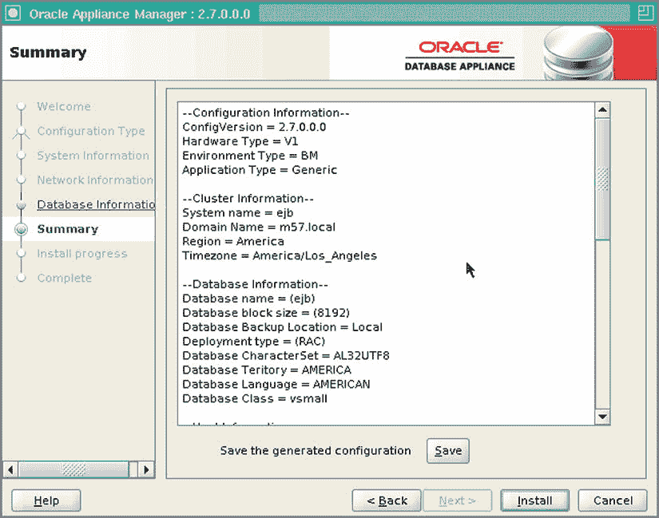

图 3-11. 摘要屏幕

### 摘要屏幕

部署向导中的摘要屏幕提供了一个滚动条（在右侧）来查看窗口中的所有信息。清单 3-10 提供了摘要屏幕中包含信息的更详细视图。

清单 3-10. 摘要屏幕 — 详细信息

```
--Configuration Information--
ConfigVersion = 2.7.0.0.0
Hardware Type = V1
Environment Type = BM
Application Type = Generic
--Cluster Information--
System name = ejb
Domain Name = m57.local
Region = America
Timezone = America/Los_Angeles
--Database Information--
Database name = (ejb)
Database block size = (8192)
Database Backup Location = Local
Deployment type = (RAC)
Database CharacterSet = AL32UTF8
Database Teritory = AMERICA
Database Language = AMERICAN
Database Class = vsmall
--Host Information--
Host VIP Names = (ejb1-vip ejb2-vip)
--SCAN Information--
Scan Name = ejb-scan
Scan Name = (172.30.0.24 172.30.0.25)
Is DNS Server used = true
DNS Servers = (172.16.11.215  )
VIP IP = (172.30.0.22 172.30.0.23)
--Network Information--
Public IP = (172.30.0.20 172.30.0.21)
Public Network Mask = 255.255.255.0
Public Network Gateway = 172.30.0.1
Public Network interface = bond0
Public Network Hostname = (ejb1 ejb2)
NET1 Interface = bond1
NET2 Interface = bond2
NET3 Interface = xbond0
Disk Group Redundancy = ( HIGH HIGH HIGH )
--CloudF FileSystem Info--
Configure Cloud FileSystem = True
Cloud FileSystem Mount point = /cloudfs
Cloud Filesystem size(GB) = 50
--Automatic Service Request--
Configure ASR = False
Configure External ASR = False
ASR proxy server port = 80
```

### 部署过程

在审查了你所选项目的摘要后，你需要点击 Install 按钮开始部署。此时，Oracle Appliance Manager 将开始配置 Oracle Database Appliance 的两个节点。此部署过程可能需要几个小时，具体取决于你的 Oracle Database Appliance 和所选的数据库大小。

安装开始后，部署期间会运行 25 个步骤。图 3-12 展示了部署期间的这些步骤。请注意，安装屏幕上有一个 Show Details 按钮。此按钮可用于查看部署期间正在执行的步骤的详细信息。

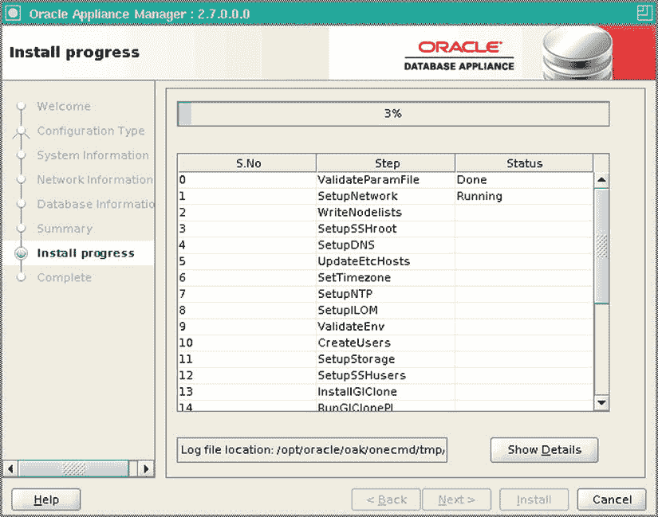

图 3-12. 部署过程开始

另外，验证部署日志文件的位置很重要。如果安装失败，你将需要访问部署日志以了解失败原因。默认情况下，部署日志位于 `/opt/oracle/oak/onecmd/tmp/`。

### 完成屏幕

部署完成后，Oracle Appliance Manager 将切换到完成屏幕（参见图 3-13）。此时，你可以点击 Close 按钮退出 Oracle Appliance Manager。

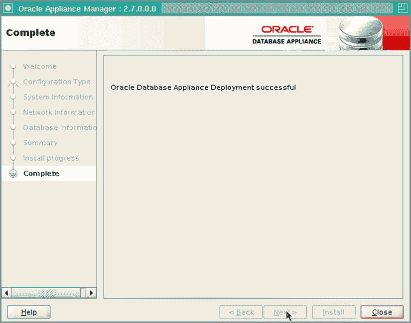

图 3-13. 完成屏幕

注意

有时会遗漏某些项目导致部署失败。最常见的遗漏项是 DNS 条目或重复的 IP 地址。部署运行时，每个步骤都会报告其状态。如果某个步骤失败，请查看 `/opt/oracle/oak/onecmd/tmp/` 中的日志文件。


### Oracle 数据库设备重新部署

有时您需要将基础镜像重新部署到 Oracle 数据库设备。重新部署将删除 Oracle 数据库设备上的所有数据库以及关联的 ASM 配置。执行 Oracle 数据库设备的重新部署是一项非常简单的任务，通过`cleanupDeploy.pl`脚本执行（参见清单 3-11）。

### 清单 3-11. cleanupDeploy.pl 脚本

`/opt/oracle/oak/onecmd/cleanupDeploy.pl`

一旦此`cleanupDeploy.pl`脚本完成，您可以重新运行使用前面讨论的 Oracle 应用设备管理器实用程序进行的部署过程。为了执行`cleanupDeploy.pl`并查看相关输出，清单 3-12 提供了一些关于您将看到内容的概览。

### 清单 3-12. 执行 cleanupDeploy.pl 及相关输出（部分）

```
[root@oak1 ∼]# /opt/oracle/oak/onecmd/cleanupDeploy.pl
Please enter the root password for performing cleanup:
Re-enter root password:
About to clear up OAK deployment,public network connectivity will be lost,root password will be set to default and both nodes will be rebooted
Do you want to continue(yes/no): yes
Setting up ssh for root
INFO   : Logging all actions in /opt/oracle/oak/onecmd/tmp/ejb1-20130909181519.log and traces in /opt/oracle/oak/onecmd/tmp/ejb1-20130909181519.trc
INFO   : Loading configuration file /opt/oracle/oak/onecmd/onecommand.params...
INFO   : Creating nodelist files...
==================================================================================
INFO   : 2013-09-09 18:15:19
INFO   : Step 1  SetupSSHroot
INFO   : Setting up ssh for root...
INFO   : Setting up ssh across the private network...
............done
INFO   : Running as root: /usr/bin/ssh -l root 192.168.16.24 /root/DoAllcmds.sh
INFO   : Background process 19630 (node: 192.168.16.24) gets done with the exit code 0
INFO   : Running as root: /usr/bin/ssh -l root 192.168.16.25 /root/DoAllcmds.sh
INFO   : Background process 19654 (node: 192.168.16.25) gets done with the exit code 0
INFO   : Done setting up ssh
INFO   : Running /usr/bin/rsync -tarvz /opt/oracle/oak/onecmd/ root@192.168.16.25:/opt/oracle/oak/onecmd --exclude=*zip --exclude=*gz --exclude=*log --exclude=*trc --exclude=*rpm to sync directory</opt/oracle/oak/onecmd> on node <192.168.16.25>
SUCCESS: Ran /usr/bin/rsync -tarvz /opt/oracle/oak/onecmd/ root@192.168.16.25:/opt/oracle/oak/onecmd --exclude=*zip --exclude=*gz --exclude=*log --exclude=*trc --exclude=*rpm and it returned: RC=0
sending incremental file list
.
.
.
.
==================================================================================
INFO   : 2013-09-09 18:19:49
INFO   : Step 11  resetpasswd
INFO   : Resetting root password
...
INFO   : Running as root: /usr/bin/ssh -l root 192.168.16.24 /opt/oracle/oak/onecmd/tmp/secuser.sh
...
INFO   : Running as root: /usr/bin/ssh -l root 192.168.16.25 /opt/oracle/oak/onecmd/tmp/secuser.sh
INFO   : Running as root: /usr/bin/ssh -l root 192.168.16.24 /opt/oracle/oak/onecmd/tmp/DoAllcmds-20130909181950.sh
INFO   : Background process 3206 (node: 192.168.16.24) gets done with the exit code 0
INFO   : Running as root: /usr/bin/ssh -l root 192.168.16.25 /opt/oracle/oak/onecmd/tmp/DoAllcmds-20130909181950.sh
INFO   : Background process 3229 (node: 192.168.16.25) gets done with the exit code 0
INFO   : Time spent in step 11 resetpasswd is 1 seconds.
==================================================================================
INFO   : Log file is /opt/oracle/oak/onecmd/tmp/ejb1-20130909181949.log...
Exiting...
Resetting dns, ntp and Rebooting
INFO   : Logging all actions in /opt/oracle/oak/onecmd/tmp/ejb1-20130909181950.log and traces in /opt/oracle/oak/onecmd/tmp/ejb1-20130909181950.trc
INFO   : Loading configuration file /opt/oracle/oak/onecmd/onecommand.params...
INFO   : Creating nodelist files...
==================================================================================
INFO   : 2013-09-09 18:19:51
INFO   : Step 12  reboot
INFO   : Running as root: /usr/bin/ssh -l root 192.168.16.24 /opt/oracle/oak/onecmd/tmp/reboot.sh
INFO   : Running as root: /usr/bin/ssh -l root 192.168.16.25 /opt/oracle/oak/onecmd/tmp/reboot.sh
```


### 准备将 ZFS 阵列用作外部存储

虽然您可以向 X3-2 添加额外的存储托架，但您也可以选择从 NFS 共享（如 Oracle ZFS 阵列）扩展存储。从 ZFS 阵列扩展允许您引入混合列压缩和存储分层等技术。HCC 允许您以显著更少的空间存储用户数据，并以更少的 I/O 检索数据。利用 HCC 仓库压缩，您可以节省 5 到 10 倍的存储空间；而使用 HCC 归档压缩，您可以节省 10 到 50 倍的存储空间。这些节省在很大程度上取决于实际数据。存储节省的增加可能会导致数据加载时间适度增加。存储分层允许您利用分区将活动数据保留在 Oracle 数据库一体机内部磁盘上，而将非活动数据保留在 ZFS 阵列上。这使得数据库可以访问显著更多的数据，而不影响活动数据的性能。

当使用基于 NFS 的存储时，建议启用一种称为 Direct NFS 的技术。Oracle 会在`$ORACLE_HOME/dbs/oranfstab`中查找挂载设置，该文件为单个数据库指定 Direct NFS 客户端设置。接着，Oracle 会在`/etc/oranfstab`中查找设置，该文件指定该主机上所有 Oracle 数据库可用的 NFS 挂载点。最后，Oracle 会读取挂载表文件（在 Linux 上为`/etc/mtab`）以识别可用的 NFS 挂载点。如果配置文件中有重复条目，Direct NFS 客户端将使用它找到的第一个条目。清单 3-13 提供了`oranfstab`文件中 Direct NFS 设置的示例。

**清单 3-13.** `oranfstab`示例

```
[orahost1]# cat $ORACLE_HOME/dbs/oranfstab

server: zfs.m57.local
path: 172.30.0.90
export:/oranfsdata  mount:/oranfsdata
export:/oranfsarch  mount:/oranfsarch
```

**注意**

`path`行中使用的 IP 地址是 NFS 挂载将连接到的节点的虚拟 IP 地址。

在数据库中使用 Direct NFS 之前，需要先启用它。在 Oracle 数据库 11g 第 2 版中，通过`make`命令重新编译二进制文件可以轻松完成此操作。清单 3-14 展示了如何执行`make`命令并在 Oracle 数据库中启用 Direct NFS。

**清单 3-14.** 使用`make`重新编译

```
cd $ORACLE_HOME/rdbms/lib
make -f ins_rdbms.mk dnfs_on
```

重新编译前，需要关闭所有数据库，然后可以使用`make`重新编译二进制文件。重新编译完成后，可以将其他数据库重新联机。启动实例后，数据库实例的`alert.log`将显示 Direct NFS 已启用（参见清单 3-15）。

**清单 3-15.** `alert.log`中的条目

```
Oracle instance running with ODM: Oracle Direct NFS ODM Library Version 3.0
```

一旦为数据库配置了 Direct NFS 并在`alert.log`中得到验证，您就可以在现已可访问的 NFS 存储上创建表空间。清单 3-16 说明了如何创建新的表空间并显示 Direct NFS 挂载上文件的状态。

**清单 3-16.** 在 Direct NFS 上创建表

```
SQL> create tablespace archive_data datafile
'/oranfsarch/archive_data01.dbf' SIZE 40960M;
Tablespace created.

SQL> select file#, name, status from v$datafile;

 FILE# NAME                                              STATUS
------ ------------------------------------------------- -------
     1 +DATA/pbrb/datafile/system.272.781351553          SYSTEM
     2 +DATA/pbrb/datafile/sysaux.273.781351557          ONLINE
     3 +DATA/pbrb/datafile/undotbs1.274.781351561        ONLINE
     4 +DATA/pbrb/datafile/undotbs2.276.781351569        ONLINE
     5 +DATA/pbrb/datafile/users.277.781351571           ONLINE
     6 +DATA/pbrb/datafile/users.bigfile                ONLINE
     7 /oranfsarch/nfs/archive_data01.dbf                ONLINE
```

通过能够在 Oracle 数据库一体机上通过 Direct NFS 添加额外的存储空间，您现在拥有一个强大且可扩展的环境来运行您的 Oracle 数据库。

## 总结

通过一些规划和准备，Oracle 设备管理器（OAM）允许您在几小时内快速部署新系统。完整的 RAC 部署可以在远少于使用过去传统方法构建系统所需的时间内上线并准备就绪。可以通过 VNC 会话访问 OAM，允许您从大多数平台进行部署，而无需安装 X-window 系统。这节省了时间，同时仍然允许您快速部署系统。

