# 4. 数据库配置

**摘要**

到目前为止，本书已经介绍了 Oracle 数据库一体机和集成远程管理器的概况，并展示了如何从硬件和软件角度安装 Oracle 数据库一体机。迄今为止尚未涵盖的是为 Oracle 数据库一体机创建和配置 Oracle 数据库。在本章中，我们将重点介绍`oakcli`命令以及与创建和删除各种类型的数据库配置相关的选项。

## `oakcli`命令

`oakcli`命令提供了管理设备的命令行界面。这是您将用于创建和删除数据库的命令，这些也是我们将在本章中重点介绍的用途。

### 命令选项

清单 4-1 显示了`oakcli`命令的帮助输出。您将重点关注`oakcli`命令的最后两个选项：`create`和`delete`。这些选项提供了一个单一的非 GUI 界面，用于在 Oracle 数据库一体机上创建 Oracle 数据库。通过使用`oakcli`命令行工具，我们可以轻松快速地创建数据库。

**清单 4-1.** `oakcli`的帮助输出

```
[oracle@patty bin]$ ./oakcli -h
Usage: oakcli show       - show disk, diskgroup, expander, controller, storage, version, dbhomes, databases, db_config_params, core_config_key, env_hw
        oakcli apply      - applies the core_config_key
        oakcli locate     - locates a disk
        oakcli deploy     - deploys the Database Appliance
        oakcli update     - updates the Database Appliance
        oakcli validate   - validates the Database Appliance
        oakcli manage     - manages the oak repository, diagcollect e.t.c
        oakcli unpack     - unpack the given package to oak repository
        oakcli copy       - copies the deployment config file
        oakcli upgrade    - upgrades database
        oakcli stordiag   - run storage diagnostic tool on both node
        oakcli test       - test asr
        oakcli odachk     - performs configuration settings check on ODA
        oakcli configure  - configures the network or asr
        oakcli create     - create database, dbhome, db_config_params file
        oakcli delete     - deletes database, dbhome, db_config_params file
```

现在您已经了解了`oakcli`命令可以完成什么操作，让我们看看如何使用`oakcli`创建数据库，然后再删除它们。

### 执行命令

让我们来看一下 `oakcli create` 命令。通过使用帮助 (`-h`) 标志，我们可以获取该命令功能的描述。清单 4-2 展示了使用帮助标志后的输出。

**清单 4-2. oakcli 创建命令帮助输出**
```
[oracle@patty bin]$ ./oakcli create -h
用法:
oakcli create {database | dbhome | db_config_params } [<选项>]
其中:
          database            - 创建数据库
          dbhome              - 创建数据库主目录
          db_config_params    - 创建数据库配置参数文件
```

同样地，可以使用相同帮助 (`-h`) 标志深入了解这些选项中的每一个。清单 4-3 至清单 4-5 展示了一些常见 `oakcli` 操作的帮助输出。

**清单 4-3. 创建数据库的帮助输出**
```
[oracle@patty bin]$ ./oakcli create database -h
用法:
      oakcli create database  -db <数据库名称> [[-oh <主目录>] | [-version <版本>]]  [-params <参数文件>]
      其中:
          数据库名称      - 要创建的数据库的名称。
          主目录         - 用于创建数据库的现有 Oracle 主目录。默认情况下，我们会创建一个新的数据库主目录。
          版本      - 用于创建数据库主目录的数据库版本信息。[例如 11.2.0.2.7] 如果未提供，则从最新的可用版本创建数据库主目录。
          参数文件  - 数据库配置参数文件的名称 [此文件可以使用 'oakcli create db_config_param' 命令创建]。如果未提供，则使用默认配置文件创建数据库。
```

**清单 4-4. 创建数据库主目录的帮助输出**
```
[oracle@patty bin]$ ./oakcli create dbhome -h
用法:
      oakcli create dbhome  [-version <版本>]
      其中:
          版本  - 用于创建数据库主目录的版本信息。如果未提供，则从最新的可用版本创建数据库主目录。
```

**清单 4-5. 创建参数文件的帮助输出**
```
[oracle@patty bin]$ ./oakcli create db_config_params -h
用法:
      oakcli create db_config_params -conf <文件名>  - 生成数据库配置参数文件。
      其中:
          文件名  - 配置文件名 (文件名中不应包含路径)
```

现在，你已经了解了 `create` 命令，让我们通过创建之前讨论过的几种数据库类型来应用这个命令。我们从实时应用集群（RAC）数据库开始，然后你将了解 RAC One 数据库，最后是一个简单的独立数据库。

### 企业版

在设备上创建的所有数据库都是使用 Oracle 数据库管理系统的**企业版**完成的。企业版提供了更多功能，并允许你在开始扩展数据库环境时进行伸缩。

使用企业版还允许你扩展数据库可以使用的核心数量。数据库的标准版在两节点实时应用集群（RAC）系统上总共限制为四个核心。使用企业版，Oracle 数据库设备最多可以扩展到 32 个核心。在 Oracle 数据库设备上，这种为核心扩容的能力在针对你的环境进行配置和扩展时更具价值。

随着 Oracle 数据库设备成为中小型企业整合的核心，该设备提供的可扩展性和灵活性使企业能够以更少的资源实现更多目标。其巨大的可扩展性因素在很大程度上满足了对**企业版**数据库的需求。

## 数据库配置类型

对于 Oracle 数据库设备，在设备框架内可以配置和使用三种不同的配置。最明显的是实时应用集群（RAC）。除了 RAC 配置之外，Oracle 数据库设备还可以配置为实时应用集群一（RAC One）数据库或独立数据库。让我们来看看这些不同的配置类型。


### 实时应用集群

实时应用集群选项是 Oracle 数据库一体机使用的主要选项。RAC 数据库为数据库提供了一定级别的高可用性，并通过服务实现应用的可扩展性。要为 Oracle 数据库一体机配置实时应用集群数据库，您需要使用 `oakcli` 命令。

让我们使用 `oakcli` 来配置一个实时应用集群数据库：

```bash
[oracle@patty bin]$su -
```

```bash
[root@patty bin]$cd /opt/oracle/oak/bin
```

```bash
[root@patty bin]$ ./oakcli create database -db bcodatst
```

您会注意到，我使用了一个非常简单的 `create` 语句来创建名为 `bcodatst` 的数据库。还有其他选项允许您进行更定制化的数据库安装。这些其他选项就是前面在清单 4-4 和 4-5 中概述的那些。

**注意**

如果您尝试以 `oracle` 用户身份创建数据库，系统会提示您没有执行此操作的权限。这是因为 `oakcli` 命令归 `root` 用户所有，这也是为什么前面的代码示例以 `su` 切换到 `root` 开始。如果您忘记这一点，以 `oracle` 用户身份执行命令，将会出现以下错误：

```text
错误: 2013-11-11 21:19:13: 权限不足，无法创建数据库
```

一旦您启动 `oakcli create database –db` 命令，系统会询问一系列问题，以帮助您在 Oracle 数据库一体机上配置数据库。这些问题的范围从询问用户密码到您想要配置的数据库类型。让我们开始吧。

```bash
[root@patty bin]# ./oakcli create database -db bcodatst
```

```text
信息: 2013-11-11 21:20:59: 未提供数据库参数文件。将使用默认参数创建数据库
```

注意到我们没有提供参数文件了吗？`oakcli` 命令发现了这一点，并决定使用默认参数文件。然后，系统会要求您提供一些密码。

```text
请输入 'root' 用户密码:
请再次输入 'root' 用户密码:
请输入 'oracle' 用户密码:
请再次输入 'oracle' 用户密码:
请输入 'SYSASM' 用户密码: (在部署期间，我们将 SYSASM 密码设置为 'welcome1'):
请再次输入 'SYSASM' 用户密码:
信息: 2013-11-11 21:25:24: 正在安装新的主目录: OraDb11203_home3，位于 /u01/app/oracle/product/11.2.0.3/dbhome_3
```

在提供了与 Oracle 数据库一体机硬件交互所需的所有密码后，`oakcli` 命令想知道您要执行哪种类型的数据库部署。由于您正在创建实时应用集群数据库，您需要选择选项三。

```text
请选择数据库部署类型 [1 .. 3]：
1    => EE : 企业版
2    => RACONE
3    => RAC
所选值是: RAC
```

对于 RAC 安装，安装程序接下来想知道您要创建的数据库大小。有五种不同的规模类别可供选择。出于演示目的，我们将选择一个中等规模的数据库。选择选项三以继续数据库安装。

```text
请选择数据库类别 [1 .. 5]：
1    => 非常小
2    => 小
3    => 中
4    => 大
5    => 非常大
所选值是: 中
```

由于您是管理员，您或您的团队需要管理该数据库。作为安装的一部分，系统会提示您是否要创建数据库控制台，也称为 Database Control。提示如下：

```text
是否要为此数据库设置 EM Dbconsole: [ Y | N ]? Y
```

**注意**

在第 6 章中，您将了解如何手动设置数据库控制台。您还将看到如何为 Oracle Enterprise Manager 12c 安装管理代理。

接下来，系统将要求您为 `ASMSNMP` 用户提供密码。此用户用于与一体机上的自动存储管理进行交互。请提供您为此用户配置的密码。

```text
请输入 'ASMSNMP' 用户密码: (在部署期间，我们将 ASMSNMP 密码设置为 'welcome1'):
请再次输入 'ASMSNMP' 用户密码:
```

一旦所有密码都已提供并存储，安装程序就开始以实时应用集群配置安装 Oracle 数据库。这种类型的安装可能需要几分钟时间，具体取决于要求创建的数据库大小。最终，您会收到一条消息，说明数据库已成功创建，该消息将包括完成时的日期和时间戳。例如：

```text
成功: 2013-11-11 21:50:56: 成功创建数据库 bcodatst
```

当数据库创建后，集群就绪服务堆栈中的条目将可供查看（参见清单 4-6）。使用 Oracle Grid 主目录中的 `crsctl` 命令来查看已创建数据库的状态。`crsctl` 输出的完整列表在清单 4-6 中。粗体显示的行对应于刚刚创建的数据库。

清单 4-6. 集群就绪服务输出

```bash
[grid@patty bin]$ ./crsctl status res -t
```

```text
-------------------------------------------------------------------------------
名称           目标    状态        服务器                   状态详情
-------------------------------------------------------------------------------
本地资源
-------------------------------------------------------------------------------
ora.DATA.dg
               联机  联机       patty
               联机  联机       selma
ora.LISTENER.lsnr
               联机  联机       patty
               联机  联机       selma
ora.RECO.dg
               联机  联机       patty
               联机  联机       selma
ora.REDO.dg
               联机  联机       patty
               联机  联机       selma
ora.asm
               联机  联机       patty                    已启动
               联机  联机       selma                    已启动
ora.gsd
               脱机  脱机       patty
               脱机  脱机       selma
ora.net1.network
               联机  联机       patty
               联机  联机       selma
ora.ons
               联机  联机       patty
               联机  联机       selma
ora.reco.acfsvol.acfs
               联机  联机       patty                    挂载于 /cloudfs
               联机  联机       selma                    挂载于 /cloudfs
ora.registry.acfs
               联机  联机       patty
               联机  联机       selma
-------------------------------------------------------------------------------
集群资源
-------------------------------------------------------------------------------
ora.LISTENER_SCAN1.lsnr
      1        联机  联机       patty
ora.LISTENER_SCAN2.lsnr
      1        联机  联机       selma
ora.bcodatst.db
      1        联机  联机       patty                    已打开
      2        联机  联机       selma                    已打开
ora.cvu
      1        联机  联机       selma
ora.dboda.db
      1        联机  联机       patty                    已打开
      2        联机  联机       selma                    已打开
ora.oc4j
      1        联机  联机       selma
ora.patty.vip
      1        联机  联机       patty
ora.scan1.vip
      1        联机  联机       patty
ora.scan2.vip
      1        联机  联机       selma
ora.selma.vip
      1        联机  联机       selma
ora.slob.db
      1        联机  联机       patty                    已打开
```

正如您所看到的，通过查看 `ora.bcodatst.db` 条目，`oakcli` 命令为您完成了所有工作，并成功创建了一个 RAC 数据库。数据库状态也是“已打开”，表明数据库已准备就绪可以使用。


### 真正应用集群一

有时，您的组织可能只希望拥有一个可以在两个节点之间故障转移的单一实例。为此，Oracle 启用了一项名为 RAC One 的功能。RAC One 是一个在单节点上运行，并在需要或期望时故障转移到第二个节点的真正应用集群。

配置 RAC One 数据库与在 Oracle 数据库一体机上配置 RAC 数据库非常相似。您需要使用 `oakcli` 命令，然后提供所需的输入来告知 Oracle 要配置的内容。现在，让我们看看如何配置一个 RAC One 集群。

和之前一样，您需要以 root 用户身份启动 `oakcli` 命令。请注意，这次我们将数据库名称改为了 `bcrac1tst`。

```
[oracle@patty bin]$su -
[root@patty bin]$cd /opt/oracle/oak/bin
[root@patty bin]$ ./oakcli create database -db bcrac1tst
```

如果您尝试使用超过八个字符的名称，`oakcli` 命令会提供警告及一些相关信息，然后要求您提供另一个数据库名称。例如：

```
WARNING: 2013-11-12 07:18:22: bcrac1tst is not a valid database name
INFO: 2013-11-12 07:18:22: Only alphanumeric characters are allowed in the database name, and the database name must start with an alphabetical character
INFO: 2013-11-12 07:18:22: Database name should not be more than 8 chars
```

如提示所示，我们被告知数据库名称不能超过八个字符。在提示符处，提供一个八字符或更短的新数据库名称。

```
Please enter a different name for the Database: bcrac1
```

与 RAC 数据库一样，`oakcli` 安装程序将提示我们输入各种用户密码。按预期输入密码，安装程序将继续。一旦提供了所有密码，安装程序将通过一条 INFO 消息告知您新的 Oracle 主目录所在位置。

```
Please enter the 'root' user password:
Please re-enter the 'root' user password:
Please enter the 'oracle' user password:
Please re-enter the 'oracle' user password:
Please enter the 'SYSASM' user password: (During deployment we set the SYSASM password to 'welcome1'):
Please re-enter the 'SYSASM' user password:
INFO: 2013-11-12 07:23:49: Installing a new home: OraDb11203_home4 at /u01/app/oracle/product/11.2.0.3/dbhome_4
```

与创建 RAC 数据库一样，系统会询问您要创建的数据库类型。要创建 RAC One 数据库，您需要选择选项二 (2)，即 `RACONE` 数据库选项。选择 RAC One 选项后，安装程序会询问您希望将此数据库设置为多大尺寸。为您的组织选择所需的尺寸。

```
Please select one of the following for Database Deployment  [1 .. 3]:
1    => EE : Enterprise Edition
2    => RACONE
3    => RAC
Selected value is: RACONE
Please select one of the following for Database Class  [1 .. 5]:
1    => Very Small
2    => Small
3    => Medium
4    => Large
5    => Extra Large
```

在安装 Oracle RAC One 数据库时，最后一个问题有关配置数据库控制台。与 RAC 配置一样，您可以选择是或否。

```
Do you want to set up the EM Dbconsole for this database: [ Y | N ]?
```

与 RAC 安装一样，一旦 `oakcli` 命令完成，您将能在集群就绪服务 (CRS) 堆栈中看到新创建的数据库。清单 4-7 显示了刚创建的数据库的堆栈。

**清单 4-7. 集群就绪服务 (CRS) 输出**

```
[grid@patty bin]$ ./crsctl status res -t
-------------------------------------------------------------------------------
NAME           TARGET  STATE        SERVER                   STATE_DETAILS
-------------------------------------------------------------------------------
Cluster Resources
-------------------------------------------------------------------------------
ora.bcrac1.bcrac1_racone.svc
      1        ONLINE  ONLINE       selma
ora.bcrac1.db
      1        ONLINE  ONLINE       selma                    Open
```

清单 4-7 中的 `crsctl` 输出示例显示 RAC One 数据库已创建，并位于 `Selma` 服务器上。此外，数据库已打开且可供最终用户访问。

### 单实例 (EE 选项)

在 Oracle 数据库一体机上设置单实例数据库与您目前所见的选项一样简单。要创建单实例数据库，您开始的方式与配置 RAC 和 RAC One 时相同。例如：

```
[oracle@patty bin]$su -
[root@patty bin]$cd /opt/oracle/oak/bin
[root@patty bin]$ ./oakcli create database –db bcsingle
```

您的数据库名称也需要不同。在上面的例子中，使用了名称 `bcsingle`。执行后，系统将提示您要创建的数据库类型。在选择要创建的数据库类型后，系统会询问您希望在哪个节点上创建数据库。清单 4-8 提供了一个关于在哪个节点安装数据库的问题示例。然后，安装程序将询问您常规问题，如同配置 RAC 或 RAC One 数据库一样。与之前为其他数据库类型运行 `oakcli` 命令一样，系统将提示您选择安装类型和大小，并询问是否应创建数据库控制台。

**清单 4-8. 选择安装 EE 数据库的节点**

```
Please select one of the following for Node Number  [1 .. 2]:
1    => patty
2    => Selma
```

单实例数据库安装完成后，可以使用 `crsctl` 命令从 CRS 堆栈查看数据库状态。清单 4-9 显示了一个包含单实例的 CRS 堆栈示例。

**清单 4-9. EE 数据库的集群就绪服务 (CRS) 状态**

```
[grid@patty bin]$ ./crsctl status res -t
-------------------------------------------------------------------------------
NAME           TARGET  STATE        SERVER                   STATE_DETAILS
-------------------------------------------------------------------------------
Cluster Resources
-------------------------------------------------------------------------------
ora.bcsingle.db
      1        ONLINE  ONLINE       patty                    Open
```


## 数据库删除

我们刚刚了解了如何使用 `oakcli` 命令创建三种不同类型的数据库。如果你想从 Oracle 数据库一体机中删除一个数据库该怎么办呢？`oakcli` 命令也提供了一个选项来实现这一点。正如你在本章开头所复习的，`oakcli` 命令有一个 `delete` 选项。

`oakcli` 命令的 `delete` 选项具有与 `create` 选项相同的命令行选项。清单 4-10 显示了可用的选项。

**清单 4-10.** oakcli 删除选项

```
[root@patty bin]# ./oakcli delete -h
Usage:
oakcli delete {database | dbhome | db_config_params}   [<options>]
where:
          database             - deletes the database
          dbhome               - deletes the database home
          db_config_params     - deletes the database config parameter file
```

既然你已经理解了 `delete` 选项的功能，让我们来看看如何删除之前创建的一个数据库。要从 Oracle 数据库一体机中删除数据库，请执行以下命令：

```
[root@patty bin]# ./oakcli delete database -db bcodatst
```

当调用 `delete` 选项时，系统会要求你提供 `root` 和 `oracle` 用户的密码。然后，`oakcli` 实用程序将以这些用户身份登录，并通过节点之间的安全外壳（SSH）连接进行连接，以便删除数据库。清单 4-11 显示了从 Oracle 数据库一体机中删除 RAC 数据库的完整输出。

**清单 4-11.** 提示输入 root 和 oracle 用户（密码未键入）

```
Please enter the 'root' user password:
Please re-enter the 'root' user password:
Please enter the 'oracle' user password:
Please re-enter the 'oracle' user password:
INFO: 2013-11-12 18:18:44: Setting up ssh
............done
SUCCESS: Ran /usr/bin/rsync -tarvz /opt/oracle/oak/onecmd/ root@192.168.16.25:/opt/oracle/oak/onecmd --exclude=*zip --exclude=*gz --exclude=*log --exclude=*trc --exclude=*rpm and it returned: RC=0
sending incremental file list
 ./
 T4DBTemplate.dbt
 delete_databse.params
 tmp/
 tmp/DoAllcmds-20131112175008.sh
 tmp/DoAllcmds.sh
 tmp/all_nodes
 tmp/bcsingleDBTemplate.dbt
 tmp/db_nodes
 tmp/dbca-bcsingle.sh
 tmp/dbupdates-bcsingle.lst
 tmp/dbupdates-bcsingle.sh
 tmp/priv_ip_group
 tmp/racclonepl.sh
 tmp/u01apporacleproduct11.2.0.3dbhome_5-optoracleoakpkgreposorapkgsDB11.2.0.3.7Basedb112.tar.gz.out
 tmp/vip_node
 sent 8774 bytes  received 8945 bytes  35438.00 bytes/sec
 total size is 17857762  speedup is 1007.83
..........done
..........done
...
SUCCESS: All nodes in /opt/oracle/oak/onecmd/tmp/db_nodes are pingable and alive.
INFO: 2013-11-12 18:19:51: Successfully setup the ssh
INFO: 2013-11-12 18:19:52: Deleting the database bcodatst. It will take few minutes. Please wait...
...
...
SUCCESS: 2013-11-12 18:23:54: Successfully deleted the database bcodatst
```

## 数据库配置助手

如你所见，Oracle 为在 Oracle 数据库一体机上创建和删除数据库提供了非常简便的方法。这种简便性得益于 Oracle 主目录中提供的许多 Oracle 实用程序。然而，虽然命令行界面简洁易用，你也可以选择图形用户界面（GUI）形式的数据库配置助手。它缩写为 `DBCA`，你最常听到的就是这个称呼。

### 创建数据库

`oakcli` 命令行工具以静默模式调用数据库配置助手（`DBCA`）。你并不局限于静默模式，也可以以 GUI 模式调用 `DBCA` 来创建 RAC、RAC One 或单实例数据库。

要在 Oracle 数据库一体机上调用 `DBCA`，你需要进入 Oracle 主目录并从其 `bin` 目录下调用它。清单 4-12 给出了如何调用 `DBCA` 的示例。

**清单 4-12.** 调用数据库配置助手（DBCA）

```
[oracle@patty ∼]$ cd $ORACLE_HOME/bin
[oracle@patty bin]$ ./dbca
```

图 4-1 显示了从 Oracle 主目录调用后，`DBCA` 的启动屏幕。

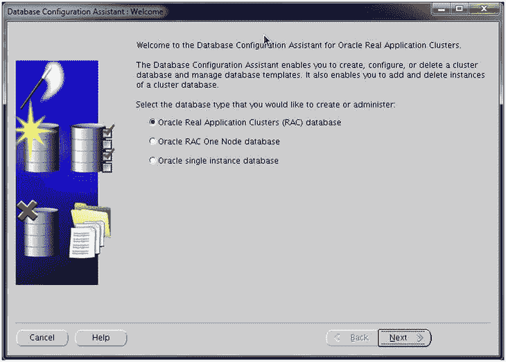

**图 4-1.** DBCA 启动屏幕

一旦 `DBCA` 被调用并启动，你就可以执行创建或管理数据库的所有常规功能，就像在日常管理中一样。图 4-2 提供了五个不同的选项，用于创建或管理数据库。这些选项是许多数据库管理员在使用 `DBCA` 创建或管理数据库时习惯看到的。

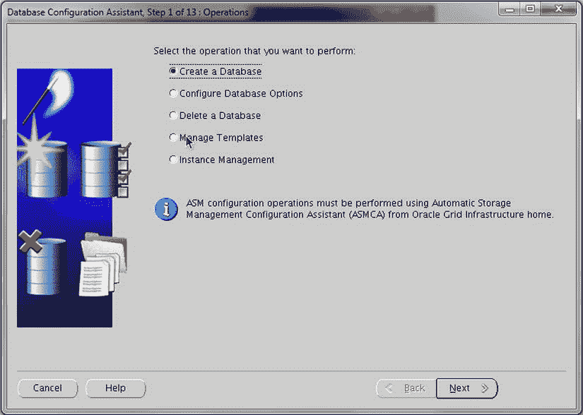

**图 4-2.** DBCA 操作

让我们看看如何使用数据库配置助手工具在 Oracle 数据库一体机上创建数据库。选择 `创建数据库` 选项，然后单击 `下一步`，系统将显示创建数据库的模板选项。这些模板选项（见图 4-3）与在命令行调用 `oakcli` 时出现的大小选项相对应。就像命令行选项一样，选择你想要创建的数据库大小。

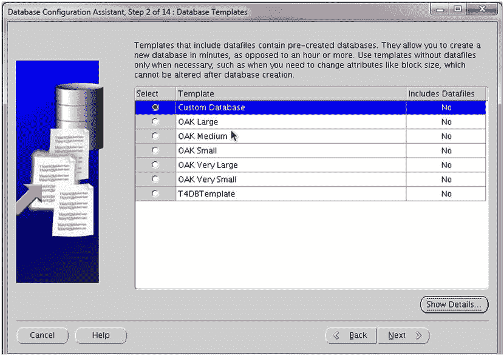

**图 4-3.** 数据库模板

一旦你单击 `下一步`，`DBCA` 将要求你提供与数据库关联的命名信息（见图 4-4）。你还会在 `DBCA` 屏幕上注意到两个选项：`管理员管理` 和 `策略管理`。这两个选项决定了数据库在 Oracle 数据库一体机内的集群件中将如何被管理。

**注意**

`管理员管理` 意味着数据库将绑定到特定的服务器。`策略管理` 意味着实例是动态的，并自动基于服务器池以实现有效的资源利用。

此外，你会注意到集群关联的两个节点名称被列出。通过选择其中一个或两个节点，数据库将在所有选定的节点上创建。默认情况下，你运行 `DBCA` 的节点将被高亮显示且是必需的。如果某个节点未被选中，则它将不会包含在你的数据库配置中。

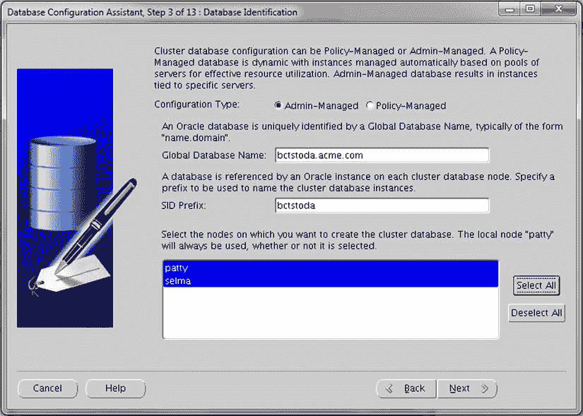

**图 4-4.** 数据库标识

通过使用 `DBCA` 在 Oracle 数据库一体机上创建数据库，你将可以选择将数据库附加到 Oracle 企业管理器（见图 4-5），如果你希望通过一个中心点监控一体机上的数据库。如果需要，配置数据库控制台的选项也同样可用。这是一种无需使用 `oakcli` 命令行选项即可获得的灵活性。

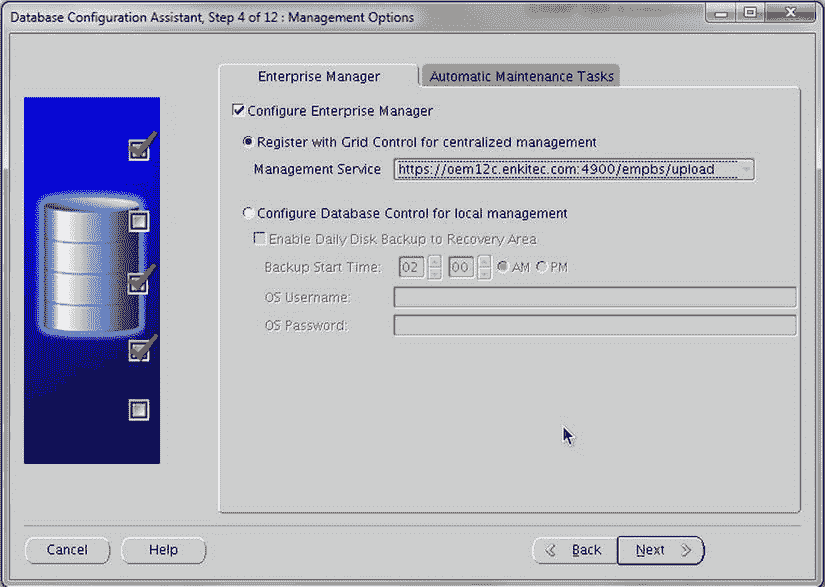

**图 4-5.** 配置监控

在同一屏幕上，你会看到一个名为 `自动维护任务` 的选项卡（见图 4-6）。启用自动任务可以帮助你管理一系列管理功能。在此选项卡上，你可以通过勾选或取消勾选相关的复选框来启用或禁用此任务自动化。

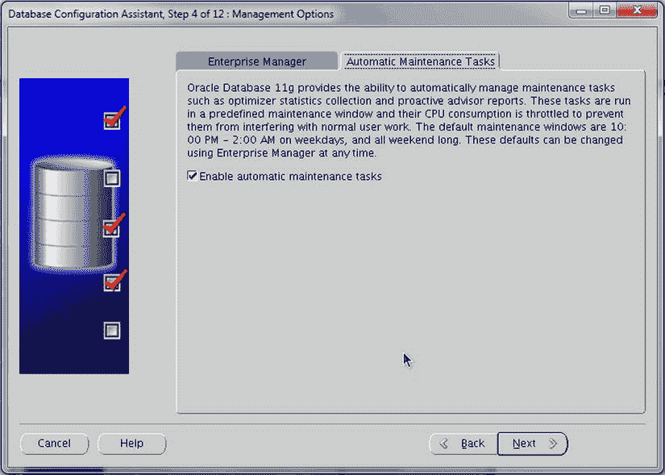

**图 4-6.**


### 启用/禁用自动维护任务

根据您的安全要求，数据库可以配置为所有账户使用相同密码，或为不同账户设置不同密码（参见图 4-7）。这是保护数据库的标准 `DBCA` 方法。此处使用 `DBCA` 可以设置 `SYS` 和 `SYSTEM` 账户的密码；而使用 `oakcli` 命令行选项时，这些密码在创建后由默认密码处理，直到被更改。

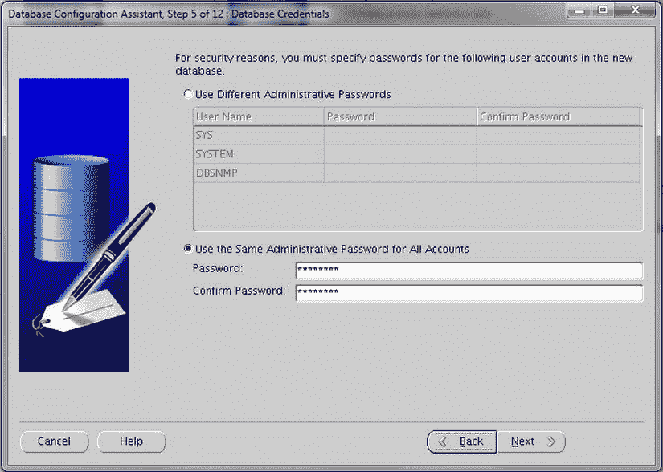

图 4-7. 设置数据库凭据

在您提供账户密码后，`DBCA` 会询问您希望将数据库特定项目（如数据文件、日志文件和控制文件）放置在何处。Oracle 数据库一体机内置了所有组件并配置了自动存储管理 (`ASM`)，默认是将这些项目存储在 `ASM` 上。但是，您可以在图 4-8 中看到，您可以在集群文件系统 (`CFS`) 和 `ASM` 之间选择存储位置。

使用 `oakcli` 配置数据库时，会自动在 `ASM` 上进行配置。通过使用 `DBCA` 管理数据库，您可以更好地控制数据库文件的安装和配置位置。

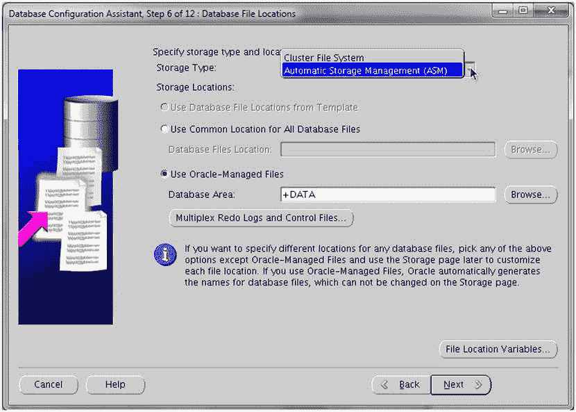

图 4-8. 数据库文件位置

使用 `oakcli` 和 `DBCA` 的另一个主要区别在于，当您特别想配置归档日志模式和快速恢复区 (`FRA`) 时。使用 `oakcli`，这些选项无法直接从命令行获得。使用 `DBCA`，您可以指定位置、大小以及是否应启用归档日志。图 4-9 重点展示了可以在 `DBCA` 实用程序中配置的项目。

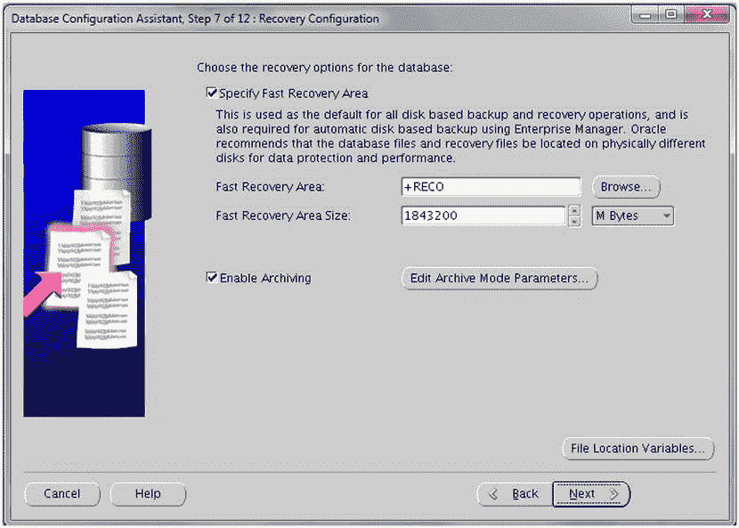

图 4-9. 恢复信息配置

至此，在 Oracle 数据库一体机上使用数据库配置助手 (`DBCA`) 时，您已经能够选择和更改那些在 `oakcli` 实用程序中无法触及的设置。使用 `DBCA` 创建数据库的部分灵活性在于，虽然您选择了用于数据库大小调整的模板，但您可以根据需要调整 `SGA` 和 `PGA`。图 4-10 中的对话框允许您进行这些调整，就像使用 `DBCA` 创建任何常规数据库时所做的那样。与 `oakcli` 命令相比，您会再次看到 `DBCA` 提供了命令行所不具备的灵活性级别。

虽然可以配置内存设置，但您还可以配置数据库的大小、字符集和连接模式。但是，请记住，大小、字符集和连接模式选项卡上的信息是由您在之前屏幕上选择的 ODA 模板配置的。尽管这些项目中的许多可以更改，但它们也取决于最初启动 `DBCA` 时选择的模板。

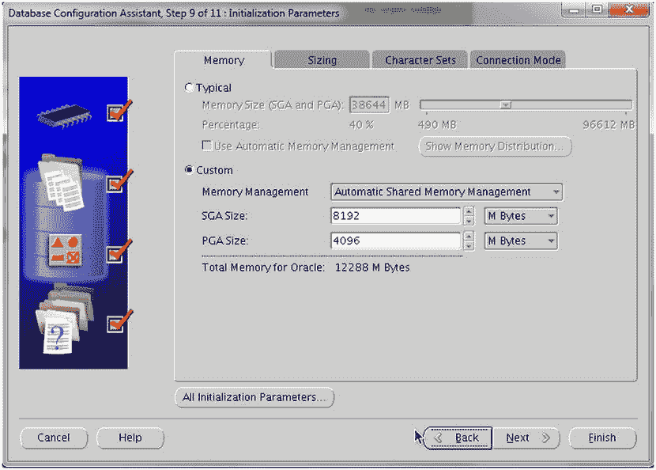

图 4-10. 初始化参数和环境大小调整

当您最终到达 `DBCA` 的最后一步时（参见图 4-11），您可以选择将配置保存为模板，并生成可用于未来数据库部署或其他 Oracle 数据库一体机的脚本。

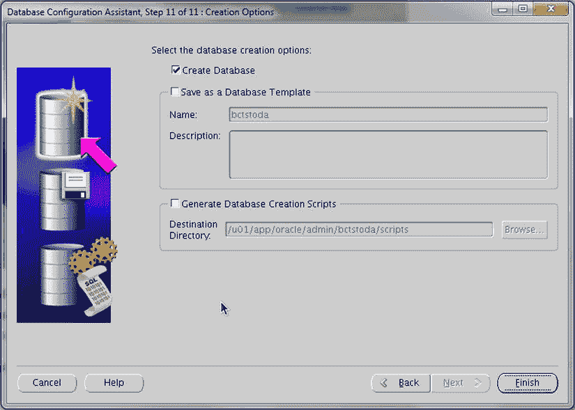

图 4-11. 创建选项

可以看出，使用数据库配置助手 (`DBCA`) 配置数据库比使用 `oakcli` 命令需要更多时间。使用这两种工具都可以创建数据库；哪种工具更适合这项工作取决于您自己。Oracle 在使用 `oakcli` 选项在短时间内快速创建数据库方面做得非常出色。另一方面，Oracle 在使用配置助手创建数据库时也给了 DBA 很大的灵活性。

### 删除数据库

与使用数据库配置助手 (`DBCA`) 创建数据库一样，也可以使用 `DBCA` 从 Oracle 数据库一体机中删除数据库。在本章前面，我们了解了使用 `oakcli` 命令行方法删除数据库。`oakcli` 方法更简单快捷。然而，`DBCA` 提供了相同的功能。实际上，`oakcli` 命令实际上是在后台静默调用 `DBCA`。

当您查看图 4-2（本章前面部分）时，您会看到有一个删除数据库的选项。如果您选择此选项并继续向导，系统将询问您要删除哪个数据库（参见图 4-12）。

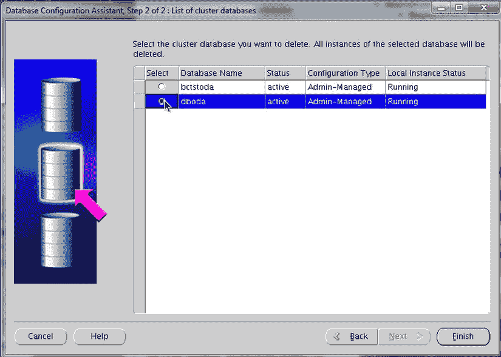

图 4-12. 选择要删除的数据库

请注意，图 4-12 中的 `DBCA` 会告诉您数据库的当前状态、它使用的配置类型以及它是否正在运行。这些都是帮助您决定是否要删除数据库的指标。单击“完成”后，已突出显示的数据库将从 Oracle 数据库一体机中删除。

本章的第一部分是关于如何从 Oracle 数据库一体机添加或删除数据库。您已经了解了如何使用 `oakcli` 命令通过命令行创建和删除数据库。此外，您还了解了如何使用数据库配置助手执行相同的任务。根据您在此类工程化环境中创建数据库的方法，这两种方法各有利弊。本章尚未涉及的一个主题是自动存储管理。我们在讨论数据库配置助手时曾提到过它；但是，有哪些工具可用于帮助您管理一体机上的 `ASM` 呢？

## 自动存储管理 (ASM)

自从 Oracle 十多年前发布 Database 10g 以来，自动存储管理的概念对许多 DBA 和存储管理员来说，要么令人困惑，要么引人入胜，或者两者兼而有之。`ASM` 的基本概念是为 Oracle 数据库提供一个中心存储点，同时最小化管理开销。出于这些原因，`ASM` 被用于 Oracle Real Application Clusters，并迅速成为配置 RAC 集群的稳定存储选项。现在，让我们看看 `ASM` 是如何在 Oracle 数据库一体机上配置的，以及有哪些工具可用以帮助您管理已配置的 `ASM`。


### 自动存储管理配置助手

自动存储管理配置助手 (`ASMCA`) 是在图形用户界面环境中与自动存储管理 (`ASM`) 进行交互的核心工具。图 4-13 展示了通过图形界面操作 `ASM` 时使用的界面。

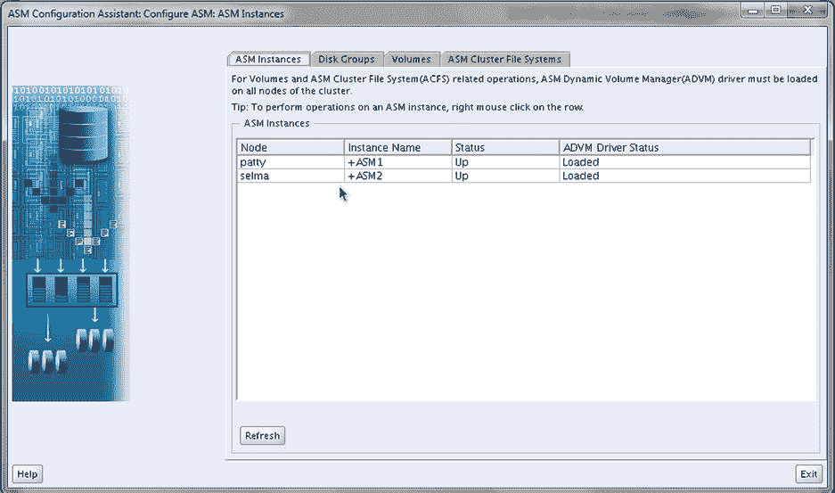

图 4-13. 自动存储管理配置助手

通过使用 `ASMCA` 工具，您可以了解 Oracle 数据库一体机在存储层面的配置情况。界面中有多个选项卡，可帮助识别当前在 Oracle 数据库一体机上运行的 `ASM` 实例、在 `ASM` 内已分配的磁盘组、已格式化为卷的挂载点，以及在一体机上定义的 `ASM` 集群文件系统。

考虑到大多数 Oracle 数据库一体机在初始安装时默认已配置所有存储，`ASMCA` 工具主要用于重新配置或添加额外存储。`ASM` 磁盘组的初始大小可以从 `ASMCA` 的磁盘组表中识别。在此选项卡中（参见图 4-14），如果您想添加额外磁盘或创建新磁盘组，可以使用“创建”按钮；该选项卡还会弹出用于添加额外磁盘的界面（参见图 4-15）。

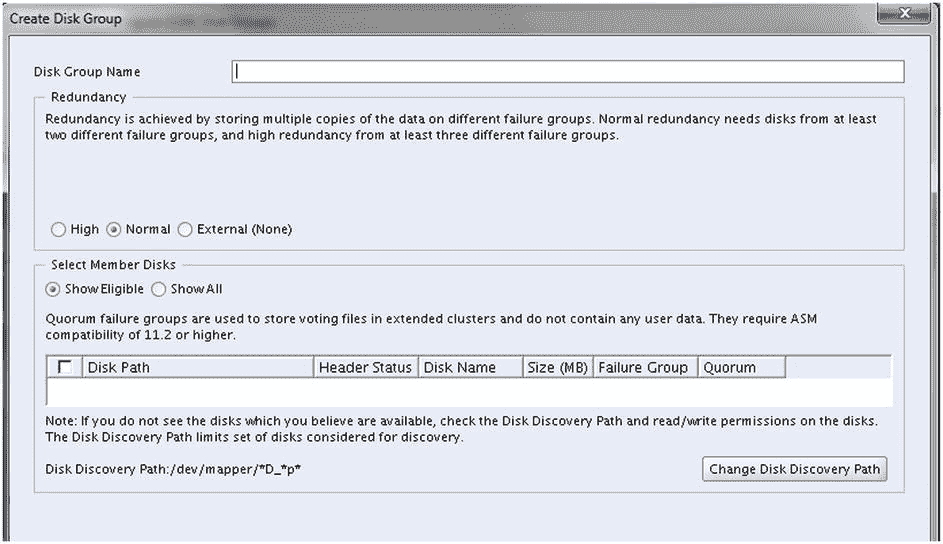

图 4-15. 添加磁盘组

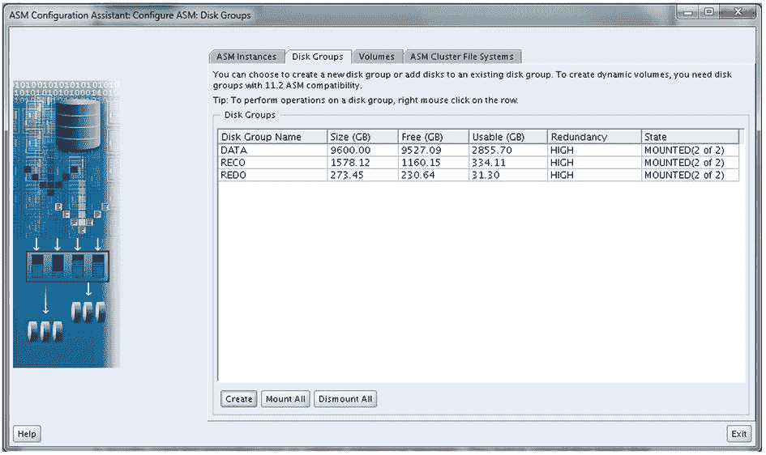

图 4-14. ASM 磁盘组

在进行任何重大更改之前，建议您仔细查看 Oracle 数据库一体机上 `ASM` 及相关 `SAN` 的详细信息。

现在，让我们深入了解更多关于自动存储管理及其配置方式的内容。

### 自动存储管理命令行

与 `ASM` 交互的另一种方式是通过命令行；用户可以使用 `asmcmd` 命令行工具从命令行访问 `ASM`。为了从命令行访问 `ASM`，用户需要以 Grid Infrastructure 软件所有者的身份登录操作系统。这通常是 `grid` 用户。代码清单 4-13 展示了以 `grid` 用户登录后如何进入 `asmcmd` 提示符。

代码清单 4-13. 从命令行访问 ASM
```
[root@patty bin]# su - grid
[grid@patty ∼]$ . oraenv
ORACLE_SID = [grid] ? +ASM1
The Oracle base has been set to /u01/app/grid
[grid@patty ∼]$ asmcmd -p
ASMCMD [+] >
```

需要注意的一点是使用了 `–p` 选项。此选项将在 `ASMCMD` 提示符末尾放置 `[+]`，并且每次更改目录时它都会变化。以这种方式访问 `ASM` 可以让您查看与数据库相关的文件，并识别 `ASM` 中可能存在的任何问题。在 `Windows` 和 `UNIX` 上与 `ASM` 一起使用的所有命令都是 `UNIX` 风格的命令。

## 本章小结

在本章中，您了解了如何在 Oracle 数据库一体机上创建和删除数据库。我们快速浏览了如何与 Oracle 的自动存储管理进行交互。如前所述，Oracle 数据库一体机本质上是一个双节点真正应用集群，可以配置许多不同风格的数据库，并且具有足够的灵活性，使企业能够以最少的资源进行构建和扩展。

