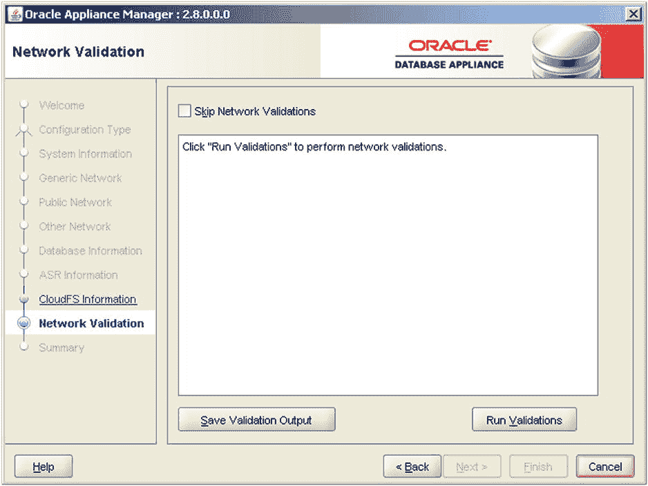
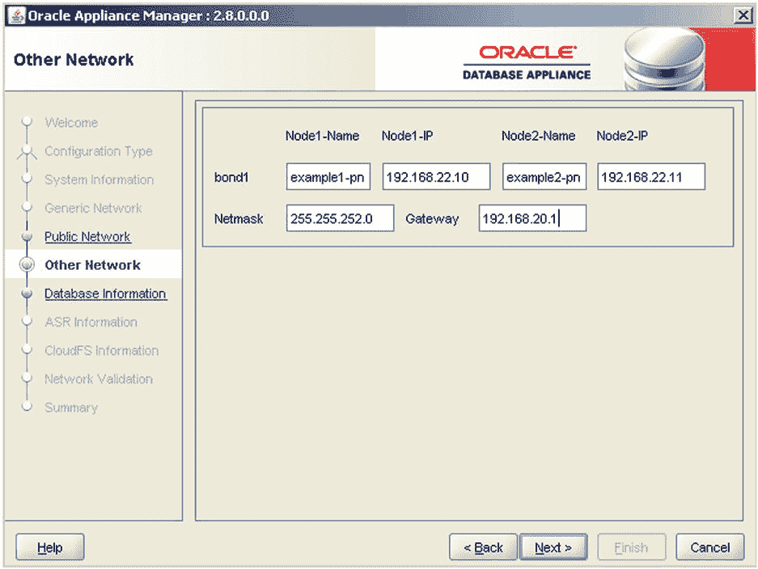
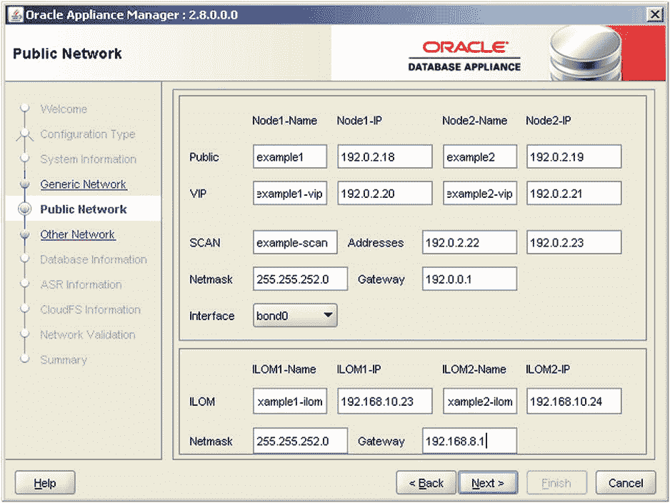
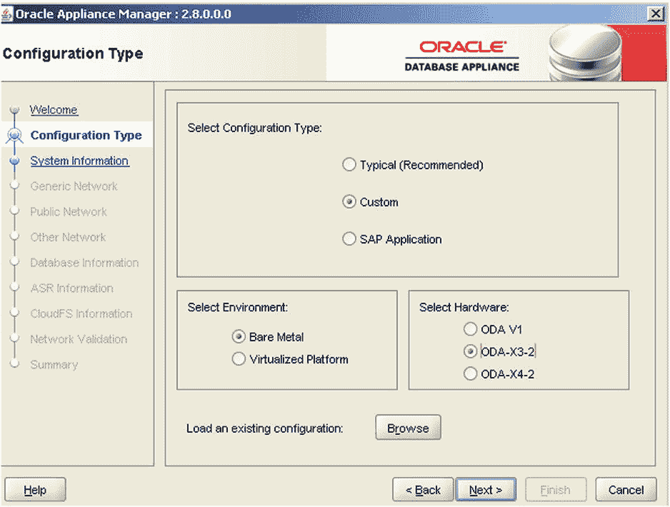
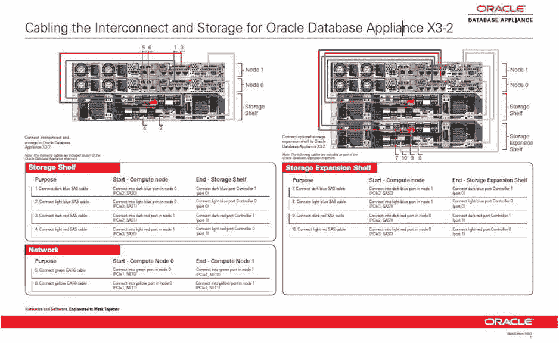

# 5. 网络

摘要

对于任何考虑将 `ODA` 作为其公司解决方案的人来说，理解网络部署都很重要。您需要理解 `ODA` 提供的网络，以确定它们如何符合您的需求和数据中心标准。在您的网络规划过程中可能需要考虑安全要求。专用系统的部署通常涉及融合或拓宽工作角色，因为以前由多个团队处理的任务现在被打包到专用系统解决方案中。在公司部署新解决方案时，您很少能简单地将文档交给您的网络和数据中心团队，并要求他们制定网络要求。您可能需要直接参与为部署您的 `ODA` 准备网络规范，或者至少理解各种选项以回答来自其他团队的问题。本章将帮助您理解您的 `ODA` 网络部署选项。

对于任何考虑将 `ODA` 作为其公司解决方案的人来说，理解网络部署都很重要。您需要理解 `ODA` 提供的网络，以确定它们如何符合您的需求和数据中心标准。在您的网络规划过程中可能需要考虑安全要求。专用系统的部署通常涉及融合或拓宽工作角色，因为以前由多个团队处理的任务现在被打包到专用系统解决方案中。在公司部署新解决方案时，您很少能简单地将文档交给您的网络和数据中心团队，并要求他们制定网络要求。您可能需要直接参与为部署您的 `ODA` 准备网络规范，或者至少理解各种选项以回答来自其他团队的问题。本章将帮助您理解您的 `ODA` 网络部署选项。

## ODA 型号

Oracle 发布了两种 `ODA` 型号。这些型号的网络方面存在显著差异。接下来的两个小节将描述这两种型号上可用的网络。


### Oracle Database Appliance V1 网络配置详解

### 硬件概述

第一代 ODA 产品被称为 Oracle Database Appliance，通常被称为 ODA V1。它是一个单体设备，包含两台标准的 Sun Fire X4370 M2 服务器和 24 个磁盘驱动器，其中 20 个用于共享存储。V1 与当前的模块化型号 `X3-2` 占用相同的 4U 机架空间。

### 网络配置

ODA V1 的服务器节点与当前 `X3-2` 型号的区别在于，它包含一个支持 10G 光纤布线的光纤网卡。而新的 `X3-2` 型号目前仅支持铜缆。ODA V1 的 10G 光纤网络可以部署为公网或私有备份网络。由于只支持一个 10G 网络，它必须用于公网或备份网络其中之一，不能同时用于两者。

除了 10G 网络，ODA V1 还支持用于公网的一对绑定的 1G 接口，以及四个额外的 1G 网络接口，可以部署为两个绑定网络用于其他用途。ODA V1 理论上可以部署为一个 10G 绑定网络和三个额外的 1G 绑定网络，此外还有 `ILOM` 和串行连接。

10G 光纤网络需要在光纤电缆连接的两端都使用 10G 小型可插拔（`SFP`）收发器。这包括连接到设备上 `PCIe0` 网络端口的连接，以及连接到交换机或网络结构扩展器的光纤电缆连接。例如，一个绑定的 10G 备份网络需要四条光纤电缆，即每个服务器节点两条。因此总共需要 8 个 `SFP` 适配器，每条光纤网络电缆两个。`SFP` 适配器价格稍高，因此其成本需要计入预算。它们的尺寸和外观类似于普通的 `USB` 闪存驱动器。

ODA 的网络接口通常是绑定的。这意味着两个网络接口被组合成一个逻辑单元，由操作系统网络软件组件管理。这提供了网络冗余。每个绑定对的网络电缆可以布线到不同的交换机或网络结构扩展器。这样，如果某个交换机、电缆连接或服务器网络接口发生故障，网络流量将故障转移到仍在工作的接口，以避免网络中断。

原始 Oracle Database Appliance `V1` 型号部署的网络列于表 5-1。请注意，`ODA V1` 设备有两个服务器节点，每个节点都将包含这些网络接口。

表 5-1. 原始 ODA 型号部署的网络

| 网络 | 绑定 / 端口 | 用途 |
| --- | --- | --- |
| 10G 光纤 | 绑定: `Xbond0` - 端口: `eth8`, `eth9` (标记为 `PCIe0`) | 两个 10G 光纤端口，可用于公网或备份网络，但不能同时用于两者。 |
| 1G 铜缆 | 绑定: `bond0` - 端口: `eth2`, `eth3` (标记为 `net0`, `net1`) | 两个绑定的端口，如果使用，则必须用于公网。 |
| 1G 铜缆 | 绑定: `bond1` - 端口: `eth4`, `eth5` (标记为 `PCIe1`) | 一个额外的 1G 网络，如果 10G 网络用于公网，它可以用作备份网络，或者用于其他目的，例如挂载 `NFS` 存储。 |
| 1G 铜缆 | 绑定: `bond2` - 端口: `eth6`, `eth7` (也标记为 `PCIe1`) | 一个可按需部署的额外 1G 网络。 |
| 管理网络 | `NetMgt` | 用于 `ILOM` 连接的 10/100 Mbps `RJ45` 网络连接。这是一个未绑定的单一连接。 |
| 串行连接 | `SerMgt` | 此连接用于支持来自外部 `KVM`（键盘、视频、鼠标）设备或您笔记本电脑的串行连接，以便部署 `ODA`。 |

原始 `ODA V1` 型号还配有一个 `USB` 连接和一个视频端口。

### 参考与注意事项

关于物理设备网络连接的详细信息记录在《ODA 所有者指南》中。当前章节名称为“Attaching Cables and Power Cords”。请记住，`Oracle` 会为每个新版本季度更新其手册。`Oracle` 文档的结构可能会发生变化。

在查阅《所有者指南》获取参考信息时，您必须小心。《所有者指南》目前分为两个部分。第一部分涵盖原始的 Oracle Database Appliance 型号。第二部分涵盖后继型号，并标记为“Oracle Database Appliance `X3-2`”。

我们不会在本网络章节中包含太多关于原始 Oracle Database Appliance 型号的信息。`Oracle` 已于 2013 年 4 月停止销售该型号。任何购买此型号的用户应该已经部署了它。此外，该型号已涵盖在 `Oracle` 手册中。`Oracle` 在手册中保留已停售型号信息的原因很简单：（1）信息不会改变，以及（2）新的 `ODA` 软件版本向后兼容旧型号。例如，当 `ODA 2.8` 版本发布时，它在原始 `V1` 型号上进行了测试。文档包含在旧型号上部署新版本的任何特殊说明。裸机部署仍然可以在旧型号上进行，并且 `Oracle` 已更新了 `Oracle Appliance Manager Configurator` 实用程序，其中包含了硬件型号以考虑型号之间的网络差异。


### Oracle Database Appliance X3-2

ODA 的下一次发布带来了一些重大的网络变更。X3-2 型号不再包含光纤网卡。这一变化让不少 ODA 客户——甚至 Oracle 内部及合作伙伴中的一些人——感到意外，因为部分客户的 10G 网络仅支持光纤。

最终，一些客户选择的解决方案是将 10G 铜缆从 ODA 桥接到网络结构扩展器或交换机。从该交换机，10G 光纤可以部署到数据中心的光纤网络中。Oracle 甚至开始销售用于此目的的交换机。这种对 10G 光纤支持的变通方案可能有点**价格不菲**，因此你需要将相关成本计入预算。

随着新型号的发布，Oracle 可以更改其支持的网络，因此未来 10G 光纤支持可能会回归。你需要查阅每个新版本的 Oracle 手册，以审阅所包含网络数量或类型的任何变更。

X3-2 ODA 型号从一个包含两个服务器节点和一组磁盘驱动器的单一封装箱体，转变为采用模块化设计，使用来自通用 Oracle X3-2 服务器产品线的两个服务器，以及一个或两个独立的存储单元。新的模块化 X3-2 ODA 支持四个外部网络接口。网络速度可以是 100M、1G 或 10G。连接仅支持铜缆，网络速度为自动协商。

Oracle 最初发布多款带有 X3-2 名称的产品有些令人困惑。你可以订购 X3-2 服务器作为独立的 ASR 服务器或 Exadata Platinum Support Gateway，也可以订购 X3-2 Oracle 数据库一体机以及 X3-2 Exadata 机器。

适用于 X3-2 ODA 型号的网络列于表 5-2 中。X3-2 ODA 有两个服务器节点，每个服务器将包含表中所列的网络接口。

表 5-2. 第二代 ODA 型号部署的网络

| 网络 | 绑定 / 端口 | 用途 |
| --- | --- | --- |
| 100M/1G/10G 铜缆 | 绑定: `bond0` - 端口: `eth2`, `eth3` (标记为 `net0`, `net1`) | 两个 100/1000/10000 铜缆端口，可用于公共网络。ODA 部署过程会将`bond0`作为公共网络。 |
| 100M/1G/10G 铜缆 | 绑定: `bond1` - 端口: `eth4`, `eth5` (标记为 `net2`, `net3`) | 两个 100/1000/10000 铜缆端口，通常用于备份或你选择的其他网络。 |
| 管理网络 | `NetMgt` | 用于`ILOM`连接的 10/100 Mbps RJ45 网络连接。这是一个独立的、未绑定的连接。 |
| 串行连接 | `SerMgt` | 此连接用于支持来自外部 KVM（键盘、视频、鼠标）设备或笔记本电脑的串行连接，以部署 ODA。 |

用于部署 ODA 的 Oracle Appliance Manager Configurator 实用程序会假定网络连接是绑定的。然而，通过跳过绑定步骤，也有可能将网络部署为独立的非冗余连接。要做到这一点，涉及一些手动工作，且该过程未包含在标准 ODA 文档中。如果你决定在 ODA 开箱即用流程之外部署网络，可能需要一位经验丰富的系统管理员来帮忙。

X3-2 ODA 的网络细节在《Oracle Database Appliance Owner’s Guide》第二部分的“连接电缆和电源线，并启动 Oracle Database Appliance X3-2”章节中有详细说明。该章主要侧重于实现随 ODA 发货的电缆以将所有 ODA 组件连接在一起。你需要仔细阅读该章才能找到有关外部网络连接的细节。其他参考信息可以在 ODA 快速入门指南的第 1 章和附录 A 中找到。

## ODA 网络部署流程

可以使用以下小节概述的流程部署 ODA 网络。这些步骤大多都是必需的，但本质上相当简单。这些步骤大致按其应该发生的顺序列出。当然，每家公司都有自己的标准和方法在数据中心及其网络中部署服务器。关键步骤如下：

规划将要部署哪些 ODA 网络。  
定义网络安全注意事项。  
在 ODA 到达前完成可以完成的工作。  
规划并订购 ODA 网络电缆。  
申请 IP 地址。  
构建离线配置文件。  
将 ODA 上架。  
为 ODA 布线，包括内部布线。  
应用`ILOM` IP 地址并配置 ODA 公共网络。  
运行 ODA 部署流程以配置剩余网络。

### 规划将要部署的 ODA 网络

X3-2 ODA 型号支持两个绑定网络。其中一个肯定会用于公共网络。第二个网络通常用作备份网络。可以解除一个或两个网络的绑定，以利用所有四个外部网络连接，代价是失去网络冗余。一个例子是部署一个绑定的公共网络、一个用于备份网络的单独连接，以及一个额外的网络来支持`NFS`存储挂载。虽然通过公共网络挂载`NFS`存储也是可能的，但当服务器与`NFS`存储之间有大量数据流传输时，可能会出现性能问题。由于 ODA 提供了非常大的内部存储容量，对外部存储挂载的需求已有所减少。

注意

本节的关键点是，第一个网络部署步骤是规划你的解决方案需要哪些网络，并将这些要求与 ODA 网络选项相匹配。理解需要支持的工作负载也可能是规划 ODA 网络时的一个重要考虑因素。

ODA 现在可以存储大量数据。如果部署的数据库有严格的`RTO`（恢复时间目标）要求，并且规模很大，那么使用 10G 备份网络有助于实现更好的备份和恢复性能。这将是部署标准`RMAN`调优步骤之外的补充。如果你通过`NFS`挂载连接到备份网络，则可以实施`DNFS`（直接 NFS）来加速备份和恢复吞吐量。许多资深的 Oracle DBA 和架构师遵循一句古老的格言：“专注于为恢复而设计架构，比为备份而设计更好。”如果你想确保覆盖所有恢复基础，你的网络规划就起着关键作用。

如果你的公司只使用 10G 光纤或其他光纤网络基础设施，那么可能需要额外的规划，并可能产生成本，以将 ODA 的铜缆桥接到你的光纤网络。如前所述，这在新型号发布时可能会发生变化。


### 定义网络安全考虑因素

数据的性质和相关的安全风险考虑因素可能要求您的`ODA`被部署在特定的 IP 地址段、VLAN 或特定防火墙之后。最好尽早与您的安全和网络团队一起规划好网络安全需求，以免延误项目进度。每家公司都有其网络安全的流程和标准，以及对于是否需要在网络层部署加密的抉择。这项工作可以在您订购`ODA`之前就开始，这样网络需求就不会成为减缓`ODA`部署速度的瓶颈。

在当今对`DBaaS`（数据库即服务）和云部署的热潮中，根据应用和安全分级预先部署基础设施并不罕见。安全或其他网络需求预先规划得越充分，您实现`ODA`快速部署优势的可能性就越大。部署基础设施“准时制”，而非“过早”或“过晚”，能带来财务上的好处。

### 在 ODA 到达前可完成的工作

识别出您可以提前完成或并行完成的工作，这样当`ODA`到达时，便可以立即进行线缆连接，并利用“一键式”部署自动化功能进行部署。一些在`ODA`到达前可以完成的任务包括本章概述的多个实施步骤，例如：

*   规划网络。
*   敲定安全考虑因素。
*   申请 IP 地址。
*   提交线缆连接请求并订购必要的电缆。
*   提交`DNS`和防火墙请求。
*   确定机架位置。
*   使用`Oracle Appliance Manager Configurator`工具的离线模式构建部署配置文件。

笔者曾亲眼见证多台`ODA`运抵码头后，在 48 小时内就作为完全部署好的`RAC`集群运行起来。运输时间不可浪费。利用这段时间做好准备，以便您的`ODA`设备到达时一切就绪。

既然现在除了数据库，还可以在`ODA`上部署应用程序，您的网络规划可能需要扩展到应用层。Oracle 支持在`ODA`上部署应用程序，以便快速运行完整的应用程序解决方案。Oracle 在`入门指南`中包含了详细说明在`ODA`上安装和支持虚拟化过程的信息。

应用需求会影响您的网络规划。除了需要更多 IP 地址外，应用程序可能还需要与数据库服务器位于不同的网络上。这可能是出于安全考虑等因素。

当`ODA`首次发布时，许多合作伙伴和顾问制作了视频或博客，详细介绍`ODA`的部署速度有多快。有一个案例中，网络电缆被拉到码头，以便在`ODA`还处于运输托盘上时就进行部署。您现在仍可以在 YouTube 上找到一些这样的视频。实时的`ODA`构建演示曾在多个 Oracle 用户大会上重点展示过。

尽管`ODA`可以快速部署这一点已被多次证明，但始终确保正确部署它们非常重要。规划有助于实现这一点。在`ODA`部署完成后更改网络始终是可能的。关于进行其中一些更改的选项将在后续章节中讨论。如果情况最糟，您总可以对`ODA`进行裸机重装以重新开始。但如果您遵循老木匠“量两次，切一次”的准则，就可以避免昂贵的返工。

### 规格说明与订购 ODA 网络电缆

在您的网络上部署`ODA`的好消息是，一旦您首次部署了某个`ODA`型号，所有为该型号发布的其他`ODA`都是相同的。您只需为某个型号解决一次布线图。建议使用标准模板为每次`ODA`部署正式准备网络和布线规格。除非您是在一个非常小的 IT 部门工作，否则不要假设您的网络和数据中心团队会记得他们上次部署`ODA`时做了什么。

另外几条有用的经验法则是：了解您数据中心申请布线的前置时间，以及“与您的网络和数据中心人员搞好关系”。前置时间可能因电缆类型而异；例如，您是否需要将铜缆转换为光纤？至于“搞好关系”这一点，其重要性不言自明。

### 申请 IP 地址

部署`ODA`所需的 IP 地址在`ODA 入门指南》题为“关于 Oracle 数据库一体机”的章节中有文档说明。部署`ODA`的需求对于原始 Oracle 数据库一体机和第二代`X3-2`型号都是通用的。物理`ODA`部署（也称为`裸机（非虚拟化）安装`）的 IP 地址段要求列于表 5-3 中。

表 5-3. 裸机（非虚拟化）安装的 Oracle 数据库一体机 IP 要求

| IP 类型 | IP 数量 | 注释 |
| --- | --- | --- |
| 公网 | 2 | 两个`ODA`服务器节点需要两个 IP 地址。每个服务器需要一个物理主机名的 IP 地址。 |
| Scan IP | 2 | 支持 scan 监听器的两个 IP 地址。`ODA`运行 2 个 scan 监听器。Scan IP 地址需要在`DNS`中配置为以循环顺序返回。 |
| `RAC` VIP IP | 2 | 每个服务器节点所需的典型`RAC`虚拟 IP 地址。 |
| `ILOM` IP | 2 | 每个服务器节点一个`ILOM`或管理网络 IP 地址。 |
| 附加网络 | 2 | 每个附加网络两个 IP 地址，或者每个服务器节点一个；例如，用于支持备份或`NFS`文件系统挂载的`PBN`（私有备份网络）。 |

六个公网（主机、scan、VIP）IP 地址需要位于同一网络子网中，并且应该是连续的。部署`ODA`所需的最少 IP 地址数量是八个。这包括六个公网 IP 和两个`ILOM` IP。`入门指南`将`ILOM`列为必需项。`ILOM`连接可以通过串口建立，此外也可以通过`NetMgt`接口创建永久连接。需要注意的是，配置工具在部署时并不强制要求`ILOM` IP。

除了外部网络，`ODA`还会分配四个额外的 IP 来支持`RAC`互联以及部署两个内部`RAC`网络，以支持`HAIP`（高可用 IP）冗余和故障转移。`RAC`互联 IP 地址是内部分配的，因此无需向您的网络团队申请。

虚拟化`ODA`部署所需的额外 IP 地址列于表 5-4 中。

表 5-4. 虚拟化安装的附加 Oracle 数据库一体机 IP 要求

| IP 类型 | IP 数量 | 注释 |
| --- | --- | --- |
| `Dom0` | 2 | 两个由 Oracle 固定的 IP 地址：`192.168.16.24`和`192.168.16.25`。 |
| 虚拟机 | 1 | 每个部署的虚拟机需要一个额外的 IP 地址。 |

虚拟化`ODA`部署仅为`RAC`互联分配两个 IP。

如果可能，应尽快申请并分配这些 IP 地址，或者至少在安全考虑因素确定后尽快申请。预先分配 IP 地址是支持实施`DNS`和防火墙规则以及构建部署配置文件的关键步骤。当这些先决条件完成后，一旦`ODA`上架且网络线缆连接完毕，`ODA`的部署过程就可以立即开始。


## 构建离线配置文件

ODA 部署文件是使用 Oracle Appliance Manager Configurator 实用程序构建的。该设备管理器可作为离线配置器，用于预先构建部署文件。Oracle Appliance Manager Configurator 目前可通过以下链接从 Oracle 下载：

[`www.oracle.com/technetwork/server-storage/engineered-systems/database-appliance/index.html`](http://www.oracle.com/technetwork/server-storage/engineered-systems/database-appliance/index.html)

《入门指南》详细说明了如何使用 Oracle Appliance Manager Configurator 实用程序。该配置实用程序可以在 ODA 上以实时模式运行，以交互方式构建 ODA。

ODA 配置实用程序可以在您的笔记本电脑或 ODA 上运行。如果您从笔记本电脑或台式机运行 ODA 配置实用程序，请确保运行的版本与您打算安装的 ODA 软件版本相匹配。

图 5-1 至 5-4 显示了许多 IP 地址。这些地址取自 ODA 入门指南示例（或是虚构的），以避免使用真实的 IP 地址。以下列出了图中屏幕截图显示的内容：


图 5-4. 运行可选的网络验证步骤


图 5-3. 为备份或其他用途配置额外的网络


图 5-2. 配置公共网络和 ILOM 网络


图 5-1. 选择硬件型号和部署类型（物理或虚拟）

*   图 5-1. 选择硬件型号和部署类型（物理或虚拟）。
*   图 5-2. 配置公共网络和 ILOM 网络。
*   图 5-3. 为备份或其他用途配置额外的网络。
*   图 5-4. 运行可选的网络验证步骤。

执行的网络验证检查确保以下条件成立：

*   即将部署的 IP 地址尚未被使用。这些 IP 地址应是不可 ping 通的。
*   网络网关应该已经可用。这些 IP 地址需要是可 ping 通的。
*   所有 IP 地址和主机名都必须能在 DNS 中解析，包括正向（主机名到 IP）和反向（IP 地址到主机名）查找模式。

## 将 ODA 安装到机架中

ODA 是一个 4U 的机架安装单元，包括存储单元。因此，您需要将该单元放入数据中心的机架中。ODA 发货时附带用于此目的的机架安装套件。

注意：如果配备第二个存储单元，机架占用空间将再增加 2U 到 6U。

ODA 需要放置在数据中心的机架中才能进行布线。将 ODA 安装到机架的过程在《ODA 所有者指南》的一章中有详细说明。该过程很简单，文档也很容易遵循。您的数据中心人员在安装 ODA 到机架时应该不会遇到任何问题。

## 为 ODA 布线

接下来，您应该进行适当的布线。ODA 需要完成两种类型的布线：

*   两个服务器节点、存储单元和可选存储扩展单元之间的内部布线。请使用 Oracle 随设备提供的布线。
*   连接到外部网络的布线。这里您必须使用自己的电缆。

如图 5-5 所示的 ODA 设置海报涵盖了将服务器节点、存储单元和可选存储扩展单元连接在一起的布线说明。该海报是已发布的最简单的说明，也是最好的起点。您首先会注意到电缆是颜色编码的。它们插入的网络插槽也是颜色编码的。

注意：设置海报随每台 ODA 一起提供，也可在 Oracle 手册 [`http://docs.oracle.com`](http://docs.oracle.com/) 中获取。

设置海报中概述的过程看起来足够简单。而且几乎确实如此。有些颜色彼此非常接近，因此您必须注意色调。我见过一些数据中心人员在连接上犯了一些错误的案例，有时是颜色让他们产生了混淆。在这个领域，可以让团队中的某个人专门负责进行这些连接，而不是分散这项工作。

在《ODA 入门指南》和《ODA 所有者指南》中都包含了更详细的文档，涵盖了服务器节点和存储单元之间的连接。这些手册包含额外的图表，提供了更多细节，并且可能比设置海报更容易阅读。


图 5-5. 每台 ODA 随附的 Oracle Database Appliance X3-2 设置海报

为了帮助验证内部连接，Oracle 建议在开始配置公共网络之前运行 `oakcli` 来验证布线。此步骤在《入门指南》的“部署”和“故障排除”章节中均有记录。以下是验证布线的命令：

```
### /opt/oracle/oak/bin/oakcli validate -c storagetopology
```

除了将 ODA 组件连接在一起所需的布线外，还需要完成外部布线。外部布线包括 ODA 与您数据中心网络之间的连接，如表 5-2 所述。这包括您的公共网络、专用网络和 ILOM 连接的布线。如果连接是绑定的，每个服务器节点将有两个公共电缆连接、两个专用网络连接和一个 ILOM 连接——两个 ODA 服务器节点总共需要十根网络电缆。当然，如果需要，可以重新配置连接，使其不绑定以部署额外的网络。修改网络接口的步骤在几个 Oracle 支持 MOS 说明中有所涵盖，包括 1422563.1、1436335.1 和 1442113.1，以及《Oracle Linux 管理手册》。


### 应用 ILOM IP 地址并配置 ODA 公共网络

为 ODA 的网络接口应用 IP 地址有多种选项。这些选项在 Oracle 部署文档中有详细说明，可以从设置海报、入门指南、用于裸机部署的 MOS note 1373617.1 或用于虚拟化部署的 MOS note 1520579.1 开始查阅。

文档中可能可以更清晰一些的一个地方是关于为 ODA 应用 IP 地址的过程。所有文档都指向以 `root` 身份使用默认密码登录每个 ODA 节点，然后在每个服务器节点上运行 `firstnet` 脚本来为每个主机配置公共网络。手册中也提到了一些先设置 ILOM 的内容，但信息不是很明确。因此，我们将尝试澄清这一点。

首先，在 ODA 上设置 ILOM 并开始添加 IP 地址的过程，与在 Oracle Solaris 服务器或任何其他 Oracle Linux 硬件上操作相同。如果您有经验丰富的系统管理员协助您部署 ODA，他或她已经知道该怎么做。首先应用 ILOM IP 地址来启动 ODA 的部署是一种非常高效的方式。

如果您是独自部署 ODA，不用担心——通过为每个服务器上的 ILOM 添加 IP 地址来开始并不难。但是，首先您必须决定如何连接到 ILOM 设备。至少有两种选项：

*   使用笔记本电脑和串口连接线连接到 ODA 串行端口。
*   使用串行控制台设备（如数据中心 KVM 推车或数据中心 KVM（键盘、视频和鼠标）设备）连接到 ODA。

通过笔记本电脑使用串行线连接到 ODA 服务器串行端口以访问 ODA ILOM 的方法，在 MOS note 1395445.1 中有 Oracle 的文档说明。同样，如果您有习惯于部署 Oracle 硬件的人员，他们已经多次这样做并知道如何操作。无论如何，该过程是直接了当的。只需按照 MOS 笔记中概述的步骤操作即可。

该过程的关键步骤如下：

1.  连接到每个节点的串行端口，从节点 0（底部单元）开始。
2.  使用 `root` 帐户登录；使用 ILOM 默认密码 “changeme”。
3.  应用 ILOM IP 地址。

使用以下命令语法将 ILOM IP 应用到每个服务器：

```
set /SP/network pendingipdiscovery=static
set /SP/network pendingipaddress=<IP Address>
set /SP/network pendingipgateway=<gateway-IPaddr>
set /SP/network pendingipnetmask=<netmask>
set /SP/network commitpending=true
```

以下是一个使用非真实 IP 地址的命令示例：

```
set /SP/network pendingipdiscovery=static
set /SP/network pendingipaddress=10.0.0.3
set /SP/network pendingipgateway=10.0.0.1
set /SP/network pendingipnetmask=255.255.255.0
set /SP/network commitpending=true
```

这些命令也可以链接在一起，如下所示：

```
set /SP/network pendingipdiscovery=static pendingipaddress=10.0.0.3 pendingipgateway=10.0.0.1 pendingipnetmask=255.255.255.0 commitpending=true
```

您可以通过运行以下命令来显示已配置的 ILOM IP 地址，以验证 IP 地址：

```
-> show /SP/network
```

大多数数据中心都会有一个可滚动的 KVM 推车，可用于启动部署过程。一些数据中心还会有一个带有 Web 界面的 KVM 设备，可以为 ODA 启动控制台会话。KVM 设备有多个带有串行线的端口，可以连接到数据中心机架，然后根据需要连接到 ODA。使用 KVM 设备可以避免亲临数据中心现场部署 ODA。

一旦 ILOM IP 地址应用完毕，就可以将公共网络 IP 地址应用到 ODA。Oracle 建议首先验证布线连接：

```
### /opt/oracle/oak/bin/oakcli validate -c storagetopology
```

如果报告了任何问题，您需要检查系统上的布线，然后重新运行检查。

一旦 ILOM IP 地址就位并且布线连接已验证，您就可以从 ILOM 连接到每个服务器节点来运行 `firstnet` 脚本，为每个主机配置公共网络。以下公共网络配置脚本使用默认 `root` 密码 “welcome1” 的 `root` 帐户在每个节点上运行，从节点 0（底部单元）开始：

```
### /opt/oracle/oak/bin/oakcli configure firstnet
```

## 配置剩余网络

一旦您应用了 ILOM 和主机公共网络 IP 地址，就可以继续部署过程，该过程将把剩余的 IP 地址应用到您的系统。运行 ODA 部署过程来配置剩余的网络。

如果您使用了 Oracle Appliance Manager Configurator 离线构建部署配置文件（其中包含已分配的 IP 地址），则需要通过运行 `oakcli copy` 命令来准备配置文件。如果您不使用配置文件，可以交互式运行 Appliance Manager Configurator。

通过运行带有完整路径和文件名的 `oakcli` 来准备先前创建的 ODA 配置文件，该文件已复制到 ODA。此步骤的命令语法记录在 ODA 入门指南附录的 `oakcli` 命令参考中。

```
### ./oakcli copy -conf /path/file_name.param
```

使用先前准备好的配置文件部署 ODA：

```
### ./oakcli deploy -conf /path/file_name.param
```

或者，您可以交互式部署 ODA（无需先前准备的配置文件）：

```
### ./oakcli deploy
```

如果您计划使用交互式方法，请务必通过 ODA `startx` 命令或通过 ODA 附带的 VNC Server 使用 GUI 界面运行该命令。

请务必阅读详细说明部署 ODA 所需全部任务的完整文档集。由于本章仅涉及 ODA 网络，因此我已将部署步骤限制在与 ODA 网络部署相关的步骤。

## 部署后进行网络更改的选项

在 ODA 部署完成后，有多种选项可用于进行网络更改。其中一种选择是通过"裸金属化"您的机器并重新开始部署来从头开始。执行此操作的步骤在 MOS 说明`1373599.1`中概述。根据您部署的状态，这可能是一个实用选项，也可能不是。

如果您有一位经验丰富的 Oracle 硬件和操作系统系统管理员与您合作，他或她应该已经熟悉硬件设置和网络更改。

Oracle 发布了多份 MOS 说明，用于进行以下类型的网络更改：

*   在部署已完成之后实施网络绑定（MOS `1422563.1`）
*   更改 ILOM 网络 IP 地址（MOS `1442113.1`）
*   更改 DNS 服务器（MOS `1600317.1`）

即使您不需要更改任何 ODA 上的 IP 地址，这些说明也值得一读，因为它们突显了 ODA 的自动化功能之一：`GridInst.pl`脚本。

`GridInst.pl`脚本在 MOS 说明`1409835.1`中有文档记录，可以在以下目录中找到：

`/opt/oracle/oak/onecmd/GridInst.pl`

通过查阅这些说明，您还可以了解到以下额外信息：

*   网络配置文件存储在`/etc/sysconfig/networking`和`/etc/sysconfig/network-scripts`中。
*   DNS 服务器条目存储在`/etc/resolve.conf`文件中。
*   `ifconfig`命令可用于显示您的 ODA 网络设置。
*   您的 ODA 部署设置存储在`/opt/oracle/oak/onecmd/onecommand.params`中。更新 ODA 后，您可能需要使用 Oracle 应用设备管理器配置实用程序生成新文件或修改文件。应用设备管理器的版本必须与机器的 ODA 版本匹配。此文件仅 root 账户可读。
*   您可以使用部署过程中运行的`GridInst.pl`脚本来修改现有的 ODA 配置，包括更改网络。
*   使用`-l`选项运行`GridInst.pl`脚本——如`GridInst.pl -l`——会显示该脚本运行的各个部署步骤的当前列表。`-l`选项用于确保在对 ODA 配置进行更改时重新运行正确的步骤。
*   `ipmitool`命令可以通过提供包装器来生成`/SP/Network`命令，从而更改 ILOM IP 地址。

最后，如果您对正在运行的 ODA 软件版本有任何疑问，可以以 root 身份运行以下命令：`/opt/oracle/oak/bin/oakcli show version`。

## 虚拟化注意事项

如果您正在对 ODA 进行虚拟化，则需要为将在 ODA 上创建的每个虚拟机准备一个额外的 IP 地址。ODA 上对多个 VLAN 的支持是在版本 2.8 中发布的，在本章撰写时该版本才发布一周。目前，所有关于 ODA 虚拟化支持的文档都发布在《入门指南》中。目前，该文档详细说明了以下内容：

*   如何创建 VLAN
*   如何删除 VLAN
*   如何列出部署在 ODA 上的 VLAN

由于在虚拟化 ODA 上支持多个 VLAN 是刚刚发布的，文档需要一些时间才能涵盖完全理解多 VLAN 支持所需的所有细节。在 ODA 虚拟化文档完善之前，有几种方法可以尝试填补空白。首先，您必须从理解为什么要在虚拟化 ODA 上使用多个 VLAN 开始。其次，您必须了解 ODA 上虚拟化的背景。VLAN（即虚拟局域网）将物理网络划分为多个逻辑网络。这样做可以创建多个网络来共享单个物理网络，从而增加 ODA 上可用网络的数量。也可以创建 VLAN，在 ODA 上提供多个网络，以支持出于安全原因的网络分段，或者在特定网络上创建虚拟机以匹配为应用程序其他组件部署的网络。可以配置 VLAN 来控制哪些网段流量可以在地址之间路由，以增强网络安全性。

可以部署在 ODA 上的虚拟化网络示例包括数据库网络、多个应用程序网络、管理（ILOM）网络以及备份或其他特殊用途网络。ODA 具有很大的容量，客户可能只授权设备上用于数据库处理的部分数据库核心。这为其他目的（包括在 ODA 上运行应用程序）留下了容量。

ODA 上的虚拟化功能于 2013 年 3 月在 ODA V1 的 2.5 版本和 X3-2 型号的 2.5.5 版本中引入。Oracle 虚拟化已经存在一段时间，但在 ODA 上的实现是定制和简化的。所有部署和管理步骤都已内置到命令行工具 oak 应用套件（`oakcli`）实用程序中，而不是使用单独的虚拟管理器和 GUI 控制台来管理虚拟机、其服务器池和网络。因此，Oracle VM 功能必须移植到 ODA 上，这意味着存在一个开发周期，功能根据路线图和时间表交付。

ODA 虚拟化功能可能落后于主流 Oracle VM 产品。尽管如此，Oracle 正在将 VM 模板移植到 ODA 上。要跟上支持应用程序模板的发布周期，您可以搜索“Oracle Database Appliance Solution in a Box”，以了解 Oracle 及其合作伙伴正在部署的新型 ODA 应用程序解决方案。

您必须记住，ODA 虚拟化实现的是由您的网络团队创建的 VLAN。它们不是由 ODA 创建的。必须在与 ODA 连接的网络交换机上执行配置工作以启用虚拟网络。

需要记住的要点是，ODA 可以实现虚拟网络，以支持在虚拟化 ODA 设备上部署的数据库和应用程序。需要设计和规划才能为虚拟化 ODA 解决方案正确创建网络。

## 总结

本章概述了实施支持 ODA 部署所需网络的要求。它提供了可用网络、IP 地址和布线要求的列表，并详细介绍了部署 ODA 网络的过程。

概述了在 ODA 部署完成后更改网络信息的过程。最后，讨论了在虚拟化 ODA 环境中必须考虑的一些因素。

ODA 为部署设备（包括网络的配置和设置）提供了一个“保持简单”的模型。ODA 支持标准的关键 Oracle Linux 和硬件实用程序来管理设备。因此，设备的管理是灵活的，同时提供了额外的选项，例如用于自动化部署后网络更改的`GridInst.pl`脚本。


