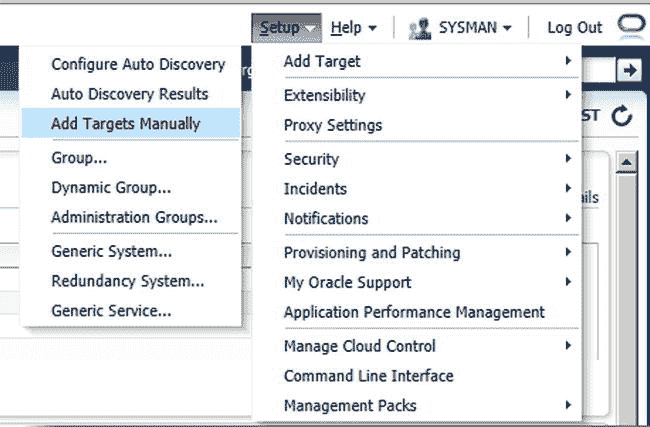
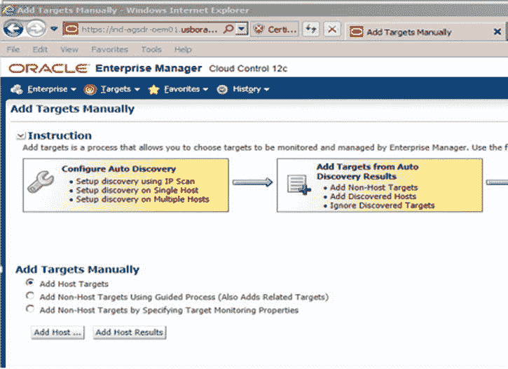
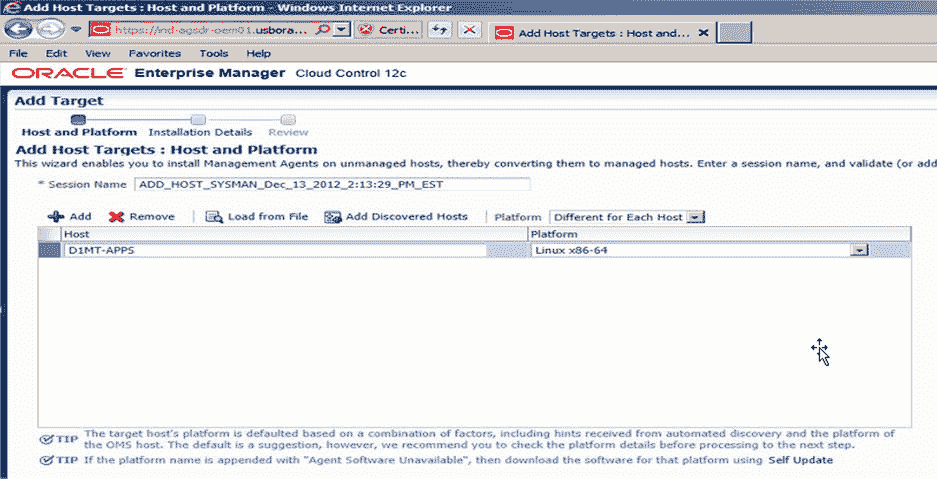

# 重新配置数据库控制台

对于 Oracle 11g 第 2 版的数据库控制，有时需要重建或重新配置控制。重新配置数据库控制通常可以纠正控制资料档案库中可能出现的任何问题。要重新配置数据库控制，您需要使用 `recreate` 选项调用企业管理器配置助理 (`emca`)。以下 `emca` 命令（参见清单 6-14）将重新配置数据库控制，并在 Oracle 数据库一体机上为数据库重新创建资料档案库。

### 清单 6-14. recreate 命令

```
$ cd $ORACLE_HOME/bin
$ ./emca -config dbcontrol db -repos recreate -cluster
```

在重新配置数据库控制时，`emca` 命令将要求您提供一些参数。这些参数可以在命令行上传递，也可以在参数文件中提供。这些参数可以在表 6-1 中找到。清单 6-15 的输出来自在 Oracle 数据库一体机上重新配置集群数据库的数据库控制。输出已缩短，以突出重新配置数据库控制时需要关注的区域。

### 清单 6-15. emca 重新配置数据库控制的输出

```
STARTED EMCA at Oct 9, 2013 4:47:58 AM
EM Configuration Assistant, Version 11.2.0.3.0 Production
Copyright (c) 2003, 2011, Oracle.  All rights reserved.
Enter the following information:
Database unique name: dboda
Service name: dboda
Listener ORACLE_HOME [ /u01/app/11.2.0.3/grid ]:
Password for SYS user: come
Database Control is already configured for the database dboda
You have chosen to configure Database Control for managing the database dboda
This will remove the existing configuration and the default settings and perform a fresh configuration
----------------------------------------------------------------------
WARNING : While repository is dropped the database will be put in quiesce mode.
----------------------------------------------------------------------
Do you wish to continue? [yes(Y)/no(N)]: y
Password for DBSNMP user:
Password for SYSMAN user:
Cluster name: dboda_cluster
Email address for notifications (optional):
Outgoing Mail (SMTP) server for notifications (optional):
ASM ORACLE_HOME [ /u01/app/11.2.0.3/grid ]:
ASM port [ 1521 ]:
ASM username [ ASMSNMP ]:
ASM user password:
Oct 9, 2013 4:48:41 AM oracle.sysman.emcp.util.GeneralUtil initSQLEngineRemotely
WARNING: Error during db connection : ORA-12514: TNS:listener does not currently know of service requested in connect descriptor
-----------------------------------------------------------------
You have specified the following settings
Database ORACLE_HOME ................ /u01/app/oracle/product/11.2.0.3/dbhome_1
Database instance hostname ................ Listener ORACLE_HOME ................ /u01/app/11.2.0.3/grid
Listener port number ................ 1521
Cluster name ................ dboda_cluster
Database unique name ................ dboda
Email address for notifications ...............
Outgoing Mail (SMTP) server for notifications ...............
ASM ORACLE_HOME ................ /u01/app/11.2.0.3/grid
ASM port ................ 1521
ASM user role ................ SYSDBA
ASM username ................ ASMSNMP
----------------------------------------------------------------------
WARNING : While repository is dropped the database will be put in quiesce mode.
----------------------------------------------------------------------
Do you wish to continue? [yes(Y)/no(N)]: y
Oct 9, 2013 4:48:49 AM oracle.sysman.emcp.EMConfig perform
INFO: This operation is being logged at /u01/app/oracle/cfgtoollogs/emca/dboda/emca_2013_10_09_04_47_58.log.
.
.
.
.
INFO: >>>>>>>>>>> The Database Control URL is https://patty.enkitec.com:1158/em <<<<<<<<<<<
Oct 9, 2013 4:57:56 AM oracle.sysman.emcp.EMDBPostConfig showClusterDBCAgentMessage
INFO:
**************** Current Configuration ****************
INSTANCE            NODE           DBCONTROL_UPLOAD_HOST
----------        ----------        ---------------------
dboda             patty patty.enkitec.com
dboda             selma patty.enkitec.com
Oct 9, 2013 4:57:56 AM oracle.sysman.emcp.EMDBPostConfig invoke
WARNING:
************************  WARNING  ************************
Management Repository has been placed in secure mode wherein Enterprise Manager data will be encrypted. The encryption key has been placed in the file: /u01/app/oracle/product/11.2.0.3/dbhome_1/patty_dboda/sysman/config/emkey.ora. Ensure this file is backed up as the encrypted data will become unusable if this file is lost.
***********************************************************
Enterprise Manager configuration completed successfully
FINISHED EMCA at Oct 9, 2013 4:57:56 AM
```


## 反配置数据库控制

反配置的操作和最初配置时一样简单。只需使用参数 `–deconfig` 调用 `emca` 即可。`-deconfig` 选项将启动反配置过程。清单 6-16 展示了如何在 Oracle 数据库一体机上为当前数据库反配置数据库控制。

**清单 6-16.** 反配置数据库控制

```bash
$ cd $ORACLE_HOME/bin
$ ./emca -deconfig dbcontrol db
```

当反配置开始时，`emca` 工具将提示您输入要反配置的数据库控制所关联的 `ORACLE_SID` 值。提供该 `ORACLE_SID` 值；然后 `emca` 会询问您是否确实要反配置数据库控制。这是一个确认提示，需要回答。反配置完成后，关联数据库的控制台将不再可用或可访问。

清单 6-17 展示了一个典型反配置操作的输出。

**清单 6-17.** 反配置输出

```
STARTED EMCA at Oct 8, 2013 9:24:18 AM
EM Configuration Assistant, Version 11.2.0.3.0 Production
Copyright (c) 2003, 2011, Oracle.  All rights reserved.
Enter the following information:
Database SID: bc11gtst
Do you wish to continue? [yes(Y)/no(N)]: y
Oct 8, 2013 9:24:28 AM oracle.sysman.emcp.EMConfig perform
INFO: This operation is being logged at /opt/oracle/cfgtoollogs/emca/bc11gtst/emca_2013_10_08_09_24_17.log.
Oct 8, 2013 9:24:29 AM oracle.sysman.emcp.util.DBControlUtil stopOMS
INFO: Stopping Database Control (this may take a while) ...
Enterprise Manager configuration completed successfully
FINISHED EMCA at Oct 8, 2013 9:25:04 AM
```

为什么您可能希望反配置数据库控制？一个答案归结为转而使用 Enterprise Manager。当需要监控的不仅仅是单个数据库或单个集群数据库时，许多组织开始考虑实施 Oracle Enterprise Manager，这是一款广泛用于在企业环境中监控多个数据库的产品。相比之下，数据库控制传统上仅用于环境中的单个数据库或单个集群数据库。因此，需要通过 Enterprise Manager 管理多个数据库是您可能选择反配置数据库控制的一个原因。

使用 Oracle Enterprise Manager 后，就不再需要配置数据库控制。这是因为同时运行数据库控制和 Oracle Enterprise Manager 所需的 Oracle Management Agent 会带来额外开销。当使用 Oracle 数据库一体机作为 Oracle Enterprise Manager 库和管理服务器时，反配置数据库控制是必需的。

## 支持 Oracle Enterprise Manager

至此，您已经了解了如何使用 Oracle 数据库控制管理 Oracle 数据库一体机。如前所述，数据库控制仅支持并可针对单个数据库或实时应用集群进行配置。随着 Oracle 数据库一体机在企业中日益普及，这些工程系统需要像当今许多其他资源一样被监控。

Oracle Enterprise Manager 提供并允许进行单点监控。Oracle Enterprise Manager 进一步使得 Oracle 数据库一体机可以像任何其他普通资源一样被管理。

> **注意**
>
> 目前，Oracle 数据库一体机不像 Exadata 那样拥有用于管理硬件层的工程系统插件。缺乏插件使得管理 Oracle 数据库一体机就像管理任何其他通用硬件一样。

既然已经确定 Oracle 数据库一体机的管理方式与任何其他通用硬件驱动的实时应用集群相同，那么我们如何启用 Oracle Enterprise Manager 来监控和管理 Oracle 数据库一体机呢？与 Oracle Enterprise Manager 能够监控和管理的任何其他资源一样，Oracle 数据库一体机需要在一体机的两个节点上都安装 Oracle Management Agent。

Oracle Management Agent 是 Oracle Enterprise Manager 的三个核心管理组件之一。它是唯一一个需要在受监控目标上安装的管理组件。安装后，Oracle Management Agent 会将未管理的主机转变为可通过 Oracle Enterprise Manager 进行交互的受管主机。该代理与插件协同工作，为主机上的广泛目标提供管理能力。

当使用 Oracle Enterprise Manager 管理 Oracle 数据库一体机时，请确保在一体机的每个节点上都安装了管理代理。

> **注意**
>
> 开箱即用，Oracle 数据库一体机预装了 Oracle Enterprise Linux (64-bit)。根据您的 Oracle Enterprise Manager 配置，可能需要将其他管理代理下载到软件库中。

让我们看看如何将 Oracle 数据库一体机作为目标添加到 Oracle Enterprise Manager。首先，转到 **Setup** ➤ **Add Target** ➤ **Add Targets Manually**，如图 6-1 所示。


*图 6-1. 手动设置目标*

由于我们希望将 Oracle 数据库一体机添加到 Oracle Enterprise Manager，我们需要添加主机目标。Oracle 数据库一体机的主机目标是构成一体机内实时应用集群的两个内部服务器。图 6-2 显示我们选择了 **Add Host Targets**。做出选择后，单击 **Add Host** 按钮。


*图 6-2. 手动添加目标*

在下一个屏幕上，我们需要指定要添加到 Oracle Enterprise Manager 的两个主机。我们还需要指定它们的操作系统。Oracle 数据库一体机预装了 Oracle Enterprise Linux (64-bit)；您需要确保选择正确的操作系统。图 6-3 显示了添加新主机目标时应显示的输入屏幕。

> **注意**
>
> 如果 Oracle Enterprise Manager 安装在非 Linux (64-bit) 的主机上，那么您将需要通过 Oracle Enterprise Manager 从 Oracle 下载正确的代理软件。


*图 6-3. 添加主机目标*


