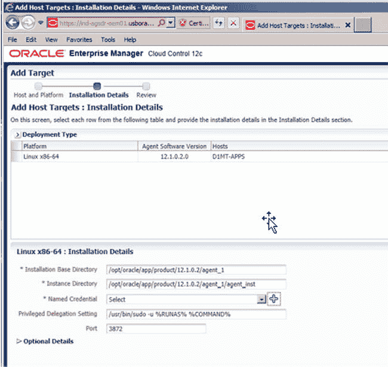
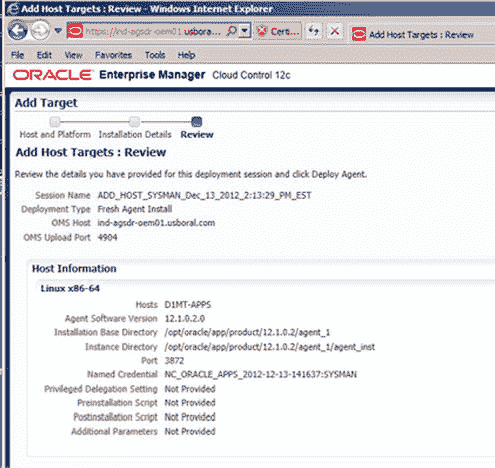
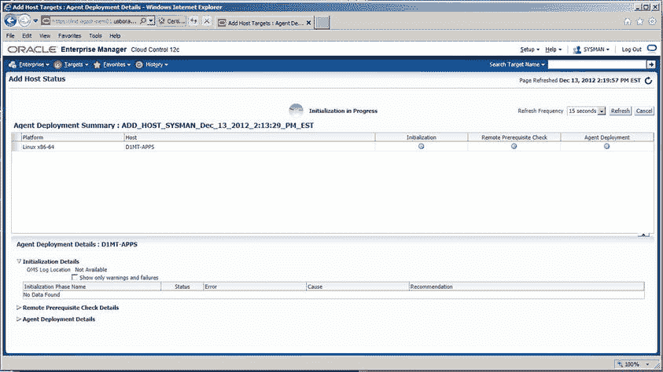
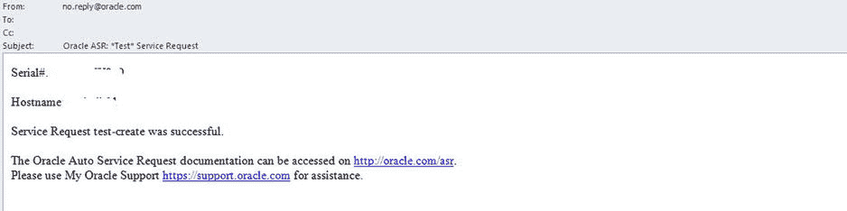
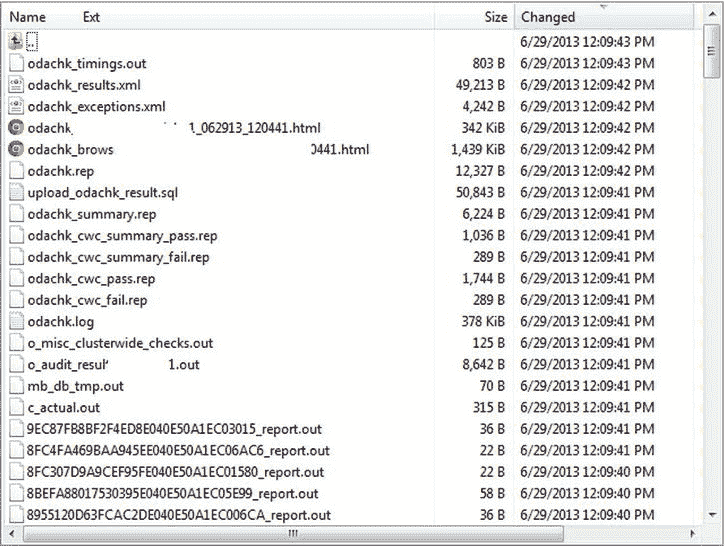
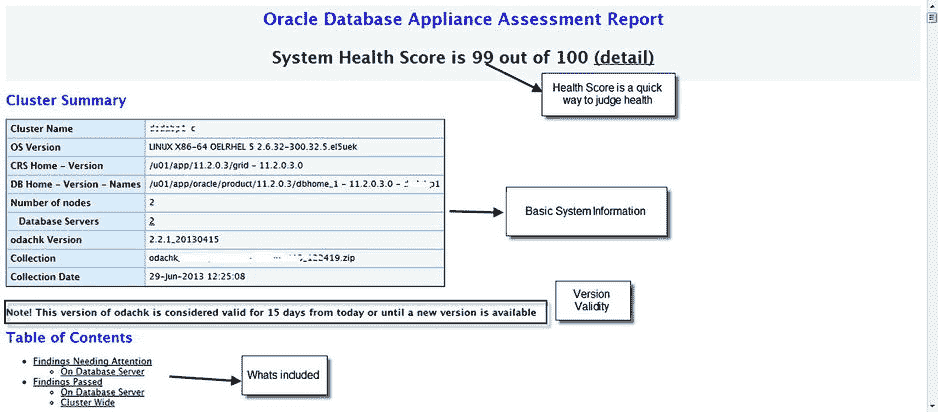
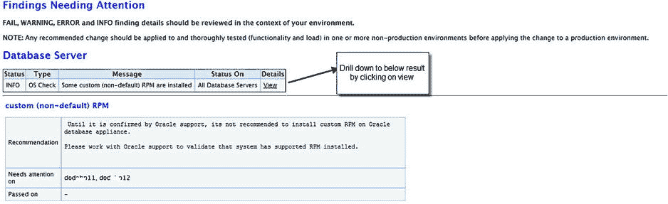

# 7. 诊断 Oracle 数据库设备

## 摘要

Oracle 数据库设备（ODA）是一个自给自足的设备，并且已采取各种检查和平衡措施，以确保设备及其上驻留的数据库能够最佳运行。理解设备本身内置的诊断能力并根据需要应用它们来解决各种简单和复杂的活动至关重要。

Oracle 数据库设备（ODA）是一个自给自足的设备，并且已采取各种检查和平衡措施，以确保设备及其上驻留的数据库能够最佳运行。理解设备本身内置的诊断能力并根据需要应用它们来解决各种简单和复杂的活动至关重要。

ODA 至今已有两代硬件迭代和多个软件迭代，以改进和添加各种功能。ODA 软件更新汇集了许多诊断能力。其中一些已添加到标准 Oracle 设备工具包（OAK）命令集中，而其他则可通过预装工具以及硬件和操作系统中的功能访问。我们将在本章中探讨裸机设备安装诊断。虚拟化诊断将在第 10 章中介绍。

ODA 诊断可以从两个方面考虑：

*   主动
*   被动

本章将探讨 ODA 管理团队可用于理解和调试各种问题的各种技术。数据库相关诊断不在本书范围内，所有标准的数据库监控和诊断技术仍然适用于在 ODA 上运行的数据库。

## 主动诊断

ODA 是一台服务器，因此，在设备上处理和执行各种功能时必须非常小心。有多种方法可以主动确保 ODA 的性能满足客户的要求。Oracle 提供了一组嵌入在 OAK 框架中的一键式实用程序。OAK 提供了一套完整的实用程序，允许用户执行从部署到诊断的各种活动。本书各章节对此进行了详细讨论。

在填写主机和平台信息后，您将被带到如图 6-4 所示的安装详细信息页面。在此页面上，您需要添加与您正在添加的主机相关的具体信息。您正在添加一个 Oracle 数据库设备；两台主机上的基本安装目录将相同。应填写所有其他安装详细信息；如果未填写，请提供必要的信息。命名凭证选项需要填充现有凭证，或通过单击加号（+）按钮创建新凭证。一旦提供了所有安装详细信息，就可以继续安装 Oracle Management Agent。图 6-4 说明了填写后的安装详细信息应如何显示。



图 6-4. 代理安装详细信息

一旦为安装详细信息提供了所有信息，如图 6-4 所示，单击下一步继续向导。这将带您进入图 6-5 中的复查屏幕。从那里，您可以看到通过向导输入的所有项目。单击部署代理以开始代理的部署。



图 6-5. 添加目标复查屏幕

一旦部署开始，可以在添加主机状态屏幕上进行监控。此屏幕如图 6-6 所示。



图 6-6. 添加主机状态说明

要管理 Oracle 数据库设备上的数据库、监听器和自动存储管理（ASM）实例，需要在 Oracle 管理服务器和 Oracle 数据库设备上的 Oracle Management Agents 上部署数据库插件。当通过 Oracle Enterprise Manager 部署代理时，该插件将自动部署。

## 总结

在本章中，我们讨论了两种配置在 Oracle 数据库设备上的监控 Oracle 数据库的方法。第一种方法使用 Oracle 数据库控制。我们讨论了 Oracle 数据库控制，包括如何配置、管理和取消配置它。第二种方法使用 Oracle Enterprise Manager。我们讨论了它与 Oracle 数据库设备的关系，如何安装管理代理使其能够监控设备，以及将其与设备一起使用时可以期待什么。

### 验证

我们将要查看的第一组诊断是验证。ODA 附带了预置的验证功能，该功能随着软件的每个版本而不断发展。验证是主动诊断的第一步，应在安装时执行，然后在每次软件补丁或变更后再次执行，以确保系统按预期运行。应建立并维护一个基线，以确保一致性。根据工作负载和 ODA 上的软件版本，随着平台的成熟，实用程序中可能会内置额外的验证。

验证是 OAK 命令集的一部分，可以通过 `oakcli validate` 命令访问。`oakcli validate` 有多个部分，我们将详细查看它们。要了解 `oakcli validate` 提供了什么，我们可以先查看帮助。

```
[root@oda1 bin]# ./oakcli validate -h
Usage:
  oakcli validate [-V | -l | -h]
  oakcli validate [-v] [-f absolute output_file_name] [-a | -d | -c check1[,check2]]
ARGUMENTS:
  -v      verbose output
  -f      output_file_name.The output is sent to the file instead of
          standard output
  -a      run all checks
  -d      run only default checks.
  -c      check1[,check2] run specific checks
  -l      list the checks and description
  -V      Print the Version
  -h      print help
EXAMPLES:
  oakcli validate -l
  oakcli validate -a
  oakcli validate -c DiskCalibration
  oakcli validate -c SystemComponents,NetworkComponents,asr
```

OAK 验证检查取决于所安装的软件版本。`ODA 2.6` 增加了自动服务请求（`ASR`）验证，以确保 `ASR` 以适当的方式安装和配置。执行不带任何选项的 `validate` 命令将进行以下检查：

*   系统组件
*   操作系统磁盘存储
*   共享存储
*   网络组件
*   存储拓扑（仅限 X3-2）

磁盘校准和 `ASR`（`2.6` 版新增）默认不执行。存储拓扑步骤（#5）验证共享磁盘阵列和 ODA X3-2 引入的可选存储架。该步骤仅在 ODA X3-2 平台上默认执行。

清单 7-1 显示了截至 `OAK 2.6` 可用的 ODA V1 验证命令的简要说明。

**清单 7-1. ODA V1 的验证选项**

```
[root@oda1 bin]# ./oakcli validate –l
Checkname             Description
=========             ===========
*SystemComponent      Validate system components based on ilom sensor data readings
*OSDiskStorage        Validate OS disks and filesystem information
*SharedStorage        Validate Shared storage and multipathing information
DiskCalibration       Check disk performance with orion
*NetworkComponents    Validate public and private network components
asr                   Validate asr components based on asr config file and ilom
                     sensor data readings
* -- These checks are also performed as part of default checks
```

清单 7-2 显示，与前代 ODA V1 相比，`ODA X3-2` 中增加了验证命令。在 `ODA X3-2` 中，存储是外部的。这意味着确保外部存储连接得到适当验证非常重要。

**清单 7-2. ODA X3-2 的验证选项**

```
[root@odax32 bin]# ./oakcli validate -l
Checkname            Description
=========            ===========
*SystemComponent     Validate system components based on ilom sensor data readings
*OSDiskStorage       Validate OS disks and filesystem information
*SharedStorage       Validate Shared storage and multipathing information
DiskCalibration      Check disk performance with orion
*NetworkComponents   Validate public and private network components
*StorageTopology     Validate external JBOD connectivity
asr                  Validate asr components based on asr config file and ilom
                     sensor data readings
```

**注意**

由于 `ODA 2.6` 中的一个内部缺陷，磁盘校准在 `ODA X3-2` 上不起作用。

验证检查被安排到各个子类中。我们将查看每个子类，并分别解释每组检查。


### 系统组件检查

系统组件检查是确保 ODA 健康的关键。作为数据库管理员，我们往往容易忽视硬件本身的健康状况。OAK 以一种易于理解的方式提供了对系统组件的验证，即使是对硬件相关指标不太熟悉的人也能轻松掌握。

由于 ODA V1 和 X3-2 上的系统组件不同，验证在两台设备上会给出不同的结果。检查包括以下实体：
*   软件清单
*   系统信息
*   BIOS 信息
*   控制器信息
*   系统 ILOM 和 BMC 固件版本
*   电源和冷却单元状态
*   处理器和内存状态
*   系统盘状态
*   扩展器和共享盘状态（仅限 ODA V1）
*   各组件温度

清单 7-3 展示了在 ODA V1 上运行系统组件检查的预期输出。此输出会因运行的 OAK 软件版本而异。这意味着清单 7-3 中的输出仅作为示例提供。

清单 7-3 验证 ODA V1 系统组件（ODA 2.6）

```
root@oda1 bin]# ./oakcli validate -c SystemComponents

INFO: oak system information and Validations

RESULT: System Software inventory details

Reading the metadata. It takes a while...

System Version  Component Name            Installed Version         Supported Version

--------------  ---------------           ------------------        -----------------

2.6.0.0.0

Controller                11.05.02.00               Up-to-date

Expander                  0342                      Up-to-date

SSD_SHARED                E12B                      Up-to-date

HDD_LOCAL                 SA03                      Up-to-date

HDD_SHARED                0B25                      Up-to-date

ILOM                      3.0.16.22.b r78329        Up-to-date

BIOS                      12010310                  Up-to-date

IPMI                      1.8.10.5                  Up-to-date

HMP                       2.2.6.1                   Up-to-date

OAK                       2.6.0.0.0                 Up-to-date

OEL                       5.8                       Up-to-date

TFA                       2.5.1.4                   Up-to-date

GI_HOME                   11.2.0.3.6(16056266,      Up-to-date

16083653)

DB_HOME                   11.2.0.3.6(16056266,      Up-to-date

16083653)

ASR                       4.4                       Up-to-date

RESULT: System Information:-

Manufacturer:ORACLE CORPORATION

Product Name:SUN FIRE X4370 M2 SERVER

Serial Number:XXXXXXXXXXXX

RESULT: BIOS Information:-

Vendor:American Megatrends Inc.

Version:12010310

Release Date:08/14/2012

BIOS Revision:1.3

Firmware Revision:1.3

SUCCESS: Controller p1 has the IR Bypass mode set correctly

SUCCESS: Controller p2 has the IR Bypass mode set correctly

INFO: Reading ilom data, may take short while..

INFO: Read the ilom data. Doing Validations

RESULT: System ILOM Version: 3.0.16.22.b r78329

RESULT: System BMC firmware version  3.0

RESULT: Powersupply PS0 V_IN=206 Volts I_IN=2 Amps V_OUT=12.16 Volts I_OUT=30.80

Amps IN_POWER=420 Watts OUT_POWER=390 Watts

RESULT: Powersupply PS1 V_IN=208 Volts I_IN=2 Amps V_OUT=12.16 Volts I_OUT=30.20

Amps IN_POWER=420 Watts OUT_POWER=370 Watts

SUCCESS: Both the powersupply are ok and functioning

RESULT: Cooling Unit FM0 fan speed F0=7700 RPM F1=6300 RPM

RESULT: Cooling Unit FM1 fan speed F0=7600 RPM F1=6500 RPM

SUCCESS: Both the cooling unit are present

RESULT: Processor P0 present Details:-

Version:Intel(R) Xeon(R) CPU           X5675  @ 3.07GHz

Current Speed:3066 MHz  Core Enabled:6  Thread Count:12

SUCCESS: All 6 memory modules of CPU P0 ok, each module is of Size:8192 MB Type:DDR3

Speed:1333 MHz manufacturer:Samsung

RESULT: Processor P1 present Details:-

Version:Intel(R) Xeon(R) CPU           X5675  @ 3.07GHz

Current Speed:3066 MHz  Core Enabled:6  Thread Count:12
```


`SUCCESS: All 6 memory modules of CPU P1 ok, each module is of Size:8192 MB Type:DDR3`
`Speed:1333 MHz manufacturer:Samsung`
`RESULT: Total System Memory is 98929480 kB`
`SUCCESS: All OS Disks are present and in ok state`
`SUCCESS: All expander present and ok status`
`SUCCESS: All shared Disks are present and in ok state`
`RESULT: Temperature System Board=37 degrees C||Riser Board=35 degrees`
`C||Power Supply=31 degrees C`

### 通过验证发现问题

清单 7-4 提供了一个通过验证发现问题的示例。该示例显示电源存在问题，所有电力仅从单个电源输入，而非正常情况下的两个电源输入。

**清单 7-4. 通过验证检查发现问题**

```
Validation failure RESULT: Powersupply PS0 V_IN=Disabled I_IN=Disabled V_OUT=0.88
Volts I_OUT=2 Amps IN_POWER=Disabled OUT_POWER=Disabled
RESULT: Powersupply PS1 V_IN=206 Volts I_IN=3.75 Amps V_OUT=12.08 Volts I_OUT=4.40
Amps IN_POWER=720 Watts OUT_POWER=670 Watts
```

ODA V1 与 ODA X3-2 在组件上存在差异。这可以在清单 7-5 的结果中看到。ODA X3-2 的硬件与 ODA V1 的硬件非常不同，并且更新。

### 执行 ODA X3-2 系统组件检查 (X3-2)

**清单 7-5. 执行 ODA X3-2 系统组件检查 (X3-2)**

```
[root@odax32 bin]# ./oakcli validate -c SystemComponents
INFO: oak system information and Validations
RESULT: System Software inventory details
Reading the metadata. It takes a while...
System Version  Component Name            Installed Version         Supported Version
--------------  ---------------           ------------------        -----------------
2.6.0.0.0
Controller                11.05.02.00               Up-to-date
Expander                  000F                     Up-to-date
SSD_SHARED                9432                     Up-to-date
HDD_LOCAL                 A31A                     No-update
HDD_SHARED                A31A                     Up-to-date
ILOM                      3.1.2.10 r74387           Up-to-date
BIOS                      17021300                 Up-to-date
IPMI                      1.8.10.5                 Up-to-date
HMP                       2.2.6.1                  Up-to-date
OAK                       2.6.0.0.0                Up-to-date
OEL                       5.8                      Up-to-date
TFA                       2.5.1.4                  Up-to-date
GI_HOME                   11.2.0.3.6(16056266,     Up-to-date
16083653)
DB_HOME                   11.2.0.3.6(16056266,     Up-to-date
16083653)
ASR                       4.4                      Up-to-date
RESULT: System Information:-
Manufacturer:Oracle Corporation
Product Name:SUN FIRE X4170 M3
Serial Number:111FML11T
RESULT: BIOS Information:-
Vendor:American Megatrends Inc.
Version:17021300
Release Date:06/19/2012
BIOS Revision:13.0
Firmware Revision:3.1
SUCCESS: Controller p1 has the IR Bypass mode set correctly
SUCCESS: Controller p2 has the IR Bypass mode set correctly
INFO: Reading ilom data, may take short while..
INFO: Read the ilom data. Doing Validations
RESULT: System ILOM Version: 3.1.2.10 r74387
RESULT: System BMC firmware version  3.1
RESULT: Powersupply PS0 V_IN=206 Volts IN_POWER=100 Watts OUT_POWER=110 Watts
RESULT: Powersupply PS1 V_IN=206 Volts IN_POWER=130 Watts OUT_POWER=120 Watts
SUCCESS: Both the powersupply are ok and functioning
RESULT: Cooling Unit FM0 fan speed F0=6800 RPM F1=4300 RPM
RESULT: Cooling Unit FM1 fan speed F0=7300 RPM F1=3900 RPM
SUCCESS: Both the cooling unit are present
RESULT: Processor P0 present Details:-
Version:Intel(R) Xeon(R) CPU E5-2690 0 @ 2.90GHz
Current Speed:2900 MHz  Core Enabled:8  Thread Count:16
SUCCESS: All 8 memory modules of CPU P0 ok, each module is of Size:16384 MB Type:DDR3
Speed:1600 MHz manufacturer:Hynix Semiconductor
RESULT: Processor P1 present Details:-
Version:Intel(R) Xeon(R) CPU E5-2690 0 @ 2.90GHz
Current Speed:2900 MHz  Core Enabled:8  Thread Count:16
SUCCESS: All 8 memory modules of CPU P1 ok, each module is of Size:16384 MB Type:DDR3
Speed:1600 MHz manufacturer:Hynix Semiconductor
RESULT: Total Physical System Memory is 264405228 kB
SUCCESS: All OS Disks are present and in ok state
RESULT: Power Supply=30 degrees C
```

ODA X3-2 没有扩展器，但它有一个外部磁盘柜。因此，共享磁盘的验证是使用 `validate` 命令的 `-c` 开关完成的。这在清单 7-6 中有演示。

### 验证 ODA X3-2 存储拓扑

**清单 7-6. 验证 ODA X3-2 存储拓扑**

```
[root@odax32 bin]# ./oakcli validate -c StorageTopology
It may take a minute. Please wait...
INFO    : ODA Topology Verification
INFO    : Running on Node0
INFO    : Check hardware type
SUCCESS : Type of hardware found : X3-2
INFO    : Check for Environment(Bare Metal or Virtual Machine)
SUCCESS : Type of environment found : Bare Metal
INFO    : Check number of Controllers
SUCCESS : Number of Internal LSI SAS controller found : 1
SUCCESS : Number of External LSI SAS controller found : 2
INFO    : Check for Controllers correct PCIe slot address
SUCCESS : Internal LSI SAS controller   : 50:00.0
SUCCESS : External LSI SAS controller 0 : 30:00.0
SUCCESS : External LSI SAS controller 1 : 40:00.0
INFO    : Check if JBOD powered on
SUCCESS : 1JBOD : Powered-on
INFO    : Check for correct number of EBODS(2 or 4)
SUCCESS : EBOD found : 2
INFO    : Check for External Controller 0
SUCCESS : Controller connected to correct ebod number
SUCCESS : Controller port connected to correct ebod port
SUCCESS : Overall Cable check for controller 0
INFO    : Check for External Controller 1
SUCCESS : Controller connected to correct ebod number
SUCCESS : Controller port connected to correct ebod port
SUCCESS : Overall Cable check for controller 1
INFO    : Check for overall status of cable validation on Node0
SUCCESS : Overall Cable Validation on Node0
INFO    : Check Node Identification status
SUCCESS : Node Identification
SUCCESS : Node name based on cable configuration found : NODE0
INFO    : Check JBOD Nickname
SUCCESS : JBOD Nickname set correctly : Oracle Database Appliance - E0
```

存储拓扑验证提供连接确认检查，应在安装 ODA 后直接运行，以确保所有电缆连接正确。您还应定期运行它，以确保磁盘连接没有问题。


### 操作系统磁盘存储

验证系统后，从操作系统视角检查磁盘并确保所有磁盘运行正常同样重要。您还需要确认设备上的 RAID 级别状态正常。ODA V1 和 X3-2 的配置相似，但 ODA X3-2 为操作系统提供了更多可用的磁盘空间。

> **注意**
>
> 虚拟化 ODA 显示映射到各物理磁盘的虚拟磁盘。裸金属 ODA 则显示物理磁盘的一对一映射。

清单 7-7 展示了如何验证 ODA 设备的磁盘存储。

**清单 7-7. 验证 ODA 操作系统磁盘存储（V1 & X3-2）**

```
[root@odax32 bin]# ./oakcli validate -c OSDiskStorage
INFO: Checking Operating System Storage
SUCCESS: The OS disks have the boot stamp
RESULT: Raid device /dev/md0 found clean
RESULT: Raid device /dev/md1 found clean
RESULT: Physical Volume   /dev/md1 in VolGroupSys has 370206.05M out of total 599986.80M
RESULT: Volumegroup   VolGroupSys consist of 1 physical volumes,contains 4 logical volumes, has 0 volume snaps with total size of 599986.80M and free space of 370206.05M
RESULT: Logical Volume   LogVolOpt in VolGroupSys Volume group is of size 60.00G
RESULT: Logical Volume   LogVolRoot in VolGroupSys Volume group is of size 30.00G
RESULT: Logical Volume   LogVolSwap in VolGroupSys Volume group is of size 24.00G
RESULT: Logical Volume   LogVolU01 in VolGroupSys Volume group is of size 100.00G
RESULT: Device /dev/mapper/VolGroupSys-LogVolRoot is mounted on / of type ext3 in (rw)
RESULT: Device /dev/mapper/VolGroupSys-LogVolOpt is mounted on /opt of type ext3 in (rw)
RESULT: Device /dev/md0 is mounted on /boot of type ext3 in (rw)
RESULT: Device /dev/mapper/VolGroupSys-LogVolU01 is mounted on /u01 of type ext3 in (rw)
RESULT: / has 7242 MB free out of total 29758 MB
RESULT: /opt has 46985 MB free out of total 59516 MB
RESULT: /boot has 65 MB free out of total 99 MB
RESULT: /u01 has 80271 MB free out of total 99194 MB
```

密切监控操作系统空间至关重要。若各类组件（如 RDBMS 或操作系统）缺乏独立的磁盘空间，可能会导致设备上服务的严重中断。根据配置（裸机或虚拟化）的不同，磁盘大小和备用空间也会有所差异。这将在第 10 章中详细说明。

### 共享存储

每台 ODA 都拥有在设备的两个节点之间共享的存储。在 ODA V1 中，共享存储通过内置的存储扩展器实现，而 ODA X3-2 则使用外部机柜将共享磁盘添加到设备中。

验证共享存储对于确保所有路径可用且共享磁盘无故障至关重要。根据您的磁盘组配置，冗余级别（NORMAL 或 HIGH）的磁盘可能发生故障并需要更换。可以通过系统日志或 ASM 警报日志监控磁盘行为，但关键是要验证并确保通往磁盘的所有路径均正常运行。

清单 7-8 提供了一个存储验证示例。您可以查看活动的磁盘路径以及逻辑和物理磁盘设备的名称。

**清单 7-8. ODA 共享存储验证（V1 & X3-2）**

```
[root@odax32 bin]# ./oakcli validate -c SharedStorage
INFO: Checking Shared Storage
RESULT: Disk HDD_E0_S00_373737408 path1 status active device sda with status active path2
        status active device sdy with status active
SUCCESS: HDD_E0_S00_373737408 has both the paths up and active
RESULT: Disk HDD_E0_S01_373737516 path1 status active device sdb with status active path2
        status active device sdz with status active
SUCCESS: HDD_E0_S01_373737516 has both the paths up and active
....
....
SUCCESS: HDD_E0_S18_373750584 has both the paths up and active
RESULT: Disk HDD_E0_S19_373760780 path1 status active device sdt with status active path2
        status active device sdar with status active
SUCCESS: HDD_E0_S19_373760780 has both the paths up and active
RESULT: Disk SSD_E0_S20_805834037 path1 status active device sdu with status active path2
        status active device sdas with status active
SUCCESS: SSD_E0_S20_805834037 has both the paths up and active
RESULT: Disk SSD_E0_S21_805834107 path1 status active device sdv with status active path2
        status active device sdat with status active
SUCCESS: SSD_E0_S21_805834107 has both the paths up and active
RESULT: Disk SSD_E0_S22_805834081 path1 status active device sdw with status active path2
        status active device sdau with status active
SUCCESS: SSD_E0_S22_805834081 has both the paths up and active
RESULT: Disk SSD_E0_S23_805834056 path1 status active device sdx with status active path2
        status active device sdav with status active
SUCCESS: SSD_E0_S23_805834056 has both the paths up and active
```

任何处于非成功状态的设备都应立即进行评估。所有报告的问题都应得到关注，并且应立即创建 Oracle 支持工单以解决发现的任何问题。


### 网络组件

ODA 提供了公共接口和私有接口，以实现与外部世界的网络连接，以及服务器节点和集群之间通信所需的内部网络连接。虚拟化 ODA 与裸金属安装在看待网络组件的方式上存在差异。`ODA V1` 用于互联的接口有 `2x 1GbE`，用于公共连接的接口有 `2x3 1GbE`，以及一个双端口 `10GbE SFP+` 接口。`ODA X3-2` 则采用了不同的方向，全部使用 `10GbE` 端口（铜缆）。所有端口在操作系统中均设置为活动/备用模式。

列表 7-9 展示了在 `ODA V1` 上执行组件验证后将看到的输出。

列表 7-9. 验证 ODA V1 网络组件

```
[root@oda1 bin]# ./oakcli validate -c NetworkComponents
INFO: Doing oak network checks
RESULT: Detected active link for interface eth0 with link speed 1000Mb/s -- Interconnect
RESULT: Detected active link for interface eth1 with link speed 1000Mb/s -- Interconnect
WARNING: No Link detected for interface eth2    -- unused network
WARNING: No Link detected for interface eth3    -- unused network
RESULT: Detected active link for interface eth4 with link speed 1000Mb/s -- 1Gbe network Active
RESULT: Detected active link for interface eth5 with link speed 1000Mb/s -- 1Gbe network Passive
WARNING: No Link detected for interface eth6
WARNING: No Link detected for interface eth7
RESULT: Detected active link for interface eth8 with link speed 10000Mb/s -- 10Gbe Network Active
RESULT: Detected active link for interface eth9 with link speed 10000Mb/s  --10Gbe Network Passive
INFO: Checking bonding interface status
WARNING: Bond interface bond0 has the following current status:down
RESULT: Bond interface bond0 is down configured in mode:fault-tolerance (active-backup)
with current active interface as None
Slave1 interface is eth2 with status:down Link fail count=0 Maccaddr:00:21:28:e7:c2:f0
Slave2 interface is eth3 with status:down Link fail count=0 Maccaddr:00:21:28:e7:c2:f1
RESULT: Bond interface bond1 is up configured in mode:fault-tolerance (active-backup)
with current active interface as eth5
Slave1 interface is eth4 with status:up Link fail count=1 Maccaddr:00:1b:21:cb:03:29
Slave2 interface is eth5 with status:up Link fail count=0 Maccaddr:00:1b:21:cb:03:28
WARNING: Bond interface bond2 has the following current status:down
RESULT: Bond interface bond2 is down configured in mode:fault-tolerance (active-backup)
with current active interface as None
Slave1 interface is eth6 with status:down Link fail count=0 Maccaddr:00:1b:21:cb:03:2b
Slave2 interface is eth7 with status:down Link fail count=0 Maccaddr:00:1b:21:cb:03:2a
RESULT: Bond interface xbond0 is up configured in mode:fault-tolerance (active-backup)
with current active interface as eth8
Slave1 interface is eth8 with status:up Link fail count=0 Maccaddr:00:1b:21:bb:6e:7c
Slave2 interface is eth9 with status:up Link fail count=0 Maccaddr:00:1b:21:bb:6e:7d
SUCCESS: eth0 is running 192.168.16.24
SUCCESS: eth1 is running 192.168.17.24
```

以太网设备在绑定方面的命名约定在虚拟化模型和裸金属模型之间有所不同。在 `ODA V1` 中，`xbond0` 是 `10GbE` 接口的总称，而 `bond0` 到 `bond2` 代表 `1GbE` 接口。`ODA X3-2` 放弃了 `xbond` 与 `bond` 的命名约定，因为所有端口，包括互联端口，都是支持铜缆的 `10GbE` 端口。列表 7-10 展示了其配置外观。检测到的活动链路将显示交换机允许该端口达到的实际速度——不是该端口理论上能达到的速度，而是它当前实际达到的速度。在列表 7-10 中，为 `eth2` 到 `eth5` 提供服务的交换机只支持 `1GbE`，这也正是所显示的内容。

列表 7-10. 验证 ODA X3-2 网络组件

```
[root@odax32 bin]# ./oakcli validate -c NetworkComponents
INFO: Doing oak network checks
RESULT: Detected active link for interface eth0 with link speed 10000Mb/s
RESULT: Detected active link for interface eth1 with link speed 10000Mb/s
RESULT: Detected active link for interface eth2 with link speed 1000Mb/s
RESULT: Detected active link for interface eth3 with link speed 1000Mb/s
RESULT: Detected active link for interface eth4 with link speed 1000Mb/s
RESULT: Detected active link for interface eth5 with link speed 1000Mb/s
INFO: Checking bonding interface status
RESULT: Bond interface bond0 is up configured in mode:fault-tolerance (active-backup)
with current active interface as eth2
Slave1 interface is eth2 with status:up Link fail count=0 Maccaddr:00:10:e0:23:8d:84
Slave2 interface is eth3 with status:up Link fail count=0 Maccaddr:00:10:e0:23:8d:85
RESULT: Bond interface bond1 is up configured in mode:fault-tolerance (active-backup)
with current active interface as eth4
Slave1 interface is eth4 with status:up Link fail count=0 Maccaddr:00:10:e0:23:8d:86
Slave2 interface is eth5 with status:up Link fail count=0 Maccaddr:00:10:e0:23:8d:87
```

由于 `ODA X3-2` 不支持基于 `SFP+` 光纤的网络，因此需要交换机支持基于铜缆的 `10GbE` 才能达到 `10GbE` 速度。`ODA X3-2` 仅显示活动的接口。这与 `ODA V1` 形成对比，后者会以类似于活动网络的方式显示未使用的网络。


### 磁盘校准

ODA 附带一个磁盘校准实用程序来检查磁盘性能。磁盘校准使用 Orion（Oracle I/O numbers）完成，这是一个用于在系统上模拟 Oracle 工作负载的 Oracle 实用程序。Orion 也可以用于模拟 ASM 条带化，并提供性能指标，如 `MBPS`、`IOPS` 和 I/O 延迟。

I/O 指标可能会根据系统上的工作负载而变化。ODA V1 有 20 个 SAS 磁盘和 4 个 SSD 磁盘，可以看到性能校准的结果。这些结果会因系统状态和其上执行的工作负载而异。在一个没有工作负载的新系统上，您应该看到 SAS 磁盘的随机读取 `RIOPS` 大约为 4000。ODA X3-2 目前不支持执行磁盘校准，目前的官方数字是 7000 `RIOPS`。

清单 7-11 显示了在 ODA V1 上执行磁盘校准验证的过程。

**清单 7-11. ODA V1 磁盘校准验证**

```
[root@oda1 bin]# ./oakcli validate -c DiskCalibration
INFO: Doing oak disk calibration checks
INFO: About to run random read IOPS throughput tests for SASDisk
RESULT: Random read throughput across all 20 SASDisk = 3950 IOPS
INFO: About to run random read IOPS throughput tests for SSDDisk
RESULT: Random read throughput across all 4 SSDDisk = 15661 IOPS
INFO: About to run random read MBPS throughput tests for SASDisk
RESULT: Random read throughput across all 20 SASDisk = 1965 MBPS
INFO: About to run random read MBPS throughput tests for SSDDisk
RESULT: Random read throughput across all 4 SSDDisk = 972 MBPS
INFO: Completed IOPS tests for individual disks of type SASDisk
INFO: Completed MBPS tests for individual disks of type SASDisk
INFO: Completed IOPS tests for individual disks of type SSDDisk
INFO: Completed MBPS tests for individual disks of type SSDDisk
INFO: Completed all single disk tests
INFO: Calibration results for SASDisk
RESULT: Random read throughput of HDD_E1_S10_979877715 is 303 IOPS 160 MBPS
RESULT: Random read throughput of HDD_E1_S06_979677567 is 308 IOPS 167 MBPS
RESULT: Random read throughput of HDD_E0_S05_979864071 is 309 IOPS 164 MBPS
RESULT: Random read throughput of HDD_E1_S14_979871167 is 313 IOPS 165 MBPS
RESULT: Random read throughput of HDD_E1_S15_979869315 is 295 IOPS 163 MBPS
RESULT: Random read throughput of HDD_E1_S11_979853103 is 306 IOPS 166 MBPS
RESULT: Random read throughput of HDD_E0_S08_979867223 is 305 IOPS 164 MBPS
RESULT: Random read throughput of HDD_E1_S18_979672443 is 305 IOPS 163 MBPS
RESULT: Random read throughput of HDD_E0_S16_979672427 is 304 IOPS 164 MBPS
RESULT: Random read throughput of HDD_E0_S04_979846015 is 298 IOPS 160 MBPS
RESULT: Random read throughput of HDD_E1_S02_979865471 is 301 IOPS 158 MBPS
RESULT: Random read throughput of HDD_E0_S01_979676399 is 294 IOPS 158 MBPS
RESULT: Random read throughput of HDD_E0_S00_979802375 is 303 IOPS 160 MBPS
RESULT: Random read throughput of HDD_E1_S03_979773239 is 304 IOPS 160 MBPS
RESULT: Random read throughput of HDD_E0_S13_979854143 is 301 IOPS 168 MBPS
RESULT: Random read throughput of HDD_E1_S19_979877275 is 312 IOPS 167 MBPS
RESULT: Random read throughput of HDD_E1_S07_979781771 is 311 IOPS 168 MBPS
RESULT: Random read throughput of HDD_E0_S12_979804175 is 310 IOPS 163 MBPS
RESULT: Random read throughput of HDD_E0_S17_979865419 is 306 IOPS 163 MBPS
RESULT: Random read throughput of HDD_E0_S09_979670555 is 311 IOPS 164 MBPS
INFO: Calibration results for SSDDisk
RESULT: Random read throughput of SSD_E1_S23_805674868 is 4138 IOPS 328 MBPS
RESULT: Random read throughput of SSD_E0_S20_805674815 is 4144 IOPS 328 MBPS
RESULT: Random read throughput of SSD_E0_S21_805674571 is 4143 IOPS 328 MBPS
RESULT: Random read throughput of SSD_E1_S22_805674882 is 4146 IOPS 328 MBPS
```

结果可能会根据 ODA 上当前执行的工作负载而变化。清单 7-11 中的结果是在工作负载非常低的时期获得的，因此非常接近 Oracle 在其营销材料中宣传的 I/O 速度。

> **注意**
>
> ODA X3-2 磁盘校准结果存在问题，截至 ODA 2.7 软件版本，该命令显示操作不受支持且无法正常工作。


### 自动服务请求

ASR 是 ODA 的一项功能，允许通过服务请求将硬件故障报告给 Oracle 公司。结果会反馈给用户，这为常见的硬件故障提供了快速解决方案。

ASR 完全集成到 `My Oracle Support` (`MOS`) 中，可以轻松创建与硬件相关问题（即由硬件故障引起的硬件故障）的服务请求。`ODA` 是在设置和部署期间注册为 `MOS` 资产的硬件组件。可以使用每个 `ODA` 的本地 `ASR` 服务。或者，如果一个组织管理着多个 `ODA` 和其他 Oracle 硬件，建议使用外部的、集中式的 `ASR` 服务器。

Oracle 在 `ODA` 2.6 中增加了对 `ASR` 的验证和测试。这个软件升级不仅带来了验证 `ASR` 连接性并确保 `ASR` 设置正确的能力，还可以测试各种场景以确保警报确实被生成。

自动服务请求提供了为特定硬件故障自动打开 Oracle 服务请求的能力。`ASR` 是一个可选的实用程序，可以在部署 `ODA` 期间或之后设置。在 `ODA` 2.5 及以上版本中，`ASR` 部署可以使用内置的 `ASR` 包或独立的 `ASR` 服务器来管理故障管理过程。在 `ODA` 2.5 之前，唯一的官方选择是使用内置在设备中的 `ASR`，因此每个 `ODA` 都需要连接到互联网以提供 `ASR` 功能。

让我们看看 `ASR` 验证过程。`ASR` 验证过程对于 `ODA` V1 和 `X3-2` 是相同的，但在 `ODA` `X3-2` 中，`ILOM` 和服务器节点具有不同的序列号，这在 V1 设备中并非如此。验证过程检查多项内容：

*   `ASR` 是否已安装？
*   `ILOM` 上的 `SNMP` 陷阱是否指向 `ASR` 服务器？
*   资产是否在 `ASR` 服务器中注册？
*   是否可以测试事件？

清单 7-12 显示了在运行 `ASR` 的 `ODA` 设备上预期的输出。

**清单 7-12. 运行 ASR 验证**
```
[root@odab1 bin]# ./oakcli validate -c asr
INFO: oak Asr information and Validations
RESULT: /opt/oracle/oak/conf/asr.conf exist
RESULT: ASR Manager ip:x.x.x.x
RESULT: ASR Manager port:1162
SUCCESS: ASR configuration file validation successfully completed
RESULT: /etc/hosts has entry 141.146.156.46 transport.oracle.com
RESULT: ilom alertmgmt level is set to minor
RESULT: ilom alertmgmt type is set to snmptrap
RESULT: alertmgmt snmp_version is set to 2c
RESULT: alertmgmt community_or_username is set to public
RESULT: alertmgmt destination is set to x.x.x.x
RESULT: alertmgmt destination_port is set to 1162
SUCCESS: Ilom snmp confguration for asr set correctly
RESULT: notification trap configured to ip:x.x.x.x
RESULT: notification trap configured to port:1162
SUCCESS: Asr notification trap set correctly
INFO: IP_ADDRESS HOST_NAME SERIAL_NUMBER ASR      PROTOCOL SOURCE PRODUCT_NAME
INFO: ---------- --------- ------------- ------- -------- ------ ------------------------
INFO: x.x.x.x    oda1-ilom 9243FMW000    Enabled SNMP     ILOM   SUN FIRE X4370 M2 SERVER
INFO: x.x.x.x    oda2-ilom 9243FMW000    Enabled SNMP     ILOM   SUN FIRE X4370 M2 SERVER
INFO: x.x.x.x    oda1      9243FMW000    Enabled SNMP     FMA    SUN FIRE X4370 M2 SERVER
INFO: x.x.x.x    oda2      9243FMW000    Enabled SNMP     FMA    SUN FIRE X4370 M2 SERVER
INFO: Please use My Oracle Support 'http://support.oracle.com' to view the activation status.
SUCCESS: successfully set asr log level to Fine.
RESULT: Registered with ASR backend.
RESULT: test connection successfully completed.
RESULT: submitted test event for asset:
RESULT: bundle com.sun.svc.asr.sw is in active state
RESULT: bundle com.sun.svc.asr.sw-frag is in resolved state
RESULT: bundle com.sun.svc.asr.sw-rulesdefinitions is in resolved state
RESULT: bundle com.sun.svc.ServiceActivation is in active state
SUCCESS: ASR diag successfully completed
```

作为测试的一部分，会发送一封确认检查成功的电子邮件。确保 `ASR` 管理员收到这封电子邮件非常重要。管理员的电子邮件地址在激活资产时设置，可以通过登录 `http://support.oracle.com` 查看。图 7-1 显示了一个成功发送的电子邮件消息示例。



图 7-1. 确认 ASR 验证服务请求 (SR) 创建的电子邮件

Oracle 在 `ODA` 2.6 中增加了测试功能，允许模拟坏盘和其他硬件事件。这非常重要，因为在过去，模拟并确认 `ASR` 实际工作并不是一项容易的任务。测试功能的加入使这项任务变得容易得多。

您可以通过执行命令 `oakcli test asr` 来运行 `ASR` 测试。清单 7-13 显示了该命令响应中询问的问题示例。

**清单 7-13. 运行 ASR 测试**
```
[root@odax32 bin]# ./oakcli test asr
Please select one of the following to generate ASR test trap[1 .. 4]:
1       => Generate snmptrap test alert from ilom management
2       => Generte disk alert test
3       => Generate TESTSRCREATE snmptrap
4       => Generate test trap using 'oakcli test pd_xx BAD'
```

清单 7-13 中的选项提供了一个菜单，您可以用它来执行各种测试。输出会写入日志文件，或者会创建一个测试 `SR` 并生成一封电子邮件（类似于图 7-1 中所示）。我们可以详细查看这些选项。清单 7-14 显示了通过日志文件显示的数据示例。

**清单 7-14. ASR 测试的日志文件**
```
Setting Asr log level to Fine. Wait ...
ASR log level is already set to Fine
Generated and sent test trap successfully using disk alert test
Please check the log files "/var/opt/SUNWsasm/log/sw-asr-accepted.log.*"
Jun 28, 2013 11:14:21 AM com.sun.svc.asr.sw.snmp.common.ControlObject writeAcceptedEventLog
FINE: Trap received from:
x.x.x.x:37491
, community: public
Object ID: .1.3.6.1.2.1.1.3.0
TimeTicks: 30 days, 4 hours, 59 minutes, 26 seconds.
Object ID: .1.3.6.1.6.3.1.1.4.1.0
Object ID: .1.3.6.1.4.1.42.2.175.103.2.0.43
Object ID: .1.3.6.1.4.1.42.2.175.103.2.1.1
STRING: Oracle Database Appliance
Object ID: .1.3.6.1.4.1.42.2.175.103.2.1.14
STRING:  <Serial Number>  -- Serial Number of ODA Machine
Object ID: .1.3.6.1.4.1.42.2.175.103.2.1.15
STRING: SUN FIRE X4370 M2 SERVER   -- Server Type
Object ID: .1.3.6.1.4.1.42.2.175.103.2.1.6
STRING: TEST pd_test; Slot =     -- type of test
Object ID: .1.3.6.1.4.1.42.2.175.103.2.1.7
STRING: NULL
Object ID: .1.3.6.1.4.1.42.2.175.103.2.1.8
INTEGER: 0
Object ID: .1.3.6.1.4.1.42.2.175.103.2.1.17
STRING: 1
Object ID: .1.3.6.1.4.1.42.2.175.103.2.1.18
STRING: NULL
Object ID: .1.3.6.1.4.1.42.2.175.103.2.1.10
Object ID: .0.0
Object ID: .1.3.6.1.4.1.42.2.175.103.2.1.9
STRING: SUN FIRE X4370 M2 SERVER       ; <server name> Disk TEST_Alert problem:
DISKALRT-0TEST. – Final SNMP String.
```


### ODA 配置审计工具

主动检查套件的一部分是 ODA 配置审计工具包 (`odachk`)。Oracle 一直以来都在为其工程化与非工程化系统组合构建最佳实践，这些检查包括了 `racchk`、`exachk`，以及现在针对 ODA 的 `odachk`。

`odachk` 实用程序是 Oracle RAC 保证团队开发的一款完整的审计与评估工具，旨在为 RAC 和 Clusterware 提供最佳实践检查。该工具还提供了各种针对特定操作系统的检查。虽然每个版本的检查都可能增加更多选项和功能，但以下几个类别是关键：

*   操作系统内核参数
*   操作系统软件包
*   许多对 RAC 重要的其他操作系统配置设置
*   CRS/网格基础设施
*   RDBMS
*   ASM
*   数据库参数

这个列表相当全面，并且这些检查每 90 天更新一次，以确保测试的新鲜度。更新还会纳入更新的最佳实践，以及对已知问题的解决方案。`odachk` 实用程序应至少每月运行一次，并在系统进行任何变更之前和之后运行，以确保环境中没有出现问题。该实用程序还提供升级前和升级后检查，支持从 11.2.0.2 升级到 11.2.0.3，以确保满足所有最佳实践。

清单 7-15 提供了一个获取 `odachk` 版本以及从 `odachk` 实用程序获取帮助的示例。`odachk` 更新非常频繁，每个 ODA 软件版本都可能包含一个新版本的实用程序。

清单 7-15. ODA 检查

```
[root@odax32 odachk]# ./odachk -v
ODACHK  VERSION: 2.2.1_20130415

[root@odax32 odachk]# ./odachk -h
Usage : ./odachk [-abvhpfmsuSo:c:rt:]
-a      All (Perform best practice check and recommended patch check)
-b      Best Practice check only. No recommended patch check
-h      Show usage
-v      Show version
-p      Patch check only
...
```

`odachk` 将大量信息打包到其输出中，并且由于检查具有易变性，它独立于 OAK 框架。命令可执行文件通常位于 `/opt/oracle/oak/odachk`。您应该仅以 Oracle RDBMS 软件所有者的身份运行该实用程序。以任何其他用户身份运行将收到类似以下的消息：

```
odachk found that oracle software owner exists and its being run by root.
```

让我们看一下 `odachk` 的典型运行。清单 7-16 展示了一个这样的运行及其输出。

清单 7-16. ODA 检查执行

```
Checking ssh user equivalency settings on all nodes in cluster
Node odax322 is configured for ssh user equivalency for oracle user
Searching for running databases . . . . .
. . . . . . . . . .
List of running databases registered in OCR
1. dodx32
......
.....
9. All of above
10. None of above
Select databases from list for checking best practices. For multiple databases, select 9 for All or comma separated number like 1,2 etc [1-10][9].1
Searching out ORACLE_HOME for selected databases.
. . . . . . . . . .
Checking Status of Oracle Software Stack - Clusterware, ASM, RDBMS
. . . . . . . . . . . . . . . . . . . . . . . . . . . . . . . . . . . . .
----------------------------------------------------------------------------------------------
Oracle Stack Status
----------------------------------------------------------------------------------------------
Host Name  CRS Installed   ASM HOME    RDBMS Installed   CRS UP   ASM UP    RDBMS UP  DB Instance Name
----------------------------------------------------------------------------------------------
dodax31    Yes             Yes         Yes               Yes      Yes       Yes       dodx321
dodax32    Yes             Yes         Yes               Yes      Yes       Yes       dodx322
----------------------------------------------------------------------------------------------
97 of the included audit checks require root privileged data collection . If sudo is not configured or the root password is not available, audit checks which  require root privileged data collection can be skipped.
1. Enter 1 if you will enter root password for each  host when prompted
2. Enter 2 if you have sudo configured for oracle user to execute root_odachk.sh script
3. Enter 3 to skip the root privileged collections
4. Enter 4 to exit and work with the SA to configure sudo  or to arrange for root access and run the tool later.
Please indicate your selection from one of the above options[1-4][1]:- 2
*** Checking Best Practice Recommendations (PASS/WARNING/FAIL) ***
Log file for collections and audit checks are at
/opt/oracle/oak/odachk/odachk_062913_120441/odachk.log
Starting to run odachk in background on dodax32.
```

最终结果将是运行所有检查并创建一个 zip 文件。创建 zip 文件是供您决定是否需要上传结果进行评估和分析时使用的。您还会获得一个 HTML 文件供自己评估和分析。图 7-2 展示了生成的所有文件的示例。



图 7-2. 生成的 ODAchk 文件

HTML 文件包含很多部分。第一部分是集群摘要和目录，如图 7-3 所示。它提供了关于被检查集群的信息以及报告包含的内容。



图 7-3. ODA 检查集群摘要

该报告是全面的，会查看许多指标以确保系统以最佳状态运行。首先显示的是调查结果报告，展示数据库服务器上潜在的问题。图 7-4 提供了一个示例。



图 7-4. ODA 检查调查结果报告

每个调查结果都应根据环境进行验证。务必确保系统在预定义的参数范围内运行。经常运行 `odachk` 实用程序，以确保系统没有问题，一切运行正常。


### 跟踪文件分析器

跟踪文件分析器（TFA）是 ODA 2.5 中引入的新实用工具。它会自动安装并在后台运行，以便在实时扫描或用户发起的扫描期间，主动从各种日志文件中捕获信息。

> 注意
> TFA 也是来自 Oracle RAC 保证团队的一个独立实用工具¹。它可在 Oracle RAC 支持的大多数平台上安装。

TFA 在 ODA 上默认安装。TFA 不是 OAK 框架的一部分。它安装在 `/opt/oracle/tfa` 目录中。TFA 与软件无关，这意味着它的用途远不止于 Oracle RDBMS 或 Clusterware 日志文件。由于 TFA 是一个独立实用工具，它拥有更快的软件更新周期，其更新频率与 ODAchk 工具相当。

TFA 提供多种功能，围绕诊断数据的收集、自动化和集中化展开。本质上，TFA 提供了一种简便的方法，可以从活动系统中获取有针对性的数据。以下是 TFA 提供的部分功能：

*   将所有集群节点上所有 CRS/GI 和 RAC 组件的诊断数据收集封装成一条从集中位置执行的单一命令
*   能够在数据收集期间修剪诊断文件以减少数据上传大小
*   能够将诊断数据收集限定在给定的时间段内
*   能够将收集到的诊断输出集中到集群中的单一服务器
*   能够将诊断收集限定到特定的产品组件（例如，`ASM`、`RDBMS`、`Clusterware`）
*   能够——称为实时扫描——实时扫描警报日志以查找表明问题的条件（DB 警报日志、`ASM` 警报日志、`Clusterware` 警报日志等）
*   基于实时扫描发现的自动数据收集
*   按需扫描（用户发起）所有日志和跟踪文件以查找表明问题的条件
*   基于按需扫描发现的自动数据收集

通过执行不带任何选项的 `tfactl` 命令，可以查看 TFA 语法。列表 7-17 展示了使用 `tfactl` 可以完成的操作。

**列表 7-17.** tfactl 帮助

```
[root@odax32 bin]# ./tfactl
用法 : /opt/oracle/tfa/tfa_home/bin/tfactl <命令> [选项]
<命令> =
status       检查集群中各节点上的 TFA 状态
add          将目录或主机添加到 TFA
change       更改 TFA 中目录的权限
modify       修改 TFA 参数
set          开启/关闭各种 TFA 功能
remove       从 TFA 中移除目录
print        打印请求的详细信息
run          运行清单或扫描
diagcollect  从集群中的各节点收集日志
如需命令帮助: /opt/oracle/tfa/tfa_home/bin/tfactl <命令> -help
如需调试输出，请使用 -verbose 选项
```

Oracle 数据库一体机将 TFA 作为 ODA 补丁的一部分安装。TFA 的启动由 `oakd` 进程处理。为确保 TFA 在任何时间点都在运行，您可以使用 `tfactl` 进行验证，如列表 7-18 所示。

**列表 7-18.** tfactl 状态

```
root@odax32 bin]# ./tfactl status
.-----------------------------------------.
| 主机     | TFA 状态      | PID   | 端口 |
+----------+---------------+-------+------+
| odax32   | 运行中         | 18839 | 5000 |
| odax32   | 运行中         | 18637 | 5000 |
'----------+---------------+-------+------'
```

我们将从展示 TFA 正在收集的各种信息开始，来探讨 TFA 的一些关键功能。执行命令 `tfactl print` 以查看关于 TFA 的各种信息，如列表 7-19 所示。

**列表 7-19.** tfactl 打印

```
[root@odax32 bin]# ./tfactl print -h
用法: /opt/oracle/tfa/tfa_home/bin/tfactl print [directories|hosts|actions|inventory|invrunstat|repository|...]
打印请求的详细信息。
选项:
config          打印当前 tfa 配置设置
log             打印 TFA 日志的最后十行
directories     将所有目录打印到清单
```


`hosts`、`actions`、`inventory`、`invrunstat`、`repository`、`tfactl print` 这些命令可以提供大量信息。关键参数通常可以通过查看 `config` 信息来检查。清单 7-20 展示了 ODA 的默认设置。

清单 7-20. `tfactl` 的 ODA 默认设置

```
### ./tfactl print config
.---------------------------------------------------------------------------.
| Configuration Parameter                                                   | Value   |
+---------------------------------------------------------------------------+---------+
| TFA Version                                                               | 2.5.1.4 |
| Allow auto diagcollection by events                                       | true    |
| Allow Real Time Scan                                                      | true    |
| Allow On Demand Scan                                                      | true    |
| Real Time Scan running                                                    | true    |
| Allow events found during Real Time Scan to fire diagcollection           | false   |
| Allow events found during On Demand Scan to fire diagcollection           | false   |
| Allow trimming of files during diagcollection                             | true    |
| Trace Level                                                               | 1       |
| Repository current size (MB) in podadb01                                  | 0       |
| Repository maximum size (MB) in podadb01                                  | 10240   |
'---------------------------------------------------------------------------+
```

如果需要，可以更改属性。例如，您可以修改设置，以便在实时扫描期间对某些事件自动触发诊断收集。清单 7-21 展示了如何进行此更改。

清单 7-21. 使用 `tfactl` 修改诊断事件触发器

```
./tfactl set firediagcollectRT=true
Successfully set firediagcollectRT=true
.---------------------------------------------------------------------------.
| Configuration Parameter                                                   | Value   |
+---------------------------------------------------------------------------+---------+
| TFA Version                                                               | 2.5.1.4 |
| Allow auto diagcollection by events                                       | true    |
| Allow Real Time Scan                                                      | true    |
| Allow On Demand Scan                                                      | true    |
| Real Time Scan running                                                    | true    |
| Allow events found during Real Time Scan to fire diagcollection           | true    |
| Allow events found during On Demand Scan to fire diagcollection           | false   |
| Allow trimming of files during diagcollection                             | true    |
| Trace Level                                                               | 1       |
| Repository current size (MB) in podadb01                                  | 0       |
| Repository maximum size (MB) in podadb01                                  | 10240   |
'---------------------------------------------------------------------------+
```

如果您想查看 `TFA` 工具正在监控的目录，可以执行 `tfactl print directories` 命令。您将获得一个很长的目录列表。清单 7-22 提供了一个示例子集。

清单 7-22. `tfactl print directories`

```
./tfactl print directories
.-----------------------------------------------------------------------------------------.
|                                                                                     odax32 |
+--------------------------------------------------------------+-----------+--------------+
| Trace Directory                                              | Component | SubComponent |
```


### Oracle TFA 目录管理与诊断收集

`+--------------------------------------------------------------+-----------+--------------+`
`| /etc/oracle                                                  | CRS       | CRS          |`
`| 权限：公开                                                   |           |              |`
`| 添加者：root                                                 |           |              |`
`+--------------------------------------------------------------+-----------+--------------+`
`| /opt/oracle/oak/log/odax32/oak                               | ODA       | ODA          |`
`| 权限：公开                                                   |           |              |`
`| 添加者：root                                                 |           |              |`
`+--------------------------------------------------------------+-----------+--------------+`
`| /opt/oracle/oak/osw/archive                                  | OS        | OS           |`
`| 权限：公开                                                   |           |              |`
`| 添加者：root                                                 |           |              |`
`+--------------------------------------------------------------+-----------+--------------+`
`| /u01/app/11.2.0.3/grid/OPatch/crs/log                        | CRS       | CRS          |`
`| 权限：公开                                                   |           |              |`
`| 添加者：root                                                 |           |              |`
`+--------------------------------------------------------------+-----------+--------------+`
`| /u01/app/11.2.0.3/grid/cfgtoollogs/opatch                    | INSTALL   | INSTALL      |`
`| 权限：公开                                                   |           |              |`
`| 添加者：root                                                 |           |              |`
`+--------------------------------------------------------------+-----------+--------------+`
`| /u01/app/11.2.0.3/grid/oc4j/j2ee/home/log                    | CRSOC4J   | CRSOC4J      |`
`| 权限：公开                                                   |           |              |`
`| 添加者：root                                                 |           |              |`
`+--------------------------------------------------------------+-----------+--------------+`
`| /u01/app/grid/diag/asm/+asm/+ASM2/trace                      | +asm      | +ASM2        |`
`| 权限：公开                                                   |           |              |`
`| 添加者：root                                                 |           |              |`
`+--------------------------------------------------------------+-----------+--------------+`
`| /u01/app/grid/diag/tnslsnr/dodax32/listener/trace            | TNS       | TNS          |`
`| 权限：公开                                                   |           |              |`
`| 添加者：root                                                 |           |              |`
`+--------------------------------------------------------------+-----------+--------------+`
`| /u01/app/oracle/cfgtoollogs                                  | CFGTOOLS  | CFGTOOLS     |`
`| 权限：公开                                                   |           |              |`
`| 添加者：root                                                 |           |              |`
`+--------------------------------------------------------------+-----------+--------------+`
`| /u01/app/oracle/diag/rdbms/dodabp1/dodax32/trace             | dodax32   | dodax32      |`
`| 权限：公开                                                   |           |              |`
`| 添加者：root                                                 |           |              |`
`+--------------------------------------------------------------+-----------+--------------+`
`| /u01/app/oracle/product/11.2.0.3/dbhome_1/cfgtoollogs/opatch | CFGTOOL   | CFGTOOL      |`
`| 权限：公开                                                   |           |              |`
`| 添加者：root                                                 |           |              |`
`+--------------------------------------------------------------+-----------+--------------+`
`| /u01/app/oracle/product/11.2.0.3/dbhome_1/install            | INSTALL   | INSTALL      |`
`| 权限：公开                                                   |           |              |`
`| 添加者：root                                                 |           |              |`
`+--------------------------------------------------------------+-----------+--------------+`
`| /var/log                                                     | OS        | OS           |`
`| 权限：公开                                                   |           |              |`
`| 添加者：root                                                 |           |              |`
`+--------------------------------------------------------------+-----------+--------------+`

### 目录管理

TFA 团队会根据需要不断在清单中添加和删除目录。他们也提供了手动添加目录的方法。然而，除非与 Oracle 支持部门讨论过，否则不建议在 ODA 上添加目录。

`add` 指令用于添加目录或主机。`TFA` 进程也很智能，以避免重复。列表 7-23 显示了一个试图添加已存在目录的示例。这个 `tfactl` 将通过不添加该目录来响应。

**列表 7-23. tfactl 添加目录**

```
# tfactl  add  directory /opt/oracle/oak/log
No new directories were added to TFA
```

### 诊断收集

`TFA` 还提供了一种手动收集诊断信息的方法，并允许根据需要修剪信息。列表 7-24 显示了收集所有诊断信息以及收集特定时间段诊断信息的示例。

**列表 7-24. tfactl 诊断收集示例**

```
### tfactl diagcollect –all
Allows for diagcollect to be run an zip be collected in the initiating node

### tfactl diagcollect -crs node1,node2 -since 9h
Allows for diagcollect to be run for crs only and zip copied to initiating node

### tfactl diagcollect -for "Jun/29/2013 21:00:10"
Collect diagnostics for all files for all nodes and collect only for timestamp listed.
```

### 事件触发器

`TFA` 团队决定了触发诊断收集的事件。这些事件在 `TFA` 用户指南中有详细列出，可通过 MOS Note 1513912.1 访问。列表 7-25 提供了可以触发 `tfactl` 收集的事件子集。

**列表 7-25. tfactl 诊断收集事件触发器**

```
Search for:
.*ORA-297(01|02|03|08|09|10|40).*

In Files :
Alert Logs - ASM and RDBMS

Error Description:
29701, unable to connect to Cluster Synchronization Service
29702, error occurred in Cluster Group Service operation
29703, error occurred in global enqueue service operation
29708, error occurred in Cluster Synchronization Services
29709, Communication failure with Cluster Synchronization Services
29710, Current operation aborted by Cluster Synchronization Services
29740, evicted by instance number %s, group incarnation %s
29770, global enqueue process %s (OSID %s) is hung for more than %s seconds
```

## 总结

`TFA` 仍然是一个新工具，并且在持续开发中。它弥合了问题与收集之间的差距，并允许自动收集多个层面（数据库、网格/集群件）的重要事件，为 Oracle 支持部门提供所有正确的信息，这使得 `TFA` 与主动诊断库（`ADR`）有所不同。


### 其他工具

到目前为止，我们已经了解了 ODA 产品组合中的许多内置工具。后续章节还会讨论更多工具，比如 Oracle Enterprise Manager，但这里有必要提及其他一些对主动诊断 ODA 各类问题很重要的工具。Oracle Linux 默认安装了 `anacron`，它是 `cron` 的一个变体，提供了更灵活的任务执行方式，`anacron` 内置了多种按每日、每周或每月运行的作业。这些作业包括以下功能：

*   各种文件的日志轮转
*   一个日志监控脚本，它会检查各种日志，生成报告并通过邮件发送给 root Unix 账户。
*   每周的 RAID 检查

文件的日志轮转由 `logrotate` 守护进程处理，并使用 `logrotate.conf` 来确定用于管理日志文件的各种配置参数。清单 7-26 展示了一个默认的 `logrotate.conf` 文件。

**清单 7-26. Logrotate.conf**

```
root@farshad-linux]# cat /etc/logrotate.conf
# see "man logrotate" for details
# rotate log files weekly
weekly
# keep 4 weeks worth of backlogs
rotate 4
# create new (empty) log files after rotating old ones
create
# use date as a suffix of the rotated file
dateext
# uncomment this if you want your log files compressed
#compress
# RPM packages drop log rotation information into this directory
include /etc/logrotate.d
# no packages own wtmp and btmp -- we'll rotate them here
/var/log/wtmp {
    monthly
    create 0664 root utmp
    minsize 1M
    rotate 1
}
/var/log/btmp {
    missingok
    monthly
    create 0600 root utmp
    rotate 1
}
# system-specific logs may be also be configured here.
```

日志轮转也可以通过将需要包含在日志轮转中的文件属性放入 `/etc/logrotate.d` 目录来控制。根据被轮转的日志文件类型，这些属性可以包含各种指令。清单 7-27 提供了一个包含 `postrotate` 指令的 HTTP 服务日志文件轮转示例。

**清单 7-27. Logrotate.d. Httpd**

```
[root@farshad-linux logrotate.d]# vi httpd
/var/log/httpd/*log {
    missingok
    notifempty
    sharedscripts
    delaycompress
    postrotate
        /sbin/service httpd reload > /dev/null 2>/dev/null || true
    endscript
```

`logwatch` 是另一个工具，它提供系统每日概况。清单 7-28 提供了一个 `logwatch` 输出的示例。

**清单 7-28. Logwatch**

```
:
################### Logwatch 7.3 (03/24/06) ####################
Processing Initiated: Sat Jun 29 04:02:01 2013
Date Range Processed: yesterday
( 2013-Jun-28 )
Period is day.
Detail Level of Output: 0
Type of Output: unformatted
Logfiles for Host: odax32
##################################################################

--------------------- SSHD Begin ------------------------
Users logging in through sshd:
   root:
      10.10.7.51: 1 time
---------------------- SSHD End -------------------------

--------------------- Disk Space Begin ------------------------
Filesystem            Size  Used Avail Use% Mounted on
/dev/mapper/VolGroupSys-LogVolRoot
                      30G   19G  9.2G  67% /
/dev/md0               99M   48M   47M  51% /boot
/dev/mapper/VolGroupSys-LogVolU01
                      97G   32G   61G  34% /u01
/dev/mapper/VolGroupSys-LogVolOpt
                      59G   24G   32G  43% /opt
---------------------- Disk Space End -------------------------

###################### Logwatch End #########################
```

还有一个用于验证 RAID 的脚本，每周运行以确保设备的 RAID 配置正常。清单 7-29 展示了 `raid-check` 脚本的一个片段。

**清单 7-29. Raid Check Script**

```
#!/bin/bash
#
# This script reads it's configuration from /etc/sysconfig/raid-check
# Please use that file to enable/disable this script or to set the
# type of check you wish performed.
# We might be on a kernel with no raid support at all, exit if so
[ -f /proc/mdstat ] || exit 0
```

上面列出的所有脚本在 ODA 上默认都是启用的，但输出会使用 `mail` 工具通过电子邮件发送到内部 root 账户。要查看输出，您需要以 root 用户身份登录设备并执行 `mail` 工具，或者按照 MOS Note 405229.1 中的描述设置邮件重定向。

### 响应式检查

到目前为止，本章的重点一直是主动检查。然而，问题仍可能发生，因此了解 ODA 中需要或内置的各种响应式流程非常重要。诊断是一个非常复杂的过程，因此本节无法涵盖所有形式的响应式检查，但我们会介绍一些更有用的。

### 诊断信息收集

ODA 提供了一种通过 `oakcli manage diagcollect` 命令来收集和管理各种诊断信息的简便方法。该命令可以方便地访问跨越各种 ODA、Clusterware、ASM 和 RDBMS 日志文件，以及在多节点上的所有日志文件和诊断信息。清单 7-30 展示了如何获取该命令的帮助文本。

**清单 7-30. ODA 诊断信息收集工具**

```
./oakcli  manage diagcollect -h
Usage:
   oakcli manage diagcollect [options]
options:
  --all                     - For collecting all diag info (Default option),
                              excluding adr, chmos
  --crs                     - For collecting crs diag information
  --patch                   - For collecting ODA Patching logs
...
```

诊断信息可以被裁剪，并且根据问题的类型，可以只收集或排除特定的信息。诊断数据与 TFA 配合使用可以帮助向 Oracle 提供大量信息，从而有助于快速调试和诊断问题。

### 磁盘故障

作为硬件操作的一部分，各种组件发生故障是非常常见的。鉴于磁盘的性质和操作因素，应始终将故障视为即将发生，这就是为什么 ODA 提供双重或三重软件镜像的原因。这种镜像允许在发生故障时不会丢失数据。

诊断故障磁盘非常重要，提供正确级别的信息有助于加速磁盘的更换。清单 7-31 展示了如何执行 `odasundiag.sh`，这是一个专门为 ODA 构建的诊断命令，以便 Oracle 工程师可以获得有关磁盘故障的相关诊断信息，并创建现场服务任务来发送更换盘或让服务工程师进行更换。

**清单 7-31. ODA Sun 诊断脚本**

```
### /root/Extras/odasundiag.sh
```

执行清单 7-31 中命令生成的文件需要作为服务请求的一部分上传到 My Oracle Support。这将使支持人员能够确定问题并提供解决方案。如果解决方案是更换磁盘，可以由客户或 Oracle 的现场服务团队处理。

如果设置了 ASR，它也会向 Oracle 开放一个服务请求并提供基础数据，以便开启现场服务请求来更换磁盘。

如果您需要更换驱动器，可以通过打开定位指示灯来简化查找故障驱动器的工作。清单 7-32 展示了定位磁盘的命令。

**清单 7-32. 定位磁盘**

```
# ./oakcli locate  disk e0_pd_00 on
Disk: e0_pd_00 and to: ON
```

执行此命令会点亮一个 LED 灯，用于确保正在移除和更换的是正确的磁盘。这对硬件工程师很有用，并确保只更换正确的部件。


## 摘要

本章重点介绍了各种主动和被动措施，以保持 `ODA` 的健康并诊断各种问题。`ODA` 旨在成为一个完全自给自足的解决方案，因此提供了内置验证、`ODA` 配置审计 `toolcheck` 和跟踪文件分析器等工具，以实现完全主动的诊断。然而，问题仍可能发生，而 `ODA` 诊断收集实用程序等工具则有助于传输和收集数据，以便更快地解决问题。`ASR` 是一个可选的实用程序，为 Oracle x86 系统（包括 `ODA`）提供自动故障检测和 SR 创建功能。

脚注 1

MOS 注释 1513912.1 是 `TFA` 的主注释

