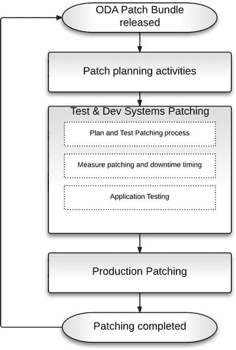
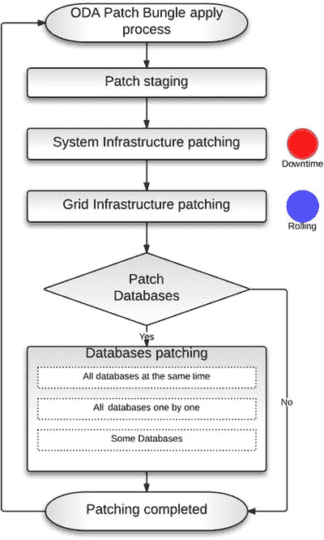
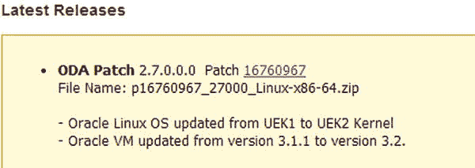

# 8. 修补 Oracle 数据库设备

摘要

修补是现代 `IT` 组织当今面临的最大挑战之一。修补是一项常规任务，在支持功能性和业务请求之后，很可能耗费了支持团队的大部分精力。它需要投入大量精力来计划、验证、测试和执行修补活动。修补是一项持续进行的活动，旨在解决现有问题，并减少面临其他产品用户发现的潜在问题的风险。修补还简化了与 Oracle 支持团队协作的工作，以排查贵团队已经遇到或可能在不久的将来遇到的问题。好消息是，Oracle 数据库设备显著减少了将数据库系统保持在当前水平所需的工作量。本章将解释 Oracle 数据库设备如何应对永无止境的修补挑战，并使其资源消耗显著降低。

修补是现代 `IT` 组织当今面临的最大挑战之一。修补是一项常规任务，在支持功能性和业务请求之后，很可能耗费了支持团队的大部分精力。它需要投入大量精力来计划、验证、测试和执行修补活动。修补是一项持续进行的活动，旨在解决现有问题，并减少面临其他产品用户发现的潜在问题的风险。修补还简化了与 Oracle 支持团队协作的工作，以排查贵团队已经遇到或可能在不久的将来遇到的问题。好消息是，Oracle 数据库设备显著减少了将数据库系统保持在当前水平所需的工作量。本章将解释 Oracle 数据库设备如何应对永无止境的修补挑战，并使其资源消耗显著降低。

## 补丁管理简介

Oracle 数据库设备采用了一种非常简单实用的修补方法。单个补丁即可交付所有系统组件的更新。修补过程是自动化且完全脚本化的。只需几个命令即可修补整个系统，从内部硬盘驱动器固件开始，一直到 Oracle 数据库补丁结束。Oracle 公司每季度发布一次补丁和补丁捆绑包。这简化了您的规划过程。

### 传统系统的局限性

您可能会问，修补有什么特别之处？只需安装新版本的软件不就行了，对吧？要是那么简单就好了。问题在于，现代服务器是一个复杂的系统。它包含许多可单独更新的组件，从 `BIOS` 和带外管理适配器开始，一直到操作系统。此外，数据库系统不仅仅由一台服务器组成。还有其他重要的组件需要定期的软件更新，例如网络组件、内部存储、外部存储等等。存储本身可能就是一个复杂的系统。长话短说，数据库系统由十几个或更多需要定期修补的组件组成。

更新单个组件是一项相对简单的任务。然而，每个组件都与其他组件交互。为确保所有组件都能无问题地运行，管理员或一组管理员应验证所有组件在其当前版本级别的兼容性。带外管理适配器版本应与当前的 `BIOS` 版本兼容；磁盘和网卡驱动程序应与操作系统版本兼容，依此类推。

通常，组织内的不同团队负责修补不同的系统组件。例如，存储团队负责存储组件，而网络团队维护网络组件，如集群环境中使用的交换机。系统管理团队负责操作系统修补。修补过程通常被划分为不同的阶段，在每个阶段中，每个团队独立于其他团队计划、测试和执行自己的修补工作。

在准备修补工作时，执行修补的团队应确保他们将要引入系统的变更不会影响其他组件，如操作系统、集群服务等。为确保兼容性和可支持性，该团队需要确保并验证他们将要安装的新版本与其他团队管理的组件兼容。仅因为需要验证复杂的相互依赖关系，规划阶段就可能耗费大量时间。这种复杂性带来了错误和随后停机的风险。

采用一次修补一个组件的方法，组织需要引入比能够一次性修补所有系统组件多得多的停机时间。每次修补工作都需要系统停机。每次停机都涉及组织内不同团队之间更多的协调。依赖于待修补组件的应用程序需要停止，这增加了所需的停机时间。修补完成后，系统组件需要逐一启动并进行验证。所有组件启动后，在将系统交付最终用户使用之前，还需要执行一次“冒烟”测试。所有这些步骤都增加了每个组件修补所需的停机时间。然而，如果我们能够一次性修补所有组件，那么我们将显著减少使系统保持最新状态所需的总体停机时间。

系统及应用测试所需的工作量也是如此。理想情况下，每个变更都应从较低的技术层开始测试，一直到应用和业务测试。与一次性修补所有组件相比，多次修补阶段需要组织内不同团队付出更多的测试工作。


许多 IT 团队面临的另一个挑战是，许多补丁活动涉及人工操作步骤。人工步骤会引入人为错误的空间，并使打补丁过程比原本所需的时间更长。一些组织可能决定投入时间和资源来实现补丁步骤的自动化，并使其尽可能独立于人工操作。然而，不同系统组件由不同供应商生产这一事实，使得简化补丁流程的任务颇具挑战。每个组件可能使用不同的补丁技术。对于许多组织来说，投资于补丁自动化可能在经济上不合理，因此他们选择接受并管理与手动打补丁相关的风险。

传统的系统补丁生命周期还存在规划方面的挑战。不同组件供应商在不同的时间点发布补丁。这种时间上缺乏协调的情况使得几乎不可能将打补丁变成一项常规的例行工作。如果所有组件供应商都能在众所周知的时间间隔内发布补丁，并且彼此同步，这将极大地简化规划。这样，组织内的 IT 团队就可以建立众所周知的补丁周期和明确的步骤。

这些以及其他挑战使得现代集群数据库系统的打补丁成为一个非常复杂、耗费时间和资源的过程。这些挑战增加了整体 IT 成本并降低了效率，而现代企业要求的恰恰是相反的结果。

### Oracle 数据库一体机的优势

`Oracle Database Appliance`显著简化和优化了补丁流程。事实上，这是`Oracle Database Appliance`相对于传统集群系统最有价值的优势之一。`Oracle Database Appliance`补丁按季度发布，涵盖所有系统组件，从固件一直到`Oracle Database`软件。所谓的`一键打补丁`流程是完全自动化的，并涉及几个简单的步骤。

系统由一家公司设计、组装和支持，这一事实使得将所有补丁活动合并为一组脚本成为可能。这也简化了规划。Oracle 按季度发布`Oracle Database Appliance`补丁。一个组织可以选择其希望应用这些补丁的频率。补丁发布的可预测性及其应用，使得安排补丁周期以及相关的测试、准备、停机时间和其他活动变得容易得多。

补丁流程由三个阶段组成，这些阶段提供了一定程度的灵活性。例如，应用和功能团队可能决定采用六个月的补丁周期，而基础设施组仍然可以每三个月对基础设施组件打一次补丁。这种跳过交替数据库补丁的方法，如果组织认为有必要，可以减少应用测试活动。

## 补丁流程

以下两个小节讨论`ODA`环境中补丁的总体流程。第一节给出了通常可能遇到的一般性流程。第二节特别关注`ODA`特有的三个步骤。

### 一般补丁流程

图 8-1 展示了`Oracle Database Appliance`一般补丁流程。它与传统的系统补丁周期没有太大区别。与任何系统一样，测试补丁应用过程是`Oracle Database Appliance`补丁生命周期中的重要一步。你的团队应熟悉补丁流程步骤，将其记录下来，并在每次打补丁时衡量所需的停机时间。在将补丁移至生产系统之前，功能团队应在测试和开发环境中进行合理数量的测试。



图 8-1. 一般情况下的补丁流程

我见过一些组织，由于预算有限和其他限制，只购买一台`Oracle Database Appliance`作为生产系统，然后在其他平台上运行测试和开发环境。虽然这是一种可能的设置，但我建议避免这种情况。这种做法的问题是，你无法在将`Oracle Database Appliance`补丁应用到生产环境之前对其进行测试和验证。我的建议是至少购买两台`Oracle Database Appliance`，并在测试环境中测试补丁过程，然后再将其应用到生产`Oracle Database Appliance`上。

有人可能认为 Oracle 测试了所有补丁，因此没有必要进行内部补丁测试。问题是，即使是`Oracle Database Appliance`，每个系统也可能略有不同。一些客户可能决定跳过某些补丁。一些客户可能决定稍微自定义配置。一些客户可能使用不同的网络设置。我的建议是在你的特定配置上，在测试环境中测试补丁，并尽一切努力在生产环境中以相同的方式应用该补丁。


### 特定 ODA 步骤

图 8-2 展示了 Oracle 数据库设备的补丁步骤。其中涉及三个主要步骤。我们将在本节简要描述它们，并在后续章节中更详细地介绍。根据您的业务需求，这三个主要补丁步骤中的每一个都可以在时间上与其他步骤分开执行。



图 8-2. ODA 的补丁步骤

首先对磁盘、固件、BIOS 和操作系统等系统基础设施组件进行补丁。`系统基础设施`补丁步骤需要全系统停机。在此补丁期间，所有数据库实例和`Grid Infrastructure`进程都将停止。

每个季度发布的 Oracle 数据库设备补丁包可能包含针对不同系统基础设施组件的补丁。例如，某个特定版本可能包含存储扩展器、ILOM、BIOS 和 OVM 的补丁。如前所述，可以跳过某些补丁包。有帮助的是，每个 Oracle 数据库设备补丁包都是累积性的。ODA 客户可以跳过一个或几个补丁包。然而，在这种情况下需要打补丁的系统组件数量可能比您逐个应用补丁包时更多。停机时间可能会根据需要更新的系统组件数量而增加。

根据我们当前的经验，`系统基础设施`补丁的总停机时间通常在 45 到 80 分钟之间。Oracle 数据库设备的节点可能会作为 OS、OVM 或存储等组件的更新的一部分而重新启动。对于关键系统，必须在测试环境中进行试运行，以测量补丁包的总停机时间，并验证是否需要节点重启。

系统基础设施更新后，需要对`Grid Infrastructure`进行补丁。在撰写本文时，所有 Oracle 数据库设备补丁包都以滚动方式应用`Grid Infrastructure`更新。这意味着在更新期间，两个节点中的一个是可用的，所有数据库服务都在另一个节点上正常运行。不涉及停机时间。

下一个也是最后一个阶段是数据库升级。有几种处理此任务的选项可供选择。一些组织可能决定每隔一个季度跳过数据库补丁步骤，每六个月对数据库打一次补丁，从而在保持系统基础设施更新的同时节省应用程序测试时间。其他组织可能在应用基础设施补丁的同时对数据库打补丁。一些组织可能将基础设施更新和数据库更新分开进行。这种分离允许人们仅为了基础设施补丁而关闭整个系统，然后以滚动方式启动系统并完成剩余的更新。ODA 提供了灵活性，允许您根据组织需求选择自己的补丁方法。

## 时间安排

时间安排涉及两个方面。第一个问题是多久打一次补丁。我们已经提到过，一些组织只应用每隔一个补丁包。另一个需要考虑的方面是单个补丁应用需要多长时间。如果要应用补丁，应该了解目标系统将离线多长时间。

### 多久打一次补丁

Oracle 按季度为 Oracle 数据库产品发布补丁集更新(`PSU`)和安全补丁更新(`SPU`)——`SPU`更广为人知的名称是关键补丁更新(`CPU`)。`SPU`是专注于关键问题的一组较小的更改。`PSU`包含`SPU`以及额外的修复。Oracle 建议选择以下做法之一：

*   在基础版本之上应用`SPU`，以最小化一个主版本到下一个主版本之间应用更改的量。
*   定期实施`PSU`，以确保应用所有关键和安全修复。

Oracle 数据库设备采用`PSU`的补丁周期。Oracle 数据库设备补丁包在`PSU`补丁发布后不久发布。值得一提的是，Oracle 数据库只是 Oracle 数据库设备补丁包中包含的一个组件。然而，它是主要组件之一。因此，Oracle 为 ODA 采用`PSU`补丁周期非常有意义。

Oracle 的常规补丁发布简化了您的补丁规划并有助于灵活性。一些客户可能觉得季度补丁过于频繁，选择跳过应用一个或多个 Oracle 数据库设备补丁包。这里的重要点是，定期的补丁发布允许组织在其环境中引入定期的、已知的、有计划的补丁周期。这简化了很多事情，包括安排人力资源进行实施和测试，使补丁成为一项已知的常规工作，而不是由生产系统中的关键问题触发的一次性活动。由此产生的定期应用补丁主动保护数据库系统免受潜在危险问题和不必要停机的影响。生产环境的稳定性得到提高。

### 补丁需要多长时间

表 8-1 让您大致了解每个补丁步骤所涉及的时间。该表还指明了给定步骤是否需要全系统停机，以及是否需要重启。表 8-1 只是一个通用指南，让您了解概况。您应该自己测量补丁时间。在将补丁应用到生产系统之前，在测试系统中测量每个阶段的补丁时间。

表 8-1. 各阶段停机时间估算

| 阶段 | 全停机时间 | 需要重启 | 近似时间（分钟） |
| :--- | :--- | :--- | :--- |
| `系统基础设施` | 是 | 可能 | 45–80\* |
| `Grid Infrastructure` | 否（滚动升级） | 否 | 45–60 |
| 数据库 | 否（滚动升级） | 否 | 10–20\*\* |

\* 取决于补丁包需要更新的组件数量

\*\* 取决于涉及的数据库数量

请注意，每个补丁步骤都可以在时间上分开执行。没有必要快速连续执行所有三个步骤。数据库升级阶段具有一定的灵活性。您可以根据业务需要，在舒适的时间间隔单独执行这些步骤。

## ODA 补丁选项

根据您的业务需求，您可以选择不同的选项。阅读以下部分以了解更多关于您的选项以及何时最适合使用它们。


### 新设备

如果您从工厂收到一台新的 Oracle 数据库设备，它很可能并未运行最新版本的 Oracle 数据库设备软件和固件。您需要将其更新至最新的补丁级别。有两种方法可以实现：

*   第一个也是推荐的方法是采用与之前“更新流程”部分类似的流程。您需要按照最新 Oracle 数据库设备补丁的 `README` 文件中的步骤进行操作。¹
*   另一种方法是使用 Oracle 数据库设备的 `裸机恢复` 选项，具体描述可参考 My Oracle Support 题为“Oracle 数据库设备裸机恢复过程”的说明（文档 ID 1373599.1）。

第一种方法会处理所有的系统基础设施组件。而在使用 `裸机恢复` 的情况下，在 Oracle 数据库设备上解包更新包后，您应隐式更新系统基础设施组件，如 `BIOS` 和固件。更新系统基础设施的说明将在本章后面的“执行更新”部分提供。您也可以在 `README` 文件中找到它们。

> Oracle 数据库设备默认预装了一个裸机系统基础设施版本。通过重新镜像过程，您可以转换为虚拟化设置。如果您打算使用虚拟化选项，则必须使用以下 My Oracle Support 说明中的指导来重新镜像 Oracle 数据库设备：“在 Oracle 数据库设备上逐步安装虚拟化镜像”（文章 ID 1520579.1）。

### 默认更新选项

默认更新选项是一个直接的过程，大约两小时内即可执行完成。它假设您拥有标准的 Oracle 数据库设备配置，与推荐配置的偏差极小，且停机要求较为宽松。此选项将作为下一节描述的更灵活选项的基础选项。

### 分时执行步骤

为了将停机时间间隔缩至最短，并使您能清晰地专注于更新过程，实现更精细的控制，您可能希望将更新 `系统基础设施`、`Grid 基础设施` 和 `RDBMS` 这三个步骤分开执行。每个步骤都可以单独执行，并且如果您需要，步骤之间可以相隔数周。

这种分步执行的方法需要更多的规划和实施工作。然而，唯一需要完全系统停机的步骤是更新 `系统基础设施`。另外两个步骤（`Grid 基础设施` 和 `RDBMS`）可以通过在第二个节点进行更新时，在其中一个节点上运行服务的方式，以滚动方式执行。

通过分步操作，您可以确保在进行下一步之前，前一步骤已成功完成。每个步骤所需的时间比一次性完成所有步骤的默认方法要短。然而，代价是过程变得更加复杂。

### 延迟更新 RDBMS

根据具体情况和业务需求，您可能会决定更新某些数据库，而让同一设备上的其他数据库保持先前版本运行。

标准的 `ODA` 升级选项是基于每个 `Oracle 主目录` 进行的。属于特定 `Oracle 主目录` 的所有数据库将同时升级。Oracle 数据库设备也支持多个 `Oracle 主目录`——您可以根据需要和资源情况拥有任意数量的 `Oracle 主目录`。Oracle 数据库设备目前支持 `11.2.0.2` 和 `11.2.0.3` 版本的 `Oracle 主目录`。每个 Oracle 数据库设备捆绑包更新都会升级 Oracle 数据库版本的第五位版本号。例如，从 Oracle 数据库设备捆绑包 `2.6` 升级到 `2.7`，就是从 Oracle 数据库版本 `11.2.0.3.6` 升级到 `11.2.0.3.7`。

如果您想逐个更新数据库，有两种可用选项。第一种是为每个数据库配置运行在独立的 `Oracle 主目录` 中。这样，在更新过程中，您可以指定要更新的 `Oracle 主目录` 和关联的数据库。如果有多个数据库运行在同一个 `Oracle 主目录` 下，您需要通过创建额外的 `Oracle 主目录` 副本，并将这些数据库从原始 `Oracle 主目录` 移动到新建的独立 `Oracle 主目录` 中来分离它们。在以下示例中，我们创建额外的 `Oracle 主目录`，并将两个数据库移动到新建的独立 `Oracle 主目录` 中启动：

```
### 在 2.6 版本上
### 显示所有当前 Oracle 主目录
oakcli show dbhomes –detail
### 创建一个新的 Oracle 主目录
oakcli create dbhome -version 11.2.0.3.6
oakcli show dbhomes –detail
### 重新配置一个数据库，使其从新的 Oracle 主目录运行
srvctl modify database -d DOG -o /u01/app/oracle/product/11.2.0.3/dbhome_2
### 重启数据库
srvctl stop database -d DOG
srvctl start database -d DOG
oakcli create dbhome -version 11.2.0.3.6
srvctl modify database -d CAT -o /u01/app/oracle/product/11.2.0.3/dbhome_3
srvctl stop database -d CAT
srvctl start database -d CAT
```

另一种选择是手动更新数据库。在这种情况下，您只需要两个 `Oracle 主目录`。一个用于数据库引擎的源版本，另一个用于目标版本。此外，您需要自己执行所有更新步骤，并且也需要自己在 `Oracle 主目录` 之间移动数据库。涉及以下步骤：

1.  为 `RDBMS` 的新版本创建一个 `Oracle 主目录`。
2.  停止您正在更新的数据库。
3.  重新配置数据库，使其从新建的 `Oracle 主目录` 启动。
4.  启动数据库并运行升级步骤。
5.  将数据库交付给用户使用。

这种手动方法不需要您为每个数据库创建单独的 `Oracle 主目录`。您可以仅使用两个 `Oracle 主目录` 来更新所有数据库。然而，与之前展示的第一种方法相比，这种方法需要更多的手动步骤。您将使用传统的数据库升级步骤，就像处理常规 Oracle 系统一样，从而失去了 Oracle 数据库设备提供的自动数据库升级功能。

### 使用 Data Guard 最小化停机时间

如果您的业务要求尽可能短的停机时间，可以考虑使用 `Data Guard` 配置中的额外 Oracle 数据库设备。这种方法可以避免与 `系统` 和 `Grid 基础设施` 更新相关的停机。过程如下：

1.  在主用和备用 Oracle 数据库设备之间建立备用数据库配置²。
2.  在备用/辅助 Oracle 数据库设备上停止重做日志应用进程。
3.  更新备用 Oracle 数据库设备的 `系统` 和 `Grid 基础设施` 组件。
4.  暂时不更新备用数据库的 `Oracle 主目录`。相反，重新建立重做日志应用进程。
5.  将您的应用程序切换到使用辅助 Oracle 数据库设备，从而切换到备用数据库。此时，主用 Oracle 数据库设备可以离线以更新基础设施组件。
6.  使用滚动更新方法将您的数据库更新到最新版本。这样，只需很短的切换时间，应用程序需要从主设备重新指向辅助设备。与基础设施更新活动相关的应用程序停机时间为零。

如上所述使用 `Data Guard` 需要在规划、准备和实施方面付出更多努力。然而，与以常规方式执行 `Grid 基础设施` 和数据库更新步骤所需的数小时停机时间和受限模式操作相比，`Data Guard` 方法提供了最小的切换时间。


## 虚拟 Oracle 数据库设备

我们不会花太多时间讨论这里的虚拟机选项。然而，值得注意的是，从打补丁的角度来看，虚拟机环境并没有太大不同。在系统基础设施打补丁阶段，只需要额外处理一个组件，那就是 Oracle VM Server。

如果某个补丁包提供了 Oracle VM Server 补丁，那么必须停止所有虚拟机，对主 Oracle VM Server 主机的操作系统进行打补丁，然后重新启动整个服务器。

与任何打补丁操作一样，你应该花时间仔细阅读补丁包的 README 文件，以确保完成与虚拟机配置相关的所有额外步骤。一些早期的补丁包附带了针对虚拟机配置的特定打补丁活动说明。

另一件重要的事情是，所有的打补丁活动——例如，补丁暂存、解压、应用等等——都必须在所谓的 Oracle Database Appliance 基础虚拟机内执行。Oracle 工程师精心设计虚拟机补丁，以确保它们可以在虚拟机运行时成功应用，然后再重新启动 Oracle VM Server。

我刚刚提到的这两点，是裸金属打补丁过程与虚拟机配置打补丁过程之间唯一重要的区别。请记住，无论在哪种配置中，系统在系统基础设施打补丁阶段都需要一小段完全停机时间。因此，在这方面没有显著差异。虚拟机选项可能比裸金属选项多需要大约十分钟的停机时间，因为 Oracle VM Server 是一个必须打补丁的额外元素。

## 准备工作

打补丁过程的第一步是准备。除非你喜欢通宵工作，否则这是一个重要的步骤。不要敷衍了事。除了与传统系统打补丁相关的常规活动外，在 ODA 打补丁过程的规划部分，以下是一些需要检查和执行的事项。

### 验证发布级别

在将 Oracle Database Appliance 更新到最新版本之前，你应该确保知道当前运行的版本。最简单的方法是执行一个 `oakcli` 命令，如下所示：

```
[root@s1 ∼]# oakcli show version

Version
-------
2.6.0.0.0
```

Oracle Database Appliance 由十几个不同的软件组件组成。虽然你可以使用每个组件的接口来找出其当前版本，但要找出所有组件版本的最简单方法是使用带有 `-details` 开关的 `oakcli` 命令，如下所示：

```
[root@s1 ∼]# oakcli show version -detail

Reading the metadata. It takes a while...
System Version Component Name            Installed Version          Supported Version
--------------  ---------------           ------------------        -----------------
2.6.0.0.0
                Controller                11.05.02.00               Up-to-date
                Expander                  0342                      Up-to-date
                SSD_SHARED                E12B                      Up-to-date
                HDD_LOCAL                 SA03                      Up-to-date
                HDD_SHARED                0B25                      Up-to-date
                ILOM                      3.0.16.22.b r78329        No-update
                BIOS                      12010310                  No-update
                IPMI                      1.8.10.5                  Up-to-date
                HMP                       2.2.6.1                   Up-to-date
                OAK                       2.6.0.0.0                 Up-to-date
                OEL                       5.8                       Up-to-date
                OVM                       3.1.1                     Up-to-date
                TFA                       2.5.1.4                   Up-to-date
                GI_HOME                   11.2.0.3.6(16056266,      Up-to-date
                                            16083653)
                DB_HOME                   11.2.0.3.6(16056266,      Up-to-date
                                            16083653)
                ASR                       Unknown                   4.4
[root@s1 ∼]#
```

### 审阅补丁说明

在开始下载补丁之前，最好审阅相关说明，了解已知问题的信息。对于像 Oracle Database Appliance 这样相对较新的产品来说，这一点尤其重要。对于某些版本，有一些特定的步骤需要完成。这些步骤可能会有变动，因此本章提供的打补丁说明仅供参考。你应该通过阅读补丁包的说明来确认这些说明。

My Oracle Support 说明“Oracle Database Appliance - 2.X Supported Versions & Known Issues (Doc ID 888888.1)”是一个很好的起点。该说明包含了与打补丁相关的有用信息，从“Latest Releases”部分开始，你在其中可以找到最新可用补丁和版本的引用。该说明以“Known Issues”部分结束——阅读这部分也非常重要。

审阅“Known Issues”部分，如果任何已知问题影响到你的配置，请做笔记。同一个说明会指引你找到最新的可用补丁包。寻找名称为“ORACLE DATABASE APPLIANCE PATCH BUNDLE”的补丁。在 2.7 版本中，该补丁包是“Oracle Database Appliance Patch 2.7.0.0.0 Patch 16760967.” 图 8-3 显示了该补丁包在说明中是如何提及的。



图 8-3.

补丁说明“Latest Release”部分中列出的补丁包

在下载补丁之前，请研究随附的 README，并密切关注适用于你配置的主要安装步骤以及“Known Issues”部分。记录问题及任何相关的纠正措施。

让我举一个例子说明为什么阅读已知问题列表如此重要。有一个已知问题是，如果 Oracle Database Appliance 的一个硬盘驱动器被更换，ASM 可能无法成功启动。这影响到运行 ODA 2.5 之前版本的设备。如果你的系统受影响，请联系 Oracle Support 以获取修复程序。你的系统可能不受这个特定问题的影响。然而，还有其他几个问题可能适用于你的配置。在开始实际的打补丁过程之前做好这项准备工作很重要——除非，你确实喜欢在第二天早上老板进办公室之前，惊慌失措地通宵修复损坏的系统。

### 下载补丁包集

下载补丁的 zip 文件时，你可能希望使用你的工作站作为暂存点；或者从可以直接访问 My Oracle Support 的暂存服务器下载。如果可以从 Oracle Database Appliance 节点直接访问 My Oracle Support，那么你可以使用 `wget` 命令将补丁文件直接下载到 Oracle Database Appliance。

将文件复制到两个 Oracle Database Appliance 节点上的一个目录中。没有必须使用的特定目录；只需使用符合你组织实践的目录，或者根据你的个人喜好选择一个。在解压阶段，更新补丁会被提取并存储在特定的目录结构下。根据根文件系统中的可用空间，在 `/tmp` 目录中暂存补丁文件可能不切实际（正如一些补丁包的 README 中所建议的那样）。在我们接下来的示例中，我们使用 `/u01/patch_stage/2.7/` 目录。


## 解压补丁包集合

接下来的步骤是让 Oracle Appliance Kit (OAK) 识别补丁包提供的更新，并将其解压到 `/opt/oracle/oak/pkgrepos/` 文件系统下。请以 `root` 用户身份在每个 Oracle Database Appliance 节点上执行 `unpack` 命令。以下命令是一个示例（请注意命令可能会有变更，因此应始终参考补丁的 README 文件以获取正确的语法）：

```
oakcli unpack -package /u01/patch_stage/2.7/p16760967_27000_Linux-x86-64.zip
```

## 浏览更新仓库

`unpack` 命令从补丁包文件中提取所有更新，并将其放置在 OAK 仓库 `/opt/oracle/oak/pkgrepos/` 下。您可以通过列出目录内容来浏览仓库。要了解仓库中有哪些 Oracle DB 软件版本可用，您可以使用以下命令：

```
[root@s1 DB]# cd /opt/oracle/oak/pkgrepos/orapkgs/DB
[root@s1 DB]# ls -l
total 16
drwxrwxrwx 3 root root 4096 Sep  1 13:20 11.2.0.2.10
drwxrwxrwx 4 root root 4096 Aug 31 14:09 11.2.0.2.11
drwxr-xr-x 3 root root 4096 Apr 24 09:57 11.2.0.3.6
drwxrwxrwx 4 root root 4096 Aug 21 16:16 11.2.0.3.7
[root@s1 DB]#
```

或者，执行以下命令列出仓库中存储的补丁组件（及其版本）：

```
[root@s1 ∼]# tree /opt/oracle/oak/pkgrepos/ -L 3
/opt/oracle/oak/pkgrepos/
|-- System
|   |-- 2.6.0.0.0
|   |   |-- bin
|   |   |-- conf
|   |   `-- prereqs
|   |-- 2.7.0.0.0
|   |   |-- bin
|   |   |-- conf
|   |   `-- prereqs
|   |-- VERSION
|   `-- system_repos_metadata.xml
|-- orapkgs
|   |-- ASR
|   |   |-- 4.4
|   |   `-- 4.4.1
|   |-- DB
|   |   |-- 11.2.0.2.10
|   |   |-- 11.2.0.2.11
|   |   |-- 11.2.0.3.6
|   |   `-- 11.2.0.3.7
|   |-- GI
|   |   |-- 11.2.0.3.6
|   |   `-- 11.2.0.3.7
|   |-- HMP
|   |   |-- 2.2.6
|   |   `-- 2.2.6.2
|   |-- IPMI
|   |   `-- 1.8.10.5
|   |-- OAK
|   |   |-- 2.6.0.0.0
|   |   `-- 2.7.0.0.0
|   |-- OEL
|   |   `-- 5.9
|   |-- OPATCH
|   |   `-- 11.2.0.3.0
|   |-- OVS
|   |   `-- 2.7.0.0.0
|   `-- TFA
|       |-- 2.5.1.4
|       `-- 2.5.1.5
|-- rpms
|   |-- db4-4.3.29-10.el5_5.2.i386.rpm
|   |-- gdbm-1.8.0-28.el5.i386.rpm
|   |-- libXi-1.0.1-4.el5_4.x86_64.rpm
|   |-- libXp-1.0.0-8.1.el5.x86_64.rpm
|   |-- libstdc++-devel-4.1.2-54.el5.i386.rpm
|   |-- screen-4.0.3-4.el5.x86_64.rpm
|   `-- screenlog.0
`-- thirdpartypkgs
    `-- Firmware
        |-- Controller
        |-- Disk
        |-- Expander
        `-- Ilom
45 directories, 9 files
[root@s1 ∼]#
```

`/opt/oracle/oak/pkgrepos/System/` 目录包含描述仓库内容的元数据文件。`system_repos_metadata.xml` 文件是一个 XML 文件，其中包含所有已暂存补丁的引用。`VERSION` 文件包含当前的 Oracle Database Appliance 版本号。在系统目录下，每个 Oracle Database Appliance 补丁包都有一个子目录。例如，有名为 `2.6.0.0.0`、`2.7.0.0.0` 等的子目录。每个补丁包目录包含描述特定补丁及其在仓库中位置的文件。

还有一个 `conf/patch_metadata.txt` 文件，其中包含对所有更新的引用。以下是该文件中的一些记录示例：

```
...
GI_PATCHES=16742216
GI_PATCH_DIR=$OAK_REPOS_HOME/pkgrepos/orapkgs/GI/11.2.0.3.7/Patches
DB_PATCHES=16742216
DB_PATCH_DIR=$OAK_REPOS_HOME/pkgrepos/orapkgs/DB/11.2.0.3.7/Patches
...
```

您不应手动删除、复制或调整仓库中的文件。应使用 OAK 实用程序来管理文件。然而，了解这些细节是有用的。在应用补丁期间出现问题时，刚才描述的细节可能有助于故障排除。

## 验证目标版本

在每个节点上将补丁包解压到更新仓库后，可以相对轻松地获取将被该补丁更新的 Oracle Database Appliance 组件的列表。指定补丁目标版本，发出以下 OAK 命令：

```
[root@s1 2.7]# /opt/oracle/oak/bin/oakcli update -patch  2.7.0.0.0 --verify
INFO: 2013-08-18 16:41:40: Reading metadata . It takes a while...
WARNING: 2013-08-18 16:41:50: exceptions.IndexError:list index out of range
                Component Name            Installed Version          Proposed Patch Version
                ---------------           ------------------         -----------------
                Controller                11.05.02.00                Up-to-date
                Expander                  0342                       Up-to-date
                SSD_SHARED                E12B                       Up-to-date
                HDD_LOCAL                 SA03                       Up-to-date
                HDD_SHARED                0B25                       Up-to-date
                ILOM                      3.0.16.22.b r78329         No-update
                BIOS                      12010310                   No-update
                IPMI                      1.8.10.5                   Up-to-date
                HMP                       2.2.6.1                    2.2.6.2
                OAK                       2.6.0.0.0                  2.7.0.0.0
                OEL                       5.8                        5.9
                OVM                       3.1.1                      3.2.3
                TFA                       2.5.1.4                    2.5.1.5
                GI_HOME                   11.2.0.3.6(16056266,       11.2.0.3.7(16619892,
                                          16083653)                  16742216)
                DB_HOME                   11.2.0.3.6(16056266,       11.2.0.3.7(16619892,
                                          16083653)                  16742216)
[root@s1 2.7]#
```

在前面的示例中，有七个组件需要更新，包括 Oracle Appliance Kit、Oracle VM Server、Oracle Grid Infrastructure 等。补丁包将更新的组件列表是制定停机时间和影响分析的一个良好起点。需要更新的组件数量取决于 Oracle Database Appliance 上当前安装的软件、补丁和固件版本，以及您计划升级到的目标版本。

每个 Oracle Database Appliance 补丁包可能会提供一组不同的更新。根据经验，每个新的补丁包都会提供 Grid Infrastructure 和 Oracle Homes 的最新版本。所有其他组件的交付取决于其他产品的发布日期。

## 补丁执行

准备工作完成后，就该开始补丁执行了。这是应用补丁更新的时候。在此步骤中，您将升级系统，然后是 Grid Infrastructure。让我们首先描述 ODA 补丁处理过程存储日志文件的位置。您可以跟踪日志文件以了解补丁实用程序当前正在执行哪些步骤，然后对任何可能出现的问题进行故障排除。


### 升级日志文件

OAK 补丁进程会为每个正在打补丁的组件启用特定于组件的日志记录。生成的日志文件可在各节点的 `/opt/oracle/oak/log/<hostname>/patch/<patch bundle number>` 目录下找到。例如，您可能会看到以下输出：

```bash
[root@s1 DB]# cd  /opt/oracle/oak/log/s1/patch/2.7.0.0.0/
[root@s1 2.7.0.0.0]# ls -lptr
total 480
-rw-rw-rw- 1 root root    136 Aug 21 14:46 prepatch_63726.log
-rw-rw-rw- 1 root root  29851 Aug 21 15:23 gidbupdate_64341.log
-rw-rw-rw- 1 root root   962 Aug 21 15:24 postpatch_96328.log
-rw-rw-rw- 1 root root   1188 Aug 21 15:56 createdbhome_77208.log
-rw-rw-rw- 1 root root   2608 Aug 21 16:18 createdbhome_19153.log
-rw-rw-rw- 1 root root   3669 Aug 21 16:26 createdbhome_25925.log
-rw-rw-rw- 1 root root   1873 Aug 21 16:35 dbupgrade_82891.log
-rw-rw-rw- 1 root root    136 Aug 21 16:40 prepatch_99697.log
-rw-rw-rw- 1 root root   6891 Aug 21 16:42 gidbupdate_100387.log
-rw-rw-rw- 1 root root    136 Aug 21 16:49 prepatch_5847.log
-rw-rw-rw- 1 root root  32179 Aug 21 17:02 gidbupdate_6662.log
-rw-rw-rw- 1 root root  24107 Aug 21 17:08 prepatch_32337.log
-rw-rw-rw- 1 root root  12625 Aug 21 17:12 hmpupdate_6051.log
-rw-rw-rw- 1 root root   1156 Aug 21 17:13 oakupdate_6970.log
-rw-rw-rw- 1 root root   5230 Aug 21 17:15 tfa_7629.log
-rw-rw-rw- 1 root root 178928 Aug 21 17:26 ospatch_7330.log
-rw-rw-rw- 1 root root    181 Aug 21 17:26 asrupdate_345.log
-rw-rw-rw- 1 root root   1475 Aug 21 17:26 ipmiupdate_361.log
-rw-rw-rw- 1 root root  24435 Aug 21 17:26 storage_407.log
-rw-rw-rw- 1 root root    500 Aug 21 17:37 ipmiupdate_12318.log
-rw-rw-rw- 1 root root    511 Aug 21 17:37 hmpupdate_12078.log
-rw-rw-rw- 1 root root   1813 Aug 21 17:37 storage_12321.log
-rw-rw-rw- 1 root root   1281 Aug 21 17:37 ilombios_12513.log
-rw-rw-rw- 1 root root   2410 Aug 21 17:41 ovspatch_12553.log
-rw-rw-rw- 1 root root   1496 Aug 21 17:46 postpatch_23166.log
```

此目录是一个很好的起点。然而，每个单独打补丁的组件可能会生成额外的特定日志文件。例如，操作系统升级工具 `yum` 会将活动报告到 `/var/log/yum.log` 文件中。从实际角度来看，知道在需要时从何处查找额外信息非常有用。

### 升级系统基础设施

在系统基础设施升级步骤期间，整个集群将不可用。所有数据库都将由补丁工具停止，并在升级期间保持关闭状态。它们将在过程结束时重新启动。

您通过在第一台节点上执行以下命令来启动系统基础设施升级。该命令需要以 `root` 用户身份执行：

```bash
cd /opt/oracle/oak/bin/
oakcli update -patch  2.7.0.0.0 -infra
```

根据补丁更新的组件，此阶段可能需要重新启动服务器。如果补丁包更新了需要重启的组件（如 ILOM/BIOS 或存储固件），Oracle 数据库一体机节点将会重启。

### 升级 Grid 基础设施

Grid 基础设施是**真正的应用集群** 的一个关键组件。它提供了在集群配置中运行 Oracle 数据库所需的服务，并确保这些服务及其他相关服务的高可用性。补丁工具以**滚动方式** 升级 Grid 基础设施。这意味着它一次停止并更新一个 Oracle 数据库一体机节点，而另一个节点上的数据库实例仍然可用（不用说，这要求数据库处于 `RAC` 模式，并且两个实例都需要处于启动状态）。打补丁通过以下命令开始：

```bash
oakcli update -patch  2.7.0.0.0 -gi
```

请注意，在当前版本中，补丁工具在停止实例时不会给出任何通知。因此，依赖数据库服务的应用程序应该能够处理实例故障并重新连接到另一个实例。否则，您将需要重新启动应用程序，而这会引入停机时间。如果 Grid 基础设施补丁过程顺利完成，所有数据库实例和其他服务应在两个 ODA 节点上保持运行状态，与打补丁前的状态完全相同。

### 数据库升级

在此阶段，我们确实已将所有系统级基础设施组件更新到目标版本。下一步是更新在 Oracle 数据库一体机上运行的数据库。OAK 工具显著简化了这一数据库升级过程。您实际上可以通过运行一条命令来升级一个或一组数据库。所有实际活动都由 OAK 工具响应这一条命令来完成。

管理员可以规划和执行数据库升级活动的方式有两种。一种是实施默认升级过程，该过程会升级系统上的所有 Oracle 主目录和数据库。另一种是执行逐个升级每个数据库的方法。以下部分描述了这两个选项。

### 升级所有数据库

要更新所有 Oracle 主目录和关联的数据库，请在 root 操作系统用户下运行以下命令。该命令会将所有数据库更新到补丁包提供的最新版本。

```bash
oakcli update -patch  2.7.0.0.0  --database
```

OAK 工具将询问您是要更新所有 Oracle 主目录，还是选择特定的主目录进行更新。

```text
Found the following 11.2.0.3 homes possible for patching:
HOME_NAME                      HOME_LOCATION
---------                      -------------
OraDb11203_home1               /u01/app/oracle/product/11.2.0.3/dbhome_1
OraDb11203_home2               /u01/app/oracle/product/11.2.0.3/dbhome_2
[Please note that few of the above database homes may be already up-to-date. They will be automatically ignored]
Would you like to patch all the above homes: Y | N ? :Y
```

您可以更新所有列出的 Oracle 主目录，也可以更新特定的主目录和关联的数据库。OAK 工具将以**滚动方式** 修补 Oracle 主目录和数据库。在任何时间点，如果您使用的是 `RAC` 或 `RAC` 单节点选项，至少有一个数据库实例是可用的。单个实例将在修补会话期间停止。


### 逐个升级

如果您希望对即将更新的数据库进行更精细的控制，您可能需要将每个数据库配置为关联到单独的 Oracle 主目录，而不是在所有数据库都在一个 Oracle 主目录下运行。以下步骤演示了如何使用 OAK 工具以全自动方式逐个升级 CAT 和 DOG 数据库：

```
### Show all current Oracle Homes
oakcli show dbhomes –detail

Oracle HomeName       Oracle Home Version                  Oracle HomeLocation                                        Database Name    Database Type
----------------      ---------------------                ---------------------------------------                 ---------------  -----------
OraDb11203_home1      11.2.0.3.7(16619892,16742216)        /u01/app/oracle/product/11.2.0.3/dbhome_1                CAT              RAC
OraDb11203_home2      11.2.0.3.7(16619892,16742216)        /u01/app/oracle/product/11.2.0.3/dbhome_2                DOG              RACOneNode

### Update dbhome_1 that executes CAT database
oakcli update -patch 2.7.0.0.0 --database
...
Would you like to patch all the above homes: Y | N ? :N
...
Please enter the comma separated list of database home_names that you do NOT want to patch: OraDb11203_home2
...
........done

### At this stage the CAT database is updated to the latest version. The DOG database is still on the previous version.

### Update dbhome_2 that executes DOG database
oakcli update -patch 2.7.0.0.0 --database
...
Would you like to patch all the above homes: Y | N ? :N
...
Please enter the comma separated list of database home_names that you do NOT want to patch: OraDb11203_home1
...
........done
```

如果您想逐个更新数据库，您应该确保在开始应用 Oracle 数据库一体机补丁包之前，每个数据库都在其自己的 Oracle 主目录下运行。Oracle 数据库一体机不允许您在安装了新的系统和 Grid 基础设施之后再创建之前版本的 Oracle 主目录。因此，如果您想在开始应用 ODA 补丁包之前分别对它们进行补丁更新，将要执行的数据库分离到不同的 Oracle 主目录下是很重要的。关于如何将 Oracle 数据库移动到专用的 Oracle 主目录下执行的说明，请参阅本章前面的“延迟 RDBMS 更新”部分。在基础架构组件更新到新版本（本例中是 2.7）后，我们更新 Oracle 主目录及其关联的数据库。

另一个需要考虑的选择是在代表新版本的目标 Oracle 主目录和之前的 Oracle 主目录版本之间逐个移动数据库。这种移动必须手动完成，在移动每个数据库后执行更新该数据库所需的补丁步骤。在这种情况下，您只需遵循通用的 Oracle 数据库补丁指南，将 Oracle 数据库从源 Oracle 主目录版本更新到目标版本。这种方法的优点是您只需要两个主目录：一个用于源，另一个用于目标。如果您仔细地编写脚本并测试所有升级步骤，数据库补丁步骤所需的时间可能与 OAK 自动化更新相当甚至更短。然而，您可能会发现实现这种方法需要投入多得多的精力。

## 总结

Oracle 数据库一体机的补丁更新是一个简单直接的过程。它显著减少了使 Oracle 集群系统保持在当前补丁版本所需的时间和资源。在简单的情况下，通过在两个小时的维护窗口内执行三条简单的命令，就可以更新系统的所有组件。Oracle 按季度发布 Oracle 数据库一体机补丁包这一事实，极大地简化了维护工作和相关的资源规划。借助 Oracle 数据库一体机，组织不需要让多个小组（例如存储、系统管理、网络和数据库管理）参与进来就能使集群系统保持最新。因此，ODA 相较于传统系统提供了显著的经济效益。

脚注 1

有关最新的 Oracle 数据库一体机补丁信息，可从 My Oracle Support Note 888888.1 获取。

2

请注意，Data Guard 配置不在本书讨论范围内。您可以参考 Oracle 白皮书“Deploying Oracle Data Guard with Oracle Database Appliance” 获取更多信息。

