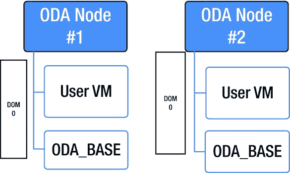
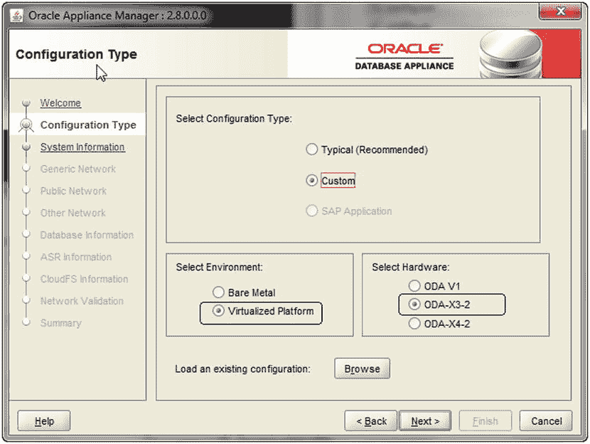
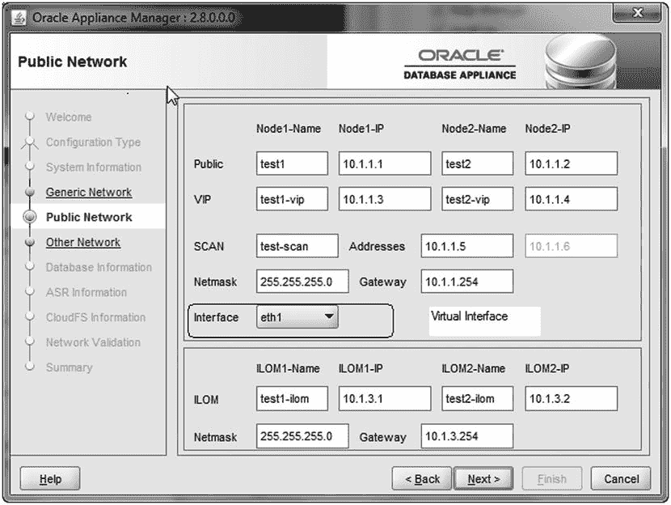
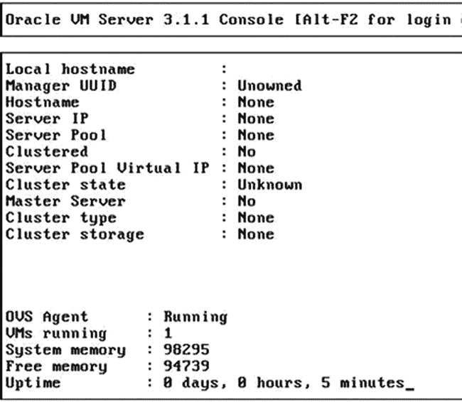

# 10. 虚拟化与 ODA

## 摘要

Oracle 数据库一体机 (`ODA`) 主要设计为一个一体机设备，用于快速支持和部署 Oracle 数据库，并提供按需付费的许可模式。`ODA` 硬件在部署选项上提供了极大的灵活性，其 `4U` 机架尺寸对于许多中小型企业 (`SMB`) 在各种场景下的部署来说都非常理想。`SMB` 通常希望使用整合的硬件，而 `ODA` 作为一个优秀的数据库平台，仍然需要额外的组件来支持一个完整的应用程序栈。这催生了一个想法，即虚拟化可能实现一个一体化的解决方案，帮助各类 `SMB` 实现“减少硬件”的目标。

通过软件更新，虚拟化功能已被添加到 `ODA` 中，与其他主要的 `ODA` 功能一样，它需要对平台进行重新镜像才能实现。`ODA` 上的虚拟化允许使用那些可能被闲置的容量。本章将重点介绍使用 Oracle VM (`OVM`) 这项在 `ODA` 上实现虚拟化的技术的基础知识，并讨论部署虚拟机以扩展 `ODA` 用途的便捷性。

## ODA 性能

当前的 `X3-2 ODA` 型号运行与 `Exadata` 相同的计算节点型号。`ODA` 在服务器节点的发布周期上确实落后于 `Exadata`。尽管如此，它们大部分时间运行的是相同的 `CPU` 型号。`Exadata` 支持每台服务器的内存从 `256G` 扩展到 `512G`，但 `ODA` 不支持。即便如此，`ODA` 上的逻辑 `IO` 性能仍然非常出色。

`ODA` 性能的另一个来源是所有组件都内置于一体机中。`RAC` 流量不会离开一体机通过外部网络在计算节点之间进行通信。两个服务器节点和存储单元彼此相邻，并通过高速 `SAS` 电缆连接。中间没有交换机、防火墙或其他外部网络层。

`ODA` 的物理 `IO` 存储性能良好——事实上，比典型的 `SAN` 光纤通道磁盘要好。Oracle 已发布的 `X3-2` 物理 `IO` 基准测试显示，在单个存储单元上，`3,500` `IOPS` 时延迟为 `5` 毫秒；在附加存储扩展单元时，`7,000` `IOPS`。超过这些 `IOPS` 水平，服务级别会下降。Oracle 的 `ODA X3-2` 基准测试显示，在 `5,750` `IOPS` 时，服务级别为 `6` 到 `7` 毫秒；在配置存储扩展机架时，`11,500` `IOPS`。最后的这些数字仍然非常优秀，与经过良好调优的基于光纤通道磁盘的 `SAN` 上看到的水平相当。然而，当 `IOPS` 超过这些水平时，性能在某些时候会开始明显下降。由于 `ODA` 配备了大量内存，将数据缓存在内存中是避免达到 `ODA` `IOPS` 限制的关键可扩展性因素。

`ODA` 目前没有支持使用 `PCI Flash` 或 `SSD` 的可选功能。随 `ODA` 附带的四个 `SSD` 驱动器仅支持用于在线重做日志。`ODA` 支持扩展存储到 `NFS`，包括 Oracle 的 `ZFS` 存储设备。支持使用 `DNFS` (直接 `NFS`) 来提升性能。然而，据我所知，尚未发布任何使用 `NFS` 存储扩展的 `ODA` 的物理 `IO` 性能基准测试。虽然 `ASM` 在 `NFS` 扩展上不受支持，但 Oracle 已宣布，当 `NFS` 挂载点是 Oracle `ZFS` 存储设备时，`ODA` 支持混合列式压缩。

由于 Oracle 正在投资 `ODA` 平台，`IOPS` 和磁盘性能可能会随着每个新型号而变化。当替代 `X3-2` 的新型号发布时，您需要重新审视物理性能和 `IOPS` 限制。

## 总结

`ODA` 是一种高可用的应用程序和数据库基础设施解决方案，采用自包含的一体化工程设备。`ODA` 提供低成本的硬件，与传统的数据库解决方案相比，其设置和持续支持成本更低。部署是自动化且快速的，包括创建 `RAC One` 和双节点 `RAC` 集群数据库。`ODA` 修补过程使用 Oracle 提供的软件，将 `OS`、网格和数据库组件作为一个整体单元进行修补。`ODA` 预装了管理和部署软件。

`ODA` 提供独特的“按需成长”Oracle 许可选项。应用程序和数据库可以使用 Oracle 的虚拟化产品部署在 `ODA` 上。

## Oracle VM (`OVM`)

`OVM` 基于开源的 `Xen` 虚拟机管理程序，并在市场上与 `EMC VMware` 和 `Microsoft Hyper-V` 等产品竞争。Oracle 将 `Xen` 虚拟机管理程序作为其 `OVM` 技术的核心，并进行了重大增强，例如支持多种操作系统，以及提供管理界面，使其成为更适合企业使用的产品。

Oracle 对 Sun Microsystems 的收购使其能够进一步增强 `OVM` 产品，并创建了一个 `OVM` 产品家族，包括 Oracle `VM Server` 以及 Oracle `VM VirtualBox`。Oracle `VM Server` 是运行虚拟主机的平台，允许在一组硬件上 provision 多个虚拟主机，并且包含一个服务器组件以及一个必需的管理组件。另一方面，Oracle `VM VirtualBox` 是一个桌面虚拟化工具，扩展了您现有桌面软件的功能，并且不需要虚拟机管理程序来管理它。Oracle 免费提供 Oracle `VM Server` 以及 Oracle `VirtualBox`，但 Oracle `VM Server` 有相关的支持成本。Oracle 还提供了一个其产品的广泛 `VM` 模板库，允许快速部署虚拟机。Oracle `VM` 模板也可以转换为 Oracle `VirtualBox` 模板。

### OVM 与数据库一体机

`ODA` 上的 `OVM` 实现具有独特性，因为它不需要 Oracle `VM Manager`。在 `ODA` 上引入虚拟化的设计理念是为了在不增加额外基础设施的情况下增强 `ODA` 的价值，并确保数据库一体机中的数据库仍然是 `ODA` 的主要焦点。`ODA` 补丁版本 `2.5` 添加了对虚拟化的支持，此后所有后续版本都增加了功能，使虚拟化更好、更易于管理和部署。

`ODA` 上的虚拟化在安装和设备配置方面带来了一些独特的挑战。`ODA` 上的默认设置是裸机，这意味着所有硬件与每个组件都是一一对应的。为了将正在运行的 `ODA` 转换为虚拟化模型，必须重新安装整个一体机。这一点作为安装决策尤为重要，因为转换需要数据丢失或停机。

### 安装虚拟化 ODA

从工厂发货的 `ODA` 的默认状态是裸机状态。`ODA` 裸机安装的过程在第 2 章中有详细说明。本节将重点介绍一些具体的变化，以及 `ODA` 离线配置器中为处理虚拟化所做的更改。


## 虚拟化准备

`ODA`上的虚拟化在不同版本间发生了巨大变化。最初的虚拟化`ODA`平台仅支持本地虚拟机存储库，且没有任何预定义的虚拟网络设置。虚拟化的发展现已允许访问本地或共享存储库，以及设置`VLAN`的可能性，这是隔离数据库和应用程序所必需的。`ODA`补丁 2.8 支持共享存储库并提供了简化的`VLAN`设置方法。

为`ODA`上的虚拟化做准备，需要在部署设备时做出一些决定。由于设备软件的易变性，有时很难在不走回头路的情况下做出设计选择。在部署前需要做出几个决定：

*   裸金属还是虚拟化？
*   共享存储库还是本地存储库？
*   数据库虚拟机或`ODA_Base`需要多少个 CPU？

关键决定是选择裸金属还是虚拟化。一旦选定其中一种，要逆转这个决定就非常困难，因为这样做需要完全重新安装系统。本地存储库选项允许在`ODA` v1 中分配 250GB，在`ODA` X3-2 中分配 350GB 用于模板管理。此选项现已被共享存储库选项所取代，代价是会占用`DATA`和`RECO`磁盘组的空间。共享存储库选项允许虚拟机具有更高的可用性。使用本地存储库时，一个`VM`只会启动在它注册的节点上；而在共享存储库模式下，如果一个节点不可用，`VM`可以故障转移到另一个节点。

另一个重要的容量考虑是确保数据库`VM`的大小合适。`ODA`的主要关注点是数据库，因此一个虚拟化的`ODA`包含一个特殊的、经过优化的`VM`，称为`ODA_BASE`，它独占访问共享磁盘，这对于确保最佳的数据库性能是必需的。`ODA_BASE`是一个预构建的`OVM`模板，其中包含 Oracle Clusterware 和数据库所需的所有特定组件。

设计是虚拟化`ODA`的一个非常重要的方面。图 10-1 展示了设备虚拟化的基本架构。由于`ODA`由两台物理服务器组成，在作为虚拟化练习的一部分部署到`ODA`上时，有两个主要组件需要部署：

*   `Dom0` 或虚拟化控制器
*   `ODA_BASE` 或专用于`ODA`的客户`VM`

Domain 0，或称`Dom0`，是虚拟化控制器，它是一个用于管理虚拟化框的虚拟机监控程序的虚拟操作系统。两个物理节点中各有一个`Dom0`；它被认为是管理`ODA`虚拟化基础设施的部分。`Dom0`被用作基础操作系统，因此不应在其上安装其他任何东西。然而，`Dom0`确实托管虚拟模板存储库，因此所有`VM`模板都从那里导入。



图 10-1. 虚拟化`ODA`的基本架构

数据库`VM`，也称为`ODA_BASE`，是设备的一个关键方面。`ODA_BASE`是一个特殊设计的`VM`，可以直接访问部分`ODA`硬件。它预先安装并配置了针对`ODA`硬件优化的各种驱动程序，以改善对虚拟机监控程序和共享磁盘的访问。`ODA_BASE`模板包括集群软件二进制文件、数据库软件二进制文件以及创建 Oracle 数据库所需的自定义数据库模板。

虚拟化的另一方面是在单独的虚拟化主机中安装应用程序或任何其他组件。这被称为用户`VM`。用户`VM`不是强制性的，一个`ODA`可以被虚拟化并只包含一个`Dom0`和一个`ODA_BASE`。目前，除非使用共享`VM`存储库，否则用户`VM`存在空间限制。共享存储库支持是`ODA`2.8 中的一个新功能，但在此之前，每台物理机上只有 250GB（`ODA` V1）或 350GB（`ODA` X3-2）的本地磁盘空间可用。此外，在先前版本的`ODA`软件中，用户`VM`不具备故障转移能力。

## 虚拟化部署考虑因素

理解当`ODA`用作虚拟化环境时其部署策略的变化非常重要。部署时需要理解容量和网络变化。除非独立软件供应商（`ISV`）创建了启用虚拟化的自定义设备，否则设备发货时不会预装虚拟化。

表 10-1 和表 10-2 对比了`ODA` V1 和`ODA` X3-2 在裸金属与虚拟化接口方面的差异。在裸金属环境中，所有网络接口都有物理映射，并且在 Linux 层进行绑定，为网络接口提供高可用性。严格遵守文档并确保`Eth0`仅用于私有接口至关重要。

表 10-2. Oracle Database Appliance X3-2 网络设置

| 类型 | 物理接口 | 链路速度 | 裸金属接口名称 | 虚拟接口名称 | 虚拟桥接 Dom0 |
| --- | --- | --- | --- | --- | --- |
| 板载双网接口 | `Eth0` | 10GbE | `Eth0` | `Eth0` | `Priv1` |
| 板载双网接口 | `Eth1` | 10GbE | `Eth1` | `Eth0` | `Priv1` |
| 板载四网接口 | `Eth2` 和 `Eth3` | 10GbE | `bond0` | `Eth1` | `Net1` |
| 板载四网接口 | `Eth4` 和 `Eth5` | 10GbE | `Bond1` | `Eth2` | `Net1` |

表 10-1. Oracle Database Appliance V1 网络设置

| 类型 | 物理接口 | 链路速度 | 裸金属接口名称 | 虚拟接口名称 | 虚拟 Dom0 桥接 |
| --- | --- | --- | --- | --- | --- |
| 内部双 1GbE | `Eth0` | 1GbE | `Eth0` | `Eth0` | `Priv1` |
| 内部双 1GbE | `Eth1` | 1GbE | `Eth1` | `Eth0` | `Priv1` |
| 板载双 1GbE | `Eth2` 和 `Eth3` | 1GbE | `Bond1` | `Eth1` | `Net1` |
| 板载双端口 | `Eth8` 和 `Eth9` | 10GbE | `xbond0` | `Eth4` | `Net4` |
| 四端口网络接口 | `Eth4` 和 `Eth5` | 1GbE | `Bond 2` | `Eth2` | `Net2` |
| 四端口网络接口 | `Eth6` 和 `Eth7` | 1GbE | `Bond3` | `Eth3` | `Net3` |

理解物理和虚拟连接及其差异至关重要，如表 10-1 和 10-2 所示。部署`ODA`时需要此信息。`IP`需求在裸金属和虚拟化`ODA`之间也略有变化。表 10-3 显示了裸金属`ODA`和虚拟化`ODA`之间`IP`需求的差异。Domain0 和用户`VM`的增加是`IP`需求差异的重要因素。

表 10-3. ODA 的 IP 需求

| IP 类型 | 裸金属 IP 数量 | 默认值 | 虚拟化 IP 数量 | 默认值 |
| --- | --- | --- | --- | --- |
| 主机 | 2 | 用户定义 | 2 | 用户定义 |
| 私有 IP | 4 | 192.168.16.24 192.168.16.25 192.168.17.24 192.168.17.25 | 2 | 192.168.16.27 192.168.16.28 |
| Dom 0 | 不适用 | 不适用 | 4 | 两个用户定义: 192.168.16.24 (私有) 192.168.16.25 (私有) |
| RAC VIP | 2 | 用户定义 | 2 | 用户定义 |
| SCAN VIP | 2 | 用户定义 | 2 | 用户定义 |
| ILOM IP | 2 | 用户定义 | 2 | 用户定义 |
| 用户 VM IP* | 不适用 | 不适用 | 每个 VM 1 个 | 用户定义 |

*用户 VM IP 取决于 VM 数量；最少 1 个 IP/VM。


### 虚拟化 ODA 的部署

部署虚拟化 ODA 需要重新安装设备，然后在 ODA 上部署虚拟化镜像。第 2 章详细介绍了如何安装 ODA 裸机版的流程。为了使 ODA 成为虚拟化配置，需要从 Oracle 支持站点下载相应的补丁。目前，可以下载 `Patch ID 16984856` 来部署虚拟化镜像。

### 虚拟部署的配置

离线配置器已经增强，以支持构建部署虚拟化 ODA 所需的配置。图 10-2 是进入配置器的初始界面；由于硬件配置的变更，它允许进行各种配置选择。


**图 10-2.** 初始配置选择屏幕

### 网络接口映射

网络映射屏幕是虚拟接口将可访问的地方；这与裸机配置中可用的物理接口形成对比。图 10-3 展示了在 `ODA X3-2` 示例中虚拟环境下的网络接口变化。`ODA V1` 和 `ODA X3-2` 的配置屏幕是相同的，区别在于 `ODA V1` 允许在 `1Gbei` 和 `10GbE` 接口之间选择。`ODA X3-2` 上的所有接口都支持 `10 GbE`。


**图 10-3.** `ODA X3-2` 的网络配置屏幕

### 重镜像后配置

配置器生成的配置文件用于部署过程，该过程在重镜像完成后启动。重镜像完成的标志是 `Dom0` 可用且 `Oracle VM Server` 已安装。图 10-4 显示了在 `Dom0` 上运行的 `Oracle VM Server` 的一个屏幕。


**图 10-4.** ODA 上新初始化的 `Oracle VM Server`

服务器重镜像完成后，可以使用 `ILOM` 的远程访问控制台，访问到类似于图 10-4 所示的屏幕。离线配置器不允许向 `Dom0` 添加 IP 地址，因此您需要通过 `ILOM` 的远程访问登录，并以 `root` 身份登录来配置网络，如清单 10-1 所示。

### 为 `Dom0` 配置网络

**清单 10-1.** 向 `Dom0` 添加 IP

```
/opt/oracle/oak/oakcli configure firstnet

Configure the network for the node(s)(local, global) [global]: <default is global for configuring both nodes>

The network configuration for both nodes:

Domain Name: [your.company.com](http://your.company.com/)

DNS Server(s): Primary Dns Server:  <enter your primary DNS server>
Secondary Dns Server:  <enter your secondary DNS server>
Tertiary Dns Server:  <enter your tertiary DNS server>

Node Name       Host Name
0               host1-dom0 <- enter your 1st hostname
1               host2-dom0 <- enter your 2nd hostname

Choose the network interface to configure (net1, net2) [net1]: <default is net1>
Configure DHCP on net1 (yes/no) [no]:
You have chosen static configuration on net1

Enter the IP address for net1 on Node 0: <enter your 1st hostname IP address>
Enter the IP address for net1 on Node 1: <enter your 2nd hostname IP address>
Netmask for net1: < enter your netmask >
Gateway Address for net1 [<Gateway IP>]:  <based on your IP and netmask, the proper gateway will displayed>

Plumbing the IPs now on Node 0 ...
::::::::::::::::::::::::::::::::::::::::::::::::::
Plumbing the IPs now on Node 1 ...
::::::::::::::::::::::::::::::::::::::::::::::::::
dom0.xml                                         100% 860 0.8KB/s 00:00
```

现在，两台物理服务器上的 `dom0` 的公共 IP 地址已经配置完成。这使得可以通过任何 SSH 客户端访问 `dom0`。在此阶段，ODA 仅 `dom0` 可访问；这是运行 Oracle 数据库集群所必需的特殊 ODA 数据库虚拟机模板 `ODA_BASE` 所需的平台。


### ODA_BASE 的部署

要部署 `ODA_BASE`，需要通过补丁 `16985062` 从 My Oracle Support 下载模板。对于 `2.8` 版本，补丁号可能会变化；始终建议使用 My Oracle Support 说明文档 `888888.1`。文件下载后，可以移动到位于节点 0 上 Dom0 的 `/OVS` 目录中。这样就可以为部署准备模板，如清单 10-2 所示。

清单 10-2. 在 ODA X3-2 上部署 ODA_BASE

```
#cat oda_base_2.8.gz00 oda_base_2.8.gz01 > oda_base_2.8.tar.gz

### /opt/oracle/oak/bin/oakcli deploy oda_base

Enter the template location: /OVS/oda_base_2.8.tar.gz

Core Licensing Options:
1. 2 CPU Cores
2. 4 CPU Cores
3. 6 CPU Cores
4. 8 CPU Cores
5. 10 CPU Cores
6. 12 CPU Cores
7. 14 CPU Cores
8. 16 CPU Cores
Selection1 .. 8 : 16
ODA base domain memory in GB(min 8, max 244)[default xxx]   : 244
INFO: Using default memory size i.e. 244 GB
Additional vlan networks to be assigned to oda_base ? (y/n) [n]: n
INFO: Deployment in non-local mode
INFO: Verifying active cores on local node
INFO: Verified active cores on local node
INFO: Verifying active cores on remote node
INFO: Verified active cores on remote node
INFO: Running the command to copy the template /OVS/oda_base_2.8.tar.gz to remote node 1
oda_base_2.8.tar.gz          100% 4524MB  56.6MB/s   01:20
INFO: Spawned the process 24025 in the deployment node 0
INFO: Spawned the process 24026 in the node 1
templateBuild-2013-11-06-22-18/swap.img
templateBuild-2013-11-06-22-18/swap.img
templateBuild-2013-11-06-22-18/System.img
templateBuild-2013-11-06-22-18/System.img
templateBuild-2013-11-06-22-18/u01.img
templateBuild-2013-11-06-22-18/u01.img
Using config file "/OVS/Repositories/odabaseRepo/VirtualMachines/oakDom1/vm.cfg".
Started domain oakDom1 (id=40)
INFO: Deployment in local mode
INFO: Extracted the image files on node 0
INFO: The VM Configuration data is written to /OVS/Repositories/odabaseRepo/VirtualMachines/oakDom1/vm.cfg file
INFO: Running /sbin/losetup /dev/loop0 /OVS/Repositories/odabaseRepo/VirtualMachines/oakDom1/System.img command to mount the image file
INFO: Mount is successfully completed on /dev/loop0
INFO: Making change to the /OVS/Repositories/odabaseRepo/VirtualMachines/oakDom1/tmpmnt/boot/grub/grub.conf file
INFO: Assigning IP to the first node...
INFO: Created oda base pool
INFO: Starting ODA Base...
INFO: Storing the odabase configuration information
Using config file "/OVS/Repositories/odabaseRepo/VirtualMachines/oakDom1/vm.cfg".
Started domain oakDom1 (id=1)
INFO: Deployment in local mode
INFO: Extracted the image files on node 1
INFO: The VM Configuration data is written to /OVS/Repositories/odabaseRepo/VirtualMachines/oakDom1/vm.cfg file
INFO: Running /sbin/losetup /dev/loop0 /OVS/Repositories/odabaseRepo/VirtualMachines/oakDom1/System.img command to mount the image file
INFO: Mount is successfully completed on /dev/loop0
INFO: Making change to the /OVS/Repositories/odabaseRepo/VirtualMachines/oakDom1/tmpmnt/boot/grub/grub.conf file
INFO: Assigning IP to the second node...
INFO: Created oda base pool
INFO: Starting ODA Base...
INFO: Storing the odabase configuration information
#
```

在此过程结束时，你将获得一个可以运行 Oracle 数据库的虚拟机。这被称为 `ODA_BASE`，你可以使用清单 10-3 中的命令来检查虚拟机的状态。清单中的虚拟机是利用最大资源量创建的。

清单 10-3. 列出 ODA X3-2 上虚拟机的状态

```
### xm list
Name                                               ID     Mem  VCPUs      State   Time(s)
Domain-0                                             0    2039     32     r-----  119019.9
oakDom1                                              1  251904     32     -b----   2815.8

### /opt/oracle/oak/bin/oakcli show oda_base
ODA base domain
ODA base CPU cores      :32
ODA base domain memory  :244
ODA base template       :/OVS/oda_base_2.8.tar.gz
ODA base vlans          :['priv1', 'net1', 'net2']
ODA base current status :Running
```

至此，我们已经部署了 `ODA_BASE` 虚拟机，只需再完成少量步骤即可实际启动并运行数据库。`ODA_BASE` 模板只能通过 `dom0` 上的 vncserver 进行访问。第一个虚拟机可以通过 VNC 使用端口 `5900` 访问。这可以通过 `dom0` 或外部 VNC 客户端完成。部署中的唯一区别在于访问虚拟机的方式。其余部署过程与裸机部署类似。

```
#vncsession dom0:5900
```

现已建立的 VNC 会话允许访问 `ODA_BASE` 主机。建立访问后，登录主机并使用使用离线配置工具创建的文件执行部署命令。

```
### /opt/oracle/oak/bin/oakcli deploy -conf /tmp/offlineconfig.param
```

部署过程将完成使 `ODA_BASE` 可通过公共网络访问的任务，并完成 Clusterware 和 Database Appliance Kit 软件的安装。

### 用户虚拟机的部署

对 ODA 进行虚拟化的目的是允许使用设备上的资源来构建完整的环境。这可以通过在设备上构建各种应用/用户虚拟机来实现，使其成为在同一硬件上同时托管数据库和应用程序的一体化设备。

由于在虚拟机层进行定制以适应数据库设备的特性，只能使用 `dom0` 将虚拟机导入 ODA。在 [`http://edelivery.oracle.com`](http://edelivery.oracle.com/) 上提供了多种通用虚拟机模板。本节将介绍如何将用户虚拟机模板导入 ODA 并进行配置。


### 虚拟镜像仓库

当虚拟化选项首次在 ODA 平台上引入时，用户定义的虚拟机在功能上存在一些特定限制。其中一些限制包括：

*   不具备高可用性
*   仅能访问本地仓库

本地仓库严重限制了虚拟机的大小：在 ODA V1 中，用户虚拟机仅能使用 250GB 空间；在 ODA X3-2 中，则为 350GB。由于每个物理节点无法感知其他节点的仓库，因此无法实现虚拟机故障转移，高可用性也就无从谈起。

ODA 软件最新版本 2.8 带来了多项增强功能，其中一项便是能够通过 ASM 集群文件系统 (`ACFS`) 挂载访问共享磁盘，并创建共享仓库。此选项不仅允许将本地空间用于其他用途，还为虚拟机本身提供了高可用性选项。

共享仓库需要 `ODA_BASE`，因为只有 `ODA_BASE` 才能访问 ODA 上的共享存储。创建共享仓库的过程包括创建 `ACFS` 挂载点，以及通过私有网络向 `dom0` 进行 `NFS` 导出。所有这些操作均通过 `oakcli` 命令完成。根据设计，你可以以 `DATA` 或 `RECO` 磁盘组中的空间为代价，创建一个或多个共享仓库。

尽管仍可访问本地仓库，但在 ODA 2.8 及更高版本中，推荐使用共享仓库。本地仓库默认始终会被创建。清单 10-4 展示了如何创建共享仓库以及如何检查其状态。

清单 10-4. 创建共享仓库及其状态

```
### oakcli create repo repo1 -dg data -size 20
```

```
### oakcli show repo
NAME                            TYPE            NODENUM         STATE
odarepo1                        local           0               N/A
odarepo2                        local           1               N/A
repo1                           shared          0               ONLINE
repo1                           shared          1               ONLINE
```

```
#oakcli show repo repo1 -node 1
Resource: repo1_1
        AutoStart       :       restore
        DG              :       DATA
        Device          :       /dev/asm/repo1-286
        ExpectedState   :       Online
        MountPoint      :       /u01/app/repo1
        Name            :       repo1_0
        Node            :       all
        RepoType        :       shared
        Size            :       20720
        State           :       Online
```

```
# oakcli stop repo repo1 -node  1
```

## 用户虚拟机的创建

创建仓库是构建用户定义虚拟机的重要一步。用户定义的虚拟机用于运行任何独立于 Oracle 数据库的应用程序或软件。这可以是任何应用，例如 WebLogic 甚至 Windows 虚拟机。提供虚拟化选项的目标是将 ODA 变成适用于商店或银行分行等场景的“一体化”部署设备，并减少运行一个完整系统所需的基础设施组件数量。

用户虚拟机通过克隆虚拟机模板的过程来创建。Oracle 在 [`http://edelivery.oracle.com`](http://edelivery.oracle.com/) 提供了许多常用模板；这些模板可以下载并导入到仓库中。清单 10-5 至 10-8 展示了以不同方式导入虚拟机模板的过程。此过程涉及将文件复制到 `dom0` 并导入到本地或共享仓库。模板也可以从外部模板仓库导入。

清单 10-5. 将虚拟机模板导入本地仓库

```
#oakcli import vmtemplate ol6linux_64 -files /OVS/OVM_OL6_X86_64.tgz
```

清单 10-6. 将虚拟机模板导入共享仓库

```
#oakcli import vmtemplate ol6linux_64 -files /OVS/OVM_OL6_X86_64.tgz –repo repo1
```

清单 10-7. 通过外部仓库模板将模板导入共享仓库

```
#oakcli import vmtemplate ol6linux_64 -files 'http://vm.example.com/OEL6/OVM_OL6_X86_64.tgz'
-repo repo1
```

清单 10-8. 通过模板组件包将模板导入共享仓库

```
#oakcli import vmtemplate ol6linux_64 -assembly
'http://vm.example.com/assemblies/OEL6/OVM_OL6_X86_64.ova' -repo repo1
```

至此，我们只是将虚拟机模板导入了仓库。我们需要配置该虚拟机模板，以便能够使用其在 ODA 上可用的配置。清单 10-9 至 10-11 展示了使用便捷的 `oakcli` 命令集可以进行的各种配置设置。有关网络的选项，请参考表 10-1 和 10-2。

清单 10-9. 展示虚拟机模板的配置选项

```
#oakcli show vmtemplate ol6linux_64
```

清单 10-10. 为虚拟机模板添加网络

```
#oakcli modify vmtemplate ol6linux_64 -addnetwork net1
```

清单 10-11. 在模板上配置 CPU、内存

```
#oakcli configure vmtemplate ol6linux_64 -vcpu 4 -maxvcpu 8 -cpucap 10 -memory 3000M
-maxmemory 6G -os OTHER_LINUX
```

对 `vmtemplate` 的配置完成后，现在就可以创建实际的用户虚拟机了。在示例中，我们创建了一个共享仓库和一个 OL6 Linux 虚拟机模板，将 `net1` 分配为网络，并设置了虚拟 CPU 范围、CPU 上限以及内存边界。模板中设置的值将作为所有基于该模板创建的虚拟机的默认值。清单 10-12 至 10-18 展示了如何使用 `oakcli clone` 命令实际创建虚拟机，然后启动它。对于共享仓库的情况，我们还可以配置高可用性选项。模板值也可以被覆盖。

清单 10-12. 创建并配置用户虚拟机：通过克隆模板创建虚拟机

```
#oakcli clone vm ol6test -vmtemplate ol6linux_64 -repo repo1 -node oda2
```

清单 10-13. 覆盖虚拟机模板值

```
#oakcli configure vm ol6test -vcpu 6 -memory 4G
```

清单 10-14. 配置高可用性和故障转移值

```
#oakcli configure vm ol6test -prefnode oda2 -failover oda1
```

清单 10-15. 启动虚拟机

```
#oakcli start vm ol6test
```

清单 10-16. 显示所有虚拟机的状态

```
#oakcli show vm
```

清单 10-17. 停止虚拟机

```
#oakcli stop vm ol6test
```

清单 10-18. 访问虚拟机控制台

```
#oakcli show vmconsole ol6test
```

至此，我们已经完成了创建 `vmtemplate`，然后克隆 `vmtemplate` 以创建一个名为 `ol6test` 的可工作虚拟机的全过程。我们分配了高可用性选项，并覆盖了一些我们不希望从模板继承的值。现在，我们有了一个正在运行的虚拟机，可以在其上部署任何应用程序，同时也有了一个正在运行 Oracle 数据库的 `ODA_BASE`。这便完成了运行虚拟化 ODA 所需的最基本配置。

## 高级虚拟机配置与补丁

在 ODA 上配置虚拟化可以很简单，比如重新镜像 ODA、创建仓库、导入 `vmtemplate`，然后克隆它来创建虚拟机。然而，也存在一些高级配置技术，可用于更好地控制环境。我们将简要讨论一些用于为虚拟机提供稳定性和可用性的技术。


## CPU 池

虚拟化的关键优势之一在于能够控制各种资源并隔离工作负载。创建虚拟机的默认配置使用非固定 CPU 池。这使得所有虚拟机都可以访问虚拟化设备中的所有 CPU，`ODA_BASE`除外。

`ODA_BASE`是数据库虚拟机，因此在创建时，会创建一个名为`odaBaseCpuPool`的池。该池包含仅`ODA_BASE`可独占访问的 CPU。如果`ODA_BASE`存在，你将拥有两个池：

*   `default-unpinned-pool`
*   `odaBaseCpuPool`

`default-unpinned-pool`是包含所有不属于`odaBaseCpuPool`的 CPU 的池。在简单配置中，所有虚拟机都将访问默认池。在需要隔离的情况下，你总是可以创建额外的 CPU 池来限制虚拟机。清单 10-19 展示了一个 CPU 池的配置。

清单 10-19. CPU 池

```
#oakcli show cpupool -node 1
Pool                    Cpu List
default-unpinned-pool   [12, 13, 14, 15, 16, 17, 18, 19, 20, 21, 22, 23]
       odaBaseCpuPool   [0, 1, 2, 3, 4, 5, 6, 7, 8, 9, 10,11]
```

CPU 池不必在两个节点上完全一致——`odaBaseCpuPool`除外，它在两个节点上必须相同。清单 10-20 展示了如何创建 CPU 池。清单 10-21 和 10-22 分别展示了如何向池中添加 CPU 以及如何将虚拟机固定到 CPU 池。

清单 10-20. 创建和管理 cpupool

```
#oakcli create cpupool unxpool -numcpu 6 -node 0
```

清单 10-21. 向 cpupool 添加 CPU

```
#oakcli configure cpupool unxpool -numcpu 10 –node 0
```

清单 10-22. 将虚拟机固定到 CPU 池

```
#oakcli configure vm ol6test -cpupool unxpool
```

这些清单中显示的命令只能应用于非`ODA_BASE`的 cpupool。由于`ODA_BASE`的特殊性，需要使用一套特殊的命令集来管理 CPU。清单 10-23 对此进行了演示。

清单 10-23. 在 ODA_BASE 中管理 CPU

```
### /opt/oracle/oak/bin/oakcli configure oda_base
Core Licensing Options:
        1. 2 CPU Cores
        2. 4 CPU Cores
        3. 6 CPU Cores
        4. 8 CPU Cores
        5. 10 CPU Cores
        6. 12 CPU Cores
        7. 14 CPU Cores
        8. 16 CPU Cores
        Current CPU Cores       : 6
        Selection1 : 6 : 4
        ODA base domain memory in GB(min 8, max 96)(Current Memory 64G)[default 32]     :
INFO: Using default memory size i.e. 32 GB
Additional vlan networks to be assigned to oda_base? (y/n) [n]: Vlan network to be removed from oda_base (y/n) [n]
INFO: Node 0:Configured oda base pool
INFO: Node 1:Configured oda base pool
INFO: Node 0:ODA Base configured with new memory
INFO: Node 0:ODA Base configured with new vcpus
INFO: Changes will be incorporated after the domain is restarted on Node 0
INFO: Node 1:ODA Base configured with new memory
INFO: Node 1:ODA Base configured with new vcpus
INFO: Changes will be incorporated after the domain is restarted on Node 1
#oakcli restart oda_base
```

由此产生的命令可能会要求更改系统文件，并且需要重启才能使新的`ODA_BASE`配置生效。在两个节点上重启`ODA_BASE`，至此结束关于 CPU 池的讨论。

## 虚拟局域网

ODA 2.8 版本软件引入的一项新功能是能够在 ODA 中创建和管理虚拟局域网（VLAN）。虚拟局域网需要在交换机级别进行配置以允许 VLAN 标记，但此功能允许网络和安全部门创建更小的网络分段，并为特定流量类型打上标记。清单 10-24 和 10-25 展示了创建 VLAN 以及将其附加到虚拟机的示例。

清单 10-24. VLANs 创建 VLAN

```
#oakcli create vlan oda90 -vlanid 90 -if bond0 -node 0
#oakcli create vlan oda90 -vlanid 90 -if bond0 -node 1
```

清单 10-25. 修改虚拟机以附加到 VLAN

```
### oakcli modify vm ol6test -addnetwork oda90
```

你也可以将 VLAN 添加到你的`ODA_BASE`虚拟机中。清单 10-26 展示了如何操作。在那里你会看到`oakcli configure`命令被发出。然后你会看到该命令触发的交互。系统会问你几个问题。请根据你的环境提供正确的值进行响应。

清单 10-26. 向 ODA_BASE 添加 VLAN

```
/opt/oracle/oak/bin/oakcli configure oda_base
Core Licensing Options:
        1 2 CPU Cores
             ....
             ....
        8 16 CPU Cores
        Current CPU Cores       : 6
        Selection1 : 6 : 3
        ODA base domain memory in GB(min 8, max 88)(Current Memory 48G)[default 64]     : 48
INFO: Using default memory size i.e. 64 GB
Additional vlan networks to be assigned to oda_base? (y/n) [n]: y
Select the network to assign (oda90,oda91,oda92): oda90
Additional vlan networks to be assigned to oda_base? (y/n) [n]:
Vlan network to be removed from oda_base (y/n) [n]:
INFO: . . .
```

如果使用了共享存储库选项，在两个节点上都配置 VLAN 至关重要。这使得虚拟机故障转移能够无缝工作。

## 为虚拟化 ODA 打补丁

为虚拟化 ODA 打补丁的过程与为裸机 ODA 打补丁的过程并无不同。统一打补丁不支持为用户虚拟机打补丁。此补丁仅包含`ODA_BASE`和 dom0 的补丁。任何用户虚拟机的打补丁工作都是用户虚拟机管理员的责任。

## 总结

第 10 章重点介绍了 ODA 的虚拟化。它仅仅是触及了 ODA 上虚拟化可用可能性的皮毛。这包括 OVM 以及为使其在 ODA 上工作而进行的定制。`ODA_BASE`的创建及其对共享磁盘的独占访问以确保性能不受影响。我们讨论了启动并运行用户虚拟机的过程，并探讨了 ODA 上可用的一些高级选项。随着软件的发展，虚拟化领域中 ODA 的可用选项和定制能力也将随之发展。

