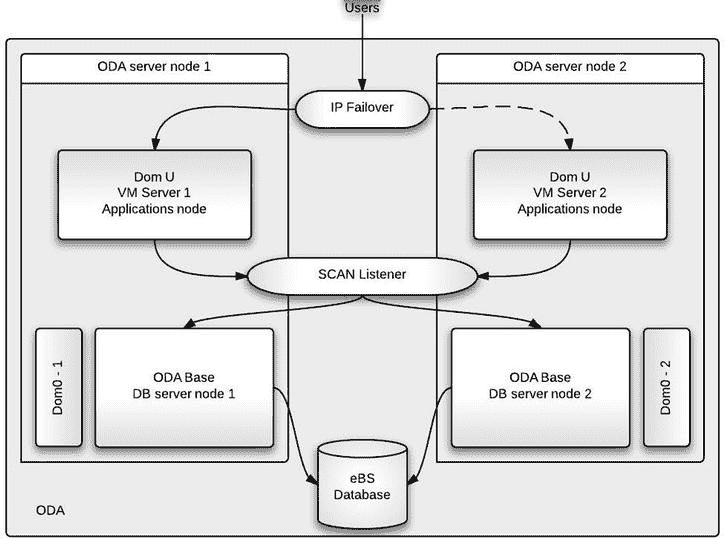
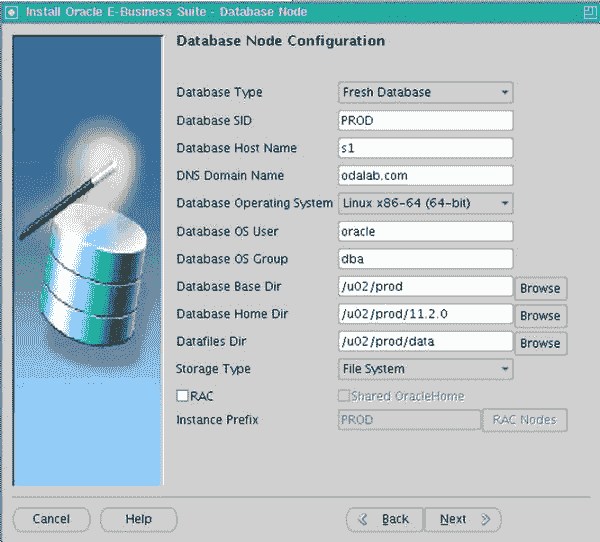
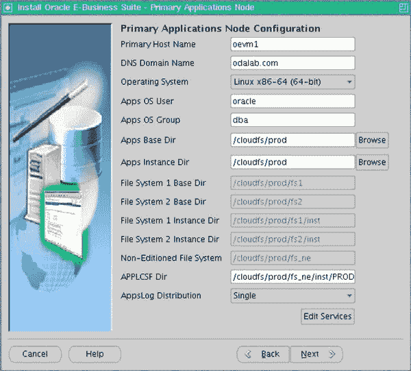
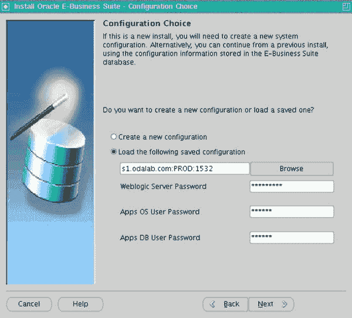
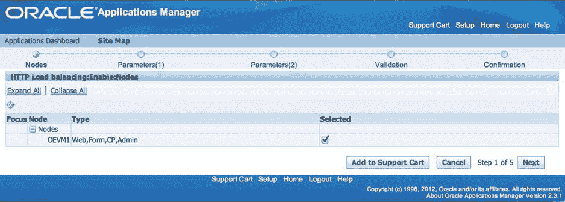
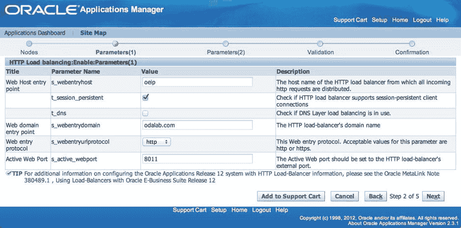
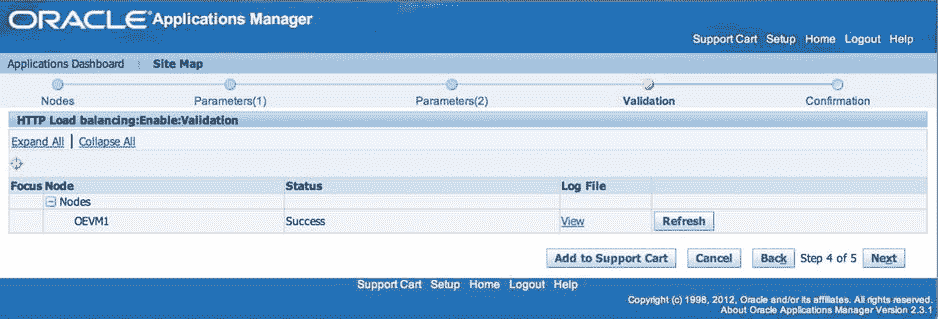

# 11. 电子商务套件与 ODA

摘要

Oracle 数据库一体机是一个预配置、高可用、采用工程化设计的系统，运行 11gR2 集群件。本书前面的章节已经解释了 ODA 作为数据库和/或应用平台的优势。电子商务套件（eBS）的拥有者也想将其用于他们的系统，这是可以理解的。遗憾的是，ODA 的“开箱即用”配置并不能完全支持电子商务套件的安装。本章将展示如何调整 ODA 的标准配置以满足电子商务套件的特定要求，以及如何在不牺牲 ODA 灵活性和支持性的前提下，将电子商务套件安装或迁移到 ODA。

Oracle 数据库一体机是一个预配置、高可用、采用工程化设计的系统，运行 11gR2 集群件。本书前面的章节已经解释了 ODA 作为数据库和/或应用平台的优势。电子商务套件（eBS）的拥有者也想将其用于他们的系统，这是可以理解的。遗憾的是，ODA 的“开箱即用”配置并不能完全支持电子商务套件的安装。本章将展示如何调整 ODA 的标准配置以满足电子商务套件的特定要求，以及如何在不牺牲 ODA 灵活性和支持性的前提下，将电子商务套件安装或迁移到 ODA。


## ODA 是否适用？

一个显而易见的问题是，`ODA` 是否适合运行 `Oracle 的 e-Business Suite`。这是个好问题，答案必须考虑多个方面，包括：

*   可用性
*   存储容量
*   CPU 容量
*   内存
*   `eBS` 在该硬件上的认证情况

可用性通过 `ODA` 的 `RAC` 能力得以满足。通常，`e-Business Suite` 是公司的核心 `ERP` 系统，在大多数情况下，它属于关键任务系统，这意味着它必须具有高可用性。`ODA` 的技术架构在设计时就考虑了高可用性。所有组件都是冗余的——从电源到网络接口。共享存储的可用性通过将磁盘配置为正常或高冗余的 `自动存储管理 (ASM)` 磁盘组来实现。如果选择 `ODA` 作为 `e-Business Suite` 部署的平台，建议使用 `RAC`（数据库）配置，或者至少使用 `RAC One Node`（`e-Business Suite` 数据库也支持此配置），以充分利用 `ODA` 的能力。

存储容量很容易满足，至少在典型情况下是如此。平均的 `e-Business Suite` 系统数据库大小很少超过 `2T`。¹ 原始的 `ODA` 根据存储配置，最多可为数据库提供 `6T` 的空间。`ODA X3-2` 最多可提供 `9T` 的存储空间，如果添加存储扩展柜，甚至可以达到 `18T`。在大多数情况下，这已经绰绰有余。与往常一样，建议在迁移到新平台之前进行适当的容量规划。

`CPU` 需求也很容易满足。原始的 `ODA` 配备两个 `Intel Xeon X5675 6 核 CPU`，而 `X3-2` 在每个服务器节点上安装了两个 `Intel Xeon E5-2690 CPU`，分别为每个 `ODA` 提供 `24` 和 `36` 个 `CPU` 核心。在许多情况下，`e-Business Suite` 数据库每个数据库节点最多使用 `8` 个 `CPU` 核心，但这在很大程度上取决于环境的用户数量和工作负载模式。请确保根据环境特性估算所需的 `CPU` 数量，并使用灵活的许可，仅为数据库启用所需数量的核心。

内存可能是个问题，这取决于您运行的是哪款 `ODA` 机器、您使用的是哪个版本的 `e-Business Suite` 以及您的虚拟化选择。原始的 `ODA` 每个服务器节点配备了 `96G` 的 `RAM`；`X3-2` 升级为每个服务器 `256G` 的 `RAM`。在大多数情况下，这对于 `e-Business Suite` 数据库来说是足够的内存量。但是，如果选择了虚拟化部署选项，则必须在 `ODA Base`（数据库）、管理域 (`Dom0`) 和其他虚拟机之间分配内存。对于原始的 `ODA`，可用内存量可能会成为问题。

正如您可能预料的那样，`Oracle` 在其自己的硬件上认证其自己的软件。`Oracle Database Appliance` 是一个运行 `Oracle grid infrastructure` 和 `11.2.0.2+` 数据库版本的 `Oracle Linux 5.6+` 服务器集群。操作系统和数据库版本都经过认证可用于运行 `Oracle e-Business Suite R12.1` 数据库；然而，对于 `R12.2` 数据库版本，`11.2.0.3` 是强制要求。² 应用层有两种部署选项是可行的：

*   虚拟化 `ODA`，使用 `ODA` 集成的 `Oracle VM` 和 `Oracle Linux 6` 虚拟服务器作为应用层主机。此配置已完全通过 `e-Business Suite` 认证。
*   使用外部应用层。如果按照 `My Oracle Support Certification Service` 上列出的要求构建，此方法已通过认证。

## ODA 上的 e-Business Suite 系统架构

从系统架构角度看，`ODA` 不过是一个包含两个服务器的“盒子”，如果使用虚拟化配置，除了数据库工作负载外，也可以配置用于其他类型的工作负载。通过虚拟化配置，`ODA` 还可以托管多个应用服务器；对于典型的 `e-Business Suite` 配置，需要两个以确保更好的可用性指标。可以添加额外的 `VM` 用于更高级的配置，例如，如果配置了面向外部的模块（`iSupplier`、`iRecruitment`、`iStore`）。鉴于 `ODA` 平台的规模和特性，有几种可能的系统架构可以全部或部分地利用 `ODA`。以下是构思涉及使用 `ODA` 的 `e-Business Suite` 架构时需要回答的几个问题：

*   使用哪种 `ODA` 配置——`裸金属` 还是 `虚拟化`？如果使用 `裸金属`，应用层服务器将不会驻留在 `ODA` 上。
*   数据库的配置是什么——`RAC`、`RAC One Node`³ 还是 `单节点`？此决定影响许可成本和数据库的可用性特性。为了获得最佳可用性，推荐使用 `RAC`。
*   是否有可用的外部负载均衡器？（`ODA` 不提供负载均衡功能）。如果没有，您可能需要在 `ODA` 上为应用层实现软件负载均衡或故障转移功能。另一个选择是完全不使用负载均衡。这是一个合适的配置吗？
*   计划的应用层文件系统大小是多少？节点之间是否应共享？共享文件系统的选项之一是使用 `ODA` 上的 `Oracle 自动存储管理集群文件系统 (ACFS)`；另一个选项是使用外部 `NFS` 共享，这会引入外部依赖性。

图 11-1 展示了一种将 `e-Business Suite` 完全部署在 `ODA` 上的架构。该架构对数据库使用 `Oracle Real Application Clusters`，对数据库连接使用 `SCAN` 监听器，在虚拟应用服务器上挂载 `Oracle ACFS` 卷以提供共享的应用层文件系统，在每个 `ODA` 物理服务器上放置一个虚拟化应用层节点，并将一个虚拟 `IP` 分配给其中一个应用层节点供用户连接系统。本章接下来的章节将详细探讨如何将 `e-Business Suite` 系统部署到这个复杂的、基于 `100% ODA` 的架构中。



图 11-1.
虚拟化 ODA 上的 e-Business Suite 架构

## 为 e-Business Suite 配置 ODA

为 `e-Business Suite` 配置 `ODA` 的第一步甚至在购买之前就开始了。仅仅阅读一本解释如何在 `ODA` 上安装 `e-Business Suite` 的书是不够的。您的系统是独一无二的。第一步是规划。您了解系统的特性，可以判断 `ODA` 的硬件规格是否符合您的要求。对于 `Oracle Database Appliance`，提前规划至关重要，因为有些配置项可以在安装时设置，之后无法更改，例如环境类型（`裸金属` 或 `虚拟化` 平台）和 `ASM` 磁盘冗余级别。


### 在 ODA 上部署电子商务套件

当前最新版本的电子商务套件是 2013 年 9 月发布的 Release 12.2。在开始实施电子商务套件时应选择此版本，因为与`R12.1`相比，它引入了许多技术改进。这些改进包括在线修补以及在应用层的技术栈中使用 Weblogic 服务器。另一方面，大多数现有的电子商务套件`R12.1`用户在正式发布后不久可能不愿将其系统升级到`R12.2`，因此将 Release 12.1 迁移到 ODA 的情况仍然会很常见。

对于新的实施，`R12.2`的快速安装过程已通过打包电子商务套件数据库的 RMAN 备份并添加选项来部署 RAC 或单节点配置（使用 ASM 或文件系统存储数据文件）而得到改进。与`R12.1`唯一可用的原生部署选项——数据文件位于文件系统上的单节点数据库——相比，这提供了更大的灵活性。不幸的是，您将无法利用这些新功能将`R12.2`环境部署到 ODA 的 RAC on ASM 中，因为电子商务套件数据库已预打包了`compatible=11.2.0`参数。此外，ODA 上 ASM 磁盘组的数据库兼容性设置为`11.2.0.2`。此行为是在使用最新可用的快速安装 StartCD（`12.2.0.46`）时观察到的，后续版本可能会有所更改，因此请务必查阅`My Oracle Support`注释“Oracle E-Business Suite Release Notes, Release 12.2 (Doc ID 1320300.1)”以获取有关 StartCD 更新的信息。

清单 11-1 显示了如果您尝试将数据库直接安装到 ODA 上的 ASM 磁盘组时，快速安装过程报告的错误。

清单 11-1. 当在 ODA 上为数据文件使用 ASM 时发生的 Release 12.2 安装错误
```
RMAN-03002: failure of restore command at 10/17/2013 22:16:46
ORA-19504: failed to create file "+DATA/controlfile_tst1221.ctl"
ORA-17502: ksfdcre:3 Failed to create file +DATA/controlfile_tst1221.ctl
ORA-15001: diskgroup "DATA" does not exist or is not mounted
ORA-15204: database version 11.2.0.0.0 is incompatible with diskgroup DATA
ORA-19600: input file is control file (/SOFTWARE/eBS/R12.2.2/stage/EBSInstallMedia/AppDB/PROD/backup_controlfile.ctl)
ORA-19601: output file is control file (+DATA/controlfile_tst1221.ctl)
```

无法通过运行快速安装在 ASM 上部署系统，这为在 ODA 上安装`R12.2`的过程带来了一个严重的复杂性问题。电子商务套件数据库的初始安装必须在文件系统上进行，并且由于 ODA 上 RAC 数据库唯一的共享存储选项是 ASM，因此您也被限制为单节点配置。这意味着新部署的电子商务套件在安装后必须立即迁移到 ASM 并转换为 RAC。

如果您计划将电子商务套件`R12.1`系统迁移到 ODA 而不将其升级到`R12.2`，那么整个项目的复杂性取决于系统的当前状态。目标状态很明确——一个运行在 Linux x86-64 上的 11.2 数据库，以及在您选择在 ODA 上作为虚拟机部署的情况下，应用层使用 Oracle Linux 5 或 6。虽然在技术上可以使用 Red Hat Enterprise Linux 作为虚拟机上的操作系统来构建应用层，但为了保留“单一责任方”支持⁴，不建议这样做。本章内容将解释如何配置 ODA 以使其能够运行电子商务套件`R12.2`，但相同的 ODA 配置也能够运行电子商务套件 12.1。

在裸机（非虚拟化）配置中，在 ODA 上部署电子商务套件`R12.1`数据库层的过程已在`My Oracle Support`注释“Implementing Oracle E-Business Suite 12.1 Databases on Oracle Database Appliance (Doc ID 1566935.1)”中得到了很好的解释。目前⁵，尚无专门针对`R12.2`的注释，但过程必定类似。在此，我将主要关注在 ODA 上虚拟化部署电子商务套件`R12.2`。

### 为您的独特环境做规划

需要注意的设置之一是您选择启用并通过在`My Oracle Support`中生成许可证密钥来许可的 CPU 核心数量。如果您设置的初始核心数过高，在没有`My Oracle Support`协助的情况下，无法在裸机配置中减少它。最好从一个较低的设置开始，以后如果需要可以增加。

仔细规划分配给每个组件的内存，尤其是在原始 ODA 上。需要为 Dom0 保留 8G 内存。一个中等规模的`R12.1`应用层（运行表单、自助应用和并发管理器）可能需要 16G 内存（请注意，`R12.2`相比`R12.1`需要更多内存）。这样每个 ODA Base 最多剩下 72G。内存设置以后可以根据需要更改，但对于在原始 ODA 上部署`R12.2`的情况，您需要确保总共 96G 的 RAM 是足够的，因为 ODA 没有可用的硬件升级选项。

存储配置选项相当有限，并可能成为在 ODA 上完全安装电子商务套件道路上的一个不可避免的障碍。虚拟机可以访问的文件存储位置有两个选项：

*   两个镜像系统盘上的可用空间（原始 ODA 上为 250G，X3-2 上为 300G）。这些磁盘可用于存储虚拟机的虚拟磁盘映像以用于启动、根卷和交换卷，但速度太慢，无法托管电子商务套件文件系统，因为这将显著影响维护操作，尤其是电子商务套件的修补和备份。
*   从 ODA Base 域共享的 Oracle ACFS 文件系统。可以使用 NFS 将其挂载到虚拟机上，然后用作两个应用层节点的共享应用层文件系统。其性能远优于内部系统磁盘。ACFS 卷位于`+RECO` ASM 磁盘组中，如果不使用外部存储，该磁盘组也存储归档日志和备份。

高达 2.7 版的 Oracle Appliance Kit 没有为 ODA 提供许多存储配置选项（您只能选择备份位置和 ASM 可用性模式），并且可用的磁盘组大小可能不适合所有部署。表 11-1 显示了以粗体和下划线标记的有问题的配置。

表 11-1. 基于所选存储配置选项的 ASM 磁盘大小

| 备份位置 / ASM 可用性 | +DATA / +RECO 大小 (原始 ODA) | +DATA / +RECO 大小 (X3-2) |
| --- | --- | --- |
| 本地 / 高 | 1.6 T / 2.038 T | 2.4 T / 3.056 T |
| 本地 / 正常 | 2.4 T / 3.057 T | 3.6 T / 4.585 T |
| 外部 / 高 | 3.2 T / 0.438 T | 4.8 T / 0.657 T |
| 外部 / 正常 | 4.8 T / 0.657 T | 7.2 T / 0.985 T |


## 存储规划的重要性

你可能会发现 `+DATA` 和 `+RECO` 之间的磁盘空间划分对于电子商务套件配置来说并不理想。电子商务套件应用层文件系统（包括并发管理器的日志和输出）达到 300G 并不罕见。此外，在一个相对繁忙的系统中，两到三天的历史归档日志很容易就会填满 250G 到 350G 的空间。因此，基于这些粗略的估算，我认为为 `+RECO` 磁盘组规划低于 1T 的空间是不够稳妥的。而且，数据库大小可以快速增长到 1T 到 1.5T，这使得你在原始 ODA 上对于存储配置只有一个选择：采用普通冗余 ASM 磁盘组的本地备份位置设置，该设置为数据库提供 2.4T 的空间，为共享的 ACFS 卷、备份和归档日志提供 3.057T 的空间。X3-2 上的情况稍好一些，但“外部备份位置”设置可能仍然无法在 `+RECO` 磁盘组中提供足够的空间，让你能安心地为长期的电子商务套件平台选择这些选项。你的情况肯定会与此不同，但我希望我已经阐明了为 ODA 上的电子商务套件部署进行存储规划的重要性。存储配置以后无法更改，因此仔细规划极其重要。

## 应用层安装的限制

只有在 ODA 作为虚拟化平台部署时，才可能在其上进行应用层安装，该功能随着 Oracle 数据库一体机工具包（OAK）2.6 版本的发布而可用。ODA 上的虚拟化是一个相对较新的功能，因此预计该领域会发生许多变化，但在 OAK 2.7 版本中，在决定为应用层虚拟机使用 ODA 之前，你仍然需要了解虚拟化选项的许多限制。这些限制使得在 ODA 上部署电子商务套件变得更加复杂：

*   虚拟磁盘镜像只能存储在 ODA 服务器节点的系统磁盘上，因为内置的 Oracle VM Server (OVS) 存储库位于此处。问题在于它基于两个 RAID 1 热插拔磁盘，在原始 ODA 上提供 250G 空间，在 X3-2 上提供 300G 空间。通过自定义虚拟机配置文件将虚拟磁盘镜像移动到 NFS 存储是可能的，以便从外部 NFS 获得更好的性能；然而，你的目标是完全在 ODA 上部署电子商务套件。因此，你将系统磁盘保留在原始 OVS 存储库位置，并在应用层虚拟机上挂载 ACFS 卷，为电子商务套件提供共享存储文件系统。
*   虚拟机只能从虚拟机模板创建。Oracle Appliance Kit 命令行界面 (`oakcli`) 不提供从安装介质（DVD 或 CD，或其镜像）安装虚拟机的方法。这意味着你必须使用 Oracle 软件交付云提供的可用虚拟机模板或程序集。或者，如果你在其他地方有权访问 Oracle 虚拟化平台，也可以使用 Oracle VM 模板构建器构建并使用自己的虚拟机模板。
*   ODA 上的虚拟机没有可用的原生负载均衡解决方案。并且无法将虚拟机从一个 ODA 节点迁移到另一个节点，这引入了需要解决的额外可用性限制。你将使用两个配置了 Linux `keepalived` 的应用层虚拟机来添加一个额外的虚拟 IP 地址，为用户连接到电子商务套件前端服务提供故障转移功能。

### 配置数据库服务器上的本地文件系统

R12.2 的全新安装过程不支持安装到 ODA 的 ASM 磁盘组，因为其数据库兼容性设置，因此除了将数据库安装到文件系统外别无选择。电子商务数据库层需要 90G 的磁盘空间。从 Oracle 软件交付云下载的安装介质需要 25G[⁶]，而 R12.2 安装的解压暂存区还需要另外 25G。总和是 140G。清单 11-2 显示了 ODA 基础文件系统的典型大小。很明显，没有足够的空间进行全新安装。

**清单 11-2. ODA 基础文件系统大小**

```
[root@s1 ~]# df -hP
Filesystem            Size  Used Avail Use% Mounted on
/dev/xvda2             55G   17G   36G  32% /
/dev/xvda1             91M   40M   47M  46% /boot
/dev/xvdb1             92G   26G   62G  30% /u01
tmpfs                  40G  606M   39G   2% /dev/shm
/dev/asm/acfsvol-352   50G  166M   50G   1% /cloudfs
```

虚拟化 ODA 的管理域（Dom0）上的 `/OVS` 文件系统中有额外的可用空间。如清单 11-3 所示，这部分空间已预留供虚拟机将来使用。请注意 `/OVS` 中有 202G 的可用磁盘空间。

**清单 11-3. Dom0 文件系统大小**

```
[root@ovs-host1 ~]# df -hP
Filesystem            Size  Used Avail Use% Mounted on
/dev/md1               19G  2.1G   16G  12% /
tmpfs                 2.0G     0  2.0G   0% /dev/shm
/dev/md3              429G  205G  202G  51% /OVS
/dev/md0               99M   53M   41M  57% /boot
none                  2.0G  144K  2.0G   1% /var/lib/xenstored
```

你将从 Dom0 借用一部分可用空间来创建一个临时的 100G 虚拟磁盘镜像供你使用。如果你可以使用 NFS 访问安装介质，则不需要完整的 140G。清单 11-4 到 11-6 中给出的命令需要在 Dom0 和 ODA 物理服务器之一上的 ODA 基础上执行，以在 ODA 基础上添加一个 `/u02` 挂载点。在以下示例中，我将空间添加到 ODA 第一个节点上的 ODA 基础。

清单 11-4 解释了如何在 Dom0 上使用 `dd` 命令创建一个空的虚拟磁盘镜像文件。请注意，文件的总大小（以字节为单位）是 `bs` 和 `seek` 参数的乘积，你需要根据需求调整这些参数。

**清单 11-4. 在 Dom0 上创建一个空的 100G 磁盘镜像文件 u02.img**

```
[root@ovs-host1 oakDom1]# pwd
/OVS/Repositories/odabaseRepo/VirtualMachines/oakDom1
[root@ovs-host1 oakDom1]# dd if=/dev/zero of=u02.img bs=1k seek=102400k count=0
0+0 records in
0+0 records out
0 bytes (0 B) copied, 2.2717e-05 seconds, 0.0 kB/s
[root@ovs-host1 oakDom1]# ls -lptr u02.img
-rw-r--r-- 1 root root 107374182400 Aug 25 07:57 u02.img
```

ODA 虚拟化平台基于 Oracle VM。尽管它是运行在 ODA 上的经过特殊调整的 Oracle VM 配置，但它仍然包含 Oracle VM 服务器管理命令行工具 `xm`。清单 11-5 解释了如何在 Dom0 上使用 `xm` 将空的虚拟磁盘镜像作为设备 `/dev/xvdd` 附加到 ODA 基础虚拟机。

**清单 11-5. 将 u01.img 作为块设备 /dev/xvdd 附加到 ODA 基础**

```
[root@ovs-host1 oakDom1]# xm block-attach oakDom1 file:/OVS/Repositories/odabaseRepo/VirtualMachines/oakDom1/u02.img /dev/xvdd w
```

将磁盘镜像附加到虚拟机是一个在线操作。请注意，ODA 基础的 `vm.cfg` 文件并未更改，如果虚拟机重启，新设备将不会自动附加。清单 11-6 展示了如何在 ODA 基础上为新设备分区、创建文件系统并将其挂载为 `/u02`。

**清单 11-6. 在 ODA 基础上为块设备分区、创建文件系统并将其挂载为 /u02**

```
[root@s1 ~]# fdisk /dev/xvdd
Command (m for help): n
Command action
   e   extended
   p   primary partition (1-4)
p
Partition number (1-4): 1
First cylinder (1-13054, default 1):
```

[⁶]: 截至撰写本文时，R12.2 安装介质的大小约为 25G。请查看最新版本以获取更新信息。


### 磁盘分区与格式化
`Using default value 1`

`Last cylinder or +size or +sizeM or +sizeK (1-13054, default 13054):`

`Using default value 13054`

`Command (m for help): w`

`The partition table has been altered!`

`Calling ioctl() to re-read partition table.`

`Syncing disks.`

```
[root@s1 ∼]# mkfs.ext3 /dev/xvdd1
Writing inode tables: done
Creating journal (32768 blocks): done
Writing superblocks and filesystem accounting information: done
```

```
[root@s1 ∼]# e2label /dev/xvdd1 /u02
[root@s1 ∼]# mkdir /u02
[root@s1 ∼]# mount LABEL=/u02 /u02
```

在 ODA 的裸金属配置中，需要采用不同的方法来增加可用空间。它使用 Linux 逻辑卷管理器（LVM）来管理磁盘。调整配置的步骤在 My Oracle Support 注释“How to customize available disk space for installing your Application on the Oracle Database Appliance (ODA) (Doc ID 1457717.1)”中进行了概述。

### 为应用层创建虚拟机
在开始安装 e-Business Suite 之前，您必须创建一台计划中的应用层机器。第二台 VM 将在安装完成后从第一台克隆而来。或者，您也可以选择创建两台 VM（每个 ODA 节点上各一台），并使用 R12.2 快速安装来部署使用共享应用层文件系统的环境。此处描述的示例不涵盖此场景。

创建 VM 的最简单方法是从 Oracle 软件交付云下载模板。⁷  我使用最新的 Oracle Linux 6 update 4 x86_64 模板⁸ 来构建 VM。确保下载半虚拟化模板，因为它允许充分利用 Xen 特性来减少所需的硬件虚拟化量。

模板下载并解压缩后，需要将 Oracle 虚拟程序集文件（在我的情况下是`OVM_OL6U4_x86_64_PVM.ova`）放置在 ODA 第一个节点的 Dom0 上的`/OVS`目录中，然后从那里加载到 OVS 存储库中。列表 11-7 显示了将 VM 模板导入 OVS 存储库的命令，之后从模板克隆新的 VM 并根据需要调整其大小。最后，启动新的 VM。

**列表 11-7. 从模板创建 VM**

```
[root@s1 ∼]# oakcli import vmtemplate oel6u4 -assembly /OVS/OVM_OL6U4_x86_64_PVM.ova -repo odarepo1
Imported VM Template

[root@s1 ∼]# oakcli clone vm oevm1 -vmtemplate oel6u4 -repo odarepo1
Cloned VM : oevm1

[root@s1 ∼]# oakcli configure vm oevm1 -maxvcpu 4 -vcpu 4
Configured VM : oevm1. The settings will take effect upon the next restart of this VM.

[root@s1 ∼]# oakcli configure vm oevm1 -network "['type=netfront,bridge=net1']"
Configured VM : oevm1. The settings will take effect upon the next restart of this VM.

[root@s1 ∼]# oakcli configure vm oevm1 -os OL_6
Configured VM : oevm1. The settings will take effect upon the next restart of this VM.

[root@s1 ∼]# oakcli configure vm oevm1 -memory 12G -maxmemory 24G
Configured VM : oevm1. The settings will take effect upon the next restart of this VM.

[root@s1 ∼]# oakcli start vm oevm1
Started VM : oevm1
```

此时，新的 VM 还没有 IP 地址，因此您必须通过执行`oakcli show vmconsole oevm1`来打开 VM 控制台（这需要配置图形环境且`DISPLAY`设置正确指向正在运行的虚拟桌面）以完成新 VM 的初始配置。列表 11-8 显示了提供给向导的配置值。选择系统主机名时要小心，因为 e-Business Suite R12.2 不支持`<Oracle SID>_<hostname>`⁹ 值长于 22 个字符。

**列表 11-8. VM 配置向导**

```
Entering non-interactive startup
Starting OVM template configure:
  network: System host name, e.g., "localhost.localdomain".: oevm1.odalab.com
  network: Network device to configure, e.g., "eth0".: eth0
  network: Activate interface on system boot: yes or no.: yes
  network: Boot protocol: dhcp or static.: static
  network: IP address of the interface.: 10.177.0.61
  network: Netmask of the interface.: 255.255.0.0
  network:   gateway IP address.: 10.177.0.1
  network: DNS servers separated by comma, e.g., "8.8.8.8,8.8.4.4".: 8.8.8.8,4.2.2.2
  authentication: System root password.:
```

从 Oracle Linux 6 update 4 开始的 VM 模板是使用操作系统的最小安装构建的，这意味着您必须安装相当多的 RPM 包才能满足 e-Business Suite 的要求。VM 模板已预先配置了公共 yum 仓库，我发现至少在设置阶段允许从 ODA 访问互联网非常有益，可以加速和简化 VM 的配置。

My Oracle Support 注释“Oracle E-Business Suite Installation and Upgrade Notes Release 12 (12.2) for Linux x86-64 (Doc ID 1330701.1)”包含了 e-Business Suite R12.2 所有要求的最新列表，其中包括 RPM 包和库补丁列表；请确保全部安装。此外，您可以考虑将 VM 升级到最新的 OL6 级别并安装 11gR2 预安装包，因为它提供了大部分所需的 RPM 包和设置；而且，由于您将使用 NFS 挂载的 ACFS 卷，您还需要一些与 NFS 相关的 RPM 包。有关我安装的额外 RPM 包以及启动 NFS 服务和禁用防火墙所运行的命令，请参见列表 11-9。

**列表 11-9. 对 MOS 注释 1330701.1 所列要求的附加配置**

```
[root@oevm1 ∼]# yum upgrade
[root@oevm1 ∼]# yum install portmap
[root@oevm1 ∼]# yum install oracle-rdbms-server-11gR2-preinstall
[root@oevm1 ∼]# chkconfig rpcbind on
[root@oevm1 ∼]# chkconfig nfs on
[root@oevm1 ∼]# chkconfig iptables off
[root@oevm1 ∼]# service rpcbind start
[root@oevm1 ∼]# service nfs start
[root@oevm1 ∼]# service iptables stop
```


## 为应用层文件使用 ACFS

使用 ACFS 是在不引入外部依赖的情况下配置共享应用层文件系统的唯一方法。虚拟化 ODA 配置了一个 50G 的 ACFS 卷，并将其作为 `/cloudfs` 挂载到两个 ODA 基础虚拟机上。50G 的大小对于 R12.2 实施来说是不够的，因为 e-Business Suite 双文件系统所需的磁盘空间是 64G，因此必须增加它。My Oracle Support 文档 “ODA (Oracle Database Appliance): How To Resize CloudFS (Doc ID 1437717.1)” 解释了如何在 ODA 上添加和调整 ACFS 卷的大小。代码清单 11-10 显示了以 grid 用户身份在 ODA 基础节点上执行的步骤，用于将 `/cloudfs` 从 50G 增加到 150G。

代码清单 11-10. 调整 `/cloudfs` 的大小

```
[grid@s1 ~]$. oraenv
ORACLE_SID = [grid]? +ASM1
The Oracle base has been set to /u01/app/grid
[root@s1 ~]# df -hP /cloudfs
Filesystem            Size  Used Avail Use% Mounted on
/dev/asm/acfsvol-352   50G  166M   50G   1% /cloudfs
[grid@s1 ~]$ /sbin/acfsutil size +102400m /cloudfs
acfsutil size: new file system size: 161061273600 (153600MB)
[grid@s1 ~]$ df -hP /cloudfs
Filesystem            Size  Used Avail Use% Mounted on
/dev/asm/acfsvol-352  150G  369M  150G   1% /cloudfs
```

一旦根据需求调整了 ACFS 卷的大小，剩下的就是使用 NFS 将其挂载到虚拟机服务器上。在 `/etc/exports` 文件中添加卷，并在虚拟机上的 `/etc/fstab` 文件中进行配置，这看起来是一个简单的任务，可以让你成功挂载文件系统，但你必须确保即使一个 ODA 基础虚拟机宕机，挂载的文件系统仍然可以访问。因此，需要一个更智能的解决方案。

首先，你需要确保每个 ODA 基础虚拟机都可以充当任何应用层节点的 NFS 服务器（目前你只有一个节点，但你已经知道第二个节点的 IP 地址）。我为每个应用层虚拟机在两个 ODA 基础节点的 `/etc/exports` 文件中各添加了一个条目，如代码清单 11-11 所示。

代码清单 11-11. ODA 基础虚拟机上的 `/etc/exports`

```
[root@s1 ~]# cat /etc/exports
/cloudfs 10.177.0.61(rw,sync,no_root_squash,fsid=1)
/cloudfs 10.177.0.62(rw,sync,no_root_squash,fsid=1)
```

此配置允许你从任何 ODA 基础虚拟机将 `/cloudfs` 挂载到应用层服务器。你还可以在 ODA 基础虚拟机上使用虚拟 IP 地址进行 NFS 挂载，以确保即使一个 ODA 基础虚拟机宕机且虚拟 IP 重新定位到剩余节点，你也能挂载 NFS 卷。代码清单 11-12 显示了两个应用层节点的 `/etc/fstab` 条目，这些条目用于从 ACFS 挂载卷。¹⁰

代码清单 11-12. 两个应用层虚拟机上用于共享 NFS 挂载的 `/etc/fstab` 条目

```
[oracle@oevm1 ~]$ grep cloudfs /etc/fstab
s1-vip:/cloudfs   /cloudfs    nfs     rw,intr,bg,hard,timeo=600,wsize=32768,rsize=32768,nfsvers=3,tcp,nolock,acregmin=0,acregmax=0 0 0
[oracle@oevm2 ~]$ grep cloudfs /etc/fstab
s2-vip:/cloudfs   /cloudfs    nfs     rw,intr,bg,hard,timeo=600,wsize=32768,rsize=32768,nfsvers=3,tcp,nolock,acregmin=0,acregmax=0 0 0
```

必须意识到，对于应用层虚拟机上挂载的 NFS ACFS 卷来说，这并非一个真正高可用的解决方案。我们的测试表明，在 DB 节点上发生虚拟 IP 重新定位后，挂载的文件系统仍有可能并且将会挂起。因此，你也必须准备好采取措施来恢复应用层的服务。

## 为应用层配置虚拟 IP

虚拟化 ODA 平台不支持将虚拟机从一台物理服务器迁移到另一台，这意味着你需要有两个应用层虚拟机——每个物理服务器上一个——以确保在一台服务器不可用时 e-Business Suite 的可用性。由于也没有为虚拟机提供负载均衡解决方案，你能做的最好的事情就是使用外部负载均衡器将流量路由到你将在 ODA 上配置的应用层虚拟机。关于在 Oracle E-Business Suite Release 12.2 中使用负载均衡器的特定配置在 “Using Load-Balancers with Oracle E-Business Suite Release 12.2 (Doc ID 1375686.1)” 中进行了说明。

在本章中，你将了解如何在外部负载均衡器不可用时，使用 Linux `keepalived`¹¹ 软件来提高 e-Business Suite 的可用性。`keepalived` 可在 Oracle Linux 6 公共 yum 仓库中获得。

在此场景中，将使用一个非常简单的配置，仅管理一个虚拟 IP 地址。该虚拟 IP 地址将挂载在其中一台服务器上，并配置为 e-Business Suite 前端服务的 Web 入口点，从而为最终用户提供主动/被动配置。

你的配置中将有两个应用层节点——`oevm1` 和 `oevm2`——虚拟 IP `10.177.0.60` 将分配给主机名 `oevip`。代码清单 11-13 提供了安装 `keepalived` 的命令并显示了其配置文件的内容。克隆第二个应用层节点后，无需对 `keepalived` 进行任何配置更改。

代码清单 11-13. Linux `keepalived` 的安装与配置

```
[root@oevm1 ~]# yum install keepalived
[root@oevm1 ~]# vi /etc/keepalived/keepalived.conf
[root@oevm1 ~]# cat /etc/keepalived/keepalived.conf
vrrp_instance VI_1 {
interface eth0
state BACKUP
NOPREEMPT
virtual_router_id 1
virtual_ipaddress {
10.177.0.60
}
[root@oevm1 ~]# service keepalived start
Starting keepalived:                                       [  OK  ]
```

这个简单的配置确保虚拟 IP 地址 `10.177.0.60` 被分配给运行此配置的其中一台服务器。`state BACKUP` 意味着没有用于虚拟 IP 地址的首选服务器。`NOPREEMPT` 指示服务器在启动时不要尝试获取虚拟 IP 地址，如果该 IP 已分配给另一台服务器。这将确保在故障后启动虚拟机不会导致前端服务停机。代码清单 11-14 显示了如何检查虚拟 IP 地址是否已分配给服务器（如果使用 `keepalived`，`ifconfig` 的输出不会将虚拟 IP 地址报告为分配给任何接口）。

代码清单 11-14. 检查虚拟 IP 地址是否已分配给应用层节点

```
[root@oevm1 ~]# ip addr list dev eth0
2: eth0: <BROADCAST,MULTICAST,UP,LOWER_UP> mtu 1500 qdisc pfifo_fast state UP qlen 1000
    link/ether 00:16:3e:29:ea:12 brd ff:ff:ff:ff:ff:ff
    inet 10.177.0.61/16 brd 10.177.255.255 scope global eth0
    inet 10.177.0.60/32 scope global eth0
    inet6 fe80::216:3eff:fe29:ea12/64 scope link
       valid_lft forever preferred_lft forever
```

`keepalived` 有许多其他配置选项，对于生产用途，应考虑添加设置来监控应用程序 URL，以便虚拟 IP 始终位于实际运行应用程序服务的节点上。还应设置 `keepalived` 服务器之间通信的密码，以降低他人窃取虚拟 IP 地址的风险，甚至可以添加 `haproxy` 软件包来为 e-Business Suite 配置真正的软件负载均衡解决方案。

## 安装 e-Business Suite

准备好 ODA 后，就可以进行实际的安装了。安装分为两部分。先安装数据库层，再安装应用层。你在 ODA 上配置的硬件配置和虚拟化层对于 e-Business Suite 安装过程是透明的，并且不会引入特定于 ODA 部署的任何复杂情况。


### 数据库层安装

从电子商务套件数据库层安装的角度来看，ODA 上的数据库服务器就是一台 Linux 机器，其安装过程与《Oracle 电子商务套件安装指南：使用快速安装，版本 12.2 (12.2)》中描述的过程并无不同。¹² 由于 ODA 是一个预配置系统，你可以跳过大多数的预安装任务。然而，以下步骤仍然需要执行：

1.  从 Oracle 软件交付云下载安装介质，并将其暂存到附加的 NFS 共享或 ODA Base 上在上一步创建的本地文件系统`/u02`中。
2.  检查是否有任何快速安装 StartCD 补丁¹³已发布。安装最新的可用补丁以解决新下载安装介质中附带的原始 StartCD 存在的任何已知问题。
3.  不要创建新的操作系统用户和组。你将使用用户`oracle`和组`dba`进行安装。在新文件系统上为电子商务套件安装创建 Oracle Base 目录。

```bash
[root@s1 ∼]# mkdir /u02/prod

[root@s1 ∼]# chown oracle:dba /u02/prod
```

ODA Base 完全有能力运行 11.2.0.3 数据库，因为它就是为此目的而构建的，但运行快速安装需要额外的包。请按照 My Oracle Support 文档“如何直接在 Oracle 数据库一体机（ODA）上下载 Linux RPM（文档 ID 1461798.1）”来配置`odarpm`工具，并用它来下载并安装以下额外的 RPM 包：`libstdc++-devel.i386`、`gdbm.i386`、`libXp.x86_64`和`libXi.i386`。对于每个包，执行以下命令（此示例展示了`libstdc++-devel.i386`包的下载和安装；其他包也需要执行相同的操作）：

```bash
[root@s1 ∼]# cd /opt/oracle/oak/odarpm

[root@s1 odarpm]# ./getrpm libstdc++-devel

libstdc++-devel-4.1.2-54.el5.i386.rpm

RPM libstdc++-devel has been downloaded in this directory /opt/oracle/oak/pkgrepos/rpms/

[root@s1 odarpm]# rpm -ivh /opt/oracle/oak/pkgrepos/rpms/libstdc++-devel-4.1.2-54.el5.i386.rpm

Preparing...                ########################################### [100%]

1:libstdc++-devel        ########################################### [100%]
```

现在，在启动快速安装之前，请确保记下为准备好的应用层虚拟机设置的主机名和域名，并选择你希望用于应用层文件系统的共享`/clouefs`卷上的基本路径。这些信息必须提供给数据库层上的安装向导。配置细节将被保存在数据库中，并在应用层服务器上启动安装时被检索。

快速安装向导需要一个配置好的图形环境，并且`DISPLAY`变量需要设置为一个可用的虚拟桌面，该桌面可以在本地或远程启动。在接下来的图中，我使用 VNC 来提供图形环境。安装 R12.2 需要提供两个端口池，因为它包含了用于电子商务套件在线打补丁的双应用层文件系统；所有其他端口号都源自这些端口池。本章描述的安装使用端口池 11 和 12。不要在 ODA 上选择端口池 0，因为它会导致与 ODA 默认数据库侦听器的端口冲突。

图 11-2 显示了在 ODA 上安装电子商务套件 R12.2 数据库时快速安装向导的输入值。请注意`/u02`（在之前步骤中创建的临时文件系统）被用作所有文件的位置。



图 11-2. 数据库层的快速安装参数值

图 11-3 显示了在准备好的虚拟机上安装电子商务套件 R12.2 应用层时快速安装向导的输入值。请注意，NFS 挂载的 ACFS 卷`/clouefs`被用于安装所有应用层文件。



图 11-3. 应用层的快速安装参数值

### 应用层安装

当前版本的快速安装向导 (12.2.0.46) 在 Oracle Linux 6 上的先决条件检查中存在一个错误。该错误导致安装程序无法启动。需要修改暂存区域中的以下文件以避免此错误：`startCD/Disk1/rapidwiz/jlib/webtier/Scripts/prereq/linux64/refhost.xml`。需要将值"`<VERSION VALUE="6"/>`"替换为"`<VERSION VALUE="oracle"/>`"。

在基于 ODA 的虚拟机上安装电子商务套件应用层的过程与在任何其他类型服务器上的过程完全相同。快速安装的配置设置已在数据库层安装期间保存在数据库中。在完成数据库安装后，你需要在应用的虚拟机上启动快速安装。配置参数不再需要手动输入；你只需将向导指向保存了这些参数的新数据库即可，如图 11-4 所示。向导将在开始安装过程之前加载并验证所有设置。



图 11-4. 从数据库检索应用层安装参数

安装应该成功完成，但在继续进行 ODA 上电子商务套件配置的最后步骤之前，还需要完成 My Oracle Support 文档“Oracle 电子商务套件发行说明，版本 12.2（文档 ID 1320300.1）”和“Linux x86-64 的 Oracle 电子商务套件安装和升级说明版本 12（12.2）（文档 ID 1330701.1）”中列出的一些安装后任务。这些任务如下：

1.  打补丁 AS 10g (10.1.2) Oracle Home (文档 ID 1330701.1)。
2.  应用强制性的`fs_clone`修复—补丁 17064510:R12.TXK.C。
3.  运行 AD 管理工具的维护快照选项以创建快照（文档 ID 1320300.1）。
4.  应用合并种子表升级补丁 16605855:12.2.0。
5.  应用 12.2.2 AD 和 TXK 版本更新包（文档 ID 1560906.1）。
6.  应用 12.2.2 套件范围版本更新包（文档 ID 1506669.1）。

至此，你拥有一个功能齐全的电子商务套件系统。它肯定还没准备好用于生产环境，因为你仍然需要将其集成到 ODA 中，以便能够使用 ODA 提供的所有优秀特性。本章的下一节将阐述你需要执行哪些任务来完成配置。

## 完成配置

你刚刚完成了在 ODA 上安装电子商务套件，但它离为运行你的生产环境而进行的恰当配置还相差甚远。数据库位于 ODA 的一个节点上，使用其本地磁盘（未使用 ASM 和 RAC）。应用层没有服务器冗余。在本章的这一部分，你将了解如何完成新电子商务套件系统的配置，以使用两个服务器节点、ASM、RAC 和两个应用服务器虚拟机来确保最佳的可用性。


### 创建新的 11.2 Oracle 主目录

R12.2 安装过程提供了一个 11.2.0.3 数据库主目录，该主目录安装在你为 ODA 节点之一的本地磁盘创建的临时挂载点上。此配置完全能够运行电子商务套件数据库，但不推荐这样做，因为我们的目标是尽量减少对 ODA 的任何非标准更改。在本节中，你将了解如何创建一个与 ODA 兼容的 11.2.0.3 数据库 Oracle 主目录，以及如何为其调整以用于电子商务套件。

### 创建新的数据库主目录

在 ODA 上创建新的 Oracle 主目录是一个非常简单的过程。执行 `oakcli create dbhome` 命令即可同时在两个 ODA 数据库节点上创建新的数据库主目录。你还需要提供要安装的数据库主目录的版本。¹⁴ 该工具将要求你输入 `root`、`oracle` 和 `sysasm` 密码，并将输出大量信息；最后，它将打印出新创建的 Oracle 主目录的名称：

```
[root@s1 ~]# oakcli create dbhome -version 11.2.0.3.7
...
INFO: 2013-08-25 12:58:43: Installing a new home: OraDb11203_home3 at /u01/app/oracle/product/11.2.0.3/dbhome_3
...
SUCCESS: 2013-08-25 13:05:21: Successfully created the database home OraDb11203_home3
```

### 修复 Oracle 二进制文件权限

更改两个数据库节点上新 Oracle 主目录中 Oracle 二进制文件的权限以允许数据库访问 ASM 磁盘也很重要。在两个节点上以 `grid` 用户身份登录，并如清单 11-15 所示运行 `setasmgidwrap` 实用程序。

**清单 11-15.** 修复 Oracle 二进制文件的权限

```
[grid@s1 ~]$ . oraenv
ORACLE_SID = [grid] ? +ASM1
The Oracle base has been set to /u01/app/grid
[grid@s1 ~]$ $ORACLE_HOME/bin/setasmgidwrap o=/u01/app/oracle/product/11.2.0.3/dbhome_3/bin/oracle
```

### 安装示例光盘

准备过程的下一步是在新的 Oracle 主目录之上安装示例光盘。这是电子商务套件的特定要求，必须手动完成。新的 Oracle 主目录版本是 11.2.0.3.7，因此你需要从 Oracle Database 11.2.0.3 的安装包中安装示例光盘内容，该安装包可从 My Oracle Support 作为补丁 `10404530` 获取。查看该补丁的“自述文件”信息会揭示你需要下载的确切文件（“磁盘”）——`p10404530_112030_Linux-x86-64_6of7.zip`。将示例光盘的安装磁盘上传到任意 ODA Base，解压缩，然后从 `examples` 文件夹运行 `runInstaller`。同样，你需要图形环境才能启动安装向导。将安装程序指向新的 Oracle 主目录，它将把示例光盘内容安装到两个 Oracle 主目录（每个 ODA 服务器一个）。

### 创建 NLS 目录

下一步是通过在每个节点上执行 `cr9idata.pl` 脚本来创建 NLS 目录。确保在运行脚本前设置好数据库 `ORACLE_HOME` 变量。清单 11-16 显示了一个示例。

**清单 11-16.** 在新的 Oracle 主目录中创建 NLS 目录

```
[oracle@s1 ~]$ export ORACLE_HOME=/u01/app/oracle/product/11.2.0.3/dbhome_3
[oracle@s1 ~]$ perl $ORACLE_HOME/nls/data/old/cr9idata.pl
Creating directory /u01/app/oracle/product/11.2.0.3/dbhome_3/nls/data/9idata ...
Copying files to /u01/app/oracle/product/11.2.0.3/dbhome_3/nls/data/9idata...
Copy finished.
Please reset environment variable ORA_NLS10 to /u01/app/oracle/product/11.2.0.3/dbhome_3/nls/data/9idata!
```

### 安装数据库补丁

最后也是最复杂的步骤是安装所需的数据库补丁。一次性补丁列表可以从 My Oracle Support 的注释“Database Preparation Guidelines for an E-Business Suite Release 12.2 Upgrade (Doc ID 1349240.1)”中获取。R12.2 数据库 Oracle 主目录需要 57 个补丁；幸运的是，并非所有补丁都需要手动应用，因为补丁 `16342486`（用于带有 eBS Release 12.2 的 RDBMS 11.2.0.3.0 的 n-apply 捆绑补丁 III）提供了所有必需补丁中的 51 个。但此任务尤其复杂，因为新的 Oracle 主目录已经应用了一个 PSU，而许多补丁与它冲突。

我发现以下方法在处理所有补丁冲突时非常有效：

1.  首先应用最新的 OPatch 版本（补丁 `6880880`）。
2.  按照说明运行 `opatch napply -skip_subset -skip_duplicate` 来安装捆绑补丁 (`16342486`)。安装将因冲突而失败；然而，输出将提供有关哪些具体补丁与已安装的 CPU 补丁冲突的有用信息。清单 11-17 显示了重要的输出。

    **清单 11-17.** 识别冲突的补丁

    ```
    [oracle@s1 16342486]$ opatch napply -skip_subset -skip_duplicate
    ...
    Verifying environment and performing prerequisite checks...
    Checking skip_duplicate
    Checking skip_subset
    These patches will be skipped because they are subset patches of some patch(es) in the Oracle Home: 11071989,12764337,12780983,12845115,12849688,12971775,13036331,13070939,13366202,13466801,13499128,13528551,13544396,13923995,14398795,8547978,9858539
    OPatch continues with these patches: 12942119,12949905,12949919,12951696,12955701,12965899,12985184,13004894,13023632,13040331,13146719,13258936,13259364,13366268,13388104,13477790,13495307,13602312,13808632,14005749,14013094,14207902,14237793,14296972,14598522,14649883,14698700,14751895,14832335,15967134,16040940,16163946,16342486,4247037
    ...
    Following patches have conflicts: [   16619892   13004894   14727310   13923374   13259364   14598522   16056266   14275605   13696216   13343438   14649883   14751895   15967134   16163946 ]
    Refer to My Oracle Support Note 1299688.1 for instructions on resolving patch conflicts.
    ```

3.  再次安装捆绑补丁，但这次指示 opatch 仅应用与已安装 PSU 没有冲突的补丁。这可以通过从初始运行 opatch 时输出的“OPatch continues with these patches”列表中减去“Following patches have conflicts”列表中的补丁来完成。剩余的补丁列表应通过 `-id` 参数传递给 opatch：

    ```
    [oracle@s1 16342486]$ opatch napply -skip_subset -skip_duplicate -id 12942119,12949905,12949919,12951696,12955701,12965899,12985184,13023632,13040331,13146719,13258936,13366268,13388104,13477790,13495307,13602312,13808632,14005749,14013094,14207902,14237793,14296972,14698700,14832335,16040940,16342486,4247037
    ```

4.  观察安装进度，并将补丁应用到两个新的 Oracle 主目录。
5.  从 My Oracle Support 注释 `1349240.1` 安装剩余的补丁。其中一些补丁可能再次与安装的 PSU 冲突。
6.  检查 My Oracle Support 注释“Database Patch Set Update Overlay Patches Required for Use with PSUs and Oracle E-Business Suite (Doc ID 1147107.1)”，为在前几步中发现的冲突补丁查找替换补丁。
7.  如果任何补丁冲突仍未解决，请为 Oracle Support 创建服务请求。

在这里列出所有补丁没有意义，因为这些 PSU 是每季度发布的，并且 Oracle 试图跟上提供新的 Oracle 数据库设备补丁集更新的 Oracle Appliance Kit 新版本的节奏。R12.2 数据库主目录的补丁要求也很可能发生变化，因为电子商务套件的 Release 12.2 版本是最近才发布的。在新主目录中安装补丁即完成此步骤，然后可以从新主目录启动数据库。


### 配置新的 Oracle 主目录

AutoConfig 管理着电子商务套件环境中 Oracle 主目录的配置。仅仅将初始化文件和网络服务的配置文件从现有的数据库主目录复制到新的主目录，还不足以开始使用它。需要采取一些额外的步骤来在新 Oracle 主目录中实现 AutoConfig。你将使用一组由电子商务套件提供的工具，将旧主目录（在下文中称为 `OLD_OH`）的配置克隆到新主目录（称为 `NEW_OH`）。

### 运行 adpreclone.pl 实用程序以捕获配置详细信息
运行 `adpreclone.pl` 实用程序以捕获现有 Oracle 主目录的配置详细信息，并将它们保存到 `$OLD_OH/appsutil` 目录中。然后停止监听器并关闭数据库。执行此步骤的命令如下：

```
[oracle@s1 11.2.0]$ . $OLD_OH/PROD_s1.env
[oracle@s1 ∼]$ cd $OLD_OH/appsutil/scripts/$CONTEXT_NAME
[oracle@s1 PROD_s1]$ perl adpreclone.pl dbTier
[oracle@s1 PROD_s1]$ ./addlnctl.sh stop PROD
[oracle@s1 PROD_s1]$ ./addbctl.sh stop immediate
```

### 复制 appsutil 目录并重命名上下文文件
将 `appsutil` 目录从旧的 Oracle 主目录复制到新的主目录，并重命名现有的数据库上下文文件，因为相同的文件名需要用于新的上下文文件。例如：

```
[oracle@s1 ∼]$ cp -rp $OLD_OH/appsutil $NEW_OH/
[oracle@s1 ∼]$ cd $NEW_OH/appsutil
[oracle@s1 appsutil]$ mv PROD_s1.xml PROD_s1.xml.old
```

### 使用 adclonectx.pl 创建新的上下文文件
使用 `adclonectx.pl` 以旧的上下文文件为模板创建一个新的上下文文件。该实用程序将启动一个命令行向导，询问关于新配置的一些问题。以下是一个运行示例：

```
[oracle@s1 appsutil]$ cd $NEW_OH/appsutil/clone/bin
[oracle@s1 bin]$ perl adclonectx.pl contextfile=$OLD_OH/appsutil/PROD_s1.xml.old
Enter the APPS password : notimportant
Target System Hostname (virtual or normal) [s1] : s1
Do you want the inputs to be validated (y/n) [n] ? : n
Target Instance is RAC (y/n) [n] : n
Target System Database SID : PROD
Target System Base Directory : /u01/app/oracle
Oracle OS User [oracle] : oracle
Oracle OS Group [dba] : dba
Target System utl_file_dir Directory List : /usr/tmp
Number of DATA_TOP's on the Target System [3] : 1
Target System DATA_TOP Directory 1 : /u02/prod/data
Target System RDBMS ORACLE_HOME Directory [/u01/app/oracle/11.2.0] : /u01/app/oracle/product/11.2.0.3/dbhome_3
Do you want to preserve the Display [null] (y/n) : y
Target System Port Pool [0-99] : 11
New context path and file name [/u01/app/oracle/product/11.2.0.3/dbhome_3/appsutil/PROD_s1.xml] : /u01/app/oracle/product/11.2.0.3/dbhome_3/appsutil/PROD_s1.xml
contextfile=/u01/app/oracle/product/11.2.0.3/dbhome_3/appsutil/PROD_s1.xml
```

### 在“实例化阶段”运行 AutoConfig 以准备配置文件
上一步创建了一个新的上下文文件，但配置文件仍然需要通过运行 AutoConfig 来准备。通常，AutoConfig 也会连接到数据库，但此刻由于配置仍然缺失，你无法启动它。你需要运行所有 AutoConfig 操作的一个子集（称为“实例化阶段”），这将准备配置文件，但不会尝试将配置应用到数据库。向 `adconfig.pl` 实用程序指定 `run=INSTE8` 选项可以实现这一点。当配置准备就绪时，就可以加载新的环境文件并从新的 Oracle 主目录启动监听器，如下例所示：

```
[oracle@s1 bin]$ perl adconfig.pl contextfile=$NEW_OH/appsutil/PROD_s1.xml run=INSTE8
[oracle@s1 bin]$ . $NEW_OH/PROD_s1.env
[oracle@s1 bin]$ cd $NEW_OH/appsutil/scripts/$CONTEXT_NAME
[oracle@s1 PROD_s1]$ ./addlnctl.sh start PROD
```

### 创建并调整数据库初始化文件
数据库的初始化文件尚不存在。你需要从旧的服务器参数文件创建它，并手动为新 Oracle 主目录进行调整。首先，按如下方式创建新的初始化参数文件：

```
[oracle@s1 PROD_s1]$ sqlplus / as sysdba
...
Connected to an idle instance.
SQL> create pfile from spfile='$OLD_OH/dbs/spfilePROD.ora';
File created.
```

调整初始化参数文件 `$NEW_OH/dbs/initPROD.ora`，将所有对旧 Oracle 主目录所使用的临时文件系统的引用替换为新配置中的适当路径。以下是需要调整的参数：

- `*.diagnostic_dest='$NEW_OH/admin/PROD_s1'`
- `*.log_archive_dest_1='LOCATION=+RECO'`
- `*.utl_file_dir='/usr/tmp','$NEW_OH/appsutil/outbound/PROD_s1'`

你还需要为 ODA 设置经过验证的初始化参数。这些设置在使用 ODA 的 `oakcli` 实用程序创建新数据库时默认设置。这些参数已针对 ODA 进行了专门调优，电子商务套件数据库也必须使用它们。以下是参数及其值：

- `*._disable_interface_checking=true`
- `*._gc_undo_affinity=false`
- `*._gc_policy_time=0`
- `*._enable_numa_support=false`
- `*._file_size_increase_increment=2143289344`
- `*.compatible='11.2.0.3.0'`
- `*.db_recovery_file_dest='+RECO'`
- `*.db_create_file_dest='+DATA'`
- `*.db_create_online_log_dest_1='+REDO'`
- `*.db_block_checksum=full`
- `*.db_block_checking=full`
- `*.db_lost_write_protect=typical`
- `*.filesystemio_options=setall`
- `*.use_large_pages=only`

### 启动数据库并运行 AutoConfig 以完成配置
完成在新 Oracle 主目录中实现 AutoConfig 管理配置的最后一步是启动数据库并运行 AutoConfig。同时，由于初始化参数文件已经准备好，可以将其转换为服务器参数文件，如下例所示：

```
[oracle@s1 PROD_s1]$ sqlplus / as sysdba
...
Connected to an idle instance.
SQL> create spfile from pfile;
File created.
SQL> startup
...
Database opened.
SQL> exit
[oracle@s1 PROD_s1]$ ./adautocfg.sh
Enter the APPS user password:
...
AutoConfig completed successfully.
```

### 完成补丁的安装后任务
前面的八个步骤完成了电子商务套件数据库新 Oracle 主目录的配置；然而，你需要记住，新 Oracle 主目录在其基础上安装了一组不同的补丁，至少因为它包含了一个补丁集更新。你必须为新 Oracle 主目录安装的补丁完成所有安装后任务。大多数补丁在新旧 Oracle 主目录中是相同的，因此最好比较已安装补丁的列表，并为那些在旧 Oracle 主目录中没有的补丁执行安装后任务。代码清单 11-18 展示了如何提取格式良好、已排序且易于比较的补丁列表，并识别每个 Oracle 主目录中的差异。

**代码清单 11-18. 提取已安装补丁列表**

```
[oracle@s1 ∼]$ cd $ORACLE_HOME/OPatch/
[oracle@s1 OPatch]$ ./opatch lsinventory | grep "^Patch  " | awk -F ":" {'print $1'} | sort
Patch  12942119
Patch  12949905
Patch  12949919
Patch  12951696
...
```

一旦你比较了两个 Oracle 主目录中安装的补丁并执行了剩余的安装后任务，使用 ODA 原生创建的 Oracle 主目录的电子商务套件配置就完成了。


### 迁移至 ASM 和 RAC

### 迁移至 ASM 和 RAC
迁移到 ASM 和 RAC 是一项相当复杂的变更，可以通过多种方式实现，包括手动重新配置数据库。然而，这将耗费大量时间，而且由于需要处理的项目众多，在此过程中很容易遗漏某些内容或出错。因此，最好实现迁移的自动化。

### 使用 RCONFIG 进行迁移
My Oracle Support 的说明文档《在 Oracle E-Business Suite Release 12.2 中使用 Oracle 11g Release 2 真正应用集群和自动存储管理 (Doc ID 1453213.1)》将 `RCONFIG` 实用程序列为可用于自动化 RAC 转换的工具之一。`RCONFIG` 的另一个优点是它可以在操作过程中将数据库迁移到 ASM。这就是为什么该工具在我们的情况下特别有用。

`RCONFIG` 的一个不足之处是它无法与用户定义的 Oracle 监听器协同工作。因此，在运行该实用程序之前，请确保存在以下标准配置：

*   数据库中未设置 `Local_listener` 参数。
*   `Remote_listener` 参数设置为 `'<scanname>:1521'` (例如 `'scan.odalab.com:1521'`)。
*   SCAN 监听器已启动。
*   在每个 ODA Base 节点上，默认监听器 (名为 “LISTENER”) 已启动。
*   并且您的数据库已正确注册到其运行所在服务器的默认监听器以及两个节点上的 SCAN 监听器。

### 转换与 ASM 迁移步骤
执行文档《在 Oracle E-Business Suite Release 12.2 中使用 Oracle 11g Release 2 真正应用集群和自动存储管理 (Doc ID 1453213.1)》中解释的步骤，将数据库转换为 RAC 并迁移到 ASM。清单 11-19 显示了我为这些步骤准备的输入 XML 文件。

清单 11-19. `rconfig` XML 输入文件内容示例
```
[oracle@s1 ∼]$ cat PRODtoRAC.xml

<?xml version="1.0" encoding="UTF-8"?>
<n:RConfig ExternalRef="http://www.oracle.com/rconfig"
xmlns:xsi="http://www.w3.org/2001/XMLSchema-instance"
xsi:schemaLocation="http://www.oracle.com/rconfig rconfig.xsd">
<n:ConvertToRAC>
<n:Convert verify="YES">
<n:SourceDBHome>/u01/app/oracle/product/11.2.0.3/dbhome_3</n:SourceDBHome>
<n:TargetDBHome>/u01/app/oracle/product/11.2.0.3/dbhome_3</n:TargetDBHome>
<n:SourceDBInfo SID="PROD">
<n:Credentials>
<n:User>sys</n:User>
<n:Password>password</n:Password>
<n:Role>sysdba</n:Role>
</n:Credentials>
</n:SourceDBInfo>
<n:NodeList>
<n:Node name="s1"/>
<n:Node name="s2"/>
</n:NodeList>
<n:InstancePrefix>PROD</n:InstancePrefix>
<n:SharedStorage type="ASM">
<n:TargetDatabaseArea>+DATA</n:TargetDatabaseArea>
<n:TargetFlashRecoveryArea>+RECO</n:TargetFlashRecoveryArea>
</n:SharedStorage>
</n:Convert>
</n:ConvertToRAC>
</n:RConfig>
```

该过程需要一段时间才能完成，因为需要将数据文件复制到 ASM。完成后，数据库将被启动，并将注册所需的 CRS 资源。

### 迁移后针对 E-Business Suite 的 RAC 配置
目前仍缺少针对 RAC 的 E-Business Suite 配置，因此需要准备。步骤在同一文档 (1453213.1) 中有概述，但我发现该文档难以遵循，因为它试图同时解释 E-Business Suite 在 RAC 上配置的多种选项。您需要一种使用 `srvctl` 来管理数据库和用户自定义监听器的配置，并且 E-Business Suite 需要能够识别 SCAN 监听器。以下是针对此特定配置的已验证步骤。

### 步骤 1：在应用服务器上创建新的 appsutil.zip
在应用服务器 `oevm1` 上创建一个新的 `appsutil.zip` 包：
```
[oracle@oevm1 ∼]$ . /cloudfs/PROD/fs1/EBSapps/appl/APPSPROD_oevm1.env
[oracle@oevm1 ∼]$ . $RUN_BASE/EBSapps/appl/APPS$CONTEXT_NAME.env
[oracle@oevm1 scripts]$ $AD_TOP/bin/admkappsutil.pl
Starting the generation of appsutil.zip
Log file located at /cloudfs/prod/fs1/inst/apps/PROD_oevm1/admin/log/MakeAppsUtil_10221301.log
output located at /cloudfs/prod/fs1/inst/apps/PROD_oevm1/admin/out/appsutil.zip
MakeAppsUtil completed successfully.
```

### 步骤 2：在数据库节点上准备环境
在两个数据库节点上设置环境变量并清理现有配置（如果存在）。（每个节点上的 Oracle SID 会不同）。例如：
```
[oracle@s1 ∼]$ export ORACLE_HOME=$NEW_OH
[oracle@s1 ∼]$ export LD_LIBRARY_PATH=$ORACLE_HOME/lib:$ORACLE_HOME/ctx/lib
[oracle@s1 ∼]$ export ORACLE_SID=PROD2
[oracle@s1 ∼]$ export PATH=$PATH:$ORACLE_HOME/bin
[oracle@s1 ∼]$ export CONTEXT_NAME=${ORACLE_SID}_`hostname -s`
[oracle@s1 ∼]$ export TNS_ADMIN=$ORACLE_HOME/network/admin/${CONTEXT_NAME}
[oracle@s1 ∼]$ mv appsutil appsutil.old
[oracle@s1 ∼]$ mv $TNS_ADMIN ${TNS_ADMIN}.old
[oracle@s1 ∼]$ rm $ORACLE_HOME/network/admin/*.ora
```

### 步骤 3：创建网络服务配置文件
在两个数据库节点上创建新的网络服务配置文件。这些配置文件将仅包含指向 AutoConfig 管理的配置文件的指针，这些文件目前尚不存在，但将在稍后创建。例如：
```
[oracle@s1 ∼]$ echo "IFILE=${ORACLE_HOME}/network/admin/${CONTEXT_NAME}/tnsnames.ora" > $ORACLE_HOME/network/admin/tnsnames.ora
[oracle@s1 ∼]$ echo "IFILE=${ORACLE_HOME}/network/admin/${CONTEXT_NAME}/listener.ora" > $ORACLE_HOME/network/admin/listener.ora
[oracle@s1 ∼]$ echo "IFILE=${ORACLE_HOME}/network/admin/${CONTEXT_NAME}/sqlnet.ora" > $ORACLE_HOME/network/admin/sqlnet.ora
```

### 步骤 4：解压 appsutil.zip 并复制 JRE
在两个数据库节点上解压新的 `appsutil.zip`（由于应用层位于 `/cloudfs`，该文件已可访问）。您还需要将 JRE 从旧的数据库 Oracle Home 复制到解压后的 `appsutil` 目录中，如下所示：
```
[oracle@s1 ∼]$ unzip -q -d $ORACLE_HOME/ /cloudfs/prod/fs1/inst/apps/PROD_oevm1/admin/out/appsutil.zip
[oracle@s1 ∼]$ rsync -az s1:/u02/prod/11.2.0/appsutil/jre $ORACLE_HOME/appsutil/
```

### 步骤 5：创建新的数据库监听器
创建新的数据库监听器。使用 “LISTENER_`<SID>`” 作为监听器名称，并根据您为 E-Business Suite 选择的主要端口池设置端口（在此示例中，端口池为 11，因此监听器端口为 1532 (1521+11)）。此步骤只需在一个数据库节点上运行。例如：
```
[oracle@s1 ∼]$ srvctl add listener -l LISTENER_PROD -o $ORACLE_HOME -p  1532
[oracle@s1 ∼]$ srvctl setenv listener -l LISTENER_PROD -T TNS_ADMIN=$ORACLE_HOME/network/admin
[oracle@s1 ∼]$ srvctl start listener -l LISTENER_PROD
```

### 步骤 6：调整 local_listener 参数
调整 `local_listener` 参数，使两个数据库实例都能注册到本地监听器：
```
[oracle@s1 ∼]$ sqlplus / as sysdba
SQL> alter system set local_listener='s1:1532' sid='PROD1';
System altered.
SQL> alter system set local_listener='s2:1532' sid='PROD2';
System altered.
```

### 步骤 7：清理数据库配置
清理数据库中的当前配置。执行以下命令，这些命令只需在一个数据库节点上运行。
```
[oracle@s1 ∼]$ sqlplus apps
SQL> exec fnd_conc_clone.setup_clean;
PL/SQL procedure successfully completed.
```

### 步骤 8：生成新的数据库上下文文件
通过在新的 `appsutil` 目录中运行 `adbldxml.pl` 实用程序，在两个数据库节点上生成新的数据库上下文文件，如下例所示。根据执行实用程序的数据库节点调整参数。
```
[oracle@s1 ∼]$ cd $ORACLE_HOME/appsutil/bin
[oracle@s1 bin]$ adbldxml.pl appsuser=apps appspass=***
...
Enter Hostname of Database server: s1
Enter Port of Database server: 1532
Enter SID of Database server: PROD1
Enter Database Service Name: PROD
Do you want to enable SCAN addresses[N]: Y
Specify value for s_scan_name: scan.odalab.com
Specify value for s_scan_port: 1521
Enter the value for Display Variable: s1:0.0
The context file has been created at:
/u01/app/oracle/product/11.2.0.3/dbhome_3/appsutil/PROD1_s1.xml
```


### 数据库配置：修改参数与测试

修改两个新的上下文文件中的 `s_virtual_hostname` 和 `s_db_listener` 上下文参数。使用在本教程第 5 步中创建的新数据库监听器的名称。以下示例展示了如何在第一个节点上修改这些值：

```
[oracle@s1 bin]$ egrep "s_virtual_hostname|s_db_listener" $ORACLE_HOME/appsutil/PROD1_s1.xml
<host oa_var="s_virtual_hostname">s1</host>
<DB_LISTENER oa_var="s_db_listener"></DB_LISTENER>

[oracle@s1 bin]$ vi $ORACLE_HOME/appsutil/PROD1_s1.xml

[oracle@s1 bin]$ egrep "s_virtual_hostname|s_db_listener" $ORACLE_HOME/appsutil/PROD1_s1.xml
<host oa_var="s_virtual_hostname">s1-vip</host>
<DB_LISTENER oa_var="s_db_listener">LISTENER_PROD</DB_LISTENER>
```

在两个节点上运行 `adconfig.pl` 工具以创建初始配置：

```
[oracle@s1 bin]$ perl adconfig.sh contextfile=$ORACLE_HOME/appsutil/PROD1_s1.xml
Enter the APPS user password:
...
AutoConfig completed successfully.
```

连接到每个数据库实例，并更改 `local_listener` 和 `remote_listener` 数据库初始化参数。请注意，`local_listener` 参数在每个节点上需要不同的值。例如：

```
### 在第 1 个节点上
[oracle@s1 ∼]$ sqlplus / as sysdba
SQL> alter system set remote_listener='PROD_REMOTE' sid='PROD1';
System altered.
SQL> alter system set local_listener='PROD1_LOCAL' sid='PROD1';
System altered.
SQL> exit

### 在第 2 个节点上
[oracle@s2 ∼]$ sqlplus / as sysdba
SQL> alter system set remote_listener='PROD_REMOTE' sid='PROD2';
System altered.
SQL> alter system set local_listener='PROD2_LOCAL' sid='PROD2';
System altered.
SQL> exit
```

加载新的环境文件并在每个节点上运行 AutoConfig：

```
[oracle@s1 ∼]$ . $ORACLE_HOME/$CONTEXT_NAME.env
[oracle@s1 ∼]$ cd $ORACLE_HOME/appsutil/scripts/$CONTEXT_NAME
[oracle@s1 PROD1_s1]$ ./adautocfg.sh
Enter the APPS user password:
...
AutoConfig completed successfully.
```

最后一步，作为 RAC 中 e-Business Suite 数据库配置的收尾工作，需要为数据库的 CRS 服务添加一个 e-Business 特定的 `ORA_NLS10` 环境变量。在任意数据库服务器上执行以下命令：

```
[oracle@s1 ∼]$ srvctl setenv database -d PROD -t "TNS_ADMIN=$ORACLE_HOME/network/admin,ORA_NLS10=$ORACLE_HOME/nls/data/9idata"
```

此外，需要了解的是，数据库节点上的 AutoConfig 会在 `sqlnet.ora` 文件中设置 `tcp.validnode_checking=yes`，并且 `tcp.invited_nodes` 列表仅包含数据库节点的物理和虚拟 IP。这意味着监听器只接受来自数据库节点的新连接。由于还需要从两个应用服务器连接到数据库，因此需要通过在自定义包含文件 `sqlnet_ifile.ora` 中覆盖该参数来添加两个额外节点，如下所示。（如果希望完全禁用 `tcp.validnode_checking`，最佳方法是将 e-Business Suite 配置文件选项 “SQLNet Access” 更改为 `ALLOW_ALL`，然后在数据库节点上重新运行 AutoConfig）。

```
[oracle@s1 ∼]$ echo "tcp.invited_nodes=(s1, s2, s1-vip, s2-vip, oevm1, oevm2)" > $TNS_ADMIN/sqlnet_ifile.ora
```

数据库层的配置已完成。现在需要测试是否可以从任何数据库节点使用 `srvctl` 启动监听器和数据库。执行命令 `srvctl stop database -d PROD` 和 `srvctl stop listener -l LISTENER_PROD` 来停止服务。然后执行 `srvctl start listener -l LISTENER_PROD` 和 `srvctl start database -d PROD` 来启动服务。尝试从一个节点运行这些命令，然后再从另一个节点运行。每次测试后检查监听器，观察数据库实例是如何注册的。

清单 11-20 展示了某个 SCAN 监听器上正确注册的服务。请注意正确配置的以下特征：

*   注册了两个服务，分别名为 `PROD` 和 `ebs_patch`（`ebs_patch` 由 e-Business Suite R12.2 的在线补丁功能使用，用于提供对数据库“补丁版本”的连接）。
*   每个服务都有两个已注册的实例，在本例中为 `PROD1` 和 `PROD2`。
*   每个实例都使用数据库服务器的虚拟地址注册。在本例中有两个这样的服务器，名为 `s1-vip.odalab.com` 和 `s2-vip.odalab.com`。

**清单 11-20. 在 SCAN 监听器上注册的数据库服务**

```
[grid@s2 ∼]$ . oraenv
ORACLE_SID = [grid] ? +ASM2
The Oracle base has been set to /u01/app/grid

[grid@s2 ∼]$ ps -ef | grep "tns.*SCAN"
grid      19280      1  0 Oct07 ?        00:05:24 /u01/app/11.2.0.3/grid/bin/tnslsnr LISTENER_SCAN1 -inherit
grid      81264  79505  0 15:35 pts/1    00:00:00 grep tns.*SCAN

[grid@s2 ∼]$ lsnrctl services LISTENER_SCAN1
LSNRCTL for Linux: Version 11.2.0.3.0 - Production on 22-OCT-2013 15:36:02
Copyright (c) 1991, 2011, Oracle.  All rights reserved.
Connecting to (DESCRIPTION=(ADDRESS=(PROTOCOL=IPC)(KEY=LISTENER_SCAN1)))
Services Summary...
Service "PROD" has 2 instance(s).
Instance "PROD1", status READY, has 1 handler(s) for this service...
Handler(s):
"DEDICATED" established:0 refused:0 state:ready
REMOTE SERVER
(DESCRIPTION=(ADDRESS=(PROTOCOL=tcp)(HOST=s1-vip.odalab.com)(PORT=1532)))
Instance "PROD2", status READY, has 1 handler(s) for this service...
Handler(s):
"DEDICATED" established:0 refused:0 state:ready
REMOTE SERVER
(DESCRIPTION=(ADDRESS=(PROTOCOL=tcp)(HOST=s2-vip.odalab.com)(PORT=1532)))
Service "ebs_patch" has 2 instance(s).
Instance "PROD1", status READY, has 1 handler(s) for this service...
Handler(s):
"DEDICATED" established:0 refused:0 state:ready
REMOTE SERVER
(DESCRIPTION=(ADDRESS=(PROTOCOL=tcp)(HOST=s1-vip.odalab.com)(PORT=1532)))
Instance "PROD2", status READY, has 1 handler(s) for this service...
Handler(s):
"DEDICATED" established:0 refused:0 state:ready
REMOTE SERVER
(DESCRIPTION=(ADDRESS=(PROTOCOL=tcp)(HOST=s2-vip.odalab.com)(PORT=1532)))
The command completed successfully
```

当数据库启动和关闭过程的测试完成后，就可以完成应用层配置了。此时，应用层服务器上的 e-Business Suite 配置尚未感知到数据库层的变更；也就是说，Net 服务和 JDBC 配置仍然设置为单节点数据库，需要为 RAC 数据库进行调整。

正如预期，AutoConfig 能够调整配置，该过程在 My Oracle Support 注意事项 “Using Oracle 11g Release 2 Real Application Clusters and Automatic storage management with Oracle E-Business Suite Release 12.2 (Doc ID 1453213.1)” 的 “4.7. Establish Applications Environment for Oracle RAC” 一节中有详细说明。以下是这些步骤的快速摘要：

1.  手动调整上下文文件中的 `tnsnames.ora` 和 JDBC URL，以允许连接到 RAC 数据库的一个实例。
2.  在应用服务器上运行 AutoConfig，从数据库检索配置信息，然后将必要的更改写入配置文件。
3.  在 Weblogic Server 数据源中更新 JDBC URL。

至此，数据库迁移到 ASM 和 RAC 的工作就完成了。您已经完成了最复杂的部分——在 ODA 上实施 e-Business Suite。此时，您拥有一个功能齐全的系统，数据库层有两个节点，应用层有一个节点。本章的下一节将展示如何克隆应用层 VM，并使用共享的应用层文件系统实施第二个应用层节点。


### 克隆应用层虚拟机

当前，您只有一个运行电子商务套件应用层的虚拟机。幸运的是，在 ODA 上从现有虚拟机克隆一个新的虚拟机非常容易，这样做将为您提供一个已经针对现有环境预先配置好的虚拟机。从现有虚拟机创建虚拟机模板，然后从新模板克隆新的虚拟机。此外，您还需要更改主机名和 IP 地址。让我们更详细地了解如何完成此过程：

### 停止电子商务套件服务
确保在接下来的克隆过程中这些服务没有运行。通过连接到其中一个 ODA 基础服务器并运行 `oakcli stop vm` 来停止现有虚拟机 (`oevm1`)，如下所示。接着执行 `oakcli show vm` 以确认虚拟机何时关闭。

```
[root@s1 ∼]# oakcli show vm

NAME                              MEMORY      VCPU        STATE           REPOSITORY
oevm1                              12288          4        ONLINE          odarepo1

[root@s1 ∼]# oakcli stop vm oevm1
Shutdown VM initiated for oevm1

[root@s1 ∼]# oakcli show vm

NAME                              MEMORY      VCPU        STATE           REPOSITORY
oevm1                              12288          4        OFFLINE         odarepo1
```

### 将虚拟机打包成 tar 归档文件
以 root 身份连接到现有虚拟机所在的同一个 ODA 节点上的 Dom0，并将虚拟机打包成 tar 归档文件。现有虚拟机位于第一个 ODA 节点的 `/OVS/Repositories/odarepo1/VirtualMachines/{VM name}` 和第二个 ODA 节点的 `/OVS/Repositories/odarepo2/VirtualMachines/{VM name}`。例如：

```
[root@ovs-host1 ∼]# cd /OVS/Repositories/odarepo1/VirtualMachines/oevm1
[root@ovs-host1 oevm1]# ls -lh
total 13G
-rw-r--r-- 1 root root 12G Oct 24 07:09 15574aa1d9f24f57b44bc6045d924cff.img
-rw-r--r-- 1 root root 350 Sep  2 10:03 vm.cfg

[root@ovs-host1 oevm1]# tar -cvzf /OVS/oevm1_clone.tgz ./*
./15574aa1d9f24f57b44bc6045d924cff.img
./vm.cfg
```

### 将 tar 归档文件复制到第二个 Dom0
```
[root@ovs-host1 oevm1]# scp /OVS/oevm1_clone.tgz 10.177.0.59:/OVS/
oevm1_clone.tgz                                            100% 4700MB  47.5MB/s   01:39
```

### 将 tar 归档文件导入为模板
一旦 tar 归档文件被复制到第二个 Dom0，您就可以将其作为模板导入到另一个节点的存储库中。此步骤可以在任何 ODA 基础节点上执行；不必是您复制 tar 归档文件的同一节点。需要执行的命令如下：

```
[root@s1 ∼]# oakcli import vmtemplate oevm1_tmp -files /OVS/oevm1_clone.tgz -repo odarepo2
Imported VM Template
```

### 通过克隆模板创建并启动新的虚拟机
```
[root@s1 ∼]# oakcli clone vm oevm2 -vmtemplate oevm1_tmp -repo odarepo2
Cloned VM : oevm2

[root@s1 ∼]# oakcli start vm oevm2
Started VM : oevm2

[root@s1 ∼]# oakcli show vm

NAME                              MEMORY      VCPU        STATE           REPOSITORY
oevm1                              12288          4        OFFLINE         odarepo1
oevm2                              12288          4        ONLINE          odarepo2
```

### 更改主机名和 IP 地址
两个虚拟机现在配置了相同的主机名和 IP。在同时启动两个虚拟机之前，您需要更改配置。我发现最简单的方法是调整配置文件 `/etc/sysconfig/network` 和 `/etc/sysconfig/network-scripts/ifcfg-eth0`，然后重启虚拟机。此外，根据您选择实现的名称解析配置，可能还需要调整 hosts 文件。以下是一个示例：

```
[root@oevm1 ∼]# grep HOSTNAME /etc/sysconfig/network
HOSTNAME=oevm1.odalab.com

[root@oevm1 ∼]# vi /etc/sysconfig/network

[root@oevm1 ∼]# grep HOSTNAME /etc/sysconfig/network
HOSTNAME=oevm2.odalab.com

[root@oevm1 ∼]# grep IPADDR /etc/sysconfig/network-scripts/ifcfg-eth0
IPADDR=10.177.0.63

[root@oevm1 ∼]# vi /etc/sysconfig/network-scripts/ifcfg-eth0

[root@oevm1 ∼]# grep IPADDR /etc/sysconfig/network-scripts/ifcfg-eth0
IPADDR=10.177.0.64

[root@oevm1 ∼]# reboot
```

### 从另一个虚拟 IP 挂载 `/cloudfs`
您还需要在新虚拟机上从另一个虚拟 IP 挂载 `/cloudfs`，因此您需要调整 `/etc/fstab` 文件并在 `oevm2` 上重新挂载 ACFS 文件系统。例如：

```
[root@oevm2 ∼]# grep cloudfs /etc/fstab
s1-vip:/cloudfs   /cloudfs    nfs     rw,intr,bg,hard,timeo=600,wsize=32768,rsize=32768,nfsvers=3,tcp,nolock,acregmin=0,acregmax=0 0 0

[root@oevm2 ∼]# vi /etc/fstab

[root@oevm2 ∼]# grep cloudfs /etc/fstab
s2-vip:/cloudfs   /cloudfs    nfs     rw,intr,bg,hard,timeo=600,wsize=32768,rsize=32768,nfsvers=3,tcp,nolock,acregmin=0,acregmax=0 0 0

[root@oevm2 ∼]# umount /cloudfs
[root@oevm2 ∼]# mount /cloudfs
```

### 验证设置并测试 keepalived
最后，您也可以启动第一个虚拟机了，因为冲突的配置已被移除。（参见以下示例）。启动后，您应该检查虚拟 IP（本例中是 10.177.0.60，配置在`oevm2`上）是否被管理并在其中一个虚拟机上启动。您还可以通过停止和启动主机上的服务（使用 `service keepalived stop` 和 `service keepalived start` 来操作）来测试 `keepalived` 如何管理虚拟 IP。IP 将始终分配给运行 `keepalived` 的其中一个虚拟机。

```
[root@s1 ∼]# oakcli start vm oevm1
Started VM : oevm1

[root@s1 ∼]# oakcli show vm

NAME                              MEMORY      VCPU        STATE           REPOSITORY
oevm1                              12288          4        ONLINE          odarepo1
oevm2                              12288          4        ONLINE          odarepo2

[root@oevm1 ∼]# ip addr list dev eth0 | grep "inet "
inet 10.177.0.63/16 brd 10.177.255.255 scope global eth0

[root@oevm2 ∼]# ip addr list dev eth0 | grep "inet "
inet 10.177.0.64/16 brd 10.177.255.255 scope global eth0
inet 10.177.0.60/32 scope global eth0
```

您现在有两个应用层虚拟机，但其中只有一个配置了电子商务套件。在 ODA 上完成电子商务套件应用层配置的最后一步是在第二个虚拟机上启用服务。这将在下一节中介绍。


### 配置第二个应用层节点

要开始使用第二个应用层虚拟机，您需要为电子商务套件前端服务启用虚拟 IP 地址的使用。然后，您需要将新节点添加到应用层配置中。

在配置中使用虚拟 IP 地址可以模拟物理负载均衡器，因此从电子商务套件配置的角度来看，您必须实现一个负载均衡器。这由 My Oracle Support 文档“在 Oracle 电子商务套件 Release 12.2 中使用负载均衡器（文档 ID 1375686.1）”涵盖。该文档中的第 2 章.1“使用具有单个 Web 入口点的硬件负载均衡器”，描述了您在 ODA 上构建的架构所需的配置更改。说明解释了在电子商务套件中为所有前端服务实现负载均衡器 IP 地址支持的手动配置步骤。请按照说明实现此类地址。

还有另一种启用虚拟 IP 的方法——使用电子商务套件 Oracle 应用管理器中包含的配置向导。HTTP 负载均衡向导可以在使用系统管理员职责登录并导航后访问：`Oracle Applications Manager` ➤ `Dashboard` ➤ `Site Map` ➤ `AutoConfig` ➤ `Launch Wizards`。然后点击 `Enable` 按钮。

图 11-4 至 11-6 展示了用于启用 HTTP 负载均衡的配置向导最重要的几个屏幕。图 11-5 显示了第一个屏幕，您需要在此选择要启用负载均衡的节点。此时您只有一个节点可选。当第二个节点添加到电子商务套件配置时，负载均衡设置将被预填充。



图 11-5.

为负载均衡配置选择节点

下一个屏幕（见图 11-6）要求您输入配置参数。输入由 `keepalived` 管理的虚拟 IP 的主机名和域名。您还需要将会话持久性标记为受支持。这是负载均衡器的一项功能，它会记住连接最初路由到的负载均衡服务器，然后同一客户端的所有后续通信都将使用相同的节点。虚拟 IP 仅分配给其中一个虚拟机；因此，从该角度来看，它充当了会话持久型负载均衡器。`s_active_webport` 设置取决于环境的主端口池。在本例中是 11，因此端口是 8011。



图 11-6.

提供负载均衡配置参数

配置向导会验证提供的设置。图 11-7 显示参数已成功验证。由于验证是在后台执行的，您需要点击 `Refresh` 按钮，直到验证检查完成且状态变为 `Success`。



图 11-7.

验证配置参数

在剩余的配置屏幕中提交更改，直到看到以下消息：“配置选项已保存到上下文文件中。现在您可以运行 `AutoConfig` 并重新启动服务，以确保这些设置生效。”

按照指示在虚拟机上运行 `AutoConfig` 并重启服务，以开始使用虚拟 IP。

虚拟 IP 已在电子商务套件中配置。最后剩下的一步是在第二个虚拟机上启用服务。您可以通过按照 My Oracle Support 说明“在 Oracle 电子商务套件 Release 12.2 中共享应用层文件系统（文档 ID 1375769.1）”实现共享应用层文件系统来完成此操作。这是一个相当复杂的过程，但我的测试表明说明是准确的，并且能实现所需的配置。


### 回滚临时配置

此前，您在 ODA 的第一个节点上的 ODA 基础系统中添加了一个临时文件系统 (`/u02`)。自那时起，电子商务套件数据库已通过 ODA 上原生创建的数据库主目录迁移到 ASM 和 RAC，因此可以移除该临时配置。以下步骤将删除 `/u02` 文件系统，并将 Oracle 清单恢复至数据库最初安装所在的 ODA 基础系统。

从清单中注销旧的 Oracle 主目录：

```bash
[oracle@s1 ~]$ cd /u02/prod/11.2.0
[oracle@s1 11.2.0]$ cd oui/bin
[oracle@s1 bin]$ ./runInstaller -silent -detachHome ORACLE_HOME=/u02/prod/11.2.0
Starting Oracle Universal Installer...
Checking swap space: must be greater than 500 MB.   Actual 19748 MB    Passed
The inventory pointer is located at /etc/oraInst.loc
The inventory is located at /u01/app/oraInventory
'DetachHome' was successful.
```

从 ODA 基础系统移除 `/u02`。使用 `fuser` 命令查找是否有进程仍在使用该挂载点，如果找到则终止它们。例如：

```bash
[root@s1 ~]# fuser -m /u02
/u02:               89091ce
[root@s1 ~]# kill -9 89091
[root@s1 ~]# umount /u02
```

移除您在附加的块设备 `/dev/xvdd` 上创建的分区，该分区用于在 ODA 基础系统上创建临时的 `ext3` 文件系统。需要执行以下命令：

```bash
[root@s1 ~]# fdisk /dev/xvdd
Command (m for help): d
Command (m for help): w
[root@s1 ~]# ls -l /dev/xvdd*
brw-r----- 1 root disk 202, 48 Sep 28 18:52 /dev/xvdd
```

将块设备从 ODA 基础系统分离。这是一个较为复杂的操作。如果您想选择简单的方式，只需重启 ODA 基础系统，临时块设备就会被移除，因为它并未保存在 ODA 基础系统的配置中。但如果系统被其他数据库使用，或由于某些原因无法重启 ODA 基础系统，则需要执行 `xenstore-ls` 命令来查找附加块设备的域 ID 和 vdb ID（虚拟块设备 ID）。该命令会输出大量信息，但如果您搜索附加文件的文件名 (`u02.img`)，会找到一段类似于以下示例的内容：

```bash
[root@ovs-host1 oakDom1]# xenstore-ls
...
      51760 = ""
       domain = "oakDom1"
       frontend = "/local/domain/2/device/vbd/51760"
       uuid = "def6fa49-aeb6-eab8-1ed6-2c6007489c9c"
       bootable = "0"
       dev = "/dev/xvdd"
       state = "4"
       params = "/OVS/Repositories/odabaseRepo/VirtualMachines/oakDom1/u02.img"
       mode = "w"
       online = "1"
       frontend-id = "2"
       type = "file"
       node = "/dev/loop4"
       physical-device = "7:4"
       feature-flush-cache = "1"
       feature-discard = "0"
       feature-barrier = "1"
       sectors = "204800"
       info = "0"
       sector-size = "512"
       hotplug-status = "connected"
...
```

您需要找到该附加设备的正确“前端”路径。在本例中，路径为 `/local/domain/2/device/vbd/51760`。路径中的域 ID 是 "2"，vdb ID 是 "51760"。有了这些信息，就足以使用 `xm block-detach` 命令将设备从 ODA 基础系统分离，命令如下：

```bash
[root@ovs-host1 ~]# xm block-detach 2 51760
[root@ovs-host1 ~]# xenstore-ls | grep "u02.img"
### no rows retrieved#
```

`u02.img` 文件不再需要，可以删除。

```bash
[root@ovs-host1 ~]# rm -vf /OVS/Repositories/odabaseRepo/VirtualMachines/oakDom1/u02.img
removed `/OVS/Repositories/odabaseRepo/VirtualMachines/oakDom1/u02.img'
```

至此，ODA 基础系统已恢复到原始状态。

## 安装后任务

在 ODA 上安装电子商务套件 Release 12.2 已完成。剩余任务并非直接与在 ODA 上部署系统相关，而是与您对系统的特定需求相关，其中大部分将在您进行的电子商务套件实施项目中涵盖。本章提及了一些重要步骤，并参考了除 ODA 上电子商务套件的技术配置之外的附加文档，没有这些，实施将不完整。

### 附加配置

您将在系统中执行的附加配置任务列表取决于您对环境的要求。需要探索的典型领域包括：

*   与其他系统集成：包括身份管理产品（Oracle Access Manager, Oracle Internet Directory）、报告工具（Oracle Discoverer, OBIEE）、使用传入和传出数据库链接连接的系统、自定义构建的内部应用程序等。
*   配置所需的业务功能：电子商务套件是一套全面的、集成的全球化业务应用程序套件。根据您的计划，您将配置 Oracle 电子商务套件中包含的少数或多个模块。R12.2 文档库包含至少 85 份不同功能领域的实施指南。您肯定需要审阅其中至少一些指南，并且很可能需要对现有环境进行一些更改。
*   配置调优：在初始实施后，您的环境可能需要一些调优。这包括调整应用层服务器与数据库之间的连接池大小、调整数据库和应用层服务的内存参数、调整并发管理器大小并实现并行并发处理（PCP）、调整会话超时等。
*   推荐补丁：电子商务套件模块在不断开发中，修复错误并实施新功能。Release 12.2 于 2013 年 9 月正式发布，在产品发布后不久即发布关键或推荐补丁的情况并不少见。您应检查 My Oracle Support 中的“推荐补丁”报告，以识别任何已知错误，并能够在系统投入生产使用前进行修复。

### 备份与监控

在 ODA 上线的一个重要准备步骤是实施监控框架，以便及时通知问题。监控 ODA 硬件的最佳方式是配置 ODA 软件包中包含的自动服务请求 (ASR) 支持功能。ASR 会自动创建服务请求，向 Oracle 支持提供诊断信息，并通知管理员硬件故障。

ASR 不提供对数据库、虚拟机和电子商务套件应用程序的任何监控。您需要实施工具来监控系统的软件组件。ODA 支持安装第三方代理来管理、监控、备份、复制、认证或以其他方式操作数据库、服务器或环境[¹⁵]，从而有机会像处理 IT 基础设施中任何其他服务器一样处理 ODA。

您还需要决定如何进行备份。ODA 的默认配置假定使用了数据库的快速恢复区，并配置为使用 ASM 磁盘组 `+RECO`，但这并未覆盖虚拟机和电子商务套件的共享文件系统。您可能会考虑并发现使用外部 NFS 挂载的文件系统进行数据库备份和电子商务套件文件系统备份更为方便；这样，整个系统的备份在逻辑上会集中保存在一起，如果发生恢复情况，相比从不同位置提取，从同一位置检索所需的备份会更容易。

[¹⁵]: 请参阅《Oracle Database Administrator's Guide》了解可在此上下文中使用的代理的详细信息。

## 概要

本章阐述了如何将 Oracle Database Appliance 转换为 Oracle e-Business Suite Appliance。它提出了一种配置方案，允许在单个 ODA 上创建一个完全配置的高可用性 e-Business Suite 系统。该配置使用 ASM 作为数据库存储，使用 RAC 实现数据库可用性和工作负载平衡，使用两个虚拟化应用层服务器确保中间层服务的可用性，使用 ACFS 上的共享应用层文件系统以简化 e-Business Suite 的管理，并使用虚拟 IP 地址实现前端服务的故障转移。详细解释了实现此配置的非标准步骤。

本章还概述了 e-Business Suite Release 12.2 的安装过程，可用作在任何支持的硬件上安装和转换 e-Business Suite 为高可用性配置的参考。未涵盖较旧版本在 ODA 上的安装和迁移，但所提议的架构以及为该架构准备 ODA 的配置步骤对于 e-Business Suite R12.1、R12.0 甚至 11i 仍然有效。

脚注：
1.  此图基于作者在 The Pythian Group Inc. 的工作经验，并支持了超过 15 个 e-Business Suite 系统。
2.  请检查 My Oracle Support 上的认证服务以获取最新要求。
3.  `RAC One Node` 得到支持，无需明确认证（[`https://blogs.oracle.com/stevenChan/entry/rac_one_node_ebs`](https://blogs.oracle.com/stevenChan/entry/rac_one_node_ebs)）。
4.  系统的所有组件由同一供应商支持。
5.  2013 年 10 月 17 日。
6.  这些数字是通过仅下载全新安装所需的文件计算得出的。安装 Vision 数据库所需的文件未包含在内。
7.  [`https://edelivery.oracle.com`](https://edelivery.oracle.com/)
8.  Oracle Linux 6 Update 4 模板 (OVF) - 半虚拟化 x86_64 (64 位)，部件号 V38315-01。
9.  主机名不包含域名。
10. 推荐的挂载选项列在 My Oracle Support 注释 “Sharing the Application Tier File System in Oracle E-Business Suite Release 12.2 (Doc ID 1375769.1)” 中。
11. 在 [`www.keepalived.org`](http://www.keepalived.org) 上查找有关 `keepalived` 的更多信息。
12. 可从 [otn.oracle.com](http://otn.oracle.com) 文档部分获取，[`http://docs.oracle.com/cd/E18727_01/index.htm`](http://docs.oracle.com/cd/E18727_01/index.htm)。
13. 在撰写本文时尚无适用于 R12.2 的 Rapid Install (`StartCD`) 补丁。一旦发布，它们将在 My Oracle Support 注释 “Oracle E-Business Suite Release Notes, Release 12.2 (Doc ID 1320300.1)” 中注明。
14. 参见 My Oracle Support 注释 888888.1。
15. My Oracle Support 注释 “FAQ : ODA 2.3 New Features includes Multiple Homes & 3rd Party Agent Support (Doc ID 1415773.1)”。

