# 12. Oracle Enterprise Manager 与 ODA

## 摘要

Oracle Enterprise Manager Cloud Control 12c（以下简称 `EM12c`）是 Oracle 公司用于 Oracle 和非 Oracle 技术的最新端到端管理工具。以前称为 Oracle Enterprise Manager (`OEM`) 或 Oracle Enterprise Manager Grid Control，该工具已存在相当长一段时间。然而，12c 版本是一个里程碑式的版本，其功能的广度和深度都取得了巨大进步。在许多方面，这个版本使 Enterprise Manager 从一个数据库管理员的监控工具，转变为可用于管理整个 Oracle 数据中心的工具。

在您理解 `EM12c` 如何在 ODA 环境中使用之前，您需要真正了解 `EM12c` 的基本架构，因此让我们首先为您介绍 `EM12c` 的基本架构。

## 架构概览

从架构角度来看，`EM12c` 由五个主要部分组成：

*   Cloud Control 控制台
*   Oracle Management 代理
*   Oracle Management Service
*   Oracle Management Repository
*   插件

让我们更详细地看看每一个部分。

**注意**  
关于 `EM12c` 许可的讨论超出了本书的范围。（完整的许可文档可在 Enterprise Manager 文档中获取：[`http://docs.oracle.com/cd/E24628_01/license.121/e24474/toc.htm`](http://docs.oracle.com/cd/E24628_01/license.121/e24474/toc.htm)。）然而，值得注意的是，一般来说，这里描述的大多数基本功能都附带受限使用许可，因此是免费的。此受限使用许可特指 Enterprise Manager，但许多附加选项确实涉及许可费用。完整详情请参阅许可文档。

### Cloud Control 控制台

Cloud Control 控制台提供了用于访问、监控和管理计算环境的用户界面。该控制台通过 Web 浏览器访问，因此允许您从任何位置访问中央控制台。您可以比以往版本更多地自定义 `EM12c` 控制台，允许您进行以下选择：

*   从各种预定义页面中选择您的主页（或者将任何您想要的页面设置为您的个人主页）
*   在目标主页上移动区域
*   添加可能比默认区域更让您感兴趣的区域
*   删除您不感兴趣的区域

图形用户界面 (`GUI`) 提供了您最近访问过的目标的历史记录（标准浏览器历史记录也可用）。此外，您可以将页面标记为收藏夹，它们会出现在新的基于菜单的界面的收藏夹列表中。图 12-1 显示了默认主页的示例。

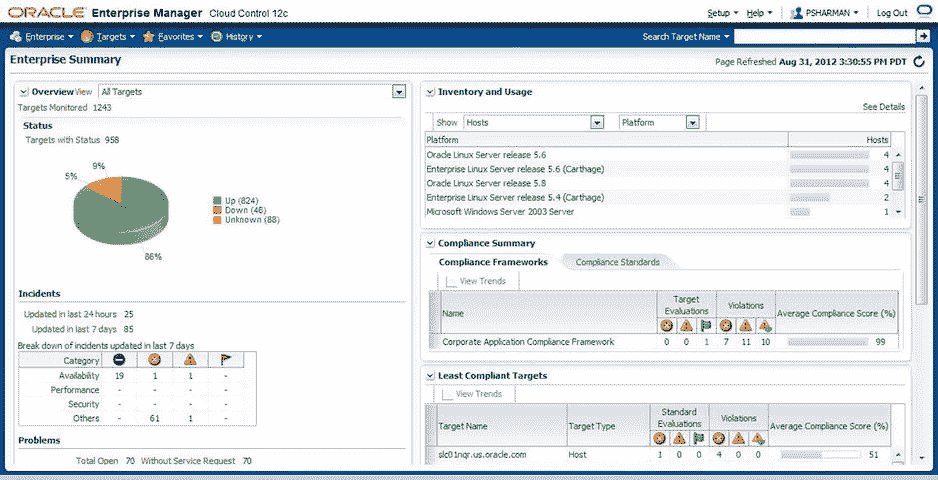

图 12-1. EM12c 中的新默认主页


### Oracle Management Agents

一个 Oracle Management Agent（通常简称为 agent 或缩写为 `OMA`）通常安装在您计算环境中被监控的每台主机上。（`EM12c` 还引入了在某些情况下远程管理环境的能力。）这些代理从控制台（参见图 12-2）部署，然后监控所有由代理发现的目标。它们用于控制这些目标的禁用期、执行作业、收集指标等，进而将可用性、指标和作业状态等详细信息反馈给 `Oracle Management Service`。

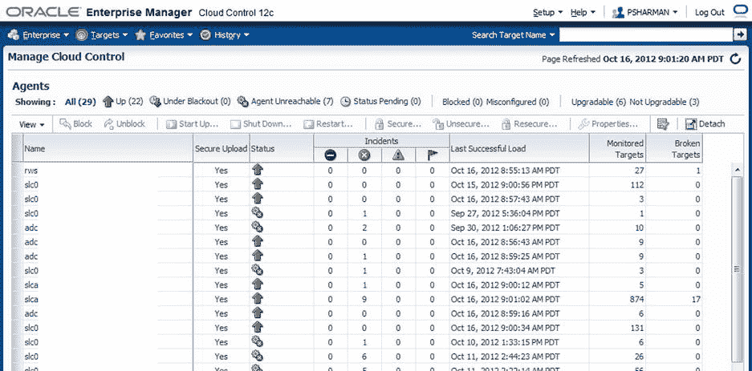
*图 12-2. 在 `EM12c` 中管理代理的用户界面*

对于 `EM12c` 版本，代理被完全重写，以实现更高的可靠性、可用性和性能（有关如何实现的详细信息，请参阅后面关于插件的章节）。这一改变的唯一缺点是，您必须使用 `EM12c` 代理来与 `EM12c Oracle Management Service` 通信。由于新版本中进行了大量更改，`12c` 与早期代理之间的向后兼容性丧失了。

### Oracle Management Service

`Oracle Management Service` (`OMS`) 是一个基于 Web 的应用程序，它与代理和 `Oracle Management Repository` 通信，以收集和存储有关各个代理上所有目标的信息。（请注意，信息本身存储在 `Oracle Management Repository` 中，而不是 `OMS` 中。）`OMS` 还负责呈现控制台的用户界面。

`OMS` 被安装到一个 `Oracle middleware home` 中，该目录还包含 `Oracle WebLogic Server`（包括 `WebLogic Server` 管理控制台）、用于中间层的 `Oracle Management agent`、管理服务实例基目录、`Java Development Kit` (`JDK`) 以及其他配置文件。如果存在现有的 `WebLogic Server` (`WLS`) 配置，您可以将 `OMS` 安装到其中，但通常从可用性角度考虑，最好将其安装在专用的 `WLS` 主目录中。

### Oracle Management Repository

`Oracle Management Repository`（也称为存储库或 `OMR`）是一个 `Oracle database`，用于存储由各个管理代理收集的所有信息。它由数据库用户、表空间、表、视图、索引、包、过程和数据库作业组成。

与 `OMS` 不同，`OMR` 的安装过程要求数据库已为存储库存在。这意味着您需要在安装 `OMS` 之前，在环境中的某处创建数据库。同样，通常建议在专用数据库中创建存储库。

### Plug-ins

在 `EM12c` 中，插件具有了全新的含义。在早期版本中，插件主要是用于监控和管理非 Oracle（异构）软件（包括数据库和中间件）的系统监控实用程序。通常由合作伙伴或 Oracle 公司本身构建。一些技术娴熟的客户也构建了自己的插件，但总体数量不多。

在 `EM12c` 版本中，保留了一些此类监控插件，但插件已大大扩展，涵盖了被管理的每种目标类型。因此，现在有用于管理 `Oracle databases` 的 `Oracle database plug-in`，用于管理 Oracle 中间件的 `Fusion Middleware plug-in`，用于管理 Oracle 应用程序的 `Fusion Application plug-in`，等等。由于 Oracle 软件的新版本将包含用于管理该软件的插件，这意味着 `EM12c`（及更高版本）将能够比过去更快地监控和管理这些版本。插件可以使用从 `Cloud Control` 控制台提供的新 `Self Update` 功能（如果您拥有使用它的足够权限）来下载、应用和部署。

此外，这种模块化插件架构意味着代理不再被配置为能够监控任何目标类型。现在，代理只会下载其监控目标所需的插件。这意味着代理本身比之前版本中的要小。这一变化是 `EM12c` 版本架构中最大的改进之一。

以上就是您需要理解的基本架构。现在让我们看看如何使用 `EM12c` 来管理 `ODA` 环境。当然，为此您需要做的第一件事就是安装一个代理。

### Agent Installation

在 `ODA` 机器上安装代理与在其他任何机器上安装代理并没有太大不同。首先，您需要添加主机，然后发现主机上可用的目标。在此示例中，我将引导您在从 `Enterprise Manager Cloud Control 12c` 中的双节点 `ODA` 上安装代理软件。

## Adding the Hosts

要添加主机，请启动 `Enterprise Manager Cloud Control 12c` 并选择 **设置 ➤ 添加目标 ➤ 手动添加目标**。如图 12-3 所示进行操作。

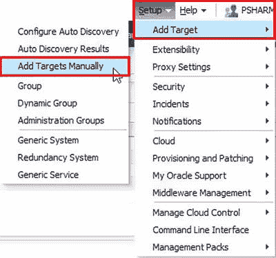
*图 12-3. 选择手动添加目标*

在 **手动添加目标** 页面上，如果尚未选中，请选择 **添加主机目标**，然后单击 **添加主机** 按钮，如图 12-4 所示。

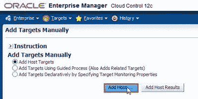
*图 12-4. 启动手动添加主机目标向导*

在 **添加主机目标：主机和平台** 屏幕上，单击 **添加** 按钮，如图 12-5 所示。

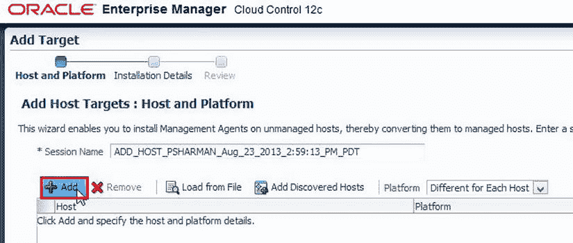
*图 12-5. 手动添加主机目标向导的步骤 1，添加主机*

从搜索窗口中选择主机，选择平台，并将平台设置为“所有主机相同”，然后单击 **下一步**，如图 12-6 所示。

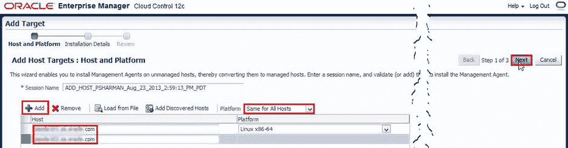
*图 12-6. 手动添加主机目标向导的步骤 2，选择主机名和平台*

为 **安装基目录** 和 **实例目录** 输入适当的值（或接受默认值），如图 12-7 所示。

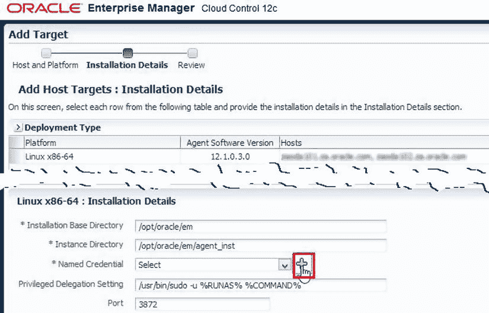
*图 12-7. 手动添加主机目标向导的步骤 3，选择安装详细信息*

如果这些主机已存在命名凭据，请选择该命名凭据，或单击“+”号（如图 12-7 所示）以创建新的命名凭据。输入代理软件所有者的用户名和密码。如果该用户名具有 `sudo` 权限，请相应地设置运行权限，如果没有，则保持 **无**，如图 12-8 所示。单击 **确定**。

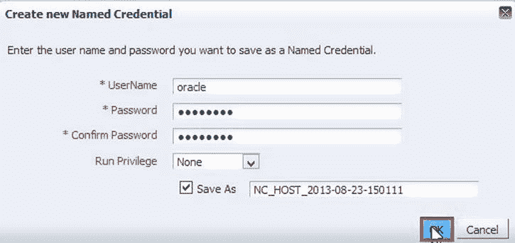
*图 12-8. 创建新的命名凭据*

当您返回到 **添加主机目标：安装详细信息** 页面时，单击 **下一步** 转到 **复查** 页面，如图 12-9 所示。复查您提供的信息。如果正确，请单击 **部署代理**。

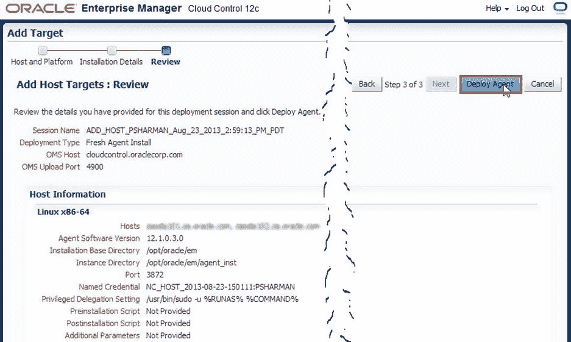
*图 12-9. 手动添加主机目标向导的步骤 4，复查详细信息并部署代理*

代理安装现在将开始。屏幕应自动刷新，直到安装完成或遇到问题。


## 运行 `root.sh` 脚本

你可能会遇到的一个问题是，用户账户未设置为可以运行 `sudo` 命令。如图 12-10 所示的情况。如果遇到此问题，那么你必须手动运行 `root.sh` 脚本。

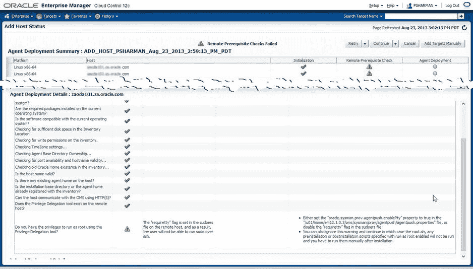
图 12-10. 提示手动运行 `root.sh` 脚本的警告

你可以在此处继续，并稍后运行 `root.sh` 脚本。要继续，请点击 `Continue` 旁边的向下箭头，并选择 `Continue, All Hosts`，如图 12-11 所示。

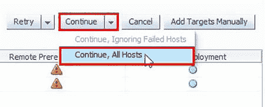
图 12-11. 在提示运行 `root.sh` 的警告后继续

最后，图 12-12 显示安装完成，并提醒在所有节点上运行 `root.sh`。

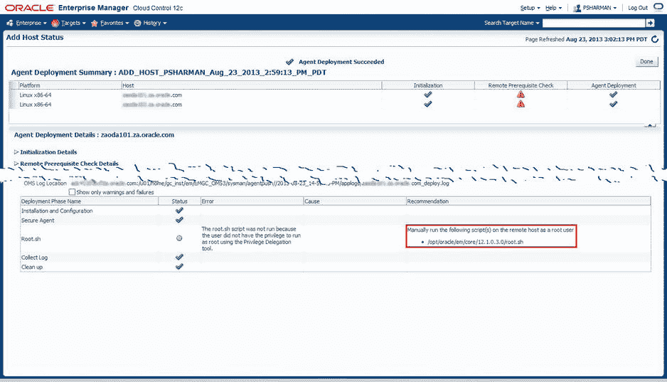
图 12-12. 在所有节点上运行 `root.sh` 的最终提醒

以 `root` 身份登录到每个主机并运行相关脚本。例如：

```
[root@node1 ∼]# /opt/oracle/em/core/12.1.0.3.0/root.sh
Finished product-specific root actions.
/etc exist
Finished product-specific root actions.

[root@node1 ∼]# ssh node2
root@node2’s password:
Last login: Fri Aug 16 10:50:11 2013 from node1

[root@node2 ∼]# /opt/oracle/em/core/12.1.0.3.0/root.sh
Finished product-specific root actions.
/etc exist
Finished product-specific root actions.
```

如图 12-13 所示，返回安装界面并点击 `Done` 以完成 `Add Host Targets Manually` 向导。

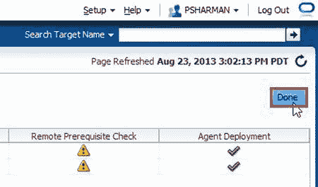
图 12-13. 完成 `Add Host Targets Manually` 向导

## 发现目标

既然主机已添加完毕，现在我想发现每台主机上剩余的目标。在同一个 `Add Targets Manually` 页面，选择 `Add Targets Using Guided Process (Also Adds Related Targets)`，然后从下拉列表中选择 `Oracle Cluster` 和 `High Availability Service`，如图 12-14 所示。

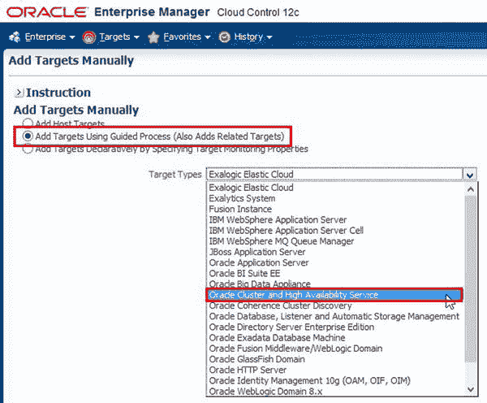
图 12-14. 启动 `Add Targets Using Guided Process` 向导以添加 `Oracle Cluster` 和 `High Availability Service`

接下来，点击 `Add Using Guided Process …` 以启动向导。这将带你进入向导的第一步——`Add Cluster Target: Specify Host`，如图 12-15 所示。你可以使用放大镜搜索第一个节点，或者直接在 `Host` 字段中键入主机名，然后点击 `Continue`。

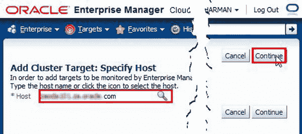
图 12-15. `Add Targets Using Guided Process` 向导的第 1 步，指定主机名

如果集群配置正确，安装过程应自动发现集群名称和其他值，同时用两个主机名填充 `Selected Hosts` 字段。如果未自动填充，请填写这些字段，然后点击 `Add`，如图 12-16 所示。

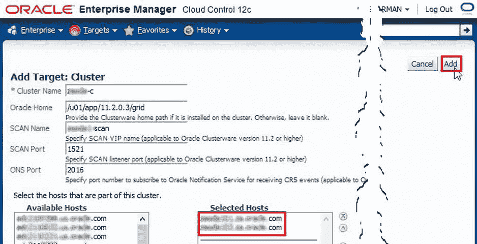
图 12-16. `Add Targets Using Guided Process` 向导的第 2 步，指定集群详细信息

图 12-17 显示了 `Add Target: Cluster` 屏幕，此屏幕将在目标添加过程中显示。

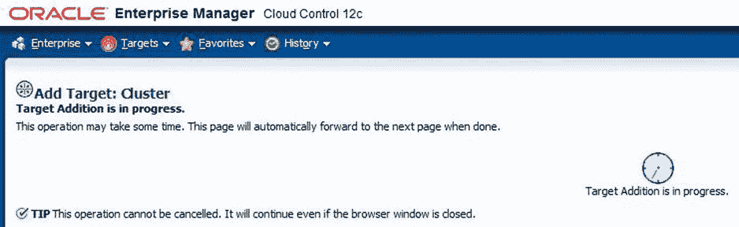
图 12-17. `Add Target: Cluster` 向导，显示添加目标的进度

集群添加完成后，你将被带到图 12-18 所示的屏幕，该屏幕显示集群详细信息已保存。点击 `OK`。

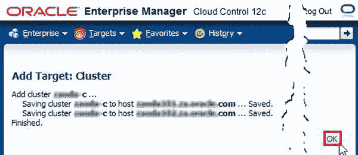
图 12-18. 确认屏幕，显示 `Add Target Using Guided Process` 向导已成功完成

现在我们需要添加数据库、监听程序和 ASM（如果使用了的话）。我们同样可以通过引导流程来完成，但这次从目标类型列表中选择 `Oracle Database, Listener and Automatic Storage Management`，如图 12-19 所示。

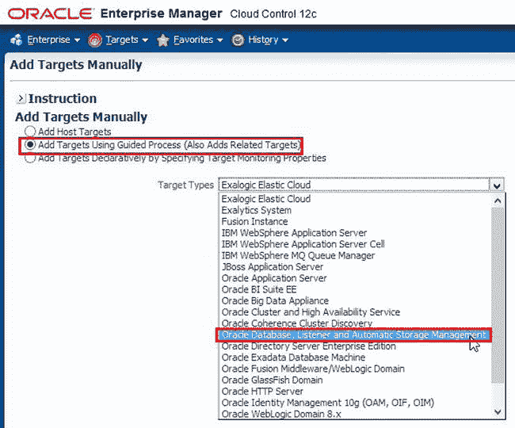
图 12-19. 启动 `Add Targets Using Guided Process` 向导以添加 `Oracle Database` 及相关目标

现在点击 `Add Using Guided Process…` 按钮，进入 `Add Database Instance Target` 页面。如图 12-20 所示，搜索或直接输入数据库运行所在主机的主机名，然后点击 `Continue`。

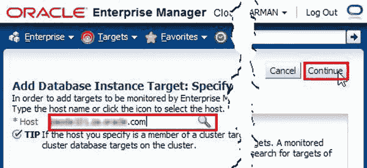
图 12-20. `Add Oracle Database` 及相关目标向导的第 1 步，指定主机名

该主机被识别为集群的一部分，因此在图 12-21 中，我们选择在集群的所有主机上查找要添加到 Enterprise Manager 的数据库，然后点击 `Continue`。

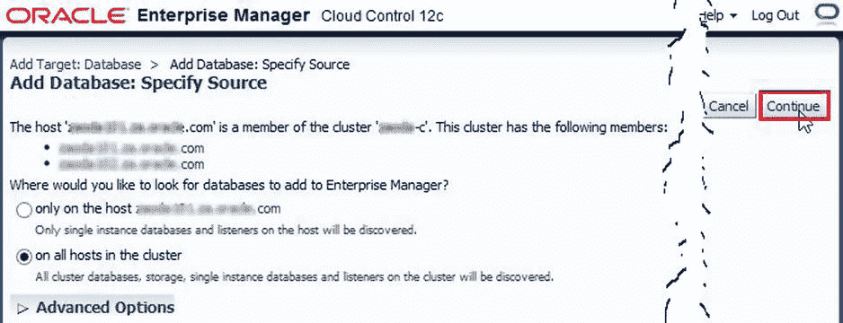
图 12-21. `Add Oracle Database` 及相关目标向导的第 2 步，在集群的所有节点上搜索数据库

目标发现过程屏幕再次出现。一旦目标被发现，你将被带到图 12-22 所示的屏幕。在这里，你需要配置监控凭据，因此点击第一个数据库的 `Configure` 按钮。

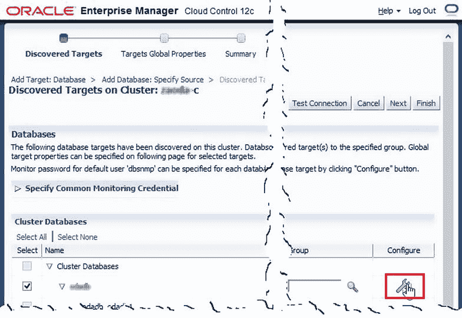
图 12-22. `Add Oracle Database` 及相关目标向导的第 3 步，配置第一个发现的数据库

如图 12-23 所示，输入 `DBSNMP` 帐户的密码，然后点击 `Test Connection` 按钮。

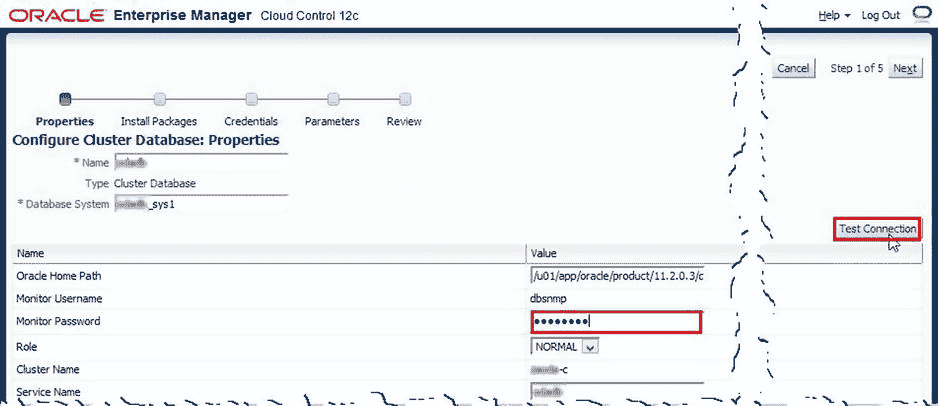
图 12-23. 配置和测试 `DBSNMP` 帐户

你应该看到如图 12-24 所示的“成功”消息，然后点击 `Next`（或者，如果输入了错误的密码，请返回并更正）。

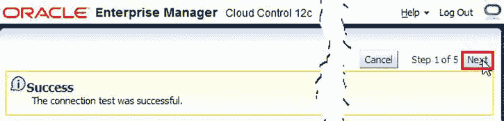
图 12-24. 显示连接测试成功的屏幕

这将调出 `Configure Cluster Database: Review` 屏幕，你只需点击 `OK` 即可。

对发现过程中找到的任何其他数据库，以及监听程序和 ASM，重复此过程。所有目标配置完成后，点击 `Finish` 按钮。你将被带到一个 `Summary` 页面，从中应点击 `Save` 按钮。然后，在你被转到 `Target Configuration Results` 页面（图 12-25）之前，会出现一个进度页面，你只需点击 `OK` 即可完成整个过程。

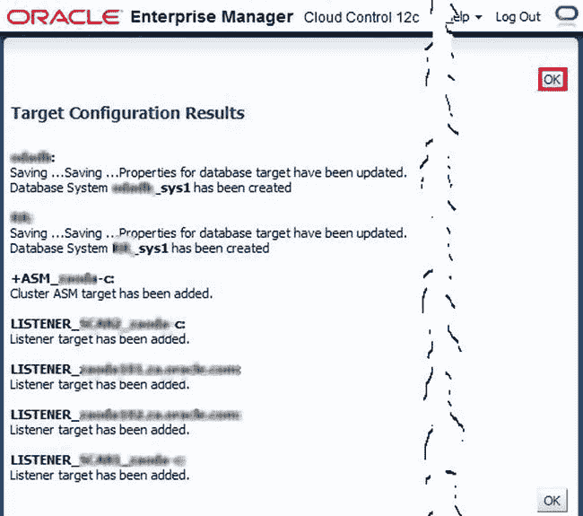
图 12-25. 来自 `Add Oracle Database` 及相关目标向导的 `Target Configuration Results` 页面

这完成了 OMA 环境上代理的安装和配置，因此现在我可以像监控任何其他 Oracle 数据库环境一样，监控所有这些目标。


## 概述

本章快速概述了 Oracle Enterprise Manager 的架构以及如何向 ODA 推送代理以进行监控。通过 Enterprise Manager 监控 ODA 的行为和方式与监控其他任何数据库版本相同。利用 Enterprise Manager 监控 ODA 可以简化其复杂性，并在问题出现时更易于解决。对于监控这一入门级工程系统，Enterprise Manager 应是首选方案。


