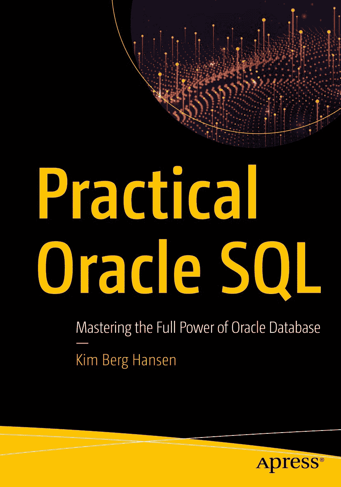
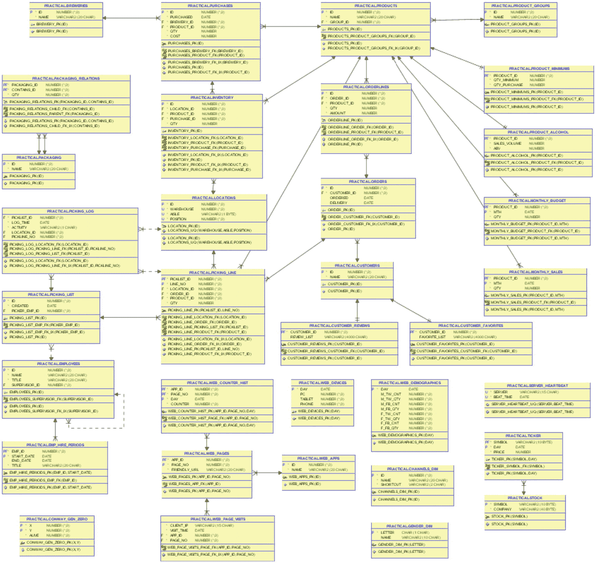

# 引言

ISBN 978-1-4842-5616-9 e-ISBN 978-1-4842-5617-6 [`doi.org/10.1007/978-1-4842-5617-6`](https://doi.org/10.1007/978-1-4842-5617-6) © Kim Berg Hansen 2020

本作品受版权保护。出版者保留所有权利，无论涉及材料的全部或部分，具体包括翻译权、转载权、插图再利用权、朗诵权、广播权、缩微胶片或其他任何物理形式的复制权，以及信息存储与检索、电子改编、计算机软件方面的传播权，或目前已知或未来开发的类似或相异方法的使用权。

书中可能出现商标名称、标识和图像。我们仅在编辑意义上并以有益于商标所有者的方式使用这些名称、标识和图像，而非每次出现时都使用商标符号，绝无侵犯商标之意。本出版物中使用的商品名称、商标、服务标志及类似术语，即使未特别标识，也不应被视为表达了其是否受专有权约束的意见。

尽管本书中的建议和信息在出版时被认为是真实准确的，但作者、编辑或出版商均不对可能出现的任何错误或遗漏承担任何法律责任。出版商对本出版物所含材料不作任何明示或暗示的担保。

本书由 Springer Science+Business Media New York 通过图书贸易渠道全球发行，地址：233 Spring Street, 6th Floor, New York, NY 10013。电话：1-800-SPRINGER，传真：(201) 348-4505，电子邮件：orders-ny@springer-sbm.com，或访问网站：www.springeronline.com。Apress Media, LLC 是一家位于加利福尼亚州的有限责任公司，其唯一成员（所有者）是 Springer Science + Business Media Finance Inc (SSBM Finance Inc)。SSBM Finance Inc 是一家特拉华州公司。

*献给莉丝-卡伦，感谢她的耐心与家务分担*

你会去哪里学习 SQL？

嗯，如果我问自己同样的问题，答案当然是我在很多地方学习 SQL：Tom Kyte 等人的书籍、SQL 参考手册（我每天都在用）、有经验开发者的会议演讲、博客、谷歌搜索，等等。但即使所有这些，如果我不同时自己动手写 SQL，看看哪里出错了，然后一遍又一遍地尝试，也是无济于事的。

我在学习过程中注意到的一件事是，几乎所有的教学示例都是简短精炼以便于理解。这本身很好，但有时也意味着它更难与日常工作联系起来。

我曾有幸在一家零售公司工作了 16 年，那里的理念是**从不因软件功能而改变业务实践，而是始终定制软件，使日常业务运作得更智能、更顺畅**。我们总是秉持“当然有办法解决，我们只需要弄清楚怎么做”的态度。在这种氛围下，我有大量实际的任务可以练习，尝试编写 SQL，并一部分一部分地修改，直到找到解决手头任务的方案。

当我展示那些在那些年间开发的一些解决方案时，曾多次有听众在会后找到我，告诉我他们突然“豁然开朗”，明白了分析函数如何能在他们的工作中提供帮助。在那之前，他们只是认为这是一种聪明而花哨的 SQL 扩展，但无法将其与自己需要解决的任务联系起来。

在本书中，我将解释一系列任务，使用 SQL 解决它们，并逐步讲解我如何创建这些 SQL，从简单开始并逐步构建，直到形成一个无法放在单张 PowerPoint 幻灯片上的有效语句。我在此演示的语句并非简单示例——它们看起来更像是你在工作中可能需要自己开发的东西。

如果你最终形成了“**当然可以用 SQL 解决**”的态度，你的老板会很高兴，因为你的代码使用了更少的 CPU，从而节省了大量的云资源费用。你也会很高兴，因为真正动脑筋找到一个好的解决方案要有趣得多。

而我也将很高兴，并可以说：“任务完成！”

## 本书内容

这不是一本`SQL 入门 101`书籍。这里不涵盖查询和连接的最简单基础——我假设你至少已经具备查询一两个表的基本知识。

它也不是一本`SQL 权威参考指南`。我并不试图详尽地涵盖每一个语法细节——甚至不包括我在本书中`确实`会讲到的那些语句和函数。

相反，`实用 Oracle SQL`是一本通过示例展示如何使用比 SQL-92 标准更复杂一点的 SQL 来解决大量不同任务的书籍。每一章解决一个不同的任务，因此这些章节不一定需要按顺序阅读。

一个章节会解释任务；展示涉及的表、数据和其他对象；然后逐步讲解解决方案的开发过程。这通常包括从简单到复杂逐步构建 SQL。在逐步讲解 SQL 的过程中，会解释语法，并在相关时给出替代方案或注意事项的示例。

除一章（第 6 章）外，所有章节的目标都是一个与真实应用开发相关的任务。具体的示例是从一个虚构的啤酒批发公司的视角展示的，但这些技术可以应用于许多其他应用。根据解决任务所使用的 SQL 技术，章节被分为三个部分。

### 第 1 部分：核心 SQL

前十章涉及使用各种 SQL 结构的解决方案。所有不属于第 2 部分和第 3 部分的内容都在此部分。

这些章节涵盖了许多技术：内联视图关联、集合操作、WITH 子句和 WITH 子句函数、递归子查询因式分解和 MODEL 子句迭代、行列转换（透视和逆透视），以及拆分和创建分隔文本。

### 第 2 部分：分析函数

分析函数是我自从开始使用 Oracle SQL 以来最喜欢的特性。我在某个会议演讲中看到过一句话（来源未知）：“如果你在简历上说你懂 SQL，但你不使用分析函数，那你就是在撒谎。”我非常讨厌在没有分析函数的情况下去解决 SQL 任务，因此第 2 部分的六章专门致力于使用分析函数的解决方案。

重点是演示可以极其高效解决的实际任务，逐步讲解如何使用分析函数处理诸如 Top-N 问题、带滚动总和的仓库拣货、分析活动日志以及两种类型的预测等任务。

### 第 3 部分：行模式匹配

当需要跨越行边界的 SQL 时，自从 8i 版本以来，我的首选解决方案一直是分析函数。从 12.2 版本开始，`MATCH_RECOGNIZE` 被添加到我的工具箱中，用于那些即使使用 SQL 中的分析函数也会变得过于复杂的场景。第 3 部分的六章既展示了使用 `MATCH_RECOGNIZE` 进行其设计初衷的行模式匹配，也展示了将其用于那些乍看之下似乎并非 `MATCH_RECOGNIZE` 用例的任务。

涵盖的任务包括：查找上升-下降模式、分组合并连续数据、合并日期范围、寻找异常峰值、装箱拟合以及树分支计算。

## 关于代码

本书的主要内容是代码——SQL，SQL，还是 SQL。要真正从中学习，你应该自己运行代码，尝试修改它，看看会发生什么，反复摸索，直到你确信自己已经“掌握了”。当然，如果所有内容都需要你自己输入，那会很无趣，因此本书中的所有代码都以源文件的形式提供给你。

### 源文件

你可以通过 Apress 上的本书页面从 GitHub 获取源文件：

`www.apress.com/9781484256169`

你会找到以下文件：

*   `practical_readme.txt` – 一个简短的自述文件，描述其他文件。
*   `practical_create_schema.sql` – 所有示例对象都存放在一个名为 `practical` 的模式中（类似于 Oracle 提供的示例模式 `scott` 和 `hr`）。此脚本创建 `practical` 模式并授予必要的权限，应以 DBA 用户身份运行。如果你的环境强制要求复杂密码，你可能需要编辑此脚本，为 `practical` 用户设置一个比 `practical` 更复杂的密码。
*   `practical_fill_schema.sql` – 创建 `practical` 模式后，以用户 `practical` 登录——密码是 `practical`，除非你在上一个文件中更改了它。然后运行此脚本以创建所有示例对象——表、视图、类型、包等等。
*   `practical_clean_schema.sql` – 此脚本也应以用户 `practical` 身份运行。它会删除由 `practical_fill_schema.sql` 创建的所有内容。你可以自行尝试，修改示例，随意操作数据——完成后，你可以通过运行 `practical_clean_schema.sql` 后跟 `practical_fill_schema.sql` 来恢复到一个干净的示例模式。
*   `practical_drop_schema.sql` – 如果你想完全删除示例模式 `practical`，可以以 DBA 用户身份运行此脚本。
*   `ch_{chapter_name}.sql` – 22 章中的每一章都有自己的示例文件，包含该章列表中的代码。但请注意，每个 DDL（创建视图、对象类型等）的列表不在章节 SQL 文件中，而是在 `practical_fill_schema.sql` 中。这样，所有字典对象都是一起创建和删除的，章节示例脚本无需担心字典清理。

所有脚本和示例都旨在提供学习灵感，不应安装在生产环境中。它们是供你使用的学习工具，应仅作此用。

### 模式

你应该将 `practical` 模式视为一个虚构公司 **优质啤酒贸易公司** 使用的应用程序的一部分。几乎所有示例都基于这类应用程序可能需要完成的任务——在现实生活中也是如此。诚然，少数情况略有刻意，但大多数都可以直接取自实际应用。例如，第二部分展示的所有技术都直接取自我在过去 16 年（前文提到过）开发过程中编写的代码——我只是将它们调整以适配图 1 所示的 `practical` 示例表。

*图 1：practical 模式中的表*

模式中唯一与优质啤酒贸易公司无关的表是第 6 章中使用的表 `conway_gen_zero`。其他表都与这家虚构公司相关，每个表都在一章或多章中使用。

### 版本与环境

几乎所有代码示例都是使用 Oracle 提供的预构建 VirtualBox 镜像“Database App Development VM”开发的，具体是包含 Oracle Database 12c Enterprise Edition Release 12.2.0.1.0 – 64bit Production 的版本。少数示例需要数据库版本 18c 或 19c；对于这些示例，我使用了更新的 VM 镜像或 `livesql.oracle.com`。

总的来说，第一部分和第二部分展示的许多示例即使在不再受支持的数据库版本上也能运行。需要高于 12.2 版本的地方，都已明确注明。如果相关，我还注明了特定语法是从哪个版本开始支持的，但并未对所有内容都明确标出起始版本。如果你仍在使用不受支持的版本，我将由你自行测试特定语法是否在你的环境中有效。

在开发过程中，我使用的是 Oracle SQL Developer 18.2 版本。ER 图的截图也来自此 SQL Developer 版本。代码示例使用 SQLcl release 4.2 执行，大部分使用 `set sqlformat ansiconsole` 格式，只有少数情况使用传统的 SQL∗Plus 样式格式。这些情况在源代码文件中已注明。

当你自己尝试代码时，我建议在 Oracle SQL Developer、TOAD、PLSQL Developer 或你最喜欢的 SQL IDE 中打开文件。单独运行每条语句，在网格中检查结果，而不是依赖我的格式（我的格式是针对适合印刷页面的输出进行优化的）。这样你也可以非常容易地稍微修改语句，然后再次执行，并比较输出的变化。

大多数图表是通过在 `apex.oracle.com` 上的一个工作区中使用各种 APEX 图形和图表组件创建的，我用这个工作区来摆弄和制作小型 APEX 页面。

## 最后的话

也许你有这样一种印象：如果 SQL 比两表连接稍微复杂一点，那就只有天才才能尝试，而你甚至不会去尝试。我向你保证，情况并非如此。

专业技能源于实践。信心源于熟悉。你应该明天就去写稍微复杂一点的 SQL，后天再复杂一点，如此坚持。随着时间的推移，它会变得像你使用了多年的其他语言一样熟悉，你将会对自己说：“我当初在怕什么？”

我相信这本书将为你开启旅程，让你*真正*运用 SQL 的力量。

## 致谢

多年来，在学习——并最终教授——SQL 的过程中，激励我的人数不胜数。篇幅所限，我只能感谢几位对我最重要的人。如果你未被提及，请不要担心；你仍然给了我无价的启发。

我的第一个也是最大的启发是——现在仍然是——Tom Kyte。我从他的书和 AskTom 中学到了很多。如果没有他作为我的榜样，我不确定我是否会参与社区，分享知识和写博客，当然我也不会最终写一本书。

我名单上的第二位是 Steven Feuerstein 本人，他的著作被我们许多人视为权威资料。我感谢 Steven 给我机会为 Oracle Dev Gym (`devgym.oracle.com`) 编写 SQL 测验。教学是学习某件事的最好方法，而每周都需要设计新测验，这为我提供了一个机会去钻研 SQL 的各个方面。

社区和用户组中参与知识分享的每一个人也都是我的灵感来源。ODTUG 以及参加 Kscope 年度会议的每一个人就是很好的例证。我自 2010 年以来每年都参加，如果没有我的 Kscope 人脉网络，我就不会达到今天的水平。

最后但同样重要的是，我必须感谢 Stew Ashton。他是 SQL 行模式匹配的大师，他慷慨地允许我从他的博客 (`stewashton.wordpress.com`) 中获得大量灵感，用于第三部分的几个章节。

## 关于作者

