# 第一部分：核心 SQL


## 1. 关联内联视图

在 SQL 中，大多数时候你只需将表或视图相互连接，就能得到想要的结果。你经常还会加入内联视图和标量子查询，很快就能为许多问题创建出相对复杂的解决方案。借助分析函数，你便真正开始“大展拳脚”，几乎可以解决任何问题。

但偶尔也会遇到这样的情况：例如，你有一个标量子查询，并希望它能返回多列，而非仅仅单列。你可以通过对象类型或字符串拼接来变通实现，但这既不优雅也不高效。

同样，时不时地，你可能非常希望——比如说——让内联视图内的一个谓词能够引用内联视图外部表的值，而这通常是不可能的。常见的变通方法是将你希望施加谓词的列包含在内联视图的 `select` 列表中，并将该谓词放在连接的 `on` 子句中。这通常已经足够好，优化器也常常能进行谓词下推，自动实现你实际想要的效果——但它并非总能做到这一点，若是这种情况，你最终会得到一个低效的查询。

对于这两个问题，自 12.1 版本起，通过使用 `lateral` 或 `apply` 来关联内联视图，就有可能解决它们，使你本质上能够自己进行谓词下推。

### 啤酒厂产品与销售

在“好啤酒贸易公司”的应用模式中，我有几个视图（如图 1-1 所示）可用于说明内联视图关联。

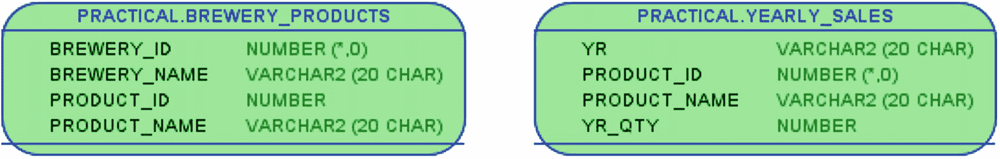

图 1-1

本章中用于说明 lateral 内联视图的两个视图

我本可以同样轻松地使用表来演示这些技术，因此在本章中，就把它们当作表来看待即可。视图的内部结构在后续章节中会更为相关，并将在那些章节中展示。

视图 `brewery_products` 显示了“好啤酒贸易公司”从哪些啤酒厂采购了哪些啤酒，而视图 `yearly_sales` 则显示了每年每种啤酒的销售瓶数。如清单 1-1 所示，在 `product_id` 上连接两者，我可以看到从 Balthazar Brauerei 采购的那些啤酒的年度销售情况。

```sql
SQL> select
2     bp.brewery_name
3   , bp.product_id as p_id
4   , bp.product_name
5   , ys.yr
6   , ys.yr_qty
7  from brewery_products bp
8  join yearly_sales ys
9     on ys.product_id = bp.product_id
10  where bp.brewery_id = 518
11  order by bp.product_id, ys.yr;
```

清单 1-1
Balthazar Brauerei 三种啤酒的年度销售情况

这三种啤酒三年的销售数据将作为本章示例的基础：

```
BREWERY_NAME        P_ID  PRODUCT_NAME      YR    YR_QTY
Balthazar Brauerei  5310  Monks and Nuns    2016  478
Balthazar Brauerei  5310  Monks and Nuns    2017  582
Balthazar Brauerei  5310  Monks and Nuns    2018  425
Balthazar Brauerei  5430  Hercule Trippel   2016  261
Balthazar Brauerei  5430  Hercule Trippel   2017  344
Balthazar Brauerei  5430  Hercule Trippel   2018  451
Balthazar Brauerei  6520  Der Helle Kumpel  2016  415
Balthazar Brauerei  6520  Der Helle Kumpel  2017  458
Balthazar Brauerei  6520  Der Helle Kumpel  2018  357
```

我将首先用它来展示一个典型问题。

### 标量子查询与多列

当前的任务是：针对 Balthazar Brauerei 的三种啤酒中的每一种，分别显示哪一年该特定啤酒的销量最高，以及最高销量是多少。我可以在清单 1-2 中使用两个标量子查询来完成此操作。

```sql
SQL> select
2     bp.brewery_name
3   , bp.product_id as p_id
4   , bp.product_name
5   , (
6        select ys.yr
7        from yearly_sales ys
8        where ys.product_id = bp.product_id
9        order by ys.yr_qty desc
10        fetch first row only
11     ) as yr
12   , (
13        select ys.yr_qty
14        from yearly_sales ys
15        where ys.product_id = bp.product_id
16        order by ys.yr_qty desc
17        fetch first row only
18     ) as yr_qty
19  from brewery_products bp
20  where bp.brewery_id = 518
21  order by bp.product_id;
```

清单 1-2
从每个啤酒最畅销的年份中检索两列

对于当前的数据（年份之间没有并列第一），这种方法有效，并给出了我期望的输出：

```
BREWERY_NAME        P_ID  PRODUCT_NAME      YR    YR_QTY
Balthazar Brauerei  5310  Monks and Nuns    2017  582
Balthazar Brauerei  5430  Hercule Trippel   2018  451
Balthazar Brauerei  6520  Der Helle Kumpel  2017  458
```

但这种策略存在一些问题：

*   `yearly_sales` 中的相同数据被访问了两次。如果我需要超过两列，那就需要访问更多次。
*   由于我的 `order by` 不唯一，我的 fetch first row 将返回一个随机行（好吧，很可能是在其使用的执行计划下找到的第一个行，对此我无法控制，因此实际上可能是具有最高 `yr_qty` 的任何一行）。这意味着在多个子查询中，我无法保证这些值来自同一行——如果我有一个显示该啤酒在该年份利润的列，以及一个用于检索此利润的子查询，它显示的利润年份可能与输出中 `yr`` 列显示的年份不同。

一个经典的变通方法是只使用单个标量子查询，如清单 1-3 所示。

```sql
SQL> select
2     brewery_name
3   , product_id as p_id
4   , product_name
5   , to_number(
6        substr(yr_qty_str, 1, instr(yr_qty_str, ';') - 1)
7     ) as yr
8   , to_number(
9        substr(yr_qty_str, instr(yr_qty_str, ';') + 1)
10     ) as yr_qty
11  from (
12     select
13        bp.brewery_name
14      , bp.product_id
15      , bp.product_name
16      , (
17           select ys.yr || ';' || ys.yr_qty
18           from yearly_sales ys
19           where ys.product_id = bp.product_id
20           order by ys.yr_qty desc
21           fetch first row only
22        ) as yr_qty_str
23     from brewery_products bp
24     where bp.brewery_id = 518
25  )
26  order by product_id;
```

清单 1-3
使用单个标量子查询和值拼接

这里的标量子查询在第 16–22 行，找到我想要的行，然后在第 17 行选择我感兴趣的值的拼接。然后我把整个结果放在一个内联视图（第 11–25 行）中，并在第 5–10 行将拼接的字符串拆分成单独的值。

这个输出与清单 1-2 完全相同，所以一切都很好，对吧？嗯，正如你所见，如果我需要超过两列，代码可能会很快变得难以处理。如果我拼接的是字符串值，我就需要担心使用一个真实数据中不存在的分隔符。如果我拼接的是日期和时间戳，我就需要使用 `to_char` 和 `to_date`/`to_timestamp`。如果我处理的是 LOB 列或复杂类型的列怎么办？那样的话，我就完全无法这样做了。

因此，有很多充分的理由去尝试清单 1-4 中的替代变通方法。


### 分析与使用分析函数

```sql
SQL> select
2     brewery_name
3   , product_id as p_id
4   , product_name
5   , yr
6   , yr_qty
7  from (
8     select
9        bp.brewery_name
10      , bp.product_id
11      , bp.product_name
12      , ys.yr
13      , ys.yr_qty
14      , row_number() over (
15           partition by bp.product_id
16           order by ys.yr_qty desc
17        ) as rn
18     from brewery_products bp
19     join yearly_sales ys
20        on ys.product_id = bp.product_id
21     where bp.brewery_id = 518
22  )
23  where rn = 1
24  order by product_id;
```
`清单 1-4`
使用分析函数以便能够检索所有所需列

这也给出了与`清单 1-2`完全相同的输出，只是完全没有任何标量子查询。

这里我在第 18-20 行连接了两个视图，而不是在标量子查询中查询`yearly_sales`。但这样做使得我无法使用`fetch first`语法，因为我需要每个酒厂一行，而`fetch first`不支持分区子句。

我改为在第 14-17 行使用`row_number`分析函数，按`yr_qty`降序分配连续的序号 1, 2, 3 …，实际上将`yr_qty`最高的行在`rn`中赋值为 1。由于第 15 行的`partition by`，这是针对每种啤酒进行的，因此每种啤酒都会有一行`rn=1`。这些行我通过第 23 行的`where`子句保留下来。

> **提示**
> 本书第 2 部分展示了更多关于分析函数的内容。

这样做的效果是，我可以根据需要从`yearly_sales`视图中查询任意多的列——这里我在第 12-13 行查询了两个列。然后它们也可以直接在外部查询的第 5-6 行中使用。不需要拼接，每个列都可直接使用，无论其数据类型如何。

这是比`清单 1-3`更好的解决方法，那么这难道不够好吗？在这种情况下这样是没问题的，但使用关联内联视图的替代方案在某些情况下可能更灵活。

### 关联内联视图

`清单 1-5`是生成与`清单 1-2`完全相同输出的另一种方式，只是这次通过关联一个内联视图来实现。

```sql
SQL> select
2     bp.brewery_name
3   , bp.product_id as p_id
4   , bp.product_name
5   , top_ys.yr
6   , top_ys.yr_qty
7  from brewery_products bp
8  cross join lateral(
9     select
10        ys.yr
11      , ys.yr_qty
12     from yearly_sales ys
13     where ys.product_id = bp.product_id
14     order by ys.yr_qty desc
15     fetch first row only
16  ) top_ys
17  where bp.brewery_id = 518
18  order by bp.product_id;
```
`清单 1-5`
使用关联内联视图实现相同效果

工作原理如下：

*   我没有直接连接`brewery_products`到`yearly_sales`；而是连接到第 8 行的内联视图`top_ys`。
*   第 9-15 行的内联视图查询`yearly_sales`并使用`fetch first row`来查找销售额最高的年份所在行。但它*不是*为*所有*啤酒执行以找到跨所有啤酒的最畅销年份的单一最佳行，因为第 13 行在`product_id`上将`yearly_sales`与`brewery_products`相关联。
*   第 13 行通常会引发错误，因为在通常的连接内联视图中这没有意义。但我在第 8 行的内联视图前放置了关键字`lateral`，这告诉数据库我希望建立关联，因此它应该为关联的外部行源——本例中是`brewery_products`——的*每一行*执行一次内联视图。这意味着对于每种啤酒，都将执行一次独立的`fetch first row`查询，几乎就像它是一个标量子查询一样。
*   然后我在第 8 行使用`cross join`来进行实际的连接，这只是因为在这种情况下我不需要`on`子句。我在第 13 行已经有了所需的关联，因此不需要使用内连接或外连接。

使用这种`lateral`内联视图使我能够像标量子查询那样为每种啤酒执行它，但又能像在`清单 1-4`中那样查询独立的列。

你可能对`cross join`感到疑惑，并说，“这不是笛卡尔积，对吗？”

考虑一下，如果我使用传统的连接风格，使用逗号分隔的表和视图列表，并将所有连接谓词放在`where`子句中，没有`on`子句。在那种连接风格中，如果你在两个表/视图之间*完全*没有连接谓词（有时这可能是意外发生的——一个难以发现的经典错误），就会发生笛卡尔连接。

如果我用传统风格的连接编写`清单 1-5`，第 8 行会是这样：

```sql
...
7  from brewery_products bp
8  , lateral(
9     select
...
```

并且在`where`子句中没有连接谓词，它所做的与`cross join`完全一样。但由于`lateral`子句，它变成了`brewery_products`的*每一行*与关联内联视图为每种啤酒执行时输出的*每一行*之间的“笛卡尔”连接（可以将其视为“分区笛卡尔”），但最终结果看起来像是一个关联连接，根本不显示笛卡尔特性。只是不要让`cross join`的语法迷惑你。

我本可以选择避免`cross join`带来的混淆，而使用常规的内连接，如下所示：

```sql
...
7  from brewery_products bp
8  join lateral(
9     select
...
16  ) top_ys
17     on 1=1
18  where bp.brewery_id = 518
...
```

由于关联发生在`lateral`内联视图内部，我可以让`on`子句始终为真。效果完全相同。

可能你觉得`cross join`和`on 1=1`这两种方法都没有清楚地说明发生了什么——如果你愿意的话，这两种语法都可以被认为有点“笨拙”。那么你可能更喜欢替代语法`cross apply`，如`清单 1-6`所示。

```sql
SQL> select
2     bp.brewery_name
3   , bp.product_id as p_id
4   , bp.product_name
5   , top_ys.yr
6   , top_ys.yr_qty
7  from brewery_products bp
8  cross apply(
9     select
10        ys.yr
11      , ys.yr_qty
12     from yearly_sales ys
13     where ys.product_id = bp.product_id
14     order by ys.yr_qty desc
15     fetch first row only
16  ) top_ys
17  where bp.brewery_id = 518
18  order by bp.product_id;
```
`清单 1-6`
替代语法 `cross apply`

输出与之前的列表一样，与`清单 1-2`相同，但这次我既没有使用`lateral`也没有使用`join`，而是使用了第 8 行的关键字`cross apply`。这意味着对于`brewery_products`中的每一行，内联视图都将被*应用*。当我使用`apply`时，我被允许在第 13 行的谓词中关联内联视图，就像使用`lateral`一样。在底层，数据库所做的与`lateral`内联视图完全相同；这只是你偏好哪种语法的问题。

关键字`cross`将其与变体`outer apply`区分开来，我稍后会展示。这里的`cross`可以理解为我在前面讨论过的“分区笛卡尔积”。

> **注意**
> 你不仅可以将`cross apply`和`outer apply`用于内联视图，还可以用于以关联方式调用*表函数*（管道化或非管道化）。如果使用`lateral`，这将需要更长的语法。你可能不会经常看到它用于表函数，因为 Oracle 中的表函数无论如何都可以在连接中用作关联行源，因此很少*必须*使用`apply`，尽管有时它可以提高可读性。


#### 关联内联视图的外连接

到目前为止，我使用 `lateral` 和 `apply` 都只是 `cross` 变体。这意味着实际上我一直在取巧——它与使用标量子查询并不完全一样。只是因为所有啤酒的销售数据都存在，所以从清单 1-2 到 1-6 的输出结果都相同。

如果一个标量子查询找不到任何数据，那么 `brewery_products` 行对应输出列的值将是 null——但如果一个 `cross join lateral` 或 `cross apply` 内联视图找不到任何行，那么该 `brewery_products` 行将根本不会出现在输出中。

要真正模拟标量子查询方法的输出，我需要类似 `outer join` 的功能，如清单 1-7 所示。在此清单中，我仍然为每种啤酒找出销量最高的一年和数量，但仅限于那些年销售量低于 400 瓶的年份。

```sql
select
   bp.brewery_name
 , bp.product_id as p_id
 , bp.product_name
 , top_ys.yr
 , top_ys.yr_qty
from brewery_products bp
outer apply(
   select
      ys.yr
    , ys.yr_qty
   from yearly_sales ys
   where ys.product_id = bp.product_id
   and ys.yr_qty < 400
   order by ys.yr_qty desc
   fetch first row only
) top_ys
where bp.brewery_id = 518
order by bp.product_id;
```

**清单 1-7**
当你需要 `outer join` 功能时使用 `outer apply`

在第 14 行，我让内联视图查询只包含销售量低于 400 瓶的年份。然后在第 8 行，我将 `cross apply` 改为 `outer apply`，得到以下结果：

```
BREWERY_NAME        P_ID  PRODUCT_NAME      YR    YR_QTY
Balthazar Brauerei  5310  Monks and Nuns
Balthazar Brauerei  5430  Hercule Trippel   2017  344
Balthazar Brauerei  6520  Der Helle Kumpel  2018  357
```

如果我在第 8 行使用了 `cross apply`，那么输出中将只会看到最后两行。

因此，如果你想要与标量子查询方法完全相同的输出，使用 `outer apply` 更为正确。但就像你不想不必要地使用常规外连接一样，如果你确定知道总会有行返回，就应该使用 `cross apply`。

`outer apply` 等同于带有 `on 1=1` 连接子句的 `left outer join lateral`，因此 `outer apply` 不支持右关联，只支持左关联。

有些情况下，`outer join lateral` 比 `outer apply` 更灵活，因为你可以实际在 `on` 子句中进行有意义的使用，如清单 1-8 所示。

```sql
select
   bp.brewery_name
 , bp.product_id as p_id
 , bp.product_name
 , top_ys.yr
 , top_ys.yr_qty
from brewery_products bp
left outer join lateral(
   select
      ys.yr
    , ys.yr_qty
   from yearly_sales ys
   where ys.product_id = bp.product_id
   order by ys.yr_qty desc
   fetch first row only
) top_ys
   on top_ys.yr_qty < 500
where bp.brewery_id = 518
order by bp.product_id;
```

**清单 1-8**
带有 `lateral` 关键字的 `outer join`

由于我在第 8 行的 `left outer join` 中使用了 `lateral`，内联视图对每种啤酒执行一次，找出最畅销的年份和数量，就像本章大多数示例一样。但在第 17 行的 `on` 子句中，我进行了过滤，因此仅当数量小于 500 时，我才输出 `top_ys` 行。这给出了以下输出，它与清单 1-2 到 1-6 的输出几乎相同，但并非完全一致：

```
BREWERY_NAME        P_ID  PRODUCT_NAME      YR    YR_QTY
Balthazar Brauerei  5310  Monks and Nuns
Balthazar Brauerei  5430  Hercule Trippel   2018  451
Balthazar Brauerei  6520  Der Helle Kumpel  2017  458
```

通常 `on` 子句是用于连接两个表（或视图）的，其中不应真正包含过滤谓词。但在这种情况下，正是由于我在 `on` 子句中进行了过滤，才得到了上述结果。在不同位置过滤可以解决不同的问题：

*   如果过滤谓词在内联视图内部（如清单 1-7），解决的问题是：“对于每种啤酒，向我展示那些销售量低于 400 瓶的年份中，最畅销的年份和数量。”

*   如果过滤谓词在 `on` 子句中（如清单 1-8），解决的问题是：“对于每种啤酒，如果某年的销售量低于 500 瓶，则向我展示该年最畅销的年份和数量。”

*   如果过滤谓词在第 18 行之后的 `where` 子句中，那么解决的问题将是：“对于最畅销年份销售量低于 500 瓶的每种啤酒，向我展示该最畅销年份和数量。”（并且，那样就不应该是 `outer join`，而只是 `inner` 或 `cross join`。）

总的来说，`lateral` 和 `apply`（包括 `cross` 和 `outer` 版本）有几种用途，尽管可能可以通过其他变通方法解决，但它们往往非常优雅且高效。通常，如果最佳访问路径是先构建内联视图的整个结果集，然后与外部表进行哈希连接或合并连接，那么你并不想使用它（对于这种情况，清单 1-4 通常是更好的解决方案）。但如果最佳路径是先处理外部表，然后通过嵌套循环连接到内联视图，那么 `lateral` 和 `apply` 是非常优秀的方法。

**提示**

你将在第 12 章找到更多关于执行 Top-N 查询的示例，在第 9 和 12 章找到更多关于 `lateral` 的示例，并在第 9 章找到关于在表函数上使用 `apply` 的示例。

### 经验教训

在本章中，我向你展示了一些问题的变通解决方案，并给出了如何使用关联内联视图解决相同问题的示例，因此你现在了解了：

*   使用 `lateral` 关键字在内联视图中启用左关联
*   区分连接到 lateral 内联视图的 `cross` 和 `outer` 变体
*   应用 `cross apply` 或 `outer apply` 作为实现左关联的替代语法
*   判断关联内联视图还是带有分析函数的常规内联视图能最高效地解决问题

能够关联内联视图在你的应用开发中的多种情况下会非常方便。


## 2. 集合操作中的陷阱

SQL 与集合论关系相当密切，但在实际日常工作中，我认为许多开发者（包括我自己）并不太担心理论问题。也许正因如此，我见到集合操作符的使用通常比连接（join）要少得多。大多数情况下，使用连接就足够了，但偶尔，一个精心选择的集合操作符也能带来非常好的效果。

但也许正因为我们不常使用集合操作符，我常常看到一些代码，开发者在不知不觉中就陷入了某些陷阱，特别是关于使用不同集合（distinct sets）或包含重复元素的集合（sets with duplicates）的问题。

最常见的是，你看到集合操作会用维恩图（Venn diagrams）来说明，就像图 2-1（通常它们是水平排列的；我这里垂直展示，以便与本章后面使用的代码和图示相匹配）。发生了什么是一目了然的。

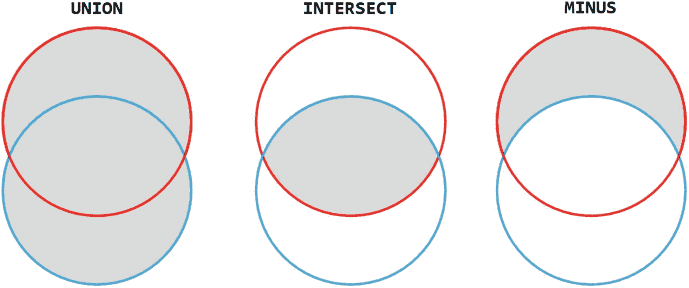
*图 2-1：三种集合操作的维恩图*

但通常没有解释清楚的是，集合论原则上作用于*不同*的集合——即没有重复元素的集合。实际上，Oracle SQL 中的 `set` 函数会从嵌套表中移除重复项，根据集合论将其转换为一个真正的“集合”。在开发者的实际工作中，我们常常希望处理*包含*重复项的集合，但 `集合操作符` 默认是按照集合论的方式工作的。

而当你再考虑到 `多重集合操作符` 默认是以相反的方式工作时，混乱就很容易产生了。本章旨在澄清这种困惑。

### 啤酒集合

在“好啤酒贸易公司”（Good Beer Trading Co）的模式中，我有一些视图（如图 2-2 所示）可用于演示集合操作。视图 `brewery_products` 和 `customer_order_products` 都是多个表的连接，但就本章的目的而言，你可以将它们视为表，视图的内部结构并不重要。

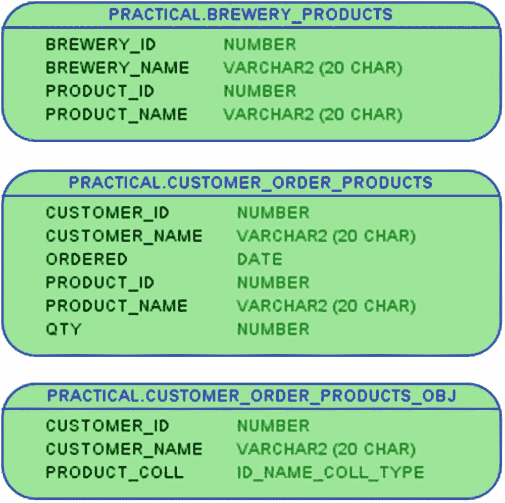
*图 2-2：用于集合示例的两个视图和一个用于多重集合示例的视图*

视图 `brewery_products` 简单地显示从哪些啤酒厂购买了哪些啤酒。对于每个啤酒厂，一个产品只会显示一次。

视图 `customer_order_products` 显示哪些啤酒卖给了哪些客户，但也包含了销售数量和时间，因此对于每个客户，一个产品可能会显示多次。

最后一个视图 `customer_order_products_obj` 包含与 `customer_order_products` 相同的数据，但已聚合，因此每个客户只有一行，其中包含一个嵌套表列 `product_coll`，该列包含该产品每次售予该客户的时刻的产品 ID 和名称。创建嵌套表类型和此视图的语句如清单 2-1 所示。

```sql
SQL> create or replace type id_name_type as object (
2     id     integer
3   , name   varchar2(20 char)
4  );
5  /
类型 ID_NAME_TYPE 已编译
SQL> create or replace type id_name_coll_type
2     as table of id_name_type;
3  /
类型 ID_NAME_COLL_TYPE 已编译
SQL> create or replace view customer_order_products_obj
2  as
3  select
4     customer_id
5   , max(customer_name) as customer_name
6   , cast(
7        collect(
8           id_name_type(product_id, product_name)
9           order by product_id
10        )
11        as id_name_coll_type
12     ) as product_coll
13  from customer_order_products
14  group by customer_id;
视图 CUSTOMER_ORDER_PRODUCTS_OBJ 已创建。
```
*清单 2-1：为多重集示例创建类型和视图*

使用这些视图，我可以向你展示 `set` 和 `multiset` 操作符之间的区别。

### 集合操作符

我将只使用部分数据，因此清单 2-2 显示了视图 `customer_order_products` 针对两个客户的结果。

```sql
SQL> select
2     customer_id as c_id, customer_name, ordered
3   , product_id  as p_id, product_name, qty
4  from customer_order_products
5  where customer_id in (50042, 50741)
6  order by customer_id, product_id;
C_ID 客户名称         订单日期      P_ID 产品名称           数量
------ --------------- ---------- ----- ----------------- ----
50042 The White Hart  2019-01-15  4280 Hoppy Crude Oil    110
50042 The White Hart  2019-03-22  4280 Hoppy Crude Oil     80
50042 The White Hart  2019-03-02  4280 Hoppy Crude Oil     60
50042 The White Hart  2019-03-22  5430 Hercule Trippel     40
50042 The White Hart  2019-01-15  6520 Der Helle Kumpel   140
50741 Hygge og Humle  2019-01-18  4280 Hoppy Crude Oil     60
50741 Hygge og Humle  2019-03-12  4280 Hoppy Crude Oil     90
50741 Hygge og Humle  2019-01-18  6520 Der Helle Kumpel    40
50741 Hygge og Humle  2019-02-26  6520 Der Helle Kumpel    40
50741 Hygge og Humle  2019-02-26  6600 Hazy Pink Cloud     16
50741 Hygge og Humle  2019-03-29  7950 Pale Rider Rides    50
50741 Hygge og Humle  2019-03-12  7950 Pale Rider Rides   100
```
*清单 2-2：两个客户及其订单的数据*

同样地，清单 2-3 显示了视图 `brewery_products` 针对两个啤酒厂的输出。

```sql
SQL> select
2     brewery_id as b_id, brewery_name
3   , product_id as p_id, product_name
4  from brewery_products
5  where brewery_id in (518, 523)
6  order by brewery_id, product_id;
B_ID 啤酒厂名称          P_ID 产品名称
------ ------------------ ----- -----------------
518 Balthazar Brauerei  5310 Monks and Nuns
518 Balthazar Brauerei  5430 Hercule Trippel
518 Balthazar Brauerei  6520 Der Helle Kumpel
523 Happy Hoppy Hippo   6600 Hazy Pink Cloud
523 Happy Hoppy Hippo   7790 Summer in India
523 Happy Hoppy Hippo   7870 Ghost of Hops
```
*清单 2-3：两个啤酒厂以及从它们那里购买的产品的数据*

在集合论中，根据定义，一个集合的值是唯一的，`brewery_products` 满足这个条件。

但在数据库的实际应用中，你常常没有唯一的值。如果你查看 `customer_order_products` 中的数据，当你包含 `ordered` 日期和 `qty` 值时，它是唯一的，但如果你只看每个客户的产品 ID 和名称，它就*不是*唯一的。

现实生活与集合论之间的这种差异，在某种程度上也反映在集合操作符上。


### 集合并置

在开发者的日常生活中，我通常并不关心集合论，而只是希望将两个行集连接起来，实际上就是将一个行集追加到另一个之后。这可以通过 `union all` 来实现，如图 2-3 所示。

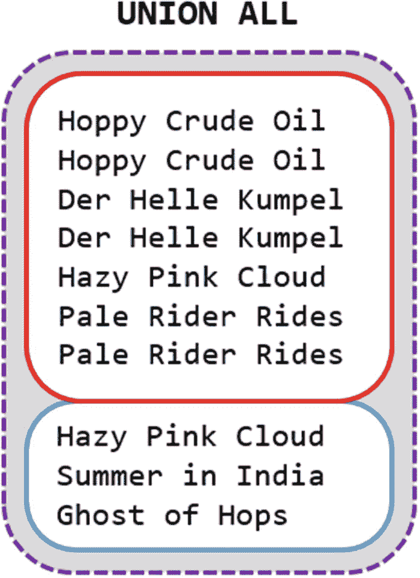
*图 2-3：Union all 只是简单地将一个结果集追加到另一个之后*

图 2-3 首先显示了客户 `50741` 的七行产品名称，然后是酒厂 `523` 的三行产品名称。用 SQL 表达，这就是清单 2-4 中的代码。

```sql
SQL> select product_id as p_id, product_name
2  from customer_order_products
3  where customer_id = 50741
4  union all
5  select product_id as p_id, product_name
6  from brewery_products
7  where brewery_id = 523;
清单 2-4：连接两个查询的结果
```

只需用 `union all` 分隔两个 `select` 语句，输出就是两个结果前后相连：

```
P_ID PRODUCT_NAME
----- -----------------
4280 Hoppy Crude Oil
4280 Hoppy Crude Oil
6520 Der Helle Kumpel
6520 Der Helle Kumpel
6600 Hazy Pink Cloud
7950 Pale Rider Rides
7950 Pale Rider Rides
6600 Hazy Pink Cloud
7790 Summer in India
7870 Ghost of Hops
```

我只选择了两个视图中都存在的两列，这使得输出难以看清哪些行来自哪个视图。在清单 2-5 中，我在第一个 `select` 中也选择了客户 id 和名称，但在第二个 `select` 中选择了酒厂 id 和名称。

```sql
SQL> select
2     customer_id as c_or_b_id, customer_name as c_or_b_name
3   , product_id as p_id, product_name
4  from customer_order_products
5  where customer_id = 50741
6  union all
7  select
8     brewery_id, brewery_name
9   , product_id as p_id, product_name
10  from brewery_products
11  where brewery_id = 523;
清单 2-5：来自两个查询的不同列
```

请注意，在前两列中，我在第一个 `select` 中给了别名，但在第二个中没有。这没关系，因为使用的是第一个 `select` 的列名或别名：

```
C_OR_B_ID C_OR_B_NAME         P_ID PRODUCT_NAME
--------- ------------------ ----- -----------------
50741 Hygge og Humle      4280 Hoppy Crude Oil
50741 Hygge og Humle      4280 Hoppy Crude Oil
50741 Hygge og Humle      6520 Der Helle Kumpel
50741 Hygge og Humle      6520 Der Helle Kumpel
50741 Hygge og Humle      6600 Hazy Pink Cloud
50741 Hygge og Humle      7950 Pale Rider Rides
50741 Hygge og Humle      7950 Pale Rider Rides
523 Happy Hoppy Hippo   6600 Hazy Pink Cloud
523 Happy Hoppy Hippo   7790 Summer in India
523 Happy Hoppy Hippo   7870 Ghost of Hops
```

这样做有一个副作用：如果我给一个列起了别名，那么我就不能在 `order by` 子句中使用表的列名。如果我尝试用表列 `product_id` 追加一个 `order by`，会得到错误：

```
...
12  order by product_id;
Error starting at line : 1 in command -
...
Error at Command Line : 12 Column : 10
Error report -
SQL Error: ORA-00904: "PRODUCT_ID": invalid identifier
```

相反，我需要使用列别名 `p_id` 才能得到我想要的排序：

```
12  order by p_id;
C_OR_B_ID C_OR_B_NAME         P_ID PRODUCT_NAME
--------- ------------------ ----- -----------------
50741 Hygge og Humle      4280 Hoppy Crude Oil
50741 Hygge og Humle      4280 Hoppy Crude Oil
50741 Hygge og Humle      6520 Der Helle Kumpel
50741 Hygge og Humle      6520 Der Helle Kumpel
50741 Hygge og Humle      6600 Hazy Pink Cloud
523 Happy Hoppy Hippo   6600 Hazy Pink Cloud
523 Happy Hoppy Hippo   7790 Summer in India
523 Happy Hoppy Hippo   7870 Ghost of Hops
50741 Hygge og Humle      7950 Pale Rider Rides
50741 Hygge og Humle      7950 Pale Rider Rides
```

`union all` 是一个非常实用且常用的集合操作符，但还有更多。

### 三种集合操作符

使用与之前相同的数据，图 2-4 展示了 `union`、`intersect` 和 `minus`。

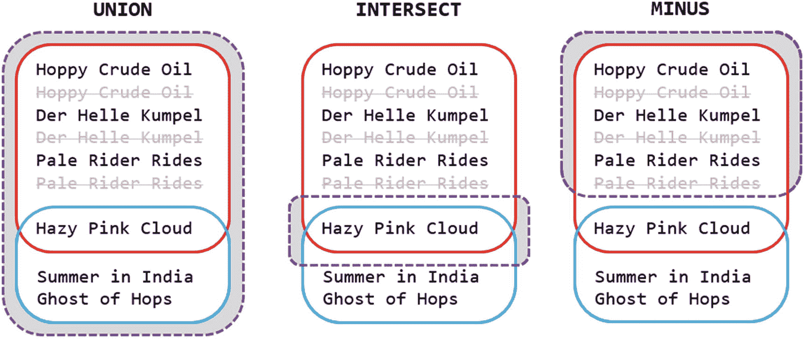
*图 2-4：在不重复数据上的 Union、intersect 和 minus*

你可能会好奇为什么我展示的 `union` 操作符与 `union all` 不同？

实际上它就是 `union` 操作符。它是 `union`、`intersect` 和 `minus` 这三个操作符之一。所有三个操作符的设计原理都像集合论那样：它们作用于包含不同值的集合，因此它们会隐式地移除所有重复项（如图 2-4 中灰掉的划线所示）。关键字 `all` 告诉 `union` 操作符 `不要` 移除重复项，而是保留 `所有` 行。

不幸的是，我在代码中经常看到，在真正需要 `union all` 的地方却使用了 `union`。同样在许多值已经是不同的情况下，使用 `union` 会不必要地执行隐式的去重操作，而 `union all` 则可以避免这种开销。

因此，我的经验法则是，SQL 开发者在日常开发中几乎总是需要 `union all`。只是偶尔才会用到 `union`。因此，我倾向于将 `union all` 和 `union` 分开看待，因为它能帮助我自动区分何时需要这个，何时需要那个。

在讲完了你大多数时候需要 `union all` 这番话之后，清单 2-6 向你展示了实现图 2-4 所示集合操作的代码。

```sql
SQL> select product_id as p_id, product_name
2  from customer_order_products
3  where customer_id = 50741
4  union
5  select product_id as p_id, product_name
6  from brewery_products
7  where brewery_id = 523
8  order by p_id;
清单 2-6：Union 是一个真正的集合操作，它隐式地对查询结果执行去重
```

使用 `union` (`不带` `all`) 会产生两个集合的去重并置结果：

```
P_ID PRODUCT_NAME
----- -----------------
4280 Hoppy Crude Oil
6520 Der Helle Kumpel
6600 Hazy Pink Cloud
7790 Summer in India
7870 Ghost of Hops
7950 Pale Rider Rides
```

而改为 `intersect` 则会产生重叠行的去重集合：

```
...
4  intersect
...
P_ID PRODUCT_NAME
----- -----------------
6600 Hazy Pink Cloud
```

最后改为 `minus` 则会产生第一个 select 中 `不在` 第二个 select 中的行的去重集合：

```
...
4  minus
...
P_ID PRODUCT_NAME
----- -----------------
4280 Hoppy Crude Oil
6520 Der Helle Kumpel
7950 Pale Rider Rides
```

一切都直截了当，重要的是要记住，这三个操作符 `总是` 会隐式地移除重复项。只有通过 `union all` 才能保留重复项。（这将在数据库的未来版本中改变——参见本章末尾的提示。）


### 多重集操作符

数据存储在嵌套表类型的列中，在 PL/SQL 中使用时被称为集合（存在多种集合类型）。在 SQL 操作中，它被称为**multiset**。不同的 SQL 客户端会以不同的格式显示这些数据——清单 2-7 展示了它在 sqlcl 和 SQL*Plus 中的样子。

```
SQL> select
2     customer_id as c_id, customer_name
3   , product_coll
4  from customer_order_products_obj
5  where customer_id in (50042, 50741)
6  order by customer_id;
清单 2-7
以集合类型查看的客户产品数据
```

我只是查询了聚合视图 `customer_order_products_obj` 以获取我两个客户的信息，并得到一个输出，其中每个客户占一行，包含一个*multiset*列，这意味着它是一个产品 id 和名称的集合（或数组）：

```
C_ID CUSTOMER_NAME   PRODUCT_COLL(ID, NAME)
------ --------------- ----------------------------------------
50042 The White Hart  ID_NAME_COLL_TYPE(ID_NAME_TYPE(4280, 'Ho
ppy Crude Oil'), ID_NAME_TYPE(4280, 'Hop
py Crude Oil'), ID_NAME_TYPE(4280, 'Hopp
y Crude Oil'), ID_NAME_TYPE(5430, 'Hercu
le Trippel'), ID_NAME_TYPE(6520, 'Der He
lle Kumpel'))
50741 Hygge og Humle  ID_NAME_COLL_TYPE(ID_NAME_TYPE(4280, 'Ho
ppy Crude Oil'), ID_NAME_TYPE(4280, 'Hop
py Crude Oil'), ID_NAME_TYPE(6520, 'Der
Helle Kumpel'), ID_NAME_TYPE(6520, 'Der
Helle Kumpel'), ID_NAME_TYPE(6600, 'Hazy
Pink Cloud'), ID_NAME_TYPE(7950, 'Pale
Rider Rides'), ID_NAME_TYPE(7950, 'Pale
Rider Rides'))
```

请注意，每个客户的 multiset 包含的行数与清单 2-2 输出中每个客户的行数相同，这是设计使然，因为此输出只是清单 2-2 输出的聚合。由于我没有在 multiset 中包含 `ordered` 和 `qty` 列，因此存在重复项。这使我能够向您展示 multiset 操作符如何处理这种情况。

#### 多重集联合

操作符 `multiset union` 支持使用 `all` 或 `distinct` 关键字，如图 2-5 所示。使用 `distinct` 关键字时，它的工作方式类似于集合操作符 `union`，会删除所有重复项。使用 `all` 关键字的效果与 `union all` 相同，即保留所有行（包括重复项）。

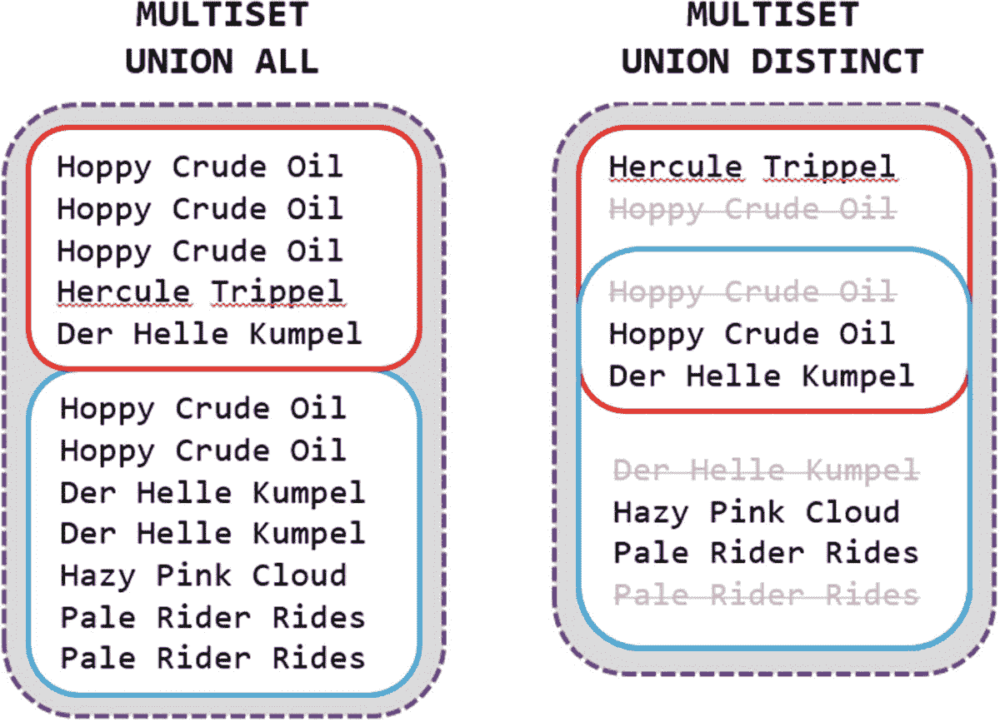

图 2-5

多重集 union all 与多重集 union distinct 的区别

在清单 2-8 中，我在客户 The White Hart 和客户 Hygge og Humle 的 multiset 之间执行了 `multiset union`。

```
SQL> select
2     whitehart.product_coll
3     multiset union
4     hyggehumle.product_coll
5        as multiset_coll
6  from customer_order_products_obj whitehart
7  cross join customer_order_products_obj hyggehumle
8  where whitehart.customer_id = 50042
9  and hyggehumle.customer_id = 50741;
清单 2-8
对集合执行多重集联合操作
```

请注意，我既没有使用 `all` 也没有使用 `distinct`。但您可以在输出中看到，所有行都存在，并且没有删除重复项：

```
MULTISET_COLL(ID, NAME)

ID_NAME_COLL_TYPE(ID_NAME_TYPE(4280, 'Hoppy Crude Oil'), ID_
NAME_TYPE(4280, 'Hoppy Crude Oil'), ID_NAME_TYPE(4280, 'Hopp
y Crude Oil'), ID_NAME_TYPE(5430, 'Hercule Trippel'), ID_NAM
E_TYPE(6520, 'Der Helle Kumpel'), ID_NAME_TYPE(4280, 'Hoppy
Crude Oil'), ID_NAME_TYPE(4280, 'Hoppy Crude Oil'), ID_NAME_
TYPE(6520, 'Der Helle Kumpel'), ID_NAME_TYPE(6520, 'Der Hell
e Kumpel'), ID_NAME_TYPE(6600, 'Hazy Pink Cloud'), ID_NAME_T
YPE(7950, 'Pale Rider Rides'), ID_NAME_TYPE(7950, 'Pale Ride
r Rides'))
```

如果我添加关键字 `all`，结果完全相同：

```
...
3     multiset union all
...
```

**注意**

这是混淆的根源，因为集合操作符 `union` 默认为 `distinct` 行为，而 `multiset union` 默认为 `all` 行为。为了帮助自己避免错误，我遵循的经验法则是永远不依赖默认值。对于 `multiset`，我总是包含 `all` 或 `distinct`。对于集合操作符 `union`，我没有添加 `distinct` 关键字的选项，但我会在注释中将其添加为 `/*distinct*/`，以便让未来的自己清楚我没有不小心忘记 `all` 关键字。

如果我将其更改为 `distinct`，我会得到一个删除了所有重复项的输出：

```
...
3     multiset union distinct
...
MULTISET_COLL(ID, NAME)

ID_NAME_COLL_TYPE(ID_NAME_TYPE(4280, 'Hoppy Crude Oil'), ID_
NAME_TYPE(5430, 'Hercule Trippel'), ID_NAME_TYPE(6520, 'Der
Helle Kumpel'), ID_NAME_TYPE(6600, 'Hazy Pink Cloud'), ID_NA
ME_TYPE(7950, 'Pale Rider Rides'))
```

接下来是 `multiset intersect`。

#### 多重集交集

图 2-6 显示，使用 `multiset intersect`，我可以得到两个集合共有的行。

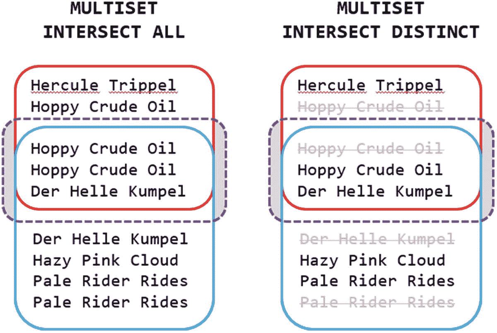

图 2-6

多重集 intersect all 与多重集 intersect distinct 的区别

如果我将清单 2-8 的 multiset 操作符更改为 `multiset intersect all`，您也可以在输出中看到相同的情况：

```
...
3     multiset intersect all
...
MULTISET_COLL(ID, NAME)

ID_NAME_COLL_TYPE(ID_NAME_TYPE(4280, 'Hoppy Crude Oil'),
ID_NAME_TYPE(4280, 'Hoppy Crude Oil'), ID_NAME_TYPE(6520,
'Der Helle Kumpel'))
```

同样，`multiset intersect distinct` 版本：

```
...
3     multiset intersect distinct
...
MULTISET_COLL(ID, NAME)

ID_NAME_COLL_TYPE(ID_NAME_TYPE(4280, 'Hoppy Crude Oil'), ID_
NAME_TYPE(6520, 'Der Helle Kumpel'))
```

这里没有太多惊喜，但使用 `multiset except` 会变得更有趣。


##### 多重集差集

图 2-7 左侧的数据与之前顺序相同，展示了当我选取顾客 Hygge og Humle 的啤酒，并使用 `multiset except all` 减去顾客 The White Hart 的啤酒后剩余的内容。使用 `all` 意味着它会考虑重复项出现的次数——第一位顾客有三行 Hoppy Crude Oil，而第二位顾客有两行，因此在减法输出中留下一行。

在图 2-7 的中间部分，我仍然使用 `multiset except all`，但我交换了两位顾客，所以我选取 The White Hart 的啤酒并减去 Hygge og Humle 的啤酒。原理同上，第一位顾客有两行 Der Helle Kumpel，而第二位顾客有一行，因此在输出中留下一行。当我切换到 `distinct` 时，情况变得有趣起来。

在图 2-7 的右侧，您可以看到当我使用 `multiset except distinct` 时，输出不再包含 Der Helle Kumpel。有人可能认为这应该像是从 `multiset except all` 的输出中移除重复项，但事实并非如此。它是 *先* 从 *两个* 输入集合中移除重复项，*然后* 再进行减法运算。这意味着，使用 `multiset except all` 显示的某些值，在使用 `multiset except distinct` 时可能会 *消失*。

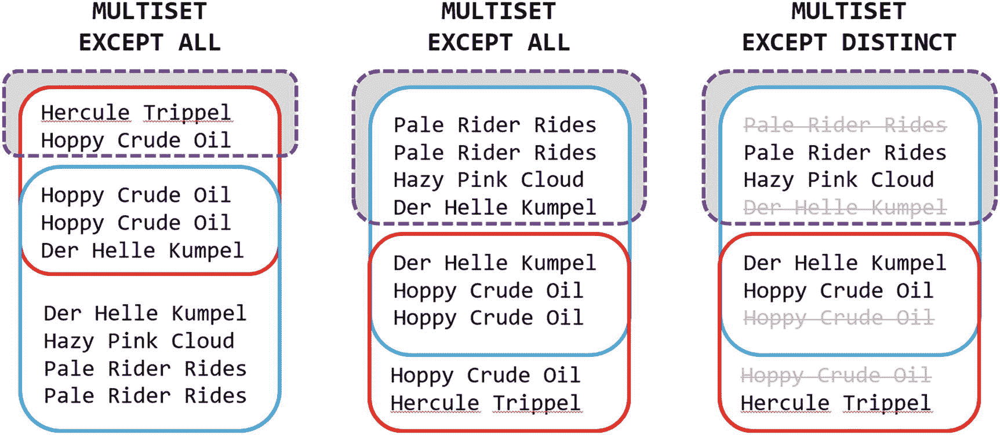

图 2-7
多重集差集所有与多重集差集唯一的区别

在代码中展示相同操作，我只需更改清单 2-8 中的运算符即可得到图 2-7 的左侧输出：

```
...
3     multiset except all
...
MULTISET_COLL(ID, NAME)

ID_NAME_COLL_TYPE(ID_NAME_TYPE(4280, 'Hoppy Crude Oil'), ID_NAME_TYPE(5430, 'Hercule Trippel'))
```

交换两个输入嵌套表列的顺序，得到图 2-7 的中间输出：

```
SQL> select
2     hyggehumle.product_coll
3     multiset except all
4     whitehart.product_coll
...
MULTISET_COLL(ID, NAME)

ID_NAME_COLL_TYPE(ID_NAME_TYPE(6520, 'Der Helle Kumpel'), ID_NAME_TYPE(6600, 'Hazy Pink Cloud'), ID_NAME_TYPE(7950, 'Pale Rider Rides'), ID_NAME_TYPE(7950, 'Pale Rider Rides'))
```

最后切换到 `multiset except distinct` 会产生图 2-7 的右侧输出，您会注意到 Der Helle Kumpel 缺失了：

```
SQL> select
2     hyggehumle.product_coll
3     multiset except distinct
4     whitehart.product_coll
...
MULTISET_COLL(ID, NAME)

ID_NAME_COLL_TYPE(ID_NAME_TYPE(6600, 'Hazy Pink Cloud'), ID_NAME_TYPE(7950, 'Pale Rider Rides'))
```

使用 `multiset except`，您可以像这里展示的那样在 `all` 和 `distinct` 之间选择，但对于集合运算符 `minus` 则不然。

### 减法运算符与多重集差集

集合运算符通常比多重集运算符使用得更频繁，其中 `union all` 可能是使用最多的。但有时使用 `minus` 可以作为反连接（`not in` 和 `not exists`）的一个不错的替代方案。

我特意花了一些时间向您展示 `multiset except all` 和 `multiset except distinct` 之间的区别，为清单 2-9 奠定基础，在那里我使用 `minus` 产生与刚才使用 `multiset except distinct` 相同的输出。

```
SQL> select product_id as p_id, product_name
2  from customer_order_products
3  where customer_id = 50741
4  minus
5  select product_id as p_id, product_name
6  from customer_order_products
7  where customer_id = 50042
8  order by p_id;
清单 2-9
减法运算符类似于多重集差集唯一
```

由于 `minus` 在进行减法运算之前也会先移除输入集合的重复项，因此此输出中也没有 Der Helle Kumpel：

```
P_ID PRODUCT_NAME
----- -----------------
6600 Hazy Pink Cloud
7950 Pale Rider Rides
```

但是，如果我想要一个考虑重复项出现次数的输出呢？换句话说，即使 SQL 不支持，我如何才能得到一个 `minus all`？

我已经向您展示过多重集运算符支持这个功能，所以我可以在清单 2-10 中利用这一点。

```
SQL> select
2     minus_all_table.id   as p_id
3   , minus_all_table.name as product_name
4  from table(
5     cast(
6        multiset(
7           select product_id, product_name
8           from customer_order_products
9           where customer_id = 50741
10        )
11        as id_name_coll_type
12     )
13     multiset except all
14     cast(
15        multiset(
16           select product_id, product_name
17           from customer_order_products
18           where customer_id = 50042
19        )
20        as id_name_coll_type
21     )
22  ) minus_all_table
23  order by p_id;
清单 2-10
使用多重集差集所有模拟减法所有
```

清单 2-9 中的两个 `select` 语句，我分别将它们放入一个 `multiset` 函数调用中（第 6-10 行和第 15-19 行），这将行集转换为多重集（嵌套表）。但我不能只是将其转换为“通用”类型；我必须使用 `cast` 函数来指定我要创建的嵌套表类型，这里是 `id_name_coll_type`。

这样我现在有了两个多重集，因此我可以在第 13 行使用 `multiset except all` 将一个从另一个中减去。这个减法运算的结果我放在第 4 行的 `table` 函数中，该函数将多重集（嵌套表）转换回行集，因此查询产生了我想要的输出：

```
P_ID PRODUCT_NAME
----- -----------------
6520 Der Helle Kumpel
6600 Hazy Pink Cloud
7950 Pale Rider Rides
7950 Pale Rider Rides
```

它运行良好，并且展示的技术有时可以在集合和多重集之间来回切换时派上用场。但对于这个特定用例来说，这有点杀鸡用牛刀，因为我可以更简单地通过使用分析函数来模拟 `minus all`，如清单 2-11 所示。

```
SQL> select
2     product_id as p_id
3   , product_name
4   , row_number() over (
5        partition by product_id, product_name
6        order by rownum
7     ) as rn
8  from customer_order_products
9  where customer_id = 50741
10  minus
11  select
12     product_id as p_id
13   , product_name
14   , row_number() over (
15        partition by product_id, product_name
16        order by rownum
17     ) as rn
18  from customer_order_products
19  where customer_id = 50042
20  order by p_id;
清单 2-11
使用分析 row_number 函数模拟减法所有
```


我在这里做的是添加一个使用 `row_number()` 的列，为 `product_id` 和 `product_name` 的每个不同值组合创建连续的编号 1, 2, 3 …。这样，`MINUS` 操作符执行的隐式 `DISTINCT` 就不会删除任何行，因为 `rn` 列中连续数字的添加使得所有行都变得唯一。

这意味着第一个客户将有两行 "Der Helle Kumpel"，一行获得 `rn=1`，另一行获得 `rn=2`。而第二个客户只有一行，所以它获得 `rn=1`。使用 `MINUS` 则意味着 `rn=1` 的行被减去，但 `rn=2` 的行保留了下来，正如你在输出中看到的：

```
P_ID PRODUCT_NAME      RN
----- ----------------- --
6520 Der Helle Kumpel   2
6600 Hazy Pink Cloud    1
7950 Pale Rider Rides   1
7950 Pale Rider Rides   2
```

清单 2-11 中的代码可能不比清单 2-10 短多少，但它是一个不需要创建嵌套表类型的解决方案，并且分析函数的开销比来回转换集合类型所需的要小。因此，在未来的 SQL 版本提供 `MINUS ALL` 之前，这是一个很好的模拟方法。

**提示**

在未来的数据库版本（可能是 20c）中，集合操作符 `INTERSECT` 和 `EXCEPT` 也将支持关键字 `ALL`，就像 `UNION` 和多重集合操作符一样。届时，你将不再需要像这里展示的方法来模拟 `MINUS ALL`，而是可以直接使用。

### 经验教训

我已经详细解释了带或不带 `DISTINCT` 和 `ALL` 的 `set` 与 `multiset` 操作符的变体，希望你现在能够：

- 清晰区分 `UNION ALL` 和 `UNION`，这样就不会在不希望或不需要删除重复项时错误地使用 `UNION`。
- 注意到集合操作符 `UNION`、`INTERSECT` 和 `MINUS` 默认为 `DISTINCT` 行为，而不像多重集合操作符 `MULTISET UNION`、`MULTISET INTERSECT` 和 `MULTISET EXCEPT` 默认为 `ALL` 行为。
- 知道如何在数据库版本直接支持 `MINUS ALL` 的那一天到来之前，模拟它。

这些知识可以让你避免在开发和测试环境中难以发现的无意识错误。

## 3. 使用子查询分解进行分而治之

每个程序员都曾在某个时候学习过 `模块化`——将代码拆分成更小的单元，每个单元解决整体中的一个独立部分，通常在过程式语言中以函数和过程的形式使用，例如在 PL/SQL 中。在 SQL 中，视图有助于降低复杂性并提供可重用性。

但模块化并不一定意味着全局可访问和可重用的单元。例如，在 PL/SQL 中，我可以在另一个函数或过程的声明部分创建本地函数和过程。这些代码单元仅具有本地作用域，并不作为对象存在于数据字典中——它们仅作为本地模块化来简化一个原本庞大的过程。

在 SQL 中，有一个类似的机制称为 `子查询分解`，通常也称为 `WITH` 子句，有时也称为 `公共表表达式`、`语句作用域视图` 或 `命名查询块`（仅提及一些用于此的术语）。

其思想（就像声明部分中的本地过程一样）是在 SQL 语句的一种“声明部分”中定义一个“本地视图”。这个“声明部分”本身就是 `WITH` 子句，其中定义的每个“本地视图”被称为 `命名子查询`。这是一种在单个 SQL 语句内进行本地模块化的非常有用的技术。

**提示**

`WITH` 子句随着数据库版本的发展而演进，其功能远不止本章所示。更多内容将在后续章节中介绍。

### 产品和销售数据

为了向你展示一个模块化 SQL 语句的例子，我将使用图 3-1 中所示的表。

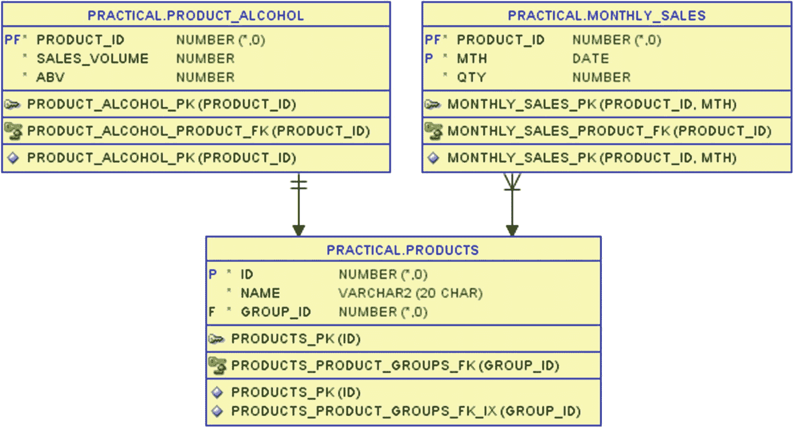

图 3-1

本章使用表 `product_alcohol` 和 `monthly_sales`

在 `products` 表中存储着 Good Beer Trading Co 销售的啤酒。对于这些啤酒，关于其酒精含量的信息在表 `product_alcohol` 中，而关于其月度销售的统计数据在表 `monthly_sales` 中。

根据这些数据，我将创建 SQL 来找出哪些年份的销售额超过了 `abv`（酒精体积分数）列中酒精含量最低的那一半啤酒的平均值。


### 低度啤酒的畅销年份

The Good Beer Trading Co. 将他们的啤酒分为两部分——酒精度最低的一半被定义为酒精等级 1，而酒精度较高的另一半则为酒精等级 2。我在清单 3-1 中查明了哪些属于哪个等级。

```sql
SQL> select
2     pa.product_id as p_id
3   , p.name        as product_name
4   , pa.abv
5   , ntile(2) over (
6        order by pa.abv, pa.product_id
7     ) as alc_class
8  from product_alcohol pa
9  join products p
10     on p.id = pa.product_id
11  order by pa.abv, pa.product_id;
清单 3-1
将啤酒分为酒精等级 1 和 2
```

在第 5-7 行中，分析函数 `ntile()` 将每一行分配到桶中——参数即为桶的数量。它将按照 `order by` 子句指定的顺序进行分配，并确保行数据尽可能均匀地分布。在这个包含十行的示例中，按 `abv` 排序的前五行将被分配到桶 1，最后五行将被分配到桶 2：

```text
P_ID  PRODUCT_NAME      ABV  ALC_CLASS
6600  Hazy Pink Cloud   4    1
6520  Der Helle Kumpel  4.5  1
7870  Ghost of Hops     4.5  1
5310  Monks and Nuns    5    1
7950  Pale Rider Rides  5    1
7790  Summer in India   5.5  2
4160  Reindeer Fuel     6    2
5430  Hercule Trippel   6.5  2
4280  Hoppy Crude Oil   7    2
4040  Coalminers Sweat  8.5  2
```

因此，在清单 3-2 中，我可以只选取 `alc_class` 值为 1 的啤酒，将它们连接到 `monthly_sales` 表，并进行聚合以显示年度销售数据。

```sql
SQL> select
2     pac.product_id as p_id
3   , extract(year from ms.mth) as yr
4   , sum(ms.qty) as yr_qty
5  from (
6     select
7        pa.product_id
8      , ntile(2) over (
9           order by pa.abv, pa.product_id
10        ) as alc_class
11     from product_alcohol pa
12  ) pac
13  join monthly_sales ms
14     on ms.product_id = pac.product_id
15  where pac.alc_class = 1
16  group by
17     pac.product_id
18   , extract(year from ms.mth)
19  order by p_id, yr;
清单 3-2
查看酒精等级 1 啤酒的年度销售额
```

由于分析函数不能在 `where` 子句中使用，我需要在第 6-11 行的内联视图中放置 `ntile()` 计算。在第 15 行，我只保留 `alc_class = 1` 的记录。其余部分是一个标准的内连接 (`inner join`) 和一个 `group by` 子句，输出每种啤酒三年的销售数据：

```text
P_ID  YR    YR_QTY
5310  2016  478
5310  2017  582
5310  2018  425
6520  2016  415
6520  2017  458
6520  2018  357
6600  2016  121
6600  2017  105
6600  2018  98
7870  2016  552
7870  2017  482
7870  2018  451
7950  2016  182
7950  2017  210
7950  2018  491
```

目前为止一切顺利，现在我在该语句的基础上进一步构建。因此，在清单 3-3 中，我可以只找出那些特定啤酒的年销售额超过其自身年平均销售额的年份。

```sql
SQL> select
2     p_id, yr, yr_qty
3   , round(avg_yr) as avg_yr
4  from (
5     select
6        pac.product_id as p_id
7      , extract(year from ms.mth) as yr
8      , sum(ms.qty) as yr_qty
9      , avg(sum(ms.qty)) over (
10           partition by pac.product_id
11        ) as avg_yr
12     from (
13        select
14           pa.product_id
15         , ntile(2) over (
16              order by pa.abv, pa.product_id
17           ) as alc_class
18        from product_alcohol pa
19     ) pac
20     join monthly_sales ms
21        on ms.product_id = pac.product_id
22     where pac.alc_class = 1
23     group by
24        pac.product_id
25      , extract(year from ms.mth)
26  )
27  where yr_qty > avg_yr
28  order by p_id, yr;
清单 3-3
仅查看每种啤酒销售额高于其年平均销售额的年份
```

清单 3-3 中的代码，我将其放入第 5-25 行的内联视图中，并添加了第 9-11 行，在这里我使用 `avg()` 函数的分析版本来计算每种啤酒的年平均销售额。这使我能够在第 27 行仅保留那些销售额大于年平均销售额的年份：

```text
P_ID  YR    YR_QTY  AVG_YR
5310  2017  582     495
6520  2016  415     410
6520  2017  458     410
6600  2016  121     108
7870  2016  552     495
7950  2018  491     294
```

清单 3-3 中的查询本身并没有错，但你可以看到，每增加一个内联视图，语句就变得更复杂、更难以阅读。缩进对于跟踪哪个 `select` 列表属于哪个 `join` 和 `where` 子句至关重要。如果语句再稍微大一点，你就无法不滚动屏幕而同时看到 `select` 列表和 `where` 子句了。

这正是 `with` 子句的用武之地。


## 使用 with 子句实现模块化

`with` 子句允许我将子查询置于查询的顶部，为其命名，并在其他地方像使用视图一样引用它们——你可以将其视为过程式编程中的重构，因此也被称为*子查询因子化*。在清单 3-4 中，我对清单 3-3 进行了重构，使用 `with` 子句中的命名子查询替代了内联视图。

```sql
SQL> with product_alc_class as (
2     select
3        pa.product_id
4      , ntile(2) over (
5           order by pa.abv, pa.product_id
6        ) as alc_class
7     from product_alcohol pa
8  ), class_one_yearly_sales as (
9     select
10        pac.product_id as p_id
11      , extract(year from ms.mth) as yr
12      , sum(ms.qty) as yr_qty
13      , avg(sum(ms.qty)) over (
14           partition by pac.product_id
15        ) as avg_yr
16     from product_alc_class pac
17     join monthly_sales ms
18        on ms.product_id = pac.product_id
19     where pac.alc_class = 1
20     group by
21        pac.product_id
22      , extract(year from ms.mth)
23  )
24  select
25     p_id, yr, yr_qty
26   , round(avg_yr) as avg_yr
27  from class_one_yearly_sales
28  where yr_qty > avg_yr
29  order by p_id, yr;
清单 3-4
使用子查询因子化重写清单 3-3
```

我将清单 3-3 最内层的内联视图的子查询放在第 2-7 行，并将其命名为 `product_alc_class`（使用有意义的名称是个好主意）。然后，我可以在查询的后续部分引用 `product_alc_class`，就像使用数据字典中的视图一样。但它并未在数据字典中创建；仅在此 SQL 语句内部局部定义。

清单 3-3 的第二级内联视图随后放在第 9-22 行，并在第 8 行被命名为 `class_one_yearly_sales`。在第 16 行，它查询了 `product_alc_class` 命名子查询，而清单 3-3 在相同位置使用的是一个内联视图。

第 24-29 行的主查询对应于清单 3-3 第 1-4 行和第 26-28 行的外部查询，只是查询的是 `class_one_yearly_sales` 命名子查询，而非内联视图。

清单 3-4 的输出与清单 3-3 相同，并且优化器很可能重写了 SQL 以实现相同的访问计划，那么我获得了什么？

以这种简单的方式使用 `with` 子句，我主要获得了**可读性**——将 `select` 列表和 `where` 子句集中在第 24-29 行，通过查询一个命名恰当的子查询，使得独立编写、理解和检查大查询中仅*这部分*的逻辑变得更加容易。同样，两个命名子查询中的每一个，都可以单独查看。这与你从局部模块化过程代码中获得的好处相同。

但是，清单 3-4 通过让第二个子查询从第一个子查询中选择，而主查询又从第二个子查询中选择，从而重构了清单 3-3 的*嵌套*内联视图。我也可以在清单 3-5 中以另一种方式重写它。

```sql
SQL> with product_alc_class as (
2     select
3        pa.product_id
4      , ntile(2) over (
5           order by pa.abv, pa.product_id
6        ) as alc_class
7     from product_alcohol pa
8  ), yearly_sales as (
9     select
10        ms.product_id
11      , extract(year from ms.mth) as yr
12      , sum(ms.qty) as yr_qty
13      , avg(sum(ms.qty)) over (
14           partition by ms.product_id
15        ) as avg_yr
16     from monthly_sales ms
17     group by
18        ms.product_id
19      , extract(year from ms.mth)
20  )
21  select
22     pac.product_id as p_id
23   , ys.yr
24   , ys.yr_qty
25   , round(ys.avg_yr) as avg_yr
26  from product_alc_class pac
27  join yearly_sales ys
28     on ys.product_id = pac.product_id
29  where pac.alc_class = 1
30  and ys.yr_qty > ys.avg_yr
31  order by p_id, yr;
清单 3-5
使用独立命名子查询的替代重写方式
```

`product_alc_class` 命名子查询与清单 3-4 中相同。但在第 8-20 行，我没有使用 `class_one_yearly_sales`，而是创建了更简单的 `yearly_sales`，它计算了*所有*产品的年度销售额，*没有*与 `product_alc_class` 进行连接。我的 `with` 子句中的两个命名子查询现在彼此独立。

在主查询中，我简单地在第 26-28 行连接了两个命名子查询，并在第 29-30 行的 `where` 子句中进行了过滤。使用此代码，我再次获得了与前两个清单相同的输出。

清单 3-4 和 3-5 都是使用 `with` 子句解决原本可以用内联视图解决的问题的例子。主要好处是可读性，因为命名子查询的定义是分离的，而不是相互嵌套内联的。但是 `with` 子句还有其他内联视图不易解决的好处。


#### 同一子查询的多次使用

如清单 3-5 所示的做法可能会引发的一个问题是，我可能会计算所有产品的年度销售额，而实际上我只需要计算一半产品。根据代码的编写方式，优化器可能足够智能，能够判断直接为所有产品计算是否最快，或者将谓词推入子查询、仅为所需的那部分产品计算是否更快。

有时，无法让查询自动推入谓词。在这种情况下，我可以按照清单 3-6 所示的方法，强制它只为所需的产品计算年度销售额。

```
SQL> with product_alc_class as (
...
8  ), yearly_sales as (
...
16     from monthly_sales ms
17     where ms.product_id in (
18        select pac.product_id
19        from product_alc_class pac
20        where pac.alc_class = 1
21     )
...
25  )
26  select
...
31  from product_alc_class pac
32  join yearly_sales ys
33     on ys.product_id = pac.product_id
34  where ys.yr_qty > ys.avg_yr
35  order by p_id, yr;
清单 3-6
在多个地方查询同一个子查询
```

清单 3-6 与清单 3-5 几乎完全相同。但我添加了第 17-21 行，使得`yearly_sales`仅针对在名为`product_alc_class`的子查询中找到的那些产品进行计算。即便如此，我仍然在主查询的连接中使用了`product_alc_class`（第 31 行）——这是允许的，因为命名子查询可以在代码中多次使用。

但由于`yearly_sales`现在已经被预过滤，只返回`alc_class = 1`的产品数据，我就不再需要在最终的`where`子句（第 34 行）中使用这个过滤条件了——我仍然能得到与前三份清单相同的输出。

**注意**

严格来说，在清单 3-6 的这个特定案例中，我可以避免在主查询中连接`product_alc_class`，因为我本可以在`select`列表中查询`ys.product_id`而不是`pac.product_id`。但是，如果`product_alc_class`中有更多我需要在输出中包含的列，那么重复使用这个命名子查询就是必要的。

像这样在`with`子句中提取子查询的一个巨大好处是，优化器可以根据其判断的最低成本，以两种不同方式之一来处理它们：
它可以将它们视同为视图，这意味着命名子查询的 SQL 基本上会在每次被查询的地方进行替换。
它也可以选择*仅执行一次*命名子查询的 SQL，将结果存储到它动态创建的临时表中，然后在每次查询该命名子查询时访问这个临时表。

`with`子句赋予了优化器这种选择权，并且（就像所有涉及优化器的情况一样）它通常会做出正确的选择，但有时也可能做出错误的选择。

为了测试优化器采用第二种方法是否是个好主意，我可以在清单 3-6 的第 2 行添加*未公开文档的*提示`/*+ materialize */`，如下所示：

```
SQL> with product_alc_class as (
2     select /*+ materialize */
3        pa.product_id
...
```

有了这个提示，我强制优化器选择执行`temp table transformation`并`load as select`的访问方法，如图 3-2 所示。

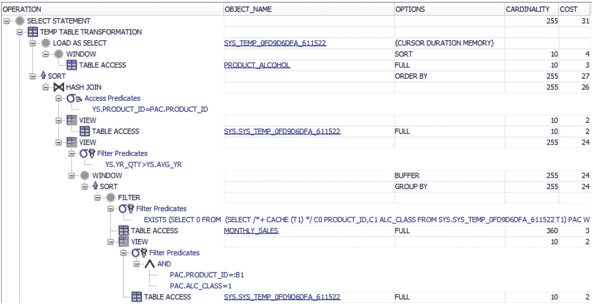

#### 图 3-2

执行计划显示临时表的创建和使用

执行计划中嵌套在`load as select`下的操作是`product_alc_class`命名子查询的执行，其结果随后被存储到动态创建的、被赋予`sys_temp_*`名称的临时表中。然后，在执行计划的后续部分，这个临时表会被访问两次。

`/*+ materialize */`提示非常适合用于测试，以弄清楚你是否真的希望优化器以这种方式操作。如果你发现确实如此，但优化器却（在*你*看来是错误地）选择将你的命名子查询当作视图来处理而不是物化它，那么你可能会想在生产代码中也使用这个提示。这是一个我无法推荐的想法。

你使用该提示很可能是安全的，甚至非常安全，但在生产代码中使用未公开文档的提示是*绝对*强烈不鼓励的。你无法从 Oracle 获得任何保证它会一直存在——它可能在下一次升级时毫无预警地消失。那么，你可以使用另一种方法来强制物化：

```
SQL> with product_alc_class as (
2     select
3        pa.product_id
4      , ntile(2) over (
5           order by pa.abv, pa.product_id
6        ) as alc_class
7     from product_alcohol pa
8     where rownum >= 1
9  ), yearly_sales as (
...
```

在清单 3-6 的这个版本中，我移除了`/*+ materialize */`提示，但添加了第 8 行。一个对`rownum`的过滤子句（其求值结果总是为真）同样使得优化器有必要物化`product_alc_class`命名子查询的结果。

使用`where rownum >= 1`或以其他方式引用`rownum`是一个防止视图合并的经典技巧。它之所以有效，是因为在执行视图合并和不合并时，分配给`rownum`伪列的值很容易变得不同。优化器不能允许自己执行一个可能改变查询结果的优化操作，因此在使用`rownum`时，它不能允许视图合并。所以它必须选择物化。此机制对`with`子句以及内联或存储视图都有效。


#### 列出列名

到目前为止，我所有的 `with` 子句都包含依赖于列别名的子查询，用于指定查询命名子查询时可用的列。

但正如我所说，这非常类似于定义一个“局部视图”，你可能还记得，在 `create view` 语句中，你可以选择是*显式*地提供列名列表，还是*隐式*地让列获取查询列别名的名称。在 `with` 子句中，你也可以采用这两种方式。

**注意**

在最初支持 `with` 子句的数据库版本中，隐式列命名是唯一的方式。在 11.1 版本中，`with` 子句被扩展以支持*递归*子查询分解（这是后续章节的主题），其中显式的列列表是强制性的。但显式的列列表也可以在一般情况下使用；它不仅限于递归子查询分解。

列表 3-4、3-5 和 3-6 都使用了来自列别名的隐式列命名——在列表 3-7 中，我展示了列表 3-6 的一个重写版本，它使用了显式的列名列表。

```sql
SQL> with product_alc_class (
2     product_id, alc_class
3  ) as (
4     select
5        pa.product_id
6      , ntile(2) over (
7           order by pa.abv, pa.product_id
8        )
9     from product_alcohol pa
10  ), yearly_sales (
11     product_id, yr, yr_qty, avg_yr
12  ) as (
13     select
14        ms.product_id
15      , extract(year from ms.mth)
16      , sum(ms.qty)
17      , avg(sum(ms.qty)) over (
18           partition by ms.product_id
19        )
20     from monthly_sales ms
21     where ms.product_id in (
22        select pac.product_id
23        from product_alc_class pac
24        where pac.alc_class = 1
25     )
26     group by
27        ms.product_id
28      , extract(year from ms.mth)
29  )
30  select
31     pac.product_id as p_id
32   , ys.yr
33   , ys.yr_qty
34   , round(ys.avg_yr) as avg_yr
35  from product_alc_class pac
36  join yearly_sales ys
37     on ys.product_id = pac.product_id
38  where ys.yr_qty > ys.avg_yr
39  order by p_id, yr;
清单 3-7
指定列名列表而非列别名
```

对于 `with` 子句中的每个命名子查询，我在查询名和 `as` 关键字之间插入一组带有列名列表的圆括号（第 1-3 行和第 10-12 行）。这会覆盖子查询本身返回的任何列名和/或别名——我甚至不需要提供列别名，正如你在第 8 行和第 15-19 行看到的那样。

这完全不会改变输出——从清单 3-3 到 3-7 的所有清单都产生相同的输出。在许多类似的情况下，你不会看到使用显式的列名，尽管它确实能提高一点工作效率——当我在语句中编写后续子查询的代码并需要知道 `product_alc_class` 命名子查询的哪些列可用时，简单地引用第 2 行的列表，而不是必须从可能很长很复杂的 `select` 列表代码中找出哪些是列名，是很方便的。

但是，`with` 子句有一个常见的用途，其中显式的列列表极其方便——那就是通过从 `dual` 中选择来生成测试数据，如清单 3-8 所示。

```sql
SQL> with product_alcohol (
2     product_id, sales_volume, abv
3  ) as (
4     /* 模拟表 product_alcohol */
5     select 4040, 330, 4.5 from dual union all
6     select 4160, 500, 7.0 from dual union all
7     select 4280, 330, 8.0 from dual union all
8     select 5310, 330, 4.0 from dual union all
9     select 5430, 330, 8.5 from dual union all
10     select 6520, 500, 6.5 from dual union all
11     select 6600, 500, 5.0 from dual union all
12     select 7790, 500, 4.5 from dual union all
13     select 7870, 330, 6.5 from dual union all
14     select 7950, 330, 6.0 from dual
15  )
16  /* 使用模拟数据进行测试的查询 */
17  select
18     pa.product_id as p_id
19   , p.name        as product_name
20   , pa.abv
21   , ntile(2) over (
22        order by pa.abv, pa.product_id
23     ) as alc_class
24  from product_alcohol pa
25  join products p
26     on p.id = pa.product_id
27  order by pa.abv, pa.product_id;
清单 3-8
在 with 子句中使用测试数据“重载”一个表
```

第 17-27 行与清单 3-1 相同。但我想测试这个查询在表的内容是其他情况下的输出。

我不创建测试表并在查询中搜索替换以使用测试表的名称，而是在第 1-15 行使用 `with` 子句创建一个命名子查询，我给它起了与 `product_alcohol` 表*相同的名称*。我在第 2 行提供了一个列名列表，然后我在第 5-14 行简单地重复从 `dual` 中 `select` 常量值。这样可读性更高，*无需*在数据列表中充斥大量列别名，如下所示：

```sql
...
4     /* 模拟表 product_alcohol */
5     select 4040 as product_id, 330 as sales_volume, 4.5 as abv from dual union all
6     select 4160 as product_id, 500 as sales_volume, 7.0 as abv from dual union all
...
```

通过这种方式，我可以轻松地使用测试数据获得查询的输出，而无需更改查询本身的表名：

```
P_ID  PRODUCT_NAME      ABV  ALC_CLASS
5310  Monks and Nuns    4    1
4040  Coalminers Sweat  4.5  1
7790  Summer in India   4.5  1
6600  Hazy Pink Cloud   5    1
7950  Pale Rider Rides  6    1
6520  Der Helle Kumpel  6.5  2
7870  Ghost of Hops     6.5  2
4160  Reindeer Fuel     7    2
4280  Hoppy Crude Oil   8    2
5430  Hercule Trippel   8.5  2
```

这种在 `with` 子句中包含测试数据的方法在你在互联网论坛上提问时也非常方便。如果帮助你的人可以直接执行包含数据等所有内容的查询，而无需创建表、填充数据*然后*尝试你的查询，这会让事情变得容易得多。当然，这并非适用于所有情况，但在很多时候都很好用。

### 经验教训

`with` 子句还能做很多其他事情，我将在后面的章节中介绍其中的大部分。本章重点介绍如何使用它来模块化 SQL 语句，以便你可以：

*   分而治之，将 SQL 拆分成更易于整体把握的片段。
*   将每个命名子查询的代码视为一个单元，而不是使用嵌套的内联视图。
*   在你的语句中多次从一个命名子查询中选择，可能临时物化结果，而不是多次查询基表。
*   提供一个列名列表作为列别名的替代方案，特别是当使用 `dual` 生成测试数据时，以避免代码过度混乱。

在学习过程式代码时，我们都被告知模块化是降低复杂性风险的关键——在 SQL 中也是如此。`with` 子句确实是本地模块化 SQL 语句的一个*非常*好的工具，适用于那些比简单的双表连接稍微复杂一些的语句。


## 4. 使用递归进行树形计算

我能想到的任何过程式语言都支持某种形式的递归。一个过程或函数可以调用自身——如果需要，可以反复调用直到达到某个条件。通常它们也支持迭代，这两者相关但并不完全相同。

SQL 处理的是行的集合，而不是过程式逻辑，那么如何在 SQL 中实现递归呢？它仍然关注行的集合：首先找到一组行；然后基于这组行，应用某些逻辑找到第二组行；接着基于*那*组行，*再次*（递归地）应用逻辑找到第三组行；如此继续，直到找不到更多的行为止。

SQL 中这种递归的典型用例是处理层次数据。你找到树的顶层节点，然后找到它们的子节点，接着是孙节点，依此类推。对树中每一层进行的下一次查找，都是基于前一层的行递归地应用子节点查找逻辑。

在本章中，我主要关注 SQL 中以`递归子查询因式分解`形式存在的递归，这是 SQL 中最直接适用的递归方法。（你可以使用`model`子句进行迭代——我在第 6 章和第 16 章给出了相关示例。第 16 章也给出了一个非层次化使用递归子查询因式分解的例子。）

这里我将展示在层次数据上使用递归。

### 托盘上的箱中瓶

好啤酒贸易公司有不同大小瓶装的啤酒，这些瓶子被装入不同大小的箱子中，箱子可能又被装入更大的箱子里，而这些箱子则堆放在托盘上。这些不同类型的产品包装及其关系的定义存储在图 4-1 所示的表中。

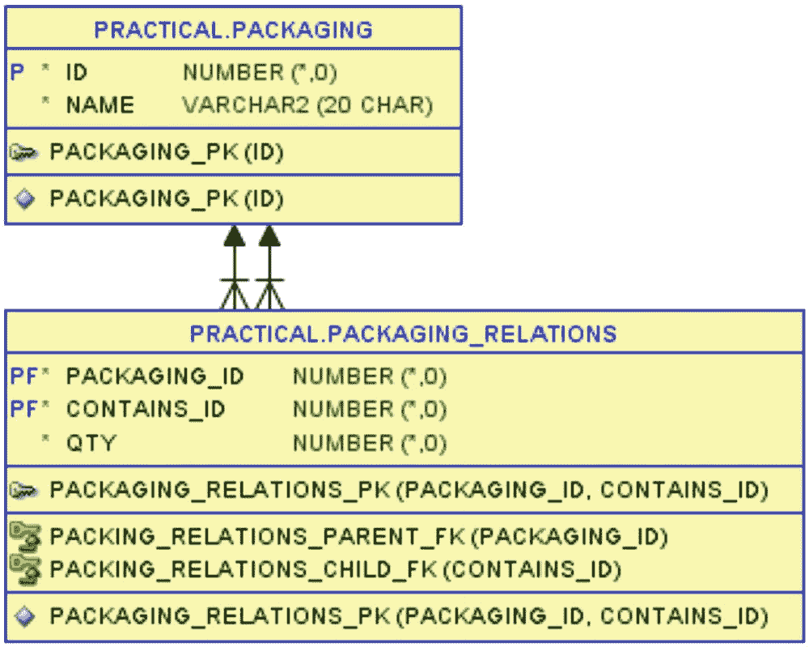

图 4-1：包装表及每种包装类型中包含的数量

`packaging`表包含不同类型和尺寸的瓶子、箱子和托盘。它们之间的关系存储在`packaging_relations`表中，该表显示了每种包装类型中有多少个另一种包装类型。清单 4-1 以层次树的形式展示了这些表的内容。

#### 清单 4-1
不同包装类型的层次关系

```sql
SQL> select
2     p.id as p_id
3   , lpad(' ', 2*(level-1)) || p.name as p_name
4   , c.id as c_id
5   , c.name as c_name
6   , pr.qty
7  from packaging_relations pr
8  join packaging p
9     on p.id = pr.packaging_id
10  join packaging c
11     on c.id = pr.contains_id
12  start with pr.packaging_id not in (
13     select c.contains_id from packaging_relations c
14  )
15  connect by pr.packaging_id = prior pr.contains_id
16  order siblings by pr.contains_id;
```

在第 12-14 行的`start with`中，我从顶层托盘开始，因为任何作为`contains_id`存在于`packaging_relations`中的包装，根据定义都不在顶层。然后通过第 15 行的`connect by`遍历层次结构。

在输出中，你可以看到托盘类型是根据堆放在托盘上的箱子（或混合箱子）来定义的：

```
P_ID  P_NAME           C_ID  C_NAME        QTY
531   Pallet of L      521   Box Large     12
521     Box Large      502   Bottle 500cl  72
532   Pallet of M      522   Box Medium    20
522     Box Medium     501   Bottle 330cl  36
533   Pallet Mix MS    522   Box Medium    10
522     Box Medium     501   Bottle 330cl  36
533   Pallet Mix MS    523   Box Small     20
523     Box Small      502   Bottle 500cl  30
534   Pallet Mix SG    523   Box Small     20
523     Box Small      502   Bottle 500cl  30
534   Pallet Mix SG    524   Gift Box      16
524     Gift Box       511   Gift Carton   8
511       Gift Carton  501   Bottle 330cl  3
511       Gift Carton  502   Bottle 500cl  2
```

你可以看到，一个*Pallet of L*包含 12 个*Box Large*，而每个*Box Large*又包含 72 个*Bottle 500cl*。

另一方面，一个*Pallet Mix SG*包含 20 个*Box Small*，而每个*Box Small*包含 30 个*Bottle 500cl*；该托盘还包含 16 个*Gift Box*，每个*Gift Box*包含 8 个*Gift Carton*，而每个*Gift Carton*又包含 3 个*Bottle 330cl*和 2 个*Bottle 500cl*。

从这个层次结构出发，目标是对于每个顶层包装（托盘），找出它包含了多少个最低层级包装（瓶子）的每个种类。对于*Pallet Mix SG*，我想知道它包含 20*30+16*8*2 = 856 个*Bottle 500cl*，以及 16*8*3 = 384 个*Bottle 330cl*。

换句话说，我需要遍历树的各个分支，并将每个分支的数量相乘。


### 乘法层级数量

要遍历层级结构，Oracle 中的传统方法是使用 `connect by` 语法（正如我在前面的列表 4-1 中所使用的那样），因此我将首先在列表 4-2 中尝试这种方法。

```
SQL> select
2     connect_by_root p.id as p_id
3   , connect_by_root p.name as p_name
4   , c.id as c_id
5   , c.name as c_name
6   , ltrim(sys_connect_by_path(pr.qty, '*'), '*') as qty_expr
7   , qty * prior qty as qty_mult
8  from packaging_relations pr
9  join packaging p
10     on p.id = pr.packaging_id
11  join packaging c
12     on c.id = pr.contains_id
13  where connect_by_isleaf = 1
14  start with pr.packaging_id not in (
15     select c.contains_id from packaging_relations c
16  )
17  connect by pr.packaging_id = prior pr.contains_id
18  order siblings by pr.contains_id;
列表 4-2
数量乘法的首次尝试
```

我使用了与列表 4-1 相同的 `start with` 和 `connect by`，但第 13 行对 `connect_by_isleaf` 的过滤使得输出结果*仅*包含每个分支的叶节点。

通过在第 2 行和第 3 行使用 `connect_by_root`，我在输出中达到了预期的效果，即 `p_id` 是顶层的 `packaging_id`，而 `c_id` 是最底层的 `contains_id`：

```
P_ID  P_NAME         C_ID  C_NAME        QTY_EXPR  QTY_MULT
531   Pallet of L    502   Bottle 500cl  12*72     864
532   Pallet of M    501   Bottle 330cl  20*36     720
533   Pallet Mix MS  501   Bottle 330cl  10*36     360
533   Pallet Mix MS  502   Bottle 500cl  20*30     600
534   Pallet Mix SG  502   Bottle 500cl  20*30     600
534   Pallet Mix SG  501   Bottle 330cl  16*8*3    24
534   Pallet Mix SG  502   Bottle 500cl  16*8*2    16
```

层级中的中间行（在列表 4-1 的输出中可见）在此输出中被省略了，但这并不意味着它们被跳过了。通过在第 6 行使用 `sys_connect_by_path`，我可以在 `qty_expr` 列中看到所有中间行的数量，我特意用星号作为分隔符，以便可视化我需要进行的乘法。

在代码的第 7 行，我尝试在 `qty_mult` 列中计算乘法，但如你所见，它仅在前五行有效，这些行只有两个层级需要相乘。在最后两行，我有三个层级需要相乘，但我的输出只包含了最后两个层级的乘法。

你可能发现了错误：

```
7   , qty * prior qty as qty_mult
```

我将 `qty` 与 `prior` 行的 `qty` 相乘。这显然是错误的，实际上我想做的是将 `qty` 与上一行计算出的 `qty_mult` 相乘：

```
7   , qty * prior qty_mult as qty_mult
```

但不幸的是，`connect by` 语法不支持这样做，其中 `prior` 只能用于表列及其表达式，而*不能*用于选择列表的列别名。如果我尝试这个修改，会得到一个错误：`ORA-00904: "QTY_MULT": invalid identifier`。

但是，有另一种遍历树的方法，称为递归子查询因子。

#### 递归子查询因子

递归子查询因子有时也被称为递归 `with` 子句，因为它是使用 `with` 的一种特殊方式。在列表 4-3 中使用递归 `with` 使我能够进行想要的乘法。

```
SQL> with recursive_pr (
2     packaging_id, contains_id, qty, lvl
3  ) as (
4     select
5        pr.packaging_id
6      , pr.contains_id
7      , pr.qty
8      , 1 as lvl
9     from packaging_relations pr
10     where pr.packaging_id not in (
11        select c.contains_id from packaging_relations c
12     )
13     union all
14     select
15        pr.packaging_id
16      , pr.contains_id
17      , rpr.qty * pr.qty as qty
18      , rpr.lvl + 1      as lvl
19     from recursive_pr rpr
20     join packaging_relations pr
21        on pr.packaging_id = rpr.contains_id
22  )
23     search depth first by contains_id set rpr_order
24  select
25     p.id as p_id
26   , lpad(' ', 2*(rpr.lvl-1)) || p.name as p_name
27   , c.id as c_id
28   , c.name as c_name
29   , rpr.qty
30  from recursive_pr rpr
31  join packaging p
32     on p.id = rpr.packaging_id
33  join packaging c
34     on c.id = rpr.contains_id
35  order by rpr.rpr_order;
列表 4-3
使用递归子查询因子进行数量乘法
```

这比使用 `connect by` 语法要长一些，但深入了解各个部分应该有助于理解：

我在第 1 行命名了 `with` 子查询（如前一章所示）。

当它是*递归* `with` 而不是普通 `with` 时，必须包含列名列表，正如我在第 2 行所做的那样。

在 `with` 子句内部，我需要两个由第 13 行的 `union all` 分隔的 `select` 语句。

第一个 `select`（第 4-12 行）查找层级的顶层节点。这等价于选择 `start with` 子句中的行，但可以更复杂，例如涉及连接。

递归子查询因子没有内置的伪列 `level`，因此我在第 8 行使用了自己的 `lvl` 列，对于顶层节点初始化为 1。

第二个 `select`（第 14-21 行）是递归部分。它必须查询自身（第 19 行）并连接到一个或多个其他表以查找子行。

在第一次迭代中，`recursive_pr` 将包含前文找到的第 1 级节点，第 20-21 行对 `packaging_relations` 的连接等价于 `connect by`，并找到树中的第 2 级节点。在第 18 行，我将 `lvl` 值加 1 来表示这一点。

在第二次迭代中，`recursive_pr` 将提供第一次迭代中找到的第 2 级节点，而 `join` 找到第 3 级节点。它将如此反复执行，直到找不到更多的子行。

这种方法看起来比 `connect by` 更复杂，但它提供了更大的灵活性。它允许的一件事是在下一级的表达式中使用在前一级计算的值，正如我在第 17 行所做的那样，我将递归的 `qty` 与树中的下一个子行的 `qty` 相乘。这正是我在 `connect by` 中*不能*做的。

递归子查询因子也没有 `order siblings by` 子句。但第 23 行指定了三件事：首先，树应如何搜索（`depth first` 等价于 `connect by` 的工作方式；`breadth first` 是另一种方式且很少使用）；其次，按哪个列对同级节点排序；第三，`set rpr_order` 创建一个该名称的虚拟列，其值递增，可用于第 35 行的最终 `order by`，以确保整个输出按我指定的方式排序。

在第 24 行开始的主要查询中，我简单地查询递归子查询并将其连接到 `packaging` 表以获取包装名称。

最终，我得到了包含所需 `qty` 值的输出：


### 使用递归子查询实现层次查询

```
P_ID  P_NAME           C_ID  C_NAME        QTY
531   Pallet of L      521   Box Large     12
521     Box Large      502   Bottle 500cl  864
532   Pallet of M      522   Box Medium    20
522     Box Medium     501   Bottle 330cl  720
533   Pallet Mix MS    522   Box Medium    10
522     Box Medium     501   Bottle 330cl  360
533   Pallet Mix MS    523   Box Small     20
523     Box Small      502   Bottle 500cl  600
534   Pallet Mix SG    523   Box Small     20
523     Box Small      502   Bottle 500cl  600
534   Pallet Mix SG    524   Gift Box      16
524     Gift Box       511   Gift Carton   128
511       Gift Carton  501   Bottle 330cl  384
511       Gift Carton  502   Bottle 500cl  256
```

你可以看到最后两行有正确的值 384 和 256，而不是 代码清单 4-2 输出中的错误值 24 和 16。

但我对这个输出还有另一个问题——它包含了所有我不想要的中间行。递归子查询因子化没有内置的伪列 `connect_by_isleaf` 和运算符 `connect_by_root`，因此在 代码清单 4-4 中，我使用分析函数做了一个变通方案来查找叶节点。

#### 代码清单 4-4
##### 在递归子查询因子化中查找叶节点

```
SQL> with recursive_pr (
2     root_id, packaging_id, contains_id, qty, lvl
3  ) as (
4     select
5        pr.packaging_id as root_id
6      , pr.packaging_id
7      , pr.contains_id
8      , pr.qty
9      , 1 as lvl
10     from packaging_relations pr
11     where pr.packaging_id not in (
12        select c.contains_id from packaging_relations c
13     )
14     union all
15     select
16        rpr.root_id
17      , pr.packaging_id
18      , pr.contains_id
19      , rpr.qty * pr.qty as qty
20      , rpr.lvl + 1      as lvl
21     from recursive_pr rpr
22     join packaging_relations pr
23        on pr.packaging_id = rpr.contains_id
24  )
25     search depth first by contains_id set rpr_order
26  select
27     p.id as p_id
28   , p.name as p_name
29   , c.id as c_id
30   , c.name as c_name
31   , leaf.qty
32  from (
33     select
34        rpr.*
35      , case
36           when nvl(
37                   lead(rpr.lvl) over (order by rpr.rpr_order)
38                 , 0
39                ) > rpr.lvl
40           then 0
41           else 1
42        end as is_leaf
43     from recursive_pr rpr
44  ) leaf
45  join packaging p
46     on p.id = leaf.root_id
47  join packaging c
48     on c.id = leaf.contains_id
49  where leaf.is_leaf = 1
50  order by leaf.rpr_order;
```

代码清单 4-4 与 代码清单 4-3 相比，有趣的差异如下：

我在递归中增加了一个额外的列 `root_id`。在第 5 行，我将其初始化为根节点的 `packaging_id`。然后在第 16 行，将相同的值复制到同一分支的所有子行。这会将 `root_id` 传播到所有节点，是 `connect_by_root` 的替代方案。

我在第 32–44 行创建了一个内联视图 `leaf`，其中使用第 35–42 行的计算创建了列 `is_leaf`。通过在第 37 行使用分析函数 `lead`，该计算简单地表明，如果分层顺序中下一行的 `lvl` 大于当前的 `lvl`，则当前行有子节点，不是叶节点。

我在第 49 行对计算出的 `is_leaf` 列进行了过滤，作为 `connect_by_isleaf` 的替代方案。

在第 46 行，我确保在输出中，通过 `root_id` 而不是 `packaging_id` 进行连接，在 `p_id` 和 `p_name` 列中看到根节点。

这总共给了我与 代码清单 4-2 相同的七行，只是 `qty` 的值是正确的：

```
P_ID  P_NAME         C_ID  C_NAME        QTY
531   Pallet of L    502   Bottle 500cl  864
532   Pallet of M    501   Bottle 330cl  720
533   Pallet Mix MS  501   Bottle 330cl  360
533   Pallet Mix MS  502   Bottle 500cl  600
534   Pallet Mix SG  502   Bottle 500cl  600
534   Pallet Mix SG  501   Bottle 330cl  384
534   Pallet Mix SG  502   Bottle 500cl  256
```

我几乎要完成了，但你会注意到输出的第 5 行和第 7 行都是 *Pallet Mix SG* 中包含的 *Bottle 500cl*——其中 600 个来自 *Box Small*，256 个来自 *Gift Carton*/*Gift Box*。我实际上希望将其合并为单行，这在 代码清单 4-5 中处理。

#### 代码清单 4-5
##### 对包装组合进行分组汇总

```
SQL> with recursive_pr (
2     root_id, packaging_id, contains_id, qty, lvl
3  ) as (
...
24  )
25     search depth first by contains_id set rpr_order
26  select
27     p.id as p_id
28   , p.name as p_name
29   , c.id as c_id
30   , c.name as c_name
31   , leaf.qty
32  from (
33     select
34        root_id, contains_id, sum(qty) as qty
35     from (
36        select
37           rpr.*
38         , case
39              when nvl(
40                      lead(rpr.lvl) over (order by rpr.rpr_order)
41                    , 0
42                   ) > rpr.lvl
43              then 0
44              else 1
45           end as is_leaf
46        from recursive_pr rpr
47     )
48     where is_leaf = 1
49     group by root_id, contains_id
50  ) leaf
51  join packaging p
52     on p.id = leaf.root_id
53  join packaging c
54     on c.id = leaf.contains_id
55  order by p.id, c.id;
```

递归子查询与 代码清单 4-4 相比没有变化，但内联视图 `leaf` 扩展了一些，现在是一个内联视图中的内联视图，这样我就可以在第 49 行进行 `group by`，并在第 34 行对数量进行 `sum`。

与 `packaging` 表的连接没有改变；我仍然从内联视图中找到包装的名称，但由于我已经聚合了数据，不再有分层顺序（列 `rpr_order` 已不存在，无论如何也没有意义），因此改为简单地按第 55 行的 `id` 列排序。（另一种方法是在内联视图中选择一个 `min(rpr_order)` 并按其排序，但我满足于按 `id` 排序。）

```
P_ID  P_NAME         C_ID  C_NAME        QTY
531   Pallet of L    502   Bottle 500cl  864
532   Pallet of M    501   Bottle 330cl  720
533   Pallet Mix MS  501   Bottle 330cl  360
533   Pallet Mix MS  502   Bottle 500cl  600
534   Pallet Mix SG  501   Bottle 330cl  384
534   Pallet Mix SG  502   Bottle 500cl  856
```

这个输出是我想要的——每种托盘类型中包含每种瓶子类型的具体数量。

使用递归子查询函数是比 `connect by` 语法更灵活地遍历层次结构的方法，在几乎所有情况下都能完美地完成任务。但为了结束本章，我将向你展示一种替代方案，在极少数情况下可能更可取。


##### PL/SQL 函数中的动态 SQL

回想一下，在清单 4-2 中，我使用了 `sys_connect_by_path` 来构建一个需要执行的乘法表达式，例如 `16*8*3`。如果能直接计算这个表达式岂不是很好？那么，在清单 4-6 中，我正是这样做的。

```sql
SQL> with
2     function evaluate_expr(
3        p_expr varchar2
4     )
5        return number
6     is
7        l_retval number;
8     begin
9        execute immediate
10           'select ' || p_expr || ' from dual'
11           into l_retval;
12        return l_retval;
13     end;
14  select
15     connect_by_root p.id as p_id
16   , connect_by_root p.name as p_name
17   , c.id as c_id
18   , c.name as c_name
19   , ltrim(sys_connect_by_path(pr.qty, '*'), '*') as qty_expr
20   , evaluate_expr(
21        ltrim(sys_connect_by_path(pr.qty, '*'), '*')
22     ) as qty_mult
23  from packaging_relations pr
24  join packaging p
25     on p.id = pr.packaging_id
26  join packaging c
27     on c.id = pr.contains_id
28  where connect_by_isleaf = 1
29  start with pr.packaging_id not in (
30     select c.contains_id from packaging_relations c
31  )
32  connect by pr.packaging_id = prior pr.contains_id
33  order siblings by pr.contains_id;
34  /
清单 4-6
使用动态求值函数的替代方法
```

第 14–34 行中的查询本身与清单 4-2 类似，不同之处在于第 20–22 行，我调用了函数 `evaluate_expr`，并将 `sys_connect_by_path` 表达式作为参数传入。

我本可以为此创建一个独立或打包的函数，但我选择将这个函数放在 `with` 子句中（这是从 12.1 版本开始可用的功能），因为这样可以确保动态 SQL 不会使用错误的参数被调用（考虑到 SQL 注入问题）。在下一章中，我将给出更多关于在 `with` 子句中使用 PL/SQL 的例子。

在 `evaluate_expr` 函数内部，我只是简单地在第 9–11 行使用 `execute immediate` 语句来构建一个动态 SQL 语句，该语句计算参数字符串中的乘法并返回数值结果。这让我在 `qty_mult` 列中得到了正确的输出值：

```sql
P_ID  P_NAME         C_ID  C_NAME        QTY_EXPR  QTY_MULT
531   Pallet of L    502   Bottle 500cl  12*72     864
532   Pallet of M    501   Bottle 330cl  20*36     720
533   Pallet Mix MS  501   Bottle 330cl  10*36     360
533   Pallet Mix MS  502   Bottle 500cl  20*30     600
534   Pallet Mix SG  502   Bottle 500cl  20*30     600
534   Pallet Mix SG  501   Bottle 330cl  16*8*3    384
534   Pallet Mix SG  502   Bottle 500cl  16*8*2    256
```

我没有像清单 4-5 那样对这个结果按 `packaging_id` 和 `contains_id` 进行分组；我将这个任务留给你作为练习。

注意

清单 4-6 在第 34 行有一个斜杠（/），尽管第 33 行以分号结尾。根据你使用的客户端及其版本，这可能是客户端能够接受 `with` 子句中存在 PL/SQL 所必需的。最新版本的客户端应该可以接受没有斜杠的代码，但在我们使用的 `sqlcl` 版本中，这是必需的。

上面最后这条 SQL 语句并不是真正的递归，但在某些情况下，即使递归也可能难以解决你的问题，而明智地使用 PL/SQL 可以使解决方案成为可能。然而，需要记住的是，每当运行时上下文从 SQL 切换到 PL/SQL，或者反之，都会带来一定的开销（惩罚），尽管在某些情况下，如果像这里展示的那样将 PL/SQL 放在 `with` 子句中，这种开销可以减少。

如果与总运行时间相比，函数调用的次数相对较少，这种开销可能无关紧要。但如果函数被调用数百万次，这种开销就可能变得非常显著。下一章将更深入地探讨这个难题。

### 经验教训

层次数据非常常见，我们都知道经典的 `scott.emp` 表例子。Oracle 传统上使用 `connect by` 语法，这种语法在其他数据库中并不为人所知，它是一种简单且通常高效的方法。但递归子查询因子（在其他数据库中也为人所知）则灵活得多，能够解决 `connect by` 无法解决的问题。当你理解了本章的示例，你就会知道如何做到：

-   通过在 `union all` *之前*查询初始行集（相当于 `start with`）并在 `union all` *之后*递归连接（相当于 `connect by`）来实现 SQL 递归。
-   让计算使用递归中上一层计算出的值（而不是像 `connect by` 语法那样只支持表列值）。
-   通过将初始行集的值向下传播到所有层级来模拟 `connect_by_root`。
-   使用分析函数 `lead` 来模拟 `connect_by_isleaf`。

了解 `connect by` 语法仍然是个好主意，但掌握递归子查询因子使你能够解决 `connect by` 无法完成的问题。

## 5. 在 SQL 中定义的函数

Oracle SQL 语言的一个美妙之处在于，通过编写 SQL 可以调用的函数，它可以非常容易地被扩展。通常是用 PL/SQL，但对于特殊情况，也可能用 C 或 Java。随着新的多语言引擎的出现，在未来的版本中，用多种语言编写存储过程和函数将成为可能。

但需要注意的是，SQL 和 PL/SQL 由两个不同的引擎执行，每个引擎都有细微的差别，例如变量、数据类型和内存的处理方式。每次 SQL 调用 PL/SQL 函数，或者反过来，PL/SQL 执行静态或动态 SQL 时，数据都会从一个引擎传递到另一个引擎，期间可能进行一些转换——这被称为上下文切换。

上下文切换非常微小；通常你不必太担心它们。但是，如果一个函数每秒被 SQL 调用一千次，累积起来就会变得相当可观，成为总耗时中一个显著的比例。在 12.1 版本中，可以最小化这种上下文切换，因此它通常变得几乎难以察觉。

### 包含啤酒酒精数据的表格

为了演示 SQL 中这种最小化上下文切换的功能，我将使用图 5-1 所示的 `product_alcohol` 表。

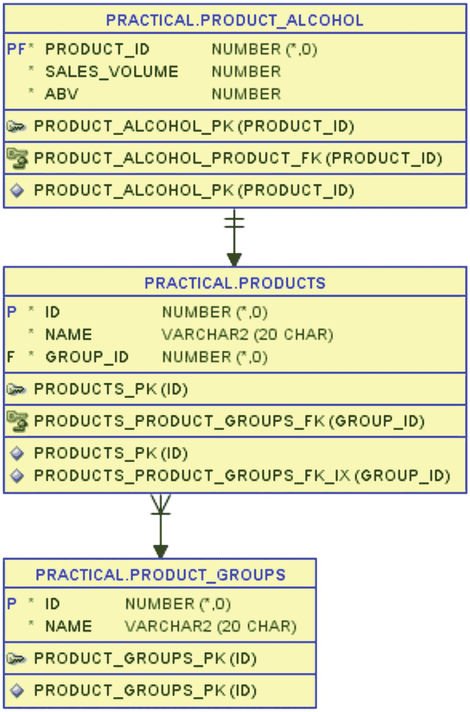

图 5-1
表 product_alcohol 包含啤酒的酒精计算数据

此表存储了每种啤酒在销售单位（即一瓶或一罐）中的体积（以毫升为单位）和酒精度（ABV，体积百分比）。在清单 5-1 中，我将展示产品组 142（即世涛啤酒——相对较烈且颜色非常深的啤酒）的数据。

```sql
SQL> select
2     p.id as p_id
3   , p.name
4   , pa.sales_volume as vol
5   , pa.abv
6  from products p
7  join product_alcohol pa
8     on pa.product_id = p.id
9  where p.group_id = 142
10  order by p.id;
清单 5-1
世涛产品组中啤酒的酒精数据
```

驯鹿燃料（Reindeer Fuel）是半升瓶装（500 毫升），但酒精度只有 6%；另外两种是标准的 0.33 升瓶装，但更烈：

```sql
P_ID  NAME              VOL  ABV
4040  Coalminers Sweat  330  8.5
4160  Reindeer Fuel     500  6
4280  Hoppy Crude Oil   330  7
```

这些数据可用于计算一瓶啤酒中含有多少纯酒精，这对于了解饮用一瓶这样的啤酒会使血液酒精浓度升高多少是必需的。


