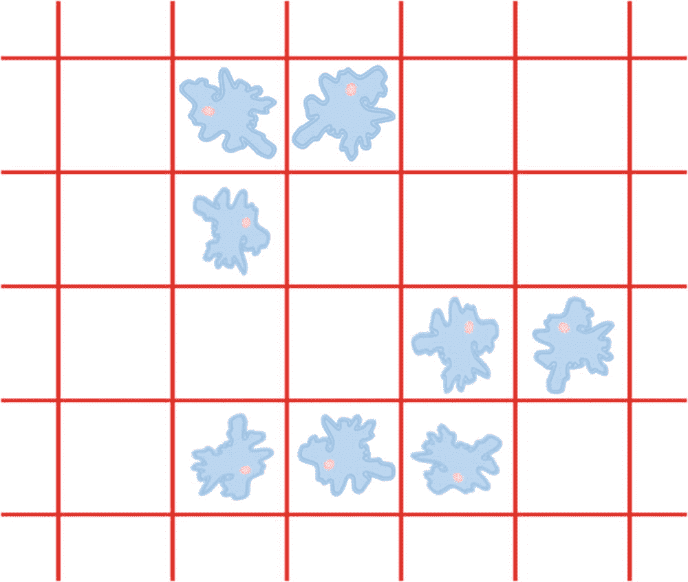
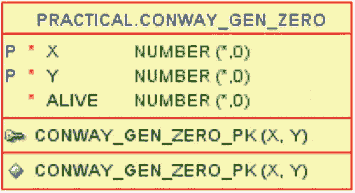

# 血液酒精浓度

好啤酒贸易公司必须遵守一项健康法规，要求每种啤酒都必须标明饮用该啤酒会导致的血液酒精浓度。由于该浓度对男性和女性不同，并且还取决于体重，因此必须同时显示体重 80 公斤的男性和体重 60 公斤的女性的数值。

血液酒精浓度必须计算为每毫升体液中的酒精克数，以百分比表示。这意味着 BAC 为 0.04 表示你体内的液体中有 0.04%是酒精克数。可以使用威德马克公式计算。

### 威德马克公式

毫升饮品量 * ABV/100 = 毫升酒精。毫升酒精 * 0.789（酒精比重）= 酒精克数。体重 * 1000 * 性别液体比率 = 体内毫升液体。（男性体液占 68%，女性占 55%。）100 * 酒精克数 / 体内毫升液体 = BAC。

将威德马克公式代入 SQL，我可以在代码清单 5-2 中计算所需的 BAC 值。

```sql
SQL> select
2     p.id as p_id
3   , p.name
4   , pa.sales_volume as vol
5   , pa.abv
6   , round(
7        100 * (pa.sales_volume * pa.abv / 100 * 0.789)
8         / (80 * 1000 * 0.68)
9      , 3
10     ) bac_m
11   , round(
12        100 * (pa.sales_volume * pa.abv / 100 * 0.789)
13         / (60 * 1000 * 0.55)
14      , 3
15     ) bac_f
16  from products p
17  join product_alcohol pa
18     on pa.product_id = p.id
19  where p.group_id = 142
20  order by p.id;
Listing 5-2
计算男性和女性的血液酒精浓度
```

第 6-10 行计算体重 80 公斤男性的 BAC，而第 11-15 行对体重 60 公斤的女性进行同样的计算。男性的体液更多（既因为性别也因为体重更大），因此酒精在他体内被稀释得更多，他的 BAC 也更低。

这两项计算给出了`bac_m`和`bac_f`两列，这正是好啤酒贸易公司需要在啤酒标签和包装上显示的两个数字：

```
P_ID  NAME              VOL  ABV  BAC_M  BAC_F
4040  Coalminers Sweat  330  8.5  0.041  0.067
4160  Reindeer Fuel     500  6    0.044  0.072
4280  Hoppy Crude Oil   330  7    0.034  0.055
```

你可以看到，例如，如果你的国家是众多将驾驶法定限值设为 0.05% BAC 的国家之一（有些国家更倾向于用千分比而非百分比显示，因此是 0.5‰），那么所有这些啤酒，如果一个 60 公斤的女性喝完一整瓶后开车，都会导致她因酒驾而收到罚单，而 80 公斤的男性则会低于限值。

**注意**

这是用于说明 SQL 中编码公式的示例数据。实际的 BAC 会因个体身体和新陈代谢的更详细因素而异，因此不应以此作为判断喝几瓶啤酒后是否可以合法驾车的依据。请仅将这些公式作为学习 SQL 的示例——我对任何罚单概不负责，并敦促你饮酒要负责任。

无论如何，作为一名开发者，你显然能看出，我应该将该公式放入一个函数中，而不是在查询中用略有不同的数字重复两次相同的代码。

### 使用 PRAGMA UDF 的函数

因此，首先在代码清单 5-3 中，我将为 BAC 计算的威德马克公式创建一个常规（嗯，几乎是常规）的 PL/SQL 函数。虽然这对本演示无关紧要，但我会遵循最佳实践，将函数放在包中而不是独立函数中，因此我决定创建一个名为`formulas`的包来存放此类函数。

```sql
SQL> create or replace package formulas
2  is
3     function bac (
4        p_volume in number
5      , p_abv    in number
6      , p_weight in number
7      , p_gender in varchar2
8     ) return number deterministic;
9  end formulas;
10  /
Package FORMULAS compiled
SQL> create or replace package body formulas
2  is
3     function bac (
4        p_volume in number
5      , p_abv    in number
6      , p_weight in number
7      , p_gender in varchar2
8     ) return number deterministic
9     is
10        PRAGMA UDF;
11     begin
12        return round(
13           100 * (p_volume * p_abv / 100 * 0.789)
14            / (p_weight * 1000 * case p_gender
15                                    when 'M' then 0.68
16                                    when 'F' then 0.55
17                                 end)
18         , 3
19        );
20     end bac;
21  end formulas;
22  /
Package Body FORMULAS compiled
Listing 5-3
创建带有 bac 函数的公式包
```

一切都非常直接，除了包体中的第 10 行。`UDF pragma`（用户定义函数）自 12.1 版本起可用，它告诉编译器，我打算*主要*从 SQL 调用此函数，而不是从 PL/SQL 调用。

如果我创建函数时*没有*使用`PRAGMA UDF`，它将以正常方式编译，在函数被调用时导致正常的上下文切换。如果它*带有*`PRAGMA UDF`编译，则会以不同的方式编译，这有可能减少上下文切换的开销。能减少多少开销（如果有的话）作为开发者我无法控制。我稍后会详细解释，但首先让我展示该函数的用法。

使用该函数与我使用普通函数完全相同，因此在代码清单 5-4 中，我通过调用包函数来查询 BAC。

```sql
SQL> select
2     p.id as p_id
3   , p.name
4   , pa.sales_volume as vol
5   , pa.abv
6   , formulas.bac(pa.sales_volume, pa.abv, 80, 'M') bac_m
7   , formulas.bac(pa.sales_volume, pa.abv, 60, 'F') bac_f
8  from products p
9  join product_alcohol pa
10     on pa.product_id = p.id
11  where p.group_id = 142
12  order by p.id;
Listing 5-4
使用打包的公式查询男性和女性的 BAC
```

它给出了与代码清单 5-2 相同的输出，这并不意外。

使其非常易于使用的原因是，我像往常一样编写函数，但我知道该函数将主要从 SQL 使用，而较少（或从不）从 PL/SQL 使用，我只需添加`PRAGMA UDF`，编译器就会处理其余的事情，可能为我节省一些上下文切换的运行时开销。

`PRAGMA UDF`可能带来多少好处取决于几个因素。如果 PL/SQL 函数内部的代码只包含*可以*直接用 SQL 表达的内容（如`formulas.bac`函数），好处可能更大，而包含大量 PL/SQL 功能或内联 SQL 的更复杂函数可能获益较少或没有好处。你应该测试你的用例，但一般的经验法则是，当你*知道*函数几乎只从 SQL 使用时，使用该编译指示不会有害处，甚至可能有点帮助。

当我用`PRAGMA UDF`编译函数时，我要求编译器尝试使该函数从 SQL 调用更廉价（如果可能的话）。这也意味着，我不在乎它*可能*从 PL/SQL 调用会稍微贵一点。同样取决于许多因素，这里可能会有轻微的负面影响，因为`PRAGMA UDF`函数可能期望接收 SQL 引擎传递的数据格式。这种影响可能几乎察觉不到，也可能稍微明显一些——这取决于实际情况。

但我有另一个替代使用`PRAGMA UDF`编译函数的方法——我可以跳过在数据库中创建存储函数，直接在查询本身中指定我的函数。


### 在 `WITH` 子句中使用函数

版本 12.1 还允许我将 PL/SQL 函数（以及过程，但后者很少使用）代码直接放在查询的 `with` 子句中，如代码清单 5-5 所示。

```
SQL> with
2     function bac (
3        p_volume in number
4      , p_abv    in number
5      , p_weight in number
6      , p_gender in varchar2
7     ) return number deterministic
8     is
9     begin
10        return round(
11           100 * (p_volume * p_abv / 100 * 0.789)
12            / (p_weight * 1000 * case p_gender
13                                    when 'M' then 0.68
14                                    when 'F' then 0.55
15                                 end)
16         , 3
17        );
18     end;
19  select
20     p.id as p_id
21   , p.name
22   , pa.sales_volume as vol
23   , pa.abv
24   , bac(pa.sales_volume, pa.abv, 80, 'M') bac_m
25   , bac(pa.sales_volume, pa.abv, 60, 'F') bac_f
26  from products p
27  join product_alcohol pa
28     on pa.product_id = p.id
29  where p.group_id = 142
30  order by p.id
31  /
代码清单 5-5
在 with 子句中使用函数查询 BAC
```

首先是关键字 `with`，和第 3 章中一样。但接下来第 2-18 行不是子查询，而是包含了 `bac` 函数的代码，就像我之前放在 `formulas` 包里那样。定义好的函数随后就可以在 SQL 中调用，如第 24-25 行所示。此查询的输出结果也与代码清单 5-2 相同。

`with` 子句中的函数的编译方式与 `PRAGMA UDF` 函数相同，但它不会作为 PL/SQL 对象存储在数据字典中；它只会随查询一起保存在共享池中，并且*不能*从任何其他 SQL 或 PL/SQL 语句中调用。

**注意**

代码清单 5-5 的第 31 行以斜杠 (`/`) 而不是分号 (`;`) 结束查询。一旦解析器检测到 `with` 子句中有 PL/SQL 代码，它似乎（目前）无法检测分号是语句的结束还是 PL/SQL 代码的一部分。未来版本可能会改变这一点，但目前的变通方法是使用斜杠，以便 sqlcl 或 SQL*Plus 能够找到语句的结尾。

可以在单个 `with` 子句中拥有多个函数。例如，我可能决定重构我的代码，并创建两个辅助函数来计算酒精克数和体液克数（与毫升数相同），然后在 `bac` 函数内部使用这两个函数。我可以在代码清单 5-6 中实现这一点，该清单可能更长，但也更加自文档化。

```
SQL> with
2     function gram_alcohol (
3        p_volume in number
4      , p_abv    in number
5     ) return number deterministic
6     is
7     begin
8        return p_volume * p_abv / 100 * 0.789;
9     end;
10     function gram_body_fluid (
11        p_weight in number
12      , p_gender in varchar2
13     ) return number deterministic
14     is
15     begin
16        return p_weight * 1000 * case p_gender
17                                    when 'M' then 0.68
18                                    when 'F' then 0.55
19                                 end;
20     end;
21     function bac (
22        p_volume in number
23      , p_abv    in number
24      , p_weight in number
25      , p_gender in varchar2
26     ) return number deterministic
27     is
28     begin
29        return round(
30           100 * gram_alcohol(p_volume, p_abv)
31            / gram_body_fluid(p_weight, p_gender)
32         , 3
33        );
34     end;
35  select
...
代码清单 5-6
在一个 with 子句中包含多个函数
```

多个函数对输出结果没有影响——结果仍然相同。

但是，无论我使用单个函数还是多个函数，我仍然需要做一个决定。如果我想在多个 SQL 语句中使用一个函数，我必须创建一个存储函数（带或不带 `PRAGMA UDF`），这一点毋庸置疑。但除此之外，为什么我还要把它放在 `with` 子句中，而不是使用 `PRAGMA UDF` 函数呢？

一个原因可能是你无法创建存储函数或过程的情况，例如在只读数据库中，或者当你构建一些工具语句，希望在不为客户安装代码的数据库中运行时。

另一个原因可能是，如果函数在某些罕见情况下执行动态 SQL，而这些 SQL 由于某种原因无法使用绑定变量，只能使用字符串拼接的 SQL。将函数放在查询中，你可以完全控制函数被调用时的参数，从而可以更好地防范 SQL 注入。该函数无法从其他地方调用。

第三个原因可能是功能非常特定于单一用途，你可以选择不同的方式来封装你的代码。

#### 封装在视图中

（在此应用程序中）可以说，血液酒精浓度计算在 `product_alcohol` 表的一行上下文之外是没有意义的。如果我使用的是面向对象编程，我会说这是一个*成员*方法，而不是*静态*方法。

我可以通过创建代码清单 5-7 中的视图来实现类似的效果。

```
SQL> create view product_alcohol_bac
2  as
3  with
4     function gram_alcohol (
...
12     function gram_body_fluid (
...
23     function bac (
...
37  select
38     pa.product_id
39   , pa.sales_volume
40   , pa.abv
41   , bac(pa.sales_volume, pa.abv, 80, 'M') bac_m
42   , bac(pa.sales_volume, pa.abv, 60, 'F') bac_f
43  from product_alcohol pa
44  /
视图 PRODUCT_ALCOHOL_BAC 已创建。
代码清单 5-7
创建包含 BAC 计算的视图
```

在此视图中，我使用了带有代码清单 5-6 中三个函数的 `with` 子句。第 37-43 行的查询本身仅使用 `product_alcohol` 表，选择该表的所有列以及两个计算出的 `bac_m` 和 `bac_f` 列。

现在，我可以创建一个查询，将 `products` 表与 `product_alcohol_bac` 视图连接起来，如代码清单 5-8 所示，直接简单地获取所需数据。

```
SQL> select
2     p.id as p_id
3   , p.name
4   , pab.sales_volume as vol
5   , pab.abv
6   , pab.bac_m
7   , pab.bac_f
8  from products p
9  join product_alcohol_bac pab
10     on pab.product_id = p.id
11  where p.group_id = 142
12  order by p.id;
代码清单 5-8
使用视图查询 BAC 数据
```

输出结果再次相同：

```
P_ID  NAME              VOL  ABV  BAC_M  BAC_F
4040  Coalminers Sweat  330  8.5  0.041  0.067
4160  Reindeer Fuel     500  6    0.044  0.072
4280  Hoppy Crude Oil   330  7    0.034  0.055
```

这种方法使我能够通过查询视图而不是表，在其他 SQL 语句中重用该逻辑，同时仍保持逻辑只存在于一个地方：视图定义。

我也可以通过让视图调用打包函数 `formulas.bac` 来实现相同的效果，而不是在视图中定义函数，但如果该功能*如此*特定，以至于仅与此特定查询/视图定义相关，那么将所有内容保持在一起，并且不让数据字典被那些确实不应在此特定 SQL 之外调用的存储函数弄乱，可能是一件好事。


### 经验教训

尽管本书的主题并非 PL/SQL 本身，但能够比以往更紧密地将 PL/SQL 集成到 SQL 中，是作为 SQL 开发人员的你应当了解的一项功能。以本章为例，你现在应该：

*   思考某个函数是否主要从 SQL 中使用，从而可能受益于在其定义中添加 `PRAGMA UDF`。
*   了解如何在 SQL 语句的 `with` 子句中嵌入“一次性”函数。
*   考虑某些非常具体的功能，是将其封装在使用 `with` 子句函数的视图中，还是使用普通的存储函数更好。

对于日常的大部分开发工作，你可能主要需要考虑 `PRAGMA UDF`，但在无法安装存储过程和函数的情况下，`with` 子句技术可能非常有用。

## 6. 使用多维数据进行迭代计算

除了我在第 4 章展示的递归和迭代之外，你不会找到太多使用 `model` 子句的真实示例。递归子查询因子化在版本 11 中引入，但从版本 10 开始，你就可以使用 `model` 子句进行递归。然而，`model` 子句的真正强大之处在于，它能够以类似数组的方式处理多维数据，构建类似于电子表格工作方式的公式。

Oracle 中的嵌套表类型是单维的（索引），其“单元格”可以是标量或结构化类型。如果你有多维数据，你可以嵌套嵌套表类型，或者使用纯 SQL——对于某些类型的计算，这两种方法都可能变得非常复杂。在 `model` 子句中，你某种意义上是在处理可以具有多个维度，并且每个单元格可以包含多个度量值（值）的数组，并且你拥有一套非常紧凑的语法来寻址多个单元格。

`model` 子句并非实现所有功能的显而易见的选择，但我会展示一个非常适合且同时使用多维度和迭代的例子。这个例子本身可能不是最有用的，但它很好地展示了你可以考虑使用 `model` 子句的情况。

### 康威的生命游戏

1970 年，英国数学家约翰·霍顿·康威设计了生命游戏（也常简称为“生命”）。它模拟一个二维网格中的细胞，根据网格中的拥挤程度，模仿细胞如何世代生存与死亡。你可以在图 6-1 中看到细胞在网格中的增殖情况。


*图 6-1：康威的生命游戏是关于网格中细胞生死的问题*

其思路是从一组“活”细胞（被活细胞生物占据的网格单元）开始，然后观察种群如何随时间推移，一代一代地演化。

演化遵循以下规则：

*   任何活细胞，如果其活邻居少于两个，则死亡，如同因人口过少而死。
*   任何活细胞，如果其活邻居有两个或三个，则存活到下一代。
*   任何活细胞，如果其活邻居超过三个，则死亡，如同因人口过剩而死。
*   任何死细胞，如果其活邻居恰好有三个，则变成活细胞，如同通过繁殖产生。

因此，为了找出下一代中哪些细胞将存活，你需要计算这一代中每个细胞的活邻居数量，并应用这些规则。邻居定义为围绕一个细胞的八个细胞（水平、垂直或对角线方向，相隔一个细胞）。

最常见的情况是，你会看到生命游戏在过程式语言中通过迭代实现——我将向你展示如何用一条包含 `model` 子句的 SQL 语句来实现它。

> **注意**
>
> 你可以在维基百科上找到关于生命游戏的更详细解释：[`en.wikipedia.org/wiki/Conway%27s_Game_of_Life`](https://en.wikipedia.org/wiki/Conway%2527s_Game_of_Life)。

## 使用模型子句计算活跃邻居数

我创建了一个名为 `conway_gen_zero` 的表格，用于存放网格中所有单元格以及它们在第零代是否包含活跃单元格。图 6-2 显示，该表有 `x` 和 `y` 两列代表每个网格位置，以及 `alive` 列，其中用 1 表示活跃单元格，0 表示死亡（空）单元格。


图 6-2：第零代网格内容表格

首先，在清单 6-1 中，我用一个 10x10 的网格填充此表格，其中网格中部按照图 6-1 所示的模式有一些活跃单元格。

```
SQL> insert into conway_gen_zero (x, y, alive)
2  select * from (
3     with numbers as (
4        select level as n from dual
5        connect by level <= 10
6     ), grid as (
7        select
8           x.n as x
9         , y.n as y
10        from numbers x
11        cross join numbers y
12     ), start_cells as (
13        select  4 x,  4 y from dual union all
14        select  5 x,  4 y from dual union all
15        select  4 x,  5 y from dual union all
16        select  6 x,  6 y from dual union all
17        select  7 x,  6 y from dual union all
18        select  4 x,  7 y from dual union all
19        select  5 x,  7 y from dual union all
20        select  6 x,  7 y from dual
21     )
22     select
23        g.x
24      , g.y
25      , nvl2(sc.x, 1, 0) as alive
26     from grid g
27     left outer join start_cells sc
28        on  sc.x = g.x
29        and sc.y = g.y
30  );
100 rows inserted.
清单 6-1：创建一个 10x10 的第零代种群
```

我使用第 3 章的技术在多个 `with` 子句中构建此查询：

*   第 4-5 行的 `numbers` 简单地给我提供了编号为 1-10 的十行数据。
*   第 7-11 行的 `grid` 通过两次使用 `numbers` 进行笛卡尔连接，生成了 100 行数据，包含 10x10 网格的所有 (x, y) 组合。
*   第 13-20 行的 `start_cells` 生成了 8 行数据，包含那些在第零代（初始种群）中存活的单元格的 (x, y) 坐标。
*   在第 22-29 行，`grid` 左连接到 `start_cells`，因此结果是 `grid` 的 100 行数据，第 25 行计算出如果单元格存在于 `start_cells` 中则为 1（活跃），否则为 0（死亡）。

我的第零代种群已准备就绪，在清单 6-2 中，我使用 `X` 表示活跃单元格，空格表示空单元格来展示种群，这样你可以直观地看到这就是图 6-1 的单元格模式。

```
SQL> select
2     listagg(
3        case alive
4           when 1 then 'X'
5           when 0 then ' '
6        end
7     ) within group (
8        order by x
9     ) as cells
10  from conway_gen_zero
11  group by y
12  order by y;
清单 6-2：可视化第零代
```

第 2-9 行的 `listagg`（更多内容请参阅第 10 章）将包含 `X` 和空格的字符串按列 `x` 的顺序进行聚合，为每一列 `y` 生成结果，给出以下输出：

```
CELLS

XX
X
XX
XXX
```

第零代看起来不错，是时候在清单 6-3 中使用 `model` 子句来计算每个单元格有多少个活跃邻居了。

```
SQL> select *
2  from conway_gen_zero
3  model
4  dimension by (
5     x, y
6  )
7  measures (
8     alive
9   , 0 as sum_alive
10   , 0 as nb_alive
11  )
12  ignore nav
13  rules
14  (
15     sum_alive[any, any] =
16        sum(alive)[
17           x between cv() - 1 and cv() + 1
18         , y between cv() - 1 and cv() + 1
19        ]
20   , nb_alive[any, any] =
21        sum_alive[cv(), cv()] - alive[cv(), cv()]
22  )
23  order by x, y;
清单 6-3：使用模型子句计算活跃邻居数
```

模型子句由一系列子句构建而成：

*   第 4-6 行的 `dimension by` 指明了哪些列用作维度——或者，如果你愿意，可以理解为多维数组中的索引。
*   第 7-11 行的 `measures` 是数组中每个单元格的属性。这里我创建了三个度量——一个就是表中的 `alive` 列；另外两个表中不存在，被初始化为零。
*   然后可以是 `model` 子句的各种选项——在第 12 行，我使用了 `ignore nav`，它简单地表明当公式试图使用某个单元格中度量的值时，任何空值或不存在的值都应被视为取决于数据类型的默认值（此处为数字零）。
*   从第 13 行开始的 `rules` 是一组公式，指明了我希望如何计算每个单元格中度量的值。我这里有两个公式，分别对应表中不存在的两个度量。
*   第 15-19 行计算 `sum_alive`。使用 `[any, any]` 我要求计算网格中所有单元格的此度量值。当为特定单元格计算公式时，函数 `cv()` 给出该特定单元格的维度值，我用它来定义一个 3x3 的网格，并计算该网格中 9 个单元格的 `alive` 度量的总和。例如，对于单元格 [3, 5]，总和将计算在 `x` 维度介于 2 到 4 之间且 `y` 维度介于 4 到 6 之间的单元格上。
*   第 20-21 行计算 `nb_alive`，即“活跃邻居数”。前面计算的 `sum_alive` 是包含该单元格自身的 3x3 网格中 9 个单元格的活跃细胞数。因此，通过减去单元格本身的 `alive` 值，我就可以得到活跃邻居的数量。

清单 6-3 中的模型子句看起来与普通 SQL 大不相同。这是一种非常不同的数据访问方式，也是对数据指定子集应用公式的方式，更类似于许多过程语言中的数组或电子表格中的公式，只不过是以 SQL 标志性的更声明性的方式呈现。

但是，我也可以使用标量子查询和内联视图，在普通 SQL 中完成与清单 6-3 相同的工作。清单 6-4 提供了一个例子。

```
SQL> select
2     x
3   , y
4   , alive
5   , sum_alive
6   , sum_alive - alive as nb_alive
7  from (
8     select
9        x
10      , y
11      , alive
12      , (
13           select sum(gz2.alive)
14           from conway_gen_zero gz2
15           where gz2.x between gz.x - 1 and gz.x + 1
16           and   gz2.y between gz.y - 1 and gz.y + 1
17        ) as sum_alive
18     from conway_gen_zero gz
19  )
20  order by x, y;
清单 6-4：使用标量子查询计算活跃邻居数
```

清单 6-3 和清单 6-4 产生相同的输出——网格中的所有单元格以及两个活跃计数：

```
X   Y 活跃度  活跃总数   活跃邻居数
--- --- ----- ---------- ----------
1   1     0          0          0
1   2     0          0          0
1   3     0          0          0
...
5   5     0          4          4
5   6     0          5          5
5   7     1          4          3
5   8     0          3          3
5   9     0          0          0
5  10     0          0          0
6   1     0          0          0
6   2     0          0          0
6   3     0          1          1
6   4     0          1          1
6   5     0          3          3
...
10   9     0          0          0
10  10     0          0          0
100 rows selected.
```


那么，为什么我选择使用 `model` 子句而非纯 SQL 来解决生命游戏呢？原因之一在于，标量子查询意味着需要对相同数据进行大量重复读取。通常，我会寻求使用分析函数来避免这种重复的数据访问，但这里的问题在于，我需要对*两个*维度上的一个范围进行求和。例如，如果我尝试使用带有 `range between 1 preceding and 1 following` 子句的分析 `sum`，我只能在 `x` 或 `y` 维度中的一个上进行，而无法同时在两者上进行。

使用 `model` 子句解决生命游戏的另一个原因，会在后续我开始在游戏中对更多世代进行迭代计算时变得清晰，因为用纯 SQL 实现这一点远比用 `model` 子句复杂。请继续阅读，你就会明白我的意思。

然而，在那之前，我想使用列表 6-2 中的 `listagg` 技术来可视化计算结果。因此在列表 6-5 中，我直接将列表 6-3 或 6-4 的 SQL 放入一个 `with` 子句中，然后查询该子句的结果，而不是直接查询表。

```
SQL> with conway as (
...
/* 列表 6-3 或 6-4 的内容 */
...
24  )
25  select
26     listagg(
27        case alive
28           when 1 then 'X'
29           when 0 then ' '
30        end
31     ) within group (
32        order by x
33     ) cells
34   , listagg(sum_alive) within group (order by x) sum_alives
35   , listagg(nb_alive ) within group (order by x) nb_alives
36  from conway
37  group by y
38  order by y;
Listing 6-5
以网格形式显示计数
```

第 26-33 行与列表 6-2 中的完全一致，然后我添加了第 34 和 35 行来可视化度量值 `sum_alive` 和 `nb_alive` 的内容，这样做是可行的，因为其值始终是个位数。`sum_alive` 是我在 3x3 网格上计算的，因此最大值为 9，而 `nb_alive` 的最大值因此为 8。

```
CELLS      SUM_ALIVES NB_ALIVES
---------- ---------- ----------
0000000000 0000000000
0000000000 0000000000
0012210000 0012210000
XX      0023310000 0022210000
X       0023432100 0022432100
XX    0023543100 0023532100
XXX     0012443100 0011333100
0012321000 0012321000
0000000000 0000000000
0000000000 0000000000
```

你可以看到，在网格中 `cells` 为 `X` 的那些位置上，`nb_alives` 中的数字比 `sum_alive` 小 1 —— 正如预期的那样。

到目前为止，我只为第零代建模并计算了邻居数量。现在，是时候利用该邻居数量来计算下一代中哪些位置会有存活细胞，计算下一代的邻居数量，然后为之后的一代又一代……迭代地重复这个过程。

### 迭代世代

在本章开头，我陈述了康威生命游戏的四条规则。它们很好地用于描述模拟细胞生物种群的“生命”。但对于在编程语言中实现这些规则，审视规则的逻辑并以下列方式重新表述可能会有所帮助：

*   任何具有恰好两个存活邻居的细胞，在下一代中保持其状态（存活或死亡）。
*   任何具有恰好三个存活邻居的细胞，在下一代中将是存活的（无论它在当前代是存活还是死亡）。
*   任何其他细胞在下一代中将是死亡的。

这些规则的结果与原始四条规则相同，但对程序员有一个巨大优势：可以轻松地使用 `if` 或 `case` 结构，基于当前代的邻居数量是二、三还是其他，来判定一个细胞在下一代是存活还是死亡。因此，我将在列表 6-6 中这样做。

```
SQL> with conway as (
2     select *
3     from conway_gen_zero
4     model
5     dimension by (
6        0 as generation
7      , x, y
8     )
9     measures (
10        alive
11      , 0 as sum_alive
12      , 0 as nb_alive
13     )
14     ignore nav
15     rules upsert all iterate (2)
16     (
17        sum_alive[iteration_number, any, any] =
18           sum(alive)[
19              generation = iteration_number
20            , x between cv() - 1 and cv() + 1
21            , y between cv() - 1 and cv() + 1
22           ]
23      , nb_alive[iteration_number, any, any] =
24           sum_alive[iteration_number, cv(), cv()]
25             - alive[iteration_number, cv(), cv()]
26      , alive[iteration_number + 1, any, any] =
27           case nb_alive[iteration_number, cv(), cv()]
28              when 2 then alive[iteration_number, cv(), cv()]
29              when 3 then 1
30              else 0
31           end
32     )
33  )
34  select
35     generation
36   , listagg(
37        case alive
38           when 1 then 'X'
39           when 0 then ' '
40        end
41     ) within group (
42        order by x
43     ) cells
44   , listagg(sum_alive) within group (order by x) sum_alives
45   , listagg(nb_alive ) within group (order by x) nb_alives
46  from conway
47  group by generation, y
48  order by generation, y;
Listing 6-6
迭代两代
```

与列表 6-3 相比，我添加了一些内容来处理细胞的世代：

*   在第 6 行，我添加了另一个维度 `generation`，总共三个维度。这个维度在表中不存在，所以我用值零对其进行初始化。这意味着表中的 100 行在多维数组中都将 `generation` 设为零，而 `x` 和 `y` 值来自表。
*   在第 15 行的规则子句中，我添加了 `upsert all`，这表示如果我为一个现有单元格设置值，它将被更新；但如果我为一个不存在的单元格设置值，它将被创建。这是必要的，因为我将为每次迭代的每一代创建 100 个新单元格。
*   在第 15 行，我还添加了 `iterate (2)`，这意味着规则将被应用两次。
*   由于我添加了一个维度，我必须扩展在 `sum_alive` 和 `nb_alive` 的公式中用于单元格寻址的索引（第 17-25 行）。对于 `generation` 维度，我使用 `iteration_number` 的值，这是一个从零开始并在每次迭代时递增 1 的数字。因此，`sum_alive` 和 `nb_alive` 是为与迭代匹配的代计算的，从第零代开始。


