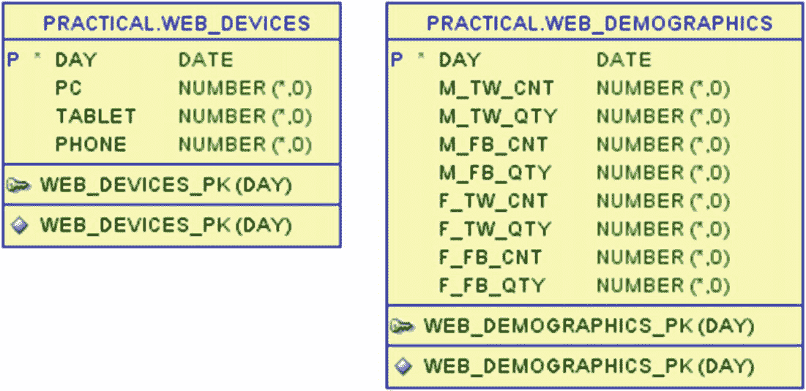
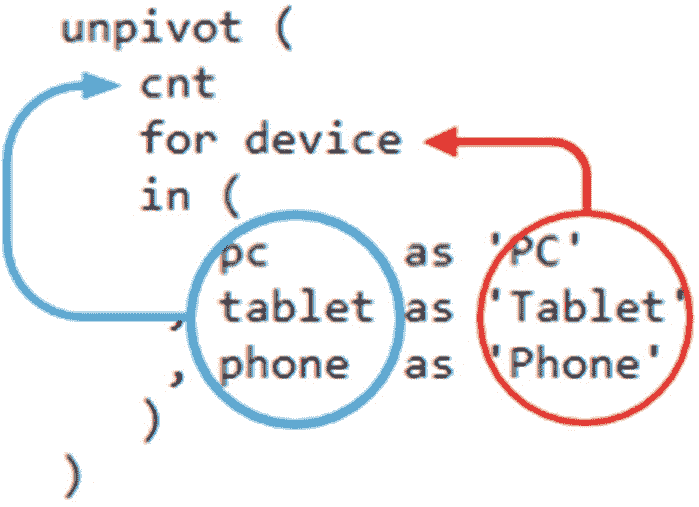
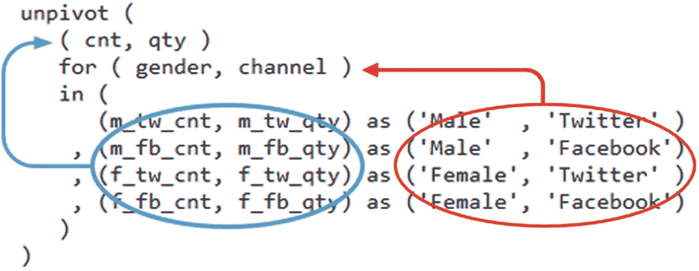
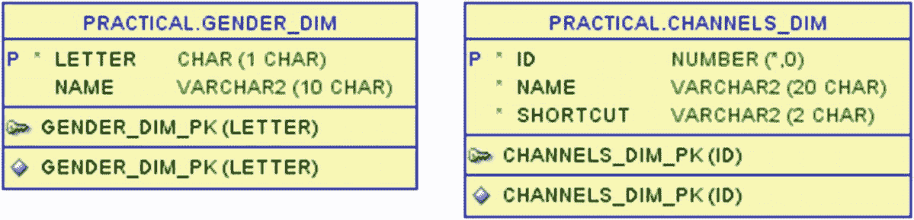
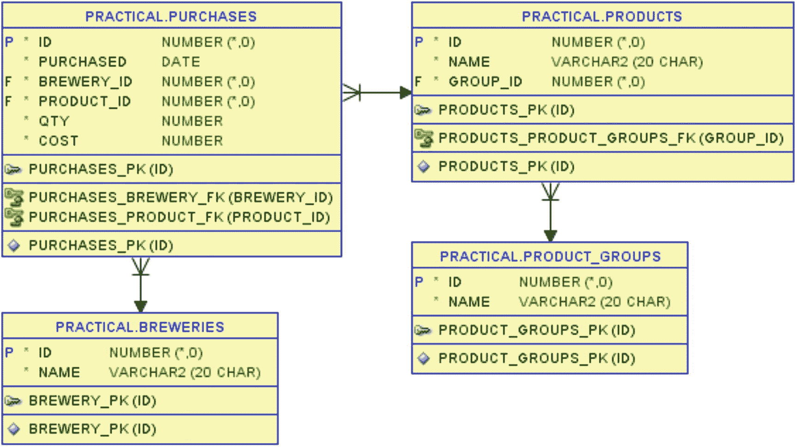
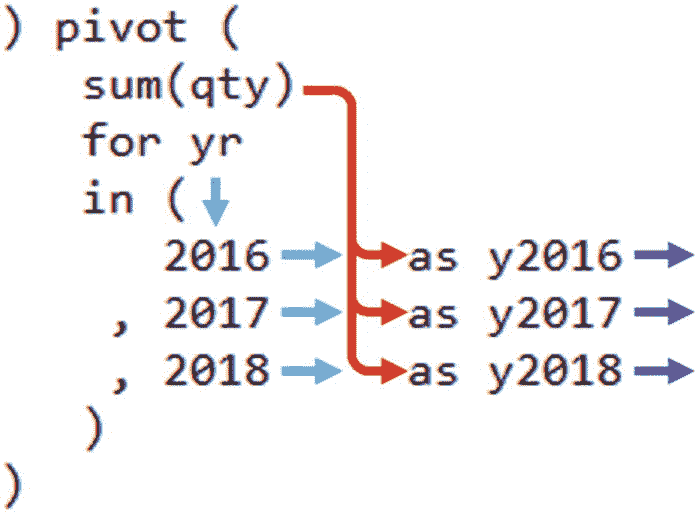
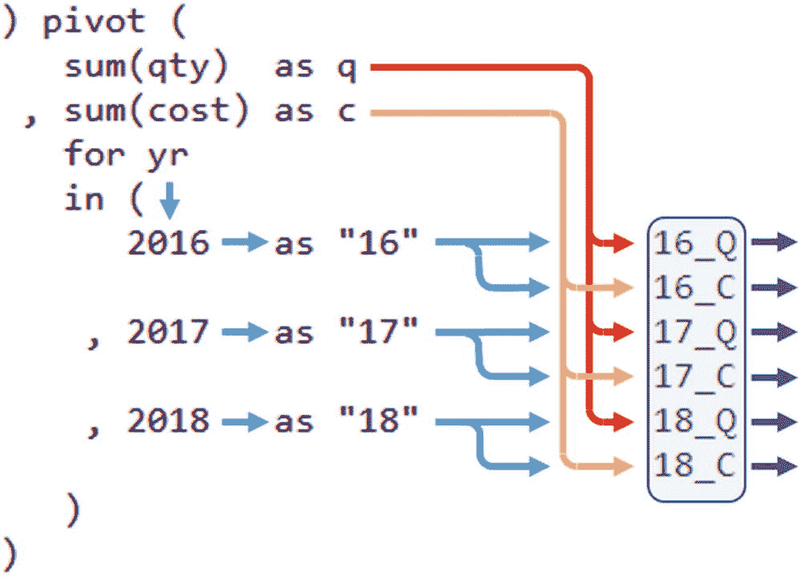
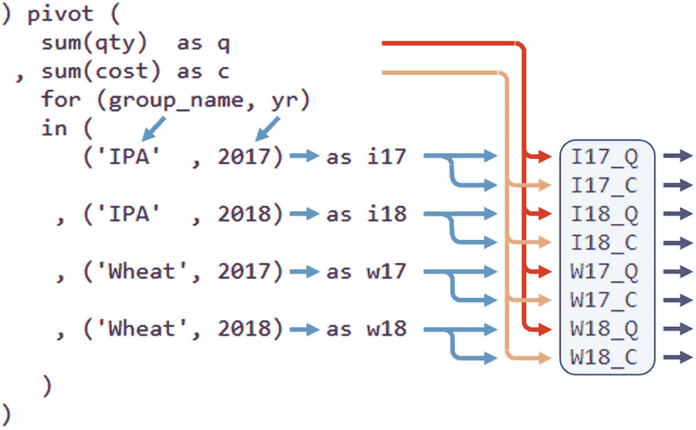
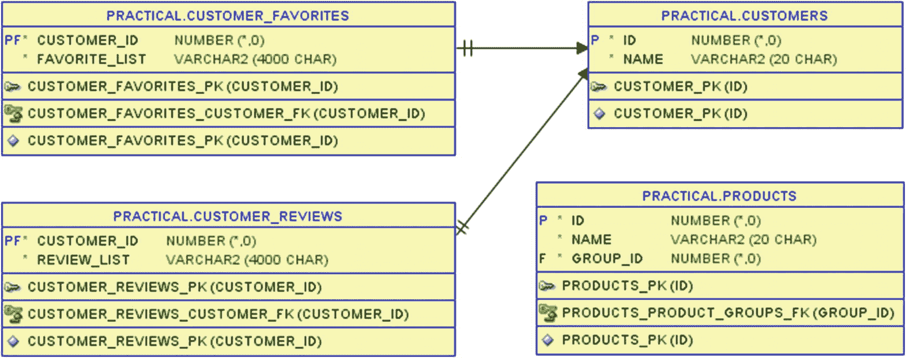
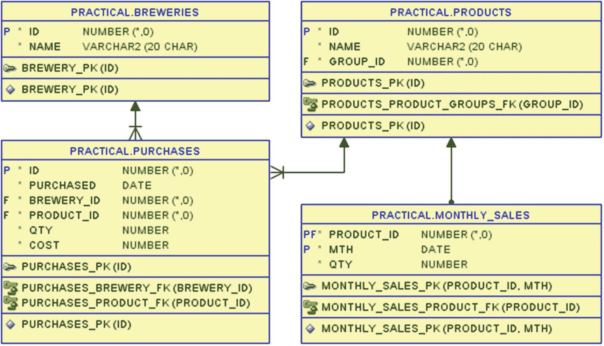

# 康威生命游戏与 SQL 模型子句

在代码的第 26-31 行，我应用了康威的三条改写规则。在这里，我根据当前代（`this generation`）中 `nb_alive` 的值，使用 `case` 结构来设置 `next` 代中 `alive` 的值。这就是需要 `upsert all` 的地方，因为我正在创建代数值高一的新单元格。

总的来说，代码清单 [6-6] 产生以下输出：

```
GENERATION CELLS      SUM_ALIVES NB_ALIVES
---------- ---------- ---------- ----------
0            0000000000 0000000000
0            0000000000 0000000000
0            0012210000 0012210000
0    XX      0023310000 0022210000
0    X       0023432100 0022432100
0      XX    0023543100 0023532100
0    XXX     0012443100 0011333100
0            0012321000 0012321000
0            0000000000 0000000000
0            0000000000 0000000000
1            0000000000 0000000000
1            0000000000 0000000000
1            0012210000 0012210000
1    XX      0023421000 0022321000
1    X X     0034643100 0033633100
1    X XX    0023665200 0022654200
1     XXX    0013564200 0013453200
1     X      0002342100 0002242100
1            0001110000 0001110000
1            0000000000 0000000000

2    XX
2   XX XX
2    X
2    X  X
2     X

```

第零代中 `cells`（度量 `alive`）的内容直接来自表格。

在第一次迭代（`iteration_number` 为 `0`）中，计算第零代的 `sum_alive` 和 `nb_alive`，并计算第一代的 `cells`（`alive`）。

在第二次迭代（`iteration_number` 为 `1`）中，计算第一代的 `sum_alive` 和 `nb_alive`，并计算第二代的 `cells`（`alive`）。然后我不再迭代，所以第二代的 `sum_alive` 和 `nb_alive` 未被计算。

使用普通 SQL 来进行这种跨多代的迭代会困难得多。结合使用类似代码清单 [6-4] 的技术与递归子查询因子分解（第 4 章），可能可以实现，但不会很漂亮，而且很可能性能不佳。

像代码清单 [6-6] 那样使用模型子句来做这件事实际上是相当声明式的，但这是另一种思维方式。代码清单 [6-6] 可能看起来有点长，但一旦我开发完成，我可以看到我实际上不需要显式计算中间值 `sum_alive` 和 `nb_alive`。我可以将这些计算直接放入 `alive` 的计算中，从而在代码清单 [6-7] 中形成一个简化的查询。

```
SQL> with conway as (
2     select *
3     from conway_gen_zero
4     model
5     dimension by (
6        0 as generation
7      , x, y
8     )
9     measures (
10        alive
11     )
12     ignore nav
13     rules upsert all iterate (2)
14     (
15        alive[iteration_number + 1, any, any] =
16           case sum(alive)[
17                    generation = iteration_number,
18                    x between cv() - 1 and cv() + 1,
19                    y between cv() - 1 and cv() + 1
20                ] - alive[iteration_number, cv(), cv()]
21              when 2 then alive[iteration_number, cv(), cv()]
22              when 3 then 1
23              else 0
24           end
25     )
26  )
27  select
28     generation
29   , listagg(
30        case alive
31           when 1 then 'X'
32           when 0 then ' '
33        end
34     ) within group (
35        order by x
36     ) cells
37  from conway
38  group by generation, y
39  order by generation, y;
代码清单 6-7
简化的查询
```

简化后的查询当然不再显示邻居数量，但我不再需要它们了；它们主要在代码开发过程中有用：

```
GENERATION CELLS
---------- ----------

0    XX
0    X
0      XX
0    XXX

1    XX
1    X X
1    X XX
1     XXX
1     X

2    XX
2   XX XX
2    X
2    X  X
2     X

```

现在我可以随意尝试，例如生成 25 代：

```
13     rules upsert all iterate (25)
GENERATION CELLS
---------- ----------
...
25    X   X X
25   XXXX
25  X  XX  XX
25 X X   XXX
25 X X X  XX
25 X    X X
25 X XX   X
25  X    X  X
25        XXX
25         X
260 rows selected.
```

我可以看到活细胞已经扩散到我整个 10x10 的网格上，那么如果我运行 50 代，它会被完全填满吗？

```
13     rules upsert all iterate (50)
GENERATION CELLS
---------- ----------
...

50         XX
50         XX

510 rows selected.
```

嗯，没有。从大约第 40 代开始，种群数量开始减少，从第 46 代开始，只剩下四个活细胞，形成一个稳定的模式，并将永远保持这样。部分原因是我的网格太小且有限——理论上，生命游戏应该运行在无限的网格上。

为了结束关于生命游戏的探索，代码清单 [6-8] 在一个 6x6 的网格上放置了一个不同的第零代。这个新的起点给我们带来了一个振荡的游戏，在运行迭代时看到它很有趣。

```
SQL> truncate table conway_gen_zero;
Table CONWAY_GEN_ZERO truncated.
SQL> insert into conway_gen_zero (x, y, alive)
2  select * from (
3     with numbers as (
4        select level as n from dual
5        connect by level <= 6
6     ), grid as (
7        select
8           x.n as x
9         , y.n as y
10        from numbers x
11        cross join numbers y
12     ), start_cells as (
13        select  4 x,  2 y from dual union all
14        select  2 x,  3 y from dual union all
15        select  5 x,  3 y from dual union all
16        select  2 x,  4 y from dual union all
17        select  5 x,  4 y from dual union all
18        select  3 x,  5 y from dual
19     )
20     select
21        g.x
22      , g.y
23      , nvl2(sc.x, 1, 0) as alive
24     from grid g
25     left outer join start_cells sc
26        on  sc.x = g.x
27        and sc.y = g.y
28  );
36 rows inserted.
代码清单 6-8
蟾蜍振荡器
```

然后我运行代码清单 [6-7]，只迭代两代：

```
13     rules upsert all iterate (2)
```

在输出中，我可以看到第二代与第零代相同，这意味着第三代将与第一代相同，依此类推：

```
GENERATION CELLS
---------- ----------

0    X
0  X  X
0  X  X
0   X

1   XXX
1  XXX

2    X
2  X  X
2  X  X
2   X

18 rows selected.
```

这个输出是一个被称为周期为 2 的振荡器的例子，因为它在两个种群状态之间来回振荡。有许多这样的振荡器例子——这一个被称为“蟾蜍”，在图 [6-3] 中进行了可视化。


图 6-3

蟾蜍振荡器的两种状态

### 经验总结

在本章中，我使用了一个更“有趣”而本身实用性较低的例子。然而，我这样做是因为它是展示 `model` 子句某些强大功能的绝佳示例，因此在阅读完本章后，你应该对以下内容有所了解：

*   为 `dimension by` 中的多维数组选择“索引”
*   定义属性，以在 `measures` 中携带数组每个单元格的值
*   使用 `[]` 语法在 `rules` 中从一个或多个单元格（使用聚合）检索数据
*   使用 `iterate` 重复多次规则
*   使用 `upsert all` 创建新单元格

有了这些“构建模块”，当你遇到适合用这种方法处理数据的用例时，就可以创建自己的 `model` 子句。


## 7. 将列转为行

理想情况下，你可能会希望总是使用那些在关系型数据库中已良好规范化的数据，就像计算机科学课程中所教授的那样。但在现实中，情况往往并非如此理想。

一个相当常见的模式是，某些数据拥有一系列列，而你实际上希望将这些数据作为行来处理，例如，以键值对的形式，其中*键*源自原始列名，而*值*则是该列的值。

我个人喜欢使用**维度**和**度量**这两个术语，而不是键和值。你可能会说这只适用于数据仓库，但这些术语也用于其他地方，例如在 SQL 的`model`子句中。在我看来，其优势在于人们通常会考虑多个维度和多个度量，而键值术语最常用于仅考虑单个键和单个值的情况。

将行数据转换为列的操作称为*透视*（*pivoting*）（这是下一章的主题），因此由于这是相反的操作，故称为*逆透视*（*unpivoting*）。我将通过一些示例来展示逆透视操作，这些示例基于包含来自外部源数据的表——当然这并非总是如此，但也并不少见。

### 以列形式接收的数据

为了举例说明逆透视，我将使用图 7-1 所示的两个表。



图 7-1

保存从网络提供商接收的传入数据的表

Good Beer Trading Co 使用外部服务来收集关于公司网店访客的统计数据。该服务提供每日统计数据，这些数据被导入到以下两个表中：

*   表 `web_devices` 中保存了每日关于网店访客中有多少来自个人电脑（PC）、平板电脑和手机的统计信息，每种设备类型的访客数存储在单独的列中。
*   表 `web_demographics` 中同时保存了访客数量以及访客最终购买的数量。数量和购买量都按男性与女性访客分开，并且按来自 Twitter 活动与来自 Facebook 活动的访客分开。因此，例如，列 `m_tw_cnt` 是来自 Twitter 的男性访客数，而列 `f_fb_qty` 是来自 Facebook 的女性访客的购买量。

我将在这些表上演示各种逆透视方法。

### 逆透视为行

首先，我查看一下表 `web_devices` 的内容，见清单 7-1。

```
SQL> select day, pc, tablet, phone
2  from web_devices
3  order by day;
DAY         PC    TABLET  PHONE
2019-05-01  1042  812     1610
2019-05-02  967   1102    2159
清单 7-1
每日按设备的网站访问量
```

我现在想要做的是对这些数据进行*逆透视*，使用一个包含设备（PC、平板或手机）的单一维度列，以及一个包含该设备访客数（即来自表中对应列的值）的单一度量列。

第一种方法是使用 `select` 语句的 `unpivot` 子句，如清单 7-2 所示。

```
SQL> select day, device, cnt
2  from web_devices
3  unpivot (
4     cnt
5     for device
6     in (
7        pc     as 'PC'
8      , tablet as 'Tablet'
9      , phone  as 'Phone'
10     )
11  )
12  order by day, device;
清单 7-2
使用 unpivot 获取维度和度量
```

`unpivot` 子句由三部分组成：

*   首先必须定义度量——本例中是第 4 行的 `cnt`。这是一个不存在但将被创建的列；我只是定义应有一个名为 `cnt` 的单一度量。
*   然后我定义度量应存在的维度——第 5 行使用关键字 `for`，后跟维度名称 `device`。这同样是一个将被创建的不存在的列。
*   最后，第 6-10 行的 `in` 子句定义了从原始列到新的度量列和维度列的映射。这里我定义了三个映射（第 7-9 行），这意味着每个输入行将生成三个输出行：
    *   一行，`cnt` 中为来自 `pc` 的值，`device` 中为字符串 `'PC'`
    *   一行，`cnt` 中为来自 `tablet` 的值，`device` 中为字符串 `'Tablet'`
    *   一行，`cnt` 中为来自 `phone` 的值，`device` 中为字符串 `'Phone'`

图 7-2 展示了数据流——根据 `in` 子句中的映射规则，左侧*列*的值流向度量列，右侧的*字面量*流向维度列。



图 7-2

单一维度和度量值的流动

我在 `in` 子句中指定的原始表的那些列将不会出现在输出中，因为它们及其值已被转换为维度和度量。表的任何*其他*列都将原样输出——本例中只有 `day` 列，但如果存在其他列，它们也会出现在输出中。

总的来说，清单 7-2 给出了如下输出，每天三行，每行对应一种设备类型，正如我所希望的那样完成了逆透视：

```
DAY         DEVICE  CNT
2019-05-01  PC      1042
2019-05-01  Phone   1610
2019-05-01  Tablet  812
2019-05-02  PC      967
2019-05-02  Phone   2159
2019-05-02  Tablet  1102
```


#### 自己动手实现逆透视

但还有一种不使用 `unpivot` 子句来逆透视的方法。在版本 10 之前，你必须手动完成，我将展示几个手动逆透视的版本。了解它会很有帮助，这样如果你在旧代码中看到它，就能明白其中发生了什么。而且在极少数情况下，你可能有些复杂的情况不太适合 `unpivot` 子句，用这种方式实现反而更容易。

两种版本的基本思路是：我需要生成与维度值数量一样多的行。使用 `unpivot` 子句时，这些行会根据 `in` 列表中的表达式数量自动生成——在清单 7-3 中，我使用 `select from dual` 手动生成了三行。

```
SQL> select
2     wd.day
3   , case r.rn
4        when 1 then 'PC'
5        when 2 then 'Tablet'
6        when 3 then 'Phone'
7     end as device
8   , case r.rn
9        when 1 then wd.pc
10        when 2 then wd.tablet
11        when 3 then wd.phone
12     end as cnt
13  from web_devices wd
14  cross join (
15     select level as rn from dual connect by level <= 3
16  ) r
17  order by day, device;
清单 7-3
使用编号行生成器进行手动逆透视
```

在内联视图 `r` 中，我在第 15 行生成了编号为 1、2、3 的三行。利用这些行，我与 `web_devices` 表进行了笛卡尔积连接（第 14 行），因此对于 `web_devices` 中的每一行，输出中都会得到三行。

然后，我使用两个 `case` 结构来处理我的维度和度量：

*   第 3-7 行将维度 `device` 的字面值分别放入第一、第二和第三个生成的行中。
*   第 8-12 行将来自 `pc`、`tablet` 和 `phone` 列的计数值放入度量 `cnt` 的相同行中。

这使得清单 7-3 产生的输出与清单 7-2 完全相同，只是通过手动逆透视实现。

清单 7-4 是另一种手动逆透视方法，也能产生相同的输出。

```
SQL> with devices( device ) as (
2     select 'PC'     from dual union all
3     select 'Tablet' from dual union all
4     select 'Phone'  from dual
5  )
6  select
7     wd.day
8   , d.device
9   , case d.device
10        when 'PC'     then wd.pc
11        when 'Tablet' then wd.tablet
12        when 'Phone'  then wd.phone
13     end as cnt
14  from web_devices wd
15  cross join devices d
16  order by day, device;
清单 7-4
使用维度样式行生成器进行手动逆透视
```

清单 7-3 使用 `case` 结构来定义在第 1 行、第 2 行和第 3 行放入什么数据，而清单 7-4 则生成已经包含维度所需值的三行。这里我选择将生成器放在第 1-5 行的 `with` 子句中，而不是内联视图，但效果是一样的。

我同样在 15 行与生成的行进行了笛卡尔积连接，但现在我不再需要两个 `case` 结构了。对于维度值，我可以在第 8 行直接使用生成行中的列，这样在 9-13 行只需要一个 `case` 结构来处理我的度量。这里的区别在于，我不是使用“第 1 行、第 2 行、第 3 行”，而是使用维度的值。

使用 `with` 子句也很好地说明了 `devices` 本可以是一个真实的表，而不是 `with` 子句中生成的行——那么查询将只由第 6-16 行组成。但请注意，这不会是一个*动态*的逆透视——即使维度值来自表，我仍然需要将这些值硬编码到 `case` 结构中。它*可以*是动态的，但这需要动态 SQL。我将在本章后面展示一个这样的例子。

#### 多个维度和/或多个度量

前面的例子使用了具有单个维度和单个度量的 `web_devices` 表；现在我将展示如何处理多个维度和度量。你在本章开头看到了 `web_demographics` 表的图表；清单 7-5 展示了其内容。

```
SQL> select
2     day
3   , m_tw_cnt
4   , m_tw_qty
5   , m_fb_cnt
6   , m_fb_qty
7   , f_tw_cnt
8   , f_tw_qty
9   , f_fb_cnt
10   , f_fb_qty
11  from web_demographics
12  order by day;
清单 7-5
按性别和渠道划分的每日网站访问量和购买量
```

展示所有这些列格式不太美观，但你可以看到八列，它们都是两个度量（`cnt` 和 `qty`）对于维度 `gender` 的两个值（`m` 和 `f`）以及维度 `channel` 的两个值（`tw` 和 `fb`）的所有组合：

```
DAY         M_TW_CNT  M_TW_QTY  M_FB_CNT  M_FB_QTY  F_TW_CNT  F_TW_QTY  F_FB_CNT  F_FB_QTY
2019-05-01  1232      86        1017      64        651       76        564       68
2019-05-02  1438      142       1198      70        840       92        752       78
```

使用 `unpivot` 处理多个维度和/或多个度量的语法与清单 7-2 中单个维度/度量的做法几乎完全相同——除了需要使用*表达式列表*而不是单个表达式，如清单 7-6 所示。

```
SQL> select day, gender, channel, cnt, qty
2  from web_demographics
3  unpivot (
4     ( cnt, qty )
5     for ( gender, channel )
6     in (
7        (m_tw_cnt, m_tw_qty) as ('Male'  , 'Twitter' )
8      , (m_fb_cnt, m_fb_qty) as ('Male'  , 'Facebook')
9      , (f_tw_cnt, f_tw_qty) as ('Female', 'Twitter' )
10      , (f_fb_cnt, f_fb_qty) as ('Female', 'Facebook')
11     )
12  )
13  order by day, gender, channel;
清单 7-6
使用 unpivot 处理两个维度和两个度量
```

表达式列表是括号内用逗号分隔的表达式列表——括号是识别表达式列表所必需的，而不仅仅是为了提高可读性。在代码中，我在多个地方使用了表达式列表：

*   在第 4 行，表达式列表定义了*两个*度量 `cnt` 和 `qty`——和之前一样，它们是要创建的列，而不是表中的列。
*   第 5 行的表达式列表以类似方式定义了两个维度。
*   第 7-10 行中的每个映射则使用了两个各包含两列的表达式列表——左侧是一个包含表中两列的表达式列表，右侧是一个包含两个字面量的表达式列表。

所有这些导致每个输入行产生四个输出行——因为 `in` 子句中有四个映射：

```
DAY         GENDER  CHANNEL   CNT   QTY
2019-05-01  Female  Facebook  564   68
2019-05-01  Female  Twitter   651   76
2019-05-01  Male    Facebook  1017  64
2019-05-01  Male    Twitter   1232  86
2019-05-02  Female  Facebook  752   78
2019-05-02  Female  Twitter   840   92
2019-05-02  Male    Facebook  1198  70
2019-05-02  Male    Twitter   1438  142
```

在图 7-3 中，我展示了流程仍然相同——就像图 7-2 一样——以及表达式列表是如何对应的。`as` 关键字左侧的表列值流向度量，`as` 关键字右侧的字面量流向维度。



图 7-3
多个维度和度量值的流向

观察图表也可以清楚地看到，包含表列（左侧）的表达式列表必须与定义度量的表达式列表具有相同数量的列。同样，包含字面量（右侧）的表达式列表必须与定义维度的表达式列表具有相同数量的字面量。


### 维度与度量的组合

但维度的数量不一定需要与度量的数量相等——你可以拥有许多维度和很少或一个度量，反之亦然。我将为你展示一些这方面的例子。

#### 单维度多度量

第一个例子是列表 7-7，其中展示了使用单个维度和两个度量。

```sql
SQL> select day, gender_and_channel, cnt, qty
2  from web_demographics
3  unpivot (
4     ( cnt, qty )
5     for gender_and_channel
6     in (
7        (m_tw_cnt, m_tw_qty) as 'Male on Twitter'
8      , (m_fb_cnt, m_fb_qty) as 'Male on Facebook'
9      , (f_tw_cnt, f_tw_qty) as 'Female on Twitter'
10     , (f_fb_cnt, f_fb_qty) as 'Female on Facebook'
11     )
12  )
13  order by day, gender_and_channel;
Listing 7-7
使用 unpivot 操作，包含一个复合维度和两个度量
```

第 4 行的度量表达式列表与第 7-10 行的左侧表列表达式列表相匹配。然后第 5 行只定义了一个维度（因此没有括号），相应地，第 7-10 行右侧的字面量也只是单个字面量。

这样，我得到一个包含单个维度列 `gender_and_channel` 的输出——尽管在这种情况下我选择让它成为一个“复合”维度，仍然携带两种类型的信息：

```sql
DAY         GENDER_AND_CHANNEL  CNT   QTY
2019-05-01  Female on Facebook  564   68
2019-05-01  Female on Twitter   651   76
2019-05-01  Male on Facebook    1017  64
2019-05-01  Male on Twitter     1232  86
2019-05-02  Female on Facebook  752   78
2019-05-02  Female on Twitter   840   92
2019-05-02  Male on Facebook    1198  70
2019-05-02  Male on Twitter     1438  142
```

#### 简化维度信息

当然，我并非必须这样做；如果我愿意，我可以选择丢弃信息，只保留一个“非复合”维度，仅包含性别信息并丢弃渠道信息，如列表 7-8 所示。

```sql
SQL> select day, gender, cnt, qty
2  from web_demographics
3  unpivot (
4     ( cnt, qty )
5     for gender
6     in (
7        (m_tw_cnt, m_tw_qty) as 'Male'
8      , (m_fb_cnt, m_fb_qty) as 'Male'
9      , (f_tw_cnt, f_tw_qty) as 'Female'
10     , (f_fb_cnt, f_fb_qty) as 'Female'
11     )
12  )
13  order by day, gender;
Listing 7-8
使用 unpivot 操作，包含一个单一维度和两个度量
```

但请注意，即使我只保留了性别维度信息（只有两个不同的值），对于每个输入行，我仍然在输出中得到四行：

```sql
DAY         GENDER  CNT   QTY
2019-05-01  Female  564   68
2019-05-01  Female  651   76
2019-05-01  Male    1017  64
2019-05-01  Male    1232  86
2019-05-02  Female  840   92
2019-05-02  Female  752   78
2019-05-02  Male    1438  142
2019-05-02  Male    1198  70
```

#### 手动聚合数据

换句话说，重复相同的维度值字面量并不会自动按维度进行聚合。如果那是我想要的输出，我可以使用列表 7-9 来自己执行聚合。

```sql
SQL> select day
2       , gender
3       , sum(cnt) as cnt
4       , sum(qty) as qty
5  from web_demographics
6  unpivot (
7     ( cnt, qty )
8     for gender
9     in (
10        (m_tw_cnt, m_tw_qty) as 'Male'
11      , (m_fb_cnt, m_fb_qty) as 'Male'
12      , (f_tw_cnt, f_tw_qty) as 'Female'
13      , (f_fb_cnt, f_fb_qty) as 'Female'
14     )
15  )
16  group by day, gender
17  order by day, gender;
Listing 7-9
使用 unpivot 操作，包含一个聚合维度和两个度量
```

允许直接在 `unpivot` 查询中使用 `group by` 和聚合函数（如 `sum`）——我不需要将其包装在内联视图中。这样，对于每个原始输入行，我只能得到两行——每个性别一行：

```sql
DAY         GENDER  CNT   QTY
2019-05-01  Female  1215  144
2019-05-01  Male    2249  150
2019-05-02  Female  1592  170
2019-05-02  Male    2636  212
```

#### 多维度单度量

当然，我也可以反过来做——两个维度和一个度量。例如，在列表 7-10 中，我只保留了 `cnt` 度量，丢弃了 `qty` 信息。

```sql
SQL> select day, gender, channel, cnt
2  from web_demographics
3  unpivot (
4     cnt
5     for ( gender, channel )
6     in (
7        m_tw_cnt as ('Male'  , 'Twitter' )
8      , m_fb_cnt as ('Male'  , 'Facebook')
9      , f_tw_cnt as ('Female', 'Twitter' )
10     , f_fb_cnt as ('Female', 'Facebook')
11     )
12  )
13  order by day, gender, channel;
Listing 7-10
使用 unpivot 操作，包含两个维度和一个度量
```

你再次看到匹配：我为度量使用单个表达式，也为左侧的表列使用单个表达式；我为维度使用表达式列表，也为右侧的字面量使用表达式列表。正如你可以想到的，我得到了包含所有八行的输出，只是没有 `qty` 列：

```sql
DAY         GENDER  CHANNEL   CNT
2019-05-01  Female  Facebook  564
2019-05-01  Female  Twitter   651
2019-05-01  Male    Facebook  1017
2019-05-01  Male    Twitter   1232
2019-05-02  Female  Facebook  752
2019-05-02  Female  Twitter   840
2019-05-02  Male    Facebook  1198
2019-05-02  Male    Twitter   1438
```

#### 多维多度量与总结

手动反透视也可以使用多个维度和度量来完成，但我不会向你展示像之前那样使用 `dual` 生成行的例子（这将留给读者作为练习）。相反，我将使用真实的维度表来展示它。


#### 使用维度表

因此，我将添加两个表来存储两个维度的值：`gender_dim` 和 `channels_dim`，它们定义在图 7-4 中。



图 7-4
维度表

代码清单 7-11 展示了我在 `gender_dim` 中输入的男性（M）和女性（F）的值：

```
SQL> select letter, name
2  from gender_dim
3  order by letter;
LETTER  NAME
F       Female
M       Male
代码清单 7-11
性别维度表
```

同样地，代码清单 7-12 展示了表 `channels_dim` 中 Twitter 和 Facebook 的值。

```
SQL> select id, name, shortcut
2  from channels_dim
3  order by id;
ID  NAME      SHORTCUT
42  Twitter   tw
44  Facebook  fb
代码清单 7-12
渠道维度表
```

回顾一下，我之前通过与一些生成行进行笛卡尔积连接来手动执行逆透视（unpivot）。当我在代码清单 7-13 中使用我的维度表时，我只需对两个表都执行笛卡尔积连接，这样对于表 `web_demographics` 中的每一行输入，我都能获得 `gender_dim` 和 `channels_dim` 中所有行组合对应的一行。

```
SQL> select
2     d.day
3   , g.letter as g_id
4   , c.id as ch_id
5   , case g.letter
6        when 'M' then
7           case c.shortcut
8              when 'tw' then d.m_tw_cnt
9              when 'fb' then d.m_fb_cnt
10           end
11        when 'F' then
12           case c.shortcut
13              when 'tw' then d.f_tw_cnt
14              when 'fb' then d.f_fb_cnt
15           end
16     end as cnt
17   , case g.letter
18        when 'M' then
19           case c.shortcut
20              when 'tw' then d.m_tw_qty
21              when 'fb' then d.m_fb_qty
22           end
23        when 'F' then
24           case c.shortcut
25              when 'tw' then d.f_tw_qty
26              when 'fb' then d.f_fb_qty
27           end
28     end as qty
29  from web_demographics d
30  cross join gender_dim g
31  cross join channels_dim c
32  order by day, g_id, ch_id;
代码清单 7-13
使用维度表进行手动逆透视
```

自下而上解释，我在第 30 和 31 行使用 `cross join` 执行了笛卡尔积连接。

为每行输入创建了四行之后，我对每个度量值使用了两个 `case` 结构——第 5-16 行用于 `cnt`，第 17-28 行用于 `qty`。每个结构将维度表中的值映射到 `web_demographics` 中的特定列。如果维度表中存在更多未在 `case` 结构中列出的值，它们将在输出中生成行，并且度量值列中将包含 `null` 值。

在第 3 行和第 4 行，我直接从维度表中获取维度的值。由于我有真正的维度表，这里我选择使用维度表的主键而不是文本描述——这样，如果我愿意，这个结果可以直接插入到一个与维度表具有外键关系的表中：

```
DAY         G_ID  CH_ID  CNT   QTY
2019-05-01  F     42     651   76
2019-05-01  F     44     564   68
2019-05-01  M     42     1232  86
2019-05-01  M     44     1017  64
2019-05-02  F     42     840   92
2019-05-02  F     44     752   78
2019-05-02  M     42     1438  142
2019-05-02  M     44     1198  70
```

作为一个有趣的小知识，我想提到我尝试过像下面这样使用表达式列表来编写 `case` 表达式：

```
5   , case (g.letter, c.shortcut)
6        when ('M', 'tw') then d.m_tw_cnt
7        when ('M', 'fb') then d.m_fb_cnt
8        when ('F', 'tw') then d.f_tw_cnt
9        when ('F', 'fb') then d.f_fb_cnt
10     end as cnt
```

但这给了我一个错误——对于简单的 `case` 表达式，这种语法不受支持。我认为那样写本来会很好，但也许在未来的版本中会允许，谁知道呢。

如前所述，即使在这样使用维度表时，我仍然是在硬编码值——因此，我将在本章结束时给出一个如何使其真正动态化的示例。


##### 动态映射到维度表

为了实现真正动态的、根据维度表数值进行的**逆透视**转换，我需要专门生成用于 `in` 子句的映射。为此，我创建了列表 7-14 中的查询。

```
SQL> select
2     s.cnt_col, s.qty_col
3   , s.g_id, s.gender
4   , s.ch_id, s.channel
5  from (
6     select
7        lower(
8           g.letter || '_' || c.shortcut || '_cnt'
9        ) as cnt_col
10      , lower(
11           g.letter || '_' || c.shortcut || '_qty'
12        )as qty_col
13      , g.letter as g_id
14      , g.name as gender
15      , c.id as ch_id
16      , c.name as channel
17     from gender_dim g
18     cross join channels_dim c
19  ) s
20  join user_tab_columns cnt_c
21     on cnt_c.column_name = upper(s.cnt_col)
22  join user_tab_columns qty_c
23     on qty_c.column_name = upper(s.cnt_col)
24  where cnt_c.table_name = 'WEB_DEMOGRAPHICS'
25  and   qty_c.table_name = 'WEB_DEMOGRAPHICS'
26  order by gender, channel;
列表 7-14
准备映射到维度值的列名
```

我需要获取两个维度表中所有可能的值组合，因此在第 17-18 行使用了笛卡尔连接。利用两个表中的 `letter` 和 `shortcut` 列值，在第 7-9 行和第 10-12 行，我生成了 `web_demographics` 表中相应列的名称。（严格来说，我在这里并不真正需要使用 `lower` 函数，我只是为了在后续检查生成的代码时更易读。）

由于如果维度表中的值不能正确反映 `web_demographics` 表中的列，可能会导致运行时错误，因此我将其包装在一个内联视图中，并连接到 `user_tab_columns` 以确保只检索确实存在的列。

总的来说，这个查询向我展示了 `in` 子句映射所需的数据：

```
CNT_COL   QTY_COL   G_ID  GENDER  CH_ID  CHANNEL
f_fb_cnt  f_fb_qty  F     Female  44     Facebook
f_tw_cnt  f_tw_qty  F     Female  42     Twitter
m_fb_cnt  m_fb_qty  M     Male    44     Facebook
m_tw_cnt  m_tw_qty  M     Male    42     Twitter
```

有了这个查询，我将使用 PL/SQL 来构建包含 `unpivot` 的动态 SQL。首先，为了调试目的，我开启服务器输出：

```
SQL> set serveroutput on
```

然后，我创建一个 `sqlcl`（或 `SQL*Plus`）绑定变量来保存我动态生成的游标：

```
SQL> variable unpivoted refcursor
```

接下来，我准备执行列表 7-15 中的匿名 PL/SQL 块来构建动态 SQL。

```
SQL> declare
2     v_unpivot_sql  varchar2(4000);
3  begin
4     for c in (
5        select
6           s.cnt_col, s.qty_col
7         , s.g_id, s.gender
8         , s.ch_id, s.channel
9        from (
10           select
11              lower(
12                 g.letter || '_' || c.shortcut || '_cnt'
13              ) as cnt_col
14            , lower(
15                 g.letter || '_' || c.shortcut || '_qty'
16              )as qty_col
17            , g.letter as g_id
18            , g.name as gender
19            , c.id as ch_id
20            , c.name as channel
21           from gender_dim g
22           cross join channels_dim c
23        ) s
24        join user_tab_columns cnt_c
25           on cnt_c.column_name = upper(s.cnt_col)
26        join user_tab_columns qty_c
27           on qty_c.column_name = upper(s.cnt_col)
28        where cnt_c.table_name = 'WEB_DEMOGRAPHICS'
29        and   qty_c.table_name = 'WEB_DEMOGRAPHICS'
30        order by gender, channel
31     ) loop

33        if v_unpivot_sql is null then
34           v_unpivot_sql := q'[
35              select day, g_id, ch_id, cnt, qty
36              from web_demographics
37              unpivot (
38                 ( cnt, qty )
39                 for ( g_id, ch_id )
40                 in (
41                    ]';
42        else
43           v_unpivot_sql := v_unpivot_sql || q'[
44                  , ]';
45        end if;

47        v_unpivot_sql := v_unpivot_sql
48                      || '(' || c.cnt_col
49                      || ', ' || c.qty_col
50                      || ') as (''' || c.g_id
51                      || ''', ' || c.ch_id
52                      || ')';

54     end loop;

56     v_unpivot_sql := v_unpivot_sql || q'[
57                 )
58              )
59              order by day, g_id, ch_id]';

60     dbms_output.put_line(v_unpivot_sql);

61     open :unpivoted for v_unpivot_sql;
62  end;
63  /
列表 7-15
动态构建逆透视查询
```

在列表 7-14 的查询中，我在第 4 行开始放入了一个游标 `for` 循环。在第 33 行，我检查这是否是循环中的第一行数据。如果是，则在第 34-41 行，我生成正在构建的 SQL 语句的开头。如果不是，则在第 43-44 行，我生成一个新行和一个逗号作为映射之间的分隔符。

第 47-52 行为 `in` 子句生成每个单独的映射，当循环结束时，第 56-59 行追加待生成 SQL 的最后部分。

然后，第 60 行将生成的 SQL 发送到服务器输出以供调试，这样我就可以在字符串变量 `v_unpivot_sql` 中看到生成的 SQL 片段：

```
select day, g_id, ch_id, cnt, qty
from web_demographics
unpivot (
( cnt, qty )
for ( g_id, ch_id )
in (
(f_fb_cnt, f_fb_qty) as ('F', 44)
, (f_tw_cnt, f_tw_qty) as ('F', 42)
, (m_fb_cnt, m_fb_qty) as ('M', 44)
, (m_tw_cnt, m_tw_qty) as ('M', 42)
)
)
order by day, g_id, ch_id
```

它看起来符合我的要求，`in` 子句中为维度表中的每个值组合提供了一个映射。实际上，这与列表 7-6 类似，只不过它使用的是两个维度表的主键，而不是描述性名称。

该代码块的第 61 行使用字符串变量 `v_unpivot_sql` 中的动态创建的 SQL 打开了绑定变量 `unpivoted`（我在调用代码块之前创建的）。然后代码块就完成了：

```
PL/SQL 过程已成功完成。
```

我可以看到该游标是否检索到了我想要的输出：

```
SQL> print unpivoted
```

看啊——我得到了与列表 7-13 相同的输出：

```
DAY        G      CH_ID        CNT        QTY
---------- - ---------- ---------- ----------
2019-05-01 F         42        651         76
2019-05-01 F         44        564         68
2019-05-01 M         42       1232         86
2019-05-01 M         44       1017         64
2019-05-02 F         42        840         92
2019-05-02 F         44        752         78
2019-05-02 M         42       1438        142
2019-05-02 M         44       1198         70
```

动态特性会在例如统计服务添加了 Instagram 的数据，从而使 `web_demographics` 表新增四列（男性和女性的 Instagram 数据数量）时发挥作用。

在这种情况下，使用列表 7-6（或列表 7-13）需要我在代码中手动添加映射——修改 SQL。但如果我使用列表 7-15 中的动态技术，我只需要在 `web_channel` 维度表中为 Instagram 插入数据，代码就会自动生成映射，产生类似这样的结果：

```
in (
(f_fb_cnt, f_fb_qty) as ('F', 44)
, (f_in_cnt, f_in_qty) as ('F', 46)
, (f_tw_cnt, f_tw_qty) as ('F', 42)
, (m_fb_cnt, m_fb_qty) as ('M', 44)
, (m_in_cnt, m_in_qty) as ('M', 46)
, (m_tw_cnt, m_tw_qty) as ('M', 42)
)
```

（假设 Instagram 的 `id = 46` 且 `shortcut` = `'in'`。）

这种动态方法使用生成的 SQL 打开游标，因此它必须在每次运行时生成 SQL。有时你可能有这样做的需求，但在许多情况下，我更倾向于将其用作代码生成器方法。


这样，当添加 Instagram 列时，你首先在维度表中插入 Instagram，然后运行清单 `7-15`（只需移除第 63 行），最后从输出中获取生成的查询，将其复制到你的实际代码中并进行编译。你获得了动态生成代码的好处，大大减少了出错的机会，但又不会遭受始终构建动态字符串所带来的运行时性能损失。

如果数据变化非常频繁，当然，你可能需要完全动态的方式。然而，对于这种情况，很可能此类变化很少见，并且通常只在发布新的应用程序功能时才会发生。**生成器方法**非常适合这类情况。

### 经验教训

逆透视是一项有用的技能，特别是在处理未按照关系数据库常规方式进行规范化的数据时。在本章中，我向你展示了这个主题的不同变体：

*   使用`unpivot`子句的三个元素进行逆透视：度量、维度和映射
*   使用单个表达式或表达式列表来逆透视单个或多个度量及/或维度
*   用于实际旧数据库或真正特殊情况的`unpivot`子句的手动替代方法
*   基于维度表中的值，在 PL/SQL 中构建动态的`unpivot` SQL 语句

如果你理解了逆透视的概念，并且能记住（或查找）在`unpivot`中使用`for`和`in`的语法，你会发现这些方法在很多场景下都很有用。

## 8. 将行透视为列

上一章是关于逆透视的，即将列转换为行的过程。相反的操作称为透视——不出所料——是将行转换为列。

其核心思想是：你有一个结果集，其中一列或多列包含维度值，另一列或多列包含事实/度量值。你希望输出结果按其他一些列进行分组，这样对于这些值就只有一行聚合数据，然后你的度量值应该被放置到一组列中，每个维度值（或者如果你有多个维度，则是维度值的组合）对应一列。

这里需要记住的一点是，在 SQL 中，解析引擎需要在解析时就能确定每一列的名称和数据类型。这意味着你必须硬编码维度值以及它们应该被转换成的列名。

如果你希望进行动态透视，即自动为数据中的每个维度值创建列，你需要像我在上一章末尾展示的那样，使用动态 SQL 来构建它。这样每次运行时都会进行一次解析，此时列名就可以被获知。或者，`pivot`子句支持返回 XML 而不是列，这让你无需动态 SQL 即可实现动态透视——如果 XML 输出可以接受的话，这可能是一个选项。本书将不涵盖这两种动态透视的方法。

提示

在 Oracle 18c 或更新版本中，有第三种使用多态表函数的动态透视方法。本书不会涵盖 PTF，但 Oracle AskTom 团队的 Chris Saxon 在 Live SQL 上有一个用于动态透视的 PTF 示例：`https://livesql.oracle.com/apex/livesql/file/content_HPN95108FSSZD87PXX7MG3LW3.html`。

### 用于透视的表

精酿啤酒贸易公司从一些啤酒厂采购啤酒，信息存储在如图 `8-1` 所示的 `purchases` 表中，以及维度查找表 `breweries`、`products` 和 `product_groups`。



图 8-1

采购表及关联的维度表

我将按啤酒厂、产品组和年份来演示数据的透视。为此，我使用清单 `8-1` 中的视图 `purchases_with_dims`，它只是将 `purchases` 表与维度表连接起来。

```
SQL> create or replace view purchases_with_dims
2  as
3  select
4     pu.id
5   , pu.purchased
6   , pu.brewery_id
7   , b.name as brewery_name
8   , pu.product_id
9   , p.name as product_name
10   , p.group_id
11   , pg.name as group_name
12   , pu.qty
13   , pu.cost
14  from purchases pu
15  join breweries b
16     on b.id = pu.brewery_id
17  join products p
18     on p.id = pu.product_id
19  join product_groups pg
20     on pg.id = p.group_id;
View PURCHASES_WITH_DIMS created.
```

清单 8-1
连接采购表与维度的视图

首先，我将按啤酒厂、产品组和年份对数量进行聚合，如清单 `8-2` 所示，这是一个简单的 `group by`，没有任何透视。

```
SQL> select
2     brewery_name
3   , group_name
4   , extract(year from purchased) as yr
5   , sum(qty) as qty
6  from purchases_with_dims pwd
7  group by
8     brewery_name
9   , group_name
10   , extract(year from purchased)
11  order by
12     brewery_name
13   , group_name
14   , yr;
```

清单 8-2
按啤酒厂和产品组统计的年度采购数量

输出显示，该公司从三家啤酒厂采购，每家啤酒厂有两个不同的产品组，采购时间跨越 2016 年至 2018 年这三年，这些组合共产生了 18 行数据：

```
BREWERY_NAME        GROUP_NAME  YR    QTY
Balthazar Brauerei  Belgian     2016  800
Balthazar Brauerei  Belgian     2017  1000
Balthazar Brauerei  Belgian     2018  1000
Balthazar Brauerei  Wheat       2016  500
Balthazar Brauerei  Wheat       2017  500
Balthazar Brauerei  Wheat       2018  400
Brewing Barbarian   IPA         2016  200
Brewing Barbarian   IPA         2017  300
Brewing Barbarian   IPA         2018  500
Brewing Barbarian   Stout       2016  800
Brewing Barbarian   Stout       2017  1000
Brewing Barbarian   Stout       2018  1200
Happy Hoppy Hippo   IPA         2016  1000
Happy Hoppy Hippo   IPA         2017  900
Happy Hoppy Hippo   IPA         2018  800
Happy Hoppy Hippo   Wheat       2016  200
Happy Hoppy Hippo   Wheat       2017  100
Happy Hoppy Hippo   Wheat       2018  100
```

现在，我希望为这三年每年的采购数量分别建立一列，而不是每年占一行——这就是透视的核心目的。


### 单度量与单维度的行转列操作

#### 基本的行转列操作

清单 8-3 展示了如何使用 `pivot` 子句对年份进行行转列。

```sql
SQL> select *
2  from (
3     select
4        brewery_name
5      , group_name
6      , extract(year from purchased) as yr
7      , sum(qty) as qty
8     from purchases_with_dims pwd
9     group by
10        brewery_name
11      , group_name
12      , extract(year from purchased)
13  ) pivot (
14     sum(qty)
15     for yr
16     in (
17        2016 as y2016
18      , 2017 as y2017
19      , 2018 as y2018
20     )
21  )
22  order by brewery_name, group_name;
清单 8-3
将年份行转列
```

我是这样构建这个查询的：

*   第 3-12 行就是清单 8-2 中的 `select` 语句，只是包装在了一个内联视图中。
*   第 13 行的 `pivot` 关键字告诉 Oracle 我想要进行行转列。
*   然后我在第 14 行定义了我要聚合的度量——这里只有一个，即数量（`qty`）。我必须在这里使用聚合函数——任何聚合函数都可以，这里最合适的是 `sum`。
*   在第 15 行的关键字 `for` 之后，我定义了要转换的维度——这里只有年份（`yr`）。
*   最后，第 16-19 行的 `in` 子句将聚合后的度量值映射到对应的维度值所在的列——这些列在原表中并不存在，但会在输出中创建。

如图 8-2 所示，聚合度量 `sum(qty)` 会流向三个列别名，分别对应 `yr` 维度的三个值。



*图 8-2 pivot 子句的数据流向*

这样，我就得到了期望的输出：18 个聚合后的数量值显示在 6 行数据中，每行有 3 个数量列（每年一列），而不是原来的 18 行：

```sql
BREWERY_NAME        GROUP_NAME  Y2016  Y2017  Y2018
Balthazar Brauerei  Belgian     800    1000   1000
Balthazar Brauerei  Wheat       500    500    400
Brewing Barbarian   IPA         200    300    500
Brewing Barbarian   Stout       800    1000   1200
Happy Hoppy Hippo   IPA         1000   900    800
Happy Hoppy Hippo   Wheat       200    100    100
```

请注意，输出中不再包含内联视图里的 `yr` 和 `qty` 列，但 `brewery_name` 和 `group_name` 列还在。原因是，在 `pivot` 子句中用作度量和维度的列会被用于行转列操作，而剩下的列则会被用于一个隐含的 `group by`（分组）。

由于在我的内联视图中已经按啤酒厂、产品组和年份对数据进行了分组，这意味着第 14 行的 `sum(qty)` 实际上总是将单行数据“聚合”到对应的年份列中，因此这个聚合操作实际上并非必需。但我不能省略它——`pivot` 子句要求必须使用聚合函数。

我可以做的是，跳过内联视图中的 `group by`，而让 `pivot` 执行的隐含 `group by` 来单独完成聚合操作，从而避免一次不必要的分组操作。清单 8-4 与清单 8-3 完全相同，只是移除了清单 8-3 中第 9-12 行的 `group by` 子句。

```sql
SQL> select *
2  from (
3     select
4        brewery_name
5      , group_name
6      , extract(year from purchased) as yr
7      , qty
8     from purchases_with_dims pwd
9  ) pivot (
10     sum(qty)
11     for yr
12     in (
13        2016 as y2016
14      , 2017 as y2017
15      , 2018 as y2018
16     )
17  )
18  order by brewery_name, group_name;
清单 8-4
利用隐含分组
```

清单 8-4 产生的输出与清单 8-3 完全相同；它只是因为省去了多余的分组操作而效率稍高一些。

你可能会想，那我是不是可以完全跳过内联视图呢？嗯，有时是可以的，但在本例中不行。首先，我需要从 `purchased` 日期列中提取年份；其次，`pivot` 在将某些列用作度量和维度后，会对剩余列执行隐含的 `group by`。

如果我在视图中就有 `yr` 列，并可以直接在 `purchases_with_dims` 视图上执行 `pivot`，那么分组操作将会在视图中除 `qty` 和 `yr` 之外的*所有*列上进行——这将得到错误的结果。内联视图让我能够*仅保留*我需要的列——那些用于行转列操作的列，以及那些用于隐含 `group by` 的列。

为了更清楚地说明 `pivot` 子句在幕后的工作原理，让我展示一下不使用 `pivot` 的手动行转列操作。

#### 手动实现行转列

在很老的数据库版本（10g 之前）中，我必须在没有 `pivot` 子句帮助的情况下自己动手实现行转列。我不得不编写一个类似于清单 8-5 的查询。

```sql
SQL> select
2     brewery_name
3   , group_name
4   , sum(
5        case extract(year from purchased)
6           when 2016 then qty
7        end
8     ) as y2016
9   , sum(
10        case extract(year from purchased)
11           when 2017 then qty
12        end
13     ) as y2017
14   , sum(
15        case extract(year from purchased)
16           when 2018 then qty
17        end
18     ) as y2018
19  from purchases_with_dims pwd
20  group by
21     brewery_name
22   , group_name
23  order by brewery_name, group_name;
清单 8-5
不使用 pivot 子句的手动行转列
```

我在第 20-22 行执行了 `group by` 操作，按 `brewery_name` 和 `group_name` 分组。然后我为想要得到的三列分别写了三个 `case` 结构，这样视图中所有 2016 年的行，其 `qty` 值会被累加到 `y2016` 列；所有 2017 年的行会累加到 `y2017` 列；2018 年的会累加到 `y2018` 列。输出结果与清单 8-4 和清单 8-3 完全相同。

这个结构在我使用 `pivot` 子句时会自动构建。在清单 8-4 中，我定义了要对 `qty` 列的值使用 `sum` 聚合函数，但要求 2016 年的行数据进入一个我希望命名为 `y2016` 的列，以此类推。我并没有定义隐含 `group by` 使用哪些列——这将是所有剩余的列，因此我使用内联视图来限制进入 `pivot` 子句的列，而不是使用视图中的所有列。

了解 `pivot` 的这种工作方式会很有帮助，因为接下来我将展示如何使用 `purchases` 表和 `purchases_with_dims` 视图中的 `cost` 列，而不仅仅是 `qty`，来实现多度量的行转列。


### 多度量值

我打算扩展查询，不仅对聚合数量进行透视，还要对聚合成本进行透视。在代码清单 8-6 中，你可以看到我在第 8 行简单地添加了 `cost` 列，这样我也可以在第 12 行添加聚合度量 `sum(cost)`。

```
SQL> select *
2  from (
3     select
4        brewery_name
5      , group_name
6      , extract(year from purchased) as yr
7      , qty
8      , cost
9     from purchases_with_dims pwd
10  ) pivot (
11     sum(qty)
12   , sum(cost)
13     for yr
14     in (
15        2016 as y2016
16      , 2017 as y2017
17      , 2018 as y2018
18     )
19  )
20  order by brewery_name, group_name;
Error at Command Line : 1 Column : 8
Error report -
SQL Error: ORA-00918: column ambiguously defined
代码清单 8-6
使用多个度量值时出现 ORA-00918 错误
```

为什么我会得到一个说“列定义不明确”的错误？我并没有写两遍相同的列别名啊？嗯，不是直接写的，但间接地我写了。

情况是这样的：我定义了两个没有列别名的度量。然后我在 `yr` 维度上定义了三个年份值并为它们定义了列别名。系统会为每个组合创建一个列，所以是 2 x 3 = 6 列。这六列的命名规则是 *<维度别名>_<度量别名>*，但如果没有度量别名，那么它们就只会被命名为 *<维度别名>*，正如你在代码清单 8-3 和 8-4 中看到的那样。那里没问题，但在这里这意味着将会有两列名为 `y2016`，两列名为 `y2017`，两列名为 `y2018`。因此出现了 ORA-00918 错误。

解决方法是也给度量值加上列别名，例如，我可以按照图 8-3 所示操作，将度量值简单地别名为 `q` 和 `c`，而维度值则用年份的后两位数字作为别名（因为这些别名不是以字母开头，所以需要加引号）。

这样就会生成名为 `16_Q`、`16_C` 等的六个列（2 x 3）。



图 8-3

当存在多个度量值时的示意流程

为了向你证明这不仅仅在示意图上有效，我按照图 8-3 所示，通过给度量值和维度值添加别名来修改代码清单 8-6：

```
...
10  ) pivot (
11     sum(qty)  as q
12   , sum(cost) as c
13     for yr
14     in (
15        2016 as "16"
16      , 2017 as "17"
17      , 2018 as "18"
18     )
19  )
...
```

然后我得到了想要的输出：

```
BREWERY_NAME        GROUP_NAME  16_Q  16_C  17_Q  17_C  18_Q  18_C
Balthazar Brauerei  Belgian     800   5840  1000  7360  1000  6960
Balthazar Brauerei  Wheat       500   3280  500   3600  400   2800
Brewing Barbarian   IPA         200   1440  300   1680  500   3920
Brewing Barbarian   Stout       800   5600  1000  6960  1200  8960
Happy Hoppy Hippo   IPA         1000  7360  900   6400  800   5680
Happy Hoppy Hippo   Wheat       200   960   100   800   100   720
```

（通常我可能会选择更具描述性的列别名，但使用如此短的别名可以使行宽适合书籍排版。）

至此，我已经演示了如何获取透视列，它们是多个度量值与单一维度值的组合。接下来将添加多个维度。

#### 同样使用多维度

到目前为止，我只使用年份作为维度进行透视，将 `brewery` 和 `product group` 作为用于隐式 `group by` 的列。现在，我还要将 `product group` 作为第二个维度进行透视，仅留下 `brewery` 进行分组。

我的数据中有 4 个产品组和 3 个年份，这意味着有 12 种维度值组合，每个组合显示 2 个度量（数量和成本），总共将产生 24 列。这在印刷页面上作为演示有点大，所以在代码清单 8-7 中，我通过在第 10 行只选择两个产品组，在第 11–12 行只选择两个年份（2017 和 2018）来稍微减少数据量。

```
SQL> select *
2  from (
3     select
4        brewery_name
5      , group_name
6      , extract(year from purchased) as yr
7      , qty
8      , cost
9     from purchases_with_dims pwd
10     where group_name in ('IPA', 'Wheat')
11     and   purchased >= date '2017-01-01'
12     and   purchased <  date '2019-01-01'
13  ) pivot (
14     sum(qty)  as q
15   , sum(cost) as c
16     for (group_name, yr)
17     in (
18        ('IPA'  , 2017) as i17
19      , ('IPA'  , 2018) as i18
20      , ('Wheat', 2017) as w17
21      , ('Wheat', 2018) as w18
22     )
23  )
24  order by brewery_name;
代码清单 8-7
组合两个维度和两个度量值
```

你会注意到第 3-12 行内联视图的内容原则上与之前相同；我只是添加了一个 `where` 子句来减少我进行透视的数据集。

第 14-15 行中的度量值 `q` 和 `c` 也没有变化，就像我只使用单一维度时一样。

第 16 行则不同，因为这里我不再只指定单个列作为我的维度。我指定的是一个包含两列的表达式列表——`group_name` 和 `yr`。

而且由于我在 `for` 子句中使用了包含两列的表达式列表，我也需要在第 18-21 行的 `in` 子句映射中使用相应的值表达式列表。我为每个值表达式列表（维度值的组合）赋予一个列别名——在这个例子中，为了保持行宽足够印刷，我使用了非常短的别名；在实际应用中，应使用更具意义的别名。

总的来说，你可以在图 8-4 中看到，我通过表达式列表手动组合两个维度，然后维度值和度量值的自动组合会创建以下划线连接别名命名的列。



图 8-4

使用多维度的流程只是用表达式列表替代了单个表达式

并且你在代码清单 8-7 的输出中看到了这八个列名：

```
BREWERY_NAME        I17_Q I17_C I18_Q I18_C W17_Q W17_C W18_Q W18_C
Balthazar Brauerei                          500   3600  400   2800
Brewing Barbarian   300   1680  500   3920
Happy Hoppy Hippo   900   6400  800   5680  100   800   100   720
```

空白处是因为 Good Beer Trading Co 没有从 Balthazar Brauerei 购买任何 IPA，也没有从 Brewing Barbarian 购买任何小麦啤酒。

正如我之前关于手动 DIY 透视所展示的那样，了解透视是如何作为隐式 `group by` 工作的，你也可以看到，原则上，我并不需要用第 10-12 行的 `where` 子句来减少数据集。我可以直接移除这三行，我的输出结果将完全一样。（因为我的输出中已经包含了所有三个啤酒厂，如果我的数据中存在在我关注的年份和产品组内完全没有购买的啤酒厂，那么输出差异将表现为空行。）

然而，这样做并不是一个好主意，因为其他年份和其他产品组的数据仍然会被处理；隐式的 case 结构只会意味着那些其他年份和产品组的数据不会被添加到聚合总和中。这将是对 CPU 周期和 I/O 的浪费。


### 经验总结

通过结合代码示例和一些展示 `PIVOT` 子句各部分如何协同工作以创建新列的图解，我涵盖了以下关于数据透视的主题：

*   使用 `PIVOT` 子句的三个要素进行透视：度量值、维度和映射关系。
*   使用度量值和维度别名命名透视后的列，其中包含多个度量值的组合会自动以下划线连接。
*   使用 `GROUP BY` 和基于 `CASE` 结构的聚合进行手动透视，以帮助理解 `PIVOT` 的工作原理。
*   在进行透视时，使用表达式列表来获取来自多个维度的值。

数据透视是你工具箱中一个非常实用的工具，适用于多种场景，通常仅仅是因为用户如果无需阅读像清单 8-2 输出那样的大量行，而是能拥有行数更少但列数更多的数据，就能获得好得多的数据概述。

## 9. 分割定界符文本

特别是当你从其他地方获取数据时，收到一个由字符串组成、包含由某种分隔符（通常是逗号、分号、制表符或类似符号）分隔的值列表的情况并不少见。由于你通常不知道列表中的元素数量，你不能简单地使用 `substr` 将其拆分为固定数量的列。相反，通常最有用的方法是能够将列表转换为行，这样你就可以在 SQL 中将其视为一个表来处理。

这种分割涉及生成行，你可以通过多种方式实现。我将展示一些不同的方法，从使用 `PL/SQL` 循环遍历列表元素并逐行生成，到通过从 `dual` 表中选择并为每一行从列表中检索元素来一次性生成所有行，再到假装该列表是 `JSON` 并使用原生 `JSON` 功能进行解析。

### 客户偏好与评论

你几乎永远不会在表中设计一个包含定界符字符串的列（实际上我想不出一个用例，但为了保险起见，最好别说“绝不”）。你会从外部数据源（如文件）获得这样的字符串。这里出于演示目的，Good Beer Trading Co 网站让客户可以选择他们最喜欢的啤酒以及评论啤酒；偏好和评论最终会进入图 9-1 所示的 `customer_favorites` 和 `customer_reviews` 表中。



*图 9-1. 这些示例涉及的表*

两个表都有指向 `customers` 表的规范外键，但当然不能有指向 `products` 表的外键，因为产品 ID 只是 `favorite_list` 和 `review_list` 列字符串的一部分——我将在接下来的章节中展示样本数据。手头的任务基本上是提取出这些产品 ID，以便能够连接到 `products` 表。

### 定界符分隔的单个值

在清单 9-1 中，我检查了 `customer_favorites` 表的数据，其中 `favorite_list` 列包含一个以逗号分隔的产品 ID 列表。一位客户保存了一个空的偏好列表。

```
SQL> select customer_id, favorite_list
  2  from customer_favorites
  3  order by customer_id;
CUSTOMER_ID  FAVORITE_LIST
50042        4040,5310
50741        5430,7790,7870
51069        6520
清单 9-1. customer_favorites 表的逗号定界内容
```

我现在需要将这个列表视为一个子表，其中每个逗号分隔的条目对应一行。这将使我能够连接到 `products` 表（以及任何其他包含产品 ID 列的表）。在本节的其余部分，我将展示四种不同的方法来实现这一点。

#### 管道化表函数

一种在旧数据库版本（自 8i 版本起）也能工作的方法是在 `PL/SQL` 表函数中从字符串中提取值。这需要一个集合类型（嵌套表类型）和一个返回值为该类型的函数，例如我在清单 9-2 中创建的。

```
SQL> create type favorite_coll_type
  2     as table of integer;
  3  /
Type FAVORITE_COLL_TYPE compiled
SQL> create or replace function favorite_list_to_coll_type (
  2     p_favorite_list   in customer_favorites.favorite_list%type
  3  )
  4     return favorite_coll_type pipelined
  5  is
  6     v_from_pos  pls_integer;
  7     v_to_pos    pls_integer;
  8  begin
  9     if p_favorite_list is not null then
 10        v_from_pos := 1;
 11        loop
 12           v_to_pos := instr(p_favorite_list, ',', v_from_pos);
 13           pipe row (to_number(
 14              substr(
 15                 p_favorite_list
 16               , v_from_pos
 17               , case v_to_pos
 18                    when 0 then length(p_favorite_list) + 1
 19                           else v_to_pos
 20                 end - v_from_pos
 21              )
 22           ));
 23           exit when v_to_pos = 0;
 24           v_from_pos := v_to_pos + 1;
 25        end loop;
 26     end if;
 27  end favorite_list_to_coll_type;
 28  /
Function FAVORITE_LIST_TO_COLL_TYPE compiled
清单 9-2. 集合类型和管道化表函数
```

集合类型可以是对象类型或标量类型——本例中是标量类型：`integer`。

我通过在第 4 行使用关键字 `pipelined` 使该表函数成为 `pipelined`（管道化）的。

在函数内部，我从第 11 行开始创建一个循环，在其中搜索下一个逗号的位置（如果是第一次迭代则是第一个逗号）。然后第 13–22 行通过管道将一行输出，其中包含从前一个逗号到找到的逗号（如果未找到逗号则是字符串末尾）的 `substr`。

如果我到达字符串末尾（未找到逗号），第 23 行会跳出循环。如果字符串中仍有内容，第 24 行会设置下一个 `v_from_pos`，以便在循环的下一次迭代中使用。

如果逗号分隔的列表中至少有一个元素，这种循环策略就有效。如果是一个完全空的列表，我在第 9 行确保根本不启动循环——在这种情况下，不会有行通过管道输出。

**提示：** 我本可以使用常规表函数而不是管道化的——那样我就必须在返回之前构建整个输出集合。但是，如果一个表函数旨在严格从 SQL 中使用，而从不从 `PL/SQL` 中使用，那么将其管道化几乎总是一个好主意。这样做的好处是 PGA 内存使用量更少，并且如果客户端 SQL 停止从函数中提取行，则可以退出处理。缺点是不能在 `PL/SQL` 中使用它。

创建了表函数后，我可以在清单 9-3 中使用它来将字符串拆分为集合，并将集合转换为行。

```
SQL> select
  2     cf.customer_id
  3   , fl.column_value as product_id
  4  from customer_favorites cf
  5     , table(
  6          favorite_list_to_coll_type(cf.favorite_list)
  7       ) fl
  8  order by cf.customer_id, fl.column_value;
清单 9-3. 使用管道化表函数拆分字符串
```

第 5 行的 `table` 关键字接受一个集合（嵌套表）并将集合的元素转换为行。如果集合是对象类型的，结果列将被命名为类似对象属性的名称，但这里的集合是标量类型（`integer`），那么单个列始终名为 `column_value`，我在第 3 行为其赋予了一个更有意义的列别名：

```
CUSTOMER_ID  PRODUCT_ID
50042        4040
50042        5310
50741        5430
50741        7790
50741        7870
51069        6520
```


#### 内置 APEX 表函数

你可能会注意到输出中缺少了`favorite_list`为空的客户。这就是代码清单 9-3 的工作原理；我将`customer_favorites`表与从我的函数管道化传输的行源进行连接，对于空白的`favorite_list`，它（正确地）没有输出任何行。这就好像我与一个不存在该客户行的子表进行了内连接一样。

如果我想显示没有收藏品的客户，就需要等效于`left outer join`的操作。但由于没有连接谓词，我无法在谓词列上使用`(+)`语法。相反，Oracle 支持将`(+)`语法直接放在`table(...)`调用之后，因此我可以将第 7 行改为这样：

```
...
7       )(+) fl
...
```

这会给出包含没有收藏品客户的输出：

```
CUSTOMER_ID  PRODUCT_ID
50042        4040
50042        5310
50741        5430
50741        7790
50741        7870

51069        6520
```

当然，作为`table`函数结果的行源也可以用于连接，就像它是一个真实的子表一样。我在代码清单 9-4 中演示了这一点，同时展示了如何对`table`函数使用 ANSI 风格的连接，而不是代码清单 9-3 中使用的传统逗号。

```sql
SQL> select
2     cf.customer_id  as c_id
3   , c.name          as cust_name
4   , fl.column_value as p_id
5   , p.name          as prod_name
6  from customer_favorites cf
7  cross apply table(
8     favorite_list_to_coll_type(cf.favorite_list)
9  ) fl
10  join customers c
11     on c.id = cf.customer_id
12  join products p
13     on p.id = fl.column_value
14  order by cf.customer_id, fl.column_value;
```
**代码清单 9-4** 将拆分结果连接到产品

常规的`join`语法需要一个`on`子句，而我这里没有也不需要。原则上，我需要的是对一个内联视图的`cross join lateral`，但在 ANSI SQL 中，决定使用特殊的`cross apply`语法来实现此目的，我将其放在第 7 行`table`关键字之前。

其余部分是普通的 SQL，使用`on`子句中的`column_value`列进行常规连接：

```
C_ID   CUST_NAME        P_ID  PROD_NAME
50042  The White Hart   4040  Coalminers Sweat
50042  The White Hart   5310  Monks and Nuns
50741  Hygge og Humle   5430  Hercule Trippel
50741  Hygge og Humle   7790  Summer in India
50741  Hygge og Humle   7870  Ghost of Hops
51069  Der Wichtelmann  6520  Der Helle Kumpel
```

如果我再次想包含没有收藏品的客户，在 ANSI SQL 中我不使用`(+)`，而是将第 7 行的`cross apply`改为`outer apply`，这需要将第 12 行的`join`改为`left outer join`：

```sql
...
7  outer apply table(
8     favorite_list_to_coll_type(cf.favorite_list)
9  ) fl
10  join customers c
11     on c.id = cf.customer_id
12  left outer join products p
13     on p.id = fl.column_value
...
```

现在，没有收藏品的客户 Boom Beer Bar 被包含在输出中：

```
C_ID   CUST_NAME        P_ID  PROD_NAME
50042  The White Hart   4040  Coalminers Sweat
50042  The White Hart   5310  Monks and Nuns
50741  Hygge og Humle   5430  Hercule Trippel
50741  Hygge og Humle   7790  Summer in India
50741  Hygge og Humle   7870  Ghost of Hops
51007  Boom Beer Bar
51069  Der Wichtelmann  6520  Der Helle Kumpel
```

第一种方法是为此目的专门构建的表函数。你也可以编写一个通用函数，但实际上你不需要这样做。你数据库中很可能内置的 APEX 方案已经为你完成了这项工作，我将在接下来的内容中展示。

#### 内置 APEX 表函数

有一个 APEX API 函数`apex_util.string_to_table(favorite_list, ',')`，但它返回的是在包中定义的 PL/SQL 集合类型，而不是在 SQL 中定义的嵌套表类型。不过这是一个已弃用的函数，我提到它只是为了让你不要使用它，即使你碰巧用 Google 搜索到了它。

> **注意**
>
> 截至 12.2 版本，APEX 默认不会安装在数据库中；它只是随软件一起提供以便于安装。即使你的公司不使用 APEX 应用程序，我认为为了在编写 SQL 和 PL/SQL 时利用 API 包的优势，在数据库中安装 APEX 仍然是一个好主意。如果你愿意，可以在不配置 Web 监听器（ORDS、嵌入式 PL/SQL 网关或 Oracle HTTP Server）的情况下进行安装。

从 APEX 5.1 版本开始，为此目的支持的函数是`apex_string.split`，它返回一个 SQL 嵌套表类型，因此也适用于 SQL。代码清单 9-5 与代码清单 9-4 类似，只是使用了 APEX API 函数而不是我之前创建的自定义函数。

```sql
SQL> select
2     cf.customer_id  as c_id
3   , c.name          as cust_name
4   , to_number(fl.column_value) as p_id
5   , p.name          as prod_name
6  from customer_favorites cf
7  cross apply table(
8     apex_string.split(cf.favorite_list, ',')
9  ) fl
10  join customers c
11     on c.id = cf.customer_id
12  join products p
13     on p.id = to_number(fl.column_value)
14  order by cf.customer_id, p_id;
```
**代码清单 9-5** 使用 `apex_string.split` 进行拆分

区别仅在于第 8 行的函数调用，以及第 14 行的一个小细节，我利用可以在`order by`子句中使用列别名的特性，按更有意义的`p_id`而不是`fl.column_value`排序。

代码清单 9-5 的输出与代码清单 9-4 的输出相同。两种方法都调用 PL/SQL 函数来执行实际的字符串拆分，这当然意味着会发生上下文切换。接下来是一种不涉及上下文切换的纯 SQL 方法。


#### 使用行生成器进行直接 SQL 查询

无论我采用哪种方法，都需要为逗号分隔列表中的每个元素生成对应的行。前两种方法使用了集合和 `table` 函数来实现这一目的。另一种典型的生成行的方法是使用针对 `dual` 表的 `connect by` 查询，这种方法同样可以在这里使用，如代码清单 9-6 所示。

```sql
SQL> select
 2     favs.customer_id as c_id
 3   , c.name           as cust_name
 4   , favs.product_id  as p_id
 5   , p.name           as prod_name
 6  from (
 7     select
 8        cf.customer_id
 9      , to_number(
10           regexp_substr(cf.favorite_list, '[^,]+', 1, sub#)
11        ) as product_id
12     from customer_favorites cf
13     cross join lateral(
14        select level sub#
15        from dual
16        connect by level <= regexp_count(cf.favorite_list, ',') + 1
17     ) fl
18  ) favs
19  join customers c
20     on c.id = favs.customer_id
21  join products p
22     on p.id = favs.product_id
23  order by favs.customer_id, favs.product_id;
```
**代码清单 9-6**
生成与分隔符数量相等的行

在第 13 行使用 `cross join lateral` 使得第 14-16 行的内联视图 `fl` 能够为 `customer_favorites` 表中的每一行执行一次，因为我通过在第 16 行使用 `cf.favorite_list` 来关联这个横向内联视图。通过计算逗号的数量并加一，该内联视图可以生成精确对应于逗号分隔列表中元素数量的行数。

由于我将 `fl` 的行在 `sub#` 列中连续编号为 1、2、3...，因此可以在第 10 行的 `regexp_substr` 中使用 `sub#` 来提取第一个、第二个、第三个...出现的“至少包含一个非逗号字符的列表”。这就是我用来与 `products` 表连接的 `product_id`。

代码清单 9-6 的输出结果与代码清单 9-5 和 9-4 完全相同。

上述简单的正则表达式适用于列表中的每个元素至少包含一个字符的情况（因此使用了 `+`）。如果我希望它也能处理元素可能为空的情况（即字符串中出现两个连续逗号），简单地将 `+` 改为 `*` 是无法实现的。相反，我需要使用稍微复杂一些的正则表达式，如下所示：

```sql
...
10           regexp_substr(
11              cf.favorite_list
12            , '(^|,)([^,]*)'
13            , 1
14            , sub#
15            , null
16            , 2
17           )
...
```

表达式中的第二组与之前类似，只是将 `+` 改为了 `*`，但我需要指明它必须跟在字符串开头或逗号之后。由于我不希望将前面的逗号作为输出的一部分，因此我要求 `regexp_substr` 只返回第二组（第 16 行）。

#### 将字符串视为 JSON 数组

一个简单的逗号分隔值列表可以转换成一个 JSON 数组，如代码清单 9-7 所示。

```sql
SQL> select
 2     cf.customer_id  as c_id
 3   , c.name          as cust_name
 4   , fl.product_id   as p_id
 5   , p.name          as prod_name
 6  from customer_favorites cf
 7  outer apply json_table(
 8     '[' || cf.favorite_list || ']'
 9   , '$[*]'
10     columns (
11        product_id number path '$'
12     )
13  ) fl
14  join customers c
15     on c.id = cf.customer_id
16  left outer join products p
17     on p.id = fl.product_id
18  order by cf.customer_id, fl.product_id;
```
**代码清单 9-7**
将字符串视为 JSON 数组

我使用了 SQL 函数 `json_table`（第 7 行）来代替 PL/SQL 表函数。

传递给 `json_table` 的第一个参数必须是有效的 JSON，在本例中，我可以非常简单地通过在第 8 行将逗号分隔列表用方括号括起来来实现。

**注意**

我之所以能让第 8 行保持如此简单，仅仅是因为我的值都是数字。如果涉及文本值，我就需要将文本值用双引号括起来，方法是将逗号替换为引号-逗号-引号，并考虑对任何已有的引号进行转义。那么我就会像 Stew Ashton 在这里展示的那样做：[`https://stewashton.wordpress.com/2018/06/05/splitting-strings-a-new-champion/`](https://stewashton.wordpress.com/2018/06/05/splitting-strings-a-new-champion/)。

在第 9 行，我指明 `json_table` 应该为 JSON 数组中的每个元素输出一行。由于这些元素是简单的标量，第 11 行的路径就简化为一个简单的 `$`。

我已经展示了四种将简单的分隔字符串拆分成标量值行的方法。在大多数情况下，我会在直接 SQL、JSON 数组和 `apex_string.split` 之间做出选择。如果你的字符串非常长且包含许多元素，那么在 `regexp_substr` 中请求第 1 个、第 2 个、第 3 个...出现的 SQL 方法在处理第 50 个出现项时可能会变慢——这种情况可能更适合使用一种在遍历字符串时输出行的函数。另一方面，如果你有许多相对短的字符串，且每个字符串包含的元素很少，那么获取元素出现项的开销可能比相对更多的向 PL/SQL 的上下文切换要小。

一如既往，请根据你自己的用例测试 SQL 或流水线函数哪个是最佳选择。如果流水线函数对你来说是答案，那么使用内置的 `apex_string.split` 通常是个好选择——如果你的数据库没有安装 APEX API 包，或者你需要处理某些特殊数据类型，那么创建你自己的流水线函数会很有用。

现在是时候增加复杂性，来看看其中包含更多结构的分隔字符串了。

### 分隔的多值

我偶尔会看到一些应用程序，其中的字符串包含两种分隔符的数据——一种行分隔符和一种列分隔符。如今，这通常会是 JSON 字符串，但由于数据存在的时间很长，你可能仍然需要处理这类字符串。

这里举一个例子，我假设 Good Beer Trading Co 网站上的客户不仅可以输入他们的收藏列表，还可以输入他们评价过的啤酒列表，每种啤酒都有一个 A、B 或 C 的评分。这些信息存储在 `customer_reviews` 表的 `review_list` 列中，我在代码清单 9-8 中展示了其内容。

```sql
SQL> select customer_id, review_list
 2  from customer_reviews
 3  order by customer_id;
```
**代码清单 9-8**
`customer_reviews` 表中以逗号和冒号分隔的内容

行分隔符是逗号，列分隔符是冒号，因此数据格式如 `product:score,product:score,…`

```
CUSTOMER_ID  REVIEW_LIST
50042        4040:A,6600:C,7950:B
50741        4160:A
51069        4280:B,7790:B
```

为了将这些字符串拆分成行和列，我将向你展示四种不同的方法。


#### 自定义 ODCI 表函数

我将展示的第一种方法再次涉及一个流水线表函数，但它不像清单 9-2 中的那样直接。

相反，我正在使用 **Oracle 数据 cartridges 接口（ODCI）** 来实现它，这允许我在 SQL 语句处理过程中的特定点介入。这意味着当 SQL 引擎使用此函数对语句进行硬解析时，它将调用我的代码来查明将返回哪些列和数据类型——而不是从数据字典中查找此信息。当语句被准备、当行被提取、以及当游标被关闭时——所有这些都将调用我的代码，而不是标准处理流程。

#### 注意

这只是实现自定义*流水线表*函数的一种 ODCI 函数类型。ODCI 也可以用于实现自定义*聚合*函数，我将在下一章向你展示。

这里我将重点介绍如何使用这个 ODCI 函数——所有 PL/SQL 的细节都超出了本书的范围。在清单 9-9 中，我只展示了用于实现该函数的对象类型的骨架。

对于好奇的读者，完整代码可在配套脚本中找到。我在我的博客上详细描述了内部原理：[`www.kibeha.dk/2015/06/supposing-youve-got-data-as-text-string.html`](http://www.kibeha.dk/2015/06/supposing-youve-got-data-as-text-string.html)。

```sql
SQL> create or replace type delimited_col_row as object (
...
14   , static function parser(
15        p_text      in    varchar2
16      , p_cols      in    varchar2
17      , p_col_delim in    varchar2 default '|'
18      , p_row_delim in    varchar2 default ';'
19     ) return anydataset pipelined
20       using delimited_col_row

22   , static function odcitabledescribe(
...
28     ) return number

30   , static function odcitableprepare(
...
37     ) return number

39   , static function odcitablestart(
...
45     ) return number

47   , member function odcitablefetch(
...
51     ) return number

53   , member function odcitableclose(
...
55     ) return number
56  )
57  /
Type DELIMITED_COL_ROW compiled
SQL> create or replace type body delimited_col_row as
...
260  end;
261  /
Type Body DELIMITED_COL_ROW compiled
```
**清单 9-9**
实现 ODCI 函数的对象类型骨架

对象类型必须包含并实现 5 个 `odci*` 函数——它们将由 SQL 引擎调用，而不是由使用该类型的任何人调用。

`parser` 函数是当你希望使用它时应该调用的函数。由于它使用语法 `using delimited_col_row`（第 20 行）引用了实现对象类型，因此它不需要在对象类型内部；如果你愿意，它可以被实现为一个独立函数或在一个包中。

#### 使用 ODCI 表函数

该对象类型可以通用使用——在清单 9-10 中，我将其用于此特定情况。

```sql
SQL> select cr.customer_id, rl.product_id, rl.score
2  from customer_reviews cr
3  outer apply table (
4     delimited_col_row.parser(
5        cr.review_list
6      , 'PRODUCT_ID:NUMBER,SCORE:VARCHAR2(1)'
7      , ':'
8      , ','
9     )
10  ) rl
11  order by cr.customer_id, rl.product_id;
```
**清单 9-10**
使用 ODCI 表函数解析分隔数据

就像清单 9-4 一样，我对我的表函数执行了一个 `apply`——在这种情况下，我选择了 `outer apply` 而不是 `cross apply`。然后，表函数 `delimited_col_row.parser` 接受四个参数：

*   首先，包含分隔数据的字符串：`cr.review_list`
*   然后，指定每个分隔数据“行”的“列”的规范，包括它们的名称和数据类型（这应该是一个字面量，而不是变量，因为它在硬解析时使用，而不是软解析时）
*   最后，数据中的列分隔符和行分隔符是什么（这些分隔符与我在第 6 行的列规范中使用的相同）

当我第一次执行这个语句（硬解析）时，SQL 引擎调用我的 `odcitabledescribe` 函数，该函数解析第二个参数并让 SQL 引擎知道表函数将返回一个包含两列、`product_id` 和 `score` 的行集，具有指定的数据类型。

然后 SQL 引擎依次运行 `odcitableprepare`、`odcitablestart`、`odcitablefetch` 和 `odcitableclose`。字符串数据的实际拆分发生在 `odcitablefetch` 中，它找到下一个行分隔符，并按列分隔符拆分数据，从而返回一个“行”。最后我看到这个输出：

```
CUSTOMER_ID  PRODUCT_ID  SCORE
50042        4040        A
50042        6600        C
50042        7950        B
50741        4160        A
51069        4280        B
51069        7790        B
```

请注意，我不必对通用的 `column_value` 做任何列别名处理——我可以直接使用 `rl.product_id` 和 `rl.score`。我在清单 9-11 中利用这一点与 `products` 表进行了有意义的连接。

```sql
SQL> select
2     cr.customer_id  as c_id
3   , c.name          as cust_name
4   , rl.product_id   as p_id
5   , p.name          as prod_name
6   , rl.score
7  from customer_reviews cr
8  cross apply table (
9     delimited_col_row.parser(
10        cr.review_list
11      , 'PRODUCT_ID:NUMBER,SCORE:VARCHAR2(1)'
12      , ':'
13      , ','
14     )
15  ) rl
16  join customers c
17     on c.id = cr.customer_id
18  join products p
19     on p.id = rl.product_id
20  order by cr.customer_id, rl.product_id;
```
**清单 9-11**
使用真实的列名而不是通用的 column_value 进行连接

在第 8 行，我使用了 `cross apply`，所以输出中没有没有评论的客户：

```
C_ID   CUST_NAME        P_ID  PROD_NAME         SCORE
50042  The White Hart   4040  Coalminers Sweat  A
50042  The White Hart   6600  Hazy Pink Cloud   C
50042  The White Hart   7950  Pale Rider Rides  B
50741  Hygge og Humle   4160  Reindeer Fuel     A
51069  Der Wichtelmann  4280  Hoppy Crude Oil   B
51069  Der Wichtelmann  7790  Summer in India   B
```

### 结论

使用这样的 ODCI 实现允许对实现的所有细节进行精细控制。这固然很好，但也存在其他不需要安装自定义 ODCI 函数的解决方案。


#### 结合使用 `apex_string.split` 与 `substr`

对于简单的分隔列表，我展示了使用 `apex_string.split` 作为构建自定义流水线表函数的替代方法。而对于能同时处理行与列的 ODCI 函数 `delimited_col_row.parser`，则没有类似的标准替代方案。

但我可以将处理列与处理行分离开来，如代码清单 9-12 所示。

```sql
SQL> select
2     cr.customer_id  as c_id
3   , c.name          as cust_name
4   , p.id            as p_id
5   , p.name          as prod_name
6   , substr(
7        rl.column_value
8      , instr(rl.column_value, ':') + 1
9     ) as score
10  from customer_reviews cr
11  cross apply table(
12     apex_string.split(cr.review_list, ',')
13  ) rl
14  join customers c
15     on c.id = cr.customer_id
16  join products p
17     on p.id = to_number(
18                  substr(
19                     rl.column_value
20                   , 1
21                   , instr(rl.column_value, ':') - 1
22               ))
23  order by cr.customer_id, p_id;
```

代码清单 9-12
使用 `apex_string.split` 获取行，使用 `substr` 获取列

首先，在第 12 行使用行分隔符逗号，通过 `apex_string.split` 将评论列表拆分成多行。这意味着 `rl` 将包含 `column_value` 的行，其中的值由冒号分隔的两个列组成——例如 `4040:A`。

然后，在第 17-22 行使用 `substr` 提取产品 ID，在第 6-9 行提取评分就很简单了。输出结果与代码清单 9-11 相同。

虽然我消除了自定义函数，但仍需进行大量切换到 PL/SQL 的上下文，所以下一步我将尝试再次使用纯 SQL。

#### 行生成器与 `regexp_substr`

类似于使用 `apex_string.split` 获取行，然后使用 `substr` 获取列的方式，我改编了代码清单 9-6 来创建代码清单 9-13。在该清单中，我使用 `dual` 生成行，并使用 `regexp_substr` 获取列。

```sql
SQL> select
2     revs.customer_id as c_id
3   , c.name           as cust_name
4   , revs.product_id  as p_id
5   , p.name           as prod_name
6   , revs.score
7  from (
8     select
9        cr.customer_id
10      , to_number(
11           regexp_substr(
12              cr.review_list
13            , '(^|,)([^:,]*)'
14            , 1
15            , sub#
16            , null
17            , 2
18           )
19        ) as product_id
20      , regexp_substr(
21           cr.review_list
22         , '([^:,]*)(,|$)'
23         , 1
24         , sub#
25         , null
26         , 1
27        ) as score
28     from customer_reviews cr
29     cross join lateral(
30        select level sub#
31        from dual
32        connect by level <= regexp_count(cr.review_list, ',') + 1
33     ) rl
34  ) revs
35  join customers c
36     on c.id = revs.customer_id
37  join products p
38     on p.id = revs.product_id
39  order by revs.customer_id, revs.product_id;
```

代码清单 9-13
生成与分隔符数量一样多的行

第 29-33 行的横向内联视图与我在代码清单 9-6 中的做法相同。这里的技巧是在第 13 行和第 22 行指定合适的正则表达式，以分别提取冒号*之前*和*之后*的两列：

*   第 13 行查找字符串开头或逗号（组 1），后跟零个或多个既非冒号也非逗号的字符（组 2）。第 17 行指明函数应返回第二组（这需要最低版本 11.2）。
*   第 22 行查找零个或多个既非冒号也非逗号的字符（组 1），后跟逗号或字符串结尾（组 2）。第 26 行指明函数应返回第一组。

代码清单 9-13 产生的输出与代码清单 9-11 和 9-12 相同，但完全没有调用 PL/SQL。代价是更多地使用了正则表达式函数，这可能相对耗费 CPU——因此要找到性能最佳的方法，你应该针对你的具体用例测试这些方案。

到目前为止的三种方案都是按字符串原样处理的，但我在本章开头也提到过，在许多现代应用程序中，此类数据会存储为 JSON 而非分隔格式。数据库同样能够高效处理 JSON 和 XML，因此这里介绍第四种利用这一点的方法。


#### 转换为 JSON 格式

我首先想做的是将分隔符字符串转换为有效的 JSON。我在清单 9-14 中完成了这个操作，我将各分隔部分转换成了一个 JSON 数组的 JSON 数组，其中每个内部数组包含两个元素：第一个是产品 ID 的值，第二个是评价分数的值。

```sql
SQL> select
2     customer_id
3   , '[["'
4     || replace(
5           replace(
6              review_list
7            , ','
8            , '"],["'
9           )
10         , ':'
11         , '","'
12        )
13     || '"]]'
14     as json_list
15  from customer_reviews
16  order by customer_id;
Listing 9-14
将分隔符文本转换为 JSON
```

在我解释代码之前，先让我展示一下输出：

```
CUSTOMER_ID  JSON_LIST
50042        [["4040","A"],["6600","C"],["7950","B"]]
50741        [["4160","A"]]
51007        [[""]]
51069        [["4280","B"],["7790","B"]]
```

你可以从输出中看到，第 3-13 行的代码将`review_list`的文本转换成了*嵌套的*JSON 数组。一个*外部的*数组，其元素对应于*行*，其中每一行本身又是一个*内部的*数组，其元素对应于*列*。

为了进行这个转换，第 5-9 行中最内层的`replace`函数将每个行分隔符（逗号）替换为五个字符`"],["`，每个字符分别代表：

*   内部元素的结束
*   内部数组的结束
*   作为外部数组元素间分隔符的逗号
*   新内部数组的开始
*   新内部元素的开始

之后，第 4 行和第 10-12 行的`replace`函数将每个列分隔符（冒号）替换为三个字符`","`，每个字符分别代表：

*   内部元素的结束
*   作为内部数组元素间分隔符的逗号
*   新内部元素的开始

在第 3 行，JSON 以三个字符`[["`开始，分别代表外部数组的开始、内部数组的开始和内部元素的开始。

最后在第 13 行，JSON 以三个字符`"]]`结束，分别代表内部元素的结束、内部数组的结束和外部数组的结束。

创建好这个将分隔符字符串转换为 JSON 的字符串拼接表达式后，我现在可以在清单 9-15 的`json_table`函数中使用它了。

```sql
SQL> select
2     cr.customer_id  as c_id
3   , c.name          as cust_name
4   , rl.product_id   as p_id
5   , p.name          as prod_name
6   , rl.score
7  from customer_reviews cr
8  cross apply json_table (
9     '[["'
10     || replace(
11           replace(
12              cr.review_list
13            , ','
14            , '"],["'
15           )
16         , ':'
17         , '","'
18        )
19     || '"]]'
20   , '$[*]'
21     columns (
22        product_id  number      path '$[0]'
23      , score       varchar2(1) path '$[1]'
24     )
25  ) rl
26  join customers c
27     on c.id = cr.customer_id
28  join products p
29     on p.id = rl.product_id
30  order by cr.customer_id, rl.product_id;
Listing 9-15
使用 json_table 解析 JSON
```

`json_table`函数的第一个参数是 JSON 本身，所以第 9-19 行就是我在前一个清单中开发的表达式。

第 20 行中的第二个参数指定了`json_table`应该将 JSON 字符串根节点（`$`）处外部 JSON 数组中的所有内部数组（`*`）作为行。

最后在`column`规范第 22-23 行中，我声明内部数组的第一个元素（`$[0]`）是一个`number`类型，应成为名为`product_id`的列，而内部数组的第二个元素（`$[1]`）是一个`varchar2`类型，应成为名为`score`的列。

如你所见，这个输出与前三种方法的输出相同：

```
C_ID   CUST_NAME        P_ID  PROD_NAME         SCORE
50042  The White Hart   4040  Coalminers Sweat  A
50042  The White Hart   6600  Hazy Pink Cloud   C
50042  The White Hart   7950  Pale Rider Rides  B
50741  Hygge og Humle   4160  Reindeer Fuel     A
51069  Der Wichtelmann  4280  Hoppy Crude Oil   B
51069  Der Wichtelmann  7790  Summer in India   B
```

如前所述，如果我想显示`review_list`为空的客户，我将第 8 行的`cross apply`改为`outer apply`。

**提示**

清单 9-15 可以进行调整，例如，如果你有一个 CLOB 类型的纯 CSV 文件，可以使用换行符作为行分隔符，逗号作为列分隔符。或者，你可以研究一下 `apex_data_parser` 包，如这里所示： [`https://blogs.oracle.com/apex/super-easy-csv-xlsx-json-or-xml-parsing-about-the-apex_data_parser-package`](https://blogs.oracle.com/apex/super-easy-csv-xlsx-json-or-xml-parsing-about-the-apex_data_parser-package)。

使用`json_table`需要版本 12.1.0.2 或更高。如果你需要支持更早的版本，你会在配套脚本中找到一个通过转换为 XML 并使用`xmltable`来实现相同功能的示例。

### 经验总结

分隔符文本通常是由单一分隔符分隔的值列表，但它也可以更具结构性，例如，同时包含“行”分隔符和“列”分隔符。我在本章中展示了这两种类型的示例，以及多种拆分它们的方法，因此你可以：

*   仅使用 SQL 或内置的 PL/SQL 功能来拆分分隔符文本。
*   为特殊需求创建自定义的 PL/SQL 表函数——包括常规的和 ODCI 变体。
*   将文本转换为 JSON 并使用原生的 JSON 解析功能。

如果你创建自己的数据模型，你应该使用子表、集合、XML 或 JSON，而不是依赖将数据存储为分隔符文本。但从你无法控制的来源接收分隔符文本是很常见的，在这种情况下，所示的任何方法都可能有用。通常，使用原生和内置功能是最简单且性能最好的，但对于更特殊的用例，你可以测试一下其他方法是否更适合你。

## 10. 创建分隔符文本

你在上一章学习了如何获取分隔符文本并将其拆分成片段，每行生成一个文本片段。你猜怎么着，就像我在讲解逆透视之后写了一章关于透视的内容一样，这里有一章将展示如何获取行中的文本片段并将它们聚合成分隔符字符串。

这通常很受阅读报表的用户欢迎，因为如果多行中大部分列都相同，只有单个列的值不同，会产生大量重复数据，而有了聚合后的字符串，更容易获得概览。有时你可以使用透视来缓解这个问题，但有时你就是没有固定数量的列。输出一个逗号分隔的字符串可以是这种情况的答案。

分隔符字符串有时对于导入到其他地方也很有用——例如，制表符或分号分隔的字符串很容易导入到 Excel 电子表格中以生成列。

有几种方法可以创建这种分隔符文本，既可以使用内置功能，也可以使用你自己创建的功能。我将展示其中一些不同的方法及其优缺点。


### 产品分隔列表

作为示例，我将创建一些文本字符串，这些字符串包含公司销售的产品名称的逗号分隔列表，并使用图 10-1 中所示的表格。



图 10-1：本章使用的表格

对于本章的大部分示例，我将使用代码清单 10-1 中所示的视图 `brewery_products` 中连接在一起的 `breweries`、`products` 和 `purchases` 表。在本章末尾，我将使用 `monthly_sales` 和 `products` 来创建一个无法放入常规 `varchar2` 的超长字符串。

```
SQL> create or replace view brewery_products
 2  as
 3  select
 4     b.id   as brewery_id
 5   , b.name as brewery_name
 6   , p.id   as product_id
 7   , p.name as product_name
 8  from breweries b
 9  cross join products p
 10  where exists (
 11     select null
 12     from purchases pu
 13     where pu.brewery_id = b.id
 14  and   pu.product_id = p.id
 15  );
```
*代码清单 10-1: 哪些产品在哪些酒厂被采购的视图*

该视图检查酒厂和啤酒的所有组合，前提是该啤酒曾在某个时间从该酒厂采购过。结果——如代码清单 10-2 所示——是一个列表，显示哪种啤酒在哪个酒厂被采购。

```
SQL> select *
 2  from brewery_products
 3  order by brewery_id, product_id;
 
BREWERY_ID  BREWERY_NAME        PRODUCT_ID  PRODUCT_NAME
518         Balthazar Brauerei  5310        Monks and Nuns
518         Balthazar Brauerei  5430        Hercule Trippel
518         Balthazar Brauerei  6520        Der Helle Kumpel
523         Happy Hoppy Hippo   6600        Hazy Pink Cloud
523         Happy Hoppy Hippo   7790        Summer in India
523         Happy Hoppy Hippo   7870        Ghost of Hops
536         Brewing Barbarian   4040        Coalminers Sweat
536         Brewing Barbarian   4160        Reindeer Fuel
536         Brewing Barbarian   4280        Hoppy Crude Oil
536         Brewing Barbarian   7950        Pale Rider Rides
```
*代码清单 10-2: 酒厂和产品*

在下一节中，我将展示多种方法来创建此列表的一个变体，该变体仅包含三行——每个酒厂一行，并包含一个列，其中包含该酒厂所有啤酒名称的逗号分隔列表。

### 字符串聚合

你知道函数 `sum()` 是一个用于数字求和的聚合函数。我即将展示的是各种连接字符串的聚合函数；因此，这被称为字符串聚合。如果你在互联网或论坛上搜索，可以找到其他方法——我将只重点介绍四种各有优缺点的方法。

### 聚合函数 listagg

在 11.2 版本中，出现了一个名为 `listagg()` 的新内置函数——顾名思义，它就是用于字符串聚合的专用函数（就像 `sum()` 是用于加法数字聚合的函数一样）。

它比简单的 `sum()` 函数需要多一点语法，但正如你在代码清单 10-3 中所见，它并不难使用。

```
SQL> select
 2     max(brewery_name) as brewery_name
 3   , listagg(product_name, ',') within group (
 4        order by product_id
 5     ) as product_list
 6  from brewery_products
 7  group by brewery_id
 8  order by brewery_id;
```
*代码清单 10-3: 使用 listagg 创建产品列表*

在第 3 行，我使用 `listagg()` 并带有两个参数：第一个是我想要聚合的字符串列或表达式，第二个（可选）是分隔符，用于放在聚合结果中的字符串之间。如果你不提供分隔符参数，默认值是 `null`，即只是简单地连接字符串，中间不加任何分隔符。

在参数之后，`within group` 子句是强制性的，它要求我指定一个 `order by`（第 4 行），以告知 Oracle 字符串应按什么顺序聚合。

有了这些关键字，代码清单 10-3 产生以下输出，其中每个酒厂采购的啤酒以逗号分隔的字符串形式列出，且啤酒按 `product_id` 排序：

```
BREWERY_NAME        PRODUCT_LIST
Balthazar Brauerei  Monks and Nuns,Hercule Trippel,Der Helle Kumpel
Happy Hoppy Hippo   Hazy Pink Cloud,Summer in India,Ghost of Hops
Brewing Barbarian   Coalminers Sweat,Reindeer Fuel,Hoppy Crude Oil,Pale Rider Rides
```

假设我想让产品列表中的啤酒按字母顺序排序？这非常简单；我只需更改 `within group` 内部的 `order by` 子句：

```
...
 4        order by product_name
...
```

现在啤酒就按字母顺序列出了：

```
BREWERY_NAME        PRODUCT_LIST
Balthazar Brauerei  Der Helle Kumpel,Hercule Trippel,Monks and Nuns
Happy Hoppy Hippo   Ghost of Hops,Hazy Pink Cloud,Summer in India
Brewing Barbarian   Coalminers Sweat,Hoppy Crude Oil,Pale Rider Rides,Reindeer Fuel
```

`listagg()` 函数易于使用，并且作为内置函数，它具有很高的性能。只是存在几个缺点：

*   它无法返回大于 `varchar2` 的字符串——根据你的数据库设置，要么是 4,000 字节，要么是 32,767 字节。（尽管有支持处理此类情况的方法——稍后会详述。）
*   在 19c 版本之前，它不能进行 `distinct` 聚合。
*   在 11.2 之前的版本中不存在。

但在所有其他情况下，当你考虑字符串聚合时，`listagg()` 应该是你的首选。然而，如果你*确实*发现自己身处上述情况之一，也存在替代方案。


### 聚合函数 collect

如果你遇到的是某种特殊情况，可以考虑的替代方案之一是使用 `collect` 函数聚合到一个集合（嵌套表类型）中，然后再从该集合构建字符串。

因此，为了实现这一点，我需要定义如**代码清单 10-4** 所示的两个对象。第一个是嵌套表类型 `name_coll_type`，其元素为 `varchar2` 类型，长度根据我的需要设定——本例中为 `20 char`——但我只需将其表示为 `80 bytes`。这是由于一个错误导致的——详见注释以获得更详细解释。

```
SQL> create or replace type name_coll_type
2     as table of varchar2(80 byte);
3  /
SQL> create or replace function name_coll_type_to_varchar2 (
2     p_name_coll    in name_coll_type
3   , p_delimiter    in varchar2 default null
4  )
5     return varchar2
6  is
7     v_name_string  varchar2(4000 char);
8  begin
9     for idx in p_name_coll.first..p_name_coll.last
10     loop
11        if idx = p_name_coll.first then
12           v_name_string := p_name_coll(idx);
13        else
14           v_name_string := v_name_string
15                         || p_delimiter
16                         || p_name_coll(idx);
17        end if;
18     end loop;
19     return v_name_string;
20  end name_coll_type_to_varchar2;
21  /
```

代码清单 10-4
用于将集合转换为字符串的集合类型及函数

我定义的第二个对象是函数 `name_coll_type_to_varchar2`，它将集合转换为带分隔符的字符串。它只是遍历集合的元素，并将它们不断连接到要返回的字符串变量上——如果提供了分隔符参数，则在每个元素之间添加分隔符。

**注意**

类型 `name_coll_type` 本应是 `varchar2(20 char)`，但不幸的是，由于 Oracle 的一个错误，这会导致错误。只有当你使用多字节字符集（例如我使用的 `AL32UTF8`）的数据库，并且在定义 `varchar2` 列时使用了 `char` 语义时，才会出现此问题。这种组合会混淆 `collect` 函数。

我在此错误存在于 12.2 和 18.3 版本中，其他人也确认在 11.2 版本中存在。你可以在 My Oracle Support 上搜索 bug 29195635 来查看它是否在未来的版本中被修复。当错误被修复后，你就可以改用正确的数据类型——在此之前，解决方法是使用 `varchar2(80 byte)`，这是 `varchar2(20 char)` 在 `AL32UTF8` 字符集中可能占用的最大字节数。

因此，有了这两个对象，我现在就可以像**代码清单 10-5** 所示的那样，将它们与内置的 `collect` 和 `cast` 函数结合使用了。

```
SQL> select
2     max(brewery_name) as brewery_name
3   , name_coll_type_to_varchar2(
4        cast(
5           collect(
6              product_name
7              order by product_id
8           )
9           as name_coll_type
10        )
11      , ','
12     ) as product_list
13  from brewery_products
14  group by brewery_id
15  order by brewery_id;
```

代码清单 10-5
使用 collect 和已创建的函数

它是如何工作的呢？嗯，从表达式的最内层开始，过程如下：

*   第 5–8 行的 `collect` 函数获取 `product_name` 并将其聚合到一个按 `product_id` 排序的集合中。但这是一个数据库内部使用的“通用”集合类型；我们需要告诉它应该放入哪种*真实的*集合类型。
*   因此，在第 4 行和第 9–10 行，我使用 `cast` 来指定我想要的集合类型是 `name_coll_type`。
*   现在我有了正确类型的集合，可以在第 3 行调用函数 `name_coll_type_to_varchar2`，并且在第 11 行，我指定在结果字符串中应使用逗号作为分隔符。

代码清单 10-5 的输出与使用 `listagg` 的代码清单 10-3 的输出相同。

这种使用 `collect` 的方法可以作为 `listagg` 三个缺点的变通解决方案：

*   它可以在 11.2 之前的版本中使用。
*   它支持在 `collect` 函数中使用 `distinct`，即使你尚未使用 19c 版本。
*   如果需要，你可以轻松创建一个函数 `name_coll_type_to_clob` 来处理结果无法放入 `varchar2` 的情况。

由于我的数据库中安装了 APEX 包，我甚至可以使用这种方法，而无需创建自己的自定义嵌套表类型和函数。APEX 安装包自带一个类型 `apex_t_varchar2`，并且包 `apex_string` 有一个 `join` 函数，它与我的 `name_coll_type_to_varchar2` 函数作用相同。

因此，我可以通过只修改第 3 行和第 9 行来调整代码清单 10-5 以使用 APEX 功能：

```
...
3   , apex_string.join(
...
9           as apex_t_varchar2
...
```

即使我没有使用任何 APEX 应用程序，只要我的数据库中安装了 APEX API 包，这就能正常工作。


