# 第十一章 分析分区、排序与窗口

一位智者曾在会议演讲中说，如果你在简历上写了 SQL 却不懂分析函数，那基本等同于撒谎。我深表赞同。这就像声称自己熟悉 Windows 系统，却从未使用过比 Windows 95 更新的版本。

在开发工作中，我几乎每天都会使用分析函数。许多场景下，它们要么是构建 SQL 解决方案的**必要条件**（否则只能采用缓慢的过程式方案），要么至少能大幅提升 SQL 性能（特别是在需要多次自连接导致重复查找相同数据的情况下）。

分析函数最精妙之处在于，它允许跨行检索或引用数值——在执行计算时，你不再局限于当前行的值。通过灵活组合分析函数的不同子句，可以实现这一特性。

本章将介绍这些子句的基础知识及其协同工作机制。第二部分后续章节将展示分析函数解决各类实际问题的应用案例——这些问题若不使用分析函数通常难以处理。

### 数量求和示例

为展示分析函数调用中各子句的作用，我将使用图 11-1 所示的 `orderlines` 表。

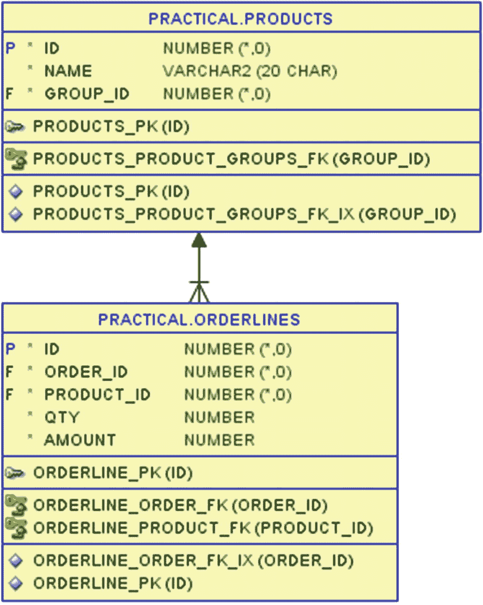

图 11-1

记录客户对各产品订购数量的订单明细表

`orderlines` 表记录了客户对 `products` 表中每种啤酒的订购数量。本章示例查询将连接这两个表，以便更清晰地展示代码清单 11-1 中两种啤酒的数据。

```sql
SQL> select
2     ol.product_id as p_id
3   , p.name        as product_name
4   , ol.order_id   as o_id
5   , ol.qty
6  from orderlines ol
7  join products p
8     on p.id = ol.product_id
9  where ol.product_id in (4280, 6600)
10  order by ol.product_id, ol.qty;
P_ID  PRODUCT_NAME     O_ID  QTY
4280  Hoppy Crude Oil  423   60
4280  Hoppy Crude Oil  427   60
4280  Hoppy Crude Oil  422   80
4280  Hoppy Crude Oil  429   80
4280  Hoppy Crude Oil  428   90
4280  Hoppy Crude Oil  421  110
6600  Hazy Pink Cloud  424   16
6600  Hazy Pink Cloud  426   16
6600  Hazy Pink Cloud  425   24
代码清单 11-1
两种啤酒在订单明细表中的数据
```

接下来将对 `qty` 列进行多种求和计算。`sum` 函数在此仅作为示例，其原理适用于大多数分析函数。

### 分析函数语法

相信你在 SQL 参考手册中见过图 11-2，它展示了所有分析函数都使用 `over` 关键字，后接包含分析子句的括号结构。

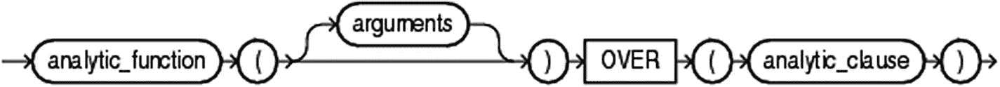

图 11-2

分析函数基础语法结构图

许多函数在不使用 `over` 时是聚合函数，加上 `over` 后则转变为分析函数。核心逻辑体现在图 11-3 所示的分析子句中。

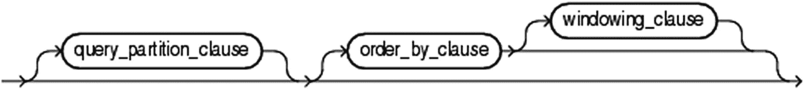

图 11-3

分析子句的三个组成部分

分析子句包含三个部分：

*   `query_partition_clause`：将数据划分为多个分区，并对每个分区单独应用函数
*   `order_by_clause`：按指定顺序应用函数，和/或为 `windowing_clause` 提供排序依据
*   `windowing_clause`：在分区内指定特定窗口（固定或移动窗口）

但请注意语法结构图中这三部分都是可选的，这意味着分析子句本身可以为空。代码清单 11-2 展示了这种情况下会发生什么。

```sql
SQL> select
2     ol.product_id as p_id
3   , p.name        as product_name
4   , ol.order_id   as o_id
5   , ol.qty
6   , sum(ol.qty) over () as t_qty
7  from orderlines ol
8  join products p
9     on p.id = ol.product_id
10  where ol.product_id in (4280, 6600)
11  order by ol.product_id, ol.qty;
代码清单 11-2
最简单的分析函数调用——计算总计
```

我在代码清单 11-1 的基础上增加了第 6 行：将 `qty` 列的 `sum` 作为分析函数（通过 `over` 关键字识别），且分析子句为空。输出结果变为：

```sql
P_ID  PRODUCT_NAME     O_ID  QTY  T_QTY
4280  Hoppy Crude Oil  423   60   536
4280  Hoppy Crude Oil  427   60   536
4280  Hoppy Crude Oil  422   80   536
4280  Hoppy Crude Oil  429   80   536
4280  Hoppy Crude Oil  428   90   536
4280  Hoppy Crude Oil  421  110   536
6600  Hazy Pink Cloud  424   16   536
6600  Hazy Pink Cloud  426   16   536
6600  Hazy Pink Cloud  425   24   536
```

`t_qty` 列简单地包含了所有 `qty` 值的总和——并非整个表的总和，而是满足 `where` 子句条件的那些行的总和。

执行 SQL 语句时，分析函数的计算发生在行数据被筛选出来（`where` 子句计算）**之后**，也发生在可能存在的任何 `group by` 聚合**之后**。因此，分析函数不能用于 `where`、`group by` 和 `having` 子句。但如果需要，它们可以用于 `order by` 子句。

分析子句为空意味着未定义任何分区，因此只存在一个包含所有行的单一分区。同时也没有定义排序和窗口，因此整个分区就是应用 `sum` 函数的窗口，最终得到总计结果。

不过在实际应用中，我通常更希望分析函数能在更小的子集上进行计算，接下来将展示具体方法。


### 分区

有两种方法可以将行拆分为更小的子集用于分析函数，每种方法服务于不同的目的。第一种是使用图 11-4 所示的 *query_partition_clause* 进行分区。

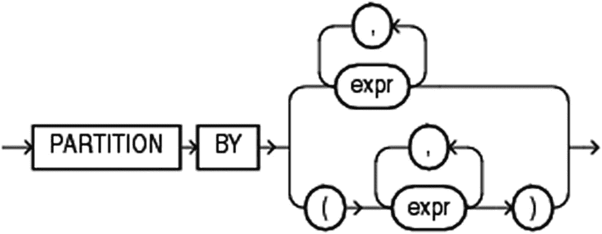

**图 11-4**

`query_partition_clause` 的语法图

你可以使用一个或多个表达式进行分区，对于表达式中的每个不同值，都会创建一个分区。每个分区是完全隔离的，在一个分区中计算的分析函数无法看到任何其他分区中的数据。

**注意**

你会发现清单 11-3 与清单 11-2 相同，只是更改了分析函数调用。本章中的大多数示例都是如此——除非另有说明，否则它们都是清单 11-2 的副本，仅显示了更改后的函数调用。

我在清单 11-3 中展示了一个使用 `partition by` 的简单示例。

```
...
6   , sum(ol.qty) over (
7        partition by ol.product_id
8     ) as p_qty
...
清单 11-3
使用分区按产品创建小计
```

分析子句不再为空；我在第 7 行添加了 `partition by ol.product_id`，为每种啤酒创建了一个分区，现在总计只适用于每个分区内部。这样 `p_qty` 就是每个产品的总计：

```
P_ID  产品名称        O_ID  数量  P_QTY
4280  Hoppy Crude Oil  423   60   480
4280  Hoppy Crude Oil  427   60   480
4280  Hoppy Crude Oil  422   80   480
4280  Hoppy Crude Oil  429   80   480
4280  Hoppy Crude Oil  428   90   480
4280  Hoppy Crude Oil  421   110  480
6600  Hazy Pink Cloud  424   16   56
6600  Hazy Pink Cloud  426   16   56
6600  Hazy Pink Cloud  425   24   56
```

这很好，但我可以用第二种将数据拆分为子集的方式——使用 *order_by_clause* 和 *windowing_clause* 的窗口功能——发挥更大的创造力。

### 排序与窗口

对于图 11-5 所示的 *order_by_clause* 语法，SQL 参考手册的作者复制了查询中常规 `order by` 的语法。

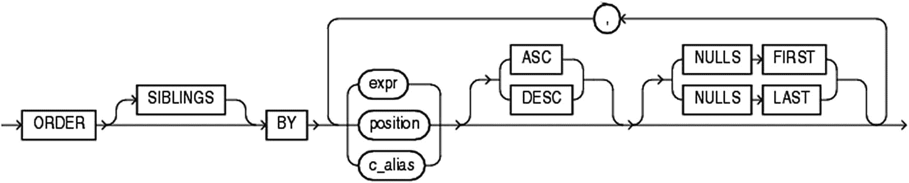

**图 11-5**

`order_by_clause` 的语法图

但这并不完全准确。当你阅读手册中的以下描述时，它解释了不能使用关键字 `siblings`，也不能在分析 `order by` 中使用 *position* 和 *c_alias*。

对于某些分析函数，只有 *query_partition_clause* 和 *order_by_clause*——第三个子句不可用。但对于许多函数，你还可以使用 *windowing_clause*（图 11-6）。要使用窗口功能，你必须已填写 *order_by_clause*。

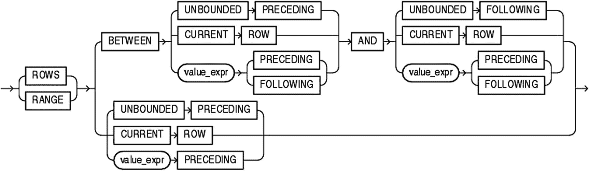

**图 11-6**

`windowing_clause` 的语法图

我在清单 11-4 中同时使用了排序和窗口来做一个累计总和。

```
...
6   , sum(ol.qty) over (
7        order by ol.qty
8        rows between unbounded preceding
9                 and current row
10     ) as r_qty
...
15  order by ol.qty;
清单 11-4
使用排序和窗口创建累计总和
```

第 7 行包含我的 `order by`，第 8–9 行是窗口规范。我指定在计算给定行的分析总和时，应对从最前面一行到当前行（包括当前行）的所有前序行应用滚动窗口。为了便于观察，我将第 15 行的 `order by` 更改为与第 7 行的 `order by` 一致，这样输出中 `r_qty` 就是 `qty` 的累计总和：

```
P_ID  产品名称        O_ID  数量  R_QTY
6600  Hazy Pink Cloud  426   16   16
6600  Hazy Pink Cloud  424   16   32
6600  Hazy Pink Cloud  425   24   56
4280  Hoppy Crude Oil  427   60   116
4280  Hoppy Crude Oil  423   60   176
4280  Hoppy Crude Oil  422   80   256
4280  Hoppy Crude Oil  429   80   336
4280  Hoppy Crude Oil  428   90   426
4280  Hoppy Crude Oil  421   110  536
```

每一行的 `qty` 都在按顺序处理行时被累加，从而得到累计总和。当排序不唯一时，数据库首先访问哪一行，哪一行就会首先被加入总和。输出的前两行可能显示 `o_id` 424 在 426 之前，如果访问计划使得 424 先被访问的话。

我可以将第 15 行的 `order by` 更改回与清单 11-2（以及大多数其他示例）相同的顺序，先按 `product_id` 排序，然后按 `qty` 排序：

```
...
15  order by ol.product_id, ol.qty;
```

现在我的输出顺序不同了，但累计总和 *仍然* 是基于分析 `sum` 中的 `order by`（即单独的 `qty`）计算的。你会看到，例如，之前输出的前两行现在出现在接近末尾的位置，但 `o_id` 426 的 `r_qty` 值仍然是 16，`o_id` 424 的值是 32，依此类推：

```
P_ID  产品名称        O_ID  数量  R_QTY
4280  Hoppy Crude Oil  423   60   176
4280  Hoppy Crude Oil  427   60   116
4280  Hoppy Crude Oil  422   80   256
4280  Hoppy Crude Oil  429   80   336
4280  Hoppy Crude Oil  428   90   426
4280  Hoppy Crude Oil  421   110  536
6600  Hazy Pink Cloud  424   16   32
6600  Hazy Pink Cloud  426   16   16
6600  Hazy Pink Cloud  425   24   56
```

在与输出本身不同的顺序上应用分析功能，在很多情况下是一种有用的技术。

**提示**

图 11-6 的下半部分显示了快捷语法。当窗口是 `rows between` *something* `and current row` 时，你可以简单地使用 `rows` *something*，它会默认使用 *something* 作为窗口的起始行，`current row` 作为结束行。在清单 11-4 中，我本可以用一行 `rows unbounded preceding` 来替换第 8–9 行。我个人喜欢总是使用 `between` 语法，但你可以使用快捷方式。这只是语法上的差异，结果是相同的。

当然，我可以在一次调用中结合所有三个子句，就像我在清单 11-5 中所做的那样。

```
...
6   , sum(ol.qty) over (
7        partition by ol.product_id
8        order by ol.qty
9        rows between unbounded preceding
10                 and current row
11     ) as p_qty
...
清单 11-5
结合分区、排序和窗口
```

我在第 7 行按 `product_id` 分区，在第 8 行按 `qty` 排序，因此第 8–9 行的窗口为我提供了每种啤酒的累计 `sum`，输出很好地显示了这一点，因为我保持了通常的查询排序 `product_id, qty`：

```
P_ID  产品名称        O_ID  数量  P_QTY
4280  Hoppy Crude Oil  423   60   60
4280  Hoppy Crude Oil  427   60   120
4280  Hoppy Crude Oil  422   80   200
4280  Hoppy Crude Oil  429   80   280
4280  Hoppy Crude Oil  428   90   370
4280  Hoppy Crude Oil  421   110  480
6600  Hazy Pink Cloud  424   16   16
6600  Hazy Pink Cloud  426   16   32
6600  Hazy Pink Cloud  425   24   56
```

窗口功能非常方便，经常用于累计总和，但窗口可以比这灵活得多。


### 窗口子句的灵活性

前两个代码清单中的运行总计是*直至并包含当前行*，这很正常。但窗口不一定需要包含当前行，正如我在代码清单 11-6 中展示的，它计算了所有之前行的运行总计。

```sql
...
6   , sum(ol.qty) over (
7        partition by ol.product_id
8        order by ol.qty
9        rows between unbounded preceding
10                 and 1 preceding
11     ) as p_qty
...
```

**代码清单 11-6**
包含所有之前行的窗口

在第 10 行，我将 `current row` 替换为 `1 preceding`，这意味着窗口是*直至并包含当前行之前一行*的所有行：

```
P_ID  PRODUCT_NAME     O_ID  QTY  P_QTY
4280  Hoppy Crude Oil  423   60
4280  Hoppy Crude Oil  427   60   60
4280  Hoppy Crude Oil  422   80   120
4280  Hoppy Crude Oil  429   80   200
4280  Hoppy Crude Oil  428   90   280
4280  Hoppy Crude Oil  421   110  370
6600  Hazy Pink Cloud  424   16
6600  Hazy Pink Cloud  426   16   16
6600  Hazy Pink Cloud  425   24   32
```

你会注意到，这意味着每个分区的第一行 `p_qty` 是 `null`，因为此时没有前序行。

窗口也可以*向前*查看数据，而不仅仅是查看之前的行。我可以将代码清单 11-6 的窗口规范更改为从当前行开始并包含分区内所有后续行的窗口：

```sql
...
9        rows between current row
10                 and unbounded following
...
```

这给了我一个反向的运行总计：

```
P_ID  PRODUCT_NAME     O_ID  QTY  P_QTY
4280  Hoppy Crude Oil  423   60   480
4280  Hoppy Crude Oil  427   60   420
4280  Hoppy Crude Oil  422   80   360
4280  Hoppy Crude Oil  429   80   280
4280  Hoppy Crude Oil  428   90   200
4280  Hoppy Crude Oil  421   110  110
6600  Hazy Pink Cloud  424   16   56
6600  Hazy Pink Cloud  426   16   40
6600  Hazy Pink Cloud  425   24   24
```

同样，我不仅可以包含当前行，还可以仅使用所有*即将到来的*行作为一个窗口：

```sql
...
9        rows between 1 following
10                 and unbounded following
...
```

每个分区末尾的 `null` 值表示没有后续行：

```
P_ID  PRODUCT_NAME     O_ID  QTY  P_QTY
4280  Hoppy Crude Oil  423   60   420
4280  Hoppy Crude Oil  427   60   360
4280  Hoppy Crude Oil  422   80   280
4280  Hoppy Crude Oil  429   80   200
4280  Hoppy Crude Oil  428   90   110
4280  Hoppy Crude Oil  421   110
6600  Hazy Pink Cloud  424   16   40
6600  Hazy Pink Cloud  426   16   24
6600  Hazy Pink Cloud  425   24
```

我可以在两端指定窗口边界，例如，对前一行、当前行和后一行的值进行求和：

```sql
...
9        rows between 1 preceding
10                 and 1 following
...
```

```
P_ID  PRODUCT_NAME     O_ID  QTY  P_QTY
4280  Hoppy Crude Oil  423   60   120
4280  Hoppy Crude Oil  427   60   200
4280  Hoppy Crude Oil  422   80   220
4280  Hoppy Crude Oil  429   80   250
4280  Hoppy Crude Oil  428   90   280
4280  Hoppy Crude Oil  421   110  200
6600  Hazy Pink Cloud  424   16   32
6600  Hazy Pink Cloud  426   16   56
6600  Hazy Pink Cloud  425   24   40
```

或者，我可以创建一个两端无界的窗口：

```sql
...
9        rows between unbounded preceding
10                 and unbounded following
...
```

但这没什么意义，因为完全无界的窗口就是整个分区，这意味着 `order by` 子句实际上对输出没有影响，这与我从没有 `order by` 和没有窗口子句的代码清单 11-3 得到的结果相同：

```
P_ID  PRODUCT_NAME     O_ID  QTY  P_QTY
4280  Hoppy Crude Oil  423   60   480
4280  Hoppy Crude Oil  427   60   480
4280  Hoppy Crude Oil  422   80   480
4280  Hoppy Crude Oil  429   80   480
4280  Hoppy Crude Oil  428   90   480
4280  Hoppy Crude Oil  421   110  480
6600  Hazy Pink Cloud  424   16   56
6600  Hazy Pink Cloud  426   16   56
6600  Hazy Pink Cloud  425   24   56
```

所以对于完全无界的窗口，我建议直接跳过 `order by` 和窗口子句。

在语法图中，你看到窗口可以使用 `rows between` 或 `range between` 来指定。正如我给出的几个例子，`rows between` 窗口由当前行之前或之后的行数决定。`range between` 则有所不同。


### 基于值范围的窗口

如果我需要，我可以定义一个窗口，不是“当前行的前两行到后两行”，而是“那些值在当前行值的减 20 到加 20 范围内的行”。这可以通过 `range between` 来实现，如代码清单 11-7 所示。

```
...
6   , sum(ol.qty) over (
7        partition by ol.product_id
8        order by ol.qty
9        range between 20 preceding
10                  and 20 following
11     ) as p_qty
...
```

**代码清单 11-7** 基于数量（qty）值的范围窗口

当我在第 9-10 行指定 `between 20 preceding and 20 following` 时，我要求窗口包含那些值在当前行值加/减 20 范围内的行。但这个“值”指的是什么值？

`range` 使用的值，是在分析函数的 `order by` 子句中所用列的值。因此，要使用范围窗口，`order by` 列必须是数字或日期/时间戳类型。

我在 `sum` 函数中计算总和的列，不必与用于排序和范围定义的列相同，但在实践中，它们通常是相同的。这会得到一个输出，其中你可以看到第三和第四行都得到了 370 的总和，因为它是分区内所有值在 80-20=60 到 80+20=100 之间的行的总和：

```
P_ID  PRODUCT_NAME     O_ID  QTY  P_QTY
4280  Hoppy Crude Oil  423   60   280
4280  Hoppy Crude Oil  427   60   280
4280  Hoppy Crude Oil  422   80   370
4280  Hoppy Crude Oil  429   80   370
4280  Hoppy Crude Oil  428   90   360
4280  Hoppy Crude Oil  421   110  200
6600  Hazy Pink Cloud  424   16   56
6600  Hazy Pink Cloud  426   16   56
6600  Hazy Pink Cloud  425   24   56
```

即使范围窗口也不必包含当前行值；我也可以指定窗口包含那些 `qty` 值在当前 `qty` + 5 到当前 `qty` + 25 之间的行：

```
...
9        range between  5 following
10                  and 25 following
...
```

```
P_ID  PRODUCT_NAME     O_ID  QTY  P_QTY
4280  Hoppy Crude Oil  423   60   160
4280  Hoppy Crude Oil  427   60   160
4280  Hoppy Crude Oil  422   80   90
4280  Hoppy Crude Oil  429   80   90
4280  Hoppy Crude Oil  428   90   110
4280  Hoppy Crude Oil  421   110
6600  Hazy Pink Cloud  424   16   24
6600  Hazy Pink Cloud  426   16   24
6600  Hazy Pink Cloud  425   24
```

累计求和也可以使用 `range` 窗口来完成：

```
...
9        range between unbounded preceding
10                  and current row
...
```

但请注意，对于 `qty` 值相同的行，累计求和的结果是相同的：

```
P_ID  PRODUCT_NAME     O_ID  QTY  P_QTY
4280  Hoppy Crude Oil  423   60   120
4280  Hoppy Crude Oil  427   60   120
4280  Hoppy Crude Oil  422   80   280
4280  Hoppy Crude Oil  429   80   280
4280  Hoppy Crude Oil  428   90   370
4280  Hoppy Crude Oil  421   110  480
6600  Hazy Pink Cloud  424   16   32
6600  Hazy Pink Cloud  426   16   32
6600  Hazy Pink Cloud  425   24   56
```

将此输出与代码清单 11-5 的输出对比，前两行在 `p_qty` 中的值分别是 60 和 120。而在这里，它们都是 120。

这是 `range` 窗口的特性所致，它赋予了 `current row` 这个术语不同的含义。它不再具体指*那一行*当前行，而是指当前行的*值*。（在我看来，如果能对 `range` 窗口使用 `current value` 这样的措辞会更好，但不幸的是，这不是支持的语法。）

所以你会看到，在值存在并列（ties）的情况下，使用 `current row` 的 `range` 窗口实际上可能*包含后续的行*。这引出了一个非常容易掉入的陷阱。

### 默认窗口的危险性

在图 11-3 中，你可以看到有可能使用 `order by` 而*不*指定窗口子句。这会导致一个默认的窗口子句，它可能会让你惊讶。在代码清单 11-8 中，我展示了默认情况、`range between` 和 `rows between` 之间的区别。

```sql
SQL> select
2     ol.product_id as p_id
3   , p.name        as product_name
4   , ol.order_id   as o_id
5   , ol.qty
6   , sum(ol.qty) over (
7        partition by ol.product_id
8        order by ol.qty
9        /* no window - rely on default */
10     ) as def_q
11   , sum(ol.qty) over (
12        partition by ol.product_id
13        order by ol.qty
14        range between unbounded preceding
15                  and current row
16     ) as range_q
17   , sum(ol.qty) over (
18        partition by ol.product_id
19        order by ol.qty
20        rows between unbounded preceding
21                 and current row
22     ) as rows_q
23  from orderlines ol
24  join products p
25     on p.id = ol.product_id
26  where ol.product_id in (4280, 6600)
27  order by ol.product_id, ol.qty;
```

**代码清单 11-8** 使用默认窗口、range 窗口和 rows 窗口的累计求和对比

我这里有三个分析函数调用：

*   第 6-10 行的 `def_q` 列使用了 `order by` 但留空了窗口子句。
*   第 11-16 行的 `range_q` 列使用了 `range between` 窗口进行累计求和。
*   第 17-22 行的 `rows_q` 列使用了 `rows between` 窗口进行累计求和。

在输出中你可以看到，`def_q` 和 `range_q` 是相同的：

```
P_ID  PRODUCT_NAME     O_ID  QTY  DEF_Q  RANGE_Q  ROWS_Q
4280  Hoppy Crude Oil  423   60   120    120      60
4280  Hoppy Crude Oil  427   60   120    120      120
4280  Hoppy Crude Oil  422   80   280    280      200
4280  Hoppy Crude Oil  429   80   280    280      280
4280  Hoppy Crude Oil  428   90   370    370      370
4280  Hoppy Crude Oil  421   110  480    480      480
6600  Hazy Pink Cloud  424   16   32     32       16
6600  Hazy Pink Cloud  426   16   32     32       32
6600  Hazy Pink Cloud  425   24   56     56       56
```

是的，如果你有一个 `order_by_clause`，`windowing_clause` 的默认值就是 `range between unbounded preceding and current row`。

我见过很多博客和论坛帖子，将累计求和展示为类似 `sum(col1) over (order by col2)` 的形式就到此为止了。当你用这个默认窗口测试代码时，通常能得到预期的结果，因为输出的差异只出现在值存在并列时。所以你可能直到代码投入生产后才能发现这个错误。

**注意**

这不仅仅是值存在并列时的问题。即使你的 `order by` 列是唯一的，对累计求和使用默认的 `range between` 窗口也可能因为分析函数的计算而产生一些额外开销，影响性能。这是因为 `rows between` 可以被 SQL 引擎更优化地执行，而 `range between` 要求 SQL 引擎“向前查看”行，看看是否有后续行具有相同的值。关于这一点的更详细解释，请参见我之前写的一篇博客：`www.kibeha.dk/2013/02/rows-versus-default-range-in-analytic.html`。

在我看来，默认值本应是 `rows between`，因为根据我的经验，这是迄今为止最常用的窗口规范。我*非常*频繁地使用 `rows between`，而只在极少数情况下使用 `range between`。


因此，我的最佳实践法则是：每当使用 `order by` 子句时，我总是*显式*地编写窗口子句，*从不*依赖默认设置。即使对于那些窗口恰好是 `range between unbounded preceding and current row` 的罕见情况，我仍然会显式地写出来。这告诉未来的我，或者将来维护我代码的任何开发人员，`range between` 是故意的。如果我看到缺少窗口子句的代码，我总会怀疑它是否真的应该是 `range between`，或者只是从论坛帖子中误解了的复制粘贴。

当然，这仅适用于支持窗口子句的分析函数。另外，如果我的窗口是整个分区，我也不会使用它，此时我干脆省略 `order by` 和窗口子句，而不是写 `rows between unbounded preceding and unbounded following`。

但即使清单 11-5 遵循了这个经验法则，它还有另一个问题：由于优化器使用的访问计划不同，具有重复值的行在输出中的顺序可能不同，导致在不同代码执行中可能从相同数据得到不同的输出。

这个问题并不严格影响解决方案的正确性，但当用户观察到不同的输出时（即使两种输出都是正确的），他们很可能会质疑正确性。因此，我将以下做法作为最佳实践：在分析函数中（当使用 `rows between` 时，不适用于 `range between`），使 `partition by` 和 `order by` 中使用的列组合是唯一的。这使得输出是*确定性的*，因此用户可以验证他在每次运行中都得到相同的结果。

清单 11-9 展示了进行累计汇总的这两个最佳实践。

```
SQL> select
2     ol.product_id as p_id
3   , p.name        as product_name
4   , ol.order_id   as o_id
5   , ol.qty
6   , sum(ol.qty) over (
7        partition by ol.product_id
8        order by ol.qty, ol.order_id
9        rows between unbounded preceding
10                 and current row
11     ) as p_qty
12  from orderlines ol
13  join products p
14     on p.id = ol.product_id
15  where ol.product_id in (4280, 6600)
16  order by ol.product_id, ol.qty, ol.order_id;
清单 11-9
累计求和的一个最佳实践
```

实际上，我只对每个 `product_id` 分区内的 `qty` 排序感兴趣（如清单 11-5 所示），但这两个列的组合并不唯一，使得输出是非确定性的。因此，我在两个 `order by` 子句中（第 8 行和第 16 行）都添加了 `order_id`：

```
P_ID  PRODUCT_NAME     O_ID  QTY  P_QTY
4280  Hoppy Crude Oil  423   60   60
4280  Hoppy Crude Oil  427   60   120
4280  Hoppy Crude Oil  422   80   200
4280  Hoppy Crude Oil  429   80   280
4280  Hoppy Crude Oil  428   90   370
4280  Hoppy Crude Oil  421   110  480
6600  Hazy Pink Cloud  424   16   16
6600  Hazy Pink Cloud  426   16   32
6600  Hazy Pink Cloud  425   24   56
```

这确保了输出的确定性。

在这种情况下，语句甚至可以只使用单个排序操作来执行，因为分析函数 `partition by` 中的列后接分析函数 `order by` 中的列，与最终第 16 行的 `order by` 中的列相匹配。这使得优化器可以跳过最终的排序，因为分析函数的评估已经正确地对数据进行了排序。

### 经验教训

本章介绍了分析函数的三个子句的基本要素。虽然我是专门使用 `sum` 函数来展示的，但你可以将其推广到其他分析函数，并运用你学到的关于以下内容的知识：

- 使用 `partition by` 将行分割成若干部分，分析函数在每个部分内单独应用。
- 使用窗口子句与 `order by` 结合，创建移动的行窗口来计算，例如，累计汇总。
- 理解*默认*窗口子句很少适用于你的用例，因此始终使用*显式*窗口子句是个好主意。

充分理解这些子句后，你就可以让分析函数为你解决许多原本困难的任务。本书这一部分的后续章节将专门介绍几个这样的解决方案。

## 12. 回答 Top-N 问题

我认为几乎没有开发者没有被要求创建过 Top-N 报告。业务部门提出的可以归类为 Top-N 问题的问题比比皆是，例如以下这些：

- 我们的哪些产品最畅销？
- 哪些用户资料发布的推文最多？
- 哪些销售员工产生的潜在客户最多？
- 连锁酒店中哪些酒店收到的投诉最少？

最后一个严格来说可以称为 Bottom-N 问题，但这在原则上完全是一回事。对于 Top-N 报告，你按特定*降序*对数据进行排序，并挑选 Top-N 行数据。如果你想要 Bottom-N 报告，你只需按特定*升序*对数据进行排序，然后仍然挑选 Top-N 行数据。在 SQL 术语中，这仅仅是做 `order by col_name desc` 与 `order by col_name asc` 的问题。所以我只展示 Top-N 的例子——Bottom-N 你可以通过将 `desc` 替换为 `asc` 来得到。

为了演示 Top-N SQL，我使用上面列表中的第一个问题：我们的哪些产品最畅销？

### 销售数据的 Top-N

由于我的 Good Beer Trading 公司销售啤酒，市场部要求我找出公司销售的 Top-3 最畅销啤酒，以便他们可以开展一个类似图 12-1 所示的领奖台活动。

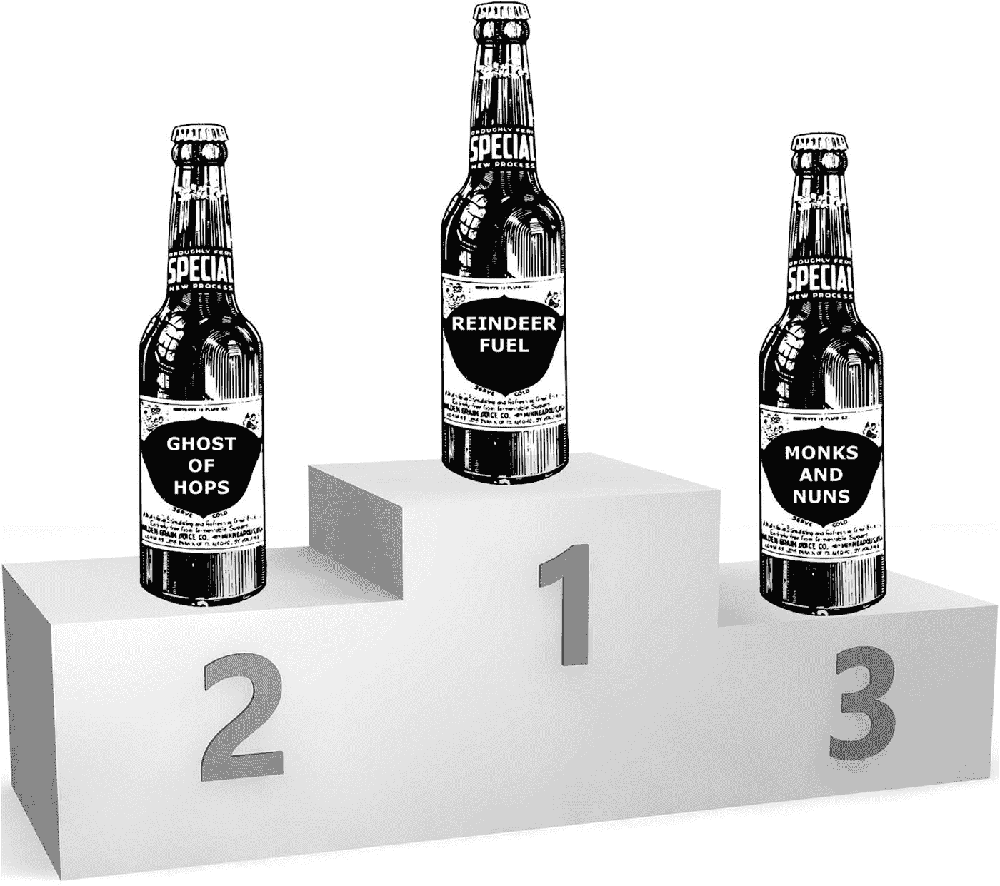

图 12-1 按总销售额排名的 Top-3 啤酒

他们现在给我的这个问题相当笼统，所以我需要回头找他们，让他们具体说明他们的意思。我是按销售数量还是销售金额来确定排序？他们想要的是有史以来的最畅销品还是特定年份的？如果有并列情况，即两种或多种啤酒销量相同，我该怎么办？

通常，作为开发者，获得所需详细规格说明的最简单方法是给他们举例，因为他们有时不理解为什么“Top-3 最畅销啤酒”是一个模糊的问题。

#### 你指的是哪种 Top-3？

特别是在出现并列时该怎么做存在模糊性。一般来说有三种情况：

- Top-行规则：“*我正好要 3 行*。” 在这种情况下，我需要向业务部门解释，这意味着他们不会看到，例如，与第三行值完全相同的第四行。对于这样的并列，输出不会显示两行，而只显示其中一行。在这种情况下，要么是随机显示一行，要么业务部门需要决定一个平局规则来确定输出哪一行。
- 奥运会规则：“*我想要金、银、铜牌，按奥运会的方式*。” 根据体育比赛中常用的规则，例如，如果第一名并列，则颁发两枚金牌，然后跳过银牌，第三名获得铜牌。使用此规则可能导致输出超过三行，例如，当铜牌并列时，将有一个第一名、一个第二名和两个第三名，总共输出四行。
- Top-值规则：“*我想要所有拥有 Top-3 值的行*。” 使用前一个规则，如果第二名并列，将有一个金牌和两个银牌，但没有铜牌。这个规则规定，无论第一名、第二名、第三名有多少并列，输出都应包含所有拥有 Top-3 值的行。

所有这些 Top-3 规则都可以在 SQL 中处理——我将演示如何做。


### 啤酒销售数据

图 12-2 展示了按月统计的啤酒销售数据表和啤酒产品名称表。

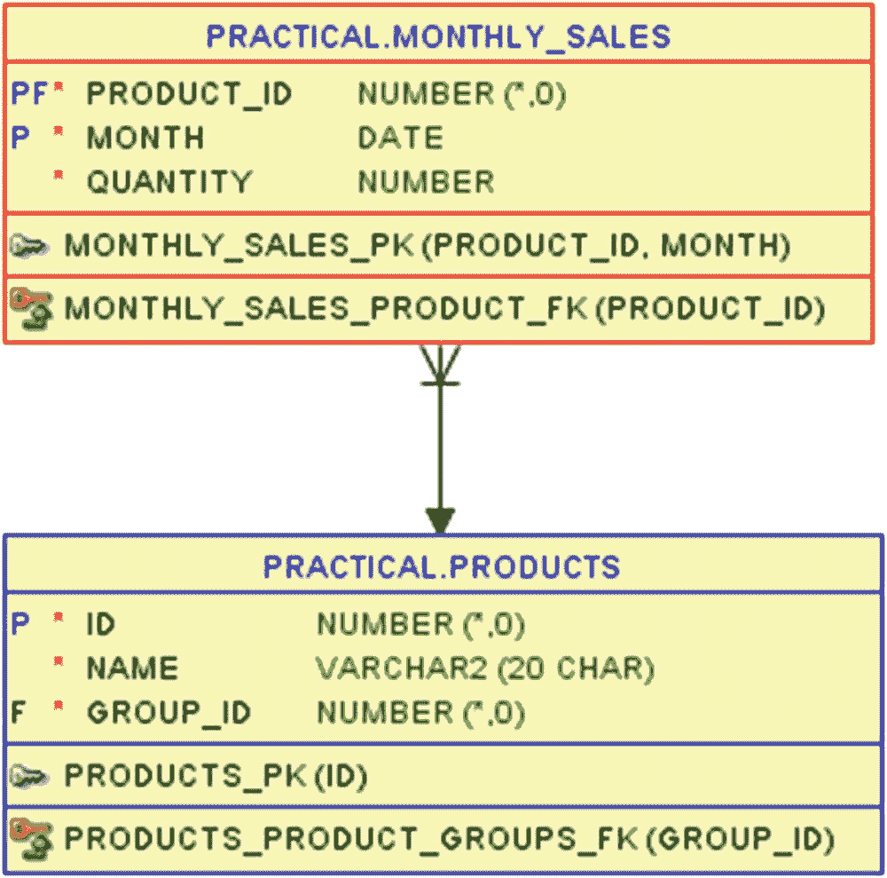

图 12-2：保存月度产品销售数据的表。

我将对产品的总销售额以及每年的销售额（有 2016 年、2017 年和 2018 年的销售数据）进行 Top-N 查询。在代码清单 12-1 中，我创建了几个用于汇总月度销售的视图。

```
SQL> create or replace view total_sales
2  as
3  select
4     ms.product_id
5   , max(p.name) as product_name
6   , sum(ms.qty) as total_qty
7  from products p
8  join monthly_sales ms
9     on ms.product_id = p.id
10  group by
11     ms.product_id;
View TOTAL_SALES created.
SQL> create or replace view yearly_sales
2  as
3  select
4     extract(year from ms.mth) as yr
5   , ms.product_id
6   , max(p.name) as product_name
7   , sum(ms.qty) as yr_qty
8  from products p
9  join monthly_sales ms
10     on ms.product_id = p.id
11  group by
12     extract(year from ms.mth), ms.product_id;
View YEARLY_SALES created.
```

代码清单 12-1：用于汇总总销售额和年度销售额的视图。

查询 `total_sales` 视图，我可以在代码清单 12-2 中按 `total_qty desc` 进行排序。

```
SQL> select product_name, total_qty
2  from total_sales
3  order by total_qty desc;
```

代码清单 12-2：总销售数据的视图。

这显示了产品表中的十种啤酒，我可以直观地看到哪些啤酒是销量前三的啤酒。由于第二名出现了并列，那么根据“前几行”规则和奥林匹克规则，是前三行；而根据“相同数值”规则，则是前四行：

```
PRODUCT_NAME      TOTAL_QTY
Reindeer Fuel     1604
Ghost of Hops     1485
Monks and Nuns    1485
Der Helle Kumpel  1230
Hercule Trippel   1056
Summer in India   961
Pale Rider Rides  883
Coalminers Sweat  813
Hazy Pink Cloud   324
Hoppy Crude Oil   303
```

我也可以用同样的方式查询 `yearly_sales` 视图：

```
SQL> select yr, product_name, yr_qty
2  from yearly_sales
3  order by yr, yr_qty desc;
```

但在代码清单 12-3 中，我将使用第 8 章中的**数据透视**技术，按年份在列中显示啤酒的排名。虽然这对于进行 Top-N 查询不是必需的，但它能将数据在三年间的变化差异可视化。

```
SQL> select *
2  from (
3     select
4        yr, product_name, yr_qty
5      , row_number() over (
6           partition by yr
7           order by yr_qty desc
8        ) as rn
9     from yearly_sales
10  )
11  pivot (
12     max(product_name) as prod
13   , max(yr_qty)
14     for yr in (
15        2016, 2017, 2018
16     )
17  )
18  order by rn;
```

代码清单 12-3：年度销售数据视图（手动格式化，非 ansiconsole 格式）。

我在第 5-8 行使用分析函数 `row_number` 有些超前了。稍后我会详细解释，但它在这里的作用是：按销售数量排序，为每年内的每种啤酒分配 1 到 10 的序号。然后，这个序号 (`rn`) 被用于 `pivot` 子句中隐式的分组，因此我得到了一个包含十行（编号 1-10）的输出，每年有两列——啤酒名称和销售数量：

```
RN 2016_PROD 2016 2017_PROD 2017 2018_PROD 2018
--- --------- ---- --------- ---- --------- ----
1 Ghost of   552 Monks and  582 Reindeer   691
Hops            Nuns          Fuel
2 Monks and  478 Reindeer   582 Pale Ride  491
Nuns          Fuel           r Rides
3 Der Helle  415 Ghost of   482 Hercule T  451
Kumpel        Hops           rippel
4 Summer in  377 Der Helle  458 Ghost of   451
India          Kumpel        Hops
5 Reindeer   331 Hercule T  344 Monks and  425
Fuel           rippel          Nuns
6 Coalminer  286 Summer in  321 Der Helle  357
s Sweat         India          Kumpel
7 Hercule T  261 Coalminer  227 Coalminer  300
rippel         s Sweat        s Sweat
8 Pale Ride  182 Pale Ride  210 Summer in  263
r Rides        r Rides         India
9 Hazy Pink  121 Hazy Pink  105 Hoppy Cru  132
Cloud          Cloud         de Oil
10 Hoppy Cru   99 Hoppy Cru   72 Hazy Pink   98
de Oil         de Oil          Cloud
```

我使用 `sqlcl` 的列格式化功能让啤酒名列变窄，以便名称能换行显示，而不是让 2018 年的数据因换行而跑到 2016 和 2017 年数据的下方。这种方式对名称的换行处理不如之前美观，但数量列是对齐的，便于观察每年的排序以及出现并列的地方。注意，2017 年出现了第一名并列，2018 年出现了第三名并列。

## 传统的 rownum 方法

在分析函数出现之前，进行 Top-N 查询的传统方法是：使用一个包含所需 `order by` 子句的内联视图，然后在外部查询中通过 `rownum <=` 进行过滤，如代码清单 12-4 所示。

```
SQL> select *
2  from (
3     select product_name, total_qty
4     from total_sales
5     order by total_qty desc
6  )
7  where rownum <= 3;
```

代码清单 12-4：使用内联视图和 rownum 过滤得到 Top-3。

这种方法根据“前几行”规则给出了前三名的啤酒：

```
PRODUCT_NAME    TOTAL_QTY
Reindeer Fuel   1604
Monks and Nuns  1485
Ghost of Hops   1485
```

它运行良好且性能优异——优化器能识别这种结构，并会尽可能少地做工作以仅获取所需的三行。

然而，这种方法无法轻易地帮助我们处理奥林匹克规则和“相同数值”规则。对于这些规则，使用分析函数要容易得多。


### 用于排名的分析函数

在 `清单 12-5` 中，我重写了 `清单 12-4`，只是在第 5 行使用了分析函数 `row_number` 来替代带有 `rownum` 的构造。由于分析函数不能在 `where` 子句中使用，我仍然需要使用一个内联视图。

```sql
SQL> select *
2  from (
3     select
4        product_name, total_qty
5      , row_number() over (order by total_qty desc) as ranking
6     from total_sales
7  )
8  where ranking <= 3
9  order by ranking;
清单 12-5
使用内联视图并过滤 row_number() 来获取前三名
```

输出结果与我从 `清单 12-4` 得到的一样——我仍然在为我的前三名输出应用着“首行规则”：

```sql
PRODUCT_NAME    TOTAL_QTY  RANKING
Reindeer Fuel   1604       1
Monks and Nuns  1485       2
Ghost of Hops   1485       3
```

但 `row_number` 并不是我可用于数据排名的唯一分析函数；我还有另外两个分析函数可供使用。`清单 12-6` 对比了这三个函数。

```sql
SQL> select
2     product_name, total_qty
3   , row_number() over (order by total_qty desc) as rn
4   , rank() over (order by total_qty desc) as rnk
5   , dense_rank() over (order by total_qty desc) as dr
6  from total_sales
7  order by total_qty desc;
清单 12-6
三种分析排名函数的比较
```

这三个函数直接对应于我提到的三种排名规则：

*   `row_number` – 实现首行规则
*   `rank` – 实现奥林匹克规则
*   `dense_rank` – 实现顶尖值规则

这可以从输出中看出：

```sql
PRODUCT_NAME      TOTAL_QTY  RN  RNK  DR
Reindeer Fuel     1604       1   1    1
Ghost of Hops     1485       2   2    2
Monks and Nuns    1485       3   2    2
Der Helle Kumpel  1230       4   4    3
Hercule Trippel   1056       5   5    4
Summer in India   961        6   6    5
Pale Rider Rides  883        7   7    6
Coalminers Sweat  813        8   8    7
Hazy Pink Cloud   324        9   9    8
Hoppy Crude Oil   303        10  10   9
```

当我使用 `row_number` 时，我得到的是连续的数字。

当我使用 `rank` 时，一行可以遵循两种规则之一：如果它与前一行并列，它获得与前一行`相同的排名`；如果不是并列，它获得的排名与使用 `row_number` 时`相同`。这使得它会以奥林匹克的方式“跳过”排名，就像这里我们有两个啤酒并列第二名，然后下一个是第四名。

最后是 `dense_rank`，一行同样可以遵循两种规则：如果它与前一行并列，它获得与前一行`相同的排名`；但如果不是并列，该行获得的排名是前一行的排名`加一`。因此，排名不会跳过，而是为每个唯一值分配一个连续的排名，从而实现了顶尖值规则。

掌握了这些不同的分析函数后，我可以轻松地在不同的排名规则之间切换。`清单 12-5` 给了我首行规则——我只需将第 5 行改为 `rank` 即可使用奥林匹克规则：

```sql
5      , rank() over (order by total_qty desc) as ranking
```

在这种情况下，输出仍然是那三款啤酒；唯一的区别是第二行和第三行都排名第二：

```sql
PRODUCT_NAME    TOTAL_QTY  RANKING
Reindeer Fuel   1604       1
Ghost of Hops   1485       2
Monks and Nuns  1485       2
```

或者，我也可以将第 5 行改为 `dense_rank` 来使用顶尖值规则：

```sql
5      , dense_rank() over (order by total_qty desc) as ranking
```

这给了我一个有四行输出的前三名报告，因为有两行并列第二名：

```sql
PRODUCT_NAME      TOTAL_QTY  RANKING
Reindeer Fuel     1604       1
Monks and Nuns    1485       2
Ghost of Hops     1485       2
Der Helle Kumpel  1230       3
```

有了这三种分析函数，我可以用所有三种规则来回答 Top-N 问题，所以我很满意。唯一的小问题是我仍然需要编写内联视图并在外部查询中过滤行。我能否少写点代码？答案是肯定的。

### 仅获取首行

在版本 12 中，`select` 语句引入了一种新语法——`行限制子句`。它也被称为 `fetch first`，因为如你在 `清单 12-7` 中看到的，使用的正是这种语法。

```sql
SQL> select product_name, total_qty
2  from total_sales
3  order by total_qty desc
4  fetch first 3 rows only;
清单 12-7
仅获取前三行
```

使用这种语法，我跳过了内联视图；我只需在查询中使用合适的 `order by` 子句，并附加 `fetch first` 子句来声明我只需要前三行，然后我就能在输出中得到这些：

```sql
PRODUCT_NAME    TOTAL_QTY
Reindeer Fuel   1604
Ghost of Hops   1485
Monks and Nuns  1485
```

使用 `rows only` 让我根据首行规则得到了结果。实际上，这仅仅是“语法糖”，使得编写这样的 Top-N 查询更容易、更简单，但在底层，数据库正在自动地将 `清单 12-7` 重写为与带有 `row_number` 函数的内联视图（如 `清单 12-5`）执行相同的操作。这两个清单的工作和性能是相同的；区别仅在于 `清单 12-7` 更短，更易于编写和阅读。

行限制子句有另一个选项来替代 `rows only`——我可以选择 `rows with ties`：

```sql
4  fetch first 3 rows with ties;
```

其定义是，当获取了三行后，它会检查是否有更多具有相同值（并列）的行——如果有，那么这些行也会被输出。对于这里的数据，情况并非如此，所以我得到了相同的输出：

```sql
PRODUCT_NAME    TOTAL_QTY
Reindeer Fuel   1604
Ghost of Hops   1485
Monks and Nuns  1485
```

`rows with ties` 定义中的规则在底层是通过带有 `rank` 函数调用的内联视图实现的，因为该规则与我展示过的奥林匹克规则相匹配——只是表述方式不同。

但这与根据我之前展示的三种排名规则的分析函数处理并列的方式相比如何呢？我将通过一些年度销售数据的例子更深入地探讨一下并列处理。


#### 并列情况的处理

在清单 12-8 中，我比较了 2018 年销售额的三种分析排名函数（类似于我在清单 12-6 中对总销售额所做的比较）。因为仅用前五行数据就能说明我的观点，而无需展示全部十种啤酒，我在第 9 行使用了 `fetch first`，仅仅是因为这样在书中可以节省篇幅。

```sql
SQL> select
2     product_name, yr_qty
3   , row_number() over (order by yr_qty desc) as rn
4   , rank() over (order by yr_qty desc) as rnk
5   , dense_rank() over (order by yr_qty desc) as dr
6  from yearly_sales
7  where yr = 2018
8  order by yr_qty desc
9  fetch first 5 rows only;
清单 12-8
2018 年销售额的分析函数比较
```

从输出中我可以看到，2018 年存在并列第三名的情况：

```sql
PRODUCT_NAME      YR_QTY  RN  RNK  DR
Reindeer Fuel     691     1   1    1
Pale Rider Rides  491     2   2    2
Hercule Trippel   451     3   3    3
Ghost of Hops     451     4   3    3
Monks and Nuns    425     5   5    4
```

因此，在清单 12-9 中，我可以使用第 5 行来应用“前几行”规则，获取按 `row_number` 函数排名（即上述输出中的 `rn` 列）的前三行数据。

```sql
SQL> select product_name, yr_qty
2  from yearly_sales
3  where yr = 2018
4  order by yr_qty desc
5  fetch first 3 rows only;
清单 12-9
获取 2018 年的前三行
```

是的，输出结果确实是我想要的那三行：

```sql
PRODUCT_NAME      YR_QTY
Reindeer Fuel     691
Pale Rider Rides  491
Hercule Trippel   451
```

但是等等——由于 `Ghost of Hops` 和 `Hercule Trippel` 在 2018 年的销量都是 451，我完全有可能得到下面这个输出：

```sql
PRODUCT_NAME      YR_QTY
Reindeer Fuel     691
Pale Rider Rides  491
Ghost of Hops     451
```

清单 12-9 中的查询具有 **不确定的** 输出结果——我最终得到这两个输出中的哪一个，原则上将是随机的；实际上，我在第三行得到 `Hercule Trippel` 还是 `Ghost of Hops`，取决于数据库在访问数据时恰好先找到这两种啤酒中的哪一种。这高度依赖于优化器选择的访问路径。

这个问题不仅存在于使用 `fetch first` 和 `rows only` 时，当我自己使用 `row_number` 函数时也同样存在。在清单 12-8 的输出中，`Hercule Trippel` 和 `Ghost of Hops` 的位置可能已经互换了——我无法知晓。

通常，业务用户不喜欢一份“一夜之间输出结果就变了”的报表，而这些报表本该是相同的。例如，如果第二天统计信息的收集导致优化器选择了不同的访问路径，这种情况就可能发生。换句话说，用户不喜欢 **不确定的** 输出。使用 `row_number` 或 `fetch first` 加 `rows only` 时的一个最佳实践是，总是通过添加某种决胜规则来使 `order by` 变得确定，例如，声明在出现并列时总是显示产品 ID 较小的那个：

```sql
order by yr_qty desc, product_id
```

但我更倾向于说服业务用户，他们其实并不想要“前几行”规则；相反，他们很可能想要，比如，奥林匹克规则。然后，我可以通过使用 `with ties` 代替 `rows only` 来轻松实现它：

```sql
4  order by yr_qty desc
5  fetch first 3 rows with ties;
```

这样我就得到了一个包含 **四行** 的 **输出**，**同时显示** 了 `Hercule Trippel` 和 `Ghost of Hops`：

```sql
PRODUCT_NAME      YR_QTY
Reindeer Fuel     691
Pale Rider Rides  491
Hercule Trippel   451
Ghost of Hops     451
```

在这个 `输出` 中，`Hercule Trippel` 和 `Ghost of Hops` 的显示 **顺序** 实际上是 **不确定的**。正如我之前提到的，用户不喜欢这个，所以可能诱使人通过确保 `order by` 是确定性的来“修复”这个问题：

```sql
4  order by yr_qty desc, product_id
5  fetch first 3 rows with ties;
```

但这将是一个 **错误的** 做法，因为当 `order by` 是确定性的时，根据定义就 **没有并列**，因此 `输出` 结果就 **不是** 我想要的：

```sql
PRODUCT_NAME      YR_QTY
Reindeer Fuel     691
Pale Rider Rides  491
Hercule Trippel   451
```

当我想在 `输出` 中显示并列项时，使用 `fetch first` 就必须接受一个非确定性的 `输出`。如果我无法接受这点，我就必须手动编写包含 `rank` 函数的内联视图，因为那样能让我更好地控制，并能够在分析函数调用中使用非确定性的 `order by`，而在外层查询中使用确定性的 `order by`。

#### 行限制子句不能做什么

因此，`fetch first` 行限制子句中的 `with ties` 处理并列的方式，就像我使用了分析函数 `rank` 一样。但是，让我修改清单 12-8 来显示 2017 年而不是 2018 年：

```sql
7  where yr = 2017
```

这次，我有并列第一名的情况：

```sql
PRODUCT_NAME      YR_QTY  RN  RNK  DR
Monks and Nuns    582     1   1    1
Reindeer Fuel     582     2   1    1
Ghost of Hops     482     3   3    2
Der Helle Kumpel  458     4   4    3
Hercule Trippel   344     5   5    4
```

让我在清单 12-10 中尝试对 2017 年使用 `fetch first with ties`。

```sql
SQL> select product_name, yr_qty
2  from yearly_sales
3  where yr = 2017
4  order by yr_qty desc
5  fetch first 3 rows with ties;
清单 12-10
为 2017 年获取并列数据
```

我得到的是那些 `RNK` 列 `<= 3` 的行：

```sql
PRODUCT_NAME    YR_QTY
Monks and Nuns  582
Reindeer Fuel   582
Ghost of Hops   482
```

换句话说，这类似于处理并列情况的奥林匹克规则。如果我想使用“前几个值”规则来获取所有具有前三名数值的行，我 **无法** 通过行限制子句实现。根本就不存在像这样的语法：

```sql
fetch first 3 values with ties;  /* <-- 无效语法 */
```

相反，我需要手动创建我的内联视图，并使用 `dense_rank`，如清单 12-11 所示。

```sql
SQL> select *
2  from (
3     select
4        product_name, yr_qty
5      , dense_rank() over (order by yr_qty desc) as ranking
6     from yearly_sales
7     where yr = 2017
8  )
9  where ranking <= 3
10  order by ranking;
清单 12-11
使用 dense_rank 实现 fetch first 无法完成的功能
```

现在我得到了 2017 年具有前三名数值的四行数据：

```sql
PRODUCT_NAME      YR_QTY  RANKING
Monks and Nuns    582     1
Reindeer Fuel     582     1
Ghost of Hops     482     2
Der Helle Kumpel  458     3
```

行限制子句对于 Top-N 查询来说是一个非常方便的快捷方式，但它只能执行“前几行”规则或奥林匹克规则，其内部实现类似于包含 `row_number` 或 `rank` 分析函数的内联视图。如果你想要“前几个值”规则，你需要自己用 `dense_rank` 来实现。


### 多分区中的 Top-N 查询

到目前为止，我执行的 Top-N 查询要么是针对总销售额，要么是针对特定年份的年度销售额。无论哪种情况，最终得到的都是整个行集中的“前几行”。

但假设我想查看每一年的前三名最畅销啤酒。当然，我可以为每一年编写一个查询，或许使用 `union all` 将它们组合在一个输出中。

但代码清单 [12-12] 展示了一种更简单的方法，它在第 6 行使用了 `partition by` 子句。

```sql
SQL> select *
  2  from (
  3     select
  4        yr, product_name, yr_qty
  5      , row_number() over (
  6           partition by yr
  7           order by yr_qty desc
  8        ) as ranking
  9     from yearly_sales
 10  )
 11  where ranking <= 3
 12  order by yr, ranking;
```

代码清单 12-12
在每一年内使用 `row_number` 进行排名

使用 `partition by`，`row_number` 值的分配发生在每个分区内部：

*   数据被拆分为分区——每个不同的 `yr` 值对应一个分区。
*   在每个分区中，数据按 `yr_qty desc` 排序，并分配连续的编号 1, 2, 3, …。

这就是我在本章前面的代码清单 [12-3] 中利用的方法，为每年内的啤酒分配了 1-10 的编号，以便我能够 `pivot` 并按年将啤酒并排列出。

但在代码清单 [12-12] 中，我没有进行转置；而是对内联视图的结果进行过滤，因此只保留了每年内获得 `row_number` 为 1、2 和 3 的那些行：

```
年份    产品名称          年度数量  排名
2016  Ghost of Hops     552     1
2016  Monks and Nuns    478     2
2016  Der Helle Kumpel  415     3
2017  Monks and Nuns    582     1
2017  Reindeer Fuel     582     2
2017  Ghost of Hops     482     3
2018  Reindeer Fuel     691     1
2018  Pale Rider Rides  491     2
2018  Hercule Trippel   451     3
```

这给了我九行（每年三行），根据“首行规则”，这是一个每年的 Top-3 报告。

我可以轻松地将第 5 行改为使用 `rank` 函数，从而根据“奥林匹克规则”获得每年的 Top-3 报告：

```sql
5      , rank() over (
```

这给出了十行，因为在 2018 年，有四行啤酒的排名 `<= 3`：

```
年份    产品名称          年度数量  排名
2016  Ghost of Hops     552     1
2016  Monks and Nuns    478     2
2016  Der Helle Kumpel  415     3
2017  Monks and Nuns    582     1
2017  Reindeer Fuel     582     1
2017  Ghost of Hops     482     3
2018  Reindeer Fuel     691     1
2018  Pale Rider Rides  491     2
2018  Hercule Trippel   451     3
2018  Ghost of Hops     451     3
```

而“首值规则”我在第 5 行用 `dense_rank` 实现：

```sql
5      , dense_rank() over (
```

这产生了 11 行，因为根据此规则，在 2017 和 2018 年都有四行啤酒的排名 `<= 3`：

```
年份    产品名称          年度数量  排名
2016  Ghost of Hops     552     1
2016  Monks and Nuns    478     2
2016  Der Helle Kumpel  415     3
2017  Monks and Nuns    582     1
2017  Reindeer Fuel     582     1
2017  Ghost of Hops     482     2
2017  Der Helle Kumpel  458     3
2018  Reindeer Fuel     691     1
2018  Pale Rider Rides  491     2
2018  Hercule Trippel   451     3
2018  Ghost of Hops     451     3
```

总而言之，在内联视图中使用分析函数，可以非常容易地选择总体的 Top-N 报告，或者加入 `partition by` 来获得每年（或你用于分区键的任何字段）的 Top-N。

使用行限制子句，就没那么容易了。

### 行限制子句的 lateral 技巧

`fetch first` 不支持 `partition by`，所以基本上你不能直接用它来实现分区查询，而必须像代码清单 [12-12] 所示那样使用分析函数。

但是有一个技巧，可以通过使用 `lateral` 连接来关联一个内联视图，从而模拟这种行为，前提是你有一个定义“手动分区”的行源。

在代码清单 [12-13] 的第 3-5 行，我创建了一个内联视图 `years`，它硬编码了三个“分区”——2016、2017 和 2018 这三年。然后我有另一个内联视图 `top_sales`，这是一个使用 `fetch first` 的 Top-3 查询，在这个内联视图中，我在第 10 行过滤了年份。我可以在第 10 行进行这种关联，是因为第 7 行的 `cross join lateral`，这意味着内联视图 `top_sales` 会针对内联视图 `years` 的每一行执行一次。

```sql
SQL> select top_sales.*
  2  from (
  3     select 2016 as yr from dual union all
  4     select 2017 as yr from dual union all
  5     select 2018 as yr from dual
  6  ) years
  7  cross join lateral (
  8     select yr, product_name, yr_qty
  9     from yearly_sales
 10     where yearly_sales.yr = years.yr
 11     order by yr_qty desc
 12     fetch first 3 rows with ties
 13  ) top_sales;
```

代码清单 12-13
在横向连接的内联视图中使用 `fetch first`

使用这种 `lateral` 技巧和 `with ties`，代码清单 [12-13] 产生了与我使用 `rank` 时的代码清单 [12-12] 相同的十行结果：

```
年份    产品名称          年度数量
2016  Ghost of Hops     552
2016  Monks and Nuns    478
2016  Der Helle Kumpel  415
2017  Monks and Nuns    582
2017  Reindeer Fuel     582
2017  Ghost of Hops     482
2018  Reindeer Fuel     691
2018  Pale Rider Rides  491
2018  Hercule Trippel   451
2018  Ghost of Hops     451
```

根据数据、索引等情况，这种方法的性能可能很容易比代码清单 [12-12] 中的分析方法更差。如果一切条件都理想，它的性能可以一样好，但不会更快。那么，这真的有用吗？

嗯，主要区别在于，代码清单 [12-12] 的分析函数方法要求你能够为 `partition by` 指定一个表达式，该表达式能产生一组唯一的值——而代码清单 [12-13] 可以在第 10 行使用任意复杂的 `where` 子句进行关联。

我承认，例如使用 `case` 结构，你可以为分区编写非常复杂的表达式，所以需要代码清单 [12-13] 这种复杂度的场景会非常罕见——但知道有这个选项备用总是好的。

### 经验总结

在本章中，我使用销售数据来举例说明 Top-N 查询，并在此过程中让你深入了解了：

*   三种不同的 Top-N 查询类型：首行、奥林匹克和首值。
*   使用分析函数 `row_number`、`rank` 和 `dense_rank` 来实现它们。
*   对前两种类型使用快捷方式 `fetch first` 行限制子句。
*   在分析函数中使用 `partition by` 实现数据子集的 Top-N。

这些方法将在许多用例中对你有所帮助，而不仅仅是销售数据。


## 第 13 章 带滚动求和的有序子集

分析函数最有用的特性之一就是`窗口`子句的灵活性，它能够对数据中特定顺序的特定子集进行聚合。一个经典的、可用于多种目的的子集是从开头到当前行的数据——例如，如果对该子集使用`sum`聚合函数，你将得到一个累计求和、滚动求和或运行总计（同一概念的不同名称）。

其应用场景非常广泛；许多财务报表都需要累计总额。但我在工作中遇到的一个非常有用的、稍有不同的实际案例涉及滚动求和的变体：我使用所有*之前*行的总和来持续选择行，直到我选择了一个*恰好*足够大的子集来覆盖所需的总和——在本例中，即从仓库中拣选了足够覆盖客户订单的货物。

本章的完整案例将演示如何使用分析函数同时解决三个问题：

*   按特定顺序（最显著的是先进先出，FIFO 顺序）从库存中拣选货物
*   对拣货单进行排序，使操作员能以最优路径在仓库中行驶
*   批量拣选多个订单

所有这些都可以在单个 SQL 语句中完成，我将通过首先解决第一个问题，然后扩展语句以添加第二和第三个问题的解决方案，来展示该语句的逐步构建过程。

### 货物拣选数据

查看图 13-1，你会发现有许多表格，这主要是为了向你展示一个相当真实的数据模型。为了演示目的，我本可以大幅简化，但我会通过一个视图来实现这一点，你马上就会看到。

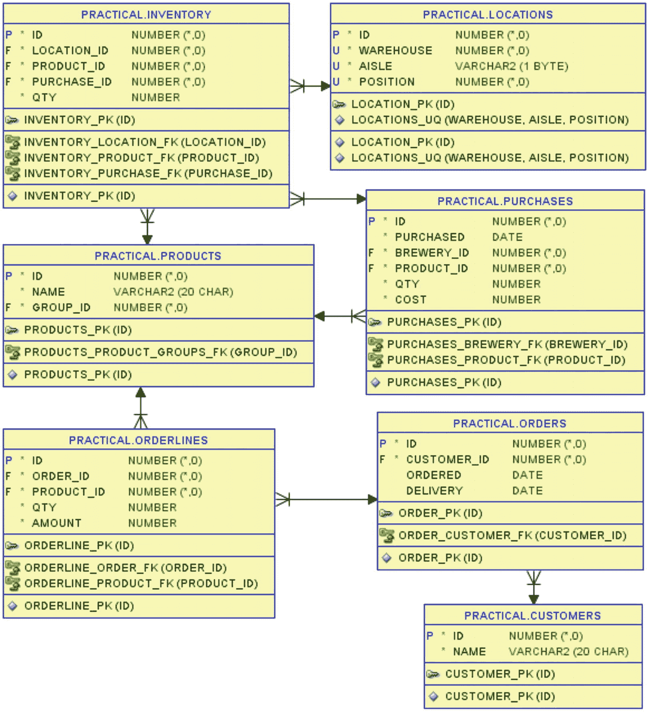

*图 13-1：本章所使用的表*

`inventory`表中存储了给定产品在给定位置的当前存储数量，以及该数量源自哪次采购（从而告诉我们该位置的数量的“年龄”）。基本上，它就是指向`locations`、`products`和`purchases`表的外键，然后是一个`qty`列。

然后是`customers`，他们提交了`orders`，其中包含`orderlines`，指明了他们购买哪些`products`、购买多少以及价格多少。

为了简化对这些表的操作，我创建了代码清单 13-1 中所示的视图`inventory_with_dims`。这个视图简单地将库存表与三个引用表连接起来，这样我就能获得每个`inventory`行的所有相关信息（产品名称、采购日期、仓库、通道、位置）。

```sql
create or replace view inventory_with_dims
as
select
i.id
, i.product_id
, p.name as product_name
, i.purchase_id
, pu.purchased
, i.location_id
, l.warehouse
, l.aisle
, l.position
, i.qty
from inventory i
join purchases pu
on pu.id = i.purchase_id
join products p
on p.id = i.product_id
join locations l
on l.id = i.location_id;
```
*代码清单 13-1：连接库存表与其他相关表的视图*

当构建我的拣货 SQL 语句时，我将结合使用这个视图和`orderlines`表。

### 构建拣货 SQL 语句

对于问题的前两部分，我将仅拣选一个订单，即 ID 为 421 的订单。在代码清单 13-2 中，我仅展示该订单的数据。

```sql
SQL> select
2     c.id           as c_id
3   , c.name         as c_name
4   , o.id           as o_id
5   , ol.product_id  as p_id
6   , p.name         as p_name
7   , ol.qty
8  from orders o
9  join orderlines ol
10     on ol.order_id = o.id
11  join products p
12     on p.id = ol.product_id
13  join customers c
14     on c.id = o.customer_id
15  where o.id = 421
16  order by o.id, ol.product_id;
```
*代码清单 13-2：我将要拣选的订单数据*

如你在此处的输出所见，The White Hart 酒馆订购了 110 瓶 Hoppy Crude Oil 和 140 瓶 Der Helle Kumpel：

```
C_ID   C_NAME          O_ID  P_ID  P_NAME            QTY
50042  The White Hart  421   4280  Hoppy Crude Oil   110
50042  The White Hart  421   6520  Der Helle Kumpel  140
```

接下来是开始构建分析 SQL 语句的时候了。

#### 通过 FIFO 解决拣选一个订单的问题

首先，我在代码清单 13-3 中将订单 421 的`orderlines`与`inventory_with_dims`视图连接起来。

（请容忍我使用非常短的列别名，但这是获得*sqlcl*输出中非常窄的列宽、便于打印的一种简便方法。）

```sql
SQL> select
2     i.product_id as p_id
3   , ol.qty       as ord_q
4   , i.qty        as loc_q
5   , sum(i.qty) over (
6        partition by i.product_id
7        order by i.purchased, i.qty
8        rows between unbounded preceding and current row
9     )            as acc_q
10   , i.purchased
11   , i.warehouse  as wh
12   , i.aisle      as ai
13   , i.position   as pos
14  from orderlines ol
15  join inventory_with_dims i
16     on i.product_id = ol.product_id
17  where ol.order_id = 421
18  order by i.product_id, i.purchased, i.qty;
```
*代码清单 13-3：可供拣选的库存——按采购日期排序*

在第 5-9 行，我对库存数量进行滚动求和，按产品分区，并按采购日期排序。对于那些采购日期相同的多行，我将数量也加入排序条件，以便先清理掉仓库中较小数量的库存。

在这个查询中，第 18 行的最终`order by`与分析函数中`partition by`后跟`order by`的列相匹配。这不是必须的（稍后我会故意改变它），但当它们像这里一样匹配时，优化器可以通过单次排序操作完成这两件事。

输出显示了两个订购产品中每一个的所有库存（按采购顺序），并且在`acc_q`列（累计数量）中，我可以看到滚动求和：

```
P_ID  ORD_Q  LOC_Q  ACC_Q  PURCHASED   WH  AI  POS
4280  110    36     36     2018-02-23  1   C   1
4280  110    39     75     2018-04-23  1   D   18
4280  110    35     110    2018-06-23  2   B   3
4280  110    34     144    2018-08-23  2   C   20
4280  110    37     181    2018-10-23  1   A   4
4280  110    19     200    2018-12-23  2   C   7
6520  140    14     14     2018-02-26  2   B   5
6520  140    14     28     2018-02-26  1   A   29
6520  140    20     48     2018-02-26  1   C   13
6520  140    24     72     2018-02-26  2   B   26
6520  140    26     98     2018-04-26  2   D   9
6520  140    48     146    2018-04-26  1   A   16
6520  140    70     216    2018-06-26  1   C   5
6520  140    21     237    2018-08-26  2   C   31
6520  140    48     285    2018-08-26  1   D   19
6520  140    72     357    2018-10-26  2   A   1
6520  140    43     400    2018-12-26  1   B   32
```

所以这看起来正是我需要的，对吗？当滚动求和大于订购数量时，我就拣够了，对吧？我将在代码清单 13-4 中尝试这一点，方法是将代码清单 13-3 包装在一个内联视图中，并在`where`子句中进行过滤。

```sql
SQL> select *
2  from (
...
20  )
21  where acc_q <= ord_q
22  order by p_id, purchased, loc_q;
```
*代码清单 13-4：基于累计和进行过滤*

我得到正确的结果了吗？不，并不完全正确：

```
P_ID  ORD_Q  LOC_Q  ACC_Q  PURCHASED   WH  AI  POS
4280  110    36     36     2018-02-23  1   C   1
4280  110    39     75     2018-04-23  1   D   18
4280  110    35     110    2018-06-23  2   B   3
6520  140    14     14     2018-02-26  2   B   5
6520  140    14     28     2018-02-26  1   A   29
6520  140    20     48     2018-02-26  1   C   13
6520  140    24     72     2018-02-26  2   B   26
6520  140    26     98     2018-04-26  2   D   9
```


#### 问题描述

`Product 4280` 情况正常；只是在三个库位拣货后，其滚动总和（rolling sum）恰好匹配了 110 的订单数量。但 `Product 6520` 只拣到了 98，而它应该得到 140？如果回顾之前的输出，你会看到在下一个库位 (`1 A 16`)，滚动总和变成了 146，大于 140，因此该行未被包含在输出中，尽管我需要从那个库位拣取大部分数量。

问题在于，我无法在 `where` 子句中创建一个过滤器，使其只包含滚动总和大于订单数量的*第一个*行，而不包含任何*更多*的行。

#### 解决方案原理

但我可以做的是创建一个仅累加*之前*行的滚动总和，而不是包含当前行。这可以通过简单地将 清单 13-3 中的窗口结束点在第 8 行从 `current row` 改为 `1 preceding` 来实现，如 清单 13-5 所示。

```sql
...
5   , sum(i.qty) over (
6        partition by i.product_id
7        order by i.purchased, i.qty
8        rows between unbounded preceding and 1 preceding
9     )            as acc_prv_q
...
```
**清单 13-5**
仅累加之前行的总和

此输出中的滚动总和与 清单 13-3 的输出相比，向下移动了一行：

```text
P_ID  ORD_Q  LOC_Q  ACC_PRV_Q  PURCHASED   WH  AI  POS
4280  110    36                2018-02-23  1   C   1
4280  110    39     36         2018-04-23  1   D   18
4280  110    35     75         2018-06-23  2   B   3
4280  110    34     110        2018-08-23  2   C   20
4280  110    37     144        2018-10-23  1   A   4
4280  110    19     181        2018-12-23  2   C   7
6520  140    14                2018-02-26  2   B   5
6520  140    14     14         2018-02-26  1   A   29
6520  140    20     28         2018-02-26  1   C   13
6520  140    24     48         2018-02-26  2   B   26
6520  140    26     72         2018-04-26  2   D   9
6520  140    48     98         2018-04-26  1   A   16
6520  140    70     146        2018-06-26  1   C   5
6520  140    21     216        2018-08-26  2   C   31
6520  140    48     237        2018-08-26  1   D   19
6520  140    72     285        2018-10-26  2   A   1
6520  140    43     357        2018-12-26  1   B   32
```

这意味着，在 清单 13-4 的输出中缺失的、产品 `6520` 在库位 `1 A 16` 的行，现在处于 `acc_prv_q` 小于 `ord_q` 的行窗口内。因此，我可以创建出能正确过滤所需数据的 清单 13-6。这就是本章开头描述的三个问题中第一个问题的解决方案。

```sql
SQL> select
2     wh, ai, pos, p_id
3   , least(loc_q, ord_q - acc_prv_q) as pick_q
4  from (
5     select
6        i.product_id as p_id
7      , ol.qty       as ord_q
8      , i.qty        as loc_q
9      , nvl(sum(i.qty) over (
10           partition by i.product_id
11           order by i.purchased, i.qty
12           rows between unbounded preceding and 1 preceding
13        ), 0)        as acc_prv_q
14      , i.purchased
15      , i.warehouse  as wh
16      , i.aisle      as ai
17      , i.position   as pos
18     from orderlines ol
19     join inventory_with_dims i
20        on i.product_id = ol.product_id
21     where ol.order_id = 421
22  )
23  where acc_prv_q < ord_q
24  order by wh, ai, pos;
```
**清单 13-6**
基于之前行累加的过滤

在第 9–13 行，我计算了之前行的滚动总和，但请注意，我需要使用 `nvl` 将第一行的 `null` 转换为零——否则，第 23 行的 `where` 子句会失败。

你可以将这个 `where` 子句理解为：“只要之前的行*尚未*拣够货以满足订单，我就需要将此行包含在输出中。”

在第 3 行，我计算了每一行所在库位需要拣取的数量。我知道还需要拣取多少：是订单数量 (`ord_q`) 减去之前行已拣取的数量 (`acc_prv_q`)。如果这个值小于库位上的库存 (`loc_q`)，那就是我需要拣取的数量。但如果它更大，那么当然我只能拣取库位上现有的数量。换句话说，我需要拣取这两个数字中较小的一个，这可以通过 `least` 函数实现。

最后，我清理了 `select` 列表，只保留了拣货单上必要的信息，并在第 23 行按库位顺序对行进行了排序：

```text
WH  AI  POS  P_ID  PICK_Q
1   A   16   6520  42
1   A   29   6520  14
1   C   1    4280  36
1   C   13   6520  20
1   D   18   4280  39
2   B   3    4280  35
2   B   5    6520  14
2   B   26   6520  24
2   D   9    6520  26
```

拣货操作员现在可以拿着这份清单，在仓库中按指定位置拣货。他将按照 图 13-2 所示的路线进行。

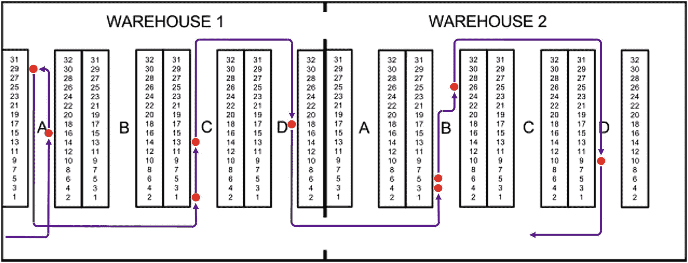
**图 13-2**
FIFO 拣货查询第一版的结果

这条路线的问题是，在拣完 A 通道的前两个库位后，他需要“从底部开始”在 C 通道拣货。这意味着他要么需要掉头（如图所示），要么可能需要不必要地“向下”行驶 B 通道。两种方式都不太理想，我稍后会回来解决这个问题。


### 拣货原则的轻松切换

但首先我想强调一点：查询本身的 `order by` 和分析函数内的 `order by` 不必像清单 13-3 中那样完全相同；它们可以像清单 13-6 的拣货列表查询那样有所不同，我在其中利用这一事实，通过分析函数的 `order by` 以 FIFO 顺序选择库存，但输出所选行时则按位置顺序排列。

这种分离意味着，我只需更改分析函数的 `order by`，就能轻松切换拣货原则，同时仍能按位置顺序获得输出。

因此，对于这些示例，假设啤酒可以无限期保存，所以无论我是否使用先进先出原则都无关紧要。

然后，我可以采用一种拣货原则，希望优先考虑靠近司机起点的货位，以便为他提供较短的拣货路线。我只需更改清单 13-6 中的第 11 行：

```
...
11           order by i.warehouse, i.aisle, i.position
...
```

按位置顺序选择要拣货的库存可以给出较短的路线；他根本不必进入 2 号仓库：

```
WH  AI  POS  P_ID  PICK_Q
1   A   4    4280  37
1   A   16   6520  48
1   A   29   6520  14
1   B   32   6520  43
1   C   1    4280  36
1   C   5    6520  35
1   D   18   4280  37
```

或者，我可以采用一种拣货原则，希望拣货次数最少：

```
...
11           order by i.qty desc
...
```

这将首先从数量大的库存中拣货，使得只需五次拣货即可完成订单：

```
WH  AI  POS  P_ID  PICK_Q
1   A   4    4280  37
1   C   1    4280  34
1   C   5    6520  68
1   D   18   4280  39
2   A   1    6520  72
```

但如果我首先从大数量中拣货，那么随着时间的推移，仓库里将充满只剩下少量“剩余”库存的货位。我可以选择一种拣货原则来清理这些小数量，腾出货位用于新库存：

```
...
11           order by i.qty
...
```

按数量 `asc`（升序）而非 `desc`（降序）排序有助于清理仓库中的货位，但当然，操作员需要在更多的地方拣货：

```
WH  AI  POS  P_ID  PICK_Q
1   A   29   6520  14
1   B   32   6520  21
1   C   1    4280  22
1   C   13   6520  20
2   B   3    4280  35
2   B   5    6520  14
2   B   26   6520  24
2   C   7    4280  19
2   C   20   4280  34
2   C   31   6520  21
2   D   9    6520  26
```

如你所见，将选择库存的 `order by` 与控制拣货顺序的 `order by` 分开后，可以轻松切换拣货策略。

阐明这一点后，回到解决图 13-2 的路线问题。

### 解决最优拣货路线

仅仅按位置顺序输出意味着拣货操作员需要在每个通道中朝同一方向（“向上”）行驶——这并不理想。我希望他能切换方向，使得每隔一个通道他“向下”行驶。

但这并非简单地规定在 A 和 C 通道向上、在 B 和 D 通道向下。相反，我需要他在访问的第一个、第三个、第五个……通道向上，然后在访问的第二个、第四个、第六个……通道向下。

为此，我首先扩展清单 13-6，增加一列为每个访问的通道分配一个连续编号（清单 13-7）。

```
SQL> select
2     wh, ai
3   , dense_rank() over (
4        order by wh, ai
5     ) as ai#
6   , pos, p_id
7   , least(loc_q, ord_q - acc_prv_q) as pick_q
8  from (
...
26  )
27  where acc_prv_q < ord_q
28  order by wh, ai, pos;
清单 13-7
为访问的仓库通道连续编号
```

第 3-5 行的分析函数 `dense_rank` 对于在 `order by` 子句所用列中具有相同值的行分配相同的排名。而且与 `rank` 不同，`dense_rank` 不会跳过任何数字（如我在第 12 章所示）；它连续分配排名。

因此，在 `dense_rank` 的 `order by` 中使用仓库和通道，`ai#` 列就包含了我想要的“已访问通道编号”：

```
WH  AI  AI#  POS  P_ID  PICK_Q
1   A   1    16   6520  42
1   A   1    29   6520  14
1   C   2    1    4280  36
1   C   2    13   6520  20
1   D   3    18   4280  39
2   B   4    3    4280  35
2   B   4    5    6520  14
2   B   4    26   6520  24
2   D   5    9    6520  26
```

这使我能够将清单 13-7 包装在一个内联视图中，创建具有奇偶排序逻辑的清单 13-8。

```
SQL> select *
2  from (
...
30  )
31  order by
32     wh, ai#
33   , case
34        when mod(ai#, 2) = 1 then +pos
35                             else -pos
36     end;
清单 13-8
交替进行升序和降序排序
```

首先，我按仓库和已访问通道排序，但在每个通道内，我使用第 33-36 行的 `case` 结构，在奇数编号的通道中按位置*升序*排序，在偶数编号的通道中按位置*降序*排序：

```
WH  AI  AI#  POS  P_ID  PICK_Q
1   A   1    16   6520  42
1   A   1    29   6520  14
1   C   2    13   6520  20
1   C   2    1    4280  36
1   D   3    18   4280  39
2   B   4    26   6520  24
2   B   4    5    6520  14
2   B   4    3    4280  35
2   D   5    9    6520  26
```

如图 13-3 所示，这为操作员提供了更好的拣货路线，因此清单 13-8 是我的三个问题中第二个问题的解决方案。

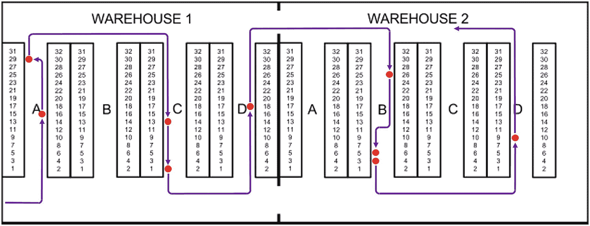

图 13-3

奇数/偶数已访问通道的交替位置顺序

我还可以展示一个变体，其中我可以非常轻松地调整查询以适应变化的条件。在图 13-3 中，你看到 1 号和 2 号仓库之间在底部和顶部都有门，但如果只有底部有门而顶部关闭了呢？

对清单 13-8 中的 `dense_rank` 调用进行小改动，即可生成清单 13-9。

```
...
5      , dense_rank() over (
6           partition by wh
7           order by ai
8        ) as ai#
...
清单 13-9
在每个仓库内重新开始通道编号
```

我所做的只是将按仓库和通道的 `order by` 更改为按仓库的 `partition by` 和按通道的 `order by`。结果是，分配给 `ai#` 列的排名在每个仓库中从 1 重新开始：

```
WH  AI  AI#  POS  P_ID  PICK_Q
1   A   1    16   6520  42
1   A   1    29   6520  14
1   C   2    13   6520  20
1   C   2    1    4280  36
1   D   3    18   4280  39
2   B   1    3    4280  35
2   B   1    5    6520  14
2   B   1    26   6520  24
2   D   2    9    6520  26
```

当 `ai#` 在每个仓库中重新开始时，这意味着 2 号仓库中的 B 通道从他整体访问的第四个通道变成了他在 2 号仓库中访问的第一个通道。这意味着它从一个偶数编号的通道（降序排序）变成了一个奇数编号的通道（升序排序）。

这就得到了图 13-4 所示的拣货路线。

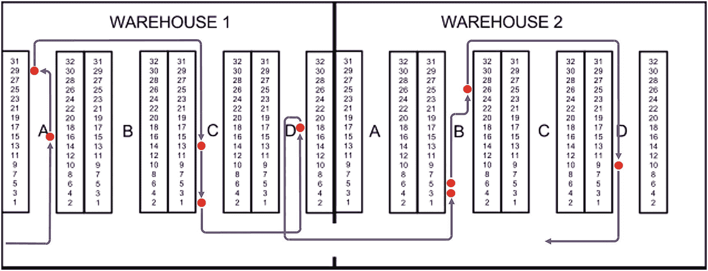

图 13-4

当仓库之间仅有一扇门时会发生什么

前两个问题现已解决，因此我现在将继续处理第三个也是最后一个问题。


### 解决批量拣货问题

到目前为止，我能够按照 FIFO 原则为单笔订单规划出良好的拣货路径，这固然不错，但为了高效作业，我需要拣货员能够在一次仓库巡行中同时拣选多个订单。

因此，我将再次使用清单 13-2 来展示订单数据，不过这次是另外两笔订单。在现实中，我可能会为“拣货批次”建立一个表，用于指定哪些订单应包含在一个批次中，但在这里，我仅使用 `in` 子句来编码这两个订单 ID：

```
...
15  where o.id in (422, 423)
...
```

查询结果显示有两家酒馆，它们都订购了相同数量的 Hoppy Crude Oil 和 Der Helle Kumpel 啤酒：

```
C_ID   C_NAME           O_ID  P_ID  P_NAME            QTY
51069  Der Wichtelmann  422   4280  Hoppy Crude Oil   80
51069  Der Wichtelmann  422   6520  Der Helle Kumpel  80
50741  Hygge og Humle   423   4280  Hoppy Crude Oil   60
50741  Hygge og Humle   423   6520  Der Helle Kumpel  40
```

在清单 13-10 中，我可以从简单开始：先找出每种产品的总订购数量，然后对这些总量应用清单 13-6 的 FIFO 拣货方法。

#### 清单 13-10
FIFO 拣货：按总量拣选

```
SQL> with orderbatch as (
2     select
3        ol.product_id
4      , sum(ol.qty) as qty
5     from orderlines ol
6     where ol.order_id in (422, 423)
7     group by ol.product_id
8  )
9  select
10     wh, ai, pos, p_id
11   , least(loc_q, ord_q - acc_prv_q) as pick_q
12  from (
13     select
14        i.product_id as p_id
15      , ob.qty       as ord_q
16      , i.qty        as loc_q
17      , nvl(sum(i.qty) over (
18           partition by i.product_id
19           order by i.purchased, i.qty
20           rows between unbounded preceding and 1 preceding
21        ), 0)        as acc_prv_q
22      , i.purchased
23      , i.warehouse  as wh
24      , i.aisle      as ai
25      , i.position   as pos
26     from orderbatch ob
27     join inventory_with_dims i
28        on i.product_id = ob.product_id
29  )
30  where acc_prv_q < ord_q
31  order by wh, ai, pos;
```

使用 `with` 子句，我在第 1-8 行创建了 `orderbatch` 子查询，它只是对每种产品的订购数量进行聚合。查询的其余部分与清单 13-6 相同，除了在第 26 行使用了 `orderbatch`，而非 `orderlines` 表。

输出结果是一份拣货清单，显示了为满足这两笔订单需要拣选的物品：

```
WH  AI  POS  P_ID  PICK_Q
1   A   16   6520  22
1   A   29   6520  14
1   C   1    4280  36
1   C   13   6520  20
1   D   18   4280  39
2   B   3    4280  35
2   B   5    6520  14
2   B   26   6520  24
2   C   20   4280  30
2   D   9    6520  26
```

但这对拣货员来说有一个小问题——他能看到需要拣选多少数量，但不知道其中有多少需要打包到哪个订单里。

为了弄清楚这一点，我需要在清单 13-11 中计算出一些数量区间。

#### 清单 13-11
基于每种产品总拣货量的每次拣货数量区间

```
SQL> with orderbatch as (
...
8  )
9  select
10     wh, ai, pos, p_id
11   , least(loc_q, ord_q - acc_prv_q) as pick_q
12   , acc_prv_q + 1       as from_q
13   , least(acc_q, ord_q) as to_q
14  from (
15     select
16        i.product_id as p_id
17      , ob.qty       as ord_q
18      , i.qty        as loc_q
19      , nvl(sum(i.qty) over (
20           partition by i.product_id
21           order by i.purchased, i.qty
22           rows between unbounded preceding and 1 preceding
23        ), 0)        as acc_prv_q
24      , nvl(sum(i.qty) over (
25           partition by i.product_id
26           order by i.purchased, i.qty
27           rows between unbounded preceding and current row
28        ), 0)        as acc_q
29      , i.purchased
30      , i.warehouse  as wh
31      , i.aisle      as ai
32      , i.position   as pos
33     from orderbatch ob
34     join inventory_with_dims i
35        on i.product_id = ob.product_id
36  )
37  where acc_prv_q < ord_q
38  order by p_id, purchased, loc_q, wh, ai, pos;
```

第 14-36 行的内联视图与之前几乎相同，但我额外在第 24-28 行添加了一个累加求和。这样，我同时拥有了 `acc_prv_q`（前序行的滚动和）和 `acc_q`（包含当前行的滚动和）。

借助这些字段，我就能在第 12-13 行计算出该行的数量区间（从...到...），并在第 38 行进行了排序，以便你清晰地看到区间是如何变化的：

```
WH  AI  POS  P_ID  PICK_Q  FROM_Q  TO_Q
1   C   1    4280  36      1       36
1   D   18   4280  39      37      75
2   B   3    4280  35      76      110
2   C   20   4280  30      111     140
1   A   29   6520  14      1       14
2   B   5    6520  14      15      28
1   C   13   6520  20      29      48
2   B   26   6520  24      49      72
2   D   9    6520  26      73      98
1   A   16   6520  22      99      120
```

根据这些数量区间，你可以读出：第一行需要拣选的 36 件是产品 4280 总需 140 件中的第 1-36 件；下一行的 39 件则是第 37-75 件，依此类推。

如果你观察敏锐，可能已经发现清单 13-11 中，我实际上做了一个多余的分析函数调用。因为我同时调用了分析函数来计算前序行的滚动和，以及包含当前行的滚动和。但后者其实也可以通过（前序行的滚动和 + 当前行的数量）来计算。

因此，在清单 13-12 中，我稍作修改，仅计算前序行的滚动和，以节省一次分析函数调用。

#### 清单 13-12
使用单个分析函数计算数量区间

```
SQL> with orderbatch as (
...
8  )
9  select
10     wh, ai, pos, p_id
11   , least(loc_q, ord_q - acc_prv_q) as pick_q
12   , acc_prv_q + 1                   as from_q
13   , least(acc_prv_q + loc_q, ord_q) as to_q
14  from (
15     select
16        i.product_id as p_id
17      , ob.qty       as ord_q
18      , i.qty        as loc_q
19      , nvl(sum(i.qty) over (
20           partition by i.product_id
21           order by i.purchased, i.qty
22           rows between unbounded preceding and 1 preceding
23        ), 0)        as acc_prv_q
24      , i.purchased
25      , i.warehouse  as wh
26      , i.aisle      as ai
27      , i.position   as pos
28     from orderbatch ob
29     join inventory_with_dims i
30        on i.product_id = ob.product_id
31  )
32  where acc_prv_q < ord_q
33  order by p_id, purchased, loc_q, wh, ai, pos;
```

内联视图现在只包含 `acc_prv_q`（和以前一样），然后在第 13 行，我使用 `acc_prv_q + loc_q` 代替了已不存在的 `acc_q`。清单 13-12 的结果与清单 13-11 完全相同。


仅有拣货的数量区间还不够；我还需要为订单建立类似的数量区间，如代码清单 13-13 所示。

```
SQL> select
2     ol.order_id    as o_id
3   , ol.product_id  as p_id
4   , ol.qty
5   , nvl(sum(ol.qty) over (
6        partition by ol.product_id
7        order by ol.order_id
8        rows between unbounded preceding and 1 preceding
9     ), 0) + 1      as from_q
10   , nvl(sum(ol.qty) over (
11        partition by ol.product_id
12        order by ol.order_id
13        rows between unbounded preceding and 1 preceding
14     ), 0) + ol.qty as to_q
15  from orderlines ol
16  where ol.order_id in (422, 423)
17  order by ol.product_id, ol.order_id;
清单 13-13
基于每个产品总数量为每个订单计算数量区间
```

这里我跳过了内嵌视图，而是在第 5-9 行直接计算 `from_q`，在第 10-14 行计算 `to_q`。在这两处计算中，我都对之前的所有行进行了滚动求和，这样当我在两个地方使用完全相同的分析函数表达式时，SQL 引擎会识别出这一点，并且只执行一次分析函数调用。

输出结果向我展示，订单 422 中订购的产品 4280 的 80 个数量，是总数 140 中的第 1 到 80 个，这与之前的拣货数量区间类似。

```
O_ID  P_ID  QTY  FROM_Q  TO_Q
422   4280  80   1       80
423   4280  60   81      140
422   6520  80   1       80
423   6520  40   81      120
```

有了这两组数量区间，我可以在它们重叠的地方进行连接，从而查看每次拣货分别有多少数量流向哪个订单。代码清单 13-14 将代码整合在了一起。

```
SQL> with olines as (
2     select
3        ol.order_id    as o_id
4      , ol.product_id  as p_id
5      , ol.qty
6      , nvl(sum(ol.qty) over (
           partition by ol.product_id
           order by ol.order_id
           rows between unbounded preceding and 1 preceding
        ), 0) + 1      as from_q
7      , nvl(sum(ol.qty) over (
           partition by ol.product_id
           order by ol.order_id
           rows between unbounded preceding and 1 preceding
        ), 0) + ol.qty as to_q
8     from orderlines ol
9     where ol.order_id in (422, 423)
18  ), orderbatch as (
19     select
20        ol.p_id
21      , sum(ol.qty) as qty
22     from olines ol
23     group by ol.p_id
24  ), fifo as (
25     select
26        wh, ai, pos, p_id, loc_q
27      , least(loc_q, ord_q - acc_prv_q) as pick_q
28      , acc_prv_q + 1                   as from_q
29      , least(acc_prv_q + loc_q, ord_q) as to_q
30     from (
31        select
32           i.product_id as p_id
33         , ob.qty       as ord_q
34         , i.qty        as loc_q
35         , nvl(sum(i.qty) over (
              partition by i.product_id
              order by i.purchased, i.qty
              rows between unbounded preceding and 1 preceding
           ), 0)        as acc_prv_q
36         , i.purchased
37         , i.warehouse  as wh
38         , i.aisle      as ai
39         , i.position   as pos
40        from orderbatch ob
41        join inventory_with_dims i
42           on i.product_id = ob.p_id
43     )
44  )
45  select
46     f.wh, f.ai, f.pos, f.p_id
47   , f.pick_q, f.from_q as p_f_q, f.to_q as p_t_q
48   , o.o_id, o.from_q as o_f_q, o.to_q as o_t_q
49  from fifo f
50  join olines o
51     on o.p_id = f.p_id
52     and o.from_q <= f.to_q
53     and o.to_q >= f.from_q
54     and o.from_q <= f.to_q
55  order by f.p_id, f.from_q, o.from_q;
清单 13-14
连接重叠的拣货与订单数量区间
```

我使用三个 `with` 子句子查询构建了这个查询：

*   首先，我创建了 `olines`，即清单 13-13，它计算了订单行项目的数量区间。
*   然后是 `orderbatch`，类似于我在清单 13-12 中的做法，只是我在第 22 行使用 `olines` 进行聚合，而不是 `orderlines` 表，因为 `olines` 已经包含了所需的订单行项目。
*   第三个子查询是 `fifo`，它也来自清单 13-12，负责构建包含数量区间的 FIFO 拣货。

然后主查询基于产品 ID 和重叠的数量区间，对 `fifo` 和 `olines` 进行连接。在结果输出中，拣货的起止区间显示为 `p_f_q` / `p_t_q`，订单行项目的起止区间显示为 `o_f_q` / `o_t_q`（短列名有利于打印）：

```
WH  AI  POS  P_ID  PICK_Q  P_F_Q  P_T_Q  O_ID  O_F_Q  O_T_Q
1   C   1    4280  36      1      36     422   1      80
1   D   18   4280  39      37     75     422   1      80
2   B   3    4280  35      76     110    422   1      80
2   B   3    4280  35      76     110    423   81     140
2   C   20   4280  30      111    140    423   81     140
1   A   29   6520  14      1      14     422   1      80
2   B   5    6520  14      15     28     422   1      80
1   C   13   6520  20      29     48     422   1      80
2   B   26   6520  24      49     72     422   1      80
2   D   9    6520  26      73     98     422   1      80
2   D   9    6520  26      73     98     423   81     120
1   A   16   6520  22      99     120    423   81     120
```

在第一行，全部 36 个都流向了订单 422。同样，在第二行，全部 39 个也都流向了订单 422。

但接下来的 35 个拣货数量是第 76-110 个（总共 140 个），这与订单 422（第 1-80 个）和订单 423（第 81-140 个）都重叠。从这些重叠部分可以看出，35 个中的 5 个（第 76-80 个）应流向订单 422，35 个中的 30 个（第 81-110 个）应流向订单 423。

在清单 13-15 中，我计算了这一点，同时也稍微清理了一下查询，不显示中间计算列。

```
SQL> with olines as (
...
18  ), orderbatch as (
...
24  ), fifo as (
...
49  )
50  select
51     f.wh, f.ai, f.pos, f.p_id
52   , f.pick_q, o.o_id
53   , least(
54        f.loc_q
55      , least(o.to_q, f.to_q) - greatest(o.from_q, f.from_q) + 1
56     ) as q_f_o
57  from fifo f
58  join olines o
59     on o.p_id = f.p_id
60     and o.to_q >= f.from_q
61     and o.from_q <= f.to_q
62  order by f.p_id, f.from_q, o.from_q;
清单 13-15
每次拣货的数量分别流向了哪个订单，各是多少
```

第 53-56 行计算了“流向订单的数量” (`q_f_o`)，取的是库位上的数量或“重叠区间的大小”这两者中较小的一个。结果是以下输出，包含了拣货操作员所需的全部信息：

```
WH  AI  POS  P_ID  PICK_Q  O_ID  Q_F_O
1   C   1    4280  36      422   36
1   D   18   4280  39      422   39
2   B   3    4280  35      422   5
2   B   3    4280  35      423   30
2   C   20   4280  30      423   30
1   A   29   6520  14      422   14
2   B   5    6520  14      422   14
1   C   13   6520  20      422   20
2   B   26   6520  24      422   24
2   D   9    6520  26      422   8
2   D   9    6520  26      423   18
1   A   16   6520  22      423   22
```

这样就解决了第三个问题；现在，完成解决方案只需要将问题 2 和问题 3 的解法结合起来，拣货操作员就能以高效的拣货路线进行批次拣货了。

#### 完成完整的拣货 SQL

我有用于批量拣货的清单 13-15 和用于良好拣货路线的清单 13-8。将两者结合在清单 13-16 中，就得到了完整的解决方案。

```sql
SQL> with olines as (
...
18  ), orderbatch as (
...
24  ), fifo as (
...
49  ), pick as (
50     select
51        f.wh, f.ai
52      , dense_rank() over (
53           order by wh, ai
54        ) as ai#
55      , f.pos, f.p_id
56      , f.pick_q, o.o_id
57      , least(
58           f.loc_q
59         , least(o.to_q, f.to_q) - greatest(o.from_q, f.from_q) + 1
60        ) as q_f_o
61     from fifo f
62     join olines o
63        on o.p_id = f.p_id
64        and o.to_q >= f.from_q
65        and o.from_q <= f.to_q
66  )
67  select
68     p.wh, p.ai, p.pos
69   , p.p_id, p.pick_q
70   , p.o_id, p.q_f_o
71  from pick p
72  order by p.wh
73         , p.ai#
74         , case
75              when mod(p.ai#, 2) = 1 then +p.pos
76                                     else -p.pos
77           end;
Listing 13-16
最终的 FIFO 批量拣货 SQL 语句
```

`with` 子句中的子查询 `olines`、`orderbatch` 和 `fifo` 与清单 13-15 相同。然后，我将清单 13-15 中的主查询放到了第 49-66 行的子查询 `pick` 中。

我在第 52-54 行增加了“访问通道编号” `ai#`（来自清单 13-8）的计算。

接着，主查询只是从 `pick` 子查询中选择必要的信息，并使用清单 13-8 中的 `order by` 来提供最优的拣货路线：

```
WH  AI  POS  P_ID  PICK_Q  O_ID  Q_F_O
1   A   16   6520  22      423   22
1   A   29   6520  14      422   14
1   C   13   6520  20      422   20
1   C   1    4280  36      422   36
1   D   18   4280  39      422   39
2   B   26   6520  24      422   24
2   B   5    6520  14      422   14
2   B   3    4280  35      422   5
2   B   3    4280  35      423   30
2   C   20   4280  30      423   30
2   D   9    6520  26      422   8
2   D   9    6520  26      423   18
```

其中，像 `2 B 3` 这样的库位在列表中重复出现，可以看到它显示应拣取 `35` 件，其中 `5` 件放入订单 `422` 的包裹，`30` 件放入订单 `423` 的包裹。

有了这份列表，拣货操作员将被引导通过仓库中的良好路线，为一批多个订单拣选产品，这些产品是按先进先出原则选择的。

总的来说，这几乎就是一个完整的仓库货物拣选应用，浓缩在一个 SQL 语句中。

### 经验教训

本章向你展示了如何构建一个单一 SQL 应用，其中多次使用了分析函数，为你提供了以下知识：

*   使用窗口子句对行子集应用分析函数 `sum`，以找到结果足够大的子集
*   使用分析滚动和计算间隔，以找到重叠的间隔
*   为结果分配 `dense_rank`，以实现交替的升序和降序排序

当你理解如何逐步使用分析函数构建这样的语句时，你就可以创建许多类似的、包含大量业务逻辑的语句，从而获得比提取数据并以过程方式执行相同逻辑好得多的性能。

