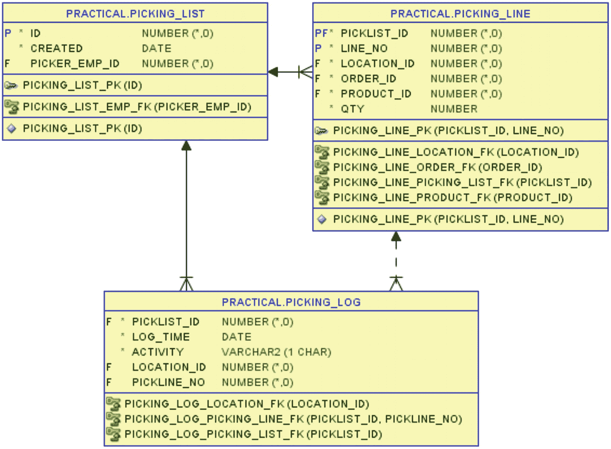
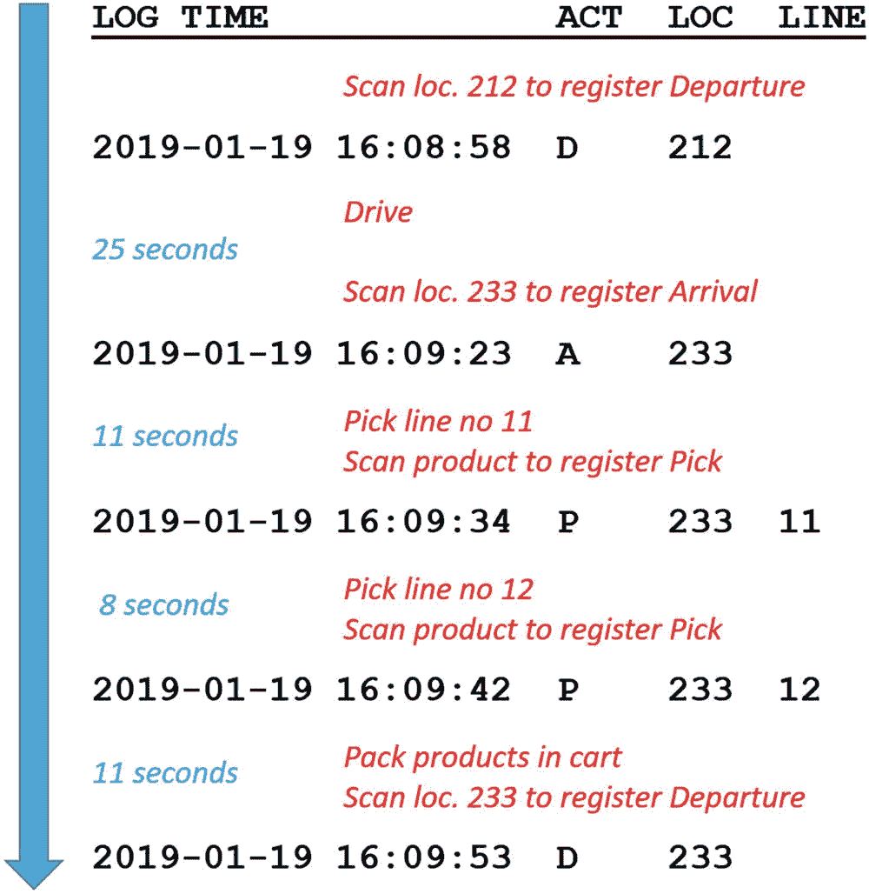
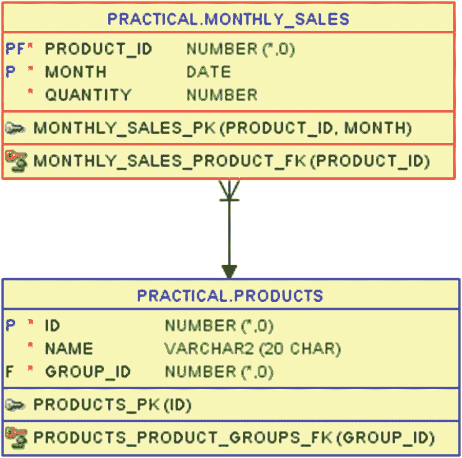
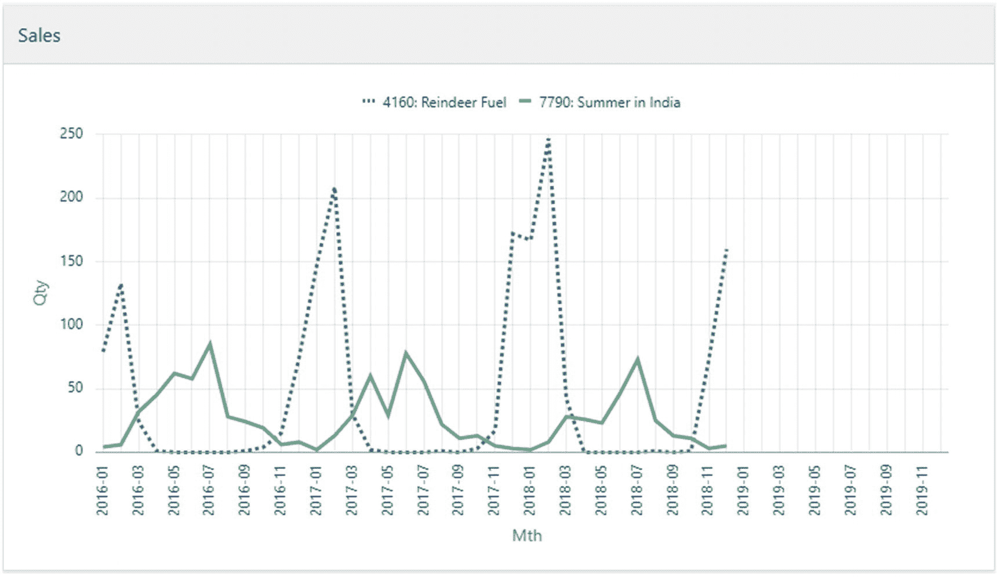
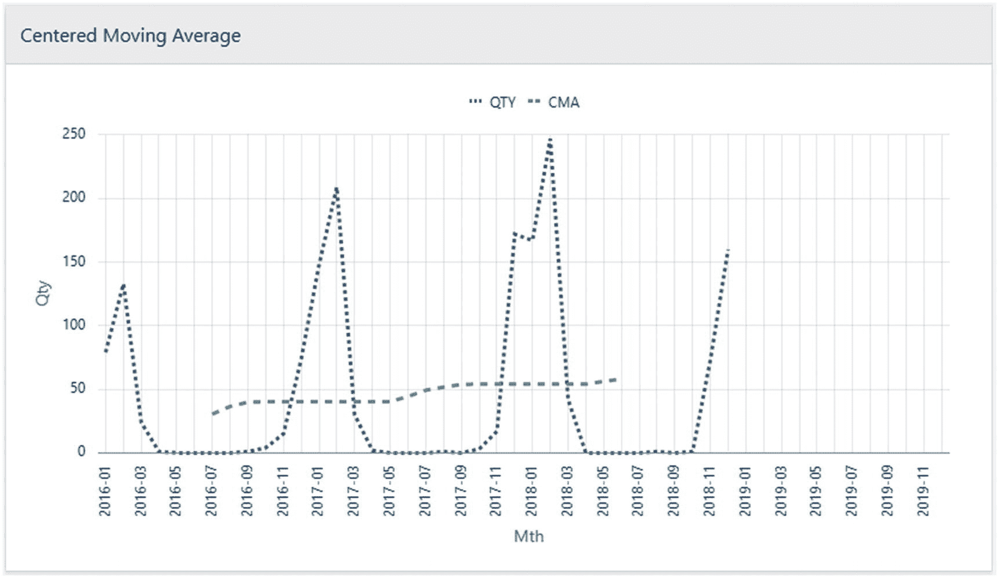
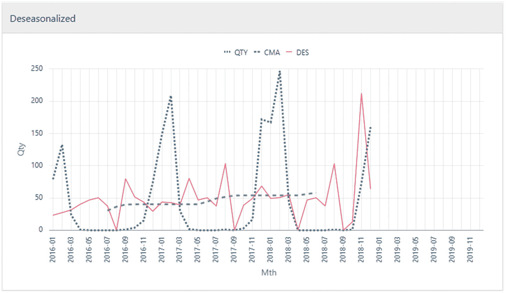
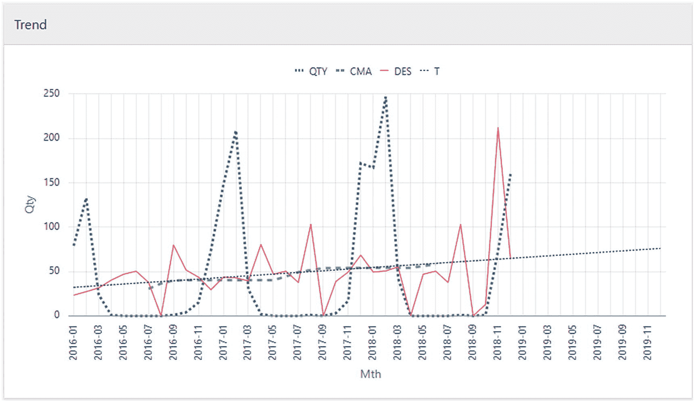
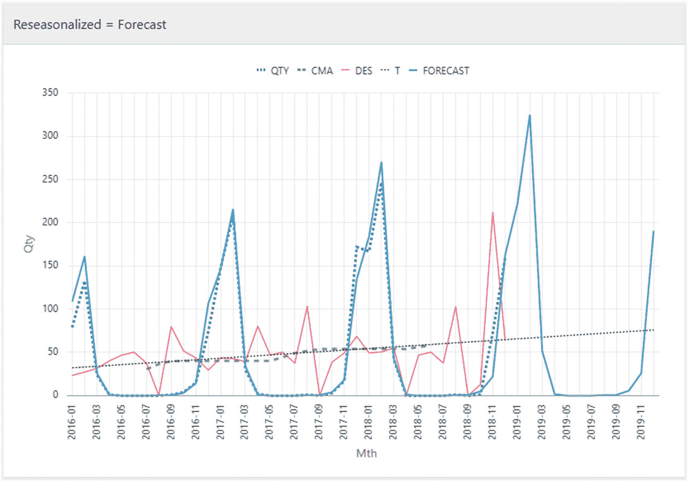
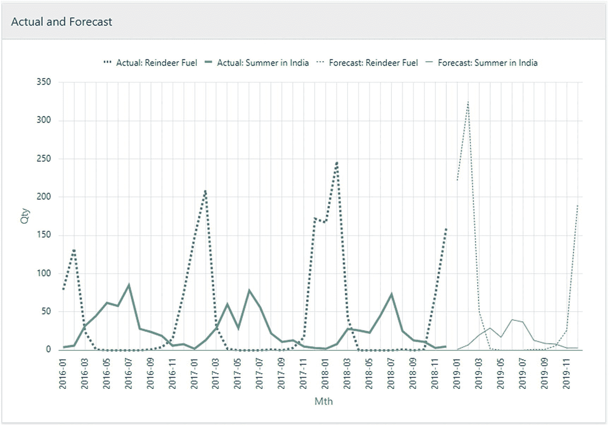
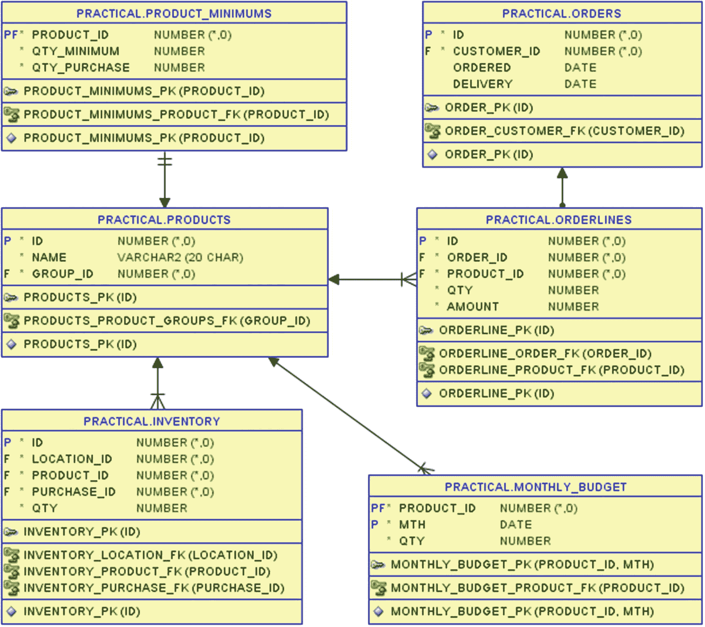

# 14. 使用 Lead 分析活动日志

日志可以记录很多事情，有时你很幸运，日志的每一行都是独立的，并且包含分析日志所需的所有数据。但大多数情况下，日志表中的一行记录了在*这个*确切的时间点，发生了*这个*特定的活动——而你需要分析的有趣事实是日志行*之间*相隔了多长时间。

这正是分析函数 `lag` 和 `lead` 非常有用的地方，因为它们可以在给定的行上使用，以检索给定顺序中之前行 (`lag`) 或之后行 (`lead`) 的信息。根据你构建逻辑的方式，你通常可以选择使用 `lag` 或 `lead`，但大多数情况下的决定因素将是行*何时*被插入到活动日志中。如果行在活动开始时插入，那么活动的时间就是此行与*下*一行之间的时间间隔，因此 `lead` 是合理的选择。相反，如果行在活动完成时插入，那么活动的时间就是*上*一行与此行之间的时间间隔，这时使用 `lag` 就有意义了。

当我第一次创建这类代码时工作的地方，有一个自动化的机器人拣货仓库，所以操作员站在固定的位置，箱子通过传送带送到他面前，他拣取产品，箱子移走，然后新箱子到来。箱子的到达和离开都被记录了下来，这意味着从箱子到达直到它离开的时间就是拣货所用的时间，而从箱子离开直到下一个箱子到达的时间就是等待时间。通过使用类似我在此展示的 `lead` SQL，我们可以分析何时等待时间过长，并利用这些信息来调整机器人仓库。

本书中的 Good Beer Trading Co 公司没有机器人仓库，但我在前一章展示了拣货优化。现在，我可以在本章跟进分析拣货和在仓库中走动分别用了多少时间。

### 拣货活动日志

在第 13 章，我展示了 Good Beer Trading Co 如何为多份订单计算出高效的啤酒仓库拣货清单。当仓库操作员开始拣选某些订单时，他们并不是直接打印第 13 章中查询的输出；而是在 `picking_list` 表中创建一个拣货清单，并将查询输出存储在 `picking_line` 表中，这两个表如图 14-1 所示。



图 14-1: 用于存放拣货清单和拣货操作日志的表

在拣货清单及对应的拣货行创建并打印出来后，拣货操作员便驾驶着他的电动拣货车出发了。当他沿途行驶并在仓库中拣选啤酒时，他会扫描货位货架和啤酒上的条形码以记录他的活动——该活动存储在 `picking_log` 表中，你可以在代码清单 14-1 中看到其内容。

```sql
SQL> select
2     list.picker_emp_id as emp
3   , list.id            as list
4   , log.log_time
5   , log.activity       as act
6   , log.location_id    as loc
7   , log.pickline_no    as line
8  from picking_list list
9  join picking_log log
10     on log.picklist_id = list.id
11  order by list.id, log.log_time;
```

代码清单 14-1: 拣货清单的活动日志内容

我与 `picking_list` 表进行连接是为了获取员工 ID，这样在我的统计报告中，我可以比较并看出哪位操作员工作速度最快，以便（他/她）可以教导其他人：

```sql
EMP  LIST  LOG_TIME             ACT  LOC  LINE
149  841   2019-01-16 14:05:11  D
149  841   2019-01-16 14:05:44  A    16
149  841   2019-01-16 14:05:52  P    16   1
149  841   2019-01-16 14:06:01  D    16
149  841   2019-01-16 14:06:20  A    29
149  841   2019-01-16 14:06:27  P    29   2
...
149  841   2019-01-16 14:13:00  D    233
149  841   2019-01-16 14:14:41  A
152  842   2019-01-19 16:01:12  D
152  842   2019-01-19 16:01:48  A    16
152  842   2019-01-19 16:01:53  P    16   1
...
152  842   2019-01-19 16:08:58  D    212
152  842   2019-01-19 16:09:23  A    233
152  842   2019-01-19 16:09:34  P    233  11
152  842   2019-01-19 16:09:42  P    233  12
152  842   2019-01-19 16:09:53  D    233
152  842   2019-01-19 16:11:42  A
63 rows selected.
```

在表的 `activity` 列（输出中的 `act`）中，可以存储 `D` 代表离开，`A` 代表到达，或 `P` 代表拣货。当他从一个货位驶离时，他会扫描货位条形码，表中会插入一行 `D`。到达下一个货位时，他再次扫描货位条形码，创建一行 `A`。然后他会在该货位拣选一个或多个拣货行，每次扫描啤酒时都会创建一个 `P` 行。

在两端会有一些微小变化。当他开始拣货行程时，会插入一行 `D`，其货位为 `null`。当他完成并返回起点时，同样会插入一行 `A`，其货位也为 `null`。

除了这个变化，工作遵循一个重复的循环，如图 14-2 所示。



图 14-2: 部分拣货日志的时间线

你可以看到他是如何工作的，一边前进一边扫描货位和啤酒，这个循环不断重复。总是 `D->A->P->D`，并且在一个循环中可能出现不止一个 `P`。

但有趣的是分析行与行之间的*秒数*，并弄清楚那 25 秒是行驶时间，那 11+8 秒是拣货时间，最后的 11 秒是打包时间。我会展示所有这些，但我首先从简单地计算 `driving`（行驶）和 `work`（工作，将拣货和打包合并）开始。

### 分析出发与到达

首先，我将简单分析出发和到达，其中出发与到达之间的时间是 `driving` 时间，而到达与出发之间的时间是 `work` 时间（稍后我会查看工作时间中的拣货和打包部分）。在代码清单 14-2 中，我只查看 `D` 和 `A` 活动。

```sql
SQL> select
2     list.picker_emp_id as emp
3   , list.id            as list
4   , log.log_time
5   , log.activity       as act
6   , log.location_id    as loc
7   , to_char(
8        lead(log_time) over (
9           partition by list.id
10           order by log.log_time
11        )
12      , 'HH24:MI:SS'
13     ) as next_time
14   , to_char(
15        lead(log_time, 2) over (
16           partition by list.id
17           order by log.log_time
18        )
19      , 'HH24:MI:SS'
20     ) as next2_time
21  from picking_list list
22  join picking_log log
23     on log.picklist_id = list.id
24  where log.activity in ('D', 'A')
25  order by list.id, log.log_time;
```

代码清单 14-2: 带有 `lead` 函数调用的出发和到达

我在第 24 行将数据限制为 `D` 和 `A` 活动。

在第 8-11 行使用 `lead` 获取下一行的 `log_time`，并在第 15 行的 `lead` 调用中添加参数 2，获取再下一行的 `log_time`：

```sql
EMP  LIST  LOG_TIME             ACT  LOC  NEXT_TIME  NEXT2_TIME
149  841   2019-01-16 14:05:11  D         14:05:44   14:06:01
149  841   2019-01-16 14:05:44  A    16   14:06:01   14:06:20
149  841   2019-01-16 14:06:01  D    16   14:06:20   14:06:35
149  841   2019-01-16 14:06:20  A    29   14:06:35   14:07:16
...
149  841   2019-01-16 14:11:26  D    163  14:12:42   14:13:00
149  841   2019-01-16 14:12:42  A    233  14:13:00   14:14:41
149  841   2019-01-16 14:13:00  D    233  14:14:41
149  841   2019-01-16 14:14:41  A
152  842   2019-01-19 16:01:12  D         16:01:48   16:02:04
152  842   2019-01-19 16:01:48  A    16   16:02:04   16:02:19
...
152  842   2019-01-19 16:09:53  D    233  16:11:42
152  842   2019-01-19 16:11:42  A
42 rows selected.
```

你注意到每个分区（拣货清单）的最后一行的 `next_time` 为 `null`，倒数第二行的 `next2_time` 为 `null`。这很合理，并且符合我的目的。

以这种方式两次使用 `lead`，使得每个 `D` 行都拥有一个完整的出发-到达-出发拣货循环的时间。同样，每个 `A` 行都有一个完整的到达-出发-到达循环的时间。我只需要其中之一，因此我选择在代码清单 14-3 中使用出发-到达-出发循环。

```sql
SQL> select
2     emp, list
3   , log_time as depart
4   , to_char(next_time , 'HH24:MI:SS') as arrive
5   , to_char(next2_time, 'HH24:MI:SS') as next_depart
6   , round((next_time  - log_time )*(24*60*60)) as drive
7   , round((next2_time - next_time)*(24*60*60)) as work
8  from (
9     select
10        list.picker_emp_id as emp
11      , list.id            as list
12      , log.log_time
13      , log.activity       as act
14      , lead(log_time) over (
15           partition by list.id
16           order by log.log_time
17        ) as next_time
18      , lead(log_time, 2) over (
19           partition by list.id
20           order by log.log_time
21        ) as next2_time
22     from picking_list list
23     join picking_log log
24        on log.picklist_id = list.id
25     where log.activity in ('D', 'A')
26  )
27  where act = 'D'
28  order by list, log_time;
```

代码清单 14-3: 出发–到达–出发循环

我在内嵌视图中使用了代码清单 14-2 的查询，并在第 27 行简单地只保留了 `D` 行——我需要的数据都在这些行中，可以跳过 `A` 行。


然后，我可以在第 3-5 行给时间列赋予有意义的名称（如果我选择了`A-D-A`周期而不是`D-A-D`周期，这些名称就会不同）。这使得在第 6-7 行计算用于`行驶`和`工作`的秒数变得容易（这里进行四舍五入只是因为如果不这样做，计算结果会在第 20 位小数左右显示出一个不可避免的微小舍入误差）：

```
EMP  LIST  DEPART               ARRIVE    NEXT_DEPART  DRIVE  WORK
149  841   2019-01-16 14:05:11  14:05:44  14:06:01     33     17
149  841   2019-01-16 14:06:01  14:06:20  14:06:35     19     15
...
149  841   2019-01-16 14:11:26  14:12:42  14:13:00     76     18
149  841   2019-01-16 14:13:00  14:14:41               101
152  842   2019-01-19 16:01:12  16:01:48  16:02:04     36     16
152  842   2019-01-19 16:02:04  16:02:19  16:02:37     15     18
...
152  842   2019-01-19 16:08:58  16:09:23  16:09:53     25     30
152  842   2019-01-19 16:09:53  16:11:42               109
21 rows selected.
```

每个拣货单（分区）的*最后一*行在`next_depart`字段有一个`null`值，这导致`work`的计算结果也变为`null`。如前所述，拣货员从`null`位置开始并在`null`位置结束，因此在拣货单上拣完*最后一个*产品后，他会登记离开该位置并到达`null`位置，表明他已完成工作且没有`next_depart`。因此，最后一个`D-A-D`拣货周期是不完整的；它只有`D-A`。（如果我选择使用`A-D-A`周期，那么将是*第一个*行不完整，只有`D-A`。）

清单 14-3 为我提供了每个拣货周期的详细信息。然后，我可以简单地在清单 14-4 中聚合这些数据，以获取该员工在每个拣货单上工作效率的一些统计数据。

```
SQL> select
2     max(emp) as emp
3   , list
4   , min(log_time) as begin
5   , to_char(max(next_time), 'HH24:MI:SS') as end
6   , count(*) as drives
7   , round(
8        avg((next_time - log_time )*(24*60*60))
9      , 1
10     ) as avg_d
11   , count(next2_time) as stops
12   , round(
13        avg((next2_time  - next_time)*(24*60*60))
14      , 1
15     ) as avg_w
16  from (
...
34  )
35  where act = 'D'
36  group by list
37  order by list;
清单 14-4
按拣货单统计
```

我采用清单 14-3 中的查询，在第 36 行附加了一个`group by`，然后在`select`列表中简单地选择我感兴趣的聚合值：

```
EMP  LIST  BEGIN                END       DRIVES  AVG_D  STOPS  AVG_W
149  841   2019-01-16 14:05:11  14:14:41  10      42.9   9      15.7
152  842   2019-01-19 16:01:12  16:11:42  11      41.5   10     17.4
```

在这里，我选择显示在拣货位置之间行驶所用的平均秒数以及在每个停靠点工作（拣货和包装）所用的平均秒数。我同样可以轻松地使用`min`、`max`、`median`、`sum`等，但我将此作为练习留给读者。更有趣的是继续分析数据，因为我也想纳入拣货活动。

### 分析拣货活动

我可以使用类似的`lead`技术来包含拣货活动，如清单 14-5 所示。

```
SQL> select
2     emp, list
3   , to_char(depart, 'HH24:MI:SS') as depart
4   , to_char(arrive, 'HH24:MI:SS') as arrive
5   , to_char(pick1 , 'HH24:MI:SS') as pick1
6   , to_char(
7        case when pick2 < next_depart then pick2 end
8      , 'HH24:MI:SS'
9     ) as pick2
10   , to_char(next_depart, 'HH24:MI:SS') as next_dep
11   , round((arrive      - depart)*(24*60*60)) as drv
12   , round((next_depart - arrive)*(24*60*60)) as wrk
13  from (
14     select
15        list.picker_emp_id as emp
16      , list.id            as list
17      , log.activity       as act
18      , log.log_time       as depart
19      , lead(log_time) over (
20           partition by list.id
21           order by log.log_time
22        ) as arrive
23      , lead(
24           case log.activity when 'P' then log_time end
25        ) ignore nulls over (
26           partition by list.id
27           order by log.log_time
28        ) as pick1
29      , lead(
30           case log.activity when 'P' then log_time end, 2
31        ) ignore nulls over (
32           partition by list.id
33           order by log.log_time
34        ) as pick2
35      , lead(
36           case log.activity when 'D' then log_time end
37        ) ignore nulls over (
38           partition by list.id
39           order by log.log_time
40        ) as next_depart
41     from picking_list list
42     join picking_log log
43        on log.picklist_id = list.id
44  )
45  where act = 'D'
46  order by list, depart;
清单 14-5
包含拣货活动
```

我这里调用了四次`lead`函数，对于任何`D`行，它们将给出以下信息：

*   第 19-22 行给出`D`行之后的下一行，这总是`A`行。
*   第 23-28 行通过使用`case`表达式对所有*不是*`P`行的行返回 null，从而给出`D`行之后的下一个`P`行，使我能够使用`ignore nulls`跳过那些行。
*   第 29-34 行几乎相同，只是在第 30 行添加了参数 2，以获取`D`行之后的*第二个*`P`行。
*   第 35-40 行最后使用`case`和`ignore nulls`技术获取当前`D`行之后的下一个`D`行。

所有这些给我一个与清单 14-3 非常相似的输出，只是增加了第一次和第二次（如果有）拣货时间的列：

```
EMP  LIST  DEPART    ARRIVE    PICK1     PICK2     NEXT_DEP  DRV  WRK
149  841   14:05:11  14:05:44  14:05:52            14:06:01  33   17
149  841   14:06:01  14:06:20  14:06:27            14:06:35  19   15
...
149  841   14:11:26  14:12:42  14:12:53            14:13:00  76   18
149  841   14:13:00  14:14:41                                101
152  842   16:01:12  16:01:48  16:01:53            16:02:04  36   16
...
152  842   16:07:03  16:07:12  16:07:16  16:07:22  16:07:34  9    22
152  842   16:07:34  16:08:44  16:08:49            16:08:58  70   14
152  842   16:08:58  16:09:23  16:09:34  16:09:42  16:09:53  25   30
152  842   16:09:53  16:11:42                                109
21 rows selected.
```

我*可以*开始计算在`wrk`秒数中，有多少秒用于拣货和包装，但这并不是一个很好的继续方式，因为这段代码仅在工人每次停靠最多拣选*两*个拣货行时才有效。试图不断添加多个`lead`调用来创建`pick1`到`pick<n>`列是个坏主意。我想尝试其他方法。

当我不知道每次停靠可能有多少次拣货时，使用行而不是列来处理会更好。但这样我就需要知道哪些行属于同一个拣货周期。我可以在清单 14-6 中使用`last_value`来实现这一点。


### SQL 查询优化：识别与分析拣货周期

SQL> select
2     list.picker_emp_id as emp
3   , list.id            as list
4   , last_value(
5        case log.activity when 'D' then log_time end
6     ) ignore nulls over (
7        partition by list.id
8        order by log.log_time
9        rows between unbounded preceding and current row
10     ) as begin_cycle
11   , to_char(log_time, 'HH24:MI:SS') as act_time
12   , log.activity as act
13   , lead(activity) over (
14        partition by list.id
15        order by log.log_time
16     ) as next_act
17   , round((
18        lead(log_time) over (
19           partition by list.id
20           order by log.log_time
21        ) - log_time
22     )*(24*60*60)) as secs
23  from picking_list list
24  join picking_log log
25     on log.picklist_id = list.id
26  order by list.id, log.log_time;

**代码清单 14-6**
识别周期

第 5 行用作 `last_value` 参数的 `case` 表达式只会为 `'D'` 行返回 `log_time` 值，否则为 `null`。因此在 `'D'` 行上，`last_value` 调用的输出将是该行的 `log_time`。在下一行上，第 6 行的 `ignore nulls` 子句使 `last_value` 向后查找最后一个非空值，即上一个 `'D'` 行的 `log_time`。这个过程在每个后续行上重复，直到遇到新的 `'D'` 行，这使得属于同一拣货周期的所有行在 `begin_cycle` 列中具有相同的值。

通过第 13–22 行的 `lead` 调用，我在每一行上计算了*下一行*的活动是什么以及*此*活动持续了多少秒。最终我得到一份包含所有行详细信息的输出，但已准备好按每个周期进行分组：

```
EMP  LIST  BEGIN_CYCLE          ACT_TIME  ACT  NEXT_ACT  SECS
149  841   2019-01-16 14:05:11  14:05:11  D    A         33
149  841   2019-01-16 14:05:11  14:05:44  A    P         8
149  841   2019-01-16 14:05:11  14:05:52  P    D         9
149  841   2019-01-16 14:06:01  14:06:01  D    A         19
149  841   2019-01-16 14:06:01  14:06:20  A    P         7
149  841   2019-01-16 14:06:01  14:06:27  P    D         8
...
149  841   2019-01-16 14:13:00  14:13:00  D    A         101
149  841   2019-01-16 14:13:00  14:14:41  A
152  842   2019-01-19 16:01:12  16:01:12  D    A         36
152  842   2019-01-19 16:01:12  16:01:48  A    P         5
152  842   2019-01-19 16:01:12  16:01:53  P    D         11
...
152  842   2019-01-19 16:08:58  16:08:58  D    A         25
152  842   2019-01-19 16:08:58  16:09:23  A    P         11
152  842   2019-01-19 16:08:58  16:09:34  P    P         8
152  842   2019-01-19 16:08:58  16:09:42  P    D         11
152  842   2019-01-19 16:09:53  16:09:53  D    A         109
152  842   2019-01-19 16:09:53  16:11:42  A
63 rows selected.
```

现在，我已获得进行包含拣货和包装活动分析所需的数据，无论每个停靠点有多少次拣货。

### 完整拣货周期分析

我可以使用 `group by` 对 `emp`、`list` 和 `begin_cycle` 进行分组，以获取每个拣货周期的数据，但在本例中，使用**代码清单** 14-7 中由 `pivot` 执行的*隐式*分组可能会更简单一些。

SQL> select *
2  from (
3     select
4        list.picker_emp_id as emp
5      , list.id            as list
6      , last_value(
7           case log.activity when 'D' then log_time end
8        ) ignore nulls over (
9           partition by list.id
10           order by log.log_time
11           rows between unbounded preceding and current row
12        ) as begin_cycle
13      , lead(activity) over (
14           partition by list.id
15           order by log.log_time
16        ) as next_act
17      , round((
18           lead(log_time) over (
19              partition by list.id
20              order by log.log_time
21           ) - log_time
22        )*(24*60*60)) as secs
23     from picking_list list
24     join picking_log log
25        on log.picklist_id = list.id
26  ) pivot (
27     sum(secs)
28     for (next_act) in (
29        'A' as drive   -- D->A
30      , 'P' as pick    -- A->P or P->P
31      , 'D' as pack    -- P->D
32     )
33  )
34  order by list, begin_cycle;

**代码清单 14-7**
通过透视对周期进行分组

我将**代码清单** 14-6 包装在一个内联视图中，并对结果使用了 `pivot` 操作符。但由于 `pivot` 会对所有未在 `pivot` 子句本身中使用的列进行隐式 `group by`，所以我确实需要从**代码清单** 14-6 中排除 `act_time` 和 `act` 列，因为它们会破坏隐式分组。

如果你再看一下图 14-2，你会发现一行的活动和下一行的活动之间有四种可能的组合。从 `'D'` 行到 `'A'` 行所花费的秒数是驾驶时间，从 `'A'` 行到 `'P'` 行所花费的秒数是拣货时间，从 `'P'` 行到 `'P'` 行所花费的秒数*也*是拣货时间，最后从 `'P'` 行到 `'D'` 行所花费的秒数是包装时间。

这意味着我可以在第 28 行根据 `next_act` 列进行 `pivot`，使用三个不同的值创建虚拟列 `drive`、`pick` 和 `pack`。第 30 行代表了两种拣货情况：`A->P` 和 `P->P`。

因此，通过在第 27 行放置 `sum` 聚合，我得到一个包含每个拣货周期的输出，就像**代码清单** 14-3 的输出一样，只是我现在将工作时间拆分成了 `pick` 和 `pack`，其中 `pick` 列可能包含来自拣货日志中一行或多行的时间：

```
EMP  LIST  BEGIN_CYCLE          DRIVE  PICK  PACK
149  841   2019-01-16 14:05:11  33     8     9
149  841   2019-01-16 14:06:01  19     7     8
...
149  841   2019-01-16 14:11:26  76     11    7
149  841   2019-01-16 14:13:00  101
152  842   2019-01-19 16:01:12  36     5     11
...
152  842   2019-01-19 16:08:58  25     19    11
152  842   2019-01-19 16:09:53  109
21 rows selected.
```

如果我想显示每个停靠点的拣货次数，而不仅仅是用于拣货的总秒数，我可以在 `pivot` 子句中包含一个 `count(*)` 度量。

正如**代码清单** 14-4 聚合了**代码清单** 14-3 的数据一样，我使用**代码清单** 14-8 来聚合**代码清单** 14-7 的数据。

SQL> select
2     max(emp) as emp
3   , list
4   , min(begin_cycle) as begin
5   , count(*) as drvs
6   , round(avg(drive), 1) as avg_d
7   , count(pick) as stops
8   , round(avg(pick), 1) as avg_pick
9   , round(avg(pack), 1) as avg_pack
10  from (
...
34  ) pivot (
35     sum(secs)
36     for (next_act) in (
37        'A' as drive   -- D->A
38      , 'P' as pick    -- A->P or P->P
39      , 'D' as pack    -- P->D
40     )
41  )
42  group by list
43  order by list;

**代码清单 14-8**
基于透视周期的拣货单统计信息

这里值得注意的一点是，我*不需要*将**代码清单** 14-7 包装在另一个内联视图中；我可以在 `pivot` 之后直接添加 `group by`。实际上，这意味着将执行*两个*分组操作，首先是 `pivot` 中的隐式分组，然后是第 42 行中的显式分组，我在那里按每个拣货列表进行 `group by`：

```
EMP  LIST  BEGIN                DRVS  AVG_D  STOPS  AVG_PICK  AVG_PACK
149  841   2019-01-16 14:05:11  10    42.9   9      7.1       8.6
152  842   2019-01-19 16:01:12  11    41.5   10     7.8       9.6
```

和之前一样，你可以自己尝试做其他聚合，而不仅仅是 `count` 和 `avg`；你现在已经掌握了这项技术。

我本可以在此结束本章，但我只想给你一个小小的预告，当你读到本书第三部分时会看到什么。


## 第 15 章 使用线性回归进行预测

### 预热：行模式匹配

`match_recognize`子句（正式名称为行模式匹配）是 SQL 开发人员工具箱中一个非常强大的工具。本书的第 3 部分将专门介绍使用此子句的各种方法。

但本章我展示的内容，实际上是在检测数据中的模式并进行分组——即从`D`到`A`再到一个或多个`P`，最后回到`D`的活动周期模式。我曾通过刻意为`ignore nulls`子句创建`null`值，运用了分析函数工具箱中的一些实用技巧来创建周期分组，但代码清单 14-7 和 14-8 中的代码实际上做了什么，其逻辑相对晦涩难懂。

使用行模式匹配，我可以编写如代码清单 14-9 所示的 SQL 语句，乍一看可能显得更加晦涩，但一旦你了解了`match_recognize`，这实际上（请相信我）更具可读性。

```
SQL> select
2     *
3  from (
4     select
5        list.picker_emp_id as emp
6      , list.id            as list
7      , log.log_time
8      , log.activity       as act
9     from picking_list list
10     join picking_log log
11        on log.picklist_id = list.id
12  )
13  match_recognize (
14     partition by list
15     order by log_time
16     measures
17        max(emp) as emp
18      , first(log_time) as begin_cycle
19      , round(
20           (arrive.log_time - first(depart.log_time))
21         * (24*60*60)
22        ) as drive
23      , round(
24           (last(pick.log_time) - arrive.log_time)
25         * (24*60*60)
26        ) as pick
27      , round(
28           (next(last(pick.log_time)) - last(pick.log_time))
29         * (24*60*60)
30        ) as pack
31     one row per match
32     after match skip to last arrive
33     pattern (depart arrive pick* depart{0,1})
34     define
35        depart as act = 'D'
36      , arrive as act = 'A'
37      , pick   as act = 'P'
38  )
39  order by list;
代码清单 14-9
使用行模式匹配识别拣货周期
```

此时我不会深入讲解语法，但我邀请你在读完第 3 部分后回到这里，再次阅读这个代码清单，看看你是否同意（在掌握了相关语法知识后）代码的功能更加清晰明了。

但这里你可以注意到的重要一点是，在第 34-37 行，我进行了一些定义：`act = 'D'`的行被称为`depart`，`arrive`和`pick`同理。然后在第 33 行，我可以轻松地声明一个拣货周期包含一个`depart`，后跟一个`arrive`，再后跟零个或多个`pick`，最后跟零个或一个`depart`。你会注意到这与正则表达式语法的相似性。（零个或多个以及零个或一个的部分是为了处理每个拣货行程结束时的不完整拣货周期。）

正如代码清单 14-9 产生的输出与代码清单 14-7 相同，我也可以从代码清单 14-10 中获得与代码清单 14-8 相同的统计输出。

```
SQL> select
2     max(emp) as emp
3   , list
4   , min(begin_cycle) as begin
5   , count(*) as drvs
6   , round(avg(drive), 1) as avg_d
7   , count(pick) as stops
8   , round(avg(pick), 1) as avg_pick
9   , round(avg(pack), 1) as avg_pack
10  from (
...
19  )
20  match_recognize (
...
45  )
46  group by list
47  order by list;
代码清单 14-10
使用行模式匹配获取每个拣货单的统计数据
```

我希望我已经激发了你对本书第 3 部分的兴趣。当你完成第 3 部分的学习后，请回到这里并尝试运行这些代码。

### 经验总结

本章的技术是分析函数如何使你能够跨行使用数据进行行间计算的经典示例。你尤其看到了以下应用：

*   使用`lead`获取下一行的数据，或使用带可选参数的`lead`获取之后第 n 行的数据
*   使用`lead`的`ignore nulls`子句从下一行获取非空值，你可以自定义该值，使其仅在你希望`lead`获取数据的那些行上非空
*   使用带`ignore nulls`子句的`last_value`，在一组属于同一集合的行上设置一个共同值，并基于该共同值进行分组或透视

这些都是在许多情况下非常有用的技巧。如果使用这些技巧变得过于复杂，我建议考虑使用`match_recognize`（第 3 部分的主题）作为替代方案，它通常非常适合这些情况。

几年前，在我工作的一家零售公司，我们的数据分析师来找我。她正在预测我们每种产品在未来 12 个月的销量，并想知道我是否能帮忙开发一段 SQL 来实现这个功能。

这样的预测可以通过多种不同的模型来完成，每种模型适用于不同类型的数据和情况。她已经用工具进行了试验，研究并测试了选定产品的模型，并运用了数据分析师用来在我们的数据中发现规律的所有神奇方法。在这个过程中，她发现对于我们这种情况，一个非常适用的销售预测模型是具有季节性调整和指数平滑的时间序列模型。

为了帮助我理解这个模型并实现它，她带来了一个 Excel 电子表格。其中包含了我们一种产品过去 3 年的月度销售数据，然后是一系列列，这些列依次计算了模型中的中间步骤，最后得出下一年的预测结果。

对她来说，问题是这个电子表格虽然很好，但只能处理单一产品。而我们有 10 万种产品需要预测。因此，她非常希望预测可以直接在数据库中用 SQL 完成。

借助用于平均和线性回归的分析函数，我可以在 SQL 中实现相同的预测模型，通过一系列计算来模拟电子表格中每一列的计算过程。在本章中，我将一步步向你展示如何实现。

注意
我们分析师制作的、作为我开发此 SQL 基础的电子表格，是基于杜克大学福库商学院 Robert Nau 的工作成果，他撰写了相关内容，你可以在此处下载类似的电子表格：[*http://people.duke.edu/~rnau/411outbd.htm*](http://people.duke.edu/%7Ernau/411outbd.htm)。

### 销售预测

为了演示这个时间序列预测模型，我将使用我虚构的“好啤酒贸易公司”所售啤酒的月度销售数据。这些数据存储在图 15-1 所示的表中。



图 15-1

产品月度销售数据表

产品表中还有更多啤酒，但我将重点关注两种销售有明显季节性变化的啤酒——一种主要在冬季销售，另一种主要在夏季销售。代码清单 15-1 显示了通过主键 ID 值查询到的两种啤酒。

```
SQL> select id, name
2  from products
3  where id in (4160, 7790);
代码清单 15-1
用于展示预测的两种产品
```

因此你可以看到，如果我查询产品 ID 为 4160 和 7790 的销售数据，我将得到“驯鹿燃料”（Reindeer Fuel）和“印度之夏”（Summer in India）的数据：

```
ID NAME
---------- --------------------
4160 Reindeer Fuel
7790 Summer in India
```

我拥有 2016 年、2017 年和 2018 年的销售数据。除了具有明显的季节性变化外，“驯鹿燃料”的年销量在一点点增长，而“印度之夏”的年销量则在一点点减少。现在是时候尝试将这个时间序列预测模型应用于数据，预测 2019 年的销量了。


### 时间序列

时间序列预测首先要构建时间序列，这是一组连续的数据，每个数据点之间恰好相隔一个时间单位。在此例中，我使用月份作为时间单位。我拥有 3 年（即 36 个月）的实际数据，并希望预测 1 年（即 12 个月），因此需要为清单 15-2 中的每种啤酒创建一个包含 48 行的时间序列。

```sql
SQL> select
2     ms.product_id
3   , mths.mth
4   , mths.ts
5   , extract(year from mths.mth) as yr
6   , extract(month from mths.mth) as mthno
7   , ms.qty
8  from (
9     select
10        add_months(date '2016-01-01', level - 1) as mth
11      , level as ts --time series
12     from dual
13     connect by level <= 48
14  ) mths
15  left outer join (
16     select product_id, mth, qty
17     from monthly_sales
18     where product_id in (4160, 7790)
19  ) ms
20     partition by (ms.product_id)
21     on  ms.mth = mths.mth
22  order by ms.product_id, mths.mth;
Listing 15-2
构建 2016-2019 年两种啤酒的时间序列
```

第 9-13 行的内联视图 `mths` 创建了 48 行，对应 2016-2019 年中的每个月。`mth` 列包含 `date` 数据类型的月份，这是我需要与销售数据连接的。`ts` 列包含连续数字 1-48，可以将其视为“时间单位”的数量，在本例中即月份数。

第 16-18 行的内联视图 `ms` 简单地查询了 `monthly_sales` 表，获取我关注的两种产品——当我对模型满意时，只需删除第 18 行，即可对所有产品运行查询，而不仅限于两种。

第 20 行，两个内联视图之间的 `left outer join` 是按产品 ID 分区的，这意味着 `mths` 的 48 行将分别与每个产品进行外连接——首先与产品 4160 的 36 行进行外连接，然后与产品 7790 的 36 行进行外连接。

输出总共得到 96 行，部分展示如下：

```
PROD MTH      TS    YR MTHNO  QTY
---- ------- --- ----- ----- ----
4160 2016-01   1  2016     1   79
4160 2016-02   2  2016     2  133
...
4160 2018-11  35  2018    11   73
4160 2018-12  36  2018    12  160
4160 2019-01  37  2019     1
4160 2019-02  38  2019     2
...
4160 2019-11  47  2019    11
4160 2019-12  48  2019    12
7790 2016-01   1  2016     1    4
7790 2016-02   2  2016     2    6
...
7790 2018-11  35  2018    11    3
7790 2018-12  36  2018    12    5
7790 2019-01  37  2019     1
7790 2019-02  38  2019     2
...
7790 2019-11  47  2019    11
7790 2019-12  48  2019    12
96 rows selected.
```

对于每个产品，前 36 行在 `qty` 列中包含实际销售数据，然后是 12 行（`ts` = 37-48），其 `qty` 为 null——这 12 行将在我继续开发查询时用预测销售额填充。

在上面的输出中，我只显示了部分行；因为如果以视觉方式呈现，我们人类更容易理解此类数据，所以我将完整结果集展示在图 15-2 中。



图 15-2：2016-2018 年的月度销售额加上时间序列中用于 2019 年预测的行

这两条线是两种啤酒的销售额，然后在末尾，是我将要预测的 12 个月。那么，让我从生成线性回归所需的值开始。

### 计算回归基础

原则上，我可以直接对现有的销售数据进行线性回归，但那样只会得到 2019 年的一条直线，而不是一个考虑到啤酒在特定季节销售良好的预测。通过我选择的预测模型，我将得到一个考虑了季节性和年度趋势，并平滑掉不规则异常值的预测。

我需要计算的第一个值是*中心移动平均*，因此我将清单 15-2 中的时间序列代码取出，放入一个名为 `s1` 的 `with` 子句中。这使我能够在清单 15-3 中从 `s1` 进行 `select`。

```sql
SQL> with s1 as (
...      /* 清单 15-2 减去 order by */
23  )
24  select
25     product_id, mth, ts, yr, mthno, qty
26   , case
27        when ts between 7 and 30 then
28           (nvl(avg(qty) over (
29              partition by product_id
30              order by ts
31              rows between 5 preceding and 6 following
32           ), 0) + nvl(avg(qty) over (
33              partition by product_id
34              order by ts
35              rows between 6 preceding and 5 following
36           ), 0)) / 2
37        else
38           null
39     end as cma -- centered moving average (中心移动平均)
40  from s1
41  order by product_id, mth;
Listing 15-3：计算中心移动平均
```

这里发生的事情如下：

*   在第 28-31 行，我在一个 12 个月的移动窗口 `between 5 preceding and 6 following` 中计算平均销售数量。这是一年内的月平均销售额，但稍微“偏离中心”，因为有 5 个前月、当前月和 6 个后月。
*   所以在第 32-36 行，我计算了另一个一年内的月平均销售额，但这次是 `between 6 preceding and 5 following`，所以我在另一个方向上稍微偏离中心。
*   将这两个值相加并除以 2（第 28、32 和 36 行），得到这两个“偏离中心”平均值的平均值，这就是所谓的*中心移动平均*。
*   如果我为销售数据的所有 36 个月计算这个值，两端会得到错误的数值，因为它们无法计算完整的 12 个月周期。因此，我在第 26-27 和 37-38 行使用 case 结构来跳过 36 个月的前 6 个月和后 6 个月，只对月份数字 7-30（即 `ts`–时间序列–列）计算 `cma`。

所以，当我在图 15-3 中将 `cma` 绘制到图表上时，你可以看到它是一条缓慢上升的线，覆盖了销售期间的“中间”两年。（为了使图表清晰可辨，从现在开始我只显示其中一种啤酒——Reindeer Fuel。在本章末尾，我将展示两种啤酒的最终图表。）



图 15-3：Reindeer Fuel 的中心移动平均

计算出 `cma` 后，我将其放入一个名为 `s2` 的新 `with` 子句中，并继续在清单 15-4 中计算*季节性因子*。

```sql
SQL> with s1 as (
...     /* 清单 15-2 减去 order by */
23  ), s2 as (
...     /* 清单 15-3 最终查询 减去 order by */
41  )
42  select
43     product_id, mth, ts, yr, mthno, qty, cma
44   , nvl(avg(
45        case qty
46           when 0 then 0.0001
47           else qty
48        end / nullif(cma, 0)
49     ) over (
50        partition by product_id, mthno
51     ),0) as s -- seasonality (季节性)
52  from s2
53  order by product_id, mth;
Listing 15-4：计算季节性因子
```

基本上，季节性因子表示月度销售额比平均月份高或低的程度。但这里比简单地取 `qty/cma` 要复杂一些：


### 处理零值与避免错误

*   模型不喜欢销售额为零的月份——它们会扭曲后续步骤的数据并导致预测错误。因此，在第 45 至 48 行，我使用了一个小技巧：将所有零值替换为一个非常小的值。由于我的最终结果会四舍五入到整数，所以我最终会预测出零值；我只是需要在中间计算中使用小值来代替零。

*   为了避免潜在的除零错误，我在第 48 行使用 `nullif` 将所有零值转换为 `null`。还会有一些行中 `cma` 本身为 `null`。通过这种方式，我确保了在 `cma` 为 `null` 或零的地方，除法结果都变为 `null`。

### 计算季节性因子

季节性变化可能每年略有不同（不同的天气、复活节所在的月份等），所以我想要一个按月平均的季节性因子。换句话说，对于一月，我想要 2016 年 1 月、2017 年 1 月和 2018 年 1 月的平均季节性；对于二月，所有二月的平均值；以此类推。这是在第 44 和 49-51 行通过一个分析型 `avg` 调用实现的，该调用按产品和 `mthno` 进行分区——`mthno` 是通过 `extract(month from mths.mth)` 计算得出的，因此包含 1, 2,…12。

该计算产生如下输出（部分复制），你可以看到列 `s`（季节性因子）的值是重复的，所以所有一月都有相同的值，依此类推。要特别注意，由于 `avg` 是按 `mthno` 分区的，因此在 `cma` 为 `null`（或零）的月份中，`s` 也有值。这对于下一步（反季节化）和最后一步（重新季节化）都至关重要：

```
PROD MTH      TS    YR MTHNO  QTY   CMA      S
---- ------- --- ----- ----- ---- ----- ------
4160 2016-01   1  2016     1   79       3.3824
4160 2016-02   2  2016     2  133       4.8771
...
4160 2017-01  13  2017     1  148  40.3 3.3824
4160 2017-02  14  2017     2  209  40.3 4.8771
...
4160 2018-01  25  2018     1  167  54.1 3.3824
4160 2018-02  26  2018     2  247  54.1 4.8771
...
4160 2019-01  37  2019     1            3.3824
4160 2019-02  38  2019     2            4.8771
...
```

### 反季节化销售数据

在每个时间序列月份中都拥有季节性因子后，我再次将代码放入 `with` 子句 `s3` 中，并按照清单 15-5 计算反季节化。

```
SQL> with s1 as (
...     /* Listing 15-2 minus order by */
23  ), s2 as (
...     /* Listing 15-3 final query minus order by */
41  ), s3 as (
...     /* Listing 15-4 final query minus order by */
53  )
54  select
55     product_id, mth, ts, yr, mthno, qty, cma, s
56   , case when ts <= 36 then
57        nvl(
58           case qty
59              when 0 then 0.0001
60              else qty
61           end / nullif(s, 0)
62         , 0)
63     end as des -- deseasonalized
64  from s3
65  order by product_id, mth;
Listing 15-5
反季节化销售数据
```

反季节化（“从数据中剔除季节性”）基本上就是用数量除以季节性因子。我再次通过将零值转换为小值（第 58-61 行）来避免问题，并通过第 61 行的 `nullif` 调用避免潜在的除零错误。

在图 15-4 中，你可以看到 `des` 列在所有 36 个月中都有值，并且该线或多或少地跟随 `cma` 线（中心移动平均线）。每年的季节性变化越相似，`des` 线与 `cma` 线就越接近。

这里的大部分变化是由于零销售额被转换为小值造成的，你会看到一个急剧的峰值随后是一个急剧的低谷（或反之亦然）。但由于峰值和低谷的平均值能很好地命中 `cma`，它会在下一步中均衡掉（正如我将要展示的）。如果我保留了零值（可能转换为 `null` 以避免除零），就会扭曲数据并破坏模型。



图 15-4

驯鹿燃料（Reindeer Fuel）的反季节化销售数据

图表上的这条反季节化曲线现在代表了月平均销售在一年中的某种平滑版本，它考虑了历年平均的季节性变化。下一步是创建一条尽可能匹配 `des` 线的直线。


### 线性回归

正如你现在可能已经猜到的，在清单 15-6 中，我将之前的计算放入了 `with` 子句 `s4`，并继续执行线性回归分析。

```sql
SQL> with s1 as (
...     /* 清单 15-2 去掉 order by */
23  ), s2 as (
...     /* 清单 15-3 最终查询去掉 order by */
41  ), s3 as (
...     /* 清单 15-4 最终查询去掉 order by */
53  ), s4 as (
...     /* 清单 15-5 最终查询去掉 order by */
65  )
66  select
67     product_id, mth, ts, yr, mthno, qty, cma, s, des
68   , regr_intercept(des, ts) over (
69        partition by product_id
70     ) + ts * regr_slope(des, ts) over (
71                 partition by product_id
72              ) as t -- 趋势线
73  from s4
74  order by product_id, mth;
清单 15-6
计算趋势线
```

我在这里使用了两个分析线性回归函数，每个函数都按产品分区：

*   这两个函数都接受两个参数，第一个是图表的 `y` 坐标，第二个是 `x` 坐标。在我的例子中，`des`（去季节化）值是 y 坐标，而 `ts`（时间序列）是 x 坐标。我不能直接使用月份；它必须是数字数据类型，所以单位为 1 个月的 `ts` 是完美的选择。

*   第 68-70 行使用了 `regr_intercept`，它给出了 y 轴与插值直线之间的*截距点*。换句话说，就是 x = 0 时的 y 值。

*   第 70-72 行使用了 `regr_slope`，它给出了插值直线的*斜率*。斜率表示当 x 值增加 1 时，y 值增加（如果为负数则为减少）的量。由于我的 x 轴单位是 1 个月，因此斜率就是图表每月上升（或下降）的量。

*   因此，第 68-72 行总共计算了 x = 0 时的 y 值 (`regr_intercept`)，并且对于每个月，加上月份数 (`ts`) 乘以每月上升（或下降）的量 (`regr_slope`)。

绘制在图表 15-5 上，我现在得到了一条在所有 48 个月都有值的直线趋势线 `t`。



图 15-5
通过线性回归得到的驯鹿燃料趋势线

我把目前的计算结果塞进清单 15-7 的 `with` 子句 `s5` 中，现在可以进行预测的最后一步了。

```sql
SQL> with s1 as (
...     /* 清单 15-2 去掉 order by */
23  ), s2 as (
...     /* 清单 15-3 最终查询去掉 order by */
41  ), s3 as (
...     /* 清单 15-4 最终查询去掉 order by */
53  ), s4 as (
...     /* 清单 15-5 最终查询去掉 order by */
65  ), s5 as (
...     /* 清单 15-6 最终查询去掉 order by */
74  )
75  select
76     product_id, mth, ts, yr, mthno, qty, cma, s, des
77   , t * s as forecast -- 重新季节化
78  from s5
79  order by product_id, mth;
清单 15-7
将趋势线重新季节化 ➤ 预测
```

这非常简单——在第 77 行，我通过将趋势线 `t` 乘以季节性因子 `s` 来*重新季节化*趋势线。

请记住，季节性因子值在包括 2019 年在内的所有年份的所有行中都是可用的，尽管我们没有 2019 年的销售数据，但希望对其进行预测。由于趋势线在 2019 年的行中也存在，我可以将 `forecast` 值绘制到图表 15-6 中。



图 15-6
驯鹿燃料的重新季节化预测

将 `qty`（实际值）和 `forecast`（预测值）绘制在同一张图中，使我能够直观地检查模型是否与数据拟合得相当好。在 2016-2018 年期间，两条线匹配得越接近，我就越能信任 2019 年的预测。在这个案例中，看起来拟合得相当不错。

### 最终预测

在确认模型看起来与我的数据拟合良好之后，我打算稍微清理一下，不再检索包含所有中间计算结果的列，而是在清单 15-8 中，只获取向用户展示实际和预测销售量的相关信息。

```sql
SQL> with s1 as (
...     /* 清单 15-2 去掉 order by */
23  ), s2 as (
...     /* 清单 15-3 最终查询去掉 order by */
41  ), s3 as (
...     /* 清单 15-4 最终查询去掉 order by */
53  ), s4 as (
...     /* 清单 15-5 最终查询去掉 order by */
65  ), s5 as (
...     /* 清单 15-6 最终查询去掉 order by */
74  )
75  select
76     product_id
77   , mth
78   , case
79        when ts <= 36 then qty
80        else round(t * s)
81     end as qty
82   , case
83        when ts <= 36 then 'Actual'
84        else 'Forecast'
85     end as type
86  from s5
87  order by product_id, mth;
清单 15-8
选择实际值和预测值
```

我只是选择产品和月份，然后使用两次 `case` 结构，分别给出一个 `qty` 列和一个 `type` 列：

*   第 78-81 行为前 36 个月提供实际销售量，为后 12 个月提供预测（重新季节化的趋势）值。由于我不能销售小数瓶的啤酒，我将预测值四舍五入为整数。

*   第 82-85 行用 `Actual` 填充前 36 个月的 `type` 列，用 `Forecast` 填充后 12 个月，以便区分 `qty` 列的内容代表什么。

这样，我生成了一个更简洁的输出：

```sql
PROD MTH      QTY TYPE
---- ------- ---- --------
4160 2016-01   79 Actual
4160 2016-02  133 Actual
...
4160 2018-11   73 Actual
4160 2018-12  160 Actual
4160 2019-01  222 Forecast
4160 2019-02  325 Forecast
...
4160 2019-11   26 Forecast
4160 2019-12  191 Forecast
7790 2016-01    4 Actual
7790 2016-02    6 Actual
...
7790 2018-11    3 Actual
7790 2018-12    5 Actual
7790 2019-01    1 Forecast
7790 2019-02    7 Forecast
...
7790 2019-11    3 Forecast
7790 2019-12    3 Forecast
已选择 96 行。
```

在图表 15-7 中，我将这些数据绘制到图表中，展示了两种啤酒的结果（与我在图表 15-2 中展示的相同，只是现在加上了预测值）。



图 15-7
2016-2018 年月度销售额及 2019 年预测

对于驯鹿燃料啤酒，我在前面几页已经展示了所有细节，这里我只显示实际销售额和 2019 年的预测值。但即使在这个图表中没有这些细节，你仍然可以直观地看到这是一种在冬季销售良好的啤酒，每年的销量都略有增加，2019 年的预测图与其他年份的形状相匹配，只是略高一些。

另一种啤酒，印度之夏，在夏季销售良好，每年的销量略有下降，2019 年的预测形状与其他年份相似，只是略低一些。

总而言之，对于这两种啤酒，这个预测模型看起来相当不错；而且完全使用 SQL 和分析函数开发，它的性能确实相当好。在我本章开头提到的工作中，我通过使用 `insert into…select…` 将 120 万行数据插入到预测表中，在 1.5 分钟内预测了 10 万种产品。

其他季节性变化特征不太好的产品可能不太适合这个预测模型。这时候你可能需要统计工具，而不是纯粹的 SQL，来发现哪些预测模型最适合哪些产品（或者你正在预测的任何东西）。

不过，在探索阶段使用这些工具仍然是一个不错的选择，一旦你将产品归类为少数几种不同的模型，也许使用 SQL 的强大功能来实现这几种模型，仍然可以高效地处理大量数据，而无需将它们从数据库中提取出来。

### 经验教训

预测是一门科学，一本书中关于 SQL 的一小章内容并不能让你成为预测专家。但即使只是通过这个关于预测话题的“开胃小菜”，我也向你展示了一些技巧：

*   在多个 `with` 子句中链式计算，作为嵌套内联视图的替代方案
*   构建时间间隔为一个时间单位的连续行时间序列数据
*   使用移动窗口求平均值，以及对不同年份的同一时期求平均值
*   使用 `regr_intercept` 和 `regr_slope` 计算线性回归
*   结合这些技术在 SQL 中实现一个预测模型

尽管本章只展示了一个预测模型，但这应该能帮助你在 SQL 中实现其他类似的时间序列回归模型，前提是你有公式，并且需要比许多外部预测工具更高的速度和效率。

## 16. 使用滚动求和预测最低库存达到时间

如果你的消耗速率是稳定的，预测以该速率能持续多久是很容易的——例如，如果你知道你的汽车平均每升燃料行驶 20 公里，油箱里还剩 30 升，你只需简单地相乘就能知道在燃料耗尽前可以行驶 600 公里。

但如果消耗不是稳定的，你就需要别的方法了。如果“好啤酒贸易公司”销售一种特定的季节性圣诞啤酒，它的销量并非简单地稳定在每月 100 瓶——六月份可能卖得很少，而十二月份则能卖出数百瓶。对于这种情况，你需要估算（也许使用前一章的技术）预期的销售量，并将其存储为*预测*或销售预算。

一旦你预测一月份将售出 150 瓶，二月份 100 瓶，三月份 250 瓶，依此类推，你就需要弄清楚，库存中的 400 瓶存货到一月底将减少到 250 瓶，到二月底减少到 150 瓶，并在三月中旬稍后售罄。弄清楚这一点就是本章的主题。

### 库存、预算与订单

在“好啤酒贸易公司”的示例中，我将演示在已知有多少啤酒已订购（等待从库存中拣选）以及有多少啤酒是预算销售（预计将在未来某个时间点被拣选）的情况下，预测库存何时达到零（或最小值）的情况。

我将使用 `month` 作为时间粒度，按月预算销售数量。出于演示目的，我不需要细化到周或日的数据，但如果你需要，可以轻松地将这些方法调整到更细的时间粒度。我将使用图 16-1 所示表中的数据。


图 16-1
本章示例中使用的表

从表 `inventory` 中，我知道每种啤酒的库存数量；表 `monthly_budget` 显示了每种啤酒每月的预期销售量；而已订购数量（但*尚未*拣取，因此尚未从库存中扣除）则在表 `orderlines` 中。表 `product_minimums` 我稍后会在本章中讲到。

你会注意到 `inventory` 表包含每个位置的数量（我使用了第 13 章 FIFO 拣选中的表），但为此，我只需要每种啤酒的总库存数量。为了更容易实现，我在清单 16-1 中创建了视图 `inventory_totals`，按产品聚合库存。

```sql
SQL> create or replace view inventory_totals
2  as
3  select
4     i.product_id
5   , sum(i.qty) as qty
6  from inventory i
7  group by i.product_id;
View INVENTORY_TOTALS created.
```
清单 16-1
按产品汇总库存的视图

类似地，对于订购数量，我不需要具体的订单行。我只需要每种啤酒每月的订购数量，所以我在清单 16-2 的视图 `monthly_orders` 中聚合了这些数据。

```sql
SQL> create or replace view monthly_orders
2  as
3  select
4     ol.product_id
5   , trunc(o.ordered, 'MM') as mth
6   , sum(ol.qty) as qty
7  from orders o
8  join orderlines ol
9     on ol.order_id = o.id
10  group by ol.product_id, trunc(o.ordered, 'MM');
View MONTHLY_ORDERS created.
```
清单 16-2
按产品、按月汇总订单的视图

这些就是我将要使用的表和视图；现在我来展示其中的数据。

#### 数据

我将使用两种啤酒作为本章的示例：`Der Helle Kumpel` 和 `Hazy Pink Cloud`。它们的总库存如清单 16-3 所示。

```sql
SQL> select it.product_id, p.name, it.qty
2  from inventory_totals it
3  join products p
4     on p.id = it.product_id
5  where product_id in (6520, 6600)
6  order by product_id;
PRODUCT_ID  NAME              QTY
6520        Der Helle Kumpel  400
6600        Hazy Pink Cloud   100
```
清单 16-3
两种产品的库存总量

这是截至 2019 年 1 月 1 日的库存总量。然后我有 2019 年的月度销售预算（清单 16-4）。

```sql
SQL> select mb.product_id, mb.mth, mb.qty
2  from monthly_budget mb
3  where mb.product_id in (6520, 6600)
4  and mb.mth >= date '2019-01-01'
5  order by mb.product_id, mb.mth;
PRODUCT_ID  MTH         QTY
6520        2019-01-01  45
6520        2019-02-01  45
6520        2019-03-01  50
...
6520        2019-10-01  50
6520        2019-11-01  40
6520        2019-12-01  40
6600        2019-01-01  20
6600        2019-02-01  20
6600        2019-03-01  20
...
6600        2019-10-01  20
6600        2019-11-01  20
6600        2019-12-01  20
24 rows selected.
```
清单 16-4
两种啤酒 2019 年的月度预算

产品 `6520` 预计在夏季月份会多卖一些，而产品 `6600` 预计每月稳定销售 20 瓶。

但我不仅有预期数量；在清单 16-5 中，我还拥有 2019 年头几个月已经订购的数量。

```sql
SQL> select mo.product_id, mo.mth, mo.qty
2  from monthly_orders mo
3  where mo.product_id in (6520, 6600)
4  order by mo.product_id, mo.mth;
PRODUCT_ID  MTH         QTY
6520        2019-01-01  260
6520        2019-02-01  40
6600        2019-01-01  16
6600        2019-02-01  40
```
清单 16-5
当前月度订单数量

这里需要注意的是，一月份产品 `6520` 的订购量远超预期。

基于这些数据，我现在将编写一些 SQL 来找出这两种产品何时会售罄。


### 累计至零

使用分析函数能做的真正有用的事情之一，就是我之前展示过的滚动（累计）总和。在清单 16-6 中，我再次使用了它。

```
SQL> select
2     mb.product_id as p_id, mb.mth
3   , mb.qty b_qty, mo.qty o_qty
4   , greatest(mb.qty, nvl(mo.qty, 0)) as qty
5   , sum(greatest(mb.qty, nvl(mo.qty, 0))) over (
6        partition by mb.product_id
7        order by mb.mth
8        rows between unbounded preceding and current row
9     ) as acc_qty
10  from monthly_budget mb
11  left outer join monthly_orders mo
12     on mo.product_id = mb.product_id
13     and mo.mth = mb.mth
14  where mb.product_id in (6520, 6600)
15  and mb.mth >= date '2019-01-01'
16  order by mb.product_id, mb.mth;
Listing 16-6
累计数量
```

在 `第 4 行`，我计算了月度数量，取的是 *预算数量* *或* *订单数量* 中较大的那个。在下面的输出中，您可以看到产品 6520 的 1 月份数据中，`o_qty` 较大（使得 `qty` = 260），而产品 6600 的 1 月份数据中，`b_qty` 较大（使得 `qty` = 20。）

这个想法是，如果订单数量是最小的，说明尚未有足够的订单达到预算，但预计它仍会上升直至达到预算。但是当订单数量是最大的时候，我知道预算已被超越，因此我不期望它还会变得更大。

于是，这个数量就是我在 `第 5-9 行` 使用分析函数 `sum` 进行累计的基础，最终我得到了 `acc_qty` 列，它显示了累计预计需要从库存中提取的数量：

```
P_ID  MTH         B_QTY  O_QTY  QTY  ACC_QTY
6520  2019-01-01  45     260    260  260
6520  2019-02-01  45     40     45   305
6520  2019-03-01  50            50   355
...
6520  2019-11-01  40            40   775
6520  2019-12-01  40            40   815
6600  2019-01-01  20     16     20   20
6600  2019-02-01  20     40     40   60
6600  2019-03-01  20            20   80
...
6600  2019-11-01  20            20   240
6600  2019-12-01  20            20   260
```

在清单 16-7 中，我使用这个累计数量来计算每个月的预期库存（假设期间没有补货）。

```
SQL> select
2     mb.product_id as p_id, mb.mth
3   , greatest(mb.qty, nvl(mo.qty, 0)) as qty
4   , greatest(
5        it.qty - nvl(sum(
6            greatest(mb.qty, nvl(mo.qty, 0))
7        ) over (
8           partition by mb.product_id
9           order by mb.mth
10           rows between unbounded preceding and 1 preceding
11        ), 0)
12      , 0
13     ) as inv_begin
14   , greatest(
15        it.qty - sum(
16            greatest(mb.qty, nvl(mo.qty, 0))
17        ) over (
18           partition by mb.product_id
19           order by mb.mth
20           rows between unbounded preceding and current row
21        )
22      , 0
23     ) as inv_end
24  from monthly_budget mb
25  left outer join monthly_orders mo
26     on mo.product_id = mb.product_id
27     and mo.mth = mb.mth
28  join inventory_totals it
29     on it.product_id = mb.product_id
30  where mb.product_id in (6520, 6600)
31  and mb.mth >= date '2019-01-01'
32  order by mb.product_id, mb.mth;
Listing 16-7
库存递减
```

`第 4-13 行` 计算月初有多少库存，而 `第 14-23 行` 计算月末有多少库存：

```
P_ID  MTH         QTY  INV_BEGIN  INV_END
6520  2019-01-01  260  400        140
6520  2019-02-01  45   140        95
6520  2019-03-01  50   95         45
6520  2019-04-01  50   45         0
6520  2019-05-01  55   0          0
...
6600  2019-01-01  20   100        80
6600  2019-02-01  40   80         40
6600  2019-03-01  20   40         20
6600  2019-04-01  20   20         0
6600  2019-05-01  20   0          0
...
```

您可以看到库存如何逐渐减少直至归零。由于我使用月作为时间粒度，原则上我只能说库存将在该月的某个时间点达到零。但如果我假设预算销售额在整个月内均匀分布，那么我也可以在清单 16-8 中对达到零库存的日期进行 `估算`。

```
SQL> select
2     product_id as p_id, mth, inv_begin, inv_end
3   , trunc(
4        mth + numtodsinterval(
5                 (add_months(mth, 1) - 1 - mth) * inv_begin / qty
6               , 'day'
7              )
8     ) as zero_day
9  from (
...
41  )
42  where inv_begin > 0 and inv_end = 0
43  order by product_id;
Listing 16-8
估算何时库存归零
```

我将清单 16-7 包装在一个内联视图中，并使用 `第 5 行` 中的 `inv_begin / qty` 来计算月初的现有库存能够满足预计月度销售的比例。当我假设销售均匀分布时，这个比例就是该月内我拥有足够库存的天数比例。

在 `第 42 行` 进行筛选，只输出库存变为零的行：

```
P_ID  MTH         INV_BEGIN  INV_END  ZERO_DAY
6520  2019-04-01  45         0        2019-04-27
6600  2019-04-01  20         0        2019-04-30
```

然而在现实中，我不会让库存降至零。我会设定一个不可低于的最低库存量（作为缓冲，以防我低估了销售额），并且每次库存达到最低量时，我必须购买更多啤酒来补充库存。


### 达到最低库存时补货

在表 `product_minimums` 中，我有每个产品的库存处理参数。清单 16-9 展示了用于演示的两种啤酒的表内容。

```sql
SQL> select product_id, qty_minimum, qty_purchase
2  from product_minimums pm
3  where pm.product_id in (6520, 6600)
4  order by pm.product_id;
```

**清单 16-9： 产品最低补货参数**

列 `qty_minimum` 是我的库存缓冲——我计划库存永远不应低于此值。列 `qty_purchase` 是我每次补货时购买的啤酒数量：

```text
PRODUCT_ID  QTY_MINIMUM  QTY_PURCHASE
6520        100          400
6600        30           100
```

至此，我已准备好编写 SQL，以显示我在 2019 年全年何时需要采购更多啤酒并进行补货。

这并非简单地通过分析函数就能完成，因为我不能在分析函数内部使用其自身的结果来增加更多数量。这将意味着一种不支持的递归函数调用类型；它无法实现。但我可以使用递归子查询因子化代替分析函数来完成，如清单 16-10 所示。

```sql
SQL> with mb_recur(
2     product_id, mth, qty, inv_begin, date_purch
3   , p_qty, inv_end, qty_minimum, qty_purchase
4  ) as (
5     select
6        it.product_id
7      , date '2018-12-01' as mth
8      , 0 as qty
9      , 0 as inv_begin
10      , cast(null as date) as date_purch
11      , 0 as p_qty
12      , it.qty as inv_end
13      , pm.qty_minimum
14      , pm.qty_purchase
15     from inventory_totals it
16     join product_minimums pm
17        on pm.product_id = it.product_id
18     where it.product_id in (6520, 6600)
19  union all
20     select
21        mb.product_id
22      , mb.mth
23      , greatest(mb.qty, nvl(mo.qty, 0)) as qty
24      , mbr.inv_end as inv_begin
25      , case
26           when mbr.inv_end - greatest(mb.qty, nvl(mo.qty, 0))
27                 < pm.qty_minimum
28           then mb.mth
29              + (pm.qty_minimum -
30                   (mbr.inv_end - greatest(mb.qty, nvl(mo.qty, 0)))
31                 ) / greatest(mb.qty, nvl(mo.qty, 0))
32                * (add_months(mb.mth， 1) - mb.mth)
33        end as date_purch
34      , case
35           when mbr.inv_end - greatest(mb.qty, nvl(mo.qty, 0))
36                 < pm.qty_minimum
37           then pm.qty_purchase
38        end as p_qty
39      , mbr.inv_end - greatest(mb.qty, nvl(mo.qty, 0))
40        + nvl(
41            case
42               when mbr.inv_end - greatest(mb.qty, nvl(mo.qty, 0))
43                     < pm.qty_minimum
44               then pm.qty_purchase
45            end
46          , 0
47        ) as inv_end
48      , pm.qty_minimum
49      , pm.qty_purchase
50     from mb_recur mbr
51     join monthly_budget mb
52        on mb.product_id = mbr.product_id
53       and mb.mth = add_months(mbr.mth, 1)
54     left join monthly_orders mo
55        on mo.product_id = mb.product_id
56       and mo.mth = mb.mth
57     join product_minimums pm
58        on pm.product_id = mb.product_id
59     where mb.mth <= date '2019-12-01'
60  )
61  select
62     product_id as p_id, mth, qty, inv_begin
63   , date_purch, p_qty, inv_end
64  from mb_recur
65  where date_purch is not null
66  and p_qty is not null
67  order by product_id, mth;
```

**清单 16-10： 达到最低库存时补货**

我从第 5-18 行开始，为每个产品设置一行，包含起始库存以及最低数量和采购数量的参数。我将此行设置为 2018 年 12 月，库存放在 `inv_end` 列中——这样它将作为第 20-59 行查询递归部分的“引导”行。

在递归部分，我执行以下操作：

*   在第 56 行连接到*下一个月*的月度预算。第一次迭代将找到 2019 年 1 月（因为我的“引导”行是 2018 年 12 月），然后每次迭代将找到下一个月，直到没有更多的预算行。

*   该月的 `inv_begin` 等于上个月的 `inv_end`，因此在第 24 行进行简单的赋值。

*   第 44-50 行计算 `inv_end`，即起始库存（上个月的 `inv_end`）*减去*该月拣选的数量*加上*可能的补货量。如果起始库存减去数量后将低于最小值，则加上我将为补货采购的数量。

*   为了在输出中显示我需要为补货采购多少，我在第 39-43 行将这个 `case` 结构分离出来。

*   在第 25-28 行，我使用相同的 `case` 条件来计算预计需要采购更多啤酒进行补货的月份日期。

第 65 行从输出中移除了“引导”行（它们不重要），第 66 行只给出了我需要补货的那些月份：

```text
P_ID  MTH         QTY  INV_BEGIN  DATE_PURCH  P_QTY  INV_END
6520  2019-02-01  45   140        2019-02-25  400    495
6520  2019-10-01  50   115        2019-10-10  400    465
6600  2019-03-01  20   40         2019-03-16  100    120
6600  2019-08-01  20   40         2019-08-16  100    120
```

我现在能够计划何时需要采购更多啤酒来补充库存。

在清单 16-10 中，我使用了递归子查询因子化。我的做法意味着对于预算和订单，每个月都将有一系列对表的重复小规模查找。根据情况，这可能完全没问题，但在其他情况下，可能对性能不利。

清单 16-11 展示了一种替代的递归（或更确切地说，*迭代*）方法，使用 `model` 子句代替，优化器可以为其使用不同的访问计划。

```sql
SQL> select
2     product_id as p_id, mth, qty, inv_begin
3   , date_purch, p_qty, inv_end
4  from (
5     select *
6     from monthly_budget mb
7     left outer join monthly_orders mo
8        on mo.product_id = mb.product_id
9        and mo.mth = mb.mth
10     join inventory_totals it
11        on it.product_id = mb.product_id
12     join product_minimums pm
13        on pm.product_id = mb.product_id
14     where mb.product_id in (6520, 6600)
15     and mb.mth >= date '2019-01-01'
16     model
17     partition by (mb.product_id)
18     dimension by (
19        row_number() over (
20           partition by mb.product_id order by mb.mth
21        ) - 1 as rn
22     )
23     measures (
24        mb.mth
25      , greatest(mb.qty, nvl(mo.qty, 0)) as qty
26      , 0 as inv_begin
27      , cast(null as date) as date_purch
28      , 0 as p_qty
29      , 0 as inv_end
30      , it.qty as inv_orig
31      , pm.qty_minimum
32      , pm.qty_purchase
33     )
34     rules sequential order iterate (12) (
35        inv_begin[iteration_number]
36         = nvl(inv_end[iteration_number-1], inv_orig[cv()])
37      , p_qty[iteration_number]
38         = case
39              when inv_begin[cv()] - qty[cv()]
40                    < qty_minimum[cv()]
41              then qty_purchase[cv()]
42           end
43      , date_purch[iteration_number]
44         = case
45              when p_qty[cv()] is not null
46              then
47                 trunc(
48                    mth[cv()]
49                  + numtodsinterval(
50                       (add_months(mth[cv()], 1) - 1 - mth[cv()])
51                        * (inv_begin[cv()] - qty_minimum[cv()])
52                        / qty[cv()]
53                     , 'day'
54                    )
55                 )
56           end
57      , inv_end[iteration_number]
58         = inv_begin[cv()] + nvl(p_qty[cv()], 0) - qty[cv()]
59     )
60  )
61  where p_qty is not null
62  order by product_id, mth;
```

**清单 16-11： 使用模型子句补货**

使用这种方法，我不需要“引导”行和重复的每月查找。而是在第 5-15 行一次性获取我需要的所有数据，有点像使用分析函数。然后我可以使用 `model`：

*   第 19-21 行创建一个连续的编号，我可以在度量中将其用作维度（“索引”）。我特意使其值为 0-11 而不是 1-12，因为这符合使用迭代时 `iteration_number` 的填充方式。

*   在第 24-32 行的 `measures` 中，我设置了我需要处理的“变量”。

*   在 `rules` 子句中，我可以执行所有计算。在第 34 行，我指定希望按照键入的顺序执行计算，并且应执行 12 次。这意味着在 12 次迭代中的每一次，我都可以使用伪列 `iteration_number`，它将从 0 增加到 11。

*   要执行的第一个规则是第 35-36 行，我将 `inv_begin` 设置为上个月的 `inv_end`（在第一次迭代中，这将是 `null`，因此使用 `nvl` 我在第一个月将其设置为原始库存）。

*   如果库存减去数量低于最小值，那么在第 37-42 行，我将 `p_qty` 设置为需要采购的数量。

*   如果我*确实*找到了一个 `p_qty`（第 45 行），则第 43-56 行的规则计算我需要采购和补货的日期。


*   第 57–68 行通过使用其他度量值来计算`inv_end`。

这 12 次迭代和计算与我在递归子查询因子化中所做的非常相似，不同之处在于我使用了按维度索引的度量值，这些度量值在我开始迭代和计算之前已经全部预先填充完毕。

在某些情况下，此方法将能够更高效地访问表——但代价是使用更多内存来保存所有数据并在`model`子句中处理它们（如果你在这里有海量数据，可能需要将部分数据溢出到磁盘）。究竟列表 16-10 还是 16-11 更好，将取决于具体情况——你需要自己测试这些方法。

### 经验教训

分析函数极其有用，可以解决很多问题，包括通过滚动求和来找到何时达到某个最小值。但它并非万能，所以在本章中，我向你展示了一种混合技术：

*   从起始数值中减去滚动总和，以发现何时达到最小值（或零）。

*   使用递归子查询，在达到最小值时反复补充逐渐减少的数值。

*   使用`model`子句，通过替代的数据访问计划来完成同样的任务。

虽然这是一种混合技术，但总的来说，它们应该能帮助你在未来解决类似的案例。

