# 第三部分 行模式匹配

## 17. 升降模式

使用`match_recognize`也被称为*行模式匹配*是有原因的——它非常适用于数据按良好顺序排列的情况，例如，可以用 y 轴上的值和 x 轴上的时间来描绘的时间序列。在图表上进行视觉观察是我们人类寻找模式的简单方法——`match_recognize`可以用 SQL 做同样的事情。

x 轴不一定非得是时间，y 轴也可能有多个值——需要记住的是，如果你作为人类会在折线图上可视化某些内容并在图表上寻找模式，那么你可以编写 SQL 来遍历数据，速度比你肉眼发现模式快得多。

本章将逐步举例说明这种方法，以便最终你可以将该技术应用于其他类型数据的类似模式搜索。

### 股票代码示例

在 Oracle 数据仓库指南中，模式匹配的示例使用了股票代码数据，因为它们是值随时间变化的数据的良好示例，分析师会寻找像 V 形和 W 形这样的特定模式，以指示是否是买入或卖出股票的时机。我将做同样的事情。

在`practical`模式中，我创建了如图 17-1 所示的表来存储股票及其价格信息。本章中的示例只涉及`ticker`表，但为了完整性，也创建了`stock`表。

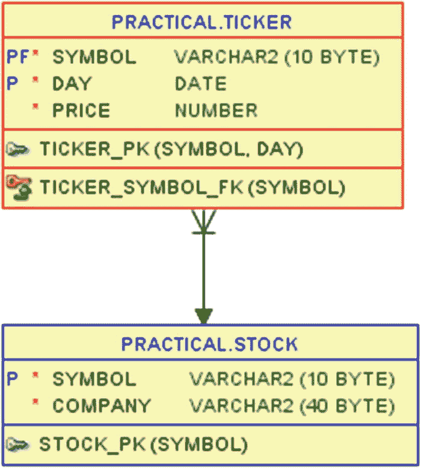

图 17-1
本章使用的 ticker 表

我为我的 Good Beer Trading Co.创建了一个虚构的股票代码 BEER。在 ticker 表中，我插入了 2019 年 4 月三周股票交易的每日收盘价，如图 17-2 所示。

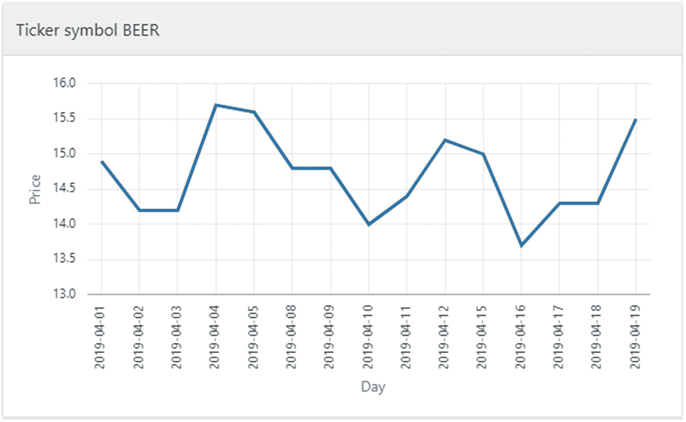

图 17-2
TICKER 表中数据的图形化描绘

这 15 天的股票价格将作为我逐步讲解升降模式匹配的基础。

### 分类下降和上升

在开发模式匹配查询时，我通常从简单的开始。

我几乎总是事先知道我想按什么进行分区，以及数据需要按什么顺序排列才能使模式匹配有意义。例如，对于股票代码数据，我想分别查找每个`symbol`值内的模式，因此我将使用`partition by`来实现这一目的（此数据仅包含一个符号，但也可能包含更多）。而我正在寻找的模式涉及数据随时间的变化方式，因此我按`day`列进行`order by`（在每个符号内）。

然后我构建我的第一个骨架查询（如 列表 17-1 所示），在其中`define`我希望如何对行进行分类，并使用最简单的`pattern`来测试我的定义是否符合要求。

```sql
SQL> select *
  2  from ticker
  3  match_recognize (
  4     partition by symbol
  5     order by day
  6     measures
  7        match_number() as match
  8      , classifier()   as class
  9      , prev(price)    as prev
 10     all rows per match
 11     pattern (
 12        down | up
 13     )
 14     define
 15        down as price < prev(price)
 16      , up   as price > prev(price)
 17  )
 18  order by symbol, day;
Listing 17-1
分类行
```

除了`partition by`和`order by`之外，我喜欢从子句的底部往上过一遍——这对我来说更有意义。

因此，在第 15 和 16 行，我定义如果一行中的价格低于前一行中的价格，则该行被分类为`down`行；但如果价格高于前一行，则该行被分类为`up`行。

第 12 行的模式尽可能简单——一个匹配项由单行组成，该行要么是`down`行，要么是`up`行（`|`符号在`pattern`中用于表示逻辑*或*）。这当然不是我最终要使用的模式；它只是一个方便的模式，用于测试我的分类定义是否给出了我想要的结果。

由于本例中的模式每个匹配项只给出一行，如果我在第 10 行选择`one row per match`而不是这里使用的`all rows per match`，我的输出将得到相同数量的行。但区别在于，`one row`只会输出`partition`和`order by`中使用的列以及度量值，而`all rows`会输出表的所有列。这在开发调试时很有帮助，即使我知道我最终期望的结果将使用`one row per match`。

第 7-9 行定义了我希望在输出中包含的度量值（除了表列之外）。函数`match_number()`向我显示哪些行属于同一个匹配项（在本例中，匹配项中总是单行，但以后会改变）。函数`classifier()`向我显示该行获得了哪个分类定义，这正是我想确认是否正确的内容。最后在第 9 行，我输出了前一个价格，这样我可以再次检查价格和前一个价格之间的关联是否与分类匹配。

运行 列表 17-1 中的查询得到以下输出：

```
SYMBOL  DAY         MATCH  CLASS  PREV  PRICE
BEER    2019-04-02  1      DOWN   14.9  14.2
BEER    2019-04-04  2      UP     14.2  15.7
BEER    2019-04-05  3      DOWN   15.7  15.6
BEER    2019-04-08  4      DOWN   15.6  14.8
BEER    2019-04-10  5      DOWN   14.8  14
BEER    2019-04-11  6      UP     14    14.4
BEER    2019-04-12  7      UP     14.4  15.2
BEER    2019-04-15  8      DOWN   15.2  15
BEER    2019-04-16  9      DOWN   15    13.7
BEER    2019-04-17  10     UP     13.7  14.3
BEER    2019-04-19  11     UP     14.3  15.5
```

我可以看到，我的行根据我制定的定义被正确分类了。但我注意到我并没有匹配所有行，15 行中只匹配了 11 行。一方面，我没有找到价格与前一日价格*相等*的行。因此，我尝试将第 15 和 16 行的定义改为使用小于等于和大于等于：


### 数据模式匹配与分类优化

### 初始问题：价格不变行的分类歧义

在最初的查询中，我使用了以下模式匹配定义：

```
...
15        down as price < prev(price)
...
SYMBOL  DAY         MATCH  CLASS  PREV  PRICE
BEER    2019-04-02  1      DOWN   14.9  14.2
BEER    2019-04-03  2      DOWN   14.2  14.2
BEER    2019-04-04  3      UP     14.2  15.7
BEER    2019-04-05  4      DOWN   15.7  15.6
BEER    2019-04-08  5      DOWN   15.6  14.8
BEER    2019-04-09  6      DOWN   14.8  14.8
BEER    2019-04-10  7      DOWN   14.8  14
BEER    2019-04-11  8      UP     14    14.4
BEER    2019-04-12  9      UP     14.4  15.2
BEER    2019-04-15  10     DOWN   15.2  15
BEER    2019-04-16  11     DOWN   15    13.7
BEER    2019-04-17  12     UP     13.7  14.3
BEER    2019-04-18  13     DOWN   14.3  14.3
BEER    2019-04-19  14     UP     14.3  15.5
```

现在输出包含了更多行；那些价格等于前值的行也被包括进来。但这可能不是最佳方案，因为观察 `MATCH` 编号 12、13 和 14，图表上这明显是一个上升趋势，但我的定义将第 13 行分类为了 `DOWN`。

我的问题是，价格未变的行可能同时满足我的两个定义。由于我使用了简单的 *或* 模式，这类行将被分类为模式中第一个计算结果为真的分类器。这有时可能不是问题（我稍后会展示），但目前我尝试通过添加一个 `same` 分类来使我的定义互斥（记得将其添加到 *或* 模式中）：

```
...
11     pattern (
12        down | up | same
13     )
14     define
15        down as price < prev(price)
17      , same as price = prev(price)
...
```

我得到了与上次输出相同的行，只是这次被三向分类为：`DOWN`、`UP` 和 `SAME`：

```
SYMBOL  DAY         MATCH  CLASS  PREV  PRICE
BEER    2019-04-02  1      DOWN   14.9  14.2
BEER    2019-04-03  2      SAME   14.2  14.2
BEER    2019-04-04  3      UP     14.2  15.7
BEER    2019-04-05  4      DOWN   15.7  15.6
BEER    2019-04-08  5      DOWN   15.6  14.8
BEER    2019-04-09  6      SAME   14.8  14.8
BEER    2019-04-10  7      DOWN   14.8  14
BEER    2019-04-11  8      UP     14    14.4
BEER    2019-04-12  9      UP     14.4  15.2
BEER    2019-04-15  10     DOWN   15.2  15
BEER    2019-04-16  11     DOWN   15    13.7
BEER    2019-04-17  12     UP     13.7  14.3
BEER    2019-04-18  13     SAME   14.3  14.3
BEER    2019-04-19  14     UP     14.3  15.5
```

### 处理首行：添加 `strt` 分类

我仍然不完全满意，因为我没有在输出中看到第一行。由于它没有前一行，它永远无法满足三个定义中的任何一个，那么该如何处理呢？通过在第 12 行的 `pattern` 中添加第四个分类，这相当容易实现：

```
...
12        down | up | same | strt
...
```

现在你可能期望我在 `define` 子句中添加 `strt` 的定义，但这里不需要这样做。如果模式匹配命中了模式中一个未定义的定义，则会简单地假定它始终为真。因此，第一行无法匹配任何三个已定义的分类，匹配随后会尝试查看它是否匹配 `strt`，而它确实匹配，因为任何行都可以做到这一点。

因此，我在输出中看到了第一行的分类器 `strt`，现在包含了全部 15 行：

```
SYMBOL  DAY         MATCH  CLASS  PREV  PRICE
BEER    2019-04-01  1      STRT         14.9
BEER    2019-04-02  2      DOWN   14.9  14.2
BEER    2019-04-03  3      SAME   14.2  14.2
BEER    2019-04-04  4      UP     14.2  15.7
BEER    2019-04-05  5      DOWN   15.7  15.6
BEER    2019-04-08  6      DOWN   15.6  14.8
BEER    2019-04-09  7      SAME   14.8  14.8
BEER    2019-04-10  8      DOWN   14.8  14
BEER    2019-04-11  9      UP     14    14.4
BEER    2019-04-12  10     UP     14.4  15.2
BEER    2019-04-15  11     DOWN   15.2  15
BEER    2019-04-16  12     DOWN   15    13.7
BEER    2019-04-17  13     UP     13.7  14.3
BEER    2019-04-18  14     SAME   14.3  14.3
BEER    2019-04-19  15      UP     14.3  15.5
```

### 分类器顺序的重要性

需要注意的是，在 `pattern` 中放置这样一个未定义分类器的位置确实很重要。例如，我本可以将它放在 *或* 分类列表的开头：

```
...
12        strt | down | up | same
...
```

由于匹配是惰性的并对模式进行短路求值，它将首先开始查看该行是否匹配 `strt` 的定义。由于 `strt` 未定义，因此任何行都匹配它，所以我会立即得到匹配，而 `down`、`up` 和 `same` 永远不会被评估。我得到了一个不太有用的输出：

```
SYMBOL  DAY         MATCH  CLASS  PREV  PRICE
BEER    2019-04-01  1      STRT         14.9
BEER    2019-04-02  2      STRT   14.9  14.2
BEER    2019-04-03  3      STRT   14.2  14.2
BEER    2019-04-04  4      STRT   14.2  15.7
BEER    2019-04-05  5      STRT   15.7  15.6
BEER    2019-04-08  6      STRT   15.6  14.8
BEER    2019-04-09  7      STRT   14.8  14.8
BEER    2019-04-10  8      STRT   14.8  14
BEER    2019-04-11  9      STRT   14    14.4
BEER    2019-04-12  10     STRT   14.4  15.2
BEER    2019-04-15  11     STRT   15.2  15
BEER    2019-04-16  12     STRT   15    13.7
BEER    2019-04-17  13     STRT   13.7  14.3
BEER    2019-04-18  14     STRT   14.3  14.3
BEER    2019-04-19  15     STRT   14.3  15.5
```

到目前为止，我对这个查询还算满意，它将我的行分类为 `down`、`up`、`same` 和 `strt`——现在是时候开始将这些分类用于一些模式匹配了。


### 下跌 + 上涨 = V 形

现在我已经定义了 `down`（下跌）、`up`（上涨）和 `same`（持平）——是时候将它们组合到一个 `pattern`（模式）中，以查找特定的行模式了。我希望找到价格持续下跌（或在下跌趋势中保持不变）一段时间，然后转为上涨（或在上涨趋势中保持不变）的一段时间——换句话说，就是图表中的一个 V 形。

正如前一章所讨论的，`pattern` 子句的语法与正则表达式非常相似，因此至少包含一个下跌或持平价格的时期可以定义为 `(down | same)+`，然后后跟 `(up | same)+` 表示至少一个上涨或持平价格的时期，从而得出第 12 行中所示的 `pattern`（如清单 17-2 所示）。

```sql
SQL> select *
2  from ticker
3  match_recognize (
4     partition by symbol
5     order by day
6     measures
7        match_number() as match
8      , classifier()   as class
9      , prev(price)    as prev
10     all rows per match
11     pattern (
12        (down | same)+ (up | same)+
13     )
14     define
15        down as price  prev(price)
17      , same as price = prev(price)
18  )
19  order by symbol, day;
```
清单 17-2
搜索 V 形

输出结果不再像之前所有查询那样为每一行提供唯一的 `match_number()`；这次我得到了三个不同的匹配项，分别对应图表中的三个 V 形：

```
SYMBOL  DAY         MATCH  CLASS  PREV  PRICE
BEER    2019-04-02  1      DOWN   14.9  14.2
BEER    2019-04-03  1      SAME   14.2  14.2
BEER    2019-04-04  1      UP     14.2  15.7
BEER    2019-04-05  2      DOWN   15.7  15.6
BEER    2019-04-08  2      DOWN   15.6  14.8
BEER    2019-04-09  2      SAME   14.8  14.8
BEER    2019-04-10  2      DOWN   14.8  14
BEER    2019-04-11  2      UP     14    14.4
BEER    2019-04-12  2      UP     14.4  15.2
BEER    2019-04-15  3      DOWN   15.2  15
BEER    2019-04-16  3      DOWN   15    13.7
BEER    2019-04-17  3      UP     13.7  14.3
BEER    2019-04-18  3      SAME   14.3  14.3
BEER    2019-04-19  3      UP     14.3  15.5
```

既然现在有一个可以匹配多行的模式，那么将输出压缩为每个匹配项显示 `one row per match`（每个匹配项输出一行）是合理的，如清单 17-3 中的第 11 行所示。但我也需要一些其他更改。

在 `measures`（度量）中，我使用第 8-9 行的导航函数 `first` 和 `last` 来获取每个匹配项的第一天和最后一天，并使用第 10 行的聚合函数 `count` 来找出每个匹配项覆盖的天数。

使用 `one row per match`，输出中也不再包含所有列；这里我只得到 `partition by` 中使用的列以及所有的 `measures`，这意味着在第 20 行的 `order by` 中，我不能使用列 `day`，而必须使用度量 `first_day`。

```sql
SQL> select *
2  from ticker
3  match_recognize (
4     partition by symbol
5     order by day
6     measures
7        match_number() as match
8      , first(day)     as first_day
9      , last(day)      as last_day
10      , count(*)       as days
11     one row per match
12     pattern (
13        (down | same)+ (up | same)+
14     )
15     define
16        down as price  prev(price)
18      , same as price = prev(price)
19  )
20  order by symbol, first_day;
```
清单 17-3
为每个匹配项输出单行

我的输出现在被压缩为一行，包含了图表中三个 V 形的数据：

```
SYMBOL  MATCH  FIRST_DAY   LAST_DAY    DAYS
BEER    1      2019-04-02  2019-04-04  3
BEER    2      2019-04-05  2019-04-12  6
BEER    3      2019-04-15  2019-04-19  5
```

但是等等；我对此并不完全满意——每个匹配到的 V 形似乎都开始得晚了一天？当我在图 17-3 中标出这三个匹配项时，很明显我并没有匹配到完整的 V 形。

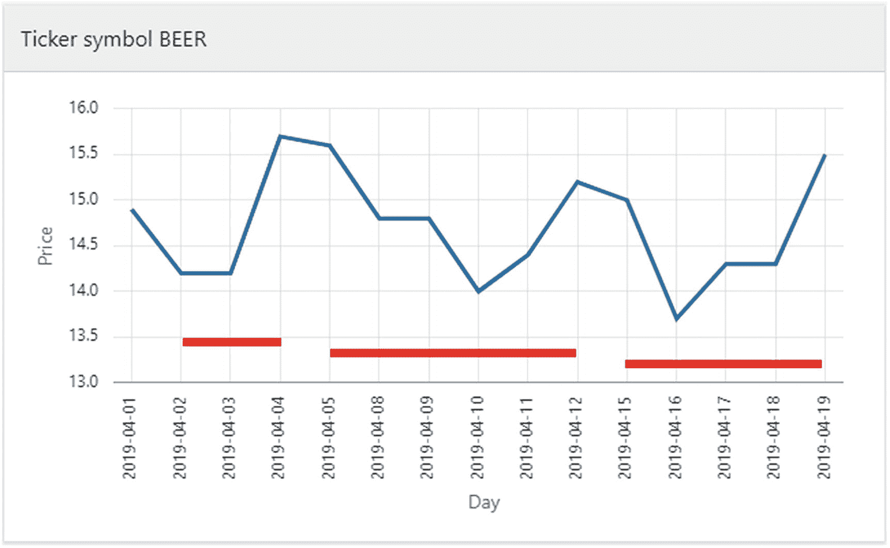

图 17-3
三个 V 形并未完全匹配

好的，我可以尝试在模式中添加一个 `strt` 来匹配任何行作为 V 形的开始。我只需在第 13 行的 `pattern` 中加入它：

```sql
...
13        strt (down | same)+ (up | same)+
...
```

这对第一个匹配项有帮助，但对第二个和第三个没有：

```
SYMBOL  MATCH  FIRST_DAY   LAST_DAY    DAYS
BEER    1      2019-04-01  2019-04-04  4
BEER    2      2019-04-05  2019-04-12  6
BEER    3      2019-04-15  2019-04-19  5
```

原因是我没有定义 `match_recognize` 在找到一个匹配项后应该做什么——它应该从哪里开始寻找下一个匹配项。当我不指定任何内容时，它默认跳到匹配项*之后*的一行并开始在那里查找。它的行为就像我在查询中指定了第 12 行一样：

```sql
...
11     one row per match
12     after match skip past last row
13     pattern (
...
```

`after match` 子句告诉在匹配完成后从哪里开始寻找新匹配项，默认值是 `skip past last row`（跳过最后一行）。但是，从前一个匹配项的最后一行*之后*一行开始搜索新匹配项，是匹配项 2 开始于 2019-04-05 而不是我期望的 2019-04-04 的原因。

如果存在 `after match skip to last row`（匹配后跳转到最后一行）选项，这正好是我想要的。但这样的选项不存在；它是无效语法。相反，我需要使用语法 `after match skip to last {definition name}`（匹配后跳转到最后一个{定义名称}）。

我的问题在于，我不知道匹配项的最后一行是被分类为 `up` 还是 `same`；它可能是其中任何一个。而在 `skip to` 中，我需要指定一个单一的分类定义名称。解决方案是使用第 16 行的 `subset`（子集）子句来定义一个涵盖 `up` 和 `same` 的子集定义名称：

```sql
...
11     one row per match
12     after match skip to last up_or_same
13     pattern (
14        strt (down | same)+ (up | same)+
15     )
16     subset up_or_same = (up, same)
17     define
18        down as price  prev(price)
20      , same as price = prev(price)
21  )
22  order by symbol, first_day;
```

在第 12 行的 `after match skip to last` 子句中使用子集 `up_or_same` 给出了我想要的效果，即在与前一个匹配项的*相同*行上开始搜索新匹配项。这意味着一个匹配项的最后一天也作为第一天包含在下一个匹配项中，正如输出和图 17-4 所示：

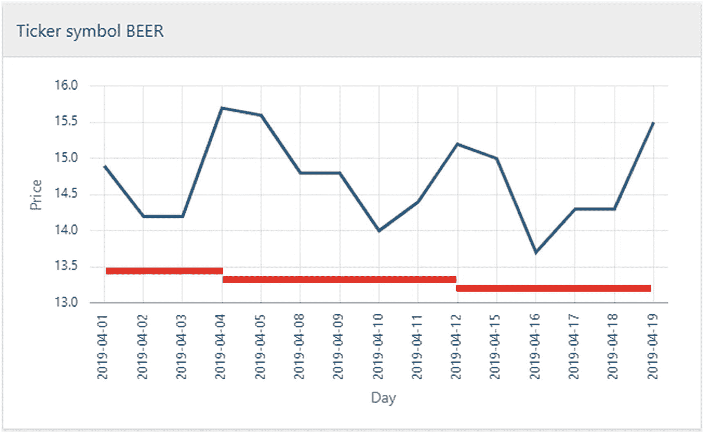

图 17-4
三个 V 形被完全匹配

```
SYMBOL  MATCH  FIRST_DAY   LAST_DAY    DAYS
BEER    1      2019-04-01  2019-04-04  4
BEER    2      2019-04-04  2019-04-12  7
BEER    3      2019-04-12  2019-04-19  6
```


#### 重新思考是否需要 `SAME` 定义

我很高兴能够通过 `down`、`up` 和 `same` 这三个定义，以及一个子集 `up_or_same` 来实现我想要的模式匹配。但这能否进一步简化呢？

还记得在本章开头，我尝试使用小于等于和大于等于运算符吗？

```
...
15        down as price = prev(price)
...
```

这种方法在我简单地对单行进行分类时效果不佳。但我曾承诺过，这并不总是问题——它取决于我使用的模式。

我可以重写查询，使其看起来像代码清单 17-4。这里我没有使用任何 `same` 定义，而只在第 17-18 行使用了 `down` 和 `up`——注意两者都使用了小于和大于的 `-or-equal`（小于等于/大于等于）变体。这也意味着我可以简化第 14 行的 `pattern`，避免使用 `subset`，然后第 12 行直接跳转到 `last up`。

```
SQL> select *
2  from ticker
3  match_recognize (
4     partition by symbol
5     order by day
6     measures
7        match_number() as match
8      , first(day)     as first_day
9      , last(day)      as last_day
10      , count(*)       as days
11     one row per match
12     after match skip to last up
13     pattern (
14        strt down+ up+
15     )
16     define
17        down as price <= prev(price)
18       , up   as price >= prev(price)
19  )
20  order by symbol, first_day;
代码清单 17-4
利用模式如何对定义进行求值的简化查询
```

简化后的代码清单 17-4 给出的结果与之前完全相同：

```
SYMBOL  MATCH  FIRST_DAY   LAST_DAY    DAYS
BEER    1      2019-04-01  2019-04-04  4
BEER    2      2019-04-04  2019-04-12  7
BEER    3      2019-04-12  2019-04-19  6
```

这是怎么做到的呢？为什么我似乎没有遇到本章开头的问题——即 2019-04-18 那一行被错误地分类为 `down`？为了找出原因，我们可以回顾一下代码清单 17-5 第 10 行，查看 `all rows per match`（在调试 `match_recognize` 时这通常是个好方法）。

```
SQL> select *
2  from ticker
3  match_recognize (
4     partition by symbol
5     order by day
6     measures
7        match_number() as match
8      , classifier()   as class
9      , prev(price)    as prev
10     all rows per match
11     after match skip to last up
12     pattern (
13        strt down+ up+
14     )
15     define
16        down as price <= prev(price)
17       , up   as price >= prev(price)
18  )
19  order by symbol, day;
代码清单 17-5
查看简化查询的所有行
```

查看所有行后，我也可以清楚地看到 2019-04-04 和 2019-04-12 在输出中各出现了两次——一次作为前一个匹配的最后一行，一次作为下一个匹配的第一行——因此输出的总行数为 17，尽管表中只有 15 行：

```
SYMBOL  DAY         MATCH  CLASS  PREV  PRICE
BEER    2019-04-01  1      STRT         14.9
BEER    2019-04-02  1      DOWN   14.9  14.2
BEER    2019-04-03  1      DOWN   14.2  14.2
BEER    2019-04-04  1      UP     14.2  15.7
BEER    2019-04-04  2      STRT   14.2  15.7
BEER    2019-04-05  2      DOWN   15.7  15.6
BEER    2019-04-08  2      DOWN   15.6  14.8
BEER    2019-04-09  2      DOWN   14.8  14.8
BEER    2019-04-10  2      DOWN   14.8  14
BEER    2019-04-11  2      UP     14    14.4
BEER    2019-04-12  2      UP     14.4  15.2
BEER    2019-04-12  3      STRT   14.4  15.2
BEER    2019-04-15  3      DOWN   15.2  15
BEER    2019-04-16  3      DOWN   15    13.7
BEER    2019-04-17  3      UP     13.7  14.3
BEER    2019-04-18  3      UP     14.3  14.3
BEER    2019-04-19  3      UP     14.3  15.5
```

但我真正感兴趣的是 2019-04-18 那一行，它最初被分类为 `down`，这促使我引入了 `same` 以获得正确的分类。为什么在这里它被正确地分类为 `up` 呢？

原因在于进行模式匹配时的求值方式。数据库不会先遍历所有定义来对行进行分类，然后再检查是否符合模式。它会尽量进行最少的评估。这意味着它会按照如下逻辑进行评估：

*   当开始寻找匹配时，它会检查第一行是否匹配 `strt`——任何行都会匹配。
*   然后它知道，如果要找到一个匹配，下一行必须是 `down`，所以它会检查是否如此。
*   下一行必须是 `down` 或 `up`，所以它首先检查是否是 `down`；如果不是，则检查是否是 `up`。只要找到的是 `down`，就重复此过程。因此，在此模式部分中，任何值小于*或等于*前一行的行，只要 `down` 定义先被评估，就会被分类为 `down`。因此，2019-04-03 和 2019-04-09 的行都被分类为 `down`。
*   当上一步找到了一个 `up` 时，它知道下一行*必须*是 `up` 才能构成有效匹配，所以它检查是否如此。只要找到的是 `up`，就重复检查 `up`。这意味着此时，它*不会*将一个与前一行*值相同*的行评估为 `down`，因为在此时的模式中，根本*不会*评估 `down` 的定义。
*   因此，由于 2019-04-18 出现在模式的 `up+` 部分，它*不会*被分类为 `down`，而是如我们所愿的被分类为 `up`。

当你拥有复杂的定义和模式时，这可能会很棘手。如果定义像 `down`、`up` 和 `same` 那样互斥，事情会简单得多。但了解了 `match_recognize` 所使用的评估方法后，就可以利用它来简化像这样的查询，即使某些行符合多个定义，模式也会决定何时评估哪个定义，从而让它们得到所需的分类。


### V + V = W 形态

在股票代码分析中，**W 形态**（也称为双底）预示着趋势反转，因此在数据中搜索该模式非常重要。好吧，我已经知道如何查找 V 形态了，所以我只需扩展清单 17-6 中第 14 行的模式子句。

```sql
SQL> select *
2  from ticker
3  match_recognize (
4     partition by symbol
5     order by day
6     measures
7        match_number() as match
8      , first(day)     as first_day
9      , last(day)      as last_day
10      , count(*)       as days
11     one row per match
12     after match skip to last up
13     pattern (
14        strt down+ up+ down+ up+
15     )
16     define
17        down as price <= prev(price)
19  )
20  order by symbol, first_day;
Listing 17-6
寻找 W 形态的首次尝试
```

等等；我预期只会找到一个 W 匹配，但我的输出显示了两个？

```sql
SYMBOL  MATCH  FIRST_DAY   LAST_DAY    DAYS
BEER    1      2019-04-01  2019-04-12  10
BEER    2      2019-04-12  2019-04-19  6
```

观察图 17-5 中的图表，我可以看到首先我确实从 2019-04-01 到 2019-04-12 匹配了一个 W 形态；这很好。但在那之后，图表只有一个 V 形态，但它被匹配为 W 形态？为什么？

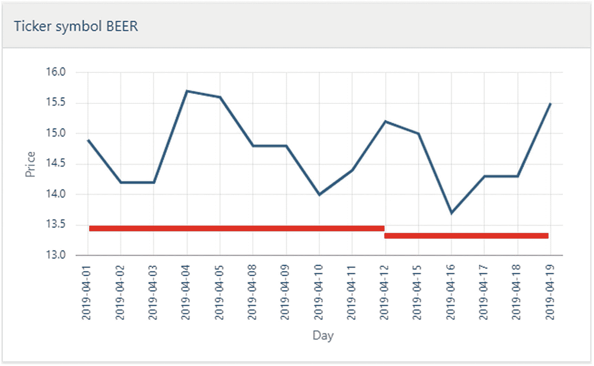

Figure 17-5
将最后的 V 意外匹配为 W 形态

像往常一样，我回退一步，使用 `all rows per match` 来显示我的 W 模式输出，这使我能够看到突然 2019-04-18 再次被归类为 `down` 行，而不是它本应是的 `up` 行：

```sql
SYMBOL  DAY         MATCH  CLASS  PREV  PRICE
BEER    2019-04-01  1      STRT         14.9
BEER    2019-04-02  1      DOWN   14.9  14.2
BEER    2019-04-03  1      DOWN   14.2  14.2
BEER    2019-04-04  1      UP     14.2  15.7
BEER    2019-04-05  1      DOWN   15.7  15.6
BEER    2019-04-08  1      DOWN   15.6  14.8
BEER    2019-04-09  1      DOWN   14.8  14.8
BEER    2019-04-10  1      DOWN   14.8  14
BEER    2019-04-11  1      UP     14    14.4
BEER    2019-04-12  1      UP     14.4  15.2
BEER    2019-04-12  2      STRT   14.4  15.2
BEER    2019-04-15  2      DOWN   15.2  15
BEER    2019-04-16  2      DOWN   15    13.7
BEER    2019-04-17  2      UP     13.7  14.3
BEER    2019-04-18  2      DOWN   14.3  14.3
BEER    2019-04-19  2      UP     14.3  15.5
```

我必须再次尝试观察模式是如何被评估以及定义的评估顺序的。

正如我之前解释的，在 V 模式 (`strt down+ up+`) 中，当匹配到达 `up+` 部分时，它可以跳过评估 `down` 定义，因为它知道只有找到 `up` 行才能满足模式；在所有其他情况下，都不会有匹配。

但在 W 模式 (`strt down+ up+ down+ up+`) 中，当匹配到达第一个 `up+` 部分时，另一个 `up` 行或一个将引导匹配进入第二个 `down+` 部分的 `down` 行都可以满足匹配。因此它不能跳过评估 `down` 定义，所以 2019-04-18 被归类为 `down`，从而满足了模式。

因此，由于模式的改变，我在 V 形态中能正确评估的、使用非唯一定义的“技巧”在 W 形态中不起作用了。我得想点别的办法。

我可以回退使用 `down`、`up` 和 `same`，然后使用如下模式吗？

```sql
...
14        strt (down | same)+ (up | same)+ (down | same)+ (up | same)+
...
```

嗯，不，在这种情况下没有帮助。图表上的最后一个 V 形态会被这样分类：

```sql
...
BEER    2019-04-12  2      STRT   14.4  15.2
BEER    2019-04-15  2      DOWN   15.2  15
BEER    2019-04-16  2      DOWN   15    13.7
BEER    2019-04-17  2      UP     13.7  14.3
BEER    2019-04-18  2      SAME   14.3  14.3
BEER    2019-04-19  2      UP     14.3  15.5
```

而按该顺序排列的六个分类器实际上会匹配该模式，所以这行不通。

相反，我将在清单 17-7 的 `define` 子句中放入更多逻辑。

```sql
SQL> select *
2  from ticker
3  match_recognize (
4     partition by symbol
5     order by day
6     measures
7        match_number() as match
8      , classifier()   as class
9      , prev(price)    as prev
10     all rows per match
11     after match skip to last up
12     pattern (
13        strt down+ up+ down+ up+
14     )
15     define
16        down as price <= prev(price)
17             or (    price = prev(price)
18                 and price = last(down.price, 1)
19                )
20        up   as price >= prev(price)
21             or (    price = prev(price)
22                 and price = last(up.price  , 1)
23                )
24  )
25  order by symbol, day;
Listing 17-7
用于 W 形态匹配的更智能的定义
```

查看 `down`，其想法是将小于或等于替换为双重逻辑：
*   如果价格低于前一个（第 16 行），它肯定是一个 `down` 行。
*   如果价格等于前一行（第 17 行），它*仅*在图表在达到这个价格相等点之前是向下倾斜的时才是一个 `down` 行。我可以在第 18 行通过测试该行的价格是否等于最后一个被分类为 `down` 的行的价格来检查这一点。只有在该 `down` 行正好位于图表平坦部分之前时，这才可能发生。

而对于 `up`，我在第 20-23 行使用了类似的双重逻辑。在定义中内置了这样的逻辑后，清单 17-7 只产生一个匹配——图表中的第一个 W 形态：

```sql
SYMBOL  DAY         MATCH  CLASS  PREV  PRICE
BEER    2019-04-01  1      STRT         14.9
BEER    2019-04-02  1      DOWN   14.9  14.2
BEER    2019-04-03  1      DOWN   14.2  14.2
BEER    2019-04-04  1      UP     14.2  15.7
BEER    2019-04-05  1      DOWN   15.7  15.6
BEER    2019-04-08  1      DOWN   15.6  14.8
BEER    2019-04-09  1      DOWN   14.8  14.8
BEER    2019-04-10  1      DOWN   14.8  14
BEER    2019-04-11  1      UP     14    14.4
BEER    2019-04-12  1      UP     14.4  15.2
```


## 18. 通过模式对数据进行分组

### 重叠的 W 形状

我在上一个例子中搜索模式的方式，意味着我将图表看作先是一个`W`形状，然后是一个`V`形状。这样看的话，我只找到了一个单一的`W`形状。

但我也可以将图表看作有两个重叠的`W`形状，如图 17-6 所标记的那样。

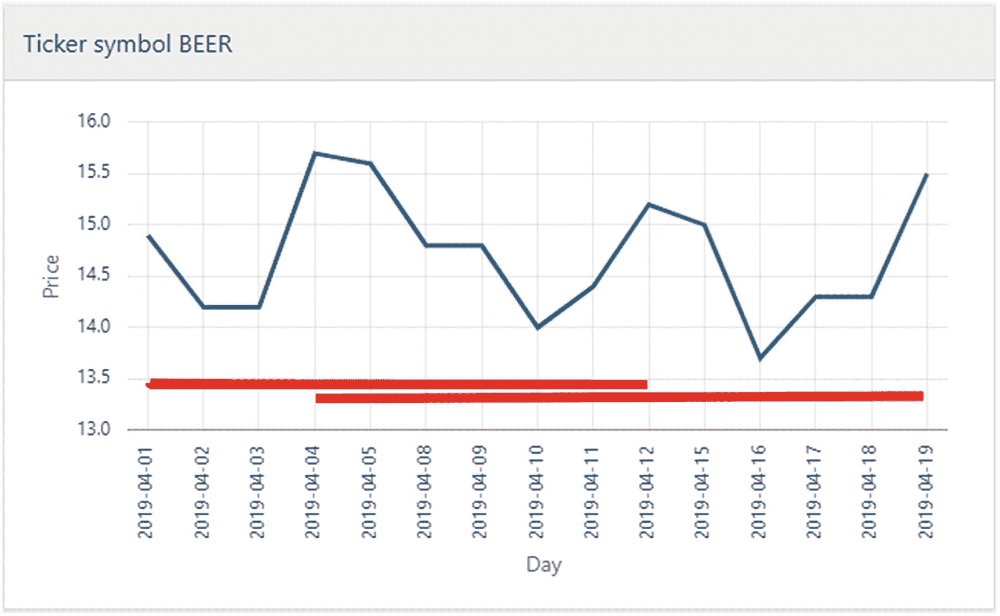

图 17-6

该图表可以被视为具有两个重叠的`W`形状

修改我的代码以支持搜索重叠形状，关键在于修改`after match`子句，在之前的例子中它是这样设置的：

```
...
11     after match skip to last up
...
```

这意味着我从未重叠（严格来说，每个匹配的一行可能会“重叠”，就像图 17-4 中三个`V`匹配那样）。

如果我**确实**想要重叠，我需要改变跳转的位置，以便让下一次匹配的搜索从合适的行开始。理想情况下，它应该是“模式中第一个`up+`部分的最后一行”，但这无法直接指定。

我可以定义两个分类`up1`和`up2`，它们具有相同的定义，对第一个上升部分使用`up1+`，对第二个上升部分使用`up2+`，然后`skip to last up1`。但这里有一个更简单的解决方案，就像我在代码清单 17-8 的第 12 行所做的那样。

```sql
SQL> select *
2  from ticker
3  match_recognize (
4     partition by symbol
5     order by day
6     measures
7        match_number() as match
8      , first(day)     as first_day
9      , last(day)      as last_day
10      , count(*)       as days
11     one row per match
12     after match skip to first up
13     pattern (
14        strt down+ up+ down+ up+
15     )
16     define
17        down as price < prev(price)
18             or (    price = prev(price)
19                 and price = last(up.price, 1)
20                )
21  )
22  order by symbol, first_day;
```
代码清单 17-8
查找重叠的`W`形状

当我在第 12 行使用`skip to first up`时，匹配过程将如下进行：

*   找到第一个`W`匹配，时间从 2019-04-01 到 2019-04-12。
*   第一个`up`是 2019-04-04，所以跳转到那里，并尝试从那里开始是否能找到新的匹配。
*   因此 2019-04-04 被分类为`strt`，2019-04-05 被分类为`down`，并且继续分类行，直到 2019-04-19 都符合模式。
*   所以第二个`W`匹配是 2019-04-04 到 2019-04-19。
*   第二个`W`匹配的第一个`up`是 2019-04-11。
*   2019-04-11 被分类为`strt`，2019-04-12 被分类为`up`，因此模式被打破，没有匹配。
*   它继续移动到 2019-04-12，并再次尝试寻找新匹配，但这将失败，因为它只匹配一个`V`形状，而不是`W`。
*   所以它移动到 2019-04-15，再次尝试并失败。
*   依此类推直到结束，没有找到更多的匹配。

这正是我运行代码清单 17-8 得到的输出，它与图 17-6 上的标记相匹配：

```
SYMBOL  MATCH  FIRST_DAY   LAST_DAY    DAYS
BEER    1      2019-04-01  2019-04-12  10
BEER    2      2019-04-04  2019-04-19  12
```

### 经验教训

在本章中，我比 Oracle 文档更深入地探讨了股票行情示例，主要展示了当图表的“平坦”部分需要被视为图形下降部分或上升部分的一部分时引入的复杂性。

在这个讲解过程中，我希望我已经传达了一些关于以下方面的知识：

*   使用`all rows`与`one row per match`（通常用于调试逻辑）
*   `define`中的定义如何根据`pattern`的满足情况来评估
*   `after match skip to`的不同用法，带或不带`subset`

这些知识应该能帮助你自己为类似的模式匹配开发代码。

使用`group by`子句对数据进行分组，要求你找到那些你想要属于同一组的行中相同的一个或多个值。通常这很简单，就是某些列，或者同样常见的是对某些列的计算。

然而，有时告诉你一行属于某个组的条件**并非**简单地基于**仅**使用该行本身值就能计算出的条件，而是关于该行如何**与其他行相关联**的条件。例如，一个分组条件可能是所有具有连续顺序值的行应该被分组——当序列中出现间隔时，就启动一个新组。这需要**跨行**进行计算，这通常可以通过分析函数来处理——但有时不行。

这里的解决方案是记住，在模式匹配中，当你使用`one row per match`时，这实际上类似于一个隐式的`group by`，你可以在`measures`中使用聚合函数，得到的结果与使用`group by`非常相似。当你使用`match_recognize`进行分组时，`define`和`pattern`子句非常适合于依赖于**行之间**在特定顺序下关系的分组条件。

### 两组用于分组的数据

为了演示使用模式匹配对数据进行分组，我使用了图 18-1 中的表。

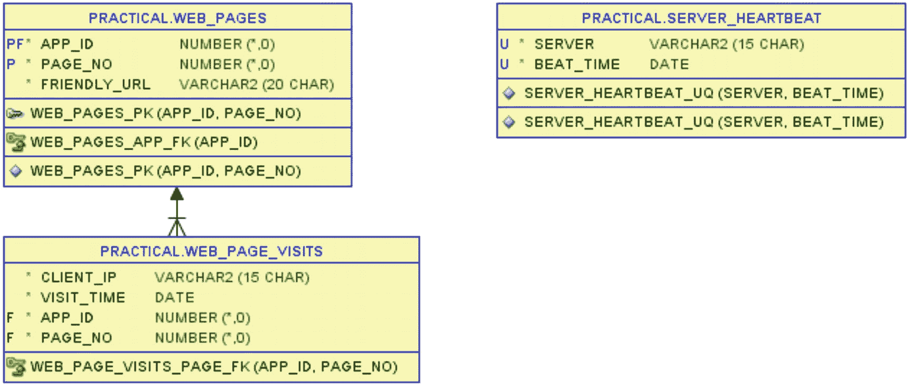

图 18-1

用于数据分组的服务器心跳和网页访问表

在`server_heartbeat`表中，每次服务器发送心跳（基本上就是一个“我还活着”的调用）时插入一行，每个服务器应该每 5 分钟发生一次。

`web_page_visits`表存储了 Good Beer Trading Co 公司 Web 应用中每个网页的每次访问（即用户的每次点击）。该表引用了`web_pages`表，我将其包含在图中只是为了提供上下文，但本章中的示例使用`web_page_visits`表。

我将在相关示例之前展示这两个表的数据。

### 三种分组条件

我将向你展示三种你可以使用模式匹配进行分组的不同类型的关系条件：

*   所有连续数据属于一组的数据，其中“连续”仅意味着对于每一行，值按一个精确的固定量增加。可以是每次增加 1 或 100 的数字，也可以是每次增加 5 分钟或 1 天或类似定义的日期。

*   只要一个值与前一行值接近，行就属于一组的数据。例如，只要日期值在前一个日期的 15 分钟范围内。

*   一组是固定时间间隔（例如一小时）内的行的数据。但不是时钟上的小时（如按`trunc(date_col, 'HH')`分组），而是从每组的第一行开始计算的小时。

你可能还能想到其他类型的条件，但这三种覆盖了很多用例。

#### 对连续数据进行分组

首先让我深入研究对连续数据进行分组。这部分我会讲得更详细，以便为进入其他两种分组方法之前给你打下基础。

为了比较，我会展示一种仅使用分析函数就能完成此任务的方法，并讨论为什么你可能考虑改用`match_recognize`。

## 解析式 Tabibitosan 方法与 match_recognize 对比

在继续展示示例表之前，我将先引导您了解 Tabibitosan 方法——这是一种使用单个分析函数查找连续整数组的方法。该方法由 Aketi Jyuuzou 在 Oracle 社区论坛（当时的 OTN 论坛）上提出。

我将从代码清单 18-1 开始，这里我仅使用`with`子句生成一些带数字的行，而非创建真实表格。

```sql
SQL> with ints(i) as (
2     select 1 from dual union all
3     select 2 from dual union all
4     select 3 from dual union all
5     select 6 from dual union all
6     select 8 from dual union all
7     select 9 from dual
8  )
9  select
10     i
11   , row_number() over (order by i)     as rn
12   , i - row_number() over (order by i) as diff
13  from ints
14  order by i;
Listing 18-1
数值与行号之差
```

Tabibitosan 在日语中意为"朝圣者先生"或"旅行者先生"。其核心思想是想象两位同时从零点出发的行走朝圣者：

*   第一位朝圣者每天行走不同距离，有时一英里，有时更远。他与起点的距离由整数值表示，即本例中的列`i`。

*   第二位朝圣者每天固定行走一英里。他与起点的距离由`row_number`函数结果表示，该函数每行恰好增加 1，即本例中的列`rn`。

输出中的第三列是`i`与`rn`的差值。在这个比喻中，这代表两位朝圣者之间的*距离*：

```
I  RN  DIFF
1  1   0
2  2   0
3  3   0
6  4   2
8  5   3
9  6   3
```

当第一位朝圣者每天行走一英里时，他们之间的距离保持不变。若第一位朝圣者某天行走超过一英里，他们之间的距离就会增加。这些数字本身已经相当清晰，但用图 18-2 中的图表呈现会更加直观。


**图 18-2**

两位朝圣者之间的距离差可用于分组

换言之，整数列与`row_number`的差值（图中的红色菱形）在那些整数列每行恰好增加 1（即连续）的行中将*保持恒定*，因此我可以在代码清单 18-2 中轻松地按此差值进行`group by`分组。

```sql
SQL> with ints(i) as (
2     select 1 from dual union all
3     select 2 from dual union all
4     select 3 from dual union all
5     select 6 from dual union all
6     select 8 from dual union all
7     select 9 from dual
8  )
9  select
10     min(i)   as first_int
11   , max(i)   as last_int
12   , count(*) as ints_in_grp
13  from (
14     select i, i - row_number() over (order by i) as diff
15     from ints
16  )
17  group by diff
18  order by first_int;
Listing 18-2
Tabibitosan 分组法
```

只需在第 14-15 行将差值计算包装在内联视图中，并在第 17 行按`diff`分组，即可得到输出，明确指出数据中找到的三组连续整数：

```
FIRST_INT  LAST_INT  INTS_IN_GRP
1          3         3
6          6         1
8          9         2
```

那么，既然存在分析函数这种完美有效的方法，为何还要使用模式匹配呢？部分答案是，正如我将展示的，它能更容易适应不断变化的需求。另一部分原因则关乎效率——它能在遍历数据时进行单次操作，而非先执行分析函数行编号、再分组的两次遍历。

在代码清单 18-3 中，我展示了如何使用`match_recognize`而非 Tabibitosan 方法，获得与代码清单 18-2 完全相同的输出。

```sql
SQL> with ints(i) as (
2     select 1 from dual union all
3     select 2 from dual union all
4     select 3 from dual union all
5     select 6 from dual union all
6     select 8 from dual union all
7     select 9 from dual
8  )
9  select first_int, last_int, ints_in_grp
10  from ints
11  match_recognize (
12     order by i
13     measures
14        first(i) as first_int
15      , last(i)  as last_int
16      , count(*) as ints_in_grp
17     one row per match
18     pattern (strt one_higher*)
19     define
20        one_higher as i = prev(i) + 1
21  )
22  order by first_int;
Listing 18-3
使用 match_recognize 实现相同分组
```

该方法相当直接，可解读如下：

*   我在第 20 行定义分类`one_higher`：当`i`恰好比前一个`i`大 1 时——表明它与前一行连续。
*   第 18 行的`pattern`查找任何行（分类为`strt`），后跟零个或多个`one_higher`行。因此，只要行中的`i`值连续，该模式就会匹配一组行——当不再连续时，匹配停止。
*   与 Tabibitosan 中的`group by`不同，这里我可以在第 17 行简单指定每个匹配仅输出一行。
*   第 14-16 行获得了与代码清单 18-2 相同的值，只是无需分组；此处模式匹配能在遍历数据时直接计算出结果。

我已通过一些简单的整数数据展示了分析函数解决方案与模式对比的基本规则；现在，我将使用不同数据类型在更实际的数据上进行相同操作。


#### 连续日期而非整数

在 `server_heartbeat` 表中，我应该能从每台服务器上恰好每五分钟获取到一次心跳存储。在清单 18-4 中，你可以看到表中的数据。

```
SQL> select server, beat_time
2  from server_heartbeat
3  order by server, beat_time;
清单 18-4
作为非整数示例的服务器心跳
```

观察可知有两台服务器，并且存在一处或多处心跳缺失的情况：

```
SERVER      BEAT_TIME
10.0.0.100  2019-04-10 13:00:00
10.0.0.100  2019-04-10 13:05:00
10.0.0.100  2019-04-10 13:10:00
10.0.0.100  2019-04-10 13:15:00
10.0.0.100  2019-04-10 13:20:00
10.0.0.100  2019-04-10 13:35:00
10.0.0.100  2019-04-10 13:40:00
10.0.0.100  2019-04-10 13:45:00
10.0.0.100  2019-04-10 13:55:00
10.0.0.142  2019-04-10 13:00:00
10.0.0.142  2019-04-10 13:20:00
10.0.0.142  2019-04-10 13:25:00
10.0.0.142  2019-04-10 13:50:00
10.0.0.142  2019-04-10 13:55:00
```

我能使用 Tabibitosan 方法来对恰好以 5 分钟间隔连续的行进行分组吗？当然可以。我只需要调整所使用的“单位”，使其成为 5 分钟单位，而不是简单的数字 1。我在清单 18-5 中实现了这一点。

```
SQL> select
2     server
3   , min(beat_time) as first_beat
4   , max(beat_time) as last_beat
5   , count(*)       as beats
6  from (
7     select
8        server
9      , beat_time
10      , beat_time - interval '5' minute
11                  * row_number() over (
12                       partition by server
13                       order by beat_time
14                    ) as diff
15     from server_heartbeat
16  )
17  group by server, diff
18  order by server, first_beat;
清单 18-5
调整为 5 分钟间隔的 Tabibitosan
```

在清单 18-2 中的 `i`，现在是第 9 行的 `beat_time`。为了在行连续时创建一个恒定差值，我在第 10-14 行将 `row_number()` 乘以一个 5 分钟的 `interval`，然后可以从 `beat_time` 中减去这个值，得到可用于分组的 `diff` 值。

因为（与清单 18-2 不同）我是按服务器执行此操作，而不是一次性对所有行执行，所以我在第 12 行使用了 `partition by`。这样我得到了每个服务器三组的输出：

```
SERVER      FIRST_BEAT           LAST_BEAT            BEATS
10.0.0.100  2019-04-10 13:00:00  2019-04-10 13:20:00  5
10.0.0.100  2019-04-10 13:35:00  2019-04-10 13:45:00  3
10.0.0.100  2019-04-10 13:55:00  2019-04-10 13:55:00  1
10.0.0.142  2019-04-10 13:00:00  2019-04-10 13:00:00  1
10.0.0.142  2019-04-10 13:20:00  2019-04-10 13:25:00  2
10.0.0.142  2019-04-10 13:50:00  2019-04-10 13:55:00  2
```

将 `row_number()` 乘以一个 `interval` 来进行“单位”调整并不难，但从阅读清单 18-5 中的代码来看，`diff` 计算的好处和作用并不是非常清晰。

因此，让我尝试类似地将清单 18-4 适配到 5 分钟间隔数据，并创建清单 18-6，它将给出与清单 18-5 相同的输出。

```
SQL> select server, first_beat, last_beat, beats
2  from server_heartbeat
3  match_recognize (
4     partition by server
5     order by beat_time
6     measures
7        first(beat_time) as first_beat
8      , last(beat_time)  as last_beat
9      , count(*)         as beats
10     one row per match
11     pattern (strt five_mins_later*)
12     define
13        five_mins_later as
14           beat_time = prev(beat_time) + interval '5' minute
15  )
16  order by server, first_beat;
清单 18-6
对 match_recognize 解决方案进行的相同调整
```

我给定义和度量起了与清单 18-4 中不同的其他名称，以便它们能更好地表示数据。

但我所做的唯一*功能性*更改在第 14 行（对比清单 18-4 中的第 20 行），我将 `+ 1` 替换为 `+ interval '5' minute` – 这就是更改功能所需的所有操作，而且它非常自文档化。

你可能已经注意到，数据非常整齐地恰好相隔 5 分钟，这在现实中不太可能出现在此类心跳数据上，这些数据可能在精确时间的前后几秒内到达。我可以通过一个 `before insert` 触发器来创建整齐对齐的数据，该触发器将插入的值四舍五入到最近的 5 分钟值，但那样会丢失信息（例如，我可能有兴趣看到某个服务器总是大约晚 20 秒）。

因此，与其“修饰”数据，我希望更改我的查询以允许一定的余地，而不是寻找恰好 5 分钟。使用 Tabibitosan 方法，为了实现分组的“恒定差值”，我必须在查询时将值四舍五入到最近的 5 分钟。使用模式匹配，则更容易简单地调整定义，并将清单 18-6 的第 14 行更改为带有 `between` 子句的条件，以定义 `five_mins_later` 意味着在 4 到 6 分钟之后的某个时间：

```
...
12     define
13        five_mins_later as
14           beat_time between prev(beat_time) + interval '4' minute
15                         and prev(beat_time) + interval '6' minute
...
```

这同样是几乎纯英文的，并且相当易读和自文档化。

但这些查询为我找到了在某种度量单位上连续的行组。我经常被要求查找的是这些组之间的*间隙*；即哪些*缺失*了本应存在的数据的位置。


##### 间隔检测

当我从清单 18-5 和 18-6 的输出中获得连续的分组后，间隔就可以由一行的 `last_beat`（间隔前的最后一次心跳）和下一行的 `first_beat`（间隔后的下一次心跳）来定义。

从下一行获取值自然让我想到了使用 `lead` 分析函数。因此，我在清单 18-7 中使用了 `lead`。

```sql
SQL> select
2     server, last_beat, next_beat
3   , round((next_beat - last_beat) * (24*60)) as gap_minutes
4  from (
5     select
6        server
7      , last_beat
8      , lead(first_beat) over (
9           partition by server order by first_beat
10        ) as next_beat
11     from (
...
27     )
28  )
29  where next_beat is not null
30  order by server, last_beat;
Listing 18-7
使用 lead 函数从连续分组中检测间隔
```

我将清单 18-6 的查询放在了第 11-27 行的内联视图中，然后在第 8-10 行，我使用 `lead` 来查找下一行的 `first_beat` 值。

但对于分区中的最后一行，`lead` 将返回 `null`，谈论最后一行之后的间隔是没有意义的。所以，我再套了一层内联视图，并在第 29 行过滤掉了这些最后一行，得到了如下输出，显示每个服务器有两个间隔（将此与清单 18-5 的输出进行比较）：

```sql
SERVER      LAST_BEAT            NEXT_BEAT            GAP_MINUTES
10.0.0.100  2019-04-10 13:20:00  2019-04-10 13:35:00  15
10.0.0.100  2019-04-10 13:45:00  2019-04-10 13:55:00  10
10.0.0.142  2019-04-10 13:00:00  2019-04-10 13:20:00  20
10.0.0.142  2019-04-10 13:25:00  2019-04-10 13:50:00  25
```

（如果你注意到第 3 行的 `round`，这只是因为其中一些 `gap_minutes` 值在第 20 位小数左右存在微小的舍入误差，因为 `next_beat – last_beat` 是以天为单位测量的，在某些情况下，当乘以 24∗60 转换为分钟时，会产生一些导致舍入误差的值。）

这个方法运行良好，但实际上有可能避免对 `match_recognize` 的输出使用分析函数。在清单 18-8 中，我展示了如何直接通过模式匹配来检测间隔，无需任何“后处理”。

```sql
SQL> select
2     server, last_beat, next_beat
3   , round((next_beat - last_beat) * (24*60)) as gap_minutes
4  from server_heartbeat
5  match_recognize (
6     partition by server
7     order by beat_time
8     measures
9        last(before_gap.beat_time) as last_beat
10      , next_after_gap.beat_time   as next_beat
11     one row per match
12     after match skip to last next_after_gap
13     pattern (strt five_mins_later* next_after_gap)
14     subset before_gap = (strt, five_mins_later)
15     define
16        five_mins_later as
17           beat_time = prev(beat_time) + interval '5' minute
18      , next_after_gap as
19           beat_time > prev(beat_time) + interval '5' minute
20  )
21  order by server, last_beat;
Listing 18-8
在 match_recognize 中直接检测间隔
```

这给模式匹配增加了些许复杂度：

*   我在第 16-19 行有*两个*定义。一个是我同样在清单 18-6 中用过的 `five_mins_later`。另一个是 `next_after_gap`，它将那些 `beat_time` *超过*前一行 5 分钟的行进行分类。

*   这使我可以在第 13 行指定一个像之前一样开始的 `pattern`：任意 `strt` 行后跟零个或多个 `five_mins_later` 行。但随后应该恰好有一行 `next_after_gap` 行。因此，一个匹配项将由连续的行组*加上*之后的那一行（间隔后的行）组成。这也意味着，对于*最后一个*分组，找不到 `next_after_gap` 行，所以它不会被匹配——这意味着我不需要过滤掉最后一个分组，因为这个模式只会找出那些（每台服务器）实际在其后存在间隔的两个分组。

*   从这个匹配中，我需要间隔*前*的最后一次心跳和间隔*后*的第一次心跳。后者很简单；它就是单个 `next_after_gap` 行的 `beat_time`（第 10 行）。前者则有点棘手，因为它可能来自一个 `strt` 行（如果连续的“组”仅由单行组成），也可能来自一个 `five_mins_later` 行。因此，我在第 14 行定义了一个名为 `before_gap` 的子集，这样我就可以在第 9 行指定我需要最后一行 `before_gap` 行的 `beat_time`。

*   最后，既然我已经将 `next_after_gap` 行包含在匹配中，我需要指定下一个匹配项应该*从*这一行开始搜索（而不是通常地从匹配项紧随的行开始）。我在第 12 行的 `after match` 子句中完成了此操作，使得 `next_after_gap` 行成为下一个匹配项（如果有的话）的 `strt` 行。

确实稍微复杂了一些，但当你了解了模式匹配中不同子句的含义后，它仍然可以像英语一样相对清晰地被阅读和理解——特别是当你为定义赋予了有意义的名字时。

到目前为止，我展示了各种对连续数据进行分组的查询，这里的“连续”意味着一个列值对于每一行都按特定的固定单位递增。但也有一些情况，我们想根据其他定义来对数据进行分组。

##### 按间隔分组直至间隔过大

其他定义中的一种是：只要一行与前一行“接近”——无论你如何定义“接近”——该行就继续属于该组。一个组可以变得很大并跨越许多行，因为分组不会停止，直到两行之间的间隔大于定义的“接近”程度。

这方面的一个常见例子是进行所谓的 `sessionization`（会话化）。你记录网站的每次页面访问（点击），但没有唯一的会话 ID——不过，只要来自给定客户端（IP 地址）的点击持续到来且中间停顿不多，你就将这些访问视为一个“会话”。一旦客户端离开较长时间（页面访问日志中出现间隔），你就将其下一次访问视为新会话的开始。

Good Beer Trading Co 就有这样一个网页访问日志表，其内容见清单 18-9。

```sql
SQL> select app_id, visit_time, client_ip, page_no
2  from web_page_visits
3  order by app_id, visit_time, client_ip;
```
清单 18-9
网页访问数据

两个不同的 IP 地址在给定日期的不同时间访问了不同的页面：

```
APP_ID  VISIT_TIME           CLIENT_IP      PAGE_NO
542     2019-04-20 08:15:42  104.130.89.12  1
542     2019-04-20 08:16:31  104.130.89.12  3
542     2019-04-20 08:28:55  104.130.89.12  4
542     2019-04-20 08:41:12  104.130.89.12  3
542     2019-04-20 08:42:37  104.130.89.12  2
542     2019-04-20 08:55:02  104.130.89.12  4
542     2019-04-20 09:03:34  104.130.89.12  2
542     2019-04-20 09:17:50  104.130.89.12  2
542     2019-04-20 09:28:32  104.130.89.12  2
542     2019-04-20 09:34:29  104.130.89.12  2
542     2019-04-20 09:43:46  104.130.89.12  2
542     2019-04-20 09:47:08  104.130.89.12  2
542     2019-04-20 09:49:12  104.130.89.12  3
542     2019-04-20 11:57:26  85.237.86.200  1
542     2019-04-20 11:58:09  85.237.86.200  2
542     2019-04-20 11:58:39  85.237.86.200  2
542     2019-04-20 12:02:02  85.237.86.200  3
542     2019-04-20 14:45:10  104.130.89.12  1
542     2019-04-20 15:02:22  104.130.89.12  3
542     2019-04-20 15:02:44  104.130.89.12  2
542     2019-04-20 15:04:01  104.130.89.12  2
542     2019-04-20 15:05:11  104.130.89.12  2
542     2019-04-20 15:05:48  104.130.89.12  3
```

清单 18-10 中的解决方案与查找连续行组非常相似，只是对 `define` 子句中的标准进行了微调。

```sql
SQL> select app_id, first_visit, last_visit, visits, client_ip
2  from web_page_visits
3  match_recognize (
4     partition by app_id, client_ip
5     order by visit_time
6     measures
7        first(visit_time) as first_visit
8      , last(visit_time)  as last_visit
9      , count(*)          as visits
10     one row per match
11     pattern (strt within_15_mins*)
12     define
13        within_15_mins as
14           visit_time <= prev(visit_time) + interval '15' minute
15  )
16  order by app_id, first_visit, client_ip;
```
清单 18-10
只要页面访问间隔最长为 15 分钟，数据就属于同一组（会话）

这是另一个表、不同的列名以及一个为此案例赋予更多意义的分类名称，但除此之外，你应该能认出这与清单 18-6 非常相似。*功能上*的区别仅仅是第 14 行使用了 `<=` 而不是 `=`，这表明 `match_recognize` 解决方案如何通过微小的改动轻松调整，因为逻辑的不同部分主要被分离在 `define`、`pattern` 和 `measure` 子句中。而使用 Tabibitosan 方法来解决会话化问题将会困难得多（甚至可能无法实现），因为其逻辑严重依赖于创建一个可以与单调递增值进行比较的值。

通过清单 18-10 中的这个简单调整，我创建了四个“会话”组：

```
APP_ID  FIRST_VISIT          LAST_VISIT           VISITS  CLIENT_IP
542     2019-04-20 08:15:42  2019-04-20 09:49:12  13      104.130.89.12
542     2019-04-20 11:57:26  2019-04-20 12:02:02  4       85.237.86.200
542     2019-04-20 14:45:10  2019-04-20 14:45:10  1       104.130.89.12
542     2019-04-20 15:02:22  2019-04-20 15:05:48  5       104.130.89.12
```

在模式匹配中使用的逻辑通常是比较当前行与前一行，但有时尝试反转逻辑也是一个很好的练习。尽管这对于这个任务改变不大，但知道你可以使用“向前看”的逻辑，偶尔会在更棘手的情况下有所帮助：

```sql
...
11     pattern (has_15_mins_to_next* last_time)
12     define
13        has_15_mins_to_next as
14           visit_time + interval '15' minute >= next(visit_time)
...
```

大部分代码与清单 18-10 相同，但我更改了 `pattern` 和 `define` 子句：

*   第 13–14 行通过将值与`next`（下一行）进行比较来定义 `has_15_mins_to_next`——如果当前行的 `visit_time` 加上 15 分钟大于下一行的值，我就知道它在 15 分钟以内。
*   然后，第 11 行的 `pattern` 需要调整为查找零个或多个 `has_15_mins_to_next` 行，后跟恰好一个未被分类为 `has_15_mins_to_next` 的行（我称之为 `last_time`）。

这种向前看而非向后的逻辑产生的输出与清单 18-10 相同。

我已经展示了几乎相同的逻辑可以对行进行分组，这些行要么具有固定的行间间隔（连续的），要么行间间隔最多为某个值。但如果分组要求是必须在与*第一行*的某个时间间隔内呢？

##### 按固定时限分组

我可以选择这样定义会话：它*不是*基于“只要访问发生在足够短的时间间隔内”，而是基于首次页面访问（点击）启动一个会话，该会话持续一小时。从首次访问起一小时内的所有访问都属于该会话。一小时后发生的*下一次*访问（无论是 2 分钟后还是 2 天后）标志着一个*新的*一小时会话的开始。

通过稍微调整`match_recognize`中`pattern`和`define`的逻辑，也可以实现这一点，如代码清单 18-11 所示。

```
SQL> select app_id, first_visit, last_visit, visits, client_ip
2  from web_page_visits
3  match_recognize (
4     partition by app_id, client_ip
5     order by visit_time
6     measures
7        first(visit_time) as first_visit
8      , last(visit_time)  as last_visit
9      , count(*)          as visits
10     one row per match
11     pattern (same_hour+)
12     define
13        same_hour as
14           visit_time <= first(visit_time) + interval '1' hour
15  )
16  order by app_id, first_visit, client_ip;
代码清单 18-11
会话自首次页面访问起最长持续一小时
```

你会很快发现它与代码清单 18-6 和 18-10 并没有太大不同。但有几点微小却重要的变化：

*   在第 14 行对分类`same_hour`的定义中，我不再与`prev(visit_time)`比较，而是与`first(visit_time)`比较。这完全符合我的要求——只要一行在匹配的第一行 1 小时内，该行就会被包括在匹配中。

*   注意在第 11 行，我不再使用`strt`或类似的未定义分类。当我使用`prev`时这是必需的，因为`prev`在第一行会返回*空值*。但这次我使用了`first`，并且由于在评估定义条件时一行总是*被包含*的，第一行*本身*将是首次调用`first`的结果。这意味着在测试条件时，当在第一行（无论是整体的第一行还是前一个匹配结束后的第一行）测试时，条件总是为真。因此我可以跳过使用`strt`，而直接说明一个匹配必须是一个或多个`same_hour`行。

通过这个修改后的逻辑，我得到了与之前不同的四个会话分组：

```
APP_ID  FIRST_VISIT          LAST_VISIT           VISITS  CLIENT_IP
542     2019-04-20 08:15:42  2019-04-20 09:03:34  7       104.130.89.12
542     2019-04-20 09:17:50  2019-04-20 09:49:12  6       104.130.89.12
542     2019-04-20 11:57:26  2019-04-20 12:02:02  4       85.237.86.200
542     2019-04-20 14:45:10  2019-04-20 15:05:48  6       104.130.89.12
```

当你与代码清单 18-10 的输出对比时，你会发现 IP 104.130.89.12 之前有一个持续超过一个半小时、包含 13 次访问的单一会话，现在变成了两个分别包含 7 次和 6 次访问的会话，因为 09:17:50 的访问距离 08:15:42 超过了一个小时。

另一方面，同一个 IP 现在有一个从 14:45:10 开始、持续约 20 分钟的单一六次访问会话，而之前因为 15:02:22 距离 14:45:10 超过 15 分钟，这个区间被分成了两个会话。

针对不同的用例，这两种分组方法都很有用。

### 经验总结

在本章中，我展示了模式匹配的多种用途，用于对没有某个键值可供`group by`的数据进行分组，而是通过行与行之间连续或相隔不远的关系来关联它们。这些示例应该能够让你：

*   考虑在无法轻易从每行指定一个分组值，但分组标准是行之间关系的情况下，使用`match_recognize`作为`group by`的替代方案。
*   使用`define`和`pattern`子句来表达哪些行是相关且属于同一组的。
*   在`measures`子句中结合`one row per match`使用聚合和导航函数，以获得类似`group by`的输出。
*   利用`match_recognize`不同子句中逻辑的分离，配合恰当的别名和命名，使你的代码更易于阅读和理解。

一旦你掌握了这种方法的基础，你就会发现自己的用例，可以用模式匹配替代复杂的`group by`或分析性 SQL。

## 19. 合并日期范围

许多数据都包含一个有效期的日期范围——事件、价格等何时有效或曾经有效。日程安排、价格、折扣、版本控制、审计跟踪，不胜枚举。

通常需要合并那些日期范围紧挨着甚至重叠的行（至少在报表输出中）。例如，你可能有一个装配线的生产计划，其中三行具有相邻的日期范围——为三个不同的销售订单生产相同的产品。为了生产计划，你可能希望将其输出为一行，包含总的日期范围以及需要生产的数量总和。

这种情况还有很多其他例子——在本章中，我将向你展示一个使用`match_recognize`子句合并工作雇佣期的例子。

### 工作任职周期

作为一个包含日期范围的表格示例，我将使用 `emp_hire_periods` 表，如图 19-1 所示，该表与 `employees` 表存在外键关系。

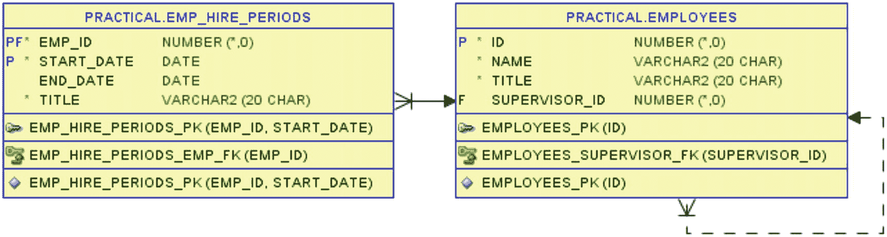

图 19-1：员工担任特定工作职位的任职周期表

一个特定的员工可以在不同时间段内担任不同的工作职能（由 `title` 列指示）。我表中的日期范围遵循以下规则：

*   `end_date` 中的 `null` 值表示员工目前在该职能岗位上工作。
*   当员工离开 Good Beer Trading Co 时，`end_date` 会被填充。
*   如果员工被重新雇佣，则会插入一个新行。
*   因为晋升或工作职能变动，`end_date` 会被填充，并插入一个带有新职位的新行。
*   一个员工可以同时拥有多个职能，因此日期范围可能重叠。
*   `start_date` 包含在日期范围内，而 `end_date` 被排除在日期范围之外——通常写作 `[start_date, end_date[` 半开区间。

你可能会觉得最后一条规则不那么直观，但我稍后会解释为什么这是一个好主意。

> 注意：一个*闭*区间 `[start, end]` 表示 `start <= x <= end`，而一个*开*区间 `]start, end[` 表示 `start < x < end`。*半开*区间则要么是 `]start, end]`，要么是（如本例）`start, end[`。

本章展示的所有逻辑原则上仅通过使用 `emp_hire_periods` 表本身即可有效，但为了更容易看清谁是谁，我在代码清单 [19-1 中创建了一个视图，以便也能检索员工的 `name`。

```sql
create or replace view emp_hire_periods_with_name
as
select
   ehp.emp_id
 , e.name
 , ehp.start_date
 , ehp.end_date
 , ehp.title
from emp_hire_periods ehp
join employees e
   on e.id = ehp.emp_id;
```

代码清单 19-1：连接任职周期与员工信息的视图

查询代码清单 19-2 中的 `emp_hire_periods_with_name` 视图，我可以展示我拥有的数据。

```sql
select
   ehp.emp_id
 , ehp.name
 , ehp.start_date
 , ehp.end_date
 , ehp.title
from emp_hire_periods_with_name ehp
order by ehp.emp_id, ehp.start_date;
```

代码清单 19-2：任职周期数据

为了节省一点空间，我没有为所有 14 名员工填充数据，只选择了其中 6 名：

```
EMP_ID  NAME           START_DATE  END_DATE    TITLE
142     Harold King    2010-07-01  2012-04-01  Product Director
142     Harold King    2012-04-01              Managing Director
143     Mogens Juel    2010-07-01  2014-01-01  IT Technician
143     Mogens Juel    2014-01-01  2016-06-01  Sys Admin
143     Mogens Juel    2014-04-01  2015-10-01  Code Tester
143     Mogens Juel    2016-06-01              IT Manager
144     Axel de Proef  2010-07-01  2013-07-01  Sales Manager
144     Axel de Proef  2012-04-01              Product Director
145     Zoe Thorston   2014-02-01              IT Developer
145     Zoe Thorston   2019-02-01              Scrum Master
146     Lim Tok Lo     2014-10-01  2016-02-01  Forklift Operator
146     Lim Tok Lo     2017-03-01              Warehouse Manager
147     Ursula Mwbesi  2014-10-01  2015-05-01  Delivery Manager
147     Ursula Mwbesi  2016-05-01  2017-03-01  Warehouse Manager
147     Ursula Mwbesi  2016-11-01              Operations Chief
```

当我在图 19-2 中将相同的数据可视化时，很容易看出谁在过程中更换了工作，谁曾离开公司后又以不同的职位返回，以及谁在一段时间内身兼双职。

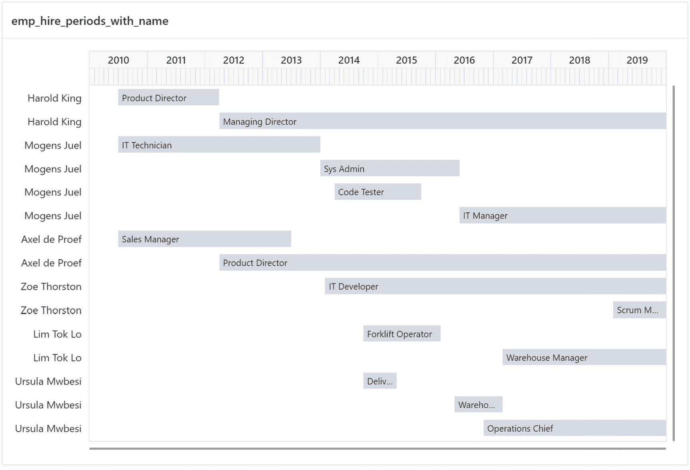

图 19-2：数据可视化有助于看清重叠部分

你会注意到，因为我使用了前面提到的半开区间，更换工作的员工在新工作上的 `start_date` 等于旧工作的 `end_date`。为什么我不改用闭区间呢，这样 Harold King 就可以是 2010-07-01 到 2012-03-31 的产品总监——两个日期都包含在内？

使用闭区间可能看起来更简单，因此你可以通过使用 `between` 而不是 `>=` 和 `<` 来简化一点代码——但这有个问题。`date` 数据类型不仅可以包含完整的日期，还可以包含小时、分钟和秒。这意味着，对于一个闭区间的 `end_date` 2012-03-31，Harold King 在午夜过一秒后就不再被雇佣了，而在 3 月 31 日这整天，直到 4 月 1 日午夜被重新雇佣前，他都会处于失业状态。

“简单，” 你说，“把 `end_date` 设为 2012-03-31 23:59:59 不就行了。” 但真的行吗？可能没问题，但如果你将来需要切换到 `timestamp` 数据类型并支持小数秒怎么办？（对于任职周期来说可能不会，但你可以很容易地想象到其他用例。）

通过为你的日期范围改用半开区间，你就永远不会遇到 Harold King 原则上有短时间（一天、一秒、一微秒——无论多短，使用闭区间总会有一小段时间未被范围覆盖）未被雇佣的问题。

使用半开区间时，将两个日期都理解为“起始日期”会有所帮助：

*   `start_date` 是行开始生效的确切时刻*从*。
*   `end_date` 是行不再生效的确切时刻*从*（即，它在该时刻*之前立即结束*生效）。

这种思路或许可以通过选择像 `active_from` 和 `inactive_from` 这样的列名来强化，但*开始*和*结束*的概念实在太常用了，所以我还是沿用了它。

Oracle 自己在 12.1 版本引入时间有效性时也认识到了半开区间的用处。所以让我借此机会简要离题一下，向你展示时间有效性是如何工作的。之后我会再回到日期范围合并的话题。

#### 时间有效性

在代码清单 19-3 中，你可以看到我用来创建 `emp_hire_periods` 表的 `create table` 语句。

```sql
SQL> create table emp_hire_periods (
2     emp_id         not null constraint emp_hire_periods_emp_fk
3                       references employees
4   , start_date     date not null
5   , end_date       date
6   , title          varchar2(20 char) not null
7   , constraint emp_hire_periods_pk primary key (emp_id, start_date)
8   , period for employed_in (start_date, end_date)
9  );
代码清单 19-3
定义了时间有效性的表
```

有趣的部分在第 8 行，这是用于在表上定义时间有效性的 `period for` 子句。

在括号内，我指定了包含半开区间起点和终点的两个列。（这些可以是 `date` 或 `timestamp` 列。）这两列都允许为空；只是在这个用例中，我将 `start_date` 设置为 `not null`，因为工作期间总是有一个特定的起点，而 `end_date` 允许空值，因为这意味着该职位仍然有效。

**提示**

如果你不指定这两列，数据库会自动创建两个隐藏列来包含该区间。通常我更喜欢自己创建列并指定它们，但如果你的用例中查询者不关心实际区间，只关心某行在特定时间点是否有效，那么这可能很方便。

在 `period for` 之后，你必须为时间段命名（给它一个标识符），我仔细地选择了 `employed_in`。给名字好好想想是个好主意，因为一个好的名字将有助于编写使用时间有效性的查询，正如我在代码清单 19-4 中所示。

```sql
SQL> select
2     ehp.emp_id
3   , e.name
4   , ehp.start_date
5   , ehp.end_date
6   , ehp.title
7  from emp_hire_periods
8          as of period for employed_in date '2010-07-01'
9       ehp
10  join employees e
11     on e.id = ehp.emp_id
12  order by ehp.emp_id, ehp.start_date;
代码清单 19-4
按特定日期查询雇佣时间段表
```

在 `from` 子句的第 7-9 行，我可以使用一种与闪回查询非常相似的 `as of` 语法，其中第 7 行是表名，第 8 行是 `as of` 规范，第 9 行是表别名。

使用闪回时，我指定 `as of timestamp` 或 `as of scn`，但对于时间有效性，我指定 `as of period for` 后跟时间段的名称。这意味着第 8 行的 `employed_in` 名称有助于自我文档化，表明我正在查询在 2010-07-01（公司成立之初）*受雇于*公司的员工，当时只有三个人：

```
EMP_ID  NAME           START_DATE  END_DATE    TITLE
142     Harold King    2010-07-01  2012-04-01  Product Director
143     Mogens Juel    2010-07-01  2014-01-01  IT Technician
144     Axel de Proef  2010-07-01  2013-07-01  Sales Manager
```

如果我想找 6 年后雇佣的员工，只需更改第 8 行的日期值：

```sql
...
8          as of period for employed_in date '2016-07-01'
...
```

这里我有五个人（其中一些是同一个人，只是职位变了）：

```
EMP_ID  NAME           START_DATE  END_DATE    TITLE
142     Harold King    2012-04-01              Managing Director
143     Mogens Juel    2016-06-01              IT Manager
144     Axel de Proef  2012-04-01              Product Director
145     Zoe Thorston   2014-02-01              IT Developer
147     Ursula Mwbesi  2016-05-01  2017-03-01  Warehouse Manager
```

带有 `as of` 的查询在数据库内部会被重写为带有适当 `>=` 和 `<` 谓词的常规 `where` 子句；只是用 `as of` 更容易正确编写。此外，数据库将其视为一种约束——它不允许你插入 `end_date` 在 `start_date` 之前的数据。

这个简短的旁注向你简要展示了时间有效性如何使事情变得更简单，如果你确实使用时间有效性，你还会自动获得半开区间的好处。现在我将回到范围合并，无论是否使用时间有效性，你都可以进行这种合并。

### 合并重叠范围

我现在想做的是获取图 19-2 中的数据，找到同一员工的雇佣期相邻或重叠的所有位置，并将它们合并成汇总行，显示该员工在该汇总期间内担任了多少个职位（无论是连续还是同时担任）。我想要的结果如图 19-3 所示。


图 19-3

合并相邻和重叠日期范围后的预期结果

我现在将尝试使用 `match_recognize` 来解决这个问题。为了展示尝试不同方法并在此过程中更改逻辑，我将首先展示一些不太成功的尝试，最终导向一个可行的解决方案。


#### 与上一行进行比较的尝试

在许多使用 `match_recognize` 的场景中，将当前行的某个值与上一行的某个值进行比较以进行行分类是典型的做法。因此，我将首先在代码清单 19-5 中尝试这种方法。

```sql
SQL> select
2     emp_id
3   , name
4   , start_date
5   , end_date
6   , jobs
7  from emp_hire_periods_with_name
8  match_recognize (
9     partition by emp_id
10     order by start_date, end_date
11     measures
12        max(name)         as name
13      , first(start_date) as start_date
14      , last(end_date)    as end_date
15      , count(*)          as jobs
16     pattern (
17        strt adjoin_or_overlap*
18     )
19     define
20        adjoin_or_overlap as
21           start_date <= prev(end_date)
22  )
23  order by emp_id, start_date;
```
*代码清单 19-5. 将 `start_date` 与前一行的 `end_date` 进行比较*

我在第 21 行的简单定义表明，如果 `start_date` 小于或等于前一行的 `end_date`，则该行是重叠或相邻的。然后，通过第 17 行的 `pattern` 来查找匹配项：任何行后面跟着零个或多个相邻或重叠的行。

果然，此规则确实合并了此输出中的部分日期范围：

```
EMP_ID  NAME           START_DATE  END_DATE    JOBS
142     Harold King    2010-07-01              2
143     Mogens Juel    2010-07-01  2015-10-01  3
143     Mogens Juel    2016-06-01              1
144     Axel de Proef  2010-07-01              2
145     Zoe Thorston   2014-02-01              1
145     Zoe Thorston   2019-02-01              1
146     Lim Tok Lo     2014-10-01  2016-02-01  1
146     Lim Tok Lo     2017-03-01              1
147     Ursula Mwbesi  2014-10-01  2015-05-01  1
147     Ursula Mwbesi  2016-05-01              2
```

但是，例如 Mogens Juel 的输出并未完全合并；应该只有一行显示他拥有四份工作。问题在于，当我按 `start_date` 对他的行排序时，Code Tester 和 IT Manager 行被比较，并且它们并不重叠。像这样与上一行进行比较，无法发现这两行都与 Sys Admin 行相邻或重叠。

思考之后，我认为或许只需将第 10 行的排序改为首先按 `end_date` 排序会有所帮助：

```sql
...
10     order by end_date, start_date
...
```

输出已经改变，但 Mogens Juel 仍然错误地显示了两次：

```
EMP_ID  NAME           START_DATE  END_DATE    JOBS
142     Harold King    2010-07-01              2
143     Mogens Juel    2010-07-01  2014-01-01  1
143     Mogens Juel    2014-04-01              3
144     Axel de Proef  2010-07-01              2
145     Zoe Thorston   2014-02-01              1
145     Zoe Thorston   2019-02-01              1
146     Lim Tok Lo     2014-10-01  2016-02-01  1
146     Lim Tok Lo     2017-03-01              1
147     Ursula Mwbesi  2014-10-01  2015-05-01  1
147     Ursula Mwbesi  2016-05-01              2
```

在更改排序后，为 Mogens Juel 查找匹配项的第一次尝试将尝试比较 IT Technician 行与 Code Tester 行，但未能发现重叠。

无论我选择哪种排序，仅仅通过将一行与前一行进行比较，我都无法在单个匹配项中获得所有重叠。我需要一种不同的方法来处理这个问题。

#### 更好地与最大结束日期进行比较

仔细查看图 19-2 中 Mogens Juel 的行后，我决定更好的方法是将行的 `start_date` 与我在匹配项中找到的最高 `end_date` 进行比较。

这种方法的初步尝试可能如下所示，但它不会起作用：

```sql
...
8  match_recognize (
9     partition by emp_id
10     order by start_date, end_date
11     measures
12        max(name)         as name
13      , first(start_date) as start_date
14      , max(end_date)     as end_date
15      , count(*)          as jobs
16     pattern (
17        strt adjoin_or_overlap*
18     )
19     define
20        adjoin_or_overlap as
21           start_date <= max(end_date)
22  )
...
```

它不起作用的原因是，当评估像第 21 行这样的定义条件时，会首先假设该行被分类为 `adjoin_or_overlap`，然后测试条件是否为真。因此，`max(end_date)` 的结果是针对目前为止匹配项中的所有行加上当前行计算的，这没有意义。

事实上，这非常没有意义，以至于当我测试这第一次尝试时，根据数据库版本和所使用的客户端，查询要么返回 `ORA-03113: end-of-file on communication channel`，要么返回 `java.lang.NullPointerException`。随后数据库连接中断。

所以不要使用这第一次尝试。相反，你应该尝试我的第二次尝试，如代码清单 19-6 所示。

```sql
...
8  match_recognize (
9     partition by emp_id
10     order by start_date, end_date
11     measures
12        max(name)         as name
13      , first(start_date) as start_date
14      , max(end_date)     as end_date
15      , count(*)          as jobs
16     pattern (
17        adjoin_or_overlap* last_row
18     )
19     define
20        adjoin_or_overlap as
21           next(start_date) <= max(end_date)
22  )
23  order by emp_id, start_date;
```
*代码清单 19-6. 将下一行的 `start_date` 与迄今为止见到的最高 `end_date` 进行比较*

在代码清单 19-6 中，我反转了逻辑。我不是将当前行与前一行进行比较，而是将其与下一行进行比较：
*   我在第 10 行回到了按 `start_date` 排序。
*   在第 21 行，我检查下一行的 `start_date` 是否小于或等于迄今为止在匹配项中看到的最高 `end_date` —— 包括当前行，因为在评估时，`max` 调用会假定当前行是匹配项的一部分。这意味着当一行被分类为 `adjoin_or_overlap` 时，该行应与下一行合并。
*   第 17 行的 `pattern` 查找零个或多个 `adjoin_or_overlap` 行，后跟一个分类为 `last_row` 的行。由于该分类是未定义的，任何行都可以匹配它 —— 但因为 `last_row` 之前的行被分类为 `adjoin_or_overlap`，我知道 `last_row` 也应该被合并。
*   如果我没有找到任何 `adjoin_or_overlap` 行，该行将被分类为 `last_row`，因为第 17 行中的 `*` 表示模式中可以接受零个 `adjoin_or_overlap` 行。这意味着当一行不与任何其他行重叠时，它将成为一个单独行的匹配项，分类为 `last_row`，因此作为未合并的部分出现在输出中。
*   第 14 行的 `measure` `end_date` 是作为匹配项的最大 `end_date` 计算的。由于我没有在 `max` 调用中用 `adjoin_or_overlap` 或 `last_row` 来限定 `end_date`，因此 `max` 应用于匹配项的所有行，无论行获得了何种分类。


### 理解 MATCH_RECOGNIZE 子句

这是一个理解起来有些棘手的 `match_recognize` 子句。当我就这个主题进行会议演讲时，我通常会在白板上绘制日期范围，并逐行演示行分类的评估过程。由于无法在书中绘制动画，我将使用从图 19-4 到图 19-8 的系列图表来模拟这个过程，展示为 Mogens Juel 寻找匹配的步骤。


图 19-4

第一行能否分类为 `adjoin_or_overlap`？

在图 19-4 中，我首先评估 Mogens Juel 的第一行是否可以被分类为 `adjoin_or_overlap`。由于我*假设*它可以，清单 19-6 第 21 行的 `max(end_date)` 计算结果为第一行的结束日期。`next(start_date)` 计算结果为第二行的 `start_date`。两者相等，因此是相邻的，所以第 21 行的条件为真，第一行被分类为 `adjoin_or_overlap`。


图 19-5

第二行能否分类为 `adjoin_or_overlap`？

对第一行进行分类后，图 19-5 评估第二行是否可以被分类为 `adjoin_or_overlap`。`max(end_date)` 计算结果为第二行的 `end_date`，而 `next(start_date)` 是第三行的 `start_date`。后者小于前者，因此是重叠的，第二行被分类为 `adjoin_or_overlap`。

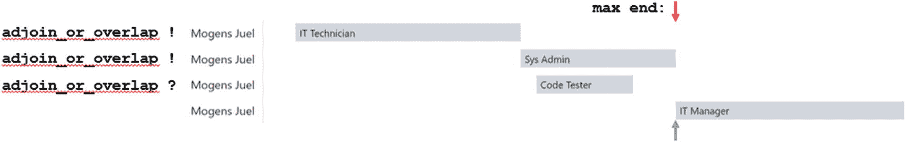

图 19-6

第三行能否分类为 `adjoin_or_overlap`？

模式仍然满足，因此在图 19-6 中，对第三行执行分类评估。在这种情况下，`max(end_date)` 没有移动；它仍然是第二行的 `end_date`。`next(start_date)` 是第四行的 `start_date`。它们相等，所以第四行与到目前为止找到的匹配相邻，因此第三行是 `adjoin_or_overlap`。

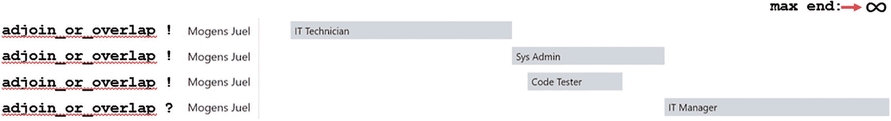

图 19-7

第四行能否分类为 `adjoin_or_overlap`？

匹配继续，图 19-7 评估第四行。这次，`max(end_date)` 应该如图所示为无穷大，因为第四行的 `end_date` 是 `null`。我*尚未*处理这种情况（稍后详述），所以实际上，`max(end_date)` *会错误地* 计算为第二行的 `end_date`。但由于没有更多的行，`next(start_date)` 计算结果为 `null`，这使得条件计算结果为布尔值 *unknown*。因此，第四行*未被*分类为 `adjoin_or_overlap`。

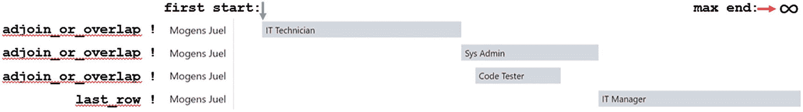

图 19-8

第四行被分类为 `last_row`，并且已找到匹配

当第四行*不是* `adjoin_or_overlap` 时，清单 19-6 第 17 行的 `pattern` 指出它应该是 `last_row` 才能完成匹配。因此，图 19-8 评估第四行是否可以被分类为 `last_row`。由于 `last_row` 是一个*未定义*的分类，它*总是*评估为真，因此第四行*确实*被分类为 `last_row`，并且匹配已经完成。

对 Mogens Juel 的行分类进行逐步评估，得到了清单 19-6 的输出，其中 Mogens Juel 的四个雇佣期被正确地合并为一行，显示四份工作：

```
EMP_ID  NAME           START_DATE  END_DATE    JOBS
142     Harold King    2010-07-01  2012-04-01  2
143     Mogens Juel    2010-07-01  2016-06-01  4
144     Axel de Proef  2010-07-01  2013-07-01  2
145     Zoe Thorston   2014-02-01              1
145     Zoe Thorston   2019-02-01              1
146     Lim Tok Lo     2014-10-01  2016-02-01  1
146     Lim Tok Lo     2017-03-01              1
147     Ursula Mwbesi  2014-10-01  2015-05-01  1
147     Ursula Mwbesi  2016-05-01  2017-03-01  2
```

但是，这个输出仍然有几个问题。

首先，一些员工（包括 Mogens Juel）的度量 `end_date` 值错误。那些仍在职的人在 `end_date` 列应该为 `null`（空白），而在这个输出中，这*仅*对那些只有*单个*雇佣期的人是真的。对于那些有过*多于*一份工作的人，显示的是最高的*非 null* `end_date`，这是错误的。

其次，我注意到 Zoe Thorston 也有重叠的行——这里的问题仅仅是两行的 `end_date` 都是 `null`，这意味着两行都是当前的，她拥有这两个职位功能。对于 `null` 值，清单 19-6 第 21 行的简单比较*不会*为 `true`。

这两个问题都是因为我未处理 `end_date` 中的 `null` 值。我现在就要处理这个问题。


#### 处理空日期值

为了处理这些 `null` 值，我在代码清单 19-7 中做了更多一点的修改。

```
...
8  match_recognize (
9     partition by emp_id
10    order by start_date nulls first, end_date nulls last
11    measures
12       max(name)         as name
13     , first(start_date) as start_date
14     , nullif(
15          max(nvl(end_date, date '9999-12-31'))
16        , date '9999-12-31'
17       )                 as end_date
18     , count(*)          as jobs
19    pattern (
20       adjoin_or_overlap* last_row
21    )
22    define
23       adjoin_or_overlap as
24          nvl(next(start_date), date '-4712-01-01')
25             <= max(nvl(end_date, date '9999-12-31'))
26 )
27 order by emp_id, start_date;
代码清单 19-7
处理开始和结束日期的 null=无穷大情况
```

尽管这个特定案例中只有 `end_date` 存在 `null` 值，但为了演示目的，我做了必要的修改来处理如果 `start_date` 也存在 `null` 值的情况：

*   在第 10 行，我使 `order by` 子句更加明确。如果 `start_date` 中存在 `null` 值，这些值会被认为比任何其他 `start_date` 都早，因此我使用 `nulls first` 使这些行排在最前面。类似地，`end_date` 中的 `null` 值被认为比任何其他 `end_date` 都晚，所以我使用 `nulls last` 让这些行排在最后。

*   在比较操作中，我不能简单地使用 `nulls first` 来将 `start_date` 中的 `null` 视为小于任何其他日期，所以在第 24 行，我将 `null` 转换为 Oracle `date` 数据类型中可能的最小日期。

*   聚合函数 `max` 会忽略 `null` 值，因此在第 25 行，我将 `end_date` 中的 `null` 转换为 `date` 中可能的最大日期。

*   为了在 `end_date` `measure` 中获得正确结果，我在第 15 行的 `max` 函数内部做了同样的 `nvl` 处理。然后，如果 `max` 的结果是最大日期，我使用第 14 行和第 16 行的 `nullif` 将其转换回 `null` 输出。

应用这些扩展规则后，我得到了最终的输出，其中 Zoe Thorston 的行也被合并成了一行：

```
EMP_ID  NAME           START_DATE  END_DATE    JOBS
142     Harold King    2010-07-01              2
143     Mogens Juel    2010-07-01              4
144     Axel de Proef  2010-07-01              2
145     Zoe Thorston   2014-02-01              2
146     Lim Tok Lo     2014-10-01  2016-02-01  1
146     Lim Tok Lo     2017-03-01              1
147     Ursula Mwbesi  2014-10-01  2015-05-01  1
147     Ursula Mwbesi  2016-05-01              2
```

这个输出结果与图 19-3 相符，这正是我想要的结果。

现在我无法再进一步合并了——这个输出中的所有行既不重叠也不相邻。

### 经验教训

这只是一个在员工职位历史报告中合并具有日期范围的行的示例，但它可以作为灵感和教训，让你能够继续前进，对其他数据做同样的事情。

在本章中，我解释了：

*   使用半开区间表示日期范围的优势，以及时态有效性如何使查询此类区间的数据变得更容易

*   使用 `match_recognize` 将最大值与下一行进行比较，以找到重叠或相邻的范围，并将它们合并到聚合行中

*   扩展规则以处理 `null` 表示无穷大的情况

你可能会发现很多地方可以使用这些方法。

## 20. 寻找异常峰值

在许多情况下，存在顺序数据（通常是时间序列数据），这些数据本应具有相当稳定的数值，或以相当稳定的速率增加/减少。如果数据中存在*不*稳定的地方，你会希望知道。换句话说，如果你以图形方式表示数据，你会希望找到异常的峰值和尖峰。

作为数据库专业人员，这种情况的一个明显例子是表空间存储使用情况。通常，GB 数每天/每周/每月以大致相同的速率增长——任何过度的增长率都表明存在异常工作负载，这可能是由大型计划一次性作业或导致进程失控错误插入数百万行的错误引起的。

另一个用例是本章将使用的案例——网站上各个网页的访问次数。异常的访问计数可能意味着拒绝服务攻击、对营销活动的强烈响应、垃圾邮件机器人以及病毒式推文——在所有情况下，能发现数据中的此类峰值都是好事。

我想你可以轻易想到许多其他类似的用例，但那么如何发现这些峰值呢？将数据放在图表上通常使此类峰值对人眼来说容易可见，但你不能让 SQL 代码看图表——或者可以吗？嗯，在某种意义上，是的，你可以。我在第 17 章展示了如何使用 `match_recognize` 寻找上下波动模式——寻找这些峰值是类似的技术。

### 网页计数器历史

作为示例用例，我将使用网页的页面计数器——简单来说，就是 Good Beer Trading Co 网站上的每个页面都有一个计数器，每次有人访问该页面时增加 1。

每天午夜，每个页面计数器的当前值都存储在图 20-1 所示的 `web_counter_hist` 表中，在那里你也能看到 `web_pages` 和 `web_apps` 表。

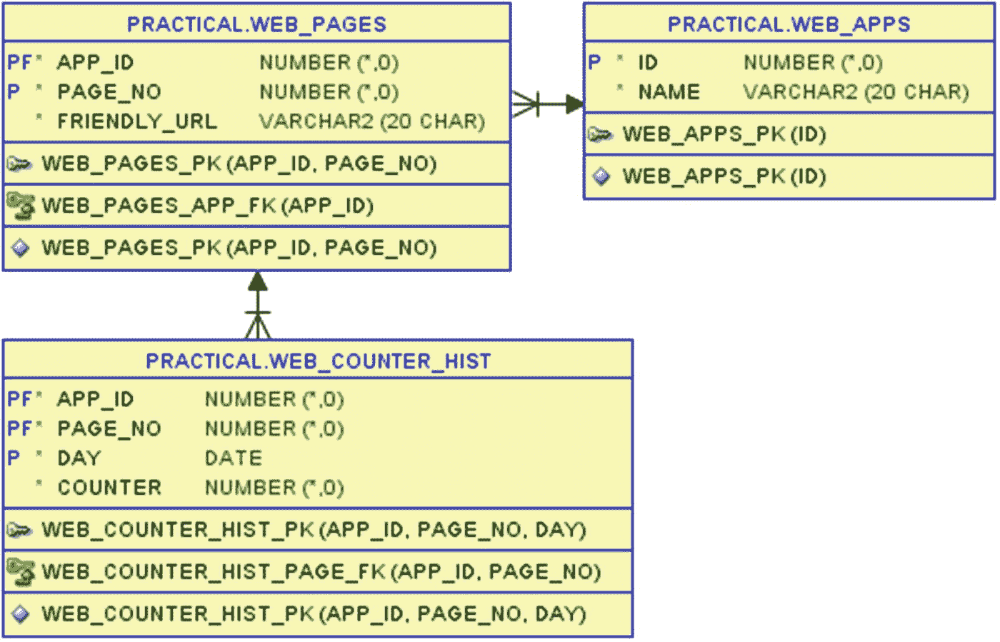

图 20-1

用于存储 Web 应用程序、页面和计数器历史的表

由于 `web_counter_hist.page_no` 列对人类不太友好，在代码清单 20-1 中，我创建了一个连接三个表的视图。

```
SQL> create or replace view web_page_counter_hist
2  as
3  select
4     ch.app_id
5   , a.name as app_name
6   , ch.page_no
7   , p.friendly_url
8   , ch.day
9   , ch.counter
10  from web_apps a
11  join web_pages p
12     on p.app_id = a.id
13  join web_counter_hist ch
14     on ch.app_id = p.app_id
15     and ch.page_no = p.page_no;
视图 WEB_PAGE_COUNTER_HIST 已创建。
代码清单 20-1
连接 Web 应用程序、页面和计数器历史的视图
```

舞台已搭建好，我现在准备好深入探究数据了。


### 计数器数据

首先，通过清单 20-2，我将展示我的网站只有一个应用，其中包含四个页面。

```sql
SQL> select
2     p.app_id
3   , a.name as app_name
4   , p.page_no
5   , p.friendly_url
6  from web_apps a
7  join web_pages p
8     on p.app_id = a.id
9  order by p.app_id, p.page_no;
Listing 20-2
我的网店应用中的页面
```

该应用是网店，这四个页面各自拥有一个 `friendly_url`，因为对我们人类而言，使用 `/About` 要比使用 `/pls/apex/f?p=542:4::::::` 更为友好。

```
APP_ID  APP_NAME  PAGE_NO  FRIENDLY_URL
542     Webshop   1        /Shop
542     Webshop   2        /Categories
542     Webshop   3        /Breweries
542     Webshop   4        /About
```

因此，我可以使用清单 20-3 来查看应用 `542` 中每个页面的计数器历史。

```sql
SQL> select
2     friendly_url, day, counter
3  from web_page_counter_hist
4  where app_id = 542
5  order by page_no, day;
Listing 20-3
网页计数器历史数据
```

我获得了 2019 年 4 月 30 天的递增计数器值：

```
FRIENDLY_URL  DAY         COUNTER
/Shop         2019-04-01  5010
/Shop         2019-04-02  5088
...
/Shop         2019-04-29  7755
/Shop         2019-04-30  7833
/Categories   2019-04-01  3397
...
/Categories   2019-04-30  5033
/Breweries    2019-04-01  1866
...
/Breweries    2019-04-30  3115
/About        2019-04-01  455
...
/About        2019-04-30  586
已选择 120 行。
```

我在图 20-2 的图表中对这些数据进行了可视化。实际上，在这些图表上发现异常并不那么容易。我大体能看出顶部的线条在月中有一段加速期，第二条线在月末附近有一次短暂的爆发。但要真正找出这些点，我将求助于 SQL。

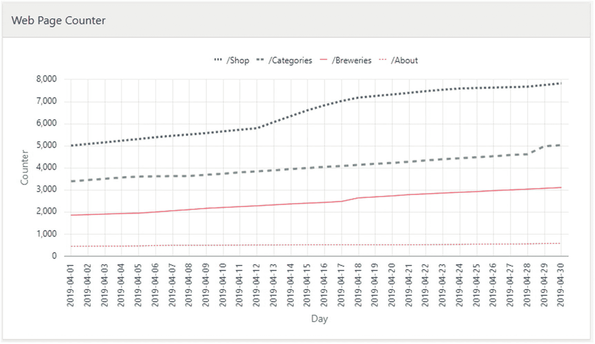

图 20-2

网页计数器历史数据

由于我只有这一个应用，因此在本章的剩余部分，我简化了 SQL，不再到处使用 `where app_id = 542`。剩余代码的假设是基于单个应用。

#### 原始计数器数据中的模式

在这一组 `match_recognize` 示例中，我将使用前面图表中描绘的这些原始计数器数据。

首先，我可以尝试简单地查找某个页面计数器每天增长至少达到一个常数的时段。在清单 20-4 中，我搜索计数器增长至少为 200 的情况。

```sql
SQL> select
2     url, from_day, to_day, days, begin, growth, daily
3  from web_page_counter_hist
4  match_recognize(
5     partition by page_no
6     order by day
7     measures
8        first(friendly_url) as url
9      , first(day) as from_day
10      , last(day) as to_day
11      , count(*) as days
12      , first(counter) as begin
13      , next(counter) - first(counter) as growth
14      , (next(counter) - first(counter)) / count(*)
15           as daily
16     one row per match
17     after match skip past last row
18     pattern ( peak+ )
19     define
20        peak as next(counter) - counter >= 200
21  )
22  order by page_no, from_day;
Listing 20-4
识别计数器每天增长至少 200 的日期
```

在第 20 行的定义中，我指明了什么是 `peak`：它是指当天计数器增长至少 200 的一天。由于计数器值存储在午夜，因此一天内计数器的增长是 `next` 值减去当前值。因此，任何满足此值大于等于 200 的行都被归类为 `peak` 行。

第 18 行的 `pattern` 因此可以非常简单——我正在寻找被归类为 `peak` 行的一个或多个连续天数的时段。通过在第 16 行使用 `one row per match`，我每个时段仅输出一行。而第 8-15 行的 `measures` 计算给了我这样的输出：

```
URL          FROM_DAY    TO_DAY      DAYS  BEGIN  GROWTH  DAILY
/Shop        2019-04-12  2019-04-15  4     5800   1039    259.75
/Categories  2019-04-28  2019-04-28  1     4625   360     360
```

这正是我在前文提到的，通过肉眼在图 20-2 的图表上发现的两处异常。

请注意，由于我在清单 20-4 中没有指定任何 `running` 或 `final`，因此输出能正常工作是因为我使用了 `one row per match`——如果我使用 `all rows per match`，大多数度量值将会使用 `runing` 语义，并可能产生一个我不想要的输出。

但我也可以明确地指定我希望它使用 `final` 语义，即根据匹配的最后一行来计算表达式。这意味着需要这样更改第 8-15 行的 `measures` 表达式：

```sql
...
8        first(friendly_url) as url
9      , first(day) as from_day
10      , final last(day) as to_day
11      , final count(*) as days
12      , first(counter) as begin
13      , next(final last(counter)) - first(counter) as growth
14      , (next(final last(counter)) - first(counter))
15           / final count(*) as daily
...
```

这给了我完全相同的输出，但现在如果我使用 `all rows per match`，我也能得到相同的计算值。

注

如前所述，在 `define` 子句中使用 `next(counter)` 获取的是下一个午夜的值，因此当我减去当前值时，我得到的是当天的增长量。为了在第 13 行获取该时段的*总*增长量，`final last` 会定位到匹配的最后一天——应用 `next` 则会给我下一个午夜的计数器值，*即使它位于匹配范围之外*。

至此，我找到了超过常数的增长峰值，但问题在于，“至少 200”对于访问量最大的页面可能是个合适的数字，但对于访问量最小的页面却不适用。

因此，在清单 20-5 中，我不再寻找绝对数值，而是查找百分比的相对增长。


```
SQL> select
2     url, from_day, to_day, days, begin, pct, daily
3  from web_page_counter_hist
4  match_recognize(
5     partition by page_no
6     order by day
7     measures
8        first(friendly_url) as url
9      , first(day) as from_day
10      , final last(day) as to_day
11      , final count(*) as days
12      , first(counter) as begin
13      , round(
14           100 * (next(final last(counter)) / first(counter))
15               - 100
16         , 1
17        ) as pct
18      , round(
19           (100 * (next(final last(counter)) / first(counter))
20                    - 100) / final count(*)
21         , 1
22        ) as daily
23     one row per match
24     after match skip past last row
25     pattern ( peak+ )
26     define
27        peak as next(counter) / counter >= 1.04
28  )
29  order by page_no, from_day;
Listing 20-5
识别计数器每日增长至少 4%的时期
```

在第 27 行，我更改了 `peak` 行的定义，因此我不再查看下一个午夜值和当前午夜值之间的 `差值`，而是查看 `比率`。如果下一个值至少是当前值的 `系数` 1.04，则当天的增长至少为 4%，该行就是一个峰值行。

我保留了大部分 `measures` 表达式，但在第 13-22 行，我从显示绝对增长改为显示以百分比表示的总增长和平均每日增长：

```
URL          FROM_DAY    TO_DAY      DAYS  BEGIN  PCT  DAILY
/Shop        2019-04-12  2019-04-14  3     5800   14   4.7
/Categories  2019-04-28  2019-04-28  1     4625   7.8  7.8
/Breweries   2019-04-17  2019-04-17  1     2484   6.6  6.6
/About       2019-04-05  2019-04-05  1     468    4.9  4.9
```

在代码清单 20-5 中，我寻找的是时期内每一天增长都至少为 4%的时期。但我可以把第 27 行的定义改为一个稍微复杂点的计算：

```
...
27        peak as ((next(counter) / first(counter)) - 1)
28                   / running count(*)  >= 0.04
...
```

使用这个公式，我寻找的是时期内平均每日增长至少为 4%的时期。输出显示几乎相同的四个匹配项，只是前三个时期现在都稍长一些，因为在时期开始时一些较大的每日增长意味着在匹配的末尾可以多包含一两天。尽管那些额外的单日增长小于 4%，但时期内的平均值仍然保持至少 4%：

```
URL          FROM_DAY    TO_DAY      DAYS  BEGIN  PCT   DAILY
/Shop        2019-04-12  2019-04-16  5     5800   21.2  4.2
/Categories  2019-04-28  2019-04-29  2     4625   8.8   4.4
/Breweries   2019-04-17  2019-04-18  2     2484   8.4   4.2
/About       2019-04-05  2019-04-05  1     468    4.9   4.9
```

到目前为止，我展示了如何从绝对增长或相对增长的角度寻找异常增长，但在这种情况下，这可能不是最佳做法。也许查看每日访问量会更好。

### 查看每日访问量

有些情况使用我前面展示的方式寻找增长是有用的，但仔细想想，对于当前案例这可能并不是一个好主意。随着时间的推移，计数器值会不断增长，因此当年复一年计数器值在数量级上变得巨大时，4%的增长率需要多得多的每日访问量才能满足条件。

所以我打算转而观察每日访问计数的变化情况。当你这样查看数据时，就会清楚我在代码清单 20-5 中实际找到的是每日访问量至少占计数器值 4%的时期。不幸的是，这会导致 `相同的` 每日访问量在计数器生命周期的初期显示出很高的百分比，而随着时间的推移和计数器的增加，百分比会越来越低。

为了创建更好的解决方案，首先，我将使用代码清单 20-6 来仅显示每日访问量。

```
SQL> select
2     friendly_url, day
3   , lead(counter) over (
        partition by page_no order by day
     ) - counter as visits
6  from web_page_counter_hist
7  order by page_no, day;
Listing 20-6
聚焦于每日访问量
```

第 3-5 行中的表达式使用 `lead` 分析函数来查找下一个午夜的计数器值与此午夜值之间的差值——与我之前在 `match_recognize` 语法中使用 `next` 所做的相同：

```
FRIENDLY_URL  DAY         VISITS
/Shop         2019-04-01  78
/Shop         2019-04-02  72
...
/Shop         2019-04-29  78
/Shop         2019-04-30
/Categories   2019-04-01  57
...
/Categories   2019-04-29  48
/Categories   2019-04-30
/Breweries    2019-04-01  21
...
/Breweries    2019-04-29  38
/Breweries    2019-04-30
/About        2019-04-01  4
...
/About        2019-04-29  5
/About        2019-04-30
共选择出 120 行。
```

我将此输出可视化于图 20-3。

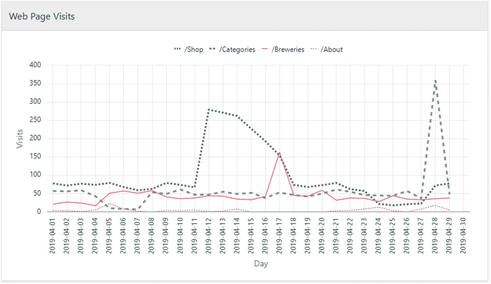

图 20-3

绘制访问量而非计数器值的图表更能突出显示峰值

在这张图上，相比于图 20-2，更容易发现峰值。你甚至可以在最底下的线——即 `/About` 页面上——看到一些小的峰值。

接下来，我将基于此图继续寻找模式。


### 日常访问量数据中的模式

首先，我再次尝试基于绝对数字寻找模式。在 `清单 20-7` 中，我查找那些日访问量比该时期前一天至少高出 50 的时期。

```sql
SQL> select
2     url, from_day, to_day, days, begin, p_v, f_v, t_v, d_v
3  from web_page_counter_hist
4  match_recognize(
5     partition by page_no
6     order by day
7     measures
8        first(friendly_url) as url
9      , first(day) as from_day
10      , final last(day) as to_day
11      , final count(*) as days
12      , first(counter) as begin
13      , first(counter) - prev(first(counter)) as p_v
14      , next(first(counter)) - first(counter) as f_v
15      , next(final last(counter)) - first(counter) as t_v
16      , round(
17           (next(final last(counter)) - first(counter))
18              / final count(*)
19         , 1
20        ) as d_v
21     one row per match
22     after match skip past last row
23     pattern ( peak+ )
24     define
25        peak as next(counter) - counter
26                 - (first(counter) - prev(first(counter))) >= 50
27  )
28  order by page_no, from_day;
清单 20-7
日访问量比前一天至少高出 50
```

看起来与我之前所做的有很多相似之处，但也存在一些差异：

*   第 25-26 行中峰值分类的定义是这样工作的：
    *   第 25 行中 `next()` 计数器值减去当前计数器值是当前日的访问量。
    *   第 26 行中 `first()` 减去 `prev(first()` 等同于回到上一行并执行 `next()` 减去当前值，换句话说，这是匹配开始前一天日的访问量。
    *   用当前日访问量减去“前一天”访问量，得出当前日高出多少——如果这个值至少是 50，则该行被分类为 `peak`。
*   在 `measures` 子句中，我计算了这四个值：
    *   `p_v` 是之前的访问量——即匹配第一行前一天的访问量，如前文所述。
    *   `f_v` 是第一天的访问量——即匹配第一天的访问量。
    *   `t_v` 是总访问量——从匹配第一天到最后一天的访问量总和。
    *   `d_v` 是日均访问量——匹配期间每天的平均访问量。

总的来说，这段代码产生以下输出：

```
URL          FROM_DAY    TO_DAY      DAYS  BEGIN  P_V  F_V  T_V   D_V
/Shop        2019-04-12  2019-04-17  6     5800   67   279  1386  231
/Categories  2019-04-28  2019-04-28  1     4625   37   360  360   360
/Breweries   2019-04-17  2019-04-17  1     2484   42   163  163   163
```

你会认出这是 `图 20-3` 中所示图表上最大的三个尖峰。

在 `清单 20-7` 中，为了基于 `counter` 数据计算访问量，使用了大量的 `prev`、`next`、`first()` 和 `last()`。我也可以预先计算每日访问量，从而简化我的 `match_recognize` 子句，如 `清单 20-8` 所示。

```sql
SQL> select
2     url, from_day, to_day, days, begin, p_v, f_v, t_v, d_v
3  from (
4     select
5        page_no, friendly_url, day, counter
6      , lead(counter) over (
7           partition by page_no order by day
8        ) - counter as visits
9     from web_page_counter_hist
10  )
11  match_recognize(
12     partition by page_no
13     order by day
14     measures
15        first(friendly_url) as url
16      , first(day) as from_day
17      , final last(day) as to_day
18      , final count(*) as days
19      , first(counter) as begin
20      , prev(first(visits)) as p_v
21      , first(visits) as f_v
22      , final sum(visits) as t_v
23      , round(final avg(visits)) as d_v
24     one row per match
25     after match skip past last row
26     pattern ( peak+ )
27     define
28        peak as visits - prev(first(visits)) >= 50
29  )
30  order by page_no, from_day;
清单 20-8
通过预计算访问量来简化代码
```

第 4-9 行包含一个与 `清单 20-6` 相同的内联视图，在其中我使用分析函数 `lead()` 来计算每日访问量。然后，我的 `match_recognize` 子句变得简单得多：

*   第 28 行简单地就是当前 `visits` 与匹配开始前一天的访问量之间的差值。
*   前文描述的四个度量在第 20-23 行通过使用导航函数和聚合函数变得简单得多。

`清单 20-8` 的输出与 `清单 20-7` 相同。

值得注意的是，数据库在 `清单 20-8` 中多做了一点工作，因为它必须先用分析函数进行预计算，然后才能进行模式匹配。另一方面，模式匹配处理变得简单了，所以根据数据情况，可能会抵消这部分开销——情况可能因人而异，所以请在你自己的数据上测试这两种方法。

还有一种常见情况是，你的数据已经包含类似“每日访问量”的形式，而不是递增计数器的历史快照值。如果是这样，那么很容易跳过 `清单 20-8` 中的内联视图，直接在你的数据上应用模式匹配。

现在，通过关注 `visits`，我似乎得到了比本章开头几个示例更好的峰值检测，但像“至少高出 50”这样的绝对值可能仍然不够好。所以在 `清单 20-9` 中，我修改了 `清单 20-8`，改为相对地搜索“至少高出 50%”。

```sql
SQL> select
2     url, from_day, to_day, days, begin, p_v, f_v, t_v, d_pct
3  from (
...
10  )
11  match_recognize(
...
23      , round(
24           (100*(final sum(visits) / prev(first(visits))) - 100)
25              / final count(*)
26         , 1
27        ) as d_pct
...
31     define
32        peak as visits / nullif(prev(first(visits)), 0) >= 1.5
33  )
34  order by page_no, from_day;
清单 20-9
日访问量比前一天至少高出 50%
```

在第 32 行，我从观察差值转向观察比率。如果 `prev()` 行的访问量为零，我无法计算比率，所以我使用 `nullif()` 在这些情况下使整个表达式为 null。

然后，我没有使用每日访问量度量，而是使用第 23-27 行来计算每日访问量相对于“前一天”访问量的百分比日均值。

我现在在数据中发现了相当多的更多峰值，但它们真的是峰值吗？


```
URL          FROM_DAY    TO_DAY      DAYS  BEGIN  P_V  F_V  T_V   D_PCT
/商店        2019-04-12  2019-04-17  6     5800   67   279  1386  328.1
/商店        2019-04-28  2019-04-29  2     7683   23   72   150   276.1
/分类        2019-04-08  2019-04-29  22    3637   7    54   1396  901.9
/酿酒厂      2019-04-05  2019-04-29  25    1955   17   51   1160  268.9
/关于        2019-04-04  2019-04-07  4     463    1    5    38    925
/关于        2019-04-11  2019-04-11  1     508    3    5    5     66.7
/关于        2019-04-13  2019-04-14  2     514    1    2    10    450
/关于        2019-04-23  2019-04-24  2     531    4    8    21    212.5
/关于        2019-04-28  2019-04-28  1     563    8    18   18    125
```

这种方法的问题是，即使某一天的访问量非常低，之后几乎所有的日子都会显示 50%的增长，而实际上并没有真正的高峰。就像输出显示`/Breweries`页面有一个为期 25 天的“高峰”那样。

所以，也许我应该改为搜索那些*日访问量至少比日均访问量高出 50%*的时期？我将在清单 20-10 中尝试这种方法。

```sql
SQL> select
 2     url, avg_v, from_day, to_day, days, t_v, d_v, d_pct
 3  from (
 4     select
 5        page_no, friendly_url, day, counter, visits
 6      , avg(visits) over (
 7           partition by page_no
 8        ) as avg_visits
 9     from (
10        select
11           page_no, friendly_url, day, counter
12         , lead(counter) over (
13              partition by page_no order by day
14           ) - counter as visits
15        from web_page_counter_hist
16     )
17  )
18  match_recognize(
19     partition by page_no
20     order by day
21     measures
22        first(friendly_url) as url
23      , round(first(avg_visits), 1) as avg_v
24      , first(day) as from_day
25      , final last(day) as to_day
26      , final count(*) as days
27      , final sum(visits) as t_v
28      , round(final avg(visits), 1) as d_v
29      , round(
30           (100 * final avg(visits) / avg_visits) - 100
31         , 1
32        ) as d_pct
33     one row per match
34     after match skip past last row
35     pattern ( peak+ )
36     define
37        peak as visits / avg_visits >= 1.5
38  )
39  order by page_no, from_day;
清单 20-10
日访问量至少比日均值高 50%
```

我将原始的内联视图（第 10-15 行）包裹在另一个内联视图中，以便能在第 6-8 行使用分析函数`avg()`来计算每个页面的日均访问量（通过按`page_no`分区）。

在预计算出平均访问量之后，第 37 行的表达式就很简单了——如果`visits`与`avg_visits`的比率至少为 1.5，该行就是一个`peak`（高峰）行。

这给了我一个更符合实际的输出，它找到了我在清单 20-7 中也找到的三个主要峰值，以及我在图 20-3 中看到的`/About`页面上的四个小峰值：

```
URL          AVG_V  FROM_DAY    TO_DAY      DAYS  T_V   D_V   D_PCT
/商店        97.3   2019-04-12  2019-04-17  6     1386  231   137.3
/分类        56.4   2019-04-28  2019-04-28  1     360   360   538.1
/酿酒厂      43.1   2019-04-17  2019-04-17  1     163   163   278.5
/关于        4.5    2019-04-05  2019-04-06  2     31    15.5  243.1
/关于        4.5    2019-04-14  2019-04-14  1     8     8     77.1
/关于        4.5    2019-04-23  2019-04-24  2     21    10.5  132.4
/关于        4.5    2019-04-27  2019-04-28  2     26    13    187.8
```

使用清单 20-10 以及预计算的日访问量和平均访问量，就很容易去寻找除了简单比平均值高 50%的峰值之外的其他情况。

例如，我可以修改第 37 行的定义，来寻找日访问量比平均值*低*至少 80%的时期：

```sql
...
37        peak as visits / avg_visits <= 0.2
...
```

这给了我一些页面可能出现问题的时期——特别是`/About`页面完全没有访问者的那些时期：

```
URL          AVG_V  FROM_DAY    TO_DAY      DAYS  T_V  D_V  D_PCT
/商店        97.3   2019-04-25  2019-04-25  1     18   18   -81.5
/分类        56.4   2019-04-05  2019-04-07  3     25   8.3  -85.2
/关于        4.5    2019-04-08  2019-04-08  1     0    0    -100
/关于        4.5    2019-04-15  2019-04-20  6     0    0    -100
/关于        4.5    2019-04-26  2019-04-26  1     0    0    -100
```

而且，在接下来的例子中，我可以让模式搜索也变得更复杂。


## 第 21 章 装箱匹配

### 更复杂的模式

利用清单 20-11，我可以同时搜索高、中、低三种峰值。

```sql
SQL> select
2     url, avg_v, from_day, days, class, t_v, d_v, d_pct
3  from (
...
17  )
18  match_recognize(
19     partition by page_no
20     order by day
21     measures
22        first(friendly_url) as url
23      , round(first(avg_visits), 1) as avg_v
24      , first(day) as from_day
25      , final count(*) as days
26      , classifier() as class
27      , final sum(visits) as t_v
28      , round(final avg(visits), 1) as d_v
29      , round(
30           (100 * final avg(visits) / avg_visits) - 100
31         , 1
32        ) as d_pct
33     one row per match
34     after match skip past last row
35     pattern ( high{1,} | medium{2,} | low{3,} )
36     define
37        high   as visits / avg_visits >= 4
38      , medium as visits / avg_visits >= 2
39      , low    as visits / avg_visits >= 1.1
40  )
41  order by page_no, from_day;
清单 20-11
同时查找多个峰值分类
```

在第 37-39 行，我没有仅定义单一峰值，而是定义了三个不同的分类，分别命名为 `high`、`medium` 和 `low`——每个分类对应每日访问量与平均访问量之间不同的最小比率。`high` 表示比率至少为 4，意味着当天的访问量至少是平均值的 400%或比平均值高 300%，其他定义的含义类似。

在第 35 行的 `pattern` 中，我声明一个匹配结果必须是：至少一行 `high`，或者至少两行 `medium`，或者至少三行 `low`。单个 `low` 峰值可能是随机的，但连续三天出现就值得研究了：

```
URL          AVG_V  FROM_DAY    DAYS  CLASS   T_V   D_V    D_PCT
/Shop        97.3   2019-04-12  4     MEDIUM  1039  259.8  166.8
/Categories  56.4   2019-04-28  1     HIGH    360   360    538.1
/Breweries   43.1   2019-04-05  4     LOW     217   54.3   26
/About       4.5    2019-04-04  3     LOW     36    12     165.6
/About       4.5    2019-04-27  3     LOW     31    10.3   128.8
```

从输出中我看到，这三种不同类型的峰值都已被找到。

**注意**

最后找到的两个 `low` 峰值，其日均访问量都比总平均值高出 100%以上，换句话说，比率大于 2——那么为什么它们没有被分类为 `medium` 呢？为了弄清原因，请切换为 `one row per match` 并移除所有的 `final` 关键字——我将此作为练习留给你。你会发现，答案是每个周期的第一行的比率在 1.1 到 2 之间，因此被分类为 `low`。因此，后续的行就不会再被测试是否为 `medium` 或 `high`，因为根据模式这是不可能的。唯一以 `low` 行开头的可行模式是找到至少三个 `low` 行，所以最后两个匹配结果中的第二和第三行只被评估为比率是否至少为 1.1，这是成立的（尽管它们实际的比率至少为 2）。

除了同时查找多个分类，我还可以设计一个模式来查找特定形状的峰值。例如，在发送包含一些链接的新闻通讯后，我预计会看到一两天内访问量急剧上升，然后逐渐减弱为中等上升，最后变为低水平。清单 20-12 查找的就是这种形状的峰值。

```sql
SQL> select
2     url, avg_v, from_day, days, hi, med, low, t_v, d_v, d_pct
3  from (
...
17  )
18  match_recognize(
19     partition by page_no
20     order by day
21     measures
22        first(friendly_url) as url
23      , round(first(avg_visits), 1) as avg_v
24      , first(day) as from_day
25      , final count(*) as days
26      , final count(high.*) as hi
27      , final count(medium.*) as med
28      , final count(low.*) as low
29      , final sum(visits) as t_v
30      , round(final avg(visits), 1) as d_v
31      , round(
32           (100 * final avg(visits) / avg_visits) - 100
33         , 1
34        ) as d_pct
35     one row per match
36     after match skip past last row
37     pattern ( high+ medium+ low+ )
38     define
39        high   as visits / avg_visits >= 2.5
40      , medium as visits / avg_visits >= 1.5
41      , low    as visits / avg_visits >= 1.1
42  )
43  order by page_no, from_day;
清单 20-12
查找特定形状的峰值
```

同样在第 39-41 行，我 `define`（定义）了三个不同的分类（比率值与之前略有不同，但原理相同）。

我在第 37 行的 `pattern` 声明，我正在寻找一个至少包含一天 `high`、随后至少一天 `medium`、再随后至少一天 `low` 的峰值形状。

第 26-28 行的度量 `hi`、`med` 和 `low` 告诉我每个分类有多少天，这样我就可以看到访问量在开始减弱前保持 `high` 状态的天数：

```
URL    AVG_V  FROM_DAY    DAYS  HI  MED  LOW  T_V   D_V  D_PCT
/Shop  97.3   2019-04-12  6     3   2    1    1386  231  137.3
```

我在数据中找到了一个符合我寻找的形状的峰值。

### 经验总结

我在这里展示了多个查找时间序列数据中峰值的例子——这些技术与第 17 章中的升降模式搜索非常相似，但针对略有不同的用例进行了微调。

理解了这些例子后，你现在应该了解：

*   在度量表达式中，使用导航函数 `prev` 和 `next`（与 `final` 结合使用）来访问匹配范围之外的行。
*   预先计算值，以实现更简单的模式匹配（测试一下它对性能是有害还是有帮助）。
*   定义多个分类，用于在模式中查找任意分类或特定顺序的分类组合。

有许多类似的时序（或仅仅是顺序）数据的用例，你都可以应用这些类型的模式搜索。

想象一下打包你的汽车去度假。可能你的家人中有一个人具备那种 3D 直觉，能算出如何恰到好处地装进行李箱，这样这里有个空隙可以放一双靴子，那里有个角落可以放带给玛蒂尔达阿姨的形状奇怪的礼物。那个人总是负责打包；其他人则不插手，直到车装满为止。

这种装箱技能在某些行业可能非常有价值，因为要编写一个能完美完成此任务的算法并非易事。其变体被称为 **装箱匹配**、**装箱问题**、**背包问题**、**切割库存问题**等。搜索这些术语，你会发现许多用于近似求解的算法，通常解的质量越好，运行时间就越长。

最好的算法通常需要多次遍历数据或将数据存储在中间数组中以供查找。这些不容易转化为 SQL，甚至可能是那些在 SQL 中并非最优实现的代码示例。但是借助 `match_recognize`，你 *可以* 实现一些简单且仍然相当有用的近似装箱匹配算法。


### 需要装箱的库存清单

以箱装拟合为例，想象一下“好啤酒贸易公司”正在搬迁，因此所有库存都需要被打包进箱子（这里，“箱子”是通用术语 `bin` 的一个具体例子）并搬到另一个新仓库。

我将使用在讲解 13 章（关于先进先出拣货）时向您介绍的 `inventory`（库存）及相关表。在第 13 章中我使用了更多表，但这里我只使用图 21-1 中所示的那些。

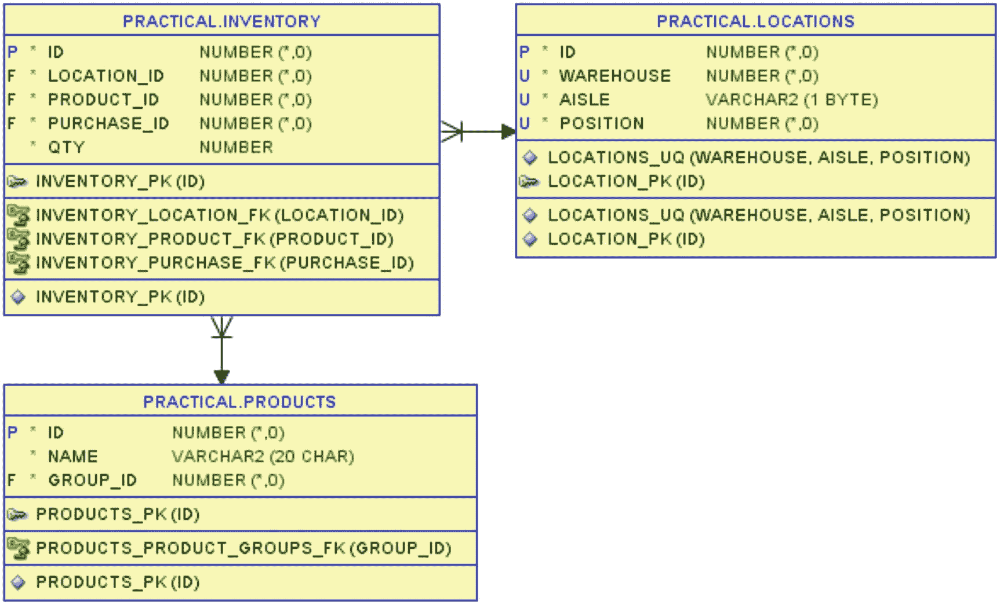

图 21-1：本章中使用的库存、位置和产品表

在第 13 章中，我还介绍了视图 `inventory_with_dims`，该视图将 `inventory` 与 `locations` 和 `products` 连接起来。本章中我将全程使用这个视图。

请观察清单 21-1 中某款啤酒的库存数据。

```sql
SQL> select
2     product_name
3   , warehouse as wh
4   , aisle
5   , position  as pos
6   , qty
7  from inventory_with_dims
8  where product_name = 'Der Helle Kumpel'
9  order by wh, aisle, pos;
清单 21-1：啤酒 Der Helle Kumpel 的库存
```

本章的大多数示例都展示了这款啤酒的箱装拟合：

```
PRODUCT_NAME      WH  AISLE  POS  QTY
Der Helle Kumpel  1   A      16   48
Der Helle Kumpel  1   A      29   14
Der Helle Kumpel  1   B      32   43
Der Helle Kumpel  1   C      5    70
Der Helle Kumpel  1   C      13   20
Der Helle Kumpel  1   D      19   48
Der Helle Kumpel  2   A      1    72
Der Helle Kumpel  2   B      5    14
Der Helle Kumpel  2   B      26   24
Der Helle Kumpel  2   C      31   21
Der Helle Kumpel  2   D      9    26
```

我将尝试根据我的箱装拟合规则将这些啤酒装入箱子。首先是容量有限的箱子。

### 无限数量、容量有限的箱子进行箱装拟合

这种箱装拟合也是背包问题的一个简单变体，而背包问题是一个在合理时间内很难精确求解的问题。事实上，它属于一类被称为“NP 难”的问题，深入探讨超出了本书的范围。这里只需说明，我给出的任何解决方案都只是一个近似解——或多或少是最优的。

我根据以下规则将啤酒装入箱子：
*   一个箱子最多可容纳 72 瓶啤酒。
*   允许将来自不同位置的数量装在同一个箱子里。
*   来自单个位置的数量不能被拆分到多个箱子中，必须完整地放在一个箱子里。

首先，我不担心如何接近最优的箱装拟合。在清单 21-2 中，我只是简单地按位置顺序遍历仓库，将啤酒装入箱子。当我到达一个位置时，如果该数量能放入当前箱子，我就将其装入该箱子；否则，我就开始在一个新箱子里装货。

```sql
SQL> select wh, aisle, pos, qty, run_qty, box#, box_qty
2  from (
3     select
4        product_name
5      , warehouse as wh
6      , aisle
7      , position  as pos
8      , qty
9     from inventory_with_dims
10     where product_name = 'Der Helle Kumpel'
11  ) iwd
12  match_recognize (
13     order by wh, aisle, pos
14     measures
15        match_number()   as box#
16      , running sum(qty) as run_qty
17      , final   sum(qty) as box_qty
18     all rows per match
19     pattern (
20        fits_in_box+
21     )
22     define
23        fits_in_box as sum(qty) <= 72
24  )
25  order by wh, aisle, pos;
清单 21-2：按位置顺序进行箱装拟合
```

那么这个查询中发生了什么？我来解释一下：
*   在第 3-10 行的内联视图中，我只是将数据限制为当前正在装箱的啤酒。
*   在 `match_recognize` 子句中，我在第 13 行按位置对数据排序。
*   我在第 23 行定义分类 `fits_in_box` 为 `qty` 的总和小于或等于 72 的情况。当在定义中使用聚合函数时，它使用*运行*语义进行计算。
*   第 20 行的 `pattern` 表示我需要一行或多行被分类为 `fits_in_box`。这意味着第一行的 `qty` 被设置为运行总和。如果运行总和不大于 72，则将该行添加到匹配项中。然后将第二行的 `qty` 添加到运行总和中。如果仍然不大于 72，则将该行添加到匹配项，依此类推，直到某一行导致运行总和超过 72，此时匹配结束。
*   在 `measures` 子句的第 15-17 行，我使用 `match_number()` 作为要装入的箱子编号，并同时显示 `running`（运行）和 `final`（最终）总和。

当你查看输出时，可以看到实际效果：

```
WH  AISLE  POS  QTY  RUN_QTY  BOX#  BOX_QTY
1   A      16   48   48       1     62
1   A      29   14   62       1     62
1   B      32   43   43       2     43
1   C      5    70   70       3     70
1   C      13   20   20       4     68
1   D      19   48   68       4     68
2   A      1    72   72       5     72
2   B      5    14   14       6     59
2   B      26   24   38       6     59
2   C      31   21   59       6     59
2   D      9    26   26       7     26
```

前 48 瓶啤酒被加入运行总和——未超过 72，因此被分配到 `box#` 1。然后加入 14 瓶啤酒，使运行总和达到 62——仍然分配给 `box#` 1。

接着，它尝试添加第三行的 43 瓶啤酒，这使得运行总和达到 105——超过了 72，因此该行未被分类为 `fits_in_box`，`box#` 1 于是由前两行结束。相反，第三行的 43 瓶啤酒成为第二个匹配项——`box#` 2 中的第一批啤酒。


就这样继续下去，直到我最终将来自 11 个地点的啤酒装入 7 个箱子。这个方法快速简单，但不够优化。很容易看出，我至少可以通过将 `box#` 2 和 `box#` 7 的内容合并到一个装有 69 瓶啤酒的箱子里来节省一个箱子。

问题在于，简单地按地点顺序装箱完全没有考虑数量是否能匹配在一起。如果数量的分布情况不同，我甚至可能得到一个更糟的结果，需要超过七个箱子。

分析函数和模式匹配的一大优势在于，我可以为逻辑和最终输出使用不同的 `order by` 子句。因此，我可以尝试将第 13 行 `match_recognize` 中的 `order by` 改为按 `qty` 降序排列（然后仅使用地点作为平局决胜项）。

为了更容易验证输出，我还将第 25 行的最终 `order by` 改为相同顺序（在制作装箱清单时，我随时可以将其改回按地点排序）：

```
...
12  match_recognize (
13     order by qty desc, wh, aisle, pos
...
24  )
25  order by qty desc, wh, aisle, pos;
```

我得到了一个与之前截然不同的装箱结果：

```
WH  AISLE  POS  QTY  RUN_QTY  BOX#  BOX_QTY
2   A      1    72   72       1     72
1   C      5    70   70       2     70
1   A      16   48   48       3     48
1   D      19   48   48       4     48
1   B      32   43   43       5     69
2   D      9    26   69       5     69
2   B      26   24   24       6     65
2   C      31   21   45       6     65
1   C      13   20   65       6     65
1   A      29   14   14       7     28
2   B      5    14   28       7     28
```

但这并没有真正变得更优化，因为我仍然使用了七个箱子。事实上，这甚至可以被认为稍微差了一些，因为在这里我甚至无法将填充最少的两个箱子合并在一起，因为 `28 + 48` 会超过 72。

有各种各样的近似算法可以或多或少地接近最优解。我创建了一个相当简化的改进首次适应递减算法版本。我的简单算法是这样工作的：

*   首先，任何大于箱子容量三分之二的数量都被直接分配到单独的箱子。（任何可能“填补空隙”的小数量也很可能装入剩余的箱子，因此作为近似，偏差不会太大。）

*   然后，我以交错的方式对剩余的数量进行排序：
    *   首先，最大的
    *   然后，最小的
    *   然后，第二大的
    *   然后，第二小的
    *   依此类推

*   然后我像之前一样装箱，但使用这个排序后的顺序，这样交错的大/小排序就有很大机会在箱子里形成能匹配在一起的一对。

这个简单的近似算法在清单 21-3 中实现。

```
SQL> select wh, aisle, pos, qty, run_qty, box#, box_qty
2       , prio ,rn
3  from (
4     select
5        product_name
6      , warehouse as wh
7      , aisle
8      , position  as pos
9      , qty
10      , case when qty > 72*2/3 then 1 else 2 end prio
11      , least(
12           row_number() over (
13              partition by
14                 case when qty > 72*2/3 then 1 else 2 end
15              order by qty
16           )
17         , row_number() over (
18              partition by
19                 case when qty > 72*2/3 then 1 else 2 end
20              order by qty desc
21           )
22        ) rn
23     from inventory_with_dims
24     where product_name = 'Der Helle Kumpel'
25  ) iwd
26  match_recognize (
27     order by prio, rn, qty desc, wh, aisle, pos
28     measures
29        match_number()   as box#
30      , running sum(qty) as run_qty
31      , final   sum(qty) as box_qty
32     all rows per match
33     pattern (
34        fits_in_box+
35     )
36     define
37        fits_in_box as sum(qty) <= 72
38  )
39  order by prio, rn, qty desc, wh, aisle, pos;
清单 21-3
使用一种简单的最佳适应近似算法
```


通过这个改进后的算法，我只需使用六个箱子。前两个箱子只包含单个大量物品，接下来三个箱子都包含一对数量（一个中量，一个少量），而最后一个箱子则容纳了三个中等/偏小的数量：

```
WH  AISLE  POS  QTY  RUN_QTY  BOX#  BOX_QTY  PRIO  RN
2   A      1    72   72       1     72       1     1
1   C      5    70   70       2     70       1     1
1   A      16   48   48       3     62       2     1
1   A      29   14   62       3     62       2     1
1   D      19   48   48       4     62       2     2
2   B      5    14   62       4     62       2     2
1   B      32   43   43       5     63       2     3
1   C      13   20   63       5     63       2     3
2   D      9    26   26       6     71       2     4
2   C      31   21   47       6     71       2     4
2   B      26   24   71       6     71       2     5
```

该算法绝非在所有情况下都是最优的。我建议您根据您的具体用例尝试几种方法。但是，接近最优的算法通常更难实现（可能几乎无法在 SQL 中实现，需要过程式代码）并且消耗更多 CPU 资源，因此这很可能是一个在像这样简单但可能足够好的算法与非常好但太慢的算法之间的权衡问题。

以 *Der Helle Kumpel* 啤酒为例，我现在已准备好在清单 21-4 中扩展该算法，以打包仓库中的所有啤酒。

```
SQL> select product_id
2       , wh, aisle, pos, qty, run_qty, box#, box_qty
3  from (
4     select
5        product_id
6      , product_name
7      , warehouse as wh
8      , aisle
9      , position  as pos
10      , qty
11      , case when qty > 72*2/3 then 1 else 2 end prio
12      , least(
13           row_number() over (
14              partition by
15                 product_id
16               , case when qty > 72*2/3 then 1 else 2 end
17              order by qty
18           )
19         , row_number() over (
20              partition by
21                 product_id
22               , case when qty > 72*2/3 then 1 else 2 end
23              order by qty desc
24           )
25        ) rn
26     from inventory_with_dims
27  ) iwd
28  match_recognize (
29     partition by product_id
30     order by prio, rn, qty desc, wh, aisle, pos
31     measures
32        match_number()   as box#
33      , running sum(qty) as run_qty
34      , final   sum(qty) as box_qty
35     all rows per match
36     pattern (
37        fits_in_box+
38     )
39     define
40        fits_in_box as sum(qty) <= 72
41  )
42  order by product_id, prio, rn, qty desc, wh, aisle, pos;
清单 21-4
使用 partition by 对所有产品进行装箱
```

基本上是一样的，但我在线内视图的第 5 行包含了 `product_id`，这样我就可以在 29 行使用 `partition by`。这给了我一个对所有啤酒进行装箱的输出：

```
PRODUCT_ID  WH  AISLE  POS  QTY  RUN_QTY  BOX#  BOX_QTY
4040        1   A      13   48   48       1     51
4040        1   C      10   3    51       1     51
4040        2   C      28   48   48       2     53
4040        1   A      25   5    53       2     53
...
7950        2   B      25   48   48       10    48
7950        1   C      24   42   42       11    42
7950        2   C      5    44   44       12    44
已选择 113 行。
```

请注意，由于我使用 `match_number()` 作为 `box#` 列，箱子编号对于每个产品会重新开始；在整个输出中并非唯一的箱子编号。如果需要唯一编号，那么我需要在 select 列表中添加，例如 `dense_rank() over (order by product_id, box#)`。

清单 21-4 通过使用 `all rows per match` 提供了关于哪些数量放入哪个箱子的详细信息。我也可以仅通过使用清单 21-5 中的 `one row per match` 来获取每个箱子的数量以及一起打包的位置数量。

```
SQL> select product_id, product_name, box#, box_qty, locs
2  from (
...
26  ) iwd
27  match_recognize (
28     partition by product_id
29     order by prio, rn, qty desc, wh, aisle, pos
30     measures
31        max(product_name) as product_name
32      , match_number()    as box#
33      , final sum(qty)    as box_qty
34      , final count(*)    as locs
35     one row per match
36     pattern (
37        fits_in_box+
38     )
39     define
40        fits_in_box as sum(qty) <= 72
41  )
42  order by product_id, box#;
清单 21-5
为每个箱子获取单行输出
```

除了更改第 35 行，我只需稍微调整 `measures`、`select` 列表和 `order by` 以适应，因此我得到一个更简单的输出：

```
PRODUCT_ID  PRODUCT_NAME      BOX#  BOX_QTY  LOCS
4040        Coalminers Sweat  1     51       2
4040        Coalminers Sweat  2     53       2
4040        Coalminers Sweat  3     54       2
...
7950        Pale Rider Rides  10    48       1
7950        Pale Rider Rides  11    42       1
7950        Pale Rider Rides  12    44       1
已选择 86 行。
```

到目前为止，我一直使用容量足以容纳仓库中最大位置数量（72）的箱子进行打包。如果我使用太小的箱子会发生什么？


#### 展示箱柜容量过小的情况

为了演示，我使用 `Listing [21-2]` 中按位置顺序的简单装箱法，而非稍优一些的改进的首次适应算法。无论使用何种算法原理都相同，因此我在 `Listing [21-6]` 中保持简单。

```sql
SQL> select wh, aisle, pos, qty, run_qty, box#, box_qty
2  from (
3     select
4        product_name
5      , warehouse as wh
6      , aisle
7      , position  as pos
8      , qty
9     from inventory_with_dims
10     where product_name = 'Der Helle Kumpel'
11  ) iwd
12  match_recognize (
13     order by wh, aisle, pos
14     measures
15        match_number()   as box#
16      , running sum(qty) as run_qty
17      , final   sum(qty) as box_qty
18     all rows per match
19     pattern (
20        fits_in_box+
21     )
22     define
23        fits_in_box as sum(qty) <= 64
24  )
25  order by wh, aisle, pos;
Listing 21-6
当箱柜过小时的问题
```

与 `Listing [21-2]` 的区别仅在于，我在 `第 23 行` 使用容量为 64 的箱子而非 72。那么输出结果会如何？

```sql
WH  AISLE  POS  QTY  RUN_QTY  BOX#  BOX_QTY
1   A      16   48   48       1     62
1   A      29   14   62       1     62
1   B      32   43   43       2     43
1   C      13   20   20       3     20
1   D      19   48   48       4     48
2   B      5    14   14       5     59
2   B      26   24   38       5     59
2   C      31   21   59       5     59
2   D      9    26   26       6     26
```

我只得到 9 行而不是 11 行。两个数量过大无法装入箱柜的条目完全未被匹配，因此未出现在输出中。

如果我希望它们在输出中显示，只是没有 `box#`，以便我能看出存在问题，该怎么办？我可以尝试在 `第 20 行` 将模式从 `fits_in_box+` 改为 `fits_in_box*`：

```
...
20        fits_in_box*
...
```

嗯，接近了，但还不是我想要的：

```sql
WH  AISLE  POS  QTY  RUN_QTY  BOX#  BOX_QTY
1   A      16   48   48       1     62
1   A      29   14   62       1     62
1   B      32   43   43       2     43
1   C      5    70            3
1   C      13   20   20       4     20
1   D      19   48   48       5     48
2   A      1    72            6
2   B      5    14   14       7     59
2   B      26   24   38       7     59
2   C      31   21   59       7     59
2   D      9    26   26       8     26
```

数量为 70 和 72 的两行如我所愿出现了，但它们被分配了 `box#`，尽管它们并未匹配 `define` 子句中的规则？这是因为使用了 `*`，表示“零次或多次”，因此匹配编号 3（`box#`）和匹配编号 6 实际上是*空*匹配。

模式匹配语法能识别空匹配，并提供了在您需要时将其从输出中排除的语法：

```
...
18     all rows per match omit empty matches
19     pattern (
20        fits_in_box*
21     )
...
```

我只需在 `第 18 行` 添加 `omit empty matches`，这两个空匹配就不会再显示在输出中：

```sql
WH  AISLE  POS  QTY  RUN_QTY  BOX#  BOX_QTY
1   A      16   48   48       1     62
1   A      29   14   62       1     62
1   B      32   43   43       2     43
1   C      13   20   20       4     20
1   D      19   48   48       5     48
2   B      5    14   14       7     59
2   B      26   24   38       7     59
2   C      31   21   59       7     59
2   D      9    26   26       8     26
```

但请注意 `box#` 列中，匹配编号 3 和 6 实际上已被分配，只是未显示。这在某些情况下可能是合适的，但这不是我想要的。

于是，我改回使用 `+` 而不是 `*`，并采用另一种语法：

```
...
18     all rows per match with unmatched rows
19     pattern (
20        fits_in_box+
21     )
...
```

模式在 `第 20 行` 使用 `+`（“一次或多次”），但我在 `第 18 行` 添加了 `with unmatched rows`。这样就得到了我想要的输出：

```sql
WH  AISLE  POS  QTY  RUN_QTY  BOX#  BOX_QTY
1   A      16   48   48       1     62
1   A      29   14   62       1     62
1   B      32   43   43       2     43
1   C      5    70
1   C      13   20   20       3     20
1   D      19   48   48       4     48
2   A      1    72
2   B      5    14   14       5     59
2   B      26   24   38       5     59
2   C      31   21   59       5     59
2   D      9    26   26       6     26
```

这里，数量 70 和 72 被包含在输出中，但这些行的所有度量值均为 `null`，包括 `box#`，表明这是一行完全未被匹配的行——甚至未被视为空匹配。您可以看到未匹配行的匹配编号并未增加。

这对于箱柜数量无限、容量有限的装箱类型来说很好。但也存在另一种装箱类型，让我也展示一下。


### 使用容量无限的限定数量箱子进行装箱

假设我们有无限大的箱子——我们可以把所有啤酒瓶都装进一个箱子。但我们只有三个这样的箱子，并且我们希望尽可能均匀地将啤酒分布到三个箱子中。规则仍然是：来自特定位置的数量不能拆分到多个箱子。

让我回顾一下 *Der Helle Kumpel* 的库存清单，但在代码清单 21-7 中，我按数量降序排列显示，而不是像代码清单 21-1 那样按位置顺序。

```sql
SQL> select
2     product_name
3   , warehouse as wh
4   , aisle
5   , position  as pos
6   , qty
7  from inventory_with_dims
8  where product_name = 'Der Helle Kumpel'
9  order by qty desc, wh, aisle, pos;
Listing 21-7
啤酒 Der Helle Kumpel 的库存，按数量降序排列
```

你看到了现在已熟悉的数字，只是顺序不同：

```
PRODUCT_NAME      WH  AISLE  POS  QTY
Der Helle Kumpel  2   A      1    72
Der Helle Kumpel  1   C      5    70
Der Helle Kumpel  1   A      16   48
Der Helle Kumpel  1   D      19   48
Der Helle Kumpel  1   B      32   43
Der Helle Kumpel  2   D      9    26
Der Helle Kumpel  2   B      26   24
Der Helle Kumpel  2   C      31   21
Der Helle Kumpel  1   C      13   20
Der Helle Kumpel  1   A      29   14
Der Helle Kumpel  2   B      5    14
```

对于这类装箱问题，一个相当简单但不错的近似算法是：按降序逐个取数量，并将其放入当前总量最小的箱子中。持续这样做，最终你会得到一个相当均匀的数量分布。

因此，对于三个箱子，这意味着首先将三个最大的数量分别放入三个不同的箱子。然后第四大的数量被放入总量最小的箱子，依此类推。我在图 21-2 中说明了这一点，该图从第四步开始，展示了分配数量的后续五个步骤。之后还会继续，但你应该能明白它是如何工作的。

!`../images/475066_1_En_21_Chapter/475066_1_En_21_Fig2_HTML.jpg`
图 21-2
按数量降序分配

#### 使用模式匹配实现

要用模式匹配实现这一点，仅使用简单的 `define` 和 `pattern` 子句一次创建一个匹配已不再足够。原则上，这里我需要同时处理三个匹配，可交替地向每个匹配添加行。然而，`match_recognize` 的工作方式并非如此，所以我需要另一种方法。

在代码清单 21-8 中，我可以为三个箱子各创建一个分类定义，并利用每个分类变量的运行总和。

```sql
SQL> select wh, aisle, pos, qty, box, qty1, qty2, qty3
2  from (
3     select
4        product_name
5      , warehouse as wh
6      , aisle
7      , position  as pos
8      , qty
9     from inventory_with_dims
10     where product_name = 'Der Helle Kumpel'
11  ) iwd
12  match_recognize (
13     order by qty desc, wh, aisle, pos
14     measures
15        classifier()          as box
16      , running sum(box1.qty) as qty1
17      , running sum(box2.qty) as qty2
18      , running sum(box3.qty) as qty3
19     all rows per match
20     pattern (
21        (box1 | box2 | box3)*
22     )
23     define
24        box1 as count(box1.*) = 1
25             or sum(box1.qty) - box1.qty
26                  <= least(sum(box2.qty), sum(box3.qty))
27      , box2 as count(box2.*) = 1
28             or sum(box2.qty) - box2.qty
29                  <= sum(box3.qty)
30  )
31  order by qty desc, wh, aisle, pos;
Listing 21-8
所有行在单个匹配中，在定义子句中使用逻辑进行分配
```

#### 查询解释

这个查询需要一些解释：

*   第 21 行的 `pattern` 看似简单：我寻找任意数量的连续行，它们被分类为 `box1` 或 `box2` 或 `box3`。但如果你查看 `define` 子句，只定义了 `box1` 和 `box2`，没有定义 `box3`。这意味着任何未被分类为 `box1` 或 `box2` 的行将自动被分类为 `box3`，这反过来意味着所有行都必定被分类为 `box1` 或 `box2` 或 `box3`，因此该模式最终会匹配所有行。

*   换句话说，我对创建多个匹配并不真正感兴趣。我感兴趣的是，当我按照第 13 行指定的顺序在那个大的单个匹配中遍历各行时，各个行是如何被分类的。

*   行的分类方式如下：潜在可以扩展匹配的分类定义（此处所有三个分类）会逐一进行真实性测试，其测试方式是检查：如果该行包含在此分类中，条件是否为真。遇到第一个为真的定义，该行就获得那个分类。如果 `box1` 和 `box2` 都不为真，则该行获得未定义的（因此默认为真）分类 `box3`。

*   因此，当检查一行是否应被分类为 `box1` 时，它会假设该行是 `box1`，然后检查条件是否为真。所以，在第 25 行计算运行总和 `sum(box1.qty)` 时，这包括了当前行的 `qty`。但我想检查的是在添加当前行之前 `box1` 中的数量，所以我需要减去当前行的 `qty`。

*   第 25 行计算 `box1` 中的数量（不包括当前行）。在第 26 行，我检查这个值是否小于（或等于）`box2` 和 `box3` 中数量的最小值。如果为真，则 `box1` 是数量最少的箱子（或者如果多个箱子有相同的最小总和，则是其中之一），当前行应放入 `box1`。

*   如果 `box1` 不是数量最少的，我继续测试 `box2`，在第 28 行计算 `box2` 中的数量（不包括当前行），并在第 29 行检查它是否小于（或等于）`box3` 中的数量。如果为真，则 `box2` 是数量最少的箱子，当前行应放入 `box2`。

*   如果 `box2` 也不是，则该行默认为 `box3`——模式中剩下的唯一可能性。

*   在第 24 行和第 27 行，我分别检查 `box1` 和 `box2` 的计数。如果计数为 1，则那一行就是当前行（记住，通过评估条件时假定了当前行将被分别分类为 `box1` 和 `box2`），这意味着在该行加入之前箱子是空的，因此它肯定是数量最少的那个。测试这些计数可以避免担心空值的总和。

*   由于它全部是一个单一的匹配，第 19 行输出所有行。然后第 15 行使用 `classifier()` 函数来显示该行最终落入了哪个箱子。

*   第 16-18 行显示三个箱子的运行总和，使我能够在输出中检查我的算法是否有效。（注意，我在定义子句的总和中没有写 `running`——根据定义，它们就是运行总和。）

#### 查询输出

使最终的 `order by` 与 `match_recognize` 中的排序相同，使得输出能够解释在单个匹配中发生的事情，因为行是按数量降序处理的：

```
WH  AISLE  POS  QTY  BOX   QTY1  QTY2  QTY3
2   A      1    72   BOX1  72
1   C      5    70   BOX2  72    70
1   A      16   48   BOX3  72    70    48
1   D      19   48   BOX3  72    70    96
1   B      32   43   BOX2  72    113   96
2   D      9    26   BOX1  98    113   96
2   B      26   24   BOX3  98    113   120
2   C      31   21   BOX1  119   113   120
1   C      13   20   BOX2  119   133   120
1   A      29   14   BOX1  133   133   120
2   B      5    14   BOX3  133   133   134
```


你可以看到每个数量是如何分布到各个箱子里的，就像图 21-2 所示，其中列`qty1`、`qty2`和`qty3`是运行总和，分别显示到目前为止有多少数量已放入 box1、box2 和 box3。

这种方法唯一的缺点是更改箱子数量需要做较多工作。例如，如果我有四个箱子而不是三个，我需要像这样修改`代码清单 21-8`：

```
20     pattern (
21        (box1 | box2 | box3 | box4)*
22     )
23     define
24        box1 as count(box1.*) = 1
25             or sum(box1.qty) - box1.qty
26                  <= least(
27                        sum(box2.qty)
28                      , sum(box3.qty)
29                      , sum(box4.qty)
30                     )
31      , box2 as count(box2.*) = 1
32             or sum(box2.qty) - box2.qty
33                  <= least(sum(box3.qty), sum(box4.qty))
34      , box3 as count(box3.*) = 1
35             or sum(box3.qty) - box3.qty
36                  <= sum(box4.qty)
```

为了完成整个工作，在`代码清单 21-9`中，我对每个产品都执行此操作，以便每个产品都有三个容量无限的箱子。

```
SQL> select product_name, wh, aisle, pos, qty, box
2  from (
3     select
4        product_id
5      , product_name
6      , warehouse as wh
7      , aisle
8      , position  as pos
9      , qty
10     from inventory_with_dims
11  ) iwd
12  match_recognize (
13     partition by product_id
...
28  )
29  order by wh, aisle, pos;
代码清单 21-9
每个产品各装三个箱子——按位置排序的输出
```

我是通过第 13 行的`partition by`实现这一点的。如果我跳过这一行，所有啤酒都会被装进同样的三个箱子里。

然后我按位置顺序对输出进行了排序，因此这可以作为从仓库打包所有物品的装箱清单：

```
PRODUCT_NAME      WH  AISLE  POS  QTY  BOX
Ghost of Hops     1   A      2    39   BOX1
Reindeer Fuel     1   A      3    48   BOX1
Hoppy Crude Oil   1   A      4    37   BOX2
...
Hazy Pink Cloud   2   D      23   17   BOX2
Reindeer Fuel     2   D      25   29   BOX2
Pale Rider Rides  2   D      28   40   BOX3
已选择 113 行。
```

也许你认为这不是一种非常实用的啤酒装箱方法，因为在现实生活中啤酒箱当然不会有无限容量。但这个原理同样适用于其他情况——一个相当常见的例子是在给定的处理器/资源集上调度任务。这里不是分配数量，而是尽可能均匀地分配时间——将任务分配给已用分钟数最少的处理器，等价于将其分配给最早可用时间段的处理器。

### 经验总结

装箱拟合本身就是一个难以获得最优拟合的问题；通常需要在接近最优拟合的复杂解决方案与近似拟合的更简单、更快的解决方案之间做出选择。你选择什么通常取决于你的业务目的需要多好的近似值。

在本章中，我给你的不是完美拟合的解决方案，而是近似解——有限箱子数量的装箱拟合效果相当好，而无限箱子数量的装箱拟合则是一个相对粗糙的近似。但借助`match_recognize`，它们相当快速，并且它们是很好的例子来教你以下内容：

*   在`define`子句中使用运行聚合，使分类依赖于截至当前行的汇总值。
*   创建计算列值以支持复杂的排序，使`match_recognize`子句能够按照非常特定的期望顺序遍历数据。
*   让`pattern`匹配*所有*行，并利用`define`对所有行进行分类，这可以作为一种选择，使`match_recognize`成为创建数据操作算法而非数据搜索工具的手段。
*   在`define`子句中使用其他分类变量的聚合，使不同分类变量的结果相互依赖。
*   利用*未定义*的分类变量默认情况下被视为`true`这一事实，因此它可以作为一种`else`选项来使用。

总而言之，理解这些示例将帮助你获得思维方式，从而真正利用`match_recognize`的全部威力。

---

## 22. 在树中统计子节点数量

有时你希望进行聚合，其中一行被包含在输出的多行中，例如，被计数多次或其值被累加多次。一个例子是分层数据，你希望为每一行找出树中所有子节点的数量——不仅仅是直接子节点，还包括孙节点、孙节点的子节点等等，一直到树的叶子节点。

这意味着一个给定的行在父节点的结果中被计数一次，但在祖父节点的结果中又被计数一次，依此类推。它看起来类似于使用`group by`和`rollup`创建的小计，但在层次结构中，你不知道它向下延伸了多少层，所以你不能简单地使用`rollup`。

我解决这个问题的一种方法是使用`match_recognize`的`after match skip to next row`子句。当然，它也可以用于`count`以外的其他聚合，但`count`易于理解，一旦你掌握了这项技术，你就可以轻松地做其他的了。


### 员工层级树

用于演示 Oracle 层次查询最经典的表是 `scott.emp` 表。当然，“好啤酒贸易公司”也雇佣员工，因此我的 `practical` 模式中自然也有一个 `employees` 表，如图 22-1 所示。

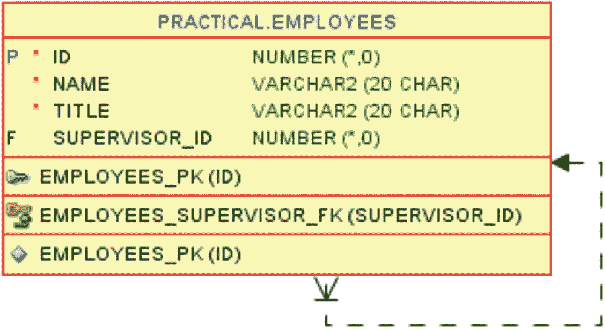

图 22-1
具有自引用外键的 employees 表

`supervisor_id` 列是一个自引用外键，它引用了主键 `id`。只有一个人没有上司——公司的老板——对于其他所有人，`supervisor_id` 包含了他们在员工层级中直属上司的 `id`。因此，我可以用清单 22-1 向你展示表中的树形数据。

```
SQL> select
2     e.id
3   , lpad(' ', 2*(level-1)) || e.name as name
4   , e.title as title
5   , e.supervisor_id as super
6  from employees e
7  start with e.supervisor_id is null
8  connect by e.supervisor_id = prior e.id
9  order siblings by e.name;
清单 22-1
一个经典的员工层次查询
```

对于像这样简单的层次结构，我倾向于使用 Oracle 专有的 `connect by` 查询，而不是我在第 4 章展示的递归子查询因子化。使用 `connect by` 更容易做的事情之一，例如，就是我在这里使用的 `order siblings by`——如果用递归子查询因子化来编码会更加麻烦。

因此，我通过第 7 行指定从没有上司的人开始，即从老板开始。然后第 8 行找到老板的直属下属，然后递归地查找这些下属的下属，以此类推：

```
ID   NAME                TITLE              SUPER
142  Harold King         Managing Director
144    Axel de Proef     Product Director   142
151      Jim Kronzki     Sales Manager      144
150        Laura Jensen  Bulk Salesman      151
154        Simon Chang   Retail Salesman    151
148      Maria Juarez    Purchaser          144
147    Ursula Mwbesi     Operations Chief   142
146      Lim Tok Lo      Warehouse Manager  147
152        Evelyn Smith  Forklift Operator  146
149        Kurt Zollman  Forklift Operator  146
155        Susanne Hoff  Janitor            146
143      Mogens Juel     IT Manager         147
153        Dan Hoeffler  IT Supporter       143
145        Zoe Thorston  IT Developer       143
```

虽然人名不同，但你很可能在别处使用 `scott.emp` 看到过非常相似的输出。这个查询将构成本章后续展示的所有 SQL 的基础。

### 统计所有级别的下属

现在的任务是针对每一行，统计树中所有级别的下属数量——不仅仅是下一级的直属下属。如果你看图 22-2 中的组织结构图，我需要发现 Harold King 有 13 个下属（除了他自己之外的所有员工），Ursula Mwbesi 总共有 7 个下属（她下面直接有 2 个，再往下树中还有一层的有 5 个），Lim Tok Lo 总共有 3 个下属（都只比他低一级，并且他们没有进一步的下属），以此类推。

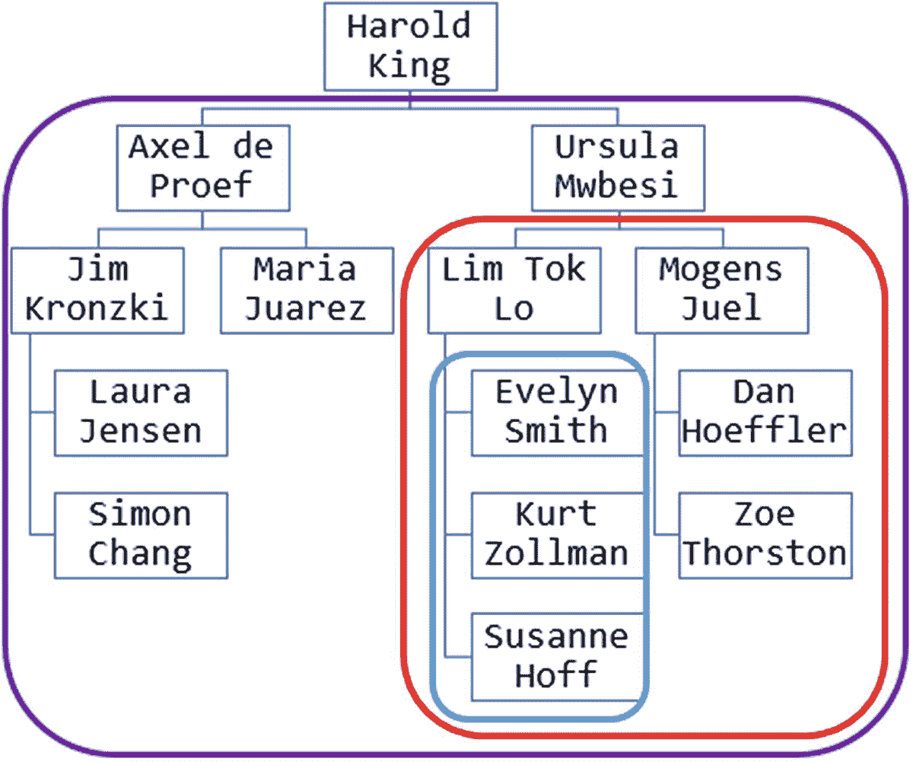

图 22-2
标记了部分子树的组织结构图

一个简单的方法是使用如清单 22-2 所示的标量子查询。标量子查询可以在层次结构中找到相关的子树并计算该子树的节点数。

```
SQL> select
2     e.id
3   , lpad(' ', 2*(level-1)) || e.name as name
4   , (
5        select count(*)
6        from employees sub
7        start with sub.supervisor_id = e.id
8        connect by sub.supervisor_id = prior sub.id
9     ) as subs
10  from employees e
11  start with e.supervisor_id is null
12  connect by e.supervisor_id = prior e.id
13  order siblings by e.name;
清单 22-2
统计下属数量
```

外部查询与清单 22-1 相同。第 4–9 行的标量子查询使用了相同的 `connect by` 查询；只是 `start with` 不是从树的顶部开始，而是第 7 行的 `start with` 从外部查询当前行的直属下属开始，并从那里向下搜索子树：

```
ID   NAME                SUBS
142  Harold King         13
144    Axel de Proef     4
151      Jim Kronzki     2
150        Laura Jensen  0
154        Simon Chang   0
148      Maria Juarez    0
147    Ursula Mwbesi     7
146      Lim Tok Lo      3
152        Evelyn Smith  0
149        Kurt Zollman  0
155        Susanne Hoff  0
143      Mogens Juel     2
153        Dan Hoeffler  0
145        Zoe Thorston  0
```

输出正是我想要的，但我多次访问了表的相同行——比如 Simon Chang 被访问了四次：在标量子查询中，对于树中他上面的三个人各访问了一次，然后在主查询中轮到他时又访问了一次。此外，每次访问树中的一个叶节点时，数据库都会查询他/她下面是否有人，所以 Simon 被访问的四次也引发了四次对他是否有下属的查找。

总而言之，这对数据库来说是大量重复性的工作。但幸运的是，我有办法减少这项工作量。


#### 使用行模式匹配进行计数

通过行模式匹配，我可以创建如清单 22-3 所示的查询。该查询只需执行一次层次查询，然后在检索到的树形结构上执行所有必要的计数，而无需反复访问表。

```
SQL> with hierarchy as (
2     select
3        lvl, id, name, rownum as rn
4     from (
5        select
6           level as lvl, e.id, e.name
7        from employees e
8        start with e.supervisor_id is null
9        connect by e.supervisor_id = prior e.id
10        order siblings by e.name
11     )
12  )
13  select
14     id
15   , lpad(' ', (lvl-1)*2) || name as name
16   , subs
17  from hierarchy
18  match_recognize (
19     order by rn
20     measures
21        strt.rn           as rn
22      , strt.lvl          as lvl
23      , strt.id           as id
24      , strt.name         as name
25      , count(higher.lvl) as subs
26     one row per match
27     after match skip to next row
28     pattern (
29        strt higher*
30     )
31     define
32        higher as higher.lvl > strt.lvl
33  )
34  order by rn;
清单 22-3
使用 match_recognize 计算下属数量
```

清单 22-3 的输出与清单 22-2 的输出完全相同。我来解释一下它的工作原理：

*   为了清晰起见，我使用了`with`子句，正如我在第 3 章教你的那样。

*   在`with`子句内部，第 5-10 行是一个包含基本层次查询的内联视图，我在之前的清单中已经展示过。注意第 10 行的`order by`位于内联视图内部。

*   我将其放在内联视图中，以便能在第 3 行（内联视图外部）使用`rownum`并将其保存为列别名`rn`。当我进行行模式匹配时，需要保留内联视图创建的层次顺序——这使我能够做到这一点。

*   构建`match_recognize`子句时，我首先在第 32 行定义：如果一个行的层级高于模式起始行，则将其归类为`higher`——这意味着当它的层级更高时，它就是起始行的子行/孙行/曾孙行/……（即下属）。

*   当然，并非整个行集中所有层级更高的行都是下属——只有那些紧随该行之后、层级更高的连续行才是。一旦遇到层级相同（或更低）的行，我就不再处于所需的子树中。我在第 29 行的模式中通过查找一个`strt`行（未定义，因此可以是任何行）后跟零个或多个`higher`行来解决这个问题——当遇到不再被归类为`higher`的行时，匹配停止。

*   在第 26 行，我指定了`one row per match`（每匹配一行），而我感兴趣输出其数据的员工是`strt`行，因此我在第 21-24 行的度量中使用了`strt`列。

*   在第 25 行，我对匹配中有多少`higher`行进行了`count`（计数）。如果我只是简单地执行`count(*)`，那会包含`strt`行，但在该行上，任何我用`higher`限定的字段都将是`null`，因此计算`higher.lvl`只给出更高层级行的数量，也就是我想要的下属数量。

*   通过第 27 行的`after match skip to next row`（匹配后跳至下一行），我指定了在完成一个`strt`行和零个或多个`higher`行的匹配后，它应该移动到`strt`行之后的下一行。正是这部分导致行被多次计数——我稍后会详细解释。

这些都很清楚了，对吧？好吧，我会再深入一些细节来阐明其工作原理。

**注意**

关于为什么你会考虑使用冗长且有些复杂的清单 22-3，而不是简短清晰的清单 22-2，有几句话要说。

我在一个包含 14001 名员工的员工表上测试了这个。

标量子查询方法大约用了 11 秒，近 50 万次一致读，以及超过 37000 次排序，这是由于全表扫描和为`connect by`处理进行了非常多次的索引范围扫描。

而`match_recognize`方法用了不到半秒，55 次一致读，以及四次（四次！）排序，只进行了一次全表扫描。

当然，你的结果可能会有所不同，所以请自己测试一下。


#### 每次匹配的细节

正如我之前提到的，观察匹配过程中发生情况的一个常用方法是，使用每匹配的所有行来检查详细的输出。这就是我在清单 22-4 中所做的。

```SQL
SQL> with hierarchy as (
...
12  )
13  select
14     mn
15   , rn
16   , lvl
17   , lpad(' ', (lvl-1)*2)
18      || substr(name, 1, instr(name, ' ') - 1) as name
19   , roll
20   , subs
21   , cls
22   , substr(stname, 1, instr(stname, ' ') - 1) as stname
23   , substr(hiname, 1, instr(hiname, ' ') - 1) as hiname
24  from hierarchy
25  match_recognize (
26     order by rn
27     measures
28        match_number()    as mn
29      , classifier()      as cls
30      , strt.name         as stname
31      , higher.name       as hiname
32      , count(higher.lvl) as roll
33      , final count(higher.lvl) as subs
34     all rows per match
35     after match skip to next row
36     pattern (
37        strt higher*
38     )
39     define
40        higher as higher.lvl > strt.lvl
41  )
43  order by mn, rn;
清单 22-4
使用每匹配的所有行检查细节
```

`with` 子句的子查询未改变，`after match`、`pattern` 和 `define` 子句也保持不变。我将第 34 行的 `one row` 改为 `all rows per match`，然后在第 28–33 行创建了一些不同的 `measures`：

*   第 28 行的 `match_number()` 函数为找到的匹配分配连续编号。没有它，我将无法在输出中辨别哪些行属于同一个匹配。
*   `classifier()` 函数显示该行根据 `pattern` 和 `define` 子句被分类为什么——此处显示一行是 `strt` 还是 `higher`。
*   当列名未被限定时，使用的是匹配中当前行的值，无论其分类器是什么。当我在第 30 和 31 行用分类器 `strt` 和 `higher` 来限定列名时，我获取的是*具有该分类器*的最后一行中的值。
*   第 32 和 33 行中的聚合函数如 `count` 可以是 `running` 或 `final`。在清单 22-3 中，这无关紧要，因为我使用了 `one row per match`，但在这里它很重要，因此我同时输出两者以展示差异。第 32 行默认为 `running`（即滚动计数），其结果类似于窗口为 `rows between unbounded preceding and current row` 的分析函数，而第 33 行带有 `final` 关键字，其作用类似于 `rows between unbounded preceding and unbounded following`。

清单 22-4 的输出行数远多于表中的行数，但我有 14 次匹配（表中每一行对应一次匹配），由 `mn` 列中的 1–14 标识。因此，如果我逐步查看输出，以下是第一次匹配的行：

```SQL
MN  RN  LVL  NAME           ROLL  SUBS  CLS     STNAME   HINAME
1   1   1    Harold         0     13    STRT    Harold
1   2   2      Axel         1     13    HIGHER  Harold   Axel
1   3   3        Jim        2     13    HIGHER  Harold   Jim
1   4   4          Laura    3     13    HIGHER  Harold   Laura
1   5   4          Simon    4     13    HIGHER  Harold   Simon
1   6   3        Maria      5     13    HIGHER  Harold   Maria
1   7   2      Ursula       6     13    HIGHER  Harold   Ursula
1   8   3        Lim        7     13    HIGHER  Harold   Lim
1   9   4          Evelyn   8     13    HIGHER  Harold   Evelyn
1   10  4          Kurt     9     13    HIGHER  Harold   Kurt
1   11  4          Susanne  10    13    HIGHER  Harold   Susanne
1   12  3        Mogens     11    13    HIGHER  Harold   Mogens
1   13  4          Dan      12    13    HIGHER  Harold   Dan
1   14  4          Zoe      13    13    HIGHER  Harold   Zoe
```

由于我的模式匹配是按 `rn` 排序的，它从 `rn = 1`（Harold）开始，并将他分类为 `strt`（因为任何行都可以匹配 `strt`），然后重复检查下一行的 `lvl` 是否大于 `strt` 行的 `lvl`。对于剩下的 13 行，这都是成立的，因为其他人的 `lvl` 都大于 1。这意味着第一次匹配直到行尾才会停止。

匹配编号 1 现在已找到，包含 1 个 `strt` 行和 13 个 `higher` 行，如 `cls` 列所示。在 `strt` 行中，*尚未*找到任何 `higher` 行，因此当我限定一个列为 `higher` 时（并且没有使用 `final` 关键字），结果是 `null`，你可以在 `hiname` 列中看到这一点。这也意味着，当我在 `subs` 列中对 `higher` 进行总数（`final`）统计时，`strt` 行不计入其中，结果就是所需的 13 个下属。

你还可以在输出中看到 `roll` 列中的滚动总计是如何变化的，以及 `stname` 列中的 `strt.name` 如何保留最后一个（此处仅有一个）`strt` 行的值。

因此，当第一次匹配结束时，我指定了 `after match skip to next row`，此处是 `rn = 2`（Axel）。他将在继续的输出中作为匹配 `mn = 2` 的 `strt` 行：

```SQL
2   2   2      Axel         0     4     STRT    Axel
2   3   3        Jim        1     4     HIGHER  Axel     Jim
2   4   4          Laura    2     4     HIGHER  Axel     Laura
2   5   4          Simon    3     4     HIGHER  Axel     Simon
2   6   3        Maria      4     4     HIGHER  Axel     Maria
```

在 Axel 作为 `strt` 之后，此匹配找到了四个 `higher` 行，因为行 `rn = 7`（Ursula）的 `lvl = 2`，它*不高于* Axel（是相同的），因此匹配在 Maria 处停止。下属的计数工作方式与之前一样——即使匹配中有五行，也只有四行被分类为 `higher` 并被计数。这些行在匹配编号 1 中也计入了 Harold King 的下属总数，但由于跳回到 `rn = 2` 来寻找下一个匹配，这些行又被计入了一次。

Axel 之后的下一行是 Jim，他将是输出中下一个匹配 `mn = 3` 的 `strt` 行：

```SQL
3   3   3        Jim        0     2     STRT    Jim
3   4   4          Laura    1     2     HIGHER  Jim      Laura
3   5   4          Simon    2     2     HIGHER  Jim      Simon
```

匹配编号 3 最终包含一个 `strt` 行和仅仅 2 个 `higher` 行，因为 Maria（在 `rn` 顺序中位于 Simon 之后）的 `lvl` 并*不高于* Jim。因此，Laura 和 Simon 被计为 Jim 的下属——就像他们也被计入 Axel 和 Harold 名下一样。

输出继续到匹配编号 4，它从 Laura 开始，将她分类为 `strt` 行。在她之后是 Simon，但他与 Laura 的 `lvl` 相同。因此，他不能是 `higher` 行，该匹配变成一个仅包含单个 `strt` 行而没有 `higher` 行的匹配，导致下属计数为 0：

```SQL
4   4   4          Laura    0     0     STRT    Laura
```

就这样继续下去，直到最后，找到匹配编号 `mn = 14`，其中只包含 Zoe：

```SQL
...
14  14  4          Zoe      0     0     STRT    Zoe
```

这个冗长输出的细节有助于了解 `match_recognize` 的不同部分在此解决方案中如何工作。但我也可以只取 `all rows per match` 输出中的部分列，并在清单 22-5 中使用 `pivot` 来可视化构成每次匹配的行。


```
SQL> with hierarchy as (
...
12  )
13  select
14     name
15   , "1", "2", "3", "4", "5", "6", "7"
16   , "8", "9", "10", "11", "12", "13", "14"
17  from (
18     select
19        mn
20      , rn
21      , lpad(' ', (lvl-1)*2)
22         || substr(name, 1, instr(name, ' ') - 1) as name
23     from hierarchy
24     match_recognize (
25        order by rn
26        measures
27           match_number()    as mn
28        all rows per match
29        after match skip to next row
30        pattern (
31           strt higher*
32        )
33        define
34           higher as higher.lvl > strt.lvl
35     )
36  ) pivot (
37     max('X')
38     for mn in (
39        1,2,3,4,5,6,7,8,9,10,11,12,13,14
40     )
41  )
42  order by rn;
```
清单 22-5
使用透视来显示哪些行属于哪个匹配

我在第 27 行使用的唯一一个度量是 `match_number()`，然后在第 19-22 行，我只选择了 `mn`、`rn` 和 `name`。这使我能够在第 38 行对 `mn` 执行 `pivot` 操作，在第 39 行指定 14 个匹配号，从而得到 `rn`、`name` 以及 14 个名为 `1` 到 `14` 的列（这些列名必须用双引号括起来，因为它们不是以字母开头）。

这 14 个匹配号列的值是字面量 `X`，如果该行的 `rn` 包含在匹配中，否则为 `null`。所以我可以选择 `mn` 列和这些 X，并仅使用 `rn` 来排序输出：

```
NAME           1  2  3  4  5  6  7  8  9  10  11  12  13  14
Harold         X
Axel         X  X
Jim        X  X  X
Laura    X  X  X  X
Simon    X  X  X     X
Maria      X  X           X
Ursula       X                 X
Lim        X                 X  X
Evelyn   X                 X  X  X
Kurt     X                 X  X     X
Susanne  X                 X  X         X
Mogens     X                 X                X
Dan      X                 X                X   X
Zoe      X                 X                X       X
```

在这个透视输出中，很容易使用 X 来检查：所有行都包含在匹配号 1 中，从 Axel 到 Maria 的行包含在匹配号 2 中，依此类推。

### 调整输出

检查了详细输出后，我将回到 `one row per match` 版本，再做一些调整，并向你展示几件事。

首先，我想澄清一点：尽管带有 `one row per match` 的清单 22-3 只有一个聚合度量，并且到目前为止我只在使用 `all rows per match` 的清单 22-4 中展示了多个聚合度量，但完全可以在使用 `one row` 时合法地使用多个聚合，或者像 `first` 和 `last` 这样的函数组合。请看清单 22-6。

```
SQL> with hierarchy as (
...
12  )
13  select
14     lpad(' ', (lvl-1)*2) || name as name
15   , subs
16   , hifrom
17   , hito
18   , himax
19  from hierarchy
20  match_recognize (
21     order by rn
22     measures
23        strt.rn            as rn
24      , strt.lvl           as lvl
25      , strt.name          as name
26      , count(higher.lvl)  as subs
27      , first(higher.name) as hifrom
28      , last(higher.name)  as hito
29      , max(higher.lvl)    as himax
30     one row per match
31     after match skip to next row
32     pattern (
33        strt higher*
34     )
35     define
36        higher as higher.lvl > strt.lvl
37  )
38  order by rn;
```
清单 22-6
在使用 `one row per match` 时添加多个度量

在第 26-29 行，我同时使用了导航函数和聚合函数。请记住，当我使用 `one row per match` 时，无论我为聚合使用 `running` 还是 `final`，结果都没有区别，所以即使我没有指定 `final`，我也会得到相同的结果：

```
NAME                SUBS  HIFROM         HITO          HIMAX
Harold King         13    Axel de Proef  Zoe Thorston  4
Axel de Proef     4     Jim Kronzki    Maria Juarez  4
Jim Kronzki     2     Laura Jensen   Simon Chang   4
Laura Jensen  0
Simon Chang   0
Maria Juarez    0
Ursula Mwbesi     7     Lim Tok Lo     Zoe Thorston  4
Lim Tok Lo      3     Evelyn Smith   Susanne Hoff  4
Evelyn Smith  0
Kurt Zollman  0
Susanne Hoff  0
Mogens Juel     2     Dan Hoeffler   Zoe Thorston  4
Dan Hoeffler  0
Zoe Thorston  0
```

所以我的第一点是关于为各种列中的所需输出使用多个度量。我能否也调整输出中的行呢？比如说，假设我只想输出那些实际有下属（或者换句话说，不是树中的叶节点）的员工。

当然，我可以把整个查询放在一个内联视图里，然后使用 `where` 子句过滤掉 `subs > 0`，这样输出中就不会有任何叶节点。这能正常工作，但我想向你展示的第二个点是一个更好的替代方案，它可以在处理的更早阶段过滤掉非叶节点。

在清单 22-3 的第 29 行，我使用的模式是 `strt higher*`，这是一个设计上会被*任何*被分类为 `strt` 的行匹配的模式——问题只是那个 `strt` 行后面会跟随多少个 `higher` 行。因此，根据模式的性质，清单 22-3 会输出表中的所有行。

让我在清单 22-7 中只修改一个字符——除此之外，它与清单 22-3 完全相同。

```
...
29        strt higher+
...
```
清单 22-7
使用模式定义过滤匹配

我把 `*` 改成了 `+`，这意味着任何一个给定的 `strt` 行*只有*在它后面至少跟随一个 `higher` 行时才会导致匹配。因此，那些后面*没有*跟随任何 `higher` 行的叶节点将不会导致匹配——相反，数据库只是简单地向前移动一行，并检查是否能使用下一行作为 `strt` 行来找到匹配。这样就只输出了主管：

```
ID   NAME             SUBS
142  Harold King      13
144    Axel de Proef  4
151      Jim Kronzki  2
147    Ursula Mwbesi  7
146      Lim Tok Lo   3
143      Mogens Juel  2
```

这样做可以让数据库在模式匹配过程中立即丢弃不需要的行——而不是像内联视图那样，让数据库构建包含所有行的结果集，然后再删除不需要的行。

### 经验总结

在本章中，我展示了通过合适的排序，`after match skip to next row` 子句可以非常高效地让 `match_recognize` 在不同的分组中多次处理相同的行，而无需多次访问表中的数据。在演示中，我涵盖了以下内容：

*   通过创建一个排序列来准备源查询，该列允许 `match_recognize` 按层次顺序工作
*   设置一个 `pattern`，为每一行查找其下方子树中的行组
*   使用 `after match skip to next row` 在每一行上执行模式搜索，即使它已被包含在之前的匹配中
*   更改 `pattern` 以忽略那些下方没有子树的行

这些方法可以用于任何层次数据。对于其他具有非平凡排序的数据，如果可以设置一个更复杂的查询来准备数据并保留排序，然后再用 `match_recognize` 处理数据，它们也可能很有用。


## A
累加和 见 滚动和
分析函数 `avg` 滑动窗口计算中心移动平均 `dense_rank` 使用 `partition by` 重新开始排名 `lag` `last_value` `case` 表达式在组内除第一行外创建 `null` `ignore nulls` `lead` `case` 表达式在非期望行创建 `null` 以模拟 `connect_by_isleaf` 在 `with` 子句递归中 `ignore nulls` 使用第二个参数前瞻多行 `null` 在分区末尾 `ntile` 分析性 `order by` 子句与查询 `order by` 不同 `over` 查询分区子句 `rank` `regr_intercept` `regr_slope` `row_number` 模拟 `minus all` 模拟多列标量子查询 `sum` 另见 滚动和

窗口子句 默认窗口子句的危险性 行数 `preceding` 或 `following` `range between` `range` 在 `current row` 可能包含后续行 `rows between` 隐含 `between` 的简写 `unbounded following` `unbounded preceding` 值 `preceding` 或 `following`

## B
装箱问题 近似算法 在有限箱数中均匀分配 修正最佳适应递减 (MFFD) 无限箱数

## C
集合 见 嵌套表类型
集合运算符 见 多重集运算符
公共表表达式 见 `with` 子句
`connect_by` 查询 见 查询，层次化
康威生命游戏 振荡器
创建分隔文本 大的分隔文本 `listagg` 中的 `distinct` 使用 `listagg` 时 ORA-01489 `listagg` 中的 `on overflow` 子句 使用 `collect` 指定嵌套表类型 使用 `cast` 使用 `apex_string.join` 使用 `apex_string.join_clob` 使用 `json_arrayagg` `returning clob` 使用 `json_value` 使用 `listagg` 使用 `stragg` ODCI 聚合函数 支持 `distinct` 使用 `map member` 使用 `xmlagg` `getclobval` 使用 `xmlelement` 使用 `xmlparse`

## D
日期间隔 半开区间 相对于闭区间的优势
动态 SQL 使用 `execute immediate` 进行表达式求值

## E
`execute immediate` 见 动态 SQL
表达式列表 在 `pivot` 中作为度量

## F
预测未来值 中心移动平均 去季节化 线性回归 截距点 斜率 重新季节化 季节性因子 `partition by` 月份 时间序列 趋势线
预测达到最小值 当达到最小值时添加值 使用 `model` 子句迭代 使用 `with` 子句递归 对预算中的期望值求和
函数 `add_months` 分析函数 见 分析函数 `extract` `greatest` `least` `listagg` 可视化两个维度 `mod` `nullif` `numtodsinterval` `regexp_count` `regexp_substr` `replace` `trunc`

## G
间隙检测 使用 `lead` 使用 `match_recognize` 下一组的第一行 使用 `skip to last` 在 `measures` 中使用 `subset` 的值
在跨行条件上对行分组 使用 `match_recognize` 固定间隔内的连续数据 从第一行开始直到数据出现间隙 Tabibitosan 方法 在连续日期上 在连续整数上 使用 `last_value, case` 和 `ignore nulls`

## H
层次化查询 见 查询，层次化

## I
内联视图 作为标量子查询的替代方案 关联 `cross apply` `lateral` `outer apply`

## J
JSON `json_arrayagg` 返回 `clob` `json_table` JSON 数组的单个元素 在 `path` 中 将分隔字符串视为 JSON 数组 `json_value`

## K
背包问题 见 装箱问题

## L
`loop` `exit when`

## M
`match_recognize` `after match` 使用 `last` 与特定分类的最后一行比较 使用 `prev` 与前一行比较 复杂的行分类条件 默认评估依赖于 `pattern` 互斥定义 `skip past last row` `skip to last` `skip to next row` 未定义的分类 总是为真 `define` 比较 `next` 行与当前最大行 使用 `next` 与后续行比较 使用 `prev` 与前一行比较 使用分类名与特定行比较 使用 `first` 与起始行比较 复杂的行分类条件 评估依赖于 `pattern` 简单的行分类条件 `skip to first` 评估条件时的真实性假设 未定义的分类 总是为真 使用运行 `sum` 间隙检测 见 间隙检测 `measures` `classifier` `final` 语义 `match_number` `running` 语义 使用 `first` 使用 `last` 在 `subset` 上使用 `last` 使用 `max` 使用 `next` 在 `last` 上使用 `next` 使用 `prev` 在 `first` 上使用 `prev` `omit empty matches` `order by` 输出 `all rows per match` `one row per match` `partition by` `pattern` `|` 或运算符 (或) 在一个匹配中匹配所有行 ∗ 量词 `*` 量词 `+` 量词 `subset` `after match skip to` `subset` 中的最后一个 `with unmatched rows`
`model` 子句 `any` `cv()` 单元格寻址 `dimension by` 连续编号 使用 `row_number` `ignore nav` `iteration_number` `measures` `partition by` `rules` `iterate` `sequential order` `upsert all`
SQL 模块化 见 `with` 子句
多重集运算符 默认 与集合运算符的差异 使用 `multiset except distinct` 消失的值 `multiset except` 与 `minus` 比较 `multiset intersect` `multiset union` 使用 `all` 使用 `distinct`

## N, O
嵌套表类型 `collect` 的聚合输出 使用 `first` 和 `last` 迭代元素 管道化表函数的输出

## P
管道化表函数 `apex_string.split` 自定义内置 `pipe row` PL/SQL 函数 在 `with` 子句中 见 `with` 子句，PL/SQL 函数 `PRAGMA UDF` 减少上下文切换开销
查询 `cross join` 生成动态 `unpivot` 维度映射 生成网格 生成手动逆透视的行 生成可变数量的行 使用 `lateral` `lateral` 表达式列表 在 `unpivot` 中作为度量和维度 `fetch first` 见 顶部-N 计算，使用 `fetch first` `fetch first rows` 在关联内联视图中 层次化 `connect by` `connect_by_isleaf` `connect_by_root` `level` `order siblings by` `start with` `sys_connect_by_path` `outer join` 分区 使用 `lateral` 和 `on` 子句一起 `pivot` 见下方 透视 透视 列命名通过别名 措施中的表达式列表 隐式 `group by` 聚合 仅为隐式 `group by` 保留所需列 多个度量和维度 单个度量和维度 使用 `group by` 和 `case` 表达式 使用 `pivot` `refcursor` 变量 使用动态 SQL 打开 `table` 关键字 添加 `(+)` 作为 `outer join` 等价物 标量输出的 `column_value` `cross apply` `outer apply` 时态有效性 `null` 表示无穷大 在 select 中使用 `as of period for` 在表创建中使用 `period for` `unpivot` 见下方 逆透视 逆透视 在 `unpivot` 输出上使用 `group by` 和聚合 多个度量和维度 单个度量和维度 动态使用维度表 手动使用维度表 使用生成的维度行 使用生成的编号行 使用 `unpivot`

## R
递归子查询因子化 见 `with` 子句，递归
滚动和 所有先前行的和 包括当前行 当窗口没有行时为 `null` 分区求和 从上一行到当前行的区间 连接重叠区间
行模式匹配 见 `match_recognize`
累计总计 见 滚动和

## S
标量子查询 连接值 层次化 多个
会话化 见 对行分组，在跨行条件上使用 `match_recognize`，直到数据出现间隙
集合运算符 连接集合 见下方 集合运算符，union all 默认 与多重集运算符的差异 隐式去重 `intersect` `minus` 与 `multiset except` 比较 模拟 `minus all` 使用 `multiset except all` 模拟 `minus all` 使用 `row_number` 按列别名排序 `union` `union all`
拆分分隔文本 Oracle 数据 cartridge 接口 见 创建分隔文本，使用 `stragg` ODCI 聚合函数；见下方 拆分分隔文本，使用 ODCI 函数 使用 `apex_string.split` 拆分为行 使用 `substr` 拆分为列 使用生成的行 使用 `regexp_substr` 拆分为列 使用 `json_table` 标量值的 JSON 数组 转换为行列的嵌套 JSON 数组 使用 ODCI 函数 使用真实列名而非通用的 `column_value` 在管道化表函数中使用 PL/SQL
字符串聚合 见 创建分隔文本
子查询因子化 见 `with` 子句

## T, U, V
顶部-N 计算 处理并列 避免不确定输出 使用 `dense_rank` 使用 `rank` 使用 `with ties` `fetch first` 的子句 奥林匹克规则 分区 避免不确定输出 使用 `dense_rank` 使用 `fetch first` 和 `lateral` 内联视图 使用 `rank` 使用 `row_number` 顶部行规则 顶部值规则 使用 `dense_rank` 使用 `fetch first` 无法执行奥林匹克规则 `rows only` `rows with ties` 使用 `rank` 使用 `rownum` 使用 `row_number`
将列转换为行 见 查询，逆透视
将行转换为列 见 查询，透视

## W, X, Y, Z
仓库拣货 批量拣货 将拣货分配给订单 不同的拣货原则 FIFO 先进先出 见上方 仓库拣货，FIFO 拣货路径 货架编号 奇偶切换 `order by` 方向
`with` 子句 列名列表 模块化 连续命名的子查询 模拟 Excel 列计算 优化器处理 创建一次性临时表 强制物化 使用 `rownum` `materialize` 提示 像视图一样进行替换 PL/SQL 函数 像 `PRAGMA UDF` 一样编译 动态评估 在视图中封装 多个函数在 `with` 子句中 用于工具或只读数据库 在 `match_recognize` 之前保留层次结构 递归 模拟 `connect_by_isleaf` 模拟 `connect_by_root` 模拟 `level` 模拟 `order siblings by` 层次化重构 嵌套内联视图 测试数据创建 使用命名子查询多次重载一个表

