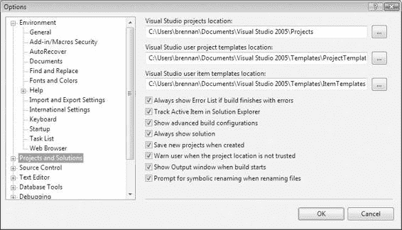
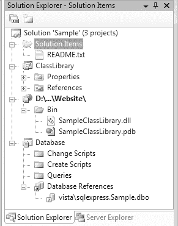
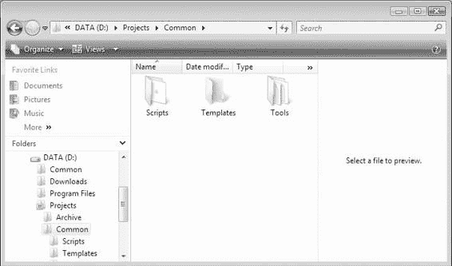
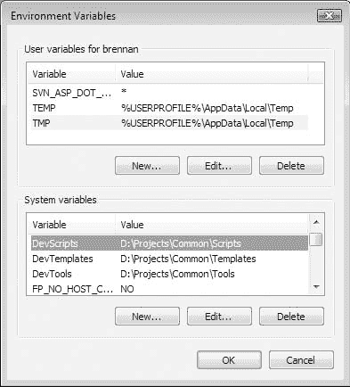

# 第 1 章 入门

性能始终是一个问题。本书将向你展示如何优化 ASP.NET 2.0 应用程序对 SQL Server 数据库的访问。你可以利用 ASP.NET 2.0 与 SQL Server 的紧密集成，来实现其他技术无法达到的性能水平。你将详细探究 ASP.NET 2.0 与 SQL Server 之间的中间地带，以及如何加以利用。

本书通过专业代码演示所有概念，因此你需要做的第一件事就是设置你的开发环境。我将在过程中涵盖相关问题。

本章涵盖以下内容：

- 准备你的环境
- 管理提供程序服务
- 配置提供程序
- 创建用户和角色

## 准备你的环境

我通常运行多个 Microsoft Virtual PC 环境，并根据需要在它们之间切换。当我最初设置我的初始虚拟环境时，我会创建所需数量的环境。

其中一个将作为我的主要开发环境。这很有帮助，因为我会在创建初始环境后立即保留其备份映像。当我尝试测试测试版或第三方插件时，我的环境可能会被"弄脏"。因为卸载过程可能无法完全清理 Windows 安装，所以虚拟环境就派上用场了。

例如，在一次本地用户组会议上，演示者正在展示一个与 Visual Studio 集成的工具。我没有在当前开发环境中安装该工具，而是克隆了一个新的环境来试用该工具。之后，我关闭并删除了该环境，为其他环境腾出空间。我的主要环境完全不受影响。

我还会在虚拟环境中创建两个驱动器。`C:` 盘存放操作系统，而 `D:` 盘存放我的数据。这些驱动器由虚拟硬盘表示。

如果我决定克隆我的数据驱动器，我可以根据需要将其用于另一个系统。因为我通常使用源代码控制来开发每个项目，所以我可以从一个全新的环境开始，拉取当前项目的版本，然后再次开始开发。

为了进一步利用虚拟化，你还可以为开发环境创建一个虚拟硬盘安装，并将文件设置为只读。然后，你可以创建一个新的虚拟映像，该映像使用只读副本作为基础映像，同时将所有更改保留在辅助映像上。当你被要求创建新的虚拟硬盘时，可以选择 `差异` 选项，如图 1-1 所示。

**图 1-1.** 创建差异虚拟硬盘

差异映像允许你在开始使用全新的环境进行开发时，保持基础映像不受影响。这可以节省硬盘空间，因为空间可能会很快被占满；一个典型的虚拟映像可以增长到 20 GB，还不包括数据映像。而且，由于你可以让多个虚拟映像使用同一个基础映像，你的环境可以快速根据你的工作需求准备就绪。

有一次，我的同事需要在第二天开始一个短期的 .NET 1.1 项目。她只安装了 Visual Studio 2005，因此面临一个通常需要几个小时才能完成的漫长安装过程。但因为我已经为 .NET 1.1 和 .NET 2.0 开发准备好了虚拟映像，我在 20 分钟内就让她准备就绪了。最长时间的等待是复制映像文件从文件服务器上。在她完成这个短期项目后，她就能够移除这个临时环境了。


能够使用这些预构建的环境节省了大量时间。我能够尝试各种工具和技术，如果必须处理 Alpha 和 Beta 测试版软件与我的主要开发环境混杂在一起所带来的后果，我将没有机会进行这些尝试。

#### 项目组织

对于每个环境，我将所有项目都放在 `D:\Projects` 目录下。并且我明确地将解决方案文件放在每个项目的根目录。我曾见过一些团队仅在创建项目时才附带创建解决方案文件，但这削弱了当你在解决方案中妥善管理项目时所能获得的优势。

对于一个典型的 Web 项目，我从一个空白解决方案中的 ASP.NET 网站开始。然后我添加一个类库，并将其命名为 `ClassLibrary`。我将尽可能多的网站代码放入这个类库中，原因我稍后会讲到。接着，我将该类库作为引用关联到网站，解决方案会将此记录为一个依赖项。这非常有用，因为新的 ASP.NET 2.0





8601Ch01CMP2 8/22/07 7:56 PM Page 3

C H A P T E R 1 ■ G E T T I N G S TA RT E D

**3**

网站项目模型不包含用于维护文件和依赖项清单的项目文件。我添加了一个名为 `Database` 的数据库项目，其中包含我所有的数据库脚本，用于创建表和存储过程，以及准备数据库支持数据的脚本。（数据库项目需要 Visual Studio 2005 专业版。）最后，我创建一个名为 `Solution Items` 的解决方案文件夹，并添加一个名为 `README.txt` 的文本文件，该文件提供项目的基本信息，例如名称、描述、要求、依赖项以及构建和部署说明。

所有这些工作的结果就是如图 1-2 所示的解决方案结构。

**图 1-2.** *典型的解决方案环境*

当你首次设置空白解决方案并向其中添加第一个项目或网站时，你可能会发现解决方案消失了。这是 Visual Studio 的一个默认设置，你可以更改它。从 `工具` 菜单中选择 `选项`，然后点击 `项目和解决方案` 项，如图 1-3 所示。

**图 1-3.** *设置“始终显示解决方案”选项*



8601Ch01CMP2 8/22/07 7:56 PM Page 4

**4**

C H A P T E R 1 ■ G E T T I N G S TA RT E D

这个示例解决方案将成为本书所有示例的模板。对所有项目使用相同的基本结构为构建自动化提供了一致的基础。它也使得你开发的每个应用程序的所有内容都保持在相同位置。能够轻松地在解决方案中搜索对数据库表的引用，然后获取该表的创建脚本和任何使用该表的存储过程，这非常方便。大多数开发人员只是在数据库中编写并保存他们的表数据定义语言（DDL）和存储过程，并使用数据库内的工具进行移动，从不将它们保存为可以在 Visual Studio 项目中进行版本控制的脚本。这种常见做法未能充分利用 Visual Studio 2005 的一大优势，并使得从头重新创建数据库对象更加困难。因此，由于需要进行大量额外工作，为了改进应用程序而进行数据库更新的变更往往被避免。当你的环境允许你以非常敏捷的方式工作时，你才能承担那些否则可能不会尝试的任务。

## 公共文件夹

当你从事多个项目时，你会积累对多个项目都有用的工具、模板和脚本。将它们放入一个由你用源代码管理的公共文件夹中是很有帮助的，这样多个团队中的开发人员在工作中就可以利用它们。借助图 1-2 中的解决方案布局，将一个 MSBuild 脚本和 CMD 脚本放入一个新项目以提供构建自动化是轻而易举的事。你将在本书中使用以下文件夹来存放工具、模板和脚本（见图 1-4）：
- `D:\Projects\Common\Tools`
- `D:\Projects\Common\Templates`
- `D:\Projects\Common\Scripts`

**图 1-4.** *用于工具、脚本和模板的文件夹*



8601Ch01CMP2 8/22/07 7:56 PM Page 5

C H A P T E R 1 ■ G E T T I N G S TA RT E D

**5**

为了便于针对这些文件夹编写脚本，让我们为这些位置添加一些系统环境变量（见图 1-5）：
- `DevTools = D:\Projects\Common\Tools`
- `DevTemplates = D:\Projects\Common\Templates`
- `DevScripts = D:\Projects\Common\Scripts`

**图 1-5.** *用于开发的*

环境变量

你将在本书中基于这些文件夹和变量进行构建，以增强你的通用开发环境。

#### 数据源配置

数据源是将 ASP.NET 2.0 Web 应用程序连接到数据的机制。

对于 ASP.NET 应用程序，数据通常存储在 SQL Server 数据库中。要连接到数据源，你需要使用一个连接字符串，该字符串设置了连接到数据库的各种选项。连接字符串有很多可用的选项。对于最基本的连接字符串，你需要数据库的位置和访问数据库的身份验证详细信息。以下是一个此类连接字符串的示例：

```
server=localhost;database=Products;uid=webuser;pwd=webpw
```

请注意，这包含了 `server`、`database`、`uid` 和 `pwd` 参数，它们提供了访问本地计算机上 `Products` 数据库所需的一切。这种形式对于 ASP.NET 开发人员来说应该非常熟悉。不过，还有其他替代方法，我将稍后解释。

8601Ch01CMP2 8/22/07 7:56 PM Page 6

**6**

C H A P T E R 1 ■ G E T T I N G S TA RT E D

### 混合模式身份验证

使用 SQL Server，你可以选择允许 Windows 身份验证、SQL Server 身份验证或两者。

在安装 SQL Server 时会提示你做出此选择。当数据库托管在无法访问 Windows 域的远程服务器上时，SQL Server 账户很有用。当你的用户和数据库服务器都在域上运行时，Windows 身份验证在开发过程中很有帮助。对于开发和暂存数据库，你可以为数据库开发人员和 Web 开发人员等组授予不同级别的访问权限，然后根据情况将人员放入这些组中。对于生产数据库，你使用一个不与整个开发团队共享的用户账户，以便只有那些应该有访问权限的有限用户才能访问。与这些数据库配合使用的应用程序只需更新连接字符串即可更改身份验证模式。

在 ASP.NET 应用程序中，数据源在 `Web.config` 文件的一个名为 `connectionStrings` 的节中配置。每个连接字符串都使用名称、连接字符串和提供程序名称添加到此节中，例如：

```xml
<connectionStrings>
  <add name="SampleDatabase" connectionString="..."
       providerName="System.Data.SqlClient" />
</connectionStrings>
```

在团队环境中，你很可能会使用源代码管理系统。你会将 `Web.config` 文件放入源代码管理中，以便团队的每个成员都有相同的配置。然而，共享一个受源代码管理的配置文件可能会带来一些问题。

首先，可能会使用一组通用的身份验证值。使用 Windows 用户账户（例如，某个团队成员的账户）会将密码暴露给整个团队——这是不良做法，特别是如果密码策略要求定期更新的话。


另一种方法是使用团队共享的 SQL Server 帐户。这种方式比使用共享的 Windows 帐户更好，但下面的选项是最佳实践。每个项目都应配置一个受信任的连接字符串，以便使用当前用户的帐户连接数据库——例如：
`server=localhost;Trusted_Connection=yes;database=Products;` 此方式不提供 `uid` 和 `pwd` 参数，而是使用 Windows 身份验证来访问数据库。所有开发者使用相同的连接字符串，但通过各自的帐户单独访问数据库。

受信任的连接让你能够控制谁有权访问数据库中的哪些内容。当使用一个普遍共享的用户帐户时，每个人都能访问所有内容，无法实现独立的权限管理。而通过这种方式，你可以为 Web 开发团队设置创建和修改存储过程的权限，同时不给予他们直接修改表或数据的权限。同时，你可以让你的数据库团队负责管理对表和存储过程的变更。如果你确实有业务分析师或管理人员需要访问数据库，你可以给予他们足够的权限来完成所需的工作，但不会引发数据库问题。

一个额外的好处是，你的 Web 团队可以专注于他们的职责范围，无需为数据库内部发生的事情负责。这也给了数据库团队更改数据库结构的自由，同时通过更新的存储过程为 Web 团队提供相同的公共接口——接收相同的参数并返回相同的结果列。请记住，有时一些团队成员会同时兼任 Web 和数据库团队的职责。这完全没问题。团队中的一些资深成员可能对系统的每个部分都有足够程度的精通来承担这些责任。但并非每个团队成员都准备好承担那种级别的责任。将后一类开发者隔离在他们所能管理的范围内，会让他们和项目负责人更加安心，因为他们知道项目掌握在合适的人手中。

#### 代码与数据库分离

在一个最近的项目中，我负责处理数据库的变更，同时从头开始开发新的网站。难点在于，这个网站是作为多个在线商店的前端构建的，并且每个商店都有独特的数据库结构。这带来了真正的挑战。我计划只构建一个购物车和订单管理组件，但必须与不同的数据库协同工作，同时尽量减少将数据与各种前端集成的工作量。

为了让同一个前端能够与这些多个后端协同工作，我通过为每个数据库使用一组名称相同、参数集相同的存储过程，创建了一个清晰的集成点。这些存储过程每个都返回相同的列或输出参数。在内部，每个过程会以不同的方式连接名称不同的表，并从与下一个数据库不同的位置收集列数据，但最终会返回前端可以轻松解释并显示给客户的数据。要运行一个使用不同数据库的在线商店，只需要实现这些存储过程即可。无需对网站进行任何编码更改。

另一个额外的好处是，我的团队成员精通 T-SQL，并且对每个数据库都非常熟悉。通过让她专注于那个领域，她的工作效率非常高，完成新网站上线所需的集成工作比我自己做要快得多。在她处理那些变更时，我就能专注于前端的变更请求以及性能优化。

作为使用一组存储过程作为可靠集成层的替代方案，你可以考虑使用一组 Web 服务（Windows Communication Foundation，即 WCF）作为面向服务的架构（SOA）。我确信那也能行，但当数据库本身已经允许广泛的平台与之通信时，你其实已经拥有了一个跨平台的方法。它可能没有使用可扩展标记语言（XML）或 Web 服务互操作性组织（WSI）规范，但 SQL Server 确实可以通过开放数据库连接（ODBC）连接与 .NET、PHP、Java、Delphi 以及一系列语言和平台协同工作。

而且，使用这些语言和平台的开发者已经具备一定的 SQL 基础能力，因此他们可以直接采用这种方法，而无需接触一行 C# 或 Visual Basic (VB) 代码。

#### 管理提供程序服务

提供程序模型是在 ASP.NET 2.0 中引入的。对于 Web 应用程序，它就像 Web 浏览器的插件。ASP.NET 提供程序包括 `Membership`、`Roles` 和 `Profile` 提供程序。这些提供程序中的每一个都有 SQL Server 实现，以及其他实现。默认情况下，SQL Server 实现已为 ASP.NET 网站预先配置好。然而，你必须在数据库中用资源来支持这些实现。要准备这些资源，你将使用 `aspnet_regsql.exe` 实用工具。

Visual Studio 2005 命令提示符便于从控制台访问此实用工具。该实用工具本身位于 .NET 2.0 系统目录中，该目录包含在为 Visual Studio 2005 命令提示符使用的特殊命令行所定义的路径中。

该实用工具可以在没有参数的情况下运行以启动向导模式，这是一种可视化模式。尽管名为“向导模式”，但它远不如功能强大的命令行模式，后者提供了更多选项。

首先，可视化模式会为所有提供程序启用支持。如果只想启用 `Profile` 或 `Membership` 提供程序，你可以通过命令行仅请求这些功能，而不添加对 `Roles` 提供程序的支持（你可能使用自定义提供程序实现它，或者根本不实现）。使用以下命令获取可用选项的完整列表：`aspnet_regsql.exe -?`

该实用工具支持的可用服务包括 `Membership`、`Role manager`、`Profiles`、`Personalization` 和 `SQL Web event provider`。每一个都可以有选择性地在数据库中注册。

#### 使用命令行

大多数情况下，当我使用可用提供程序处理网站时，我只使用 `Membership`、`Roles` 和 `Personalization` 支持，而关闭其他功能。要仅添加所需的服务，请使用下面的 `Add Provider Services.cmd` 脚本，见清单 1-1。

**清单 1-1.** `Add Provider Services.cmd`
```cmd
@echo off

set REGSQL="%windir%\Microsoft.NET\Framework\v2.0.50727\aspnet_regsql.exe"

set DSN="Data Source=.\SQLEXPRESS;Initial Catalog=Chapter01;Integrated Security=True"

%REGSQL% -C %DSN% -A mrpc

pause
```

此脚本可以放在项目的根目录下，与解决方案文件一起，以便在开发过程中轻松使用。它首先设置实用工具的位置，然后设置用于承载这些功能的数据源。最后，执行命令以在数据库中添加对 `Membership` 和 `Roles` 提供程序的支持。

`–C` 开关指定连接字符串，而 `–A` 指定你想要添加到数据库的服务列表。要添加所有服务，只需指定 `all` 即可。脚本执行只需很短时间。完成后，你会看到所选数据库中将出现新的表和存储过程。

仅添加将要使用的服务是一种极简主义的实践。功能如果有可用，往往就会被用到，因此通过不提供你计划之外的服务，你可以省去监管它们的麻烦。


