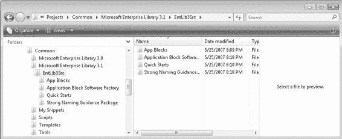

# 第 2 章 数据模型选择

ASP.NET 2.0 数据模型允许使用多种方法将数据从数据库获取到 Web 窗体。三种主要方法是`数据集`、`数据读取器`和`数据对象`。本章将回顾这些选项以及企业库的一部分——数据访问应用程序块。

本章涵盖以下内容：

- 数据访问应用程序块
- 数据访问代码片段
- 示例人员数据库
- 性能和`ViewState`考虑
- 类型化`数据集`
- 非类型化`数据集`
- `数据读取器`
- 子集和范围排序

在.NET 中处理数据并非只有一种方法。有许多不同且有时相互交织的方法，这给你带来了看似压倒性的选择。虽然你可能仅使用可用功能的有限子集就能应付，但你会发现，随着你对选项了解的加深，你可以提出更简化的方法，减少完成工作所需的工作量。这很快就会转化为更高的生产力和更少的维护代码。

尽管记录在 Microsoft 开发者网络（MSDN）上的巧妙示例提供了一些惊人的解决方案，但它们实际上是简单的示例。本章将通过向工作流程中引入一个挑战并展示如何克服它，来深入探讨超越简单示例的内容。

#### 数据访问应用程序块

Microsoft 模式与实践小组提供了一组称为应用程序块的模块，为开发人员提供额外的工具来与.NET 框架一起工作。其中一个模块是数据访问应用程序块，它提供了一组方法，整合了你通常需要做的与数据库交互的工作。这种抽象层简化了原本可能很繁琐的任务。




#### 数据访问应用程序块

数据访问应用程序块的目标之一是为开发者提供一个不依赖于底层数据库的接口。使用此模块的软件无需修改 C#代码即可同时支持 SQL Server、SQL Server CE 以及 Oracle。该模块还会自动处理许多如果您仅使用 ADO.NET 就必须手动完成的常见任务，例如打开和关闭每个数据库连接。诸如此类的各种任务都会自动处理。

###### 配置

除了这个替代接口，企业库还包含配置工具，可以为您修改 Web 配置文件。对于数据访问应用程序块，这样的配置工具并非必需，因为您唯一需要配置的就是用于连接数据库的连接字符串。不过，配置工具可以设置一个默认连接字符串，当代码中未显式指定时使用。

## 核心对象

数据访问应用程序块的核心是 `Database` 对象，它抽象掉了.NET 框架中与数据库通信相关的大部分复杂性。

您通过 `Database` 对象运行数据库命令，使用来自 `System.Data.Common` 命名空间的 `DbCommand` 来执行所有操作——从查询、插入、更新、删除，到调用存储过程以执行更复杂的任务。

本书大部分示例都使用了数据访问应用程序块。它是一个易于使用的接口，如果您选择手动构建数据访问层，则应使用它。

## 安装与构建

要使用企业库，您需要从微软模式与实践网站下载。运行安装程序时，您可能希望更改安装目录，将其放置在您的公共文件夹中，例如 `D:\Projects\Common\Microsoft Enterprise Library 3.1\`。作为安装程序的一部分，您可以选择安装并编译源代码。您可以将源代码放在同一文件夹中，如图 2-1 所示。从源代码构建时，会生成未签名的程序集，因此如果您计划将程序集部署到全局程序集缓存（GAC）或与强签名的项目一起使用，则需要更新项目以使用您自己的密钥。否则，您可以直接使用 `bin` 文件夹中由微软签名的程序集。

**图 2-1.** 位于公共目录中的企业库 3.1

企业库由所有应用程序块的多个程序集组成。您不需要引用每一个程序集来仅使用单个模块。

对于数据访问应用程序块，您只需要三个程序集：`Microsoft.Practices.EnterpriseLibrary.Common.dll`、`Microsoft.Practices.ObjectBuilder.dll` 和 `Microsoft.Practices.EnterpriseLibrary.Data.dll`。

当我构建我的数据访问层时，我使用类库来构建，而不是将所有代码放在 ASP.NET 网站项目的 `App_Code` 文件夹中。这样做允许它被多个网站以及控制台和桌面应用程序用作依赖项。这也使得对数据层进行版本控制和运行单元测试变得容易。如果它构建在 `App_Code` 文件夹内，则无法在外部使用，这使得版本控制和单元测试变得困难。

## 指导自动化工具

企业库只是模式与实践团队的一个产品。该团队还为 Visual Studio 生产了指导自动化扩展，它使用模板和配方来构建符合其建议的应用程序。在 WCF 和 Web 服务软件工厂中，包含了数据访问指导包，它可以为您的数据访问层生成代码。

每当您开始开发一个应用程序时，您肯定不希望因为设置数据库（包括各种表、存储过程、索引和约束）的所有繁琐工作而减慢速度，然后还要花费大量时间编写数据库与应用程序前端之间的中间层。为了加速创建所有这些代码的过程，您可以使用代码片段。这是 Visual Studio 2005（和 Visual Studio 2008）的一项强大功能，允许您快速选择模板并填写占位符，从而避免手动编写每一行代码（通常是样板代码）。代码片段还可以帮助您避免因拼写错误导致的编码错误。

#### 数据访问代码片段

我创建了五个代码片段来协助编写使用数据访问应用程序块的代码。除了向类中添加代码行外，代码片段还可以指定新代码块所需的命名空间语句。命名空间导入仅在 VB 代码中有效，但如果 Visual Studio 能够找到相应的程序集，引用将会生效。如果您在添加以下代码片段之一之前，先将必要的程序集引用添加到项目中，Visual Studio 将自动将 `using` 语句添加到您的类中。

我的数据访问代码片段集合如下：

- 数据访问类型
- 数据库创建
- DataSet 方法
- DataReader 方法
- Nonquery 方法

这些片段的代码如清单 2-1 至 2-5 所示。

### 清单 2-1. 数据访问类型

```xml
<?xml version="1.0" encoding="utf-8"?>
<CodeSnippets xmlns="http://schemas.microsoft.com/VisualStudio/2005/CodeSnippet">
  <CodeSnippet Format="1.0.0">
    <Header>
      <Title>1 Type Declarations</Title>
      <Shortcut>da1</Shortcut>
      <Description>Data Access Types</Description>
      <Author>Brennan Stehling</Author>
      <SnippetTypes>
        <SnippetType>Expansion</SnippetType>
      </SnippetTypes>
    </Header>
    <Snippet>
      <References>
        <Reference>
          <Assembly>Microsoft.Practices.EnterpriseLibrary.Common.dll</Assembly>
        </Reference>
        <Reference>
          <Assembly>Microsoft.Practices.EnterpriseLibrary.Data.dll</Assembly>
        </Reference>
        <Reference>
          <Assembly>Microsoft.Practices.ObjectBuilder.dll</Assembly>
        </Reference>
      </References>
      <Imports>
        <Import>
          <Namespace>System.Data</Namespace>
        </Import>
        <Import>
          <Namespace>System.Data.Common</Namespace>
        </Import>
        <Import>
          <Namespace>Microsoft.Practices.EnterpriseLibrary.Data</Namespace>
        </Import>
      </Imports>
      <Code Language="CSharp" Kind="type decl" Delimiter="$">private Database db;
      </Code>
    </Snippet>
  </CodeSnippet>
</CodeSnippets>
```

数据访问类型片段仅仅声明了一个用于数据访问方法中 `Database` 对象的引用。这个初始代码片段指定了所有代码片段所需的导入和引用。虽然 C#不像 VB 那样自动包含导入，但我仍然包含了它们，期望未来版本的 Visual Studio 能够利用它们。

### 清单 2-2. 数据库创建

```xml
<?xml version="1.0" encoding="utf-8"?>
<CodeSnippets xmlns="http://schemas.microsoft.com/VisualStudio/2005/CodeSnippet">
  <CodeSnippet Format="1.0.0">
    <Header>
      <Title>2 Database Creation</Title>
      <Shortcut>da2</Shortcut>
      <Description>Data Access Database Creation</Description>
      <Author>Brennan Stehling</Author>
    </Header>
    <Snippet>
      <Imports>
        <Import>
          <Namespace>Microsoft.Practices.EnterpriseLibrary.Data</Namespace>
        </Import>
      </Imports>
      <Declarations>
        <Literal Editable="true">
          <ID>connectionStringName</ID>
          <ToolTip>Connection String Name</ToolTip>
          <Default>db</Default>
          <Function>
          </Function>
        </Literal>
      </Declarations>
      <Code Language="CSharp" Kind="method body">
        <![CDATA[
db = DatabaseFactory.CreateDatabase("$connectionStringName$");
        ]]>
      </Code>
    </Snippet>
  </CodeSnippet>
</CodeSnippets>
```


