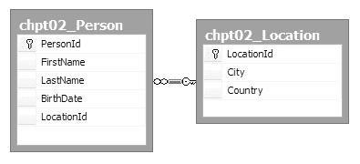
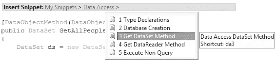

# 第 2 章

## 清单 2-3. `DataSet 方法`

```xml
<?xml version="1.0" encoding="utf-8"?>
<CodeSnippets>
  <CodeSnippet Format="1.0.0">
    <Header>
      <Title>3 Get DataSet Method</Title>
      <Shortcut>da3</Shortcut>
      <Description>Data Access DataSet Method</Description>
      <Author>Brennan Stehling</Author>
    </Header>
    <Snippet>
      <Imports>
        <Import>
          <Namespace>Microsoft.Practices.EnterpriseLibrary.Data</Namespace>
        </Import>
      </Imports>
      <Declarations>
        <Literal Editable="true">
          <ID>methodName</ID>
          <ToolTip>Method Name</ToolTip>
          <Default>GetDataSet</Default>
          <Function>
          </Function>
        </Literal>
        <Literal Editable="true">
          <ID>sproc</ID>
          <ToolTip>Stored Procedure</ToolTip>
          <Default>GetDataSet</Default>
          <Function>
          </Function>
        </Literal>
      </Declarations>
      <Code Language="CSharp" Kind="method decl">
        <![CDATA[
public DataSet $methodName$()
{
    DataSet ds = new DataSet();
    using (DbCommand dbCmd = db.GetStoredProcCommand("$sproc$"))
    {
        //db.AddInParameter(dbCmd, "@Parameter1", DbType.String, String.Empty);
        //db.AddOutParameter(dbCmd, "@Parameter2", DbType.String, 0);
        ds = db.ExecuteDataSet(dbCmd);
        //Object outputParameter =
        //db.GetParameterValue(dbCmd, "@OutputParameter");
    }
    //return the results
    return ds;
}
]]>
      </Code>
    </Snippet>
  </CodeSnippet>
</CodeSnippets>
```

`DataSet` 方法在通过存储过程调用的结果填充它之后，返回一个 `DataSet`。占位符用于表示方法名称和存储过程的名称。

该代码片段还包含几行用于输入和输出参数的代码。这些代码用于展示如何添加输入和输出参数。如果所调用的存储过程不使用参数，则可以删除这些行。此代码片段使用 `using` 语句引用 `DbCommand` 变量，该语句作为 C# 2.0 的一部分引入。它确保 `DbCommand` 在代码块结束时被释放。你会注意到，在这里无需打开和关闭数据库连接。

## 清单 2-4. `DataReader 方法`

```xml
<?xml version="1.0" encoding="utf-8"?>
<CodeSnippets>
  <CodeSnippet Format="1.0.0">
    <Header>
      <Title>4 Get DataReader Method</Title>
      <Shortcut>da4</Shortcut>
      <Description>Data Access DataReader Method</Description>
      <Author>Brennan Stehling</Author>
    </Header>
    <Snippet>
      <Imports>
        <Import>
          <Namespace>Microsoft.Practices.EnterpriseLibrary.Data</Namespace>
        </Import>
      </Imports>
      <Declarations>
        <Literal Editable="true">
          <ID>methodName</ID>
          <ToolTip>Method Name</ToolTip>
          <Default>GetDataReader</Default>
          <Function>
          </Function>
        </Literal>
        <Literal Editable="true">
          <ID>sproc</ID>
          <ToolTip>Stored Procedure</ToolTip>
          <Default>GetDataReader</Default>
          <Function>
          </Function>
        </Literal>
      </Declarations>
      <Code Language="CSharp" Kind="method decl">
        <![CDATA[
public IDataReader $methodName$()
{
    IDataReader dr = null;
    using (DbCommand dbCmd = db.GetStoredProcCommand("$sproc$"))
    {
        //db.AddInParameter(dbCmd, "@Parameter", DbType.String, String.Empty);
        dr = db.ExecuteReader(dbCmd);
    }
    //return the results
    return dr;
}
]]>
      </Code>
    </Snippet>
  </CodeSnippet>
</CodeSnippets>
```

`DataReader` 代码片段所完成的工作与 `DataSet` 代码片段完全相同，只是 `DataReader` 代码片段返回一个 `IDataReader` 对象。

## 清单 2-5. `NonQuery 方法`

```xml
<?xml version="1.0" encoding="utf-8"?>
<CodeSnippets>
  <CodeSnippet Format="1.0.0">
    <Header>
      <Title>5 Execute Nonquery</Title>
      <Shortcut>da5</Shortcut>
      <Description>Data Access Nonquery Method</Description>
      <Author>Brennan Stehling</Author>
    </Header>
    <Snippet>
      <Imports>
        <Import>
          <Namespace>Microsoft.Practices.EnterpriseLibrary.Data</Namespace>
        </Import>
      </Imports>
```


### 第 2 章：数据模型选择

## 45

<Literal Editable="true">
<ID>methodName</ID>
<ToolTip>方法名</ToolTip>
<Default>SaveData</Default>
<Function>
</Function>
</Literal>

<Literal Editable="true">
<ID>sproc</ID>
<ToolTip>存储过程</ToolTip>
<Default>SaveData</Default>
<Function>
</Function>
</Literal>

```csharp
public void $methodName$()
{
    using (DbCommand dbCmd = db.GetStoredProcCommand("$sproc$"))
    {
        //db.AddInParameter(dbCmd, "@Parameter", DbType.String, 0);
        //db.AddOutParameter(dbCmd, "@Parameter2", DbType.String, 0); db.ExecuteNonQuery (dbCmd);
        //Object outputParameter =
        //db.GetParameterValue(dbCmd, "@OutputParameter");
    }
}
```

`非查询`代码片段不返回`数据集`或`数据读取器`。它可用于执行插入、更新或删除数据库的调用。它也可以用于简单地从已执行命令的结果中提取输出参数。在前面三个方法代码片段（清单 2-3、2-4 和 2-5）中，执行行之后的行是一条注释行，展示了如何从已执行的数据库命令中提取输出参数值。最初这样的参数是一个泛型对象，但如果输出值是`DbType.Int32`，该变量可以是一个`int`，其值被转换为`int`。运行插入命令时，通常返回新插入记录的主键值。

要使用代码片段，您必须先通过代码片段管理器将它们添加到 Visual Studio 中。将前面的代码片段放置在文件夹 `D:\Projects\Common\Templates\My Snippets` 下一个名为 `Data Access` 的文件夹中。然后单击 **工具** > **代码片段管理器**。这将打开代码片段管理器。单击 **添加** 按钮并选择 `My Snippets` 文件夹。然后单击 **确定**。这将使这些代码片段在编辑器中可用。




## 46

代码片段就位后，您可以通过三种方式访问它们。您可以在编辑器中右键单击，选择 **插入代码片段**，然后使用选择菜单找到要插入的代码片段。或者，您可以使用热键 `Ctrl+K`，`Ctrl+X` 来调出菜单。最快的方法是使用代码片段指定的快捷方式。这五个代码片段标记为 `da1`、`da2` 等。输入 `da1` 并按两次 `Tab` 键将插入该代码片段。图 2-2 显示了代码片段的选择菜单。

**图 2-2.** *代码片段选择菜单*

选择代码片段后，代码会被放入编辑器中，并且占位符会被高亮显示。您可以按 `Tab` 键在占位符之间移动。每个占位符中都有默认值。您可以更改每个标记占位符中的文本，并按 `Tab` 键移动到下一个值，直到完成。然后按 `Enter` 键接受代码片段。只需几秒钟，您就可以获得一个新方法，该方法通过调用存储过程返回一个`数据集`。

## 常见文件夹添加

这些代码片段可以添加到您的 `Common` 文件夹中的 `My Snippets` 子文件夹（`D:\Projects\Common\Templates\My Snippets`）。放置好后，您可以设置 Visual Studio 引用它们，以便在所有项目中使用。

#### 示例数据库

本章其余部分显示的示例使用一个包含两个表的数据库，`Person` 和 `Location`，如图 2-3 所示。`Person` 表中的每条记录都通过外键约束引用 `Location` 表中的一条记录。然后，将一组随机且足够规模的数据加载到 `Person` 表中，以便在 `FirstName`、`LastName` 和 `BirthDate` 这三列中分布值。外键引用是 `LocationId`。

**图 2-3.** *Person 和 Location 表*

## 47

对于单个表，将表从服务器资源管理器拖放到类型化数据集设计器上来生成基本的增删改查方法（创建、读取、更新、删除）是微不足道的。

通过添加第二个表，需要额外的工作才能使以下示例正常工作。一个简单的 `SELECT * FROM Table1` 不足以将两个表结合在一起。

相反，您可以使用存储过程来获取所有所需的数据。清单 2-6 中的脚本创建了此存储过程。

**清单 2-6.** *chpt02_GetAllPeople.sql*

```sql
IF EXISTS (SELECT * FROM sysobjects WHERE type = 'P'
    AND name = 'chpt02_GetAllPeople')
BEGIN
    DROP Procedure chpt02_GetAllPeople
END
GO

CREATE Procedure dbo.chpt02_GetAllPeople
AS
SELECT p.PersonId,p.FirstName,p.LastName,p.BirthDate,l.City,l.Country
FROM chpt02_Person AS p
JOIN chpt02_Location AS l on l.LocationId = p.LocationId
GO

GRANT EXEC ON chpt02_GetAllPeople TO PUBLIC
GO
```

## 简单的数据示例

在 ASP.NET 中称某些数据示例为“简单”是有趣的，因为它们实际上用很少或没有代码就完成了复杂的任务。只需将表从服务器资源管理器拖到 Web 窗体的设计面上，就会自动创建一个`网格视图`并将其与`SQL 数据源`关联。`SQL 数据源`会立即配置为在该表中选择、插入、更新和删除行所需的 SQL。在 .NET 2.0 的所有启动活动中，这类示例被用来展示 ASP.NET 2.0 数据模型的强大功能。

当您更改`网格视图`的属性以允许分页、排序、选择和编辑时，它都能正常工作。不仅如此，它还能在您不编写任何代码的情况下工作。清单 2-7 显示了将示例数据库中的 `Person` 表拖到页面上后创建的所有标记。

**清单 2-7.** *包含 SqlDataSource 的 TrivialExample.aspx*

```aspx
<%@ Page Language="C#" MasterPageFile="~/Site.master"
    AutoEventWireup="true" CodeFile="TrivialExample.aspx.cs"
    Inherits="TrivialExample" Title="简单示例" %>
<asp:Content
    ID="Content1" ContentPlaceHolderID="ContentPlaceHolder1" Runat="Server">
    <asp:GridView
        ID="GridView1" runat="server" AllowPaging="True" AllowSorting="True"
        AutoGenerateColumns="False" DataSourceID="SqlDataSource1"
        EmptyDataText="没有可显示的数据记录。">
        <EmptyDataTemplate>
            <strong>无数据</strong>
        </EmptyDataTemplate>
    </asp:GridView>
    <asp:SqlDataSource ID="SqlDataSource1" runat="server"
        ConnectionString="<%$ ConnectionStrings:chpt02 %>"
        ProviderName="<%$ ConnectionStrings:chpt02.ProviderName %>"
        DeleteCommand="DELETE FROM [chpt02_Person] WHERE [PersonId] = @PersonId"
        InsertCommand="INSERT INTO [chpt02_Person] ([FirstName], [LastName], [BirthDate], [LocationId]) VALUES (@FirstName, @LastName, @BirthDate, @LocationId)"
        SelectCommand="SELECT [PersonId], [FirstName], [LastName], [BirthDate], [LocationId] FROM [chpt02_Person]"
        UpdateCommand="UPDATE [chpt02_Person] SET [FirstName] = @FirstName, [LastName] = @LastName, [BirthDate] = @BirthDate, [LocationId] = @LocationId WHERE [PersonId] = @PersonId">
        <InsertParameters>
            <asp:Parameter Name="FirstName" Type="String" />
            <asp:Parameter Name="LastName" Type="String" />
            <asp:Parameter Name="BirthDate" Type="DateTime" />
            <asp:Parameter Name="LocationId" Type="Int64" />
        </InsertParameters>
        <UpdateParameters>
            <asp:Parameter Name="FirstName" Type="String" />
            <asp:Parameter Name="LastName" Type="String" />
            <asp:Parameter Name="BirthDate" Type="DateTime" />
            <asp:Parameter Name="LocationId" Type="Int64" />
            <asp:Parameter Name="PersonId" Type="Int64" />
        </UpdateParameters>
        <DeleteParameters>
            <asp:Parameter Name="PersonId" Type="Int64" />
        </DeleteParameters>
    </asp:SqlDataSource>
</asp:Content>
```

## 48


