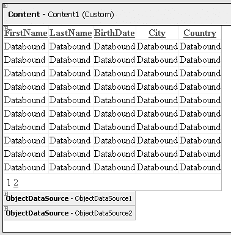

# 第 2 章 ■ 数据模型选择

我首先担心的是，你会立刻在应用层、直接在页面中使用内联 SQL。虽然创建这样的 SQL 很容易，但日后要对其进行更改以适应变化却并非易事。除非数据库永不改变，或者你完全理解刚刚生成的一切，否则这最终会给你带来麻烦。很容易想象`Person`表最终会增加更多列（例如，用于中间名首字母和性别）。如果表最初只有一个`Name`列，后来被拆分成`First Name`和`Last Name`，那么你就需要对代码清单 2-7 中所示的 SQL 进行一些修改；否则，该 SQL 将失效。

代码清单 2-7 中的`SqlDataSource`在其智能标记上有一个`Refresh Schema`（刷新架构）命令，但它实际上并不像你期望的那么强大。将`Last Name`改为`Surname`会在刷新架构时导致错误。而为`Middle Initial`（中间名首字母）添加新列并不会将该新列添加到`Select`（选择）和其他命令中。要进行这些调整，你必须选择智能标记上的另一个选项：`Reconfigure Datasource`（重新配置数据源）。而这样做会带来一些`GridView`方面的问题，例如重置你可能已经进行了大量定制的列，而你不希望这些列被自动生成的更改所改变。考虑到所有这些因素，最好将这种快速但粗糙的数据绑定方式仅用于原型设计新想法，而当项目度过早期阶段后，应调整为使用更具可维护性、架构上更合理的方法。幸运的是，通过使用`SqlDataSource`的内联查询创建的快速原型，在原型开始转变为实际应用程序时，可以被`ObjectDataSource`替代。`ObjectDataSource`生成的列只需与`SqlDataSource`的列相匹配，而你的`GridView`则可以保持不变。

## 非简单数据示例

在现实世界的 application 中，简单的示例只能带你走这么远，很快你就需要同时处理多个表。将来自多个表的数据添加到`GridView`或其他数据绑定控件中进行显示和编辑，就进入了非简单示例的范畴。

在示例`Person`数据库中，`Person`表通过`LocationId`与`Location`表存在关系。而在`Location`表中，`City`和`Country`的值定义了个人居住的位置。当显示数据库中所有人员的`GridView`时，显示城市和国家而不是`LocationId`会直观得多。前面展示的`chpt02_GetAllPeople`存储过程将这些值汇集在一起，因此从应用程序的角度来看，可以像使用数据库中单个表那样使用它们。不幸的是，你不能像拖放表那样，从“服务器资源管理器”窗口将存储过程拖放到 Web 窗体的设计界面上。相反，你必须从“工具箱”中拖放一个`GridView`并为其配置数据源。当配置为`SqlDataSource`时，可以选择存储过程，但数据源向导不会提供`Insert`（插入）、`Update`（更新）和`Delete`（删除）命令作为选项。仍然可以实现前面章节中单表示例的所有功能，但要提供`GridView`所需的所有功能，仅靠一个用类型化 DataSet 配置的存储过程是不够的。如何实现这一点的详细示例将在第 3 章中介绍。

##### 类型化 DataSet

从代码清单 2-6 中的基本存储过程开始，你可以构建一个自定义的类型化 DataSet。你只需转到你准备用作数据访问层的类库项目，并向其中添加一个名为`PersonDataSet.xsd`的 DataSet。然后添加一个 TableAdapter，并按照向导提供的步骤添加此处定义的现有存储过程。接着，将`DataTable`和`TableAdapter`重命名为更用户友好的名称，例如`People`和`PeopleTableAdapter`，以使随类型化 DataSet 生成的代码更好地模拟它所要表示的对象。图 2-4 展示了`People`类型化 DataSet 的样子，图 2-5 展示了`FillAllPeople`方法的属性。

**图 2-4.** People 类型化数据集

**图 2-5.** FillAllPeople 属性

此类型化 DataSet 被定义为类库的一部分。将网站设置为使用此类库作为依赖项，然后运行网站的生成操作，以确保网站当前使用的程序集中包含这个新创建的类型化 DataSet。依赖项编译后，它会自动复制到网站的`bin`目录中，并准备好在 Web 窗体中使用。只需在设计界面上拖放一个`GridView`控件。然后使用智能标记选择一个数据源。选择一个新的`ObjectDataSource`。可用选项将显示之前命名的`PeopleTableAdapter`。将选择方法设置为`GetAllPeople`方法。设置好`ObjectDataSource`后，你可以返回到`GridView`，打开智能标记以启用分页和排序。现在，通过在“解决方案资源管理器”中右键单击页面并选择`View in Browser`（在浏览器中查看）来测试该页面。

你可能会惊喜地发现，页面加载时间合理，并且提供了你期望的排序和分页功能。类型化 DataSet 在减小`ViewState`大小方面也做得非常出色。难怪我刚刚描述的方法受到`MSDN`文档的强烈推荐。然而，这个解决方案并非所有场景下的唯一选择，甚至不是最佳选择。接下来你将探索一些替代方案。

## 僵化的类型化 DataSet

当在 XML 架构定义（`XSD`）设计器上构建类型化 DataSet 时，它会从数据库读取所有架构信息，并硬编码所有列的名称以及类型和确切大小。将`VARCHAR(10)`更改为`VARCHAR(11)`可能会破坏类型化 DataSet。一旦插入了一条长度为 11 个字符的记录，并且类型化 DataSet 遇到此数据时，由于大小限制，它将抛出异常。如果不小心，这个问题可能直到被推入生产环境并在最糟糕的时间被发现时才会被注意到。为了防范此问题，可以在属性面板中手动调整类型化 DataSet 中已更新的列定义。

##### 非类型化 DataSet

上一节中使用的类型化 DataSet 是使用`XSD`文件构建的，该文件定义了`DataTable`和`TableAdapter`的各种属性。这是一个相当僵化的模型，因为`XSD`文件主要通过使用 Visual Studio 和可视化的类型化 DataSet 设计器进行编辑。

它也将数据库架构锁定，而这在项目的生命周期中很可能会发生变化。使用更灵活的选项会很有帮助。

类型化 DataSet 使用的存储过程可以直接运行，以获取相同的列，这些列将在运行时生成兼容的`DataSet`。列定义可以仅由存储过程来定义，而不必由类型化 DataSet 和存储过程重复定义。


在同一个类库中，创建一个名为 `PersonDomain` 的类，并开始使用本章前面定义的代码片段填充代码。首先，添加对 `Database` 对象的引用，然后在构造函数中添加对该引用的初始化（参见代码清单 2-8）。

**代码清单 2-8.** *数据库初始化*
```csharp
/// <summary>
/// 用作数据库连接的全局连接
/// </summary>
private Database db;

public PersonDomain()
{
    db = DatabaseFactory.CreateDatabase("chpt02");
}
```

接下来，添加代码清单 2-9 中的方法，该方法调用与类型化 `DataSet` 相同的存储过程。

**代码清单 2-9.** *GetAllPeopleDataSet*
```csharp
[DataObjectMethod(DataObjectMethodType.Select)]
public DataSet GetAllPeopleDataSet()
{
    DataSet ds = new DataSet();
    using (DbCommand dbCmd =
        db.GetStoredProcCommand("chpt02_GetAllPeople"))
    {
        ds = db.ExecuteDataSet(dbCmd);
    }
    // 返回结果
    return ds;
}
```



8601Ch02.qxd 8/29/07 5:00 PM Page 52

**52**

第 2 章 ■ 数据模型选择

代码清单 2-9 中的简单方法调用了 `chpt02_GetAllPeople` 存储过程，并返回生成的 `DataSet`，其列与类型化 `DataSet` 的列完全相同。该方法还包含 `DataObjectMethod` 属性，该属性指示关联的方法充当 `Select` 方法。除了这个方法属性外，在类声明中也放置了一个属性。例如：
```csharp
[DataObject(true)]
public class PersonDomain
{
    ...
}
```

位于类和方法声明之前的这些属性，使得这些 `Select` 方法对于 Web 窗体使用的 `ObjectDataSource` 配置向导可用。创建一个新的 Web 窗体，并重复与类型化 `DataSet` 相同的步骤，将 `GridView` 添加到页面。配置 `ObjectDataSource` 时，选择 `PersonDomain` 对象和 `GetAllPeopleDataSet` 方法。因为该类被标记为 `DataObject`，并且该方法被标记为 `Select` 方法，所以它会被列出。

此外，无需从头创建新的实现，你可以通过使用新创建的类和方法，将第二个 `ObjectDataSource` 添加到与类型化 `DataSet` 相同的 Web 窗体中。现在，你可以使用 `GridView` 上的智能标签来选择这个新的 `ObjectDataSource`。由于列完全兼容，你可以互换使用任一数据源。图 2-6 显示了一个数据绑定控件，其中配置了两个 `ObjectDataSources`。

**图 2-6.** *可互换的数据源*

如果数据量不大，我描述的两种解决方案都能充分工作。但在数据量变得非常大之后，每次查询都会传输所有数据，导致在数据库和应用程序之间传输所有数据所需的时间变得过长，这变得不合理。从数据库中提取的数据量之大会导致这种迟缓。然后，将这些数据塑造成 `DataSet` 需要一定的处理开销。通过使用 `DataReader`，你可以减少这种开销。

##### DataReader

与 `DataSet` 不同，`DataReader` 不提供诸如排序、筛选甚至在结果集上双向移动之类的功能。它具有最简化的功能来遍历结果行并根据需要访问字段。当你经过一行后，你无法使用 `DataKey` 或索引返回到该行。这些看起来像是主要限制，但这些限制旨在减少使用 `DataSet` 所必需的开销，因为 `DataSet` 维护数据列上的索引并将完整的结果集保存在内存中。相比之下，`DataReader` 是一个精简而高效的选项，其独特的特性使其在某些情况下成为理想选择。

代码清单 2-10 显示了要添加到 `PersonDomain` 中的代码，它再次调用相同的存储过程，但返回 `IDataReader` 对象作为结果，而不是 `DataSet`。

**代码清单 2-10.** *GetAllPeopleReader*
```csharp
[DataObjectMethod(DataObjectMethodType.Select)]
public IDataReader GetAllPeopleReader()
{
    IDataReader dr = null;
    using (DbCommand dbCmd = db.GetStoredProcCommand("chpt02_GetAllPeople"))
    {
        dr = db.ExecuteReader(dbCmd);
    }
    // 返回结果
    return dr;
}
```

构建网站，这个新的 `Select` 方法就可以与 `ObjectDataSource` 一起使用。你可以创建一个新的 Web 窗体从头开始，或者将一个新的 `ObjectDataSource` 添加到用于类型化和非类型化 `DataSet` 的 Web 窗体中，并将其与 `GridView` 关联。自然，你应该选择这个新方法。新数据显示与其他两个选项相同的数据，但遗憾的是，你会发现分页功能在 `DataReader` 当前形式下不起作用。必须进行一些更改以允许分页和排序。

##### DataObject

这些示例都使用了 .NET 2.0 引入的新的 `DataObject`。对于类型化 `DataSet`，生成的类被标记为 `DataObjects`，每个方法被标记为 `DataObjectMethodType` 枚举之一。关于 `DataObject` 以及数据绑定控件如何工作的一个有用点是：只要列名或属性为数据绑定控件提供了其配置使用的值和类型，你可以返回类型化 `DataSet`、非类型化 `DataSet`、`DataReader` 或 `Person` 对象的集合。

8601Ch02.qxd 8/29/07 5:00 PM Page 54

**54**

第 2 章 ■ 数据模型选择

事实上，你可以将返回 `DataSet` 的 `PersonDomain` 方法更改为返回 `Person` 对象的集合，这些对象具有由存储过程定义的名为 `FirstName`、`LastName`、`BirthDate`、`City` 和 `Country` 的属性。`GridView` 将非常乐意地绑定这些属性，就像绑定 `DataSet` 上的命名列一样容易。

## 缺点是什么？

本章讨论的每种方法都有一个共同的缺点。每次显示页面时，都会从数据库中提取完整的数据集——即使只有十行数据发送到 Web 客户端。当数据库服务器与 Web 服务器在同一台机器上时，这不是主要问题。然而，如果数据库服务器在另一台机器上，特别是当数据量非常大时，传输所有数据的时间将成为一个关键问题。减少从数据库移动到应用程序的数据量是我们将在下一章探讨的优化之一。

#### 总结

本章涵盖了 .NET 框架中用于处理数据的各种可用选择。我们研究了每种选择如何具有其独特的优点和缺点。随着我们继续前进，我们将利用这些选项。

8601Ch03CMP2 8/22/07 8:05 PM Page 55

第 3 章

数据库管理

**通**常，随着新应用程序版本的发布，数据库被视为不可更改的资源。性能改进仅限于应用层的更改，而不是充分利用数据库可以进行的任何改进。数据库脚本可以作为项目进行管理。Visual Studio 的这个功能非常有用但使用严重不足。每个表、存储过程和数据库资源都可以在这些数据库项目中创建和管理。容纳你的网站和其他项目的解决方案可以与你的数据库项目一起管理。在准备每个版本时，可以根据需要调整对应用层和数据层的更改。

本章涵盖以下内容：
- 创建数据库项目
- 管理存储过程
- 管理索引和约束
- 考虑性能和稳定性
- 执行单元测试和持续集成

数据库以及脚本、表和存储过程通常不包含在 Visual Studio 解决方案中，与我们一直使用的网站和类库项目在一起。通过不将这些脚本包含在解决方案中，它们是断开连接且未被管理的。


