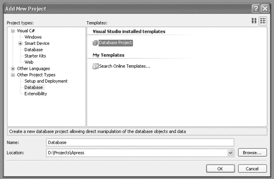

# 第三章　■　数据库管理

它们甚至没有与使用这些数据库的软件包含在同一个源代码控制系统中。但是 `Visual Studio Professional Edition` 支持 `数据库项目`，您可以将其与您的网站和类库项目一起包含，并使用您的源代码控制系统进行组织。

#### 使用数据库项目

与其仅仅在数据库中创建表和存储过程，您可以将那些创建脚本提取出来并放置到 `数据库项目` 中。这样做能将它们的变更直接与应用程序对齐，并使用同一个源代码控制系统进行管理。这使得您可以在部署每个应用程序版本时，附带所需的数据库变更。



### 注意

要使用 `数据库项目`，您必须拥有 `Visual Studio Professional Edition`。`Standard` 和 `Express editions` 不支持此项目类型。

##### Visual Studio

在 `Visual Studio` 中，当您向解决方案添加新项目时，`数据库项目` 包含在其他项目类型组中。文件清单会跟踪每个文件夹中的文件，就像类库项目一样，并且当您向文件夹中添加新的表或存储过程脚本时，您会获得一个快速入门模板，就像使用 Web 窗体和类一样。

但 `数据库项目` 的功能远不止于存放您的 `结构化查询语言 (SQL)` 脚本。每个项目都可以与一个数据库连接相关联，其中一个被标记为默认连接。要在默认数据库上运行存储过程脚本，您只需右键单击脚本并选择 `运行于`。脚本的结果将显示在 `输出窗口` 中。图 3-1 展示了如何创建 `数据库项目`。

### 图 3-1. 数据库项目

`数据库项目` 的使用率没有其应有的那么高。很多时候，表和存储过程是直接在数据库中管理的，对架构或存储过程的变更要么通过手动传播，要么通过分析这些数据库之间差异来生成脚本的第三方工具进行传播。通过在 `Visual Studio` 中开发脚本，您将更好地理解这些变更，并拥有规划变更所需的控制权。而且，当数据库脚本在解决方案中得到管理时，它们也将通过您的源代码控制系统进行版本控制。在每次发布时，您应该不仅能构建您的项目，还能将数据库恢复到与该发布版本兼容的工作状态。

依赖手动变更或为不受管理的变更提供变通方案的工具，会导致数据库架构状态的混乱。而且，尽管这些工具可以免除您自己编写变更脚本的需要，但它们不应生成如此大量的脚本，以至于无法理清所有的变更内容。

`运行于` 过程中内置的一个静默功能是跨表和存储过程脚本的依赖关系检测。如果您有多个必须按特定顺序运行的表脚本，当您高亮显示所有表并点击 `运行于` 命令时，依赖关系检测会确定执行顺序。这确实节省了大量时间。

`Visual Studio` 还具有 `服务器资源管理器`，您可以在其中查看已部署到数据库的表和存储过程。您可以打开一个表来查看和编辑其内容。您甚至可以在 `Visual Studio` 中启动一个新的查询窗口，以查询 `服务器资源管理器` 中列出的数据库。但为了获得更强大的功能，许多开发人员选择使用 `SQL Server Management Studio`，它提供了比 `Visual Studio` 更多的附加功能。

##### SQL Server Management Studio

`SQL Server Management Studio` 能够满足您管理表创建和修改的所有需求。它也非常适合处理各种脚本。我了解到，当它与 `Visual Studio` 中的 `数据库项目` 适当配合使用时，是一个非常有价值的工具。我首先在 `Visual Studio` 中为表和存储过程脚本创建桩代码，然后使用 `Management Studio` 来实际构建表和存储过程。我一次处理一个表或一个存储过程，并在每一步测试变更。

要创建表，我只需在 `Management Studio` 中向数据库添加一个新表，并用我选择的名称保存它。然后，我在 `对象资源管理器` 中右键单击该表，选择 `将数据库脚本化为`，接着选择 `创建到`，并将其发送到 `剪贴板`。我回到 `Visual Studio`，将脚本粘贴到原位并保存。之后，我可以在 `Visual Studio` 中对脚本进行调整，例如调整 `VARCHAR` 的大小或添加新列。

为了确保我的脚本在修改后仍然有效，我会从 `Visual Studio` 针对开发数据库运行它。在 `解决方案资源管理器` 中右键单击脚本，选择 `运行于`。脚本将在 `数据库项目` 的默认数据库上运行，并在 `输出窗口` 中报告结果。

#### 管理存储过程

创建存储过程的过程与创建表有很大不同。在 `Visual Studio` 中，您编写存储过程脚本，针对数据库运行它，并使用任何必需的参数进行测试。当您优化脚本时，您会发现将存储过程部署到数据库进行测试的过程涉及不必要的开销。相反，您可以在 `Management Studio` 中编写脚本，并调整其使其能作为存储过程工作。

我首先声明脚本所需的变量，然后设置它们的值。接着，我编写脚本的其余部分，该部分使用这些变量，如清单 3-1 所示。

### 清单 3-1. 按名字和姓氏选择人员的脚本

```
DECLARE @FirstName varchar(50)
DECLARE @LastName varchar(50)
SET @FirstName = 'John'
SET @LastName = 'Smith'
SELECT * FROM chpt03_Person
WHERE FirstName = @FirstName
AND LastName = @LastName
```

前面的脚本展示了变量如何在脚本内被声明、设置和使用。

脚本正常工作后，就可以将其放入在 `数据库项目` 中创建的存储过程桩代码中（参见清单 3-2）。

### 清单 3-2. 按名字和姓氏选择人员的存储过程

```
IF EXISTS (SELECT * FROM sysobjects WHERE type = 'P' AND
name = 'chpt03_GetPeopleByName')
BEGIN
DROP Procedure chpt03_GetPeopleByName
END
GO
CREATE Procedure dbo.chpt03_GetPeopleByName
(
@FirstName varchar(50),
@LastName varchar(50)
}
AS
SELECT * FROM chpt03_Person
WHERE FirstName = @FirstName
AND LastName = @LastName
GO
GRANT EXEC ON chpt03_GetPeopleByName TO PUBLIC
GO
```

您可以看到声明的变量现在如何用作参数，而设置命令不再需要。脚本的其余部分保持不变。随着您的存储过程变得越来越复杂，这个过程将有助于简化您的工作。一个关键区别在于，当作为脚本运行而非调用存储过程时，`Management Studio` 能够为您提供更具描述性和更准确的警告与错误信息。

## CRUD 存储过程


## CRUD 概念

*CRUD*是*创建（Create）、读取（Read）、更新（Update）和删除（Delete）*的首字母缩写。典型的做法是为数据库中的每张表针对这些操作分别创建存储过程。在一个完全规范化的数据库结构中，这意味着会有许多可能不太有用的 CRUD 存储过程。通过零碎地更新记录，性能可能会受到影响。通过将 CRUD 功能分组到规划好的存储过程中，可以一次更新多张表，而无需多次访问数据库。因此，并非每个数据库表总是对应四个存储过程。

存储过程不仅仅是返回`SELECT`语句的结果。一个存储过程可能只是设置一个输出参数的值。在将数据保存到数据库的情况下，它可能只返回所保存记录的键值。清单 3-3 展示了如何保存一个人。

### 清单 3-3. `chpt03_SavePerson.sql`

```sql
IF EXISTS (SELECT * FROM sysobjects WHERE type = 'P'
AND name = 'chpt03_SavePerson')
BEGIN
DROP Procedure chpt03_SavePerson
END
GO

CREATE Procedure dbo.chpt03_SavePerson
(
@FirstName varchar(50),
@LastName varchar(50),
@BirthDate datetime,
@LocationId bigint,
@PersonId bigint OUTPUT
)
AS
INSERT into chpt03_Person
(FirstName, LastName, BirthDate, LocationID)
values (@FirstName, @LastName, @BirthDate, @LocationID)
SET @PersonId = @@IDENTITY
GO

GRANT EXEC ON chpt03_SavePerson TO PUBLIC
GO
```

这个存储过程插入一个新的人员记录并为`PersonId`设置输出参数。请注意，顶部附近定义的`PersonId`参数带有`OUTPUT`标记，表明它是一个输出参数。如果你善加利用，访问这类值会变得非常有用。人员表(`Person`)与地点表(`Location`)存在关系，并接受`LocationId`作为参数。不能使用任意值，因此应该使用一个真实的值。

清单 3-4 展示了如何保存一个地点的过程。

### 清单 3-4. `chpt03_SaveLocation.sql`

```sql
IF EXISTS (SELECT * FROM sysobjects WHERE type = 'P' AND
name = 'chpt03_SaveLocation')
BEGIN
DROP Procedure chpt03_SaveLocation
END
GO

CREATE Procedure dbo.chpt03_SaveLocation
(
@City varchar,
@Country varchar,
@LocationId bigint OUTPUT
)
AS
IF NOT EXISTS (
SELECT * FROM chpt03_Location
WHERE City = @City and Country = @Country
)
BEGIN
-- INSERT
PRINT 'Inserting Location'
INSERT into chpt03_Location
(City,Country)
values (@City, @Country)
SET @LocationId = @@IDENTITY
END
ELSE
BEGIN
-- get LocationId
PRINT 'Location Exists'
SET @LocationId = (
SELECT LocationId FROM chpt03_Location
WHERE City = @City and Country = @Country
)
END
GO

GRANT EXEC ON chpt03_SaveLocation TO PUBLIC
GO
```

这个存储过程包含了一个额外的逻辑，首先检查城市和国家的组合是否已存在。然后，该过程要么运行`INSERT`命令，要么运行`SELECT`命令来获取`LocationId`的值，也就是输出参数。在保存地点和人员时，可以调用此存储过程来获取`LocationId`。

最后，可以创建一个单独的存储过程（如清单 3-5 所示），将所有这些工作组合到对数据库的一次调用中。

### 清单 3-5. `chpt03_SavePersonWithLocation.sql`

```sql
IF EXISTS (SELECT * FROM sysobjects WHERE type = 'P' AND
name = 'chpt03_SavePersonWithLocation')
BEGIN
DROP Procedure chpt03_SavePersonWithLocation
END
GO

CREATE Procedure dbo.chpt03_SavePersonWithLocation
(
@FirstName varchar(50),
@LastName varchar(50),
@BirthDate datetime,
@City varchar,
@Country varchar,
@LocationId bigint OUTPUT,
@PersonId bigint OUTPUT
)
AS
EXEC chpt03_SaveLocation @City, @Country, @LocationId OUTPUT
EXEC chpt03_SavePerson @FirstName, @LastName, @BirthDate, @LocationId,
@PersonId OUTPUT
GO

GRANT EXEC ON chpt03_SavePersonWithLocation TO PUBLIC
GO
```


减少对数据库的访问次数可以提高应用程序的效率。这还为你在数据库中组织表的方式提供了一定的灵活性。模式变更可以完全封装在存储过程之后，这样使用数据库的应用程序就无需进行任何更改。

## 索引与约束管理

当你添加具有外键约束的表时，会开始遇到一些复杂情况。如果存在外键依赖关系阻止该操作，你就无法删除表。为了解决这个问题，我会在每个数据库项目中创建一个名为 Constraints 的文件夹，其中包含一个用于添加所有外键约束的脚本和另一个用于删除它们的脚本。我还经常会有一个用于清除所有数据并填充一些初始示例数据的脚本。当我更改多个表脚本时，可以先移除约束，运行表脚本，然后用示例数据重新填充数据库，以便测试存储过程。

数据库项目没有用于检查索引和外键的模板，因此你必须从头开始。表和存储过程模板的最佳功能是，在重新创建项目之前会检查该项目是否存在并需要先删除，这样你就可以无错误地运行脚本。

### 管理索引

对于 Person 和 Location 表，只有三个索引。管理索引的脚本是通过使用 Management Studio 创建的。脚本首先被添加到表中，在保存更改之前，我使用了任务栏上的 `Generate Change Script` 按钮，该按钮会显示用于进行单项更改的脚本。我将该脚本复制并粘贴到用于添加索引的脚本中。此脚本不检查索引是否已存在，因此必须在 `CREATE INDEX` 命令之前包含检查这些索引的查询，才能每次成功运行。

#### 删除索引

清单 3-6 展示了删除索引的脚本。

**清单 3-6.** *删除索引.sql*

```sql
BEGIN TRANSACTION

GO

IF EXISTS

(SELECT * FROM sysindexes AS i

JOIN sysobjects AS o on i.id = o.id

WHERE o.name = 'chpt03_Location' and i.name =

'IX_chpt03_Location_City')

BEGIN

PRINT 'Dropping index IX_chpt03_Location_City'

DROP INDEX IX_chpt03_Location_City ON dbo.chpt03_Location END

GO

IF EXISTS

(SELECT * FROM sysindexes AS i

JOIN sysobjects AS o on i.id = o.id

WHERE o.name = 'chpt03_Location' and i.name =

'IX_chpt03_Location_Country')

BEGIN

PRINT 'Dropping index IX_chpt03_Location_Country'

DROP INDEX IX_chpt03_Location_Country ON dbo.chpt03_Location END

GO

IF EXISTS

(SELECT * FROM sysindexes AS i

JOIN sysobjects AS o on i.id = o.id

WHERE o.name = 'chpt03_Person' and i.name =

'IX_chpt03_Person_BirthDate')

BEGIN

PRINT 'Dropping index IX_chpt03_Person_BirthDate'

DROP INDEX IX_chpt03_Person_BirthDate ON dbo.chpt03_Person END

GO

COMMIT
```

`sysindexes` 和 `sysobjects` 表提供了所需的信息来检测索引是否已存在，这样就可以有条件地运行 `DROP` 命令以避免任何错误。

移除索引使得向表中添加大量数据的过程快得多，因为移除后，每次插入时都无需检查和维护索引。在索引可以重新添加回去之后，可以运行清单 3-7 中的脚本。索引恢复到位后，当有大量数据时，查询运行速度应该会快得多。

#### 添加索引

**清单 3-7.** *添加索引.sql*

```sql
BEGIN TRANSACTION

GO

IF NOT EXISTS

(SELECT * FROM sysindexes AS i

JOIN sysobjects AS o on i.id = o.id

WHERE o.name = 'chpt03_Location' and i.name =

'IX_chpt03_Location_City')

BEGIN

PRINT 'Adding index IX_chpt03_Location_City'

CREATE NONCLUSTERED INDEX

IX_chpt03_Location_City ON dbo.chpt03_Location

(

City

) WITH( STATISTICS_NORECOMPUTE = OFF, IGNORE_DUP_KEY = OFF, ALLOW_ROW_LOCKS = ON, ALLOW_PAGE_LOCKS = ON)

ON [PRIMARY]

END

GO

IF NOT EXISTS

(SELECT * FROM sysindexes AS i

JOIN sysobjects AS o on i.id = o.id
```

