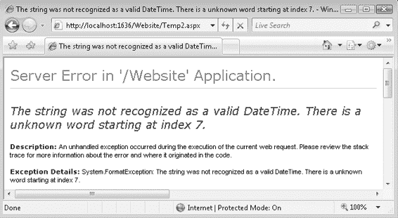
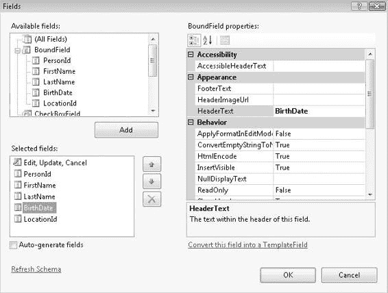

# 数据绑定控件

迄今为止最常用的数据绑定控件是 `GridView` 控件。这是一个非常强大的控件，能够展示数据，并提供丰富的数据控件应有的添加、更新和删除功能。除了这个控件，还有其他几个数据绑定控件，它们提供与 `GridView` 相同的显示和编辑功能，但实现方式不同。让我们首先看看那些其他控件。

#### DetailsView

`DetailsView` 控件一次显示一条记录。与 `GridView` 控件一样，它具有添加、更新和删除功能。它还具备分页功能。相比之下，`GridView` 以表格形式显示数据，因此可以一次查看多条记录。当字段数量多到不适合在表格视图中合理显示时，`DetailsView` 就很有用。

这使得它更适合用于编辑。

让我们将 `DetailsView` 控件与上一章中使用的人员和位置数据结合使用。第一个示例在清单 4-1 中。

**73**

8601Ch04CMP3 8/25/07 1:07 PM Page 74

**74**

第 4 章 ■ 数据绑定控件

**清单 4-1.** `DetailsView` 示例

```xml
<asp:DetailsView ID="DetailsView1" runat="server"
    DataSourceID="ObjectDataSource1" AllowPaging="True"
    AutoGenerateRows="False" DataKeyNames="PersonId">
    <Fields>
        <asp:BoundField DataField="FirstName"
            HeaderText="First Name" SortExpression="FirstName" />
        <asp:BoundField DataField="LastName"
            HeaderText="Last Name" SortExpression="LastName" />
        <asp:BoundField DataField="BirthDate"
            HeaderText="Birth Date" SortExpression="BirthDate"
            DataFormatString="{0:MM/dd/yyyy}" HtmlEncode="False" />
        <asp:BoundField DataField="City"
            HeaderText="City" SortExpression="City" />
        <asp:BoundField DataField="Country"
            HeaderText="Country" SortExpression="Country" />
        <asp:CommandField ShowDeleteButton="True"
            ShowEditButton="True" ShowInsertButton="True" />
    </Fields>
</asp:DetailsView>
```

这里选择的列包括名字、姓氏、出生日期、城市和国家。这些字段中的每一个都是可自动编辑的，并且每条记录都可以被删除。你甚至可以添加一条新记录。通过启用分页，你可以跳转到每一条记录。这完全符合你对这样一个数据编辑控件的期望。在本章剩余部分的高级示例中，我将再次回到 `DetailsView` 控件。

#### FormView

`FormView` 控件乍看起来很像 `DetailsView`，但它没有那么死板。它可能最初是两列布局，但它是一个模板控件，可以完全更改。

你可以选择将名字、姓氏和出生日期列分组在一个块中，将城市和国家列分组在另一个块中。当你查看代码时，你会看到各种模板，包括 `ItemTemplate`（它以只读模式显示数据）；你还会看到所有带有 `Bind` 方法调用的 `Label` 控件，用于从 `DataSource` 填充每个 `Label`。一个示例 `FormView` 如清单 4-2 所示。

**清单 4-2.** `FormView` 示例

```xml
<asp:FormView ID="FormView1" runat="server"
    AllowPaging="True" DataKeyNames="PersonId"
    DataSourceID="ObjectDataSource1">
    <EditItemTemplate>
        PersonId:
        <asp:Label ID="PersonIdLabel1" runat="server"
            Text='<%# Eval("PersonId") %>'></asp:Label><br />
        FirstName:
        <asp:TextBox ID="FirstNameTextBox" runat="server"
            Text='<%# Bind("FirstName") %>'>
        </asp:TextBox><br />
        LastName:
        <asp:TextBox ID="LastNameTextBox" runat="server"
            Text='<%# Bind("LastName") %>'>
        </asp:TextBox><br />
        BirthDate:
        <asp:TextBox ID="BirthDateTextBox" runat="server"
            Text='<%# Bind("BirthDate") %>'>
        </asp:TextBox><br />
        City:
        <asp:TextBox ID="CityTextBox" runat="server"
            Text='<%# Bind("City") %>'>
        </asp:TextBox><br />
        Country:
        <asp:TextBox ID="CountryTextBox" runat="server"
            Text='<%# Bind("Country") %>'>
        </asp:TextBox><br />
        <asp:LinkButton ID="UpdateButton" runat="server"
            CausesValidation="True" CommandName="Update" Text="Update">
        </asp:LinkButton>
    </EditItemTemplate>
</asp:FormView>
```


<asp:LinkButton `ID="UpdateCancelButton"` `runat="server"`
`CausesValidation="False"` `CommandName="Cancel"` `Text="取消"`>
</asp:LinkButton>
</EditItemTemplate>

<InsertItemTemplate>

名字:
<asp:TextBox `ID="FirstNameTextBox"` `runat="server"`
`Text='<%# Bind("FirstName") %>'>
</asp:TextBox><br />

姓氏:
<asp:TextBox `ID="LastNameTextBox"` `runat="server"`
`Text='<%# Bind("LastName") %>'>
</asp:TextBox><br />

出生日期:
<asp:TextBox `ID="BirthDateTextBox"` `runat="server"`
`Text='<%# Bind("BirthDate") %>'>
</asp:TextBox><br />

城市:
<asp:TextBox `ID="CityTextBox"` `runat="server"`
`Text='<%# Bind("City") %>'>
</asp:TextBox><br />

国家:
<asp:TextBox `ID="CountryTextBox"` `runat="server"`
`Text='<%# Bind("Country") %>'>
</asp:TextBox><br />

8601Ch04CMP3 8/25/07 1:07 PM Page 76

**76**

**第 4 章** ■ **数据绑定控件**

<asp:LinkButton `ID="InsertButton"` `runat="server"`
`CausesValidation="True"` `CommandName="Insert"` `Text="插入"`>
</asp:LinkButton>

<asp:LinkButton `ID="InsertCancelButton"` `runat="server"`
`CausesValidation="False"` `CommandName="Cancel"` `Text="取消"`>
</asp:LinkButton>
</InsertItemTemplate>

<ItemTemplate>

名字:
<asp:Label `ID="FirstNameLabel"` `runat="server"`
`Text='<%# Bind("FirstName") %>'`></asp:Label><br /> 姓氏:
<asp:Label `ID="LastNameLabel"` `runat="server"`
`Text='<%# Bind("LastName") %>'`></asp:Label><br /> 出生日期:
<asp:Label `ID="BirthDateLabel"` `runat="server"`
`Text='<%# Bind("BirthDate") %>'`></asp:Label><br /> 城市:
<asp:Label `ID="CityLabel"` `runat="server"`
`Text='<%# Bind("City") %>'`></asp:Label><br /> 国家:
<asp:Label `ID="CountryLabel"` `runat="server"`
`Text='<%# Bind("Country") %>'`></asp:Label><br />

<asp:LinkButton `ID="EditButton"` `runat="server"`
`CausesValidation="False"` `CommandName="Edit"` `Text="编辑"`>
</asp:LinkButton>

<asp:LinkButton `ID="DeleteButton"` `runat="server"`
`CausesValidation="False"` `CommandName="Delete"` `Text="删除"`>
</asp:LinkButton>

<asp:LinkButton `ID="NewButton"` `runat="server"`
`CausesValidation="False"` `CommandName="New"` `Text="新建"`>
</asp:LinkButton>
</ItemTemplate>
</asp:FormView>

`FormView` 的自由格式特性使其能够实现与 `DetailsView` 截然不同的布局，同时仍为你提供添加、编辑和删除数据的相同功能。

#### GridView

现在介绍所有数据绑定控件的元老：`GridView` 控件。无论它列出的是你支票账户的交易记录，还是通讯录中的联系人，这个控件几乎无处不在。虽然它以表格形式列出数据，并允许你添加、编辑和删除记录，但它还允许你对数据进行排序。这使它成为一种强大且便捷的查看数据的方式，让你能以最有用的方式查看数据。清单 4-3 展示了一个 `GridView` 控件的例子。



8601Ch04CMP3 8/25/07 1:07 PM Page 77

**第 4 章** ■ **数据绑定控件**

**77**

**清单 4-3.** `GridView` 示例

```
<asp:GridView ID="GridView1" runat="server" AllowPaging="True" AllowSorting="True"
    AutoGenerateColumns="False" DataKeyNames="PersonId"
    DataSourceID="ObjectDataSource1">
    <Columns>
        <asp:BoundField DataField="FirstName"
            HeaderText="名字" SortExpression="FirstName" />
        <asp:BoundField DataField="LastName"
            HeaderText="姓氏" SortExpression="LastName" />
        <asp:BoundField DataField="City"
            HeaderText="城市" SortExpression="City" />
        <asp:BoundField DataField="BirthDate"
            HeaderText="出生日期" HtmlEncode="False"
            SortExpression="BirthDate" />
        <asp:BoundField DataField="Country"
            HeaderText="国家" SortExpression="Country" />
        <asp:CommandField ShowDeleteButton="True" ShowEditButton="True" />
    </Columns>
</asp:GridView>
```

`GridView` 和 `DetailsView` 所使用的 `BoundField` 的编辑功能相当有限。对于字符串以及日期字段，将使用 `TextBox` 控件进行编辑。对于像 `City` 和 `Country` 这样的字段，它将允许输入任何值。如果能使用识别数据类型的编辑器，将是一个改进。这个缺点将在下一节中解决。

#### 编辑与验证字段


虽然前面的控件确实允许你修改它们显示的数据，但它们并未为各种数据类型提供强大的智能功能。例如，日期编辑功能会让你使用常规的 `TextBox` 控件来编辑日期。输入一个非日期格式的字符串将导致回发事件抛出异常，如图 4-1 所示。

**图 4-1.** 保存日期值时出现的 FormatException



## 第 4 章 - 数据绑定控件

你甚至可能输入一个看起来像有效日期的值，例如 6 月 31 日，但 6 月没有 31 日，因此也会失败。最佳做法是防止该错误发生并避免异常。为此，可以用 `TemplateField` 替换 `BoundField`。这可以通过在 `GridView` 的**智能标记**上点击**编辑列**链接（如图 4-2 所示）打开的**字段**面板中，将 `BoundField` 转换为 `TemplateField` 来实现。

**图 4-2.** 字段编辑器

一旦你拥有了 `TemplateField`，它将以用于只读模式的 `Label` 和用于编辑模式的 `TextBox` 开始，并分别放置在 `ItemTemplate` 和 `EditTemplate` 中。一个示例如清单 4-4 所示。

**清单 4-4.** 包含 TemplateField 的 GridView

```asp
<asp:GridView ID="GridView1" runat="server"
    AllowPaging="True" AllowSorting="True"
    AutoGenerateColumns="False" DataKeyNames="PersonId"
    DataSourceID="ObjectDataSource1">
    <Columns>
        <asp:BoundField DataField="FirstName"
            HeaderText="First Name" SortExpression="FirstName" />
        <asp:BoundField DataField="LastName"
            HeaderText="Last Name" SortExpression="LastName" />
        <asp:BoundField DataField="City" HeaderText="City" SortExpression="City" />
        <asp:TemplateField HeaderText="Birth Date" SortExpression="BirthDate">
            <EditItemTemplate>
                <asp:TextBox ID="TextBox1" runat="server"
                    Text='<%# Bind("BirthDate") %>'></asp:TextBox>
            </EditItemTemplate>
            <ItemTemplate>
                <asp:Label ID="Label1" runat="server"
                    Text='<%# Bind("BirthDate") %>'></asp:Label>
            </ItemTemplate>
        </asp:TemplateField>
        <asp:BoundField DataField="Country"
            HeaderText="Country" SortExpression="Country" />
        <asp:CommandField ShowDeleteButton="True" ShowEditButton="True" />
    </Columns>
</asp:GridView>
```

新的 `TemplateField` 最初并未阻止无效日期的问题，但它将允许你添加验证控件来检查该值。可以在 `GridView` 上方放置一个 `ValidationSummary` 控件，以显示任何指示无效值的验证器的 `ErrorMessage` 属性，但这必须在每个编辑日期的地方重复设置。它也使得 `GridView` 的定义相当臃肿。因此，你将创建一个名为 `DateEditor` 的简单用户控件。该用户控件将由一个 `TextBox` 以及一个 `CustomValidator` 和一个 `RegularExpressionValidator` 组成。`DateEditor` 如清单 4-5 所示。

**清单 4-5.** DateEditor

```asp
<%@ Control Language="C#" AutoEventWireup="true"
    CodeFile="DateEditor.ascx.cs" Inherits="DateEditor" %>
<asp:TextBox ID="TextBox1" runat="server"></asp:TextBox>
<asp:CustomValidator ID="cvDate" runat="server"
    ControlToValidate="TextBox1" Display="Dynamic"
    EnableClientScript="False" ErrorMessage="Date is invalid"
    OnServerValidate="cvDate_ServerValidate">
</asp:CustomValidator>
<asp:RegularExpressionValidator ID="revDate" runat="server"
    ControlToValidate="TextBox1"
    Display="Dynamic" ErrorMessage="Date format is invalid. [MM/dd/yyyy]"
    ValidationExpression="^\d\d*\/\d\d*\/\d\d\d\d$">
</asp:RegularExpressionValidator>
```

在后台代码中，你为 `CustomValidator` 添加了一些辅助代码，以验证该值是否确实是一个有效日期，并通过一个属性使该值可用于将要包含 `DateEditor` 的 `TemplateField`（参见清单 4-6）。

**清单 4-6.** DateEditor 后台代码

```csharp
using System;
using System.Web.UI;
using System.Web.UI.WebControls;

public partial class DateEditor : UserControl
{
    protected void Page_Load(object sender, EventArgs e)
    {
    }
}
```


## 第 4 章 ■ 数据绑定控件

```csharp
public DateTime Date
{
    get
    {
        DateTime tmpDate = DateTime.MinValue;
        DateTime.TryParse(TextBox1.Text, out tmpDate);
        return tmpDate;
    }
    set
    {
        TextBox1.Text = value.ToString("MM/dd/yyyy");
    }
}

protected void cvDate_ServerValidate(object source,
    ServerValidateEventArgs args)
{
    DateTime tmpDate;
    if (!DateTime.TryParse(TextBox1.Text, out tmpDate))
    {
        args.IsValid = false;
        return;
    }

    // 这些是数据库约束
    DateTime minDate = new DateTime(1753, 1, 1);
    DateTime maxDate = new DateTime(9999, 12, 31);
    if (tmpDate < minDate || tmpDate > maxDate)
    {
        args.IsValid = false;
        return;
    }
}
```

代码隐藏文件仔细检查`TextBox`的值，以确保永远不会返回无效值。在`CustomValidator`的`ServerValidate`事件处理程序中，它使用`DateTime`对象的`TryParse`方法来检查`TextBox`的`Text`属性是否不仅看起来像日期，而且确实是一个有效的日期。它不会允许 6 月 31 日通过。然后，在`Date`属性中，会执行相同的检查，以防止无效日期通过。回到`GridView`中，`DateEditor`被放置在`EditTemplate`中，其`Date`属性绑定到`出生日期`字段（见清单 4-7）。

`清单 4-7.` `DateEditor`

```xml
<EditItemTemplate>
    <chpt04:DateEditor ID="DateEditor1" runat="server"
        Date='<%# Bind("BirthDate") %>' />
</EditItemTemplate>
```

现在，当输入无效日期时，会显示一个有用的错误提示，而不是抛出异常。

更好的是，`DateEditor`可以在整个网站中的任何地方使用，因此所有地方都使用了一致的验证检查，这将带来更好的界面和更少的工作量。

#### 绑定输入参数

数据源可以配置输入参数，以便以多种方式筛选数据。输入参数可以来自`TextBox`或`DropDownList`等控件，也可以来自查询字符串值。配置`ObjectDataSource`和`SqlDataSource`的向导将检测数据源何时需要输入参数，并呈现这些选项。你可以绑定这些参数，也可以选择以编程方式处理它们。

### 通过控件绑定输入参数

使用输入参数的最简单示例是将它们绑定到`TextBox`或`DropDownList`等控件。使用示例数据库时，你将首先将姓氏列表绑定到`DropDownList`。然后，`GridView`将获取`DropDownList`的`SelectedValue`，并获取所有姓氏匹配的人员。此示例可以在不编写任何代码隐藏文件代码的情况下完成。这只是拖放控件的问题。清单 4-8 显示了代码。

`清单 4-8.` `InputParameterExample.aspx`

```xml
<b>选择姓氏: </b>
<asp:DropDownList ID="DropDownList1" runat="server" AutoPostBack="True"
    DataSourceID="ObjectDataSource1" DataTextField="LastName">
</asp:DropDownList>

<asp:ObjectDataSource ID="ObjectDataSource1" runat="server"
    OldValuesParameterFormatString="original_{0}"
    SelectMethod="GetLastNames" TypeName="Chapter04.PersonDomain">
</asp:ObjectDataSource>

<asp:GridView ID="GridView1" runat="server" AllowPaging="True"
    AllowSorting="True" DataSourceID="ObjectDataSource2">
</asp:GridView>

<asp:ObjectDataSource ID="ObjectDataSource2" runat="server"
    OldValuesParameterFormatString="original_{0}"
    SelectMethod="GetPeopleByLastName"
    TypeName="Chapter04.PersonDomain">
    <SelectParameters>
        <asp:ControlParameter ControlID="DropDownList1"
            Name="lastName" PropertyName="SelectedValue"
            Type="String" />
    </SelectParameters>
</asp:ObjectDataSource>
```

重要的部分在接近底部的`SelectParameters`，它定义了`ControlParameter`来自`DropDownList1`，并设置了`lastName`输入参数。

### 以编程方式绑定输入参数


有时你无法直接从某个控件获取值。可能是因为数据源尚未绑定到该控件，或者在将值设置为输入参数前需要仔细验证以避免异常。在这些情况下，你可以暂时不定义 `ControlParameter`，而只保留 `Name` 和 `Type` 属性，让输入参数保持未定义状态。`ObjectDataSource` 有一个名为 `Selecting` 的事件，你可以在该事件中通过编程方式设置输入参数。清单 4-9 展示了一个声明输入参数的示例。

### 清单 4-9. `InputParameterExample2.aspx`

```xml
<b>选择姓氏: </b>
<asp:DropDownList ID="DropDownList1" runat="server" AutoPostBack="True"
    DataSourceID="ObjectDataSource1" DataTextField="LastName">
</asp:DropDownList>
<asp:GridView ID="GridView1" runat="server" AllowPaging="True"
    AllowSorting="True" DataSourceID="ObjectDataSource2">
</asp:GridView>
<asp:ObjectDataSource ID="ObjectDataSource1" runat="server"
    OldValuesParameterFormatString="original_{0}"
    SelectMethod="GetLastNames"
    TypeName="Chapter04.PersonDomain">
</asp:ObjectDataSource>
<asp:ObjectDataSource ID="ObjectDataSource2" runat="server"
    OldValuesParameterFormatString="original_{0}"
    SelectMethod="GetPeopleByLastName"
    TypeName="Chapter04.PersonDomain"
    OnSelecting="ObjectDataSource2_Selecting">
    <SelectParameters>
        <asp:Parameter Name="lastName" Type="String" />
    </SelectParameters>
</asp:ObjectDataSource>
```

注意，这里指定了 `OnSelecting` 事件处理程序，并且 `SelectParameters` 中定义的 `lastName` 参数没有与任何控件关联。该参数的值是在后台代码文件中设置的。清单 4-10 展示了 `Selecting` 事件的一个事件处理程序。

### 清单 4-10. Selecting 事件处理程序

```csharp
protected void ObjectDataSource2_Selecting(object sender, ObjectDataSourceSelectingEventArgs e)
{
    e.InputParameters["lastName"] = DropDownList1.SelectedValue;
}
```

如果这个输入参数需要的是日期，且值来自一个 `TextBox`，你可以检查该值以确保它确实是一个有效的日期，并且只在值有效时才设置输入参数。输入参数也可能是一个更复杂的类型，比如业务对象，你可以在 `Selecting` 事件处理程序中构造它。这个简单的处理程序为你提供了多种选择。

##### 绑定用户控件

我经常看到一些非常庞大的页面，模板部分堆砌了大量标记，后台代码也很多，因为页面没有被分解成用户控件。用户控件只是页面的一个片段，当用于封装页面的某一部分时非常有用。它不仅能隔离一部分标记，还能隔离事件和行为。用户控件可以在一个页面上多次使用，也可以跨多个页面使用。这是实现网站代码重用的绝佳方式。

初次尝试绑定到用户控件时可能会有些棘手。是应该尝试从查询字符串读取值，还是以某种方式遍历控件层次结构来找到定义输入参数所需控件以执行其 `DataBind` 函数？处理这个问题的最佳方式是像对待其他控件（如 `TextBox`）一样对待用户控件，直接在用户控件上设置属性。首先，你需要一个用户控件，如清单 4-11 所示。

### 清单 4-11. `PersonListingControl.ascx`

```xml
<%@ Control Language="C#" AutoEventWireup="true"
    CodeFile="PersonListingControl.ascx.cs"
    Inherits="Controls_PersonListingControl" %>
<asp:GridView ID="GridView1" runat="server" AllowPaging="True"
    AllowSorting="True" DataSourceID="ObjectDataSource1">
</asp:GridView>
<asp:ObjectDataSource ID="ObjectDataSource1" runat="server"
    OldValuesParameterFormatString="original_{0}"
    SelectMethod="GetPeopleByLastName"
    TypeName="Chapter04.PersonDomain"
    OnSelecting="ObjectDataSource1_Selecting">
    <SelectParameters>
        <asp:Parameter Name="lastName" Type="String" />
    </SelectParameters>
</asp:ObjectDataSource>
```

这个例子包含了像前面例子中一样的 `GridView`，但它被放在一个用户控件中。它还有一个 `ObjectDataSource`，其中定义了一个 `lastName` 输入参数，并指定了 `Selecting` 事件处理程序。父页面需要传递 `lastName` 参数的值，你将通过属性声明来实现（参见清单 4-12）。

### 清单 4-12. `PersonListing.aspx.cs` 后台代码

```csharp
protected void ObjectDataSource1_Selecting(
    object sender, ObjectDataSourceSelectingEventArgs e)
{
    e.InputParameters["lastName"] = LastName;
}

private string _lastName = String.Empty;
public string LastName
{
    get
    {
        return _lastName;
    }
    set
    {
        _lastName = value;
        ObjectDataSource1.DataBind();
    }
}
```

`LastName` 属性保存了在 `Selecting` 事件处理程序中使用的值。并且当 `LastName` 属性被设置时，你可以看到它调用了 `ObjectDataSource1` 的 `DataBind` 方法，立即将数据绑定到 `GridView`。如果不调用 `DataBind`，`GridView` 可能根本不会被绑定，因为它不会像 `ObjectDataSource` 配置了控件属性那样自动触发绑定。在设置值时立即调用它是合理的，但也可以在用户控件的 `PreRender` 事件中调用，甚至让包含此控件的页面调用用户控件上的 `DataBind` 方法。一旦值已知就立即绑定数据，可以确保数据总是被绑定。

当有多个属性用于设置多个输入参数时，最好将数据绑定推迟到稍后的事件（如 `PreRender` 事件），以便在 `Selecting` 事件运行之前设置好所有属性。

#### 嵌入数据绑定控件

对于更复杂的数据层次结构，你可能会希望将一个用户控件嵌入到另一个用户控件中，就像前面的例子将用户控件嵌入到页面并通过属性传递值来绑定数据一样。也许你正在显示一个报告，并且每个部分都有相关的子部分。创建一个用户控件来代表主部分，其中包含另一个代表子部分的用户控件，是将代码分解为负责各自数据绑定的独立片段的绝佳方式。

示例数据库有一个 `Location` 表，包含 `City` 和 `Country` 列。你将把一个国家列表绑定到一个 `Repeater` 控件，该控件使用 `Label` 控件显示国家，然后将国家传递给一个用户控件以显示该国家的城市列表。你只需要设计这些用户控件，并将它们连接起来，以正确的顺序设置属性并触发数据绑定。

第一个用户控件，如清单 4-13 所示，生成一个带项目符号的国家列表。

### 清单 4-13. `CountryListingControl.ascx`

```xml
<%@ Control Language="C#" AutoEventWireup="true"
    CodeFile="CountryListingControl.ascx.cs"
    Inherits="Controls_CountryListingControl" %>
<%@ Register Src="CityListingControl.ascx"
    TagName="CityListingControl" TagPrefix="uc1" %>
<asp:Repeater ID="Repeater1" runat="server"
    DataSourceID="ObjectDataSource1">
    <HeaderTemplate>
        <ul>
    </HeaderTemplate>
    <ItemTemplate>
        <li>
            <asp:Label ID="Label1" runat="server"
                Text='<%# Bind("Country") %>'></asp:Label>
            <uc1:CityListingControl ID="CityListingControl1"
                runat="server" Country='<%# Bind("Country") %>' />
        </li>
    </ItemTemplate>
    <FooterTemplate>
        </ul>
    </FooterTemplate>
</asp:Repeater>
<asp:ObjectDataSource ID="ObjectDataSource1" runat="server"
    OldValuesParameterFormatString="original_{0}"
    SelectMethod="GetAllCountries"
```


