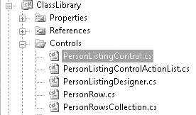

# 第四章 ■ 数据绑定控件

当你深入研究此控件的代码时，将开始看到通过使用抽象类，控件所能利用的所有功能。就在几年前，创建控件还相当困难。在 ASP.NET 2.0 中，随着 `CompositeControl` 和 `CompositeDataBoundControl` 的出现，这变得容易多了，标准 ASP.NET 控件正是构建于这些基类之上。你也可以使用这些基类，它们自动为你提供丰富的**设计时支持**以及广泛的运行时功能。

这两个基类都包含一个名为 `CreateChildControls` 的方法，该方法不接受任何参数且不返回任何内容。控件层次结构在此方法中创建，它是事件生命周期的一部分被自动调用。在 `CompositeControl` 中，你可以覆盖此方法的行为，但在 `CompositeDataBoundControl` 中，此方法已经实现。取而代之的是一个同名的抽象方法，它接受几个参数并具有一个结果类型。因为它是抽象方法，所以必须在派生类中实现。该方法的签名示例如清单 4-21 所示。

### 清单 4-21. `CompositeDataBoundControl` 的 `CreateChildControls`
```
protected override int CreateChildControls(IEnumerable dataSource, bool dataBinding)
{
    // 代码
}
```

`CreateChildControls` 方法是数据绑定控件的核心。整个控件通过初始化控件并将其添加到 `Controls` 集合中来创建。`Controls` 属性是此集合的访问器。当 `dataBinding` 参数为 true 时，`dataSource` 值应持有可在创建控件集合时进行枚举的数据，这些控件将被添加到 `Controls` 集合。

这可能会让你疑惑为何 `dataBinding` 参数有时会为 false。你可能还会问为什么它返回一个整数。当发生回发时，必须将 `ViewState` 应用于控件首次创建时构建的控件层次结构。这意味着必须具有相同的行数，但因为此时你无法访问实际数据，所以必须创建与 `ViewState` 中数据相匹配的先前层次结构的骨架。`Controls` 集合中的项数必须与之前的项数相同，`ViewState` 才能成功应用。


对于`PersonListingControl`控件，这些项目是`PersonRow`控件的实例。这等同于一个`GridViewRow`。从`IEnumerable`值中提取的每个项目都通过构造函数传递给`PersonRow`，并被添加到`Controls`集合中。随后，`PersonRow`负责绘制该单独的行。

在可下载的示例代码中，你会找到一些提供设计时支持的附加类。包含这些类的类库如图 4-3 所示。



### 第 4 章：数据绑定控件

我们暂时跳过`PersonRow`，先来看`CreateChildControls`方法的实现。当控件为初始页面请求创建时，它会调用`CreateChildControls`方法，此时`dataBinding`参数设置为`true`，并为数据提供了定义值。你可以遍历这些数据，创建`PersonRow`实例，并将它们添加到`Controls`集合中。

在回发过程中，在应用`ViewState`之前，必须调用`CreateChildControls`方法，此时`dataBinding`参数设置为`false`，`dataSource`参数设置为`null`值。并且，必须以某种方式知道在前一次控件呈现中创建的项目数量，以便重新创建正确数量的项目。

清单 4-22 展示了完整实现。

**清单 4-22.** `CreateChildControls` 实现
```csharp
protected override int CreateChildControls(
    IEnumerable dataSource, bool dataBinding)
{
    Controls.Clear();
    int count = 0;

    if (dataBinding && dataSource != null)
    {
        IEnumerator e = dataSource.GetEnumerator();
        while (e.MoveNext())
        {
            object datarow = e.Current;
            PersonRow row = new PersonRow(count, datarow);
            Rows.Add(row);
            Controls.Add(row);
            count++;
        }
        _itemCount = count;
    }
    else
    {
        if (_itemCount > 0)
        {
            for (count = 0; count < _itemCount; count++)
            {
                PersonRow row = new PersonRow(count, null);
                Rows.Add(row);
                Controls.Add(row);
            }
        }
    }

    CreatePagerControls();
    AttachStyle();
    ClearChildViewState();
    ChildControlsCreated = true;
    return count;
}
```

当有可用数据时，第一段代码会遍历枚举器，创建`PersonRow`实例，将它们添加到`Rows`和`Controls`集合中，并增加`count`计数。当没有数据时，则使用成员变量`_itemCount`来确保将正确数量的空项目添加到`Controls`集合中。如你所见，向`PersonRow`构造函数传递了一个`null`值。最后，在代码的最末尾，两个执行分支中都递增过的`count`变量被用作返回值。

##### 获取数据

为了获取传递到`CreateChildControls`中的数据，数据绑定控件将触发`PerformSelect`方法。`CompositeDataBoundControl`的实现细节负责在需要时调用此方法，因此你无需在自己的代码中显式调用它。正是这个方法在请求数据前后引发了`OnDataBinding`和`OnDataBound`事件。

数据表示为`DataSourceView`，这可以是手动绑定到控件的数据源，也可以是通过`DataSourceID`属性定义的数据源。无论如何，你都可以使用内置的`GetData`方法获取它的一个实例，如清单 4-23 所示。

**清单 4-23.** `GetData` 方法
```csharp
DataSourceView dataSourceView = GetData();
```

这个视图有一个名为`Select`的方法，它接受两个参数：`DataSourceSelectArguments`和`DataSourceViewSelectCallback`，用于向视图提供检索数据时将使用的附加详细信息。对于配置了`DataObject`和`DataObjectMethod`并启用了分页的`ObjectDataSource`，必须定义`StartRowIndex`和`MaximumRows`。

这些值作为参数传递给`DataObjectMethod`。如清单 4-24 所示。


